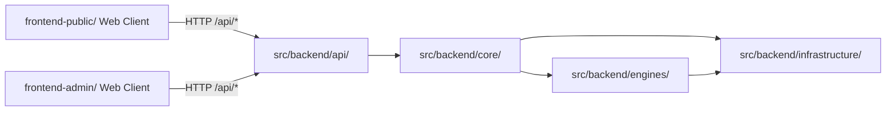

# 前端架构

本仓库的前端由两个独立的 npm 包组成，分别服务不同场景。本文档是前端架构的**索引页**，不描述任何单个前端的内部细节——各前端的内部架构见其目录下的 README。

## 两个前端

| 前端 | 目录 | 技术栈 | 场景 |
|---|---|---|---|
| 管理终端 | `frontend-public/`（详见其目录下 README） | Next.js 16 App Router + React 19 + Tailwind v4 + shadcn/ui | Agent Runner 管理终端（静态导出产物随 wheel 分发，`iar console` 托管） |
| 管理平台 | `frontend-admin/`（详见其目录下 README） | Vite + React 19 + TanStack Router + Zustand + shadcn/admin | admin 域登录与后台管理骨架 |

两个前端互不依赖，与后端仅通过 `/api/*` HTTP 接口通信。包管理器为 pnpm，仓根 `pnpm-workspace.yaml` 声明两个 workspace，**lockfile 与 `node_modules` 统一由仓根管理**：锁文件只有 `pnpm-lock.yaml` 一份，依赖装到仓根 `.pnpm` 虚拟 store，子目录只保留指过去的软链。

> 历史：`frontend-public/` 与 `frontend-admin/` 曾各自保留一份 `pnpm-workspace.yaml` + `pnpm-lock.yaml`，等于让同一份 `package.json` 被两个锁文件独立解析——实测两者对 `@base-ui/react`、`@xyflow/react`、`eslint-config-next`、`prettier-plugin-tailwindcss` 的 peer 解析结果已经分叉，且子目录被识别为独立 workspace 会让 pnpm 与 Turbopack 各自认定不同的根目录。这两对文件已删除，装依赖只在仓根执行（`pnpm install --frozen-lockfile`）。

## 与后端四层的边界

这表示：

- 前端只依赖后端暴露的接口契约，不依赖后端 Python 模块。
- 后端内部如何在 `src/backend/api/`、`src/backend/core/`、`src/backend/engines/`、`src/backend/infrastructure/` 之间拆分，对前端来说应是透明的。
- 各前端内部的路由图、状态图和组件边界约束，见对应目录的 README，不再在本文档展开。

## 历史说明

本仓库曾有一个单一的 `frontend/` 目录（Vite + Refine + react-router + npm）。它已通过 strangler 迁移被 `frontend-public/` 吸收（7 个 agent-runner 页面 + 5 个组件 + API 客户端）并在收尾阶段删除。迁移细节见 `tasks/archive/P1-FEAT-20260702-140755-frontend-template-migration.md`。
