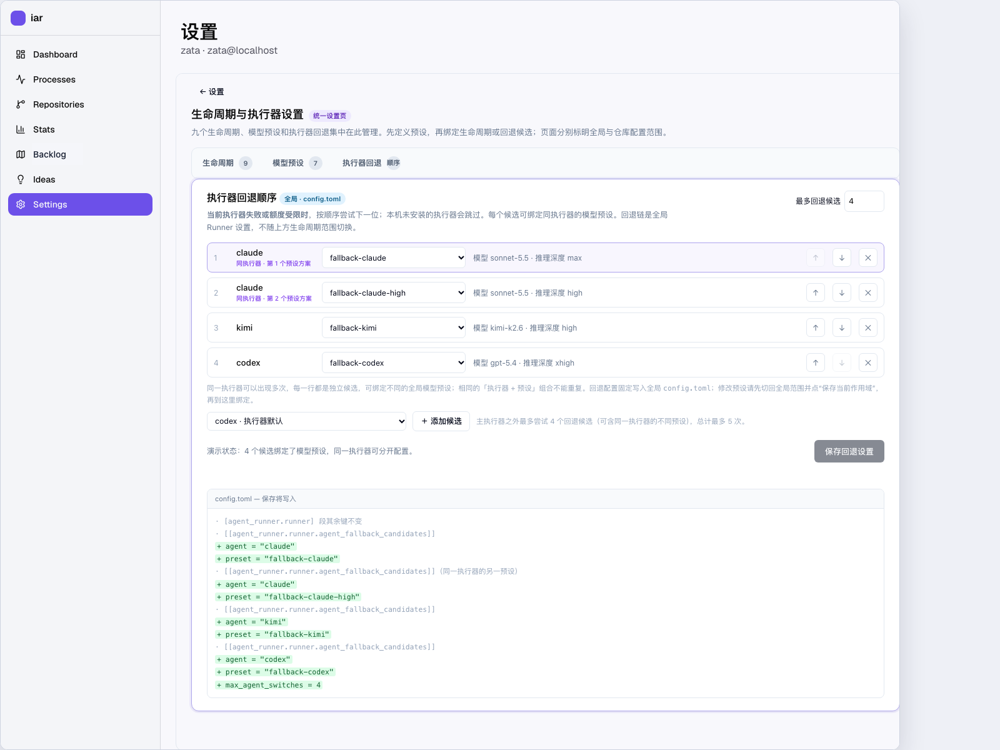

# 生命周期与执行器设置 · 交互原型说明

本页先前归档 `tasks/pending/P1-FEAT-20260918-110027-lifecycle-agent-matrix.md` 的交互原型，2026-10-09 更新为统一生命周期与执行器设置页（v3.1）。Settings 中旧的 Agent-only 生命周期矩阵已替换为统一设置页入口；Backlog 仓库齿轮进入同一页面并预选仓库。新页面集中展示九阶段 Agent、命名预设、模型 ID、推理深度、来源和执行器回退顺序。回退队列把每一行作为独立候选，同一个执行器可用不同预设出现多次；完全相同的「执行器 + 预设」组合不能重复。该配置结构与预算语义是新增设计提案，等待 PRD 人审确认。布局调整为四列生命周期矩阵、双列预设卡片和页面内区块导航，避免字段过密及区块位置难找。Backlog 为现行产品名称；仓库底图文件沿用历史名 `roadmap-real.png`，截图内的旧侧栏标签由原型覆盖层改为 Backlog。

## 打开方式

[打开交互原型](lifecycle-agent-matrix.html)（纯静态单文件，无构建步骤；也可从 [原型目录](hub.html) 进入）。[查看 Settings 统一入口](assets/lifecycle-agent-matrix/preview-settings.png)、[查看生命周期矩阵](assets/lifecycle-agent-matrix/preview-lifecycle-settings.png)和[查看执行器回退设置](assets/lifecycle-agent-matrix/preview-fallback-settings.png)。可用 [`?screen=lifecycle-settings&demo=fallback-preset`](lifecycle-agent-matrix.html?screen=lifecycle-settings&demo=fallback-preset) 直达统一设置页；Settings、Backlog 和 PRD 画面左侧 Stats 入口会打开[生命周期统计原型](prd-lifecycle-observability.html#stats)。

## 三层落点（本原型要评审的核心结论）

| 层 | 配置文件 | 界面落点 | 原型里的画面 |
|---|---|---|---|
| 全局（机器级） | `config.toml`：agent 注册块标签、`[agent_runner.lifecycle_agents]`、`[agent_runner.runner]` | Settings 的 Agent 管理区保留标签与统一设置入口；生命周期和执行器回退在同一页配置 | 视图一、统一设置页 |
| 仓库级 | 该仓库 `.kedacode.toml` 的 `[agent_runner.lifecycle_agents]` | 统一生命周期页的范围选择器；Backlog 仓库行 ⚙ 进入同一页并预选仓库 | 统一设置页 |
| PRD 级 | PRD 文件头部 `- lifecycle_agents:` bullet 块 | PRD 原文页工具栏「Agent 覆盖」 | 视图三（抽屉） |

仓库配置仍写入仓库自己的 `.kedacode.toml`。生命周期与执行器设置都在统一设置页编辑；Settings 移除旧矩阵和独立回退卡片，Backlog 仓库齿轮作为预选范围的快捷入口。

## 统一设置页：生命周期与执行器回退

从 Settings 的「生命周期与执行器设置」卡片点击「打开统一设置」进入；也可点 Backlog 仓库行齿轮直接进入并预选该仓库。原型可用 `?screen=lifecycle-settings` 直接打开该状态。

- 顶部范围切换为「全局 · config.toml」或「仓库 · .kedacode.toml」；仓库范围额外选择目标仓库，并显示该仓库继承的全局配置。
- 页首区块导航可直接跳到「生命周期」「模型预设」和「执行器回退」。范围切换器单独成条，显示配置文件与继承规则。
- 九阶段按三个真实触发入口分组；矩阵用四列展示生命周期/触发时机、阶段预设、当前执行器与模型参数、配置来源。字号和行高适度放大；未指定模型/推理深度时明确显示 Agent 默认值。
- 阶段预设下拉支持全局绑定/不绑定，以及仓库继承/覆盖；`fix` / `closeout` 未单独绑定时展示继承实现阶段预设的结果。
- 同一页的预设区使用双列卡片，可新建预设并编辑 Agent、模型 ID、推理深度。仓库范围可以覆盖全局预设定义；编辑 inherited preset 时只形成仓库层覆盖。
- 预设卡片列出当前绑定的生命周期；编辑共享预设前能看到会受影响的阶段。若只想更改单个阶段，可以新建预设再单独绑定。
- 模型预设区先通过「保存当前作用域」保存；其下是执行器回退顺序卡片，可调整候选顺序、最多尝试的候选数，并把全局模型预设绑定到匹配的候选。同一执行器可出现多次，每一行有独立预设；相同的「执行器 + 预设」组合只能出现一次。卡片标注回退配置写入全局 `config.toml`；在仓库范围下修改回退模型时，先切回全局保存预设，再绑定并保存回退设置。
- 「恢复继承」清除该仓库阶段的 Agent 与预设绑定；全局阶段可清除此阶段显式配置。保存只展示当前作用域的 TOML 写入预览，不写本地文件。
- 页面是交互原型；预设值是演示数据。真实 config loading、保存、CLI 命令及 API 合约尚未在本原型实现。

## Settings：Agent 标签与统一设置入口

Settings 页在真实的「设置」标题与用户副标题下方显示「Agent 管理」区块。此处只保留 Agent 标签编辑和通往统一设置页的入口；旧的 Agent-only 生命周期矩阵和单独的执行器回退卡片已移除。入口卡片标题为「生命周期与执行器设置」，点击进入唯一设置页。页面滚动时 Agent 管理区块标题保持可见。

- 「Agent 标签设置」说明 `auto` 的判定依据是 Issue 上的 agent 标签，并注明工作流标签（`agent/ready` 等，来自 `[agent_runner.labels]`）不在本表范围。
- 校验：标签名不能为空，也不能两个 agent 使用同一个标签；非法时该行标红并阻断保存。演示按钮「两个 agent 用同一标签」把 kimi 的标签改成另一个 agent 正在用的值。
- 统一设置入口说明生命周期矩阵、模型预设和执行器回退都在同一页维护；Settings 不再单独呈现执行器回退卡片。
- Agent 标签和执行器回退保存到 `config.toml`；生命周期设置按当前范围保存到 `config.toml` 或仓库 `.kedacode.toml`。回退只使用全局模型预设；预览说明段内其余字段/键保持不变。
- 改过的行/字段高亮；保存后基线更新，界面回到“与 config.toml 一致”。

## 原型形式：真实截图 + HTML 覆盖层（hybrid）

- **底图是真实 frontend-public 截图**，三张同尺寸（1440×1200 @2x）：Settings 页、Backlog 依赖图、PRD 原文页。采集方式见各图的 `*.source.md` 旁车与 `tests/playwright-e2e/tests/workflows/prototype-screenshots.spec.ts`。Backlog 底图是 2026-09-18 的历史截图，侧栏仍显示旧名称；现行路由与文案统一使用 Backlog。其余底图像素保持真实页面截图，不用图片生成模型伪造产品界面。
- **覆盖层只绘制本原型调整的区域**：Settings 页的 Agent 标签区与统一设置入口；统一设置页的生命周期矩阵、模型预设和执行器回退卡片；Backlog 仓库行齿轮和 PRD 工具栏入口。旧生命周期矩阵与仓库矩阵抽屉不再展示。其余像素全部来自真实产品。
- **画布固定 1440×1200 并按视口宽度等比缩放**，热点与覆盖层使用固定像素坐标（在真实页面上用 `getBoundingClientRect()` 实测），因此不会随视口漂移。
- **视图切换走真实侧栏导航**（截图上的 Settings / Backlog 行），没有额外的原型标签栏，避免出现真实产品里不存在的页面结构。
- 新增区域统一带「本原型新增」标注；设计令牌（oklch 主题变量、shadcn Button/Card 类）取自 `frontend-public/app/globals.css` 与 `frontend-public/components/ui/*.tsx`。

## 下拉语义（三层共用）

- 矩阵按**触发入口分组**呈现（2026-09-28 起）：九行分成「实现流水线」（实现/修复/收尾/校验/审核/监督）、「讨论与内容生成」（辩论/内容生成）、「独立入口」（决策）三组，组标题 + 一行组说明插在段首，每行生命周期名下再带一行触发时机；分组事实的唯一来源是后端 `LIFECYCLE_AGENT_ENTRY_GROUPS`，三层共用同一分组。分组只是呈现：下拉取值、来源列、写回载荷与分组前完全一致。PRD 覆盖抽屉沿用同一分组，但**不含决策行**（planner 没有 PRD 消费点，与真实 UI 一致不下发）。**副本同步**：本目录的自包含原型不能 import 后端常量，`lifecycle-agent-matrix.html` 里的 `ENTRY_GROUPS` 是 core 常量的副本，且 `docs/` 不在"单一份键→组映射"的 `rg` 门禁范围内——但漂移不会漏过去：这份副本连同 `tests/playwright-e2e/tests/workflows/lifecycle-agent-matrix.spec.ts` 里的同名副本，由守卫测试 `tests/guards/test_lifecycle_entry_group_copies.py` 逐组比对组顺序 / 组 id / 组名 / 组内键序 / 组说明，改动 core 分组常量而忘了同步会直接 CI 转红。
- 下拉里**只有真实取值**：已注册 agent（codex / claude / kimi / pi / codebuddy / qoder / opencode）、该阶段的 `auto`、fix 与 closeout 的 `跟随实现（executor）`。没有"未设置""跟随全局"之类的伪选项。
- **`auto` 的文案按阶段如实描述**（各阶段语义本来就不同，见下表）；没有实现 `auto` 的阶段（决策 / 内容生成）不给这个选项。
- 下拉中**选中的就是当前生效值**，即优先级链上第一个被声明的值（本层声明 > 上一层声明 > 既有配置键 / 内置默认）；`executor` 不做二次解析，只在下方补一行"当前实现阶段：claude"。
- 右侧「当前值来源」列说明这个值来自哪一层（本机 `config.toml` / 本仓库 `.kedacode.toml` / 既有配置键 / 内置默认），并在本层已显式设置时给出「不写本键（跟随既有配置）」或「跟随全局（删除本键）」的恢复入口。
- **只有改动过的行会写进本层文件**：没动的行不在该层声明，继续沿回退链走；把下拉改回与继承值相同的取值，也会被视为"未改动"。保存预览逐行列明"写入 / 不写入并沿用谁"。
- 这样三层的关系是"越靠近 PRD 越优先"，而"继承"是**不动它**的默认状态，不需要在取值域里造一个假值。

| 阶段 | `auto` 的真实含义 | 代码落点 |
|---|---|---|
| 实现 | 按 Issue 上挂的 `agent/*` 标签路由 | `choose_agent`（`run_agent_once.py`） |
| 校验 | 从 `runner.agent_fallback_order` 里挑第一个 ≠ 实现者的 agent（独立性靠换模型） | `run_verifier_agent.py` 的 `_choose_verifier_agent` |
| 审核 | `allow_same_agent` 为真时沿用实现者；否则从注册表取第一个 ≠ 实现者的 | `run_agent_once.py` 的 `resolve_reviewer_agent` |
| 监督 | 发布路径沿用本次实现者；`kc review` 路径按标签路由 | `run_agent_once.py` 的 `resolve_supervisor_agent` |
| 辩论 | 按 `agent/deliberate` 标签路由 | 辩论队列 |
| 修复 / 收尾 / 决策 / 内容生成 | 无 `auto` 语义，不给该选项 | — |

## 执行器回退顺序（统一设置页内的配置卡片）

统一设置页先配置各生命周期的主 Agent 与模型预设，再配置**执行器失败或额度受限时依次尝试的有序候选**。候选身份是「执行器 + 可选预设」，而不是只有执行器名；因此同一个执行器可用不同模型预设重试。完全相同的执行器与预设组合重复时拒绝保存。

- 现有 `[agent_runner.runner]` 的 `agent_fallback_order` 默认 `["claude", "kimi", "codex"]`，`max_agent_switches` 默认 `2`。新设计增加有序 `agent_fallback_candidates` 数组表；旧 `agent_fallback_order` 可读作“无预设的候选”以兼容现有配置。
- 每个回退候选可选一个**属于同一执行器**的命名模型预设；绑定后，该候选执行时使用预设模型与支持的推理深度；未绑定时沿用执行器默认值。回退链固定写入全局 `config.toml`，只使用全局定义的预设；生命周期页切到仓库范围时会提示切回全局编辑回退预设。
- 交互：候选可上下移动、可移除、可重复添加同一个执行器的不同预设组合；「最多回退候选」控制主尝试之后最多走过多少个候选，包括同一执行器的不同模型预设。每经过一个候选消耗一个预算；完全相同的「执行器 + 预设」组合不能重复。保存预览按数组顺序展示 `agent_fallback_candidates`，`max_agent_switches` 保持配置键名。
- 首个执行器仍由矩阵 / 标签路由决定；候选队列允许同一个执行器以不同预设再次执行。只跳过与主尝试完全相同的候选组合；本机未安装的执行器会由运行时跳过（原型里对非注册表项标出"本机未安装，会跳过"）。
- 执行器回退链也被校验、审核和监督的候选顺延复用；各入口都消费同一有序候选结构，并保留各自现有的独立性约束。该范围与候选数组形状仍待 PRD 人审确认。

建议的 TOML 形状如下；数组顺序就是尝试顺序，预设按行绑定，因此同一 `agent` 可以使用不同 `preset` 重复出现：

```toml
[agent_runner.runner]
max_agent_switches = 2

[[agent_runner.runner.agent_fallback_candidates]]
agent = "claude"
preset = "fallback-claude"

[[agent_runner.runner.agent_fallback_candidates]]
agent = "claude"
preset = "fallback-claude-high"
```



截图验证层级：**interactive prototype**；模型和推理档位是已公开模型的演示组合，不代表当前仓库的 Agent 参数模板或账号可用性。

## 状态模型

生命周期 Agent / 模型 / 推理深度和执行器回退只有一处编辑页面：统一设置页。Settings 卡片和 Backlog 仓库齿轮只是通往该页的入口；PRD 覆盖抽屉仍保留为局部上下文编辑。

```text
Settings · Agent 管理
→ Agent 标签设置区：编辑标签 / 颜色 / 描述
→ 改任一字段 → 该行高亮、保存点亮；重复标签使冲突行标红并阻断保存
→ 「生命周期与执行器设置」入口 → 打开统一设置页（默认全局范围）

生命周期与执行器设置页 · 全局范围
→ 九阶段矩阵显示阶段预设、Agent、模型 ID、推理深度和配置来源
→ 模型预设区新建或编辑预设，再绑定到生命周期阶段或执行器回退候选
→ 执行器回退卡片调整候选顺序、候选步数预算和逐行预设绑定，并查看 TOML 写入预览
→ 生命周期保存预览只列当前全局差异；执行器回退保存预览写入全局 config.toml
→ 切换仓库范围并选仓库 → 未覆盖阶段继承全局值；执行器回退仍保持全局设置

Backlog · 受管理仓库列表（历史截图）
→ 点 Settings → 打开统一生命周期设置页
→ 点仓库行右侧 ⚙ → 打开同一设置页并预选该仓库
→ 修改仓库配置并保存预览；返回后可切换其他仓库再次进入
→ 点 PRD 卡片（直开入口）→ PRD 原文画面

PRD 原文 · 覆盖抽屉
→ 点工具栏「Agent 覆盖」→ 抽屉打开，右侧实时预览将要写入的文件头部
→ 勾选生命周期 → 行内下拉解禁，默认值取当前继承值；继承值为 auto 的行要求显式选择 agent
→ 演示：文件里已有未注册 agent → 该行变红 + 写回被阻断
→ 写回 PRD 文件 → 头部 bullet 块变为“已写入”样式 + toast
→ 清除全部覆盖 / Esc / 点遮罩 → 回到继承
```

## 关键可点击对象与点击结果

- 侧栏 **Backlog / Settings**：在三个画面之间切换（每个画面使用各自底图）。
- Settings「生命周期与执行器设置」入口卡片：打开唯一设置页；Backlog 仓库行右侧 **⚙**：打开同一页面并预选该仓库。
- 统一设置页的 **范围选择器和九阶段矩阵**：切换全局/仓库范围，查看 Agent、预设、模型、推理深度与来源；恢复操作清除当前层覆盖。
- **演示：两个 agent 用同一标签**：把 kimi 标签改成另一个 agent 正在用的值，展示冲突拦截。
- Agent 标签、生命周期配置和回退顺序的 **保存更改**：分别展示目标配置段的写入预览；生命周期页只预览当前作用域差异。
- 执行器回退卡片 **预设下拉 / ↑ / ↓ / ✕ / ＋ 添加候选 / 最多回退候选**：允许同一执行器选择不同预设并重复出现；添加器排除完全相同的候选组合；保存预览可见候选数组顺序和 `max_agent_switches` 预算。
- PRD 原文工具栏 **「Agent 覆盖」**：打开覆盖抽屉（右侧，带遮罩）。
- 覆盖抽屉 **勾选框 / 下拉 / 演示：文件里已有未注册 agent / 清除全部覆盖 / 写回 PRD 文件**：勾选后立即在右侧头部预览里新增 bullet 行。
- 底部「原型」Dock（评审工具层，非产品 UI）：**可点击区域开关**（默认开启）、**↺ 重置**（回到初始状态）、**返回 Hub**、**原型说明**。

## 演示数据说明

- 九个生命周期键名、中文名、取值来自 PRD §1 与 §10 的闭集；已注册 agent 取自 `config.toml` 的七个注册块（codex / claude / kimi / pi / codebuddy / qoder / opencode）。
- 回退预设演示包含 `fallback-claude`（`sonnet-5.5 / max`）与 `fallback-claude-high`（`sonnet-5.5 / high`），用于展示同一执行器以两组参数顺序重试；另有 `fallback-kimi`（`kimi-k2.6 / high`）与 `fallback-codex`（`gpt-5.4 / xhigh`）。这些是评审样例，不代表当前仓库已配置对应参数模板或账号可用性。实际已有的 codebuddy / qoder 示例预设仍保留。
- **Agent 标签设置**的七个标签取自真实 `config.toml`：`agent/codex`（#5319E7）、`agent/claude`（#BFDADC）、`agent/kimi`（#FF6B6B）、`agent/pi`（#7C3AED）、`agent/codebuddy`（#0052D9）、`agent/qoder`（#FF8C42）、`agent/opencode`（#0EA5E9），描述也逐字来自各自的 `label_description`。
- 三个层级的初始值都是本机真实取值，来源列标注它来自哪一层：实现 `claude`（`runner.default_agent`）、校验 `auto`（`validation.verifier_agent` 缺省值）、审核 `auto`（`pre_pr_review.review_agent`）、监督 `auto`（`post_pr_supervisor.supervisor_agent`）、决策 `claude`（`interactive_decision.default_agent`）、内容生成 `claude`（`generated_content.default_agent`）、辩论 `auto`（`agent/deliberate` 标签路由）；fix / closeout 为内置默认 `executor`。
- 受管理仓库列表与真实 registry 一致（`repo_id` / `display_name`），行位坐标实测自真实页面。
- 保存与写回都是前端模拟，没有落到真实文件；PRD 原文与头部预览取自真实的 `tasks/pending/P1-FEAT-20260918-110027-lifecycle-agent-matrix.md`。

## 需要在实施前定的事

1. **矩阵是单值，执行器回退顺序是另一项设置。** 原型按"矩阵选主执行器 + 同页编辑 `runner.agent_fallback_candidates` / `max_agent_switches`"实现；每个候选是执行器与预设的组合，不为每个阶段单独配置回退链。
2. **`auto` 的文案按阶段如实描述**（实现=标签路由 / 校验=挑一个 ≠ 实现者 / 审核=不同人优先 / 监督=沿用本次实现者 / 辩论=标签路由）。下拉里会出现五种不同说明的 `auto`，评审时要确认这个表达是否可接受，还是希望把各阶段语义统一。
3. **下拉用原生 `<select>` 演示。** 真实实现需要按 PRD §5 落 shadcn 的 `dropdown-menu`（仓库里暂无可直接复用的 select/table 组件）；回退顺序的拖拽排序在原型里用 ↑/↓ 按钮代替。
4. **Settings 只保留一个统一设置入口**：旧 Agent-only 矩阵从主页面移除；阶段 Agent、模型、推理深度与执行器回退只在统一设置页编辑，避免设置入口分散。
5. **仓库行「选中」行为未在原型里还原。** 真实产品点仓库行会切换当前仓库并重绘 PRD 画布；原型底图是静态截图，因此只把齿轮作为新增入口，点行本身不产生可见变化。

## 已知限制与尚未验证的生产行为

- 仅浅色主题（真实截图即浅色；frontend-public 的深色令牌未演示）。
- `GET/PUT /api/v1/agent-runner/lifecycle-agents` 与 PRD 覆盖写回 API 均为前端模拟，未接真实端点。
- `config.toml` / `.kedacode.toml` 的保留式写入、PRD 头部保留式写回、并发写入的真实实现未验证。
- 解析优先级链的真实合并行为以 PRD §7 Realistic Validation Plan 的 oracle 为准。
- 真实截图是 2026-09-18 从本机 `just run` 起的栈上采集的静态快照；产品界面变化后需要按上述 spec 重采。

原型层级标注：**interactive prototype**（概念交互验证），底图属于真实产品截图，但覆盖层是概念实现，不构成 E2E 或功能验收证据。

## 与正式页面的关系

本原型演示的设计目标已由 `P1-FEAT-20261009-133425-lifecycle-agent-model-settings`（Issue #262）落地为正式页面
`frontend-public/app/(app)/app/settings/lifecycle/`（路由 `/app/settings/lifecycle/`）：

- 原型里的「生命周期矩阵 / 模型预设 / 执行器回退候选」三块合并页，正式实现由**聚合只读视图**
  下发（`GET /api/v1/agent-runner/lifecycle-settings`），九阶段最终生效值与逐字段来源不再前端模拟。
- 预设与阶段绑定通过 `PATCH /api/v1/agent-runner/lifecycle-settings` 一次提交（只发改动键）；
  执行器回退候选通过 `GET/PUT /api/v1/agent-runner/agent-fallback-candidates` 读写有序数组表
  （机器级，始终写全局 `config.toml`）。
- Backlog 仓库齿轮改为**导航到同一路由并带 `?scope=repository&repo_id=<id>` 预选**，不再另设仓库抽屉；
  Settings 主页只保留 Agent 标签编辑与统一入口卡片。
- 上述真实入口的验收以 PRD §7.6 rv-2 的生产路由 E2E 与桌面 / 400px 窄屏截图为准；本原型仍是设计目标参照，
  不替代生产验证。

## Prototype Change Log

| File Path | Change Type | Before | After | Why |
|---|---|---|---|---|
| `docs/prototypes/lifecycle-agent-matrix.html` | Modify | Settings 分开显示生命周期入口与执行器回退卡片 | 统一设置页连续呈现生命周期矩阵、模型预设与执行器回退；候选可绑定同执行器预设并允许同执行器重复 | 让预设定义和回退绑定在同一设置流程中完成 |
| `docs/prototypes/lifecycle-agent-matrix.html` | Modify | 六列矩阵字号偏小；统一设置内容区未覆盖真实内容区左侧边缘；预设三列挤在一起 | 调整为四列矩阵、较大字号与行距、双列预设卡片，并增加三个区块锚点导航；内容面板对齐真实内容区 | 修正空隙和拥挤字段，提高阅读与跳转效率 |
| `docs/prototypes/lifecycle-agent-matrix.html` | Modify | 回退候选以执行器去重，无法为同一执行器设置多个模型方案 | 每个候选改为独立的执行器/预设组合；示例展示 Claude 的 `sonnet-5.5 / max` 与 `sonnet-5.5 / high`，预算按候选步数计算 | 让用户可以对同一个执行器配置不同模型预设的顺序重试 |
| `docs/prototypes/lifecycle-agent-matrix.md` | Modify | 说明仍描述 Settings 独立回退卡片 | 更新为统一设置页，记录执行器回退位置、模型预设操作和全局范围说明 | 评审者能在一页理解并演示完整设置路径 |
| `docs/prototypes/lifecycle-agent-matrix.md` | Modify | 原型文档无正式页面对照说明 | 新增「与正式页面的关系」节，指向 Issue #262 落地页 `/app/settings/lifecycle/` 与 rv-2 生产验收入口 | 让评审者从设计目标跳到生产验证证据 |
| `docs/prototypes/assets/prototype-hub.js` | Modify | lifecycle prototype v3.0 登记四列矩阵、区块导航和同页回退流程 | v3.1 增加可重复执行器候选与独立预设绑定说明 | Prototype Hub 是该原型的唯一登记入口 |
| `docs/prototypes/assets/lifecycle-agent-matrix/preview-settings.png` | Modify | Settings 截图显示独立的回退卡片 | 重截为 Agent 标签和统一设置入口 | 让入口页与新页面边界一致 |
| `docs/prototypes/assets/lifecycle-agent-matrix/preview-settings.source.md` | Modify | 来源记录包含回退预设绑定 | 更新 capture 说明，只呈现统一设置入口 | 保留当前截图的可复现来源 |
| `docs/prototypes/assets/lifecycle-agent-matrix/preview-fallback-settings.png` | Modify | 回退候选不能重复同一执行器 | 重截含两个 Claude 预设候选和数组表写入预览的统一设置页 | 验证重复执行器与不同预设的关系清晰可见 |
| `docs/prototypes/assets/lifecycle-agent-matrix/preview-fallback-settings.source.md` | Modify | capture 从 Settings 聚焦回退卡片 | 更新为统一设置页的执行器回退聚焦状态 | 保留页面位置、模型示例和验证层级 |
| `docs/prototypes/assets/lifecycle-agent-matrix/preview-lifecycle-settings.png` | Modify | 上一版截图未展示完整矩阵布局和区块导航 | 重截四列生命周期矩阵与区块入口 | Hub 主预览对应当前统一设置页 |
| `docs/prototypes/assets/lifecycle-agent-matrix/preview-lifecycle-settings.source.md` | Modify | 来源记录使用旧标题与过时视口 | 更新 capture URL、视口和首屏展示范围 | 保留浏览器截图来源与可复现方式 |
| `docs/prototypes/index.md` | Modify | 原型目录使用“生命周期 Agent / 模型统一设置原型”标题 | 目录改为“生命周期与执行器统一设置原型” | 目录名称与页面实际范围一致 |
| `mkdocs.yml` | Modify | 文档站仍沿用旧原型标题 | 导航同步更新为生命周期与执行器统一设置 | 文档导航与 Prototype Hub 同步 |
| `docs/prototypes/assets/lifecycle-agent-matrix/roadmap-real.source.md` | Modify | 记录历史 `/app/roadmap/` 和 2026-09-18 截图 | 记录现行 `/app/backlog/` 路由、历史截图与原型内 Backlog 标签覆盖层 | 文档对齐现行产品名，同时披露静态底图与覆盖层边界 |
| `docs/prototypes/index.md` | Modify | 两份旧草图标题显示 Roadmap | 目录标题改为 Backlog，链接文件名保持兼容 | 让原型索引使用现行产品术语 |
| `mkdocs.yml` | Modify | 导航标题有历史/不一致命名 | 原型目录标题统一使用 Backlog 与新生命周期页面名称 | 文档站导航与产品命名一致 |
