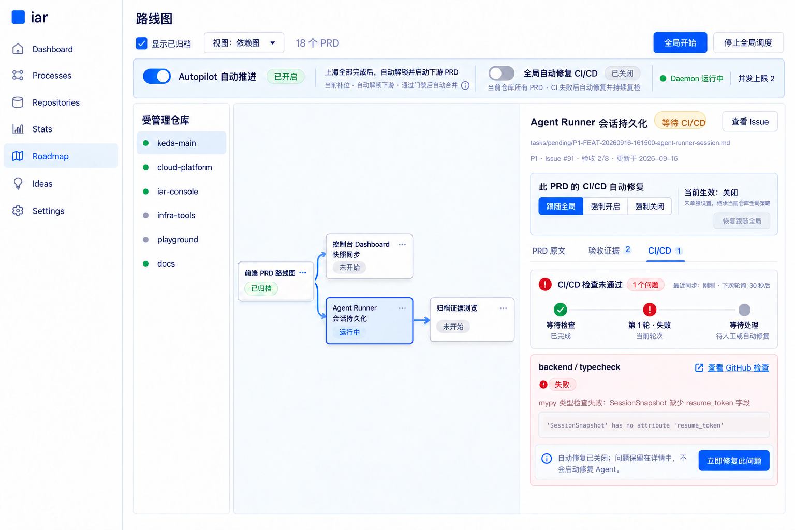
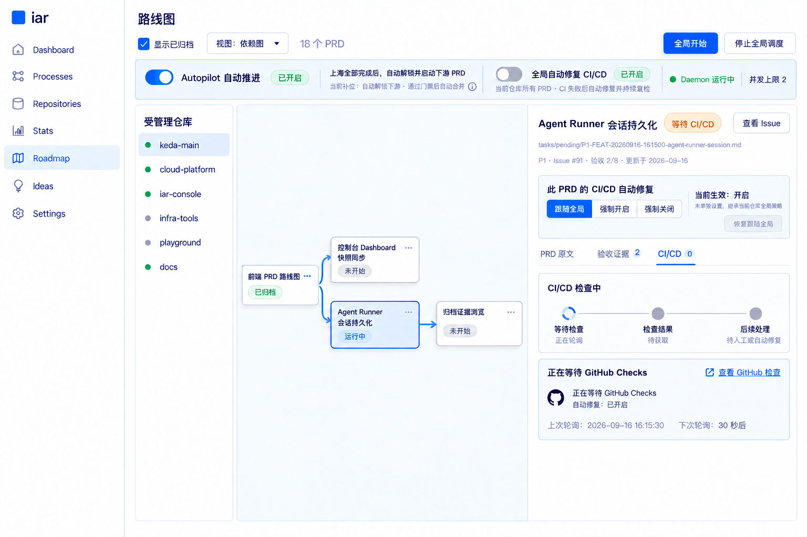
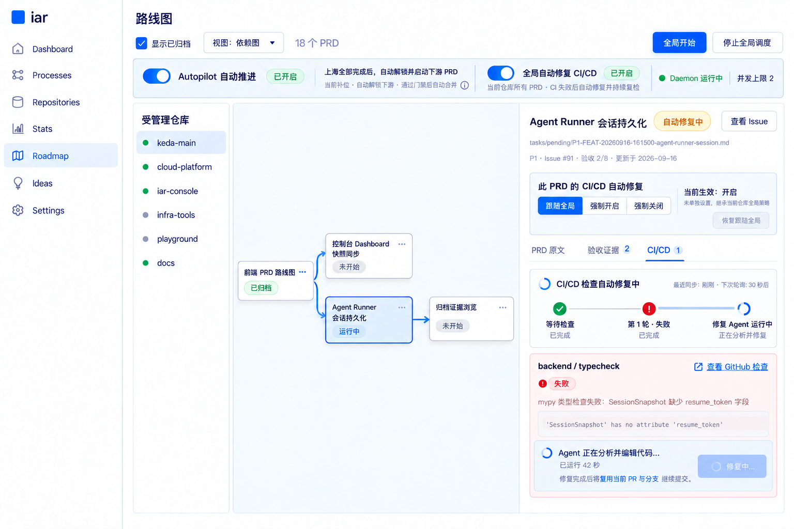
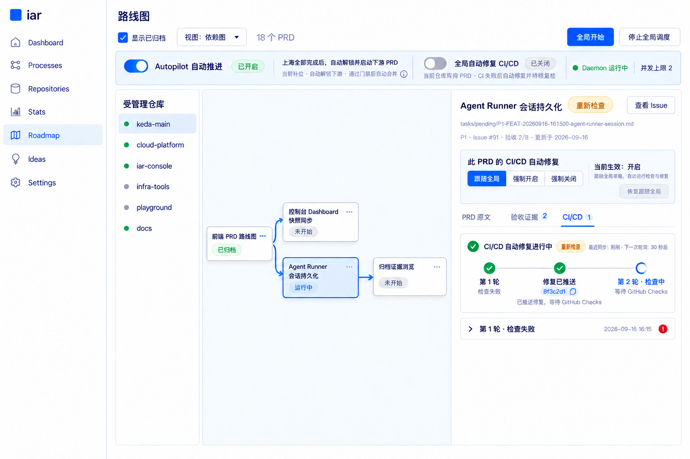
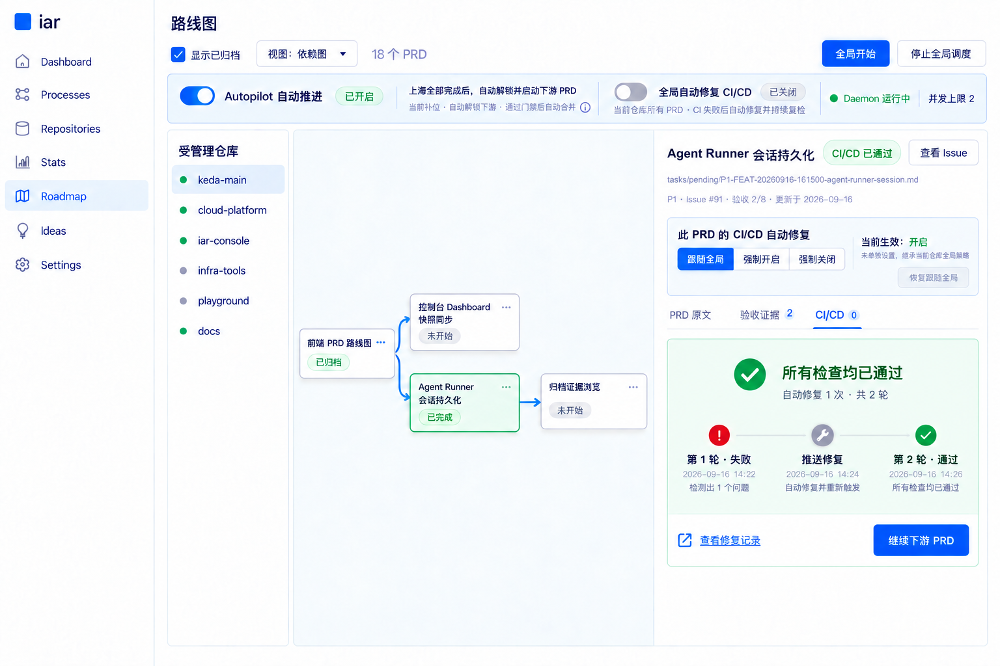

# Roadmap PRD 完成后 CI/CD 监控与自动修复草图

本页归档 `tasks/pending/P1-FEAT-20260916-134008-roadmap-prd-cicd-monitor-auto-repair.md` 的视觉草图。它是在既有 Roadmap 单 PRD 详情原型上做的定向增补，用于确认 PRD 完成后的 CI/CD 等待、失败呈现和可选自动修复交互；正式实现继续复用 `frontend-public` 的组件与既有 runner 修复链路。

## 最终草图

图中选中的是依赖图里状态为“运行中”的 `Agent Runner 会话持久化`：它已完成实现并推送 PR，因而仍是未交付的活跃 PRD，右侧详情与它一一对应；左侧“前端 PRD 路线图”只是已归档的上游节点，不带选中态。当前仓库的“全局自动修复 CI/CD”处于关闭态，该 PRD 未单独设置并选择“跟随全局”，所以最终生效值也是关闭。系统持续轮询 GitHub checks，失败的 `backend / typecheck` 作为一个问题保留在右侧详情，不会自动启动修复 Agent。PRD 可改为“强制开启”或“强制关闭”；清除覆盖后立即恢复跟随仓库全局值。

本图的生成与编辑出处、保持不变区域、逐区域变化和完整提示词原文，见同名旁车文件 [`assets/roadmap-prd-cicd-auto-repair.prompt.md`](assets/roadmap-prd-cicd-auto-repair.prompt.md)。

## 交互状态原型

[打开 CI/CD 多轮监控与自动修复交互原型](roadmap-prd-cicd-auto-repair.html)

交互原型串联以下主线状态，并保留“关闭自动修复后问题留在详情中”的人工处理分支：

1. 等待 GitHub Checks；
2. 第 1 轮失败，自动启动修复 Agent；
3. 修复提交推送后进入第 2 轮重新检查；
4. 第 2 轮通过并继续下游 PRD。

## 关键交互

- 新开关位于 Roadmap 顶部仓库控制条，与仓库级 `Autopilot 自动推进` 并列但语义独立；切换仓库时读取该仓库自己的值。
- 右侧详情提供三态 PRD 控制：`跟随全局 / 强制开启 / 强制关闭`，不用二态开关混淆“未设置”和“明确关闭”。
- 控制区同时显示持久选择和最终生效值；`跟随全局` 时，全局值变化会立即改变该 PRD 的生效值。
- `CI/CD` 标签显示问题数；详情同时呈现本轮状态、轮询时间和失败 check 的原始摘要。
- 开关关闭时只监控与显错，不自动产生提交；问题不会被成功的本地验证或旧轮次掩盖。
- 开关打开时允许多轮“失败 → 修复 → 推送 → 重新等待”，每轮都复用同一 PR/分支和既有事件时间线。
- 达到修复上限、缺少可恢复 worktree 或修复 Agent 失败时停止自动修复，问题继续留在详情中等待人工处理。

## 图片来源（provenance）

画布统一为 1536 × 1024 PNG；每张图的可继续编辑记录都在同名旁车文件，本页不复述提示词正文。

- `assets/roadmap-prd-cicd-auto-repair.png`：基底图由 OpenAI 内置 ImageGen（`precise-object-edit`，编辑目标 `assets/roadmap-prd-controls-evidence-autopilot.png`）生成；2026-09-16 修订由本地精确像素修改完成。旁车：[`assets/roadmap-prd-cicd-auto-repair.prompt.md`](assets/roadmap-prd-cicd-auto-repair.prompt.md)
- 四张状态图 `assets/roadmap-prd-cicd-0{1..4}-*.png`：均以 `assets/roadmap-prd-cicd-auto-repair.png` 为编辑基底，旁车为 `assets/roadmap-prd-cicd-0{1..4}-*.prompt.md`

## 2026-09-16 修订

原稿把选中态留在已归档的上游节点上，与本功能“CI/CD 监控跟随未交付 PRD”的逻辑不符；本次修订把选中态移到“运行中”的 `Agent Runner 会话持久化`，并把右侧详情、标签页计数与问题卡内容同步改成该 PRD。

修订方式为本地精确像素修改（底色与描边按原稿取样、文案按原稿字体与基线重排），除旁车「本次变化」表列出的区域外其余像素不变。同日先用 OpenAI 内置 ImageGen 与 DashScope `bailian_image_edit` 各试了一版，两者都整图重绘（位移、节点增减、文案错字）而未采纳；两条提示词原文完整记在旁车文件里，供复现与比较。

## 提示词记录

提示词不集中堆在本页，按“一图一旁车”存放：

- `roadmap-prd-cicd-auto-repair.png` → [`assets/roadmap-prd-cicd-auto-repair.prompt.md`](assets/roadmap-prd-cicd-auto-repair.prompt.md)：编辑基底 `assets/roadmap-prd-controls-evidence-autopilot.png` 的完整提示词在 autopilot 说明页的「最终编辑提示词」一节；本图修订前初版的那次调用只留摘要、无提示词原文（旁车如实标注，不反向编造）；2026-09-16 修订采用本地脚本重绘，最终图无生成提示词，旁车完整保留两条未采纳的模型提示词原文。
- 四张状态图 → `assets/roadmap-prd-cicd-01-waiting.prompt.md`、`assets/roadmap-prd-cicd-02-repairing.prompt.md`、`assets/roadmap-prd-cicd-03-rechecking.prompt.md`、`assets/roadmap-prd-cicd-04-passed.prompt.md`。

功能要点（提示词共同约束）：在保持原 Roadmap 页面、侧栏、仓库列表、依赖图和视觉样式不变的前提下，顶部仓库控制条保留“全局自动修复 CI/CD”；右侧详情增加 `跟随全局 / 强制开启 / 强制关闭` 三态控制、当前生效值、`CI/CD` 标签、多轮摘要和问题卡；演示“未单独设置 → 继承全局关闭”，并按状态图串联多轮修复主线。

## 实现解释

原型中的轮次不是新数据库状态。实现从 GitHub PR checks 与既有 `iar:event` marker 重建当前状态和历史轮次；仓库默认值保存在 `.iar.toml`，单 PRD 覆盖使用对应 Issue 的最新策略 marker（`inherit / on / off`）。daemon 和 Console 读取同一事实源，PRD 移入 archive 后也不会因路径变化丢失覆盖。
