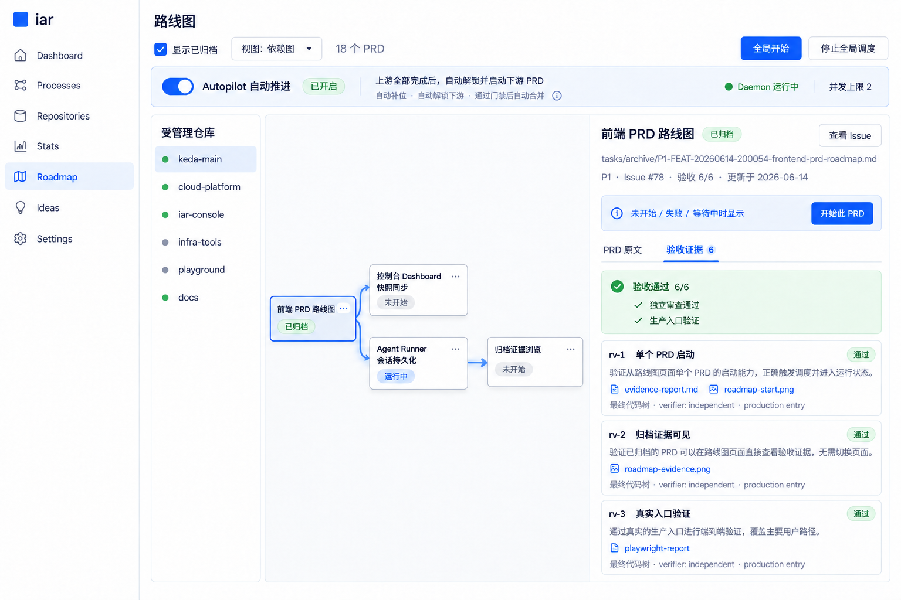

# Roadmap 单 PRD 控制、验收证据与 Autopilot 草图

本页归档 `tasks/pending/P1-FEAT-20260916-122645-roadmap-prd-controls-evidence-autopilot.md` 的视觉草图与 ImageGen 提示词。草图用于确认信息架构和交互含义，不是像素级实现规范；正式实现继续复用 `frontend-public` 当前的 shadcn/Tailwind 组件与布局。

## 最终草图



最终稿保留真实项目的白色 `iar` 侧栏、受管理仓库列表、紧凑依赖节点和同页 master-detail 详情，并增加仓库级 `Autopilot 自动推进` 开关、daemon 状态、并发上限、自动合并影响说明与验收证据入口。

## 生成方式

- 工具：OpenAI 内置 ImageGen
- 用例分类：`precise-object-edit`
- 画布：1536 × 1024 PNG

## 最终编辑提示词

```text
Use case: precise-object-edit
Asset type: high-fidelity internal console UI mockup revision
Input image: Image 1 is the exact existing Roadmap redesign mockup and must remain the visual/layout reference.
Primary request: Add the project’s existing Autopilot capability to the Roadmap page as a clear repository-level on/off control. Preserve the entire existing image, page structure, sidebar, repository panel, dependency graph, selected PRD detail, evidence tabs, colors, typography, and dimensions.

Make only these targeted layout changes:
1. Insert a compact full-width settings/status strip directly below the top Roadmap toolbar and directly above the bordered main Roadmap content. It must align with the Roadmap workspace to the right of the repository panel, not cover the graph or detail pane.
2. The strip uses a subtle pale-blue background, thin blue-gray border, and 8px radius. On the left show a blue toggle in the ON position, label “Autopilot 自动推进”, and green status text “已开启”.
3. Next to it show concise explanatory text: “上游全部完成后，自动解锁并启动下游 PRD”.
4. On the far right show two small status chips: green dot “Daemon 运行中” and neutral text “并发上限 2”.
5. Under the main explanatory text, in smaller muted type, show: “自动补位 · 自动解锁下游 · 通过门禁后自动合并”. Include a tiny info icon next to this line.
6. Keep the existing “全局开始” button. Its meaning remains a one-time manual batch start, visually separate from the Autopilot toggle.
7. In the dependency graph, lightly emphasize the path from the archived upstream node “前端 PRD 路线图” to its downstream nodes using a subtle blue connector glow, suggesting automatic advancement. Do not add animation or extra nodes.

Interaction intent the UI should communicate:
- Toggle is repository-scoped for the currently selected “keda-main”.
- ON means the daemon continuously reconciles the roadmap, fills available slots, and starts eligible downstream PRDs once all upstream dependencies are complete.
- Autopilot also participates in the existing automatic merge fast lane, so the secondary explanation must not omit “通过门禁后自动合并”.
- Daemon state is visible because Autopilot cannot advance work unless daemon is running.

Exact Chinese labels that must remain legible:
“Autopilot 自动推进”
“已开启”
“上游全部完成后，自动解锁并启动下游 PRD”
“自动补位 · 自动解锁下游 · 通过门禁后自动合并”
“Daemon 运行中”
“并发上限 2”
“全局开始”

Constraints: change only the area needed to add the Autopilot strip and subtle connector emphasis. Keep the original 1536×1024 composition. No modal, no floating tooltip, no dark theme, no gradients, no marketing illustrations, no watermark. Do not remove or rename any existing controls. Preserve all evidence content on the right.
```

## 实现解释

图中“通过门禁后自动合并”是现有能力的影响说明，不表示这个 Roadmap 开关会同时修改 `safety.auto_merge`。正式实现按 PRD 决策：开关只修改当前仓库的 `autopilot.enabled`，并单独展示 daemon 与自动合并门禁状态。
