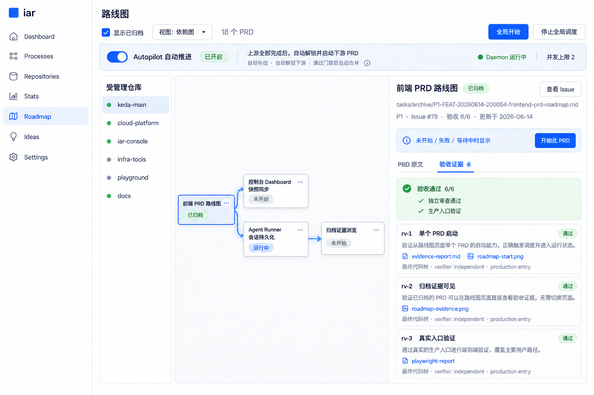

# Roadmap 单 PRD 控制、验收证据与 Autopilot 草图

本页归档 `tasks/pending/P1-FEAT-20260916-122645-roadmap-prd-controls-evidence-autopilot.md` 的视觉草图与 ImageGen 提示词。草图用于确认信息架构和交互含义，不是像素级实现规范；正式实现继续复用 `frontend-public` 当前的 shadcn/Tailwind 组件与布局。

从 [Prototype Hub](hub.html) 可继续打开相关的 CI/CD 监控与 PRD 生命周期原型；Hub 的关系入口由 registry 维护。

## 最终草图

最终稿保留真实项目的白色 `iar` 侧栏、受管理仓库列表、紧凑依赖节点和同页 master-detail 详情，并增加仓库级 `Autopilot 自动推进` 开关、daemon 状态、并发上限、自动合并影响说明与验收证据入口。

## 生成方式

- 工具：OpenAI 内置 ImageGen
- 用例分类：`precise-object-edit`
- 画布：1536 × 1024 PNG

## 最终编辑提示词

最终编辑提示词全文保存在同名旁车文件 [`assets/roadmap-prd-controls-evidence-autopilot.prompt.md`](assets/roadmap-prd-controls-evidence-autopilot.prompt.md)，本页只保留设计说明，避免图片与提示词记录分离。

## 实现解释

图中“通过门禁后自动合并”是现有能力的影响说明，不表示这个 Roadmap 开关会同时修改 `safety.auto_merge`。正式实现按 PRD 决策：开关只修改当前仓库的 `autopilot.enabled`，并单独展示 daemon 与自动合并门禁状态。

## 目标态更新：统一并发上限（P1-FEAT-20261010-011714）

「并发上限」从「全局开始」的一次性启动参数升级为**仓库级持久策略 + 单一生效值**：

- 控制条显示 `并发 <生效值>（<来源>）`，来源三态：继承 runner 配置 / Backlog 设置 / 受 runner 容量限制；生效值 = `min(策略, 容量)`，策略高于容量时同时显示容量数字。
- 「并发」输入框限 1–10，配「保存」与「恢复继承」；从未设置时输入框显示占位「未设置」，「恢复继承」= 删除设置行（副作用：默认视图回到「列表」）。
- 「全局开始」按钮保留，含义不变（一次性批量启动），但不再写设置：按当前生效上限放行。
- 同一个生效值由 daemon 每轮分发给补位闸门与认领闸门；显式 run 与 Console 单 PRD「开始」不受该上限约束。
- 本页草图只确认信息架构；真实 Console 三态截图见 `tasks/evidence/P1-FEAT-20261010-011714-unified-auto-concurrency-ceiling/`。提示词全文在旁车 [`assets/backlog-unified-concurrency-ceiling.prompt.md`](assets/backlog-unified-concurrency-ceiling.prompt.md)。
