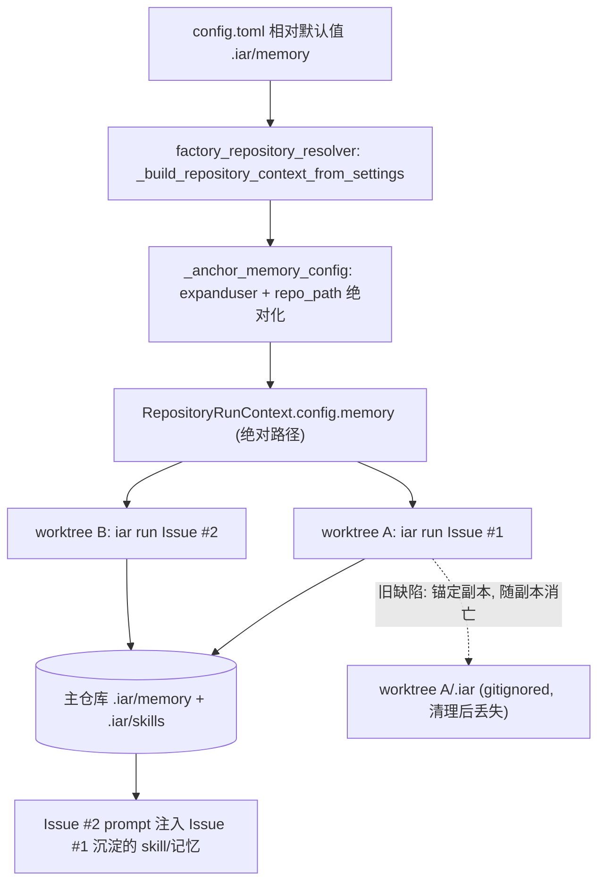

# PRD: Agent Runner 记忆锚点修复——跨 worktree 稳定持久化

> ✅ **交付前置**：无，可立即开工。
> 结构化声明见 §8 Delivery Dependencies，**那里是唯一事实源**。

- GitHub Issue: （待创建；缺陷源自 PR #125 / Issue #124 的交付）
- 缺陷来源 PRD: `tasks/archive/P1-FEAT-20260626-093933-agent-runner-memory-persistence.md`

> **2026-09-13 更新说明**：本文档已按最新 PRD 规范整体重构（Part A 人审层 / Part B 执行器层、R0–R3 风险分级、证据链完整的验收 oracle）。实现已随 commit `dbddd12` 落地；因行数拆分 PRD 重构，注入点从 `factory.py` 漂移至 `factory_repository_resolver.py`（Part B §5/§7 已同步）。当前处于归档前复核状态——证据文件已被后续 closeout 证据轮换移出工作树，归档前需按证据分支流程复核（见 §9 Delivery Readiness）。

> 本 PRD 分两个 altitude，分别服务不同读者，自上而下阅读：
>
> - **Part A · 人审层 (Review Layer)** — 需求方 / 验收人读这部分，决定"该不该做、做得对不对"，并知道**哪些决策需要亲自确认**。Part A 不出现实现机制、文件路径、命令。
> - **Part B · 执行器层 (Build Layer)** — 实现者（人或 Agent）读这部分动手。人只在 Part A 决策点名处下钻审查，其余默认交执行器 + 自动门禁（hook / 测试 / 架构检查）。

## Feature Overview (功能一览)

> 本块是第 10 节 Functional Requirements 的通俗投影，不是第二事实来源；行为验收以第 1 节的行为样例表为准。

- **记忆存到主仓库，不再随副本蒸发**（FR-1、FR-2）：相对路径配置解析到目标仓库主检出根下的 `.iar/`；绝对路径（含 `~`）原样使用，不挂任何锚点。
- **跨 Issue 经验真正闭环**（对应 §1 目标）：skill 草稿计数跨副本累积、达阈值自动晋升；维护者手写的长期记忆被任意副本检索注入 prompt。
- **并发写不损坏**（FR-5）：共享目录写入统一走"同目录临时文件 + `os.replace` 原子替换"，不产生半写文件；冲突取 last-write-wins。
- **零迁移成本**（FR-3、FR-4、FR-8）：配置项名称、磁盘布局、文件格式全部不变；直连构造 `MemoryConfig` 的旧测试路径保持可用（收到相对路径时告警但不阻断）；旧副本内遗留记忆不迁移。
- **开关与文档可靠**（FR-6、FR-7）：`enabled=false` 时零读写、行为与修复前一致；全部锚点语义声明同步更新，仓库内无旧语义残留。
- **验证不降级**（FR-9）：跨副本行为的验收证据必须来自两个真实 `git worktree`，禁止同目录多次内部调用模拟多 Issue。

---

# Part A · 人审层 (Review Layer)

## 1. Introduction & Goals

### Problem Statement

PR #125 交付的"Agent Runner 记忆持久化与技能蒸馏"功能，把所有记忆数据（短期记忆、长期记忆、skill 草稿、已晋升 skill）保存在**每个 Issue 专属的临时工作副本内部**。这些工作副本按 Issue 新建、不纳入版本控制、Issue 关闭后被清理——因此 Issue A 沉淀的任何经验，Issue B 永远看不到。

直接后果是该功能的核心承诺全部落空：

1. **跨 Issue 经验复用不可能发生**：后续同类 Issue 的 prompt 里永远不会出现已蒸馏的 skill。
2. **skill 草稿的使用计数永远从 1 开始**：草稿去重、计数累积、自动晋升（默认阈值 3 次）在真实运行中永远无法触发。
3. **维护者手写的长期记忆永远不被读取**：维护者在主仓库里编写的项目约定，runner 只会去临时副本里找，而那里没有。

唯一真正生效的部分是**同一个 Issue 内部**的短期记忆（恢复循环中的历史尝试回放）。感受到疼痛的是 runner 的维护者与运营者：功能默认开启、静默空转，看起来在积累知识，实际什么都没留下。

原 PRD 的验收之所以全部通过，是因为验证被降级为"在同一个临时目录里调用内部函数"——恰好绕开了"每个 Issue 是一个新副本"这个致命场景。

### Interpretation (解读回显)

**行为样例**

| 输入 / 操作 | 期望观察到的结果 |
|---|---|
| 副本 A 中完成一个 Issue 并成功蒸馏出 skill，随后在**另一个独立副本 B** 中处理同类 Issue | B 的 agent prompt 中出现 A 沉淀的 skill 目录；记忆文件全部落在**主仓库** `.iar/` 下，A、B 两个副本内部均无记忆写入 |
| 连续 3 个同类成功 Issue（各自发生在独立的新建副本中） | 主仓库里草稿的使用计数累积到 3 后自动晋升到技能目录，草稿标记移除 |
| 维护者在主仓库手写长期记忆（项目约定）后，从任意新副本发起相关 Issue | 该约定被检索并注入 prompt |
| 边界：运营者把记忆目录配置成 `~/.iar/memory/keda-main` 这类仓库外的绝对路径 | 路径按原样（`~` 展开后）使用，不挂到任何仓库或副本之下 |
| 失败：故意按旧语义（记忆锚定在副本内）跑同一双副本流程 | 副本 B 读不到 A 的记忆，验证脚本以非零码退出——证明断言真的能红 |
| 边界：关闭记忆开关（`enabled = false`） | 主仓库与所有副本内均无任何记忆读写，行为与修复前完全一致 |

上表每一行都会被逐字转写为 Part B §7 的验收 oracle——**改其中一格就等于改验收标准**，所以这张表值得逐行读。

**我默默定了这些**

- 稳定锚点默认＝目标仓库主检出根（主检出下的 `.iar/`），不改用用户级目录作默认。
- 绝对化只在 engines 层构建 per-repo 配置的一处发生；所有 use-case 函数签名不动。
- 共享目录并发写入取 last-write-wins，不引入文件锁。
- 旧副本内的遗留记忆文件不迁移、不加回退读取——它们是缺陷的产物，本就随副本消亡。
- 解析主仓库根不跑 git 子进程（尊重 process_runner 唯一执行抽象的既有约束）。

**我理解为不做**

- 不重做或回滚 PR #125 的记忆系统，不重写蒸馏/检索/晋升的业务规则本身。
- 不引入数据库、外部服务、文件锁守护进程；不把记忆纳入 git 版本控制。
- 不承诺"多机共享记忆"的并发语义（绝对路径指向共享盘可用，但不背书其行为）。

**判定式解读**

本 PRD 被解读为：**修复记忆数据的存放锚点**，让 PR #125 已交付的记忆系统真正做到跨 Issue 持久化——记忆改为锚定在**目标仓库的主检出（稳定、跨所有临时工作副本共享）**，磁盘布局、配置项名称、对外行为承诺均维持原 PRD 不变；并且验收必须包含"两个真实独立工作副本之间记忆传递"的验证，纠正原 PRD 的验证降级。

本 PRD **不是**：重做或回滚记忆系统；不是引入数据库或外部服务；不是把记忆纳入 git 版本控制；也不是修改蒸馏/检索/晋升的业务规则本身。

### What The User Gets

- 维护者在主仓库里手写的项目约定（长期记忆），后续所有相关 Issue 的 agent 都能自动引用——不管 runner 在哪个临时副本里干活。
- 同类 Issue 反复成功后，skill 草稿的使用计数真实累积，达到阈值后自动晋升，后续 Issue 的 prompt 自动带上该 skill 的目录——原 PRD 承诺的闭环第一次真正闭合。
- 运营者不需要改任何配置：默认配置语义自动升级为"存到主仓库"；想把记忆放到仓库之外（例如防 `git clean` 误删）的运营者，可把配置改为绝对路径实现。
- 崩溃后换一个新副本继续同一个 Issue 时，之前的尝试历史仍然在（原 PRD 承诺的"跨 claim 续作"这次真的成立）。

### Measurable Objectives

1. 在两个**不同的**临时工作副本中先后处理同类 Issue，第二个副本的 agent prompt 能引用第一个副本沉淀的 skill / 长期记忆。
2. 连续 3 个同类成功 Issue（各自独立副本）后，草稿计数达到 3 并自动晋升——在真实目录拓扑下可复现。
3. 维护者写入主仓库的长期记忆文件，在任意副本发起的相关 Issue 中被检索并注入 prompt。
4. 关闭记忆开关后行为与现状一致；打开时现有测试套件无回归。
5. 并发处理多个 Issue 时，共享记忆目录不出现半写损坏文件。

---

## 2. Human Review Map (介入与风险地图)

### 决策一：记忆锚点默认落在目标仓库主检出根

建议把记忆的存放锚点从"每个 Issue 的临时工作副本"改为"目标仓库的主检出根"：相对路径配置解析到主检出根之下，绝对路径（含 `~`）原样使用；磁盘布局、配置项名称、对外行为承诺维持原 PRD 不变。这是本功能生死攸关的一处语义——其前身（PR #125）恰恰因为验证被降级为"同目录调用内部函数"而漏过了该缺陷，所以证据负担取最高：验收必须用两个真实的独立工作副本证明记忆跨副本传递，且旧语义必须能把同一验证跑红。若锚点选错，最坏结果是记忆继续静默空转或落错位置，功能承诺第二次落空。

**请确认：** 记忆目录默认锚定主检出根、绝对路径原样使用、旧副本内遗留记忆不迁移——同意吗？

**验收：** 双真实工作副本验证：副本 A 写入后副本 B 可读、文件仅存在于主仓库 `.iar/` 之下；按旧语义强制回退后，同一验证必须失败（转红）。

### 决策二：共享记忆目录的并发写入采用原子替换 + last-write-wins

锚点共享后，多个并发 Issue 会首次真正写同一目录树。建议用"同目录临时文件 + 原子替换"保证不出现半写损坏文件；并发冲突时 last-write-wins，不引入文件锁。主要风险：极端并发下可能少计一次草稿使用计数——记忆是 best-effort 附加信息层，偶发少计可接受；文件锁会引入跨平台与死锁复杂度，与"蒸馏失败不得阻塞 runner"的既有约束相抵触。

**请确认：** 接受 last-write-wins（可能偶发少计一次计数）而不引入文件锁——同意吗？

**验收：** 并发写入用例下，目标文件始终完整可解析（JSON/Markdown）；去掉原子替换后，同一用例必须变红。

**自动门禁，不需要逐项人工审阅**：记忆开关关闭时的零回归（单测断言无任何读写）、`MemoryConfig` / 配置注释 / 指南文档的语义同步（搜索断言）、全量测试套件与 lint 门禁——均由测试与 lint 自动把关。

**本次明确不涉及**：无数据库结构变化；不触碰鉴权/信任边界、对外 API 契约、资金计费。

---

## 3. Usage And Impact After Implementation

### 维护者

- 在主仓库 `.iar/memory/long_term/facts/<topic>.md` 手写项目约定（与原 PRD 承诺一致）；此后任何副本中运行的相关 Issue 都会检索并注入——这是原功能第一次真正兑现该承诺。
- 在主仓库 `.iar/skills/drafts/` 里审阅草稿、`.iar/skills/` 里管理已晋升 skill；所有 Issue 共享同一份，不再每个副本各一份幽灵拷贝。

### 运营者 / 调用方

- 默认零配置变更：`config.toml` `[agent_runner.memory]` 各目录仍是相对路径写法，语义升级为"相对**目标仓库主检出根**解析"。
- 想把记忆放在仓库外（防 `git clean -fdx` 误删、或多机共享）：把 `base_dir` 等改为绝对路径（支持 `~` 展开），例如：

```toml
[agent_runner.memory]
base_dir = "~/.iar/memory/keda-main"
skill_drafts_dir = "~/.iar/memory/keda-main/skills/drafts"
promoted_skills_dirs = ["~/.iar/memory/keda-main/skills"]
```

- `enabled = false` 完全关闭，行为与修复前一致。

### Impact On Existing Behavior

- 旧的、写在各临时副本里的记忆文件**不迁移**：它们本来就随副本消亡，属于缺陷的产物而非有效数据。
- 主仓库 `.iar/` 已是既有惯例（证据文件同样存放于此）且已被版本控制排除；本次不改变其排除状态。
- runner 状态机、恢复循环、蒸馏与检索规则、prompt 格式均不变；仅记忆的落盘/读取位置改变。

---

## 4. Requirement Shape

- **Actor**：Agent Runner（读写记忆）、维护者（手写长期记忆、审阅草稿）、运营者（配置目录与开关）。
- **Trigger**：与原 PRD 相同——runner 启动时检索、恢复循环中写短期记忆、Issue 成功后蒸馏；本 PRD 不新增触发点。
- **Expected behavior**：所有记忆读写发生在**跨副本稳定**的锚点下（默认＝目标仓库主检出根；绝对路径配置原样使用）；并发写入不产生半写文件。
- **Explicit scope boundary**：
  - 不改变记忆磁盘布局（`short_term/<repo_id>/<issue_number>/context.json` 等）与文件格式。
  - 不改变 `MemoryConfig` 字段集合与配置项名称。
  - 不引入数据库、外部服务、文件锁服务。
  - 不把记忆纳入版本控制。
  - 不修改蒸馏过滤、相似度合并、Top-K 检索、自动晋升阈值等业务规则。

---

# Part B · 执行器层 (Build Layer)

## 5. Repository Context And Architecture Fit

> 实现已随 commit `dbddd12` 落地。下表为**落地后**的实际位置：初稿写作时注入点位于 `factory.py`，其后该文件按行数拆分 PRD（`P1-REFACTOR-20260705-210702`）拆分为多个 `factory_*.py` 模块，本修复的实现随迁至 `factory_repository_resolver.py`。

### 当前相关模块/文件

| 关注点 | 位置 | 说明 |
|---|---|---|
| 锚点解析 | `src/backend/infrastructure/memory/adapters.py` | `resolve_memory_paths(worktree_path, ...)` 的 `anchor()`：相对路径挂到传入路径下，绝对路径原样使用。缺陷根源。 |
| 记忆服务组装 | `src/backend/core/agent/memory/_composition.py` | `build_default_memory_services(worktree_path, memory_config)`，把传入路径透传给 `resolve_memory_paths`；已实现相对路径防回归告警。 |
| per-repo 配置构建 | `src/backend/engines/agent_runner/factory_repository_resolver.py` | `_build_merged_repository_context`（`RepositoryRunContext` 的唯一构建点；`_build_repository_context_from_settings` 是其单仓库包装）与 `_anchor_memory_config`（记忆目录绝对化辅助）——**修复的实际注入点**（由 `factory.py` 拆分迁入）。 |
| MemoryConfig 域模型 | `src/backend/core/shared/models/agent_runner.py` | `MemoryConfig` frozen dataclass；docstring 的锚点语义声明已更正。 |
| 记忆调用点 | `src/backend/core/use_cases/run_agent_once.py` / `agent_runner_publication.py` / `agent_runner_feedback.py` | `_persist_short_term_memory`、`_try_distill_skill_after_success`、`build_prompt`→`load_relevant_memory`，均以 `worktree_path` 作锚传入组装函数——配置绝对化后该实参对路径解析不再起作用，签名不动。 |
| 存储实现 | `src/backend/infrastructure/memory/_atomic_io.py` / `short_term_store.py` / `long_term_store.py` / `skill_draft_store.py` | 纯文件系统读写；原子写入已统一收敛到 `_atomic_io.py`（tmp + `os.replace`）。 |
| 配置默认值 | `config.toml` `[agent_runner.memory]`；`src/backend/infrastructure/config/settings.py` `AgentRunnerMemorySettings` | 相对路径默认值保持不变，仅语义注释更新。 |

### 既有架构模式（需遵循）

- 依赖方向 `api → core → engines → infrastructure`；本修复主体在 engines（factory 构建配置值）与 infrastructure（原子写），core 仅改注释/告警，不引入新的跨层依赖。
- `MemoryConfig` 是 frozen dataclass：改写字段用 `dataclasses.replace`。
- 文本 I/O 显式 `encoding="utf-8"`；公共 API Google Style Docstrings；内部注释中文。
- 单文件目标 <500 非空行。

### 所有权与依赖边界

| 关注点 | 责任归属 |
|---|---|
| 锚点绝对化（相对目录 → `repo_path` 下绝对路径，含 `~` 展开） | `src/backend/engines/agent_runner/factory_repository_resolver.py`（`RepositoryRunContext` 构建处） |
| 相对目录抵达组装层时的防回归告警 | `src/backend/core/agent/memory/_composition.py` |
| 原子写入 | `src/backend/infrastructure/memory/` 各 store（经 `_atomic_io.py`） |
| 语义文档 | `MemoryConfig` docstring、`config.toml` 注释、`docs/guides/agent-runner.md` |

### Frontend Impact

- **No frontend impact**：仅改后端 runner 的本地文件锚点与写入方式，无任何用户界面。

### Existing PRD Relationship

- `tasks/archive/P1-FEAT-20260626-093933-agent-runner-memory-persistence.md` —— 缺陷来源。本 PRD 是其修复增量；原 PRD 保持归档不动（append-only），本 PRD 记录其验收失效原因（验证降级为同目录内部函数调用）。
- `tasks/pending/P1-REFACTOR-20260703-184226-api-engines-layer-migration.md` —— 同样触碰 engines 层。**软相关**：若该重构移动 factory 系列模块中的上下文构建代码，本 PRD 的注入点跟随迁移（本轮已发生一次：`factory.py` → `factory_repository_resolver.py`）；两者独立可交付，后合入者需 rebase 检查。
- `tasks/pending/P1-REFACTOR-20260705-210702-file-line-split-seven-files.md` —— **已实际交叉**：其拆分把本 PRD 的注入点从 `factory.py` 迁至 `factory_repository_resolver.py`，属执行顺序的既成事实，不构成阻塞。
- 其余 pending PRD 与本 PRD 无重叠。**未发现重复 PRD**。

### Potential Redundancy Risks

- 风险：在 use-case 层再穿一遍 `repo_path` 参数，与配置绝对化双轨并存。规避：只在 factory 一处绝对化，签名一律不动（见 D-02）。
- 风险：为并发再造文件锁模块。规避：只做 tmp + `os.replace` 原子替换，接受 last-write-wins（见 D-04）。

---

## 6. Recommendation

### Recommended Approach（最小改动路径）

1. **factory 构建 per-repo 配置时绝对化记忆目录**
   - 在 `_build_merged_repository_context` 中、`return RepositoryRunContext(...)` 之前，对 `effective_config.memory` 做一次变换：`base_dir`、`skill_drafts_dir`、`promoted_skills_dirs` 中的每个路径先 `expanduser()`，仍为相对路径者解析为 `effective_repo_path / <rel>` 的绝对路径；用 `dataclasses.replace` 写回（`AppConfig`、`MemoryConfig` 均 frozen）。
   - 该函数是仓库中 `RepositoryRunContext(` 的唯一构建点（见 Drift Guard #1）；`_build_repository_context_from_settings` 与 `resolve_repository_targets` 系列都汇聚到它，所有 CLI/daemon 消费路径都经过这里。（实现落地后位于 `factory_repository_resolver.py`。）

2. **组装层防回归告警**
   - `build_default_memory_services` 在收到仍为相对路径的记忆目录时，记一条 warning（说明预期应由 factory 绝对化），行为保持现状（继续以传入路径为锚）——保证直接构造 `MemoryConfig` 的既有测试不破坏，同时让任何漏网的生产路径在日志里现形。

3. **存储写入原子化**
   - 各 store 的落盘统一为：写入同目录临时文件（`encoding="utf-8"`）后 `os.replace` 到目标路径（实现收敛为共享的 `_atomic_io.py`）。并发场景 last-write-wins，不产生半写文件。

4. **语义文档同步**
   - `MemoryConfig` docstring 更正（删除 "Always written as `<worktree>/<base_dir>`" 的错误声明，改为"相对路径由 engines 层在构建 per-repo 配置时解析到目标仓库主检出根；绝对路径（含 `~`）原样使用"）。
   - `config.toml` `[agent_runner.memory]` 注释、`docs/guides/agent-runner.md` 记忆章节同步该语义，并补充绝对路径（仓库外存储）示例。

5. **验证纠偏**
   - 新增跨副本验证脚本（真实 `git worktree add` 两个副本），替代原 PRD 同目录 rv 脚本的失真场景；原 rv 脚本保留但不再作为跨 Issue 行为的证据。

### Proposed Solution Summary (实现机制)

- **核心机制**：把"锚点选择"从运行时（每次组装记忆服务时用 `worktree_path`）前移到配置构建时（factory 把相对目录绝对化到 `repo_path`）。运行时组装函数与全部 use-case 签名保持不变——绝对路径进入 `resolve_memory_paths` 后本就原样使用，`worktree_path` 实参自然失效。
- **输入来源**：`RepositoryRunContext` 已持有的 `effective_repo_path`（配置注册表/`--repo` 解析产物），无需新增任何输入。
- **入口与挂载点**：`_build_repository_context_from_settings`（engines/factory 系模块）一处注入；`build_default_memory_services`（core 组装）加告警；各 store（infrastructure）改原子写。
- **输出与用户可见行为**：记忆文件出现在主仓库 `.iar/memory/`、`.iar/skills/` 下并跨 Issue 累积；prompt 注入、计数、自动晋升按原 PRD 承诺真实发生。
- **刻意规避的复杂度**：不改 use-case 签名（不穿线传参）；不在 core 里跑 git 子进程解析 common-dir；不做文件锁；不做旧数据迁移。

### 为什么最适合当前架构

- 单点注入：仓库里 `RepositoryRunContext(` 只有一个构建点，且该点同时拥有 `repo_path` 与最终合并配置——是天然的绝对化位置。
- 零签名扰动：十余处 `worktree_path` 传参、几百个既有测试全部不动。
- 尊重 `process_runner` 约束：不需要在 core/infrastructure 里为解析主仓库根引入子进程调用。

### Alternatives Considered

| 方案 | 说明 | 拒绝原因 |
|---|---|---|
| use-case 层穿线传 `repo_path` | `run_agent_until_committed`/`build_prompt`/publication 等签名各加一个稳定锚参数 | 十余处签名与调用点改动、测试大面积翻新；与配置绝对化效果等价但侵入性数倍 |
| 组装层跑 `git rev-parse --git-common-dir` 从副本反解主仓库根 | 无需配置改动 | core 组装层需要子进程能力，违反 `process_runner` 唯一执行抽象的约束；给记忆路径解析引入新的失败模式（git 不可用/裸仓库） |
| 用户级目录 `~/.iar/memory/<repo_id>/` 作为默认锚 | 防 `git clean -fdx` | 需要跨仓库命名空间与 `repo_id` 稳定性保证；偏离主仓库 `.iar/` 既有惯例；运营者仍可用绝对路径配置自行实现，不必改默认值 |
| 回滚 #125 重做 | 历史干净 | 已推送公共历史 + daemon 并发环境不可 force-push；revert 反向大提交后仍要重写 95% 相同代码；功能惰性无害无止损压力 |

---

## 7. Implementation Guide

> 本节是基于当前仓库分析的"活"实现指南。如实现过程中发现新增受影响文件、隐藏依赖、边界情况或更优路径，请先更新本 PRD 再继续。

### Core Logic（数据与控制流）

```text
配置加载（不变）:
  settings: base_dir=".iar/memory" 等相对默认值

per-repo 上下文构建（本次修复点, engines/factory 系模块）:
  effective_config = merge_repository_config(...)
  memory = effective_config.memory 中三类目录:
      p = expanduser(p)
      p 为相对 => p = effective_repo_path / p   # 绝对化（_anchor_memory_config）
  effective_config = replace(effective_config, memory=replace(memory, ...))
  return RepositoryRunContext(repo_id, display_name, repo_path, effective_config)

运行时（签名与调用不变）:
  build_default_memory_services(worktree_path, config.memory)
      -> resolve_memory_paths(worktree_path, base_dir=<已是绝对路径>, ...)
      -> anchor(): 绝对路径原样使用, worktree_path 失效
      -> （若仍收到相对路径: log warning + 维持旧行为, 供直连构造的测试使用）

存储写入（infrastructure, 原子化）:
  write tmp file (utf-8) in target dir -> os.replace(tmp, target)
```

### Change Impact Tree

```text
.
├── Engines
│   └── src/backend/engines/agent_runner/factory_repository_resolver.py
│       [新增于本次修复；原计划落点 factory.py 已按行数拆分 PRD 拆分，实现随迁至此]
│       【总结】构建 RepositoryRunContext 前将 memory 相对目录 expanduser 并绝对化到 effective_repo_path。
│       ├── 新增模块级辅助 _anchor_memory_config(memory: MemoryConfig, repo_root_path: Path) -> MemoryConfig
│       └── _build_merged_repository_context 在 return RepositoryRunContext(...) 前应用该辅助（dataclasses.replace 写回 config）
│
├── Core
│   ├── src/backend/core/agent/memory/_composition.py
│   │   [修改]
│   │   【总结】收到相对记忆目录时记 warning（防回归），行为维持现状。
│   │
│   └── src/backend/core/shared/models/agent_runner.py
│       [修改]
│       【总结】更正 MemoryConfig docstring 的锚点语义声明（删除 "<worktree>/<base_dir>" 说法）。
│
├── Infrastructure
│   ├── src/backend/infrastructure/memory/_atomic_io.py
│   │   [新增]
│   │   【总结】三个 store 共用的"同目录 tmp + os.replace"原子落盘辅助。
│   ├── src/backend/infrastructure/memory/short_term_store.py
│   │   [修改]
│   │   【总结】save 改为经 _atomic_io 原子落盘。
│   ├── src/backend/infrastructure/memory/long_term_store.py
│   │   [修改]
│   │   【总结】写入路径改为原子落盘（同上）。
│   ├── src/backend/infrastructure/memory/skill_draft_store.py
│   │   [修改]
│   │   【总结】草稿保存/更新/晋升写入改为原子落盘。
│   └── src/backend/infrastructure/memory/adapters.py
│       [修改]
│       【总结】resolve_memory_paths docstring 更新：参数语义为"锚点"（生产路径下配置已绝对化）。
│
├── Config
│   └── config.toml
│       [修改]
│       【总结】[agent_runner.memory] 注释更新为"相对路径相对目标仓库主检出根解析"，补充绝对路径示例。
│
├── Tests
│   ├── tests/test_agent_runner_memory_anchoring.py
│   │   [新增]
│   │   【总结】覆盖 factory 绝对化（相对/绝对/~ 三态）、组装层告警、跨两个真实 worktree 的读写传递。
│   └── tests/test_agent_runner_memory.py
│       [修改]
│       【总结】补原子写断言（写入过程中目标路径不存在半写内容可用 os.replace 语义覆盖）。
│
│   注：rv-1/rv-2/rv-3 的可复跑 oracle 脚本 `rv_anchor_cross_worktree.py` **不进代码树**，
│   执行时创建在 `.iar/evidence/scripts/` 下（`.iar/` 不入 git，证据按证据分支流程留存）。
│   脚本取配置的方式必须走**生产注入点**：调用 `_build_repository_context_from_settings`
│   并回读 `context.config.memory`，不得直接调用 `_anchor_memory_config` 或手工拼绝对路径
│   （2026-09-14 复核时按此要求重写；`--legacy-anchor` 则刻意跳过 builder 以复现旧语义）。
│
└── Docs
    └── docs/guides/agent-runner.md
        [修改]
        【总结】记忆章节更新锚点语义、仓库外存储配置示例、并发 last-write-wins 说明。
```

本树是起点而非穷尽集；隐藏引用见 Executor Drift Guard。

### Risk Classification Register

| 改动点 | Tier | 判定维度 / 覆盖 | 介入 | Oracle / 门禁 |
|---|---|---|---|---|
| 记忆锚点解析语义（相对路径 → 主检出根绝对化） | R3 | 正确性关键度：持久状态归属 + 前身因验证降级漏过同类缺陷；core 编排语义（固定区域覆盖） | 人工确认（高证据负担） | rv-1 / rv-2 / rv-3 |
| 共享记忆目录并发写入原子化 | R2 | 横切触发：并发/幂等 | 人工确认（高证据负担） | rv-6 |
| 组装层相对路径防回归告警 | R1 | 单组件行为、可即时回滚 | 执行器 + 单测 | anchoring 测试告警用例 |
| `enabled=false` 零回归 | R1 | 普通行为、清晰测试 oracle | 执行器 + 单测 | rv-4 |
| 语义文档同步（docstring / config / docs） | R0 | 机械可检、立即可见 | 执行器 + 搜索断言 | §9 Documentation Acceptance 的 rg 断言 |
| 全量回归与门禁 | R1 | 套件级门禁 | 执行器 + 门禁 | rv-5 |

### Executor Drift Guard

```bash
# 1. 确认 RepositoryRunContext 唯一构建点（若 api-engines-layer-migration 或行数拆分已移动代码，跟随新位置）
rg -n "RepositoryRunContext\(" src/backend --type=py

# 2. 找到全部记忆服务组装与锚点消费方
rg -n "build_default_memory_services|resolve_memory_paths" src/backend tests scripts --type=py

# 3. 清点旧语义残留声明（实现后应为 0 命中）
rg -n "worktree.*base_dir|Always written as" src/backend --type=py

# 4. 确认所有 store 的写入点都已原子化
rg -n "write_text|open\(" src/backend/infrastructure/memory --type=py

# 5. 确认无遗漏的相对路径默认值消费方（.memory 直接取用处）
rg -n "\.memory\b" src/backend --type=py
```

失败三角排查：若记忆仍落在副本内 → 检查 #1 的构建点是否被绕过（如 `repo_path_override` 流程未走同一函数）；若测试直连 `MemoryConfig` 出现意外告警 → 告警属预期（见 §6.2），断言时用绝对 tmp 路径；若并发测试出现半写 → 检查是否有 store 写入点漏改（#4）。

### Flow / Architecture Diagram



### ER Diagram

No data model changes in this PRD.（持久化仍为本地 JSON/Markdown 文件，布局不变。）

### Realistic Validation Plan

> 保真度纪律（对原 PRD 验证降级的直接纠正）：凡声称跨 Issue / 跨副本的行为，证据脚本**必须创建两个真实的 `git worktree`**，禁止在单一目录内多次调用内部函数充当"多个 Issue"。完整真实入口（连续两次 `iar run`）依赖 GitHub 凭据与 agent CLI，作为 opt-in 档提供，无凭据时以下脚本档为最高可行保真度并如实标注。

```yaml
- id: rv-1
  behavior: 跨两个独立 worktree 的记忆持久化——副本 A 写入的短期记忆与 skill 草稿，副本 B 可读取，且文件落在主仓库锚点下
  real_entry: "uv run --no-sync python .iar/evidence/scripts/rv_anchor_cross_worktree.py"
  expected: "脚本创建临时 git 仓库与 worktree A/B；经 A 驱动公开 use-case 写入后，断言文件存在于主仓库 .iar/ 下且 A/B 内部均无 .iar 记忆文件；经 B 驱动检索能读到 A 写入的内容；exit=0"
  mock_boundary: "LLM/agent 子进程与 GitHub API 使用 stub；git worktree、文件系统、配置构建（真实调用 factory 上下文构建函数）必须真实"
  tier: R3
  critical_value_source: "断言所依据的记忆文件绝对路径由验证脚本从真实 git worktree 拓扑推导（主仓库根 .iar/ 下），不经被测代码回传"
  must_cross: ["engines 层 per-repo 配置构建（真实调用 _build_repository_context_from_settings）", "真实文件系统写入", "两个真实 git worktree 的创建与读取"]
  forbidden_bypasses: ["禁止直连构造 MemoryConfig 绕过 factory 绝对化", "禁止单目录多次内部调用模拟多副本", "禁止 mock git worktree 或文件系统"]
  fresh_state_probe: "每轮运行前删除临时主仓库与两个副本目录后重建，确认非缓存残留"
  final_tree_evidence: "证据与脚本存 .iar/evidence/；_anchor_memory_config 或任一 memory store 再改动后必须重采 rv-1–rv-3、rv-6"
  negative_control: "uv run --no-sync python .iar/evidence/scripts/rv_anchor_cross_worktree.py --legacy-anchor"
  expected_fail: "--legacy-anchor 强制旧语义（相对路径锚定副本）后，B 读不到 A 的记忆，脚本以非零码退出并打印缺失路径"
  test_layer: integration
  required_for_acceptance: true

- id: rv-2
  behavior: 主仓库 .iar/skills/ 中的已晋升 skill 被任意新副本的 prompt 构建检索并以目录形式注入
  real_entry: "uv run --no-sync python .iar/evidence/scripts/rv_anchor_cross_worktree.py --scenario promoted-skill"
  expected: "skill 文件仅放置于主仓库 .iar/skills/；在全新 worktree 中调用 build_prompt，输出含该 skill 的 name/description/路径目录"
  mock_boundary: "同 rv-1"
  tier: R2
  critical_value_source: "prompt 输出中的 skill name/description/路径目录，直接取自 build_prompt 的真实返回文本，不经中间变量转写"
  must_cross: ["主仓库 .iar/skills/ 目录的真实扫描", "build_prompt 检索与注入"]
  forbidden_bypasses: ["禁止把 skill 文件同时放副本内制造假阳性"]
  fresh_state_probe: "每轮新建全新 worktree 并清空主仓库 skills 目录后重放"
  final_tree_evidence: "同 rv-1"
  negative_control: "删除主仓库 .iar/skills/ 下该文件后重跑同场景"
  expected_fail: "prompt 输出不含该 skill 目录，脚本断言失败"
  test_layer: integration
  required_for_acceptance: true

- id: rv-3
  behavior: 草稿计数跨副本累积并在阈值处自动晋升（原 PRD rv-7 的真实拓扑版）
  real_entry: "uv run --no-sync python .iar/evidence/scripts/rv_anchor_cross_worktree.py --scenario auto-promote"
  expected: "三次成功蒸馏各自发生在独立的新建 worktree 中；主仓库草稿 usage_count 达到 3 后自动移动到 .iar/skills/ 且 draft 标记移除"
  mock_boundary: "同 rv-1；蒸馏输入用构造的 AttemptResult/diff"
  tier: R2
  critical_value_source: "草稿 front matter 的 usage_count 数值与晋升目录文件名，读取自真实落盘文件"
  must_cross: ["三次独立 worktree 的蒸馏写盘", "计数累积", "自动晋升移动"]
  forbidden_bypasses: ["禁止在单副本内连续调三次蒸馏模拟三个 Issue"]
  fresh_state_probe: "每轮重建主仓库与草稿目录后重跑"
  final_tree_evidence: "同 rv-1"
  negative_control: "--scenario auto-promote --auto-promote-off"
  expected_fail: "auto_promote=false 时草稿保留在 drafts/，晋升目录无该文件"
  test_layer: integration
  required_for_acceptance: true

- id: rv-4
  behavior: memory_enabled=false 时不读写任何记忆文件（回归保障）
  real_entry: "uv run --no-sync pytest -o addopts=\"\" tests/test_agent_runner_memory_anchoring.py -k disabled"
  expected: "断言主仓库与副本内均无 .iar/memory 写入，组装函数未被调用或立即返回"
  mock_boundary: "单测边界"
  tier: R1
  negative_control: "同用例翻转 enabled=true"
  expected_fail: "出现记忆文件（证明该用例能区分开关）"
  test_layer: unit
  required_for_acceptance: true

- id: rv-5
  behavior: 全量回归与门禁无失败
  real_entry: "uv run --no-sync pytest -o addopts=\"\" && just lint --full"
  expected: "完整套件（非 testmon 子集）全绿；pre-commit 全部 hook Passed"
  mock_boundary: "按各测试自身边界"
  tier: R1
  negative_control: "不适用（套件级门禁）"
  expected_fail: "任何失败即红"
  test_layer: suite
  required_for_acceptance: true

- id: rv-6
  behavior: 共享锚点下并发写入不产生半写损坏文件
  real_entry: "uv run --no-sync pytest -o addopts=\"\" tests/test_agent_runner_memory_anchoring.py -k atomic"
  expected: "多线程/多进程并发 save 同一 issue 上下文与同一草稿后，目标文件始终为完整可解析 JSON/Markdown（last-write-wins）"
  mock_boundary: "文件系统真实；无外部依赖"
  tier: R2
  critical_value_source: "并发写完成后目标文件的完整内容（可解析 JSON/Markdown），读取自真实落盘文件"
  must_cross: ["真实并发线程/进程写盘", "_atomic_io 的 os.replace 原子替换"]
  forbidden_bypasses: ["禁止 monkeypatch 掉原子路径充当正向证据（仅可用于负控）"]
  fresh_state_probe: "每轮并发前清空目标目录后重跑"
  final_tree_evidence: "同 rv-1"
  negative_control: "临时用非原子直写实现跑同一用例（或 monkeypatch 掉 os.replace 路径）"
  expected_fail: "并发下出现 JSONDecodeError / 空文件断言失败"
  test_layer: integration
  required_for_acceptance: true

- id: rv-7
  behavior: 连续两次真实 iar run 的端到端记忆传递（最高保真档）
  real_entry: "IAR_RV_LIVE=1 连续对沙箱仓库两个同类 Issue 执行 iar run <n1> && iar run <n2>"
  expected: "第二次 run 的 prompt 日志含第一次沉淀的 skill 目录；主仓库 .iar/ 累积两次记录"
  mock_boundary: "无 mock；需要 GitHub 凭据、可用 agent CLI 与沙箱仓库"
  tier: R2
  critical_value_source: "第二次 iar run 的 prompt 日志中的 skill 目录字符串，取自运行日志原文"
  must_cross: ["两次真实 iar run", "GitHub 凭据与 agent CLI", "沙箱仓库真实目录拓扑"]
  forbidden_bypasses: ["不得用 dry-run 或注入式预览冒充 live 档"]
  fresh_state_probe: "沙箱仓库 .iar/ 清空后重跑"
  final_tree_evidence: "live 档若执行，证据附第二次 run 的 prompt 注入摘录"
  negative_control: "沙箱仓库配置 enabled=false 后重跑"
  expected_fail: "第二次 run 的 prompt 无记忆注入"
  test_layer: e2e
  required_for_acceptance: false

- id: rv-8
  behavior: 记忆目录绝对化确实由生产注入点完成——把 `_build_merged_repository_context` 内的绝对化摘掉后，rv-1 必须变红（注入点守卫，2026-09-14 归档前复核补充）
  real_entry: "uv run --no-sync python .iar/evidence/scripts/rv_anchor_cross_worktree.py --scenario cross-worktree"
  expected: "未施加变异时 exit=0 且打印 builder_absolutized=True；临时把该处的 `_anchor_memory_config(...)` 调用换成直通赋值后，同一条命令 exit=1、打印 builder_absolutized=False，记忆文件落回 worktree 而非主检出"
  mock_boundary: "变异只临时施加于工作树源码，采集后立即还原；最终产品源码零改动（`git status -- src/ docs/ config.toml` 为空）"
  tier: R3
  critical_value_source: "脚本直接读取 `_build_repository_context_from_settings` 返回的 `context.config.memory` 的 base_dir / skill_drafts_dir / promoted_skills_dirs，不经中间变量转写"
  must_cross: ["engines 层真实 per-repo 配置构建（_build_repository_context_from_settings）", "_build_merged_repository_context 内的绝对化步骤"]
  forbidden_bypasses: ["禁止直连调用 _anchor_memory_config 充当生产路径证据", "禁止在脚本内手工拼接绝对路径"]
  fresh_state_probe: "每轮重建沙箱仓库与 worktree 后重跑"
  final_tree_evidence: "证据与脚本存 .iar/evidence/；注入点或 oracle 脚本再改动后必须重采 rv-1 与 rv-8"
  negative_control: "临时删除 _build_merged_repository_context 内的 _anchor_memory_config 调用（改为直通赋值）"
  expected_fail: "rv-1 打印 builder_absolutized=False 并以非零码退出"
  test_layer: integration
  required_for_acceptance: true
```

**Failure Triage Notes**

- rv-1 红且 --legacy-anchor 也"绿" → 脚本没有真正走 factory 构建路径，检查是否直连构造了 MemoryConfig（必须调用 `_build_repository_context_from_settings` 或其公开包装）。
- rv-2 红 → 先查 `promoted_skills_dirs` 绝对化是否遗漏（三类目录逐一核对），再查检索的目录扫描。
- rv-6 红 → 确认各 store 的每个写入点（Drift Guard #4）都走 `_atomic_io`（tmp 与目标同目录，跨文件系统 rename 不原子）。
- rv-7（opt-in）无凭据时：以 rv-1/rv-2/rv-3/rv-8 为最高可行保真档，并在验收证据中如实标注"live 档未执行"。

### Low-Fidelity Prototype

不需要（无 UI 或多步交互）。

### Interactive Prototype Change Log

No interactive prototype file changes in this PRD.

### External Validation

No external validation required; repository evidence was sufficient.

---

## 8. Delivery Dependencies

### Delivery Dependencies

- Group: agent-runner-memory
- Depends on tasks/issues:
  - none
- Gate type: soft
- Notes: 使用工具无关的依赖名。本 PRD 独立可交付，不被任何 pending PRD 硬阻塞。上下文引用：`tasks/archive/P1-FEAT-20260626-093933-agent-runner-memory-persistence.md`（缺陷来源，已归档）。软相关：`tasks/pending/P1-REFACTOR-20260703-184226-api-engines-layer-migration.md`（同触 engines 层，后合入者需 rebase 检查注入点位置——本轮 `factory.py` 拆分即该类漂移的既成事实，注入点已随迁至 `factory_repository_resolver.py`）。

---

## 9. Acceptance Checklist

> 以下为按 §7 风险分级排序的验收证据包：人工确认与 R3 证据在前，R2 次之，R1/R0 门禁归并其后。

### Human-Confirmed

- [x] 锚点解析语义正确：rv-1 正反向证据齐备（正向 exit=0 输出、`--legacy-anchor` 反向非零退出输出，各存 `.iar/evidence/rv-1-{positive,negative}.txt`），且 rv-2、rv-3 证据证明检索与晋升在真实双副本拓扑下成立（对应 §2 决策一）。三个场景的记忆配置一律取自生产注入点 `_build_repository_context_from_settings`（不再直连 `_anchor_memory_config`），并由 rv-8 变异守卫证明：摘掉 `_build_merged_repository_context` 内的绝对化后 rv-1 转红。
- [x] 共享目录并发写入原子性：rv-6 正反向证据齐备（含"去掉原子替换后同用例变红"的反向记录），确认 last-write-wins 且无半写（对应 §2 决策二）。

### Behavior Acceptance (R2/R3 证据)

- [x] 默认相对配置下，记忆文件全部落在目标仓库主检出 `.iar/` 下；任何 worktree 内部无新增 `.iar/memory` 写入（rv-1 断言输出）。
- [x] 绝对路径与 `~` 前缀配置被原样/展开使用（tests/test_agent_runner_memory_anchoring.py 对应用例输出）。
- [x] `enabled=false` 无任何记忆读写（rv-4）。
- [x] 磁盘布局与文件格式与原 PRD 一致（`short_term/<repo_id>/<issue_number>/context.json`；草稿 front matter 含 usage_count/success_count）——rv-1/rv-3 输出中路径与 front matter 摘要为证。

### Validation Acceptance

- [x] rv-1、rv-2、rv-3 脚本通过且其实现满足保真度纪律：脚本源码中存在真实 `git worktree add` 双副本创建（`rg -n "worktree add" .iar/evidence/scripts/rv_anchor_cross_worktree.py`），且配置一律经 `_build_repository_context_from_settings` 取得，无 `_anchor_memory_config` 直连、无手工拼接绝对路径（`rg -n "_anchor_memory_config|_build_repository_context_from_settings" .iar/evidence/scripts/rv_anchor_cross_worktree.py`）。
- [x] rv-8 注入点守卫：未变异时 rv-1 exit=0 且打印 `builder_absolutized=True`；临时把 `_build_merged_repository_context` 内的 `_anchor_memory_config(...)` 换成直通赋值后，同一条命令 exit=1 且 `builder_absolutized=False`、文件落回 worktree（`.iar/evidence/rv-1-injection-point-probe.txt`）；采集后源码已还原（`git status -- src/ docs/ config.toml` 为空）。
- [x] rv-6 并发原子性用例通过。
- [x] rv-5：`uv run --no-sync pytest -o addopts=""` 全绿（2034 passed）+ `just lint --full` 全部 hook Passed（附计数输出）。
- [~] rv-7 live 档：执行则附两次 `iar run` 的 prompt 注入证据；未执行则在证据包中显式标注"opt-in 未执行，最高可行保真档为 rv-1/rv-2/rv-3/rv-8"（本轮未执行，标注见 Delivery Readiness 与 §12）。

### Architecture Acceptance (R1/R0 门禁)

- [x] `rg -n "RepositoryRunContext\(" src/backend --type=py` 仍仅有 factory 系模块一处构建点（`factory_repository_resolver.py:_build_merged_repository_context`），且该处在 `return RepositoryRunContext(...)` 前应用了记忆目录绝对化。
- [x] use-case 层签名未变：`rg -n "def run_agent_until_committed|def build_prompt|def _try_distill_skill_after_success" src/backend/core/use_cases` 与实现前一致（无新增锚点参数）。
- [x] 依赖方向未破坏：`hooks/shared/check_architecture.py`（经 pre-commit）通过。

### Documentation Acceptance (R0 门禁)

- [x] `rg -n "Always written as" src/backend` 零命中（旧语义声明已清除）。
- [x] `config.toml` `[agent_runner.memory]` 注释与 `docs/guides/agent-runner.md` 已更新锚点语义与仓库外存储示例。

### Delivery Readiness

- [x] Change Impact Tree 所列改动全部完成且与目标态一致。
- [x] **归档前证据复核（2026-09-14 重采）**：`.iar/evidence/` 已被后续 closeout 证据轮换占用、且 `.iar/` 不入主仓 git，故在 worktree 分支 `agent-runner-memory-stable-anchoring` 内按 §7 重采全部 oracle。oracle 脚本自 `dbddd12` 恢复至 `.iar/evidence/scripts/rv_anchor_cross_worktree.py`，并按 §7 的 `must_cross` / `forbidden_bypasses` 重写为**经生产注入点取配置**（rv-3 同时改为驱动生产发布入口 `_try_distill_skill_after_success`，使"自动晋升"与 `--auto-promote-off` 负控不再是脚本自演）；仓库根探测改为向上查找 `pyproject.toml`，以适配 §7 指定的新位置。重采结果：rv-1 exit=0、`--legacy-anchor` exit=1、rv-2 exit=0、rv-3 exit=0（`usage_count=3` 且晋升到 `.iar/skills/`、`draft: false`）、rv-3 `--auto-promote-off` 保留草稿不晋升、rv-4 `2 passed`、rv-6 `6 passed`、rv-8 变异探针 exit=1、rv-5 `2034 passed` 且 `just lint --full` 全 hook Passed。证据文件全部位于 `.iar/evidence/`（`rv-1-{positive,negative}`、`rv-2-{promoted-skill,negative}`、`rv-3-{auto-promote,negative,legacy}`、`rv-4-disabled`、`rv-6-atomic`、`rv-1-injection-point-probe`、`rv-5-{full-suite,lint-full}`）。rv-7 live 档仍未执行（opt-in、无 GitHub 凭据），最高可行保真档为 rv-1/rv-2/rv-3/rv-8。
- [x] 无未解决回归或上线阻塞项。

---

## 10. Functional Requirements

- **FR-1**: engines 层构建 `RepositoryRunContext` 时，必须将 `MemoryConfig` 的 `base_dir`、`skill_drafts_dir`、`promoted_skills_dirs` 逐一 `expanduser()` 后，把仍为相对路径者解析为 `repo_path` 下的绝对路径。
- **FR-2**: 绝对路径配置（含 `~` 展开后为绝对者）必须原样使用，不得再挂到任何锚点下。
- **FR-3**: 记忆磁盘布局、文件格式、配置项名称与默认值字符串保持与原 PRD 一致；本修复不引入新配置项。
- **FR-4**: `build_default_memory_services` 收到相对记忆目录时必须记录 warning 日志（内容指明预期由 factory 绝对化），并维持现有锚定行为以兼容直连构造的测试。
- **FR-5**: 各记忆 store 的全部文件写入必须通过"同目录临时文件 + `os.replace`"原子落盘，`encoding="utf-8"` 保持显式。
- **FR-6**: `memory.enabled=false` 时 runner 不得读写任何记忆文件（行为与修复前一致）。
- **FR-7**: `MemoryConfig` docstring、`resolve_memory_paths` docstring、`config.toml` 注释、`docs/guides/agent-runner.md` 必须同步新的锚点语义；仓库内不得残留 "Always written as `<worktree>/<base_dir>`" 类声明。
- **FR-8**: 旧的副本内记忆文件不做迁移；实现不得为其新增读取回退逻辑。
- **FR-9**: 跨副本行为的验收证据脚本必须创建至少两个真实 `git worktree`，禁止以单目录多次内部调用模拟多 Issue。

---

## 11. Non-Goals

- 不修改蒸馏过滤、相似度合并、Top-K 检索、自动晋升阈值等业务规则。
- 不引入向量数据库、外部服务、文件锁守护进程。
- 不把 `.iar/` 纳入版本控制，不改变 `.gitignore`。
- 不迁移历史 worktree 内的记忆文件。
- 不在本 PRD 内处理"多机共享记忆"（可由绝对路径配置指向共享盘间接实现，但不承诺其并发语义）。
- 不重构 `resolve_repository_targets` 的仓库选择逻辑（`--repo` 指向 worktree 的操作者误用场景记入风险，不在本次修复）。

---

## 12. Risks And Follow-Ups

| 风险 | 影响 | 缓解措施 | Follow-Up |
|---|---|---|---|
| 主仓库 `git clean -fdx` 会清除 `.iar/` 记忆 | 中 | 文档明示；需要防误删的运营者用绝对路径配置移出仓库 | 观察实际发生频率，必要时再评估默认值迁移 |
| 操作者用 `--repo` 直接指向某个 worktree 路径，锚点落在该 worktree | 低 | 文档说明 `--repo` 应指向主检出；Drift Guard #1 提示检查 | 可选 follow-up：仓库根探测升级为 git common-dir 解析 |
| `api-engines-layer-migration` 或后续行数拆分再次移动注入点 | 低 | §5/§8 已声明软依赖与 rebase 检查责任；本轮已发生一次并随迁 | 后合入者复跑 Drift Guard #1 |
| 并发 last-write-wins 丢失一次草稿计数更新 | 低 | 原子写保证不损坏；advisory 知识库可接受偶发少计 | 若实测频发，follow-up 引入 O_EXCL 重试 |
| 晋升用 `shutil.move`（`skill_draft_store.py`）在**跨文件系统**时退化为 copy + delete，非原子（2026-09-14 复核发现） | 低 | 默认布局下草稿目录与晋升目录同属 `.iar/skills`、同一文件系统，不触发；只有运营者把两者配到不同挂载点才可能出现 | follow-up：把晋升写入也收敛到 `_atomic_io`（同目录 tmp + `os.replace`），或在文档中提示避免跨挂载点配置 |
| rv-7 live 档（连续两次真实 `iar run`）本轮仍未执行 | 低 | opt-in 档，`required_for_acceptance: false`；§9 已显式标注最高可行保真档为 rv-1/rv-2/rv-3/rv-8 | 有 GitHub 凭据与沙箱仓库时补跑，作为端到端加验 |
| oracle 以 `AppConfig(memory=MemoryConfig())` 直接取默认值，未跨越 settings 装载层（`config.toml` → `AppConfig`）（2026-09-14 复核发现） | 低 | 当前 `MemoryConfig` 默认值与 `config.toml` 逐字一致，故结论不因此失真；rv-1 的 `must_cross` 只要求跨越 engines 层 per-repo 配置构建，该要求已满足 | follow-up：让 oracle 从真实 settings 装载入口取配置，把 `config.toml` → settings 这一层也纳入覆盖 |
| `_composition.py` 告警文案与 `config.toml` 注释仍写作 `engines.factory._anchor_memory_config`（该符号由 `factory.py` 再导出，故可用；定义处实为 `engines.agent_runner.factory_repository_resolver`） | 低 | 引用并非失效路径；§5 已按定义处标注正确模块 | follow-up：统一为定义处模块路径 |

---

## 13. Decision Log

| ID | 决策问题 | Chosen | Rejected | Rationale |
|---|---|---|---|---|
| D-01 | 稳定锚点选哪里 | 目标仓库主检出根（`repo_path` 下 `.iar/`） | 用户级 `~/.iar/memory/<repo_id>/` 作默认；记忆纳入 git 版本控制 | 主仓库 `.iar/` 已是证据文件既有惯例且天然按仓库隔离；用户级默认需解决 repo_id 稳定命名空间，而绝对路径配置已能按需实现同效 |
| D-02 | 绝对化在哪一层发生 | factory 构建 `RepositoryRunContext` 时一次性绝对化配置 | use-case 层穿线传 `repo_path`；组装层跑 `git rev-parse` 反解主仓库根 | 唯一构建点已同时持有 repo_path 与最终配置，零签名扰动；穿线需改十余处签名；rev-parse 违反 process_runner 执行抽象约束且引入 git 失败模式 |
| D-03 | 旧副本内记忆数据如何处理 | 不迁移、不回退读取 | 写迁移脚本合并旧文件 | 旧数据本随副本消亡、无稳定存量可迁；为缺陷产物写迁移是负价值 |
| D-04 | 共享目录并发语义 | tmp + `os.replace` 原子替换，last-write-wins | 文件锁（flock/lockfile 重试） | 记忆是 best-effort 附加信息层，偶发少计一次可接受；锁引入跨平台与死锁复杂度，与"蒸馏失败不得阻塞 runner"的原 PRD 约束相抵触 |
| D-05 | 跨 Issue 行为的验收保真度 | rv 脚本强制双真实 worktree + opt-in live 双 `iar run` | 沿用原 PRD 同目录内部函数调用式证据 | 原方式恰好掩盖了本缺陷（生产不存在"同目录多 Issue"场景）；无凭据环境以双 worktree 档为最高可行保真度并如实标注 |
| D-06 | 注入点随行数拆分 PRD 漂移的处理 | 实现随迁至 `factory_repository_resolver.py`，本 PRD §5/§7/§9 同步更新位置 | 强制回写 `factory.py` 保持文档原描述 | 行数拆分是已合入的仓库结构事实；文档应跟随代码现状，语义（唯一构建点 + return 前绝对化）不变 |

### Final Reconciliation（2026-09-13，归档前复核记录）

- Interpretation: §1 解读（锚点＝主检出根、绝对路径原样使用、旧数据不迁移、last-write-wins）与最终实现一致，未被实现过程推翻；行为样例表与 rv oracle 一一对应，无修订。
- Public behavior and contracts: 配置项名称、磁盘布局、文件格式与原 PRD 承诺一致；`enabled=false` 行为与修复前一致；无对外 API 契约变化。记忆文件落点从副本内变为主检出 `.iar/` 下，是本 PRD 声明的唯一对外可观察行为变化，与 §3 Usage 一致。
- Related PRD status: 缺陷来源 `P1-FEAT-20260626-093933-agent-runner-memory-persistence`（已归档）保持不动；软相关 `P1-REFACTOR-20260703-184226-api-engines-layer-migration` 仍 pending；行数拆分 `P1-REFACTOR-20260705-210702-file-line-split-seven-files` 已实际造成注入点迁移（`factory.py` → `factory_repository_resolver.py`），本 PRD 已同步。无状态冲突。
- Requirements and risks: FR-1–FR-9 全部落地；§12 风险表无需修订。仍开放的归档前提：① `.iar/evidence/` 下本 PRD 的证据文件与 oracle 脚本已被后续 closeout 证据轮换移出工作树，须按证据分支流程恢复复核（§9 Delivery Readiness 对应 open 项）；② rv-7 live 档为 opt-in，未执行则证据包须显式标注最高可行保真档。两项闭合后方可归档。

### Pre-Archive Evidence Review（2026-09-14）

- 前提①已闭合：在 worktree 分支内重采全部 oracle，证据落在 `.iar/evidence/`（`.iar/` 不入 git，故仅存在于本地工作树；清单见 §9 Delivery Readiness）。
- 前提②已闭合：rv-7 live 档仍未执行，§9 与 §12 均已显式标注 opt-in 未执行、最高可行保真档为 rv-1/rv-2/rv-3/rv-8。
- 复核中发现并修正的**证据保真度缺口**（不涉及产品代码）：原 oracle 脚本直接调用 `_anchor_memory_config` 并手工构造绝对化配置，绕开了 §7 rv-1 明确要求跨越的 `_build_repository_context_from_settings`，因此摘掉生产注入点不会让任何 oracle 转红；rv-3 的"自动晋升"由脚本自己调用 `promote_draft_to_skills`，`--auto-promote-off` 只是让脚本跳过该调用，负控近乎同义反复。本轮已重写脚本：配置一律经生产注入点取得，rv-3 改为驱动 `_try_distill_skill_after_success`，并新增 rv-8 变异守卫。
- 复核中确认的**文档事实性偏差**（已就地修正）：`RepositoryRunContext` 的唯一构建点是 `_build_merged_repository_context`（`_build_repository_context_from_settings` 是其单仓库包装），§5/§6/§7/§9 原先把两者混称，现已按代码现状更正。
- 独立 verifier 复核：本轮归档前运行了独立 verifier Agent。第一轮给出 PASS 但指出上述两条证据保真度缺口（正是重写 oracle 的动因）；重写后再复核，确认两条缺口均已闭合（配置一律经 `_build_repository_context_from_settings`、rv-3 由生产发布入口驱动），并自行复现了 rv-1 正/反向、rv-3 正/反向与 rv-8 变异探针的退出码。
- 仍未修改、留作 follow-up 的项（均在 §12 新增行中记录）：`shutil.move` 跨文件系统非原子；`docs/guides/agent-runner.md` 维护者小节仍以 `<worktree>/.iar/...` 表述手写长期记忆的位置（§9 Documentation Acceptance 的断言只覆盖 `Always written as`，故未阻断归档）；oracle 未跨越 settings 装载层；`_composition.py` 告警文案与 `config.toml` 注释仍引用 `engines.factory._anchor_memory_config` 这一再导出路径而非定义处模块。
