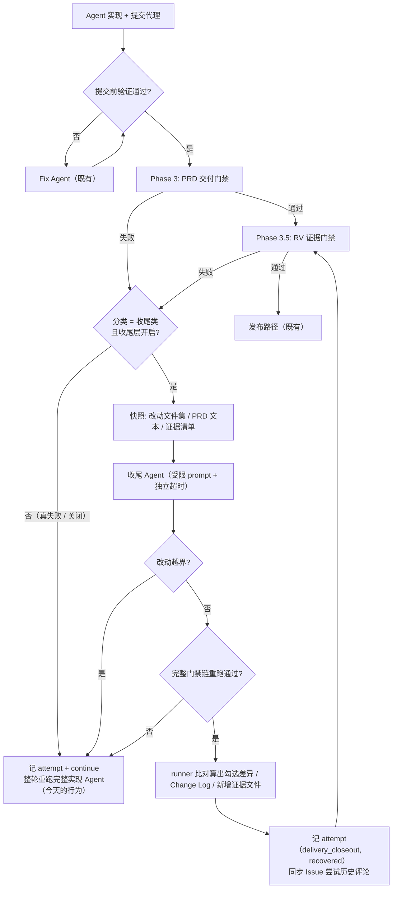

# PRD: Agent Runner 交付收尾轻量修复层（Closeout Agent）

> 本 PRD 分两个 altitude，分别服务不同读者，自上而下阅读：
>
> - **Part A · 人审层 (Review Layer)** — 需求方 / 验收人读这部分，决定"该不该做、做得对不对"，并通过风险地图知道**哪些地方必须亲自确认**。Part A 不出现实现机制、文件路径、命令。
> - **Part B · 执行器层 (Build Layer)** — 实现者（人或 Agent）读这部分动手。人只在 Part A 风险地图**点名处**下钻审查，其余默认交执行器 + 自动门禁（hook / 测试 / 架构检查）。

---

# Part A · 人审层 (Review Layer)

## 1. Introduction & Goals

### Problem Statement

iar 的 Agent Runner 在"代码已经写完、已经提交、验证命令已经全过"之后，还有一道**交付门禁**：PRD 的验收清单必须全勾、PRD 改动必须有 Change Log 记录、真实验证（Realistic Validation，下称 RV）的证据必须齐备。这道门禁失败时，runner 的处理方式只有一种——**把整轮作废，重新调用完整的实现 Agent 从头再来**。

这不是理论问题。本机运行历史库（`~/.iar/console.db` 的 `attempt_records`）里，2026-06-26 之后的失败记录显示：

| 失败类别 | 次数 | 累计耗时 |
|---|---|---|
| RV 证据门禁 | 104 | 42 小时 |
| PRD 交付门禁 | 84 | 29 小时 |
| 提交前验证失败（已有轻量修复层覆盖） | 57 | 33 小时 |

把这 188 次门禁失败按真实原因拆开，其中 **103 次（35 小时）属于"代码是对的，只差交付收尾动作"**：

| 原因 | 次数 | 累计耗时 |
|---|---|---|
| 验收清单有未勾项 | 68 | 24 小时 |
| PRD 改了但没写 Change Log 条目 | 15 | 4.4 小时 |
| 前端有改动但没有截图/录屏证据 | 11 | 3.3 小时 |
| 证据清单文件的字段格式非法 | 9 | 2.8 小时 |

剩下 60 次是**真失败**（RV 命令重跑不通过 29 次、证据与清单对不上或交叉污染 31 次），那些理应重跑。

代码层面的原因很明确：runner 已经有一个轻量修复层（Fix Agent，2026-06-26 落地），但它只在"暂存后验证失败"这一个入口被触发；它的 prompt 构造函数 docstring 里白纸黑字写着**不得改动证据文件、PRD 验收清单**。当年做这个边界时，复盘样本是一个漏 import 的 lint 错误，而且归档注记记录了"观测窗口内暂存验证失败只出现过 1 次"——在那个窗口里判断是对的。两个月后数据翻转：被排除的那两桶是它实际覆盖桶的 3.3 倍。

结果就是：一个 Issue 干了 20 分钟活、代码正确、测试全绿，因为一个勾选框没打，20 分钟全部作废重来。

### Interpretation (解读回显)

我把这个需求读作：**在现有两层修复阶梯上补第三层"交付收尾层"，只接住"代码已正确、只差收尾动作"的门禁失败**，让这类失败用一次短命的收尾修复解决，而不是重跑完整实现。

具体地——

**只处理这四类**：验收清单有未勾项、PRD 改动缺 Change Log 条目、证据清单文件字段格式非法、前端改动缺视觉证据。

**明确不处理这三类**，它们保持今天的整轮重跑，一个字节都不改：RV 命令重跑不通过、证据与清单不匹配或交叉污染、RV 辅助脚本放错位置。理由是这三类意味着"行为其实没做对"或"验证其实没真跑过"，让一个轻量 pass 去"修"它们，等于教 agent 把门禁刷绿。

三条已确认的硬边界：

1. **勾选框不是想勾就能勾。** 收尾 pass 只被允许勾选"该行为确已执行、且能指认出具体证据"的条目，并且必须为每一项写出它依据的证据文件或命令输出。任何一项拿不出依据，就不勾它，整轮升级到今天的完整重跑。
2. **收尾 pass 不许碰代码。** 它的改动范围只有 PRD 文件和证据目录；越界就判失败并升级。这条不靠 prompt 约束，靠 runner 自己比对改动文件集来强制。
3. **勾了什么由 runner 说了算，不采信 agent 自述。** runner 比对收尾前后的 PRD，自己算出真实发生的勾选差异，写进 Issue 评论。

我**不**把它读作：

- ❌ 放宽或取消任何一道质量门禁——门禁判定逻辑本身不动
- ❌ 允许收尾 pass 修改 RV 命令、测试、源码，或让 RV 重跑失败变绿
- ❌ 把"自动勾选清单"做成纯确定性脚本——勾选框背后没有独立验证源，脚本自动勾等于自动放行
- ❌ 改动提交代理（commit proxy）、WIP checkpoint、跨 claim 续作机制
- ❌ 改动 agent 的调用方式或跨 agent fallback 链

如果这个解读偏了，请在动工前指出——尤其是"三类真失败保持整轮重跑"这条边界已经明确划线，不要以"顺手也能修"为由扩进来。

### What The User Gets

**跑 iar 的运营者**拿到：

- 一个 Issue 因为交付收尾没做完被门禁打回时，runner 先起一个**只做收尾、时间上限受控**的短命修复；收尾成功就在**同一轮**继续走发布流程，不再重跑完整实现。收尾失败才退回今天的整轮重跑行为。
- Issue 评论里能看到这一轮收尾**实际动了什么**：勾了哪几项验收条目、每项依据什么证据、补了哪些证据文件、追加了哪条 Change Log。这份记录由 runner 自己比对得出，agent 说了不算。
- 一个开关可以把整层关掉，行为完全回到今天。文本类收尾和视觉证据补采分别有自己的时间上限——补一张截图需要真把应用跑起来，不该和"补一条 Change Log"共用同一个短超时。

**被 iar 服务的下游仓库**：门禁标准一格没松。清单还是要全勾、Change Log 还是要写、证据还是要齐、RV 命令还是由 keda 重跑核验。变的只是"没做完收尾"这件事的修复代价。

**keda 开发者**：修复阶梯从两层变三层，分层依据在抛出门禁错误的地方就标好类型，不靠事后猜错误文案。

### Measurable Objectives

1. 四类收尾失败不再触发完整实现 Agent：门禁失败后同一轮的 attempt 记录中出现收尾条目，且实现 Agent 的调用次数不增加。
2. 收尾的时间上限可控且与视觉采集分离：文本类收尾受一个上限约束、视觉证据补采受另一个更长的上限约束，两者都可配置，超时即升级。
3. 收尾 pass 无法改动代码：在收尾前后比对改动文件集，出现 PRD 文件与证据目录之外的改动时，runner 判该次收尾失败并升级——有测试能让这条断言变红。
4. 无证据的清单条目不会被勾上：构造一个"未勾且无任何证据"的验收条目，收尾后该条目仍未勾且整轮升级——有测试能让这条断言变红。
5. 三类真失败行为不变：RV 重跑不通过、证据不匹配/污染、RV 脚本错放，其 attempt 记录中不出现收尾条目。

## 2. Human Review Map (介入与风险地图)

### 决策一：验收清单的勾选权归谁

验收清单是这几道门禁里**唯一一个背后没有独立验证源**的：RV 命令由 keda 亲自重跑，Change Log 有前后基线比对，证据文件的存在性可以直接查——只有勾选框是纯声明，勾上就算数。所以把它交给一个轻量 pass 是这个 PRD 里风险最高的一步：做错了，"验收清单"就从质量门变成了一个 agent 顺手能刷绿的形式。

我的方案是给它加一个人为的举证义务：收尾 pass 只能勾"该行为确已执行、且能指认到具体证据文件或命令输出"的条目，并逐项写出依据；任何一项举不出依据就不勾，整轮升级回完整重跑。同时，最终写进 Issue 评论的"本轮勾了哪几项"由 runner 比对收尾前后的 PRD 自己算出，不采信 agent 的自我陈述——agent 可以说谎，前后文本差异不会。

**请确认：** 收尾 pass 采用"举证后才可勾选、举不出就不勾并整轮升级"，而不是"看到未勾就补勾"？

**验收：** 构造一个未勾且没有任何对应证据的验收条目，跑真实入口后该条目仍然是未勾状态，且本轮升级到了完整重跑；把这条约束去掉后该测试变红。

### 决策二：收尾 pass 绝对不许碰代码

收尾层存在的前提是"代码已经正确"。一旦它能顺手改源码或测试，它就不再是收尾层，而是一个没有完整上下文、超时更短、约束更松的第二实现 Agent——那比今天的整轮重跑更危险，因为它改完之后紧接着就是发布路径。

光靠 prompt 里写"不要改代码"不够。我的方案是让 runner 在收尾前后各取一次改动文件集，只允许 PRD 文件与证据目录内的路径；出现任何越界文件，直接判本次收尾失败并升级到完整重跑，越界内容由后续的完整重跑重新处理。

**请确认：** 收尾 pass 的可改范围硬性限定为 PRD 文件 + 证据目录，越界即判失败升级？

**验收：** 让收尾阶段的 agent 故意改一个源码文件，runner 必须判该次收尾失败并升级；把这条越界检查去掉后该测试变红。

### 决策三：哪些失败明确不进收尾层

RV 命令重跑不通过、证据与清单不匹配或交叉污染、RV 辅助脚本放错位置——这三类不进收尾层，保持今天的整轮重跑。原因不是"修不动"，而是它们表达的是"行为没做对"或"验证没真跑过"；用一个轻量 pass 去消除这类信号，就是在拆自己的验证体系。

需要人确认的原因是：这条线一旦划错，后果是静默的——门禁照样变绿，PR 照样进人审，只是绿灯不再代表任何东西。

**请确认：** 这三类保持原样，收尾层不得触碰？

**验收：** 分别构造这三类失败，其 attempt 记录中不出现收尾条目，且流程走向与改动前一致。

### 自动门禁，不需要逐项人工审阅

新增配置项的三处映射同步、收尾层的开关默认值与超时回退、attempt 记录与 Issue 评论的渲染、日志措辞、文档更新——这些由执行器完成，靠单元测试、配置一致性测试和 lint 覆盖。分层判定不采用"匹配错误文案"的方式，而是在抛出门禁错误的地方就带上类型标记，避免文案改写导致的静默漂移；这一点由针对每个抛出点的测试固定。

### 本次明确不涉及

不改数据库结构（运行历史库的失败类型字段是文本列，新增取值不需要迁移），不改前端（runner 是 CLI/后台路径，管理端不展示 attempt 记录），不改 agent 调用方式与跨 agent fallback 链，不改提交代理与 WIP checkpoint，不新增对外 CLI 子命令。

## 3. Usage And Impact After Implementation

### 运营者（跑 `iar daemon` / `iar run` 的人）

入口不变，仍然是同一个 daemon 或单次运行。变化发生在一个 Issue 因交付收尾被打回的时刻：

今天——终端和 Issue 评论上看到"PRD 交付检查失败：验收清单有未勾项"，然后整轮重来，20 多分钟后再看结果。

之后——同样看到门禁失败，紧接着看到一次收尾修复启动；成功则本轮直接继续发布，Issue 评论的尝试历史里多出一条收尾记录，写明勾了哪几项、各自依据什么证据、补了哪些证据文件、追加了哪条 Change Log；失败则退回今天的整轮重跑，中间没有任何新的等待状态。

三类真失败（RV 重跑不过、证据不匹配、RV 脚本错放）对运营者来说观感完全不变。

### 被 iar 服务的下游仓库

无需任何改动即可获得新行为。门禁标准不变，PRD 写法不变，证据要求不变。想关掉这一层回到今天的行为，在仓库自己的 `.iar.toml` 里把开关置否即可——这个配置项走的是逐仓库配置路径，改完下一轮轮询生效，无需重启 daemon。

### keda 开发者

修复阶梯变成三层：暂存验证失败走 Fix Agent，交付收尾失败走 Closeout Agent，两者失败都升级到完整 Recovery Agent。新增门禁失败点时，需要在抛出处显式声明它属于收尾类还是真失败类；未声明的默认按真失败处理（保持整轮重跑），所以漏标的后果是"少省一点时间"，不是"门禁被绕过"。

### 对既有行为的影响

新增三个可选配置项，全部有默认值：收尾层默认开启，文本类收尾超时默认 600 秒，视觉证据补采超时默认 1800 秒；默认未填写时配置加载正常完成。既有 PRD、既有证据、既有 Issue 状态机、既有 attempt 历史评论格式均保持兼容——收尾记录是尝试历史表里新增的一行，不改变既有行数据的渲染。

## 4. Requirement Shape

- **Actor**：Agent Runner 执行循环（`run_agent_execution_loop`）；间接受影响者为跑 iar 的运营者、被服务的下游仓库、keda 开发者。
- **Trigger**：一次 attempt 中，代码已提交且提交前验证已通过，随后 PRD 交付门禁或 RV 证据门禁抛出被标记为"收尾类"的失败。
- **Expected Behavior**：
  - runner 在同一轮内启动一次受时间上限约束的收尾修复，只提供该门禁失败的上下文与收尾约束。
  - 收尾结束后，runner 比对改动文件集；越界即判失败。
  - runner 重跑完整门禁链（PRD 交付 + 证据齐备 + RV 命令重跑）；全过则本轮继续走发布，未过则按今天的路径升级为完整重跑。
  - runner 自行比对收尾前后的 PRD，算出真实勾选差异与新增 Change Log 条目，连同新增证据文件一起记入 attempt 历史并同步到 Issue 评论。
- **Scope Boundary**：
  - 只接四类收尾失败：验收清单未勾、Change Log 缺失或不完整、证据清单字段格式非法、前端改动缺视觉证据。
  - 不接三类真失败：RV 命令重跑不通过、证据与清单不匹配或交叉污染、RV 辅助脚本错放。
  - 不修改任何门禁的判定逻辑与判定标准。
  - 不修改提交代理、WIP checkpoint、跨 claim 续作、agent 调用与 fallback 链。
  - 不新增数据库结构、外部依赖、CLI 子命令、前端改动。

---

# Part B · 执行器层 (Build Layer)

## 5. Repository Context And Architecture Fit

### 当前相关模块

| 文件 | 当前职责 | 与本 PRD 的关系 |
|---|---|---|
| `src/backend/core/use_cases/run_agent_execution_loop.py` | 单次 claim 的 attempt 循环：agent 调用 → 提交代理 → PRD 交付门禁 → RV 证据门禁 → 发布 | 主改动点：在两处门禁的 `except` 分支插入收尾层 |
| `src/backend/core/use_cases/agent_runner_feedback.py` | PRD 交付门禁判定（`ensure_prd_delivery_ready`、`_validate_prd_checklist`、`_validate_prd_change_log`）、各类 prompt 构造（含 `build_fix_prompt`） | 抛出点打类型标记；新增收尾 prompt 构造 |
| `src/backend/core/use_cases/agent_runner_validation.py` | RV 证据门禁（`ensure_validation_evidence_ready`、`ensure_frontend_visual_evidence`、`ensure_validation_commands_pass`、`ensure_no_misplaced_evidence_helpers`） | 抛出点打类型标记；区分收尾类与真失败类 |
| `src/backend/core/use_cases/run_agent_once.py` | agent 进程调用编排（`run_fix_agent`、各 agent 命令构造） | 新增 `run_closeout_agent`，复用现有调用与超时机制 |
| `src/backend/core/shared/models/agent_runner.py` | core 层领域模型（`RunnerConfig`、`FailureType`、`AttemptResult`） | 新增门禁失败分类枚举、收尾配置字段、失败类型取值 |
| `src/backend/core/shared/prd_checklist.py` | PRD 验收清单解析（`parse_prd_checklist`，返回未勾条目的行号与文本） | 复用：收尾前后各解析一次以计算真实勾选差异 |
| `src/backend/infrastructure/config/settings.py` | Pydantic Settings | 新增三个配置字段 |
| `src/backend/engines/agent_runner/factory_config_builder.py` | Settings → `AppConfig` 映射 | 映射三个新字段 |
| `src/backend/engines/agent_runner/repository_local.py` | `.iar.toml` 逐仓库配置的键说明与写入 | 登记三个新键 |

### 架构约束

- 门禁失败分类是**纯业务规则**，必须落在 `core/` 层，不得依赖 GitHub API 或进程执行细节。
- 依赖方向不变：`api/ → core/ → engines/ → infrastructure/`；执行循环不得直接导入 `engines/` 或 `infrastructure/`。
- agent 进程调用继续通过 `IProcessRunner` 接口，收尾层不新增接口。
- 配置新增字段必须**三处同步**：core 领域 dataclass、Pydantic Settings、factory 映射。运行时读的是 core 领域对象，只改前两处会被相同默认值掩盖而看不出问题。
- 收尾配置在执行循环中通过逐仓库的 `AppConfig` 读取，因此 `.iar.toml` 的逐仓库覆盖对本功能**真实生效**（与 `daemon --concurrency` 那类在 CLI 启动时读全局设置的键不同）。

### 前端影响

`No frontend impact` — Agent Runner 是 CLI / 后台执行路径；管理端不渲染 attempt 记录（`rg -l "attempt" frontend-admin/src` 无功能性命中）。本 PRD 不改任何 HTTP 契约与页面。

### 既有 PRD 关系

| PRD | 状态 | 关系 |
|---|---|---|
| `tasks/archive/P1-FEAT-20260626-015233-agent-runner-recovery-friction-reduction.md` | 已归档 | **前置**。本 PRD 是它的范围增量：它建立了 Fix Agent 两层阶梯并显式把证据/清单排除在外，本 PRD 补第三层接住被排除的那一桶。不重复它的机制，复用其 prompt/调用/超时分层三件套。 |
| `tasks/pending/P1-FEAT-20260714-171537-prd-change-log-vs-checklist.md` | pending（代码已在库中：`_validate_prd_change_log` 已实现并在生产触发 15 次） | **soft 依赖**。本 PRD 依赖其定义的 Change Log 门禁语义（基线比对 + 条目字段完整性），但不改动它；若其后续调整字段要求，本 PRD 的收尾 prompt 需同步。 |
| `tasks/pending/P1-FEAT-20260705-161739-completeness-judgment-hardening.md` | pending | **相邻但独立**。它加固的是 verifier 默认值与 supervisor 分层（agent 自证之后的对抗复验），本 PRD 改的是 recovery 分层（自证之前的修复路径）。两者无共享改动点，可并行。 |
| `tasks/pending/P1-FEAT-20260705-161739` 之外的其余 5 个 pending PRD | pending | 无关（roadmap 调度、记忆锚定、API/engines 分层迁移、文件行数拆分、PRD 重接地）。 |

无重复work：现有 pending PRD 中没有任何一个处理"门禁失败的修复代价"。

## 6. Recommendation

### Recommended Approach

**在现有 Fix Agent 阶梯上增加第三层收尾修复，分层依据由抛出点的类型标记决定。**

两个关键设计选择：

**其一：在抛出处打类型标记，不在循环里匹配错误文案。** 门禁错误信息是给 agent 读的英文散文（"Acceptance Checklist has unchecked items in ..."），会随 prompt 调优被改写。用正则把这些文案分流，漂移是必然的，而漂移的方向恰恰是最危险的那个——一条被改写的"RV 重跑失败"文案匹配不上真失败规则，就会掉进收尾层。改为在每个 `raise` 处显式声明该失败属于收尾类还是真失败类，默认值取真失败：漏标的后果是少省一点时间，不是门禁被绕过。

**其二：安全边界靠 runner 的确定性比对，不靠 prompt 约束。** 收尾 pass 的两条硬约束——不许改代码、不许勾无证据的条目——都不能只写在 prompt 里。前者由 runner 比对收尾前后的改动文件集强制；后者由 runner 比对收尾前后的 PRD 文本得出真实勾选差异并公开留痕，再叠加"任一未勾项残留即升级"的既有门禁行为兜底。agent 可以在自述里说谎，前后差异不会。

### 为什么这是当前架构的最佳落点

Fix Agent 已经把"轻量修复 → 失败升级完整 Recovery"的两级结构、prompt 构造约定、超时分层配置全部铺好了。收尾层是同一模式的第三个实例，不引入新的编排概念、新的状态、新的接口。执行循环里两处门禁的 `except` 分支是天然的插入点，与 Fix Agent 挂在提交阶段 `except` 的位置对称。

### 拒绝冗余抽象的理由

- 不新建"修复策略注册表 / 修复引擎"这类抽象：目前只有三个具体层，硬编码的三段式比可插拔注册表更容易读懂，也更难被误配置成绕过门禁。
- 不新建持久状态：收尾结果通过既有 attempt 记录与 Issue 评论表达，无需新表、新文件、新缓存。
- 不新建 agent 角色配置：收尾复用当前轮次已选定的 agent，不引入"收尾用哪个 agent"这个新的配置维度。

### Proposed Solution Summary (实现机制)

核心机制是**在门禁抛出点携带分类、在执行循环里按分类分流到一个受限的收尾 agent、用确定性比对约束其行为**。

- **谁提供分类**：由抛出门禁错误的代码显式提供，不做推断。`PrdDeliveryError` 与 `ValidationEvidenceError` 各增加一个可选的分类属性，取值来自 core 层新增的门禁失败分类枚举；四个收尾类抛出点显式声明自己的类别，其余抛出点不声明、默认按真失败处理。
- **插进哪个既有入口**：`run_agent_execution_loop` 中 PRD 交付门禁（Phase 3）与 RV 证据门禁（Phase 3.5）的 `except` 分支，在现有 `continue`（整轮重跑）之前插入收尾分支。与 Fix Agent 挂在提交阶段 `except` 的结构一致。
- **收尾 agent 做什么**：复用当前轮次的 agent，用一个只含该门禁失败与收尾约束的 prompt 启动，受独立超时约束（文本类与视觉采集类各一个上限）。prompt 明确要求：只做收尾；勾选任何验收条目前必须指认其证据；举不出证据的条目保持未勾并说明原因；不得修改源码、测试或 RV 命令。
- **系统状态与可见行为的变化**：收尾成功时，本轮不再回到实现 Agent，直接继续走既有发布路径；attempt 历史新增一条收尾记录，同步进 Issue 上那条既有的尝试历史评论。记录内容中"勾了哪几项 / 新增哪条 Change Log / 新增哪些证据文件"三项由 runner 自己比对得出。
- **刻意规避的复杂度**：不新增存储与状态机；不新增可插拔策略抽象；不改门禁判定逻辑；不改 agent 调用方式与 fallback 链；不给收尾层单独的 agent 选择配置；不改 attempt 编号语义（收尾发生在同一个 attempt 内部，与 Fix Agent 一致）。

### Alternatives Considered

| 备选 | 为什么不选 |
|---|---|
| **纯确定性自动勾选**（runner 直接把未勾项勾上，不起 agent） | 勾选框背后没有独立验证源。多数验收条目（架构验收、文档验收）无法机器判定其是否真的完成，脚本自动勾等于自动放行。仅对能映射到 RV 条目的少数条目可确定性判定，覆盖面太小、特例逻辑复杂。 |
| **匹配错误文案分流** | 文案是会被改写的英文散文，漂移必然发生，且漂移方向危险（真失败掉进轻量路径）。 |
| **把收尾职责合并进现有 Fix Agent** | Fix Agent 的 prompt 契约（"只修当前验证失败，不碰全局交付物"）正是它有效的原因；混入收尾职责会让它同时面对两类完全不同的任务，退化回"一启动就要处理所有事"——那正是它当初要解决的问题。 |
| **收尾失败后再重试收尾若干次** | 收尾失败通常意味着判断错了类别（其实是真失败），重试只会放大延迟。一次不成立刻升级，与 Fix Agent 的既有策略一致。 |

## 7. Implementation Guide

This section is a living implementation guide based on current repository analysis. If implementation discovers additional affected files, hidden dependencies, edge cases, or a better path, update this PRD before proceeding.

### 7.1 Core Logic

数据与控制流（一次 attempt 内）：

1. agent 实现 → 提交代理 → 提交前验证。此段完全不变（Fix Agent 仍挂在这里）。
2. **Phase 3 PRD 交付门禁**：`ensure_prd_delivery_ready` 抛 `PrdDeliveryError`。捕获后先读其分类属性：
   - 分类为收尾类（清单未勾 / Change Log 缺失或不完整）且收尾层开启 → 进入下方收尾流程。
   - 否则 → 走今天的路径（记录 attempt、`continue` 整轮重跑），逐字节不变。
3. **Phase 3.5 RV 证据门禁**：`ensure_validation_evidence_ready` / `ensure_frontend_visual_evidence` 抛 `ValidationEvidenceError`，同样按分类分流；`ensure_validation_commands_pass`（RV 重跑）与错放脚本检查的抛出点**不声明分类**，因此永远走整轮重跑。
4. 收尾流程结束后无论成败，都回到同一处门禁重跑点：成功则继续 Phase 3.5 / 发布；失败则落回步骤 2/3 的既有 `continue` 路径。

#### 收尾流程（新增）

```
门禁抛出收尾类失败
  ├─ 记录门禁前快照：改动文件集、PRD 文本、证据目录文件清单
  ├─ 启动收尾 agent（当前轮次 agent；文本类超时 / 视觉类超时二选一）
  ├─ 越界检查：改动文件集差异 ⊄ {PRD 文件, 证据目录} → 判失败，升级
  ├─ 重跑完整门禁链：PRD 交付 + 证据齐备 + RV 命令重跑
  │    ├─ 全过 → 计算收尾差异（勾选项 / Change Log 条目 / 新增证据文件）
  │    │        → 记 attempt（收尾类型，recovered=True）→ 同步 Issue 评论 → 本轮继续
  │    └─ 未过 → 判失败，升级
  └─ 升级 = 今天的行为：记 attempt、continue、整轮重跑完整实现 Agent
```

越界检查的判定基准是 worktree 中相对仓库根的改动路径集合（含未跟踪文件），允许集为：Issue body 指向的 canonical PRD 路径、其归档目标路径、`config.validation.evidence_dir` 下的任意路径。任何其他路径出现即越界。

### 7.2 Change Impact Tree

```text
.
├── src/backend/core/shared/models/
│   └── agent_runner.py
│       [修改]
│       【总结】新增门禁失败分类枚举、收尾层三项配置字段、收尾失败类型取值
│
│       ├── 新增 `DeliveryGateFailureKind` 枚举：CHECKLIST_UNCHECKED /
│       │   CHANGE_LOG_INCOMPLETE / EVIDENCE_MANIFEST_FORMAT /
│       │   FRONTEND_VISUAL_EVIDENCE_MISSING / SUBSTANTIVE（默认）
│       ├── `RunnerConfig` 新增 closeout_agent_enabled: bool = True、
│       │   closeout_timeout_seconds: int | None = None、
│       │   closeout_visual_timeout_seconds: int | None = None
│       │   （None 时依次回退 fix_timeout_seconds → timeout_seconds）
│       └── `FailureType` 新增 DELIVERY_CLOSEOUT = "delivery_closeout"
│           （运行历史库该列为 TEXT，无需迁移；见 Executor Drift Guard）
│
├── src/backend/core/use_cases/
│   ├── agent_runner_feedback.py
│   │   [修改]
│   │   【总结】门禁错误携带分类；新增收尾 prompt 与收尾差异计算
│   │
│   │   ├── `PrdDeliveryError` 增加可选 kind 属性，默认 SUBSTANTIVE
│   │   ├── `_validate_prd_checklist` 的未勾项抛出标 CHECKLIST_UNCHECKED；
│   │   │   "清单章节缺失" 保持 SUBSTANTIVE（章节都没有说明 PRD 结构有问题）
│   │   ├── `_validate_prd_change_log` 的四个抛出全部标 CHANGE_LOG_INCOMPLETE
│   │   ├── 新增 `build_closeout_prompt(issue, worktree_path, *, gate_failure,
│   │   │   kind, evidence_dir)`：只含该门禁失败与收尾约束；要求逐项指认证据；
│   │   │   举不出证据的条目保持未勾并说明；禁止改源码/测试/RV 命令
│   │   └── 新增 `summarize_closeout_changes(before, after)`：由前后 PRD 文本与
│   │       证据文件清单算出真实勾选差异、新增 Change Log 条目、新增证据文件
│   │
│   ├── agent_runner_validation.py
│   │   [修改]
│   │   【总结】证据门禁抛出点区分收尾类与真失败类
│   │
│   │   ├── `ValidationEvidenceError` 增加可选 kind 属性，默认 SUBSTANTIVE
│   │   ├── `ensure_frontend_visual_evidence` 抛出标
│   │   │   FRONTEND_VISUAL_EVIDENCE_MISSING
│   │   ├── 结构化清单校验（`validate_evidence_manifest` 传导上来的字段格式类
│   │   │   失败）标 EVIDENCE_MANIFEST_FORMAT
│   │   ├── 证据目录为空、覆盖不匹配（"does not match the checklist"）、
│   │   │   交叉污染 → 保持 SUBSTANTIVE（"没真跑过"不是收尾问题）
│   │   └── `ensure_validation_commands_pass`、
│   │       `ensure_no_misplaced_evidence_helpers` → 保持 SUBSTANTIVE
│   │
│   ├── run_agent_once.py
│   │   [修改]
│   │   【总结】新增收尾 agent 调用，复用 Fix Agent 的调用与超时机制
│   │
│   │   ├── 新增 `run_closeout_agent(agent_name, issue, worktree_path, config,
│   │   │   process_runner, *, gate_failure, kind)`
│   │   ├── 超时选择：kind 为视觉证据类取 closeout_visual_timeout_seconds，
│   │   │   否则取 closeout_timeout_seconds；均按 None 回退链解析
│   │   └── 新增 `collect_changed_paths(worktree_path, process_runner)`：改动
│   │       文件集快照（含未跟踪），供越界检查使用；若已有等价 helper 则复用
│   │
│   └── run_agent_execution_loop.py
│       [修改]
│       【总结】两处门禁 except 分支插入收尾分支，失败落回既有整轮重跑
│
│       ├── Phase 3 与 Phase 3.5 的 except 中，按 exc.kind 与
│       │   config.runner.closeout_agent_enabled 分流
│       ├── 新增内部 helper 承载 7.2 流程（越界检查 → 门禁重跑 → 差异计算），
│       │   两处 except 共用，禁止复制两份
│       ├── 收尾成功：以 FailureType.DELIVERY_CLOSEOUT + recovered=True 记一条
│       │   attempt，经既有 `_append_attempt_and_notify` / `on_attempt_recorded`
│       │   同步到 Issue 尝试历史评论；本轮继续原流程
│       ├── 收尾失败：不吞异常，落回该 except 既有的记录 + continue 路径
│       └── 用 `attempt_phases.measure("closeout")` 打点，使耗时进入既有的
│           phase 分解
│
├── src/backend/infrastructure/config/
│   └── settings.py
│       [修改]
│       【总结】Pydantic Settings 同步三个收尾配置字段
│
├── src/backend/engines/agent_runner/
│   ├── factory_config_builder.py
│   │   [修改]
│   │   【总结】Settings → RunnerConfig 映射补三个字段（第三处同步，漏改会被
│   │   相同默认值掩盖）
│   │
│   └── repository_local.py
│       [修改]
│       【总结】`.iar.toml` 键说明表登记 runner.closeout_agent_enabled 等三项
│
├── config.toml
│   [修改]
│   【总结】[agent_runner.runner] 增加三项带中文注释的默认值
│
├── tests/
│   ├── test_agent_runner_closeout.py
│   │   [新增]
│   │   【总结】收尾层行为主测试
│   │
│   │   ├── 收尾成功后本轮继续发布，未再调用实现 Agent
│   │   ├── 无证据条目不被勾选 → 升级整轮重跑
│   │   ├── 收尾越界改源码 → 判失败并升级
│   │   ├── 三类真失败不进收尾层（分别断言）
│   │   ├── closeout_agent_enabled=false 时行为与改动前一致
│   │   └── 视觉证据类使用独立超时，文本类使用文本超时
│   │
│   ├── test_agent_runner_prd_delivery.py
│   │   [修改]
│   │   【总结】断言各 PRD 交付抛出点携带正确分类
│   │
│   ├── test_agent_runner_validation.py
│   │   [修改]
│   │   【总结】断言各证据门禁抛出点的分类，尤其真失败类保持 SUBSTANTIVE
│   │
│   └── test_agent_runner_config.py
│       [修改]
│       【总结】三处配置同步断言（领域对象读到的值随 settings 变化）
│
└── docs/guides/agent-runner.md
    [修改]
    【总结】在 Fix Agent 章节后补收尾层：触发条件、四类范围、三类排除、
    两个超时、开关、Issue 评论留痕内容
```

文件清单是起点而非穷举，仓库范围引用见 Executor Drift Guard。

### 7.3 Risk Classification Register

| 变更点 | 层 | 风险等级 | 决定性维度 / 覆盖 | 介入 | Oracle / 门禁 |
|---|---|---|---|---|---|
| 收尾 pass 勾选验收清单条目 | core | **R3** | 正确性关键 + 固定区（核心业务编排）：勾选框无独立验证源，误放行使门禁失效且不可事后察觉 | 人工确认（决策一） | rv-2 无证据条目不被勾选 + 反向对照 |
| 收尾 pass 的可改文件范围 | core | **R3** | 正确性关键：越界即等于一个约束更松的第二实现 Agent 直通发布路径 | 人工确认（决策二） | rv-3 越界即失败 + 反向对照 |
| 收尾类 / 真失败类的分流边界 | core | **R2** | 影响面 + 正确性：错分静默，绿灯不再代表验证通过 | 人工确认（决策三） | rv-4 三类真失败不进收尾层 |
| 门禁抛出点携带分类属性 | core | R1 | 行为局限于抛出点，默认值取真失败使漏标偏保守 | 执行器 + 自动门禁 | 每个抛出点的分类断言（`test_agent_runner_prd_delivery.py` / `test_agent_runner_validation.py`） |
| 执行循环插入收尾分支 | core | R2 | 正确性：失败路径必须逐字节回落到今天的 `continue` 行为 | 执行器 + 强 oracle | rv-1 成功路径 + 开关关闭时行为一致性测试 |
| 收尾差异计算与 Issue 留痕 | core | R1 | 展示性，错误可见且可回滚 | 执行器 + 自动门禁 | 差异计算单测（前后 PRD 文本 → 勾选差异） |
| 新增 `FailureType` 取值 | core | R1 | 运行历史库该列为 TEXT，无结构变更；风险在穷举匹配处漏分支 | 执行器 + 自动门禁 | Drift Guard 的 `FailureType.` 全仓搜索 + 现有失败分类测试 |
| 三项配置的三处映射 | core/infrastructure/engines | R1 | 漏映射会被相同默认值掩盖 | 执行器 + 自动门禁 | `test_agent_runner_config.py` 断言领域对象读到变更后的值 |
| 文档更新 | docs | R0 | 表述性 | 执行器 + 自动门禁 | `uv run mkdocs build --strict` |

### 7.4 Executor Drift Guard

改动前后各跑一遍，确认没有遗漏的引用点：

```bash
rg -n "PrdDeliveryError|ValidationEvidenceError" src/ tests/
```

```bash
rg -n "FailureType\." src/ tests/
```

```bash
rg -n "fix_agent_enabled|fix_timeout_seconds|recovery_timeout_seconds" src/ tests/ config.toml docs/
```

```bash
rg -n "run_fix_agent|build_fix_prompt" src/ tests/
```

```bash
rg -n "closeout" src/ tests/ config.toml docs/
```

排查提示：
- 新增 `FailureType` 取值后，若某处对失败类型做穷举匹配（`match` / 字典查表）而未加分支，表现为收尾 attempt 在某个渲染路径上丢失或报 KeyError——第一处该看的是失败分类与 attempt 历史渲染。
- 三项配置若只改了 Settings 与 factory、漏了 core 领域 dataclass（或反过来），因默认值相同，测试与运行都可能"看起来正常"，直到有人在 `.iar.toml` 里改值才发现不生效。断言方式必须是"改 settings 后从领域对象读到新值"，不能只断言 settings 自身。
- `.iar.toml` 的逐仓库覆盖对本功能生效（执行循环读逐仓库 `AppConfig`）；不要照搬 `daemon --concurrency` 那条在 CLI 启动时读全局设置的路径的结论。

### 7.5 Flow Diagram



#### ER Diagram

`No data model changes in this PRD.` 运行历史库 `attempt_records.failure_type` 为 TEXT 列，新增取值不涉及结构变更或迁移。

### 7.6 Realistic Validation Plan

真实入口统一为 `uv run iar run --repo <fixture-repo>`，配合放在 `PATH` 前部的桩 `claude` 脚本使 agent 行为确定性可复现（keda 会重跑 RV 命令，非确定性的真实模型调用会导致复跑必闪）。所有 fixture 与桩脚本置于证据目录的 oracle 子目录下，不进代码 diff。

```yaml
- id: rv-1
  behavior: 验收清单未勾导致门禁失败时，runner 用一次收尾修复在同一轮解决，不重跑完整实现 Agent
  real_entry: "uv run iar run --repo $CLOSEOUT_FIXTURE_REPO"
  expected: "stdout / 每 Issue 日志中出现收尾阶段启动与成功；实现 Agent 只被调用 1 次；本轮进入发布路径；Issue 尝试历史评论新增一条 delivery_closeout 记录，列出被勾选的条目及其依据证据"
  mock_boundary: "GitHub 侧用本地 fixture 与桩 gh 交互；agent CLI 用桩 claude 脚本。被测边界——执行循环的门禁分流、越界检查、门禁重跑、差异计算——全部真实执行，不得 mock"
  critical_value_source: "被勾选条目清单取自 runner 对收尾前后 PRD 文本的 parse_prd_checklist 差异，不取自桩 agent 的自述输出"
  must_cross: "iar CLI -> 执行循环 Phase 3 门禁 -> 收尾 agent 子进程 -> 越界检查 -> 完整门禁链重跑 -> attempt 记录 -> Issue 评论渲染"
  forbidden_bypasses: "不得直接调用 run_closeout_agent 或内部 helper；不得用 pytest 断言替代 CLI 入口；不得跳过门禁重跑直接判定成功"
  fresh_state_probe: "收尾结束后重新读取 worktree 中的 PRD 文件与 attempt 记录（新进程 / 新读取），确认勾选状态与记录一致"
  final_tree_evidence: "证据文件记录最终实现树的 git HEAD；执行循环、feedback、validation 三个模块中任一后续改动都必须重跑本条"
  negative_control: "把执行循环中的收尾分支短路（直接走 continue），本条必须变红：实现 Agent 被调用 2 次且无 delivery_closeout 记录"
  expected_fail: "尝试历史中出现第二次实现 Agent 调用，且无收尾记录"
  test_layer: e2e
  required_for_acceptance: true

- id: rv-2
  behavior: 没有任何证据支撑的验收条目不会被收尾 pass 勾上，整轮升级为完整重跑
  real_entry: "uv run iar run --repo $CLOSEOUT_FIXTURE_REPO_NO_EVIDENCE"
  expected: "收尾后该条目在 PRD 中仍为未勾状态；本轮升级到完整重跑（尝试历史出现第二次实现 Agent 调用）；Issue 评论的收尾记录中不包含该条目"
  mock_boundary: "桩 claude 在收尾阶段被指示尝试勾选全部未勾项；门禁判定与差异计算真实执行"
  critical_value_source: "条目勾选状态取自收尾后 worktree 中 PRD 文件的实际文本，不取自 agent 输出"
  must_cross: "iar CLI -> Phase 3 门禁 -> 收尾 agent -> 完整门禁链重跑（清单仍未全勾）-> 升级路径"
  forbidden_bypasses: "不得以桩 agent 拒绝勾选来制造通过；桩必须真的尝试勾选，由 runner 侧的门禁重跑把它挡回去"
  fresh_state_probe: "新读取 PRD 文件确认未勾状态，并新读取 attempt 记录确认升级已发生"
  final_tree_evidence: "证据记录最终实现树的 git HEAD；收尾 prompt 或门禁重跑逻辑变更后必须重跑"
  negative_control: "移除收尾后的完整门禁链重跑（收尾成功即放行），本条必须变红：清单被勾满并进入发布路径"
  expected_fail: "PRD 中原本无证据的条目变为已勾，且本轮直接发布"
  test_layer: e2e
  required_for_acceptance: true

- id: rv-3
  behavior: 收尾 pass 改动 PRD 与证据目录之外的文件时被判失败并升级
  real_entry: "uv run iar run --repo $CLOSEOUT_FIXTURE_REPO_OUT_OF_SCOPE"
  expected: "日志中出现越界判定；本轮升级到完整重跑；越界改动不进入发布"
  mock_boundary: "桩 claude 在收尾阶段修改一个 src/ 下的源文件；越界检查真实执行"
  critical_value_source: "越界文件集取自 runner 在收尾前后对 worktree 改动路径（含未跟踪文件）的两次快照差异"
  must_cross: "iar CLI -> Phase 3 门禁 -> 收尾 agent（越界写入）-> 越界检查 -> 升级路径"
  forbidden_bypasses: "不得只断言 prompt 中含禁止措辞；必须让桩真的写越界文件并由 runner 拦下"
  fresh_state_probe: "新读取 attempt 记录与分支状态，确认升级已发生且越界改动未被发布"
  final_tree_evidence: "证据记录最终实现树的 git HEAD；越界检查或改动快照实现变更后必须重跑"
  negative_control: "移除越界检查，本条必须变红：越界改动随收尾一起通过并进入发布路径"
  expected_fail: "src/ 下的越界修改被带入发布"
  test_layer: e2e
  required_for_acceptance: true

- id: rv-4
  behavior: RV 命令重跑失败、证据与清单不匹配、RV 脚本错放三类失败不进收尾层，行为与改动前一致
  real_entry: "uv run iar run --repo $CLOSEOUT_FIXTURE_REPO_SUBSTANTIVE"
  expected: "三种 fixture 各自的尝试历史中均不出现 delivery_closeout 记录；均按今天的路径整轮重跑"
  mock_boundary: "桩 claude 产出会触发对应真失败的产物；门禁判定真实执行"
  critical_value_source: "attempt 记录中的失败类型字段取自运行历史库与 Issue 评论渲染结果"
  must_cross: "iar CLI -> 对应门禁抛出点 -> 分类判定 -> 整轮重跑路径"
  forbidden_bypasses: "不得通过关闭收尾层开关来制造通过；必须在收尾层开启状态下验证分类把它们挡在外面"
  fresh_state_probe: "新读取 attempt 记录确认无收尾条目"
  final_tree_evidence: "证据记录最终实现树的 git HEAD；任一门禁抛出点的分类标记变更后必须重跑"
  negative_control: "把 ensure_validation_commands_pass 的抛出点误标为收尾类，本条必须变红：出现 delivery_closeout 记录"
  expected_fail: "真失败被收尾层接走"
  test_layer: e2e
  required_for_acceptance: true

- id: rv-5
  behavior: 关闭收尾层后，四类收尾失败的处理与改动前逐字节一致
  real_entry: "在 fixture 仓的 .iar.toml 设 [agent_runner.runner] closeout_agent_enabled = false 后执行 uv run iar run --repo $CLOSEOUT_FIXTURE_REPO"
  expected: "尝试历史中无收尾记录，失败类型与流转与改动前一致（整轮重跑）"
  mock_boundary: "同 rv-1；仅切换配置"
  critical_value_source: "attempt 记录与 Issue 评论渲染结果"
  must_cross: "逐仓库 .iar.toml -> AppConfig -> 执行循环分流判定"
  forbidden_bypasses: "不得改全局 config.toml 代替逐仓库配置——本条同时验证逐仓库覆盖真实生效"
  fresh_state_probe: "新读取 attempt 记录确认无收尾条目"
  final_tree_evidence: "证据记录最终实现树的 git HEAD；三处配置映射任一变更后必须重跑"
  negative_control: "把开关读取写死为 True，本条必须变红：关闭后仍出现收尾记录"
  expected_fail: "配置未生效，收尾层照常运行"
  test_layer: e2e
  required_for_acceptance: true

- id: rv-6
  behavior: 视觉证据补采使用独立的更长超时，文本类收尾使用文本超时
  real_entry: "uv run iar run --repo $CLOSEOUT_FIXTURE_REPO_VISUAL"
  expected: "日志中该次收尾采用视觉超时值；把视觉超时设为极小值时该次收尾因超时被判失败并升级"
  mock_boundary: "桩 claude 在收尾阶段睡眠可控时长；超时控制真实执行"
  critical_value_source: "生效超时值取自 runner 日志中该次收尾的超时记录，不取自配置文件本身"
  must_cross: "配置解析（含 None 回退链）-> 收尾 agent 调用 -> 子进程超时控制"
  forbidden_bypasses: "不得只断言配置读取；必须由真实超时行为体现"
  fresh_state_probe: "新读取日志与 attempt 记录确认超时判定与升级"
  final_tree_evidence: "证据记录最终实现树的 git HEAD；超时解析逻辑变更后必须重跑"
  negative_control: "让视觉类也走文本超时，本条必须变红：视觉超时配置对该次收尾不再有任何影响"
  expected_fail: "两类收尾使用同一超时"
  test_layer: e2e
  required_for_acceptance: true
```

失败排查提示：若真实入口跑不起来，依次检查——桩 `claude` 是否在 `PATH` 前部且可执行；fixture 仓是否已 `iar init` 且 `.iar.toml` 的 `repository.enabled` 为真；`verification_commands` 在 fixture 仓是否被收敛为快速命令（否则每条 rv 都会被 `just test all` 拖垮）；证据目录配置是否与 fixture 中的实际路径一致。

### 7.7 Low-Fidelity Prototype

不适用：本 PRD 无用户界面改动。`No interactive prototype file changes in this PRD.`

### 7.8 External Validation

`No external validation required; repository evidence was sufficient.`

## 8. Delivery Dependencies

### Delivery Dependencies

- Group: agent-runner-recovery-friction
- Depends on tasks/issues:
  - none
- Gate type: none
- Notes: 与 `P1-FEAT-20260714-171537-prd-change-log-vs-checklist`（Change Log 门禁语义）为 soft 关系——其门禁代码已在库中运行，本 PRD 依赖其现有语义但不改动它；若该 PRD 后续调整 Change Log 字段要求，本 PRD 的收尾 prompt 需同步。与 `P1-FEAT-20260705-161739-completeness-judgment-hardening` 相邻但无共享改动点，可并行推进。本 PRD 只改 keda runner 内部逻辑，不依赖外部发版。

## 9. Acceptance Checklist

按风险排序的验收证据包：人工确认项与 R3 证据在前，R2 次之，R1/R0 门禁结果折叠在后。

### Human-Confirmed

- [x] **决策一 · 勾选权边界**：rv-2 通过——`uv run iar run --repo <no-evidence fixture>` 后，无证据条目在 PRD 文本中仍为未勾，且尝试历史显示本轮升级为完整重跑；反向对照（移除收尾后的门禁链重跑）已执行并变红，证据文件记录两次运行的输出与最终实现树 git HEAD。
- [x] **决策二 · 收尾不许碰代码**：rv-3 通过——桩 agent 在收尾阶段写入 `src/` 下文件后，runner 判越界并升级，越界改动未进入发布；反向对照（移除越界检查）已执行并变红，证据记录两次运行输出与 git HEAD。
- [x] **决策三 · 真失败不进收尾层**：rv-4 通过——RV 重跑失败、证据不匹配、RV 脚本错放三种 fixture 的尝试历史均无 `delivery_closeout` 记录，流转与改动前一致；反向对照（误标 `ensure_validation_commands_pass` 抛出点）已执行并变红。

### Behavior Acceptance

- [x] rv-1 通过：收尾成功时实现 Agent 仅被调用 1 次，本轮直接进入发布路径，Issue 尝试历史新增一条 `delivery_closeout` 记录并列出被勾选条目及其依据证据；反向对照（短路收尾分支）变红。
- [x] rv-5 通过：fixture 仓 `.iar.toml` 中 `closeout_agent_enabled = false` 时，四类收尾失败的流转与改动前一致，无收尾记录——同时证明逐仓库配置对本功能真实生效。
- [x] rv-6 通过：视觉类收尾使用 `closeout_visual_timeout_seconds`、文本类使用 `closeout_timeout_seconds`，把视觉超时设为极小值时该次收尾超时并升级。
- [x] Issue 评论中的"本轮勾了哪几项"由 runner 对收尾前后 PRD 文本比对得出：单测覆盖"agent 自述与实际差异不一致"时以实际差异为准。

### Architecture Acceptance

- [x] 门禁失败分类枚举定义在 `src/backend/core/shared/models/agent_runner.py`，`core/` 层不引入对 `engines/` / `infrastructure/` 的新依赖：`rg -n "from backend.(engines|infrastructure)" src/backend/core/use_cases/run_agent_execution_loop.py src/backend/core/use_cases/agent_runner_feedback.py src/backend/core/use_cases/agent_runner_validation.py` 无新增命中。
- [x] 收尾流程 helper 在执行循环中只有一份实现，两处 `except` 共用：`rg -n "closeout" src/backend/core/use_cases/run_agent_execution_loop.py` 显示单一 helper 定义与两处调用。
- [x] 分流不依赖错误文案匹配：`rg -n "Acceptance Checklist has unchecked|does not match the checklist|failed when keda" src/backend/core/use_cases/run_agent_execution_loop.py` 无命中。
- [x] 未显式标注分类的门禁抛出点默认按真失败处理：`test_agent_runner_validation.py` 中存在断言，覆盖 `ensure_validation_commands_pass` 与 `ensure_no_misplaced_evidence_helpers`。

### Dependency Acceptance

- [x] 三处配置同步完成且运行时读到的是领域对象的值：修改 settings 后 `tests/test_agent_config_consistency.py::test_factory_maps_closeout_settings` 断言 `AppConfig.runner` 侧读到新值（不只断言 settings 自身）。
- [x] `.iar.toml` 键说明表已登记三项新键：`rg -n "closeout_agent_enabled|closeout_timeout_seconds|closeout_visual_timeout_seconds" src/backend/engines/agent_runner/repository_local.py config.toml` 三处均命中。
- [x] 默认 env / 配置未填写时配置加载正常完成（三项均有默认值，无必填新增）。

### Documentation Acceptance

- [x] `docs/guides/agent-runner.md` 在 Fix Agent 相关章节后新增收尾层说明，覆盖：触发的四类失败、明确排除的三类、两个超时及其回退链、开关、Issue 评论留痕内容。
- [x] `uv run mkdocs build --strict` 通过。

### Validation Acceptance

- [x] 最高保真真实入口已执行：rv-1 至 rv-6 全部通过 `uv run iar run --repo <fixture>` 真实 CLI 入口运行，而非直接调用内部函数；证据文件保存运行输出。
- [x] 每条人工确认项的反向对照均已实际执行并观察到变红，证据文件包含变红时的输出。
- [x] 关键值来源合规：被勾选条目清单来自 runner 对 PRD 文本的前后比对、越界文件集来自改动路径快照差异、生效超时值来自运行日志——均非 agent 自述、非配置文件回读。
- [x] 全部证据在执行循环 / feedback / validation 三个模块的最后一次改动之后重新采集，证据文件中记录对应 git HEAD。

### Delivery Readiness

- [x] `SKIP=check-test-flag uv run pre-commit run --all-files --show-diff-on-failure` 通过。
- [x] `just test all` 通过。
- [x] 四类收尾失败与三类真失败的分流在真实运行中各自验证过至少一次，无未决回归。

## 10. Functional Requirements

- **FR-1**：`PrdDeliveryError` 与 `ValidationEvidenceError` 携带门禁失败分类，取值为 core 层定义的枚举；未显式声明时默认为真失败类。
- **FR-2**：验收清单未勾项的抛出标记为清单类；清单章节整体缺失保持真失败类。
- **FR-3**：Change Log 缺失、条目为零、未追加、字段不完整四种抛出均标记为 Change Log 类。
- **FR-4**：结构化证据清单的字段格式类失败标记为清单格式类；证据目录为空、覆盖不匹配、交叉污染保持真失败类。
- **FR-5**：前端改动缺视觉证据的抛出标记为视觉证据类。
- **FR-6**：RV 命令重跑失败（含超时）与 RV 脚本错放的抛出保持真失败类，不得标记为收尾类。
- **FR-7**：执行循环在 PRD 交付门禁与 RV 证据门禁的 `except` 分支中，当失败为收尾类且收尾层开启时，进入收尾流程；否则走既有整轮重跑路径，行为不变。
- **FR-8**：收尾流程按序执行——采集前置快照、启动收尾 agent、越界检查、完整门禁链重跑、差异计算与留痕；任一环节失败即落回既有整轮重跑路径。
- **FR-9**：收尾 agent 的可改路径集合限定为 canonical PRD 路径、其归档目标路径、证据目录；出现集合外的改动路径（含未跟踪文件）即判本次收尾失败。
- **FR-10**：收尾 agent 的 prompt 要求逐项指认证据后方可勾选验收条目，举不出依据的条目保持未勾并说明原因，且禁止修改源码、测试与 RV 命令。
- **FR-11**：收尾成功时以新增失败类型 `delivery_closeout` 与 `recovered=True` 记录一条 attempt，并经既有回调同步到 Issue 尝试历史评论。
- **FR-12**：留痕中的"本轮勾选差异 / 新增 Change Log 条目 / 新增证据文件"由 runner 比对收尾前后状态得出，不采用 agent 自述内容。
- **FR-13**：收尾耗时通过既有 phase 打点机制记入 attempt 的阶段分解。
- **FR-14**：新增三项配置——收尾层开关（默认开）、文本类收尾超时（默认 600 秒）、视觉证据补采超时（默认 1800 秒）；后两项为空时依次回退到 Fix Agent 超时、再到常规 agent 超时。
- **FR-15**：三项配置在 core 领域对象、Pydantic Settings、factory 映射三处同步，并登记进逐仓库 `.iar.toml` 键说明表；逐仓库覆盖真实生效。
- **FR-16**：收尾层关闭时，四类收尾失败的处理路径与本 PRD 实施前一致。

## 11. Non-Goals

- 不放宽、不取消、不修改任何门禁的判定逻辑与判定标准。
- 不让收尾层处理 RV 命令重跑失败、证据与清单不匹配或交叉污染、RV 辅助脚本错放。
- 不实现纯确定性的自动勾选（无 agent 参与地把未勾项勾上）。
- 不改动提交代理、WIP checkpoint、跨 claim 续作、agent 调用方式与跨 agent fallback 链。
- 不为收尾层引入独立的 agent 选择配置（复用当轮已选定的 agent）。
- 不新增数据库表或列、外部依赖、CLI 子命令、HTTP 接口、前端改动。
- 不改动 attempt 编号语义（收尾发生在同一个 attempt 内部）。
- 不处理"Issue 因其他原因失败"的修复代价（如 agent 进程被 kill、provider 容量不足）。

## 12. Risks And Follow-Ups

- **分类边界随门禁演进而漂移**：将来新增门禁抛出点时，如果作者忘记标注分类，该失败会按真失败处理——后果是少省时间而非门禁被绕过，方向是安全的。Drift Guard 的搜索命令覆盖此项。
- **收尾 agent 在"举证"上说谎**：prompt 要求逐项指认证据，但 agent 可以编造依据文本。这一风险由两层机制兜底——留痕内容取自 runner 的确定性比对而非 agent 自述；收尾后完整门禁链会重跑（RV 命令由 keda 亲自执行）。残余风险集中在"验收条目本身无独立验证源"这一既有结构性问题上，不由本 PRD 解决，与 `P1-FEAT-20260705-161739-completeness-judgment-hardening` 的 verifier 加固方向互补。
- **视觉证据补采可能仍然超时**：补采需要真实启动前端与走完流程，1800 秒默认值基于当前观测，若下游仓库启动链更长需按仓覆盖。超时的后果是升级为完整重跑，即今天的行为，不产生新的失败模式。

## 13. Decision Log

| ID | 决策问题 | Chosen | Rejected | Rationale |
|---|---|---|---|---|
| D-01 | 收尾能力放在哪一层 | 在既有 Fix Agent 阶梯上新增第三层收尾层 | 把收尾职责并入现有 Fix Agent | Fix Agent 的有效性来自"只修当前验证失败、不碰全局交付物"的窄契约，混入收尾职责会让它退回"一启动就处理所有事"，正是它当初要解决的问题 |
| D-02 | 收尾类与真失败类如何分流 | 在门禁 `raise` 处携带分类枚举，默认真失败 | 在执行循环里正则匹配错误文案 | 门禁文案是会随 prompt 调优改写的英文散文，匹配必然漂移，且漂移方向是把真失败放进轻量路径——最危险的那一侧 |
| D-03 | 验收清单勾选如何约束 | 收尾 agent 须逐项指认证据方可勾选，举不出即不勾并整轮升级 | 允许直接补勾 | 勾选框是这几道门禁里唯一没有独立验证源的一道，允许直接补勾等于承认它可被一次短 pass 抹平，此后绿灯不再代表任何东西 |
| D-04 | 是否做纯确定性自动勾选 | 不做 | runner 直接勾上未勾项 | 多数验收条目（架构、文档类）无法机器判定完成与否；仅能映射到 RV 条目的少数可判定，覆盖面太小而特例逻辑复杂 |
| D-05 | 如何防止收尾 pass 改代码 | runner 比对收尾前后改动文件集，越界即判失败升级 | 仅在 prompt 中声明禁止改代码 | prompt 约束不可验证；越界一旦发生，紧接着就是发布路径，风险高于整轮重跑 |
| D-06 | 留痕内容以谁为准 | runner 比对收尾前后 PRD 文本自行计算 | 采信收尾 agent 的自述报告 | agent 可以在自述中说谎，前后文本差异不会；且比对逻辑可单测 |
| D-07 | 视觉证据补采是否纳入收尾层 | 纳入，使用独立的更长超时 | 排除，继续整轮重跑 / 纳入但共用文本超时 | 代码已正确且已提交，缺的只是采集动作，仍远轻于重写实现；但采集需真实启动应用，与"补一条 Change Log"共用短超时会把它变成超时失败 |
| D-08 | 收尾失败后是否重试收尾 | 不重试，一次不成立刻升级 | 允许 N 次收尾重试 | 收尾失败通常意味着类别判断错了（其实是真失败），重试只放大延迟；与 Fix Agent 既有策略一致 |

## 14. Change Log

### 收尾层落在独立模块而不是 feedback / run_agent_once
- Type: 实现落点
- Before: Change Impact Tree 把收尾 prompt 与差异计算放进 `agent_runner_feedback.py`，把 `run_closeout_agent` 放进 `run_agent_once.py`。
- After: 三者统一落在新模块 `src/backend/core/use_cases/agent_runner_closeout.py`；执行循环仍只有一份收尾 helper。
- Reason: 两个目标文件分别已 959 / 1044 行，继续追加会越过 `docs/ai-standards/code-reuse.md` 的 800 行上限与 1000 行 warn 线；收尾层本身是一个内聚的新概念。
- Impact: 不改变任何对外行为与依赖方向（新模块仍在 `core/use_cases/`）；Drift Guard 的搜索命令需要把新模块一并纳入。
- Review: 由 `just lint --reuse` 的 check-max-file-lines 与 check-architecture 覆盖。

### 两项收尾超时的默认值取 600 / 1800 而非 None
- Type: 配置默认值
- Before: Change Impact Tree 写 `closeout_timeout_seconds: int | None = None`、`closeout_visual_timeout_seconds: int | None = None`；§3 与 FR-14 写默认 600 秒 / 1800 秒。
- After: 领域对象与 Pydantic Settings 的默认值取 600 / 1800，`None` 仍触发 `fix_timeout_seconds → timeout_seconds` 回退链。
- Reason: 两处原文冲突；取 §3/FR-14 的口径，运营者看到的默认值与文档一致，且 `None` 的回退语义完整保留。
- Impact: 未显式配置的仓库拿到 10 分钟 / 30 分钟预算，而不是继承 4 小时的实现超时。
- Review: `tests/test_agent_config_consistency.py::test_factory_maps_closeout_settings` 断言三处默认值一致且非默认值能穿透到领域对象。

### 越界判定改用改动路径的内容摘要差异
- Type: 判定机制
- Before: 7.2 描述"收尾前后各取一次改动文件集"，判定基准是改动路径集合。
- After: 快照记录每条改动路径的内容摘要，越界集 = 摘要发生变化且不在允许集内的路径。
- Reason: 交付门禁跑在 commit proxy 之前，实现 agent 的改动此刻仍未提交，改动路径集合里本来就有 `src/` 文件；只比集合的话，收尾 pass 再改一次同一个源文件不会产生任何差异，越界检查形同虚设。
- Impact: 判定更严格，覆盖"改写已有脏文件"这一最可能的越界形态；rv-3 的桩正是改写实现阶段已写过的 `src/feature.py`。
- Review: rv-3 主运行与反向对照均已执行，见 `.iar/evidence/rv-3-out-of-scope-blocked.txt`。

### 收尾判失败时还原 canonical PRD 文本
- Type: 安全边界补强
- Before: 7.2 只写"判失败，升级"，未规定失败收尾已经写下的 PRD 编辑如何处置。
- After: 收尾在任一环节判失败时，runner 用收尾前快照把 canonical PRD 还原（实现阶段的合法 PRD 修改完整保留），越界写入的其他文件仍按原设计交给完整重跑处理。
- Reason: 决策一的验收要求"无证据条目在跑完之后仍为未勾"。清单门禁只问"还有没有未勾项"，不还原的话，失败收尾留下的凭空勾会被随后的完整重跑当成既成事实收下，"举证后才可勾选"就成了空话。
- Impact: 失败路径对 PRD 而言与本层落地前逐字节一致；`tests/test_agent_runner_closeout.py` 与 rv-2 / rv-3 各有断言。
- Review: rv-2 主运行确认条目仍为未勾，反向对照确认移除门禁链重跑后条目会被勾满。

### 收尾成功后 Phase 3.5 不再重复跑同一批门禁
- Type: 执行顺序
- Before: 7.2 的流程图在收尾成功后回到 Phase 3.5。
- After: 收尾流程内部已整体重跑 PRD 交付 + 证据齐备 + RV 脚本位置 + RV 命令复跑，因此本轮 Phase 3.5 跳过这四道门禁，只继续跑 Phase 3.6 的独立 verifier。
- Reason: 收尾后工作区必然是脏的，RV 复跑缓存按定义不命中，重复执行会把每条 RV 命令跑两遍。
- Impact: 门禁强度不变（同一批门禁在收尾流程里已真实执行且必须全过）；verifier 红灯仍是真失败，刻意不经过收尾层。
- Review: rv-1 的 runner 日志显示单轮内门禁链只跑一次即进入发布路径。

### 顺带消除执行循环里的 attempt 记录样板重复
- Type: 重构
- Before: 执行循环的每个失败分支各自复制一段"记 attempt + 通知回调 + 写短期记忆"的二十多行样板；Phase 5 成功路径还重复调用了两次短期记忆写入。
- After: 抽出 `_AttemptRecordContext` / `_record_attempt` / `_classify_and_record_gate_failure`，八处调用点共用一份实现。
- Reason: 本 PRD 的改动触达了这些行，`just lint --reuse` 的 jscpd 因此判定重复；同时 Phase 5 的双写是既有笔误。
- Impact: 无对外行为变化（除去重复的短期记忆写入）；执行循环文件从 764 行只增至 843 行，仍在阈值内。
- Review: 全量 `just test all`（1860 项）通过，`just lint --reuse` 全绿。

### 三处配置同步断言落在既有测试文件
- Type: 测试落点
- Before: Change Impact Tree 指向 `tests/test_agent_runner_config.py`。
- After: 断言写在既有的 `tests/test_agent_config_consistency.py`，与 `test_factory_maps_fix_agent_enabled` / `test_factory_maps_verifier_timeouts` 同型并列。
- Reason: 该文件才是"settings → factory → domain 三处同步"的既有归属地；`test_agent_runner_config.py` 是另一类配置解析测试。
- Impact: 仅测试位置差异，断言口径与 PRD 要求一致（改 settings 后从领域对象读到新值）。
- Review: 三项配置的默认值一致性与非默认值穿透均有断言。
