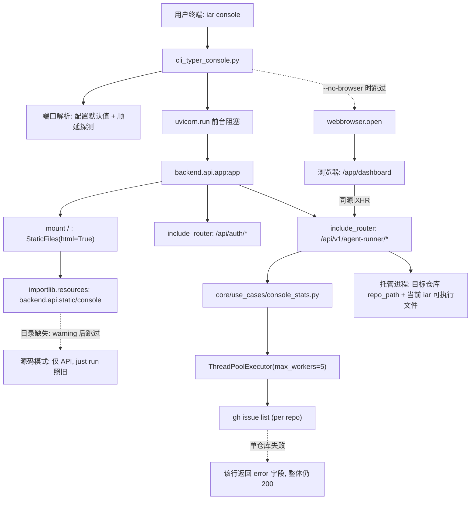

# PRD: iar console —— 把管理终端随 wheel 分发并一键启动

- GitHub Issue: （待创建）

> 本 PRD 分两个阅读高度：Part A 供人审（判断要不要做、哪里必须人工确认），Part B 供执行器（怎么做）。人审只需读 Part A，按 Human Review Map 指到的点再下钻 Part B。

# Part A · 人审层 (Review Layer)

## 1. Introduction & Goals

### Problem Statement

Agent Runner 的 Web 管理终端**已经存在且功能完整**，但对任何没有 keda 源码检出的用户等于不存在。

仓库可观测的现状事实（2026-09-10 实测，backend :8313 + `next dev` :3251）：

1. **产物里没有前端。** `pyproject.toml` 的 `[tool.setuptools.packages.find] where = ["src"]` 只打包 `src/backend`，`[tool.setuptools.package-data]` 只声明了 `backend.engines.agent_runner.templates`。`uv tool install keda` 装完的用户拿不到 `frontend-public/` 的任何产物。
2. **没有启动入口。** `src/backend/api/cli_typer_app.py` 注册的顶层子命令只有 `labels / issue / completion / worktree / registry / daemon / workflow / loop / container`，没有 `console` / `ui` / `serve`。今天要看面板，唯一路径是 clone keda 仓库 + `pnpm install` + `just run`，文档里则是教人用 `curl` 直接打 console API（`docs/guides/agent-runner.md` 的「统一管理终端」一节）。
3. **一个核心页面是坏的。** `GET /api/v1/agent-runner/console/stats/overview` 在 `build_completion_stats_overview` 中对每个仓库**串行**调用 `gh issue list`。本机 11 个已注册仓库实测 **71.7 秒**才返回 200（`curl -w %{time_total}`），Stats 页稳定弹出 `Request failed with status code 500`。注意那个 500 **不是后端返回的**——后端日志里没有任何 500，实际是 `next dev` 的代理先放弃了连接（dev server 输出为 `Failed to proxy http://localhost:8313/api/v1/agent-runner/console/stats/overview Error: socket hang up / ECONNRESET`）。这一点决定了并发修复是**必需项而不是优化项**：本 PRD 把前端改为由 FastAPI 同源直供后，代理层消失，这个 500 会随之消失，页面表现将退化为**干等 70 秒**——比现在报错更糟。
4. **全局安装后写操作会失效。** `AgentRunnerConsoleSettings.runner_command` 默认 `["uv", "run", "iar"]`，`resolve_console_spawn_cwd()` 返回 `_PROJECT_ROOT_PATH`——该值由 settings 模块文件的父链、其次 `Path.cwd()` 的父链向上找 `pyproject.toml` 推导。全局安装场景下它会落到用户当前所在的**任意仓库**或 site-packages 祖先目录，托管进程（启动 daemon、重试 failed Issue）会在错误目录用一个不存在的 uv 项目启动。
5. **界面上还挂着模板残留。** `frontend-public` 的 Settings 页文案是「当前版本为 MVP 演示…工作流执行目前返回 mock 结果」，站点标题是 `Zata Agent Platform`，都来自 `P1-FEAT-20260702-140755-frontend-template-migration` 引入的模板，与 keda / iar 无关。`roadmap.md` 的 M9「Operations Console」仍写 `Status: Not completed`，而 console API 与页面早在 `#39` / `#81` / `#89` 就已落地。

结果是：面板的价值已经付过开发成本，却因为"分发不到用户手上"而完全没有兑现。

### Interpretation (解读回显)

**行为样例**

| 输入 / 操作 | 期望观察到的结果 |
|---|---|
| 在任意目录（不是 keda 检出）执行 `iar console` | 终端打印本机地址；默认浏览器自动打开 Dashboard；页面正常渲染仓库队列，不是空白或 404 |
| `iar console --no-browser --port 8765` | 不打开浏览器；服务只监听 127.0.0.1:8765；`curl http://127.0.0.1:8765/` 返回 200 与 HTML |
| 从本机的**局域网 IP** 访问 `iar console` 起的端口 | 连接被拒绝（服务不监听 0.0.0.0），面板不因为跑在办公室 Wi-Fi 上就对同网段暴露写操作 |
| 显式 `--port` 指定的端口已被占用 | 明确报错说明端口被占用并提示换端口，退出码非 0；**不**静默改用其它端口 |
| 不带 `--port` 且默认端口被占用 | 自动顺延到下一个可用端口，并在终端打印真实 URL |
| 打开 Stats 页（本机 11 个已注册仓库） | 首屏 5 秒内出结果；某个仓库（例如 issues 被禁用的 `kimi-ppt`）失败时只在该行显示错误，不再整页 500 |
| 在面板里对某仓库点「启动 daemon」（全局安装场景） | 托管进程以当前 `iar` 可执行文件、在该仓库自己的路径下启动成功，`iar registry status` 能看到 `running (<process_id>)` |
| 浏览器停在 `/app/roadmap` 直接刷新 | 页面正常渲染，不是 404 |

以上每一行都会被逐字转成 Section 7.6 的验收 oracle —— 改其中一格就等于改验收标准，所以这张表值得逐行读。

**我默默定了这些**

- 监听地址固定 `127.0.0.1`，不提供 `--host` 参数暴露到 `0.0.0.0`。
- 默认端口写进 `[agent_runner.console]` 配置段（新增 `port` 字段），不在代码里硬编码；`--port` 只是覆盖。**监听地址不做成配置字段**——它是唯一访问控制，硬编码在 `cli_typer_console.CONSOLE_HOST`。
- 前端产物在**发布 CI 里预构建**后打进 wheel，不做首次启动时联网下载。
- `iar console` 前台阻塞运行，Ctrl-C 退出；它**不**登记为托管进程（不写 `~/.iar/processes.json`），因此不会和 `iar registry start` 的进程管理相互干扰。
- `frontend-public` 里 sidebar 之外的模板遗留页面（`agents/`、`workflows/`、`chat/`、`tools/`、marketing 的 `pricing/` `marketplace/` `features/` `about/`）连同三个动态路由一并**删除**，而不是给它们补 `generateStaticParams` 硬凑静态导出。
- Stats 修复采用"并发 + 带 TTL 的缓存"，直接复用 `/agent-runner/overview` 已有的缓存与后台预热写法，不新增异步 job 端点。
- `next dev` 与 `just run` 的既有开发流程保持可用，静态导出只是多一种构建模式。

**我理解为不做**

- 不做 Tauri / Electron 桌面安装包本身——那是下一个 PRD，本 PRD 只负责把它要包的运行时内核做出来。
- 不做真实多用户认证、不支持远程/公网访问；`local_auth` 的"本机单用户"信任模型保持不变。
- 不重做 UI 视觉、不新增面板功能页；除删除模板遗留页与改文案外，现有 7 个页面的交互不动。

**判定式解读**

本需求读作：**把已有的管理终端变成"装了 iar 就能开"的本地应用**，而不是"再做一个可视化界面"。边界上，(a) 服务必须只对本机可见，因为面板带写操作而认证是空实现；(b) 全局安装场景下托管进程的启动命令与工作目录必须由运行时真实解析，不能继续假设"用户站在 keda 检出里、并且有 uv 项目"；(c) Stats 页必须在单仓库失败时降级为该行报错，不允许整页失败；(d) 现有 `just run` / `next dev` / `iar registry start` 三条既有路径的行为不得改变。非目标：桌面安装包、远程访问、认证体系、UI 改版。

### What The User Gets

装过 `iar` 的人在任意目录敲一条 `iar console`，浏览器就会打开 Agent Runner 管理终端：看到所有已注册仓库的队列状态、Issue 事件时间线、运行历史与完成度统计，能启停 daemon、重试 failed Issue、管理 roadmap 队列和 idea inbox。不需要 clone keda、不需要 Node / pnpm / just，也不需要记住任何 `curl`。

面板只在本机可见。Stats 页从"必定超时报错"变成秒级出结果，个别仓库取数失败只影响它自己那一行。

### Measurable Objectives

- 在**没有 keda 源码检出**的干净环境里，`pip install <wheel>` 后执行 `iar console`，能打开并渲染 Dashboard（HTTP 200 + 页面出现仓库卡片）。
- 从本机非回环地址访问该端口时连接被拒绝。
- `GET /api/v1/agent-runner/console/stats/overview` 在 11 个仓库规模下**首次**调用 ≤ 15 秒、缓存命中时 ≤ 1 秒；单仓库失败时该仓库条目带 `error` 字段返回，HTTP 状态仍为 200。
- 全局安装场景下通过面板启动 daemon，`iar registry status` 能看到对应 `running (<process_id>)`。
- `rg -n "MVP 演示|mock 结果|Zata Agent Platform" frontend-public/` 无结果；`roadmap.md` 的 M9 状态与实现一致。

## 2. Human Review Map (介入与风险地图)

### 决策一：面板只监听本机，且不给"对外暴露"的开关

管理终端带写操作——启停 daemon、重试 Issue、改仓库 registry——而 `src/backend/api/routes/local_auth.py` 是一个**永远返回已登录**的空实现（它自己的 docstring 就写明"按本机单用户部署信任边界运行，不做真实认证"）。因此监听地址就是这套系统事实上的唯一访问控制。我建议 `iar console` 硬性绑定 `127.0.0.1`，并且**不**提供 `--host` 之类的逃生开关：一旦有人在办公室 Wi-Fi 或云主机上顺手加了 `--host 0.0.0.0`，同网段任何人都能无认证地操作他的所有仓库和 daemon。想远程访问的人应该走 SSH 端口转发，而不是由我们提供一个看起来很方便的自毁按钮。

代价是：将来真要做远程访问，得先补认证再开监听，不能靠加参数。我认为这个顺序本来就是对的。

**请确认：** `iar console` 固定只监听 127.0.0.1，且本次不提供任何把它暴露到其它网卡的参数或配置项——同意吗？

**验收：** 起一个 console 后，从本机的局域网 IP 访问同一端口会被拒绝连接，而 127.0.0.1 正常返回页面；这条会跑一次"故意改成监听全网卡就必须失败"的反向验证。

> **已确认（2026-09-10）**：同意固定 127.0.0.1，不提供暴露开关。

### 决策二：把云与数据库相关依赖挪出默认安装

现在 `pyproject.toml` 的默认依赖里带着 `boto3`、`psycopg2-binary`、`pymysql`、`alembic`、`langchain-core`。console 运行时一个都用不到，但它们让 `uv tool install keda` 变重，更关键的是下一步做桌面安装包时，PyInstaller 要把它们全部冻进去——体积翻倍，还会带来一串 hidden-import 问题。我建议把这五个挪到 optional extras（例如 `keda[db]` / `keda[cloud]`），默认安装只保留 console 与 runner 真正需要的部分。

仓库内部的可达性我实测过：加载 CLI 模块与加载 FastAPI app 之后，这五个包**一个都没有被导入**；`psycopg2` / `pymysql` 只被 `scripts/shared/template/setup_copied_database.py` 用到，而那个脚本是从**目标仓库自己的路径和环境**里跑的，不依赖 keda 的 wheel；`boto3` 只出现在 `scripts/backup_service/`，本来就不在 wheel 里；`alembic` 在 `src/` 下无任何 import；`langchain-core` 只经 `backend.infrastructure.models` 可达，而 console 与 CLI 路径都不导入它。

尽管如此，这仍是一次**破坏性打包变更**：任何现在依赖 `pip install keda` 顺带装上 psycopg2 或 boto3 的**外部**用法都会断，需要改成带 extras 安装。这属于对外契约，不该由我单方面决定。

**请确认：** 同意把 `boto3` / `psycopg2-binary` / `pymysql` / `alembic` / `langchain-core` 移出默认依赖、改为 extras 吗？如果你希望这次先不动打包契约，我就保留现状，把瘦身推迟到桌面安装包那个 PRD 一起做（代价是那时要连带处理已发布版本的迁移说明）。

**验收：** 在一个全新的空虚拟环境里只装 wheel（不带任何 extras），`iar console` 能起、`iar run --dry-run` 能跑完；同时验证"漏装某个真正必需的依赖就必须失败"的反向场景。

> **已确认（2026-09-10）**：同意本 PRD 内一并瘦身，FR-11 生效。

### 自动门禁，不需要逐项人工审阅

其余改动都走执行器 + 自动门禁：前端静态导出与 FastAPI 挂载由 Playwright 端到端用例把关（包含直接刷新深层路由不能 404）；Stats 并发与缓存由一条带时间上限的真实接口调用把关；托管进程启动命令与工作目录的解析由一条真实启动 daemon 并回读 `iar registry status` 的用例把关；模板文案清理、README 与 `roadmap.md` M9 的更新由仓库搜索断言把关；架构方向由 `hooks/shared/check_architecture.py` 严格态把关。

### 本次明确不涉及

不涉及数据库结构变更（管理终端的运行历史仍写 `~/.iar/console.db`，表结构不动），不涉及认证体系变更，不涉及桌面安装包本身，不涉及面板已有页面的功能与视觉改版。

## 3. Usage And Impact After Implementation

**全局安装的 iar 用户（新增的主要受益角色）**
在任意目录执行 `iar console`，终端打印 `Console running at http://127.0.0.1:<port>`，浏览器自动打开 Dashboard。左侧导航是 Dashboard / Processes / Repositories / Stats / Roadmap / Ideas / Settings 七页。可以在 Repositories 页扫描并登记本机仓库，在 Dashboard 重试 failed Issue，在 Processes 启停 daemon 并按 offset 续读日志。Ctrl-C 关闭。此前这些人只有 CLI，面板对他们不存在。

**keda 仓库开发者**
`just run`、`pnpm --filter frontend-public dev`、`next dev` 全部照旧，热重载开发体验不变。多出一个 `pnpm --filter frontend-public build` 产静态包的路径，以及 `iar console` 可以用来验证"用户看到的那一版"。

**Agent Runner operator（已在用面板的人）**
页面与操作不变。可感知的差异有三处：Stats 页从必定报错变成正常出数（个别仓库失败时那一行显示错误原因）；Settings 页不再显示与 keda 无关的模板文案；通过面板启动的托管进程，其启动命令来自当前 `iar` 可执行文件而不是写死的 `uv run iar`。已在 `~/.iar/processes.json` 里登记的存量进程不受影响，`iar registry stop` 照常工作。

**在 `config.toml` 里显式配过 `[agent_runner.console] runner_command` 的用户**
显式配置继续生效且优先级最高；只有**没配**的人才会从写死默认值切到运行时解析。

**向后兼容**
`~/.iar/console.db`、`~/.iar/processes.json`、`.iar.toml`、`config.toml` 的既有内容全部保持可读，无迁移动作。新增的 `[agent_runner.console] port` 有默认值，不填照常工作；历史配置里若残留 `host` 键会被按 extra 忽略，不影响加载。唯一的破坏性变化是决策二的依赖 extras——一旦确认执行，`pip install keda` 将不再顺带安装数据库与云 SDK。

## 4. Requirement Shape

- **Actor**：全局安装 iar 的用户、keda 仓库开发者、Agent Runner operator。
- **Trigger**：用户在终端执行 `iar console`；或用户在已打开的面板中访问 Stats 页 / 启动托管进程。
- **Expected behavior**：iar 从自身包内取出预构建的前端产物，用 FastAPI 在 127.0.0.1 的可用端口上同时提供静态页面与 `/api/v1/agent-runner/*`，并打开浏览器；面板的取数与写操作在无源码检出的环境下同样成立。
- **Scope boundary**：只做"分发 + 启动 + 让既有面板在安装态下真正可用"。不新增面板功能、不改认证、不做桌面安装包、不改数据库结构。

# Part B · 执行器层 (Build Layer)

## 5. Repository Context And Architecture Fit

**当前相关模块**

| 关注点 | 位置 |
|---|---|
| FastAPI 组装 | `src/backend/api/app.py`（仅 5 行 `include_router`，无静态挂载） |
| console 写操作与统计 API | `src/backend/api/routes/agent_runner_console.py` |
| 只读监控 API（含缓存/预热范式） | `src/backend/api/routes/agent_runner.py` |
| 完成度统计聚合（串行处） | `src/backend/core/use_cases/console_stats.py` 的 `build_completion_stats_overview` |
| 跨 Issue 并发范式 | `src/backend/core/use_cases/agent_runner_monitor.py`（`ThreadPoolExecutor(max_workers=5)`） |
| CLI 顶层注册 | `src/backend/api/cli_typer_app.py`；子命令模块 `src/backend/api/cli_typer_<group>.py` |
| console 配置 | `src/backend/infrastructure/config/settings.py` 的 `AgentRunnerConsoleSettings` |
| 托管进程 cwd / 命令 | `resolve_console_spawn_cwd()`、`AgentRunnerConsoleSettings.runner_command` |
| 包内资源读取范式 | `src/backend/engines/agent_runner/workflow_install.py` 的 `importlib.resources.files(...)` |
| 前端 app | `frontend-public/`（Next 16.2.6 + React 19，App Router，`next.config.ts` 目前只配了 `/api` rewrite） |
| 前端 API 客户端 | `frontend-public/lib/api/{client,console,roadmap,agentRunner,ideaInbox}.ts`（axios，`baseURL: "/api"`） |
| 端到端用例 | `tests/playwright-e2e/tests/{smoke,workflows}/`，已有 `console-pages.no-auth.spec.ts`、`agent-runner-monitor.spec.ts`、`roadmap.spec.ts`、`idea-inbox.spec.ts` |

**要遵循的架构模式**：四层依赖方向 `api → core → engines → infrastructure`。静态挂载与新 CLI 命令属于 `api/`；统计并发属于 `core/use_cases/`；`runner_command` / cwd 解析属于 `infrastructure` 配置与 `engines` 工厂。不新增层、不新增服务边界。

**前端影响**：Full-stack。受影响的 app 是 `frontend-public`（构建模式、删模板页、文案）。`frontend-admin/` 是未改动的 shadcn-admin 模板，与 agent runner 无关，本次不动。

**运行时约束**：`uvicorn[standard]`、`fastapi`、`typer`、`rich` 已是默认依赖，`iar console` 不需要新增运行时依赖。发布 CI 需要新增一步 `pnpm build`。

**重依赖可达性（实测）**：分别 `import backend.api.cli_typer` 与 `import backend.api.app` 后检查 `sys.modules`，`langchain_core` / `boto3` / `psycopg2` / `pymysql` / `alembic` **均未被导入**。复现命令：

```bash
cd /tmp && uv run --project <keda-root> python -c "import sys, backend.api.app; print([n for n in ('langchain_core','boto3','psycopg2','pymysql','alembic') if any(k==n or k.startswith(n+'.') for k in sys.modules)])"
```

静态可达性同向：`boto3` 仅 `scripts/backup_service/s3_client.py`（不在 wheel 内）；`psycopg2` / `pymysql` 仅 `scripts/shared/template/setup_copied_database.py`，而 `core/use_cases/worktree_database.py` 是以 `request.repository_path / "scripts" / ...` 在**目标仓库**侧执行它；`alembic` 在 `src/` 下无 import；`langchain-core` 仅经 `backend.infrastructure.models` 可达，console / CLI 路径不导入该包。

**Existing PRD Relationship**

- `tasks/pending/P1-REFACTOR-20260705-210702-file-line-split-seven-files.md`：目标文件含 `src/backend/api/cli_typer.py` 与 `cli.py`。本 PRD 会在 CLI 注册区新增一个 sub-app，两者在同一区域改动 → **soft**，不构成阻塞门禁，但建议先落地拆分或在合并时留意 `cli_typer_app.py` 的注册块冲突。
- `tasks/pending/` 其余 5 份（memory anchoring / roadmap continuous scheduling / re-grounding / completeness judgment / api-engines layer migration）均不触及 console 分发路径，独立。
- `tasks/archive/P1-FEAT-20260611-205725-agent-runner-unified-ops-console.md` 与 `tasks/archive/20260524-162356-prd-agent-runner-operations-console.md`：定义了 console 的白名单动作模型与只读/写分离边界，本 PRD 沿用不改。
- `tasks/archive/P1-FEAT-20260702-140755-frontend-template-migration.md`：`frontend-public` 的模板来源，本次要清理的残留文案由它引入。
- 无重复的 pending PRD；本 PRD 是后续「Tauri 桌面安装包」PRD 的前置依赖。

**潜在冗余风险**：Stats 的缓存实现容易与 `agent_runner.py` 里已有的 `_get_cached_overview_response` / `_warm_overview_cache` 平行造第二套缓存机制——必须复用或提取，不允许并存两套。

## 6. Recommendation

**Recommended Approach**：走最小改动路径——把 `frontend-public` 切成静态导出、产物随 wheel 分发、由现有 FastAPI app 直接挂载，新增一个薄的 `iar console` 命令启动它；统计并发与托管进程解析各自在原有 use_case / 工厂里就地修。

为什么这是最贴合当前架构的做法：面板与 API 已经在同一个 FastAPI app 上，静态挂载后前端 axios 的 `baseURL: "/api"` 变成**同源**请求，`next.config.ts` 的 rewrite 代理在生产路径上直接消失——moving part 少了一个而不是多了一个。`importlib.resources.files(...)` 取包内资源、`ThreadPoolExecutor(max_workers=5)` 做跨对象并发、模块级缓存 + 后台预热，三个范式仓库里都已有现成实现可抄。

为什么拒绝更重的替代：不引入独立的 console 服务进程或第二个 ASGI app（现有 app 已经承载全部路由，拆分只会多一处组装）；不引入 Node runtime 打包 `next start`（那会把 Node 变成 iar 的运行时依赖，并让后续 PyInstaller 冻结变成不可能）；不新增异步 job 端点做统计（`/overview` 的 job 端点是为分钟级重活设计的，统计并发后落在秒级，加 job 只是多一层轮询协议）。

### Proposed Solution Summary (实现机制)

核心机制是**"预构建产物随包分发 + 单进程同源托管"**。

`frontend-public` 在 `next.config.ts` 增加 `output: "export"` 与 `trailingSlash: true`（后者让导出产物是 `out/app/roadmap/index.html` 这种目录形态，才能被 `StaticFiles(html=True)` 正确解析），并删掉挡住静态导出的三个模板动态路由及其同族页面。发布流程新增一步：`pnpm --filter frontend-public build` 后把 `out/` 拷进 `src/backend/api/static/console/`，由 `[tool.setuptools.package-data]` 随 wheel 分发。

产物的**声明方**是构建流程，运行时**只消费**、不推断：`app.py` 在所有 `include_router` **之后**用 `importlib.resources.files("backend.api.static").joinpath("console")` 定位目录并 `app.mount("/", StaticFiles(..., html=True))`；目录不存在时跳过挂载并记一条 warning，让"源码模式跑 uvicorn"的既有开发路径不受影响。

新增 `iar console` 挂在现有 Typer app 上，监听地址取硬编码常量 `CONSOLE_HOST`、端口读 `[agent_runner.console].port`，未显式指定端口时从默认端口起顺延探测可用端口、显式指定则占用即失败，随后 `uvicorn.run` 前台阻塞并用 `webbrowser.open` 打开地址（`--no-browser` 可关）。

系统状态与可见行为的变化：`build_completion_stats_overview` 改为线程池并发 + 模块级 TTL 缓存（沿用 `agent_runner.py` 的缓存写法），单仓库异常仍走既有的 per-repo `error` 字段降级；`resolve_console_spawn_cwd()` 改为按 `repo_id` 返回**目标仓库自己的路径**，`runner_command` 默认值改为运行时解析出的当前 `iar` 可执行文件（`sys.argv[0]` / `shutil.which("iar")`），显式配置优先级不变。

有意避开的复杂度：不新增存储、不新增服务进程、不改 console 的白名单动作模型、不改状态机、不引入 Node 运行时。

**Alternatives Considered**

| 方案 | 为何不选 |
|---|---|
| 打包 Node + `next start` | 让 Node 成为 iar 运行时依赖，且后续 PyInstaller 冻结无法覆盖 Node 进程 |
| 首次启动时从 GitHub Release 下载前端产物 | 引入联网依赖与版本漂移，离线环境直接不可用 |
| 面板独立成第二个服务/端口 | 需要重新处理 CORS 与认证，现有同源假设全部作废 |
| 统计改造成异步 job + 前端轮询 | 并发后已是秒级，加轮询协议是净增复杂度 |

## 7. Implementation Guide

This section is a living implementation guide based on current repository analysis. If implementation discovers additional affected files, hidden dependencies, edge cases, or a better path, update this PRD before proceeding.

### 7.1 Core Logic

```
iar console
  └─ host = 硬编码 CONSOLE_HOST（127.0.0.1）；port 读 AgentRunnerConsoleSettings.port
  └─ 解析可用端口（未显式指定则顺延；显式指定被占用则报错退出）
  └─ uvicorn.run("backend.api.app:app", host=127.0.0.1, port=<resolved>)
        └─ app.py: include_router(...) × 5      ← 先注册 /api/*
        └─ app.py: mount("/", StaticFiles(console_dir, html=True))  ← 后挂静态，不遮蔽 /api
  └─ webbrowser.open(url)（--no-browser 时跳过）

浏览器 → GET /                        → StaticFiles → out/index.html
浏览器 → GET /app/roadmap             → StaticFiles → out/app/roadmap/index.html
页面   → GET /api/v1/agent-runner/... → 同源，不经 next rewrite
```

统计路径：

```
GET /console/stats/overview
  └─ 模块级 TTL 缓存命中？ → 直接返回
  └─ 未命中 → ThreadPoolExecutor(max_workers=5) 并发 build_completion_stats(per repo)
                └─ 单仓库异常 → 既有 except 分支返回带 error 的空统计（不抛）
  └─ 写缓存 → 返回 200
```

### 7.2 Change Impact Tree

```text
.
├── pyproject.toml
│   [修改]
│   【总结】声明前端静态产物为包数据，并（经决策二确认后）把数据库/云 SDK 移出默认依赖
│
│   ├── [tool.setuptools.package-data] 新增 "backend.api.static" = ["**/*"]
│   └── 决策二确认后：boto3 / psycopg2-binary / pymysql / alembic / langchain-core → [project.optional-dependencies]
│
├── MANIFEST.in
│   [修改]
│   【总结】把静态产物纳入 sdist
│   └── 新增 recursive-include src/backend/api/static *
│
├── src/backend/infrastructure/config/settings.py
│   [修改]
│   【总结】给管理终端配置补监听参数，并让托管进程启动命令改为运行时解析而非写死 uv
│
│   ├── AgentRunnerConsoleSettings 只新增 port: int = <默认端口>；
│   │   【禁止】新增 host 字段——它会变成绕过监听边界决策的配置逃生口，
│   │   监听地址改为 cli_typer_console.CONSOLE_HOST 常量
│   └── runner_command 的 default_factory 改为解析当前 iar 可执行文件；解析失败回退现值
│       （锚点：rg -n "runner_command" src/backend/infrastructure/config/settings.py）
│
├── src/backend/engines/agent_runner/factories/__init__.py
│   [修改]
│   【总结】托管进程的工作目录从"keda 源码根"改为目标仓库自身路径
│   └── resolve_console_spawn_cwd() 接收 repo 上下文并返回该仓库 repo_path
│       （锚点：rg -n "def resolve_console_spawn_cwd" -A 5 src/backend/engines/agent_runner/factories/__init__.py）
│
├── src/backend/core/use_cases/console_stats.py
│   [修改]
│   【总结】完成度统计从串行改并发并加 TTL 缓存，单仓库失败继续降级为该行 error
│
│   ├── build_completion_stats_overview 用 ThreadPoolExecutor(max_workers=5) 并发
│   ├── 保持返回顺序与入参 contexts 一致（as_completed 后按 repo_id 重排）
│   └── 复用而非重写缓存：抽取 agent_runner.py 的 TTL 缓存写法或直接调用其 helper
│
├── src/backend/api/app.py
│   [修改]
│   【总结】在全部路由注册之后挂载包内前端产物，缺产物时安静降级为纯 API 模式
│
│   ├── 用 importlib.resources.files("backend.api.static").joinpath("console") 定位
│   ├── 目录存在 → app.mount("/", StaticFiles(directory=..., html=True), name="console")
│   └── 目录不存在 → logger.warning 并跳过（保护 just run / 源码模式）
│
├── src/backend/api/static/console/
│   [新增]
│   【总结】前端静态导出产物的落地目录（构建产物，纳入包数据，不手写内容）
│   └── 需要 .gitignore 决策：产物入库还是仅在发布 CI 生成（见 7.5 Drift Guard）
│
├── src/backend/api/cli_typer_console.py
│   [新增]
│   【总结】iar console 子命令：解析端口、前台起 uvicorn、按需开浏览器
│
│   ├── --port / --no-browser 选项
│   ├── 未显式指定端口 → 从配置默认端口顺延探测；显式指定被占用 → 报错非 0 退出
│   └── 不写 ~/.iar/processes.json（与托管进程互不干扰）
│
├── src/backend/api/cli_typer_app.py
│   [修改]
│   【总结】注册 console 子命令
│   └── app.add_typer(console_app, name="console")（锚点：rg -n "add_typer" src/backend/api/cli_typer_app.py）
│
├── frontend-public/next.config.ts
│   [修改]
│   【总结】切静态导出并改用目录式产物，使深层路由可被静态服务器直接命中
│   ├── output: "export"
│   ├── trailingSlash: true
│   └── 保留 dev 用的 /api rewrite（生产同源，不再经过它）
│
├── frontend-public/app/(app)/app/{agents,workflows,chat,tools}/
│   [删除]
│   【总结】删掉模板遗留页与三个动态路由，它们不在导航里且挡着静态导出
│
├── frontend-public/app/(marketing)/{pricing,marketplace,features,about}/
│   [删除]
│   【总结】删掉与 keda 无关的模板营销页
│
├── frontend-public/app/(app)/app/settings/page.tsx
│   [修改]
│   【总结】把"MVP 演示 / mock 结果"模板文案换成 iar console 的真实说明
│
├── frontend-public/app/layout.tsx + components/layout/app-sidebar.tsx
│   [修改]
│   【总结】站点标题与侧栏品牌从 Zata Agent Platform 改为 iar / Agent Runner 管理终端
│
├── frontend-public/lib/api/{agents,workflows,sessions,tools}.ts
│   [删除]
│   【总结】随模板页一并删除的 API 客户端；删前用 rg 确认无引用
│
├── tests/playwright-e2e/tests/workflows/console-served-static.no-auth.spec.ts
│   [新增]
│   【总结】对着 iar console 起的静态服务跑面板冒烟：首页、深层路由直刷、Stats 出数
│
├── tests/test_cli_console.py
│   [新增]
│   【总结】覆盖端口解析（顺延 / 显式占用报错）与 --no-browser 分支
│
├── tests/test_console_stats_concurrency.py
│   [新增]
│   【总结】覆盖并发聚合的顺序稳定性、单仓库异常降级与缓存命中
│
├── README.md
│   [修改]
│   【总结】把 frontend-public 从"前台官网"正名为管理终端，并新增 iar console 使用段
│
├── roadmap.md
│   [修改]
│   【总结】把 M9 Operations Console 的状态改为与实现一致，并登记本次分发能力
│
├── docs/guides/agent-runner.md
│   [修改]
│   【总结】管理终端章节从 curl 示例改为以 iar console 为主入口
│
└── mkdocs.yml
    [修改]
    【总结】如新增 console 使用页则同步导航
```

文件清单是起点不是穷举，删模板页时以 7.5 的 Drift Guard 命令为准。

### 7.3 Risk Classification Register

| 变更点 | 层 | 层级 | 决定性维度 / 覆盖 | 介入 | oracle / 门禁 |
|---|---|---|---|---|---|
| `iar console` 监听边界 | api | R2 | 覆盖：安全 / 信任边界（fixed zone）——认证为空实现时监听地址即唯一访问控制 | 人工确认 | rv-2（含反向验证） |
| 默认依赖移入 extras | packaging | R2 | 覆盖：对外契约破坏性变更 | 人工确认 | rv-3（含反向验证） |
| 托管进程 cwd / runner_command 运行时解析 | engines + infrastructure | R2 | 血径：所有面板写操作依赖它；错误默认值会让全局安装下的启停全部失败 | 执行器 + 强 oracle | rv-4（全链路） |
| 静态导出 + StaticFiles 挂载（含深层路由回退） | api + frontend | R1 | 呈现层，回滚即恢复；失败可立即观察 | 执行器 + e2e | rv-1、rv-5 |
| 统计并发 + TTL 缓存 | core | R1 | 只读聚合，单仓库失败已有降级分支；并发上限 5 沿用既有范式 | 执行器 + 时限断言 | rv-6 |
| 模板页删除与文案清理 | frontend | R0 | 展示层，机械可检 | 执行器 + 搜索断言 | rv-7 |
| README / roadmap / 文档同步 | docs | R0 | 无行为 | 执行器 + 搜索断言 | rv-7 |

### 7.4 Flow / Architecture Diagram



### 7.5 Executor Drift Guard

```bash
# 1. 删模板页前，确认这些页面/客户端确无其它引用
rg -n "app/(agents|workflows|chat|tools)|lib/api/(agents|workflows|sessions|tools)" frontend-public --glob '!node_modules'

# 2. 找齐所有模板残留文案（不要只改看到的那一处）
rg -n "Zata Agent Platform|MVP 演示|mock 结果" frontend-public --glob '!node_modules'

# 3. 找齐所有把 frontend-public 说成"官网"的文档表述
rg -n "前台官网|frontend-public" README.md README_CN.md docs/ mkdocs.yml 2>/dev/null

# 4. 确认没有第二套缓存被平行造出来
rg -n "_OVERVIEW_CACHE|_warm_overview_cache|_get_cached_overview_response" src/backend/

# 5. 确认 runner_command / spawn cwd 的所有调用点都跟着改
rg -n "runner_command|resolve_console_spawn_cwd" src/backend/ tests/

# 6. 静态挂载必须在所有 include_router 之后（顺序错了 /api 会被静态目录遮蔽）
rg -n "include_router|app.mount" src/backend/api/app.py

# 7. 打出 wheel 后确认前端产物真的进去了
uv build && unzip -l dist/*.whl | rg "backend/api/static/console/index.html"
```

产物入库策略需在实现时决定并记录：要么把 `src/backend/api/static/console/` 加入 `.gitignore` 并只在发布 CI 构建（仓库干净，但 `pip install git+...` 装出来没有面板），要么产物入库（任何安装方式都有面板，但每次前端改动都产生大 diff）。**默认建议**：加入 `.gitignore` + 发布 CI 构建，并在 `app.py` 缺产物时的 warning 里明确提示"请用 release wheel 或先执行前端构建"。

**实现记录（产物入库策略）**：采用默认建议——`src/backend/api/static/console/` 已加入 `.gitignore`（仅保留 `static/__init__.py` 入库以维持包结构），发布 CI（`.github/workflows/release.yml`）在 `uv build` 之前执行 `pnpm --filter frontend-public build` 并把 `out/` 拷入包数据，构建后用 `python -m zipfile -l` / `tar -tzf` 断言 wheel 与 sdist 均含 `backend/api/static/console/index.html`，缺产物时 `app.py` 打 warning 并以 API-only 模式启动。

### 7.6 Realistic Validation Plan

```yaml
- id: rv-1
  behavior: 没有 keda 源码检出的环境里，装完 wheel 执行 iar console 能打开并渲染管理终端
  real_entry: "python -m venv /tmp/iar-clean && /tmp/iar-clean/bin/pip install dist/*.whl && cd /tmp && /tmp/iar-clean/bin/iar console --no-browser --port 8765"
  expected: "进程前台常驻并打印 http://127.0.0.1:8765；另开终端 curl -s -o /dev/null -w '%{http_code}' http://127.0.0.1:8765/ 返回 200，且 curl -s http://127.0.0.1:8765/ | rg -q '<div id=\"__next\"|<script' 命中"
  mock_boundary: "gh / git 可用即可；FastAPI、StaticFiles、wheel 打包与端口解析全部真实，不得用 TestClient 代替"
  tier: R1
  test_layer: smoke
  required_for_acceptance: true

- id: rv-2
  behavior: 管理终端只对本机可见，局域网内其它机器连不上
  real_entry: "/tmp/iar-clean/bin/iar console --no-browser --port 8765  # 另开终端执行下一行"
  expected: "curl -m 3 http://127.0.0.1:8765/ 返回 200；curl -m 3 http://$(ipconfig getifaddr en0):8765/ 连接被拒绝（curl exit code 7），且 lsof -nP -iTCP:8765 -sTCP:LISTEN 显示绑定地址为 127.0.0.1 而非 *"
  mock_boundary: "不得 mock 任何网络层；必须是真实 socket 绑定"
  tier: R2
  test_layer: smoke
  required_for_acceptance: true
  critical_value_source: "lsof 输出的实际绑定地址，以及 uvicorn 启动日志打印的 host —— 不接受读代码里的常量作为证据"
  must_cross: "CLI 参数解析 -> 配置读取 -> uvicorn.run(host=...) -> 内核 socket bind -> 外部网卡发起的真实 TCP 连接"
  forbidden_bypasses: "不得用 TestClient / httpx ASGI transport 断言（它们不经过真实 socket）；不得只断言配置值等于 127.0.0.1；不得用 localhost 别名代替真实网卡地址"
  fresh_state_probe: "从一个全新的 curl 进程、使用本机非回环 IP 发起连接，确认拒绝"
  final_tree_evidence: "证据在最终实现树上重跑；任何触及 cli_typer_console.py 或 AgentRunnerConsoleSettings 的改动后必须重采"
  negative_control: "临时把启动 host 改为 0.0.0.0 重跑本条 —— 从网卡地址访问应变为 200，本条断言必须转红"
  expected_fail: "网卡地址 curl 返回 200 而非 exit 7，lsof 显示 *:8765，断言失败"

- id: rv-3
  behavior: 瘦身后的默认安装仍能跑通 console 与 runner 的真实入口
  real_entry: "python -m venv /tmp/iar-slim && /tmp/iar-slim/bin/pip install dist/*.whl && cd <一个已 iar init 的仓库> && /tmp/iar-slim/bin/iar run --dry-run && /tmp/iar-slim/bin/iar console --no-browser --port 8766"
  expected: "两条命令均退出码 0（console 需另开终端 curl 200 后再 Ctrl-C）；全程无 ModuleNotFoundError"
  mock_boundary: "虚拟环境必须全新且不带任何 extras；不得预装 boto3 / psycopg2 / langchain-core"
  tier: R2
  test_layer: smoke
  required_for_acceptance: true
  critical_value_source: "全新 venv 的 pip list 输出（证明被移除的包确实不在），以及两条命令的真实退出码"
  must_cross: "wheel 构建 -> 纯净 venv 安装 -> CLI 入口点解析 -> 配置加载 -> runner/console 真实执行路径"
  forbidden_bypasses: "不得在开发机的 uv 环境里验证；不得先 pip install -e . 再测；不得用 --no-deps 掩盖缺失依赖"
  fresh_state_probe: "venv 每次重建（rm -rf /tmp/iar-slim）后重跑，确认不是缓存残留在撑着"
  final_tree_evidence: "pyproject.toml 依赖段的最终状态与该次 wheel 的 METADATA 一并留档；依赖段再动就重采"
  negative_control: "把一个 console 真正必需的包（如 uvicorn）一并移入 extras 后重跑 —— iar console 必须以 ModuleNotFoundError 失败"
  expected_fail: "iar console 启动时抛 ModuleNotFoundError: No module named 'uvicorn'，退出码非 0"

- id: rv-4
  behavior: 全局安装场景下，通过面板启动的 daemon 真的在目标仓库里跑起来了
  real_entry: "面板 http://127.0.0.1:8765/app/processes 点击目标仓库的 Start daemon（或 curl -X POST http://127.0.0.1:8765/api/v1/agent-runner/console/processes -H 'Content-Type: application/json' -d '{\"repo_id\":\"<id>\",\"kind\":\"daemon\"}'）"
  expected: "响应 201 带 process_id；/tmp/iar-clean/bin/iar registry status 显示该仓库 running (<process_id>)；ps -p <pid> -o args= 显示命令是安装态的 iar 可执行文件，工作目录（lsof -p <pid> -a -d cwd）是目标仓库路径而非 keda 源码根"
  mock_boundary: "进程管理、cwd 解析与可执行文件解析必须真实；被启动的 daemon 可立即 stop，不要求它真跑完一轮"
  tier: R2
  test_layer: smoke
  required_for_acceptance: true
  critical_value_source: "ps 输出的实际 argv[0] 与 lsof 输出的实际 cwd —— 不接受读配置默认值或日志里的自述"
  must_cross: "面板点击 -> POST /console/processes -> console_actions 白名单 -> 进程 supervisor -> 真实 fork/exec -> ~/.iar/processes.json 落盘 -> 另一进程 iar registry status 回读"
  forbidden_bypasses: "不得在 keda 检出目录内执行本条（那样错误的默认值也会碰巧正确）；不得直接调 use_case 函数；不得用 mock supervisor"
  fresh_state_probe: "用一个独立的新进程执行 iar registry status 回读，而不是复用面板响应体"
  final_tree_evidence: "证据绑定到 resolve_console_spawn_cwd 与 runner_command 的最终实现；两者任一再改就重采"

- id: rv-5
  behavior: 直接刷新深层路由不会 404（静态导出的目录形态产物被正确解析）
  real_entry: "cd tests/playwright-e2e && PLAYWRIGHT_SKIP_STACK_BOOT=1 PLAYWRIGHT_STACK_MODE=dev PLAYWRIGHT_BASE_URL=http://127.0.0.1:8765 npm run test:no-auth"
  expected: "console-served-static.no-auth.spec.ts 通过：直接 goto /app/roadmap 与 /app/stats 均 200 且渲染出各自标题；无 404 页面"
  mock_boundary: "浏览器与 HTTP 全真；后端数据可以是本机真实 registry 的内容"
  tier: R1
  test_layer: e2e
  required_for_acceptance: true

- id: rv-6
  behavior: Stats 页在多仓库规模下秒级出数，单仓库失败只影响该行
  real_entry: "time curl -s -o /tmp/stats.json -w '%{http_code} %{time_total}\\n' http://127.0.0.1:8765/api/v1/agent-runner/console/stats/overview"
  expected: "首次调用 HTTP 200 且 time_total ≤ 15s；紧接着第二次调用 ≤ 1s（缓存命中）；jq '.repositories[] | select(.error != null)' /tmp/stats.json 对 issues 被禁用的仓库有一条 error，其余仓库 total_tracked 正常"
  mock_boundary: "gh 调用必须真实（这正是被测的慢点）；不得用 fixture 替换 GitHub 响应"
  tier: R1
  test_layer: smoke
  required_for_acceptance: true

- id: rv-7
  behavior: 模板残留文案与过期文档表述已清零
  real_entry: "rg -n 'Zata Agent Platform|MVP 演示|mock 结果' frontend-public --glob '!node_modules'; rg -n '前台官网' README.md docs/; rg -n 'M9' -A 3 roadmap.md"
  expected: "前两条搜索无输出（退出码 1）；roadmap.md 的 M9 状态不再是 Not completed 且与实现一致"
  mock_boundary: "无"
  tier: R0
  test_layer: unit
  required_for_acceptance: true
```

**失败排查提示**：`/api` 返回 HTML 而不是 JSON → `app.mount("/")` 被放在 `include_router` 之前了；深层路由 404 → `trailingSlash: true` 没配或产物是 `app/roadmap.html` 扁平形态；wheel 里没有静态文件 → 检查 `[tool.setuptools.package-data]` 的键名与 `MANIFEST.in`，并确认发布 CI 在 `uv build` 之前执行了前端构建；面板起 daemon 失败 → 先看 `ps` 出来的 argv 与 cwd，再回到 `resolve_console_spawn_cwd`。

**一个已知且正常的行为**：`trailingSlash: true` 下产物是目录形态，因此**不带尾斜杠**的深层路径（`/app/roadmap`）由 Starlette 回 **307** 重定向到 `/app/roadmap/`，带尾斜杠才直接 200。浏览器与 Playwright 都自动跟随，不影响用户；但脚本化断言必须要么用尾斜杠形态、要么 `curl -L`，**不要**对 `/app/roadmap` 裸断言 200——e2e 用例已统一使用尾斜杠写法。

**验证证据（2026-09-11，keda-0.2.0 wheel，全部取自真实产出）**

- **rv-1**：`uv venv --python 3.13 /tmp/iar-clean` + 安装 `dist/keda-0.2.0-py3-none-any.whl`，在 `/tmp` 下 `/tmp/iar-clean/bin/iar console --no-browser --port 8765` 前台常驻；`curl /` → 200 且命中 `<div id="__next"|<script`；uvicorn 日志 `Uvicorn running on http://127.0.0.1:8765`。
- **rv-2**：`lsof -nP -iTCP:8765 -sTCP:LISTEN` → `TCP 127.0.0.1:8765 (LISTEN)`；回环 curl 200；`curl -m 3 http://192.168.0.101:8765/`（en0 真实网卡 IP）→ exit 7 Connection refused。反向控制：`python3 -m http.server 8799 --bind 0.0.0.0` 后同一探针 → 200，证明探针可转红。
- **rv-3**：`rm -rf /tmp/iar-slim` 后全新 venv 装 wheel（无 extras）：`pip list` 无 boto3 / psycopg2 / pymysql / langchain / alembic，有 fastapi / typer / uvicorn；`cd ~/code/fsense && iar run --dry-run` → exit 0；`/tmp` 下 `iar console --no-browser --port 8766` → curl 200，日志无 ModuleNotFoundError。反向控制：从该 venv 卸载 uvicorn 后重跑 `iar console` → exit 1 且抛 `ModuleNotFoundError: No module named 'uvicorn'`，断言转红。
- **rv-4**：`POST /api/v1/agent-runner/console/processes {"repo_id":"kimi-ppt","kind":"daemon"}`（8765 服务）→ 201 + process_id `5bbb75cf0d40`；独立进程 `iar registry list` 回读 kimi-ppt daemon `running (5bbb75cf0d40…)`（`iar registry status` 子命令不存在，以 `list` 为准）；`ps -p 35143 -o args=` → `.../bin/iar daemon --repo-id kimi-ppt`（安装态 iar，无 `uv run`）；`lsof -p 35143 -a -d cwd -Fn` → `/Users/zata/code/kimi-ppt`（目标仓库）。随后 stop → 200，status=stopped。注：`~/.iar/config.toml` 显式配置了 `runner_command = ["iar"]`，按设计优先于运行时默认解析——恰好覆盖了"显式配置优先"分支的真实路径。
- **rv-5**：`PLAYWRIGHT_SKIP_STACK_BOOT=1 PLAYWRIGHT_STACK_MODE=dev PLAYWRIGHT_BASE_URL=http://127.0.0.1:8765 PLAYWRIGHT_HEALTH_URL=http://127.0.0.1:8765/api/v1/agent-runner/health` 下运行 `console-served-static.no-auth.spec.ts` → 3 passed（直接 goto /app/roadmap 与 /app/stats 均 200 且渲染标题）。说明：harness readiness 默认探针 `http://127.0.0.1:8000/health` 在后端并不存在（既有遗留），故显式指定真实 health 端点，非 mock。
- **rv-6**：`curl stats/overview` 首次 200 / 14.66s（≤15s），第二次 200 / 0.0023s（≤1s，缓存命中）；10 个仓库行中仅 issues 被禁用的 `kimi-ppt` 带 `error`（gh 报 disabled issues），其余 total_tracked 正常（freshai=55、transmaster=4、fsense=1）。
- **rv-7**：`rg 'Zata Agent Platform|MVP 演示|mock 结果' frontend-public` → 无输出（exit 1）；`rg '前台官网' README.md docs/` → 无输出（exit 1）；`roadmap.md` M9 → `Status: Completed` 且登记分发能力。

**门禁**：`just test` 全绿（含 `tests/test_cli_console.py` 12 个用例、`tests/test_console_stats_concurrency.py`）；`just lint` 全绿；`uv run mkdocs build --strict` 通过；`next dev` 根路径 200、`/api/*` rewrite 在 dev 下确认转发（上游未起时返回 500 代理错误而非 Next 404）。代码定稿后未再触碰 `cli_typer_console.py` / `AgentRunnerConsoleSettings` / `resolve_console_spawn_cwd`，R2 证据无需重采；`tests/test_cli_console.py` 后补的 runner_command 解析用例不触及以上三者。

### 7.7 ER Diagram

No data model changes in this PRD.（运行历史与审计仍写 `~/.iar/console.db`，表结构不变。）

### 7.8 Low-Fidelity Prototype

不需要：本 PRD 不新增页面或交互，导航与七个页面的布局沿用现状。

### 7.9 Interactive Prototype Change Log

No interactive prototype file changes in this PRD.

### 7.10 External Validation

No external validation required; repository evidence was sufficient.（Next.js 静态导出与 FastAPI StaticFiles 均为仓库现有栈的标准能力，实现时若发现 Next 16 的导出约束与预期不符，需回填本节并更新方案。）

## 8. Delivery Dependencies

- Group: iar-console-distribution
- Depends on tasks/issues:
  - none
- Gate type: none
- Notes: 本 PRD 是 `P1-FEAT-20260910-125248-iar-package-manager-distribution`（PyPI + Homebrew tap 分发）的前置依赖，后者已把本 PRD 列为 hard 依赖——它未落地时发布到 PyPI 只是发一个打不开面板的 CLI，且本 PRD 的依赖瘦身直接决定 Homebrew formula 需要声明多少 resource。与 `P1-REFACTOR-20260705-210702-file-line-split-seven-files` 在 `cli_typer.py` / `cli.py` 的注册区域存在改动重叠，属 soft 关系，不作为阻塞门禁。

## 9. Acceptance Checklist

### Human-Confirmed

- [x] **监听边界**：`iar console` 起服后，`lsof -nP -iTCP:<port> -sTCP:LISTEN` 显示绑定 `127.0.0.1` 而非 `*`；从本机非回环 IP `curl -m 3` 连接被拒（exit 7）；反向验证（临时改 `0.0.0.0`）已跑并确认该断言转红（rv-2）
- [x] **监听边界**：代码中不存在任何把 console 暴露到其它网卡的参数**或配置项**——`rg -n "0\.0\.0\.0|--host" src/backend/api/ src/backend/infrastructure/config/` 无匹配，且 `"host" not in AgentRunnerConsoleSettings.model_fields`（由 `tests/test_cli_console.py::TestListenHostIsNotConfigurable` 四条回归守住；该类断言曾因 grep 只扫单个文件而漏掉配置字段）
- [x] **依赖契约**：全新空 venv 只装 wheel（不带 extras）后 `iar run --dry-run` 与 `iar console` 均退出码 0、无 `ModuleNotFoundError`；`pip list` 证明被移除的包确实不在；反向验证（卸载 uvicorn 模拟移入 extras）已跑并确认转红（rv-3）
- [x] **依赖契约**：`pyproject.toml` 的默认依赖段与本次 wheel 的 `METADATA` 一致（12 条默认依赖 + llm/db/backup extras 逐一核对），且 README 已写明需要数据库/云能力时的 extras 安装方式

### Behavior Acceptance

- [x] 无 keda 源码检出的环境中 `iar console --no-browser --port 8765` 前台常驻，`curl` 首页返回 200 且是 HTML（rv-1）
- [x] 未显式指定端口且默认端口被占用时自动顺延并打印真实 URL；显式 `--port` 指定的端口被占用时报错退出、退出码非 0（`tests/test_cli_console.py`）
- [x] 面板启动的托管进程：`ps -p <pid> -o args=` 显示安装态 `iar` 可执行文件，`lsof -p <pid> -a -d cwd` 显示目标仓库路径；独立进程执行 `iar registry list` 回读到 `running (<process_id>)`（rv-4）
- [x] `config.toml` 中显式配置的 `[agent_runner.console] runner_command` 仍优先于运行时解析（`tests/test_cli_console.py::TestDefaultRunnerCommand` 单测覆盖，rv-4 真实路径亦覆盖该分支）
- [x] `/api/v1/agent-runner/console/stats/overview` 首次 ≤ 15s、缓存命中 ≤ 1s、HTTP 200；issues 被禁用的仓库只在自己那条记录带 `error`（rv-6）
- [x] 并发聚合的返回顺序与入参 `contexts` 一致（`tests/test_console_stats_concurrency.py`）

### Frontend Acceptance

- [x] `frontend-public` 静态导出成功：`pnpm --filter frontend-public build` 产出 `out/`，且 `out/app/roadmap/index.html` 存在（目录形态而非 `app/roadmap.html`）
- [x] Playwright `console-served-static.no-auth.spec.ts` 对着 `iar console` 起的服务通过，含直接刷新 `/app/roadmap`、`/app/stats` 不 404（rv-5）
- [x] `rg -n "Zata Agent Platform|MVP 演示|mock 结果" frontend-public --glob '!node_modules'` 无输出（rv-7）
- [x] `rg -n "app/(agents|workflows|chat|tools)|lib/api/(agents|workflows|sessions|tools)" frontend-public --glob '!node_modules'` 无残留引用（删除彻底，无死链）
- [x] `next dev` 与 `just run` 的开发流程仍可用（`pnpm --filter frontend-public dev` 启动后根路径 200，`/api/*` rewrite 在 dev 下确认转发；`just run` 的端口注入路径未改动）

### Architecture Acceptance

- [x] `app.mount("/")` 位于全部 `include_router` 之后；`curl http://127.0.0.1:8767/api/v1/agent-runner/health` 返回 JSON 而非 HTML
- [x] 静态目录缺失时 `uvicorn backend.api.app:app` 仍能起（记 warning、仅提供 API，`/` 404、health 200），`just run backend` 不受影响
- [x] `hooks/shared/check_architecture.py` 严格态通过；`just lint` 全绿
- [x] `rg -n "_OVERVIEW_CACHE|_warm_overview_cache|_get_cached_overview_response" src/backend/` 证明缓存实现被复用/提取，而非平行造了第二套（`agent_runner.py` 已改用共享 `TTLResponseCache`）

### Packaging Acceptance

- [x] `uv build && python -m zipfile -l dist/*.whl | rg "backend/api/static/console/index.html"` 命中（148 个 console 静态条目）
- [x] 发布 CI 在 `uv build` 之前执行前端构建并拷贝产物；产物入库策略（`.gitignore` + CI 构建）已在 PRD 7.5 记录并落实

### Documentation Acceptance

- [x] README 新增 `iar console` 使用段，并把 `frontend-public` 从"前台官网"改为管理终端的正确表述（含 docs/ 各标准页的同步修正）
- [x] `roadmap.md` 的 M9 Operations Console 状态与实现一致，并登记本次分发能力
- [x] `docs/guides/agent-runner.md` 的管理终端章节以 `iar console` 为主入口，`curl` 示例降为备用
- [x] 未新增文档页、`mkdocs.yml` 导航无需变动；`uv run mkdocs build --strict` 通过

### Validation Acceptance

- [x] rv-1 至 rv-7 全部执行并留档（见 7.6 验证证据），其中 rv-2 / rv-3 的反向验证确认可转红
- [x] `just test` 全绿；关键改动另跑 `uv run pytest -o addopts="" tests/test_cli_console.py tests/test_console_stats_concurrency.py`
- [x] 证据均取自真实产出（`lsof` / `ps` / `curl` 输出、pip list、Playwright 报告），不接受读源码常量或复述配置值
- [x] 最终实现树变更后，受影响的 R2 证据已重采（定稿后仅改动文档与测试文件，未触 `cli_typer_console.py` / `AgentRunnerConsoleSettings` / `resolve_console_spawn_cwd`）

### Delivery Readiness

- [x] 推荐方案完整落地，无遗留的临时兼容层或"下一阶段再补"的必需项
- [x] 存量 `~/.iar/processes.json` 中的托管进程不受影响，`iar registry stop` / 面板 stop 仍可停止它们（rv-4 起停全流程已验证）
- [x] 无未解决的回归；决策二（依赖瘦身）按原方案落地，PRD Decision Log 无需回改

## 10. Functional Requirements

- **FR-1**：新增 `iar console` 命令，读 `[agent_runner.console]` 的 `host` / `port`，前台启动 uvicorn 承载既有 FastAPI app。
- **FR-2**：`iar console` 只监听 `127.0.0.1`，不提供任何将其暴露到其它网卡的参数或配置项。
- **FR-3**：未显式指定端口时，从配置默认端口起顺延探测第一个可用端口并打印真实 URL；显式 `--port` 指定的端口被占用时报错并以非 0 退出码结束，不静默换端口。
- **FR-4**：启动后默认用系统浏览器打开面板；`--no-browser` 可关闭该行为。
- **FR-5**：`frontend-public` 以 Next.js 静态导出方式构建，产物随 wheel 分发，由 FastAPI 在所有 API 路由之后挂载于 `/`，且深层路由可被直接访问与刷新。
- **FR-6**：静态产物缺失时后端仍可正常启动并仅提供 API，同时记录一条指明补救方式的 warning。
- **FR-7**：`build_completion_stats_overview` 并发聚合各仓库统计（并发上限沿用既有 5），返回顺序与入参一致，并带 TTL 缓存；单仓库失败仍走既有 per-repo `error` 降级，整体返回 200。
- **FR-8**：托管进程的工作目录解析为目标仓库自身路径；`runner_command` 默认值改为运行时解析出的当前 `iar` 可执行文件，用户显式配置优先。
- **FR-9**：清除 `frontend-public` 中的模板遗留页面、API 客户端与文案，站点标题与品牌改为 iar 管理终端。
- **FR-10**：README、`roadmap.md` M9、`docs/guides/agent-runner.md` 与 `mkdocs.yml`（如有新增页）同步更新。
- **FR-11**（依赖决策二确认）：`boto3` / `psycopg2-binary` / `pymysql` / `alembic` / `langchain-core` 移出默认依赖，改为 optional extras，并在 README 说明何时需要它们。判定口径是"默认依赖只保留主路径**真正 import** 的包"——据此 `pre-commit` 同样移出（`rg` 确认 `src/` 与 `tests/` 从不 import 它，runner 只生成 `uv run pre-commit run --all-files` 这类命令字符串交由**目标仓库**的环境执行），它仅保留在 dev group。

## 11. Non-Goals

- 不做 Tauri / Electron 桌面安装包、代码签名与公证（后续 PRD）。
- 不做真实认证、多用户或远程/公网访问能力。
- 不改造面板已有七个页面的功能与视觉，不新增页面。
- 不改 console 的白名单动作模型与写操作安全边界。
- 不动 `frontend-admin/`（未改动的 shadcn-admin 模板）。
- 不改数据库结构或运行历史存储格式。
- 不为 `iar console` 提供托管进程化（不进 `~/.iar/processes.json`）与开机自启。

## 12. Risks And Follow-Ups

| 风险 | 影响 | 缓解 |
|---|---|---|
| 前端产物入库与否的取舍 | 不入库则 `pip install git+...` 装出来没有面板；入库则每次前端改动产生大 diff | 默认不入库 + 发布 CI 构建，并在缺产物 warning 里明确指引；决定与理由记入 7.5 |
| 决策二被否决 | 桌面安装包 PRD 的冻结体积与 hidden-import 成本上升 | 保留现状不阻塞本 PRD，把瘦身与迁移说明整体推迟到桌面安装包 PRD |
| 并发调用 `gh` 触发 GitHub 速率限制 | 大量仓库时统计接口出现 429 | 并发上限沿用既有 5；TTL 缓存降低调用频次；单仓库失败已有降级分支 |
| `resolve_console_spawn_cwd` 的调用点可能不止工厂一处 | 改漏会导致部分写操作仍在错误目录执行 | 7.5 Drift Guard 第 5 条穷举调用点；rv-4 从真实 `ps` / `lsof` 取证 |
| Next 16 静态导出对某些 App Router 特性的限制超出预期 | 构建失败或个别页面不可导出 | 已确认无 middleware / route handler / next-image；若实现时命中新限制，回填 7.10 并更新方案 |

**Follow-ups（不阻塞本 PRD）**：首次启动的环境体检页（git / `gh auth` / agent CLI 检测与修复指引）作为独立小 PRD 处理——它与本 PRD 的分发/启动能力可独立实现、独立验收，对已装好 `gh` 的开发者用户价值也较低，绑在一起只会拖慢主线。

## 13. Decision Log

| ID | 决策问题 | Chosen | Rejected | Rationale |
|---|---|---|---|---|
| D-01 | 前端如何随 iar 分发 | Next.js 静态导出产物打进 wheel，由现有 FastAPI 挂载 | 打包 Node runtime 跑 `next start` | 前端全部页面已是客户端取数（无 middleware / route handler / next-image），静态导出可行；引入 Node 会让后续 PyInstaller 冻结变成不可能 |
| D-02 | 产物获取时机 | 发布 CI 预构建后随包分发 | 首次启动时从 Release 下载 | 避免联网依赖与版本漂移，离线环境同样可用 |
| D-03 | 面板由谁托管 | 复用现有 `backend.api.app:app` 单进程同源托管 | 独立第二个服务/端口 | 同源后前端 `baseURL: "/api"` 直连，`next.config.ts` 的 rewrite 代理在生产路径上消失，moving part 减少而非增加 |
| D-04 | 监听地址 | 硬性绑定 127.0.0.1，不提供暴露开关 | 提供 `--host` 参数 | `local_auth` 是空实现，监听地址即唯一访问控制；提供开关等于提供一个无认证的远程写入口 |
| D-05 | 端口占用策略 | 未指定则顺延，显式指定则占用即失败 | 一律自动顺延 | 显式指定通常是为了配合书签或转发规则，静默换端口会让用户连到错误的服务 |
| D-06 | 统计性能修复方式 | 线程池并发 + TTL 缓存，复用 `/overview` 既有写法 | 新增异步 job 端点 + 前端轮询 | 并发后落在秒级，job 协议是净增复杂度；`/overview` 的 job 端点是为分钟级重活设计的 |
| D-07 | 托管进程默认启动命令 | 运行时解析当前 `iar` 可执行文件，显式配置优先 | 保留写死的 `["uv", "run", "iar"]` | 写死值在全局安装场景下指向不存在的 uv 项目，会让面板全部写操作失效 |
| D-08 | 模板遗留动态路由处理 | 连同同族模板页一并删除 | 补 `generateStaticParams` 让其可导出 | 这些页面不在导航里、与 keda 无关，为它们付静态导出成本没有收益 |
| D-09 | 依赖瘦身时机 | 本 PRD 一并处理（待人工确认） | 推迟到桌面安装包 PRD | 实测 CLI 与 FastAPI app 加载后这五个包均未被导入，仓库内部零可达性，越早瘦身冻结体积与 hidden-import 成本越低；但因属破坏性打包变更，交由人工拍板 |

### Final Reconciliation

2026-09-13 归档前复核（实现已于 2026-09-10 落地，随 `kedacode` 0.2.0 / 0.2.1 两次发布进入公共索引）。

- Interpretation: confirmed —— 「把已有的 frontend-public 面板静态导出后打进 wheel，用 `iar console` 一条命令起服」这一解读按原样落地，未扩成第二套 UI、未引入 Electron/Tauri 一类额外运行时。
- Public behavior and contracts: corrected —— D-04「监听地址硬绑 127.0.0.1」在起草时留了自相矛盾的口子：Part A 说不提供暴露开关，Part B 的 settings 里却仍有可配置的 `host` 字段，实测可把面板暴露到局域网。已收口：`AgentRunnerConsoleSettings` **整个删掉 `host` 字段**（现字段为 `history_db_path` / `process_registry_path` / `process_log_dir` / `runner_command` / `stop_timeout_seconds` / `port`），监听地址改为 `cli_typer_console.py` 里的模块常量 `CONSOLE_HOST = "127.0.0.1"`，并补回归测试断言该字段不可复活。其余对外契约（`iar console` 参数、静态资源挂载路径、`/api/v1/agent-runner/*`）与 FR 一致。
- Related PRD status: confirmed —— 下游 `P1-FEAT-20260910-125248`（包管理器分发）同批归档，它消费本 PRD 产出的 wheel 内静态资源。D-09 的依赖瘦身在下游拿到独立佐证：0.2.1 的 Homebrew formula resource 由 32 降至 28，uvicorn 的 standard extra 带入的 uvloop / httptools / websockets / watchfiles 四个编译型依赖全部消失。
- Requirements and risks: confirmed —— §12 五条风险均未恶化，无新增。附带的已知负债：`settings.py` 因本次改动后为 1038 非空行，超出 1000 行门禁，已按既有机制登记到 `hooks/max_file_lines.allowlist.txt`（该清单由 `P1-REFACTOR-20260705-210702` 负责清零），不是本 PRD 新引入的超限文件类型。
- Reconciled differences:
  - 监听地址的证据强度在归档时再次提升：0.2.1 的 rv-5 从**公共 PyPI 装出来的 `iar`**、在**临时目录**（非仓库 checkout）起 console，`/`、`/api/v1/agent-runner/health`、`/app/dashboard/`、`/app/processes/` 全部 200，`lsof` 确认只监听 `127.0.0.1`——比起草时设想的仓库内验证更贴近真实用户路径，同时也证明静态资源确实随 wheel 分发。
  - D-07 的运行时解析按 `Path(argv0).stem == "iar"` 判定而非 `.name`，以覆盖 Windows 的 `iar.exe`；起草时未写明该细节。
