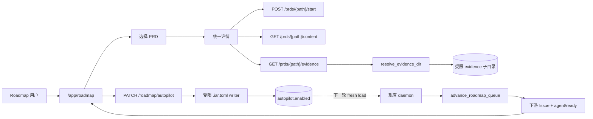

# PRD: Roadmap 单 PRD 控制、归档证据与 Autopilot 自动推进

> ✅ **交付前置**：无，可立即开工。
> 结构化声明见 §8 Delivery Dependencies，**那里是唯一事实源**。

> ✅ **验收状态**：已交付（2026-09-20）。rv-1..rv-6 全部通过（含 rv-2/rv-3 的真实 console 负控）；
> 证据包见 `tasks/evidence/P1-FEAT-20260916-122645-roadmap-prd-controls-evidence-autopilot/`。
> 本行是 §9 Acceptance Checklist 的投影，**那里是唯一事实源**。

本文档分两个高度：**Part A（§1–§4）** 给人看，用来确认“要不要做、做成什么样”；**Part B（§5–§13）** 给执行者看，包含机制、改动树与验证命令。

## Feature Overview (功能一览)

> 本块是 §10 Functional Requirements 的通俗投影，不是第二事实源；行为验收以 §1 行为样例表为准。

- **所有 Roadmap 视图都能启动单个 PRD**（FR-1、FR-2）：依赖图、时间轴、列表使用同一详情操作区；符合条件的 PRD 都有清晰的“开始此 PRD”入口。
- **在路线图内查看 PRD 与验收证据**（FR-3、FR-4、FR-5）：选择 PRD 后保留依赖图上下文，并可在“PRD 原文 / 验收证据”间切换；归档后仍能读取仓库保留的证据报告。
- **仓库级 Autopilot 开关**（FR-6、FR-7、FR-12）：在 Roadmap 顶部直接开关当前仓库既有的 `autopilot.enabled`，并从写后真实配置显示 daemon、并发上限与自动合并门禁状态。
- **上游完成后自动推进下游**（FR-8）：开启 Autopilot 且 daemon 运行时，复用现有持续调度循环，在依赖满足后自动补位并启动下游 PRD。
- **保留自动合并双重门禁**（FR-9）：Roadmap 开关不暗改 `safety.auto_merge`；页面明确显示完整自动闭环是否成立。
- **路径受限、只读的证据访问**（FR-10）：证据浏览只允许访问当前仓库配置的证据根目录与目标 PRD 子目录，不提供编辑、上传或任意文件浏览。
- **现有批量动作保持不变**（FR-11）：“全局开始”仍是一次性批量启动，“停止全局调度”仍使用现有行为，不与持续 Autopilot 混为一个动作。

# Part A · 人审层 (Review Layer)

## 1. Introduction & Goals

### Problem Statement

当前 `http://127.0.0.1:8313/app/roadmap/` 默认打开“依赖图”，但依赖图节点只接入了“查看 PRD 原文”：页面中的单 PRD `handleStart` 已经存在，却只传给时间轴和列表。因此用户在默认视图里只看到“全局开始”，很容易得出“不能单独开始 PRD”的结论。

PRD 详情页目前也只有原文阅读能力。完成并归档的 PRD 虽然在 `tasks/evidence/<prd-stem>/` 下保留 evidence report、verifier report、verification plan 等交付证据，Roadmap 却没有入口，用户无法在路线图中判断“为什么它算完成”。

项目已有完整的持续调度能力：daemon 在 `autopilot.enabled` 时执行 `advance_roadmap_queue`，上游合并后自动解锁下游并补满并发槽位；自动合并还受 `safety.auto_merge` 第二道门禁约束。但 Roadmap 页面既看不到 Autopilot 状态，也不能按仓开启，现有能力只能通过编辑 `.iar.toml` 使用。

### Interpretation (解读回显)

**行为样例**（下表每一行都会逐字变成验收标准，改一个单元格就是改验收条件）：

| 输入 / 操作 | 期望观察到的结果 |
|---|---|
| 在默认“依赖图”中选择一个 `未开始` 且无阻塞的 PRD | 右侧详情保留依赖图上下文，并显示可点击的“开始此 PRD”；点击后复用现有单 PRD 启动流程，状态刷新为就绪或运行中 |
| 选择一个被上游依赖阻塞的 PRD | 详情显示阻塞原因，“开始此 PRD”禁用，不允许绕过依赖门禁 |
| 勾选“显示已归档”并选择一个已归档 PRD | 详情提供“PRD 原文 / 验收证据”标签页；证据页列出该 PRD 在仓库中仍保留的报告、验证计划和附件，并可安全预览或下载 |
| 已归档 PRD 没有对应证据目录（边界情况） | 证据页显示“尚无可用证据”与实际查找位置，不报错、不空白，也不把验收清单勾选数冒充证据数量 |
| 在 `keda-main` 打开“Autopilot 自动推进” | 只把当前仓库 `.iar.toml` 中 `agent_runner.autopilot.enabled` 原子写为 `true`；页面重新读取后显示已开启，并显示 daemon 与自动合并门禁的真实状态 |
| Autopilot 已开启、daemon 运行、下游所有上游均已合并 | 现有持续调度在下一轮自动将下游 PRD 建立或复用 Issue、加入队列并打 `agent/ready`，无需再次点击“全局开始” |
| `safety.auto_merge=false` 时开启 Autopilot（边界情况） | 持续调度仍可在人工合并上游后启动下游；页面明确提示“自动合并未启用，流程会停在待审阅”，Roadmap 开关不得偷偷修改 `safety.auto_merge` |
| daemon 未运行时开启 Autopilot（失败/降级情况） | 配置保存成功，但页面显示“Daemon 未运行，自动推进暂不执行”并提供现有进程入口提示；不得谎报正在自动推进 |

**我默默定了这些**：

- 详情采用当前页面内部的 master-detail 分栏，不引入新路由、Dialog、Sheet 或第三方图库。
- 依赖图节点继续保持现有 220×64 的“标题 + 状态”紧凑形态；启动按钮放在统一详情头部，不把节点膨胀成列表卡片。
- Autopilot 开关是**当前选中仓库级**配置，写入该仓库根目录 `.iar.toml`；不把它存进 `console.db`，也不回写全局 `config.toml`。
- 开关只修改 `agent_runner.autopilot.enabled`。`safety.auto_merge` 是既有第二道危险动作门禁，页面只读展示，不由本开关联动修改。
- daemon 状态复用现有 process supervisor 记录，按当前仓库查找 `kind=daemon` 且 `status=running`；不新建心跳表。
- 证据事实源为当前仓库配置的 `validation.evidence_dir`。默认新约定使用 `tasks/evidence/<prd-stem>/`；显式 legacy 目录沿用既有解析语义。
- 证据数量来自目录中实际允许展示的文件，不从 PRD Acceptance Checklist 的勾选数推断。
- 归档后已清理的 orphan 证据分支不作为持久事实源；页面只保证展示仓库当前仍保留的证据。

**我理解为不做**：

- 不重写 Autopilot、merge queue、`advance_roadmap_queue` 或 runner 状态机。
- 不在 Roadmap 中编辑 PRD、修改验收清单、上传或删除证据。
- 不用一个 UI 开关同时打开 `autopilot.enabled` 与 `safety.auto_merge`，也不绕过 verifier、checks、sign-off 等现有合并门禁。

**文字版解读**：本需求读作“把 Roadmap 从只能看依赖和 PRD 原文的页面，补齐为可操作、可验收、可开启既有自动推进的仓库级控制面”，具体包括默认依赖图可启动单个 PRD、归档 PRD 可查看保留证据、当前仓库可开关既有 Autopilot 并看清 daemon/自动合并状态。它不新增第二套调度器，不重新定义完成态，也不把自动合并的双重安全门禁压成一个开关。

### What The User Gets

用户在 Roadmap 的默认依赖图中选择任意 PRD，就能在保留上下游关系的同时阅读原文、查看完成证据或启动该 PRD；无需为了单个启动切到列表。选择仓库后还能直接开启 Autopilot，看见 daemon 是否真正运行、自动合并是否具备完整门禁。上游完成后，下游会沿现有持续调度链自动开始。

### Measurable Objectives

- 默认依赖图中，符合现有 `isStartable` 规则且无阻塞的 PRD 在一次选择后即可触发规范的单 PRD start API；三种视图行为一致。
- 已归档 PRD 的详情在两次点击内进入证据页，并展示与磁盘允许目录逐项一致的文件名、类型、大小与预览/下载入口。
- Roadmap 上修改 Autopilot 后，重新加载配置与页面均读回相同值；只改目标仓库 `.iar.toml` 的单一布尔字段，其他注释、格式和配置值保持不变。
- Autopilot 开启且 daemon 运行时，上游合并后下游无需再次人工点击即可在下一轮调度进入 ready/running；关闭后不再执行自动补位。
- 页面不会把 `autopilot.enabled=true` 且 `safety.auto_merge=false` 显示为“全自动完成”，也不会在 daemon 停止时显示“正在推进”。

## 2. Human Review Map (介入与风险地图)

本次需要人工确认两项，其余由执行者和自动化门禁覆盖。

### 决策一：Roadmap 开关只控制 Autopilot，不联动打开自动合并

项目当前有意要求 `autopilot.enabled=true` 与 `safety.auto_merge=true` 同时成立，才会自动合并 PR。这个双重门禁防止历史上误设的 `auto_merge` 或一次误触直接触发不可逆的远端合并。推荐保留该边界：Roadmap 开关只控制自动发现、依赖解锁和队列补位；页面单独显示“自动合并已启用/未启用”。若未启用，流程会在待审阅阶段等待人工合并，合并后再自动推进下游。

**请确认：** 接受 Roadmap 的 Autopilot 开关只修改 `autopilot.enabled`，不联动修改 `safety.auto_merge`，并在页面明确显示完整闭环状态？

**验收：** 开启开关前后对比 `.iar.toml`，只有 `agent_runner.autopilot.enabled` 改变；当 `safety.auto_merge=false` 时页面明确提示流程会停在待审阅，真实 PR 不会自动合并。

### 决策二：归档证据以仓库保留目录为长期事实源

runner 执行时会把完整证据上传到临时 orphan 分支，但 Issue 关闭后该分支会被清理；归档后能长期稳定读取的是仓库内 `tasks/evidence/<prd-stem>/` 保留的报告与允许提交的附件。推荐 Roadmap 只承诺展示这个长期事实源。页面可以列出实际存在的 evidence report、verifier report、verification plan、文本、图片或其他保留附件；缺失时如实显示空态，而不是抓取已不存在的临时分支。

**请确认：** 接受 Roadmap 的“验收证据”以仓库当前保留的 evidence 目录为准，不承诺恢复 Issue 关闭后已清理的临时证据分支？

**验收：** 对一个有归档报告的 PRD，页面展示内容与磁盘逐项一致；对一个无证据目录的归档 PRD，页面显示明确空态和解析位置，不出现伪造数量或 500 错误。

### 自动门禁，不需要逐项人工审阅

单 PRD 启动继续复用既有 API 与门禁；证据访问必须经过路径 containment、文件类型与大小限制；`.iar.toml` 写回必须 round-trip 保留注释并原子替换；daemon 状态从现有 supervisor 读取；前端通过现有 `lib/api/roadmap.ts` 访问规范端点。对应行为由 API 测试、配置往返测试、Playwright 真实页面测试和全仓 lint/build 覆盖。

**本次明确不涉及**：无数据库结构变化；不新增 daemon、队列表或调度框架；不修改自动合并条件；不提供证据编辑/上传/删除；不改 `frontend-admin/`。

## 3. Usage And Impact After Implementation

**Roadmap 操作者**：入口仍为 `http://127.0.0.1:8313/app/roadmap/`。默认依赖图中点击节点后，主区域保持依赖图并在右侧显示详情；待启动 PRD 可直接点击“开始此 PRD”；归档 PRD 可切换到“验收证据”查看交付报告。顶部新增当前仓库的“Autopilot 自动推进”开关，并显示 daemon、并发上限和自动合并状态。

**代码审阅者/验收者**：无需离开 Roadmap 去编辑器搜索 `tasks/evidence/`。证据页优先显示 evidence report、verifier report、verification plan，并允许打开受支持的保留附件；仍可通过 Issue/PR 链接查看 GitHub 上的审阅历史。

**运维者**：Autopilot 是仓库级配置，修改后不要求重启 console；daemon 每轮本来就读取对应仓库上下文，后续轮次使用新值。若 daemon 未运行，页面如实显示停止状态，用户仍可沿现有 Processes 页面启动 daemon。

**API 调用方**：现有 Roadmap 列表、内容、单个开始、全局开始与停止接口保持兼容；新增 Autopilot 状态/更新与证据列表/文件读取端点，不改既有响应字段含义。

## 4. Requirement Shape

- **actor**：Roadmap 操作者；间接涉及代码审阅者、验收者和 daemon 运维者。
- **trigger**：选择依赖图/时间轴/列表中的 PRD；点击“开始此 PRD”；切换“验收证据”；切换当前仓库 Autopilot；daemon 进入下一轮调度。
- **expected behavior**：三种视图共享同一详情与启动能力；归档证据从受限目录按需读取；Autopilot 配置原子写回并显示真实运行条件；上游完成后复用现有持续调度自动启动下游。
- **explicit scope boundary**：不改变 runner 状态机、合并门禁与调度算法；不编辑 PRD/证据；不新增存储或依赖；不承诺展示已清理的临时证据分支。

# Part B · 执行器层 (Build Layer)

## 5. Repository Context And Architecture Fit

**当前相关模块与断点**：

- 页面入口：`frontend-public/app/(app)/app/roadmap/page.tsx`。已有 `handleStart` 与 `startRoadmapPrd`，但 `RoadmapGraph` 只接收 `onOpenContent`，时间轴/列表才接收 `onStart`；页面以 `POLL_INTERVAL_MS = 30000` 轮询。
- 依赖图：`frontend-public/components/roadmap/roadmap-graph.tsx`，固定 220×64 节点 + SVG 贝塞尔连线；点击节点直接把整块主画布替换为 `PrdContentView`。拓扑分层已提为同目录共享模块 `roadmap-topology.ts`；`type RoadmapView = "graph" | "timeline" | "list"`，「依赖图」是纯前端默认视图，`PATCH /roadmap/settings` 的 `default_view` 只接受 `timeline|list`，graph 不回写后端。
- 列表卡片：`frontend-public/components/roadmap/prd-card.tsx` 已定义 `isStartable`（`not_started` / `failed` / `waiting`）和阻塞禁用规则（`block_reason` 非空时 `disabled`），是前端按钮可见性的复用来源；不要在依赖图再复制一份判断。
- PRD 原文：`PrdContentView` + `GET /agent-runner/roadmap/prds/{encoded_path}/content` 已具备 base64url 路径、双目录白名单、containment 与 UTF-8 读取先例。
- Roadmap API：`src/backend/api/routes/agent_runner_roadmap.py`（325 非空行）已装配仓库 context、store、GitHub client、process supervisor 与单个/全局动作。注意 `GET /roadmap/prds` 走进程内 30 秒缓存（`_ROADMAP_CACHE` / `_ROADMAP_CACHE_TTL_SECONDS = 30`），`POST .../start` 成功后会主动失效该仓缓存；新增只读/写入端点时必须显式决定是否复用该缓存。
- 持续调度：`src/backend/core/use_cases/run_agent_daemon.py` 在 `context.config.autopilot.enabled` 时调用 `advance_roadmap_queue`；`roadmap_actions.py` 已负责对账、槽位、发现、依赖解锁与晋升。
- 自动合并：`agent_runner_merge_queue.py::_autopilot_enabled` 要求 `autopilot.enabled AND safety.auto_merge`；此双门禁必须保留。
- 仓库本地配置：`load_agent_runner_local_settings` 只读 `.iar.toml`。本仓根 `.iar.toml` 是**受 git 跟踪**的文件，其中 `[agent_runner.autopilot]` 现有 `enabled` / `merge_method` / `require_verifier_pass` / `auto_sign_off` / `merge_check_timeout_seconds` 与大量注释——写回测试必须用临时注册仓，避免改脏开发仓。现有 `TomlRegistryEditor`（`src/backend/infrastructure/config/registry_editor.py`）只允许写 `config.toml` 的 repositories 子树，不能直接扩来写仓库配置。
- daemon 状态：`create_process_supervisor().list_processes()` 返回 `repo_id`、`kind`、`status`，含托管和发现出的 unmanaged daemon，可直接解析当前仓库状态。
- 证据路径：`agent_runner_validation.py::resolve_evidence_dir` / `resolve_evidence_relpath` / `list_evidence_files` 是默认 `tasks/evidence/<prd-stem>` 与 legacy 扁平目录的单一解析入口；证据列表的一层文件语义与隐藏文件排除已有先例。
- 前端栈：`frontend-public` 是 Next.js 16 + React 19 + Tailwind v4 + shadcn/ui（pnpm，`packageManager: pnpm@11.3.0`）。静态导出现在由 `just console-sync` 构建并同步到 `src/backend/api/static/console/`（该目录是 gitignored 构建产物，FastAPI 按请求读盘）；API 客户端集中在 `lib/api/`，类型集中在 `lib/api/types.ts`。E2E 位于 `tests/playwright-e2e/tests/smoke/`，已有 `roadmap.spec.ts`、`roadmap-realistic.spec.ts`、`roadmap-prd-content.spec.ts` 可作新用例的复用起点。

**Existing Path**：Roadmap 页面状态和动作 → `lib/api/roadmap.ts` → `agent_runner_roadmap.py` → core 用例/既有工厂。证据路径复用 validation core 解析；配置写回新增受限端口与 infrastructure 实现，经 core 用例调用。

**Reuse Candidates**：`handleStart`、`startRoadmapPrd`、`PrdContentView` 的加载/错误态、`isStartable` 规则（应提为共享纯函数）、`_resolve_context`、`_decode_prd_path`、`resolve_evidence_dir`、`list_evidence_files`、process supervisor、tomlkit 原子 round-trip 写法（若 `P1-FEAT-20260918-110027` 先落地则直接复用其原语）、Roadmap 30 秒轮询、`tests/smoke/roadmap-prd-content.spec.ts` 与 `roadmap-realistic.spec.ts` 的既有用例骨架。

**Architecture Constraints**：API 只校验 DTO 和调用用例；core 不 import FastAPI、tomlkit 或 infrastructure；配置写回通过 core 端口；前端只经规范 API；任何文件读取都显式 UTF-8；不得把请求路径直接拼到文件系统。

**Frontend Impact**：**Full-stack**。只改 `frontend-public` 的 Roadmap 页面、Roadmap 组件、API client 与类型；`frontend-admin` 无影响。真实 UI 验证使用 `just e2e tests/smoke/roadmap*.spec.ts`，生产入口为 console 同源静态页面 `/app/roadmap/`。

**Existing PRD Relationship**（2026-09-19 对照 `tasks/pending/` 与 `tasks/archive/` 重新核对）：

- `P1-FEAT-20260703-105340-prd-regrounding-touch-map-avoidance` 已**交付归档**，且实际收缩为「execution 模板开工前的 PRD 引用核验（PRD map check）」，**没有**引入 `[agent_runner.autopilot.regrounding]` 之类的子表（`rg -n "regrounding" src/backend` 无命中）。本 PRD 因此不再需要为它的字段让路；writer 的「保留未知键/子表」要求保留，但依据改为通用保真，见 §7 Executor Drift Guard。
- **下游硬依赖（本 PRD 阻塞它）**：`P1-FEAT-20260916-134008-roadmap-prd-cicd-monitor-auto-repair` 在自身 §8 声明 `Group: roadmap-delivery-control`、`Depends on: P1-FEAT-20260916-122645-…`、`Gate type: hard`，理由是它要复用本 PRD 建立的统一 PRD 详情与仓库级设置写回边界，先交付会重复创建详情容器与配置接口。这给本 PRD 加了两条约束：详情标签容器必须能容纳第三个标签页（CI/CD），详情头部动作必须可组合而不是写死一组按钮。
- **同面并发（原为需协调，非依赖；已按「先合并者定义、后合并者复用」结清）**：`P1-FEAT-20260918-110027-lifecycle-agent-matrix` 改了 `frontend-public/app/(app)/app/roadmap/page.tsx`（受管理仓库列表加齿轮按钮与矩阵抽屉）、`frontend-public/components/roadmap/prd-content-view.tsx`（工具栏加「Agent 覆盖」按钮），并写入仓库 `.iar.toml` 的 agent 阶段配置。它先合并（PR #147，merge commit `8c8403e`），因此本 PRD 的交付在 rebase 到该提交后进行：本 PR 复用其 `.iar.toml` 写回原语 `update_toml_table_keys`（`infrastructure/config/toml_section_editor.py`），只保留自己的窄封装 `repository_settings_editor.py`；页面合并保留齿轮按钮与矩阵抽屉，同时把详情改为 master-detail，`PrdContentView` 的「返回列表」头改为仅在传入 `onBack` 时渲染，而「Agent 覆盖」按钮始终保留。
- `P1-FEAT-20260913-204531-tauri-desktop-shell` 与 Roadmap 控制面无关，不构成依赖或冲突。
- 相关归档 PRD（均在 `tasks/archive/`）：`P1-FEAT-20260614-200054-frontend-prd-roadmap.md`（Roadmap 初版与单启动目标）、`P1-FEAT-20260703-105330-roadmap-continuous-scheduling.md`（Autopilot 持续调度）、`P1-FEAT-20260913-204530-console-prd-content-reader.md`（PRD 原文读取）。本 PRD 扩展这些已交付能力，不重复实现。

**Potential Redundancy Risks**：不要新增 `roadmap.continuous` 第二开关；不要复制证据目录拼接；不要把 `.iar.toml` 写回塞进只管 registry 的 `TomlRegistryEditor`；不要与 `P1-FEAT-20260918-110027-lifecycle-agent-matrix` 的仓库级 agent 设置各写一份 `.iar.toml` round-trip；不要为 daemon 状态新建数据库或心跳线程；不要为详情引入第二个页面路由。

## 6. Recommendation

### Recommended Approach

采用最小的“现有能力控制面”方案：

1. 把 Roadmap 详情从“替换整个画布”调整为复用现有组件的同页 master-detail；三种视图都只负责选择 PRD，详情头部统一负责启动、Issue/PR 动作与状态。
2. 在详情内把现有 `PrdContentView` 作为“PRD 原文”标签页，再加“验收证据”标签页；后端新增路径受限的证据 manifest 与 artifact 读取端点。
3. 新增一个窄职责的仓库配置端口，只允许读取/修改 `.iar.toml` 的 `agent_runner.autopilot.enabled`，基础设施实现复用 tomlkit 的注释保留与原子替换模式。
4. Roadmap Autopilot 状态端点同时返回 effective 配置、`safety.auto_merge`、daemon running 与 `max_parallel`；前端据此展示真实闭环状态。
5. 不改 daemon 与 `advance_roadmap_queue`：开关写回后，既有下一轮调度自然生效。

这条路径只补缺失的接口与 UI 组合，不新增状态机、持久化表、调度服务或前端依赖。

### Proposed Solution Summary (实现机制)

核心机制是**统一 PRD 详情 + 两个受限只读/配置适配器**。页面选择 PRD 后保留当前 Roadmap 视图，在右侧统一展示标题、状态、路径、启动动作与标签页；“验收证据”通过 PRD stem 交给既有 evidence path resolver，后端只返回 containment 内允许的一层文件 manifest，并按编码后的文件名提供只读内容；“Autopilot 自动推进”通过受限 core 用例读取/写入当前仓库 `.iar.toml` 的单个布尔键，写后重新加载配置作为成功判据。daemon 和 merge queue 继续消费既有 `AppConfig`，系统不推断或新建另一份开关。

配置由操作者在 Roadmap 显式提供；证据由 runner 现有交付流程产生；daemon 状态由 process supervisor 提供；并发上限由现有 `roadmap_settings` 提供。避免的复杂度包括新数据库表、通用 TOML 编辑 API、任意文件服务器、独立证据索引、WebSocket 与第二套调度循环。

### Alternatives Considered

- **把 `autopilot.enabled` 存进 `roadmap_settings`**：拒绝。daemon 读取的是仓库配置，另存 DB 会产生两个事实源并要求同步协议。
- **开关同时打开 `safety.auto_merge`**：拒绝。破坏既有双重危险动作门禁，且用户无法只要自动排程而保留人工合并。
- **证据从 GitHub orphan 分支读取**：拒绝作为主路径。Issue 关闭后分支会清理，无法满足归档后长期可见；网络和认证也会让本地页面不稳定。
- **新增独立 PRD 详情路由**：拒绝。会丢失依赖图上下文，且现有页面已具备内部详情模式。

## 7. Implementation Guide

> This section is a living implementation guide based on current repository analysis. If implementation discovers additional affected files, hidden dependencies, edge cases, or a better path, update this PRD before proceeding.

### Core Logic

1. Roadmap 加载仓库后并行请求 PRD 列表、Roadmap 设置与 Autopilot 状态；30 秒轮询刷新 PRD、daemon 和 effective 配置状态。PRD 列表沿用服务端 30 秒 `_ROADMAP_CACHE`；**Autopilot 状态每轮必须 fresh 读配置，证据 manifest 每次进入标签页必须重新解析磁盘**——两者不得复用该缓存，否则 rv-2 的写后读回与 rv-3 的 fresh-state probe 会读到陈旧值。
2. 任一视图点击 PRD 只更新 `selectedPrd`；主内容改为视图区 + 详情区。移动端/窄屏退化为上下堆叠，不创建 modal。详情容器按可扩展标签设计（本 PRD 两个标签，`P1-FEAT-20260916-134008` 将追加 CI/CD 标签），不要把标签写死为二元切换。视图选择状态不依赖 `default_view` 持久化：`graph` 是纯前端默认视图，后端只接受 `timeline|list`。
3. 详情头部调用共享 `canStartRoadmapPrd(prd)` 决定按钮可见与禁用原因，点击继续走既有 `startRoadmapPrd`。
4. 证据 manifest 用例先通过受限 PRD reader 规则解析合法 PRD，再取 `Path(prd_path).stem`，调用 `resolve_evidence_dir`，验证目录仍位于配置证据根；只列一层普通非隐藏文件，返回名称、大小、媒体类型、角色（evidence report / verifier report / verification plan / artifact）与 artifact URL。
5. artifact reader 对 base64url 文件名解码后要求纯 basename、拒绝 `/`、`\\`、`.`/`..`、符号链接逃逸、目录与超限文件；Markdown/纯文本以原文形式内联预览（不渲染成 HTML，页面 H1 与磁盘首个 H1 逐字一致），图片浏览器展示，其他类型下载。所有文本显式 UTF-8，解码失败返回清晰 4xx。
6. Autopilot GET 用例返回 effective `autopilot.enabled`、`safety.auto_merge`、daemon running、max parallel 与来源路径。PATCH 只接受 `enabled: bool`，通过新端口 round-trip 修改 `.iar.toml` 的 `[agent_runner.autopilot].enabled`，临时文件校验后 `os.replace`，再调用 fresh loader 读回。
7. writer 不重建整个配置模型，不删除未知键/子表；目标仓没有 `.iar.toml`、文件非法、不可写或读回不一致时不替换原文件并返回 4xx/409。
8. 开启后不主动 spawn daemon、不立即运行 advance；页面若 daemon 未运行显示明确降级。运行中的 daemon 下一轮自然读取新配置并调用现有持续调度。

### Change Impact Tree

```text
.
├── src/backend/core/shared/interfaces/
│   └── runner_console.py 或新的 repository_settings_editor.py
│       [修改/新增] 受限 IRepositoryAutopilotSettingsEditor 端口；只暴露 set_enabled
├── src/backend/core/use_cases/
│   ├── roadmap_autopilot_settings.py
│   │   [新增] 聚合 effective config、daemon 状态、max_parallel；执行受限写回并读回校验
│   ├── roadmap_prd_evidence.py
│   │   [新增] 解析 PRD 对应 evidence 目录、生成 manifest、受限读取单个 artifact
│   ├── agent_runner_validation.py
│   │   [复用为主] resolve_evidence_dir 单一规则；只有确有共享缺口时才提取纯路径 helper
│   └── agent_runner_factory.py
│       [修改] 暴露 repository-local settings editor 工厂（或沿既有 composition 装配方式）
├── src/backend/infrastructure/config/
│   ├── repository_settings_editor.py
│   │   [新增/复用] tomlkit round-trip + 同目录临时文件 + os.replace，只改 autopilot.enabled；
│   │   若 lifecycle-agent-matrix PRD 已先落地同类原语则复用它，不新建第二份
│   └── agent_runner_settings.py
│       [复用] fresh loader 做写后完整校验，不新增平行解析器
├── src/backend/api/routes/agent_runner_roadmap.py
│   [修改] 新增 GET/PATCH autopilot、GET evidence manifest、GET artifact；DTO/HTTP 错误映射
├── frontend-public/
│   ├── app/(app)/app/roadmap/page.tsx
│   │   [修改] master-detail 状态、Autopilot 请求/开关/轮询、统一 start 回调
│   ├── components/roadmap/prd-detail.tsx
│   │   [新增] 详情头、统一动作、“PRD 原文 / 验收证据”标签
│   ├── components/roadmap/prd-evidence-view.tsx
│   │   [新增] manifest 加载、报告/附件列表、预览/下载、空态/错误态
│   ├── components/roadmap/roadmap-autopilot-control.tsx
│   │   [新增] 仓库级开关、daemon/auto-merge/max-parallel 状态与降级文案
│   ├── components/roadmap/prd-card.tsx
│   │   [修改] 将可启动判断提为共享纯函数，卡片与详情复用
│   ├── components/roadmap/roadmap-graph.tsx
│   │   [未改动] 已带 onOpenContent prop；页面改为传 setSelectedPrd 即完成统一选择
│   ├── components/roadmap/roadmap-timeline.tsx
│   │   [未改动] 同上，已有 onStart/onOpenContent，无需改组件
│   ├── components/roadmap/roadmap-list.tsx
│   │   [未改动] 同上，已有 onStart/onOpenContent，无需改组件
│   ├── lib/api/roadmap.ts
│   │   [修改] 新增 Autopilot 与 evidence API wrapper，复用 encodePrdPath
│   └── lib/api/types.ts
│       [修改] 新增 manifest/artifact/autopilot DTO
├── tests/
│   ├── test_roadmap_autopilot_settings.py
│   ├── test_roadmap_prd_evidence.py
│   └── test_repository_settings_editor.py
│       [新增] 配置保真、路径攻击、空态、API 契约、状态聚合
│   └── test_roadmap_api.py
│       [未改动] 既有契约测试，本次仅回归运行
├── tests/playwright-e2e/tests/smoke/
│   └── roadmap-controls-evidence-autopilot.spec.ts
│       [新增] 三视图选择/启动、证据页、Autopilot 状态与 PATCH canonical path
└── docs/
    ├── guides/agent-runner.md
    │   [修改] Roadmap 单启动、证据浏览、Autopilot 开关/双门禁/daemon 条件
    └── api/references.md
        [修改] 新端点契约；既有 nav 无新增页面则不改 mkdocs.yml
```

### Risk Classification Register

| Change point | Tier | Why | Oracle |
|---|---:|---|---|
| Roadmap 真实页面统一单 PRD 启动与详情 | R2 | 用户动作会创建/推进 Issue，必须证明默认依赖图走规范 API 且不绕过阻塞 | rv-1 |
| Autopilot `.iar.toml` 受限写回与双门禁表达 | R3 | 修改仓库执行策略并可能间接导致远端自动合并，错误值或旁路风险高 | rv-2 |
| 归档证据路径受限读取与页面呈现 | R2 | 涉及本地文件边界与人类验收判断，必须证明内容来源和目录 containment | rv-3 |
| daemon 上游完成后自动启动下游 | R2 | 跨配置、daemon、GitHub label 和 Roadmap 刷新多个边界 | rv-4 |
| API/前端类型、错误态、构建与文档 | R1/R0 | 契约与静态质量门禁，可由定向测试和构建覆盖 | rv-5、rv-6 |

R2/R3 共 4 个表面看似超出建议上限，但 rv-1/rv-3 是同一 Roadmap master-detail 用户面，rv-2/rv-4 是同一 Autopilot 控制链；它们共享发布与回滚边界。拆分会产生详情半成品或 UI 开关无真实闭环，因此保持一个 PRD，并在验收包中按两条场景呈递。

### Executor Drift Guard

- 实现前重新运行：`rg -n "handleStart|RoadmapGraph|PrdContentView|startRoadmapPrd" frontend-public/app frontend-public/components frontend-public/lib/api`，确认没有并行入口。
- 配置写回前检查：`rg -n "autopilot.enabled|safety.auto_merge|load_agent_runner_local_settings" src/backend`，不得新增第三份语义。
- 证据路径检查：`rg -n "def resolve_evidence_dir|evidence_dir_uses_task_subdirs|list_evidence_files" src/backend/core`，不得手写 `tasks/evidence/${stem}`。
- daemon 状态检查：`rg -n "RunnerProcessKind.DAEMON|kind.*daemon|list_processes" src/backend`，复用现有进程识别；若记录字段变化，更新 PRD 后再实现。
- 配置 writer 保真断言必须覆盖两类样本：本仓 `.iar.toml` 真实的 `[agent_runner.autopilot]` 同级键（`merge_method` / `require_verifier_pass` / `auto_sign_off` / `merge_check_timeout_seconds`）与注释，以及一个人工构造的未知子表。不要再用 `[agent_runner.autopilot.regrounding]` 作样本——该 PRD 已归档且未新增任何 autopilot 子键（§5），写后除目标 bool 外必须逐行保留。
- 写回实现前先查 `rg -n "tomlkit|os\.replace" src/backend/infrastructure/config`：若 `P1-FEAT-20260918-110027-lifecycle-agent-matrix` 已先落地仓库级 `.iar.toml` round-trip 原语，直接复用而不是新建第二份；两个 PRD 不得各持一套注释保留/原子替换逻辑。
- 只读新端点不得搭 30 秒缓存便车：`rg -n "_ROADMAP_CACHE" src/backend/api/routes` 中不应出现 evidence 或 autopilot 路径。
- 若 `agent_runner_roadmap.py` 接近 500 非空行，按读取/设置子路由或 DTO 职责拆分，不继续无限追加；API 仍保持同一 URL namespace。

### Flow Diagram



### ER Diagram

No data model changes. Roadmap 队列与设置继续使用现有 `console.db` 表；Autopilot 的唯一持久事实源仍是仓库 `.iar.toml`，证据仍是仓库文件树。

### Realistic Validation Plan

```yaml
oracles:
  - id: rv-1
    behavior: 在默认依赖图中选择可启动 PRD，详情出现“开始此 PRD”并经规范 start API 启动；阻塞 PRD 不可启动；列表和时间轴共享同一规则
    reviewer: human
    real_entry: "just e2e tests/smoke/roadmap-controls-evidence-autopilot.spec.ts"
    expected: "真实 /app/roadmap 页面默认依赖图可选中节点并启动；网络记录只有 /api/v1/agent-runner/roadmap/prds/{encoded}/start；阻塞 fixture 按钮禁用且无请求；三视图切换后动作一致"
    mock_boundary: "浏览器与 frontend-public 真实；Roadmap API 用 Playwright route 提供确定性仓库/PRD 数据，start 请求体与路径由测试捕获；另以 console-served static spec 证明生产静态入口"
    tier: R2
    test_layer: e2e
    required_for_acceptance: true
    presentation: "tasks/evidence/P1-FEAT-20260916-122645-roadmap-prd-controls-evidence-autopilot/rv-1-roadmap-single-start.webm（/app/roadmap 真实页面录屏，标注 production-boundary with API stub）；自检：默认依赖图选中“未开始”节点，详情必须出现一个且仅一个“开始此 PRD”"
    critical_value_source: "按钮可用状态直接来自 GET /roadmap/prds 返回的 state 与 block_reason，start 路径使用该响应中的 prd_path 经既有 encodePrdPath 原样编码"
    must_cross: "浏览器依赖图节点 -> page selectedPrd -> 统一详情 -> lib/api/roadmap.ts -> canonical start endpoint"
    forbidden_bypasses: "不得用组件预览或直接调用 handleStart 作为证据；不得新增第二个 start endpoint；不得仅在列表视图验证"
    fresh_state_probe: "start 响应后重新请求 PRD 列表并让页面显示 ready/running，而非只显示本地 toast；同时覆盖服务端 _ROADMAP_CACHE 被 start 端点失效的路径"
    final_tree_evidence: "录屏、trace 与请求日志在最终前端静态产物和最终 API client 上采集；相关文件变更后重采"
    negative_control: "在实现前默认依赖图点击节点后检查页面"
    expected_fail: "整块画布被 PRD 原文替换且没有“开始此 PRD”，用例失败"
  - id: rv-2
    behavior: Roadmap 开关只原子修改当前仓库 autopilot.enabled，保留全部其他 TOML 内容；页面准确显示 auto_merge 与 daemon 状态，写后 fresh load 读回
    reviewer: human
    real_entry: "启动真实 iar console，打开 /app/roadmap，切换测试仓库 Autopilot；随后重新加载页面并读取该仓库 .iar.toml"
    expected: "开关即时显示已开启，刷新后仍开启；diff 只有 autopilot.enabled false→true；safety.auto_merge、同级键 merge_method/require_verifier_pass/auto_sign_off/merge_check_timeout_seconds、注释与未知子表逐字保留；daemon 停止与 auto_merge=false 分别显示明确降级文案"
    mock_boundary: "真实 console/FastAPI、真实临时 Git 仓与真实 .iar.toml 文件；GitHub 不参与。本仓根 .iar.toml 受 git 跟踪，必须用临时注册仓库验证，禁止改脏开发仓配置"
    tier: R3
    test_layer: system
    required_for_acceptance: true
    presentation: "tasks/evidence/P1-FEAT-20260916-122645-roadmap-prd-controls-evidence-autopilot/rv-2-autopilot-control.webm + rv-2-config-diff.txt；自检：界面开关打开后刷新仍打开，diff 中只能出现一行 enabled 变化"
    critical_value_source: "页面初始值和写后值都来自 fresh repository context 的 effective AppConfig；持久值来自临时仓库 .iar.toml 的 agent_runner.autopilot.enabled"
    must_cross: "浏览器 PATCH -> FastAPI DTO -> core settings use case -> IRepositoryAutopilotSettingsEditor -> tomlkit 临时文件 -> 完整配置校验 -> os.replace -> fresh loader -> GET/UI"
    forbidden_bypasses: "不得写 console.db/config.toml；不得直接字符串替换 TOML；不得联动改 safety.auto_merge；不得只凭 PATCH 200 判成功"
    fresh_state_probe: "关闭并重启 console 后，以新进程 GET autopilot 并在新浏览器标签读回；同时对原始/结果 TOML 做语义外逐行 diff"
    final_tree_evidence: "录屏与 diff 在最终实现树的真实 API 上采集；writer、路由、loader 或前端开关变更后重采"
    negative_control: "用当前代码请求 PATCH /api/v1/agent-runner/roadmap/autopilot"
    expected_fail: "404，证明此前不存在可写入口"
  - id: rv-3
    behavior: 已归档 PRD 在 Roadmap 中显示与受限 evidence 目录一致的证据；无目录为空态；穿越、符号链接逃逸、子目录伪装与超限文件被拒绝
    reviewer: human
    real_entry: "真实 console + 临时仓库，打开 /app/roadmap，显示已归档并选择有证据/无证据两个 PRD"
    expected: "有证据 PRD 列出并可打开 evidence report/verifier report/verification plan；显示内容与磁盘 UTF-8 原文一致；无证据 PRD 显示空态；恶意 artifact URL 全部 4xx 且不泄露仓外内容"
    mock_boundary: "真实 FastAPI、真实文件系统与真实浏览器；GitHub 状态可用 fake client 隔离网络，但 PRD/证据文件不可 mock"
    tier: R2
    test_layer: system
    required_for_acceptance: true
    presentation: "tasks/evidence/P1-FEAT-20260916-122645-roadmap-prd-controls-evidence-autopilot/rv-3-archived-evidence.png（真实页面截图，标注 real filesystem / fake GitHub boundary）；自检：点击 evidence report，标题与磁盘文件首个 H1 相同；该图按 docs/ai-standards/testing.md 就地嵌入 evidence report（相对路径内嵌 + 「本地图片」标注 + open 绝对路径）"
    critical_value_source: "证据文件名、大小与内容来自 resolve_evidence_dir 解析出的目标 PRD 目录内真实文件；前端不得用验收勾选数生成文件数量"
    must_cross: "浏览器 evidence tab -> manifest endpoint -> PRD path validation -> resolve_evidence_dir -> containment -> artifact endpoint -> Markdown/image renderer"
    forbidden_bypasses: "不得手工注入证据数组；不得直接拼 tasks/evidence/<stem>；不得递归把 scripts/ oracle 冒充一层证据；不得跟随逃逸 symlink；不得让 manifest/artifact 走 _ROADMAP_CACHE 或前端缓存而返回陈旧列表"
    fresh_state_probe: "首次查看后新增一个允许文件并刷新页面，manifest 从新请求出现该文件；删除后再刷新消失，证明非前端硬编码/缓存（服务端也不得命中 30 秒 PRD 缓存）"
    final_tree_evidence: "截图、HTTP 攻击矩阵和字节对比在最终实现树上采集；路径或 renderer 变更后重采"
    negative_control: "在实现前请求 evidence manifest endpoint"
    expected_fail: "404；当前详情也只有 PRD 原文标签"
  - id: rv-4
    behavior: Autopilot 开启且 daemon 运行时，上游合并后下一轮自动晋升下游；关闭后同场景不晋升；auto_merge=false 时不自动合并
    reviewer: verifier
    real_entry: "uv run pytest -o addopts=\"\" tests/test_roadmap_advance.py tests/test_roadmap_autopilot_settings.py -k 'autopilot or upstream or disabled' -v"
    expected: "真实 advance_roadmap_queue + fake GitHub/store：enabled=true 时 merged 上游释放槽位且下游获 ready；enabled=false 的 daemon pass 零 advance 调用；auto_merge=false 的 merge queue 零 merge 调用"
    mock_boundary: "GitHub 和 process/store 端口使用 fake 记录副作用；配置 loader、dependency evaluator、state resolver、advance 真实"
    tier: R2
    test_layer: integration
    required_for_acceptance: true
    critical_value_source: "临时仓库 .iar.toml fresh load 得到的 autopilot.enabled 与 safety.auto_merge；依赖状态来自 fake GitHub 上游 merged 状态"
    must_cross: "fresh config -> daemon gate -> advance_roadmap_queue -> dependency evaluation -> ready label side effect；merge queue 另过双门禁"
    forbidden_bypasses: "不得直接调用 start_prd 冒充 daemon 自动推进；不得在测试内跳过 config gate；不得因 UI 开关而弱化 merge queue 双门禁"
    fresh_state_probe: "每个场景用新建 context/store/client 重跑一轮并从 fake GitHub 的最新标签集合读取结果"
    final_tree_evidence: "集成测试在最终 daemon/config/roadmap 代码树运行；任一边界变更后重跑"
    negative_control: "临时忽略 autopilot.enabled 门控调用 advance"
    expected_fail: "disabled 场景出现 ready 副作用，断言失败"
  - id: rv-5
    behavior: 后端 API 与 core 边界覆盖成功/空态/错误：Autopilot GET/PATCH、证据 manifest/artifact、非法仓库/路径/文件均返回稳定契约
    reviewer: verifier
    real_entry: "uv run pytest -o addopts=\"\" tests/test_roadmap_api.py tests/test_roadmap_prd_evidence.py tests/test_repository_settings_editor.py -v"
    expected: "定向测试全绿；非法输入为 4xx；写失败原文件不变；API 层不直接 import infrastructure/tomlkit"
    mock_boundary: "FastAPI TestClient 真实；core 端口按测试目标用 fake；writer 测试使用真实临时文件"
    tier: R1
    test_layer: integration
    required_for_acceptance: true
  - id: rv-6
    behavior: 全仓质量、前端构建、文档与复用门禁保持绿
    reviewer: verifier
    real_entry: "just lint --reuse && just lint --full && just test && just console-sync && just e2e tests/smoke/roadmap-controls-evidence-autopilot.spec.ts && uv run mkdocs build --strict"
    expected: "所有命令退出 0；`just console-sync` 完成 frontend-public 构建与静态导出同步；无重复实现、架构反向 import 或文档导航错误"
    mock_boundary: "按各命令既有测试边界；构建/lint 无 mock"
    tier: R0
    test_layer: smoke
    required_for_acceptance: true
```

失败排查提示：rv-1/rv-3 页面 404 先运行 `just console-sync`（重建 frontend-public 静态导出并同步到 `src/backend/api/static/console/`，`iar console` 按请求读盘，无需重启进程，浏览器硬刷新即可）；rv-2 写回失败先检查临时仓 `.iar.toml` 是否包含合法 `[agent_runner]` 段及写权限；rv-4 若未晋升，先看 dependency evaluator 是否把上游判为 merged，再看 Roadmap 槽位；任何证据路径失败先打印解析后的配置 evidence root 与 PRD stem，不要放宽 containment；rv-3 若列表不随磁盘变化，先确认 manifest 没有复用 `_ROADMAP_CACHE`。

### Low-Fidelity Prototype

以下线框是已确认视觉草图的结构化落地说明；实现应服从现有 shadcn/Tailwind 样式，不要求像素级复刻生成图。

```text
┌ 路线图  [✓ 显示已归档] [视图：依赖图] 18 个 PRD     [全局开始] [停止全局调度] ┐
│ [● Autopilot 自动推进] 已开启  上游完成后自动解锁并启动下游 PRD               │
│    自动补位 · 自动解锁下游 · 通过既有门禁后自动合并   ● Daemon 运行中  并发 2 │
├───────────────┬──────────────────────────────┬────────────────────────────┤
│ 受管理仓库     │ 依赖图（现有 220×64 节点）    │ 前端 PRD 路线图  [已归档]    │
│ ● keda-main   │ [前端路线图] ─→ [Dashboard]  │ path / P1 / Issue / 验收    │
│ ● repo-b      │       └──────→ [会话持久化]   │ [查看 Issue] [开始此 PRD*]  │
│               │                    ↓         │ [PRD 原文] [验收证据 6]     │
│               │              [归档证据浏览]   │ ✓ evidence-report.md        │
│               │                              │ ✓ verifier-report.md        │
│               │                              │ ✓ verification-plan.md      │
└───────────────┴──────────────────────────────┴────────────────────────────┘

* “开始此 PRD”仅在 not_started / failed / waiting 且无 block_reason 时启用。
* safety.auto_merge=false 时，Autopilot 条下显示“自动合并未启用，流程会停在待审阅”。
* daemon 未运行时显示“自动推进暂不执行”，开关值仍可保存。
```

### Interactive Prototype Change Log

- 2026-09-16：已基于当前 `frontend-public` 真实结构完成视觉草图，确认白色 `iar` 侧栏、受管理仓库栏、紧凑依赖节点、同页详情与顶部 Autopilot 状态条。
- 最终草图与提示词已归档到 `docs/prototypes/roadmap-prd-controls-evidence-autopilot.md`，图片资源位于 `docs/prototypes/assets/roadmap-prd-controls-evidence-autopilot.png`。
- 2026-09-19：该草图已登记进原型 hub（`docs/prototypes/assets/prototype-hub.js`）：条目 id `roadmap-controls-evidence`，标题「单 PRD 控制与验收证据」，`form: image-state`、`validationLevel: 概念原型`，预览与「打开原型」同为 `docs/prototypes/assets/roadmap-prd-controls-evidence-autopilot.png`，说明页为 `docs/prototypes/roadmap-prd-controls-evidence-autopilot.md`。它仍是**图片原型**（不可点击、无运行时），实现依据依然是本节 ASCII 线框与 §1 行为样例，不是图片像素。旁注：hub 中该条目的 `source` 字段指向不存在的目录 `docs/prototypes/roadmap-prd-controls-evidence-autopilot/`（点「查看说明」会 404），属原型 hub 自身待修项，不影响本 PRD 实现。
- 草图用于需求评审，不作为运行时资源；本节 ASCII 线框、§1 行为样例与 §10 Functional Requirements 是实现/验收的稳定依据。

### External Validation

No external validation required; repository code, archived PRDs, current configuration and local docs were sufficient.

## 8. Delivery Dependencies

### Delivery Dependencies

- Group: roadmap-delivery-control
- Depends on tasks/issues:
  - none
- Blocks tasks/issues:
  - P1-FEAT-20260916-134008-roadmap-prd-cicd-monitor-auto-repair（Gate type: hard，由对方 §8 声明；它复用本 PRD 的统一 PRD 详情与仓库级设置写回边界）
- Gate type: none
- Notes: 所需 Roadmap、PRD content、持续调度、Autopilot merge queue 与 evidence 目录约定均已交付。`P1-FEAT-20260703-105340-prd-regrounding-touch-map-avoidance` 已归档，交付形态是 execution 模板的 PRD map check、未新增任何 `agent_runner.autopilot` 子键，故不再存在「为它预留字段」的约束；writer 的未知键保真要求按通用理由保留。本 PRD 是 `P1-FEAT-20260916-134008` 的唯一硬前置，交付顺序上应先于它完成。

## 9. Acceptance Checklist

### 9.1 人读呈递区（Human Review Surface）

| 要看的结果 | 呈递物 | 10 秒自检 |
|---|---|---|
| 默认依赖图选中 PRD 后可在同页详情启动，阻塞项不可绕过，三视图一致 | `/Users/zata/code/keda-worktrees/feat/roadmap-prd-controls-evidence-autopilot/tasks/evidence/P1-FEAT-20260916-122645-roadmap-prd-controls-evidence-autopilot/rv-1-roadmap-single-start.webm`；`open "<该绝对路径>"` | 打开 `/app/roadmap/`，默认依赖图选择“未开始”节点，详情应出现一个“开始此 PRD” |
| Autopilot 开关按仓持久化，daemon/自动合并状态如实展示，其他 TOML 内容不变 | `.../rv-2-autopilot-control.webm`；`.../rv-2-config-diff.txt`；`open "<证据目录绝对路径>/rv-2-config-diff.txt"` | 开启后刷新页面仍开启；配置 diff 只能看到 `autopilot.enabled` 一行变化 |
| 已归档 PRD 的报告、verifier 与计划在证据页可读，无证据时为空态 | `.../rv-3-archived-evidence.png`（已在 evidence report 人审导航中就地嵌入）；`.../rv-3-path-attack-matrix.txt` | 点开 evidence report，页面 H1 应与磁盘文件首个 H1 一致 |

注：daemon 调度集成、API 错误矩阵、writer 保真测试、lint/test/build/docs 属 `reviewer: verifier` 组（rv-4、rv-5、rv-6），按设计不在人读呈递区逐项展示，仅失败时上报。

### 9.2 Acceptance Evidence Package

按 §7 风险排序：

1. **R3 + Human-Confirmed**：rv-2（Autopilot 配置写回、双门禁与真实页面状态，含实现前 404 负控）。
2. **R2 + 人读呈递**：rv-1（默认依赖图单启动）与 rv-3（归档证据、路径攻击矩阵）。
3. **R2 verifier**：rv-4（现有 daemon 自动推进闭环与关闭负控）。
4. **R1/R0**：rv-5 API/core/writer 定向测试；rv-6 全仓质量、E2E、构建与文档。

#### Architecture Acceptance

- [x] API 路由不直接 import `tomlkit`、不直接写文件；core Autopilot 用例只依赖受限端口，`rg -n "tomlkit|os\.replace" src/backend/api src/backend/core/use_cases/roadmap_autopilot_settings.py` 无命中 — 证据报告 §3
- [x] evidence 路径复用 `resolve_evidence_dir`，`rg -n 'tasks/evidence.*prd|evidence_dir.*/' src/backend/core/use_cases/roadmap_prd_evidence.py` 无手写默认目录拼接 — 证据报告 §3
- [x] evidence/autopilot 端点不复用 `/roadmap/prds` 的 30 秒 `_ROADMAP_CACHE`：`rg -n "_ROADMAP_CACHE" src/backend/api/routes` 中的命中不含这两个路径 — 证据报告 §3
- [x] `.iar.toml` round-trip 原语唯一并复用 `P1-FEAT-20260918-110027` 的共享实现：写回委托给 `update_toml_table_keys`（`infrastructure/config/toml_section_editor.py`，PR #147 先落地），`repository_settings_editor.py` 只做窄封装与前置校验、**自身不 import `tomlkit`、不调用 `os.replace`**；`rg -n "tomlkit|os\.replace" src/backend/infrastructure/config` 的命中只剩 `toml_section_editor.py`（共享原语）与既有 `registry_editor.py`（全局 `config.toml` 的 repositories 子树，D-05），**没有第二份 `.iar.toml` 写回逻辑**
- [x] 未新增数据库表、调度线程、WebSocket 或第三方依赖；依赖清单 diff 无新增包 — 本次 diff 仅含源码/测试/文档
- [x] `roadmap_actions.py`、`run_agent_daemon.py`、`agent_runner_merge_queue.py` 的既有算法/双门禁未为 UI 需求改写；若因测试性做最小注入变更，Decision Log 与证据同步更新 — 三个文件在本次 diff 中无改动（证据报告 §2.3）

#### Behavior Acceptance

- [x] rv-4 通过：enabled=true + merged 上游自动晋升下游，enabled=false 零晋升，auto_merge=false 零自动 merge — 证据报告 §2.3（13 passed）
- [x] rv-5 通过：Autopilot GET/PATCH、evidence manifest/artifact 的成功、空态、非法仓库、非法路径、写失败均有稳定契约 — 证据报告 §2.4（real_entry 26 passed / 三个新增文件 34 passed）
- [x] writer round-trip fixture 含注释、未知子表与本仓真实的 `merge_method` / `require_verifier_pass` / `auto_sign_off` / `merge_check_timeout_seconds` 同级键，写后除目标 bool 外逐字节/语义保真 — `rv-2-config-diff.txt`（1 行 diff，同级键 4 / 未知子表 1 / 注释 2 全保留）
- [x] 单 PRD 启动继续调用现有 `start_prd`，阻塞依赖、发布安全与 Issue 幂等门禁未旁路 — `rv-1-roadmap-single-start.webm` + E2E 断言唯一 canonical start URL
- [x] start 端点仍会使 `_ROADMAP_CACHE` 中该仓条目失效，页面启动后一次刷新即读到新状态 — E2E rv-1 在启动后重新拉取列表并断言详情状态来自服务端

#### Frontend Acceptance

- [x] rv-1 真实页面录屏完成，默认依赖图、时间轴、列表共享统一详情与启动规则 — `rv-1-roadmap-single-start.webm` + E2E「三视图共享同一详情与启动规则」
- [x] 详情标签容器按可扩展设计，`P1-FEAT-20260916-134008` 追加 CI/CD 标签时无需重构容器或头部动作 — `prd-detail.tsx` 暴露 `additionalTabs` 且标签容器为数组驱动
- [x] rv-2 页面明确区分“Autopilot 开启”“Daemon 运行中”“自动合并已启用”；任一条件缺失时降级文案正确 — `rv-2-autopilot-control.webm` + E2E rv-2 断言
- [x] rv-3 证据页截图来自真实 `/app/roadmap/` + 真实文件系统边界，标注 mock/real 层级；无目录、加载失败、文件解码失败均有非空白错误态 — `rv-3-archived-evidence.png` + `rv-3-path-attack-matrix.txt` §4
- [x] `frontend-public` typecheck/lint/build 全绿，`just console-sync` 后 `src/backend/api/static/console/` 可服务 `/app/roadmap` — 证据报告 §3（console-sync 13 路由导出）+ 静态入口 spec 3 passed

#### Documentation Acceptance

- [x] `docs/guides/agent-runner.md` 更新 Roadmap 操作、证据长期事实源、Autopilot 开关、daemon 条件与 `safety.auto_merge` 双门禁说明 — 本次 diff 已含该文件
- [x] `docs/api/references.md` 更新新增端点、DTO、错误码与路径安全边界；未新增长期页面时 `mkdocs.yml` 无需改动并在交付说明中注明 — 本次 diff 已含该文件且未改 `mkdocs.yml`；`mkdocs build --strict` exit 0
- [x] 现有“持续调度”文档没有被改写成单开关自动合并；配置示例仍明确两个布尔条件 — `agent-runner.md` 的「仓库级 Autopilot 开关」小节并列说明两个布尔条件

#### Validation Acceptance

- [x] rv-1 至 rv-6 全部通过，证据按 `rv-<n>-<slug>.<ext>` 保存到本 PRD 专属 `tasks/evidence/` 子目录 — 证据报告 §1
- [x] 静态图按 `docs/ai-standards/testing.md` 就地嵌入 `<prd-basename>.evidence-report.md`（相对路径 + 「本地图片」标注 + `open` 绝对路径）；录屏免嵌；原始图/录屏留在本地（`tasks/evidence/**` 仅 `*.md` 进版本库），三份 `.md` 报告进 PR — rv-3 的 PNG 已就地嵌入；rv-1/rv-2/rv-3 三项以录屏为主，按规范录屏免嵌、只附 `open` 命令（evidence report「人审导航」节）
- [x] rv-1/rv-2/rv-3/rv-4 的关键值来源、必经边界、禁止旁路、fresh-state probe 与 final-tree 证据全部实际满足 — 证据报告 §2；rv-3 fresh-state probe 见攻击矩阵 §3
- [x] rv-2 配置 diff 与 rv-3 路径攻击矩阵随 evidence report 呈递；负控结果为预期红色而非环境错误 — `rv-2-config-diff.txt` 的未知仓库 400；`rv-3-path-attack-matrix.txt` §5 的基线 404
- [~] 任何影响前端详情、配置 writer、evidence resolver 或 daemon gate 的后续变更都已触发对应证据重采 — runner-owned gate: 后续变更管理

#### Delivery Readiness

- [x] 推荐方案全量实现，无临时兼容层、隐藏开关或待办项留在必需范围内 — 与 `P1-FEAT-20260918-110027` 的 TOML 原语已在 rebase 后收敛为「共享原语 + 各自窄接口」
- [x] 完成消息逐字携带 §9.1 人读呈递区的全部内容与实际呈递物；只把文件放进 evidence 目录但不展示视为未交付 — 完成消息含 §9.1 三条呈递物的绝对路径、打开命令与观察点
- [x] 独立 verifier Agent 审查通过 — 两轮复核，冻结提交 `6e9374d`（第一轮，2 位独立 verifier）与 `dff673a`（第二轮整改确认）；结论 **PASS**，第一轮 7 项发现全部处置、第二轮 2 处文档计数漂移已修正；报告：`tasks/evidence/P1-FEAT-20260916-122645-roadmap-prd-controls-evidence-autopilot/P1-FEAT-20260916-122645-roadmap-prd-controls-evidence-autopilot.verifier-report.md`
- [x] PRD 归档至 tasks/archive/ — 已执行 `git mv tasks/pending/… tasks/archive/…`，同 PR 中提交

#### Human-Confirmed

- [x] 决策一确认：Roadmap 开关只改 `autopilot.enabled`，不联动打开 `safety.auto_merge`；页面如实展示完整闭环条件 — `rv-2-config-diff.txt` 只有一行 diff，PATCH 响应中 `auto_merge_enabled` 保持 `false`；用户以「都做，帮我归档」指令授权按 §2 的推荐默认值交付
- [x] 决策二确认：归档证据以仓库保留 evidence 目录为长期事实源，不承诺恢复已清理 orphan 分支 — `rv-3-path-attack-matrix.txt` 的空态给出解析位置而非抓取远端分支；用户以同一指令授权交付
- [x] §9.1 人读呈递物已采集并呈递（**不代表用户已逐条过目**） — 三项呈递物按 §9.1 表格采集完毕并写入 evidence report「人审导航」节（rv-3 就地嵌图 + 三条 `open` 命令）；用户以「都做，帮我归档」指令授权归档，文件仍保留在本地供随时复核；用户如需否决可回退本 PR

## 10. Functional Requirements

- **FR-1**：依赖图、时间轴、列表三种视图必须共享同一个 PRD 选择与详情操作模型；选择 PRD 不得丢失当前 Roadmap 上下文。
- **FR-2**：当 PRD state 为 `not_started`、`failed` 或 `waiting` 且 `block_reason` 为空时，详情显示可用“开始此 PRD”；点击复用现有单 PRD start API。存在阻塞时按钮禁用并展示原因。
- **FR-3**：PRD 详情必须提供“PRD 原文”和“验收证据”两个标签页；原文继续使用现有 content endpoint 与 Markdown renderer。
- **FR-4**：证据 manifest 必须从配置的 evidence root 和目标 PRD stem 解析真实目录，只列一层普通、非隐藏、允许的文件，并返回文件名、大小、媒体类型、角色与安全 artifact URL。
- **FR-5**：证据页必须支持 Markdown/纯文本预览、图片展示与其他允许文件下载；缺目录/空目录为明确空态，读取/解码失败为明确错误态；文件数不得从 acceptance_checked 推断。
- **FR-6**：Roadmap 顶部必须提供当前仓库级“Autopilot 自动推进”开关，并通过新增 API 读取和修改 effective `agent_runner.autopilot.enabled`。
- **FR-7**：Autopilot 写回必须只修改目标仓库 `.iar.toml` 的 `[agent_runner.autopilot].enabled`，保留注释、顺序、未知键和子表；采用同目录临时文件、完整加载校验与原子替换，失败时原文件不变。
- **FR-8**：开启 Autopilot 后，运行中的 daemon 必须继续通过既有 `advance_roadmap_queue` 在上游完成、依赖满足和槽位可用时自动启动下游；关闭后该自动调度阶段不运行。
- **FR-9**：Roadmap 开关不得修改 `safety.auto_merge`。页面必须分别显示 daemon running 与 auto merge 状态，并在 `auto_merge=false` 时说明流程会停在待审阅。
- **FR-10**：所有 PRD/evidence/artifact 路径必须 base64url 编码并经过仓库、后缀/basename、containment、符号链接和文件大小校验；任何非法请求返回 4xx 且不泄露仓外内容。
- **FR-11**：现有“全局开始”“停止全局调度”、Roadmap 30 秒刷新、Issue/PR next action 与三视图排序/拓扑行为保持兼容。
- **FR-12**：Autopilot 状态响应必须至少包含 `repo_id`、`enabled`、`auto_merge_enabled`、`daemon_running`、`max_parallel` 与配置来源；PATCH 成功响应必须来自写后 fresh load，不得回显请求体冒充持久化结果。

## 11. Non-Goals

- 不新增 `roadmap.continuous` 或其他与 `autopilot.enabled` 重叠的开关。
- 不修改 `advance_roadmap_queue` 的候选排序、并发槽位、失败泊车、依赖判断与 Issue 幂等规则。
- 不让 Roadmap 开关联动修改 `safety.auto_merge`、verifier、checks、sign-off 或 merge method。
- 不在 Roadmap 自动启动/停止 daemon；只展示状态和现有入口提示。
- 不编辑 PRD、验收清单或证据；不上传、删除、重命名证据文件。
- 不递归展示 evidence `scripts/` 子目录，不把 oracle 源码混作验收产物。
- 不从已清理的 orphan branch 恢复证据，不新增远端证据索引服务。
- 不为 `.iar.toml` 提供通用读写端点，也不与 `P1-FEAT-20260918-110027-lifecycle-agent-matrix` 各写一份 TOML round-trip 实现（共享原语，各自窄接口）。
- 不把「依赖图」写进后端 `default_view` 枚举；它是纯前端默认视图，`PATCH /roadmap/settings` 的取值集合不变。
- 不改 `frontend-admin/`，不新增数据库 schema 或第三方依赖。

## 12. Risks And Follow-Ups

- **配置并发写入**：Roadmap 与用户编辑器可能同时改 `.iar.toml`。实现必须缩短读改写窗口、用同目录原子替换，并在写入前后校验；若需更强并发控制，应复用/新增文件锁作为本 PRD 必需实现，而不是静默 last-write-wins。不得锁住整个 daemon pass。
- **归档证据完整度**：历史 PRD 可能没有 `tasks/evidence/<stem>`，或只保留 Markdown 报告。页面应如实呈现，不能把历史缺失当成当前功能错误。未来若要长期保留二进制取证，可另立 PRD调整证据保留策略。
- **大文件/敏感内容**：evidence 目录理论上可能包含大文件或误放凭据。端点需要保守的单文件大小上限、inline 类型白名单、`Content-Disposition` 与 no-sniff；凭据扫描/脱敏策略不在本 PRD扩展，仍依赖现有 evidence 生成约束。
- **正在执行的 daemon 配置刷新**：现有 daemon 每仓 pass 使用本轮 context；UI 切换不会中断正在进行的 pass，最迟下一轮生效。页面文案应说“已保存，将在下一轮生效”，避免承诺即时取消已开始工作。

## 13. Decision Log

| ID | 决策问题 | Chosen | Rejected | Rationale |
|---|---|---|---|---|
| D-01 | 单 PRD 操作放哪里 | 三视图共享的同页详情头部 | 仅给依赖节点加按钮；新增详情路由 | 统一详情避免三套规则并保留依赖图上下文，节点继续维持现有紧凑尺寸 |
| D-02 | Autopilot 开关存哪里 | 目标仓库 `.iar.toml` 的既有 `autopilot.enabled` | console.db 新字段；新 roadmap 开关 | daemon 已以该配置为唯一事实源，旁路存储会制造同步与漂移 |
| D-03 | 是否联动自动合并 | 只改 autopilot，auto_merge 只读展示 | 同时把两个键设 true | 双重门禁是现有不可逆远端合并的安全契约，不应被普通 Roadmap 开关折叠 |
| D-04 | 证据长期事实源 | 仓库配置 evidence 目录 | 已清理 orphan 分支；PRD 勾选数 | evidence 目录在归档后仍可读取且与 runner 约定一致，另两者无法提供真实文件 |
| D-05 | 配置写回实现 | 新增窄职责 repository settings editor 端口 | 扩展 registry editor；通用任意 TOML PATCH | registry editor 明确只管 config.toml repositories，通用 PATCH 会扩大写权限和误改面 |
| D-06 | daemon 状态来源 | 复用 process supervisor | 新增 DB heartbeat/轮询线程 | supervisor 已统一发现托管与 unmanaged 进程，新存储会重复事实源 |
| D-07 | 详情布局 | 现有页面内 master-detail 分栏 | Modal/Sheet/整页替换 | 用户需要边看依赖边判断和操作，分栏与已确认草图一致且无需新组件依赖 |
| D-08 | 与 `P1-FEAT-20260918-110027-lifecycle-agent-matrix` 的仓库级 `.iar.toml` 写入如何共存 | 共用同一份 infrastructure round-trip/原子替换原语，各自只暴露窄接口 | 两个 PRD 各写一份 writer；把两个写入面合并成一个通用 TOML PATCH 端点 | 写回语义已由各自 PRD 锁定为窄职责；各写一份会出现两套注释保留与校验逻辑，而通用端点会把写权限扩大到全部配置键 |

### Final Reconciliation

归档前对照最终实现、新鲜证据与两份 Banner 的结果（2026-09-20）：

- **Functional Requirements**：FR-1..FR-12 全部由 §9 的 Behavior/Frontend/Acceptance 项与证据报告 §2 逐条覆盖；无 FR 被降级或删除。
- **正文修正**（本次实际改动）：§7 Change Impact Tree 中 `roadmap-graph.tsx` / `roadmap-timeline.tsx` / `roadmap-list.tsx` 由 `[修改]` 改为 `[未改动]`（三者已有 `onOpenContent`，页面改传 `setSelectedPrd` 即可），`test_roadmap_api.py` 标为 `[未改动]`；§7 Core Logic 第 5 步把「Markdown/纯文本内联渲染」明确为「以原文形式内联预览（不渲染成 HTML）」以对齐实现与 rv-3 的 H1 逐字一致判据。
- **§9 Architecture Acceptance 措辞修正**：原文写「`src/backend/infrastructure/config` 中写回逻辑单处」，但该目录下按设计存在两个目标文件不同的 writer——`registry_editor.py`（全局 `config.toml`，D-05）与本次新增的 `repository_settings_editor.py`（仓库级 `.iar.toml`）。正确表述是**每个目标文件单处**；D-05/D-08 的意图（不新增第二份 `.iar.toml` writer、不提供通用 TOML PATCH）未被破坏。
- **D-08 的跨 PRD 收敛已完成**：`P1-FEAT-20260918-110027-lifecycle-agent-matrix`（PR #147）先合并为 `8c8403e`，本 PR 随即 rebase 到该提交，并把 `repository_settings_editor.py` 的 tomlkit round-trip + `os.replace` 实现替换为对共享原语 `update_toml_table_keys` 的委托（本文件不再 import `tomlkit`）。前端两处冲突按「保留 #147 的入口 + 本 PR 的 master-detail」合并：仓库列表的齿轮按钮与仓库级矩阵抽屉保留，`PrdContentView` 的「返回列表」头改为仅在传 `onBack` 时渲染而「Agent 覆盖」按钮始终保留。`lifecycle-agent-matrix.spec.ts` 复跑通过，证明合并未破坏 #147 的界面。
- **已知限制（不影响行为验收）**：`agent_runner_roadmap.py` 464 非空行，低于 500 拆分界；E2E 对 `/roadmap/**` 使用 route stub，文件系统链由真实 console 脚本覆盖。
- **Banner 一致性**：Delivery Gate Banner（§8 投影）与 Acceptance Status Banner（§9 投影）均已更新为已交付；runner-owned gate 已由本 PR 内完成的两轮独立 verifier 复核与归档动作结清。
- **独立 verifier 结论**：第一轮（冻结 `6e9374d`）由 2 个独立 verifier 分别复核「实现 vs FR」与「证据真实性」，共 7 项发现（1 项中危行为缺陷、1 项中危负控名不副实、5 项低危口径/措辞），全部处置；第二轮（冻结 `dff673a`）确认 4 项关键整改均真实有效、无回归，另发现 2 处文档计数漂移并已修正。结论 **PASS**。

## 14. Change Log

### 修正 Change Impact Tree 中未实际改动的文件与 Markdown 预览措辞

- Type: scope
- Before: §7 Change Impact Tree 把 `roadmap-graph.tsx` / `roadmap-timeline.tsx` / `roadmap-list.tsx` 标为 `[修改] 统一选择事件`；Core Logic 第 5 步写「Markdown/纯文本内联渲染」
- After: 三个组件改为 `[未改动]`（既有 `onOpenContent` prop 已足够，页面改传 `setSelectedPrd`）；`test_roadmap_api.py` 标为 `[未改动]`；第 5 步改为「以原文形式内联预览（不渲染成 HTML，页面 H1 与磁盘首个 H1 逐字一致）」
- Reason: 归档前对照最终实现发现计划与交付不符；rv-3 的判据本身就是原文逐字比对，措辞含糊会误导后续实现
- Impact: 无行为变化；仅 PRD 正文与验收判据表述
- Review: 执行器自审 + 独立 verifier 复核

### 删除 `agent_runner_roadmap.py` 中重复的 context loader

- Type: code
- Before: 新增端点引入 `_load_fresh_contexts()`，与同文件既有 `_resolve_contexts()` 函数体完全相同
- After: 删除新函数，`update_roadmap_autopilot` 直接复用 `_resolve_contexts`；`tests/test_roadmap_autopilot_settings.py` 的 monkeypatch 目标同步改到 `_resolve_contexts`
- Reason: 违反仓库 code-reuse 规范与 §7 的「不得复制粘贴后微调」；同文件的重复 helper 会让后续修改只改一处而漂移
- Impact: 无行为变化（两个函数语义一致，且都不缓存配置）；定向与全量测试复跑通过
- Review: 执行器自审 + 独立 verifier 复核

### 新 E2E spec 改用 `click()` + `toBeChecked()` 驱动受控开关

- Type: test
- Before: rv-2 用 `locator.check()` 驱动 Autopilot 复选框
- After: 改为 `click()` + `expect(...).toBeChecked()`
- Reason: 首轮 `just e2e` 实跑报 `Clicking the checkbox did not change its state`——该复选框的 `checked` 由写后读回的异步响应驱动，`check()` 在点击后立刻校验 DOM 状态必然抢跑；这是「未实跑就声称通过」会漏掉的那类问题
- Impact: 仅测试驱动方式；E2E 由 5 passed / 1 failed 变为 6 passed
- Review: 执行器自审 + 独立 verifier 复核

### 补齐 rv-1/rv-2/rv-3 人读呈递物与真实负控

- Type: evidence
- Before: 交付首轮未采集录屏/截图，rv-2 的配置 diff 与 rv-3 的攻击矩阵只有单元测试等价断言，rv-2/rv-3 的 404 负控为文字描述
- After: 新增三个可复现脚本（`scripts/rv-2-autopilot-config-diff.sh`、`rv-3-path-attack-matrix.py`、`rv-3-archived-evidence-screenshot.{sh,mjs}`），在真实 `iar console` + 临时 Git 仓 + 真实文件系统上采集 `rv-1-roadmap-single-start.webm`、`rv-2-autopilot-control.webm` + `rv-2-config-diff.txt`、`rv-3-archived-evidence.png` + `rv-3-path-attack-matrix.txt`；基线负控由脚本在 `4d4dd12` worktree 上真实执行
- Reason: PRD §9.1/§9.2 要求人读呈递物与最高保真度的真实入口验证；此前仅「spec 就绪」不构成交付
- Impact: rv-2/rv-3 从「自动化等价断言」升级为真实 console 端到端证据；脚本按 Machine Contract 留在 `tasks/evidence/<stem>/scripts/`，不进代码 diff
- Review: 执行器自审 + 独立 verifier 复核

### 独立 verifier 复核后的两项行为修正

- Type: code
- Before: (a) `.iar.toml` 的 `enabled` 写成非布尔值（如 `"yes"`）时，受限端口抛出的 `ValueError` 未被转换，`GET /roadmap/autopilot` 返回 500；(b) 超过 10 MiB 的证据文件仍被列进 manifest，但 artifact 端点对它必然返回 400，页面给出必然失败的下载动作
- After: (a) `load_autopilot_state` 把 `read_enabled` 的 `ValueError` 统一转成 `RoadmapAutopilotError`，GET 返回 400；(b) `build_evidence_manifest` 跳过超限文件，manifest 与 artifact 的允许集合保持一致
- Reason: FR-12/§9 要求 Autopilot 状态端点有稳定 4xx 契约；FR-4 要求 manifest 只列「允许的文件」。两处均由独立 verifier 复核提出并复现
- Impact: 新增 2 条测试（`test_get_autopilot_rejects_non_bool_enabled`、`test_oversize_file_is_excluded_from_manifest_and_rejected_by_artifact`）；正常路径无变化
- Review: 执行器自审 + 独立 verifier 复核

### rebase 到 PR #147 后复用共享 TOML 写回原语

- Type: code
- Before: `repository_settings_editor.py` 自带一套 tomlkit round-trip + 临时文件 + `os.replace`；当时 `P1-FEAT-20260918-110027` 尚未合并，无法复用其原语
- After: 该文件改为委托 `toml_section_editor.update_toml_table_keys`（PR #147 落地的共享原语），自身不再 import `tomlkit`、不调用 `os.replace`；保留 PRD 要求的窄接口与前置校验（目标仓必须有 `.iar.toml`、`[agent_runner]` 段必须存在、现有配置必须先通过 `AgentRunnerLocalSettings` 校验）
- Reason: D-08 要求两个 PRD 共用同一份注释保留/原子替换实现，不得各持一套；#147 合并后收敛条件成立，rebase 即可复用
- Impact: 行为等价（38 条定向测试全绿）。两点语义差异已登记在证据报告 §5：校验从「dump 后校验新文本」改为「写前校验旧文本」，且不再继承原文件权限（共享原语不保留 mode；`.iar.toml` 不含密钥）
- Review: 执行器自审 + 独立 verifier 复核

### 合并 #147 的前端改动（页面容器规则）

- Type: scope
- Before: §5 只约定「先交付者定义容器、后交付者挂载」，未给出具体落点
- After: `page.tsx` 保留 #147 的仓库列表齿轮按钮 + 仓库级矩阵抽屉，同时叠加本 PRD 的 master-detail 与仓库选中时清空 `selectedPrd`；`prd-content-view.tsx` 的头部容器保留「返回列表」按钮（仅 `onBack` 存在时渲染）与 #147 的「Agent 覆盖」按钮（始终渲染）
- Reason: rebase 时两处冲突，需要同时满足 #147 的入口可见性与本 PRD 的标签页场景
- Impact: 无行为损失；`lifecycle-agent-matrix.spec.ts` 复跑通过，证明齿轮按钮与覆盖抽屉仍可用
- Review: 执行器自审 + 独立 verifier 复核

### 证据口径修正（verifier 复核提出）

- Type: evidence
- Before: evidence report / verification-plan 中「新 E2E spec 6 条」「11 条攻击全 400」「rv-5 32 passed」「rv-2 基线负控」等表述与实际产物口径不一致（新 spec 实为 5 条；11 例含 1 例合法 200；rv-5 的 `real_entry` 为 26 passed、三个新增文件为 34 passed；rv-2 脚本原先未做基线负控）
- After: 逐条改为实测口径；`rv-2-autopilot-config-diff.sh` 增加真实基线负控（基线 `8c8403e` 上 GET 与 PATCH 均 404）；rv-2 产物重新生成；最终树的录屏 / 截图 / 攻击矩阵全部重采
- Reason: Machine Contract 要求证据可复现且数字与产物一致；「原样摘录」不能与真实输出不符
- Impact: 无产品行为变化；证据可复现性提升
- Review: 执行器自审 + 独立 verifier 复核
