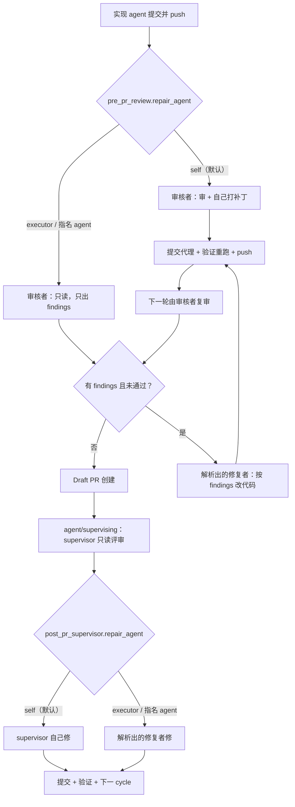

# PRD: 审核与修复分工可配置（repair_agent 阶段路由）

- GitHub Issue: https://github.com/ZataZhang/keda/issues/144

> ✅ **交付前置**：无，可立即开工。
> 结构化声明见 §8 Delivery Dependencies，**那里是唯一事实源**。

> ✅ **验收状态**：已交付（2026-09-18）。rv-1..rv-5 全部通过、三个负控制全部按预期变红；
> 证据包见 `tasks/evidence/P1-FEAT-20260917-102125-stage-repair-agent-routing/`。
> 本行是 §9 Acceptance Checklist 的投影，**那里是唯一事实源**。

本文档分两个高度：**Part A（§1–§4）** 给人看，用来确认"要不要做、做成什么样"，不含实现机制与命令；**Part B（§5–§13）** 给执行者看，包含机制、改动树与验证命令。

## Feature Overview (功能一览)

> 本块是第 10 节 Functional Requirements 的通俗投影，不是第二事实来源；行为验收以第 1 节的行为样例表为准。

- **一个开关决定"谁来修"**（FR-1、FR-2）：Draft PR 前的 AI review 和 PR 后的 supervisor，两段各有一个同名的 `repair_agent`，可选"审核者自己修"（默认，与今天一致）、"交回实现者修"、或指名任意已注册 agent。
- **裁判可以不下场**（FR-3）：设成交回实现者后，审核者只出问题清单、不改代码；改代码由实现者做，改完再由审核者复审，轮数与今天相同。
- **PR 后的修复同样可以交回实现者**（FR-4）：supervisor 判定需要改代码时，动手的进程可以是实现者而不是 supervisor 自己。
- **修复者拿得到具体问题**（FR-5）：修复提示词里带上本轮 findings 清单，而不是只说一句"supervisor 要求改代码"——两段共用一份提示词构建。
- **三个会让配置静默失效的缺陷一并修掉**（FR-6、FR-7、FR-8）：关掉"允许自审"时不再硬编码回落到 codex；`iar review` 入口不再无视你配置的 supervisor；自定义注册的 agent 在审核 / 修复 / 收尾等二级调用里不再被忽略。
- **Issue 评论写清楚谁审的、谁修的**（FR-9）：操作者在 GitHub 上一眼能看出这一轮是谁出的问题、谁动的手。
- **不写新字段的仓库行为不变**（FR-10、FR-11）：默认值保持现状，状态机、标签、轮数语义都不动；配置注释与文档同步更新。

---

# Part A · 人审层 (Review Layer)

## 1. Introduction & Goals

### Problem Statement

keda 的四段流水线（出 PRD → 实现 → Draft PR 前 review → PR 后 supervisor）本来就允许每段用不同 agent，但**"谁审"能配，"谁修"不能配**：

- Draft PR 前的 AI review 是"审-修收敛"模式：审核者报出 findings 后，自己写 `commit-request.json` 打补丁，runner 只做提交代理。审核者既当裁判又当选手。
- PR 后 supervisor 判定需要改代码时，动手的是 supervisor 本人。

对"高能力模型审、低成本模型干活"的用法，这意味着最贵的模型在做最廉价的活；更糟的是它会顺手重写实现者的代码，导致一次 review 产生的 diff 远大于预期。

同一条轴上还有三处会让配置静默失效的现成缺陷（均可在仓库中直接观察到）：

1. 关掉"允许审核者与实现者是同一个"时，回落目标是写死的 `codex`——如果实现者本来就是 codex，关掉开关后仍然是 codex 自审，且没有任何提示。
2. `iar review` 入口解析 supervisor 时按 Issue 标签走，完全不读你配置的 supervisor；同一个 Issue 在 `iar run` 里由配置的 agent 监督，在 `iar review` 里却换成另一个。
3. 运行时真正生效的 agent 注册表，在审核 / 修复 / 收尾 / 校验等**所有二级调用点**都退回了内置的四个（codex / claude / kimi / pi）——自己在配置里注册的 agent 只在"实现"这一步有效，用作审核者会直接报未注册。

### Interpretation (解读回显)

下表每一行都会**原样**变成第 7.6 节的验收 oracle，所以改表里的一格就等于改验收标准——值得逐行读。

| 输入 / 操作 | 期望观察到的结果 |
|---|---|
| 仓库配置不写任何新字段，跑完一个 Issue 的完整流程 | 路由与状态机与今天一致：审核者自己打补丁、supervisor 自己修，标签流转、轮数、评论结构都不变（唯一差别：修复提示词里多了一段本轮 findings 清单） |
| 把 Draft PR 前的 review 设成"交回实现者修"，审核者是 claude、实现者是 codex，审核者报出 2 条问题 | claude 只输出问题清单、不产生任何提交；codex 被唤起按清单修改并触发提交；下一轮仍由 claude 复审 |
| 同上，但审核者违规写了提交请求文件 | 该提交请求被丢弃、不触发提交，评论中明确写出"已忽略审核者补丁"；修复仍然由 codex 完成 |
| 把 PR 后 supervisor 设成"交回实现者修"，supervisor 判定需要改代码 | 实际动手的子进程是实现者的命令行工具，不是 supervisor 的 |
| 把任一段的"谁来修"填成一个没注册过的名字 | 该阶段开始前就报错停下并指名未注册的 agent，不静默回落到别人 |
| 配置了 supervisor 为 claude，Issue 标签是 codex，跑 `iar review` | supervisor 子进程是 claude；命令行显式指定 agent 时命令行优先 |
| 关掉"允许自审"，实现者是 codex，且未指定审核者 | 审核者是注册表里第一个不等于 codex 的 agent（默认即 claude），不再回落成 codex 自审 |

#### 我默默定了这些

- 字段名叫 `repair_agent`，两段同名同语义，取值 `self`（默认，审核者/supervisor 自己修）/ `executor`（交回实现者）/ 任意已注册 agent 名。**不叫 `fix_agent`**：keda 已有一个含义完全不同的 `fix_agent_enabled`（本地验证失败时的轻量修复 agent），同名会误导操作者。
- `executor` 指"本次真正跑实现的那个 agent"；在拿不到本次实现者的入口（如独立跑 `iar review`）回落到按 Issue 标签路由的结果，并且这层回落会写进日志。
- 拆开审与修之后，审核者按仓库既有的"只读用途"形态启动（对支持沙箱的 agent 是真只读）；该 agent 没声明只读形态时回落到普通形态并告警，不因此中断。
- 审核者如果仍然改了文件，改动不回滚、会并入实现者本轮的提交，并在评论里点名；被丢弃的只是它的提交请求。
- 收敛与失败语义沿用现状：最后一轮仍未通过但本轮已产生可提交的修复 → 接受并继续发布；否则软失败进入失败标签。
- 修复提示词在两种模式下都会带上本轮 findings 清单（今天是一句泛泛的"supervisor 要求改代码"），这是默认模式下唯一的行为差异。
- 不新增标签、不新增 Issue 状态、不改状态机。
- `iar review` 的 supervisor 解析改成"命令行 > 配置 > Issue 标签"，与另一条入口统一。
- 修掉二级调用点丢配置的问题时，一并补一个守卫测试，防止以后新增调用点再漏。

#### 我理解为不做

- 不做按 Issue 打标签选择"谁来修"（本次只做仓库级配置）。
- 不做审核者与实现者之间的多轮对话 / 协商机制；仍然是"一轮问题清单 → 一轮修复 → 复审"。
- 不内置"模型档位"概念（claude-opus / claude-sonnet 这类拆分继续靠现有的 agent 注册表自助完成，本 PRD 只保证注册出来的 agent 在各阶段真的能用）。

#### 落地读法

本 PRD 读作"**给既有的两段审核各加一个'谁来修'的路由开关，并让已有的路由配置真的生效**"，不读作"重构审核流程"或"引入角色/插件系统"。边界：不改状态机与标签集合；不改审核轮数与收敛判定；不改 findings 的结构与解析；默认配置下路由行为与今天一致。非目标见 §11。

### What The User Gets

仓库操作者可以在仓库配置里分别决定两段审核"谁来修"：让审核者继续自己动手（默认、与今天一致），或者让审核者只给结论、把改代码交回实现者，也可以直接指名某个 agent。配合已有的"谁来审"配置，就能表达"贵模型只做判断、便宜模型只做执行"。

同时，几处"配置写了但不生效"的坑被堵上：关掉自审会真的换人、`iar review` 会真的用你配的 supervisor、自己注册的 agent 在审核和修复阶段真的能被拉起来。GitHub Issue 评论里会写清楚这一轮是谁审的、谁修的。

### Measurable Objectives

- 在两段审核各自的配置里写 `repair_agent = "executor"` 后，实际拉起的修复子进程是实现者的可执行文件，可在进程日志与 Issue 评论中同时观察到。
- 不写新字段的仓库，跑完整流程后的标签流转、轮数、提交数与本次改动前一致。
- 关掉"允许自审"且实现者为 codex 时，审核者不再是 codex。
- 配置中显式指定的 supervisor 在 `iar review` 入口生效。
- 仓库内不存在任何一个 `run_agent_with_prompt*` 调用点漏传配置（由守卫测试断言）。

## 2. Human Review Map (介入与风险地图)

### 决策一：新开关的默认值，以及"实现者"到底指谁

建议新增的"谁来修"开关默认取"审核者自己修"，也就是所有现存仓库升级后行为不变；想换分工的仓库显式写一行配置。这一条必须人确认，因为它是本次唯一的兼容性承诺：keda 已经在若干个下游仓库的 daemon 里长期运行，默认值一旦选错，等于在没人要求的情况下改变了所有仓库的审核行为。

"交回实现者"里的**实现者**定义为"本次真正跑实现的那个 agent"。在能拿到本次实现者的调用路径上直接用它；在拿不到的路径上（例如单独跑一次 PR 复查，此时实现早已结束）回落成"按 Issue 标签路由出来的 agent"。这个回落有一个已知的漂移：如果有人事后改了 Issue 上的 agent 标签，回落结果会跟着变。建议接受该漂移并在日志里写明用的是哪一种来源，而不是为此引入一份新的持久化状态。

**请确认：** 默认保持"审核者自己修"（既有仓库零变化），并接受"实现者"在无法得知时按 Issue 标签回落、且该回落会被记录？

**验收：** 不写任何新配置跑完一个 Issue，标签流转、审核轮数与提交数与改动前一致；把开关设成"交回实现者"后，实际动手的进程换成了实现者。

### 决策二：拆开审与修之后，审核者不再下场

设成"交回实现者"后，审核者按仓库既有的"只读用途"形态启动——对提供沙箱的 agent 这是硬性只读，对不提供的只是提示词约束。为了让"裁判不下场"可验证而不是靠自觉，建议再加一条硬规则：**审核者写出的提交请求一律丢弃、不触发提交**，并在 Issue 评论里点名这件事发生过。它已经改掉的文件不回滚（回滚是破坏性的），而是并入实现者本轮的提交，同样在评论里点名。

收敛与失败语义建议原样沿用：最后一轮仍未通过、但本轮已经产生了可提交的修复，就接受并继续发布；否则软失败、Issue 进入失败标签等人。这一条需要确认，是因为它决定了"低成本模型修不动时会发生什么"——沿用现状意味着流程不会卡死，但也意味着有可能带着未解决的 findings 发布 Draft PR（与今天完全一样，人仍在 PR 上把关）。

**请确认：** 审核者在该模式下只给结论，其提交请求被丢弃并在评论中点名；失败语义沿用现状（最后一轮有可提交修复即接受发布，否则软失败）？

**验收：** 在该模式下故意让审核者写出提交请求，最终提交记录里没有它、评论里写明被忽略，且修复确实由实现者完成。

### 决策三：三处既有配置的行为修正

以下三处是"配置写了不生效"，修掉会改变已经这样配置的仓库的行为，所以单独列出来确认：

1. 关掉"允许审核者与实现者是同一个"时，现在硬编码回落到 codex；改成从 agent 注册表里取第一个不等于实现者的 agent（注册表只有一个 agent 时保持原样并告警）。对实现者本来就是 codex 的仓库，这会第一次真正换人。
2. `iar review` 入口现在无视配置里指定的 supervisor，改为"命令行 > 配置 > Issue 标签"。对没显式配置 supervisor 的仓库无变化。
3. 审核 / 修复 / 收尾 / 校验等二级调用点现在都丢掉了运行时的 agent 注册表，导致自定义注册的 agent 和对内置 agent 的参数覆盖在这些阶段被静默忽略。修掉之后，这些阶段第一次会按仓库真实配置来拉起进程——**如果某个仓库此前无意中依赖了"覆盖不生效"，行为会变**。

**请确认：** 这三处按上述方式修正，并接受"已显式配置过的仓库行为会变"？

**验收：** 关掉自审且实现者为 codex 时审核者不再是 codex；配置的 supervisor 在 `iar review` 生效；用一个只在配置里注册、不在内置表里的 agent 作审核者时能被正常拉起。

### 自动门禁，不需要逐项人工审阅

配置字段穿三层（配置文件 → 设置对象 → 运行时对象）的映射完整性、新增字段在仓库级配置说明表里的登记、Issue 评论文案新增"修复者"一行、文档与配置注释同步、以及"不存在漏传配置的调用点"——这些都由既有的一致性测试、新增守卫测试和 `just lint` 覆盖，不需要人逐项审阅。

### 本次明确不涉及

无数据库结构变化；无前端改动（管理终端不展示也不编辑这两段配置）；不新增标签、不改状态机、不改 findings 结构。

## 3. Usage And Impact After Implementation

**仓库操作者（配置 `.iar.toml` 的人）**：入口是仓库根目录的本地配置文件。在既有的两段审核配置里各多一个"谁来修"的键，说明文字由 `iar init` 一并写入；不改就是今天的行为。改完需要重启常驻 daemon 才生效（单次命令调用每次都重读，不受影响）。

**daemon 操作者**：入口不变，仍是 `iar daemon` / `iar run` / `iar review`。可观察到的变化是：设成"交回实现者"后，同一个 Issue 在审核阶段会先后拉起两个不同的 agent 进程；进程日志里会写明本轮审核者与修复者分别是谁，以及"实现者"是直接得知的还是按标签回落的。

**Issue 上的人工 reviewer**：入口不变，仍是 GitHub Issue 与 Draft PR。审核结果评论里多一行写明本轮谁审、谁修；审核者违规打补丁被忽略时，评论里也会写明。除此之外评论结构、标签流转、PR 创建时机都不变。

**下游仓库（freshai / fsense 等由 runner 开发的仓库）**：不需要改任何东西；不写新字段即保持现状。已经显式配置过 supervisor、或显式关掉过"允许自审"、或在配置里注册过自定义 agent 的仓库，会开始按配置真实生效——这是决策三确认的预期变化。

**向后兼容**：新键都是可选、默认值等于现状；旧配置文件不需要迁移；没有数据库或磁盘状态格式变化。

## 4. Requirement Shape

- **actor**：仓库操作者、daemon 操作者、Issue 上的人工 reviewer、下游被 runner 开发的仓库。
- **trigger**：runner 执行到 Draft PR 前的 AI review 阶段，或 Draft PR 后的 supervisor 判定需要改代码。
- **expected behavior**：按该阶段配置的"谁来修"解析出修复 agent（审核者自己 / 实现者 / 指名 agent），用它执行修复并走既有的提交代理与验证重跑；审核者在非自修模式下不得提交。
- **scope boundary**：只改两段审核内部的 agent 路由、修复提示词内容与相关配置/文档；不改状态机、标签集合、审核轮数语义、findings 结构，不动前端与数据库。

---

# Part B · 执行器层 (Build Layer)

## 5. Repository Context And Architecture Fit

**当前相关模块**

| 位置 | 职责 |
|---|---|
| `src/backend/core/use_cases/agent_review.py` | Draft PR 前的 review 收敛循环：构建 review packet、跑审核者、解析 findings、走提交代理、发评论 |
| `src/backend/core/use_cases/pr_supervisor_repair.py` | `execute_repair`：在 PR 分支上跑修复 agent 并提交 |
| `src/backend/core/use_cases/agent_runner_supervisor.py` | supervisor 修复循环，`execute_repair` 调用点之一 |
| `src/backend/core/use_cases/agent_runner_issue_handlers.py` | rework 路径上的第二个 `execute_repair` 调用点 |
| `src/backend/core/use_cases/agent_runner_publication.py` | 发布路径上解析 `supervisor_agent`（`auto` → 实现者） |
| `src/backend/core/use_cases/review_once.py` | `iar review` 入口，目前用 `choose_agent` 解析 supervisor |
| `src/backend/core/use_cases/run_agent_once.py` | `choose_agent` / `run_agent_with_prompt(_resilient)` / `run_fix_agent` 等共享入口 |
| `src/backend/core/shared/models/agent_runner.py` | 运行时配置对象 `PrePrReviewConfig` / `PostPrSupervisorConfig` |
| `src/backend/infrastructure/config/agent_runner_settings.py` | pydantic 设置类 `AgentRunnerPrePrReviewSettings` / `AgentRunnerPostPrSupervisorSettings` |
| `src/backend/engines/agent_runner/factory_config_builder.py` | 设置 → 运行时对象的逐字段映射 |
| `src/backend/engines/agent_runner/repository_local.py` | `.iar.toml` 的段说明与逐键说明表（`iar init` 写入注释的唯一来源） |

**既有架构模式**：四层依赖 `api/ → core/ → engines/ → infrastructure/`。本次全部改动落在 `core/use_cases`、`core/shared/models`、`engines/agent_runner`、`infrastructure/config`，不新增跨层依赖，不新增模块。

**复用点**：`choose_agent`（标签路由）、`commit_requested_changes`（提交代理 + 验证重跑）、`unstage_changes`、`format_verification_failure`、`build_fix_prompt`（本地修复提示词的现成形状）、`AGENT_PROFILE_DELIBERATE`（仓库既有的只读用途声明）、`build_agent_invocation`（声明式调用组装）。

**依赖与所有权边界**：agent 注册表的唯一事实源是 `config.agents`（内置默认 + 配置覆盖）；解析函数属于 `core/use_cases`，配置结构属于 `core/shared/models`，映射属于 `engines`。

**前端影响**：`No frontend impact` —— 管理终端（`frontend-public`）与 `frontend-admin` 中不存在对 `pre_pr_review` / `post_pr_supervisor` / `review_agent` / `supervisor_agent` 的任何引用，这两段配置既不展示也不编辑；本次的人可见产物是 GitHub Issue 评论（由 GitHub 渲染）与 CLI 日志。

**现有 PRD 关系**：`tasks/pending/` 下 5 份 PRD（PRD 引用核验、Tauri 桌面壳、Roadmap 控制与证据、Roadmap CI/CD 监控、console 快照同步）均不涉及审核/修复的 agent 路由，**无重复、无阻塞、可独立执行**。`tasks/archive/P1-FEAT-20260705-161739-completeness-judgment-hardening.md` 是最相关的已归档 PRD：它加固了 supervisor 的分层 diff 与跨 cycle finding 累积（`key_paths` / `previous_findings_injection_enabled` / `findings_artifact_dir`），本 PRD 复用它落盘的 findings 作为修复提示词的输入，不改它的结构与开关语义。

## 6. Recommendation

### Recommended Approach

在两段审核配置里各加一个同名字段 `repair_agent`，由 `core/use_cases/run_agent_once.py` 中一个**共享解析器**统一解释三种取值，两段与两个 `execute_repair` 调用点都改为使用解析结果。Draft PR 前的 review 在"非自修"模式下把循环拆成"只读审核 → 修复者打补丁 → 复审"，复用现有的提交代理与推送回调，不新增状态。

**为什么适合当前架构**：`choose_agent` 已经是"按 Issue 解析 agent"的既有位置，新解析器与它同文件同风格；两段配置已经是各自独立的 dataclass + pydantic 设置 + 工厂映射三件套，加字段是这套结构的正常扩展；"只读用途"在 agent 注册表里已经是一等公民（`profiles.deliberate` 带 `read_only`），审核者切换到它是复用而不是发明。

**为什么拒绝更重的方案**：不引入"角色 → agent"的通用映射表或插件式角色系统——当前只有两个阶段、三种取值，通用化会把一个两字段的配置变成需要文档解释的子系统，且没有第三个变化轴的证据。也不引入"实现者身份"的持久化存储（新文件或新 marker）——用现成的标签路由回落即可，代价是一个已记录的漂移，而收益不足以换一份新的磁盘状态。

### Proposed Solution Summary (实现机制)

- **核心机制**：`resolve_repair_agent(setting, *, issue, config, reviewing_agent, executor_agent=None)` 解析 `self` / `executor` / 具体名；具体名走注册表校验，未注册直接抛既有的 `UnknownAgentError`（fail-fast，不回落）。
- **声明来源**：全部来自显式配置，系统不推断。`executor_agent` 由调用方在知道时显式传入（发布路径知道本次实现者），不知道时解析器内部回落 `choose_agent(issue, config, "auto")` 并写日志说明来源。
- **接入点**：`run_pre_pr_review`（`agent_review.py`）、`_run_supervisor_with_repair_loop`（`agent_runner_supervisor.py`）、`_process_running_rework`（`agent_runner_issue_handlers.py`）、`execute_repair`（`pr_supervisor_repair.py`）新增 `repair_agent` 形参。
- **状态/输出变化**：修复子进程的可执行文件可能不同于审核者；Issue 评论增加"修复者"一行；修复提示词新增 findings 清单段。无新增标签、无新增持久化。
- **刻意避免的复杂度**：不新增模块、不新增状态机分支、不新增磁盘状态、不引入角色注册表。

### Alternatives Considered

- **两段用不同字段名（`fix_agent` / `repair_agent`）**：被否。用户要求两段共用一套语义，同名同义更利于心智；且 `fix_agent` 与既有 `runner.fix_agent_enabled` 撞概念。
- **审核者始终只读、取消"自己修"模式**：被否。这会单方面改变所有现存仓库的行为，且"审核者顺手修"在小问题上确实更快；保留为默认更安全。
- **在审核者的同一个会话里让它"先判断后修"并用工具白名单区分**：被否。keda 的 agent 调用是一次性子进程，没有会话内权限切换机制，实现代价远高于再起一个进程。

## 7. Implementation Guide

> 本节是基于当前仓库分析的活文档。如果实现过程中发现额外受影响文件、隐藏依赖、边界情况或更好的路径，请先更新本 PRD 再继续。

### 7.1 Core Logic

**Draft PR 前的 review（自修模式，默认，与今天一致）**

审核者带 review packet 启动 → 解析 findings → 若写了提交请求则走提交代理 + 验证重跑 + 推送 → 评论 → 下一轮。

**Draft PR 前的 review（交回实现者 / 指名 agent）**

1. review packet 增加一句"只出结论、不要改代码、不要写提交请求"，审核者按 `deliberate` 用途启动（该 agent 未声明 `deliberate` 时回落 `run` 并 WARN）。
2. 审核者返回后：解析 findings；若存在提交请求文件，**删除该文件**并置位一个"审核者越权"标记（不回滚它改过的文件）。
3. verdict 为 `changes_requested` 且有 findings → 用共享构建器生成修复提示词（Issue 上下文 + 本轮 findings 清单 + 既有的提交请求约束），以解析出的修复 agent 启动（`run` 用途）。
4. 修复者写提交请求 → 复用今天的 `commit_requested_changes` + `push_callback` + 失败时 `unstage_changes` 并把门禁失败回喂下一轮。
5. 修复者报出 findings 却没写提交请求时，沿用今天的"同轮内提醒重试"次数上限，只是提醒对象从审核者变成修复者。
6. 进入下一轮由审核者复审。收敛/失败判定不变。

**Draft PR 后的 supervisor**

supervisor 仍然只读评审；`repair_pr_branch` / rebase 后的修复分支把 `execute_repair` 的执行者换成解析结果，修复提示词带上本轮 findings（来自 supervisor 本轮结果，必要时叠加既有的跨 cycle findings artifact）。

### 7.2 Change Impact Tree

```text
.
├── src/backend/infrastructure/config/agent_runner_settings.py
│       [修改]
│       【总结】两段设置类各加一个可选的修复者字段，默认保持现状语义
│
│       ├── AgentRunnerPrePrReviewSettings 新增 repair_agent: str = "self"
│       └── AgentRunnerPostPrSupervisorSettings 新增 repair_agent: str = "self"
│
├── src/backend/core/shared/models/agent_runner.py
│       [修改]
│       【总结】运行时配置对象同步新增字段，保持 settings 与 domain 两侧字段一致
│
│       ├── PrePrReviewConfig 新增 repair_agent: str = "self"
│       └── PostPrSupervisorConfig 新增 repair_agent: str = "self"
│
├── src/backend/engines/agent_runner/factory_config_builder.py
│       [修改]
│       【总结】把两个新字段接进逐字段映射，避免运行时读到的是默认值而非配置值
│
│       ├── PrePrReviewConfig(...) 映射新增 repair_agent=pre_pr.repair_agent
│       └── PostPrSupervisorConfig(...) 映射新增 repair_agent=post_supervisor.repair_agent
│
├── src/backend/engines/agent_runner/repository_local.py
│       [修改]
│       【总结】把两个新键登记进 .iar.toml 的逐键说明表，使 iar init 写出带注释的配置
│
│       └── _KEY_DESCRIPTIONS 增加 pre_pr_review.repair_agent / post_pr_supervisor.repair_agent
│
├── src/backend/core/use_cases/run_agent_once.py
│       [修改]
│       【总结】新增阶段修复者解析器，与既有标签路由同文件；并按只读用途暴露一个 profile 形参
│
│       ├── 新增 resolve_repair_agent(setting, *, issue, config, reviewing_agent, executor_agent=None)
│       ├── 新增 resolve_reviewer_agent(...)：allow_same_agent=False 时从注册表派生"不同于实现者"的审核者
│       ├── run_agent_with_prompt / _resilient 增加 profile 关键字参数（默认 AGENT_PROFILE_RUN，行为不变）
│       └── __all__ 同步导出
│
├── src/backend/core/use_cases/agent_review.py
│       [修改]
│       【总结】把"审-修"一体的收敛循环拆成可配置的"审"与"修"，并修掉审核者解析的硬编码回落
│
│       ├── 审核者解析改用 resolve_reviewer_agent，删除字面量 "codex" 回落
│       ├── 解析 repair_agent；非 self 时：review packet 追加只读约束、审核者按 deliberate 用途启动
│       ├── 非 self 时丢弃审核者写出的提交请求并置位越权标记
│       ├── 非 self 时以修复者跑共享修复提示词，复用 commit_requested_changes / push_callback
│       ├── 同轮提醒重试的对象在非 self 模式下改为修复者
│       ├── 所有 agent 调用补 config=config（否则自定义注册 agent 不可用）
│       └── build_pre_pr_review_result_comment 增加 repairer / reviewer_patch_ignored 展示
│
├── src/backend/core/use_cases/pr_supervisor_repair.py
│       [修改]
│       【总结】修复执行者与 supervisor 解耦，并让修复提示词带上具体 findings
│
│       ├── execute_repair 形参 supervisor_agent → repair_agent（调用方按关键字传入）
│       ├── 修复提示词改用共享构建器（Issue 上下文 + findings 清单 + 既有约束）
│       └── 补 config=config
│
├── src/backend/core/use_cases/agent_runner_supervisor.py
│       [修改]
│       【总结】把解析出的修复者贯穿修复循环，并把本轮 findings 传给修复提示词
│
├── src/backend/core/use_cases/agent_runner_issue_handlers.py
│       [修改]
│       【总结】rework 路径上的第二个修复调用点改用同一个解析器，避免两条路径语义分叉
│
├── src/backend/core/use_cases/agent_runner_publication.py
│       [修改]
│       【总结】supervisor 与修复者解析改用共享函数，把本次实现者显式传下去
│
├── src/backend/core/use_cases/review_once.py
│       [修改]
│       【总结】iar review 入口不再无视配置的 supervisor，改为命令行 > 配置 > 标签
│
├── src/backend/core/use_cases/pr_supervisor.py
│       [修改]
│       【总结】supervisor 循环与冲突解决的 agent 调用补配置，注册表覆盖在这些阶段真实生效
│
├── src/backend/core/use_cases/agent_runner_closeout.py
│       [修改]
│       【总结】收尾 agent 调用补配置（同一类漏传）
│
├── src/backend/core/use_cases/run_verifier_agent.py
│       [修改]
│       【总结】校验 agent 调用补配置（同一类漏传）
│
├── src/backend/core/use_cases/agent_runner_verification_recovery.py
│       [修改]
│       【总结】恢复 agent 调用补配置（同一类漏传）
│
├── src/backend/core/use_cases/run_agent_execution_loop.py
│       [修改]
│       【总结】prompt_override 与 recovery 两处调用补配置（同一类漏传）
│
├── src/backend/core/use_cases/agent_runner_worktree_branch.py
│       [修改]
│       【总结】冲突解决 agent 调用补配置（同一类漏传）
│
├── src/backend/core/use_cases/agent_review_comment.py
│       [新增]
│       【总结】pre-PR review 结果评论的渲染从 agent_review.py 拆出（纯展示逻辑，
│       含本轮审核者/修复者署名与审核者越权点名行）
│
├── src/backend/core/use_cases/agent_review_repair.py
│       [新增]
│       【总结】审-修分工的构件从 agent_review.py 拆出（该文件加完新逻辑会越过
│       1000 非空行阈值）：只读审核者的用途解析 + 同轮提交请求提醒 + 修复者启动循环
│
│       ├── COMMIT_REQUEST_RELATIVE_PATH（与 review 主体共用一份常量）
│       ├── resolve_reviewer_profile(agent, config)：deliberate 优先，未声明则回落 run + WARN
│       ├── build_commit_request_reminder_prompt(..., for_repairer=False)
│       └── run_review_repair_agent(...)：修复者 + 同轮提醒重试
│
├── config.toml
│       [修改]
│       【总结】两段配置各写出新键与取值说明，作为可发现的出厂配置
│
├── tests/test_agent_config_consistency.py
│       [修改]
│       【总结】新增两个字段的三层映射守卫，并新增"调用点不得漏传配置"的 AST 守卫
│
├── tests/test_agent_review.py
│       [修改]
│       【总结】覆盖只读审核者、提交请求丢弃、修复者接手、审核者解析不再回落 codex
│
├── tests/test_pr_supervisor.py
│       [修改]
│       【总结】覆盖修复执行者按配置解析、修复提示词含 findings
│
├── tests/test_review_once.py
│       [修改]
│       【总结】覆盖 iar review 的 supervisor 解析优先级
│
└── docs/guides/agent-runner.md
        [修改]
        【总结】两段配置参考、状态机小节与两阶段审查说明同步新开关与三处行为修正
```

文件清单是起点而非穷举，隐藏引用见 §7.4 Executor Drift Guard。

### 7.3 Risk Classification Register

| change point | tier | 决定性维度 / override | intervention | oracle / gate |
|---|---|---|---|---|
| CP1 两段 `repair_agent` 字段 + 三层映射 + 解析器 | R2 | 兼容性（默认必须零变化）+ core 编排固定区 | 人工确认（决策一） | rv-1 / rv-4 + `test_agent_config_consistency.py` 非默认值映射断言 |
| CP2 pre-PR review 拆分为只读审核 + 独立修复 | R2 | core 编排固定区；改变收敛/失败路径的参与者 | 人工确认（决策二） | rv-1（含负控制） |
| CP3 post-PR 修复执行者路由（2 个调用点） | R2 | core 编排固定区；跨两条路径语义必须一致 | 人工确认并入决策一 | rv-2（含负控制） |
| CP4 `allow_same_agent=False` 回落从注册表派生 | R1 | 影响面局限于该开关的使用者，可回滚 | 人工确认（决策三） | rv-3 |
| CP5 `iar review` 遵循配置的 supervisor | R2 | 跨入口一致性；既有配置此前静默失效 | 人工确认（决策三） | rv-3 |
| CP6 二级调用点补传配置（10 处） | R2 | 使配置中的注册表覆盖首次真实生效，影响多阶段 | 人工确认并入决策三 | rv-3 + AST 守卫测试 |
| CP7 修复提示词携带 findings（共享构建器） | R1 | 提示词内容变化，可回滚，无状态影响 | 执行器 + 断言 | rv-2 中断言提示词含 finding 标题 |
| CP8 Issue 评论新增审核者/修复者与越权提示 | R0 | 展示层 | 执行器 + 单测 | rv-1 的呈递物 |
| CP9 config.toml / `.iar.toml` 键表 / 文档同步 | R0 | 文档与配置注释 | 执行器 + `just lint` | §9 文档验收项 |

### 7.4 Executor Drift Guard

配置新增字段在本仓库有**四个**必须同步的位置，漏掉任何一个都会被相同默认值掩盖：

```bash
rg -n "commit_request_reminder_attempts" src/backend config.toml
rg -n "max_repair_attempts" src/backend config.toml
```

这两条搜索会同时命中 pydantic 设置类、运行时 dataclass、工厂逐字段映射、`.iar.toml` 键说明表与 `config.toml` 出厂值——新字段必须出现在同样的位置集合里。

确认没有遗漏的 agent 调用点：

```bash
rg -n "run_agent_with_prompt(_resilient)?\(" src/backend
```

确认没有残留的硬编码回落与旧形参名：

```bash
rg -n '"codex"' src/backend/core/use_cases
rg -n "supervisor_agent=" src/backend/core/use_cases
```

注意：`repository_local.py` 的键说明表是 `iar init` 写注释的唯一来源；`config.toml` 的搜索路径是 `IAR_CONFIG` → 当前目录逐级向上 → `~/.iar/config.toml` → 源码根，本地验证时务必确认读到的是哪一份。改完 `.iar.toml` 需要重启常驻 daemon 才生效。

### 7.5 Flow Diagram



### 7.6 Realistic Validation Plan (Oracle 块)

所有 oracle 共用一套无凭据的本地 harness：临时 git 仓库 + PATH 上的假 `gh`（按 `src/backend/infrastructure/github_*.py` 实际调用的子命令实现，把每次调用与参数追加到日志文件）+ 两个假 agent 可执行文件（各自把自己的名字追加到同一日志，并按脚本约定写 `commit-request.json`）+ `IAR_CONFIG` 指向临时 `config.toml`。harness 与所有 RV 脚本落在 `tasks/evidence/<prd-stem>/scripts/`，**不得进入代码 diff**。

```yaml
- id: rv-1
  behavior: Draft PR 前的 review 设成"交回实现者"后，审核者只出问题清单不提交，修复由实现者完成，且审核者违规写出的提交请求被丢弃并在评论中点名
  reviewer: human
  real_entry: "bash tasks/evidence/P1-FEAT-20260917-102125-stage-repair-agent-routing/scripts/rv-1-pre-pr-split.sh"
  expected: "agent 调用日志顺序为 reviewer(只读) → repairer；git log 中只有一次修复提交且由 repairer 的 commit-request 触发；假 gh 记录的 issue comment 正文同时含审核者与修复者名字，并含'已忽略审核者补丁'一行"
  mock_boundary: "GitHub 用假 gh（真子进程、真 argv）；agent 用假可执行文件（真子进程、真 argv、真写文件）；git、worktree、提交代理、验证重跑全部真跑；被测的路由与循环逻辑不得 mock"
  tier: R2
  test_layer: e2e
  required_for_acceptance: true
  presentation: "假 gh 捕获的 Issue 评论正文（`tasks/evidence/<prd-stem>/rv-1-pre-pr-split.txt`），用 `open` 打开即可；10 秒自查：正文中的'Reviewer'与'Repairer'两行是否为两个不同名字，且存在一行说明审核者补丁被忽略"
  critical_value_source: "修复提交的作者归属取自 repairer 写出的 commit-request.json 与 agent 调用日志中该进程的 argv[0]，不从 PRD 或测试常量重建"
  must_cross: "iar CLI 入口 -> 配置解析 -> review 循环 -> 真实子进程调用 -> commit proxy -> git 提交 -> 假 gh 评论写入"
  forbidden_bypasses: "禁止直接调用 run_pre_pr_review 断言返回值代替 CLI 入口；禁止用内置注册表默认值绕过 IAR_CONFIG；禁止读函数内部变量代替进程日志"
  fresh_state_probe: "脚本结束后用一个全新的 git 进程在临时仓库执行 git log --format=%s 与 git show --stat，确认提交确实落盘且只有一次"
  final_tree_evidence: "脚本首行记录 git rev-parse HEAD 与 git status --porcelain；任何 src/ 改动后必须重跑"
  negative_control: "把配置改回 repair_agent = \"self\" 重跑同一脚本"
  expected_fail: "agent 调用日志中只出现审核者一个名字、提交由审核者的 commit-request 触发，脚本断言失败退出非 0"

- id: rv-2
  behavior: Draft PR 后 supervisor 判定需要改代码时，实际动手的是配置指定的修复者，且修复提示词里带着本轮 findings
  reviewer: verifier
  real_entry: "bash tasks/evidence/P1-FEAT-20260917-102125-stage-repair-agent-routing/scripts/rv-2-post-pr-repair.sh"
  expected: "agent 调用日志中 supervisor 与 repairer 是两个不同可执行文件；repairer 进程收到的提示词文本含本轮 finding 的标题原文；exit 0"
  mock_boundary: "同 rv-1；supervisor 决策结果由假 agent 的固定输出提供，路由与提示词构建真跑"
  tier: R2
  test_layer: e2e
  required_for_acceptance: true
  critical_value_source: "finding 标题取自假 supervisor 实际输出的 JSON，再在 repairer 收到的提示词中原样查找，不使用脚本里另写的常量"
  must_cross: "iar CLI 入口 -> 配置解析 -> supervisor 循环 -> execute_repair -> 真实子进程 -> commit proxy"
  forbidden_bypasses: "禁止直接调用 execute_repair；禁止把 supervisor 与 repairer 配成同一个假可执行文件后靠参数区分"
  fresh_state_probe: "新进程读取 repairer 落盘的提示词副本文件并重新比对 finding 标题"
  final_tree_evidence: "脚本记录 git rev-parse HEAD；src/ 变更后重跑"
  negative_control: "把 post_pr_supervisor.repair_agent 改回 \"self\" 重跑"
  expected_fail: "日志中 supervisor 与修复者是同一个可执行文件，脚本断言失败退出非 0"

- id: rv-3
  behavior: 三处既有配置不再静默失效——关掉自审会真的换人、iar review 遵循配置的 supervisor、只在配置里注册的 agent 能在审核阶段被拉起
  reviewer: verifier
  real_entry: "bash tasks/evidence/P1-FEAT-20260917-102125-stage-repair-agent-routing/scripts/rv-3-routing-fixes.sh"
  expected: "三段断言全过：(a) allow_same_agent=false 且实现者为 codex 时审核者不是 codex；(b) 配置 supervisor_agent 后 iar review 拉起的是它、加 --agent 覆盖时是覆盖值；(c) 仅在临时 config.toml 中注册的 agent 作审核者时进程被成功拉起且未抛未注册错误"
  mock_boundary: "同 rv-1；注册表解析、CLI 参数解析、进程拉起全部真跑"
  tier: R2
  test_layer: e2e
  required_for_acceptance: true
  critical_value_source: "被拉起的可执行文件名取自 agent 调用日志中各进程自报的 argv[0]"
  must_cross: "iar CLI 入口 -> 配置文件解析（IAR_CONFIG）-> 注册表构建 -> 阶段 agent 解析 -> 真实子进程"
  forbidden_bypasses: "禁止用内置注册表代替临时 config.toml；禁止直接调用解析函数断言返回字符串代替真实拉起进程"
  fresh_state_probe: "每段断言各自用独立的临时目录与独立的 iar 进程，互不共享缓存"
  final_tree_evidence: "脚本记录 git rev-parse HEAD；src/ 变更后重跑"
  negative_control: "在打补丁前的代码树（git stash 本次改动）上跑同一脚本"
  expected_fail: "(a) 审核者是 codex；(b) iar review 用的是标签路由结果；(c) 报 Agent 未注册；三段均失败"

- id: rv-4
  behavior: 不写任何新配置的仓库，路由与状态机行为与改动前一致
  reviewer: verifier
  real_entry: "bash tasks/evidence/P1-FEAT-20260917-102125-stage-repair-agent-routing/scripts/rv-4-default-unchanged.sh"
  expected: "同一个 harness 在不写新键时的 agent 调用序列、标签编辑序列、提交数与改动前基线逐行一致（脚本内 diff 两份记录）"
  mock_boundary: "同 rv-1；基线记录由打补丁前的代码树生成并存档"
  tier: R1
  test_layer: e2e
  required_for_acceptance: true

- id: rv-5
  behavior: 既有测试套件不回归，且新增守卫测试能抓住"调用点漏传配置"
  reviewer: verifier
  real_entry: "cd /Users/zata/code/keda && uv run pytest -o addopts=\"\" tests/"
  expected: "exit 0；用例数不低于改动前基线 + 新增用例数"
  mock_boundary: "无，全真跑"
  tier: R1
  test_layer: integration
  required_for_acceptance: true
```

Failure triage：

- `real_entry` 跑挂先查三件事：`IAR_CONFIG` 是否指向临时 `config.toml`（否则会逐级向上读到 keda 仓库根的那份）、PATH 上的假 `gh` 与假 agent 是否可执行（`chmod 0755`）、临时仓库是否已 `iar init`。
- 假 `gh` 缺子命令时报错形态是 iar 侧的 GitHub 调用异常；以 `src/backend/infrastructure/github_client.py` / `github_issue_ops.py` / `github_pr_ops.py` / `github_labels.py` 里实际出现的 argv 为准补齐，不要猜。
- keda 会复跑 RV 命令，所有脚本必须**幂等、自足、前台执行**：不要用 `cd … && nohup … &` 起后台进程（子 shell 会握住调用方的 stdout 管道导致复跑超时），临时目录每次重建。
- RV 命令经 `shlex.split` 后直接执行、不做 shell 展开，因此 `real_entry` 一律写成 `bash <脚本路径>`，不要内联 `&&` / 管道 / 命令替换。
- 本机全量跑 pytest 前先确认没有 iar daemon 在并发写 `~/.iar`；默认 `addopts=--testmon` 是增量选择，验收必须用 `-o addopts=""`。

### 7.7 ER Diagram

`No data model changes in this PRD.`

### 7.8 Interactive Prototype

`No interactive prototype file changes in this PRD.`

### 7.9 External Validation

`No external validation required; repository evidence was sufficient.`

## 8. Delivery Dependencies

- Group: none
- Depends on tasks/issues:
  - none
- Gate type: none
- Notes: 与 `tasks/pending/` 中现有 5 份 PRD 无重叠：它们分别覆盖 PRD 引用核验、桌面壳、Roadmap 控制与 CI/CD 监控、console 快照同步，均不触及审核/修复的 agent 路由。可独立开工。

## 9. Acceptance Checklist

### 9.1 人读呈递区（Human Review Surface）

| 要看的结果（大白话） | 呈递物 | 10 秒自查 |
|---|---|---|
| 审核者只出问题清单、实际改代码的是实现者，且评论写清楚了两个角色 | `/Users/zata/code/keda-worktrees/stage-repair-agent-routing/tasks/evidence/P1-FEAT-20260917-102125-stage-repair-agent-routing/rv-1-pre-pr-split.txt`（假 gh 捕获的 Issue 评论正文）；`open "<该绝对路径>"` | 正文里 `Reviewer` 与 `Repairer` 两行是否是两个不同名字（`rv-reviewer` / `rv-repairer`）；是否有一行说明审核者补丁被忽略（`... it was discarded (no commit was made from it).`） |

`reviewer: verifier` 的三组证据（rv-2 PR 后修复路由、rv-3 三处路由修正、rv-4/rv-5 默认不变与套件回归）**刻意不在此展示**：它们的产物是进程日志与退出码，人工肉眼看不出额外信息，由执行器自证、独立 verifier 复核，仅在失败时上浮。

### 9.2 Acceptance Evidence Package

按 §7.3 风险分级排序：先人工确认项与 R2 证据，再 R1/R0 折叠门禁。

#### Human-Confirmed

- [x] 决策一已答复：默认保持"审核者自己修"，接受"实现者"在无法得知时按 Issue 标签回落并记录来源 —— 证据：rv-4 的默认行为逐行一致记录 + `tests/test_agent_runner_failure.py::test_resolve_repair_agent_executor_fallback_logs_its_source`（断言回落结果与来源日志行）；用户以"按本 PRD 完成并开 PR"的指令确认了 §2 的建议默认值
- [x] 决策二已答复：非自修模式下审核者只给结论、其提交请求被丢弃并在评论点名；失败语义沿用现状 —— 证据：rv-1 的评论正文与提交记录
- [x] 决策三已答复：接受三处既有配置行为修正及"已显式配置过的仓库行为会变" —— 证据：rv-3 三段断言输出与其负控制（补丁前同脚本三段全败）
- [x] 9.1 呈递区已人工过目：Issue 评论正文中的审核者/修复者两行与越权提示符合预期

#### Behavior Acceptance

- [x] 非自修模式下审核者若只读却改了文件，评论同样点名（`Reviewer edited files despite read-only mode; ...`） —— 证据：`tests/test_agent_review.py::test_run_pre_pr_review_split_mode_names_reviewer_file_edits`
- [x] rv-1 通过且负控制（改回 `self`）确实变红 —— 证据：`rv-1-pre-pr-split.txt` 与负控制运行输出（退出码 1，断言在调用顺序处失败）
- [x] rv-2 通过且修复提示词中含本轮 finding 标题原文 —— 证据：`rv-2-post-pr-repair.txt`
- [x] rv-3 三段断言全过，且在打补丁前的代码树上三段全败 —— 证据：`rv-3-routing-fixes.txt` 与 `rv-3-routing-fixes.baseline.txt`
- [x] rv-4 默认配置下的 agent 调用序列、标签编辑序列、提交数与改动前基线逐行一致 —— 证据：`rv-4-default-unchanged.txt`
- [x] 未注册的 `repair_agent` 取值在阶段开始前 fail-fast，错误信息指名该 agent —— 证据：`tests/test_agent_review.py::test_run_pre_pr_review_rejects_unregistered_repair_agent`（断言未注册时没有任何 agent 被拉起）

#### Architecture Acceptance

- [x] `repair_agent` 同时存在于 pydantic 设置类、运行时 dataclass、工厂逐字段映射、`.iar.toml` 键说明表、`config.toml`，`rg -n "repair_agent" src/backend config.toml` 命中这五处
- [x] 两个新字段各有一条"非默认值穿三层"的映射断言（模仿 `test_factory_maps_fix_agent_enabled` 的写法，避免相同默认值掩盖漏映射）—— `test_factory_maps_repair_agent_settings`
- [x] `rg -n "run_agent_with_prompt(_resilient)?\(" src/backend` 列出的每个调用点都传了 `config=`，且新增 AST 守卫测试在故意删掉任一处 `config=` 时失败 —— 证据：`rv-5-tests.txt` 的负控段
- [x] `rg -n '"codex"' src/backend/core/use_cases` 不再命中审核者回落逻辑 —— 证据：`rv-3-routing-fixes.txt` 的 grep 段（`else "codex"` 计数 0）
- [x] 四层依赖方向未被破坏：`uv run pre-commit run --all-files` 中的架构检查通过

#### Documentation Acceptance

- [x] `docs/guides/agent-runner.md` 的两段配置参考、两阶段审查小节、状态机说明同步了新开关与三处行为修正
- [x] `config.toml` 两段各写出新键与三种取值说明，并说明与 `runner.fix_agent_enabled` 的区别
- [x] `.iar.toml` 键说明表覆盖两个新键（`iar init` 生成的配置带中文注释）—— `pre_pr_review.repair_agent` / `post_pr_supervisor.repair_agent`

#### Validation Acceptance

- [x] 最高保真入口已执行：rv-1/rv-2/rv-3/rv-4 均通过真实 `iar` CLI 子进程 + 真 git + 真子进程 agent 完成，未以直接调用 use case 函数替代
- [x] 关键值来源可追溯：被拉起的可执行文件名取自进程日志 argv[0]，finding 标题取自假 supervisor 实际输出
- [x] 新鲜状态复验：每个脚本结束后用独立新进程读取 git log / 提示词副本复核（rv-1 的 commit-subjects + `git show --stat`、rv-2 的 repair-commit-stat、rv-4 的双树 diff）
- [x] 全量测试通过：`uv run pytest -o addopts="" tests/` exit 0，用例数 2267 ≥ 基线 2252 + 新增 15
- [x] 所有 RV 脚本位于 `tasks/evidence/<prd-stem>/scripts/`，`git diff --name-only` 中不含任何 RV 脚本

#### Delivery Readiness

- [x] 推荐方案已完整实现，无遗留的第二阶段或临时兼容层
- [x] 完成消息逐字携带 9.1 呈递区内容（含评论正文本身）；只归档不展示视为未交付
- [x] 无未解决的回归或上线阻塞项（`test_cli_console.py` 的端口占用为环境 flake，复跑即绿，已在证据报告 §4 披露）
- [x] 独立 verifier 复核通过 —— 第二轮（冻结代码哈希 `341440c9…`）结论 **PASS**，唯一失败项为已披露的固定端口 flake（`tests/test_cli_console.py` 单跑 17 passed）；报告：`tasks/evidence/P1-FEAT-20260917-102125-stage-repair-agent-routing/P1-FEAT-20260917-102125-stage-repair-agent-routing.verifier-report.md`
- [~] PR 创建与人工 review —— runner-owned gate：runner 发布流程

## 10. Functional Requirements

- **FR-1**：`[agent_runner.pre_pr_review]` 与 `[agent_runner.post_pr_supervisor]` 各新增 `repair_agent`，默认 `"self"`；取值为 `self` / `executor` / 任意已注册 agent 名；未注册的名字在该阶段开始前 fail-fast 并指名该 agent，不静默回落。
- **FR-2**：两段共用一个解析器解释该字段。`self` = 本阶段的审核者/supervisor；`executor` = 本次实现者，调用方知道时显式传入、不知道时回落按 Issue 标签路由并记录回落来源。
- **FR-3**：pre-PR review 在非 `self` 模式下，审核者按只读用途启动（未声明只读用途时回落普通用途并 WARN）、review packet 明确禁止其提交；审核者写出的提交请求被丢弃且在评论中点名，其已改文件并入实现者本轮提交；findings 由解析出的修复者修复，复用既有提交代理、验证重跑与推送回调；同轮提醒重试的对象改为修复者；轮数、收敛与软失败语义不变。
- **FR-4**：post-PR supervisor 的两个 `execute_repair` 调用点（supervisor 修复循环、rework 路径）均使用同一解析结果作为修复者。
- **FR-5**：两段的修复提示词由同一个构建器生成，包含 Issue 上下文、本轮 findings 清单与既有的提交请求约束。
- **FR-6**：`allow_same_agent = false` 时的审核者回落从 agent 注册表派生"第一个不等于实现者的 agent"，不再硬编码 `codex`；注册表仅有一个 agent 时保持实现者并 WARN。
- **FR-7**：`iar review` 入口解析 supervisor 的优先级为"命令行 `--agent` > `post_pr_supervisor.supervisor_agent` > Issue 标签路由"，与发布路径一致。
- **FR-8**：`src/backend` 内所有 `run_agent_with_prompt` / `run_agent_with_prompt_resilient` 调用点均传入 `config`，使配置中的 agent 注册表与 profile 覆盖在审核、修复、收尾、校验、恢复、冲突解决阶段真实生效；并新增守卫测试防止回退。
- **FR-9**：pre-PR review 结果评论写明本轮审核者与修复者；审核者提交请求被丢弃时评论中含明确提示。
- **FR-10**：不写新字段的仓库，agent 路由、标签流转、审核轮数、提交次数与本次改动前一致。
- **FR-11**：`config.toml`、`.iar.toml` 键说明表与 `docs/guides/agent-runner.md` 同步新键、取值语义、与 `runner.fix_agent_enabled` 的区别，以及三处行为修正。

## 11. Non-Goals

- 不做按 Issue 标签选择"谁来修"的 per-Issue 路由。
- 不做审核者与修复者之间的多轮对话 / 协商机制。
- 不内置模型档位（高/低模型）概念；档位继续由操作者在 agent 注册表中自助注册。
- 不改状态机、标签集合、findings 结构与解析、审核轮数语义。
- 不改 `runner.fix_agent_enabled`（本地验证失败时的轻量修复 agent）的任何行为。
- 不为"实现者身份"引入新的持久化状态或新的 Issue marker。

## 12. Risks And Follow-Ups

- **行为变化风险（已确认）**：修掉二级调用点漏传配置后，此前在配置里写过 agent profile 覆盖却"一直没生效"的仓库会第一次生效。缓解：`config.toml` 与文档同步说明；rv-3 覆盖该路径；回滚成本为一行。
- **只读约束的强度不均**：`deliberate` 用途对提供沙箱的 agent 是硬约束，对其余 agent 只是提示词约束，最终由"丢弃提交请求"兜底。这是刻意接受的差异，不追加运行时文件系统监控。
- **`executor` 的标签漂移**：在拿不到本次实现者的入口上按 Issue 标签回落；事后有人改标签会改变回落结果。已在日志中标注来源，不额外持久化。
- **跨 agent 一轮变两轮的耗时**：非 `self` 模式下每轮多拉起一个子进程，整体耗时上升。轮数上限沿用既有配置，不新增超时项。

## 13. Decision Log

| ID | 决策问题 | Chosen | Rejected | Rationale |
|---|---|---|---|---|
| D-01 | 新字段叫什么 | 两段同名 `repair_agent` | `fix_agent`（两段同名）/ 两段各取不同名 | keda 已有语义完全不同的 `runner.fix_agent_enabled`（本地验证失败的轻量修复 agent），叫 `fix_agent` 会让操作者把两件事混成一件；`repair` 与既有 `max_repair_attempts` / `execute_repair` / `repair_pr_branch` 同族 |
| D-02 | 默认值 | `"self"`（审核者自己修，与今天一致） | 默认 `"executor"` | keda 已在多个下游仓库的常驻 daemon 中运行，默认值变化等于在无人要求时改变所有仓库的审核行为 |
| D-03 | "实现者"如何确定 | 调用方知道时显式传入，否则回落按 Issue 标签路由并记录来源 | 新增持久化的"本次实现者"marker 或状态文件 | 为一个可接受的标签漂移引入一份新的磁盘状态，维护成本高于收益；回落来源写日志已足够定位 |
| D-04 | 如何保证"裁判不下场" | 只读用途启动 + 丢弃其提交请求 + 评论点名 | 仅靠提示词约束 / 运行后回滚审核者改动 | 纯提示词对不带沙箱的 agent 无效；回滚是破坏性操作，可能丢掉有价值的修改 |
| D-05 | 三处既有缺陷是否并入本 PRD | 并入 | 拆成独立 bugfix PRD | 不修则本功能对主要用法（注册档位 agent 作审核者、显式配置 supervisor）直接不可用或静默失效，拆开会先交付一个不能用的功能 |
| D-06 | 是否引入通用"角色 → agent"映射 | 不引入，仅两个字段 + 一个解析器 | 通用角色注册表 / 插件式角色系统 | 当前只有两个阶段、三种取值，没有第三个变化轴的证据；通用化会把两行配置变成需要文档解释的子系统 |
| D-07 | 修复提示词是否携带 findings | 携带（两种模式一致，共用一个构建器） | 仅在非 `self` 模式携带以保持默认模式逐字节不变 | `execute_repair` 今天起的是全新会话、提示词里没有任何 findings，修复者只能自己重新推断；两套提示词会立刻分叉 |

## 14. Change Log

### 拆出 agent_review_repair.py 与 agent_review_comment.py 两个模块
- Type: scope
- Before: §7.2 把改动都放在 `agent_review.py` 上，§6 明确写"不新增模块"
- After: 新增 `agent_review_repair.py`（审-修分工构件：常量 / `resolve_reviewer_profile` / `build_commit_request_reminder_prompt` / `run_review_repair_agent`）与 `agent_review_comment.py`（结果评论渲染），`agent_review.py` 由实现期的 1088 非空行回到 927
- Reason: 加完本 PRD 的逻辑后 `agent_review.py` 越过了 `hooks/shared/check_max_file_lines.py` 的 1000 非空行阈值；该 hook 虽是 warn-only，但仓库规范明确禁止新代码把文件推过线，且不允许新增豁免
- Impact: 无行为变化；测试的 `build_pre_pr_review_result_comment` 导入路径改到 `agent_review_comment`
- Review: 执行者自审 + 独立 verifier 两轮复核（第二轮绑定冻结代码哈希 `341440c9…`，结论 PASS；第一轮 F4 即此问题）

### `run_agent_with_prompt_resilient` 的关键字参数改为原样透传
- Type: api
- Before: §7.2 写"`run_agent_with_prompt` / `_resilient` 增加 `profile` 关键字参数"
- After: 关键字契约只在 `run_agent_with_prompt` 上声明，`_resilient` 改为 `**agent_call_options` 原样透传（自身仍显式声明两个重试参数）
- Reason: jscpd（`min-lines=5`）把两个入口的签名判为 12 行重复，而本次必须同时改两个签名；仓库规范要求修复重复而不是新增豁免
- Impact: 全部调用点不变；AST 守卫相应允许"定义这两个入口的模块内部做 `**` 透传"，其余调用点仍必须显式传 `config=`
- Review: 执行者自审 + 独立 verifier 复核（列为低危 F9：`**kwargs` 损失静态签名，接受）

### `run_verifier_agent` 新增可选 `config` 形参
- Type: api
- Before: §7.2 只写"校验 agent 调用补配置（同一类漏传）"
- After: 签名新增 keyword-only 的 `config: AppConfig | None = None`，唯一生产调用方传真实配置，内部透传给 `run_agent_with_prompt_resilient`
- Reason: 该函数此前根本不接收 `config`，否则无法满足 FR-8"所有调用点传 config"
- Impact: 新增可选参数，向后兼容；既有单测无需改动
- Review: 执行者自审

### 非 self 模式的提交代理日志与评论署名改用实际动手者
- Type: code
- Before: §7.1 只要求评论增加"修复者"一行；提交代理的三条日志仍写 `reviewer wrote/pushing/committed`
- After: 三条日志改用 `patch_author`（`repairer '<agent>'` / `reviewer`）；评论在"审核者只读却改了文件"时额外一行点名（与"丢弃提交请求"的点名并列）
- Reason: 独立 verifier 指出日志与事实相反（F3）；PRD §2 决策二要求"它已经改掉的文件…同样在评论里点名"
- Impact: 仅日志措辞与一条评论文案；提交内容、标签流转、轮数语义均不变
- Review: 执行者自审 + 独立 verifier 第二轮确认已整改（F3）

### `recover_publish` 路径显式声明 `executor` 回落
- Type: scope
- Before: §7.2 未列 `recover_publish.py`
- After: 该调用点显式传 `executor_agent=None` 并加注释说明"本路径不知道本次实现者，`repair_agent='executor'` 按 Issue 标签回落并在日志中写明来源"
- Reason: 独立 verifier 指出该调用点看起来像"顺手漏传"，需要把预期回落显式化（F6 / D-03）
- Impact: 无行为变化（标签回落本就是 D-03 的既定语义）
- Review: 执行者自审 + 独立 verifier 第二轮确认（F6）

### 补齐 `executor` 回落来源的测试证据
- Type: test
- Before: §9.2 决策一的证据写"rv-1 中回落来源的日志行"，但 rv-1 用具名修复者，日志里并没有该行——是一处不存在的证据引用
- After: 新增 `tests/test_agent_runner_failure.py` 4 条 `resolve_repair_agent` 单测（含 `test_resolve_repair_agent_executor_fallback_logs_its_source` 用 `caplog` 断言回落来源），§9.2 的证据引用改指该测试
- Reason: 独立 verifier 判定这是最薄弱的一环（F2）：行为正确但证据链断在"回落来源"上
- Impact: 全量用例 2252 → 2267（新增 15 条）；无产品行为变化
- Review: 执行者自审 + 独立 verifier 第二轮确认（F2）

### RV harness 的临时目录按进程隔离
- Type: evidence
- Before: §7.6 只说"临时目录每次重建"，harness 默认用固定的 `/tmp/iar-rv/<run-name>`
- After: `RV_WORK_ROOT` 默认值改为 `/tmp/iar-rv-$$`（每个进程一个根），需要跨进程复用时显式设置
- Reason: 并发的两个进程跑同一个 oracle 时会互相 `rm -rf` 对方目录，导致偶发假失败（verifier 复核期间实际发生）
- Impact: 只影响 gitignored 的 `tasks/evidence/**/scripts/`，不进代码 diff；断言强度不变
- Review: 执行者自审 + 独立 verifier 建议（F11）
