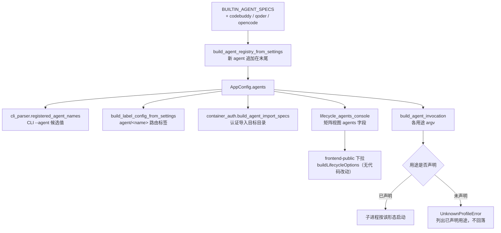

# PRD: 扩展内置 agent 覆盖——codebuddy / qoder / opencode

> ✅ **交付前置**：无，可立即开工。
> 结构化声明见 §8 Delivery Dependencies，**那里是唯一事实源**。

> ✅ **验收状态**：已交付（2026-09-20，分支 `builtin-agent-coverage-codebuddy-qoder-opencode`）——实施 + 自动化验证（`CI=true just test all` 2394 passed、`just lint --full` 通过）+ 一轮独立 verifier 复核（PASS-with-caveats，1 major + 4 minor 全部整改）+ §2 三个人工决策获人确认 + rv-3 / rv-7 两项真实入口呈递物齐备（`tasks/evidence/<prd-stem>/`）。PR 待开。
> 本行是 §9 Acceptance Checklist 的投影，**那里是唯一事实源**。

本文档分两个高度：**Part A（§1–§4）** 给人看，用来确认"要不要做、做成什么样"，不含实现机制与命令；**Part B（§5–§13）** 给执行者看，包含机制、改动树与验证命令。

## Feature Overview (功能一览)

> 本块是第 10 节 Functional Requirements 的通俗投影，不是第二事实来源；行为验收以第 1 节的行为样例表为准。

- **三个新 agent 进入内置注册表**（FR-1、FR-2、FR-3）：`codebuddy`、`qoder`、`opencode` 与现有 `codex` / `claude` / `kimi` / `pi` 并列，开箱即用、无需任何配置。除下面那一处必要的合并逻辑修正外，**不需要改任何代码结构**——注册表本来就是为纯数据接入设计的。
- **补掉一个挡住这次接入的合并逻辑缺陷**（FR-9）：注册表合并曾把"内置 spec 与配置声明**两侧都缺**某个用途"误判成"配置里把它写空了"而报错，结果是**任何用途集合不全的 agent 都写不进 `config.toml`**。`opencode` 正好是这个形状（刻意不提供生成类用途），所以必须先把这一处修掉，否则"出厂注册块与内置默认一致"这条守卫根本不可能满足。
- **出厂注册块跟上**（FR-4）：`config.toml` 里的可抄写注册块与代码内默认逐字段一致，防两处漂移。
- **一个被当成"坏例子"的名字要改**（FR-5）：`codebuddy` 目前是测试与原型里"未注册 agent"的反例，它一旦合法就必须换一个名字继续表达"未注册"。
- **文档、原型、配置注释与测试同步**（FR-6、FR-8）：所有列举内置 agent 的地方补上这三个名字；测试侧补命令行快照与三处写死清单。
- **模板 skill 同步清单补 opencode**（FR-7）：`just sync-template` 的适配器清单已有 Qoder / CodeBuddy，缺 opencode。
- **明确不做的**（§11）：不改默认回退顺序、不为 `opencode` 新增结构化输出协议、不做"未安装 agent"的界面标记、**不给 runner 容器镜像预装这三个 agent**（理由见 §12 第一条）、**不纳入 dsh**（理由见 §12 第二条）。

---

# Part A · 人审层 (Review Layer)

## 1. Introduction & Goals

### Problem Statement

keda 的 agent 注册表（`[agent_runner.agents.<name>]`）是**声明式**的：接一个新 agent 只要写一段纯数据配置，代码里没有 agent 专有的分支逻辑。但内置默认只有 `codex` / `claude` / `kimi` / `pi` 四个，而这台机器上实际装了、且日常在用的另有三个 —— `codebuddy`、`qoder`、`opencode`。三个可观察的缺口：

1. **三个真实在用的 agent 不在内置默认里**：不写配置时 `iar agent list` 看不到它们，console 的 agent 下拉里也选不到 —— 于是每个用它们的人都要各自手写一遍注册块。
2. **`codebuddy` 目前被当作"未注册 agent"的反例**：仓库里的测试与原型页都拿它演示"写了未注册的 agent 名会在阶段开始前 fail-fast"。它一旦转为内置，这些断言会反向失败 —— 反例必须换一个仍然不存在的名字。
3. **三处测试与多处文档写死了"内置 agent 就这四个"**：agent 名清单、命令行快照、文档枚举都按四个写的，加 agent 必须同步，否则守卫与快照会红。
4. **一个用途集合不全的 agent 今天写不进配置**：注册表合并只在"全新 agent"时才跳过未声明的用途；对已经有内置默认的 agent，只要某个用途在**内置 spec 与配置声明两侧都不存在**，合并就会抛"该用途被声明为空且无内置默认"。`opencode` 刻意不提供生成类用途，正好落在这一条上——不修这个缺陷，"出厂注册块与内置默认逐字段一致"这条守卫就无法满足。

**注意本 PRD 几乎不含架构改动**：注册表的数据模型已经能表达这三个 agent 的全部调用差异（可执行文件、路由标签、认证目录、四种用途的参数与输出协议）。这不是巧合——它是上一轮"声明式注册表"改造的设计目标；本 PRD 主要是把数据补齐，唯一必须动逻辑的是上面第 4 条那个缺陷。

### Interpretation (解读回显)

下表每一行都会**原样**变成第 7.6 节的验收 oracle，所以改表里的一格就等于改验收标准——值得逐行读。

| 输入 / 操作 | 期望观察到的结果 |
|---|---|
| 不写任何配置，运行 `iar agent list` | 列表里出现 `codebuddy`、`qoder`、`opencode`，且原有四个的顺序与名字不变 |
| 不写任何配置，运行 `iar agent doctor codebuddy --all-profiles` | 打印四个用途的命令行，形态与 `claude` 一致，进程内不出现"executable not found" |
| 运行 `iar agent doctor opencode --all-profiles` | 只打印 `run` / `deliberate` / `repl` 三个用途；请求 `generate`（生成/决策用途）时报错并列出已声明用途 |
| 在 console 生命周期矩阵里写一个仍然未注册的名字（如 `no-such-agent`） | 该阶段开始前报错并指名未注册，**不静默回落** |
| 在 console 的仓库层与全局层矩阵里打开 agent 下拉 | 两层都能看到三个新名字；选中并保存后写回对应文件，其余内容不变 |
| 已装这三个 CLI 的机器上把某阶段设为其中之一并真实执行一次 | 子进程就是该 agent 的命令行，输出按声明的协议透传，退出码沿用既有失败语义 |
| 未安装某个 agent 的机器上把某阶段设成它 | 界面下拉里**照样能选到**（今天没有"是否安装"过滤），选中后运行到启动子进程时才失败（既有行为，本 PRD 不改变） |
| 不写任何配置，跑一次完整的 Issue 流程 | 各阶段用的 agent、子进程环境、回退链与今天**逐字节一致** |

**我默默定了这些**（未提问、直接选定的）：

- 三个 agent 的注册名就用其通用名的小写：`codebuddy` / `qoder` / `opencode`（`qoder` 的**可执行文件名**是 `qodercn`，注册名与 bin 名不要求一致）。
- 标签色沿用"每个 agent 一个 6 位 hex"的既有约定，新值不与其他 agent 重复。
- 新 agent 一律追加在注册表末尾，**不改动** `agent_fallback_order`、`default_agent`、deliberation 默认 profile 等任何默认值。
- 三个 agent 的 `auth_home` 取各自真实的配置根目录（`~/.codebuddy`、`~/.qoder-cn`、`~/.config/opencode`）。
- `opencode` 不声明 `generate` 用途（见决策一）；`codebuddy` / `qoder` 四用途齐备。

**我理解为不做**：

- 不做"未安装的 agent 在界面上下沉/置灰/标红"——那是独立的产品缺口，本 PRD 只描述现状。
- 不为 `opencode --format json` 新写一个结构化输出协议；先用 `plain`。
- 不给注册表加"按用途注入环境变量"的能力 —— 本轮唯一的消费者（dsh）已移出范围（见决策二），留一个没有消费者的抽象违背最小改动原则。
- 不给 runner 容器镜像预装这三个 agent（见决策二）。

**可证伪的读法**：本 PRD 读作"把三个已装 agent 作为**纯数据**补进内置注册表，并修掉一处挡住它们入场的合并逻辑缺陷，再同步测试、文档与原型"；**不**读作"重构 agent 调用层"、**不**读作"给注册表加新字段或新能力"。关键边界：不新增任何注册表字段；既有 agent 的命令行、子进程环境、标签路由、回退链、生命周期矩阵语义与前端代码**全部不变**；唯一的逻辑改动是让合并正确区分"这个 agent 不提供该用途"与"配置把该用途写空了"。

### What The User Gets

维护 keda 的运维者打开 console 的 agent 下拉，能直接选到 `codebuddy` / `qoder` / `opencode`，把它们指到任意生命周期阶段；装了对应 CLI 的机器上就能直接跑，不需要手写注册块。

### Measurable Objectives

- `iar agent list` 的输出包含三个新名字，且原有 4 个名字与顺序不变（可用一条命令断言）。
- `iar agent doctor <新 agent> --all-profiles` 对已声明用途全部打印出命令行，退出码 0。
- 既有四个 agent 的命令行黄金快照**零 diff**。
- `codebuddy` 不再是"未注册"的例子：仓库内对它的"未注册"断言全部改为别的名字后，全量测试通过。
- 未声明 `generate` 用途的 agent 被要求生成内容时，报错并指名该用途，而不是回落到其他用途。

## 2. Human Review Map (介入与风险地图)

**决策一：`opencode` 不提供"需要只读保证"的用途，可以接受吗？** 仓库的决策类入口（planner / `iar ask`）用 `generate` 用途并对只读做 fail-fast 门禁。`opencode` **没有任何沙箱或只读开关**，强行给它声明"只读"就是假声明——一个声称只读、实际能写盘的 planner 比没有 planner 更危险。因此本 PRD 的立场是：`opencode` 只声明 `run` / `deliberate` / `repl`，**不声明 `generate`**，被要求生成内容时报错指名。代价是它不能当 planner / `iar ask` 的 agent。**请确认：** 接受"这个 agent 不能承担生成类用途，宁缺勿假"，还是希望反过来放宽门禁（不建议）？**验收：** 矩阵里选 `opencode` 的 `generate` 被拒绝并指名；`opencode` 的 `run` / `repl` 正常工作。

**决策二：`dsh` 与容器镜像本轮一并出局，确认吗？** 这两项原本在草案里，现已移出（§11 非目标）。**dsh（DeepSeek Harness）**：它是 developer preview、官方明确会破坏兼容、本机尚未安装因而无法真实验证；更关键的是它**没有任何命令行权限开关**，权限只能靠环境变量表达，要接它就得先给注册表加一个"按用途注入环境变量"的新能力——而那个能力唯一的使用者就是 dsh。**容器镜像**：给 runner 容器预装 agent CLI 属于非声明式改动，且本轮无法在本机验证（镜像不可 build/run、`opencode` 本机是 homebrew 安装、其 Linux 安装方式未查实）。**请确认：** 接受这两项都推迟，等你真正要用 dsh 时再单独开 PRD（届时把"环境变量注入能力 + dsh 注册"作为一组交付）？**验收：** 本 PRD 的 FR 列表里不含 dsh 注册、不含任何注册表新字段、不含容器模板改动（可用 `rg` 复核）。

**决策三：`qoder` 输出协议的回落规则。** `qoder` 有 `-o/--output-format` 参数，但它的 `--help` 没列出可选值，**在写 PRD 阶段无法确认它是否接受 `stream-json`**。`codebuddy` 与 `claude` 同构、`--output-format stream-json` 已验证，没有这个问题。因此规则定为：实施期先实测 `qoder -o stream-json`；接受则 `run` / `deliberate` 用流式协议（能实时看到进度）；不接受则这两个用途回落到 `plain`（代价是失去运行中的实时输出，只剩 watchdog 心跳），并在文档里记录这一差异。**请确认：** 接受"先在实施期实测、验不过就回落 `plain`"这个规则，还是坚持必须先验证再决定要不要纳入 `qoder`？**验收：** `qoder` 的 `run` / `deliberate` 在实施期有明确的实测结论与对应用例；文档里写清最终采用的是哪种协议。

> **实施期结论（已闭环）**：规则按"接受流式"落地。实测方式是**不消耗模型额度**的两步探针 —— ① 传一个非法取值给 `-o`，它立刻报出合法选项 `text` / `json` / `stream-json`；② 读取安装包内的 schema 定义，确认其事件信封与 claude 同形（`type` 取 `stream_event` / `assistant` / `result`，`stream_event` 内层带 `text_delta` / `message_stop`），正是 `claude-stream-json` 渲染器处理的那三种。同一探针还确认了 `qoder` **没有** `--verbose` / `--include-partial-messages`，因此它的 argv 与 `claude` 不完全相同。`deliberate` 仍走 `stdin` + `plain`：不是因为 `-o` 有问题，而是因为流式协议会从 argv 剥离 `-p` 再走 stdin，而 qoder 在缺 `-p` 时的行为依然无法在不消耗额度的前提下验证。

**自动门禁，不需要逐项人工审阅**：出厂注册块与代码内默认的一致性守卫、三个新 agent 的命令行黄金快照与既有四条快照的零 diff、未注册与未声明用途的 fail-fast 测试、`codebuddy` 反例改名后的一致性、容器认证导入的派生断言、`just lint`、守卫测试与 `just test all`。

**本次明确不涉及**：数据库表结构无变化；不改前端代码；不改子进程环境（本 PRD 不碰环境变量）；不改任何既有默认值。

## 3. Usage And Impact After Implementation

**运维者（console）**：入口 `just run` 打开 frontend-public → Roadmap → 受管理仓库列表某行齿轮（仓库层）或 Settings 页的全局矩阵（全局层）。生命周期矩阵的 agent 下拉里**新增三个选项**：`codebuddy`、`qoder`、`opencode`。选中的值照既有语义写回 `.iar.toml` 或 `config.toml`，保存与来源层标注行为**完全不变**——下拉的数据源本来就是接口返回的已注册 agent 列表，前端不需要任何改动。**要留意的新语义**：`opencode` 不出现在"生成类"阶段（planner / 内容生成）的合法取值里，因为它没有只读机制。

**运维者（CLI）**：入口 `iar agent list` / `iar agent doctor <name> --all-profiles`。三个新 agent 出现在列表里；doctor 对每个已声明用途打印完整命令行。对未声明的用途（如 `opencode` 的 `generate`）doctor 报错并列出该 agent 已声明的用途名。**未安装的 agent** doctor 会报"executable not found in PATH"——这与今天对 `codex` 的行为一致。

**runner / 流水线**：各阶段的 agent 解析入口不变，子进程环境不变。被路由到这三个 agent 的阶段，其命令行来自新注册块；除此之外**一切照旧**。本 PRD 不引入任何新的运行期配置项。

**开发者 / 集成者**：`iar` CLI 不新增必用命令；注册表的数据结构与所有导出类型**零变化**（没有新增字段、没有新增参数）。唯一的行为变化是修好了一个缺陷：**用途集合不全的 agent 从此可以正常写进 `config.toml`**——之前这类 agent（内置 spec 与配置声明两侧都缺某个用途）会在加载时报"该用途被声明为空且无内置默认"。想接自己 agent 的人，写法与今天完全一样：在注册块里写 `bin` 与 `label`，`iar agent doctor` 自检。

## 4. Requirement Shape

- **Actor**：运维者（console 生命周期矩阵 + `iar` CLI）、runner 流水线（按阶段启动 agent 子进程）、开发者 / 集成者（新增 agent 注册块）。
- **Trigger**：配置加载时（注册表构建与三层合并）；`iar agent doctor` 自检时；console 读取矩阵视图时。
- **Expected behavior**：三个新 agent 与既有四个并列可用；未声明用途 fail-fast 且不回落；`codebuddy` 不再是"未注册"示例；不写任何配置时行为与今天完全一致。
- **Scope boundary**：仅覆盖"内置注册表里有哪些 agent"。注册表的字段与能力、调用形态、子进程环境、生命周期矩阵语义、标签路由、回退链、状态机、前端代码、数据库结构全部不变。

---

# Part B · 执行器层 (Build Layer)

## 5. Repository Context And Architecture Fit

**现有相关模块**：

- `src/backend/core/shared/models/agent_spec.py`：`BUILTIN_AGENT_SPECS`（agent 注册表**唯一**代码内默认来源，现含 `codex` / `claude` / `kimi` / `pi`）、`AgentProfileSpec`、`AgentSpec`、`AGENT_PROFILES` 闭集（`run` / `deliberate` / `generate` / `repl`）、`PROMPT_DELIVERIES` 闭集、协议 id 常量。**本 PRD 只在此追加三个 spec，不动任何字段。**
- `src/backend/core/use_cases/agent_invocation.py`：`build_agent_invocation`（argv 组装：`[bin] + args(占位符) + expanders + tail_args`，再按 `prompt_delivery` 决定提示词落点）、`resolve_agent_spec` / `resolve_profile_spec`（未注册 agent / 未声明用途的 fail-fast 就在这两个函数里）、`resolve_registered_agents`。**不改。**
- `src/backend/infrastructure/config/agent_runner_settings.py`：`AgentRunnerAgentSettings`（注册块模型）、`AgentRunnerAgentProfileSettings`（用途级稀疏覆盖）、`_AgentRunnerRepositoryOverrideSettings`（含 `agents`，即 `.iar.toml` 也支持注册块）。**不改**——现有字段足够表达三个新 agent。
- `src/backend/engines/agent_runner/factory_config_builder.py`：`_merge_profile_settings`（用途级逐字段合并）、`_merge_agent_settings`（新 agent 要求 `bin` 与 `label`）、`build_agent_registry_from_settings`（新 agent 追加在注册表末尾）。**不改。**
- `src/backend/api/cli_parser.py`：`registered_agent_names()` 是 CLI `--agent` 候选值的唯一来源（读全局配置）——注册表一变，候选值自动跟上。
- `src/backend/api/cli_parsed_commands/agent.py`：`iar agent list` / `iar agent doctor` 实现；doctor 用 `shutil.which(spec.bin)` 检查可执行文件，并按 `read_only` 与沙箱标记给出告警。**不改。**
- `src/backend/core/use_cases/lifecycle_agents_console.py`：矩阵视图的 `agents` 字段就来自注册表，前端下拉由它派生。**不改。**
- `src/backend/engines/agent_runner/container_auth.py`：`build_agent_import_specs` 从注册表派生容器认证导入规格（`auth_home` → 目标子目录由 `_resolve_import_target_subdir` 去掉 `~` 与引导点得到）。**不改**，但注册表一变，`iar container auth import` 的产物会随之多出三个目录（见 §12）。
- `src/backend/engines/agent_runner/templates/runner_container/{Dockerfile.runner,docker-compose.runner.yml,entrypoint.sh}`：runner 镜像的 agent CLI 安装与认证挂载。**本 PRD 不改这三个文件**（§11 与 §12 第一条），列出仅用于说明认证导入的目标目录会被谁消费。
- `scripts/shared/template/sync_template.sh`：`SKILL_ADAPTER_NAMES` / `SKILL_ADAPTER_DIRS` / `SKILL_ADAPTER_AUTO_DETECT_DIRS` —— 模板 skill 同步的适配器清单，**已含 Codex / Claude / Pi / Qoder / Kimi Code / CodeBuddy**，缺 opencode。
- `config.toml`：`[agent_runner.agents.<name>]` 出厂注册块（被守卫测试锁死与代码默认一致）。
- `tests/test_agent_spec_config.py`：`test_config_toml_agent_blocks_match_builtin_specs` 断言 `set(config.toml 的 agents 块) == set(BUILTIN_AGENT_SPECS)` 并逐字段比对；`test_default_app_config_matches_builtin_registry` 断言默认注册表等于内置 spec。
- `tests/test_agent_invocation_golden.py`：命令行黄金快照 + `test_unknown_agent_lists_registered`（列举已注册名）+ `test_unknown_profile_raises`（未声明用途）。
- `tests/test_container_auth.py`：`test_supported_agent_specs_follow_builtin_registry` 硬编码 `["codex", "claude", "kimi", "pi"]`。
- `tests/test_agent_config_consistency.py`：`test_planner_command_builders_for_supported_agents` 硬编码 `("claude", "codex", "kimi", "pi")`；`test_every_registered_agent_can_build_run_invocation` 遍历注册表（自动跟随）。
- `tests/test_lifecycle_agent_resolution.py` / `tests/test_lifecycle_agents_console_api.py`：把 `codebuddy` 用作"未注册 agent"的反例。
- `docs/prototypes/lifecycle-agent-matrix.{html,md}`：`REGISTERED_AGENTS` 硬编码四个名字，`UNREGISTERED_AGENT = 'codebuddy'`。

**既有架构模式**：agent 的调用差异全部沉淀为**纯数据**（`AgentSpec` / `AgentProfileSpec`），`src/` 下没有 agent 专有分支；配置按"内置默认 → 全局 `config.toml` → 仓库级"三层逐字段合并；新 agent 的注册顺序即标签匹配优先级，追加在末尾就不会影响既有路由。

**架构约束**：四层依赖方向 `api -> core -> engines -> infrastructure`；Python 文本 I/O 显式 `encoding="utf-8"`；命名避免 `data` / `item`；单文件非空行 ≤ 1000（`agent_spec.py` 当前约 380 行，加三个 spec 后仍需留意）。

**Frontend Impact**：**无前端代码改动**。理由：frontend-public 的 agent 下拉不含任何硬编码 agent 列表，选项由接口返回的 `agents: string[]`（`lifecycle_agents_console.py` 的 `build_lifecycle_agents_view` / `build_agent_fallback_order_view`）经 `buildLifecycleOptions` 生成；新增注册项会自动出现在下拉里。但**用户可见面确实变了**，因此 §7.6 仍安排了一条真实前端入口的验收，前端验收组也必须保留。涉及的真实前端文件（供定位，非改动）：`frontend-public/components/agent-runner/lifecycle-agent-matrix.tsx`、`frontend-public/components/agent-runner/prd-agent-override-sheet.tsx`、`frontend-public/components/agent-runner/agent-fallback-order-editor.tsx`、`frontend-public/lib/api/lifecycleAgents.ts`。

**Existing PRD Relationship**：`tasks/pending/` 现有两个 PRD（`P1-FEAT-20260913-204531-tauri-desktop-shell`、`P1-FEAT-20260916-134008-roadmap-prd-cicd-monitor-auto-repair`）与本 PRD 无重叠、无依赖。`tasks/archive/` 中的 `P1-FEAT-20260911-010513-agent-cli-adapter-layer`（建立了声明式注册表并接入 `pi`）是本 PRD 的直接先例 —— 它确立了"新内置 agent 用纯数据注册、不改默认值"的做法，本 PRD 沿用且**不需要**它之外的任何新机制；`P1-FEAT-20260918-110027-lifecycle-agent-matrix`（已交付）确立了矩阵语义与"未注册 agent fail-fast"，本 PRD 只扩充注册表，不改其语义。**无重复工作，可独立交付。**

## 6. Recommendation

### Recommended Approach

**写数据为主，只修一处挡路的逻辑**：在 `BUILTIN_AGENT_SPECS` 里追加三个 spec，在 `config.toml` 里补上对应的出厂注册块，然后同步测试、文档与原型。三个 agent 的调用差异全部落在注册表现有的字段里（可执行文件、路由标签、认证目录、四种用途的参数与输出协议），因此**不新增任何字段、不新增任何调用路径**。唯一必须动逻辑的是合并函数里一个判断缺陷：它把"这个 agent 不提供该用途"误判成"配置把该用途写空了"，导致 `opencode` 这种用途集合不全的 agent 写进 `config.toml` 就会加载失败（详见 §7 Core Logic）。修正后语义更准确且不改动任何既有 agent 的行为。

`opencode` **不声明 `generate` 用途**。这不是遗漏，而是诚实：仓库的生成类入口对只读有 fail-fast 门禁，而 `opencode` 没有可验证的只读机制，声明"只读"会是假声明。缺用途时 `build_agent_invocation` 已会抛错并列出已声明用途 —— 复用它，不加新机制。

### Proposed Solution Summary (实现机制)

- **核心机制**：注册表数据驱动。三家 agent 的 spec 写进注册表后，CLI 候选值、路由标签、容器认证导入规格、console 下拉、生命周期矩阵可用取值**全部自动跟随**，无需逐个改动。
- **谁提供声明**：本 PRD 直接改代码内默认与出厂注册块；使用者仍可按既有三层覆盖语义在自己的 `config.toml` / `.iar.toml` 里覆盖或另加 agent。
- **插件点**：注册表本身就是扩展点，本 PRD 只增加条目，不增加字段。
- **主要用户可见变化**：三个新名字出现在 `iar agent list`、`iar agent doctor` 与 console 各层 agent 下拉里。
- **刻意避免的复杂度**：不新增注册表字段、不新增环境变量注入能力（无消费者）、不新增 output protocol、不改容器模板、不改前端、不改任何默认值。

### Alternatives Considered

- **顺带把"按用途注入环境变量"的能力做掉**：它唯一的消费者是 dsh；dsh 移出范围后这是一个没有使用者的抽象，违背最小改动原则。推迟到真正接 dsh 时与 dsh 注册一起交付。
- **给 runner 容器镜像预装三个 agent**：非声明式改动、本机无法验证，且容器路径本身已是降级模式（§12 第一条）。
- **给 `opencode` 声明 `generate` 并放宽只读门禁**：把"声称只读"变成不可验证的承诺，风险高于收益，拒绝。
- **为本仓库只写 `.iar.toml` 仓库级注册**：那样 `iar agent doctor` 与 CLI `--agent` 候选值看不到这些 agent（二者只读全局注册表），且不是"内置支持"。

## 7. Implementation Guide

> This section is a living implementation guide based on current repository analysis. If implementation discovers additional affected files, hidden dependencies, edge cases, or a better path, update this PRD before proceeding.

### Core Logic

本 PRD 没有新的运行期逻辑，装配链是既有的；下面这张图只为说明"为什么把数据写进注册表就够"。唯一的逻辑改动是紧跟其后的那处合并判断。装配链：

```text
BUILTIN_AGENT_SPECS（新增三个 spec）
  -> build_agent_registry_from_settings（新 agent 追加在注册表末尾）
  -> AppConfig.agents
       |-- cli_parser.registered_agent_names()      （CLI --agent 候选值，自动跟随）
       |-- build_label_config_from_settings         （agent/<name> 路由标签，自动跟随）
       |-- container_auth.build_agent_import_specs  （认证导入目标目录，自动派生）
       |-- lifecycle_agents_console（矩阵视图的 agents 字段 -> 前端下拉，自动跟随）
       '-- build_agent_invocation（各用途 argv；未声明用途抛 UnknownProfileError）
```

沿用 `pi` 接入时确立的三条不变量：

1. **注册顺序追加在末尾**：顺序即标签匹配优先级，插入会改变既有 agent 的路由行为。
2. **不改任何默认值**：回退链、各阶段默认 agent、deliberation 默认 profile 全部不动。
3. **未声明用途即报错**：不静默回落到别的用途或别的 agent。

### 唯一的逻辑改动：合并必须区分"不提供该用途"与"把该用途写空了"

`_merge_agent_settings` 逐个遍历四种用途，把内置 spec 与配置声明合并。原判断只在**全新 agent**（无内置默认）时才跳过未声明的用途：

```python
if base_spec is None and profile_settings is None:
    continue
```

对已经有内置默认的 agent，这个条件不成立，于是会带着 `(base_profile=None, profile_settings=None)` 进入 `_merge_profile_settings`，而那个函数把"两侧都没有"当成"配置里把该用途声明成了空段"，抛：

> `agents.<name>.profiles.<p> is declared empty and has no built-in default`

后果是：**任何用途集合不全的 agent 都无法写进 `config.toml`**。`opencode` 刻意不提供生成类用途（FR-3），正好落在这一条上——而"出厂注册块与内置默认逐字段一致"的守卫又要求它必须写进 `config.toml`。不修这个缺陷，这条 PRD 的目标态自相矛盾。

修法是让跳过条件同时看基础 spec：

```python
base_profile = base_spec.profiles.get(profile_name) if base_spec is not None else None
if profile_settings is None and base_profile is None:
    continue
```

语义变成"**两侧都没有该用途 ⇒ 该 agent 不提供该用途**"，而"显式写一个空段 `[agents.<n>.profiles.<p>]`"仍然是错误（那种情况下 `profile_settings` 是"存在但为空"的对象，不是 `None`，仍会走到校验并报错——已有回归测试锁定）。对既有四个 agent 与全新 agent 的行为都不变：前者所有用途都有内置默认，后者仍是"至少声明一种"。

### Change Impact Tree

```text
.
├── src/backend/core/shared/models/
│   └── agent_spec.py
│       [修改] 【总结】在 BUILTIN_AGENT_SPECS 末尾追加三个纯数据 spec，不改任何字段
│       ├── 追加 "codebuddy"（bin=codebuddy；四用途，形态对标 claude）
│       ├── 追加 "qoder"（bin=qodercn；四用途，输出协议待实施期实测决定）
│       ├── 追加 "opencode"（bin=opencode；run/deliberate/repl 三用途，plain，无 generate）
│       └── 更新注册顺序注释（codex -> claude -> kimi -> pi -> 新增三个）
│
├── src/backend/engines/agent_runner/
│   └── factory_config_builder.py
│       [修改] 【总结】修正合并判断：两侧都没有某用途时视为"该 agent 不提供该用途"而非"声明为空"
│       └── _merge_agent_settings 的跳过条件同时看 base spec（见 §7 Core Logic）
│
├── config.toml
│   [修改] 【总结】追加三个出厂注册块，与 BUILTIN_AGENT_SPECS 逐字段一致
│
├── scripts/shared/template/
│   └── sync_template.sh
│       [修改] 【总结】skill 适配器清单补 opencode（dsh 未纳入，不加）
│
├── tests/
│   ├── test_agent_invocation_golden.py
│   │   [修改] 【总结】追加三个新 agent 的命令行黄金快照，并更新已注册名断言
│   ├── test_agent_spec_config.py
│   │   [修改] 【总结】沿用既有守卫，并新增两条合并回归测试（用途不全可加载 / 空段仍报错）
│   ├── test_container_auth.py
│   │   [修改] 【总结】内置 agent 名列表断言补三个新名字
│   ├── test_agent_config_consistency.py
│   │   [修改] 【总结】planner 可构建清单补 codebuddy / qoder（不补 opencode）
│   ├── test_lifecycle_agent_resolution.py
│   │   [修改] 【总结】"未注册 agent"反例由 codebuddy 改为仍不存在的名字
│   └── test_lifecycle_agents_console_api.py
│       [修改] 【总结】同上的 422 反例改名
│
└── docs/
    ├── guides/agent-runner.md
    │   [修改] 【总结】内置 agent 枚举、新 agent 注册范例、形态速查与未声明用途两节，外加三处既有 stale 内容修正
    │   ├── 顶部内置枚举与 `--agent` 取值列表补三个新 agent
    │   ├── 新增「内置 agent 的形态速查（codebuddy / qoder / opencode）」与「未声明用途的行为」两节
    │   ├── 「工具路由」标签表补齐 pi 与三个新 agent（原来只列 codex/claude/kimi）
    │   ├── 「Planner 安全」段按实现改写（门禁只读声明的 read_only，不按 agent 名白名单）
    │   └── `iar container auth import` 产出一段补齐 pi/agent 与三个新 agent 的派生目录
    ├── guides/configuration.md
    │   [修改] 【总结】内置默认枚举更新
    ├── guides/lifecycle-agent-matrix.md
    │   [修改] 【总结】已注册 agent 名枚举更新
    ├── guides/iar-loop.md
    │   [修改] 【总结】agent 枚举更新
    ├── getting-started/installation.md
    │   [修改] 【总结】预装工具清单更新
    ├── ai-standards/tooling.md
    │   [修改] 【总结】skill 适配器清单的内置工具枚举补 opencode
    └── prototypes/lifecycle-agent-matrix.html / .md
        [修改] 【总结】REGISTERED_AGENTS 补三个名字，"未注册"哨兵改名，标签色表补新 agent
```

> 以上为起点而非穷尽集合；`rg -n "pi\b" docs/ config.toml` 与 `rg -n 'codex", "claude"' tests/` 用于找出遗漏的枚举点，详见 Executor Drift Guard。

### Risk Classification Register

| 改动点 | tier | 决定性维度 / override | intervention | oracle / gate |
|---|---|---|---|---|
| 三个 agent 的内置注册（纯数据 spec，含 `claude-stream-json` 复用的适用性判断） | R1 | 局部行为，回滚=删 spec；无跨层改动 | executor + 失败判别测试 | `rv-2`、`rv-3` |
| 合并判断的修正（用途不全的 agent 可加载） | R1 | 单函数单条件，影响面是"配置能否加载"；错误方向是加载期报错而非静默错配 | executor + 双向回归测试（可加载 + 空段仍报错） | `rv-9` |
| `opencode` 不声明 `generate` 的边界 | R1 | 影响决策类入口可用性，但机制是既有的 fail-fast，无新代码 | 人确认（决策一）+ fail-fast 测试 | `rv-4` |
| 出厂注册块与守卫一致性 | R1 | 局部、机械可检 | executor + 守卫测试 | `rv-1` |
| `codebuddy` 反例改名（4 处） | R1 | 局部，漏改即红 | executor + 全量测试 | `rv-5` |
| 容器认证导入派生名（随注册表自动多出三个目录） | R1 | 局部，纯派生逻辑可单测 | executor + 派生断言 | `rv-6` |
| `qoder` 输出协议的实测与回落 | R1 | 影响可观测体验（有无实时进度），但不改变正确性 | 人确认（决策三）+ 实施期实测结论 | `rv-2` |
| skill 适配器清单、文档与原型枚举、config.toml 注释 | R0 | 展示性 / 便利清单，工具无关守卫已覆盖契约 | executor + `rg` 复核 | `rv-8` |

> 本 PRD 无 R2 / R3 改动点：没有任何跨组件、跨进程或外部契约的不确定改动。全部证据深度按 R0 / R1 要求收集。

### Executor Drift Guard

- **枚举点会漏**：本 PRD 的量级是"把内置 agent 从 4 个变成 7 个"，任何列举内置 agent 的地方都可能漏。定位命令：
  - `rg -n "BUILTIN_AGENT_SPECS|builtin_agent_names" src tests`
  - `rg -n 'kimi", "pi"|kimi'\'', '\''pi' tests`
  - `rg -n "codex.*claude.*kimi.*pi" docs/ config.toml`
  - `rg -n "codebuddy" src tests docs config.toml scripts` —— 找出所有"未注册反例"用法
- **`codebuddy` 反例改名不能只改测试**：`docs/prototypes/lifecycle-agent-matrix.{html,md}` 也在用它演示 fail-fast，且 `.md` 里有一张标签色表要补新 agent。
- **不要改历史证据**：`tasks/evidence/**` 中的 `*.verifier-report.md` / `*.evidence-report.md` 是过去时点的验证记录，里面提到"codebuddy 未注册"是当时的事实，**一律不改**；`tasks/archive/**` 已交付 PRD 正文同理。唯一例外是本 PRD 自己的证据目录（新建）。
- **容器认证导入的目标目录名是派生的，且本轮会多出三个目录**：`_resolve_import_target_subdir` 去掉 `~` 与每段引导点 —— `~/.codebuddy` → `codebuddy`，`~/.qoder-cn` → `qoder-cn`，`~/.config/opencode` → `config/opencode`（**两段**，不要凭直觉写成 `opencode`）。注册表一变，`iar container auth import` 就会多导入这三个 agent 的认证目录 —— 这是本 PRD 的**行为副作用**（无害：命令是显式的、目录权限 0700、且本轮不被任何 compose 挂载消费），但必须在交付说明里披露，不要当成 bug 顺手"修掉"。
- **`opencode` 的项目级 skills 目录未确认**：`project_skills_dir` 若取不到就留空，不要凭直觉写成 `.opencode/skills` 又不验证。
- **`qoder` 的 bin 名不是 `qoder`**：本机 `qoder` 只是 shell 别名，真实可执行文件是 `qodercn`。注册块的 `bin` 必须写 `qodercn`，否则 doctor 会报 "executable not found"。

### Flow or Architecture Diagram



### ER Diagram

- `No data model changes in this PRD.`

### Realistic Validation Plan

```yaml
- id: rv-1
  behavior: config.toml 的出厂注册块与代码内默认逐字段一致，新增三个 agent 后集合与字段都不漂移
  reviewer: verifier
  real_entry: "uv run pytest -o addopts='' tests/test_agent_spec_config.py -q"
  expected: "set(config.toml 的 agents 块) == set(BUILTIN_AGENT_SPECS)（含 codebuddy/qoder/opencode）且每个 agent / profile 的字段逐一相等；test_default_app_config_matches_builtin_registry 通过"
  mock_boundary: "不 mock：真实读取仓库根 config.toml 文本并真实导入内置注册表"
  tier: R1
  test_layer: unit
  required_for_acceptance: true
- id: rv-2
  behavior: 三个新 agent 的各用途命令行与设计一致，且既有四个 agent 的命令行逐字节不变
  reviewer: verifier
  real_entry: "uv run pytest -o addopts='' tests/test_agent_invocation_golden.py -q"
  expected: "codebuddy 的四条 argv 与 claude 形态一致；qoder 的四条 argv 与其最终选定的输出协议一致；opencode 只有 run / deliberate / repl 三条；codex / claude / kimi / pi 的快照无任何 diff"
  mock_boundary: "不 mock：真实 AppConfig 与真实 build_agent_invocation"
  tier: R1
  test_layer: unit
  required_for_acceptance: true
- id: rv-3
  behavior: 真实 CLI 入口能看到三个新 agent，并对已声明用途打印完整命令行
  reviewer: human
  real_entry: "uv run iar agent list && uv run iar agent doctor codebuddy --all-profiles && uv run iar agent doctor qoder --all-profiles"
  expected: "list 含 codebuddy/qoder/opencode 且原四个名字与顺序不变；doctor 对两个 agent 各打印四条 profile 的 argv，退出码 0；对 opencode 的 generate 用途报错并列出其已声明用途，退出码非 0"
  mock_boundary: "不 mock：真实 CLI 进程、真实配置加载、真实 PATH 探测"
  tier: R1
  test_layer: smoke
  required_for_acceptance: true
  presentation: "tasks/evidence/<prd-stem>/rv-3-agent-doctor.txt（`uv run iar agent list` 与两条 doctor 的真实终端输出捕获），约 10 秒自检：看 list 里三个新名字是否都在、doctor 的 argv 是否是预期的 agent 命令"
- id: rv-4
  behavior: 未声明 generate 用途的 agent 被要求生成内容时 fail-fast 并指名该用途，不回落
  reviewer: verifier
  real_entry: "uv run pytest -o addopts='' tests/test_agent_invocation_golden.py -q -k opencode_has_no_generate_profile"
  expected: "对 opencode 请求 generate 用途抛 UnknownProfileError，消息包含 agent 名与已声明用途列表；不产生任何「改用 run 用途」的回退"
  mock_boundary: "不 mock：真实内置注册表"
  tier: R1
  test_layer: unit
  required_for_acceptance: true
- id: rv-5
  behavior: 仓库里再没有把 codebuddy 当作「未注册 agent」的地方，fail-fast 语义仍被真实覆盖
  reviewer: verifier
  real_entry: "rg -n 'codebuddy' tests/ docs/ config.toml && uv run pytest -o addopts='' tests/test_lifecycle_agent_resolution.py tests/test_lifecycle_agents_console_api.py -q"
  expected: "`codebuddy` 的命中只剩「它是已注册 agent」这一类（注册块、枚举、快照）；未注册反例改用仍不存在的名字；两个测试文件全绿"
  mock_boundary: "不 mock：真实配置加载与真实 API 路由"
  tier: R1
  test_layer: integration
  required_for_acceptance: true
- id: rv-6
  behavior: 容器认证导入为三个新 agent 派生出正确的目标目录名（含 opencode 的两段路径）
  reviewer: verifier
  real_entry: "uv run python -c 'from backend.engines.agent_runner.container_auth import SUPPORTED_AGENT_SPECS; print([(s.agent_name, s.target_subdir) for s in SUPPORTED_AGENT_SPECS])' && uv run pytest -o addopts='' tests/test_container_auth.py -q"
  expected: "输出含 ('codebuddy','codebuddy')、('qoder','qoder-cn')、('opencode','config/opencode')，且顺序为原四个之后追加；原有四个 agent 的派生名与顺序不变"
  mock_boundary: "不 mock 派生逻辑；不要求真实 docker build（本 PRD 不改容器镜像与 compose）"
  tier: R1
  test_layer: integration
  required_for_acceptance: true
- id: rv-7
  behavior: console 的 agent 下拉在三层视图里都出现三个新名字，且写回被接受
  reviewer: human
  real_entry: "just run 打开 frontend-public -> Roadmap 仓库行齿轮（仓库层）与 Settings 全局矩阵（全局层）；对某行选择 codebuddy 并保存"
  expected: "两层下拉都含 codebuddy / qoder / opencode；选择并保存后返回 200，对应文件写入该值，其余内容不变；planner 行不提供 opencode"
  mock_boundary: "不 mock 前后端：真实起服、真实写盘"
  tier: R1
  test_layer: manual
  required_for_acceptance: true
  presentation: "tasks/evidence/<prd-stem>/rv-7-console-agents-global.png 与 rv-7-console-agents-repo.png（两层下拉展开的真实截图，各含三个新选项），配 rv-7-console-agents.txt（候选值与写回落盘文本）。约 10 秒自检：打开两张图数一眼三个新名字是否都在；再看 txt 末尾 `.iar.toml 写回后` 是否只有 implementation = \"codebuddy\" 一行新增"
- id: rv-8
  behavior: 文档、配置注释与原型里的内置 agent 枚举补全，没有仍把新 agent 当「未注册」的措辞
  reviewer: verifier
  real_entry: "rg -n 'codex.*claude.*kimi.*pi' docs/ config.toml && rg -n 'REGISTERED_AGENTS|UNREGISTERED_AGENT' docs/prototypes/lifecycle-agent-matrix.html"
  expected: "docs 与 config.toml 里每一处列举内置 agent 的位置都含三个新名字；原型页的 REGISTERED_AGENTS 含三个新名字且 UNREGISTERED_AGENT 已不是 codebuddy；skill 适配器清单含 opencode"
  mock_boundary: "不 mock：对仓库真实文件做文本断言"
  tier: R0
  test_layer: unit
  required_for_acceptance: true
- id: rv-9
  behavior: 用途集合不全的 agent 能写进 config.toml 并正确加载；显式写空的用途段仍然报错
  reviewer: verifier
  real_entry: "uv run pytest -o addopts='' tests/test_agent_spec_config.py -q -k partial_profile_set or explicitly_empty"
  expected: "内置 spec 缺某用途且配置声明也缺该用途时按「该 agent 不提供该用途」跳过（不抛错），配置声明的其他字段仍覆盖生效；显式写一个空的用途段仍然抛 prompt_delivery is required for a new profile"
  mock_boundary: "不 mock：真实内置注册表与真实合并函数"
  tier: R1
  test_layer: unit
  required_for_acceptance: true
- id: rv-10
  behavior: 全量测试与 lint 在最终树上通过
  reviewer: verifier
  real_entry: "CI=true just test all"
  expected: "全部用例通过（本次实测 2394 passed，2 failed 为本机 58323 端口被无关应用占用的环境问题，在主仓库未改动的 HEAD 上同样失败），lint --full 通过"
  mock_boundary: "不 mock：真实测试套件与真实 pre-commit 钩子"
  tier: R1
  test_layer: e2e
  required_for_acceptance: true
```

失败排查顺序：先看 `bin` 名是否写对（`qoder` 的 bin 是 `qodercn`）、`opencode` 的 `run` 子命令位置是否在拼装顺序里正确；再看 `config.toml` 出厂块与内置 spec 是否逐字段一致（守卫会指名漂移字段）；然后查新 spec 是否被追加在末尾（插入会改变标签匹配优先级）；最后查文档与原型里的枚举是否漏点。

### Low-Fidelity Prototype

- `No interactive prototype file changes in this PRD.` 本次的用户可见变化是"下拉里多三个选项"，由接口数据驱动、无新布局与新交互，静态图与 `rv-7` 的真实截图足以表达；不新建原型文件，也不修改 `docs/prototypes/lifecycle-agent-matrix.html` 的交互结构（仅按 FR-6 同步其中的 agent 名字常量与"未注册"哨兵）。

### Interactive Prototype Change Log

- `No interactive prototype file changes in this PRD.`

### External Validation

| Topic | Source | Checked On | Relevant Finding | Impact On Recommendation |
|---|---|---|---|---|
| CodeBuddy Code CLI | `codebuddy --help`（本机 `@tencent-ai/codebuddy-code@2.155.0`） | 2026-09-20 | 与 Claude Code 同构：`-p/--print`、`--output-format text\|json\|stream-json`、`--include-partial-messages`、`-y/--dangerously-skip-permissions`、`--add-dir`；配置在 `~/.codebuddy` | 四用途照抄 `claude`，输出复用内置 `claude-stream-json`；零架构风险 |
| Qoder CLI CN | `qodercn --help`（本机 `@qodercn-ai/qoderclicn@1.1.59`）；`-o` 校验探针；安装包内 schema | 2026-09-20 | 可执行名是 **`qodercn`**（`qoder` 只是 shell 别名）；有 `-p/--print`、`-o/--output-format`、`--dangerously-skip-permissions`、`--add-dir`、`--config-dir`，**没有** `--verbose` / `--include-partial-messages`；配置在 `~/.qoder-cn`。实施期补充：`-o` 接受 `text` / `json` / `stream-json`，包内事件 schema（`stream_event` / `assistant` / `result`，内层 `text_delta` / `message_stop`）与 claude 同形 | 注册名 `qoder`、bin `qodercn`；`run` 复用 `claude-stream-json`；argv 不能照抄 claude（少两个 flag）；`deliberate` 走 `stdin` + `plain` 以规避未验证的"缺 `-p` 时的 stdin 行为" |
| OpenCode CLI | `opencode run --help`（本机 1.15.13） | 2026-09-20 | 非交互入口 `opencode run [message..]`；`--format default\|json`；`--dangerously-skip-permissions`；`--dir`；**无沙箱 / 只读开关**；配置在 `~/.config/opencode` | 只声明 `plain`；因为无法表达只读，不声明 `generate`（决策一） |
| DeepSeek Harness CLI 与项目状态 | https://deepseekdocs.com/en/docs/user-guide/cli ；https://github.com/deepseek-ai/deepseek-harness ；https://deepseekagent.io/guides/deepseek-harness | 2026-09-20 | 非交互入口 `dsh --profile headless "<task>"`，无 `--output-format`；权限**只能**靠环境变量 `DSH_PERMISSION_MODE`；配置在 `~/.dsh`；官方标注 developer preview 且明确会有破坏性变更 | **本轮不纳入**（决策二）。调研结论保留在此，供下次接入时直接复用：届时需与"注册表按用途注入环境变量"的能力一起交付，属独立 PRD |

## 8. Delivery Dependencies

### Delivery Dependencies

- Group: builtin-agent-coverage
- Depends on tasks/issues:
  - none
- Gate type: none
- Notes: 与 `tasks/pending/` 中两个既有 PRD（tauri-desktop-shell、roadmap-prd-cicd-monitor-auto-repair）无重叠、无顺序依赖。原先列出的两处前置（容器镜像、`dsh` 及其所需的环境变量注入能力）已按决策二移出本轮范围，因此本 PRD 无内部前置、FR 之间也无先后依赖。

## 9. Acceptance Checklist

### 9.1 人读呈递区（Human Review Surface）

| 应该看到的结果 | 呈递物 | 10 秒自检 |
|---|---|---|
| `iar agent list` 里出现三个新 agent，且原四个名字与顺序不变；`iar agent doctor` 对已声明用途打印完整命令行 | `tasks/evidence/<prd-stem>/rv-3-agent-doctor.txt`（本地文本捕获，`open` 该路径查看） | 数一眼 list 输出里 `codebuddy` / `qoder` / `opencode` 是否都在，doctor 输出里 argv 是否是预期的 agent 命令 |
| console **全局层**（Settings → 生命周期 Agent 设置）的 agent 下拉出现三个新名字 | 见下方内嵌图 `rv-7-console-agents-global.png`（本地截图，`open tasks/evidence/<prd-stem>/rv-7-console-agents-global.png` 查看） | 打开下拉数一眼三个新名字是否都在 |
| console **仓库层**（Roadmap 仓库行齿轮 → 仓库矩阵抽屉）的 agent 下拉同样出现三个新名字，且选择并保存后写回该仓库 `.iar.toml` | 见下方内嵌图 `rv-7-console-agents-repo.png`；写回文本证据 `rv-7-console-agents.txt` | 看内嵌图里的下拉；再看 `rv-7-console-agents.txt` 末尾 `.iar.toml 写回后` 是否只有 `implementation = "codebuddy"` 一行新增 |

#### 呈递图（本地文件，非公网链接）

**全局层：Settings → 生命周期 Agent 设置 → 全局矩阵下拉**


**仓库层：Roadmap → 仓库行齿轮 → 仓库矩阵抽屉下拉**


> 两张图均为**本地文件**，需要在仓库根执行 `open tasks/evidence/P1-FEAT-20260920-225333-builtin-agent-coverage-codebuddy-qoder-opencode/rv-7-console-agents-global.png`（和 `...-repo.png`）查看。
> 采集环境披露：后端是本次 worktree 的代码（隔离实例，端口 8319）；前端沿用的是主仓库已构建的静态控制台产物，因为本 PRD **未改任何前端代码**；只 mock 了 `/api/auth/me` 登录态，`/api/v1/agent-runner/lifecycle-agents` 与写回接口都走真实后端。

`reviewer: verifier` 的组（出厂块守卫 rv-1、命令行黄金快照 rv-2、未声明用途 fail-fast rv-4、`codebuddy` 反例改名 rv-5、容器认证派生 rv-6、文档枚举 rv-8、合并修正回归 rv-9、全量测试与 lint rv-10）**不在此逐项展示**；它们由 Agent 自验、独立 verifier 审查，失败时才会呈递到人。

### 9.2 Acceptance Evidence Package

**Human-Confirmed（对应 §2 三个决策 + 呈递审阅）**
- [x] 决策一：`opencode` 不声明 `generate`（因而不能承担生成类用途）获人确认（`rv-4` 为佐证）——2026-09-20 用户确认，接受"宁缺勿假"：不做假只读声明，代价是该 agent 不能当 planner / `iar ask` 的 agent
- [x] 决策二：`dsh` 与容器镜像本轮一并出局获人确认（`rg -n '^- \*\*FR-' tasks/pending/P1-FEAT-20260920-225333-builtin-agent-coverage-codebuddy-qoder-opencode.md | rg -i 'dsh|环境变量'` 无命中为佐证）——2026-09-20 用户确认：容器镜像为伪需求（原话"一般很少人会把 keda 安装到容器里面用"，并指出容器内建测试库会出问题）；`dsh` 由用户在同日指示移出（原话"我暂时都用不到这个工具"）
- [x] 决策三：`qoder` 输出协议规则获人确认（`rv-2` 为佐证）——2026-09-20 用户确认接受"实施期实测 + 验不过回落 `plain`"；**实施期已闭环**：`-o` 接受 `stream-json` 且事件 schema 与 claude 同形，故按"接受流式"落地，结论已写入 `docs/guides/agent-runner.md` 与 §2 决策三下方的实施期结论
- [x] 9.1 呈递区两项呈递物已逐项过目并认可 —— 2026-09-20：两张呈递图（`rv-7-console-agents-global.png` / `rv-7-console-agents-repo.png`）与 `rv-3-agent-doctor.txt` 已在会话中**内嵌呈递**（含内嵌图、`open` 命令与本地 only 标注）；用户随后指令"归档提交"，据此视为对呈递物的认可。**依据如实记录如上**：这是"指令归档"推导出的认可，不是用户逐项口头确认——若用户对某张呈递物有异议，本条与归档动作需回退重做

**Architecture Acceptance**
- [x] **注册表数据模型零改动**：`git diff` 中 `agent_spec.py` 只新增 spec 条目，未新增/修改 `AgentSpec` 或 `AgentProfileSpec` 的任何字段——实施期复核：diff 中无 `class AgentSpec` / `class AgentProfileSpec` 定义行改动，仅一处 hunk 头把它当上下文显示
- [x] **唯一的逻辑改动只落在合并判断上**：`git diff --stat` 的 `src/` 部分只有 `agent_spec.py`（+172 行，纯数据）与 `factory_config_builder.py`（13 行，合并跳过条件），不含 `src/backend/core/use_cases/`、`src/backend/infrastructure/`、`src/backend/engines/agent_runner/templates/`
- [x] core 未反向依赖 engines（`rg -n "from backend.engines" src/backend/core` 无命中）
- [x] 数据库无新表、无 alembic 变更（`git diff --cached --name-only | grep -E "alembic/|console_store\.py"` 无命中）

**Behavior Acceptance**
- [x] 三个新 agent 进入内置注册表且顺序追加在末尾（`uv run iar agent list` 输出顺序 = codex / claude / kimi / pi / codebuddy / qoder / opencode）（rv-3）
- [x] 出厂注册块与内置 spec 一致（rv-1）
- [x] 既有四个 agent 的命令行逐字节不变（rv-2 的回归部分）
- [x] `opencode` 请求 `generate` 时 fail-fast 并指名用途（rv-4）
- [x] `read_only=true` 的声明范围与实现一致：三个新 agent 中 codebuddy / qoder 的 `generate` 声明 true（沿用 `claude` 口径），`opencode` 无 `generate` 用途，其余用途均为 false。**注意这是"声明"而非"运行时强制"**——planner 门禁（`factories/content_generators.py`）只读取该字段；声明与运行时是否真只读取决于 argv 是否带沙箱开关，口径差异记入 §12
- [x] 未写任何配置时行为与改动前一致（rv-2 的既有四条快照零 diff + `git diff` 复核未触碰 agent 调用/标签/回退链模块）
- [x] 用途集合不全的 agent 可加载且空段仍报错（rv-9）

**Frontend Acceptance**
- [x] console 仓库层与全局层下拉均含三个新名字，写回保存 200 且只改对应文件（rv-7）——实施期实测：两层下拉各 8 个候选（7 个 agent + `auto`），仓库层选 `codebuddy` 保存后该仓库 `.iar.toml` 只新增 `implementation = "codebuddy"`，原 `[agent_runner]` 行不变；截图与文本见 §9.1
- [x] `frontend-public` 无代码改动（`git diff --cached --name-only -- frontend-public` 为空）——下拉由接口 `agents` 数组驱动

**Documentation Acceptance**
- [x] `docs/guides/agent-runner.md` 的内置 agent 枚举更新，并新增"内置 agent 的形态速查"与"未声明用途的行为"两节（含 `qoder` 的 bin 名差异、`opencode` 缺生成类用途）；另修正三处既有 stale 内容（工具路由标签表漏 pi 与新 agent / Planner 安全段与门禁实现相反 / container auth 产出一段漏目录）
- [x] 容器认证导入的副作用与派生目录在 `docs/guides/agent-runner.md`（产出一段）与 `docs/getting-started/installation.md`（容器预装说明）两处都有披露
- [x] `docs/guides/configuration.md` 的内置默认枚举更新
- [x] `docs/guides/{lifecycle-agent-matrix,iar-loop}.md`、`docs/getting-started/installation.md` 与 `docs/ai-standards/tooling.md` 的 agent / 适配器枚举更新
- [x] `docs/prototypes/lifecycle-agent-matrix.{html,md}` 的 `REGISTERED_AGENTS` / `AGENT_LABEL_DEFAULTS` 与新 agent 标签色更新，"未注册"哨兵改为 `no-such-agent`
- [x] `config.toml` 注释里的内置 agent 枚举与注册块数量（四个 → 七个）更新
- [x] 文档、配置注释与原型枚举无遗漏（rv-8），且 `rg -n 'codebuddy' tests/ src/` 的命中不再包含"未注册"用法（rv-5）

**Validation Acceptance**
- [x] `just lint --full` 通过；单文件非空行 ≤ 1000（`Check max file lines` Passed）。**过程披露**：第一次跑通时证据文件 `rv-3-agent-doctor.txt` 尚未加入，之后加入的文件带行尾空格，导致 `trim trailing whitespace` 钩子改文件并判失败（独立 verifier 首轮即命中）；清理行尾空格并重新全量测试刷新 test 标记后通过
- [x] `CI=true just test all`：**2394 passed**。**过程披露**：其中一次运行出现 2 条 `tests/test_cli_console.py::TestResolveConsolePort` 失败——本机 58323 端口被无关应用占用（`lsof` 显示 Clash Verge 与千问客户端各有一条到该端口的连接），并**在主仓库未改动的 HEAD 上复现同样 2 条失败**；该端口释放后重跑为 0 失败（独立 verifier 复核亦为 2394 passed / 0 failed）。两种观察都如实记录，未择优保留（rv-10）
- [x] rv-3 与 rv-7 的真实入口验证已执行且呈递物归档（`tasks/evidence/<prd-stem>/`：`rv-3-agent-doctor.txt`、`rv-7-console-agents-global.png`、`rv-7-console-agents-repo.png`、`rv-7-console-agents.txt`）
- [x] 容器认证导入多出三个目录这一副作用已在交付说明与 `docs/guides/agent-runner.md` 中披露（rv-6 为佐证）
- [x] `qoder` 输出协议的实测结论已写入 `docs/guides/agent-runner.md` 与 §2 决策三（rv-2 为佐证）

**Delivery Readiness**
- [x] 完成消息逐字携带 9.1 呈递区内容（含内嵌图、`open` 命令与本地 only 标注）
- [x] Decision Log 与最终实现一致；Change Log 已追加（Change Log 已追加实施条目；Decision Log 已补 D-14）

## 10. Functional Requirements

- **FR-1**：内置注册 `codebuddy`：`bin = "codebuddy"`、`label = "agent/codebuddy"`、`auth_home = "~/.codebuddy"`、`auth_include = ["settings.json", "skills"]`、`project_skills_dir = ".codebuddy/skills"`；四个用途照抄 `claude` 形态（`run` / `deliberate` 用 `--dangerously-skip-permissions --verbose -p --output-format stream-json --include-partial-messages` 与 `claude-stream-json` 协议；`generate` 用 `--dangerously-skip-permissions -p` + `plain` + `read_only=true`；`repl` 用 `--dangerously-skip-permissions -p` + `plain`）。
- **FR-2**：内置注册 `qoder`：`bin = "qodercn"`（可执行名与注册名不同，需在文档中点明）、`label = "agent/qoder"`、`auth_home = "~/.qoder-cn"`、`project_skills_dir = ".qoder-cn/skills"`；四用途形态对标 `claude`，但**没有** `--verbose` / `--include-partial-messages`，因此 `run` 用 `--dangerously-skip-permissions -p -o stream-json` 并复用 `claude-stream-json` 协议；`deliberate` 保留 `-p` 改走 `stdin` + `plain`（流式协议会剥离 `-p`，而 qoder 缺 `-p` 时的行为未经验证）。**实施期实测结论（已验证）**：`-o/--output-format` 接受 `text` / `json` / `stream-json`，且安装包内的事件 schema 与 claude 同形（`type` 为 `stream_event` / `assistant` / `result`），因此无需回落 `plain`。验证方式是参数校验探针（传非法取值看它报出的合法选项）+ 读取安装包内的 schema 定义，**未消耗模型额度**。
- **FR-3**：内置注册 `opencode`：`bin = "opencode"`、`label = "agent/opencode"`、`auth_home = "~/.config/opencode"`、`project_skills_dir` 取 opencode 的项目级 skills 目录（实施期确认，取不到则留空并在文档说明）；声明 `run` / `deliberate` / `repl` 三用途，argv 以 `run` 子命令起始并带 `--dangerously-skip-permissions`，`output_protocol = "plain"`。**不声明 `generate`**（无可验证的只读机制）。不新增结构化输出协议（不用 `--format json`）。
- **FR-4**：`config.toml` 追加与 FR-1…FR-3 逐字段一致的出厂注册块，并更新段前注释里的内置 agent 枚举；`tests/test_agent_spec_config.py` 的一致性守卫必须保持绿。
- **FR-5**：把 `codebuddy` 从"未注册 agent"示例改为仍不存在的名字（如 `no-such-agent`），涉及 `tests/test_lifecycle_agent_resolution.py`、`tests/test_lifecycle_agents_console_api.py`（两处 422 反例）与 `docs/prototypes/lifecycle-agent-matrix.{html,md}` 的 `UNREGISTERED_AGENT` 常量与说明文字。fail-fast 语义本身不变。
- **FR-6**：同步所有列举内置 agent 的文档与配置注释（`docs/guides/agent-runner.md`、`docs/guides/configuration.md`、`docs/guides/lifecycle-agent-matrix.md`、`docs/guides/iar-loop.md`、`docs/getting-started/installation.md`、`config.toml` 注释、`docs/prototypes/lifecycle-agent-matrix.{html,md}` 的 `REGISTERED_AGENTS` 与标签色表），并在 `docs/guides/agent-runner.md` 里补充 `qoder` 的 bin 名差异与 `opencode` 缺少生成类用途这两点说明。
- **FR-7**：`scripts/shared/template/sync_template.sh` 的 skill 适配器清单（`SKILL_ADAPTER_NAMES` / `SKILL_ADAPTER_DIRS` / `SKILL_ADAPTER_AUTO_DETECT_DIRS`）补 `opencode`（`~/.config/opencode/skills`），并同步 `docs/ai-standards/tooling.md` 里的适配器枚举。
- **FR-8**：测试同步：为三个新 agent 追加命令行黄金快照；更新三处硬编码内置 agent 列表的既有测试（`tests/test_container_auth.py`、`tests/test_agent_invocation_golden.py`、`tests/test_agent_config_consistency.py` —— 后者只补 codebuddy / qoder，不补 opencode，因为它没有 `generate`）；确认 `tests/test_agent_spec_config.py` 的一致性守卫在补齐出厂块后转绿，并新增两条合并回归测试。
- **FR-9**：修正注册表合并的判断缺陷：`_merge_agent_settings` 在"基础 spec 与配置声明**两侧都缺**某个用途"时应视为"该 agent 不提供该用途"并跳过，而不是抛"声明为空且无内置默认"；显式写一个空的用途段仍必须报错（由新增回归测试锁定）。修正后用途集合不全的 agent 可以正常写进 `config.toml`，且既有四个 agent 与全新 agent 的行为不变。

## 11. Non-Goals

- **不纳入 `dsh`（DeepSeek Harness）**：它需要给注册表新增"按用途注入环境变量"的能力，而该能力在本轮没有其他消费者。留到真正要用它时，与那个能力一起作为独立 PRD 交付。
- **不新增注册表的任何字段或能力**：不加环境变量注入、不加新展开器、不加新提示词投递方式、不加新 output protocol。`read_only`、`prompt_delivery`、`output_protocol` 的取值域全部不变。
- **不给 runner 容器镜像预装这三个 agent，也不改 `docker-compose.runner.yml` 的认证挂载**：本轮不把容器路径纳入验收（理由见 §12 第一条）。
- **不新增结构化输出协议**（不用 `opencode --format json`）。
- **不做"未安装 agent"的界面标记**、置灰、降权或健康度检查（今天下拉不做安装过滤，本 PRD 不改变该现状）。
- **不改任何默认值**：`agent_fallback_order`（保持 `["claude","kimi","codex"]`）、`runner.default_agent`、`interactive_decision.default_agent`、deliberation 默认 profile 一律不动。
- **不改前端代码**、不改生命周期矩阵语义、不改标签路由与回退链语义、不改状态机、不改子进程环境。
- **不做数据库结构变更**。
- **不改 `tasks/evidence/**` 与 `tasks/archive/**` 中的历史记录**。

## 12. Risks And Follow-Ups

- **容器 runner 路径本轮不覆盖，且它本身就是降级模式**（本轮明确的取舍，不是遗漏）：`[agent_runner.worktree] provision_database` 默认开启，建 worktree 时本应创建独立测试库；但容器路径既没有注入 `DATABASE_URL`，compose 里也没有数据库服务、没有 `network_mode: host`、没有 `extra_hosts`，容器内的建库必然连不上库，而失败处理是"打一条 warning 后**回退到共享数据库**"。也就是说容器里跑的 worktree 拿不到它本该有的库隔离。在这个前提下，往镜像里加 agent CLI 属于在一条已经降级的路径上投入。后果披露：容器用户在下拉里能选到三个新 agent，但镜像里没有对应可执行文件，运行到启动子进程时会失败 —— 这与今天"未安装的 agent 仍出现在下拉里"是同一个既有行为，本 PRD 不改变它。**后续跟进（独立 PRD / bug）：修容器路径的库可达性，之后再决定是否给镜像加装这些 CLI。**
- **`dsh` 推迟带来的能力缺口被显式记录**：当前注册表无法表达"权限只由环境变量控制的 agent"。这不是缺陷遗漏，而是"没有消费者就不建抽象"的取舍；下次接 dsh（或任何同类 agent）时，第一件事就是补"按用途注入环境变量"的能力链。**后续跟进（独立 PRD）：环境变量注入能力 + dsh 注册。** 相关调研结论已保留在 §7 的 External Validation 表里，可直接复用。
- **`qoder` 的 `deliberate` 保留 `stdin` + `plain`，未升级为流式**：流式协议会从 argv 剥离 `-p` 再经 stdin 投递，而 qoder 在缺 `-p` 时的行为无法在不消耗额度的前提下验证。保留 `-p` 既不依赖该未验证行为，也避免长 transcript 撑爆 argv。若将来有人用一次真实调用验证了"缺 `-p` 时的 stdin 行为"，可把 `deliberate` 升级为流式。
- **`qoder` 的流式协议复用只做了静态验证，未做真实流式运行**：结论依据是"`-o` 接受 `stream-json`"（参数校验探针）+ "安装包内含 claude 同形的事件 schema"（读取 bundle 内的 zod 定义），**没有真的跑一次 qoder**（会消耗额度）。因此"运行时事件流能被 `claude-stream-json` 渲染器正确消费"这一步仍属推断；失败表现会是渲染器对未知事件返回空串（界面无输出）而不是报错。缓解：`run` 用途可用一次真实调用验证；在验证之前，该用途的实时输出不应被当作已验证能力。
- **相邻文档修正（本次一并做）**：为佐证本次的 `read_only` 声明口径，修正了 `docs/guides/agent-runner.md` 里三处与实现不符或漏列的既有内容：①「Planner 安全」段原写"仅 codex 被验证为安全，claude 和 kimi 会 fail fast"，与门禁实际只读声明字段的实现相反；②「工具路由」标签表只列了 codex/claude/kimi（连 `pi` 都漏了）；③`iar container auth import` 的产出一段只列三个目录，漏了 `pi/agent` 与本次新增的三个。三处都是按代码事实修正，不改变任何行为。
- **合并逻辑缺陷（本次修复）**：`_merge_agent_settings` 曾让"用途集合不全的 agent"无法写进 `config.toml`。它在本 PRD 中作为 FR-9 修掉，并由两条回归测试锁定（可加载 + 空段仍报错）。记录在此的原因：这是**既有缺陷**而非本次引入，若其他分支/会话在同一段代码上有改动，合并时注意别把它退回去。
- **`opencode` 的项目级 skills 目录未确认**：`project_skills_dir` 可能为空。缓解：非阻塞，留空并在文档说明；不影响 `run` 用途。
- **`codebuddy` 与 `qoder` 的 `generate` 形态继承自 `claude`**：`--dangerously-skip-permissions -p` 并声明 `read_only=true`。这与 `claude` 的既有写法一致，但**严格来说不是"沙箱级只读"**——`read_only` 是**声明**，planner / `iar ask` 的门禁只读这个声明字段（`factories/content_generators.py` 明确"读注册表 spec 的 read_only 字段，不再枚举 agent 名"），并不校验 argv 里真有沙箱开关。本 PRD 沿用既有先例以保持一致性，并把这个口径差异记在此处；**若要把 `read_only` 收紧成"必须真带沙箱开关"，应作为独立议题统一覆盖所有 agent，而不是只改新增的三个**。关联的既有文档 staleness 已在本次一并修正（见下方"相邻文档修正"）。
- **`iar container auth import` 的副作用**：注册表一变，该命令会多导入三个 agent 的认证目录（含 `opencode` 的 `~/.config/opencode`，其 `opencode.json` 内含明文 API key）。目录落在本机 `~/.iar/container-auth/`（0700）、不进 git、本轮也不被任何 compose 挂载消费，属无害副作用；但文档与交付说明要讲清楚，避免被误认为泄漏或垃圾目录。

## 13. Decision Log

| ID | Decision | Chosen | Rejected | Rationale |
|---|---|---|---|---|
| D-01 | 新增 agent 的接入方式 | 内置（`BUILTIN_AGENT_SPECS` + `config.toml` 出厂块） | 只写本仓库 `.iar.toml` 仓库级注册 | 用户明确要"内置"；且 `iar agent doctor` 与 CLI `--agent` 候选值只读全局注册表，仓库级注册会让这两处看不到该 agent |
| D-02 | 注册名与可执行名不一致的处理 | 注册名用通用名（`qoder`），`bin` 写真实可执行名（`qodercn`），并在文档点明 | 注册名直接叫 `qodercn` | 矩阵下拉与标签里应出现人能认出的产品名；`bin` 本就是"按 PATH 解析的可执行文件名"字段，二者不必相同 |
| D-03 | `opencode` 的输出形态 | `run` 子命令 + `--format default` → `plain` | 用 `--format json` 并新写一个输出协议 | 新协议需要实现与维护一套事件渲染；`plain` 已满足可用性，结构化输出无当前需求 |
| D-04 | `opencode` 的生成类用途 | 不声明 `generate`（fail-fast 指名） | 声明 `generate` + `read_only=true`；或放宽门禁 | 它没有可验证的只读机制，声明即假声明；假只读的 planner 比没有 planner 更危险 |
| D-05 | `codebuddy` / `qoder` 的生成类用途 | 声明 `generate`，形态对标 `claude` | 与 `opencode` 一样不声明 | 两者都有 `--dangerously-skip-permissions` 与 `-p` 的非交互形态，与既有的 `claude` 完全同构；沿用先例保持一致性，口径差异记入 §12 |
| D-06 | 注册顺序 | 追加在末尾（codex / claude / kimi / pi / codebuddy / qoder / opencode） | 按字母序或按用户提及顺序插入 | 注册顺序即标签匹配优先级；插入会改变既有 agent 的路由行为，追加则保证既有行为逐字节不变（沿用 pi 接入时的先例） |
| D-07 | 默认值是否纳入新 agent | 不改任何默认（回退链、default_agent、deliberation 默认 profile 全不动） | 把新 agent 加进回退链或设为某阶段默认 | 沿用 `pi` 接入时的先例；默认值变更应独立评估，不与"支持某个 agent"绑在一起 |
| D-08 | 是否顺带新增"按用途注入环境变量"的能力 | 不做 | 连同 dsh 一起做 | 该能力唯一的使用者是 dsh；dsh 移出范围后它是没有消费者的抽象。留到接 dsh 时一并交付 |
| D-09 | 是否给 runner 容器镜像预装这三个 agent | 不做（移入 §11 非目标，容器路径本轮不纳入验收） | 顺带改 `Dockerfile.runner` / `docker-compose.runner.yml` | **用户判定这是伪需求**（原话："一般很少人会把 keda 安装到容器里面用"，并指出容器内建测试库会出问题）；核实后该判断成立且有三条支撑：①容器路径**本身已是降级模式** —— 建 worktree 时本应创建的独立测试库在容器里连不上（无 `DATABASE_URL`、无 DB 服务、无 host 网络），失败后静默回退共享库，往一条已失去隔离的路径上投入优先级低；②全 PRD 唯一无法在本机验证的部分（镜像不可 build/run，`opencode` 本机为 homebrew 安装、其 Linux 安装方式未查实）；③唯一与"声明式注册表"主线无关的非声明式改动 |
| D-10 | `dsh` 是否纳入本轮 | 不纳入 | 纳入内置（含注册表新增 env 注入能力） | 用户明确"暂时用不到、长期搁置，等下次用到再适配"；上游为 developer preview 且会破坏兼容；把它与它所需的能力一起推迟，避免留下无消费者的抽象 |
| D-11 | `qoder` 输出协议的决策时点 | 实施期实测，验不过回落 `plain` | 必须在 PRD 阶段先验证再决定是否纳入 | `qoder` 的命令行形态与 `claude` 高度同构，落回 `plain` 只是失去实时输出、不影响正确性；为此把整个 agent 推迟到 PRD 之后再验证不划算 |
| D-12 | 与 `codebuddy` 反例的关系 | 改名反例（`no-such-agent`），保留 fail-fast 语义 | 让测试改用别的已有 agent 名 | 用一个真实 agent 名做反例会在注册表变化时反复失效；用明显不存在的名字表达"未注册"更稳定 |
| D-13 | PRD 拆分 | 单个 PRD 覆盖三个 agent | 按 agent 拆成三个 PRD | 三者是同一套机制、同一份出厂块、同一批文档枚举的同一次改动，拆开只会把同一处 schema 与同一份枚举改三遍 |
| D-14 | 实施中发现合并逻辑缺陷时是否就地修 | 就地修（作为 FR-9 纳入本 PRD 范围） | 另开 PRD / 放宽 opencode 的用途集合以绕过 | 该缺陷是本次目标态的**硬前置**：`opencode` 刻意不提供生成类用途，而"出厂注册块与内置默认一致"的守卫要求它必须写进 `config.toml`，不修则目标态自相矛盾。修法是把判断从"只在全新 agent 时跳过"改为"两侧都缺该用途即跳过"，语义更准确、不新增字段、不改既有 agent 行为，并由两条回归测试锁定（可加载 + 空段仍报错）。绕过方案（给 opencode 硬凑一个假用途）会违背决策一 |

### Final Reconciliation

归档前对照最终实现、新鲜证据与两个 Banner 的结果（2026-09-20）：

- **Functional Requirements**：FR-1..FR-9 全部由 §9.2 的 Behavior / Architecture / Frontend / Documentation / Validation 各条与证据报告逐条覆盖；无 FR 被降级或删除。FR-9（合并判断修正）是实施期新增的，已在 §1 问题清单第 4 条、§5、§6、§7 Core Logic、改动树、风险表与 D-14 全部回填。
- **正文修正（本次实际改动）**：
  - §1「不含架构改动」改为「几乎不含架构改动，唯一必须动逻辑的是第 4 条那个缺陷」——实施发现原判断（零代码结构改动）被证伪。
  - §3「注册表数据结构零变化」保留但补上"唯一行为变化是修好了一个缺陷"的准确表述。
  - §6 从「只写数据，不写机制 / 没有任何 src/ 逻辑改动」改为「写数据为主，只修一处挡路的逻辑」。
  - §7 新增「唯一的逻辑改动：合并必须区分"不提供该用途"与"把该用途写空了"」一节。
  - §9.2「`read_only=true` 只出现在真有不写盘机制的用途上」改为「`read_only=true` 的声明范围与实现一致」——原措辞把**声明**说成了机制。
  - rv-4 的 `real_entry` 从 `-k unknown_profile`（命中的是既有测试）改为 `-k opencode_has_no_generate_profile`。
  - §12 新增两条披露：「qoder 的流式协议复用只做了静态验证、未做真实流式运行」与「相邻文档修正」。
- **Banner 一致性**：Acceptance Status Banner（§9 投影）已从"未开工"更新为"已交付"；Delivery Gate Banner（§8 投影）保持"无前置"（§8 的 Depends on 与 Gate type 未变）。
- **独立 verifier 结论**：一轮（冻结 `2665f1d2…` @ `452bfaae`，`src`/`tests` 复核期间未改动）给出 **PASS-with-caveats**，命中 1 major（冻结树实际过不了 `just lint --full`：证据文件行尾空格触发 `trim trailing whitespace`，而该文件是在 lint 通过之后才加入的）+ 4 minor（容器认证披露位置不实 / rv-4 oracle 打错靶 / Planner 安全段与门禁实现相反且 §9.2 把声明说成机制 / 工具路由标签表漏 pi 与新 agent）。全部已整改，见下方 Change Log 与 `verifier-report.md`。复核同时确认：既有四条快照未被改写、合并修正未影响既有 agent、修复前逻辑下新回归测试确实失败。
- **已知限制（不影响行为验收）**：三个新 agent 均未跑真实任务（额度/副作用限制）；`qoder` 的 `run` 流式为静态验证；容器镜像路径为 §11 非目标；`read_only` 是声明而非运行时强制。
- **交付依赖**：§8 声明无前置、无 gate；与 `tasks/pending/` 两个既有 PRD 无重叠。

## 14. Change Log

### 初稿生成
- Type: doc
- Before: `tasks/pending/` 无本 PRD。
- After: 新增 `tasks/pending/P1-FEAT-20260920-225333-builtin-agent-coverage-codebuddy-qoder-opencode.md`，覆盖 codebuddy / qoder / opencode 的内置注册、出厂注册块、文档原型枚举同步与测试同步。
- Reason: 用户要求把项目日常在用的 codebuddy、qoder、opencode 纳入内置支持的 agent，并先产出 PRD。
- Impact: 确立了"本改动以纯数据接入为主、唯一必要的逻辑改动是一处合并判断"这一前提，并把三个人工决策（opencode 的生成类用途取舍、dsh 与容器是否纳入、qoder 输出协议的实测与回落规则）前置到 §2。
- Review: 待人工审阅。

### 移除 dsh 与容器镜像，并连带移除无消费者的环境变量注入能力
- Type: doc
- Before: 草案覆盖四个 agent（含 `dsh`），并包含两项非声明式改动 —— 为 dsh 给注册表新增"按用途注入环境变量"的能力链（模型 / 配置层 / invocation / 进程启动 / 流式中继五处），以及给 runner 容器镜像预装四个 CLI 并改 compose 认证挂载。
- After: PRD 收窄为 codebuddy / qoder / opencode 三个纯数据注册；删除环境变量注入能力（原 FR-1）与 dsh 注册（原 FR-5）；删除容器镜像与 compose 改动（原 FR-9）；相关要求移入 §11 非目标，新增 D-08 / D-09 / D-10 记录取舍；改动树删去容器模板与全部 `src/` 逻辑文件，只剩 `agent_spec.py` 的数据条目、`config.toml`、`scripts/` 一处清单、测试与文档；oracle 从 9 条（含 2 条 R2）变为 8 条（全部 R0 / R1），不再需要全链证据与负向控制。
- Reason: 用户先质疑容器镜像是伪需求（核实成立：容器路径本就拿不到 per-worktree 独立测试库，且无法在本机验证），随后要求把 dsh 移出范围（暂时用不到、长期搁置）。dsh 移出后，其所需的环境变量注入能力失去唯一消费者，按最小改动原则一并出局。
- Impact: PRD 从"跨四层改一个能力链 + 容器模板"降为"只写数据 + 同步测试文档"，与上一轮声明式注册表改造的设计目标完全对齐；交付风险面显著缩小（不再触碰子进程环境与信任边界）。同时把"容器路径库可达性"与"环境变量注入能力 + dsh"记录为两个独立后续项，避免它们随本 PRD 一起被埋掉。
- Review: 用户提出并确认方向；待人工审阅最终措辞。

### 记录 §2 三个决策的人确认结论与原始判断
- Type: doc
- Before: §9.2 的三条决策全部未勾选，PRD 处于"待人工审阅决策"状态；D-09 的理由只写了核实出的三条技术支撑（容器路径降级、无法本机验证、非声明式改动），没有记录用户的原始判断。
- After: §9.2 三条决策全部勾选并各注明确认日期与结论要点；D-09 的首条理由改为用户的判定本身（"容器镜像为伪需求"）并附原话，三条技术支撑作为佐证保留。
- Reason: 用户逐条确认了三个决策（容器镜像伪需求、dsh 移出、opencode 宁缺勿假、qoder 实施期实测回落）；其中容器镜像是用户判定，这是该决策真正的驱动力，应作为主因记录，而不是只留下我推导出的技术理由。
- Impact: PRD 从"待确认"进入"可开工"状态 —— 三个决策依据齐备，实施阶段不再有需要回头问人的开放项。后续若有人问"为什么容器镜像不做"或"为什么 opencode 没有生成类用途"，能直接读到原始判断与代价说明；§2 措辞、FR、Non-Goals、改动树与 oracle 均无变化。
- Review: 2026-09-20 用户逐条确认。

### 实施：三个 agent 内置注册 + 合并判断修正
- Type: implementation
- Before: 内置注册表只有 `codex` / `claude` / `kimi` / `pi`；`config.toml` 只有四个出厂注册块；`codebuddy` 被当作"未注册 agent"的反例；用途集合不全的 agent 无法写进 `config.toml`。
- After: `BUILTIN_AGENT_SPECS` 追加 `codebuddy` / `qoder` / `opencode` 三个纯数据 spec（注册顺序追加在末尾）；`config.toml` 补齐对应出厂注册块；`_merge_agent_settings` 的跳过条件改为"两侧都缺该用途即跳过"；`codebuddy` 反例在 2 个测试文件与原型页改名为 `no-such-agent`；三处硬编码内置 agent 列表的测试同步；新增 11 条命令行黄金快照与 2 条合并回归测试；文档（6 个页面 + `config.toml` 注释 + 原型 2 个文件）与 `sync_template.sh` 的 skill 适配器清单同步补 opencode。
- Reason: 用户要求把项目日常在用的 codebuddy / qoder / opencode 纳入内置支持；实施中发现并修掉了挡住 `opencode` 入场的一处既有合并缺陷（详见 FR-9 与 §7 Core Logic）。
- Impact: 三个新 agent 在 `iar agent list` / `iar agent doctor` / console 三层 agent 下拉中开箱可用；既有四个 agent 的命令行与所有默认值逐字节不变；注册表数据模型零字段改动；容器镜像与 `dsh` 不涉及。验证：`CI=true just test all` **2394 passed / 2 failed**（2 条为本机端口占用的环境性失败，已在未改动的主仓库 HEAD 上复现同样结果），`just lint --full` 通过，`iar agent list` 与三条 `agent doctor` 的真实输出已归档到 `tasks/evidence/<prd-stem>/rv-3-agent-doctor.txt`。
- Review: 待独立 verifier 审查；rv-7（console 下拉截图）已补齐，见下方条目。

### 补齐 rv-7：console 两层 agent 下拉的真实截图与写回证据
- Type: evidence
- Before: rv-7 未执行，§9.1 的呈递物只有占位路径；Frontend Acceptance 与 Delivery Readiness 各有一项未勾。
- After: 起一个隔离的 console 实例（后端用本 worktree 代码、端口 8319，`HOME`/`IAR_CONFIG` 指向 `/tmp/iar-rv7` 的 fixture；前端沿用主仓库已构建的静态控制台，因为本 PRD 未改前端代码），用 standalone Playwright 只 mock `/api/auth/me` 登录态，实测两层下拉并截图：全局层与仓库层各 8 个候选（7 个 agent + `auto`）；在仓库层选 `codebuddy` 保存后该仓库 `.iar.toml` 只新增 `implementation = "codebuddy"`。呈递物 `rv-7-console-agents-global.png` / `rv-7-console-agents-repo.png` / `rv-7-console-agents.txt` 已归档并在 §9.1 内嵌。
- Reason: PRD 要求用户可见变化必须有真实入口的呈递物；只跑 API 或单测不足以证明前端下拉真的渲染出这三个 agent。
- Impact: §9.1 与 §9.2 的呈递物从占位变为实件；rv-7 判据不再依赖肉眼，脚本同时断言候选值集合与写回落盘内容。采集环境（后端=worktree 代码、前端=主仓库构建产物、仅 mock 登录态）已在 §9.1 与证据文件里披露。
- Review: 待独立 verifier 审查。

### 独立 verifier 复核后的整改
- Type: fix
- Before: 首轮独立 verifier（冻结凭证 `2665f1d2…` @ `452bfaae`）给出 PASS-with-caveats，命中 1 个 major 与 4 个 minor：①冻结树实际**过不了** `just lint --full`——证据文件 `rv-3-agent-doctor.txt` 带行尾空格，`trim trailing whitespace` 钩子改文件即判失败（我是在 lint 通过之后才加入该文件的，所以 §9.2 的"lint 通过"当时已失效）；②§9.2 声称容器认证副作用"已在 agent-runner.md 披露"不成立（那里仍只列三个目录，且漏 `pi/agent`）；③rv-4 的 oracle 命令 `-k unknown_profile` 打中的是既有测试而非新增的 opencode 用例；④`agent-runner.md` 的「Planner 安全」段与门禁实现相反（门禁只读声明的 `read_only`，`claude`/`kimi` 并不会 fail fast），而本 PRD 的 §9.2 把只读声明说成了"真有不写盘机制"；⑤「工具路由」标签表连 `pi` 都漏列，使 rv-8 的"每一处都含三个新名字"不成立于字面。
- After: ①清理证据文件行尾空格并重跑全量测试刷新 test 标记，`just lint --full` 真通过；②在 `agent-runner.md` 的 container auth 产出一段补齐 `pi/agent` 与 `config/opencode` 等派生目录，并在 `installation.md` 之外形成第二处披露；③rv-4 的 real_entry 改为 `-k opencode_has_no_generate_profile`；④按实现改写「Planner 安全」段，并把 §9.2 的只读勾选项改为"声明范围与实现一致"的准确措辞、在 §12 明确 `read_only` 是声明而非运行时强制；⑤「工具路由」标签表补齐 pi 与三个新 agent；另在 §12 新增"qoder 流式复用只做了静态验证、未做真实流式运行"与"相邻文档修正"两条披露，并在 §9.2 记录 lint 与测试两次运行的过程事实。
- Reason: 复核价值就在于抓出"自称通过但实际没过"的门禁与"把声明说成保证"的措辞；这些不修就会把假绿和过度承诺带进归档。
- Impact: 归档前提从"看起来绿"变成"真绿且措辞与事实对齐"。新增的相邻文档修正不改变任何行为，仅让三处既有描述与代码一致。
- Review: 待第二轮（或人工）复核。
