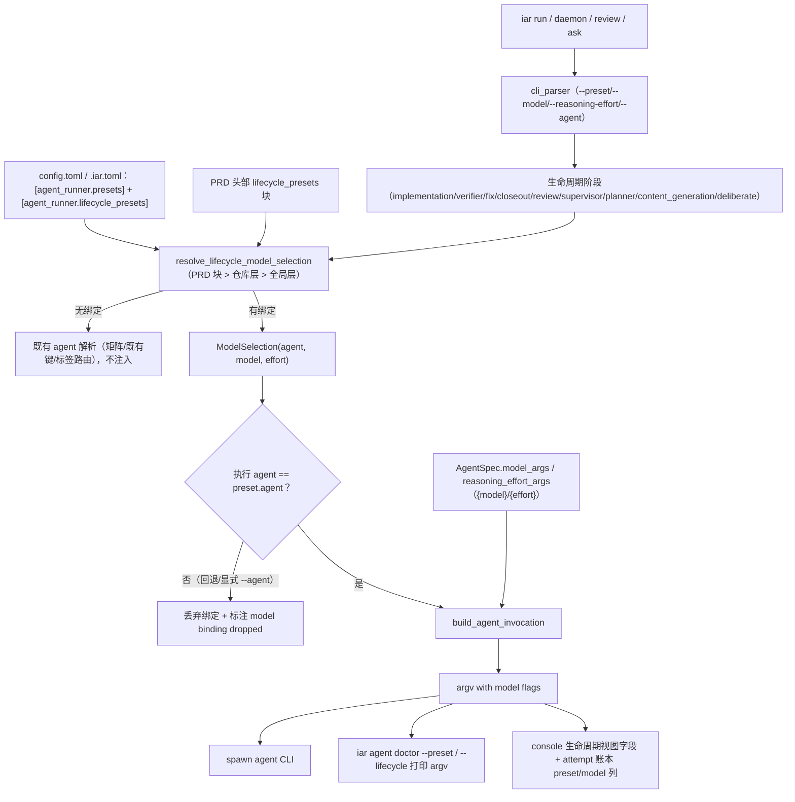

# PRD: Agent 模型预设接入生命周期（Model Presets in the Lifecycle）

> ✅ **交付前置**：无，可立即开工。
> 结构化声明见 §8 Delivery Dependencies，**那里是唯一事实源**。

> ✅ **验收状态**：已交付并归档（两轮独立 verifier PASS；9.1 决策页 6/6 按推荐确认；rv-12 opt-in 经人决定本轮不采，PR 标注已知限制）。
> 本行是 §9 Acceptance Checklist 的投影，**那里是唯一事实源**。

本文档分两个高度：**Part A（§1–§4）** 给人看，用来确认"要不要做、做成什么样"，不含实现机制、文件路径、命令与排期信息；**Part B（§5–§13）** 给执行者看，包含机制、改动树与验证命令。人只在 Part A 点名处下钻。

## Feature Overview (功能一览)

> 本块是第 10 节 Functional Requirements 的通俗投影，不是第二事实来源；行为验收以第 1 节的行为样例表为准。

- **一个命名预设 = 一组（agent + 模型 + 推理档）**（FR-1、FR-2）：运维者在配置里定义 `plan` / `work` 之类预设；keda 拉起 agent CLI 时按 agent 级声明式模板注入对应的模型与推理深度参数，不用再手工改各 CLI 的全局配置。
- **预设接进生命周期矩阵（本 PRD 的核心）**（FR-3、FR-4）：新增 `阶段 → 预设` 绑定层——`[agent_runner.lifecycle_presets]`（仓库 `.iar.toml` / 全局 `config.toml`）与 PRD 头部 `lifecycle_presets` 覆盖块，九个生命周期阶段（实现 / 修复 / 收尾 / 校验 / 审核 / 监督 / 决策 / 内容生成 / 辩论）各自可选绑一个预设。绑定后该阶段由预设整体决定"用哪个 agent、什么模型、什么推理档"：校验用强模型慢推理、实现用快模型高推理，整条流水线自动生效，不依赖人在每条命令上传参。
- **完全可选**（FR-3、FR-8）：预设、绑定、命令行旗标三者都可以不设置；任何一层都没设时，九个阶段的行为与今天**逐字节一致**（argv 黄金快照零 diff）。
- **一次性微调**（FR-5）：`--preset` / `--model` / `--reasoning-effort` 可在命令入口临时覆盖绑定的同名字段，实现"绑定打底 + 这次微调"。
- **各 CLI 的 flag 差异沉淀为配置，而不是代码**（FR-2）：每个 agent 声明一段"模型参数模板"，用 `{model}` / `{effort}` 占位；新增一个支持模型选择的 CLI 只改配置，不改代码。
- **绑定只在"人对上了"时生效**（FR-6）：模型参数只注入**执行 agent == 预设声明 agent** 的调用；agent 回退或显式 `--agent` 换人时丢弃模型绑定并显式标注，绝不把 A CLI 的模型 flag 塞给 B CLI。
- **宁可报错，不要假切换**（FR-7）：命中了模型绑定、但该 agent 没声明模板时直接报错并指名原因，绝不静默忽略；提供 `iar agent presets` 枚举预设、`iar agent doctor` 打印"将被执行的完整命令行"（支持 `--preset` 与按阶段 `--lifecycle <key>` 两种视角）。
- **可观测**（FR-9）：console 生命周期矩阵只读视图逐行呈递绑定的预设与生效模型；运行账本的 attempt 记录在绑定生效时记下 preset / model。
- **明确不做**（§11）：不接管各 CLI 的鉴权 / 端点 / 凭据、不直连 LLM API、不做预设或绑定的 console 编辑 UI（本轮只加只读字段）、不改 fallback 策略本身、不为未核实 flag 语法的 agent 预置模板、不给 `iar repl` 加预设旗标。

---

# Part A · 人审层 (Review Layer)

## 1. Introduction & Goals

### Problem Statement

Keda（`iar`）已有**生命周期 Agent 矩阵**：九个生命周期阶段各自路由到一个 agent。但"这个阶段用什么模型"完全不可见——每个 agent CLI（codebuddy / claude / codex / kimi / pi / qoder / opencode）用什么模型，由它自己在各自 `auth_home`（`~/.codebuddy`、`~/.claude` …）里的全局配置决定，Keda 既不读取也不感知，且同一 CLI 的全部阶段被迫共用同一个模型。

后果：运维者想让"校验 / 审核这类把关阶段用强模型慢推理、实现 / 修复这类执行阶段用快模型高推理"时，只能手动改每个 CLI 的全局配置——这会影响该 CLI 的所有用途、所有并发运行，无法按阶段区分，更无法按 PRD 区分。模型选择知识散落在各 CLI 的私有配置里，Keda 的平台层对"这次运行到底用了什么模型"零可见性。

生命周期矩阵已经把"阶段 → agent"收敛成了一张三层可覆盖的表（PRD 头部 > 仓库 `.iar.toml` > 全局 `config.toml`），本 PRD 把"模型"接进同一套体系：**命名预设**（agent + 模型 + 推理档三元组）成为矩阵的绑定单元，阶段可以整体绑一个预设；不绑定的阶段一切照旧。

### Interpretation (解读回显)

下表每一行都会**原样**变成第 7.6 节的验收 oracle，所以改表里的一格就等于改验收标准——值得逐行读。

| 验证方式 | 输入 / 操作 | 期望观察到的结果 |
|---|---|---|
| 👀 人审 + 自动验证 | 定义预设 `plan`（codebuddy + glm-5.3-flash + max）后，运行 `iar agent doctor codebuddy --json --preset plan`（真实 CLI 入口） | 打印的"将被执行命令行" argv 数组同时含 `--model`、`glm-5.3-flash` 与 `--settings`、`{"reasoningEffort":"max"}` |
| 👀 人审 + 自动验证 | 把 `verifier` 阶段绑定到 `plan`（仓库层或全局层）后，运行 `iar agent doctor --lifecycle verifier --json` | 打印该阶段解析出的 agent=codebuddy，argv 含上述模型与推理档参数 |
| 🤖 自动验证 | 不定义任何预设 / 绑定 / 旗标，运行 `iar agent doctor claude --json` 与既有 argv 黄金快照测试 | argv 与改动前的黄金快照**逐字节一致**（不含任何 model / effort 参数）；九个阶段路由结果与今天一致 |
| 🤖 自动验证 | `--preset plan --model glm-5.3-flash --reasoning-effort max`（覆盖绑定同名字段） | 覆盖值生效；只覆盖一项时，另一项取预设值 |
| 🤖 自动验证 | 给一个**没有声明模型模板**的 agent 命中一个带 model 的预设 | 报错并指名"该 agent 未声明模型参数模板"，**不静默忽略** |
| 🤖 自动验证 | 运行 `iar agent presets` | 列出全部预设及其 (agent, model, reasoning_effort) 字段 |
| 🤖 自动验证 | PRD 文件头部写 `lifecycle_presets` 块绑定 `review`，仓库层绑定 `verifier` | 该 PRD 的 review 阶段用 PRD 块的预设，verifier 阶段用仓库层预设；其余阶段不受影响 |
| 🤖 自动验证 | `fix` / `closeout` 未绑预设、实现阶段绑了预设 | 修复 / 收尾跟随实现者，**继承**实现的模型绑定（同一 CLI，模型命名空间相同） |
| 👀 人审 + 自动验证 | 命中绑定的 agent 启动失败、回退到下一个 agent | 回退后的 argv **不含**被丢弃的模型参数，日志 / attempt 记录标注 "model binding dropped on fallback" |
| 🤖 自动验证 | 显式 `--agent` 指定与预设声明不同的 agent | agent 用显式值；该次调用丢弃模型绑定并标注（模型 flag 不跨 CLI 注入） |
| 👀 人审 + 自动验证 | 绑定生效后真实跑一轮（`iar run`，opt-in） | 运行日志 / attempt 记录显示绑定阶段的 agent=codebuddy 且 argv 含模型参数；未绑定阶段 argv 无模型参数 |

**我默默定了这些**（未提问、直接选定的）：

- 预设绑定 **(agent, model, 推理档) 三元组**——这一个已与需求方确认，其余为默默选定。
- 绑定层用**平行的 `[agent_runner.lifecycle_presets]` 段**（九键闭集与矩阵同键），不扩展 `lifecycle_agents` 的取值域——避免"值是 agent 名还是预设名"的歧义。
- 阶段的解析优先级（高到低）：CLI 显式 `--agent` > 阶段预设绑定 > PRD 头部 `lifecycle_agents` / 矩阵 / 既有键。绑定存在时预设的 agent 覆盖矩阵同键声明（预设是更丰富的整体声明）；显式 `--agent` 仍然最高，此时模型绑定因 agent 不匹配而丢弃。
- 模型绑定**只在执行 agent == 预设声明 agent 时注入**——这一条同时覆盖回退、显式换人、executor 继承三种情形；丢弃时日志 / attempt 记录标注 "model binding dropped"。
- `fix` / `closeout` 声明为 `executor` 且自身未绑预设时，**继承**实现阶段的模型绑定（同一 agent，同一模型命名空间）。
- CLI 一次性旗标只挂在**生命周期锚定的入口**：`run` / `daemon` → implementation、`review` / `review-daemon` → supervisor、`ask` → planner、`issue create` → content_generation；`repl` 不是生命周期阶段，不加。
- PRD 头部 `lifecycle_presets` 块与 `lifecycle_agents` 块同型（头部 bullet 区、九键闭集、`planner` 不提供——它没有 PRD 消费点），块内取值必须是已定义的预设名。
- 预设名与 agent 名都是自由字符串，不做枚举白名单；预设名是否已定义在**解析期**校验（与"agent 是否已注册"同口径），配置层只校验形状。
- 只给已核实 flag 语法的 agent（codebuddy：`--model` + `--settings` 推理档；claude：`--model`）播种模板；其余保持空 → 命中时报错。

**我理解为不做**：

- 不做 console 里管理预设 / 绑定的编辑 UI——本轮只给既有只读视图加字段；写回仍走手编 `config.toml` / `.iar.toml` / PRD 头部块。
- 不接管各 agent CLI 的鉴权 / 端点 / 凭据；模型端点仍由各 CLI 的 `auth_home` 负责。
- 不实现 Keda 直连 LLM API——keda 永远只编排子进程。
- 不为"模型"再引入一套与 `AgentSpec` 平行的注册表。
- 不给 `iar repl` 加预设旗标、不改 fallback 链策略本身。

**可证伪的读法**：本 PRD 读作"把终端里 `bud plan` / `bud work` 那种命名预设能力**内建进 keda 的生命周期矩阵**：预设解析为 (agent, 模型, 推理档)，九个生命周期阶段可各自绑定一个预设，各阶段既有的 agent 解析点在绑定时改用预设的 agent 并把模型参数注入它拉起的那个 agent CLI 的 argv；命令行可临时覆盖"；**不**读作"让 keda 直接调 LLM API"、**不**读作"接管各 CLI 的鉴权/端点"、**不**读作"绑定强制生效——绑定永远可省略，省略即今天的行为"。关键边界：不设预设/绑定/旗标时 argv 逐字节不变；agent 未声明模板而命中模型绑定时 fail-fast 而非静默降级；执行 agent 与预设 agent 不一致（回退 / 显式换人）时丢弃模型绑定（不同 CLI 模型命名空间不同）。

### What The User Gets

运维者在配置里定义命名预设（例：`plan` → codebuddy + GLM-5.3-Flash + 最大推理；`work` → codebuddy + DeepSeek-V4.1-Flash + 高推理），然后**可选地**在全局 `config.toml`、仓库 `.iar.toml` 或某个 PRD 头部把阶段绑到预设——例如 `verifier = "plan"`、`implementation = "work"`。此后 daemon / `iar run` 的整条流水线里，校验阶段自动以强模型慢推理跑、实现阶段自动以快模型跑，无需任何人工传参；一条命令列出所有预设、一条只读命令按阶段打印解析后的完整命令行；console 生命周期矩阵与运行账本能看到每个阶段绑了什么、实际用了什么模型。什么都不配置时，一切与今天完全一致。

### Measurable Objectives

- 定义预设并绑定阶段后，对应阶段拉起的进程 argv 含确定的模型 / 推理档参数（可观测）；未绑定阶段的 argv 不含。
- 至少 codebuddy 与 claude 两个 agent 具备可用的模型参数模板；其余 agent 未声明模板时命中预设**必须报错**（fail-fast），不得静默降级。
- 无预设 / 绑定 / 旗标时，解析出的 argv 与改动前**逐字节一致**（零回归），九个阶段路由结果不变。
- 预设清单可枚举，阶段绑定与生效模型在 console 视图与账本中可读。

## 2. Human Review Map (介入与风险地图)

**决策一：模型注入落在 core 的 argv 组装路径，并附带"零回归"兼容承诺，可以接受吗？** 本能力改的是"每次运行实际执行哪条命令"——argv 组装的唯一出口 `build_agent_invocation` 是正确性关键路径，一次注入错误会改变运行行为。同时它给出一个强兼容承诺：**不设预设/绑定/旗标时，argv 与改动前逐字节一致**，九个阶段的既有路由语义全部不变。这是本 PRD 风险最高的一处（core 编排 + 兼容边界），因此需要人确认。代价：为了守住零回归，注入点必须收敛到唯一出口，不能在任何 caller 旁路拼接。**请确认：** 接受"在 argv 组装单一出口做可选注入 + 零回归为硬承诺"这个做法，还是希望把模型注入放到更外层的包装脚本（那样既有运行路径完全不动，但模型对 keda 内部即不可见，也无法按阶段绑定）？**验收：** 定义预设后 doctor 打印的 argv 含正确模型参数；不设任何新配置时 argv 黄金快照零 diff。

**决策二：阶段绑定预设后，预设**整体**决定该阶段的 (agent, 模型, 推理档)，并压过生命周期矩阵的同键 agent 声明，可以接受吗？** 绑定表达的是"这个阶段用这一组选择"；若矩阵同键又声明了另一个 agent，两份声明会打架。本 PRD 的立场：绑定时预设的 agent 生效（预设是更丰富的整体声明，矩阵声明被遮蔽但不删除——删掉绑定即恢复矩阵语义）；显式命令行 `--agent` 仍高于绑定。取舍是：同一阶段同时写矩阵 agent 与绑定时，矩阵 agent 静默失效（console 视图会如实标注生效来源）。**请确认：** 接受"绑定遮蔽矩阵同键声明、CLI 显式 `--agent` 最高"，还是要求"两者并存时报配置错误"（更严格，但会让"临时试一个 agent"变得繁琐）？**验收：** 绑定 + 矩阵同键并存时，doctor `--lifecycle` 打印预设的 agent；删除绑定后恢复矩阵 agent。

**决策三：模型绑定只在"执行 agent == 预设声明 agent"时生效，换人即丢弃并标注，可以接受吗？** 预设绑定了某阶段后，keda 的韧性机制（agent 回退）或人显式 `--agent` 可能让该阶段实际跑在另一个 CLI 上。不同 CLI 的模型命名空间不同（codebuddy 的模型名对 claude 无意义），因此换人时**丢弃**模型绑定并显式标注 "model binding dropped"。例外：`fix` / `closeout` 以 `executor` 跟随实现者时**不**算换人（同一 agent），继承实现阶段的绑定。取舍是：回退后的运行模型可能不等于预设，但回退本身是异常路径，保韧性优先。**请确认：** 接受"换人即丢弃绑定并标注"，还是要求"绑定阶段禁用回退"（破坏既有韧性机制，不建议）？**验收：** 构造一次 agent 启动失败触发回退，回退后的 argv 不含模型参数且日志有标注；fix 继承实现的绑定。

**决策四：agent 未声明模型模板时 fail-fast，可以接受吗？** 各 CLI 的模型 flag 语法不一（`--model` / `-m` / `--settings '{...}'`），本 PRD 只为**已核实语法**的 agent 播种模板，其余（codex / kimi / pi / qoder / opencode）暂留空。命中一个带模型绑定的预设、而该 agent 没有模板时，本 PRD 的立场是**报错并指名**，绝不静默忽略——静默忽略会让"切了模型"成为假象。代价是：这些 agent 在落实模板前不能参与带模型的预设。**请确认：** 接受"未核实即 fail-fast，宁缺勿假"？**验收：** 用未声明模板的 agent 命中带 model 的预设，得到指名报错且非零退出。

**自动门禁，不需要逐项人工审阅**：注入点唯一性（`rg` 断言没有旁路拼 `--model`）、配置字段经 factory merge 进 `AppConfig`、argv 黄金快照零 diff、九阶段未绑定时路由零变化、fail-fast 测试、`--preset` / `--model` 解析测试、绑定层三层覆盖优先级测试、`agent presets` / `agent doctor` 输出测试、attempt 账本 v5→v6 迁移测试、`just lint`、守卫测试与 `just test all`。

**本次明确不涉及**：不新增第三方依赖；不改前端代码（console 只读视图的新字段由后端 API 下发，前端渲染列为后续跟进）；不接管各 CLI 的凭据 / 端点 / 鉴权；不改 fallback 链策略本身；数据库仅 attempt 表**追加**两个可空列（附加式 schema v5→v6）。

## 3. Usage And Impact After Implementation

### [运维者 / Operator]

- 在 `config.toml`（或目标仓 `.iar.toml` 覆盖）定义预设，例如 `plan` / `work`，各自声明 agent、模型 id、推理档。
- **可选地**绑定阶段：`[agent_runner.lifecycle_presets]` 里写 `verifier = "plan"`、`implementation = "work"`；或只在某个 PRD 头部写 `lifecycle_presets` 块做 PRD 级覆盖；或什么都不绑，只在命令上临时 `--preset`。
- 运行：`iar run` / `iar daemon` / `iar review` / `iar ask` 等——绑定阶段自动带模型参数，其余阶段照旧。
- 查看：`iar agent presets` 列出全部预设；`iar agent doctor codebuddy --json --preset plan` 打印预设解析后的完整 argv；`iar agent doctor --lifecycle verifier --json` 按阶段打印绑定解析结果；console 生命周期矩阵看到每行绑定的预设与生效模型。
- 细粒度覆盖：`--preset plan --model glm-5.3-flash --reasoning-effort max`（覆盖预设同名字段）。
- 不定义 / 不绑定 / 不传任何新参数时，行为与现在完全一致。

### [开发者 / Developer]

- 沿用既有入口扩展：模型/推理档入参是 **agent 级**的声明式 argv 模板（沿用现有 `args` 的 `{cwd}` / `{worktree}` / `{prompt}` 占位符体系，新增 `{model}` / `{effort}` 占位符），新增一个 CLI 支持模型选择时只改配置，不改代码。
- 阶段绑定与预设解析收敛到 `lifecycle_agent_resolution` 与单一预设解析模块；`build_agent_invocation` 是唯一 argv 组装出口，不得在别处二次拼模型参数。
- 各阶段消费点只做"解析 + 透传"，不各自实现绑定语义。

### Impact On Existing Behavior

- 既有用户 / 数据 / 配置：不设预设、不绑阶段、不传新参数时，解析出的 argv 与改动前逐字节一致；九个阶段的既有路由（矩阵 / 既有散落键 / 标签路由 / fallback 链）语义不变。
- 新配置均为可选：未声明 `[agent_runner.presets.*]`、未声明 `[agent_runner.lifecycle_presets]`、未写 PRD 覆盖块时，配置加载仍须正常完成；仅当**命中**一个需要模型而该 agent 未声明模板的绑定时才报错。
- 数据库：attempt 账本追加两个可空列（preset / model），schema v5 → v6，附加式迁移；老库升级后旧记录两列为空。

## 4. Requirement Shape

- Actor: Keda 运维者 / 调用 `iar` 的自动化流程 / 与 agent 调用层打交道的开发者。
- Trigger: 运行 `iar run` / `daemon` / `review` / `ask` / `issue create` 等命令触发任一生命周期阶段时——该阶段有绑定（或命令带一次性旗标）则注入，没有则按既有语义。
- Expected behavior: Keda 把阶段绑定的预设解析为确定的 (agent, 模型, 推理档)，阶段改用预设的 agent，并通过 agent 级声明式模板把模型参数注入被拉起 CLI 的 argv；未绑定的阶段零改动。
- Scope boundary: 不接管各 CLI 的凭据 / 端点 / 鉴权；不做预设编辑 UI；不实现前端渲染改动；不新增 LLM API 直连；不改变 fallback 链本身的策略。

---

# Part B · 执行器层 (Build Layer)

> 以下供实现者（人或 Agent）使用。人只在 Part A 风险地图点名处下钻审查；其余默认交执行器 + 自动门禁。

## 5. Repository Context And Architecture Fit

**现有相关模块**：

- argv 组装的唯一出口：`src/backend/core/use_cases/agent_invocation.py` → `build_agent_invocation`（`args` → 展开器 → `tail_args` → 提示词投递）；`_expand_placeholders`（占位符展开器，占位符闭集 `{cwd}` / `{worktree}` / `{prompt}`）；`resolve_registered_agents`。调用点共四处：`run_agent_once.py::run_agent_with_prompt`（主执行）、`engines/agent_runner/transcript_runner.py`（辩论）、`engines/agent_runner/factories/content_generators.py`（内容生成 ×2）、`api/cli_parsed_commands/agent.py::_doctor_entry`（doctor）。
- agent 声明式模型：`src/backend/core/shared/models/agent_spec.py` → `AgentSpec` / `AgentProfileSpec` / `BUILTIN_AGENT_SPECS`（七个内置 agent，`profiles` 四用途）。
- 生命周期矩阵：`src/backend/core/shared/models/lifecycle_agent.py`（九键闭集 `LIFECYCLE_AGENT_KEYS`、分组常量、`LifecycleAgentsConfig` 两层视图）；解析单点 `src/backend/core/use_cases/lifecycle_agent_resolution.py` → `resolve_lifecycle_agent`（PRD 覆盖 > 仓库层 > 全局层 > 既有键 > 内置默认；`parse_prd_lifecycle_overrides` / `upsert_prd_lifecycle_overrides` 已实现头部 bullet 块读写）。
- 九个阶段的消费点（全部已经过 `resolve_lifecycle_agent` 或其短路变体 `_resolve_declared_lifecycle_agent`）：实现 `run_agent_once.py::choose_agent`；修复 / 收尾 `run_agent_execution_loop.py`（两处 `resolve_lifecycle_agent("fix"/"closeout")`）；校验 `run_verifier_agent.py`；审核 `run_agent_once.py::resolve_reviewer_agent`；监督 `run_agent_once.py::resolve_supervisor_agent`；决策 `api/cli_parsed_commands/agent.py::run_ask_command`；内容生成 `generated_prd_content.py` / `generated_content.py`（三 target）；辩论 `agent_runner_deliberation_issues.py`（两处）。
- 配置覆盖：`src/backend/infrastructure/config/agent_runner_settings.py`（`AgentRunnerLifecycleAgentsSettings` 九键闭集校验；`_AgentRunnerRepositoryOverrideSettings` 聚合全部段；`load_agent_runner_local_settings` 读 `.iar.toml`）。
- Spec 合并进 `AppConfig`：`src/backend/engines/agent_runner/factory_config_merge.py` / `factory.py`（经 `core/use_cases/agent_runner_factory.py` facade 转发）。
- console 只读视图：`src/backend/core/use_cases/lifecycle_agents_console.py::build_lifecycle_agents_view`（逐行 `resolve_lifecycle_agent` 算生效值与来源层）；API 路由 `api/routes/agent_runner_lifecycle_agents.py`。
- 运行账本：`src/backend/infrastructure/persistence/console_store.py`（`attempt_records` 表记 `agent` 等列，`_SCHEMA_VERSION = 5`；`AttemptRecord` 与 core 模型同构）。
- CLI 解析：`src/backend/api/cli_parser.py`（argparse）、`src/backend/api/cli_typer_agent.py`（Typer）；只读命令已存在：`iar agent doctor [agent] [--json] [--all-profiles]`（`api/cli_parsed_commands/agent.py`，黄金快照哨兵提示词 `GOLDEN_SNAPSHOT_PROMPT`）。

**Reuse candidates**：

- `_expand_placeholders`（扩展 `{model}` / `{effort}`，闭集加两项）。
- `build_agent_invocation` 的既有四个调用点全部复用同一份注入逻辑。
- `parse_prd_lifecycle_overrides` / `upsert_prd_lifecycle_overrides` 的头部块解析机制（参数化块名后同时服务 `lifecycle_agents` 与 `lifecycle_presets`）。
- `AgentRunnerLifecycleAgentsSettings` 的九键闭集校验模式（新增预设绑定段照抄同型）。
- 既有 `agent doctor` 作为可观测 / 验证入口（加旗标，不新建调试命令族）。

**既有架构模式**：四层依赖方向 `api → core → engines → infrastructure`；argv 组装只在 `core/use_cases/agent_invocation.py`；生命周期解析只在 `core/use_cases/lifecycle_agent_resolution.py`；配置只在 `infrastructure/config` 定义、经 factory merge 成 `AppConfig`。

**Frontend Impact**：`No frontend impact` —— 本轮不改任何前端页面。console 生命周期只读视图的 API 响应新增 `preset` / `model` 字段属于向后兼容的追加，前端渲染列为后续跟进；预设与绑定经配置文件与 PRD 头部块使用，是运维侧概念。

**Existing PRD Relationship**：生命周期矩阵本身由已归档 PRD `P1-FEAT-20260920-225333`（agent 覆盖）与 lifecycle-agent-matrix 交付（PR #147）建立；运行账本由 lifecycle observability 交付（PR #153）建立。本 PRD **复用**这两套体系并把预设接进去，与其无在途依赖。**无重复工作，可独立交付。**

## 6. Recommendation

### Recommended Approach

在既有声明式 agent 体系与生命周期矩阵上做**三层加法**：

1. **agent 级模型参数模板**（沿用 `args` 的占位符机制）：`AgentSpec` 新增 `model_args: tuple[str, ...] = ()` 与 `reasoning_effort_args: tuple[str, ...] = ()`，模板里用 `{model}` / `{effort}` 占位；为空即"该 agent 不支持模型选择"。
2. **命名预设**：新增可选配置段 `[agent_runner.presets.<name>]`，字段 `agent` / `model` / `reasoning_effort`；新模块解析为一次 `ModelSelection(agent, model, effort)`，交给 `build_agent_invocation` 注入。
3. **生命周期绑定层（本 PRD 的核心增量）**：新增可选配置段 `[agent_runner.lifecycle_presets.<stage>] = "<preset>"`（九键闭集，与矩阵同键）与 PRD 头部 `lifecycle_presets` 覆盖块；解析单点在 `lifecycle_agent_resolution` 新增 `resolve_lifecycle_model_selection(lifecycle, ...)`，与 `resolve_lifecycle_agent` 并排；九个消费点各自"解析 + 透传"给调用链，最终经 `build_agent_invocation` 注入。CLI 增加可选 `--preset` / `--model` / `--reasoning-effort`（仅生命周期锚定入口）与 doctor 的 `--lifecycle <key>` 视角。

**为什么最贴合现有架构**：完全复用现有 `args` 模板 + 占位符 + `build_agent_invocation` 单一出口，以及矩阵既有的三层覆盖与闭集校验模式，不新建执行路径、不新建注册表；不同 CLI 的 flag 差异（`--model` vs `-m` vs `--settings '{...}'`）被吸收进**配置模板**而非 if-else 代码，新增 CLI 零代码改动；九个阶段天然已经全部经过统一解析点，绑定层不需要发明新的分发机制。

**拒绝的冗余**：不新建 `ModelRegistry`、不改 `AgentProfileSpec` 语义去塞模型、不为每个 CLI 写专属 Python 分支、不引入第二个 argv 组装函数、不在 `lifecycle_agents` 取值域里混入预设名（歧义）。

### Proposed Solution Summary (实现机制)

- **谁提供输入**：运维者在配置里声明预设与各 agent 的模型参数模板，并可选地把阶段绑到预设（显式数据，Keda 只消费、不推断模型名）。
- **插入边界**：预设与绑定的解析放在 `core/use_cases/`（预设纯解析新模块 + `lifecycle_agent_resolution` 的阶段解析单点）；argv 注入发生在 `build_agent_invocation` 内，位置在 `args` 之后、展开器 / `tail_args` 之前（保持 `exec` / `run` 之类子命令仍在提示词前）。
- **阶段解析优先级（每阶段独立判定，高到低）**：① 命令行显式 `--agent`（agent 最高，但模型绑定因 agent 不匹配被丢弃）；② 命令行 `--preset` / `--model` / `--reasoning-effort`（一次性覆盖同名字段）；③ PRD 头部 `lifecycle_presets` 块；④ 仓库 `.iar.toml` `[agent_runner.lifecycle_presets]`；⑤ 全局 `config.toml` `[agent_runner.lifecycle_presets]`；⑥ 无绑定 → 走既有 agent 解析（PRD `lifecycle_agents` 块 > 矩阵 > 既有键 > 内置默认），不注入任何模型参数。
- **主要状态 / 可见行为变化**：绑定阶段被拉起进程 argv 多出模型/推理档参数；`iar agent doctor` 能按预设与按阶段两种视角打印；console 只读视图与 attempt 账本可读。未绑定时零变化。
- **Fallback 语义（关键决策）**：模型绑定**只在执行 agent == 预设声明 agent 时注入**。命中绑定的 agent 启动失败回退到链上下一个 agent、或显式 `--agent` 换人时，丢弃绑定并在运行日志 / attempt 记录里显式标注 "model binding dropped on fallback"；既有 `agent_fallback_order` / `max_agent_switches` 完全不动。`fix` / `closeout` 以 `executor` 跟随实现者时继承实现阶段的绑定（同一 agent）。
- **刻意避免的复杂度**：不新增独立存储；账本只追加可空列；不新增前端页面；不改状态机；不接管各 CLI 的凭据/端点。

### Alternatives Considered (Only When Useful)

- **Alternative**：把预设名混进 `[agent_runner.lifecycle_agents]` 的取值域（值既可以是 agent 名也可以是预设名）。
- **Why not chosen**：agent 名与预设名是两个自由命名空间，混在一个字段里无法区分、报错信息也无法指名；平行段 + 闭集键与矩阵既有校验模式同型，成本相同而语义清晰。
- **Alternative**：让 Keda 直接写各 CLI 的私有配置文件（如 `~/.codebuddy/settings.json`）来切模型。
- **Why not chosen**：侵入他人配置、影响该 CLI 的全部用途与并发运行、无法按阶段 / 按 PRD 区分、且要处理各 CLI 各异的文件格式与热重载——破坏面大且不可回退。
- **Alternative**：在 agent 调用层之外包一层"启动器脚本"，由脚本传模型参数（既有 keda 运行路径完全不动）。
- **Why not chosen**：模型选择对 keda 内部不可见，无法按阶段绑定、无法按 Issue / PRD 区分，也无法用 `agent doctor` 观测；需求方要求平台级、生命周期级的可切换。

## 7. Implementation Guide

> This section is a living implementation guide based on current repository analysis. If implementation discovers additional affected files, hidden dependencies, edge cases, or a better path, update this PRD before proceeding.

### Core Logic

1. **配置加载**：`infrastructure/config/agent_runner_settings.py` 新增 `AgentRunnerPresetSettings`（`agent` 必填 / `model` / `reasoning_effort` 可选）与 `presets: dict[str, AgentRunnerPresetSettings]`；新增 `AgentRunnerLifecyclePresetsSettings`（九键闭集 `str | None`，拒绝空串，复用矩阵段的校验风格）；两者挂进 `_AgentRunnerRepositoryOverrideSettings` 与 `load_agent_runner_local_settings` 的透传。预设名是否已定义、绑定值是否是已定义预设，在**解析期**校验（与 agent 注册同口径），配置层只校验形状。
2. **预设解析**：新模块 `core/shared/models/agent_model_preset.py`：`ModelSelection`（frozen dataclass：`agent` / `model` / `reasoning_effort`）与纯函数 `resolve_model_selection(preset_name, config, *, model_override, effort_override) -> ModelSelection`：显式覆盖值 > 预设字段；未知预设名抛错（fail-fast）。
3. **阶段绑定解析**：`core/use_cases/lifecycle_agent_resolution.py`：
   - `parse_prd_lifecycle_overrides` / `upsert_prd_lifecycle_overrides` 参数化块名（`lifecycle_agents` | `lifecycle_presets`），共用头部 bullet 区与校验骨架；`lifecycle_presets` 块的取值校验为非空字符串（预设名存在性留给解析期）。
   - 新增 `resolve_lifecycle_model_selection(lifecycle, config, *, issue=None, prd_overrides=None, model_override=None, effort_override=None) -> ModelSelection | None`：按 PRD 块 > 仓库层 > 全局层找绑定；命中则解析预设并返回 `ModelSelection`，同时要求该阶段 agent 采用预设声明（与 `resolve_lifecycle_agent` 的协作约定见下条）；无绑定返回 `None`。
   - `resolve_lifecycle_agent` 与 `_resolve_declared_lifecycle_agent` 增加绑定短路：阶段有绑定且未被显式 `--agent` 覆盖时，agent 取预设声明的 agent（已注册校验复用 `_validate_registered`）；显式 `--agent` 存在时绑定让位（模型绑定由 agent 匹配规则丢弃）。**未绑定时行为与今天逐字节一致。**
4. **argv 注入**：`build_agent_invocation(...)` 新增可选 `model_selection: ModelSelection | None = None`；命中时先按 `agent_spec.model_args` 用 `_expand_placeholders`（含 `{model}`）产出片段，再按 `reasoning_effort_args`（含 `{effort}`）产出片段，插入到 `args` 之后、展开器 / `tail_args` 之前。若 `model_selection` 给了 model/effort 而该 agent 对应模板为空 → 抛 `ModelNotSupportedError`（fail-fast）。`run_agent_with_prompt` / `run_agent_with_prompt_resilient` 增加同名可选参数并透传。
5. **九个消费点透传**：各阶段在既有解析点同处调用 `resolve_lifecycle_model_selection`，把结果透传进各自的 agent 调用（实现 / 修复 / 收尾 / 校验 / 审核 / 监督走 `run_agent_*` 链；决策走 `iar ask` 的 planner 调用；内容生成走 `content_generators`；辩论走 `transcript_runner`）。`fix` / `closeout` 为 `executor` 且自身无绑定时，继承实现阶段的 `ModelSelection`（同一 agent）。
6. **换人丢弃规则**：调用侧在执行 agent 确定后校验 `model_selection.agent == agent_name`，不等则置 `None` 并记日志 "model binding dropped on fallback"（或 "…on explicit --agent override"）；fallback 流程切到下一个 agent 时同样丢弃并标注。
7. **零回归**：无预设 / 无绑定 / 无旗标时，`model_selection is None` 全链路成立，argv 与九阶段路由与改动前逐字节一致。
8. **观测**：
   - `iar agent presets`（新只读子命令）列出全部预设及 (agent, model, reasoning_effort)。
   - `iar agent doctor` 增加 `--preset <name>` / `--model` / `--reasoning-effort` / `--lifecycle <key>`：`--preset` 视角按预设注入；`--lifecycle` 视角按阶段解析绑定并打印 agent + argv（`fix` / `closeout` 无实现者上下文时如实打印 "follows implementation agent"，不打 argv，与 console 视图口径一致）。
   - console 只读视图 `build_lifecycle_agents_view` 每行追加 `preset`（绑定名 | null）与 `model` / `reasoning_effort`（解析结果 | null）。
   - attempt 账本：`AttemptRecord` 与 `attempt_records` 表追加可空列 `preset` / `model`，`_SCHEMA_VERSION` 5 → 6，既有库按 store 既有迁移路径补列；绑定生效时写入，丢弃 / 未绑定为 NULL。
9. **CLI 旗标**：`cli_parser.py` 为 `run` / `daemon`（含 `daemon run`）/ `review` / `review-daemon` / `ask` / `issue create` 增加可选 `--preset`（choices 来自已注册预设名）/ `--model` / `--reasoning-effort`（自由字符串）；分别锚定 implementation / supervisor / planner / content_generation 阶段。

### Change Impact Tree

```text
.
├── Infrastructure
│   ├── src/backend/infrastructure/config/agent_runner_settings.py
│   │   [修改]
│   │   【总结】新增预设段与生命周期绑定段，注册 agent 级模型模板字段。
│   │
│   │   ├── AgentRunnerAgentSettings 新增 model_args / reasoning_effort_args（list[str] | None）
│   │   ├── 新增 AgentRunnerPresetSettings（agent / model / reasoning_effort）+ presets 映射
│   │   ├── 新增 AgentRunnerLifecyclePresetsSettings（九键闭集，str | None）
│   │   └── 两段挂进 _AgentRunnerRepositoryOverrideSettings 与 .iar.toml 加载器透传
│   │
│   └── src/backend/infrastructure/persistence/console_store.py
│       [修改]
│       【总结】attempt_records 追加可空 preset / model 列，schema v5→v6。
│
├── Core (Domain / 编排)
│   ├── src/backend/core/shared/models/agent_spec.py
│   │   [修改]
│   │   【总结】AgentSpec 增加模型/推理档 argv 模板，并为内置 agent 播种模板。
│   │
│   │   ├── AgentSpec 新增 model_args: tuple[str, ...] = () / reasoning_effort_args: tuple[str, ...] = ()
│   │   ├── BUILTIN_AGENT_SPECS 为 claude（--model）与 codebuddy（--model + --settings reasoningEffort）播种模板
│   │   └── 未验证 flag 的 agent（kimi/pi/opencode/codex/qoder）暂留空 → 命中绑定时 fail-fast
│   │
│   ├── src/backend/core/shared/models/agent_model_preset.py
│   │   [新增]
│   │   【总结】ModelSelection 数据模型与预设/覆盖的纯解析逻辑。
│   │
│   ├── src/backend/core/shared/models/agent_runner.py
│   │   [修改] 【总结】AttemptRecord 追加可空 preset / model 字段（与 store 同构）。
│   │
│   ├── src/backend/core/shared/models/lifecycle_agent.py
│   │   [修改] 【总结】绑定层复用九键闭集；如需常量（如 PRD 覆盖键集别名）在此补，不另写键清单。
│   │
│   ├── src/backend/core/use_cases/agent_invocation.py
│   │   [修改]
│   │   【总结】argv 组装唯一出口接入模型注入，扩展占位符。
│   │
│   │   ├── _expand_placeholders 支持 {model} / {effort}
│   │   ├── build_agent_invocation 新增可选 model_selection 参数并按模板注入
│   │   └── 新增 ModelNotSupportedError（agent 未声明模板但被要求注入时抛）
│   │
│   ├── src/backend/core/use_cases/lifecycle_agent_resolution.py
│   │   [修改]
│   │   【总结】PRD 块解析参数化（lifecycle_agents | lifecycle_presets）；新增
│   │   resolve_lifecycle_model_selection；resolve_lifecycle_agent / 短路变体接入绑定。
│   │
│   ├── src/backend/core/use_cases/agent_runner_factory.py
│   │   [修改] 【总结】AppConfig 组装把 presets / lifecycle_presets merge 进来（engines 侧 factory_config_merge 配合）。
│   │
│   ├── src/backend/core/use_cases/run_agent_once.py
│   │   [修改] 【总结】run_agent_with_prompt(+resilient)/run_agent 透传 model_selection；
│   │   choose_agent / resolve_reviewer_agent / resolve_supervisor_agent 消费绑定；
│   │   fallback 切换时丢弃绑定并标注。
│   ├── src/backend/core/use_cases/run_agent_execution_loop.py
│   │   [修改] 【总结】fix / closeout 解析绑定；executor 无绑定时继承实现阶段 ModelSelection。
│   ├── src/backend/core/use_cases/run_verifier_agent.py
│   │   [修改] 【总结】verifier 消费绑定并透传。
│   ├── src/backend/core/use_cases/agent_runner_deliberation_issues.py
│   │   [修改] 【总结】deliberate 消费绑定并透传 transcript_runner。
│   ├── src/backend/core/use_cases/generated_prd_content.py / generated_content.py
│   │   [修改] 【总结】content_generation 三 target 消费绑定并透传。
│   └── src/backend/core/use_cases/lifecycle_agents_console.py
│       [修改] 【总结】只读视图行追加 preset / model / reasoning_effort 字段。
│
├── Engines
│   ├── src/backend/engines/agent_runner/factories/content_generators.py
│   │   [修改] 【总结】generate 用途调用点透传 model_selection。
│   ├── src/backend/engines/agent_runner/transcript_runner.py
│   │   [修改] 【总结】deliberate 用途调用点透传 model_selection。
│   └── src/backend/engines/agent_runner/factory_config_merge.py
│       [修改] 【总结】预设与绑定段的两层（全局/仓库）merge。
│
├── API
│   ├── src/backend/api/cli_parser.py
│   │   [修改]
│   │   【总结】run/daemon/review/review-daemon/ask/issue create 新增 --preset/--model/--reasoning-effort（argparse help 同轮写清语义）；
│   │   agent doctor 新增 --preset/--model/--reasoning-effort/--lifecycle。
│   ├── src/backend/api/cli_typer_agent.py
│   │   [修改] 【总结】Typer 层新增 presets 子命令与 doctor 参数。
│   └── src/backend/api/cli_parsed_commands/agent.py
│       [修改] 【总结】agent doctor 支持 --preset 与 --lifecycle 两视角；新增 presets 列表实现。
│
├── Skills
│   └── src/backend/engines/agent_runner/templates/skills/iar-operator/SKILL.md
│       [修改]
│       【总结】keda 派发到目标仓的 iar-operator skill 同步新 CLI 面：命令速查表补
│       --preset/--model/--reasoning-effort 一行，只读入口补 iar agent presets 与
│       iar agent doctor --lifecycle <key>；说明"绑定在配置/PRD 头部、旗标是临时覆盖"。
│
├── Config
│   └── config.toml
│       [修改]
│       【总结】为 codebuddy/claude 补模型模板示例；新增 [agent_runner.presets] plan/work 与
│       [agent_runner.lifecycle_presets] 绑定示例（全注释模板，取消注释即生效）。
│
├── Frontend
│   └── No frontend impact
│       【总结】不改前端页面；console 只读视图 API 追加字段，前端渲染为后续跟进。
│
├── Tests
│   ├── tests/**/test_agent_invocation*.py
│   │   [修改] 【总结】模型注入、零回归黄金快照、fail-fast、占位符扩展、换人丢弃规则。
│   ├── tests/**/test_lifecycle_*.py
│   │   [修改] 【总结】绑定三层覆盖优先级、executor 继承、PRD lifecycle_presets 块解析/写回、
│   │   未绑定时九阶段路由零变化。
│   └── tests/**/test_cli_*agent*.py / test_console_store*.py
│       [修改] 【总结】--preset/--model 解析、presets/doctor 输出、attempt v5→v6 迁移。
│
└── Docs
    ├── docs/guides/model-presets.md
    │   [新增] 【总结】预设定义、阶段绑定、CLI 旗标与 doctor 用法指南。
    ├── docs/guides/lifecycle-agent-matrix.md
    │   [修改] 【总结】矩阵页新增"阶段 → 预设绑定"一节（优先级、遮蔽语义、executor 继承）。
    ├── docs/guides/configuration.md
    │   [修改] 【总结】agent 注册块新字段、预设段与绑定段说明。
    ├── docs/guides/agent-runner.md
    │   [修改] 【总结】运行路径中绑定/覆盖与换人丢弃绑定的语义。
    └── mkdocs.yml
        [修改] 【总结】把 model-presets 指南加入导航（guides 段）。
```

> 以上为起点而非穷尽集合；`rg -n "build_agent_invocation" src` 与 `rg -n "presets|ModelSelection|resolve_lifecycle_model_selection|lifecycle_presets" src` 用于找出遗漏的调用点与复制点，详见 Executor Drift Guard。

### Risk Classification Register

| 改动点 | tier | 决定性维度 / override | intervention | oracle / gate |
|---|---|---|---|---|
| 预设解析 + argv 模型注入（无预设时零回归兼容承诺） | R2 | 跨层（config/core/engines/api）+ 兼容边界；core 编排为固定区 | 人确认（决策一）+ 强 oracle（含负向控制） | `rv-1`、`rv-4` |
| 生命周期绑定层：九阶段解析点接入 + 绑定遮蔽矩阵 + executor 继承 | R2 | 改九个阶段的运行期 agent 选择；core 编排固定区 | 人确认（决策二）+ 行为 oracle（含"未绑定零变化"负向控制） | `rv-6`、`rv-9`、`rv-10` |
| 换人（fallback / 显式 --agent）丢弃模型绑定并标注 | R2 | 影响运行期行为；取舍需人确认 | 人确认（决策三）+ 行为 oracle | `rv-7` |
| agent 未声明模型模板时 fail-fast | R1 | 单点失败语义，机制为既有报错，无新代码路径 | 人确认（决策四）+ fail-fast 测试 | `rv-5` |
| agent 级 `model_args` / `reasoning_effort_args` 模板与 `{model}`/`{effort}` 占位符 | R1 | 复用既有占位符与 spec 数据模型，局部 | executor + 黄金快照测试 | `rv-1`、`rv-4` |
| PRD 头部 `lifecycle_presets` 块（解析 / 写回 / 校验） | R1 | 复用既有头部块机制参数化，局部 | executor + 解析/写回测试 | `rv-10` |
| 预设清单可枚举（`agent presets`）+ doctor `--preset` / `--lifecycle` 视角 | R1 | 只读派生，局部 | executor + 输出测试 | `rv-2`、`rv-3` |
| `--model` / `--reasoning-effort` 覆盖 | R1 | 单条解析规则，可单测 | executor + 解析测试 | `rv-3` |
| 观测：console 视图字段 + attempt 账本 v5→v6 迁移 | R1 | 附加式 schema 变更，有既有迁移路径 | executor + 迁移测试 | `rv-11` |
| 文档与 `mkdocs.yml` 同步 | R0 | 展示性，守卫与 `rg` 可检 | executor + `rg` 复核 | `rv-8` |

> 本 PRD 无 R3 改动点（不触碰鉴权/凭据、不可逆数据、资金）；三处 R2 的证据深度按全链要求收集，其余按 R0/R1 单断言收集。

### Executor Drift Guard

The file list above is the expected implementation surface from current repository analysis. During implementation, treat it as a starting point and use these repository searches to catch hidden references or drift before marking the PRD complete.

| Check | Command | Expected Result | If It Fails, Inspect First |
|---|---|---|---|
| Legacy argv 组装旁路 | `rg -n "argv\.append|argv\.extend" src/backend/core src/backend/engines` | 模型/推理档参数只出现在 `agent_invocation.py`，无旁路拼接 | 是否有 caller 自行拼 `--model` |
| 新字段引用 | `rg -n "model_args|reasoning_effort_args" src config.toml` | 字段在 settings、agent_spec、invocation 三处成对出现 | 配置 merge / 内置默认 |
| 预设与绑定引用 | `rg -n "presets|ModelSelection|resolve_lifecycle_model_selection|lifecycle_presets" src` | 预设解析收敛到单一模块、绑定解析收敛到 `lifecycle_agent_resolution` | 是否被复制到 caller |
| 隐藏入口 | `rg -n "build_agent_invocation" src` | 全部调用点均已透传 model_selection（或显式传 None） | run_agent_once / content_generators / transcript_runner / cli_parsed_commands |
| 九阶段消费点 | `rg -n "resolve_lifecycle_agent|resolve_lifecycle_model_selection" src` | 绑定解析与 agent 解析在各消费点成对出现；console 视图同步 | run_agent_execution_loop / run_verifier_agent / deliberation / generated_* / cli_parsed_commands |
| skill 同步 | `rg -n "preset" src/backend/engines/agent_runner/templates/skills/` | iar-operator SKILL.md 已含新旗标与只读入口 | 命令速查表与只读入口两处 |
| 文档同步 | `rg -n "lifecycle_presets|preset" docs mkdocs.yml` | 指南与导航已更新 | lifecycle-agent-matrix / configuration / agent-runner / mkdocs 导航 |

> 注意：`iar agent doctor` 的 argv 输出用哨兵提示词替代真实提示词（`GOLDEN_SNAPSHOT_PROMPT`），注入位置改动后须保持既有黄金快照对未传参路径零 diff。

### Flow or Architecture Diagram



### ER Diagram

- `attempt_records` 追加两个可空列：`preset TEXT NULL`、`model TEXT NULL`（schema v5 → v6，附加式；无新表、无外键变化）。其余无数据模型变更。

### Realistic Validation Plan

```yaml
- id: rv-1
  behavior: 预设把模型与推理档注入被拉起 agent CLI 的 argv
  reviewer: human
  real_entry: "uv run iar agent doctor codebuddy --json --preset plan"
  expected: "argv 数组同时包含 \"--model\",\"glm-5.3-flash\" 与 \"--settings\",\"{\\\"reasoningEffort\\\":\\\"max\\\"}\""
  mock_boundary: "不 mock；读真实 config.toml + 内置 spec 组装 argv，under-test 的注入层不被替换"
  tier: R2
  test_layer: integration
  required_for_acceptance: true
  presentation: "tasks/evidence/<prd-stem>/rv-1-agent-doctor-preset.txt（真实终端输出捕获）。约 10 秒自检：在 argv 数组里找 `--model` 后一项是否为 `glm-5.3-flash`、`--settings` 后一项是否含 `reasoningEffort`"
  critical_value_source: "config.toml 的 [agent_runner.presets.plan]（agent/model/reasoning_effort）与 [agent_runner.agents.codebuddy].model_args / reasoning_effort_args 的真实文件值"
  must_cross: "CLI argparse -> AppConfig 加载（内置默认 → config.toml 逐字段 merge）-> resolve_model_selection -> build_agent_invocation -> doctor 打印 argv"
  forbidden_bypasses: "不直接读原始配置、不在 caller 拼 --model、不 mock 配置加载或注入层、不用测试内重建的 argv 代替真实输出"
  fresh_state_probe: "独立新进程重跑同一命令，输出稳定一致；再改 config.toml 的模型 id 后重跑，argv 随之变化"
  final_tree_evidence: "命令与最终提交树绑定；任何对 src/backend/core 或 config.toml 的后续改动都使本证据失效并需重跑"
  negative_control: "把 config.toml 中 codebuddy 的 model_args 置空（或改为不存在的预设名）后重跑同一命令"
  expected_fail: "argv 不再含 --model，或命令以 'agent codebuddy 未声明模型参数模板' / '未知预设名' 报错并非零退出"

- id: rv-2
  behavior: 预设清单可枚举且字段正确
  reviewer: verifier
  real_entry: "uv run iar agent presets"
  expected: "列出 plan -> agent=codebuddy model=glm-5.3-flash reasoning_effort=max；work -> agent=codebuddy model=deepseek-v4.1-flash reasoning_effort=high"
  mock_boundary: "不 mock；读真实配置"
  tier: R1
  test_layer: integration
  required_for_acceptance: true

- id: rv-3
  behavior: --model / --reasoning-effort 可覆盖预设/绑定同名字段
  reviewer: verifier
  real_entry: "uv run iar agent doctor codebuddy --json --preset plan --model glm-5.3-flash --reasoning-effort max"
  expected: "argv 中模型/推理档取覆盖值；仅覆盖一项时另一项取预设值；不带覆盖时全部取预设值"
  mock_boundary: "不 mock"
  tier: R1
  test_layer: integration
  required_for_acceptance: true

- id: rv-4
  behavior: 未传任何预设/绑定/旗标时 argv 与改动前逐字节一致（零回归兼容承诺）
  reviewer: verifier
  real_entry: "uv run iar agent doctor claude --json && uv run pytest -o addopts='' tests/test_agent_invocation_golden.py -q"
  expected: "argv 等于改动前 golden 快照（无 model/effort 参数）；既有四个以上 agent 的 argv 快照零 diff"
  mock_boundary: "不 mock；以 golden 快照对比，under-test 的注入层不被替换"
  tier: R2
  test_layer: integration
  required_for_acceptance: true
  critical_value_source: "仓库内既有 argv 黄金快照（tests/test_agent_invocation_golden.py 中改动前已存在的期望值）"
  must_cross: "AppConfig 加载 -> build_agent_invocation（model_selection 为 None 或未命中）-> argv 输出"
  forbidden_bypasses: "不重建/放宽快照、不在测试内手工拼装期望 argv、不跳过既有快照用例"
  fresh_state_probe: "同时跑 '不传参' 与 '显式传 None' 两条路径，均与快照一致；再对 claude 与 codebuddy 各跑一次"
  final_tree_evidence: "快照与最终提交树绑定；任何对 agent_invocation.py / agent_spec.py 的后续改动都使本证据失效并需重跑"

- id: rv-5
  behavior: agent 未声明模型模板却命中模型绑定时 fail-fast 报错
  reviewer: verifier
  real_entry: "uv run iar agent doctor kimi --json --preset plan  # kimi 未播种模板（或先置空某 agent 的 model_args）"
  expected: "以 ModelNotSupportedError / '未声明模型参数模板' 指名报错并非零退出；不产生任何静默忽略或回退到别的 agent 的输出"
  mock_boundary: "不 mock；真实配置与内置 spec"
  tier: R1
  test_layer: integration
  required_for_acceptance: true

- id: rv-6
  behavior: 阶段绑定预设后该阶段 agent 与模型整体切换，未绑定阶段零变化
  reviewer: verifier
  real_entry: "uv run pytest -o addopts='' tests/test_lifecycle_agent_resolution.py -q -k preset"
  expected: "绑定 verifier->plan 后该阶段解析为 codebuddy + ModelSelection（遮蔽矩阵同键声明）；删除绑定后恢复矩阵/既有键 agent 且 ModelSelection 为 None；implementation 等未绑定阶段解析结果与改动前一致"
  mock_boundary: "不 mock；真实配置合并路径"
  tier: R2
  test_layer: unit
  required_for_acceptance: true

- id: rv-7
  behavior: fallback / 显式换人时丢弃模型绑定并标注
  reviewer: verifier
  real_entry: "uv run pytest -o addopts='' tests/test_agent_invocation.py tests/test_lifecycle_agent_resolution.py -q -k 'fallback or dropped'"
  expected: "命中绑定的 agent 启动失败回退到链上下一个 agent（或显式 --agent 指定不同 agent）后，构造的 argv 不含被丢弃的模型参数，日志/attempt 记录含 'model binding dropped'"
  mock_boundary: "under-test 的 fallback 与 argv 组装不 mock；失败由测试替身在启动边界注入"
  tier: R1
  test_layer: unit
  required_for_acceptance: true

- id: rv-8
  behavior: 文档、mkdocs 导航与 iar-operator skill 同步
  reviewer: verifier
  real_entry: "rg -n \"lifecycle_presets|preset\" docs mkdocs.yml src/backend/engines/agent_runner/templates/skills/ && mkdocs build --strict"
  expected: "docs/guides/model-presets.md 存在、lifecycle-agent-matrix.md 有绑定层一节、configuration.md 与 agent-runner.md 与最终设计一致、mkdocs.yml 导航含 model-presets；iar-operator SKILL.md 命令速查表含 --preset/--model/--reasoning-effort 与 iar agent presets / doctor --lifecycle；strict 构建通过"
  mock_boundary: "不 mock：对仓库真实文件做文本断言并真实构建"
  tier: R0
  test_layer: unit
  required_for_acceptance: true

- id: rv-9
  behavior: doctor 按阶段视角打印绑定解析结果（真实 CLI 入口的生命周期 oracle）
  reviewer: human
  real_entry: "uv run iar agent doctor --lifecycle verifier --json"
  expected: "绑定 verifier->plan 后打印 agent=codebuddy 且 argv 含模型与推理档参数；删除仓库层绑定后同一命令回落到既有 verifier agent 且 argv 无模型参数"
  mock_boundary: "不 mock；读真实 config.toml / .iar.toml 与内置 spec"
  tier: R2
  test_layer: integration
  required_for_acceptance: true
  presentation: "tasks/evidence/<prd-stem>/rv-9-agent-doctor-lifecycle.txt（真实终端输出捕获，含绑定与解绑两次运行）。约 10 秒自检：第一次输出 agent=codebuddy 且 argv 含 --model；第二次 agent 回落且 argv 不含 --model"
  critical_value_source: "config.toml / .iar.toml 的 [agent_runner.lifecycle_presets] 真实文件值与 [agent_runner.presets.plan] 字段"
  must_cross: "CLI argparse -> AppConfig（两层 merge）-> resolve_lifecycle_model_selection + resolve_lifecycle_agent -> build_agent_invocation -> doctor 打印"
  forbidden_bypasses: "不 mock 绑定解析、不在 caller 拼 --model、不用手工构造的 argv 冒充"
  fresh_state_probe: "独立新进程重跑绑定态命令输出稳定一致；改动 .iar.toml 绑定后重跑随之变化"
  final_tree_evidence: "证据与最终提交树绑定；lifecycle_agent_resolution.py / config 后续改动使证据失效并需重跑"
  negative_control: "解绑（删除 lifecycle_presets.verifier）后重跑"
  expected_fail: "解绑后 argv 仍含模型参数，或绑定态 agent 未切换为预设声明的 agent"

- id: rv-10
  behavior: PRD 头部 lifecycle_presets 块覆盖仓库层；executor 阶段继承实现者绑定
  reviewer: verifier
  real_entry: "uv run pytest -o addopts='' tests/test_lifecycle_agent_resolution.py -q -k 'prd_override or executor'"
  expected: "PRD 块绑定 review 时 review 阶段取 PRD 块预设（压过仓库层同键）；fix/closeout 为 executor 且自身无绑定时继承 implementation 的 ModelSelection；planner 不接受 PRD 块条目（解析报错）"
  mock_boundary: "不 mock；真实解析与合并路径"
  tier: R1
  test_layer: unit
  required_for_acceptance: true

- id: rv-11
  behavior: 观测链路：console 视图字段 + attempt 账本 preset/model 列与 v5→v6 迁移
  reviewer: verifier
  real_entry: "uv run pytest -o addopts='' tests/test_console_store.py tests/test_lifecycle_agents_console.py -q"
  expected: "v5 既有库打开后自动补列且旧记录 preset/model 为 NULL；绑定生效的 attempt 写入 preset/model；build_lifecycle_agents_view 行含 preset 与 model 字段且未绑定时为 null"
  mock_boundary: "不 mock；真实 SQLite 文件与真实视图构建"
  tier: R1
  test_layer: integration
  required_for_acceptance: true

- id: rv-12
  behavior: 绑定生效时真实运行确实选用预设指定的 agent 与模型
  reviewer: human
  real_entry: "uv run iar run --repo <fixture-repo>  # verifier 绑定 plan 的配置下真实认领一轮"
  expected: "attempt 记录 / 运行日志显示校验阶段 agent=codebuddy 且 argv 含 glm 模型参数，attempt 记录 preset=plan"
  mock_boundary: "under-test 的 argv 组装层不 mock；下游 agent CLI 可被 fixture 替身接收 argv"
  tier: R1
  test_layer: e2e
  required_for_acceptance: false
  presentation: "tasks/evidence/<prd-stem>/rv-12-run-preset.txt（运行日志/attempt 记录捕获）。约 10 秒自检：找校验阶段 agent=codebuddy、argv 里的模型参数与 preset=plan"
  # opt-in / post-merge：真跑会消耗模型额度；无额度时以 rv-9 的 argv 断言作为 fallback
```

Failure triage:
- `real_entry` 跑挂，先查 `config.toml` 是否真的声明了 `[agent_runner.presets]` 与对应 agent 的 `model_args`，再看 `AppConfig` 里预设/绑定是否 merge 进来，最后才看 `build_agent_invocation` 的注入位置与 `resolve_lifecycle_model_selection` 的优先级。
- rv-12 属 opt-in（消耗额度）；无凭据时以 rv-9 的确定性 argv 断言作为 fallback，不要求真跑。
- attempt 迁移失败先确认 `_SCHEMA_VERSION` 与 ALTER 路径是否对既有 v5 库幂等。

### Low-Fidelity Prototype

- `No interactive prototype file changes in this PRD.` 本能力无用户可见前端变化（CLI + 配置层），`agent doctor` 的文本输出与 `rv-1` / `rv-9` 的真实终端捕获足以表达，不新建原型文件。

### Interactive Prototype Change Log

- `No interactive prototype file changes in this PRD.`

### External Validation

| Topic | Source | Checked On | Relevant Finding | Impact On Recommendation |
|---|---|---|---|---|
| CodeBuddy Code CLI 模型/推理参数 | 本地内置文档 `codebuddy-code/dist/web-ui/docs/cn/cli/{cli-reference,models,settings}.md` | 2026-09-30 | 支持 `codebuddy --model <id>`，推理档经 `--settings '{"reasoningEffort":"max"}'`；内置模型 id 含 `glm-5.3-flash`、`deepseek-v4.1-flash` | 决定 codebuddy 的 `model_args=["--model","{model}"]`、`reasoning_effort_args=["--settings","{\"reasoningEffort\":\"{effort}\"}"]` |

> 其余 agent（claude / codex / kimi / pi / qoder / opencode）的模型 flag 语法须由实现者在落地时逐一核实（`<bin> --help`），未核实前保持模板为空以 fail-fast。

## 8. Delivery Dependencies

- Group: none
- Depends on tasks/issues:
  - none
- Gate type: none
- Notes: 独立 PRD；复用已交付的生命周期 Agent 矩阵（`[agent_runner.lifecycle_agents]` 三层覆盖与闭集校验）与运行账本（attempt 表）体系，但不阻塞于任何在途任务；FR 之间除"绑定层依赖预设解析底座"外无先后依赖。

## 9. Acceptance Checklist

这是「人只看一次」的交付物。按 Part A 风险地图排序组织成**验收证据包**，每项必须带证据（命令输出 / 观察 / 工件引用），不是裸勾。

### 9.1 人读呈递区（Human Review Surface）

| 应该看到的结果 | 呈递物 | 10 秒自检 |
|---|---|---|
| 定义预设后 `iar agent doctor codebuddy --json --preset plan` 打印的 argv 含模型与推理档 | `tasks/evidence/<prd-stem>/rv-1-agent-doctor-preset.txt`（本地文本捕获，`open "<绝对路径>"` 查看） | 在 argv 数组里找 `--model` 后一项是否为 `glm-5.3-flash`、`--settings` 后一项是否含 `reasoningEffort` |
| 绑定 `verifier`→`plan` 后 `iar agent doctor --lifecycle verifier --json` 打印 agent=codebuddy 且 argv 含模型；解绑后回落且无模型参数 | `tasks/evidence/<prd-stem>/rv-9-agent-doctor-lifecycle.txt`（本地文本捕获，`open "<绝对路径>"` 查看） | 第一次输出 agent=codebuddy 且 argv 含 `--model`；第二次 agent 回落且 argv 不含 `--model` |
| 绑定生效时真实跑一轮（opt-in）运行记录显示绑定阶段的 agent 与模型、preset 字段 | `tasks/evidence/<prd-stem>/rv-12-run-preset.txt`（本地文本捕获，`open "<绝对路径>"` 查看） | 找绑定阶段的 agent=codebuddy、argv 模型参数与 preset=plan |

`reviewer: verifier` 的组（预设清单 rv-2、覆盖 rv-3、零回归 rv-4、fail-fast rv-5、绑定语义 rv-6、丢弃绑定 rv-7、文档 rv-8、PRD 块与继承 rv-10、观测 rv-11）**不在此逐项展示**；它们由 Agent 自验、独立 verifier 审查，失败时才会呈递到人。

### 9.2 Acceptance Evidence Package

**Human-Confirmed（对应 §2 四个决策 + 呈递审阅）**
- [x] 决策一：预设解析与 argv 模型注入落在 core 单一出口、零回归为硬承诺 —— 人确认（`rv-1`、`rv-4` 为佐证）
- [x] 决策二：阶段绑定预设整体决定 (agent, 模型, 推理档)、遮蔽矩阵同键声明、CLI 显式 `--agent` 最高 —— 人确认（`rv-6`、`rv-9` 为佐证）
- [x] 决策三：换人（fallback / 显式 `--agent`）即丢弃模型绑定并标注，executor 继承不算换人 —— 人确认（`rv-7`、`rv-10` 为佐证）
- [x] 决策四：agent 未声明模型模板时 fail-fast（宁缺勿假）—— 人确认（`rv-5` 为佐证）
- [x] 9.1 呈递区呈递物已逐项过目并认可

**Architecture Acceptance**
- [x] 模型/推理档 argv 注入只发生在 `src/backend/core/use_cases/agent_invocation.py`，无旁路拼接（`rg -n "argv\.append|argv\.extend" src/backend/core src/backend/engines` 佐证）
- [x] 预设与绑定解析分别收敛到单一模块（`agent_model_preset.py` / `lifecycle_agent_resolution.py`），未复制到 caller（`rg` 佐证）
- [x] 新增配置字段经 `infrastructure/config` 声明、由 factory merge 进 `AppConfig`，未在 engines/api 直接读原始配置
- [x] 九个阶段在无绑定时的解析路径与改动前一致（`rv-6` 负向控制）

**Dependency Acceptance**
- [x] 四层依赖方向不变：`api → core → engines → infrastructure`
- [x] 未新增第三方依赖

**Behavior Acceptance**
- [x] 命中预设/绑定时 argv 含对应 agent 的模型/推理档参数（rv-1、rv-9）
- [x] 未设预设/绑定/旗标时 argv 与改动前逐字节一致，九阶段路由零变化（rv-4、rv-6）
- [x] agent 未声明模型模板却命中模型绑定时 fail-fast 报错（不以静默忽略收场）（rv-5）
- [x] 换人（fallback / 显式 `--agent`）时丢弃模型绑定并在日志/attempt 记录标注（rv-7）
- [x] PRD 头部 `lifecycle_presets` 块覆盖仓库层；executor 阶段继承实现者绑定（rv-10）
- [x] `--model` / `--reasoning-effort` 覆盖预设/绑定同名字段（rv-3）
- [x] 预设清单可枚举且字段正确（rv-2）
- [x] console 视图字段与 attempt 账本列可用，v5→v6 迁移幂等（rv-11）

**Frontend Acceptance**
- [x] `No frontend impact` 已记录并说明理由（CLI/配置层特性；console API 字段追加，前端渲染为后续跟进）

**Documentation Acceptance**
- [x] `docs/guides/model-presets.md` 已新增并加入 `mkdocs.yml` 导航（rv-8）
- [x] `docs/guides/lifecycle-agent-matrix.md`、`docs/guides/configuration.md`、`docs/guides/agent-runner.md` 与最终设计一致
- [x] `iar-operator` skill 模板（`src/backend/engines/agent_runner/templates/skills/iar-operator/SKILL.md`）已同步新 CLI 面（rv-8）

**Validation Acceptance**
- [x] `uv run iar agent doctor codebuddy --json --preset plan` 通过真实 CLI 入口验证注入行为（rv-1）
- [x] `uv run iar agent doctor --lifecycle verifier --json` 通过真实 CLI 入口验证绑定行为与解绑回落（rv-9）
- [x] `uv run iar agent presets` 列出预设及字段（rv-2）
- [x] `uv run iar agent doctor claude --json` 零回归（rv-4）
- [x] `rg -n "model_args|reasoning_effort_args" src config.toml` 确认字段在 settings / agent_spec / invocation 成对存在
- [x] `rg -n "build_agent_invocation" src` 确认所有调用点已透传 model_selection（或显式 None）

**Delivery Readiness**
- [x] Recommended approach fully implemented；无未批准的平行抽象
- [x] 无未决回归或上线阻塞项
- [x] 完成消息逐字携带 9.1 呈递区内容（含 `open` 命令与本地 only 标注）

## 10. Functional Requirements

- FR-1: Keda 支持在配置中定义命名预设，每个预设声明 (agent, model, reasoning_effort)。
- FR-2: agent 级声明式模型参数模板（`model_args` / `reasoning_effort_args`，含 `{model}` / `{effort}` 占位符）决定注入被拉起 CLI 的 argv 片段。
- FR-3: Keda 支持 `阶段 → 预设` 绑定：`[agent_runner.lifecycle_presets]`（九键闭集，仓库 `.iar.toml` / 全局 `config.toml` 两层）把任一生命周期阶段绑到一个预设；绑定的阶段由预设整体决定 agent 与模型/推理档，遮蔽矩阵同键声明；**绑定完全可选，未绑定的阶段行为与今天一致**。
- FR-4: PRD 文件头部支持 `lifecycle_presets` 覆盖块（除 `planner` 外八键），优先级高于仓库层与全局层。
- FR-5: `iar run` / `daemon` / `review` / `review-daemon` / `ask` / `issue create` 支持可选 `--preset` / `--model` / `--reasoning-effort`，锚定各自主生命周期阶段并覆盖绑定同名字段。
- FR-6: 模型绑定只在执行 agent == 预设声明 agent 时注入；agent 回退或显式 `--agent` 换人时丢弃绑定并在日志 / attempt 记录标注；`fix` / `closeout` 以 `executor` 跟随实现者时继承实现阶段的绑定。
- FR-7: agent 未声明模板却被要求注入模型时 fail-fast；`iar agent doctor` 支持打印解析后 argv（`--preset` 与 `--lifecycle <key>` 两视角），`iar agent presets` 可枚举预设。
- FR-8: 未定义预设、未绑定阶段、未传旗标时，argv 与既有行为逐字节一致，九个阶段路由语义不变。
- FR-9: console 生命周期只读视图逐行呈递绑定的预设与生效模型/推理档；attempt 账本在绑定生效时记录 preset / model（附加式列）。

## 11. Non-Goals

- 不接管各 agent CLI 的凭据、端点、鉴权（仍由 `auth_home` 决定）。
- 不实现 console 里管理预设 / 绑定的编辑 UI（本轮只加只读字段；写回走手编配置与 PRD 头部块）。
- 不实现 Keda 直连 LLM API。
- 不修改 `agent_fallback_order` / `max_agent_switches` 的既有策略。
- 不为所有 agent 预置模型模板（仅落地已核实 flag 语法的 agent，其余保持 fail-fast）。
- 不给 `iar repl` 加预设旗标（`repl` 不是生命周期阶段）。
- 不为"模型"引入与 `AgentSpec` 平行的注册表；不做 profile 级模板抽象（阶段差异由预设绑定表达，见 D-07）。
- 不新增独立存储或状态机改动（账本仅附加可空列）。

## 12. Risks And Follow-Ups

- 各 agent CLI 的模型 flag 语法（`-m` / `--model` / `--settings` / provider 前缀等）需逐一人工核实；未核实前命中预设会 fail-fast 而非静默，属可接受的保守行为。
- 模型 id 拼写错误只能在运行时由 CLI 暴露；文档需提示"模型名以各 CLI 支持列表为准"。
- 绑定遮蔽矩阵同键 agent 声明是有意行为；同一阶段同时写矩阵与绑定时矩阵静默失效（console 视图标注生效来源）——文档需明确提示，避免"配了没生效"的困惑。
- 换人丢弃模型绑定是有意行为，可能让"回退后的运行模型不等于预设"——已在日志标注，属非阻塞风险。
- attempt 账本 v5→v6 迁移需在既有库上幂等；迁移失败按 store 既有策略降级为日志警告，不阻断 runner，但会导致 preset/model 列缺失——验证计划已覆盖。
- console 视图新增字段暂无前端渲染，属已知后续跟进；API 契约向后兼容（追加字段）。
- 模型模板是 agent 级（非 profile 级）：不同阶段需要不同模型时用"不同预设 + 阶段绑定"表达；若将来需要"同一 agent 同一用途内再分模型"，再考虑 profile 级抽象（当前无消费者）。

## 13. Decision Log

| # | 决策问题 | 选择 | 放弃的方案 | 理由 |
|---|---|---|---|---|
| D-01 | 模型参数如何适配各 CLI 的 flag 差异 | agent 级声明式 argv 模板（配置，含 `{model}`/`{effort}`） | 代码内 per-CLI if-else 分支 | 复用既有 `args` 占位符体系；新增 CLI 零代码改动 |
| D-02 | 预设绑定什么 | (agent, model, 推理档) 三元组 | 仅绑 model / 仅加 `--model` | 与 `bud` 语义一致，一条命令切换整组选择（已与需求方确认） |
| D-03 | 预设与细粒度覆盖的关系 | `--preset` 选组，`--model`/`--reasoning-effort` 覆盖同名字段 | 只有 `--preset` | 允许"绑定打底 + 临时微调"，覆盖优先级显式可预测 |
| D-04 | 换人时模型绑定如何处理 | 保留 fallback，换人即丢弃绑定并标注 | 绑定即禁用 fallback（硬绑 agent） | 不破坏 Keda 既有韧性机制；模型命名空间跨 CLI 不通 |
| D-05 | agent 不支持模型选择时的行为 | fail-fast 报错 | 静默忽略模型参数 | 静默降级会掩盖配置错误并让"切了模型"成为假象 |
| D-06 | 能力落点 | 平台内建（core/engines/config/CLI） | 轻量启动器别名（不改核心） | 需求方要求平台级、生命周期级可切换，且需按阶段/Issue/PRD 区分（已确认） |
| D-07 | 模型模板的粒度 | agent 级（`AgentSpec.model_args`） | profile 级（每用途一套模型模板） | 阶段差异已由"预设 + 阶段绑定"表达；同 agent 同用途内再分模型暂无真实需求（见 §12） |
| D-08 | 绑定层的配置形态 | 平行段 `[agent_runner.lifecycle_presets]`（九键闭集） | 扩展 `[agent_runner.lifecycle_agents]` 取值域混入预设名 | agent 名与预设名是两个自由命名空间，混在一个字段无法区分、报错无法指名；平行段与矩阵校验模式同型、成本相同 |
| D-09 | 阶段绑定的语义 | 预设整体决定该阶段 (agent, 模型, 推理档)，遮蔽矩阵同键声明；显式 CLI `--agent` 最高 | 两者并存报配置错误 / 矩阵优先 | 绑定是更丰富的整体声明，遮蔽可预期且可逆（删绑定即恢复矩阵）；并存报错会让临时试跑变繁琐 |
| D-10 | 绑定注入的生效条件 | 只在执行 agent == 预设声明 agent 时注入 | 绑定后无条件注入模型参数 | 模型 flag 跨 CLI 注入会直接改变命令语义（如把 codebuddy 的 `--settings` 给 claude）；executor 跟随实现者是同一 agent，继承不算换人 |
| D-11 | CLI 一次性旗标的挂载范围 | 仅生命周期锚定入口（run/daemon/review/review-daemon/ask/issue create） | 全部命令含 repl | repl 不是生命周期阶段；缩小面即缩小回归面 |

## 14. Change Log

### 2026-10-03 · 人读呈递区确认（decision-board）

- Type/Scope: acceptance；仅本文档 §9.1/§9.2 勾选与本条记录。
- Changed: decision-board 页面 6/6 按推荐确认（Q1–Q4 决策、Q5 呈递物认可、Q6 rv-12 本轮不采），无偏离、无备注。
- Changed: §9.2 Human-Confirmed 五项与 Delivery Readiness 尾项随之勾选。
- Invariant: rv-12 未采在 PR 与证据报告「已知限制」中如实标注。
- Reason: 以 `.iar/decisions/answers.json`（2026-10-03T15:16:16Z 提交）为准，非口头印象。

### 2026-10-03 · 实现交付（模型预设接入生命周期）

- Type/Scope: feature；core/shared/models、core/use_cases、engines/agent_runner、infrastructure/config、infrastructure/persistence、api/CLI、config.toml、docs、SKILL。
- Changed: 新增命名预设（`[agent_runner.presets.<name>]`）、阶段→预设绑定（`[agent_runner.lifecycle_presets]` 九键）、PRD 头部 `lifecycle_presets` 块（除 planner 八键）、agent 级 `model_args`/`reasoning_effort_args` 模板（{model}/{effort} 占位符，注入收敛在 `agent_invocation.py` 单一出口）。
- Changed: CLI `run`/`daemon`/`review`/`review-daemon`/`ask`/`issue create` 增加可选 `--preset/--model/--reasoning-effort`；`iar agent presets` 新命令；`iar agent doctor` 新增 `--preset/--model/--reasoning-effort/--lifecycle` 视角。
- Changed: attempt 账本 schema v5→v6（`attempt_records` 附加可空 `preset`/`model` 列，幂等迁移）；console 生命周期只读视图行追加 `preset`/`model`/`reasoning_effort`。
- Invariant: 未定义预设 / 未绑定 / 未传旗标时 argv 与九阶段路由逐字节不变（黄金快照 34 例未改一行全绿）；换人（fallback / 显式 `--agent`）即丢弃模型绑定并记日志；模板缺失 fail-fast。
- Reason: 按需求方"一条命令按阶段切换 agent+模型+推理档"的口径（D-02/D-06/D-08/D-09/D-10）。

### 2026-09-30 · 按需求方口径改写：预设接入生命周期矩阵
- Type: feat（PRD 范围改写，未开工故无代码影响）
- Before: 预设只是单次命令的 CLI 旗标（`iar run --preset plan` 等），仅覆盖 Phase 2 实现链这一个消费点；九个生命周期阶段的 agent 解析点完全不感知预设；无绑定层、无 PRD 级覆盖、无阶段粒度观测。
- After: 新增「阶段 → 命名预设」绑定层——`[agent_runner.lifecycle_presets]` 两层配置与 PRD 头部 `lifecycle_presets` 覆盖块（九键闭集、planner 除外），九个阶段在既有解析点消费绑定；绑定整体决定 (agent, 模型, 推理档) 并遮蔽矩阵同键声明，显式 `--agent` 仍最高；模型绑定只在执行 agent == 预设 agent 时注入，换人丢弃并标注；executor 阶段继承实现者绑定；观测扩展（doctor `--lifecycle` 视角、console 只读视图字段、attempt 账本 v5→v6 追加 preset/model 列）；同步更新派发到目标仓的 `iar-operator` skill（命令速查表与只读入口）；保留原六条 FR 作为底座并新增绑定/覆盖/观测 FR；Interpretation 行为样例表扩至 11 行，rv 全集扩至 12 条（新增 rv-6/9/10/11/12），§2 决策扩至四个，Decision Log 增 D-08~D-11。
- Reason: 需求方明确本 PRD 的主要目的是"把命名预设结合到 keda 的生命周期里面"，且预设与绑定必须完全可选、不设置时行为与当前逐字节一致；原稿的命令级旗标口径不满足阶段粒度自动生效的诉求。
- Impact: 交付面从"命令入口 + 单点注入"扩大为"绑定层 + 九阶段消费点 + 观测"；原 Recommended Approach 的模板/注入/fail-fast 机制不变，全部向后兼容承诺（零回归、可选性）保留并强化为 FR-8。
- Review: 待人工审阅。
