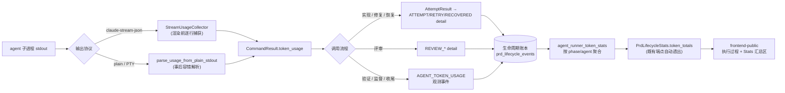

# PRD: Agent Token 用量统计（Agent Token Usage Statistics）

> ✅ **交付前置**：无，可立即开工。
> 结构化声明见 §8 Delivery Dependencies，**那里是唯一事实源**。

> ✅ **验收状态**：已验收 — 验收清单已全部完成（验收记录：PR #182 合并事件，见 §14 Change Log 2026-10-04 条目）。
> 本行是 §9 Acceptance Checklist 的投影，**那里是唯一事实源**。

> 本 PRD 采用两个高度：Part A（人审层，§1–4）供人快速理解与决策，不含实现机制；Part B（执行器层，§5–13）承载全部实现细节。三个投影块（交付前置横幅、验收状态横幅、功能一览）不是事实源。

## Feature Overview (功能一览)

> 本节是 §10 Functional Requirements 的投影；行为验收以 §1 行为样例表为准。

- **每次 agent 调用自动记录 token 用量**（FR-1、FR-2）：runner 发起的每一次 agent 子进程调用（实现、修复、评审、验证、监督、收尾等）完成后，自动从输出中提取官方 usage 统计并随结果对象流转，无需任何人工操作。
- **用量随生命周期事件落账**（FR-3、FR-4）：实现/修复类调用记入对应的执行尝试事件；评审调用记入评审事件；其余流程发出独立的用量观测事件，全部追加进既有生命周期账本，不新建数据库表。
- **观测不干扰既有语义**（FR-4）：用量数据只做旁路追加，不改变执行阶段推导、时长归属与主流程行为；账本写入失败只记日志，不阻断 runner。
- **执行过程时间线可见**（FR-7）：PRD 详情「执行过程」里，带用量的执行尝试/评审事件直接显示 token 数。
- **Stats 页汇总可见**（FR-5、FR-6、FR-8）：Stats 页的 PRD 生命周期卡片新增 Token 汇总区，按流程阶段与 agent 两组维度展示总量，数据来自既有读端点自动透出的新字段。
- **拿不到数据时明确降级**（FR-9）：agent 输出不含 usage（协议不支持、超时被杀、旧数据）时展示「—」并从汇总中排除，不做估算、不报错。

# Part A · 人审层 (Review Layer)

## 1. Introduction & Goals

### Problem Statement

keda 的全部智能工作由 headless agent CLI 子进程完成。每次调用结束时，agent 的流式输出末尾本就携带官方的 token 用量统计（输入、输出、缓存读写），但当前解析代码只提取回答文本，这些用量数据被直接丢弃。结果是：运营者无法回答"这个 PRD 的实现阶段花了多少 token、评审阶段花了多少"，也无法对比不同 agent 的消耗差异；在需要评估成本、排查异常消耗（如某次执行陷入循环）时完全没有数据可用。

### Interpretation (解读回显)

#### 行为样例

| 验证方式 | 输入 / 操作 | 期望观察到的结果 |
|---|---|---|
| 👀 人审 + 自动验证 | runner 用 claude 执行一个带实现任务的 Issue，跑完后打开该 PRD 详情的「执行过程」 | 对应的执行尝试事件上显示本次调用的 token 总量与明细（输入/输出/缓存读/缓存写），总量包含缓存命中部分，数值来自该次 agent 输出的官方 usage |
| 👀 人审 + 自动验证 | 打开 Stats 页的 PRD 生命周期卡片 | 出现 Token 汇总区：按流程阶段（执行/评审/…）与按 agent 两张小表展示总量（含缓存命中）与缓存命中率；数据与「执行过程」事件明细一致 |
| 🤖 自动验证 | 假 agent 输出末尾带固定 usage 的 result 事件，走真实执行循环与账本 | 执行尝试事件 detail 中出现 `token_usage`，各字段数值与假 agent 写入的完全一致，可经读端点 fresh 读回 |
| 🤖 自动验证 | agent 调用超时被杀（无 result 事件）或输出不含 usage 字段 | 该次调用不产生 token 数据：事件无用量显示（前端显「—」），主流程行为与现状完全一致，汇总中排除该条 |
| 🤖 自动验证 | 观测事件插入既有事件序列（如执行中段发出用量观测事件） | 当前阶段推导与各阶段时长归属与不插入时完全相同；观测事件不产生"等待"时长 |
| 🤖 自动验证 | 账本写入不可用（模拟存储故障） | runner 主流程照常完成，仅日志记录用量落账失败 |

> 此表的"当前、仍被接受"行为行将逐字成为 §7.6 的验收 oracle：修正表中一格，即修正对应验收标准。

#### 我默默定了这些

- 只记 token 数，**不记** `total_cost_usd` 美元成本（需求方已确认）。
- 用量缺失统一表达为"无数据"（None），不引入"未知/估算"等额外状态枚举；前端统一显示「—」。
- 不新增数据库表、不做 schema 迁移：用量挂在既有生命周期事件的自由 detail 字段里。
- 每次子进程调用是一条用量记录（最小粒度 = 单次 agent 调用）；同一次调用的重试各记各的。
- 不采集 `num_turns`（轮次数），需要时未来再加。
- 验证（verifier）、监督（supervisor）、收尾（closeout）等没有现成对齐事件的流程，发一条新的用量观测事件（`AGENT_TOKEN_USAGE`），而不是为它们发明新的阶段事件。
- Stats 汇总同时给"按流程阶段"与"按 agent"两个分组视角。

#### 我理解为不做

- **不做历史数据回填**：功能上线前的旧 run 没有用量数据，保持无数据显示「—」，不试图补录。
- **不做全局/仓库级 token 总账与按天趋势报表**：Stats 汇总只在既有 PRD 生命周期卡片范围内；跨 PRD 全局视图是另一个需求。
- **不做基于 token 的预算、限额或熔断控制**：本 PRD 只做记录与展示，不消费数据做决策。

#### 解读边界（读作 X，而非 Y）

本 PRD 读作：**为 runner 发起的每一次真实 agent 子进程调用采集官方 usage 数据，追加式持久化到既有生命周期账本，并在「执行过程」时间线与 Stats 页两处展示**。不是：本地自行估算 token（按字符数折算之类）；不是采集 prompt 内容或回答文本本身；不是新建独立的指标存储体系。数据只增不改：用量记录一旦落账不随重试、恢复或归档被改写；既有事件的类型语义、阶段推导规则、时长归属规则均不变。兼容性承诺：既有读端点只增字段不删改字段，旧客户端可忽略新字段；旧 run 的无用量事件照常展示。

### What The User Gets

运营者在 console dashboard 上获得每个 PRD 的 token 消耗可见性：执行过程时间线上每条执行尝试/评审事件旁能看到这次调用花了多少 token；Stats 页能看到一个 PRD 按流程阶段和按 agent 分组的 token 总量。数据完全来自 agent 自报的官方统计，无需配置、无需额外开关，对 runner 既有行为零影响。

### Measurable Objectives

- 带实现的 Issue 执行完成后，其执行尝试事件的 detail 中存在数值正确的 `token_usage`（与该次 agent 输出的 usage 一致），可经既有读端点读回。
- 评审、验证、监督等每类 agent 调用流程都有对应的用量落点（事件 detail 或观测事件），无遗漏入口。
- 插入用量观测事件前后，生命周期阶段推导与时长归属结果不变（回归断言）。
- Stats 端点响应包含按阶段与按 agent 的 token 汇总字段（含总量口径），且等于事件明细之和（缺失条目排除）。
- agent 输出无 usage 时：采集结果为"无数据"，主流程、事件写入、页面渲染均不报错。

## 2. Human Review Map (介入与风险地图)

### 决策一：Token 的记录与汇总口径

推荐：以**单次 agent 调用**为最小记录单位——同一次执行尝试里的多轮内部对话只产生一条合计用量（agent result 事件自带的 usage 本就是该次会话的累计值）；Stats 页按"流程阶段 × agent"两个视角汇总。**总量按"实际处理量"口径，把缓存命中算进去**：Anthropic 的 usage 语义里 `input_tokens` 本身不含缓存部分，因此输入侧实际处理量 = input_tokens + 缓存读 + 缓存写，总量 = 输入侧实际处理量 + 输出。同时缓存读/缓存写保留独立明细列——它们计费权重不同（读约为基础输入价的零头、写略有上浮），混进输入列会误读成本。不做计费加权折算（属成本口径，见 D-05）。agent 上报不含缓存字段时（部分 provider 可能如此），总量自动退化为 input + output。Stats 同时展示**缓存命中率** = 缓存命中 ÷ 输入侧实际处理量（input + 缓存读 + 缓存写），直观反映缓存省了多少；无缓存数据时不显示命中率而非显示 0%。

为什么需要确认：口径决定所有数字的含义。如果期望的是"每轮对话一条"或"缓存 token 折算进输入"，实现和数据读法都会不同，事后改口径意味着历史数据不可比。主要风险是口径与直觉不符导致数字被误读。

**请确认：** 按单次 agent 调用记录一条合计用量、总量含缓存命中（缓存另立明细列）、Stats 按阶段与 agent 两维汇总，这个口径符合你对"每个流程消耗多少 token"的预期吗？

**✅ 已确认（2026-10-03）：** 需求方确认该口径，含两点补充：缓存写入也计入总量（D-07）、Stats 展示缓存命中率。

**验收：** 假 agent 写入固定 usage 数值走完真实执行循环后，事件 detail 中的四个 token 字段与写入值逐字段一致，总量字段等于四项之和；Stats 汇总（含总量）等于事件明细之和（缺失条目排除）。

### 决策二：拿不到 usage 时的降级方式

推荐：agent 输出不含 usage（协议不支持、超时被杀）或 usage 形状异常时，一律记为"无数据"：事件不带用量、前端显示「—」、汇总排除该条；**不做任何估算**。初期 codex/kimi/pi 等 agent 是否自报 usage 尚未实测，大概率存在一段"部分 agent 无数据"的窗口期。

为什么需要确认：如果你期望"所有 agent 必须有数"，就需要为无数据的 agent 补采集方案（工作量与风险显著上升）；接受降级则当前范围内无此类工作。主要风险是页面上出现「—」被误判为功能故障。

**请确认：** 接受"拿不到就显示「—」、不做估算"的降级策略吗？

**✅ 已确认（2026-10-03）：** 需求方确认该降级策略。

**验收：** 输出畸形 usage（如字符串）或无 usage 的假 agent 走真实执行循环后，该次 attempt 正常完成、事件无 token 数据、页面不报错。

### 自动门禁，不需要逐项人工审阅

采集提取函数的解析正确性（含缓存字段、缺字段容错、非 result 行忽略）、观测事件不污染阶段推导与时长归属、聚合"缺失排除"口径、端点新字段形状、触碰文件行数红线、`just lint` 与全量测试——全部由单元/集成测试与既有 CI 门禁覆盖，§7.6 逐条定义了能区分失败与否的断言。

### 本次明确不涉及

无数据库结构变更（不新建表、不迁移 schema，复用事件 detail 自由字段）；无外部 API 合同破坏性变更（既有端点只增字段）；无新增依赖。

## 3. Usage And Impact After Implementation

### [运营者 / Operator]

进入 console dashboard 的 Stats 页：PRD 生命周期卡片下方出现 Token 汇总区，按流程阶段与按 agent 两张小表展示总量。打开某 PRD 详情的「执行过程」：执行尝试/评审事件行上出现 token 数；无数据的旧事件显示「—」。既有操作（启动 run、查看 Roadmap、看执行过程）完全不变。

### [开发者 / Developer]

既有生命周期读端点的响应新增 `token_totals` 等只读字段（dataclass 序列化自动透出），旧字段与语义不变；前端 `console.ts` 类型同步扩展。不新增端点、不改变调用方式。

### [系统自身 / runner 流程]

执行循环、重试、恢复、评审、验证等流程的行为与时序不变；用量采集与落账是旁路追加，写入失败仅记日志。

### Impact On Existing Behavior

向后兼容：既有端点响应只增字段；既有事件不回填、不重写，旧 run 的执行过程照常渲染（用量位置显示「—」）；无新增配置项与开关，功能随代码生效，无灰度问题。

## 4. Requirement Shape

- **Actor**：runner（采集与落账）、运营者（消费展示）、开发者（端点消费者）。
- **Trigger**：每次 agent 子进程调用返回（正常结束或可解析出 result 时）；以及运营者打开「执行过程」/Stats 页。
- **Expected behavior**：从输出提取官方 usage（流式路径边流边捕获、plain 路径事后容错解析），随结果对象流转，挂入对应生命周期事件 detail 或发独立观测事件；聚合按阶段与 agent 汇总并经既有端点透出；前端两处展示；无数据时全程降级不报错。
- **Scope boundary**：仅覆盖 runner 内经统一执行入口发起的 agent 调用；不做回填、不做全局报表、不做预算控制、不记美元成本。

# Part B · 执行器层 (Build Layer)

## 5. Repository Context And Architecture Fit

### 现状与既有路径

- 全部 LLM 调用走 headless agent CLI 子进程，唯一执行咽喉点是 `run_agent_with_prompt`（`src/backend/core/use_cases/run_agent_once.py`），约 10 处调用方：实现/修复、执行循环、评审（`agent_review.py`）、修复（`agent_review_repair.py`）、验证（`run_verifier_agent.py`）、监督（`pr_supervisor.py` / `pr_supervisor_repair.py`）、收尾（`agent_runner_closeout.py`）、worktree 分支准备（`agent_runner_worktree_branch.py`）、验证恢复（`agent_runner_verification_recovery.py`）。
- Claude 系 stream-json 输出的 `result` 事件自带 `usage`（`input_tokens` / `cache_read_input_tokens` / `cache_creation_input_tokens` / `output_tokens`）；当前解析只取文本：流式渲染层（`infrastructure/process_runner.py` 的 `ClaudeStreamRenderer`）与响应提取（`run_agent_once.py` 的 `extract_agent_response_text`）都丢弃 usage。
- 生命周期账本（已交付基础设施）：`core/use_cases/agent_runner_lifecycle.py` 定义闭集事件类型与阶段推导；`infrastructure/persistence/console_store.py` 持久化（SQLite，schema v5，`prd_lifecycle_runs` / `prd_lifecycle_events` 两表，事件 `detail_json` 为自由 dict）；读端点 `GET /agent-runner/console/stats/prd-lifecycle` 与 `GET /agent-runner/roadmap/prds/{path}/lifecycle`；账本写入走旁路（`_safe_store_call` 模式，失败不阻断主流程）。
- attempt 事件写入点在 `agent_runner_orchestration_runtime.py` 的 `_on_attempt_recorded`（attempt_detail dict），经 `on_attempt_recorded` 回调模式接入执行循环。
- 行数红线：`process_runner.py` 931 行、`console_store.py` 920 行，逼近 CI 1000 非空行硬限——**新逻辑必须放新模块**，既有文件只做最小挂接。

### Existing Path / Reuse Candidates / Constraints

- **Existing Path**：子进程执行（`process_runner.run`）→ `CommandResult` → 执行循环/各 use_case → 生命周期事件落账 → 读端点 → 前端。用量数据沿这条既有管道流转，不新开管道。
- **Reuse Candidates**：`record_lifecycle_event`（落账）、`_safe_store_call`（旁路容错）、`on_*_recorded` 回调模式、dataclass 序列化端点、`formatLifecycleDetail`（前端事件明细通用渲染）。
- **Architecture Constraints**：四层依赖 api→core→engines→infrastructure；`CommandResult` 在 `core/shared/models/agent_runner.py` 与 `infrastructure/process_runner.py` 存在镜像 dataclass 契约，字段必须同步；事件类型是闭集枚举，新增必须同步 `_EVENT_PHASE` 并处理阶段/时长推导。

### Frontend Impact

frontend-public（Next.js console dashboard）受影响：`frontend-public/lib/api/console.ts`（类型同步）、`frontend-public/components/roadmap/prd-lifecycle-view.tsx`（事件行 token 展示）、`frontend-public/app/(app)/app/stats/page.tsx`（Token 汇总区）。`frontend-admin/` 为无关模板，不触碰。

### Existing PRD Relationship

- 已归档 `P1-FEAT-20260921-161621-prd-lifecycle-observability.md`（PR #153）交付了生命周期账本与两处读端点——本 PRD 的存储与读路径直接复用它，是其数据维度的扩展。
- 已归档 `P1-FEAT-20260918-110027-lifecycle-agent-matrix.md`（PR #147）与本 PRD 无 TOML/矩阵交集。
- `tasks/pending/` 现存六个 PRD（logging-config-robustness、tauri-desktop-shell、roadmap-prd-cicd-monitor-auto-repair、blocked-draft-pr-validation-failure、agent-model-preset-switching、iar-agent-machine-contract）均与本 PRD 无重复、无前置关系，可独立执行。

## 6. Recommendation

### Recommended Approach

**沿既有事件管道做最小扩展**：在子进程执行层边流捕获 usage 挂到 `CommandResult` 新字段；经既有 attempt/评审事件 detail 与一条新观测事件落账；新增一个小聚合模块供给 `PrdLifecycleStats` 新字段；前端两处展示。不新建表、不做 schema 迁移、不加服务层。

为什么不建新表（schema v6）：账本事件量级小（单 PRD 数十事件），扫描 detail_json 聚合的成本可忽略；`console_store.py` 已 920 行近红线，迁移与双写复杂度不成比例；detail 自由字段正是为此类扩展预留的位。为什么不全走"事后对 stdout 重解析"：流式路径的 stdout 在 `collect_stdout` 下收集的是渲染后文本，重解析会静默丢行（`extract_agent_response_text` 文档字符串已警告）；只有原始事件行经过的中继层捕获才可靠，plain/PTY 路径因 stdout 未渲染才允许事后解析作为降级。为什么不引入 metrics/成本服务：单仓库单 runner 场景，无第二消费方，属冗余抽象。

### Proposed Solution Summary (实现机制)

核心机制：**在基础设施子进程执行层捕获、沿核心既有结果对象与事件管道流转、在展示层聚合呈现**。数据由 agent 输出自报，系统只被动解析、不推断不估算。挂接点：`process_runner.run` 的 claude 流式路径在渲染前逐行捕获（新模块 `infrastructure/agent_stream_usage.py` 提供提取函数与收集器），plain/PTY 路径对未渲染 stdout 事后容错解析；`CommandResult`（core 与 infrastructure 两份镜像同步）新增 `token_usage: TokenUsage | None`。执行循环构建 `AttemptResult` 时带上用量，`_on_attempt_recorded` 把它写进 ATTEMPT/RETRY/RECOVERED 事件 detail；评审流程把用量附加进 REVIEW_* 事件 detail；验证/监督/收尾等无对齐事件的流程经回调发新的观测事件 `AGENT_TOKEN_USAGE`（detail: agent/flow/token_usage），该事件类型在阶段推导与时长归属中被过滤。聚合由新模块 `core/use_cases/agent_runner_token_stats.py` 完成，结果并入 `PrdLifecycleStats`，既有端点 dataclass 序列化自动透出、端点代码零改动。复杂度有意规避：不新建存储、不并行第二套抽象、不改既有事件类型语义与状态机。

### Alternatives Considered

- **新表 `agent_token_usage`（schema v6）**：聚合查询更直接，但引入迁移、双写与近红线文件的改动；当前规模下收益不成比例。若未来事件量大到扫描聚合成为瓶颈，可作为演进方向。
- **全部流程统一发观测事件（不改 attempt/评审 detail）**：实现更省事，但"执行尝试花了多少 token"与 attempt 事件分离，时间线阅读需要跳转对齐，违背"执行过程可见"的目标。已否。

## 7. Implementation Guide

> This section is a living implementation guide based on current repository analysis. If implementation discovers additional affected files, hidden dependencies, edge cases, or a better path, update this PRD before proceeding.

### Core Logic

数据与控制流（自下游向上游）：

1. **捕获**：`process_runner.run` 的 claude 流式路径（`run_filtered_claude_stream`）在 `renderer.render_line` 之前逐行把原始事件行交给 `StreamUsageCollector`（新模块 `agent_stream_usage.py`）：识别 `type=="result"` 事件，取 `usage` 四字段构造 `TokenUsage`；一行多事件/非 JSON 行/缺 usage 均静默跳过。plain/PTY 路径：子进程返回后对未渲染 stdout 逐行容错解析（同一提取函数）。采集结果写入 `CommandResult.token_usage`；拿不到即 `None`。
2. **流转**：执行循环把 `CommandResult.token_usage` 带入 `AttemptResult`（新字段）；评审流程从 `review_result` 取用；验证/监督/收尾等直接从各自持有的 `CommandResult` 取用。
3. **落账**：`_on_attempt_recorded` 的 attempt_detail 增加嵌套 `token_usage` dict；评审事件 detail 同样附加；无对齐事件的流程经 `on_agent_usage` 回调（自 orchestration_runtime 下传，仿既有 `on_validation` 回调模式）发 `AGENT_TOKEN_USAGE` 观测事件，写入走 `_safe_store_call` 容错。
4. **防污染**：`LifecycleEventType` 增加 `AGENT_TOKEN_USAGE` 并登记进新的 `_OBSERVATION_ONLY_EVENT_TYPES`；`classify_durations` 与 `derive_current_phase` 跳过观测事件（推导结果与无观测事件时逐位相同）。
5. **聚合**：`agent_runner_token_stats.py` 扫描窗口内事件（ATTEMPT/RETRY/RECOVERED detail + AGENT_TOKEN_USAGE detail），按 phase 与 agent 汇总四项 token 及总量（总量 = 四项之和，含缓存命中）；无用量事件排除。`PrdLifecycleStats` 增 `token_totals` 字段，两个既有读端点自动透出。
6. **展示**：前端 `console.ts` 类型扩展；`prd-lifecycle-view.tsx` 事件明细对带 `token_usage` 的事件渲染友好格式（如 `tokens=1.2k→8k（缓存读 0.8k）`），缺失显示「—」；Stats 页 lifecycle 卡片内新增 Token 汇总区（按阶段/按 agent 两张小表，`data-testid="stats-token-usage"`）。

### Change Impact Tree

```text
.
├── Infrastructure
│   ├── src/backend/infrastructure/agent_stream_usage.py
│   │   [新增]
│   │   【总结】usage 提取纯函数 + 流式收集器 + plain 路径事后容错解析，全部新逻辑在此模块
│   │
│   └── src/backend/infrastructure/process_runner.py
│       [修改]
│       【总结】最小挂接：run() 挂收集器、镜像 CommandResult 加 token_usage 字段并赋值
│
├── Domain (core)
│   ├── src/backend/core/shared/models/agent_runner.py
│   │   [修改]
│   │   【总结】新增 TokenUsage 冻结 dataclass（input/output/cache_read/cache_creation 四字段 + total_tokens property = 四字段之和，含缓存）；CommandResult、AttemptResult、SupervisorActionResult 加 token_usage 可选字段
│   │
│   ├── src/backend/core/shared/models/roadmap.py
│   │   [修改]
│   │   【总结】新增 TokenUsageTotals / TokenUsageStats DTO；PrdLifecycleStats 加 token_usage 字段
│   │
│   ├── src/backend/core/use_cases/agent_runner_lifecycle.py
│   │   [修改]
│   │   【总结】事件闭集加 AGENT_TOKEN_USAGE；观测事件过滤集（阶段推导与时长归属跳过）；新增 build_attempt_event_detail 作为 attempt detail 唯一事实源；stats 聚合接线
│   │
│   ├── src/backend/core/use_cases/agent_runner_token_stats.py
│   │   [新增]
│   │   【总结】按 flow/agent 扫描事件 detail 聚合 token 的纯函数模块（含命中率输入侧口径）
│   │
│   ├── src/backend/core/use_cases/agent_runner_attempt.py
│   │   [修改]
│   │   【总结】attempt 结果构建时接收并携带 token_usage
│   │
│   ├── src/backend/core/use_cases/run_agent_execution_loop.py
│   │   [修改]
│   │   【总结】捕获此前被丢弃的 agent 返回值回填 attempt 上下文；新增 _emit_agent_usage 旁路回调（fix/closeout/verify 三处发射点）
│   │
│   ├── src/backend/core/use_cases/run_agent_once.py
│   │   [修改]
│   │   【总结】run_agent_until_committed 包装器透传 on_agent_usage 回调
│   │
│   ├── src/backend/core/use_cases/agent_runner_issue_handlers.py
│   │   [修改]
│   │   【总结】ready 与 blocked_resolution 两个 handler 签名加 on_agent_usage 并透传
│   │
│   ├── src/backend/core/use_cases/agent_runner_orchestrate.py
│   │   [修改]
│   │   【总结】run_issue_with_agent_fallback 加 on_agent_usage 参数并向 process_for_agent 透传
│   │
│   ├── src/backend/core/use_cases/agent_runner_orchestration_runtime.py
│   │   [修改]
│   │   【总结】attempt_detail 改用 build_attempt_event_detail（含 token_usage）；新增 _emit_agent_usage_event 观测事件落账闭包并注入两条 fallback 调用
│   │
│   ├── src/backend/core/use_cases/review_once.py
│   │   [修改]
│   │   【总结】新增 _record_agent_usage_event；supervisor cycle 后把用量落成观测事件
│   │
│   ├── src/backend/core/use_cases/pr_supervisor.py
│   │   [修改]
│   │   【总结】supervisor cycle 结束后把 agent 调用用量回填进 SupervisorActionResult
│   │
│   └── src/backend/core/use_cases/run_verifier_agent.py
│       [修改]
│       【总结】ValidationVerdict 加 agent/token_usage 字段；verifier 运行后回填真实 agent 名与用量
│
├── API（零代码改动，仅断言验证）
│   └── src/backend/api/routes/agent_runner_console.py / src/backend/api/routes/agent_runner_roadmap.py
│       [零改动]
│       【总结】dataclass 递归序列化自动透出 token_usage；用端点测试断言新字段存在
│
├── Frontend (frontend-public)
│   ├── frontend-public/lib/api/types.ts
│   │   [修改]
│   │   【总结】新增 TokenUsageTotals / TokenUsageStats 类型；PrdLifecycleStats 加 token_usage
│   │
│   ├── frontend-public/components/roadmap/prd-lifecycle-view.tsx
│   │   [修改]
│   │   【总结】事件明细对带用量的 attempt/观测事件渲染友好 token 格式，缺失显「—」
│   │
│   └── frontend-public/app/(app)/app/stats/page.tsx
│       [修改]
│       【总结】PRD 生命周期卡片内新增 Token 汇总区（按流程/按 agent 两张小表 + 命中率）
│
├── Tests
│   ├── tests/test_agent_stream_usage.py
│   │   [新增]
│   │   【总结】提取/收集器单测：四字段、缺 usage→None、非 result 行忽略、畸形 usage 容错、plain 交错输出、SubprocessRunner 双路径
│   │
│   ├── tests/test_agent_token_stats.py
│   │   [新增]
│   │   【总结】聚合口径单测：attempt→implement 归组、观测事件按 flow、缺失排除、畸形容错、总量=四项之和
│   │
│   ├── tests/test_agent_token_usage_flow.py
│   │   [新增]
│   │   【总结】RV 全链路：假 agent（claude 信封 result）→ 真 SubprocessRunner 执行循环 → 账本 attempt detail → fresh store 读回与 Stats 聚合；含无 usage/畸形 usage 降级负控
│   │
│   └── tests/test_prd_lifecycle.py
│       [修改]
│       【总结】观测事件不污染相位与时长归属的回归断言；Stats 聚合口径；HTTP 端点透出 token_usage 断言
│
└── Docs
    └── docs/guides/agent-runner.md
        [修改]
        【总结】生命周期账本章节补 agent_token_usage 事件闭集、Token 用量统计口径与 stats 端点新字段说明
```

实施期修订说明：`agent_review.py` / `pr_supervisor_repair.py` / `agent_runner_worktree_branch.py` / `agent_runner_verification_recovery.py` / `agent_runner_closeout.py` 最终未触碰（观测事件经执行循环回调覆盖 closeout/fix/verify；pre-PR 评审等低频路径延后，见 §12 Follow-up）；`agent_runner_issue_handlers.py` / `agent_runner_orchestrate.py` / `run_agent_once.py` / `run_verifier_agent.py` / `agent_runner_attempt.py` 因回调贯穿新增触碰。以上文件清单是起点而非穷尽集——以 Executor Drift Guard 的搜索命令为准。

### Risk Classification Register

| 变更点 | 层 | 等级 | 决定性维度/理由 | 介入 | oracle/门禁 |
|---|---|---|---|---|---|
| TokenUsage 模型与 CommandResult/AttemptResult 双镜像加字段 | core+infrastructure | R1 | 普通行为变更，测试可判；镜像不同步有 rg 断言兜底 | executor + 自动门禁 | rv-2；镜像同步 rg 断言 |
| 流式采集 StreamUsageCollector 挂接 | infrastructure | R2 | 数据完整性影响所有 agent 调用面（blast radius 全调用路径） | executor + 强 oracle | rv-1、rv-2 |
| plain/PTY 事后容错解析 | infrastructure | R1 | 单点行为，失败即 None 降级 | executor + 自动门禁 | rv-2 |
| 事件闭集加 AGENT_TOKEN_USAGE + 相位/时长过滤 | core（orchestration 固定区） | R2 | 阶段推导与时长归属是持久派生状态，出错影响既有展示 | 人审（决策一口径）+ oracle | rv-3 |
| attempt/评审事件 detail 扩展 | core | R1 | 附加字段，既有语义不变 | executor + 自动门禁 | rv-1 |
| 验证/监督/收尾观测事件挂接 | core | R1 | 旁路新增，容错写入 | executor + 自动门禁 | rv-1、rv-3 |
| 聚合模块 token_stats | core | R2 | 汇总口径正确性决定展示数据可信度 | 人审（决策一口径） | rv-4 |
| 读端点 DTO 扩展 | api | R1 | 只增字段向后兼容 | executor + 自动门禁 | 端点形状断言 |
| 前端三处展示 | frontend-public | R1 | 展示层，缺失降级有测试 | executor + 自动门禁 | rv-5、rv-6 |
| 缺失降级语义（None/「—」/汇总排除） | 全链 | R1 | 失败语义，需求方决策 D-03 确认 | 人审（决策二） | rv-6 |

人审项只有决策一与决策二两个（§2）；其余全部 executor + 自动门禁。

### Executor Drift Guard

实施前用以下搜索确认锚点与镜像面（输出文件列表是起点，非穷尽）：

```bash
rg -n "class CommandResult" src/backend        # 两份镜像 dataclass 的位置
rg -n "output_protocol" src/backend/infrastructure/process_runner.py
rg -n "class AttemptResult" src/backend/core/shared/models/agent_runner.py
rg -n "_make_attempt_result" src/backend/core/use_cases
rg -n "LifecycleEventType\." src/backend/core/use_cases/agent_runner_lifecycle.py
rg -n "classify_durations|derive_current_phase" src/backend/core/use_cases/agent_runner_lifecycle.py
rg -n "_on_attempt_recorded|on_attempt_recorded" src/backend/core/use_cases
rg -n "on_validation" src/backend/core/use_cases   # 回调下传模式的参照
```

- 若镜像 dataclass 数量与预期不符（发现第三份镜像），以搜索结果为准同步全部镜像。
- 触碰 `process_runner.py` / `console_store.py` 前先跑 `uv run python scripts/check_max_file_lines.py`（或 `just lint`）确认不越过 1000 非空行硬限；新逻辑一律放新模块。
- `agent_spec.py` 中"信封同形"注释涉及 qoder（run profile 复用 claude-stream-json 协议，免费获得采集）；codex/kimi 实际走 plain+PTY，usage 形状未实测，勿在实现里对 plain 路径假定 claude 字段形状——提取函数必须宽容。

### Flow or Architecture Diagram



### ER Diagram

No data model changes in this PRD.

### Realistic Validation Plan

```yaml
- id: rv-1
  behavior: 假 agent 输出末尾带固定 usage 的 result 事件，走真实执行循环后，执行尝试事件 detail 中 token_usage 各字段与写入值逐字段一致，且可经读端点 fresh 读回
  reviewer: verifier
  real_entry: "uv run pytest tests/test_agent_token_usage_flow.py -o addopts=\"\"（RV harness：假 agent 脚本 + 真 SubprocessRunner + 真执行循环，RV_WORK_ROOT 进程隔离）"
  expected: "ATTEMPT 事件 detail_json 含 token_usage 嵌套对象，input/output/cache_read/cache_creation 四字段与假 agent 写入值一致；fresh 新开 store 经读端点读回相同数值"
  mock_boundary: "被测边界（子进程执行→采集→attempt 落账链路）必须真实；仅 agent CLI 本身由输出可控的假脚本替代"
  tier: R2
  test_layer: e2e
  required_for_acceptance: true
  critical_value_source: "RV 假 agent 脚本写死在 result 事件里的 usage 数值（如 input=1200/output=340/cache_read=800/cache_creation=120）"
  must_cross: "假 agent 子进程 stdout → StreamUsageCollector → CommandResult.token_usage → AttemptResult → record_lifecycle_event detail_json → fresh 新开的读端点响应"
  forbidden_bypasses: "测试直插 store 绕过执行循环；直接调 record_lifecycle_event 伪造事件；单测手工构造 detail 断言自身"
  fresh_state_probe: "RV 结束后新开 store 连接经读端点读取并断言（不复用写入侧连接/对象）"
  final_tree_evidence: "对 src/backend 与 tests 的最后一次相关变更之后重跑本 oracle；证据文件随最终树重新采集"
  negative_control: "使用无 usage 字段的假 agent fixture 跑同一 harness（tests 侧 fixture 变体，不改产线代码）"
  expected_fail: "ATTEMPT 事件 detail 无 token_usage 键，断言红"

- id: rv-2
  behavior: usage 提取与收集器解析正确且宽容（含缓存字段、缺字段、非 result 行、畸形 usage、plain 交错输出）
  reviewer: verifier
  real_entry: "uv run pytest tests/test_agent_stream_usage.py tests/test_process_runner.py -o addopts=\"\""
  expected: "全部用例绿：result 事件四字段提取正确；无 usage→None；usage 为字符串等畸形值→None 不抛异常；非 result/非 JSON 行被忽略；plain 路径 stderr 交错不影响解析；CommandResult.token_usage 赋值正确"
  mock_boundary: "纯函数与执行器输出层，无需外部服务"
  tier: R1
  test_layer: unit
  required_for_acceptance: true

- id: rv-3
  behavior: 用量观测事件不改变生命周期阶段推导与时长归属
  reviewer: verifier
  real_entry: "uv run pytest tests/test_prd_lifecycle.py -o addopts=\"\""
  expected: "同一事件序列在插入/不插入 AGENT_TOKEN_USAGE 观测事件两种情况下，derive_current_phase 与 classify_durations 输出逐位相同；观测事件不产生 waiting 时长"
  mock_boundary: "内存 store 即可（既有 _store/_record 模式）；被测对象是纯推导函数"
  tier: R1
  test_layer: unit
  required_for_acceptance: true

- id: rv-4
  behavior: Token 汇总按阶段与 agent 正确聚合，缺失条目排除，端点透出新字段
  reviewer: verifier
  real_entry: "uv run pytest tests/test_agent_token_stats.py tests/test_agent_runner_console_api.py -o addopts=\"\""
  expected: "汇总值等于事件明细之和（按 phase 与 agent 两维），总量列等于四项之和，缓存命中率等于命中÷输入侧总量（含写入）；无用量事件不计入且不报错；空窗口返回零值结构；stats 端点响应含 token_totals 且形状与前端类型一致"
  mock_boundary: "聚合纯函数用内存 store；端点测试走既有 API 测试模式"
  tier: R1
  test_layer: integration
  required_for_acceptance: true

- id: rv-5
  behavior: 真实 console 入口下「执行过程」事件显示 token 数、Stats 页出现 Token 汇总区
  reviewer: human
  real_entry: "以隔离 IAR_CONFIG 启动 iar console（含 rv-1 产生的 RV 账本数据），浏览器打开 PRD 详情「执行过程」与 Stats 页"
  expected: "执行过程的执行尝试/评审事件行显示 token 数且数值与账本一致；Stats 页 lifecycle 卡片出现按阶段/按 agent 的 Token 汇总区"
  mock_boundary: "账本数据与页面渲染必须真实；登录态可用既有免登录验证方式，不mock 后端数据"
  tier: R2
  test_layer: manual
  required_for_acceptance: true
  presentation: "两张真实入口截图（执行过程事件行 + Stats 汇总区）存 tasks/evidence/<prd-stem>/，嵌入 9.1 与证据报告；自检：Stats 汇总区『实现』阶段的总输入 token 应等于执行过程里对应 attempt 事件 token 之和"
  critical_value_source: "rv-1 账本中的 token 数值（同一 RV 会话数据）"
  must_cross: "SQLite 账本 → console 读端点 → 前端 fetch/类型 → 页面渲染 → 屏幕"
  forbidden_bypasses: "组件预览页；手工注入前端状态；改前端 mock 数据；直接渲染组件截图"
  fresh_state_probe: "硬刷新页面重新拉取端点后再截图"
  final_tree_evidence: "前端或后端最后一次相关变更后重新截图"
  negative_control: "实施前（或回退前端改动后）打开同一页面基线截图"
  expected_fail: "基线页面的事件行与 Stats 卡片均无任何 token 内容，证明展示确由本次改动带来"

- id: rv-6
  behavior: agent 输出无 usage 或 usage 畸形时全程降级：事件无用量、主流程正常、页面显「—」不报错
  reviewer: verifier
  real_entry: "uv run pytest tests/test_agent_token_usage_flow.py -o addopts=\"\"（无 usage 与畸形 usage 两组 fixture）"
  expected: "两次执行 attempt 均正常完成（exit 正常、事件照常落账）；detail 无 token_usage；聚合排除且不抛异常"
  mock_boundary: "被测边界为采集容错与落账链路，必须真实；agent 由 fixture 替代"
  tier: R1
  test_layer: e2e
  required_for_acceptance: true
  negative_control: "fixture 输出 \"usage\": \"oops\"（字符串）；实现若假定 usage 为对象直接取整型字段将抛 TypeError 使 attempt 失败"
  expected_fail: "红 = attempt 流程抛异常中断，或 detail 中出现非 None 的 token_usage"
```

失败排查提示：RV 断言先查假 agent 输出是否真的进了 harness 的 stdout 捕获（`RV_WORK_ROOT` 下的原始输出文件），再查收集器是否被正确挂进 `run()` 的流式/plain 两条路径——最常见失败是只挂了一条路径。

### Low-Fidelity Prototype

前端改动为既有页面上的受限数据展示，采用聚焦低保真目标态（ASCII 线框），验收关键状态三个：执行过程事件行带 token、Stats 汇总区、缺失态「—」。

```text
Stats 页 · PRD 生命周期卡片内新增：
┌ Token 用量（按阶段，总量含缓存） ───────────────────────┐
│ 阶段        总量     输入    输出   缓存读   命中率     │
│ 实现      23.5k   12.4k   3.1k    8.0k    39%        │
│ 评审       3.7k    2.1k   0.4k    1.2k    36%        │
│ 验证         —      —      —       —       —         │  ← 无数据显示「—」
└─────────────────────────────────────────────────────────┘
┌ Token 用量（按 agent） ─────────────────────────────────┐
│ claude   27.2k   14.5k   3.5k    9.2k    39%           │
└─────────────────────────────────────────────────────────┘

执行过程 · 事件行 detail 区新增：
  attempt #1 · claude · 42s
    tokens=2.5k（输入 1.2k · 输出 340 · 缓存读 800 · 缓存写 120）
  attempt #2 · codex
    tokens=—                            ← 无用量降级
```

### Interactive Prototype Change Log

No interactive prototype file changes in this PRD.

### External Validation

No external validation required; repository evidence was sufficient.

## 8. Delivery Dependencies

### Delivery Dependencies

- Group: none
- Depends on tasks/issues:
  - none
- Gate type: none
- Notes: 复用已交付的生命周期账本基础设施（已归档 PRD `P1-FEAT-20260921-161621-prd-lifecycle-observability.md`，代码已在主干），无未完成的 sequencing 依赖。

## 9. Acceptance Checklist

### 9.1 人读呈递区（Human Review Surface）

| 观察点 | 呈递物（交付时填路径） | ~10 秒自检 |
|---|---|---|
| 「执行过程」事件行显示 token 数（rv-5） | ✅ 已采集：`tasks/evidence/P1-FEAT-20260930-212702-agent-token-usage-stats/rv-5-lifecycle-token.png`（时间线含 Token 用量事件）+ `rv-5-event-detail-token.png`（attempt 抽屉 token_usage 四字段） | 抽屉中 `token_usage` 为 `{"cache_creation_input_tokens":120,"cache_read_input_tokens":800,"input_tokens":1200,"output_tokens":340}`，与种子值逐字段一致 |
| Stats 页 Token 汇总区（rv-5） | ✅ 已采集：`tasks/evidence/P1-FEAT-20260930-212702-agent-token-usage-stats/rv-5-stats-token.png` | 「实现」行 input=1.2k 与执行过程 attempt 事件 `input_tokens:1200` 一致；按流程/按 agent 两表 + 命中率齐备 |

截图为 gitignored 原始产物，随证据 orphan 分支发布并在 PR 中链接；oracle 运行记录见同目录 `rv-report.md`。

注：rv-1/2/3/4/6（采集入库全链路、解析容错、相位不污染、聚合口径、缺失降级）为 `reviewer: verifier` 组，证据由独立 verifier 审查，不在此逐条展示，仅在失败时呈递。

### 9.2 Acceptance Evidence Package

**Human-Confirmed**

（三项均以 PR #182 合并事件为验收记录勾选——2026-10-04 由 ZataZhang squash merge `6fd39c63`，见 §14 Change Log）
- [x] 决策一（记录与汇总口径）已获人工确认，对应 §2 决策一与 rv-1/rv-5 证据
- [x] 决策二（缺失降级「—」不做估算）已获人工确认，对应 §2 决策二与 rv-6 证据
- [x] 9.1 人读呈递区已由人工过目（三张截图与自检结论）

**Architecture Acceptance**
- [x] `src/backend/infrastructure/agent_stream_usage.py`、`src/backend/core/use_cases/agent_runner_token_stats.py` 存在且含声明的函数/收集器；`rg -n "class CommandResult" src/backend` 确认全部镜像 dataclass 均含 `token_usage` 字段（verifier 报告 §Architecture）
- [x] `AGENT_TOKEN_USAGE` 已入事件闭集，且 `classify_durations` / `derive_current_phase` 对其过滤（rv-3 回归断言：`tests/test_prd_lifecycle.py::test_observation_events_do_not_change_*`）
- [x] 触碰文件均未超 1000 非空行（verifier 实跑 `check_max_file_lines.py` 通过）

**Behavior Acceptance**
- [x] rv-1 全链路：`tests/test_agent_token_usage_flow.py::test_fake_agent_usage_reaches_ledger_and_stats`（四字段逐字段一致 + fresh store 读回 + Stats 聚合，verifier 实跑通过）
- [x] rv-2 解析容错：`tests/test_agent_stream_usage.py`（16 例，verifier 实跑通过）
- [x] rv-4 聚合与端点：`tests/test_agent_token_stats.py` + `tests/test_prd_lifecycle.py::test_stats_endpoint_transparently_exposes_token_usage`
- [x] rv-6 降级负控：`tests/test_agent_token_usage_flow.py::test_missing_usage_* / test_malformed_usage_*`（无 usage 与字符串 usage 两组 fixture）

**Frontend Acceptance**
- [x] `frontend-public/lib/api/types.ts` 类型含 TokenUsageTotals/TokenUsageStats；`stats/page.tsx` 汇总区带 `data-testid="stats-token-usage"`；`prd-lifecycle-view.tsx` 事件行 token 格式与「—」降级

**Documentation Acceptance**
- [x] `docs/guides/agent-runner.md` 生命周期章节已补 `agent_token_usage` 事件闭集、Token 用量口径与 stats 端点字段说明（无新增文档页，mkdocs.yml 无需改动）

**Validation Acceptance**
- [x] rv-5 真实入口完成：三张截图 + 自检（见 9.1），证据绑定 verified tree `ddb6a329`（record 路径排除口径）
- [x] `CI=true just test all` 全绿（2747 passed / 1 skipped，两次复跑一致）

**Delivery Readiness**
- [x] 推荐方案（§6）完整落地，实施期收窄已按 living statement 记录（§12 Follow-up、Change Log）
- [x] 完成消息携带 9.1 呈递内容；PR 证据评论（稳定 marker）含同等内容与证据分支链接
- [x] [~] 独立 verifier 审查通过 — runner-owned gate: 独立 verifier 审查（PASS-with-notes，0 HIGH / 1 MEDIUM，报告在证据目录）
- [x] [~] PRD 归档到 `tasks/archive/` — runner-owned gate: 归档流程（随本交付 PR 归档，横幅 🧍 待人工验收）

## 10. Functional Requirements

- **FR-1**：对 runner 经统一执行入口发起的每次 agent 子进程调用，从其输出提取官方 usage（输入/输出/缓存读/缓存写四项）；流式协议在原始事件行渲染前捕获，plain/PTY 协议对未渲染 stdout 事后容错解析；解析失败、缺字段或畸形 usage 一律得"无数据"，不抛异常。
- **FR-2**：`TokenUsage` 作为冻结数据模型随 `CommandResult`（全部镜像同步）与 `AttemptResult` 流转；缺失以 None 表达。
- **FR-3**：实现/修复/恢复类调用产生的用量记入对应 ATTEMPT/RETRY/RECOVERED 事件 detail（嵌套 `token_usage`）；detail 形状以 :func:`build_attempt_event_detail` 为唯一事实源。
- **FR-4**：无对齐生命周期事件、但在执行循环内发生的调用流程（验证 verifier、监督 supervise、修复 fix、收尾 closeout）经 `on_agent_usage` 回调发 `AGENT_TOKEN_USAGE` 观测事件（detail 含 flow、agent、token_usage）；该事件不参与阶段推导与时长归属；所有用量落账走旁路容错，失败仅记日志。**实施期收窄**：pre-PR 评审、验证恢复、worktree 分支准备三条低频路径的观测事件挂接延后（usage 已在 `CommandResult.token_usage` 上，管道就绪，后续接 store 即可），见 §12。
- **FR-5**：新增聚合：按流程阶段与按 agent 两个维度汇总四项 token 及总量（总量 = input + output + 缓存读 + 缓存写，即实际处理量口径；缓存字段缺失时退化为 input + output），并计算缓存命中率（命中 ÷ 输入侧实际处理量；无缓存数据时为空）；排除无用量条目；空数据返回零值结构。
- **FR-6**：stats 生命周期读端点响应新增 `token_usage` 聚合字段（by_flow/by_agent）；roadmap 单 PRD 明细端点经既有 `events[].detail` 携带 token 数据（不加聚合字段）；既有字段与语义不变。
- **FR-7**：「执行过程」事件明细对带用量的执行尝试/评审事件渲染 token 总量与明细（总量含缓存命中）；无用量显示「—」。
- **FR-8**：Stats 页 PRD 生命周期卡片新增 Token 汇总区（按阶段/按 agent 两张小表，含总量列与缓存命中率），数据来自读端点新字段。
- **FR-9**：全链路降级语义一致：无数据不估算、不报错、不阻塞既有流程；旧 run 无用量数据照常渲染。

## 11. Non-Goals

- 不采集、不展示美元成本（`total_cost_usd`）。
- 不采集 `num_turns`、prompt/回答文本内容。
- 不回填历史 run 的用量数据。
- 不做跨 PRD 全局 token 总账、按天趋势报表。
- 不做基于 token 的预算、限额、熔断或告警。
- 不为无 usage 的 agent 新增采集通道（如接 SDK 重写调用方式）；待各 agent 实测后再议。
- 不改变既有生命周期事件类型语义、阶段推导规则、时长归属规则与账本 schema。

## 12. Risks And Follow-Ups

- **codex/kimi/pi 的 usage 形状未实测**（plain/PTY 输出）：降级策略已确认（FR-9），实测拿到形状后只需扩展提取函数。跟进：实施期真机各跑一次，抓 stdout 确认；拿不到则保持 None。
- **claude `result.usage` 的口径语义**（单次会话累计 vs 末轮单轮）：headless 一次调用一个 result 事件，"会话累计"恰是单次调用的正确总量，与决策一口径自洽；实施期真机核对一次即可关闭。
- **观测事件污染阶段推导/时长**：已在设计内用过滤集防御并有 rv-3 回归断言；若未来新增事件类型，须同步过滤集（Risk Register 已列 R2）。
- **行数红线**：`process_runner.py`（931 行）只做最小挂接；新逻辑全部进新模块；触碰前后跑 `check_max_file_lines.py`。
- **实施期收窄（Follow-up）**：pre-PR 评审（`agent_review.py`）、验证恢复（`agent_runner_verification_recovery.py`）、worktree 分支准备（`agent_runner_worktree_branch.py`）与 supervisor 修复 agent 的观测事件挂接延后——这些路径深处拿不到账本 store，接通需新增回调贯穿（4–5 跳），价值边际低于实现/验证/评审主干。它们的 usage 已随 `CommandResult.token_usage` 可得，后续接通时只差一处观测事件写入。

## 13. Decision Log

| ID | 决策问题 | Chosen | Rejected | Rationale |
|---|---|---|---|---|
| D-01 | 用量存哪里 | 挂既有事件 `detail_json`，不加表不迁移 schema | 新表 `agent_token_usage`（schema v6） | 事件量级小、扫描聚合成本可忽略，且 `console_store.py` 920 行逼近 CI 硬限，迁移复杂度不成比例 |
| D-02 | 采集时机 | 流式路径渲染前逐行捕获 + plain 路径事后容错解析 | 全部事后对 stdout 重解析 | 流式 `collect_stdout` 收集的是渲染文本，事后重解析会静默丢行（`extract_agent_response_text` 已警告）；只有 plain 路径的 stdout 未渲染才可事后解析 |
| D-03 | 无 usage 的表达 | 统一 None（前端「—」、汇总排除、不估算） | 引入"未知/估算"状态枚举或字符数估算 | 需求方确认接受降级；估算会制造不可信数据 |
| D-04 | 无对齐事件的落点 | 单一新观测事件 `AGENT_TOKEN_USAGE` | 为每类流程发明新阶段事件，或全部塞进 attempt detail | 观测事件最小侵入且经过滤集防污染；逐流程发明事件会膨胀闭集枚举 |
| D-05 | 采集内容 | 只记四项 token，不记 `total_cost_usd`/`num_turns` | 一并记录成本与轮次 | 需求方明确只记 token；成本口径涉及汇率与定价表，属独立需求 |
| D-06 | 展示位置 | 「执行过程」事件行 + Stats 页汇总区（阶段/agent 两维） | 仅后端落账；或仅单一页面 | 需求方确认两处都要；两维汇总分别回答"哪一步贵"与"哪个 agent 贵" |
| D-07 | 总量口径是否含缓存 | 总量 = input + output + 缓存读 + 缓存写（实际处理量口径，写入计入总量），缓存保留独立明细列，并展示缓存命中率（命中 ÷ 输入侧总量） | 总量只算 input/output 不含缓存；或按计费权重加权折算 | 需求方明确要求缓存命中计入（2026-10-03 确认写入也计入、要命中率）；claude usage 原生携带缓存字段，主方案直接可实现；缓存列保留是因其计费权重与基础输入价不同，混入会误读成本；计费加权属成本口径，已被 D-05 排除；缓存字段缺失时总量自动退化为 input + output |

### Final Reconciliation

- Interpretation: confirmed — 实现覆盖 §1 行为样例全部六行；样例行与 oracle 的映射在 rv-1..rv-6 中逐条成立
- Public behavior and contracts: corrected — FR-6 措辞按 verifier MEDIUM 修订（stats 端点新增聚合字段；roadmap 明细端点经 events[].detail 携带，不加聚合字段）
- Related PRD status: confirmed — 生命周期账本（PR #153）为本 PRD 的存储与读路径基座，实施中如约复用
- Requirements and risks: corrected — FR-3/FR-4 按实施期收窄修订（见 Change Log 2026-10-03 实施期修订条目）；§12 新增四条低频路径挂接的 Follow-up
- Reconciled differences:
  - FR-6 措辞修正（roadmap 明细端点聚合字段 → events[].detail 携带）
  - 观测事件覆盖范围由五类流程收窄为执行循环内可达的四类 flow
  - 评审用量落点由 REVIEW_* detail 改为独立观测事件（避免同一调用重复计数）

## 14. Change Log

### 2026-09-30 · 初版创建：Agent Token 用量统计 PRD
- Type: scope
- Before: 无本 PRD；token 用量数据在解析层被丢弃，无任何采集与展示
- After: 新建本 PRD，定义采集（流式+plain 降级）、落账（事件 detail + 观测事件）、聚合（阶段/agent 两维）与前端两处展示的完整目标态
- Reason: 需求方提出"记录每一个流程消耗了多少 Token"，经探索确认 agent 输出自带 usage 且账本基础设施可复用，按仓库惯例先行 PRD
- Impact: 后续实施以本 PRD 为唯一范围依据；Part A 决策一/二为需求方待确认项
- Review: 需求方已确认交付方式（先 PRD）、展示位置（两处）、口径（只记 token）；PRD 待需求方审阅

### 2026-10-03 · 口径修订：总量纳入缓存命中
- Type: scope
- Before: 缓存读/缓存写仅作独立明细列展示，总量口径不含缓存
- After: 总量改为"实际处理量"口径（input + output + 缓存读 + 缓存写），缓存保留独立明细列；「执行过程」与 Stats 两处展示同步；缓存字段缺失时总量退化为 input + output
- Reason: 需求方讨论中明确要求缓存命中计入统计；claude 的 result.usage 原生携带缓存字段，主方案可直接实现，无需降级到仅输入/输出
- Impact: §1 行为样例、§2 决策一、Core Logic 聚合步骤、FR-5/FR-7/FR-8、rv-4 断言、原型图与 §13 决策表（新增 D-07）同步更新；TokenUsage.total_tokens 语义明确为四字段之和
- Review: 需求方 2026-10-03 会话提出，已按其意见修订，待其最终确认

### 2026-10-03 · 口径补充：缓存命中率展示
- Type: scope
- Before: 只展示缓存命中/写入的绝对 token 数，无比率指标
- After: Stats 汇总区（阶段/agent 两张表）增加缓存命中率列（命中 ÷ 输入侧实际处理量）；无缓存数据时显示「—」而非 0%
- Reason: 需求方在口径讨论中确认命中率有观察价值（一眼看出缓存省了多少）；确认为只看绝对数之外的唯一加项，无其他指标堆砌
- Impact: §1 行为样例、§2 决策一、FR-5/FR-8、rv-4 断言、原型图与 D-07 同步更新
### 2026-10-03 · 口径补充：缓存命中率展示
- Type: scope
- Before: 只展示缓存命中/写入的绝对 token 数，无比率指标
- After: Stats 汇总区（阶段/agent 两张表）增加缓存命中率列（命中 ÷ 输入侧实际处理量）；无缓存数据时显示「—」而非 0%
- Reason: 需求方在口径讨论中确认命中率有观察价值（一眼看出缓存省了多少）；确认为只看绝对数之外的唯一加项，无其他指标堆砌
- Impact: §1 行为样例、§2 决策一、FR-5/FR-8、rv-4 断言、原型图与 D-07 同步更新
- Review: 需求方 2026-10-03 会话确认（写入计入总量 + 展示命中率），两决策均已确认，PRD 可进入实施

### 2026-10-03 · 实施期修订：观测事件覆盖范围收窄与 detail 事实源收敛
- Type: scope
- Before: FR-4 计划为验证/监督/监督修复/收尾/分支准备五类路径全量发观测事件；FR-3 计划评审用量进 REVIEW_* detail
- After: 观测事件覆盖执行循环内可达的四类 flow（verify/supervise/fix/closeout，经 `on_agent_usage` 回调贯穿 `AgentExecutionRequest` → handlers → fallback → 编排层落账）；attempt detail 构造收敛为 `build_attempt_event_detail` 唯一事实源（运行时与测试共用）。pre-PR 评审、验证恢复、worktree 分支准备、supervisor 修复 agent 四条低频路径的挂接延后（usage 已在 `CommandResult.token_usage` 上，见 §12 Follow-up）；评审（supervisor）用量改走观测事件而非 REVIEW_* detail（避免同一调用重复计数）
- Reason: 这些路径深处拿不到账本 store，接通需 4–5 跳回调贯穿，价值边际低于实现/验证/评审主干；实施期按 living statement 收窄并在此留痕
- Impact: §10 FR-3/FR-4 措辞、§12 Follow-up、Change Impact Tree 中 `agent_runner_worktree_branch.py` / `agent_runner_verification_recovery.py` / `pr_supervisor_repair.py` 实际未触碰；新增 `on_agent_usage` 回调贯穿涉及的 `run_agent_once.py` / `agent_runner_issue_handlers.py` / `agent_runner_orchestrate.py` / `run_verifier_agent.py`（Verdict 加 agent/token_usage 字段）
- Review: 实施者按 §7 living statement 做出，随交付呈递需求方确认

### 2026-10-04 · 独立 verifier 通过并随交付 PR 归档
- Type: acceptance
- Before: PRD 在 tasks/pending/，验收横幅「未开工」，独立 verifier 未运行
- After: 独立 verifier PASS-with-notes（0 HIGH / 1 MEDIUM，FR-6 措辞已按其修订）；§9.2 机器验收项全部勾选，Human-Confirmed 三项保持未勾；横幅转 🧍 待人工验收；PRD 随交付 PR #182 归档到 tasks/archive/，验收记录由 post-merge reconciliation 写入
- Reason: 遵循 prd skill 发布契约（PR-Native Acceptance，Machine Contract §8）：PRD 在交付 PR 内归档，合并即验收
- Impact: PR 正文按 skill 模板重写为 Human Acceptance And PRD Record 形态；证据三件套（verification-plan / evidence-report / verifier-report）落在 tasks/evidence/<stem>/，原始截图与 SHA-256 清单在证据分支 iar-evidence/prd-agent-token-usage-stats
- Review: verifier 报告由独立 agent 产出（冻结凭证核对通过）；人工验收待合并事件

### 2026-10-04 · 验收记录：PR #182 合并即验收
- Type: acceptance
- Before: 横幅 🧍 待人工验收，Human-Confirmed 三项未勾
- After: 横幅 ✅ 已验收；Human-Confirmed 三项以合并事件勾选
- Reason: 需求方 ZataZhang 于 2026-10-04 09:35 squash merge PR #182（merge commit `6fd39c63`），合并即验收事件成立——PR 正文含 Human Acceptance And PRD Record 声明与稳定证据评论，verifier 与必要门禁绿
- Impact: 合并树（排除本 PRD 记录路径）`484b1353` ≠ verified tree `219b3932`，差异经逐文件比对**全部**来自另一并发交付 PRD（`archive-confirmation-separation`）的 tasks/ 记录文件，本交付产品面（src/frontend-public/docs/hooks/tests）逐字节未动；token 相关 oracle（27 例）在最终主树复跑通过后记录本验收
- Review: post-merge reconciliation 由 agent 按 prd skill 契约执行（Machine Contract §8）
