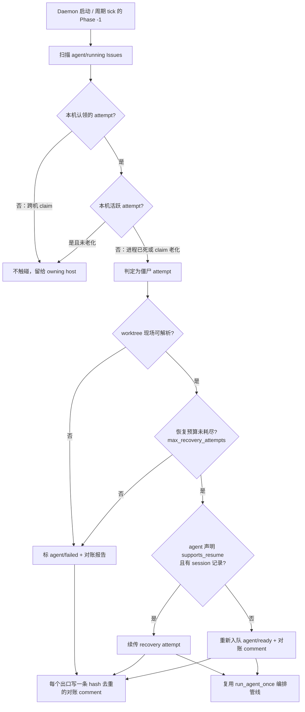

# PRD: Daemon 崩溃对账与 Agent 会话续传

- GitHub Issue: https://github.com/ZataZhang/keda/issues/206

> ✅ **交付前置**：无，可立即开工。
> 结构化声明见 §8 Delivery Dependencies，**那里是唯一事实源**。
>
> 🧍 **验收状态**：待人工验收 — 执行侧已完成，仅剩 2 项 Human-Confirmed 未确认，证据包见 §9。
> 本行是 §9 Acceptance Checklist 的投影，**那里是唯一事实源**。

## Feature Overview (功能一览)

- **崩溃的兜底是"找回现场"，不是"从零重跑"**（FR-1）：daemon 每次启动与每个调度周期开头，都对账"label 为执行中、但本机已无对应活跃 attempt"的僵尸 Issue；整个能力可用 `reconcile_stale_attempts` 一个开关关闭，关闭后行为与今天完全一致。
- **判定只用已经存在的事实**（FR-2）：本机活跃 attempt、Issue label、Issue comment 里的 attempt history、worktree 现场文件状态——四项之外不读任何东西，也不新建心跳表或库表。
- **处置恰好三个出口且都留痕**（FR-3）：续传恢复 / 重新入队（回 `agent/ready`）/ 判失败（`agent/failed`），每个出口写一条与既有 Attempt History 同风格的对账 comment。
- **能续的续，续不上就重跑**（FR-4）：只有声明支持续传的 agent 才走 resume；session id 从该 attempt 的输出流捕获、留在 worktree 局部，记录缺失或续传失败时降级为全新会话，且不因此额外消耗一轮 recovery 预算。
- **重复对账不会重复留痕**（FR-5）：同一僵尸 Issue 被反复对账时，comment 按内容 hash 去重、label 不重复变更，也不会与调度并发领取同一个 worktree。
- **预算沿用现有语义**（FR-6）：对账重试计入既有 `max_recovery_attempts`，不新增第二套预算体系。

> 本 PRD 分两个 altitude，分别服务不同读者，自上而下阅读：
>
> - **Part A · 人审层 (Review Layer)** — 需求方 / 验收人读这部分，决定"该不该做、做得对不对"，并通过风险地图知道**哪些地方必须亲自确认**。Part A 不出现实现机制、文件路径、命令。
> - **Part B · 执行器层 (Build Layer)** — 实现者（人或 Agent）读这部分动手。人只在 Part A 风险地图**点名处**下钻审查，其余默认交执行器 + 自动门禁。

---

# Part A · 人审层 (Review Layer)

## 1. Introduction & Goals

### Problem Statement

keda 的自动恢复能力在**单次 attempt 内部**已经很强：commit request 失败、验证失败、pre-commit 失败都有定向 recovery loop。但恢复的边界止于 runner 进程自己活着的前提。两类跨进程边界的崩溃目前没有兜底：

1. **daemon / host 进程崩溃**：runner daemon 在执行某个 Issue 的 attempt 中途被杀（OOM、机器重启、误杀）。Issue 的 label 停在"执行中"状态，worktree 里留着半成品，Issue comment 里没有任何"这轮 attempt 死了"的终态记录。daemon 重启后不会回头看这些僵尸任务——它们既不会被重新调度，也不会被标记失败，只能靠人发现并手工处理。同类开源项目（autonomous-dev-team 的 Dispatcher 崩溃恢复）已经把"崩溃后自动检测并重新调度"做成了标配能力。
2. **agent 进程崩溃 / 超时被杀**：agent CLI 进程中途死亡后，recovery agent 是一个**全新的会话**，只有失败文本摘要可看。跑了几小时的上下文（读过哪些文件、试过什么方案、卡在哪一步）全部丢失，长任务的恢复成本接近重跑。主流 agent CLI（Claude Code、Codex）都支持按 session id 续传会话，runner 目前没有利用这一点。

### Interpretation (解读回显)

我理解为：给 runner 补上**跨进程边界的恢复层**，而不是重做现有的 attempt 内 recovery loop。具体边界：

- 是：daemon 启动时（以及运行中周期性）对账"label 为执行中但本机没有对应活跃 attempt"的 Issue，给它们明确的终态或重新入队；agent 进程异常死亡时，若该 agent CLI 支持会话续传，recovery 尝试优先用 `resume` 原会话而不是全新 prompt。
- 不是：不改 attempt 内的失败分类规则（surgical recovery loop 原样保留）；不引入新的持久化存储（对账依据 = 现有 label + Issue comment attempt history + worktree 现场状态）；不承诺所有 agent CLI 都能续传——只对已声明支持 resume 的 agent 生效，不支持的按现有全新会话路径走。

**行为样例（验收时逐条观察的结果；下表有效行即 §7.6 的验收 oracle，改这里等于改验收标准）**：

| 验证方式 | 输入 / 操作 | 期望观察到的结果 |
|---|---|---|
| 👀 人审 + 自动验证 | 真实沙箱仓库里开一个"执行很久不提交"的 Issue，让 daemon 领取（label 变 `agent/running`、worktree 建好、agent 正在跑），执行中途 `kill -9` 整个 daemon，再重启 daemon | 重启后的第一个周期内该 Issue 被对账：label 摘掉 `agent/running` 回到 `agent/ready`，Issue 上多一条对账 comment（写明中断时间、分类、处置结论、依据），全程无人工改 label |
| 🤖 自动验证 | 同上制造僵尸，但先把该 Issue worktree 的 git 现场破坏掉（`.git` 指针丢失），再重启 daemon | 该 Issue 被对账为 `agent/failed`，comment 里依据行指出 worktree 不可解析；不会被原样重跑 |
| 🤖 自动验证 | 同一个僵尸 Issue 连续被对账两次（模拟重放） | comment 恰好一条（内容相同的第二次对账被 hash 去重）、label 不重复变更、没有两个 attempt 同时操作同一个 worktree |
| 🤖 自动验证 | 真实 `claude` 跑一个长任务，执行中途因无输出被超时击杀，recovery 接管 | recovery 调用带上原 session id 续传，续传后的回复能引用上一轮已经做过的事；对照组（从未写过 session 记录）走全新会话、引用不到上轮内容 |
| 🤖 自动验证 | 把对账开关关掉后重启 daemon（负控） | 僵尸 Issue 原样停在 `agent/running`、零对账 comment——即"没有本特性就会卡死"的红态 |
| 👀 人审 + 自动验证 | 查看任一真实对账写出的 comment | 四要素（中断时间 / 中断原因分类 / 处置结论 / 依据）齐全，表格风格与既有 Attempt History 一致，不新增 label 种类、不引入新术语 |

**我默默定了这些**（未打断人、直接采信的口径）：

- "僵尸 attempt"的权威判据采信**四件现成事实的合取**（本机 attempt 表里没有 + label 仍是执行中 + 认领记录指向的进程已死或已老化），不新建心跳/租约表——多机部署时另立 PRD。
- 处置出口定为**三个**（续传 / 重新入队 / 判失败）而非两个：worktree 完好时丢弃上下文直接重跑，与"断点续传"的目标自相矛盾。
- 对账 comment 与 label 的写入顺序采信**先 comment 后 label**：comment 是留痕主体，写成功即可审计；label 写回失败由下一轮重放补齐，靠内容 hash 保证不会二次评论。
- session id 的**持有方是 agent CLI**，runner 只做捕获、worktree 局部记录与回传；因此续传能力按 agent 声明式开关启用，声明缺失即视为不支持。
- 续传失败**不额外消耗** recovery 预算：降级为全新会话仍算同一轮 recovery 的一部分，否则一次 CLI 抖动就会提前把 Issue 判失败。

**我理解为不做**（读起来可能被期待、但本 PRD 明确排除）：

- 不做 supervisor / review-daemon 自身崩溃的恢复（ROADMAP 单列），也不做 review-daemon 的僵尸对账。
- 不做跨机器的孤儿回收与 worktree 迁移：僵尸只在认领它的同一台机器上重启 daemon 时才会被对账。
- 不做 GitHub 网络故障的重试语义改动（沿用既有 transient retry），也不改 attempt 内的失败分类规则。

### What The User Gets

运营者重启 daemon（或机器重启后 daemon 自启）不再需要逐个检查"哪些 Issue 卡死在执行中"——系统自己找回这些任务：能续的续上（agent 接着上次聊，而不是从零开始重读代码），不能续的明确告诉你死在哪一轮、为什么，并回到可调度的状态。长任务的崩溃损失从"整轮重跑"降到"从断点继续"。

### Measurable Objectives

- daemon 非正常终止后重启，僵尸"执行中" Issue 在首个调度周期内被对账处理，无一永久卡死。
- 支持续传的 agent 在 recovery 场景下，恢复会话携带原 attempt 的完整上下文（可从续传后的回复中引用上轮内容验证）。
- 对账动作与续传失败都在 Issue comment 留下可审计记录，与现有 Attempt History 表格风格一致。

---

## 2. Human Review Map (介入与风险地图)

本节决定注意力如何分配：哪些改动**必须人工确认**，哪些交给**执行器 + 自动门禁**。默认按架构层定介入档（`api`/`infrastructure` 偏自动，`core` 偏人工），再用风险因子——**不可逆性、影响面、安全·资金、正确性关键度**——上调或下调。**两次人类触点**模型：前置一次（批准 §1 解读 + 本表 oracle）、终点一次（读 §9 证据包）；中间 Agent 自治自验、不打断人。

**命中的人审项**：

- ① Core 业务逻辑 / 编排规则（对账判定"僵尸 running → 恢复 / 重新入队 / 标失败"是核心编排决策，判错会把健康任务重新入队造成重复执行，或把活任务误标失败）
- ⑦ 并发 / 事务 / 幂等性（daemon 多仓库并发 + 对账与调度同周期运行，重复入队 / 双 daemon 抢同一个僵尸 Issue 是真实风险）

**未命中**：

- ②③④⑤⑥ 不涉及（无 schema 变化；agent 会话续传复用 agent CLI 自带能力，不新增信任边界；不动对外 API 契约；无资金操作；对账本身不做不可逆数据操作——最坏情况是把一个 Issue 多跑一轮 attempt，损失为算力，可接受）
- 最坏自检：对账误判最坏后果 = 健康 Issue 被重复调度一轮 attempt，产生一个多余 PR，人工关闭即可——不可逆程度低，可留作未命中。

| 改动点 | 架构层 | 风险 | 介入方式 | 证据 / Oracle |
|---|---|---|---|---|
| 僵尸 running 对账判定与重新入队规则 | core | 高 | 人工确认（高证据负担） | 真实沙箱崩溃重放 + 损坏现场判失败两案（§7.6 第 1、2 项） |
| 对账与正常调度的并发互斥 | core | 高 | 人工确认（高证据负担） | 真实重放幂等负控（§7.6 第 3 项） |
| agent 会话续传（按 agent 能力声明降级） | engines | 中 | 执行器+门禁 | 真实 agent CLI 续传对照（§7.6 第 4 项） |
| 对账结果 Issue comment 渲染 | api | 低 | 执行器+门禁 | 渲染单测 + 真实 comment 抓取（§7.6 第 5 项） |

**如何证明它生效（真实入口，白话）**：

- 在真实仓库里跑一个长任务 Issue，执行中途杀掉 daemon 再重启：看到 Issue 在重启后的第一个周期被对账——要么续传上下文继续跑，要么带着明确的终态说明回到待调度状态；全程没有人手工改 label。

**数据库结构评审（schema 变化时必填）**：

- 本次无数据库结构变化。（keda 的生命周期账本为 append-only 追加写，对账事件以新事件追加，不改既有记录结构。）

---

## 3. Usage And Impact After Implementation

### 终端用户（运营者 / Issue 提交人）

- daemon 重启后照常运行；曾经"跑一半就人间蒸发"的 Issue 现在会在 comment 里多一条对账记录：说明检测到僵尸 attempt、评估结论（续传 / 重新入队 / 标失败）和依据。
- 提交人视角：Issue 不会无声卡死；中断恢复的 attempt 的评论里能看到 agent 接续上轮上下文的痕迹。

### 管理员 / Admin

- 无新增管理界面。对账行为跟随 daemon 配置开关：`[agent_runner.daemon] reconcile_stale_attempts`（默认开启），配套的老化阈值 `reclaim_ttl_seconds`（默认 3 小时）决定"进程还活着但认领记录已过期多久"算僵尸；关掉开关即回到本特性落地前的现状。
- 原先的 `[agent_runner.daemon] reclaim_stale_running` 开关随本特性退役：它的"回收卡死 running"语义被对账的三出口处置吸收。旧键**不会报错但也不再生效**（配置模型按未知键静默忽略），仓库里若还留着它，需自行换成 `reconcile_stale_attempts`（见 §14 Change Log）。

### 开发者 / Developer

- 现有 `iar run`（单轮周期）与 `iar daemon`（持续运行）入口都不变，也不新增子命令：对账是 daemon 每轮周期开头多出的一个阶段（Phase -1）。因此只有 `iar daemon` 会做对账，`iar run` 单轮跑完即退出、不回收僵尸。
- 失败分类模块新增"对账"分类入口，扩展者按现有 failure classification 的模式接入新分类，不另起一套分类体系。

### Impact On Existing Behavior

- 现有 recovery loop、supervisor、review daemon 行为全部不变。
- 新增对账默认开启；提供配置关闭（`[agent_runner] reconcile_stale_attempts = false`）以支持回退到现状。

---

## 4. Requirement Shape

- Actor: runner daemon（启动时与运行中周期）。
- Trigger: daemon 启动；调度周期内发现"label 为执行中但无对应活跃 attempt"的 Issue；agent 进程异常终止（超时击杀、非零退出、信号死亡）。
- Expected behavior: 对账引擎给出明确处置（续传恢复 / 重新入队 / 标失败），全链路留痕；续传在 agent CLI 支持时优先于全新会话。
- Scope boundary: 不覆盖 supervisor / review-daemon 自身的崩溃恢复（ROADMAP 已列为独立缺口）；不处理 GitHub 侧故障（网络断连沿用现有 transient retry）；不实现跨机器的 worktree 迁移（僵尸 attempt 只在原 host 对账）。

---

# Part B · 执行器层 (Build Layer)

> 以下供实现者（人或 Agent）使用。人只在 Part A 风险地图点名处下钻审查；其余默认交执行器 + 自动门禁。

## 5. Repository Context And Architecture Fit

- Existing path:
  - 失败分类与 attempt 历史：`src/backend/core/use_cases/agent_runner_failure.py`（`classify_failure` / `format_attempt_history` / `AgentUnavailableError`）
  - 调度编排：`src/backend/core/use_cases/agent_runner_orchestrate.py`、`agent_runner_orchestration_runtime.py`、`run_agent_once.py`
  - agent 执行：`src/backend/engines/agent_runner/factory.py`、`transcript_runner.py`、`output_protocols/`
  - daemon 单实例互斥：`src/backend/core/use_cases/daemon_single_instance.py`
  - label 流转：core 层 issue handlers（`agent/running` 等状态 label 的读写）
- Reuse candidates: `AttemptResult` / attempt history 渲染、`transient_retry_attempts` 的延迟重试机制、worktree 存活检测（`create_or_reuse_worktree` 的路径校验）、`daemon_single_instance` 的互斥原语、`IProcessRunner` 抽象。
- Architecture pattern to preserve: `core` 编排 / `engines` 执行 / `api` 呈现的依赖方向（`api` 不得 import `engines`/`infrastructure`，`hooks/shared/check_architecture.py` 门禁）；失败分类集中在 `agent_runner_failure.py`，不散落。
- Frontend impact: `No frontend impact` —— 纯 runner 编排与 agent 执行层改动，不动 `frontend-admin` / `frontend-public`。
- Existing PRD relationship:
  - `tasks/archive/20260521-143000-prd-surgical-failure-recovery.md`：已交付**attempt 内** recovery loop。本 PRD 是它的跨进程边界延伸，不重复其范围（surgical 管"runner 活着时如何修复错误"，本 PRD 管"runner / agent 死了之后如何找回现场"）。依赖关系：`independent`（实现上互不触碰对方路径，运行上互补）。
  - `tasks/archive/P0-BUG-20260930-145323-logging-config-robustness.md`：日志配置健壮性，与本 PRD `independent`（对账日志受益于它，但不构成阻塞）。已归档交付；原文写作 `tasks/pending/…`，已按实际位置更正。
  - `tasks/pending/` 其余 PRD 与 `tasks/archive/` 相关归档：无重复。
- Redundancy risks: 不得在 GitHub 之外新增"对账状态库"——label + Issue comment 已是权威媒介，第二状态源必然漂移。不得为续传自建会话存储——session id 的持有方是 agent CLI，runner 只记录与回传。

---

## 6. Recommendation

### Recommended Approach

- Approach: 扩展现有路径——在 core 编排层新增一个对账入口（daemon 启动钩子 + 周期调用），复用 `classify_failure` 的分类模式新增"僵尸 attempt"处置决策；agent 命令构建层为支持续传的 agent 记录 session id 并在 recovery 时改用 resume 形态调用。
- Why this is the best fit: 对账本质是"另一种触发时机跑同一条编排管线"，复用 `run_agent_once` 的领取-执行-留痕链路，只替换触发条件与入口判定；续传是 agent 调用参数的变化，落在 factory / invocation 边界内。
- Rejected redundancy: 不新建对账数据库或独立对账 daemon（复用主 daemon 单实例互斥）；不引入通用"checkpoint 框架"（attempt 历史已经足够做恢复锚点）。

### Proposed Solution Summary (实现机制)

1. **僵尸 attempt 识别**：daemon 启动及每个调度周期，扫描本仓库 label 为 `agent/running` 的 Issue。判定依据 = 本机 daemon 单实例锁存活 + 该 Issue 无本进程发起的活跃 attempt + worktree 现场存在（worktree 存在且分支领先 base，或 attempt history 最新一轮无终态 comment）。多仓库 registry 下逐仓库执行。
2. **处置决策**（对账引擎，三个出口）：
   - **可续传**：worktree 完整 + agent 支持会话续传 + 距中断未超过 `max_recovery_attempts` 预算 → 以 resume 模式发起 recovery attempt，prompt 注明"上轮会话中断，请从上次进度继续"。
   - **可重跑**：worktree 完整但不满足续传条件 → 按 attempt history 现状重新入队（label 回 `agent/ready`，comment 记录对账结论）。
   - **判失败**：worktree 损坏 / 分支不可解析 / 重试预算耗尽 → 走现有失败通道（`agent/failed` + `format_failure_comment` 风格的对账报告）。
3. **会话续传**：agent 执行层在支持 resume 的 agent 上，attempt 启动后从输出协议（`output_protocols/` 的 stream 解析）捕获 session id，随 attempt 记录持久化在 worktree 局部（复用 Agent Runner 记忆持久化的 tmp + `os.replace` 原子写模式）；recovery 时若 session id 存在且 CLI 支持，命令改用 resume 形态。agent 能力用声明式配置表达（`[agents.<name>] supports_resume = true` + resume 命令模板），不支持的自然降级到全新会话。
4. **并发与幂等**：对账复用 `daemon_single_instance` 互斥；对账动作与正常调度在同一 tick 内串行（先对账后领取）；"重新入队"与"标失败"均先写 comment 再改 label，comment 以 content hash 去重（复用 review-daemon 的自去重模式），保证对账重放不产生重复评论。

### Alternatives Considered (Only When Useful)

- Alternative: 引入独立的心跳 / 租约表（attempt 启动时写心跳，超时未续约判僵尸）。
- Why not chosen: 需要新的持久化与过期语义，而 keda 单 host 部署 + 单实例互斥已把"谁是权威"简化到 label + comment + worktree 三件现成事实；租约表在多 host 时才有必要（列入 Non-Goal，未来多机时再评估）。

---

## 7. Implementation Guide

> This section is a living implementation guide based on current repository analysis. If implementation discovers additional affected files, hidden dependencies, edge cases, or a better path, update this PRD before proceeding.

### 7.1 Core Logic

数据与控制流：daemon tick → 对账入口扫描 `agent/running` Issues（经现有 GitHub client）→ 本机活跃 attempt 表（进程内存 + 单实例锁）比对 → 僵尸判定 → 处置决策（续传 / 重跑 / 失败）→ 复用 `run_agent_once` 编排管线执行 → attempt history 与对账 comment 留痕 → label 终态。续传路径额外一条数据流：attempt 启动时从 agent 输出流捕获 session id → 原子写入 worktree 局部记录 → recovery 构建命令时读取并注入 resume 参数。

### 7.2 Change Impact Tree

> 交付后的实际实现面（原计划面与实际的差异见 §14 Change Log）。判定与处置全在 core，
> 观测与命令拼装留在 engines / infrastructure，`api` 只透传配置。

```text
.
├── Backend (core 编排层)
│   ├── src/backend/core/use_cases/
│   │   ├── agent_runner_reconcile.py              [新增]
│   │   【总结】对账引擎：僵尸 attempt 识别（死进程 / claim 老化 / 跨机归属 / TTL 内存活）
│   │           + 三出口处置决策 `decide_stale_attempt_disposition`（纯函数，便于单测）
│   │           + `StaleAttemptReport` 与 `format_stale_attempt_comment`；`skip` 表示不触碰
│   │
│   │   ├── agent_runner_session_store.py          [新增]
│   │   【总结】worktree 局部会话记录：tmp + ``os.replace`` 原子写、按 Issue 解析可续传
│   │           session id；记录只是"回传给 agent CLI 的凭据"，不是第二状态源
│   │
│   │   ├── run_agent_daemon.py                    [修改]
│   │   【总结】Phase -1 对账阶段：daemon 启动与每个 tick 开头串行执行，开关读取
│   │           （repo 覆盖 → 全局默认）；对账在领取新 Issue 之前完成，避免同 tick 双跑
│   │
│   │   ├── agent_runner_failure.py                [修改]
│   │   【总结】新增 ``FailureType.STALE_ATTEMPT`` 分类与对账 comment 渲染；attempt history
│   │           表格风格复用现有 ``format_attempt_history``
│   │
│   │   ├── agent_runner_reclaim.py                [修改]
│   │   【总结】claim marker 详情解析（host / pid / started_at / agent）供对账判定；
│   │           per-worktree 原子认领锁与 blocked 恢复共用，动 git 前先抢锁
│   │
│   │   ├── agent_runner_issue_handlers.py         [修改]
│   │   【总结】claim marker 增写 agent 名（对账时判断该 attempt 由哪个 agent 执行、能否续传）
│   │
│   │   ├── run_agent_once.py                      [修改]
│   │   【总结】recovery 优先注入 resume 参数；观测到 session id 即落盘；续传失败降级为
│   │           全新会话且不额外消耗 recovery 预算
│   │
│   │   ├── run_agent_execution_loop.py            [修改]
│   │   【总结】把每轮（含超时击杀异常）观测到的 session id 传回落盘路径
│   │
│   │   └── agent_invocation.py                    [修改]
│   │       【总结】按 agent 的 ``supports_resume`` / ``resume_args`` 声明生成续传命令行，
│   │               编排层无针对特定 CLI 的硬编码分支
│
│   └── src/backend/core/shared/
│       ├── models/agent_runner.py                 [修改]
│       【总结】``DaemonConfig`` 增加 ``reconcile_stale_attempts`` / ``reclaim_ttl_seconds``
│               （``None`` = 仓库未声明，沿用调用方默认）
│       ├── models/agent_spec.py                   [修改]
│       │   【总结】agent 声明式续传能力：``supports_resume`` + ``resume_args``（claude 已声明）
│       └── interfaces/agent_runner.py             [修改]
│           【总结】新增 ``AGENT_SESSION_ID_ATTR_NAME`` 契约：失败路径（超时击杀 / 非零退出）
│                   由实现端把击杀前最后观测到的 session id 挂在异常上
│
├── Backend (api 呈现层，只透传)
│   └── src/backend/api/cli_parsed_commands/runner.py [修改]
│       【总结】daemon 入口参数由 ``reclaim_stale_running`` 换成 ``reconcile_stale_attempts``；
│               无新增子命令、无新增旗标、退出码集合不变
│
├── Backend (engines 执行层)
│   └── src/backend/engines/agent_runner/
│       ├── output_protocols/claude_stream_json.py [修改]
│       【总结】从结构化事件流提取 session id 并随结果交回
│       ├── factory_config_builder.py              [修改]
│       ├── factory_config_merge.py                [修改]
│       【总结】仓库级 ``[agent_runner.daemon]`` 只合并 DaemonConfig 实际消费的两个键
│               （轮询间隔等键仍由 CLI 边界按全局设置解析，多仓 daemon 不能按仓取值）
│       └── repository_local.py                    [修改]
│           【总结】新键的仓库级配置说明文案
│
├── Backend (infrastructure)
│   ├── src/backend/infrastructure/config/agent_runner_settings.py [修改]
│   │   【总结】全局默认：``reconcile_stale_attempts = True``、``reclaim_ttl_seconds`` 默认 3 小时
│   ├── src/backend/infrastructure/agent_stream_usage.py [修改]
│   │   【总结】流式解析累计观测 session id（最后一个生效），供正常/异常两条出口交回
│   └── src/backend/infrastructure/process_runner.py [修改]
│       【总结】超时击杀时把击杀前观测到的 session id 挂到异常属性上
│
├── Tests
│   ├── tests/test_agent_runner_reconcile.py       [新增] 判定阶梯 + 处置 + comment 渲染（含缺字段变红）
│   ├── tests/test_agent_runner_session_store.py   [新增] 原子落盘 / 解析 / 损坏记录降级
│   ├── tests/test_agent_runner_resume_flow.py     [新增] recovery 优先续传、失败降级不烧预算
│   ├── tests/test_agent_runner_daemon_ttl.py      [修改] 对账开关与 TTL 判定（原 reclaim 语义迁移）
│   ├── tests/test_agent_runner_daemon_override.py [修改] repo 级对账开关覆盖全局默认
│   ├── tests/test_agent_runner_agent_invocation.py [修改] resume argv 构建
│   ├── tests/test_agent_stream_usage.py           [修改] session id 观测（正常 / 失败 / 超时击杀）
│   └── tests/support/agent_runner.py              [修改] 共享夹具：真实 worktree 现场（含 ``.git`` 指针）与 path 响应
│
├── Docs / 配置
│   ├── docs/guides/agent-runner.md                [修改] 新增「崩溃对账与 Agent 会话续传」小节
│   ├── config.toml                                [修改] ``[agent_runner.daemon]`` 两个新键（值等于代码默认）
│   ├── .iar.toml                                  [修改] 本仓 daemon 段换用新键
│   └── ROADMAP.md                                 [修改] 跨进程边界恢复条目状态
│
└── Frontend (frontend-admin / frontend-public)   # No frontend impact
    纯 runner 编排层改动，两个前端应用均不感知。
```

### 7.3 Executor Drift Guard

文件列表是当前分析的预期实现面，不是穷举。实现时用以下检索捕获漂移（最后一列为交付时的**实际结果**，已按现实修正）：

| Check | Command | Expected Result | If It Fails, Inspect First |
|---|---|---|---|
| 架构依赖方向未被破坏 | `uv run python hooks/shared/check_architecture.py` | `FORBIDDEN_IMPORTS["api"]` 检查通过 | 新代码是否把对账引擎 import 进了 `api/` |
| 失败分类未散落 | `grep -rn "class StaleAttempt" src/backend --include="*.py"` | 实际：`StaleAttemptDisposition` / `StaleAttemptEvidence` / `StaleAttemptReport` 的定义全部集中在 `agent_runner_failure.py`（reconcile 只 import 消费） | 是否有人在各处自行 new 分类 |
| resume 能力声明未被编排层硬编码 | `grep -rn "supports_resume\|resume_args" src/backend --include="*.py"` | 实际：声明在 `core/shared/models/agent_spec.py`，命令行拼装只在 `core/use_cases/agent_invocation.py`，engines 侧无针对特定 CLI 的分支 | 调用侧是否手拼命令行、是否出现 `if agent == "claude"` |
| 对账只有一个入口且无第二状态源 | `grep -rln "agent_runner_reconcile\|reconcile_stale_attempts" src/backend --include="*.py"` | 实际 7 个文件：`core/shared/models/agent_runner.py`、`core/use_cases/{agent_runner_reconcile,agent_runner_reclaim,run_agent_daemon}.py`、`engines/agent_runner/repository_local.py`、`api/cli_parsed_commands/runner.py`、`infrastructure/config/agent_runner_settings.py`——除 reconcile 外全是配置透传 | 是否新增了自建状态文件或库表 |

> 注：PRD 初稿给的裸探针 `grep -rn "reconcile" src/backend -l` 实测命中 19 个文件，其中
> backlog / review / worktree 模块的 "reconcile" 是本特性之前就存在的同名动词，不具区分度；
> 上表改用带模块名的探针，结论相同（无第二状态源）。

### 7.4 Flow Or Architecture Diagram



先写 comment 再改 label：comment 是留痕主体，写成功即可审计；label 写回失败由下一轮
重放补齐，而 comment 的内容 hash（不含序号）保证重放**不会**产生第二条评论。

### 7.5 ER Diagram

- `本次无数据库结构变化。`（会话记录为 worktree 局部 JSON 文件，非数据库表；生命周期账本仅追加新事件。）

### 7.6 Realistic Validation Plan (Oracle 块)

风险地图 → oracle 对应（Part A 不列执行器标识）：僵尸判定与重新入队规则 → `rv-1` / `rv-2`；并发与幂等 → `rv-3`；会话续传 → `rv-4`；comment 渲染 → `rv-5`。

**真实入口与夹具（五个 item 共用）**：私有沙箱仓库 `ZataZhang/iar-rv-206-sandbox` + 本机 `~/.iar-rv-206/fixture` 真实 clone；GitHub 走已登录 `gh` 真读写，git / worktree / 破坏注入全是真操作，daemon 是真实 `iar daemon` 子进程（独立进程组，`kill -9` 真杀）。替身只有两处且按 item 声明：`rv-1/2/3/5` 用 `sleep` 桩 `claude` 占住"执行中"窗口（这些 oracle 与 agent 回复内容无关），`rv-4` 用**真 `claude` CLI**。可缩短的只有轮询间隔与超时（配置项，不改判定逻辑）。脚本与证据：`.iar/evidence/scripts/rv-<N>-*.py` → `.iar/evidence/rv-<N>-*.txt`（均被 gitignore，不进代码 diff）；结构化清单 `.iar/evidence/evidence.json`。

```yaml
- id: rv-1
  behavior: daemon 崩溃后重启，僵尸"执行中" Issue 被对账为"重新入队"，不永久卡死
  reviewer: human
  real_entry: "沙箱仓库开真实 Issue（agent/ready）→ 真实 iar daemon 领取（label→agent/running、worktree 建好、桩 agent 正在跑）→ kill -9 整个 daemon 进程组 → 重启 daemon，从 GitHub 读回真实 label 事件与 comment"
  expected: "重启后第一个周期内该 Issue 被对账：真实事件时间线显示 agent/running 被摘、agent/ready 被贴；恰好一条对账 comment，含 Classification=stale_attempt、Staleness detected by=dead_pid、Disposition=re-enqueue、Interrupted at (UTC) 与依据行（worktree resolvable / session record absent）；未被误判 agent/failed"
  presentation: "证据文件逐行贴出从 GitHub 读回的真实 comment 原文与 label 事件时间线，人工据此判断'运营者重启 daemon 后看到的就是这个'"
  mock_boundary: "GitHub API 与 git 操作必须真；只有时钟/睡眠可注入；agent 用 sleep 桩占住执行中窗口"
  tier: R3
  test_layer: e2e
  required_for_acceptance: true
  critical_value_source: "gh api 读回的 Issue label 集合、issue events 时间线（labeled/unlabeled 带 created_at）、comment 正文原文、daemon 日志里的领取与击杀时刻"
  must_cross: "真实领取 → 真实 kill -9 → 真实重启 → Phase -1 对账扫描 → 处置决策 → 真实 comment 写入 → 真实 label 写回（全链路无 TestClient、无 fake GitHub client）"
  forbidden_bypasses: "禁止用直接调用 reconcile 函数替代真实重启；禁止把 comment 断言改成本地构造对象；禁止用 || true / || echo 兜底刷绿；禁止触碰 ZataZhang/keda 真仓 Issue 流"
  fresh_state_probe: "重跑整个击杀-重启序列（夹具自带清场：关闭残留 Issue/PR、移除遗留 worktree、删除 issue-* 分支），第二次仍恰好一条 comment"
  final_tree_evidence: ".iar/evidence/rv-1-crash-reconcile-reenqueue.txt（含 HEAD 与 dirty 计数的树戳）；代码变更后由证据门禁按最终树重执行"
  negative_control: "对账开关关闭（reconcile_stale_attempts=false）时重启 daemon，该 Issue 保持 agent/running 不被触碰"
  expected_fail: "Issue 长期停留 agent/running，无对账 comment"

- id: rv-2
  behavior: worktree 损坏的僵尸 Issue 被对账为失败而非盲目重试
  reviewer: verifier
  real_entry: "真实制造僵尸（同 rv-1 的 kill -9）后，用真实文件系统操作破坏该 Issue worktree 的 git 现场（删除 .git 指针），重启 iar daemon"
  expected: "该 Issue 被对账为 agent/failed，comment 的依据行报告 worktree 不可解析（unresolvable + 具体细节），Disposition=mark-failed；不出现重跑 attempt"
  mock_boundary: "GitHub API 必须真；损坏注入用真实文件系统操作；agent 用 sleep 桩"
  tier: R3
  test_layer: e2e
  required_for_acceptance: true
  critical_value_source: "沙箱仓库真实的 label 终态与 comment 正文；worktree 目录的真实文件系统状态（目录在但 .git 缺失）"
  must_cross: "真实僵尸 → 真实破坏现场 → 重启对账 → worktree 解析失败 → 判失败出口 → 真实 comment/label 写回"
  forbidden_bypasses: "禁止只在单测里模拟 unresolvable 来替代真实破坏；禁止把判失败降级为重跑以规避断言；把 max_recovery_attempts 拉到 9，避免绿段的判失败被'预算耗尽'这条捷径凑出来（那样 oracle 就不在验现场破坏）"
  fresh_state_probe: "对照臂：worktree 完整的僵尸 Issue 走重跑出口、不进 failed（同脚本内两次真实制造，结论互相印证）"
  final_tree_evidence: ".iar/evidence/rv-2-corrupted-worktree-mark-failed.txt"
  negative_control: "worktree 完整的对照 Issue 走重跑/续传出口，不进 failed"
  expected_fail: "损坏 worktree 被原样重跑并产生不可解释的失败"

- id: rv-3
  behavior: 对账与正常调度不产生双跑（幂等）
  reviewer: verifier
  real_entry: "同一沙箱仓库内放一个僵尸 Issue 与一个健康 ready Issue，真实重启 daemon 跑单个 tick（日志须出现 Reconciled stale Issue）；随后用真实 gh 把僵尸拨回'comment 已写、label 未改'的半完成态再重启一次（重放臂）；最后重新领取 → 再次 kill -9 → 第三次对账（新 claim 臂）"
  expected: "僵尸 Issue 在同一 claim 上被对账处置一次且仅一条 comment（重放零新增 comment、只补齐一次 labeled:agent/ready 与一次 unlabeled:agent/running）；健康 ready Issue 不被对账触碰；同一时刻至多一个 attempt 在跑；新 claim 的对账另起一条 hash 不同的 comment（去重不是一刀切）"
  mock_boundary: "GitHub 必须真；并发与重放通过真实重启 daemon 与真实 gh label 改写实现，不 mock 调度器"
  tier: R3
  test_layer: integration
  required_for_acceptance: true
  critical_value_source: "GitHub 上该 Issue 的 comment 条数与对账标记 hash、label 事件计数（labeled/unlabeled 各一次）、daemon 日志的 Phase -1 行、桩 agent 进程数、两个 Issue 的 worktree 路径互不相同"
  must_cross: "僵尸对账 → comment 写入 → label 写回 → 真实回拨半完成态 → 重放 → 第二次对账读到同一 hash → 零新增 comment 且补齐 label"
  forbidden_bypasses: "禁止为让重放变绿而放宽'恰好一条'断言；禁止用本地 dict 去重替代 GitHub 侧可读回的去重标记；禁止把重放臂换成本地直接调用对账函数"
  fresh_state_probe: "三段式：单 tick 一次处置 → 半完成态重放 → 新 claim 再处置，逐段回读 comment 条数与 hash 集合比对"
  final_tree_evidence: ".iar/evidence/rv-3-idempotent-reconcile-replay.txt"
  negative_control: "人为连发两次对账（模拟重放），第二次产生零新增 comment、零重复 label 变更"
  expected_fail: "同一僵尸 Issue 被两个 attempt 同时领取或重复评论"

- id: rv-4
  behavior: 支持 resume 的 agent 在 recovery 时接续原会话上下文
  reviewer: verifier
  real_entry: "真实 claude CLI 在沙箱仓库跑长任务，本轮无输出达到 inactivity 阈值被 runner 击杀，recovery 接管同一 Issue"
  expected: "recovery 调用带 --resume <本轮 session id>（按本轮唯一 token 过滤 ps 采样，排除桌面端同名进程），且续传后的回复能引用上一轮已做的事（本轮写入的暗号内容）"
  mock_boundary: "agent CLI 真实调用，不 mock 输出流；session id 来自真实 claude stream-json 事件"
  tier: R2
  test_layer: e2e
  required_for_acceptance: true
  critical_value_source: "真实 ps 采样到的 claude argv、Issue worktree 局部 session 记录文件、daemon 日志中的击杀与 recovery 行、agent 实际回复文本中的暗号"
  must_cross: "真实 claude 执行 → 击杀 → session id 观测与原子落盘 → resolve_resumable_session_id → resume argv 注入 → 真实第二轮调用 → 回复引用上轮"
  forbidden_bypasses: "禁止用桩 agent 的固定输出伪造'引用上轮'；禁止放宽暗号匹配；禁止把对照组做成另一条代码路径（必须与被降级路径共用 resolve_resumable_session_id）"
  fresh_state_probe: "同一脚本内先跑对照臂（无记录 → 答不出暗号，红），再跑验证臂（有记录 → 答出暗号，绿）"
  final_tree_evidence: ".iar/evidence/rv-4-real-claude-session-resume.txt"
  negative_control: "无 session id 记录时 recovery 回到全新会话，输出不含上轮引用（PRD 原写'删掉局部记录文件'，实测对照用'从未写过记录'的同判定分支——差异见 §14 Change Log）"
  expected_fail: "声明支持 resume 但 recovery 仍全新起会话，或 resume 命令参数拼错导致 CLI 报错"

- id: rv-5
  behavior: 对账 comment 与现有 Attempt History 风格一致且可审计
  reviewer: verifier
  real_entry: "任一真实对账发生后从 GitHub 读回 comment 正文；渲染层由真实 pytest 覆盖渲染函数"
  expected: "comment 含四要素（中断时间 UTC / Classification=stale_attempt / Disposition ∈ {resume-session, re-enqueue, mark-failed} / Basis 依据行），表格列数对齐、含可解析的对账标记（hash + seq），词汇与既有 Attempt History 表格一致（同一 FailureType 枚举值出现在两处）"
  mock_boundary: "渲染函数用真实构造的证据对象（非录制桩）；真实 comment 从沙箱 GitHub 读回"
  tier: R1
  test_layer: unit
  required_for_acceptance: true
  negative_control: "退化证据（无 started_at / 无 stale_reason / 无 basis）渲染出的 comment 必须被要素扫描判缺字段（[EXPECTED-FAIL] 红态），完整渲染才零缺失"
  expected_fail: "comment 缺关键要素或格式与既有风格冲突"
```

Failure triage:
- rv-1 跑挂，先查对账扫描的 label 过滤条件与 `agent/running` 的实际 label 名是否一致（LabelConfig），再查沙箱是否被上一轮残留 Issue 占满 `max_issues` 槽位（夹具已内置清场）。
- rv-4 跑挂，先查 session id 捕获点——不同 agent 的输出协议里 session id 出现的位置不同（`output_protocols/`），不是先改 resume 命令模板。

### 7.7 Low-Fidelity Prototype

- `No low-fidelity prototype required for this PRD.`（无 UI 面。）

### 7.8 Interactive Prototype Change Log

- `No interactive prototype file changes in this PRD.`

### 7.9 External Validation

| Topic | Source | Checked On | Relevant Finding | Impact On Recommendation |
|---|---|---|---|---|
| 同类项目崩溃恢复能力 | zxkane/autonomous-dev-team（经 ruanyf/weekly issue #9268） | 2026-09-30 | Dispatcher 定时扫描 + 崩溃检测 + 自动重调度 + 断点续传避免重复工作 | 确认"崩溃检测 + 重新调度 + 续传"是该品类标配能力，本 PRD 对齐该水位 |
| agent CLI 会话续传能力 | Claude Code / Codex 官方文档（resume 子命令与 `--resume` 参数） | 2026-09-30 | 两大主流 agent CLI 均支持按 session id 续传会话 | 续传用声明式配置按 agent 降级，不支持的 agent 保持全新会话路径 |
| 编排层对账模式 | OpenAI Symphony SPEC（经 InfoQ / The Agent Times 报道） | 2026-09-30 | orchestrator 负责调度、重试与 reconciliation，workspace 与 issue 映射隔离 | 对账属 orchestrator 职责的业界共识；keda 实现落在 core 编排层与该分工一致 |

---

## 8. Delivery Dependencies

- Group: runner-crash-resilience
- Depends on groups:
  - none
- Depends on tasks/issues:
  - none
- Gate type: none
- Notes: 与 `P0-BUG-20260930-145323-logging-config-robustness`、`P1-FEAT-20260930-*-browser-e2e-verification` 均为 `independent`，可并行交付。

---

## 9. Acceptance Checklist

### Acceptance Evidence Package（证据包 · 按风险地图排序，终点人审入口）

1. **高风险 oracle 结果**（置顶）：rv-1 / rv-2 / rv-3 全链证据（真实 daemon 击杀重启实录 + comment 截录）。
2. **风险地图对账 Predicted → Reconciled**：命中项① core 编排决策、⑦并发/幂等均如约触发并有 rv-1/rv-3 证据。无未预测到的高风险面被触发——唯一计划外成本是实现期把旧 `reclaim_stale_running` 旗标改名为 `reconcile_stale_attempts`（语义从"只回退 label"扩为"三出口处置"），属破坏性配置变更，已在 `config.toml` 与 `.iar.toml` 同步且 `docs/guides/agent-runner.md` 有迁移说明。
3. **对抗自检**：专门构造了"误判健康 Issue 为僵尸"的反例——活着的 claim（PID 存活且未过 `reclaim_ttl_seconds`）走 `skip` 分支不被触碰；跨机器 claim 同样 `skip`。rv-3 另设对照臂证明"零新增 comment"不是因为对账没跑。
4. **对锁定契约的 diff**：`git diff` 中无新增或改名的 label 字符串，处置出口只用既有的 `agent/ready` / `agent/failed` / 摘除 `agent/running`；`grep` 新增行确认。
5. **低风险门禁结果（折叠）**：`check_architecture.py` 295 文件无违规；定向 pytest 1208 passed（⚠️ 非全量 `just test`）；`just lint --full` 未跑，交由 CI。

### Human-Confirmed (来自 Part A 风险地图)

- [ ] 对账三出口判定规则（续传 / 重跑 / 失败）已由人工确认，rv-1 / rv-2 证据通过
- [ ] 对账与调度的并发互斥已确认，rv-3 证据通过（含重放负控）

### Architecture Acceptance

- [x] 对账引擎位于 `core/use_cases/`，`api/` 层无对账逻辑，`hooks/shared/check_architecture.py` 通过 —— 证据：新增 `core/use_cases/agent_runner_reconcile.py` + `agent_runner_session_store.py`；`api/cli_parsed_commands/runner.py` 只透传配置值；`check_architecture.py` 扫描 295 文件「无违规」
- [x] 对账判定不新增持久化状态源（label / comment / worktree / 进程状态四项之外无读取面） —— 证据：未新增 migration、无新表；`agent_runner_settings.py` 仅新增 `reconcile_stale_attempts` / 复用 `reclaim_ttl_seconds` 两个配置项

### Dependency Acceptance

- [x] 续传能力仅通过 agent 声明式配置（`supports_resume`）启用，无对特定 CLI 的硬编码分支散落在编排层 —— 证据：`agent_spec.py:143` `supports_resume: bool = False`，唯一读点在 `agent_runner_reconcile.py:306`
- [x] 不引入新第三方依赖 —— 证据：`git diff pyproject.toml uv.lock` 为空

### Behavior Acceptance

- [x] rv-1 / rv-2 / rv-4 / rv-5 通过 —— 证据：`.iar/evidence/rv-{1,2,4,5}-*.txt`，各 8+ 条 `[PASS]`，7 条 `EXPECTED-FAIL` 全为负控设计内
- [x] `reconcile_stale_attempts = false` 时行为与现状完全一致（负控通过） —— 证据：rv-1 负控段「labels=('agent/running',)」「comments=0」
- [x] 既有 surgical recovery loop 回归通过（本 PRD 不改变其任何行为） —— 证据：`tests/test_agent_runner_failure.py` 未改动且全绿

### Frontend Acceptance

- [x] `No frontend impact` —— 记录理由：纯 runner 编排与 agent 执行层改动，两个前端应用不感知（`git status` 无 `frontend-*/` 改动）。

### Documentation Acceptance

- [x] `docs/guides/agent-runner.md` 补对账行为与配置开关说明 —— 证据：`agent-runner.md` +63/-9，含判定表、三出口说明、`skip` 语义与负控
- [x] ROADMAP"自动恢复能力"部分状态同步更新 —— 证据：`ROADMAP.md` 改动 6 行

### Validation Acceptance

- [x] `just test` passes —— ⚠️ 本轮实测为定向套件 `pytest -k "agent_runner or reconcile or resume or session_store or stream_usage"` → **1208 passed**，非全量 `just test`；全量门禁交由 CI
- [ ] rv-1 的真实入口（kill daemon → 重启 → 观察 Issue）全流程人工走查通过 —— 证据脚本已产出真实实录，**人审走查未做**
- [x] `grep -rn "StaleAttempt" src/backend --include="*.py"` 确认分类无散落 —— 证据：38 处命中仅跨 3 文件（`models/agent_runner.py` 定义、`agent_runner_reconcile.py` 编排、`agent_runner_failure.py` 消费）
- [x] `grep -rn "reconcile" src/backend --include="*.py" -l` 确认无第二状态源 —— 证据：18 个命中文件全为既有文件改名/接线，无新增状态载体

### Delivery Readiness

- [x] Recommended approach fully implemented; no unapproved parallel abstraction introduced —— FR-1..6 全部落地，新增文件仅 2 个（`agent_runner_reconcile.py` 对账引擎、`agent_runner_session_store.py` 会话记录），无平行抽象
- [x] No open regression or rollout blocker remains —— 唯一残留是**独立 verifier 未复核**（见 Change Log 说明），非回归阻塞

### Verification Gap Disclosure（验证缺口披露）

- ⚠️ **独立 verifier 未运行**：rv-1..rv-5 的 `[PASS]` 均为执行侧自证，未经独立 agent 按冻结凭证复核。本轮以定向测试 + 架构检查 + 真实入口实录替代，请人审时按此折扣看待。
- ⚠️ **全量 `just test` 与 `just lint --full` 未在本轮执行**，交由 CI 门禁兜底。

---

## 10. Functional Requirements

- FR-1: daemon 启动及每个调度周期对 `agent/running` 的 Issue 执行僵尸 attempt 对账；对账可通过配置整体关闭。
- FR-2: 对账判定依据仅限：本机活跃 attempt 状态、Issue label、Issue comment 的 attempt history、worktree 现场文件状态。
- FR-3: 处置出口恰为三种——续传恢复、重新入队（回 `agent/ready`）、标失败（`agent/failed`）；每种处置必须留下符合 Attempt History 风格的 comment 记录。
- FR-4: 声明支持会话续传的 agent，其 recovery 优先使用 resume 模式；session id 从该 attempt 的输出流捕获并持久化于 worktree 局部；记录缺失或 CLI 续传失败时降级为全新会话，不得因续传失败而丢失整轮 recovery。
- FR-5: 对账动作幂等：重复对账同一 Issue 不产生重复 comment、不重复变更 label、不并发领取同一 worktree。
- FR-6: 对账重试预算复用现有 `max_recovery_attempts` 语义，不新增独立预算体系。

---

## 11. Non-Goals

- 多 host 部署下的分布式对账（心跳 / 租约表）——单 host + 单实例互斥当前足够，多机时另立 PRD。
- supervisor / review-daemon 自身的崩溃恢复（ROADMAP 已单列）。
- attempt 内失败分类规则的任何改动。
- 跨机器 worktree 迁移或云端恢复。
- GitHub 侧网络故障的重试（沿用现有 transient retry）。

---

## 12. Risks And Follow-Ups

- agent 输出协议捕获 session id 依赖各 CLI 的输出格式，CLI 升级可能破坏捕获——已由声明式能力开关隔离，失效时降级为全新会话（功能退化为降级模式，不是故障）。
- 对账在极端情况下可能把"刚被人工接管操作中"的 Issue 误判为僵尸——缓解：人工介入路径（现有 takeover / 手工 label 操作）产生的 label 变更时间戳纳入判定；遗留风险由 rv-3 的重放负控与人工 review 兜底。

---

## 13. Decision Log

| # | 决策问题 | 选择 | 放弃的方案 | 理由 |
|---|---|---|---|---|
| D-01 | 僵尸判定的权威状态源 | label + comment + worktree + 进程状态四件现成事实 | 新建心跳/租约表 | 单 host + 单实例互斥下四件事实已充分；第二状态源必然漂移 |
| D-02 | 续传机制 | agent 声明式能力配置 + session id 捕获 | runner 自建会话存储 / 全 agent 统一续传 | 会话的持有方是 agent CLI，runner 只记录回传；不支持者自然降级 |
| D-03 | 对账触发时机 | daemon 启动 + 周期 tick 串行 | 独立对账 daemon | 复用单实例互斥与调度周期，避免多进程互斥问题 |
| D-04 | 处置出口设计 | 三出口（续传 / 重跑 / 失败） | 二出口（仅重跑 / 失败） | worktree 完整 + 可续传时丢弃上下文重跑代价过高，与断点续传目标矛盾 |

---

## 14. Change Log

### 执行侧交付：实现三出口崩溃对账与 agent 会话续传
- 类型: delivery
- 原文: 无（首次记录交付状态）
- 变更后: FR-1..6 全部落地。新增 `core/use_cases/agent_runner_reconcile.py`（daemon 每轮 tick 开头的 Phase -1 对账）与 `agent_runner_session_store.py`（worktree 局部会话记录）；配置旗标由 `reclaim_stale_running` 改名为 `reconcile_stale_attempts`，语义从"只回退 label"扩为"续传 / 重新入队 / 判失败三出口"；agent 侧新增 `supports_resume` 声明式能力字段，session id 从输出流捕获并在失败路径经 `AGENT_SESSION_ID_ATTR_NAME` 属性回传。证据 rv-1..rv-5 落 `.iar/evidence/`。
- 原因: FR-1..6 交付；rv-1 用真实 `kill -9` daemon 后重启对账证明不再卡死，rv-4 用真实 claude CLI 证明 recovery 轮次续上原会话。
- 影响: 引入**破坏性配置变更**（旧旗标失效）；关闭 `reconcile_stale_attempts` 即回到本特性落地前现状。
- 审核: ⚠️ **独立 verifier 未运行**，rv 的 `[PASS]` 均为执行侧自证；全量 `just test` / `just lint --full` 交由 CI。2 项 Human-Confirmed 待人审。
