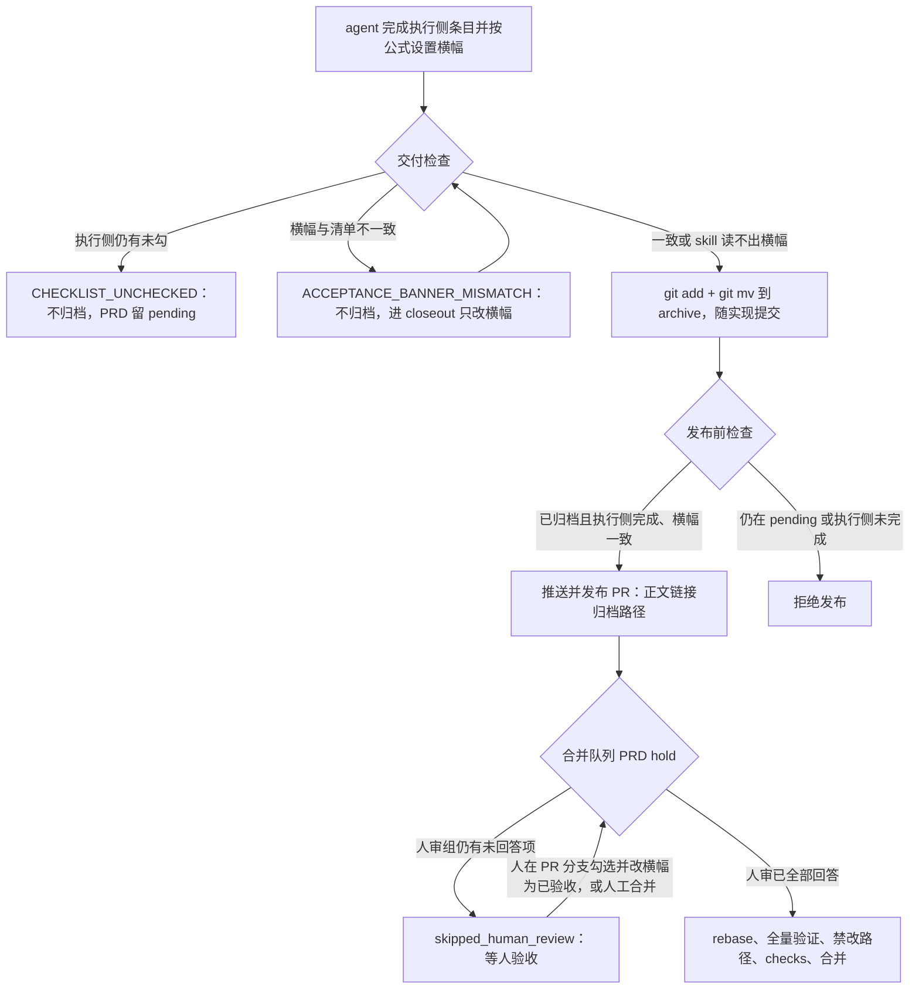

# PRD: 归档与确认语义分离——执行侧完成即归档、人工验收独立记录（Archive/Confirmation Separation）

> ✅ **交付前置**：无上游 PRD/Issue（§8 声明为 none）；但有一条**跨仓发版顺序**约束，不是编译依赖：本仓必须先能读懂新版 PRD skill 契约（v5）、并同步新版模板清单钩子，再交付本 PRD——否则 daemon 起执行循环前的预检会对新 skill 直接失败，或新归档的 PRD 被旧钩子拒绝提交。顺序 (a)→(d) 见 §8 Notes。
> 结构化声明见 §8 Delivery Dependencies，**那里是唯一事实源**。

> ✅ **验收状态**：已验收 — 验收清单已全部完成；验收事件为 ZataZhang/keda#186 的合并，记录见 §14。
> 本行是 §9 Acceptance Checklist 的投影，**那里是唯一事实源**。

> 本 PRD 分两个 altitude，分别服务不同读者，自上而下阅读：
>
> - **Part A · 人审层 (Review Layer)** — 需求方 / 验收人读这部分，决定"该不该做、做得对不对"，并通过风险地图知道**哪些地方必须亲自确认**。Part A 不出现实现机制、文件路径、命令。
> - **Part B · 执行器层 (Build Layer)** — 实现者（人或 Agent）读这部分动手。人只在 Part A 风险地图**点名处**下钻审查，其余默认交执行器 + 自动门禁（hook / 测试 / 架构检查）。

## Feature Overview (功能一览)

> 本块是第 10 节 Functional Requirements 的通俗投影，不是第二事实来源；行为验收以第 1 节的行为样例表为准。

- **归档只看执行侧工作**（FR-1）：执行者负责的验收条目全部完成，runner 就在交付时把 PRD 归档；还剩"只有人能回答"的验收项，不再让 PRD 滞留在 pending。
- **归档不替人回答**（FR-2）：归档时人审空框原样保留、横幅显示"待人工验收"；runner 与 agent 都不代勾、不改写人审项，也不再因为"还在等人审"拒绝已归档的 PRD。
- **横幅必须说真话**（FR-3）：归档前与发布前都核对验收状态横幅和人审空框是否一致；不一致就不归档、不发布，交给只改横幅的收尾回合。
- **发布前必须已归档**（FR-4）：正常交付路径发布 PR 前，PRD 必须已在 archive；"pending 带人审项也能发布"这条旧放行取消，失败 Draft PR 与返工两条既有例外不变。
- **自动合并不替人验收**（FR-5）：自动合并队列发现 PRD 仍有人审项没回答，不论它在 pending 还是 archive，都跳过等人；人确认后照常推进。
- **agent 提示与 PR 正文改口**（FR-6、FR-7）：执行 agent 的提示词不再教"留 pending、合并前补提交归档"；PR 正文链接归档后的 PRD 路径，并声明"合并即授权补记验收记录"。
- **兼容老 PRD 与旧版 skill**（FR-8）：没有人审项的 PRD 行为不变；读不出横幅的旧版 PRD skill 不触发横幅检查；失败交付照旧不归档；下游解锁时机不变。
- **合并时自动补记验收不在本次**（§11）：合并后由自动化比对代码树、勾选人审项、翻横幅，另开后续 PRD。

---

# Part A · 人审层 (Review Layer)

## 1. Introduction & Goals

### Problem Statement

PRD 写作规范（PRD skill）的新版本已经把"归档"改成"执行侧工作完成"：执行者负责的验收条目都做完就归档，人还没回答的验收项留着空框、横幅写"待人工验收"，人确认之后再补记。可是仓库里的 runner 还按旧语义办事，两边直接打架：

- **交付检查把"等人审"当成"没做完"**：只要还有一项"只有人能回答"的验收项，runner 就不归档，PRD 留在 pending 随 PR 发出去。
- **发布前检查反过来拒绝新语义**：一份已归档、但人审项还空着的 PRD 会被直接拒绝发布（报错原文为 Archived PRD still awaits human review）。按新规范产出的 PRD 在这里过不去。
- **agent 被教成旧流程**：执行 agent 的提示词仍写着"等人审的 PRD 留在 pending，人确认后在合并前补一个提交再归档"。
- **提前归档会让自动合并的"等人"保护悄悄消失**：自动合并队列只在 PRD 还躺在 pending 时才停下来等人；PRD 一旦进了 archive，它就看不到还有人审空框，会照常 rebase 并合并。只改归档、不改这里，等于让自动合并替人验收。

现成的例子：「跨 claim 交接失败上下文，并发布人可审阅的失败 Draft PR」那份 PRD，机器门禁已全部通过、只剩 4 项要作者本人确认，至今仍滞留在 pending，横幅停在"待人工验收"——按新规范它早该归档。受影响的人：交付 PRD 的工程师与 agent（被迫多走一次"补提交归档"）、PR 审阅者（确认动作被绑成归档前置）、维护路线图的人（pending 里混着"其实已经做完"的 PRD）。

### Interpretation (解读回显)

这是你**前置批准**的对象，也是唯一能拦住"解读错了"的关卡——oracle 和实现都是同一份解读的产物，解读错了它们会互相印证，下游检查全绿在错的行为上。散文没法逐条否证，所以先给可以逐格改的具体样例。

| 验证方式 | 输入 / 操作 | 期望观察到的结果 |
|---|---|---|
| 👀 人审 + 自动验证 | 一份 PRD 的执行侧条目全部完成，人审组还剩 1 个空框，横幅写"🧍 待人工验收"，runner 交付它 | 交付时就被移进 archive（随实现一起提交）；人审空框和横幅原样保留；发布前检查放行；人不需要做任何归档动作 |
| 🤖 自动验证 | 同样的 PRD，但还有 1 项执行侧条目没勾（失败场景） | 不归档，PRD 留在 pending；交付失败信息点名那一项未完成的条目 |
| 🤖 自动验证 | 执行侧已完成，但横幅停在"⬜ 未开工"、横幅缺失、人审组仍有空框却写"✅ 已验收"，或人审组没有空框却写"🧍 待人工验收"（边界场景） | 不归档、不发布；失败信息写明"验收状态横幅与验收清单不一致"以及应有的状态；收尾回合（closeout）只允许改横幅这一行并追加一条变更记录 |
| 🤖 自动验证 | 发布前检查分别遇到：已归档且只剩人审空框 / 仍在 pending / 已归档但执行侧条目没完成 | 第一种放行；第二种拒绝，提示 PRD 还没归档；第三种拒绝，点名未完成的执行侧条目 |
| 👀 人审 + 自动验证 | 自动合并队列遇到一条 PR：独立验证（verifier）已通过、自动签核已完成，但它的 PRD 已归档且横幅为"🧍 待人工验收" | 本轮记为"等人验收"并跳过：不 rebase、不重跑验证、不合并；人把人审项勾上、横幅改成"✅ 已验收"后，下一轮照常往下走 |
| 🤖 自动验证 | PR 正文写的是归档后的 PRD 路径，或仍写 pending 路径；或者两个都没写 | 前两种都算合规；两个都没写才报"缺 PRD 链接"；runner 自己补写的正文用归档路径，声明句写"合并即授权补记验收记录" |
| 🤖 自动验证 | 一份没有人审项、横幅为"✅ 已验收"的 PRD 交付；或者本机装的是读不出横幅的旧版 PRD skill；或者交付失败走失败 Draft PR | 第一种与今天完全一致（交付时归档、正常发布）；第二种跳过横幅检查，不因"读不出"而拦，其余按新规则判；第三种 PRD 照旧留在 pending、不归档 |

以上处于生效状态的每一行，都会成为 §7.6 的验收 oracle；修正任一行的"输入 / 操作"或"期望观察到的结果"，即修正对应验收标准。

**我默默定了这些**（没问你、我自己定的歧义点）

- **横幅公式与 PRD skill 逐字一致** → 人审组里还有空框，横幅必须是"🧍 待人工验收"；一个空框都没有，必须是"✅ 已验收"（旧称"✅ 可归档"同义）；"⬜ 未开工"、缺失或认不出的状态一律算不一致。仓库不另立第二套规则。
- **读不出就跳过，读得出就严判** → 本机 PRD skill 是旧版、根本不报告横幅时跳过横幅检查；新版报告了但横幅缺失或停在"未开工"时按不一致处理——宁可多一轮收尾，也不让 PRD 带着错误状态归档。
- **自动合并用保守口径判断"还在等人"** → 人审组里的空框，以及被误标成"等门禁"的人审项，都算没回答。只有人把它们改成已勾，自动合并才会继续。
- **发布前检查收紧为"必须已归档"** → 正常交付不再允许"pending 带人审项"发布；失败 Draft PR 与返工两条既有例外原样保留，不扩大。
- **不做一次性迁移** → 已经滞留在 pending、横幅为"待人工验收"的老 PRD，等它下次被 runner 交付检查时按新规则归档；本 PRD 不批量搬运它们。
- **下游解锁时机不变** → 依赖它的下游任务仍在上游 PR 合并时解锁：归档动作随 PR 一起落到主线，提前归档不会让下游提前开工。
- **撤回上一版"合并时只记账、不改文件"的模型** → 新版规范要求验收结论写回 PRD 本身（勾选人审项、横幅改"✅ 已验收"、追加变更记录），合并时的自动补记与代码树比对另开后续 PRD；本 PRD 交付后、后续 PRD 落地前，补记由人或 agent 手动完成。
- **删除从未接线的旧语义推送前脚本** → 仓库里有一个按"归档 = 全部勾完"判定的推送前脚本，没有任何地方调用它；留着会误导后来者，本次一并删除。

**我理解为不做**（你可能想要、但我读成不在范围内的）

- 合并时的代码树比对、验收账本、自动勾选人审项与自动翻横幅（后续 PRD）。
- 改合并策略、自动合并开关或独立验证（verifier）的语义；新增数据表、前端页面或第三方依赖。
- 在路线图上为"已归档、待人工验收"的 PRD 加徽标或待办视图——本次只在文档里写明"已归档 ≠ 已验收，看横幅"。

一句话读法：本 PRD 读作"让 runner 跟上新版 PRD 规范——执行侧做完就归档，人审项带着'待人工验收'横幅一起归档，自动合并仍然等人"，**不是**"归档等于人审通过"，也**不是**"合并时自动替人勾选"。必须守住的边界：归档仍只由 runner 执行；agent 永远不代勾人审项，也不把它们改标成"等门禁"；横幅与清单不一致时既不归档也不发布；失败交付永远不归档；两条既有发布例外不扩大；归档之后 agent 与审阅者都不得把 PRD 挪回 pending（人工验收驳回时的重开由人决定）。

### What The User Gets

- **执行 agent / 工程师**：PRD 做完就随实现一起归档，不再需要"人确认后补一个提交再归档"。
- **PR 审阅者**：打开 PR 就能看到已归档的 PRD 和"待人工验收"横幅，知道还剩哪几项要自己回答；回答与否不影响"工作已完成"这个事实。
- **自动合并的操作者**：自动合并照旧不会替人验收——只要人审项还空着，就停在"等人验收"。
- **路线图 / PRD 维护者**：pending 里只剩真正没做完的 PRD；"做完了、等人确认"的 PRD 在 archive 里，用横幅区分。

### Measurable Objectives

- 执行侧完成、人审组剩空框、横幅为"待人工验收"的 PRD：交付后位于 archive，人审空框与横幅逐字不变。
- 执行侧有未完成条目的 PRD：交付后仍在 pending，失败信息点名该条目。
- 横幅与清单不一致的 PRD：不归档、不发布，失败类型为"横幅不一致"，且可由收尾回合修复。
- 自动合并队列遇到已归档、人审未答的 PR：本轮结果为"等人验收"，对代码托管平台的 rebase 与合并调用为零。
- 没有人审项、横幅为"已验收"的 PRD：归档时机与提交内容和今天一致（回归）。
- 本机 PRD skill 为旧版、不报告横幅时：不触发横幅检查。

---

## 2. Human Review Map (介入与风险地图)

这一节只列需要人判断的决策。文件移动、代码检查、构建和回归测试由执行器完成，不要求 reviewer 逐项阅读实现细节。

### 决策一：归档只看执行侧工作，人审项带着"待人工验收"横幅一起归档

建议交付检查只看执行者负责的条目是否全部完成：完成就归档，不论人审组里还有没有空框。归档时 runner 不改 PRD 内容——人审空框保持空、横幅保持"🧍 待人工验收"，确认结论之后由人（或后续自动化）补记。为了不让"已归档"掩盖"还欠人一个确认"，横幅成了必须说真话的地方：横幅与清单对不上，就既不归档也不发布，交给只允许改横幅的收尾回合修正。

风险：PRD 在哪个目录不再说明它有没有被人验收过，判断是否已验收要看横幅；今天横幅还停在"未开工"的 PRD，会因此多一轮收尾才能归档（更严格，但不会放过错误状态）。失败交付、执行侧未完成的 PRD 仍然绝不归档。

**请确认：** 接受"归档只看执行侧条目是否全部完成——含待人工验收条目也照常在交付时归档，人审空框与 🧍 横幅保留，横幅不一致则不归档、不发布"吗？

**验收：** 一份只剩人审空框、横幅为"待人工验收"的 PRD 经 runner 交付后位于 archive，空框与横幅原样保留、发布前检查放行；把它的横幅改成"未开工"再交付，则不归档并报"横幅不一致"。

### 决策二：人回答之前自动合并一律不合并，不论 PRD 在哪个目录

今天自动合并队列靠"PRD 还在 pending"判断要不要等人；提前归档以后这条判断会失效。建议改成：先找到这份 PRD（pending 和 archive 都找），只要人审组里还有没回答的项——空框，或被误标成"等门禁"的人审项——就记为"等人验收"并跳过，不 rebase、不重跑验证、不合并。PRD 仍在 pending 的情况行为不变。

风险：误把人审项标成"等门禁"的老 PRD 会一直停在"等人验收"，需要人把它改成已勾才放行——这是有意的保守：宁可多等，也不替人验收。

**请确认：** 接受"自动合并只在人审组全部回答后才合并；已归档但仍待人工验收的 PR 一律跳过等人"吗？

**验收：** 一条独立验证已通过、签核已完成的 PR，其 PRD 已归档且横幅为"待人工验收"：自动合并队列本轮显示"等人验收"，托管平台上没有任何 rebase 或合并动作；人勾选并把横幅改成"已验收"后，下一轮继续往下走。

### 自动门禁，不需要逐项人工审阅

- 执行侧条目未完成时不归档、失败信息点名条目——由交付回归测试把守。
- 横幅不一致时不归档、不发布，且只交给收尾回合改横幅——由交付与收尾测试把守。
- 发布前检查的三种情形与两条既有例外——由发布回归测试把守。
- PR 正文的 PRD 链接与声明句——由正文契约测试把守。
- 没有人审项的 PRD、旧版 skill、失败交付的兼容行为——由兼容回归测试把守。
- 代码依赖方向、单文件行数上限、文档构建——由架构守卫、行数守卫和文档构建把守。

### 本次明确不涉及

无数据库结构变更、无前端改动、无鉴权或计费影响；不改合并策略与自动合并开关；不在合并后向主线写任何提交。

---

## 3. Usage And Impact After Implementation

### 执行 agent / 工程师（交付 PRD 的一方）

入口不变：仍由 runner 认领 Issue、执行、交付。变化在收尾：做完执行侧条目后，在最终复核时按公式设置验收状态横幅（人审组有空框 → 待人工验收；没有 → 已验收），人审项保持空框；runner 在交付时归档，并随实现一起提交。不再有"人确认后补一个提交再归档"的步骤。横幅写错时，runner 会开一轮只允许改横幅的收尾回合。

### PR 审阅者

在 PR 里看到的是归档后的 PRD 路径、"待人工验收"横幅和要回答的人审项。确认方式不变：合并带"合并即接受"声明的 PR 本身就是确认；也可以在 PR 分支上勾选人审项、把横幅改成"已验收"，让自动合并继续。合并之后的验收补记（勾选、翻横幅、追加变更记录）暂由人或 agent 手动完成，自动补记属于后续 PRD。

### 自动合并（Autopilot）的操作者

开关与配置不变。变化只有一处：已归档但人审未答的 PR 也会停在"等人验收"——以前只有 PRD 还在 pending 时才会停。

### PRD 维护者 / 路线图使用者

pending 目录只剩真正没做完的 PRD。"已归档"不再等于"已验收"，要看横幅。路线图的"已归档"状态与下游解锁时机不变（仍随 PR 合并生效）；路线图暂不区分"已归档待验收"，文档会写明这一点。

### 运行者

命令、配置和启动方式不变。上线前必须先完成交付前置横幅里说的跨仓准备（先让本仓认识新版规范、同步新版清单钩子），否则会出现启动预检失败或提交被旧钩子拒绝。

### Impact On Existing Behavior

- 没有人审项、横幅为"已验收"的 PRD：交付、归档、发布行为与今天一致。
- 横幅仍为"未开工"或缺横幅的 PRD：交付时多一轮只改横幅的收尾，之后照常归档。
- 已滞留在 pending、横幅为"待人工验收"的老 PRD：下次被交付检查时按新规则归档；不做批量迁移。
- 失败 Draft PR 与返工两条发布例外：不变；失败交付仍不归档。
- 本机 PRD skill 为旧版时：不做横幅检查，其余按新规则。
- 无新增配置项或环境变量。

---

## 4. Requirement Shape

- Actor: 执行 agent / 工程师（交付 PRD）、PR 审阅者、自动合并操作者、PRD 维护者 / 路线图使用者、运行者。
- Trigger: runner 交付带 PRD 的 Issue（交付检查与发布前检查）；自动合并队列每轮处理带 PRD 的 PR；runner 生成或校验 PR 正文。
- Expected behavior: 执行侧完成即归档、人审项保留待人回答；横幅不一致则不归档、不发布；人回答前自动合并不合并；提示词与 PR 正文与新语义一致；老 PRD 与旧版 skill 兼容。
- Scope boundary: 不做合并时的验收补记与代码树比对；不改合并策略；不加路线图视图；无数据表、前端、依赖变更。

---

# Part B · 执行器层 (Build Layer)

> 以下供实现者（人或 Agent）使用。人只在 Part A 风险地图点名处下钻审查；其余默认交执行器 + 自动门禁。

## 5. Repository Context And Architecture Fit

- Existing path:
  - 交付检查：`src/backend/core/use_cases/agent_runner_feedback.py::ensure_prd_delivery_ready`。pending 分支依次 `_validate_prd_change_log` → `if _validate_prd_checklist(...): return`（有人审待办即提前返回、不归档）→ `git add -- <prd>` + `git mv` 到 `resolve_prd_archive_path`；archive 分支在 Change Log 校验后若仍有人审待办则抛 `Archived PRD still awaits human review`；两处都没有则抛 `Canonical PRD not found`。调用方：`run_agent_execution_loop.py`（2 处）与 `agent_runner_publication.py`（复用路径）。
  - 发布前检查：同模块 `assert_prd_archived_for_publish`（archive 缺失 + pending 有人审待办 → 放行；archive 缺失其余情形 → `Archived PRD not found in worktree`；pending 与 archive 并存 → `PRD is still present at pending path`；已归档 + 人审待办 → `Archived PRD still awaits human review`），由 `agent_runner_publish.py::push_changes(require_prd_archived=True)` 调用。`require_prd_archived=False` 只有两处：`agent_runner_issue_handlers.py`（重试耗尽的失败 Draft PR）与 `create_prd_from_issue.py`（返工）。
  - 清单判据：`src/backend/core/use_cases/agent_runner_prd_delivery_gate.py::_validate_prd_checklist`（缺清单章节 → `SUBSTANTIVE`；执行项未勾 → `CHECKLIST_UNCHECKED` 并附 `_human_group_missing_hint`；返回 `bool(human_pending_items)`），只被 feedback 模块调用（交付检查两个分支 + 发布前检查）。该模块由 keda PR #180 从 feedback 拆出。
  - 清单解析：`src/backend/core/shared/prd_checklist.py::parse_prd_checklist` / `PrdChecklistResult`，经 `prd_contract_client.parse_prd_contract` 读取已安装 PRD skill 的 `prd_contract.py --json`（keda PR #178 起 keda 不再自己解析 PRD 文本）。`human_pending_items` = 人审组内的 `[ ]` + `[~]`。
  - 失败分类与收尾：`src/backend/core/shared/models/agent_runner.py::DeliveryGateFailureKind`（`is_closeout_eligible = self is not SUBSTANTIVE`）；`agent_runner_closeout.py::_CLOSEOUT_KIND_INSTRUCTIONS`；`agent_runner_closeout.py::resolve_prd_worktree_path(issue, worktree_path)`（先 pending 后 archive）。
  - 自动合并 hold：`agent_runner_merge_queue.py::_process_one`，在自动签核与 `create_or_reuse_worktree` 之后、rebase 之前，只检查 `worktree_path / prd_relative_path`（pending 路径）：存在且有人审待办 → `skipped_human_review`，存在无待办 → `skipped_prd_pending`；文件已在 archive 时整段跳过。公开入口 `process_merge_queue`，由 `review_once` 每轮调用。
  - Agent 提示：`agent_runner_feedback.py` 的 `PRD_ARCHIVE_OWNERSHIP_RULE`（"…stays pending for the PR … a follow-up PR commit may tick the items and archive the PRD before merge"）与 `RUNNER_OWNED_CHECKLIST_ITEM_RULE`（"…the runner can publish that PRD from `tasks/pending/` without archiving it"）；前者也被 `build_prd_review_reference` 嵌入 review packet。该行为由 keda PR #162（defer human PRD review until PR stage）引入，本 PRD 取代它。
  - PR 正文契约：`agent_runner_pr_body_contract.py`——`_DETERMINISTIC_ACCEPTANCE_STATEMENT` 含 "authorizes post-merge archival of that PRD"；`_CONTRACT_ANCHOR_DESCRIPTIONS["prd-link"]` 为 "body does not reference the Issue's pending PRD path"；`find_pr_body_contract_violations` 的 `prd-link` 只认 pending 路径；`append_missing_contract_anchors` 写 `- PRD: <pending path>`；`build_contract_prompt_prefix` 第 1、2 条同口径。小节标题 `_DETERMINISTIC_ACCEPTANCE_HEADING = "## Human Acceptance And PRD Archive"` 与 marker `<!-- iar:merge-acceptance version=1 -->` 被测试钉住。
  - 契约版本：`src/backend/core/shared/prd_machine_contract.py::SUPPORTED_MACHINE_CONTRACT_VERSIONS = (3, 4)`；daemon 起执行循环前据此预检，不在集合内即 fail fast（`generated_prd_content.py` 同用）；docstring 已写明"先加新版本、skill 再 bump"的发版纪律。
  - 孤儿脚本：`hooks/check_prd_archive_pre_push.py`（"归档 = 全部勾完"的旧语义推送前检查），全仓零引用、未接入 `.pre-commit-config.yaml`。
- Reuse candidates: 上述位置全部就地修改；横幅状态与人审空框直接取 skill 契约 JSON 的 `acceptance_status` 与 `checklist.human_unchecked`（v5 新增）；hold 复用 `resolve_prd_worktree_path`；新失败种类复用既有 closeout 通道；PR 正文的归档路径换算复用 `resolve_prd_archive_path`（`agent_runner_pr_body_contract.py` 已从 feedback 导入 `extract_prd_path`，不新增导入边）。
- Architecture pattern to preserve: 四层依赖 `api → core → engines → infrastructure`；PRD 格式只由 skill 的 `prd_contract.py` 解析，keda 不新增横幅文本解析；归档移动只在 `ensure_prd_delivery_ready` 一处；`agent_runner_merge_queue` → `agent_runner_closeout` 的导入无环（已核对）。
- Frontend impact: `No frontend impact`——只改 runner 的交付、发布、合并队列判据与提示词、PR 正文文本；路线图页面不改（可见性增强列为后续）。
- Existing PRD relationship（先查 `tasks/pending/`，再查相关 `tasks/archive/`）:
  - `tasks/pending/P1-FEAT-20260922-000431-blocked-draft-pr-validation-failure.md`：independent。它是本问题的现成例子（机器门禁全绿、横幅 🧍、仍滞留 pending）；它"失败 Draft PR 不归档、PRD 保持 pending"的失败路径语义与本 PRD 一致。本 PRD 交付后，它正文里依赖"等人审的 PRD 留在 pending"的描述会过时，列入 §12。
  - `tasks/pending/P1-FEAT-20260916-134008-roadmap-prd-cicd-monitor-auto-repair.md`：independent；路线图 CI/CD 展示，不读人审状态。
  - `tasks/archive/20260522-113000-prd-agent-prompt-prd-archive-enforcement.md`（runner 独占归档）与 `tasks/archive/P1-FEAT-20260824-133115-runner-delivery-closeout-agent.md`（closeout）：沿用其所有权与收尾通道，只改判据与新增一个失败种类。
  - `tasks/archive/P1-FEAT-20260703-105322-autopilot-merge-queue-fast-profile.md`：沿用 7 步门禁链，只改 PRD hold 的定位方式。
  - PR body contract（keda PR #168）：本 PRD 修改其路径口径与声明句文本，不改 marker 与小节标题。lifecycle 账本（keda PR #153）：不接入。
  - 其余 pending PRD：无重复。
- Redundancy risks: 在 keda 里另写一份横幅解析（与 skill 双实现漂移）；在合并队列里另写 PRD 定位（与 closeout 重复）；新增"验收服务 / 账本"平行抽象（本次不做）。

---

## 6. Recommendation

### Recommended Approach

- Approach: 在既有交付检查、发布前检查、合并队列 hold、agent 提示词与 PR 正文契约上就地改判据；横幅状态直接消费 skill 契约 JSON；新增一个失败种类走既有 closeout。
- Why this is the best fit: 判据已集中在 `agent_runner_prd_delivery_gate` 与 `agent_runner_feedback`，hold 已有现成的 PRD 定位函数；PRD 格式解析已统一到 skill 脚本，不需要也不应该在 keda 再写一份。
- Rejected redundancy: 不新增验收服务、账本或表；不在 keda 解析横幅文本；不在合并队列另写 PRD 定位；不保留"pending 带人审项可发布"这条第二路径。

### Proposed Solution Summary (实现机制)

- **核心机制**：归档判据只看执行侧（`execution_unchecked_items` 为空即归档）；横幅一致性作为归档与发布的共同前置；"是否还在等人"只在合并队列判断，且按 PRD 实际位置判断。
- **谁提供输入**：PRD 作者 / 执行 agent 在最终复核时显式设置横幅；系统不推断状态，只核对横幅与清单是否一致。横幅状态由已安装的 PRD skill 解析（`acceptance_status`），keda 只消费；skill 不报告该字段时（v3/v4）跳过横幅检查。
- **接入点**：`ensure_prd_delivery_ready`（交付）、`assert_prd_archived_for_publish`（发布）、`_process_one`（合并队列）、`PRD_ARCHIVE_OWNERSHIP_RULE` / `RUNNER_OWNED_CHECKLIST_ITEM_RULE`（提示）、`agent_runner_pr_body_contract`（PR 正文）。
- **状态 / 输出变化**：含未答人审项的 PRD 在交付提交里就从 pending 移到 archive；发布前检查不再接受 pending；新失败种类 `ACCEPTANCE_BANNER_MISMATCH`；合并队列对已归档 🧍 PRD 输出 `skipped_human_review`；PR 正文链接归档路径。
- **刻意避免的复杂度**：不新增存储与状态机；不在合并后写主线；不在 keda 实现第二个 PRD 解析器；不改合并策略。

### Alternatives Considered (Only When Useful)

- Alternative: 保持现状（含人审项的 PRD 留 pending，人确认后补提交归档）。
- Why not chosen: 与已发布的 PRD skill v5 语义冲突，按新规范产出的 PRD 无法通过发布前检查；还要求人做本不属于人的归档搬运。
- Alternative: 上一版设计——合并时比对"验证树 vs 合并树"、只写账本与 Issue 投影、不改 PRD 文件。
- Why not chosen: v5 规定验收结论写回 PRD（勾选、翻横幅、追加变更记录）；合并时自动补记与树比对仍有价值，但与本次"让 runner 跟上归档语义"可独立交付，拆成后续 PRD。
- Alternative: 让自动合并在 PRD 已归档时直接合并（把归档视为可合并）。
- Why not chosen: 等于让自动化代替人行使验收权，违背"归档 ≠ 验收"。
- Alternative: keda 自己解析横幅文本。
- Why not chosen: 与 skill 的 `prd_contract.py` 形成双实现，规则漂移时两边判定不一致；keda PR #178 刚消除过同类重复。

---

## 7. Implementation Guide

This section is a living implementation guide based on current repository analysis. If implementation discovers additional affected files, hidden dependencies, edge cases, or a better path, update this PRD before proceeding.

### 7.1 Core Logic

- **横幅判据（只消费 skill 契约）**：`PrdChecklistResult` 新增 `acceptance_status: str | None`（取 `contract.get("acceptance_status")`；键缺失即 `None`，表示本机 skill 读不出横幅）与 `human_unchecked_items`（取 `checklist.get("human_unchecked", [])`）。新函数 `_validate_acceptance_banner(checklist_result, prd_relative_path)`：`acceptance_status is None` → 跳过；`human_unchecked_items` 非空 → 期望 `awaiting_human`；为空 → 期望 `accepted`；不相等（含 `not_started` 与 `""`）→ 抛 `PrdDeliveryError(kind=ACCEPTANCE_BANNER_MISMATCH)`，信息给出现状态、应有状态与人审空框数。横幅判据用 `human_unchecked_items`（只算 `[ ]`），与 skill 检查器的 `open_human_count` 同口径；`human_pending_items`（`[ ]` + `[~]`）只用于合并队列 hold。
- **交付检查**：pending 分支依次为 Change Log 校验 → 执行侧校验（`CHECKLIST_UNCHECKED`，不变）→ 横幅校验 → `git add -- <pending>` + `git mv <pending> <archive>`，不再因人审待办提前返回。archive 分支为 Change Log 校验 → 执行侧校验 → 横幅校验，删除 `Archived PRD still awaits human review`。两处都不存在仍抛 `Canonical PRD not found`。
- **发布前检查**（`require_prd_archived=True`）：archive 不存在 → 拒绝，信息说明 PRD 尚未归档（删除"pending 有人审待办即放行"分支）；pending 与 archive 并存 → 拒绝（不变）；archive 存在 → 执行侧校验 + 横幅校验，删除 `Archived PRD still awaits human review`。`require_prd_archived=False` 的两处调用不变，也不调用交付检查，因此失败交付永不归档。
- **合并队列 hold**：`_process_one` 用 `resolve_prd_worktree_path(issue, worktree_path)` 定位；找到后 `parse_prd_checklist`：`human_pending_items` 非空 → `skipped_human_review`；位于 pending 且无人审待办 → `skipped_prd_pending`（不变）；位于 archive 且无人审待办 → 继续 rebase 及后续门禁。位置判断在 hold 内完成，复用 feedback 模块的 `is_prd_archive_path`（发布前检查同用），不另写路径换算。
- **收尾**：`ACCEPTANCE_BANNER_MISMATCH` 沿用 `is_closeout_eligible`（非 `SUBSTANTIVE` 即可收尾）。`_CLOSEOUT_KIND_INSTRUCTIONS` 新条目：只改 PRD 的验收状态横幅这一行，按失败信息给出的应有状态书写（横幅缺失时补在交付前置横幅之后，没有交付前置横幅则补在标题下）；不得改动任何复选框与其他正文；追加一条结构化 Change Log。可写范围沿用既有规则（规范 PRD 的 pending / archive 路径与证据目录）。
- **提示词**：`PRD_ARCHIVE_OWNERSHIP_RULE` 改为"runner 在交付时归档，含未答 Human-Confirmed 项也归档；归档后 agent 与 reviewer 不得把 PRD 挪回 pending；人工验收驳回时的重开由人决定"。`RUNNER_OWNED_CHECKLIST_ITEM_RULE` 末句改为"Human-Confirmed 项保持 `- [ ]`，不代勾、不改 `[~]`；最终复核时按公式设置验收状态横幅（有空框 → 🧍 待人工验收，否则 → ✅ 已验收）"。`build_prd_review_reference` 因嵌入前者而同步变化，无需单独改。
- **PR 正文契约**：`prd-link` 在正文含 pending 路径或其 `resolve_prd_archive_path` 结果时即满足；`append_missing_contract_anchors` 写 `- PRD: <archive path>`（无法换算时回落 pending 路径）；`_DETERMINISTIC_ACCEPTANCE_STATEMENT`、`_CONTRACT_ANCHOR_DESCRIPTIONS["prd-link"]` 与 `build_contract_prompt_prefix` 第 1、2 条改为归档路径与 "authorizes post-merge acceptance recording"。小节标题与 marker 不变。

### 7.2 Change Impact Tree

```text
.
├── Backend Layer
│   ├── src/backend/core/shared/prd_checklist.py
│   │   [修改]
│   │   【总结】PrdChecklistResult 增加横幅状态与人审空框两个字段，均直接取自 skill 契约 JSON
│   │
│   │   ├── acceptance_status: str | None —— contract.get("acceptance_status")；键缺失为 None
│   │   └── human_unchecked_items —— checklist.get("human_unchecked", [])；v3/v4 为空
│   │
│   ├── src/backend/core/shared/models/agent_runner.py
│   │   [修改]
│   │   【总结】DeliveryGateFailureKind 新增 ACCEPTANCE_BANNER_MISMATCH = "acceptance_banner_mismatch"，docstring 补一行
│   │
│   ├── src/backend/core/use_cases/agent_runner_prd_delivery_gate.py
│   │   [修改]
│   │   【总结】清单判据不再以"有人审待办"阻止归档；新增横幅一致性校验
│   │
│   │   ├── _validate_prd_checklist：保留缺章节 / 执行项未勾两类失败；调用方不再据返回值提前返回（返回值可删除）
│   │   └── 新增 _validate_acceptance_banner(checklist_result, prd_relative_path)
│   │
│   ├── src/backend/core/use_cases/agent_runner_feedback.py
│   │   [修改]
│   │   【总结】交付检查执行侧完成即归档；发布前检查改为"必须已归档"；改写两条 agent 规则文本
│   │
│   │   ├── ensure_prd_delivery_ready：pending 分支去掉人审待办提前返回；archive 分支删除 "awaits human review" 拒绝；两分支加横幅校验
│   │   ├── assert_prd_archived_for_publish：删除"archive 缺失 + pending 有人审待办 → 放行"与 "awaits human review" 拒绝；docstring 同步
│   │   ├── PRD_ARCHIVE_OWNERSHIP_RULE：交付时归档含未答人审项；归档后不得挪回 pending
│   │   ├── RUNNER_OWNED_CHECKLIST_ITEM_RULE：人审项保持 - [ ]、不代勾、不改 [~]；最终复核时设置横幅
│   │   └── is_prd_archive_path：新增，判断 PRD 相对路径是否位于 tasks/archive/；发布前检查与合并队列 hold 共用
│   │
│   ├── src/backend/core/use_cases/agent_runner_closeout.py
│   │   [修改]
│   │   【总结】_CLOSEOUT_KIND_INSTRUCTIONS 新增 ACCEPTANCE_BANNER_MISMATCH：只改横幅一行 + 追加 Change Log
│   │
│   ├── src/backend/core/use_cases/agent_runner_merge_queue.py
│   │   [修改]
│   │   【总结】_process_one 的 PRD hold 改用 resolve_prd_worktree_path 定位（pending 或 archive），人审待办非空即 skipped_human_review
│   │
│   ├── src/backend/core/use_cases/agent_runner_pr_body_contract.py
│   │   [修改]
│   │   【总结】PRD 链接接受归档路径；补锚点写归档路径；声明句改为 post-merge acceptance recording
│   │
│   │   ├── find_pr_body_contract_violations 与 _CONTRACT_ANCHOR_DESCRIPTIONS["prd-link"]
│   │   ├── append_missing_contract_anchors：- PRD: <archive path>
│   │   ├── _DETERMINISTIC_ACCEPTANCE_STATEMENT 与 build_contract_prompt_prefix 第 1、2 条
│   │   └── 不变：_DETERMINISTIC_ACCEPTANCE_HEADING、<!-- iar:merge-acceptance version=1 -->
│   │
│   ├── src/backend/core/use_cases/agent_runner_publish.py
│   │   [修改]
│   │   【总结】push_changes 中 require_prd_archived 的 docstring 改为新语义；两处 False 调用方不动
│   │
│   └── hooks/check_prd_archive_pre_push.py
│       [删除]
│       【总结】旧语义（归档 = 全部勾完）孤儿脚本，全仓零引用
│
├── Docs
│   └── docs/guides/agent-runner.md
│       [修改]
│       【总结】"PRD-backed Issue 的强制 Closeout"第 2–4 条、"PR body 契约"第 1–2 条、"7 步门禁链"补 PRD hold、"依赖等待"与路线图"已归档"行注明 已归档 ≠ 已验收
│
├── Tests
│   └── tests/
│       [修改] / [新增]
│       【总结】翻转旧语义用例，补新判据用例
│
│       ├── test_agent_runner_prd_delivery.py：翻转 test_human_review_stays_pending_and_can_be_published、test_deferred_human_review_gate_stays_pending、test_archived_prd_cannot_claim_unreviewed_human_item；归档成功夹具补横幅；新增 rv-1 真实 git 用例与 rv-3 横幅参数化用例
│       ├── test_agent_runner_publish.py：翻转 test_push_changes_accepts_pending_prd_waiting_for_human_review
│       ├── test_agent_runner_merge_queue.py：test_pending_prd_prevents_auto_merge 增加 archive 参数化；新增 rv-5 两轮用例
│       ├── test_agent_runner_pr_body_contract.py 与 test_agent_runner_prompt_contract.py：路径与声明句
│       ├── test_prd_checklist.py：两个新字段（含 v4 形状 JSON 下的 None 与空）
│       └── test_agent_runner_closeout.py：新失败种类可进 closeout、指令文本
│
└── Frontend
    └── No frontend impact（路线图不改；可见性增强列为后续）
```

### 7.3 Risk Classification Register And Executor Drift Guard

#### Risk Classification Register（风险分级登记）

| 变更点 | tier | 决定维度 / override | 介入 | oracle / gate |
|---|---|---|---|---|
| 交付检查：执行侧完成即归档，含未答人审项 | R2 | 持久状态（PRD 在仓库中的位置与交付提交内容）+ 兼容性；fixed zone：core 编排 | 人确认（§2 决策一）+ 自动门禁 | rv-1、rv-2 |
| 横幅一致性检查与新失败种类 | R1 | 单组件判据，失败可由 closeout 修复、可回滚 | 执行器 + 失败判别测试（随决策一确认） | rv-3 |
| 发布前检查改为"必须已归档" | R1 | 单函数判据，两条既有例外不变 | 执行器 + 失败判别测试 | rv-4 |
| 合并队列 hold 按 PRD 实际位置判断 | R3 | 信任边界：漏拦即由自动化代替人行使验收权并合并进主线（privilege failure）；fixed zone：core 编排 | 人确认（§2 决策二）+ 可执行负控 | rv-5 |
| PR 正文契约的路径与声明句 | R1 | 文本契约；marker 与小节标题不变 | 执行器 + 契约测试 | rv-6 |
| 兼容：无人审项 PRD、旧版 skill、失败交付 | R1 | 回归面 | 执行器 + 回归测试 | rv-7 |
| 删除孤儿推送前脚本、文档同步 | R0 | 零引用、纯文档 | 执行器 + rg 与文档构建 | Drift Guard |

R2/R3 合计 2 条（rv-1、rv-5），未超过 3 条的范围信号。

#### Executor Drift Guard

| Check | Command | Expected Result | If It Fails, Inspect First |
|---|---|---|---|
| 发版前置：契约版本 | `rg -n "SUPPORTED_MACHINE_CONTRACT_VERSIONS: tuple" src/backend/core/shared/prd_machine_contract.py` | 集合含 5 | 未满足即停止实现，先做 §8 Notes (a) |
| 发版前置：清单钩子 | `rg -n "HUMAN_CONFIRMED_GROUP_PREFIX" hooks/shared/check_prd_acceptance_checklist.py` | 有命中（新版模板钩子带 Human-Confirmed 豁免） | 未满足即停止实现，先做 §8 Notes (c) |
| 发版前置：已安装 skill | `uv run python -c "from backend.core.shared.prd_skill_location import resolve_prd_skill_path; print(resolve_prd_skill_path())"`，再对输出路径执行 `rg -n "Machine-Contract-Version"` | 版本为 5 | 重新执行 `iar init` 安装 skill（§8 Notes (c)） |
| 归档移动唯一 | `rg -n -F '"mv"' src/backend` | 只在 `agent_runner_feedback.py::ensure_prd_delivery_ready` | 新增的发布或收尾路径是否私自移动 PRD |
| 旧语义残留 | `rg -n -e "awaits human review" -e "stays pending for the PR" -e "without archiving it" -e "post-merge archival" -e "PRD 保持 pending" src/backend docs` | 无命中 | 两条提示词常量、PR 正文声明句、docs 强制 Closeout 第 2–4 条 |
| hold 复用定位函数 | `rg -n -e "resolve_prd_worktree_path" -e "pending_prd_path" src/backend/core/use_cases/agent_runner_merge_queue.py` | 只命中 `resolve_prd_worktree_path` | `_process_one` 是否仍拼接 pending 路径 |
| 不新增横幅文本解析 | `rg -n -e "验收状态" -e "待人工验收" -e "Acceptance Status" src/backend` | 只出现在提示词、closeout 指令文本与 docstring / 注释中，没有正则或解析代码 | `prd_checklist.py`、`agent_runner_prd_delivery_gate.py` |
| 孤儿脚本已删 | `rg -n check_prd_archive_pre_push . -g '!tasks/**'` | 无命中，文件不存在（`tasks/` 下的本 PRD 与证据文本会提到脚本名，故排除） | `.pre-commit-config.yaml`、justfile、docs |
| marker 与标题不变 | `rg -n -F -e "<!-- iar:merge-acceptance version=1 -->" -e "## Human Acceptance And PRD Archive" src/backend` | 两者仍在 `agent_runner_pr_body_contract.py` | 合并队列对 marker 的消费方 |
| 导入无环与行数上限 | `uv run python -c "import backend.core.use_cases.agent_runner_merge_queue"` 与 `git diff --name-only --diff-filter=AM -- '*.py' \| xargs uv run python hooks/shared/check_max_file_lines.py --max-lines 1000`（脚本必须带文件参数） | 导入成功；本次触及的文件无超限（`agent_runner_feedback.py` 改动前 912、改动后 920 行非空行，新逻辑放 `agent_runner_prd_delivery_gate.py`）；仓库里另有存量超限文件，与本次无关 | 新导入边、feedback 是否继续膨胀 |

### 7.4 Flow Or Architecture Diagram



### 7.5 ER Diagram (Only When Data Model Changes)

- `No data model changes in this PRD.`

### 7.6 Realistic Validation Plan (Oracle 块)

机读 + 执行追踪的单一 oracle 源：§9 证据包引用这里的 `id`。R0/R1 只写必填项，R2 加证据链，R3 与人审项再加负控。所有负控都来自"实现前在未修改代码上先跑同一用例"的那次红跑，或测试边界打桩，不改生产代码。

```yaml
- id: rv-1
  behavior: "执行侧条目全部完成、人审组剩 1 个空框、横幅为 🧍 待人工验收的 PRD，在 runner 交付时就被归档，人审空框与横幅原样保留，发布前检查放行"
  reviewer: human
  real_entry: "runner 成功路径的交付段：在真实 git 仓库 fixture 的 worktree 上依次调用 ensure_prd_delivery_ready 与 assert_prd_archived_for_publish，与 run_agent_execution_loop 成功路径同一调用顺序；PRD 解析走本机已安装的 v5 PRD skill"
  expected: "tasks/archive/<prd>.md 存在且已 staged（git status 显示 rename），tasks/pending/<prd>.md 不存在；归档文件与交付前的 pending 文件逐字节相同；发布前检查不抛错"
  presentation: "证据报告内嵌的终端记录：交付前后 git status --short 与 tasks/pending、tasks/archive 目录列表，以及归档后 PRD 的横幅行与 Human-Confirmed 小节原文"
  mock_boundary: "只允许不跑 agent 与 GitHub；git 必须走真实 SubprocessRunner，PRD 解析必须走真实安装的 skill 脚本，不得 stub parse_prd_contract"
  tier: R2
  test_layer: integration
  required_for_acceptance: true
  critical_value_source: "fixture PRD 文本：执行侧条目全为 [x] 或 [~]，Human-Confirmed 组 1 个 [ ]，横幅为 🧍 待人工验收；归档位置从 git 索引与文件系统读取"
  must_cross: "skill 契约 JSON 解析 -> 执行侧判据 -> 横幅一致性判据 -> git add 与 git mv -> 发布前已归档检查"
  forbidden_bypasses: "直接调用 _validate_prd_checklist 或 parse_prd_checklist 代替交付入口；用 fake process runner 代替真实 git；预先把 PRD 放进 archive；在测试里改横幅或勾选人审项"
  fresh_state_probe: "调用结束后另起 git status --porcelain 与 git ls-files 读取索引，并从磁盘重新读取归档文件比对字节"
  final_tree_evidence: "证据报告记录最终实现提交的 tree id；交付检查、发布前检查、清单解析或已安装 skill 版本有任何改动后重跑"
  negative_control: "实现前在未修改的 main 上先跑同一用例：交付检查因有人审待办提前返回，PRD 仍留在 pending"
  expected_fail: "断言 tasks/archive/<prd>.md 存在失败；pending 文件仍在，git status 无 rename"
- id: rv-2
  behavior: "执行侧还有 1 项未勾的 PRD 交付时不归档，失败信息点名该条目"
  reviewer: verifier
  real_entry: "与 rv-1 同一交付入口 ensure_prd_delivery_ready，fixture 保留 1 项执行侧 [ ]"
  expected: "抛 PrdDeliveryError，kind 为 CHECKLIST_UNCHECKED，信息含该条目原文；PRD 仍在 tasks/pending/，git 无 rename"
  mock_boundary: "同 rv-1；不得 stub 清单解析"
  tier: R1
  test_layer: integration
  required_for_acceptance: true
- id: rv-3
  behavior: "横幅与验收清单不一致时既不归档也不发布，失败种类可交给收尾回合，收尾指令只允许改横幅并追加 Change Log"
  reviewer: verifier
  real_entry: "ensure_prd_delivery_ready 与 assert_prd_archived_for_publish，参数化四种横幅：⬜ 未开工、横幅缺失、人审有空框却写 ✅ 已验收、人审无空框却写 🧍 待人工验收；另读取 DeliveryGateFailureKind 与 _CLOSEOUT_KIND_INSTRUCTIONS"
  expected: "四种情形均抛 PrdDeliveryError，kind 为 ACCEPTANCE_BANNER_MISMATCH，信息含现状态与应有状态；PRD 不移动；ACCEPTANCE_BANNER_MISMATCH.is_closeout_eligible 为真；指令文本限定只改横幅一行并追加一条 Change Log"
  mock_boundary: "真实 git 与真实 skill 解析；closeout agent 本身不跑"
  tier: R1
  test_layer: integration
  required_for_acceptance: true
- id: rv-4
  behavior: "发布前检查在正常交付路径要求 PRD 已归档：已归档且只剩人审空框放行，仍在 pending 拒绝，已归档但执行侧未完成拒绝；两条既有例外不变"
  reviewer: verifier
  real_entry: "push_changes(require_prd_archived=True) 经 assert_prd_archived_for_publish 判定；对照 require_prd_archived=False 的调用"
  expected: "第一种不抛错并继续推送；第二种抛错且信息说明 PRD 尚未归档，不再因 pending 有人审待办而放行；第三种抛错并点名执行侧条目；require_prd_archived=False 时三种都不拦"
  mock_boundary: "推送命令可用 FakeProcessRunner 记录；PRD 文件放在真实 tmp worktree，解析走真实 skill"
  tier: R1
  test_layer: integration
  required_for_acceptance: true
- id: rv-5
  behavior: "自动合并队列遇到 verifier 已通过、签核完成、但 PRD 已归档且人审未答的 PR，本轮记为等人验收并跳过，不 rebase、不重跑验证、不合并；人勾选并改为 ✅ 已验收后下一轮继续"
  reviewer: human
  real_entry: "process_merge_queue，即 review_once 每轮调用的自动合并入口；FakeGitHubClient 提供一条已带 validation/verifier-passed、签核已全勾的 PR，Issue worktree 中只有 tasks/archive/<prd>.md"
  expected: "第一轮 outcome 为 skipped_human_review，FakeGitHubClient 无 merge_pull_request 调用，FakeProcessRunner 无 rebase 与验证命令；把人审项改为 [x]、横幅改为 ✅ 已验收后，第二轮 outcome 不再是 skipped_human_review 且出现 rebase 调用"
  presentation: "证据报告内嵌两轮 process_merge_queue 的 outcome 列表与 fake 客户端调用记录原文，并附两轮之间 PRD 横幅行与 Human-Confirmed 小节的前后对比"
  mock_boundary: "GitHub 与 git 命令用 fake；PRD 必须是 worktree 中的真实文件，解析必须走真实 skill；不得绕过 process_merge_queue 直接调用私有 helper 判定 hold"
  tier: R3
  test_layer: integration
  required_for_acceptance: true
  critical_value_source: "worktree 中归档 PRD 的 Human-Confirmed 空框数与横幅状态，经 resolve_prd_worktree_path 定位、skill 契约 JSON 读取"
  must_cross: "process_merge_queue -> 自动签核 -> create_or_reuse_worktree -> resolve_prd_worktree_path -> parse_prd_checklist -> hold 判定 -> MergeQueueOutcome"
  forbidden_bypasses: "把 PRD 放在 pending 来触发旧 hold；stub parse_prd_checklist 或 resolve_prd_worktree_path；只断言 outcome 而不断言零 merge 与零 rebase 调用"
  fresh_state_probe: "第二轮前从磁盘改写并重新读取 PRD，由新一轮 process_merge_queue 独立观察 outcome 与 fake 调用记录"
  final_tree_evidence: "证据报告记录最终实现提交的 tree id；合并队列、closeout 定位函数或清单解析改动后重跑"
  negative_control: "实现前在未修改的 main 上先跑同一用例：hold 只看 pending 路径，归档 PRD 被忽略，队列继续 rebase 与合并"
  expected_fail: "断言第一轮 outcome 为 skipped_human_review 失败，或断言零 merge_pull_request 调用失败"
- id: rv-6
  behavior: "PR 正文契约接受归档后的 PRD 路径，runner 补写的正文用归档路径并声明合并即授权补记验收记录"
  reviewer: verifier
  real_entry: "find_pr_body_contract_violations 与 append_missing_contract_anchors，Issue body 的 PRD path 为 tasks/pending/<prd>.md"
  expected: "正文含 tasks/archive/<prd>.md 或 tasks/pending/<prd>.md 时无 prd-link 违规；两者都没有时报 prd-link；补锚点写 - PRD: tasks/archive/<prd>.md，声明句含 authorizes post-merge acceptance recording；小节标题与 merge-acceptance marker 逐字不变"
  mock_boundary: "纯函数，无 mock"
  tier: R1
  test_layer: unit
  required_for_acceptance: true
- id: rv-7
  behavior: "兼容：没有人审项且横幅为 ✅ 已验收的 PRD 交付行为与今天一致；读不出横幅的旧版 skill 不触发横幅检查；失败交付路径不归档"
  reviewer: verifier
  real_entry: "ensure_prd_delivery_ready 与 push_changes：一组用真实 v5 skill 跑无人审项 PRD；一组在测试边界把 parse_prd_contract 打桩为不含 acceptance_status 键的 v4 形状 JSON；一组走 require_prd_archived=False 的失败 Draft PR 发布"
  expected: "第一组归档提交内容与改动前基线一致；第二组横幅为 ⬜ 也不因横幅失败，只按执行侧判据归档；第三组不调用交付检查，PRD 保持 pending，发布不被拦"
  mock_boundary: "只允许在测试边界打桩 parse_prd_contract 模拟旧版 skill；其余同 rv-1"
  tier: R1
  test_layer: integration
  required_for_acceptance: true
```

Failure triage:
- `real_entry` 跑挂先查已安装 PRD skill 的版本与 `IAR_PRD_SKILL_PATH`（`tests/conftest.py` 会话级指向真实安装位置），再查 fixture 横幅与 Human-Confirmed 分组标题，别急着改判据。
- `acceptance_status` 为 `None` 说明测试进程读到的是 v3/v4 skill，横幅类断言不会生效；先完成 §8 Notes (c)。
- **禁止为了让 oracle 能变红去改生产代码**（故障注入开关、失败模式、test-only 配置项、计数器、观测钩子）。负控来源依次是：实现前在未修改 main 上的红跑、测试边界打桩、`tests/` 下的 fake。

### 7.7 Low-Fidelity Prototype (Only When Required)

- `No low-fidelity prototype required for this PRD.`

### 7.8 Interactive Prototype Change Log (Only When Files Actually Changed)

- `No interactive prototype file changes in this PRD.`

### 7.9 External Validation (Only When Web Research Was Used)

- `No external validation required; repository evidence was sufficient.`

---

## 8. Delivery Dependencies

工具中立的排期元数据。无上游依赖；跨仓发版顺序写在 Notes。

- Group: none
- Depends on tasks/issues:
  - none
- Gate type: none
- Notes: 无编译或排期上游；但有跨仓发版顺序，必须按 (a)→(d) 进行，否则 daemon 起执行循环前的预检失败，或新归档的 PRD 被旧钩子拒绝提交。
  - (a) keda 先单独发一个 chore：把 SUPPORTED_MACHINE_CONTRACT_VERSIONS 从 (3, 4) 扩到 (3, 4, 5)。必须早于模板 main 携带 v5，因为 CD 里的 iar init 固定安装模板 main，测试也经 IAR_PRD_SKILL_PATH 读真实安装的 skill；纪律见 prd_machine_contract.py 的 docstring。
  - (b) 合并模板侧的 PRD skill v5（归档 = 执行侧完成）。
  - (c) keda 同步模板的 hooks/shared/check_prd_acceptance_checklist.py（Human-Confirmed 空框不拦归档；现行版本会拒绝任何仍有空框的已归档 PRD，而 runner 提交会跑钩子），并重新执行 iar init 安装 v5 skill。
  - (d) 交付本 PRD。
  - (e) 语义关联但无排序依赖：PR body contract（keda PR #168）、lifecycle 账本（keda PR #153）、blocked-draft-pr-validation-failure（pending）。

---

## 9. Acceptance Checklist

本节分两层读者：**9.1 是给人看的**——验收时只看这一层；**9.2 起是给 verifier 和未来回溯用的机器证据**，默认不用打开。每项必须带证据（命令输出 / 观察 / 工件引用），不是裸勾。

### 9.1 人读呈递区（Human Review Surface）

| # | 你要看什么（对应 oracle） | 呈递物（交付时填实际路径） | 想自己复核？ |
|---|---|---|---|
| 1 | 只剩人审空框、横幅为"待人工验收"的 PRD 在交付时就进了 archive，空框与横幅原样保留（rv-1） | 证据报告「rv-1：交付前后的真实 git 记录」一节：`open "/Users/zata/code/keda-worktrees/feat/archive-confirmation-separation/tasks/evidence/P1-FEAT-20261003-224854-archive-confirmation-separation/P1-FEAT-20261003-224854-archive-confirmation-separation.evidence-report.md"` | 看归档后片段：横幅行仍是 🧍 待人工验收，Human-Confirmed 下仍有 `- [ ]`；终端记录里 after 段 `git status --short` 为 `R  tasks/pending/example.md -> tasks/archive/example.md`、pending 目录为 `(empty)` |
| 2 | 自动合并遇到已归档、人审未答的 PR 只会"等人验收"，人回答后才继续（rv-5） | 同一份证据报告「rv-5：自动合并两轮记录」一节（同上 `open` 命令） | 第一轮 `outcomes=['skipped_human_review']`、github calls 里没有 `merge_pull_request`、`process calls: []`；第二轮 `outcomes=['merged']` 且 process calls 含 `git rebase origin/main` |

**以下项不需要你看**（`reviewer: verifier`，agent 自验 + verifier 复核，挂了会自己红）：rv-2（执行侧未完成不归档）、rv-3（横幅不一致不归档不发布）、rv-4（发布前检查三种情形与两条例外）、rv-6（PR 正文路径与声明句）、rv-7（兼容回归），以及架构、行数、文档构建门禁。它们的证据在 §9.2。

### 9.2 Acceptance Evidence Package（机器证据 · verifier 入口，人默认跳过）

证据包入口：`tasks/evidence/P1-FEAT-20261003-224854-archive-confirmation-separation/` 下的 `….evidence-report.md`（证据报告）与 `….verification-plan.md`（怎么跑）。原始日志在同目录 `raw/`，按 `.gitignore` 只留本机。独立 verifier 结论为 **`PASS`**：归档这一轮的第 1 轮（2026-10-04，kimi），无 BLOCKER、无 SECURITY，3 条 NON-BLOCKING 都是证据报告已披露的事项；首轮那次中途中断、没有结论，不计数。报告见同目录的 `….verifier-report.md`。人审项的汇总清单见同目录的 `human-review-checklist.md`，可用 `just prd review tasks/archive/P1-FEAT-20261003-224854-archive-confirmation-separation.md` 打开。

1. **人审项的 oracle 跑绿证据**：rv-1、rv-5 的命令输出、负控红跑记录与最终 tree id → 证据报告「rv-1：交付前后的真实 git 记录」「rv-5：自动合并两轮记录」「负控与判别矩阵」「绑定最终树」。
2. **verifier-only 项结果**：rv-2、rv-3、rv-4、rv-6、rv-7 的测试输出 → 证据报告「Oracle 结果」，每行都标了原始日志。
3. **风险地图对账 Predicted → Reconciled**：实现中有无未预测到的高风险面，如何处理 → 证据报告同名小节。两条未预测的边已写入 §12。
4. **对抗自检**：失败交付是否仍不归档、两条例外是否未扩大、横幅检查是否只在 skill 读不出时才跳过 → 证据报告「对抗自检」。
5. **对锁定契约的 diff**：PR 正文 marker 与小节标题未变；`DeliveryGateFailureKind` 只新增一个成员 → 证据报告「锁定契约 diff」。
6. **低风险门禁结果（折叠）**：`just lint`、`just test`、架构与行数守卫、`uv run mkdocs build --strict` → 证据报告「低风险门禁（折叠）」「提交门禁」「Executor Drift Guard」「全量测试」「发版窗口检查」。

### Human-Confirmed (来自 Part A 风险地图)

> Part A 第 2 节每个"必须人工确认"的决策点，这里都有对应的确认项；oracle 跑绿是机器层前提，**不是**人工勾选对象。
> 本组条目归**人**回答：在你回复之前它们一直保持 `- [ ]`，执行工具不得代勾、也不得改写成 `[~]`（`[~]` 只用于"等 runner 门禁"的项，见 Machine Contract §2）。
> 本组**不拦归档**：归档只要求本组之外的条目全部 `[x]`/`[~]`；本组仍有空框时 PRD 带着 🧍 归档，人确认后才勾选并把横幅改为 ✅ 已验收。

- [x] 决策一：归档只看执行侧条目是否全部完成，含待人工验收条目也照常在交付时归档，人审空框与 🧍 横幅保留，横幅不一致则不归档、不发布 —— 人确认（证据：ZataZhang/keda#186 正文声明合并即接受本组 3 项，该 PR 已合并且合并树核对通过；审计字段见 §14「回填验收记录」）
- [x] 决策二：自动合并只在人审组全部回答后才合并，已归档但仍待人工验收的 PR 一律跳过等人 —— 人确认（证据：同上）
- [x] §9.1 呈递区各项已亲眼看过（截图 / 自验，二选一或都做）（证据：同上）

### Architecture Acceptance

- [x] 归档移动只在 `ensure_prd_delivery_ready` 一处，经 `resolve_prd_archive_path`；`rg -n -F '"mv"' src/backend` 输出作证（证据：`raw/installed-v5/drift-guard.log` 第 4 行，唯一命中 `agent_runner_feedback.py:476`，位于 `ensure_prd_delivery_ready`；证据报告「Executor Drift Guard」）
- [x] 横幅判据只消费 skill 契约 JSON 的 `acceptance_status` / `human_unchecked`，keda 无横幅文本解析代码（证据：Drift Guard 第 7 行，命中只在 docstring、提示词与 closeout 指令文本中，横幅状态只来自 `contract.get("acceptance_status")`；证据报告「Executor Drift Guard」「锁定契约 diff」）
- [x] 合并队列 hold 复用 `resolve_prd_worktree_path`，无新增路径拼接；`env -u PYTHONPATH uv run python hooks/shared/check_architecture.py` 无违规（证据：Drift Guard 第 6 行只命中 `resolve_prd_worktree_path`，没有 `pending_prd_path`；架构守卫无违规，见 `raw/installed-v5/static-gates.log`）
- [x] 本次触及的 `.py` 文件无超限：`git diff --name-only --diff-filter=AM <base> -- '*.py' | xargs uv run python hooks/shared/check_max_file_lines.py --max-lines 1000`（脚本必须带文件参数；仓库另有存量超限文件，与本次无关）（证据：Drift Guard 第 10 行，对 `ed30c170` 求出的 16 个 `.py` 全部通过，`agent_runner_feedback.py` 为 920 行非空行；存量超限清单见 `raw/drift-guard.log` 的 10b 段）

### Dependency Acceptance

- [x] 未新增第三方依赖（`uv.lock` 无改动）（证据：`raw/installed-v5/static-gates.log`，`git diff --name-only ed30c170 HEAD -- uv.lock pyproject.toml alembic frontend-admin frontend-public` 为空）
- [x] 未新增数据库、schema 或前端改动（`git diff --name-only` 无 `alembic/`、`frontend-admin/`、`frontend-public/`）（证据：同上一项的同一条命令）
- [x] §8 Notes (a)–(c) 已在本 PRD 交付前完成（Drift Guard 前三行输出作证）（证据：`raw/installed-v5/drift-guard.log` 前三行全部 ✓；合并顺序 ZataZhang/keda#183 → ZataZhang/zata-codes-template#27 → ZataZhang/keda#184 → ZataZhang/keda#185，见证据报告「归档这一轮：已安装 v5 复跑」。本机安装 v5 晚于 #185 合并、早于本归档提交，已在该节披露）

### Behavior Acceptance

- [x] rv-1：执行侧完成、只剩人审空框的 PRD 交付即归档，空框与横幅原样保留，发布前检查放行（证据：`raw/installed-v5/rv-1-delivery-archives-awaiting-human.log`，4 passed；证据报告「rv-1：交付前后的真实 git 记录」，after 段为 `R  tasks/pending/example.md -> tasks/archive/example.md`，pending 为 `(empty)`，横幅与 `- [ ]` 原样保留）
- [x] rv-2：执行侧未完成时不归档，失败信息点名条目（证据：`raw/installed-v5/rv-2-executor-open-stays-pending.log`，1 passed：`CHECKLIST_UNCHECKED` 点名 `- [ ] rv-2: executor-owned item 2`，PRD 未移动）
- [x] rv-3：四种横幅不一致情形均不归档、不发布，失败种类为 `ACCEPTANCE_BANNER_MISMATCH` 且可进 closeout（证据：`raw/installed-v5/rv-3-banner-mismatch.log`，9 passed：四种横幅在交付与发布两道门禁都抛 `ACCEPTANCE_BANNER_MISMATCH`；closeout 经 `run_agent_until_committed` 修复后归档）
- [x] rv-4：发布前检查三种情形符合预期，`require_prd_archived=False` 两处例外不变（证据：`raw/installed-v5/rv-4-publish-requires-archive.log`，3 passed；两处例外见证据报告「对抗自检」第 1、2 条）
- [x] rv-5：合并队列对已归档 🧍 PRD 输出 `skipped_human_review` 且零 rebase、零合并；人回答后继续（证据：`raw/installed-v5/rv-5-merge-queue-hold.log`，6 passed；证据报告「rv-5：自动合并两轮记录」：第一轮 `outcomes=['skipped_human_review']`、`process calls: []`、没有 `merge_pull_request`，第二轮 `outcomes=['merged']` 且含 `git rebase origin/main`）
- [x] rv-6：PR 正文接受归档路径，补锚点写归档路径，声明句为 post-merge acceptance recording（证据：`raw/installed-v5/rv-6-pr-body-contract.log`，29 passed；marker 与小节标题未变，见证据报告「锁定契约 diff」）
- [x] rv-7：无人审项 PRD 零回归；旧版 skill 不触发横幅检查；失败交付不归档（证据：`raw/installed-v5/rv-7-compat.log`，5 passed：无人审项 PRD 恰为一条 rename 且字节相同；v4 形状 JSON 下 ⬜ 照常归档；`require_prd_archived=False` 三例都没有发出 `git add` / `git mv`）

### Frontend Acceptance (When A Frontend App Changes)

- [x] `No frontend impact` 已记录并说明理由（只改 runner 判据、提示词与 PR 正文文本）（证据：§5 Frontend impact 与 §7.2 的 Frontend 分支；`raw/installed-v5/static-gates.log` 中对 `ed30c170` 的 diff 不含任何前端路径）

### Documentation Acceptance

- [x] `docs/guides/agent-runner.md` 的强制 Closeout 第 2–4 条、PR body 契约第 1–2 条、7 步门禁链、依赖等待与路线图"已归档"行已改为新语义（已归档 ≠ 已验收）（证据：Drift Guard 第 5 行，旧语义短语在 `src/backend` 与 `docs` 无命中；改动范围见证据报告「交付内容」的 `docs/guides/agent-runner.md` 一行）
- [x] `uv run mkdocs build --strict` 通过（证据：`raw/installed-v5/static-gates.log`，exit 0；`raw/installed-v5/lint-repo.log` 中的 `mkdocs build` 也通过）

### Validation Acceptance

- [x] rv-1 在真实 git fixture 上经交付入口运行（真实 `SubprocessRunner` + 真实安装的 v5 skill），rv-5 经 `process_merge_queue` 运行，均非只测私有 helper（证据：`raw/installed-v5/rv-1-delivery-archives-awaiting-human.log` 与 `raw/installed-v5/rv-5-merge-queue-hold.log` 首行都写明 `IAR_PRD_SKILL_PATH unset` 与已安装 skill 的 `Machine-Contract-Version: 5`；rv-5 中 `resolve_prd_worktree_path` 与 `parse_prd_checklist` 都没有打桩，见证据报告「Oracle 结果」）
- [x] rv-1、rv-5 的负控已在实现前于未修改的 main 上红跑并留存输出（证据：`raw/negative-control-rv1-rv5.log` 为 `2 failed`，失败形态与 `expected_fail` 一致；`raw/baseline-discrimination.log` 判别矩阵为 `27 failed, 123 passed`。红跑在 base `1b8afed9` 上，被测 8 个模块与当时的 main 逐字相同，只多认 v5；原因见证据报告「负控与判别矩阵」）
- [x] 证据记录最终实现提交的 tree id，且在最后一次影响 oracle 链的改动之后重新收集（证据：证据报告「绑定最终树」：record-excluded tree `81b833554c9c8be9481f21fa7d80a88a2c204468`，在 main 的 `c2fcc4b5` 上复算一致，verifier 独立复算一致）
- [x] Drift Guard 全部检查符合 Expected Result（证据：`raw/installed-v5/drift-guard.log`，10 行全部 ✓；证据报告「Executor Drift Guard」）
- [x] `uv run pytest -o addopts='' tests/ -q` 全绿（证据：`raw/installed-v5/full-suite.log`，不设 `IAR_PRD_SKILL_PATH`，`2786 passed, 1 skipped`）
- [x] `just lint` 与 `just test` 通过（证据：`raw/installed-v5/commit-gate-just-test.log` exit 0，其中 `just lint --full` 通过，testmon 增量档的 pytest 为 `no tests ran`，全量覆盖见上一项；`raw/installed-v5/lint-repo.log` 中 `just lint --repo` exit 0；见证据报告「提交门禁」）
- [~] 独立 verifier 审查结论与 PR 证据呈递 — runner-owned gate: verifier + PR
- [~] 全量 CI 在 PR 上复跑 — runner-owned gate: CI on PR

### Delivery Readiness

- [x] Recommended approach fully implemented；无未批准的平行抽象（未新建验收服务、账本、表或第二个 PRD 解析器）（证据：证据报告「交付内容」逐文件对应 §7.2；「风险地图对账：Predicted → Reconciled」中没有新增抽象，新 helper 只有 `is_prd_archive_path`，已补入 §7.2）
- [x] 无未决回归或上线阻塞项（证据：main 上 `c2fcc4b5` 的 CI run `37188292685` 全绿；本机已安装 v5 下全量 `2786 passed, 1 skipped`；独立 verifier `PASS`，无 BLOCKER）
- [x] 完成 §13 Final Reconciliation；按公式设置横幅（Human-Confirmed 仍有空框 → 🧍 待人工验收）（证据：§13「Final Reconciliation」；横幅为 🧍 待人工验收，Human-Confirmed 3 项仍为空框；`check_prd_acceptance_checklist.py --check-provided --archive-ready` 通过）
- [x] §9.1 呈递区的呈递物路径已全部回填，且完成回复已原样带上呈递表内容（只给 evidence 目录链接不算交付）（证据：§9.1 两行均为证据报告的绝对路径 `open` 命令；归档 PR 正文与归档这一轮的完成回复原样带上 §9.1 呈递表）
- [x] 每个呈递物都带可直接执行的打开方式（绝对路径 + `open` 命令或可点 URL）与逐项期望值（证据：§9.1 与证据报告「人审导航」表，每行都有 `open` 命令与逐项期望值）
- [x] 证据报告首节是同一份「人审导航」，含打开命令、逐项期望值、PR/CI 链接与"已替你核对过什么"（证据：证据报告首节「人审导航」）

---

## 10. Functional Requirements

- FR-1: 交付检查的归档判据只看执行侧条目：`execution_unchecked_items` 为空即把 PRD 从 `tasks/pending/` 移到 `tasks/archive/`（`git add` + `git mv`，随实现一起提交），无论 Human-Confirmed 组是否还有空框；执行侧有未勾条目时不归档，并以 `CHECKLIST_UNCHECKED` 点名条目。
- FR-2: 归档不替人回答：runner 归档时不改 PRD 内容，不勾选、不改写 Human-Confirmed 项；删除交付检查与发布前检查中 `Archived PRD still awaits human review` 这类以人审为由的拒绝；删除从未接线的旧语义脚本 `hooks/check_prd_archive_pre_push.py`。
- FR-3: 交付检查与发布前检查都校验验收状态横幅：skill 契约 JSON 不含 `acceptance_status` 键时跳过；Human-Confirmed 组有 `[ ]` 时横幅必须为 `awaiting_human`，否则必须为 `accepted`；不一致（含 `not_started` 与空值）抛 `PrdDeliveryError(kind=ACCEPTANCE_BANNER_MISMATCH)`，该种类可进 closeout，且 closeout 指令只允许改横幅一行并追加一条 Change Log。
- FR-4: `push_changes(require_prd_archived=True)` 的发布前检查要求 PRD 已在 `tasks/archive/`：仍在 pending（包括有人审待办的情形）一律拒绝；已归档时执行侧与横幅校验通过才放行；`require_prd_archived=False` 的两处既有调用保持不变。
- FR-5: 合并队列的 PRD hold 用 `resolve_prd_worktree_path` 定位 PRD（pending 或 archive）：`human_pending_items` 非空 → `skipped_human_review`；位于 pending 且无人审待办 → `skipped_prd_pending`；位于 archive 且无人审待办 → 继续后续门禁。
- FR-6: Agent 提示词与新语义一致：`PRD_ARCHIVE_OWNERSHIP_RULE` 说明 runner 在交付时归档、含未答人审项也归档，归档后 agent 与 reviewer 不得挪回 pending；`RUNNER_OWNED_CHECKLIST_ITEM_RULE` 说明人审项保持 `- [ ]`、不代勾、不改 `[~]`，并在最终复核时按公式设置横幅。
- FR-7: PR 正文契约：`prd-link` 在正文含 pending 路径或其归档路径时即满足；runner 补写的锚点使用归档路径；声明句与 prompt 教学改为 "authorizes post-merge acceptance recording"；小节标题与 `<!-- iar:merge-acceptance version=1 -->` 不变。
- FR-8: 兼容：没有人审项、横幅为已验收的 PRD 归档时机与提交内容不变；旧版 skill（v3/v4）不触发横幅检查；失败交付路径不归档；下游依赖解锁时机不变；`docs/guides/agent-runner.md` 同步新语义并写明"已归档 ≠ 已验收"。

---

## 11. Non-Goals

- 合并时的验收补记：比对合并树与验证树、记录审计字段、自动勾选人审项、翻横幅、追加变更记录（后续 PRD）。
- 改合并策略、自动合并开关、`require_verifier_pass` 或独立验证语义。
- 新增数据库表、schema、前端页面或第三方依赖。
- 路线图上"已归档、待人工验收"的徽标或待办视图。
- 批量迁移已滞留在 pending 的老 PRD。
- 在合并后向主线写任何提交。

---

## 12. Risks And Follow-Ups

- **目录不再隐含验收状态**：判断是否已验收要看横幅。文档写明"已归档 ≠ 已验收"；路线图可见性增强（读取已归档 PRD 的横幅，列出待人工验收）作为后续跟进。
- **合并时补记暂无自动化**：本 PRD 交付后，合并带声明的 PR 后，PRD 会以 🧍 留在 archive，直到人或 agent 手动补记。后续 PRD：合并时比对 record-excluded tree 并补记。
- **滞留在 pending 的老 🧍 PRD**：下次被交付检查时才会归档；不在 runner 流程里的 PRD 需要人手动处理。
- **把人审项误标成 `[~]` 的老 PRD**：合并队列按保守口径会一直跳过，需要人改成 `[x]` 才放行（有意为之）。
- **跨仓发版顺序**：(a)→(d) 任一步缺失，会出现启动预检失败或提交被旧钩子拒绝；Drift Guard 前三行在实现前把守。
- **合并队列 worktree 新鲜度**：hold 读的是 Issue worktree 中的 PRD；人在 PR 分支上勾选后，需要 worktree 同步到最新 head 才能看到（沿用既有行为，不在本次修改）。
- **blocked-draft-pr-validation-failure PRD 的措辞**：其中依赖"等人审的 PRD 留在 pending"的描述会过时，下次修改它时一并更新。
- **失败 Draft PR / 返工 PR 里的 PRD 链接**（交付时发现）：
  - 两条 `require_prd_archived=False` 发布路径，发布时 PRD 留在 pending。但 runner 补写的锚点与 agent 教学都指向 `tasks/archive/` 路径，这两类 PR 里的链接因此指向分支上还不存在的文件。
  - 不会误判：没有消费方从 PR 正文读 PRD 路径（合并队列与 closeout 都从 Issue 正文定位），契约校验也同时认 pending 路径。
  - 修复需要让 `create_draft_pr` 感知 PRD 的实际位置，而 publish → closeout 的导入会成环，留作后续。
- **升级时的在途 Issue**（交付时发现）：
  - 受影响的是这样一种本地提交：runner 升级前已提交，PRD 仍在 pending 且带 🧍。复用路径会先由交付检查把它归档，暂存的 rename 让工作区不再"干净"。
  - 结果：常规认领回落到 agent 执行；running 发布恢复路径（`_process_running_publish_recovery`）报 "no clean local commit ready for publication"，Issue 被标为 failed，要重新触发。
  - 只影响升级那一刻，不做迁移（与 §1 解读回显、§11 一致）。

---

## 13. Decision Log

| # | 决策问题 | 选择 | 放弃的方案 | 理由 |
|---|---|---|---|---|
| D-01 | 归档判据是否包含人审项 | 只看执行侧条目；含未答人审项也在交付时归档 | 有人审项就留 pending | 与 PRD skill v5 一致：归档只代表执行侧交付完成 |
| D-02 | 归档后如何防止状态被掩盖 | 横幅一致性作为归档与发布的共同前置，不一致进 closeout 只改横幅 | 不检查横幅 | 归档不再等于验收，横幅是唯一显式信号，必须说真话 |
| D-03 | 横幅由谁解析 | 消费 skill 契约 JSON 的 `acceptance_status`；键缺失则跳过 | keda 自己解析横幅文本 | 避免双实现漂移；兼容 v3/v4 skill |
| D-04 | 合并队列如何判断"还在等人" | 按 PRD 实际位置定位，人审 `[ ]` + `[~]` 非空即跳过 | 只看 pending 路径 | 提前归档后旧判断会让自动合并替人验收 |
| D-05 | 发布前检查对 pending 的态度 | 正常路径必须已归档，两条既有例外不变 | 继续允许 pending 带人审项发布 | 新语义下 pending 只意味着执行侧没做完 |
| D-06 | 上一版"合并时只记账、不改文件"模型 | 撤回，合并时补记另开后续 PRD | 本次一并实现 | v5 要求验收结论写回 PRD；本次范围聚焦归档语义 |
| D-07 | PR 正文的 marker 与小节标题 | 不变，只改路径与声明句 | 改成模板的 "PRD Record" 标题 | 被测试与合并队列消费方钉住；模板允许仓库原生等价形态 |
| D-08 | 旧语义推送前脚本 | 删除 | 保留或改写 | 零引用、语义已过时，留着会误导 |

### Final Reconciliation (Archive Only)

- Interpretation: confirmed — §1 解读回显的 7 行样例逐条对应 rv-1…rv-7，在本机已安装的 v5 skill 上全部通过；"我默默定了这些"与"我理解为不做"没有被实现推翻：没有做一次性迁移，下游解锁时机不变，合并时补记仍列为后续 PRD。
- Public behavior and contracts: confirmed — 新增失败种类 `ACCEPTANCE_BANNER_MISMATCH`，可进 closeout；发布前检查要求 PRD 已归档，两处 `require_prd_archived=False` 例外不变；合并队列 outcome 字符串不变；PR 正文 marker 与小节标题逐字不变，只改声明句与 `prd-link` 口径；`PrdChecklistResult` 的两个新字段带默认值，向后兼容；私有函数 `_validate_prd_checklist` 删去返回值，3 个调用点已同步。横幅校验放在 `_validate_prd_checklist` 末尾，交付检查两个分支与发布前检查因此同时生效，顺序仍是先执行侧、后横幅。
- Related PRD status: confirmed — blocked-draft-pr-validation-failure 与 roadmap-prd-cicd-monitor-auto-repair 仍在 pending，关系仍为 independent，前者措辞会过时一事已列入 §12；§5 引用的 3 份 archive PRD 与 keda PR #162 / #168 / #178 / #180 的关系不变；§8 Notes (a)–(d) 已按顺序完成：ZataZhang/keda#183 → ZataZhang/zata-codes-template#27 → ZataZhang/keda#184 → ZataZhang/keda#185。
- Requirements and risks: confirmed — FR-1…FR-8 均按原文交付；Feature Overview 每条仍成立，并锚定了全部 FR；§12 中首轮发现的两条边仍成立，Decision Log D-01…D-08 没有变化。本 PRD 自身按 v5 归档：代码先随 ZataZhang/keda#185 合入 main，归档在随后的独立 PR 中完成，两者之间 delivery-record 路径之外的代码树没有变化。
- Reconciled differences:
  - 首轮交付时已修正、记在 Change Log 第三条的：Drift Guard 第 7 行期望值、第 8 行命令、第 10 行与 Architecture Acceptance 第 4 项的命令；§12 新增两条后续。
  - 本轮修正：§7.2 Change Impact Tree 的 `agent_runner_feedback.py` 补上实现中新增的 `is_prd_archive_path`；§7.1 合并队列 hold 一条写明复用它。
  - 执行与计划的偏差，不改正文、已在证据报告披露：
    - §8 Notes (c) 的本机 skill 安装晚于 ZataZhang/keda#185 合并、早于本归档提交；用的是 keda 的 `install_remote_template_skills(force=True)`，不是 `iar init`，因为本机 `.iar.toml` 有定制，`iar init` 会拒绝。CI 从模板 main 安装 skill，#185 合并时已是 v5。
    - 独立 verifier 在代码合入 main 之后才运行，结论 `PASS`。
    - 负控红跑在 base `1b8afed9` 上，而不是字面上的 main：当时 main 的契约版本集合不认 v5，红的原因就不是被测行为了。

---

## 14. Change Log

### 2026-10-03 · 重定义：归档与确认语义分离（回收原"合并后归档"模型）
- Type: change（PRD 目标态重构；无源码改动）
- Before: 初版把"归档"绑在"人审项清零"上，并设计"合并后以 metadata-only 归档 PR 落地"（B2）来解决合并后归档；该模型使"工作完成"被 review 阻塞，且引入合并后向 base 写提交的复杂度。
- After: 归档判据改为"只看执行项"——工作完成即（提前）归档，含待确认项也归档；"确认"独立成轴，由合并事件驱动、只落账本与 Issue/横幅投影、不回写文件；确认绑定"验证树 vs 合并树"，不一致/缺字段则待人工；放宽归档门与 PRD 钩子以支持"已归档但未确认"。删除 B2 落地路径。
- Reason: 用户明确要求把"归档（工作完成）"与"确认（review 完成）"的语义分开；归档不代表 review 完成，故不应用人审阻塞归档，也不应在合并后写文件。
- Impact: 人审决策为 3 条（归档判据 / 确认不改写文件 / 树绑定）；oracle 为 7 条（rv-1/1b/2/2b/3/4/5/6）；核心改动落在归档判据、清单钩子放宽与新增确认模块；不新增表/前端/依赖，且**移除了向 base 写提交的路径**。
- Review: 待人工确认 §2 三个决策后进入实施；独立 verifier 与 CI 为 runner-owned gate。

### 2026-10-04 · 对齐模板 v5：归档 = 执行侧完成、验收独立记录（重写）
- Type: change（PRD 整体重写；无源码改动）
- Before: 上一版以"确认只落账本、不回写 PRD 文件"为核心，范围包含合并时的树比对与确认账本；正文有已漂移的仓库前提（把清单解析当作 keda 自有实现、把清单钩子放宽当作本仓改动）；Part A 含代码符号；未覆盖提前归档后自动合并 hold 失效的问题；§8 内嵌三级标题，导致依赖块被两个解析器读成空。
- After: 以 PRD skill v5 为准重写：归档只看执行侧、人审项带 🧍 横幅归档；新增横幅一致性前置（`ACCEPTANCE_BANNER_MISMATCH` 可进 closeout）；发布前检查改为"必须已归档"；合并队列 hold 按 PRD 实际位置判断；提示词与 PR 正文改口；删除孤儿旧语义脚本；合并时补记与树比对拆为后续 PRD；仓库事实按 keda PR #162 / #176 / #178 / #180 之后的现状更新；清单钩子改由模板侧修改后同步；§8 字段直接置于二级标题下，并在 Notes 写明跨仓发版顺序 (a)→(d)；人审决策收敛为 2 条，oracle 改为 rv-1…rv-7。
- Reason: 用户把"归档只代表执行侧完成、人工验收不阻塞归档"落为模板 Machine Contract v5，并要求按该内容直接重写本 PRD；上一版的账本模型与 v5"验收结论写回 PRD"相冲突，且其多处仓库前提已漂移。
- Impact: 人审决策 3 → 2；oracle 由 rv-1/1b/2/2b/3/4/5/6 改为 rv-1…rv-7（R2/R3 共 2 条）；撤回确认账本与树比对设计；新增合并队列 hold 与横幅一致性两项改动；交付前须先完成 §8 Notes (a)–(c)。
- Review: 待人工确认 §2 两个决策后进入实施；独立 verifier 与 CI 为 runner-owned gate。

### 2026-10-04 · 执行侧实现与证据包落地（本轮不勾选，verifier 推迟）
- Type: delivery / evidence（实现 FR-1…FR-8；更正 3 处不可执行或必然误报的检查命令；§9 不勾任何条目，PRD 仍留在 pending）
- Before:
  - §9.1 呈递物与 §9.2 证据包仍是占位。
  - Drift Guard 第 7 行的期望值漏了 docstring 与注释。
  - Drift Guard 第 8 行的命令会命中 `tasks/` 下的本 PRD 自身，永远做不到"无命中"。
  - Drift Guard 第 10 行与 Architecture Acceptance 第 4 项里的 `check_max_file_lines.py` 没带文件参数，不可执行。
- After:
  - 代码、测试与文档按 FR-1…FR-8 交付。
  - 证据包落在 `tasks/evidence/P1-FEAT-20261003-224854-archive-confirmation-separation/`：证据报告与验证计划。证据绑定 record-excluded tree `81b833554c9c8be9481f21fa7d80a88a2c204468`。
  - 回填 §9.1、§9.2。
  - 更正上述三处 Drift Guard 期望值或命令，以及 Architecture 第 4 项的命令。
  - §12 追加两条交付时发现的边：失败 Draft PR / 返工 PR 里的 PRD 链接、升级时的在途 Issue。
  - §9 一项都没勾。
- Reason:
  - 实现与验证都在模板 v5 skill 上完成（`IAR_PRD_SKILL_PATH` 指向模板 `2bf2de8`）。
  - 独立 verifier 第 1 轮中途被中断；用户 2026-10-04 决定先开 Draft PR，把 verifier 推迟到归档那一轮。没有 verifier `PASS`，执行侧条目不勾。
  - 本机安装的 skill 仍是 v4，另有 6 项要等 §8 Notes (b)（模板 #27 合并）和 `iar init` 之后才能勾。
- Impact:
  - 横幅保持 ⬜（v5 下 ⬜ 也涵盖进行中），PRD 留在 `tasks/pending/`。
  - 归档那一轮：不设 `IAR_PRD_SKILL_PATH` 复跑同一批命令并运行独立 verifier；`PASS` 后勾选执行侧条目、完成 §13 Final Reconciliation、按公式设横幅，并在同一个 PR 内归档。
  - 行为、范围与 oracle 都没有变。
- Review: Human-Confirmed 3 项待人回答；独立 verifier 本轮未运行，推迟到归档那一轮。

### 2026-10-04 · 归档这一轮：已安装 v5 复跑、verifier PASS、带 🧍 归档
- Type: archive（勾选执行侧条目、Final Reconciliation、横幅、归档移动；不改代码、行为、范围与 oracle）
- Before:
  - 代码已随 ZataZhang/keda#185 以 `c2fcc4b5` squash 合入 main。
  - PRD 留在 `tasks/pending/`，§9 一项未勾，横幅 ⬜，独立 verifier 没有结论。
- After:
  - 在 `c2fcc4b5` 上不设 `IAR_PRD_SKILL_PATH`、用本机已安装的 v5 重跑全部验证：各 oracle 结果与首轮逐条相同，Drift Guard 10 行全部 ✓，全量 `2786 passed, 1 skipped`，`just test` 与 `just lint --repo` 通过；日志在 `raw/installed-v5/`。
  - 独立 verifier 第 1 轮（kimi）给出 `PASS`，无 BLOCKER、无 SECURITY。
  - 勾选 Human-Confirmed 之外的 29 项并逐项写明证据；两项 `[~]` runner-owned gate 不变。
  - 完成 §13 Final Reconciliation，§7.1、§7.2 补记 `is_prd_archive_path`；横幅改为 🧍 待人工验收。
  - PRD 移到 `tasks/archive/`；证据目录留在原处，新增 verifier 报告与 `human-review-checklist.md`。
- Reason: 满足 v5 归档门禁——执行侧条目全部 `[x]` 或 `[~]`、verifier `PASS`、Final Reconciliation 完成、横幅与 §9 一致。归档只代表执行侧交付完成，不等人工验收。
- Impact: record-excluded tree 仍为 `81b833554c9c8be9481f21fa7d80a88a2c204468`，本提交只改 delivery-record 路径，证据不过期。PRD 带 🧍 留在 archive，等人回答。
- Review: Human-Confirmed 3 项待人回答，可通过 `just prd review` 查看汇总清单；人确认后只回填验收记录：勾选这 3 项、横幅改为 ✅ 已验收、追加 Change Log。

### 2026-10-04 · 回填验收记录：ZataZhang/keda#186 合并即验收
- Type: acceptance（只写验收记录：勾选 Human-Confirmed 3 项、横幅改为 ✅ 已验收、追加本条；PRD 不移动，不改其他内容）
- Before:
  - PRD 带 🧍 归档在 `tasks/archive/`，Human-Confirmed 3 项未勾。
  - ZataZhang/keda#186 正文带 `<!-- iar:merge-acceptance version=1 -->` 声明，写明合并即接受这 3 项；该 PR 唯一关联本 PRD，并在正文呈递了 §9.1 与证据包。
- After:
  - 合并事件：[ZataZhang/keda#186](https://github.com/ZataZhang/keda/pull/186) 由 ZataZhang 于 2026-10-04T09:22:03Z 以 squash 合并为 `eef98bca3cccd247c865edef1909a292a87b9c6e`（单父提交 `c2fcc4b5`）。
  - 验证身份：head `2648ab1704b3f7f099aa157fc52216ef0bd7a1c9`，record-excluded tree `81b833554c9c8be9481f21fa7d80a88a2c204468`（即 `verified_tree_sha`）。
  - 合并树：`eef98bca` 的完整 tree 为 `0c7d057978117b0aa1c34a1de4c42b6926d30a3a`，与 head 的完整 tree 相同。在 `2648ab17` 的检出上，以 `eef98bca` 为 `<commit>` 跑 Evidence Identity 命令（`git rm -f`、`&&` 串联），得到 record-excluded tree `81b833554c9c8be9481f21fa7d80a88a2c204468`，与 `verified_tree_sha` 一致。
  - 门禁：独立 verifier 第 1 轮（kimi）`PASS`；PR 上 12 项检查中 11 项 SUCCESS、1 项 SKIPPED（Install from public PyPI + console probe），无失败；PR 无评论、无 review、无"有差异"回复。
  - 以该合并事件为证据勾选 Human-Confirmed 3 项；横幅改为 ✅ 已验收。
- Reason: 按 PRD skill v5 Machine Contract §8 与 `pr-evidence-and-merge-acceptance.md` 的 Post-Merge Reconciliation：声明过的 PR 合并是人工验收事件，合并树与验证树等价后只回填验收记录。
- Impact: 验收轴完成；本提交只改本 PRD 文件（delivery-record 路径），不改代码与证据。
- Review: 无待人回答项。
