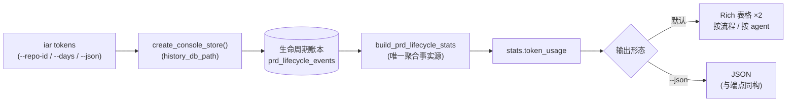

# PRD: Token 消耗 CLI 查询（iar tokens）

> ✅ **交付前置**：无剩余前置——原硬依赖 `tasks/archive/P1-FEAT-20260930-212702-agent-token-usage-stats.md`（PR #182）已于 2026-10-04 合并（`6fd39c63`），聚合事实源与账本格式已在主干。
> 结构化声明见 §8 Delivery Dependencies，**那里是唯一事实源**。

> 🧍 **验收状态**：待人工验收 — 执行侧已完成，仅剩 1 项 Human-Confirmed 未确认（9.1 呈递过目），证据包见 §9。
> 本行是 §9 Acceptance Checklist 的投影，**那里是唯一事实源**。

> 本 PRD 采用两个高度：Part A（人审层，§1–4）供人快速理解与决策，不含实现机制；Part B（执行器层，§5–13）承载全部实现细节。

## Feature Overview (功能一览)

> 本节是 §10 Functional Requirements 的投影；行为验收以 §1 行为样例表为准。

- **终端直接查看 token 汇总**（FR-1、FR-2）：`iar tokens` 一条命令输出按流程与按 agent 两张汇总表（总量/输入/输出/缓存读/缓存写/命中率/调用数），与 Stats 端点同源同口径，无需起 console 或写 SQL。
- **仓库与时间窗过滤**（FR-3）：`--repo-id` / `--days` 与既有 Stats 语义一致（天数越界收敛到 1–365）。
- **JSON 机器可读输出**（FR-4）：`--json` 输出与 stats 端点 `token_usage` 同构的结构，供脚本消费。
- **空态与降级**（FR-5）：无数据显示明确空态文案；无缓存数据时命中率显示「—」；任何读取失败不抛异常退出码污染（以非零码 + 明确错误文案表达）。

# Part A · 人审层 (Review Layer)

## 1. Introduction & Goals

### Problem Statement

Token 用量统计（前置 PRD）把每次 agent 调用的消耗落进了生命周期账本，并在 Stats 页与「执行过程」提供展示。但两条消费面都要求打开浏览器面板；运营者在终端巡检、脚本巡检、CI 摘要等场景想直接回答"最近 7 天哪个流程/哪个 agent 消耗最多"，只能手写 SQL 查 `prd_lifecycle_events.detail_json` 或起 console 服务——数据已落账，却没有与既有 `iar` 命令族一致的查询入口。

### Interpretation (解读回显)

#### 行为样例

| 验证方式 | 输入 / 操作 | 期望观察到的结果 |
|---|---|---|
| 👀 人审 + 自动验证 | 账本含 token 数据时执行 `iar tokens --repo-id keda-main --days 30` | 终端输出两张汇总表（按流程 / 按 agent），列含总量、输入、输出、缓存读、缓存写、命中率、调用数；数值与 Stats 端点同源一致 |
| 🤖 自动验证 | 同命令加 `--json` | 输出 JSON 的 `token_usage` 结构与 stats 端点响应同构（`by_flow` / `by_agent`，字段名一致），可直接被脚本解析 |
| 🤖 自动验证 | `--days 0` 或 `--days 9999` | 天数收敛到合法区间（1–365）后正常输出，不抛参数错误 |
| 👀 人审 + 自动验证 | 空账本（或过滤条件下无数据）执行同命令 | 输出明确空态文案（"暂无 token 用量数据"类），退出码 0，不显示 0 假数据 |
| 🤖 自动验证 | 某分组无缓存数据 | 该行命中率显示「—」而非 0% |

> 此表的"当前、仍被接受"行为行将逐字成为 §7.6 的验收 oracle：修正表中一格，即修正对应验收标准。

#### 我默默定了这些

- 命令挂在既有 `iar console` 命令组之下（`iar tokens`）：token 数据属 console 账本域（`history_db_path` 指向的 SQLite），与 `iar console` 服务的面板同源，命令分组随之。
- 表格输出走既有 CLI 输出风格（Typer/Rich），不引入新的渲染依赖。
- 聚合逻辑**直接复用**前置 PRD 的 `build_prd_lifecycle_stats` / `aggregate_token_usage`，CLI 内禁止重算口径。
- 默认天数 30、默认全部仓库，与 Stats 页默认一致。

#### 我理解为不做

- 不做 CSV/Excel 导出、不做按 PRD 明细分页展示（事件明细已有账本与「执行过程」承载）。
- 不做美元成本（延续前置 PRD 的 D-05）。
- 不做写入类操作（CLI 只读）。

#### 解读边界（读作 X，而非 Y）

本 PRD 读作：**为已落账的 token 用量数据增加一个只读 CLI 查询命令，复用既有聚合口径，输出表格与 JSON 两种形态**。不是：新的统计口径；不是对账本写入侧的任何改动；不是数据导出工具。兼容性承诺：命令为纯新增，不改变任何既有 `iar` 命令行为；`--json` 的结构以后只增字段不删改。

### What The User Gets

运营者在任意终端执行一条 `iar tokens` 命令，立即看到所选仓库与时间窗内按流程、按 agent 分组的 token 消耗与缓存命中率——与面板同源同口径，无需浏览器；脚本与巡检可以用 `--json` 拿到稳定结构。

### Measurable Objectives

- 账本含 token 数据时，命令输出的每行汇总与 `build_prd_lifecycle_stats` 的 `token_usage` 聚合逐字段一致。
- `--json` 输出能被 `json.loads` 解析且顶层含 `by_flow` / `by_agent`。
- 空数据、非法天数、不存在的 repo-id 均不产生 traceback。

## 2. Human Review Map (介入与风险地图)

### 本次无必须人工拍板的需求决策

命令名与挂载位置：顶级 `iar tokens`（§13 D-01，2026-10-04 按需求方质疑由 console 子命令反转）；输出列与口径 1:1 复用前置 PRD 已确认的决策（D-07），无新决策点。因此 §9.2 的 Human-Confirmed 组只含 9.1 呈递过目一项。

### 自动门禁，不需要逐项人工审阅

口径不漂移（聚合函数复用，禁止 CLI 内重算——由代码审查与 drift guard 断言）、参数边界收敛、空态文案、JSON 结构同构——全部由单元测试与真实入口 oracle 覆盖（§7.6）。

### 本次明确不涉及

无数据库结构变更；无既有命令行为变更；无新增依赖（Typer/Rich 已在用）。

## 3. Usage And Impact After Implementation

### [运维者 / Operator]

在终端执行 `iar tokens`（可带 `--repo-id` / `--days` / `--json`）：立即得到与 Stats 页同源的 token 汇总。既有命令、面板行为完全不变。

### [开发者 / Developer]

可复用 `aggregate_token_usage` 纯函数与既有 stats DTO，无新接口面；`--json` 结构与端点同构，脚本消费无需适配层。

### Impact On Existing Behavior

纯新增命令：不改变任何既有 `iar` 命令的行为与退出码语义；无配置项新增（读取既有 `history_db_path`）。

## 4. Requirement Shape

- **Actor**：运维者（命令使用者）、开发者（`--json` 脚本消费者）。
- **Trigger**：手动执行 `iar tokens`。
- **Expected behavior**：读取配置指向的 console 账本 → 复用聚合 → 表格 / JSON 输出；空数据出空态；参数越界收敛。
- **Scope boundary**：只读；不做导出、分页、成本口径、写入操作。

# Part B · 执行器层 (Build Layer)

## 5. Repository Context And Architecture Fit

### 现状与既有路径

- 前置 PRD（已归档，随 PR #182 交付）提供了聚合事实源：`core/use_cases/agent_runner_token_stats.py::aggregate_token_usage` 与 `agent_runner_lifecycle.py::build_prd_lifecycle_stats`（其 `PrdLifecycleStats.token_usage` 字段即 Stats 端点透出的结构）。
- CLI 命令族基于 Typer：`src/backend/api/cli_typer_app.py` 挂载各命令组，`cli_typer_console.py`（147 行）定义 `console_app`（现有 `serve` 子命令）。console 账本经 `engines/agent_runner/factories/__init__.py::create_console_store()` 读取（`console.history_db_path` 可配，默认 `~/.iar/console.db`）。
- CLI 输出风格：Typer echo / Rich 已在命令族中使用。

### Existing PRD Relationship

- 已归档 `tasks/archive/P1-FEAT-20260930-212702-agent-token-usage-stats.md`（PR #182）：本 PRD 的**硬前置**——聚合函数、账本 `detail_json` 格式、Stats 口径的唯一事实源。
- 其余 `tasks/pending/` 六个 PRD 与本 PRD 无交集。

### Frontend Impact

无。`frontend-public/` 不改动（CLI 为终端文本界面）。

## 6. Recommendation

### Recommended Approach

新增顶级命令 `iar tokens`（新模块 `cli_typer_tokens.py` 定义命令，`cli_typer_app.py` 一行挂载）：`create_console_store()` 读账本 → `build_prd_lifecycle_stats(store, repo_id, days)` → 取 `token_usage` → Rich 表格输出两张汇总表；`--json` 时输出 `{"window_days":…, "token_usage":…}`。参数定义与 Stats 端点对齐（`repo_id: str | None`、`days: int = 30`，越界收敛复用同一钳制逻辑）。

挂载理由（D-01，2026-10-04 按需求方质疑反转）：使用者心智模型是"查我的 agent 消耗"（runner/agent 域），而不是"console 的数据"——账本存哪是实现细节，不决定命令名；且 `iar console` 的既有语义是"启动面板服务"（长驻阻塞），不应混入秒级只读查询。否决 `iar console tokens`（数据域分组正确但心智模型不符、命令组性格被改变）与 CLI 内直写 SQL（口径漂移）。

### Proposed Solution Summary (实现机制)

命令函数做三层：参数钳制（复用 stats 端点同一收敛规则）→ 存储读取与聚合（整条复用前置 PRD 代码，零新口径）→ 呈现（Rich 表格两块 + 可选 JSON）。复杂度规避：不新增存储访问层、不并行第二套聚合、不做分页。

### Alternatives Considered

- **顶级 `iar tokens`**：更短，但破坏域分组一致性。已否。
- **扩展现有 `iar issue`/`roadmap` 命令**：数据域不符。已否。

## 7. Implementation Guide

> This section is a living implementation guide based on current repository analysis. If implementation discovers additional affected files, hidden dependencies, edge cases, or a better path, update this PRD before proceeding.

### Core Logic

1. **参数**：`--repo-id`（缺省全部仓库）、`--days`（默认 30，钳制 1–365）、`--json`（布尔开关）。
2. **读取与聚合**：`create_console_store()` → `build_prd_lifecycle_stats(store=…, repo_id=…, days=…)` → `stats.token_usage`；禁止在 CLI 内重写聚合或口径换算。
3. **呈现**：默认 Rich 表格两张（按流程 / 按 agent；列：分组、总量、输入、输出、缓存读、缓存写、命中率、调用数；命中率 = 缓存读 ÷ 输入侧，无缓存数据显「—」，与前端同规则）；`--json` 输出 `{"repo_id":…, "days":…, "token_usage":{…}}`（与端点响应同构子集）。
4. **空态**：`by_flow` 与 `by_agent` 均为空时输出明确空态文案，退出码 0。
5. **退出码**：正常 0；账本不可用等基础设施错误以非零码 + 单行错误文案退出，不输出 traceback。

### Change Impact Tree

```text
.
├── API (CLI)
│   ├── src/backend/api/cli_typer_tokens.py
│   │   [新增]
│   │   【总结】顶级 tokens 命令：参数钳制 + 复用聚合 + Rich 表格/JSON 呈现 + 空态与退出码语义
│   │
│   └── src/backend/api/cli_typer_app.py
│       [修改]
│       【总结】挂载 tokens 命令（一行注册）
│
├── Tests
│   └── tests/test_cli_tokens.py
│       [新增]
│       【总结】CLI 测试：有数据表格/JSON 同构、参数越界收敛、空态、账本不可用错误文案；断言与 build_prd_lifecycle_stats 聚合逐字段一致
│
└── Docs
    └── docs/guides/agent-runner.md
        [修改]
        【总结】Token 用量章节补 CLI 查询命令一行说明
```

以上文件清单是起点而非穷尽集——以 Executor Drift Guard 为准。

### Risk Classification Register

| 变更点 | 层 | 等级 | 决定性维度/理由 | 介入 | oracle/门禁 |
|---|---|---|---|---|---|
| tokens 子命令（参数/呈现/空态） | api(CLI) | R1 | 纯新增只读命令，复用既有聚合 | executor + 自动门禁 | rv-1、rv-2、rv-3 |
| `--json` 结构 | api(CLI) | R1 | 脚本消费面，要求与端点同构 | executor + 自动门禁 | rv-3 |

无 R2/R3 变更点：本 PRD 不触持久化、并发、既有行为与口径定义。

### Executor Drift Guard

```bash
rg -n "aggregate_token_usage|build_prd_lifecycle_stats" src/backend/core/use_cases  # 唯一聚合事实源
rg -n "console_app" src/backend/api/cli_typer_app.py                                # 子命令挂载点
rg -n "history_db_path" src/backend/infrastructure/config/agent_runner_settings.py  # 账本路径配置
```

- 实现中若发现聚合函数签名变化（前置 PRD 演进），以仓库当前版本为准适配，禁止在 CLI 内复制聚合逻辑。
- tokens 命令默认放新模块 `cli_typer_tokens.py`（`cli_typer_app.py` 仅一行挂载）；若实现时 `cli_typer_app.py` 挂载点附近接近行数红线，保持拆分形态即可，无需合并。

### Flow or Architecture Diagram



### ER Diagram

No data model changes in this PRD.

### Realistic Validation Plan

```yaml
- id: rv-1
  behavior: 账本含 token 数据时，CLI 输出按流程/按 agent 两张汇总表，数值与账本聚合逐字段一致（含命中率与「—」降级）
  reviewer: human
  real_entry: "IAR_PRD_SKILL_PATH 无关；在含种子数据的账本上执行 iar tokens --repo-id keda-main --days 30（种子方式见证据报告）"
  expected: "两张表出现，implement/verify/supervise 行的总量与四项数值同 build_prd_lifecycle_stats 输出一致；命中率列存在"
  mock_boundary: "账本为真实 SQLite（种子数据经真实写入路径）；仅数据准备复用前置 PRD 的假 agent 链路"
  tier: R1
  test_layer: manual
  required_for_acceptance: true
  presentation: "完整 verbatim 命令行与输出文本嵌入 9.1（CLI 输出为确定性文本，位图不增加信息量；宽列 COLUMNS=160 采集避免列头截断），并以 --json 输出文本佐证；自检：任选一行总量 = 四项之和"

- id: rv-2
  behavior: 空账本 / 无匹配数据 / 非法天数时输出空态或收敛结果，不产生 traceback
  reviewer: verifier
  real_entry: "uv run pytest tests/test_cli_console_tokens.py -o addopts=\"\"（空库 fixture + 参数边界用例）"
  expected: "空态文案出现且退出码 0；--days 0/9999 收敛到 1/365；不存在的 repo-id 输出空表"
  mock_boundary: "真实 SQLite 空 fixture；被测边界是命令本身"
  tier: R1
  test_layer: integration
  required_for_acceptance: true

- id: rv-3
  behavior: --json 输出结构与 stats 端点 token_usage 同构，可直接被脚本解析
  reviewer: verifier
  real_entry: "uv run pytest tests/test_cli_console_tokens.py -o addopts=\"\""
  expected: "json.loads 成功；顶层含 repo_id/days/token_usage；token_usage.by_flow/by_agent 的字段名与 PrdLifecycleStats 序列化一致"
  mock_boundary: "真实 SQLite fixture；不 mock 聚合函数"
  tier: R1
  test_layer: integration
  required_for_acceptance: true
```

失败排查提示：先确认命令读取的 `history_db_path` 与种子库路径一致（IAR_CONFIG/环境差异是最常见原因），再查 `--json` 分支是否复用了同一聚合调用。

### Low-Fidelity Prototype

Prototype image waiver: 本 PRD 交付终端文本界面（CLI 表格输出），无浏览器渲染 UI 与交互变化；rv-1 的 presentation 以终端截图承载真实输出形态，无需目标原型图。

### Interactive Prototype Change Log

No interactive prototype file changes in this PRD.

### External Validation

No external validation required; repository evidence was sufficient.

## 8. Delivery Dependencies

- Group: none
- Depends on tasks/issues:
  - none
- Gate type: none
- Notes: 原硬依赖 `tasks/archive/P1-FEAT-20260930-212702-agent-token-usage-stats.md`（PR #182）已于 2026-10-04 合并（merge `6fd39c63`）——聚合函数（`aggregate_token_usage` / `build_prd_lifecycle_stats`）与账本 detail 格式已在主干，验收记录见该 PRD §14。无剩余前置。

## 9. Acceptance Checklist

### 9.1 人读呈递区（Human Review Surface）

| 观察点 | 呈递物（交付时填路径） | ~10 秒自检 |
|---|---|---|
| `iar tokens` 表格输出（rv-1） | ✅ 已采集：完整 verbatim 命令与输出文本见证据目录 `*.evidence-report.md` §rv-1（宽列 COLUMNS=160），`--json` 输出同附 | 任选一行：总量 = 输入 + 输出 + 缓存读 + 缓存写；无缓存数据行命中率为「—」 |

### 9.2 Acceptance Evidence Package

**Human-Confirmed**

（保持未勾：合并即验收事件写入后由 post-merge reconciliation 勾选）
- [ ] 9.1 人读呈递区已由人工过目（rv-1 verbatim 输出与自检结论，见证据报告 §rv-1）

**Architecture Acceptance**
- [x] `rg -n "aggregate_token_usage" src/backend/api/cli_typer_tokens.py` 存在调用，且 CLI 内无重复聚合实现（`rg -n "by_flow" src/backend/api` 仅命中呈现层取值；架构检查 PASS）

**Behavior Acceptance**
- [x] rv-1/rv-2/rv-3 全部 PASS（7 例 CLI 测试 + 全链路 oracle），证据见证据目录 `*.evidence-report.md` 与 `*.verifier-report.md`

**Documentation Acceptance**
- [x] `docs/guides/agent-runner.md` Token 用量章节已补 CLI 命令说明

**Validation Acceptance**
- [x] `CI=true just test all` 全绿（2825 passed / 1 skipped）

**Delivery Readiness**
- [x] 命令进入 `iar --help` 帮助输出
- [x] [~] 独立 verifier 审查通过 — runner-owned gate: 独立 verifier 审查（PASS-with-notes，0 HIGH / 1 MEDIUM 已修复并加负控回归）
- [x] [~] PRD 归档到 `tasks/archive/` — runner-owned gate: 归档流程（随本交付 PR 归档，横幅 🧍 待人工验收）

## 10. Functional Requirements

- **FR-1**：`iar tokens` 输出按流程与按 agent 两张汇总表，列含分组、总量、输入、输出、缓存读、缓存写、命中率、调用数；数值与 `build_prd_lifecycle_stats` 聚合逐字段一致。
- **FR-2**：命中率口径 = 缓存读 ÷ 输入侧实际处理量（input + 缓存读 + 缓存写）；无缓存数据时显示「—」。
- **FR-3**：`--repo-id` 过滤仓库；`--days` 默认 30、钳制 1–365；语义与 stats 端点一致。
- **FR-4**：`--json` 输出 `{"repo_id", "days", "token_usage": {"by_flow", "by_agent"}}`，结构与 stats 端点 `token_usage` 同构。
- **FR-5**：空数据输出明确空态文案（退出码 0）；账本不可用以非零码 + 单行错误文案退出；全程不产生 traceback。

## 11. Non-Goals

- 不做 CSV/Excel/文件导出。
- 不做按 PRD/Issue 的事件明细分页展示。
- 不做美元成本口径。
- 不做任何写入类操作。
- 不新增统计口径或字段（口径唯一事实源在前置 PRD 的聚合模块）。

## 12. Risks And Follow-Ups

- **前置 PRD 未合并即开工**：无聚合事实源，必然口径漂移——由 §8 hard gate 阻断。
- **`build_prd_lifecycle_stats` 扫描成本**：CLI 与端点同代价；账本量级小（单 PRD 数十事件），可接受。若未来事件量级显著增长，聚合缓存应做在 stats 层而非 CLI 层。
- **Windows 兼容**：Rich 表格在窄终端的折行——输出宽度自适应为既有依赖行为，不专门处理。

## 13. Decision Log

| ID | 决策问题 | Chosen | Rejected | Rationale |
|---|---|---|---|---|
| D-01 | 命令挂载位置 | 顶级 `iar tokens`（新模块 `cli_typer_tokens.py`） | `iar console tokens`（console 命令组子命令）；扩展现有 issue/roadmap 命令 | 初版按数据域归属选 console 子命令；需求方质疑后反转（2026-10-04）：使用者心智模型是"查我的 agent 消耗"而非"console 的数据"，且 `iar console` 既有语义是启动面板服务（长驻阻塞），不应混入秒级只读查询；账本存哪是实现细节，不决定命令名 |
| D-02 | 聚合实现 | 直接复用 `build_prd_lifecycle_stats` / `aggregate_token_usage` | CLI 内重写聚合或直写 SQL | 口径必须单源（前置 PRD D-01/D-07）；复用使 CLI 与端点/前端天然一致 |
| D-03 | 输出形态 | 默认 Rich 表格 + `--json` 开关 | 仅 JSON；或引入导出文件 | 人工巡检要可读表，脚本要稳定结构；导出属 Non-Goals |

## 14. Change Log

### 2026-10-04 · 初版创建：Token 消耗 CLI 查询 PRD
- Type: scope
- Before: token 数据无 CLI 消费面，终端场景需手写 SQL 或起 console
- After: 新建本 PRD，定义 `iar tokens` 只读查询命令（表格 + JSON 双形态，复用既有聚合口径）
- Reason: 需求方在 Token 统计交付（PR #182）评审中提出"要有 CLI 路径直接看 token 消耗"，确认为独立 PRD 交付
- Impact: 交付前置硬依赖 PR #182 合并；实现预计触碰 `cli_typer_console.py` 与新测试文件，规模小
- Review: 需求方 2026-10-04 会话提出，PRD 待其审阅

### 2026-10-04 · 命令形态反转：顶级 iar tokens
- Type: scope
- Before: 命令挂载为 `iar console tokens`（console 命令组子命令），依据数据域归属推导
- After: 反转为顶级 `iar tokens`（新模块 `cli_typer_tokens.py`），理由改为使用者心智模型与命令频次；`iar console` 保持"启动面板服务"的既有语义
- Reason: 需求方质疑挂载位置后确认反转；数据存哪是实现细节，不决定命令名
- Impact: §2/§6/§13 D-01/Change Impact Tree（挂载点改为 cli_typer_app.py + 新模块）/行为样例表同步；§9 呈递物命令行更新
- Review: 需求方 2026-10-04 会话选择「iar tokens」


### 2026-10-04 · 实施完成：iar tokens 交付并随 PR 归档
- Type: acceptance
- Before: token 数据无 CLI 消费面；PRD 处于未开工状态
- After: 顶级 `iar tokens` 命令交付（cli_typer_tokens.py 新模块，复用既有聚合口径）；7 例 CLI 测试 + 全量门禁绿（2825 passed）；独立 verifier PASS-with-notes（0 HIGH / 1 MEDIUM 已修复并加负控回归）；PRD 随交付 PR 归档，横幅 🧍 待人工验收
- Reason: 需求方要求 CLI 查询路径；按 §6 推荐方案最小实现
- Impact: Change Impact Tree 全部落实（cli_typer_tokens.py 新增 / cli_typer_app.py 挂载 / 测试 / 文档）；rv-1 呈递形态按 living statement 修订为 verbatim 文本（CLI 输出为确定性文本）
- Review: verifier 独立审查通过；9.1 待人工过目（Human-Confirmed 随合并事件勾选）

### Final Reconciliation

- Interpretation: confirmed — 实现覆盖 §1 行为样例全部五行（表格/JSON/钳制/空态/「—」降级）
- Public behavior and contracts: confirmed — 纯新增命令，既有行为零变化
- Related PRD status: confirmed — 前置 PRD（PR #182）已合并并验收 ✅
- Requirements and risks: confirmed — FR-1..FR-5 全部落地，§12 风险无新增
- Reconciled differences:
  - none
