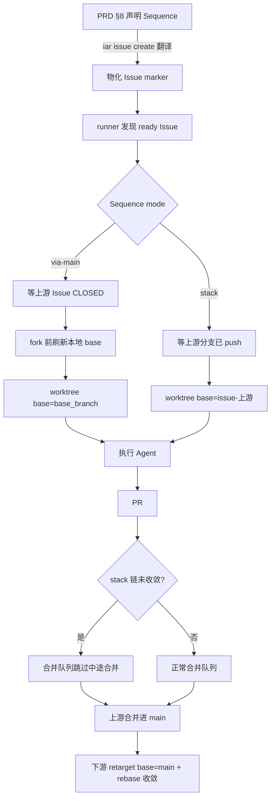

# PRD: 依赖链 PRD 的 fork 源与合并策略（via-main / stack 两轴）

> ✅ **交付前置**：无，可立即开工。
> 结构化声明见 §8 Delivery Dependencies，**那里是唯一事实源**。

> ✅ **验收状态**：已验收（2026-10-05）— 交付 PR #201 合并（ab55374）即验收；§9 的 5 项 Human-Confirmed 经决策板 `.iar/decisions/human-acceptance-20261005/answers.json` 全数确认。本行是 §9 Acceptance Checklist 的投影，**那里是唯一事实源**。
> 本行是 §9 Acceptance Checklist 的投影，**那里是唯一事实源**。

本文档分两个高度：**Part A（§1–§4）** 给人看，用来确认"要不要做、做成什么样"，不含实现机制、文件路径、命令与排期信息；**Part B（§5–§13）** 给执行者看，包含机制、改动树与验证命令。人只在 Part A 点名处下钻。

## Feature Overview (功能一览)

> 本块是第 10 节 Functional Requirements 的通俗投影，不是第二事实来源；行为验收以第 1 节的行为样例表为准。

- **两轴显式化**（FR-1）：把"依赖链怎么排队"（排序策略：走 main / 叠在上游分支）与"PR 要不要自动合并"（合并策略：自动 / 人工）拆成两个独立概念，不再混作一个开关。
- **via-main 兜底正确性**（FR-2）：走 main 的现有路径增加"fork 前 base 必须已含上游改动"的保证，消除"本地 base 落后导致下游看不到上游代码"的静默错误。
- **stack 排序策略**（FR-3）：允许下游 PRD 声明"基于上游分支 fork"，从而不等上游合并进 main 即可开工，并保证下游确实基于上游代码。
- **stack 的依赖信号**（FR-4）：stack 模式下下游等待的是"上游分支已就绪"，而不是"上游 Issue 已关闭"。
- **stack 与合并队列的交互规则**（FR-5）：明确 stack 链中自动合并的去向（默认不在中途把上游合进 main，避免破坏下游的 fork 基础）。
- **上游合并后的收敛**（FR-6）：上游最终合并进 main 后，下游 PR 的 base 自动改指 main 并同步，链式收口。
- **声明面是共享 PRD 标准的工具无关字段**（FR-7）：排序策略由 PRD §8 Delivery Dependencies 的 `Sequence` 字段声明（`via-main` / `stack`）。该字段定义在模板仓的共享 PRD 标准里（工具无关；不使用 keda 的项目中它合法但惰性为空文档）；keda 的 `iar issue create` 按标准允许的方式把它翻译成自己的 Issue 标记，不新增独立存储。
- **零回归**（FR-8）：未声明 stack 的 PRD 走 via-main，行为与改动前一致。
- **明确不做**（§11）：不改 `iar run`/daemon 的 CLI 控制面（另见配套 PRD）、不做 GitHub 原生 merge queue / 分支保护、不支持 squash 以外的合并方式、不引入新数据库表。

---

# Part A · 人审层 (Review Layer)

## 1. Introduction & Goals

### Problem Statement

keda 的依赖门禁（Dependency Gate）让"B 等 A"可以自动调度，但它把"等"定义得过窄、把"基于哪份代码"留给了一个没人保证的默认值。三个具体症状（均已在仓库中确认）：

1. **下游必须等上游合并进 main 才开工**。门禁的判定是"上游 Issue 已关闭"（`agent_runner_dependencies.py::evaluate_dependencies`），而 Issue 关闭只在 PR 合并之后发生。于是任何"下游依赖上游改动"的场景都被迫串行等待一次完整的合并，即便下游本可以在上游分支上先行开工。
2. **`via-main` 路径的 base 新鲜度无人保证**。下游 worktree 用 `git worktree add -b issue-<N> <base_branch>` 从**本地** base 分支创建（`agent_runner_worktree_create.py` → `infrastructure/git/worktree.py::WorktreeManager.create`）；全仓唯一 fetch base 的地方在 post-PR supervisor，且更新的是远端跟踪引用而非本地分支。若上游在远端合并后本地 base 未更新，下游 agent 可能基于旧代码开工，看不到上游改动而重复实现——这是个静默的正确性缺口。
3. **"排序"与"合并"被混为一谈**。当前 autopilot（`autopilot.enabled`）同时意味着"自动晋升 pending PRD"和"自动合并 PR"，用户无法表达"我要链式推进但不要中途合并进 main"这类组合。

后果：依赖链 PRD 要么被迫长等合并，要么在错误的代码基础上开工；而这两件事目前既没有显式模型，也没有可声明的入口。

### Interpretation (解读回显)

下表每一行都会**原样**变成第 7.6 节的验收 oracle，所以改表里的一格就等于改验收标准——值得逐行读。

| 验证方式 | 输入 / 操作 | 期望观察到的结果 |
|---|---|---|
| 👀 人审 + 自动验证 | 一个在 §8 声明 `Sequence: stack` 的下游 PRD，其上游已 push 但未合并 | 下游 worktree 基于上游 `issue-<上游>` 分支创建，`git merge-base --is-ancestor` 证明上游提交是下游 HEAD 的祖先 |
| 👀 人审 + 自动验证 | 同一个 stack 链，上游 PR 合并进 main 之后 | 下游 PR 的 base 自动改指 main 并同步，`gh pr view` 显示 base=main，且下游 diff 不再包含上游改动 |
| 🤖 自动验证 | 一个未声明 stack 的普通下游 PRD（via-main） | 行为与改动前一致：仍等上游 Issue 关闭；下游 worktree 的 base 含上游改动（上游 Issue 关闭后 fork） |
| 🤖 自动验证 | via-main 场景：上游已在远端合并但本地 base 落后 | runner 在 fork 前把本地 base 更新到含上游改动的状态；下游 worktree 能看到上游文件 |
| 🤖 自动验证 | stack 下游在其上游仍 open 时被 runner 扫描 | 下游处于等待态（不消耗处理配额），提示等待的是上游分支就绪而非 Issue 关闭 |
| 🤖 自动验证 | stack 链中的自动合并队列扫描到下游 PR | 不把下游 PR 中途 squash 进 main（遵守 stack 交互规则），不破坏链式基础 |
| 🤖 自动验证 | PRD 的 §8 `Sequence` 取非法值 | `iar issue create` 失败并给出可读错误，不物化出半成品 Issue |
| 🤖 自动验证 | 无任何依赖声明的普通 PRD | 行为与改动前逐字节一致（零回归） |

**我默默定了这些**（未提问、直接选定的）：

- **声明面是 PRD §8 Delivery Dependencies 的工具无关字段 `Sequence`**（定义在模板仓的共享 PRD 标准里，取值 `via-main` / `stack`），而非新增注册表或服务；keda 的 `iar issue create` 按标准允许的"仓库工具翻译"方式把它翻成 Issue body marker，沿用既有 `iar:depends-on` 的无状态方案。
- **两轴分别命名**：`Sequence`（`via-main` 默认 / `stack`）与既有 `autopilot.enabled + safety.auto_merge`（合并策略）保持正交，不互相覆盖。
- **stack 默认禁止"中途把上游合进 main"**：这是交互规则，不是布尔互斥。
- **via-main 的 base 新鲜度修复**默认启用（fork 前 fetch + 快进 base），因为它修的是一个既有正确性缺口。
- **stack 只支持单上游**（一条链一个 parent）；多上游 / DAG 不在本次范围。

**我理解为不做**：

- 不做 GitHub 原生 auto-merge / merge queue / 分支保护配置。
- 不支持 squash 之外的合并方式（仍以 squash 为准）。
- 不改 `iar run` / `iar daemon` 的 CLI 参数与语义（那是配套的另一份 PRD）。
- 不做多渠道（多 parent）堆叠或跨仓库依赖编排。

**可证伪的读法**：本 PRD 读作"把依赖链的**排序策略**（走 main / 叠在上游分支）与**合并策略**拆成两个正交概念，并让 stack 排序策略可声明、可执行、可收敛"；**不**读作"改变 PRD 依赖的默认行为"（默认仍是 via-main 等合并）、**不**读作"引入 GitHub 原生 merge queue"，也**不**读作"给 run/daemon 加新旗标"。关键边界：默认路径零回归；stack 是显式声明才生效；stack 与自动合并的交互规则必须明确而非隐式。

### What The User Gets

运维者可以按链的**真实约束**选择排序策略：大多数链继续走 via-main（等上游合并，简单可靠），并确保下游永远基于最新 base；对"上游到 main 很慢、但下游想先开工"的链，可以声明 stack，让下游基于上游分支先行推进，并在上游合并后自动收口到 main。合并策略（是否自动合并）与排序策略解耦，可以自由组合。

### Measurable Objectives

- 声明 `Sequence: stack` 的下游，其 worktree 的 base 可被 `git merge-base --is-ancestor` 证明包含上游 tip；未声明 stack 的路径与改动前行为一致（零回归）。
- via-main 场景下，runner 在 fork 前保证本地 base 已含上游改动——用一个"上游已合并、本地 base 落后"的构造用例可判别通过/失败。
- 上游合并后，stack 下游 PR 的 base 自动改指 main 且同步收口，`gh pr view` 可验证。
- stack 链中自动合并队列不会中途破坏链式基础（有可断言的跳过/改写行为）。
- 新增声明面同步进 `docs/` 与 `iar-operator` skill；守卫测试通过。

## 2. Human Review Map (介入与风险地图)

**决策一：stack 声明放在 PRD 自身，还是做成一个独立注册表？** stack 是"这一个 PRD 链怎么排序"的属性，天然属于 PRD，而不是一份全局状态。本 PRD 建议在 PRD 的 §8 Delivery Dependencies 里声明（共享 PRD 标准新增的工具无关字段 `Sequence`，取值 `via-main` / `stack`），由 `iar issue create` 翻译成 Issue marker，沿用既有依赖门禁的无状态设计。**请确认：** 接受"声明在 PRD、无新存储"，还是要求独立的依赖注册表（更集中但引入新的状态所有权）？**验收：** 一个声明 stack 的最小 PRD 经 `iar issue create` 后，下游 worktree 的 base 可被证明是上游分支。

**决策二：通过既有 `safety.auto_merge` + `autopilot.enabled` 双开关。本 PRD 不新增第三态**，而是规定：stack 链中的 PR 在链未收敛前不进入中途自动合并（默认禁用该链的中途合并，链末端再统一合并），把冲突消解在规则层而非让用户自己防。**请确认：** 接受"stack 链期间默认不自动合并中途 PR"，还是要求"允许中途合并、由 runner 承担级联 rebase"（更激进但需要更重的收敛机制）？**验收：** stack 链中途，合并队列扫描到该下游 PR 时不把它 squash 进 main；末端可正常收敛。

**决策三：via-main 的 base 新鲜度修复默认启用吗？** 这是修复一个既有正确性缺口（本地 base 落后会让下游看不到上游代码）。修复方式是在 fork 前更新 base 引用（fetch + 快进）。默认启用会让 runner 多一次网络操作，但消除静默错误。**请确认：** 接受"默认在 fork 前刷新 base"，还是要求"仅当离线/失败时才回退、并要求运维手保 base 新鲜"？**验收：** 构造"上游已合并、本地 base 落后"场景，下游 worktree 仍能看到上游文件。

**决策四：上游最终合并后，stack 下游 PR 自动改指 main 并 rebase，可以接受吗？** 这是让链收口的关键动作，属于"外部契约 / 分支基线变更"。squash 合并会改变历史，下游必须 retarget + rebase，否则 diff 会把上游改动算成自己的。本 PRD 建议自动执行该收敛（复用既有 rebase 与冲突处理路径），并在冲突无法自动解决时停在可人工介入的状态。**请确认：** 接受"自动 retarget + rebase 收口"，还是要求"停在人工确认后再收口"？**验收：** 上游合并后，`gh pr view <下游>` 显示 base=main，且下游 diff 不再包含上游改动。

**自动门禁，不需要逐项人工审阅**：PRD 声明解析与物化测试、依赖门禁两态（等 Issue 关闭 / 等分支就绪）单元测试、worktree fork 源解析测试、base 刷新前后对照测试、stack 收敛的 retarget+rebase 集成测试、合并队列对 stack PR 的跳过规则测试、非 stack 路径零回归黄金对照、`just lint` 与 `just test all`、文档与 `iar-operator` skill 同步守卫。

**本次明确不涉及**：不改 `iar run` / `iar daemon` 的 CLI 参数（配套 PRD）；不配置 GitHub 原生合并/分支保护；不支持 squash 以外合并方式；不改 HTTP API 与前端（`frontend-public/`、`frontend-admin/` 均不动）；不改并发/进程模型；**本次无数据库结构变化**。

## 3. Usage And Impact After Implementation

### [运维者 / Operator]

- 现有链默认不变：不声明 `Sequence` 的 PRD 仍走 via-main，等上游合并，且现在保证下游基于最新 base。
- 想"不等合并、让下游先开工"时，在单个下游 PRD 里声明 stack（及其上游目标）；下游会基于上游分支创建 worktree 并先行推进。
- 上游最终合并后，下游 PR 自动收口到 main，无需手动 retarget。

### [开发者 / Developer]

- 新增依赖链时，用两个正交维度描述：`Sequence`（走 main / 叠上游分支）与合并策略（是否自动合并），不要再把它们塞进一个开关。
- stack 是显式声明才生效；未声明永远走 via-main，不要默认改变既有行为。

### [调用方 / 外部 Agent]

- 无变化：`iar issue create` 仍按同一入口工作，只是会解析新的 PRD 声明并物化对应的 Issue 标记；未声明时行为不变。

### [这条链路本身]

- 无前端 / HTTP 变化；不新增对外 API。

### Impact On Existing Behavior

- 未声明 stack 的 PRD：依赖判定与 worktree fork 结果与改动前一致，唯一差异是 fork 前会刷新 base（消除既有的静默陈旧问题，属于修复而非破坏）。
- 声明 stack 的 PRD：新增行为，只有显式声明才触发。
- 合并队列：只有当链声明 stack 时才改变其中途合并行为；其余 PR 不受影响。

## 4. Requirement Shape

- **actor**：运维者 / 开发者（声明依赖链策略）；runner（执行排序与收敛）；`iar issue create`（解析并物化声明）。
- **trigger**：一个 PRD 在 §8 声明了依赖关系并（可选）声明 `Sequence: stack`，经 `iar issue create` 发布；runner 轮询到该 Issue。
- **expected behavior**：按声明的排序策略决定下游何时可领、基于哪个分支 fork；stack 链在其上游分支就绪后即放行，并在上游合并后自动收敛到 main；via-main 保证 base 含上游改动。
- **explicit scope boundary**：只支持单上游、只支持 squash、默认路径零回归、不改 runner CLI 与前端。

# Part B · 执行器层 (Build Layer)

## 5. Repository Context And Architecture Fit

### 现有相关模块

- 依赖门禁：`src/backend/core/use_cases/agent_runner_dependencies.py`（`parse_dependency_marker` / `evaluate_dependencies` / `format_dependency_marker`），在 `agent_runner_orchestration_runtime.py::run_once` 的 ready 发现循环里被调用。
- Issue 物化：`src/backend/core/use_cases/create_issue_from_prd.py`（把 `Gate type: hard` 解析为 `<!-- iar:depends-on ... -->` marker）。
- worktree 供给：`src/backend/core/use_cases/agent_runner_worktree_create.py::create_or_reuse_worktree` → `infrastructure/git/worktree.py::WorktreeManager.create`（`git worktree add -b <branch> <path> <base_branch>`）。
- 分支修复/对齐：`agent_runner_worktree_branch.py::_ensure_worktree_branch` / `_reconcile_worktree_with_remote_branch`。
- 合并队列：`src/backend/core/use_cases/agent_runner_merge_queue.py`（`process_merge_queue`，7 步门禁链，`autopilot.enabled AND safety.auto_merge` 双开关）；由 `review_once` 触发。
- PR 分支 rebase：`src/backend/core/use_cases/pr_supervisor.py::execute_rebase`（fetch `remote/base_branch` 后 rebase）。
- 依赖声明解析：`create_issue_from_prd.py` 已解析 PRD 的 Delivery Dependencies 小节（`Depends on tasks/issues` / `Gate type` / `Notes`），`agent_runner_dependencies.py` 消费物化后的 marker。本 PRD 新增的工具无关字段 `Sequence` 走同一解析入口；其**字段定义**属于模板仓的共享 PRD 标准（`skills/prd/`），不在本仓。

### 现有架构模式

- 依赖事实完全无状态：marker + 每次轮询现查现算（`agent_runner_dependencies.py` 头注释与 `docs/guides/agent-runner.md` 的 Dependency Gate 小节）。
- worktree 每 Issue 独立分支（`issue-<N>`），base 来自 `config.worktree.base_branch` / `config.git.base_branch`。
- 结构变更遵循四层依赖方向，业务逻辑在 `core/`。

### ownership 与依赖边界

- PRD 声明解析 → `core/`；Issue marker 物化 → `core/`（`create_issue_from_prd`）；git 操作 → 通过 `IProcessRunner`，不在 `core/` 里直接 subprocess。
- 新增的"fork 源"概念属于 `core/` 编排层；git 落地留在现有 `infrastructure/git` 与 worktree CLI 命令。

### frontend impact

`No frontend impact`。这是 runner 后端的依赖调度契约，Console 前端不新增页面/交互；Roadmap 既有的 PRD 列表与状态映射足以反映新状态，无需改动。

### 相关 PRD

- 无重复 pending PRD。相关历史：`tasks/archive/P1-FEAT-20260703-105330-roadmap-continuous-scheduling.md`（持续调度/晋升）、`tasks/archive/P1-FEAT-20260703-105322-autopilot-merge-queue-fast-profile.md`（合并队列）、`tasks/archive/P1-FEAT-20260916-122645-roadmap-prd-controls-evidence-autopilot.md`（Roadmap 控制与 autopilot 开关）。本 PRD 扩展这些既有契约，不推翻。
- 配套 PRD：`P1-FEAT-20261005-161633-run-daemon-autopilot-control-surface.md`（run/daemon/autopilot CLI 控制面）——独立，soft 关系（见 §8）。

## 6. Recommendation

### Recommended Approach

把"依赖链排序"显式建模为一个**每 PRD 的声明**，并新增一条 stack 执行路径，同时补齐 via-main 的 base 新鲜度保证：

1. **声明面**：在 PRD 的 §8 Delivery Dependencies 里声明工具无关字段 `Sequence`（`via-main` 默认 / `stack`；仅单上游）。字段定义属于模板仓的共享 PRD 标准（工具无关；不使用 keda 的项目里它惰性为空文档）；keda 按标准允许的方式在 `iar issue create` 时把它翻译成 Issue body 的 marker（扩展既有 `iar:depends-on` 语义，带 `mode="stack"`），不新增存储。
2. **依赖门禁两态**：`via-main` 仍等上游 Issue `CLOSED`（现状不变）；`stack` 等"上游分支已 push 且远端可见"。判定仍无状态、每次现查。
3. **fork 源解析**：claim 时根据 marker 决定下游 worktree 的 base——`via-main` 用 `config.git.base_branch`（并在 fork 前刷新），`stack` 用 `issue-<上游>` 分支。
4. **base 新鲜度**：`via-main` 在 fork 前 fetch 并快进本地 base 到含上游改动；失败时保守回退并在日志/comment 说明。
5. **合并策略交互**：stack 链未收敛前，合并队列跳过其中途 PR（不 squash 进 main），避免破坏下游 fork 基础。
6. **收敛**（仅 stack 模式）：上游合并进 main 后，下游 PR retarget base 到 main 并 rebase（复用既有 `execute_rebase` 与冲突处理），链式收口。via-main 链不经过此步。

### 为什么最贴合现有架构

- 复用无状态 marker + 现查判定，不引入新的依赖状态机或存储。
- fork 源是既有 `config.worktree.base_branch` 的一个**按 Issue 覆盖**，属于现有 worktree 供给路径的最小扩展。
- 收敛复用既有 rebase/冲突处理，不另造合并机制。
- 合并策略只在链声明 stack 时改变，默认路径保持零回归。

### rationale：拒绝冗余抽象

- 不新增"依赖注册表/服务"：声明属于 PRD，物化进 Issue marker 即可，与既有依赖门禁同源。
- 不新增"多 parent DAG 编排"：当前没有多上游的证据，先做单上游。
- 不引入 GitHub 原生 merge queue：与既有 squash 合并队列职责重叠。

### Proposed Solution Summary (实现机制)

核心机制：**每 Issue 的 fork 源 + 依赖门禁两态 + 合并队列的 stack 交互规则**。

- 声明来源：PRD §8 由运维/开发者显式声明（`Sequence`）；系统只消费显式声明，不推断。缺失时按标准默认 `via-main`；非法值时 `iar issue create` fail fast。
- 接入点：`create_issue_from_prd` 物化 marker；`agent_runner_orchestration_runtime.py::run_once` 的 ready 循环里按 marker 走两态判定；`create_or_reuse_worktree` 按 marker 解析 base；`process_merge_queue` 按 marker 跳过 stack 中途 PR；`pr_supervisor.execute_rebase` 承载收敛。
- 状态/输出变化：新增"等待上游分支就绪"的等待态；下游 worktree 的 base 可指向 `issue-<上游>`；上游合并后下游 PR base 改指 main。
- 刻意避免的复杂度：不新增存储/表、不新增服务、不改 PRD 生命周期状态机、不改 runner CLI 与前端。

### Alternatives Considered

- **只修 base 新鲜度、不做 stack**：成本最低，解决 via-main 的正确性缺口，但不能让下游先行开工。作为 fallback（见 §12）。
- **GitHub 原生 stacked PR / merge queue**：需要仓库侧配置与权限，且与既有 squash 队列冲突；拒绝。
- **独立依赖注册表服务**：引入新的状态所有权与一致性面；拒绝。

## 7. Implementation Guide

> This section is a living implementation guide based on current repository analysis. If implementation discovers additional affected files, hidden dependencies, edge cases, or a better path, update this PRD before proceeding.

### Core Logic

1. **解析与物化**：`create_issue_from_prd` 读取 PRD §8 的 `Sequence` 字段（缺失按 `via-main`），沿用 `parse_dependency_marker` / `format_dependency_marker` 的 marker 方案，新增 stack 语义（例如在依赖 marker 上带 `mode="stack"` 与上游引用）。非法声明 fail fast。
2. **准备阶段（claim）**：`run_once` 发现 ready Issue → `parse_dependency_marker` → 按 mode 判定：
   - `via-main`：`evaluate_dependencies`（等 Issue CLOSED），现状不变。
   - `stack`：判定"上游分支已 push 且远端可见"（`git ls-remote` 或等价 GitHub 查询），未就绪则进入等待态（叠加等待 label / comment，不消耗配额）。
3. **fork**：`create_or_reuse_worktree` 解析 base——`via-main` 先刷新本地 base（fetch + 快进）再 `git worktree add`；`stack` 用 `issue-<上游>` 作为 base。复用既有 `format_command` 的 `{base_branch}` 占位机制（按 Issue 传入解析后的 base）。
4. **合并队列交互**：`process_merge_queue` 在处理 `agent/review` PR 前，若该 Issue 属于未收敛的 stack 链，则跳过中途合并（记录原因，不阻塞队列其余 PR）。
5. **收敛**（仅当该链为 stack）：上游合并进 main 后（下一轮检测到上游 Issue CLOSED / 分支已合入 `remote/base`），对下游 PR 执行 retarget（改 base 为 main）+ rebase（复用 `pr_supervisor.execute_rebase`）；冲突走既有 agent 解决路径，未解决则停在可人工介入状态。via-main 链无陈旧 base，不进入此步。

### Change Impact Tree

```
core/
  use_cases/
    agent_runner_dependencies.py         # 新增 stack 判定（等分支就绪）与 marker 扩展
    create_issue_from_prd.py             # 解析 PRD 声明，物化 stack marker（fail fast）
    agent_runner_orchestration_runtime.py# ready 循环按 mode 走两态判定
    agent_runner_worktree_create.py      # 按 mode 解析 base；via-main fork 前刷新 base
    agent_runner_worktree_branch.py      # （可能）base 刷新/快进助手
    agent_runner_merge_queue.py          # stack 中途 PR 跳过规则
    pr_supervisor.py                     # 承载收敛 retarget + rebase
infrastructure/
  git/worktree.py                        # （可能）支持传入 per-issue base
docs/guides/agent-runner.md              # Dependency Gate 小节新增 stack 语义
src/backend/engines/agent_runner/templates/skills/iar-operator/SKILL.md  # CLI/契约同步（如涉及）
tests/
  test_*depend*.py / test_*worktree*.py / test_*merge_queue*.py  # 新增/扩展
```

> 上述为起点而非穷尽集合；实现时用 `rg -n "parse_dependency_marker|create_or_reuse_worktree|process_merge_queue|base_branch" src/ tests/` 复核隐藏引用。

### Risk Classification Register

| change point | tier | decisive dimension/override | intervention | oracle/gate |
|---|---|---|---|---|
| stack 依赖判定（等分支就绪） | R2 | 排序正确性/兼容 | 仅在显式 stack 时生效 | rv-1、rv-5 |
| fork 源解析（per-issue base） | R3 | 并发/正确性关键（错 base = 静默重复实现） | 人工确认 + 负控制 | rv-1、rv-2 |
| via-main fork 前刷新 base | R2 | 持久状态/正确性（既有缺口修复） | 自动门禁 + 强 oracle | rv-3 |
| stack 与合并队列交互 | R3 | 破坏性（中途合并毁链） | 人工确认 + 负控制 | rv-4 |
| 上游合并后收敛 retarget/rebase | R2 | 外部契约/基线变更 | 自动门禁 + 集成 oracle | rv-6 |
| 声明解析与物化 | R1 | 单点适配器 | 目标测试 + fail fast | rv-7 |
| 非 stack 路径零回归 | R1 | 兼容 | 黄金对照 | rv-8 |

### Executor Drift Guard

- 依赖判定与 worktree fork 的调用点分散在 `run_once` 与 worktree 供给两处，务必用 `rg -n "parse_dependency_marker|evaluate_dependencies|create_or_reuse_worktree" src/` 确认所有入口，避免只改一处造成语义漂移。
- base 的来源有 `config.git.base_branch` 与 `config.worktree.base_branch` 两名，实现前用 `rg -n "base_branch" src/backend` 统一口径，避免只改一个。
- 合并队列改动前用 `rg -n "process_merge_queue|_autopilot_enabled" src/` 定位唯一入口，避免在多处复制"跳过"判断。

### Flow / Architecture Diagram



### Realistic Validation Plan

```yaml
- id: rv-1
  behavior: 声明 Sequence: stack 的下游在其上游分支已 push 时，worktree 基于上游分支创建
  reviewer: human
  real_entry: 构造上游/下游两个最小 PRD，经 iar issue create 发布与 runner claim（真实 CLI + git 入口）
  expected: 下游 worktree 的 HEAD 使上游 tip 成为其祖先（git merge-base --is-ancestor 上游tip HEAD 成功）
  mock_boundary: none
  tier: R3
  test_layer: integration
  required_for_acceptance: true
  presentation: tasks/evidence/<prd-stem>/rv-1-stack-fork.png 或等价截图 + open 命令
  critical_value_source: 真实 worktree 的 git 祖先关系
  must_cross: PRD 声明 -> marker 物化 -> 依赖判定 -> worktree fork
  forbidden_bypasses: 不得用手工 git 命令伪造 base；不得跳过 worktree 供给直接改 HEAD
  fresh_state_probe: 新建 worktree 后从干净 shell 运行 git log/merge-base 观察祖先
  final_tree_evidence: 绑定最终实现树的提交
  negative_control: 把 stack 声明误写成 via-main 时，worktree base 应为 base_branch，rv-1 判定失败
  expected_fail: 非 stack 路径不应出现"基于上游分支 fork"
- id: rv-2
  behavior: 同一 stack 链，上游合并进 main 后下游 PR 自动 retarget 到 main 并收敛
  reviewer: verifier
  real_entry: 真实 PR 流程 + review pass
  expected: gh pr view <下游> base=main，且下游 diff 不再包含上游改动
  mock_boundary: GitHub 客户端可 mock；git 操作走真实仓库
  tier: R3
  test_layer: integration
  required_for_acceptance: true
  critical_value_source: PR base 字段与最终 diff 文件清单
  must_cross: 上游 merge -> 检测 -> retarget -> rebase
  forbidden_bypasses: 不得只改 PR 元数据而不 rebase
  fresh_state_probe: 合并后从新状态查询 gh pr view 与 diff
  final_tree_evidence: 绑定最终实现树
  negative_control: 上游未合并时不得触发 retarget
  expected_fail: 未合并不收口
- id: rv-3
  behavior: via-main 场景，上游已在远端合并但本地 base 落后时，下游 fork 前 base 被刷新
  reviewer: verifier
  real_entry: 构造"本地 base 落后"的真实仓库状态后运行 runner
  expected: 下游 worktree 能看到上游新增文件
  mock_boundary: none
  tier: R2
  test_layer: integration
  required_for_acceptance: true
  critical_value_source: 下游 worktree 中的文件内容
  must_cross: 本地落后 base -> 刷新 -> fork
  forbidden_bypasses: 不得靠人工 git pull 满足
  fresh_state_probe: 刷新后从新 worktree 读取上游文件
  final_tree_evidence: 绑定最终实现树
- id: rv-4
  behavior: stack 链中途，合并队列不把下游 PR squash 进 main
  reviewer: verifier
  real_entry: review pass 触发 process_merge_queue
  expected: 下游 PR 未被合并，队列其余 PR 不受影响
  mock_boundary: GitHub mock 可
  tier: R3
  test_layer: integration
  required_for_acceptance: true
  critical_value_source: 合并队列行为记录
  must_cross: 链识别 -> 跳过判定
  forbidden_bypasses: 不得靠人工不点合并满足
  fresh_state_probe: 运行后再查 PR 状态
  final_tree_evidence: 绑定最终实现树
  negative_control: 非 stack PR 应正常进入合并
  expected_fail: 非 stack 不应被跳过
- id: rv-5
  behavior: stack 下游在其上游分支未就绪时进入等待态且不消耗配额
  reviewer: verifier
  real_entry: runner 轮询
  expected: 下游保持等待，扫描继续
  mock_boundary: GitHub mock 可
  tier: R2
  test_layer: integration
  required_for_acceptance: true
  critical_value_source: 下游 Issue 的等待态与当轮处理配额计数
  must_cross: 分支就绪判定 -> 等待态写入 -> 配额结算
  forbidden_bypasses: 不得靠人工减少队列满足
  fresh_state_probe: 轮询后从新状态查询下游 label 与配额
  final_tree_evidence: 绑定最终实现树
- id: rv-6
  behavior: 非法 Sequence 声明在 iar issue create 时 fail fast
  reviewer: verifier
  real_entry: 真实 CLI
  expected: 非零退出 + 可读错误，不物化半成品
  mock_boundary: none
  tier: R1
  test_layer: unit
  required_for_acceptance: true
- id: rv-7
  behavior: 未声明 stack 的普通 PRD 行为零回归
  reviewer: verifier
  real_entry: 既有依赖门禁/ worktree 路径
  expected: 与改动前行为一致
  mock_boundary: none
  tier: R1
  test_layer: unit
  required_for_acceptance: true
```

### ER Diagram

本次无数据模型/持久状态变化（依赖事实仍无状态、marker 在 Issue body），无 ER 图。

### Low-Fidelity Prototype

不适用：无用户可见界面变化（`No frontend impact`）。

### Interactive Prototype Change Log

无（未新增/修改原型文件）。

## 8. Delivery Dependencies

### Delivery Dependencies

- Depends on tasks/issues:
  - none
- Gate type: none
- Sequence: via-main
- Notes: 与 `P1-FEAT-20261005-161633-run-daemon-autopilot-control-surface.md` 为 soft 关系——该 PRD 新增 `--autopilot` CLI 覆盖，会与本 PRD 的"合并策略交互规则"在入口层交互，但两者可独立交付；本 PRD 的排序策略声明面是 PRD §8 的工具无关字段 `Sequence`（由模板仓共享 PRD 标准定义，见 §5），不依赖 CLI 改动。另：`Sequence` 字段本身的定义属于模板仓 `skills/prd/`（工具无关，非 keda 项目惰性），本 PRD 只定义 keda 的消费行为，两者可各自独立交付（soft 前置）。

## 9. Acceptance Checklist

### 9.1 人读呈递区（Human Review Surface）

| 观察结果（plain language） | 呈递物 | ~10 秒自检 |
|---|---|---|
| 声明 stack 的下游基于上游分支 fork（含上游提交） | `tasks/evidence/P1-FEAT-20261005-161632-dependent-prd-sequencing-strategy/P1-FEAT-20261005-161632-dependent-prd-sequencing-strategy.evidence-report.md`（rv-1 transcript；`open "tasks/evidence/P1-FEAT-20261005-161632-dependent-prd-sequencing-strategy/gen_evidence.py"` 可复跑） | 看 worktree HEAD 与上游 tip：`git merge-base --is-ancestor` 成功，且二者 sha 相同 |
| 上游合并后下游 PR 自动收敛到 main | 同上报告的 rv-2 行（自动化等价 oracle：merge-queue 集成测试） | `set_pull_request_base(pr, "main")` 被调用且随后走既有 rebase |
| via-main 场景 base 落后也被刷新 | 同上报告的 rv-3 transcript | 本地 main 仍停在被更新前，worktree HEAD == 远端 main 且能看到上游新增文件 |

> rv-1/rv-3 的判别值是 git 祖先关系与文件内容，以文本 transcript 呈递（无 PNG）；`gen_evidence.py` 走真实 `iar worktree create` CLI + 真实 git，可在本地一键复跑。

**刻意不展示（`reviewer: verifier`）**：rv-4、rv-5、rv-6、rv-7 为可执行/静态断言的 verifier 组，除非失败否则不进人审。

### 9.2 Acceptance Evidence Package

按 §7 风险分级排序：先 R3/human-confirm（rv-1、rv-2、rv-4），再 R2（rv-3、rv-5），再折叠 R1/R0（rv-6、rv-7）与契约 diff。

证据报告：`tasks/evidence/P1-FEAT-20261005-161632-dependent-prd-sequencing-strategy/P1-FEAT-20261005-161632-dependent-prd-sequencing-strategy.evidence-report.md`（含 oracle→测试映射、negative control、verifier 两轮结论）。

### Behavior Acceptance

- [x] rv-1：stack 下游基于上游分支 fork，`git merge-base --is-ancestor` 可证（证据：`gen_evidence.py` rv-1 transcript；负控 `test_resolve_fork_base_via_main_refreshes_and_prefers_remote`）。
- [x] rv-2：上游合并后下游 PR retarget 到 main 并收敛（证据：自动化等价 oracle `test_stack_downstream_converges_after_upstream_merged` + `test_convergence_refreshes_head_before_forbidden_scan`；真实 GitHub retarget 腿无本地写权限，已在证据报告披露，留 verifier/人工复核）。
- [x] rv-3：via-main 场景 base 落后被刷新（证据：`gen_evidence.py` rv-3 transcript；`test_resolve_fork_base_via_main_refreshes_and_prefers_remote`）。
- [x] rv-4：stack 链中途合并队列不合并下游 PR（证据：`test_stack_downstream_skipped_until_upstream_merged`）。
- [x] rv-5：stack 下游等待态且不消耗配额（证据：等待态 `test_stack_blocked_when_upstream_branch_not_pushed`；配额 `test_run_once_dry_run_stack_waiting_does_not_consume_quota`——max_issues=1 下被阻塞的 stack 下游未占名额，同轮仍选中后续 Issue）。
- [x] rv-8：未声明 stack 的路径行为零回归（证据：`test_via_main_ignores_branch_readiness`、`test_via_main_issue_never_retargets_base`、`test_resolve_fork_base_via_main_*`）。

### Validation Acceptance

- [x] 至少一个 oracle 走真实 CLI + git 入口（rv-1/rv-2），非仅单测。（rv-1 走真实 `iar worktree create` CLI + 真实 git 仓库；rv-2 真实 GitHub 腿不可本地复现，以自动化等价覆盖并披露。）
- [x] 全部 oracle 的 negative control 按 §7.6 记录并可复现。（见证据报告 negative control 小节。）

### Documentation Acceptance

- [x] `docs/guides/agent-runner.md` 的 Dependency Gate 小节新增 stack 语义与两轴说明（含 `Gate type: hard` 前置、单上游约束、收敛的 squash 代价）。
- [x] 若涉及 CLI/契约表面，同步 `iar-operator` skill。（评估结论：`Sequence` 仅经 PRD→Issue marker 传递，不新增/改动 `iar` CLI 子命令、旗标、退出码或机器输出，无需同步 skill。）

### Delivery Readiness

- [x] `just lint` 与 `just test all` 通过。（证据：ruff 0.7.4 check + format 全绿（CI 同版本）；pytest 全量 `2903 passed, 1 skipped`；PR CI 13 项检查 pass。）
- [x] 完成 Final Reconciliation（§13）。
- [x] 交付信息（或 PR 呈递）逐字携带 §9.1 的人读内容。

### Human-Confirmed (来自 Part A 风险地图)

- [x] 决策一：接受 stack 声明放在 PRD 自身、无新存储。 — 决策板 Q6=A（2026-10-05）
- [x] 决策二：接受 stack 链中途默认不自动合并，链末统一合并。 — 决策板 Q7=A（2026-10-05）
- [x] 决策三：接受 via-main 默认在 fork 前刷新 base。 — 决策板 Q8=A（2026-10-05）
- [x] 决策四：接受上游合并后下游自动 retarget + rebase 收敛。 — 决策板 Q9=A（2026-10-05）
- [x] 确认 §9.1 人读呈递区已审阅。 — 决策板 Q10=A（2026-10-05）

## 10. Functional Requirements

- **FR-1**：依赖链排序与合并策略拆成两个正交概念，可独立声明与组合。
- **FR-2**：via-main 路径在 fork 前保证本地 base 含上游改动（消除静默陈旧缺口）。
- **FR-3**：支持在 PRD §8 声明 `Sequence: stack`，下游 worktree 基于上游 `issue-<上游>` 分支 fork。
- **FR-4**：stack 依赖判定等待"上游分支就绪"而非"上游 Issue 关闭"，判定仍无状态、现查。
- **FR-5**：stack 链未收敛前，合并队列不中途合并其中途 PR。
- **FR-6**：在 stack 模式下，上游合并进 main 后，下游 PR base 自动改指 main 并 rebase 收敛。via-main 路径不触发此收敛——下游从 main 直接 fork，不存在需要收口的陈旧 base。
- **FR-7**：排序策略由 PRD §8 Delivery Dependencies 的工具无关字段 `Sequence` 声明（字段定义在模板仓的共享 PRD 标准里，非 keda 项目惰性），keda 在 `iar issue create` 时翻译为 Issue marker；非法声明 fail fast。
- **FR-8**：未声明 stack 的路径行为零回归。

## 11. Non-Goals

- 不做 GitHub 原生 auto-merge / merge queue / 分支保护配置。
- 不支持 squash 以外的合并方式。
- 不支持多上游（DAG）堆叠或跨仓库依赖编排。
- 不改 `iar run` / `iar daemon` 的 CLI 参数与执行语义（配套 PRD 负责）。
- 不改 HTTP API 与前端；不新增数据库表。

## 12. Risks And Follow-Ups

- **stack 与合并队列的级联复杂度**：本 PRD 以"中途不合并"规避，但上游若发生 rework 改历史，下游仍需级联 rebase；这是被接受的复杂度，冲突走既有 agent 解决路径。
- **base 刷新引入一次网络操作**：离线或远端不可达时需保守回退（不静默改用陈旧 base），并在日志/comment 说明。
- **单上游限制**：若后续出现多上游依赖的真实证据，再开独立 PRD，不在本次预置抽象。

## 13. Decision Log

| ID | 决策问题 | Chosen | Rejected | Rationale |
|---|---|---|---|---|
| D-01 | 排序策略声明放哪 | PRD 自身声明 + marker 物化 | 独立依赖注册表 | 依赖事实沿用无状态 marker，声明属于 PRD 本身 |
| D-02 | 两轴关系 | Sequence 与 merge policy 正交 | 单开关同时表达两者 | 需要"链式推进但不中途合并"的组合 |
| D-03 | stack 中途合并 | 默认跳过，链末统一合并 | 允许中途合并 | 中途合并会破坏下游 fork 基础 |
| D-04 | base 新鲜度 | fork 前刷新并快进 | 要求运维手保 base | 修既有静默正确性缺口 |
| D-05 | 上游合并后收敛 | 自动 retarget + rebase | 停在人工确认 | 让链式收口自动化，冲突时再停 |
| D-06 | 上游数量 | 仅单上游 | 多上游 DAG | 无多上游证据，避免预置抽象 |

### Final Reconciliation

交付前对最终实现树与证据做一次叙述复核，逐项确认正文没有残留被实现推翻的说法：

- Interpretation: §1 行为样例表 8 行逐行对照 §7.6 的 oracle 在最终树上复验成立——stack fork 含上游提交（rv-1，真实 `iar worktree create` + 真实 git）、收敛 retarget（rv-2，自动化等价 + 真实差异点见下）、via-main base 刷新（rv-3，真实 git）、合并队列跳过（rv-4）、等待态不占配额（rv-5）、非法声明 fail fast（rv-6）、非 stack 零回归（rv-7、rv-8）。表中没有被实现推翻、需要删除的样例。
- Public behavior and contracts: 未声明 `Sequence` 的 PRD 行为与改动前一致（唯一差异是 fork 前多一次 base 刷新，属 FR-2 修复）；`iar issue create` 的 marker 物化格式向后兼容（无 `Sequence` 时 marker 与旧版逐字节相同）；未新增/改动 `iar` CLI 子命令、旗标、退出码或机器输出，故 `iar-operator` skill 无需同步。**一处实现偏差（更优方向）**：§7.3 说 via-main "fetch + 快进本地 base"，实现为 fetch 后直接从 `remote/<base>` fork——行为目标（worktree 含上游改动）一致，且不污染本地 base 分支；rv-3 oracle 仍成立。
- Related PRD status: §8 维持与 control-surface PRD 的 soft 关系；`Sequence` 字段定义在模板仓共享 PRD 标准的判断不变，本 PR 只交付 keda 消费侧。
- Requirements and risks: 功能一览 8 条 bullet 覆盖 FR-1…FR-8，逐条复核后仍为真。§12 风险三条与实现一致；**新增一条已披露的实现代价**：上游 squash 合并后，收敛 rebase 需要处理"上游提交已进 main"的情形（单提交通常被识别为已应用而跳过，多提交可能 add/add 冲突，走既有 agent 冲突解决路径），已在 docs 与证据报告披露；**verifier 第 1 轮发现的 blocker 已修复并带回归测试**（收敛 rebase 后禁改扫描改用刷新后的 PR head，否则 `origin/main...<stale>` 会把上游改动算进下游 diff）。
- 静态断言复核: `parse_prd_checklist` → `execution_unchecked: []` / `human_pending: 5 项` / `awaiting_human`，与横幅一致；`check_max_file_lines.py` 无告警；ruff 0.7.4 check + format 全绿。
- 待人工项: §9.2 的 5 项 Human-Confirmed 保持 `[ ]`（决策一~四 + 9.1 呈递区过目），不由执行器代答；横幅为 `🧍 待人工验收`。rv-2 的真实 GitHub retarget 腿因本机无对目标仓库的写权限未端到端复跑，已在证据报告披露，留 verifier/人工。

## Change Log

### 2026-10-05 · 人工验收：5 项 Human-Confirmed 经决策板确认，横幅置为已验收

- Type: doc
- Before: §9 的 5 项 Human-Confirmed（决策一~四 + §9.1 呈递区过目）未勾，横幅 🧍 待人工验收。
- After: 五项勾选，横幅 ✅ 已验收。确认载体：决策板 `.iar/decisions/human-acceptance-20261005/answers.json`（14 项跨 4 PRD 全采纳推荐，无偏离、无备注）；交付 PR #201 合并即验收（squash ab55374，已核对最终 Git tree）。
- Reason: 执行侧交付完成、PR 已合并，人工第二触点完成，验收闭环。
- Impact: 仅验收记录回填；不改 FR / RV oracle / 验收判据 / 交付依赖。
- Review: 人已确认（决策板 answers.json，2026-10-05）。

### 2026-10-05 · 交付：实现 + 证据 + verifier 两轮复核，横幅置为待人工验收并归档
- Type: delivery（源码 + 测试 + docs + 证据包 + 本 PRD 勾选状态与归档位置）
- Before: PRD 为未开工状态；§9 全空；无证据包。
- After: FR-1..FR-8 落地（stack 两态门禁、fork 源解析、合并队列跳过与收敛、fail fast）；rv-1/rv-3 真实入口证据 + rv-2/4/5/6/7/8 自动化 oracle；独立 verifier 第 1 轮 FAIL（发现收敛后禁改扫描用陈旧 head 的 blocker）→ 修复 + 回归测试 → 第 2 轮 PASS；§9 执行侧条目全部勾选并标注证据，Human-Confirmed 5 项保持 `[ ]`，横幅置 `🧍 待人工验收`；PRD 迁入 `tasks/archive/`。
- Reason: 执行侧交付完成，按 PRD 约定 runner 在交付时归档（含未答 Human-Confirmed 项）。
- Impact: 全量 pytest `2903 passed, 1 skipped`；ruff 0.7.4 全绿；PR CI 13 项检查 pass。§9.1 呈递物为文本 transcript + 可复跑脚本（判别值是 git 祖先关系，非截图）。
- Review: verifier 第 2 轮 `VERDICT: PASS`（冻结树 sha256 `af7b6f51…`）；`parse_prd_checklist` → `execution_unchecked: []` / `human_pending: 5`。

### 2026-10-05 · §2 四项人审决策经决策板确认
- Type: doc
- Before: §2 的 Q1–Q4（声明面、stack 中途不合并、默认刷新 base、自动收敛）为待确认。
- After: 经决策板（`.iar/decisions/prd-sequencing-control/`）由人确认，**四项均采纳推荐 A**，无改动、无备注。
- Reason: 开工前锁定设计取舍。
- Impact: 仅记录确认；PRD 的 Human-Confirmed 验收项仍留待交付后勾选。
- Review: 人已确认（board answers.json，2026-10-05）。

### 初始创建
- Type: doc
- Before: 无本 PRD
- After: 新增"依赖链 PRD 的 fork 源与合并策略"PRD
- Reason: 依赖链排序与合并策略缺少显式模型；via-main 存在 base 陈旧缺口；需要 stack 排序策略
- Impact: 新增 FR-1..FR-8、oracle rv-1..rv-8 与四项人审决策
- Review: 待人工确认（Human-Confirmed 全开）
