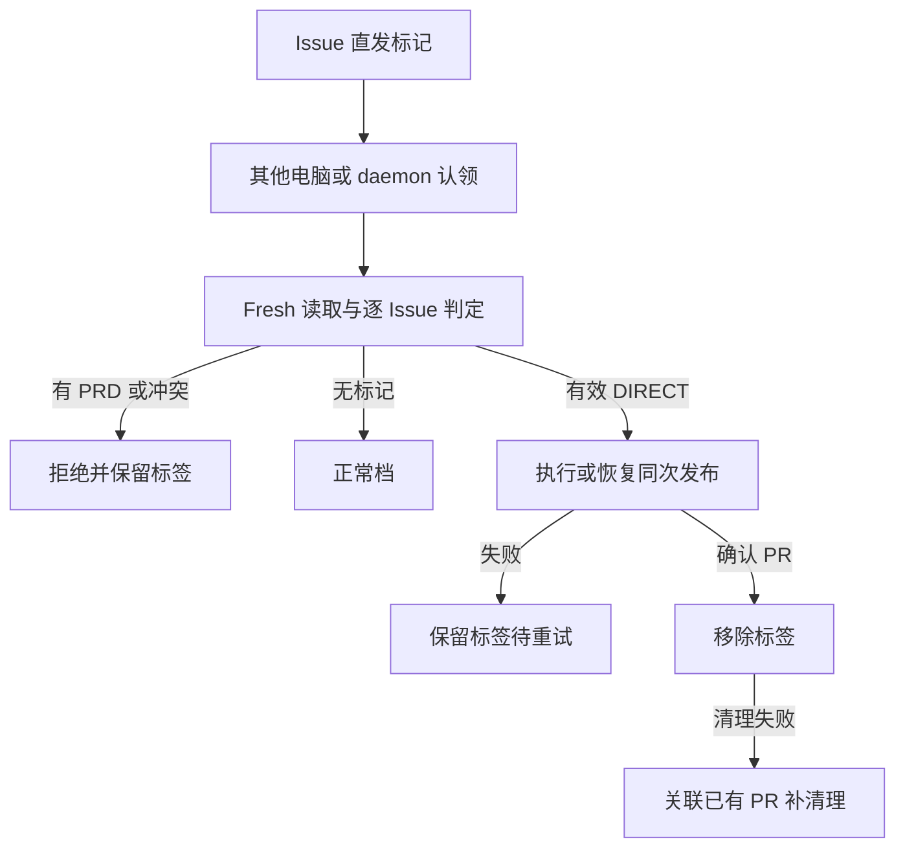

# PRD: Issue Direct PR label 与跨机器、daemon 发布协议

- GitHub Issue: https://github.com/ZataZhang/keda/issues/235

> ✅ **交付前置**：改名 PR #233 与 operator hub PR #240 已主线合并；§8 是依赖唯一事实源。
>
> 🧍 **验收状态**：执行侧交付完成，独立 verifier PASS；待人工验收。此横幅投影 §9，那里是唯一事实源。
>
> Part A 为人审层，Part B 为执行器层；功能一览投影 §10。

## Feature Overview（功能一览）

- **Issue 指定直发档**（FR-1、FR-2）：添加 `direct-pr` label 后，其他电脑、批量运行和 daemon 认领时按 DIRECT 执行，无需本机旗标。
- **保留直发准入限制**（FR-3）：有 PRD 或正文不可读时拒绝；标签不绕过现有依赖和认领规则。
- **成功后消费、失败可重试**（FR-4、FR-5）：确认 PR 后移除标记；失败保留；清理失败可恢复，不重复建 PR。
- **沿用现有接口与证据**（FR-6）：原 CLI 旗标和 PR 档位声明继续工作，不新增理由参数。
- **skill 配套判断协议**（FR-7）：解释何时可标记、直发验证义务和高风险拒绝情形。

---

# Part A · 人审层 (Review Layer)

## 1. Introduction & Goals

### Problem Statement

当前直发档由调用命令的旗标决定，只影响当前运行。用户在一台电脑决定直发后，其他电脑或后台守护进程认领同一 Issue 无法获知这个选择。因此需要把发布档位选择放到 Issue 上，让认领方共同读取。

### Interpretation (解读回显)

| 验证方式 | 输入 / 操作 | 期望观察到的结果 |
|---|---|---|
| 👀 人审 + 自动验证 | 给无 PRD 的待处理 Issue 加 `direct-pr`，由另一执行器或 daemon 认领 | 执行器按直发档创建 Draft PR，保留直发声明；确认成功后 Issue 不再带该标签 |
| 🤖 自动验证 | 队列中只有一个 Issue 带直发标记 | 只该 Issue 走 DIRECT，其他 Issue 仍正常；标记本身不使未就绪 Issue 自动进入队列 |
| 🤖 自动验证 | 有 PRD 或正文不可读的 Issue 带直发标记 | 拒绝直发并报告原因，不执行构建，不移除标记，不默默降级继续执行 |
| 🤖 自动验证 | 直发执行或创建 PR 失败 | 标记保留，可由后续认领重试 |
| 🤖 自动验证 | PR 已创建，但移除标记失败或执行器崩溃 | 后续认领确认同一发布的已有 PR，补移除标记；不重复构建或创建 PR |
| 👀 人审 + 自动验证 | 阅读设置标签与直发决策手册 | 能查到两档差异、直发验证义务、拒绝情形、成功消费和失败恢复规则 |

**我默默定了这些**

- 标签默认名为 `direct-pr`，通过现有标签配置/同步机制管理，不作为 workflow 状态标签。
- 标记是一次成功发布的档位选择：失败重试保留，成功确认已有或新建 PR 后消费；它不是永久偏好。
- 手动直发旗标与标签同时存在可接受；快速通道旗标与直发标签冲突时拒绝，不猜优先级。
- 同一轮认领后的档位固定；执行中添加/删除标签不改变已经启动的档位，撤销正在运行任务使用现有停止机制。
- 标签不增加队列优先级、不代替 ready、不启用自动合并；CLI 不带旁路旗标时仍会读取每个 Issue 标签。

**我理解为不做**

- 不增加理由参数、授权子命令、FAST 标签或按文件数量自动决定档位。
- 不让 daemon 无标签任务自动快轨。
- 不新建跨机器数据库、调度服务或替代认领锁。

目标是让直发选择随 Issue 跨机器传递。标签由操作者明确设置，daemon 消费这个选择；DIRECT 的现有准入与质量责任不被取消。

### What The User Gets

在 GitHub Issue 上设置一次标记，任意兼容版本的认领方都能按 DIRECT 执行。成功后自动移除，失败可重试；已有 PR 的清理恢复不需要重复发布。

### Measurable Objectives

- 手动单目标、批量队列及 daemon 对同一标签解析成相同 Issue 级 DIRECT。
- 未标记的相邻 Issue 不受影响。
- 有 PRD、正文读取失败和冲突档位明确拒绝且无构建副作用。
- 成功移除标记，失败保留；创建成功清理失败可恢复且仅一个 PR。
- 原旗标、PR marker 和直发质量声明兼容。

## 2. Human Review Map (介入与风险地图)

### 决策一：后台执行器消费显式标记

已由用户确认：其他电脑和 daemon 需要读取直发标记。无标记仍正常，不自动猜档位。

**请确认：** 最终交付是否实现标签跨执行器生效，且未扩散到其他任务？

**验收：** 标记任务直发、相邻任务正常，真实 PR 有直发声明。

### 决策二：一次成功发布后消费

已由用户确认：失败保留，成功创建 PR 后移除。清理失败必须报告并可恢复，避免下一轮继承直发选择。

**请确认：** 最终交付是否满足成功消费和失败恢复语义？

**验收：** 成功标签消失；创建失败标签保留；创建成功但清理失败时下一轮只补清理，不重复发布。

### 决策三：直发限制与验证责任

保留有 PRD/正文不可读拒绝。操作者设置标签前确认范围与针对性验证；低风险且最终证据有效才选直发。高风险、证据不足或过期时走完整门禁，不用标记免检。

**请确认：** 是否接受这套判据与限制？

**验收：** 不合格目标被程序拒绝；skill 明确最终树证据、拒绝清单及正反例。

### 自动门禁，不需要逐项人工审阅

Issue 级档位解析、准入检查、既有认领仲裁、恢复幂等和标签同步由执行器验证。

### 本次明确不涉及

不增加理由字段、自动合并或 daemon 全局旁路开关。

## 3. Usage And Impact After Implementation

- **操作者**：用 GitHub 标签界面给 ready Issue 添加 `direct-pr`，由现有定向、批量或后台运行认领；成功后标签自动消失。未 ready 的标记不触发运行。
- **其他电脑与 daemon 操作者**：保持原启动方式，不逐任务传 CLI 旗标，读取共享 Issue 选择。
- **审核者**：继续在 Draft PR 中读取原直发声明及 CI/验证证据。
- **脚本调用方**：原 `--direct-pr` 继续可用。新增行为是无旁路旗标时也会消费 Issue 标签；`--fast-merge` 遇直发标签明确冲突。

## 4. Requirement Shape

- Actor：设置标签的操作者、跨机器认领方、daemon、PR 审核者和 CLI 脚本调用方。
- Trigger：现有可认领 Issue 带直发标签。
- Expected behavior：每 Issue 独立解析 DIRECT，成功消费、失败保留、恢复不重复发布。
- Scope boundary：现有队列、认领及 Draft PR 发布，无新增调度入口。

---

# Part B · 执行器层 (Build Layer)

## 5. Repository Context And Architecture Fit

`IssueSummary.labels`、`LabelConfig` 位于 `core/shared/models/agent_runner.py`；GitHub 端口 `core/shared/interfaces/agent_runner.py` 已有 `get_issue`、`edit_issue_labels` 和 `sync_labels`。标签创建复用 `infrastructure/github_labels.py`，不新增专用 GitHub client。

`agent_runner_orchestration_runtime.py::_process_single_issue` 为 Issue 级共同入口，`agent_runner_issue_handlers.py` 接正常和恢复处理，`agent_runner_publication.py` 处理发布；daemon 调用 `run_once`。首次认领已由 `agent_runner_claim_arbitration.py::arbitrate_first_claim` 仲裁，不能把标签当成锁。

当前 DIRECT 的无 PRD/可读正文检查主要位于 CLI，标签/daemon 必须在 core 共同入口同样验证，不能仅靠 CLI。复用现有 `PublishStage`、DIRECT 发布链、marker 和 PR 查询恢复能力。

No frontend impact：本期使用 GitHub 原生标签界面和现有 CLI，不修改 frontend-public/admin 或 Console API 的标签编辑体验。

前置后采用 `kc` / `kedacode-operator` 及 `references/run-once.md`、`references/daemon.md`，保留 hub 结构与主文件上限。新增标签配置须同步配置加载、示例和文档；非密钥 env 不新增激活默认值。

## 6. Recommendation

### Recommended Approach

在现有标签模型增加默认 `direct-pr` 字段；在每 Issue 共同处理链解析有效档位。保留命令调用档位，只将标签提升为当前 Issue 的 DIRECT 选择，不更改整个批次默认。标签是共享选择，不实现可过期签名或独立授权状态机。

### Proposed Solution Summary (实现机制)

1. 通过既有 label config/同步创建标签，description 明确一次发布及旁路范围；workflow 状态切换必须保留此非状态标签。
2. 实际认领后、执行 builder 或任何被旁路阶段前，fresh `get_issue` 读取标签和正文。旧队列快照不能决定 DIRECT；运行中 label 更新只影响下一次认领。记录本次有效档位和来源，复用日志/认领上下文。
3. 有标签且调用档位 NORMAL → DIRECT；有标签且 DIRECT → DIRECT；有标签且 FAST → 明确冲突拒绝；无标签 → 原调用档位。不向 sibling Issue 共享解析结果。保留显式 `--direct-pr` 单目标限制；批量/daemon 仅通过逐 Issue 标签使用 DIRECT。
4. core 共同入口验证 DIRECT 无 PRD anchor、正文可读、既有依赖门禁，CLI 复用同一业务检查或保留入口错误映射。拒绝时无 builder/PR 创建，无消费标签；daemon 记录 blocked/error 并继续其他任务，不使整轮崩溃。
5. 档位沿正常、已有提交、running 恢复和发布兜底链传递；创建 PR 保留原 DIRECT marker 与质量声明。不改 marker 协议，不增加理由。
6. 找到并确认本次发布对应 PR（仓库、Issue、branch/head 与原直发 marker 匹配）后，仅认领赢家移除配置指定标签，不删除其他标签。创建失败/执行失败不移除。
7. PR 创建成功与标签删除不是原子操作：删除失败或成功响应但 fresh 回读标签仍在时，报告「发布成功、标签清理待恢复」并保留 PR URL；不能宣称完整成功。后续通过已有 PR 查询/关联恢复，先确认匹配直发 PR，再补清理；不得重新构建/建 PR，也不得仅因任意历史 PR 有 marker 就消费新一轮标记。
8. PR 成功后崩溃、已移除标签后状态切换崩溃、blocked/running 恢复均需对应测试；靠 PR 持久状态与现有认领/恢复上下文识别同次发布，不为此新增常驻服务。实现前确认关联信息是否充分，若不足扩展最小现有恢复记录并更新影响树，禁止用「标签删除即 exactly-once」掩盖缺口。
9. CLI 旗标直发且 Issue 没标签不新增标签写入。无法 fresh read 时 fail-closed 不执行；已有成功 PR 的清理恢复允许处理带 PRD/内容变更的当前 Issue，但只补清理，不启动新的 DIRECT。

### Skill 决策协议

解释 label 如何由其他电脑/daemon 消费、何时移除与如何恢复。FAST/DIRECT 分别列实际旁路。两档均不能伪造、削弱或跳过针对最终改动的必要验证；代码改变后重跑受影响验证。公共构造、跨层契约、schema/迁移、安全边界、范围不明、失败/过期/低保真证据不足时，不设置标签，使用 NORMAL 或报告阻塞。局部文案有真实入口证据、纯注释无可执行影响为正例。设置标签沿用现有写操作授权，不新加每轮确认流程。

## 7. Implementation Guide

本节为当前分析起点；实际发现新的恢复/配置落点须更新 PRD，不静默降低范围。

### 7.1 Core Logic

发现阶段只读识别已发布同轮 PR → 认领仲裁与本地锁 → fresh Issue 与关联重核 → 已发布者只补交接；其余每 Issue 档位、准入及依赖 → 执行 → 创建前候选检查点 → 确认 Draft PR → 消费 label 并 fresh 回读 → DIRECT 移交到 review → 检查点完成。初次发布与 cleanup-only 恢复使用相同终态，不随内联 supervisor 配置改变；最终切换失败保留未完成检查点。检查点读取只接受当前凭据作者，或经 fresh GitHub 仓库权限确认可管理 Issue 的作者；查询失败阻塞，外部无权限评论不能通过伪造 marker 获得 DIRECT。创建前不存在旧 PR 的证明和同轮关联也使用严格完整 PR 查询：只有成功空列表代表不存在，查询失败、空输出或格式错误不能授权新发布或消费历史 PR。

### 7.2 Change Impact Tree

```text
.
├── src/backend/core/shared/
│   ├── interfaces/agent_runner.py [修改]【总结】既有评论端口增可信读取/正文筛选，PR 上下文端口增严格读取；默认旧语义不变
│   └── models/agent_runner.py [修改]【总结】LabelConfig 增直发标签配置，默认 direct-pr
├── src/backend/core/use_cases/
│   ├── agent_runner_orchestration_runtime.py [修改]【总结】共同入口每 Issue 解析/验证档位
│   ├── agent_runner_issue_handlers.py [修改]【总结】认领后 fresh read，正常/恢复接同一档位
│   ├── agent_runner_publication.py [修改]【总结】确认 PR 后消费标签，清理失败与恢复幂等
│   ├── agent_runner_direct_pr_label.py [新增]【总结】统一 fresh 档位、准入、依赖与消费，fallback 选择对象
│   ├── agent_runner_direct_pr_round.py [新增]【总结】复用 Issue 评论持久化当前轮次、创建前候选与交接检查点
│   ├── agent_runner_recovery_selection.py [新增]【总结】blocked/running 共用认领与 fresh 选择，cleanup-only 失联时拒绝新工作
│   ├── agent_runner_publish.py [修改]【总结】创建前证明旧 PR 不存在，创建后确认仓库/Issue/branch/head/marker 关联
│   ├── recover_publish.py [修改]【总结】已有工作树锁、DIRECT 认领与只补交接恢复
│   ├── agent_runner_final_verification.py / run_agent_execution_loop.py [修改]【总结】标签来源日志与既有 DIRECT 旁路保持一致
│   └── run_agent_daemon.py [核对，无修改]【总结】既有 daemon 共享 Issue 编排与拒绝隔离
├── src/backend/api/
│   └── cli_parsed_commands/runner.py [修改]【总结】原 CLI 限制与 core 准入一致，映射冲突错误
├── src/backend/infrastructure/
│   ├── github_issue_ops.py / github_client.py [修改]【总结】可信评论查询失败即阻塞，按当前作者/实际仓库权限筛选检查点
│   ├── github_pr_ops.py [修改]【总结】DIRECT 严格 PR 上下文查询失败不当成没有历史 PR
│   ├── github_labels.py [修改]【总结】既有同步机制加入非 workflow 直发标签
│   └── config/ [按需修改]【总结】既有标签配置加载及序列化同步
├── config.toml / src/backend/engines/agent_runner/factory_config_{builder,merge}.py [修改]【总结】默认/覆盖配置传播
├── src/backend/engines/agent_runner/templates/skills/kedacode-operator/
│   ├── SKILL.md [修改]【总结】更新 daemon 可消费显式 Issue 直发标记的不变量
│   ├── references/run-once.md [修改]【总结】标签/旗标解析和判据
│   └── references/daemon.md [修改]【总结】逐 Issue 消费与失败恢复
├── tests/ [修改]【总结】CLI/daemon 入口、逐 Issue 隔离、准入、认领和发布清理恢复矩阵
└── docs/guides/agent-runner.md [修改]【总结】配置、标签使用、旁路责任与失败处理
```

开工搜索配置与示例实际落点并补齐树；接近行数上限文件不堆 helper，优先复用。不放宽 guards；不引入新的 CLI 子命令。

### 7.3 Executor Drift Guard

```bash
rg -n 'LabelConfig|sync_labels|edit_issue_labels|get_issue' src/backend/
rg -n 'publish_stage|direct_pr|arbitrate_first_claim|create_draft_pr' src/backend/core/use_cases/ src/backend/api/cli_parsed_commands/runner.py
rg -n 'fast-merge|direct-pr|daemon' docs/ src/backend/engines/agent_runner/templates/skills/
rg --files tests | rg 'daemon|direct_pr|claim|label|publication|recover'
```

核对 label 不是 workflow 状态，不被状态切换清掉；batch 无档位泄漏；旧「daemon 永远不直发」说明改为「只有显式 Issue label 允许 DIRECT」。保留既有无标签 NORMAL 与无 daemon 全局快轨旗标。

### 7.4 Flow Or Architecture Diagram



### 7.5 ER Diagram

No data model changes in persistent schema. 增加配置字段与 GitHub label，不新增数据库表；Issue/PR 为既有持久状态。

### Risk Classification Register

| 改动点 | Tier 与依据 | 干预与 oracle |
|---|---|---|
| 跨入口标签到 DIRECT 及准入 | R3：daemon 发布旁路改变，跨执行器风险 | 人审 + 真入口集成，rv-1 |
| 成功消费、失败重试与崩溃恢复 | R3：两次外部写入非原子，重复发布风险 | 人审 + 边界故障矩阵，rv-2 |
| 配套 skill 协议与标签配置 | R2：误导操作者或遗漏同步 | 人读全文及现有守卫，rv-3 |

### 7.6 Realistic Validation Plan (Oracle 块)

从前置后的仓库根运行现有 `kc run`、批量 ready 与 `kc daemon`。通过真实 GitHub 测试仓库现有标签编辑入口加标记；至少一条真实 daemon/独立执行进程从 ready 发现到 Draft PR/标签消费的流程。用测试 Issue 编号和记录返回 URL，不写死真实编号。测试 adapter 覆盖故障与混合批次，真实命令解析、认领/运行编排和档位选择不能 mock。

真实 GitHub 验证为 opt-in 凭据相关、交付必需；无凭据先跑完整集成 fallback 并提供待运行脚本，rv-1 不得 PASS，不归档。

```yaml
- id: rv-1
  behavior: 跨机器语义的 label 被 run/batch/daemon 按 Issue 消费为 DIRECT，准入限制与隔离成立
  reviewer: human
  presentation: "真实测试 Issue/PR URL 与标签前后 fresh API 原始状态；混合队列及拒绝矩阵"
  real_entry: "GitHub 给 ready Issue 加 direct-pr，独立执行进程 kc run 或 kc daemon 发现认领；批量含标记和未标记 Issue"
  expected: "标记任务 DIRECT、保留直发 marker；相邻任务 NORMAL；有 PRD/读取失败/FAST 冲突拒绝且无 builder/建 PR；label 不使非 ready 任务入队"
  mock_boundary: "fallback 可 fake GitHub/agent/process；CLI、实际 daemon 迭代和共同编排必须真实。最终至少一条真实 GitHub daemon/独立进程流程"
  tier: R3
  test_layer: integration
  required_for_acceptance: true
  critical_value_source: "GitHub fresh Issue labels/body、认领归属及返回 PR URL"
  must_cross: "设置 label -> 新执行进程发现 -> 认领仲裁 -> fresh read -> core 准入 -> DIRECT 执行链 -> GitHub PR -> fresh read"
  forbidden_bypasses: "手动传 --direct-pr 冒充标签路径；只调 resolver；整批共享档位；用旧队列快照；mock daemon dispatch"
  fresh_state_probe: "新请求读取 PR marker/head 与 Issue 标签，读取未标记任务结果"
  final_tree_evidence: "最终树、输入、执行入口、PR URL、fresh read 与矩阵；解析/准入/编排变更后重采"
  negative_control: "测试 GitHub 边界去掉 direct-pr 后重跑相同输入，DIRECT 断言应失败；有 PRD 样例检查 builder 调用为零"
  expected_fail: "去标签后不再 DIRECT；若 PRD 仍进入 builder 则拒绝 oracle 失败"

- id: rv-2
  behavior: 成功消费、失败保留，创建成功清理失败/崩溃恢复不重复发布
  reviewer: human
  presentation: "成功/失败标签状态对照及 PR 唯一性、恢复故障矩阵报告"
  real_entry: "共同发布入口正常运行；tests adapter 在 PR 写入后/标签删除前抛错或终止，再启动新的 run/daemon 恢复"
  expected: "执行或创建失败保留标签；确认 PR 后移除；删除失败报告待恢复；fresh 恢复确认同次 PR 后仅清理、无重建；新一轮不能靠历史 PR 自动消费"
  mock_boundary: "外部 API 故障与崩溃在 tests adapter/测试进程注入；publication、查询关联、恢复判定、消费逻辑真实"
  tier: R3
  test_layer: integration
  required_for_acceptance: true
  critical_value_source: "PR 持久响应、head/branch/Issue 关联与标签 fresh read，既有认领/恢复上下文"
  must_cross: "认领 -> 发布 -> PR 持久写入 -> 消费标签 -> 新进程恢复 -> 独立 PR/标签读取"
  forbidden_bypasses: "只断言删除方法被调用；将 PR+标签当原子写；任意历史 marker 当本轮成功；输家消费标签"
  fresh_state_probe: "adapter durable store/真实 GitHub 新请求确认 PR 数量与标签，恢复后 builder/创建计数不增"
  final_tree_evidence: "最终树与失败时序矩阵，含删标签后状态迁移崩溃；恢复逻辑改动重跑"
  negative_control: "tests 删除边界返回错误并保持标签，用同一成功消费断言得到红灯；新轮放入不匹配历史 PR 必须不认成功"
  expected_fail: "标签仍存在，完整成功断言失败；错误历史关联若被消费则恢复 oracle 失败"

- id: rv-3
  behavior: skill 两档判据、label 生命周期与配置/示例同步准确
  reviewer: human
  presentation: "最终 Safety/run/daemon reference 全文与 guide、配置示例阅读入口"
  real_entry: "kc labels 同步测试仓库，现有 operator skill 路由阅读 run/daemon；对照实际命令树和 config 加载"
  expected: "direct-pr 默认和自定义标签同步有效；非 workflow 标签保留；两档旁路、最终树验证、拒绝情形及成功/失败/恢复规则完整；不新增 rationale"
  mock_boundary: "label API 可 fake；实际配置加载、同步编排与发行资源真实，语义人工审查不能以关键词代替"
  tier: R2
  test_layer: integration
  required_for_acceptance: true
  critical_value_source: "LabelConfig、实际 sync 结果、最终发行资源与 PublishStage 定义"
  must_cross: "配置 -> labels 同步 -> workflow 保留 -> hub route -> run/daemon 协议"
  forbidden_bypasses: "只测硬编码默认；只读本地旧 skill；只检索关键词；遗漏 daemon 文档旧禁止声明"
  fresh_state_probe: "独立读标签定义与配置；重新打开最终 reference 全文并做场景审查"
  final_tree_evidence: "最终树、配置样例、同步结果及全文报告"
  negative_control: "not feasible — 人读语义不新增文本强制守卫；配置隔离和状态标签保留用现有测试机制证明"
```

矩阵覆盖显式 CLI DIRECT+label、FAST+label 冲突、无标签旧行为、两并发认领者仅赢家执行/消费、fresh read 与队列快照不同、不同仓库同编号隔离、恢复已存在同次 PR 和新轮历史 PR 不匹配。本功能不新增 UI；用户已明确不要求证据展示仪式，真实 GitHub API fresh read 提供标签/PR 状态，不以截图冒充浏览器 user flow。失败先检查 Issue 级来源、claim 归属、PR 关联或删除 API；负控不修改生产代码制造红灯。

### 7.7 Low-Fidelity Prototype

No low-fidelity prototype required. 使用 GitHub 原生标签/PR 页面，不开发新 UI。

### 7.8 Interactive Prototype Change Log

No interactive prototype file changes in this PRD.

### 7.9 External Validation

真实 GitHub 私有隔离仓库验证为交付必需；外部非原子故障由持久 adapter 注入，并通过新客户端回读。外部凭据或网络失败不得声明 rv-1 PASS。

## 8. Delivery Dependencies

- Depends on tasks/issues:
  - tasks/archive/P1-FEAT-20261007-013031-iar-operator-skill-subcommand-hub.md
  - tasks/archive/P1-REFACTOR-20261007-013512-rename-product-surface-to-single-new-name.md
- Merged: PR #233 (`e6f647be`) 与 PR #240 (`8f8642d8`) 已核对主线目标路径。
- Gate type: hard
- Sequence: via-main
- Notes: 合并后采用 kc/kedacode-operator；允许修改 Safety、run 和 daemon references，不改变 hub 分层与安装比对。旧归档 PRD 的 daemon 禁止直发是本功能明确取代的行为边界，不修改其历史记录。

## 9. Acceptance Checklist

### 9.1 人读呈递区（Human Review Surface）

交付填写可点真实 URL 和证据相对路径，经 `just prd review <prd-file>` 聚合打开。本期无 UI 改动，按用户授权呈递真实 Issue/PR URL 与 fresh API 文本状态、故障矩阵；不要求 UI 截图，不把 API 证据声明为浏览器 user flow。完成回复呈递链接。

| Oracle | 你要看什么 | 呈递物（交付填） | 自己复核 |
|---|---|---|---|
| rv-1 | 标签跨执行器直发、其他任务正常 | [CLI PR #5](https://github.com/ZataZhang/keda-direct-probe-20261008-054041-410/pull/5)、[daemon PR #6](https://github.com/ZataZhang/keda-direct-probe-20261008-054041-410/pull/6)、[NORMAL PR #7](https://github.com/ZataZhang/keda-direct-probe-20261008-054041-410/pull/7)、[PRD 拒绝 Issue #4](https://github.com/ZataZhang/keda-direct-probe-20261008-054041-410/issues/4)、[报告](../evidence/P1-FEAT-20261007-184115-run-fast-track-rationale-and-operator-skill-decision-protocol/P1-FEAT-20261007-184115-run-fast-track-rationale-and-operator-skill-decision-protocol.evidence-report.md) | PR 有原直发声明，未标记任务无旁路 |
| rv-2 | 成功消费和清理恢复不重复发布 | [故障矩阵](../evidence/P1-FEAT-20261007-184115-run-fast-track-rationale-and-operator-skill-decision-protocol/P1-FEAT-20261007-184115-run-fast-track-rationale-and-operator-skill-decision-protocol.evidence-report.md)、[独立复核](../evidence/P1-FEAT-20261007-184115-run-fast-track-rationale-and-operator-skill-decision-protocol/P1-FEAT-20261007-184115-run-fast-track-rationale-and-operator-skill-decision-protocol.verifier-report.md) | 创建失败保留；创建后删除失败下一轮只补清理 |
| rv-3 | 配置与最终决策协议 | [验证计划](../evidence/P1-FEAT-20261007-184115-run-fast-track-rationale-and-operator-skill-decision-protocol/P1-FEAT-20261007-184115-run-fast-track-rationale-and-operator-skill-decision-protocol.verification-plan.md)、[配置与全文审查](../evidence/P1-FEAT-20261007-184115-run-fast-track-rationale-and-operator-skill-decision-protocol/P1-FEAT-20261007-184115-run-fast-track-rationale-and-operator-skill-decision-protocol.evidence-report.md) | daemon 可消费标记，义务与生命周期准确 |

通用 lint/test/docs 门禁由 verifier 审查，人不逐项阅读日志。

### 9.2 Acceptance Evidence Package

1. rv-1/rv-2 真入口与故障时序证据，最终树和 PR/Issue fresh read。
2. rv-3 配置/标签同步、最终全文和判据场景结论。
3. 风险对账：并发输家、批次泄漏、PRD 绕过、历史 PR 误消费、删除失败假成功。
4. 通用验证结果，报告首节同一份人审导航。

### Human-Confirmed

前两项方案已在本次对话确认，以下记录最终结果验收，不由 executor 代勾；不拦执行侧归档。

- [ ] 决策一交付结果：label 可被跨电脑/daemon 消费，未标记任务不旁路（rv-1）。
- [ ] 决策二交付结果：成功消费、失败保留、清理失败恢复不重复发布（rv-2）。
- [ ] 决策三：直发准入与针对最终改动验证协议已确认（rv-1 / rv-3）。
- [ ] §9.1 三份材料已亲眼审查。

### Architecture Acceptance

- [x] core 统一 Issue 级档位与准入，复用 PublishStage/GitHub 端口，无逐入口重复规则。
- [x] 复用既有认领与 PR 恢复机制，无 label 锁、独立授权状态机或跨机器数据库。
- [x] 四层依赖、复用与新增模块行数符合；新增 config 同步加载/示例。历史 handlers 999 / publication 953 非空行的兼容例外与风险见报告。

### Dependency Acceptance

- [x] 两前置主线合并与目标路径核对，hub 路由/行数/安装机制保持。

### Behavior Acceptance

- [x] run/batch/daemon 三入口及 Issue 隔离、fresh read、冲突/PRD/不可读拒绝通过（rv-1）。
- [x] 真 GitHub 独立执行进程从标记到 PR 与标签消费通过（rv-1）。
- [x] 失败保留、成功移除、崩溃/删除失败恢复和历史 PR 不误消费通过（rv-2）。
- [x] 认领赢家才执行/消费，已有 PR 不重复建，其他标签保持（rv-2）。
- [x] 原 CLI 单目标限制、无标签 NORMAL、原 DIRECT marker/质量声明兼容。

### Documentation Acceptance

- [x] config、guide、Safety/run/daemon references 同步两档判据与生命周期（rv-3）。
- [x] 旧 daemon 一概禁止直发的当前文档已修正；历史归档记录保留。
- [x] 沿用原导航，新增文档页才同步 mkdocs.yml。

### Validation Acceptance

- [x] 相关 CLI/daemon/labels/claim/publication/recovery 集成与合法负控通过。
- [x] `CI=true just test all`、`just lint --full`、`just lint --reuse`、`uv run mkdocs build --strict` 通过。
- [x] 无凭据 fallback 不替代真实流程；来源、边界、fresh read、最后相关改动后的最终树证据齐全。

### Delivery Readiness

- [x] 独立 verifier PASS，非人工项证据充分，产品/恢复缺口已解决。
- [x] §9.1 实际链接/嵌图/打开方式回填，完成回复呈递。
- [x] Final Reconciliation 完成，交付归档；人工空框保留并投影 🧍 待人工验收。

证据：以上执行侧项目由 [验证报告](../evidence/P1-FEAT-20261007-184115-run-fast-track-rationale-and-operator-skill-decision-protocol/P1-FEAT-20261007-184115-run-fast-track-rationale-and-operator-skill-decision-protocol.evidence-report.md)、[独立 verifier PASS](../evidence/P1-FEAT-20261007-184115-run-fast-track-rationale-and-operator-skill-decision-protocol/P1-FEAT-20261007-184115-run-fast-track-rationale-and-operator-skill-decision-protocol.verifier-report.md) 支持；3578 passed / 1 skipped，全量 lint/reuse/docs 通过。Human-Confirmed 四项保持空框。

## 10. Functional Requirements

- FR-1：增加可配置默认 `direct-pr` 的非 workflow 标签，复用标签同步；标签本身不改变队列资格或优先级。
- FR-2：认领后 fresh read，各 Issue 独立解析；NORMAL+label 为 DIRECT，DIRECT+label 相同，FAST+label 拒绝；run/batch/daemon 共用规则。
- FR-3：标签 DIRECT 在 core 拒绝 PRD anchor、不可读正文及既有不允许旁路目标；无 builder/创建副作用，daemon 隔离单 Issue 拒绝。
- FR-4：确认同次成功 PR 后仅赢家移除 label；执行/发布失败保留，移除失败报告待恢复不宣称完整成功。
- FR-5：创建后崩溃或删除失败，下一轮确认匹配同次 PR 后补消费，无重复构建/创建；历史无关 PR 不消费新选择，其他标签不丢失。
- FR-6：保留原旗标/marker/质量声明；无 label 无旗标 NORMAL；运行中固定档位；不增加理由或 daemon 全局快轨旗标。
- FR-7：skill/guide 同步跨机器消费、生命周期、两档旁路与最终树验证责任、高风险/证据不足拒绝情形。

## 11. Non-Goals

- 不增加 rationale、FAST label、授权子命令、自动档位启发式或标签审批服务。
- 不启用自动合并，不修改 ready/claim 优先级，不在运行中动态切换档位。
- 不承诺 GitHub 两次写原子或无条件 exactly-once；用同次 PR 关联恢复消除重复发布。
- 不新增 Console UI 或跨机器数据库，不修改 hub 安装机制。

## 12. Risks And Follow-Ups

- PR 创建/label 删除非原子：关联已有同次 PR 才能恢复，不能以标签存在推断没有发布。
- 队列快照过期：认领后 fresh read，无法读时不执行；过程中撤销不回滚已选档位。
- 批次/daemon 绕过 CLI：core 必须同样准入，不只移除 daemon 禁止文案。
- 同一 label 无版本：本期不支持在同次发布清理窗口并发重新添加同名标签代表新选择；需等消费完成及 workflow 进入新轮，再重加。文档明确操作边界。
- 多机器版本差异：只有升级后的 runner 消费 label，旧版可能 NORMAL 执行；部署文档说明各认领端升级，不能宣称老版本自动支持。
- skill 判据靠 agent 执行，不升级为全文硬门禁；程序检查仅承担发布准入和恢复正确性。

## 13. Decision Log

| # | 决策 | 选择 | 放弃方案 | 理由 |
|---|---|---|---|---|
| D-01 | 共享选择 | Issue direct-pr label | 本机 CLI 或理由参数 | 用户需要其他电脑/daemon 认领 |
| D-02 | 生命周期 | 成功消费、失败保留 | 永久标签/认领即删 | 防止后续继承并允许重试 |
| D-03 | 恢复 | 同次已发布 PR 关联补清理 | 每轮重复创建/假定原子 | GitHub 写操作独立 |
| D-04 | 准入 | core 共同验证 | 仅 CLI 检查 | batch/daemon 也必须拒绝无效 DIRECT |
| D-05 | 档位冲突 | FAST+label 拒绝 | 猜优先级 | 防止静默扩大旁路 |
| D-06 | 判据 | skill 最终树验证义务 | 理由必填或新文本门禁 | 证据比自述有价值 |

### Final Reconciliation (Archive Only)

- Interpretation: confirmed — Issue 级 direct-pr label 跨认领端生效；不恢复理由参数、FAST 标签或全局旁路。
- Public behavior and contracts: confirmed — fresh 准入/依赖、当轮固定档位、确认同次 PR 后消费、仅清理恢复最终 review；原 CLI 和 marker 兼容。
- Related PRD status: confirmed — 改名与 hub 已主线合并并归档；本 PRD 执行侧完成，四项 Human-Confirmed 待确认。
- Requirements and risks: confirmed — 评论检查点需可信作者，评论/PR 权威查询失败拒绝；历史 PR、删除假成功及最终 workflow 写失败已覆盖。并发重加标签、手工相同 PR 创建需协调，各认领端须升级重启，recover 需本地干净工作树。
- Reconciled differences: 最小现有 Issue 评论检查点及严格查询修复已回填正文/影响树/协议；live 混合 daemon 负例曾在认领后中断，最终独立 CLI 实际拒绝补齐，未把中断冒充通过。用户豁免截图呈递，不豁免真实行为取证。

## Change Log

### 初始创建

- Type: scope
- Before: 无此 PRD。
- After: 可选快轨理由与 agent 决策协议。
- Reason: 快轨声明缺判断依据，手册缺明确判据。
- Review: 待审。

### 2026-10-07 审查修订

- Type: contract
- Before: 旧产品路径；扩展 marker；原文与 sanitize 冲突；通用门禁描述；恢复缺口可豁免；oracle 缺 audience 和不成立负控。
- After: 按前置 kc/hub 目标态实施；marker 不变；安全显示契约；两档最终树验证义务；本次非空理由恢复必覆盖；三条 R2 与明确 audience/呈递、合法负控、真实 GitHub 必需验证及无凭据 fallback。
- Reason: 用户要求修复审查发现的问题；消除执行范围与验收冲突。
- Impact: 仅修订本 PRD，未实现代码、未改变前置 PRD、未勾选产品验收。
- Review: 已完成文档自检，待实施。

### 2026-10-07 收窄为 skill 决策协议

- Type: scope
- Before: 可选理由参数、正文安全渲染、请求透传与恢复覆盖，加 skill 决策协议。
- After: 仅随包 skill 两档判据、最终树验证义务、拒绝情形与 guide 同步。
- Reason: 用户认为理由参数没有必要，并要求移除；一句可选自述不构成质量证据，代码改动与维护成本不值得。
- Impact: 移除 CLI/请求/marker/PR/恢复实现计划及相关测试、真实 GitHub 验收；保留前置结构依赖、文档语义审查与现有守卫。沿用原 PRD 文件名以保留引用，标题与正文为当前范围。
- Review: 文档修订，不代表已实现或产品验收通过。

### 2026-10-07 明确 Direct PR label 为核心需求

- Type: scope
- Before: 仅 skill 决策协议，daemon 永不直发。
- After: Issue direct-pr label 跨电脑/run/batch/daemon 生效；保留直发限制，成功消费、失败重试、已发布清理恢复；skill 配套。
- Reason: 用户明确核心场景是其他电脑或 daemon 认领仍可 Direct PR，并确认以上标签方案；此前排除 label/daemon 的解读已被取代。
- Impact: 本期恢复后端功能范围，不恢复理由参数。方案确认不代表实现/最终验收；仅修订本 PRD，沿用原路径保留引用。
- Review: 待实施。

### 2026-10-08 实现机制与验证呈递校准

- Type: implementation
- Before: 现有 PR marker/head 与恢复上下文是否足够仍待核对；请求截图，§7.9 错称无需外部验证。
- After: 复用 Issue 评论及初始认领 ID 保存最小检查点；创建前持久化候选和无历史 PR 基线，创建后绑定 URL，删除后 fresh 回读，再完成 workflow 交接。恢复优先补已发布同轮交接，即使当前正文新增 PRD。fallback 缓存当轮档位，正文与依赖保持 fresh。
- Reason: 同 head 历史 PR 不能证明新轮发布；PR 响应丢失及标签已删/workflow 未交接都需跨进程证据。用户明确不要求证据展示仪式，本期无 UI 改动，使用真实 GitHub fresh API 状态和文本报告。
- Impact: 更新影响树、必需真实外部验证与文字呈递；不新增数据库、授权服务、CLI 参数或理由字段，尚未勾选验收。
- Review: 实现已完成，最终门禁、真实探针与独立 verifier 进行中。

Machine-Contract-Version: 5

### 2026-10-08 执行侧交付归档

- Type: delivery
- After: 产品 d59ff9cc、指纹 405228cd8106a962071adfd3438b3c4182f9f2c240210ac3ac2a808dfafca704；全量 3578 passed / 1 skipped，真实 GitHub CLI/daemon/对照/PRD 拒绝及独立 verifier PASS。
- Reason: 所有已确认发布/终态/可信检查点/权威 PR 查询缺陷均修复；证据和最终对账完成。
- Review: 执行侧完成并归档，Human-Confirmed 四项不代勾，待人工验收。
