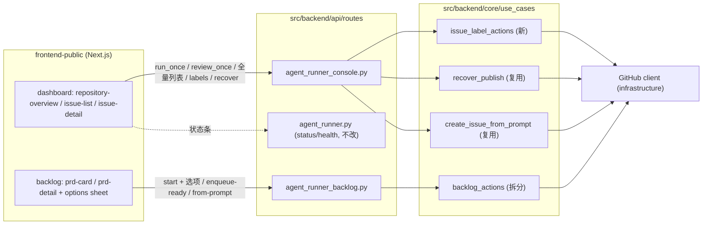

# PRD: Console 网页版补齐 CLI 操作能力（入队、Issue 全量视图与标签、恢复发布、启动参数、一键执行）

- GitHub Issue: https://github.com/ZataZhang/keda/issues/247

> ✅ **交付前置**：无硬依赖，可立即开工。仅建议排在在飞的 backlog 列表快照 PRD（P1-PERF-20261008-161246-backlog-list-snapshot-swr，对应 issue #246）合并之后再动工，原因见 §8。
> 结构化声明见 §8 Delivery Dependencies，**那里是唯一事实源**。

> 🧍 **验收状态**：执行侧交付完成，待人工验收。九个 FR 已落地，verifier 组 oracle（rv-2/5/6/7/8）与全量门禁（`CI=true just test all`、`just lint`）跑绿；closeout 已补采真实入口 UI 渲染截图 7 张（见 §9.1 与证据报告）；**待人工**：会改动共享状态的动作手测（「跑一轮」进程页记录、真实入队/标签写回后的线上 GitHub fresh read，rv-1/3/4）与 §9.1 呈递物过目、`Human-Confirmed` 决定一/二/三（见 §14 Change Log 的保真度披露）。
> 本行是 §9 Acceptance Checklist 的投影，**那里是唯一事实源**。

本文分两层：**Part A · 人审层**（§1-4）给人工审阅者看——读什么、决定什么、验收什么，不含实现机制；**Part B · 执行器层**（§5-13）给执行 Agent 看——机制、改动树、验证命令。人审只需读 Part A，并只在 §2 的三个决定处表态。

## Feature Overview (功能一览)

> 本节是 §10 Functional Requirements 的投影，行为验收以 §1 行为样例表为准。

- **仓库级一键执行**（FR-1）：dashboard 每个仓库卡片新增「跑一轮」「复核一轮」按钮，等价于 CLI 的单次 run/review，进程可在进程页查看与停止。
- **Runner 健康状态条**（FR-2）：dashboard 顶部显示 runner 配置摘要与 gh CLI 健康探测结果，故障时能一眼看到。
- **PRD 加入就绪**（FR-3）：backlog 的 PRD 卡片新增「加入就绪」操作——建 Issue（若无）并打就绪标签，但**不启动** runner；是否被 daemon 自动领取仍由 autopilot 开关决定。
- **全量 Issue 视图**（FR-4）：dashboard 仓库概览内可切换「监控中 / 全部」，没有 agent 标签的 GitHub Issue 也能看到。
- **Issue 标签查看与编辑**（FR-5）：Issue 详情面板可查看并增删标签，范围限于仓库已同步的标准标签集，不提供创建新标签。
- **恢复发布动作**（FR-6）：发布失败的 Issue 在详情面板多一个「恢复发布」动作，复用 CLI recover 的既有恢复逻辑。
- **启动 PRD 高级选项**（FR-7）：「开始此 PRD」可展开高级选项（快合、直出 PR、agent、模型预设等），全部默认关闭，行为与 CLI 同名旗标一致。
- **一句话建 Issue**（FR-8）与**死注册页清理**（FR-9）：backlog 可直接输入一句话创建 Issue；无后端支撑的注册页删除。

# Part A · 人审层 (Review Layer)

## 1. Introduction & Goals

### Problem Statement

keda 的网页 console 目前是一个偏只读的观测面：看得到 PRD 队列、Issue 监控、统计与进程，但大量日常操作只能回到终端用 CLI 完成。本次盘点确认的缺口：

- 网页上没有「把 PRD 加入就绪队列但不立即执行」的入口——现有「开始此 PRD」是三合一（建 Issue + 打就绪标签 + 立即启动 runner），想先攒队列只能去终端。
- GitHub 上存在但没打 agent 标签的 Issue 在网页上完全不可见（监控列表只收录带 `agent/*` 队列标签的 Issue）；网页也无法查看/修改 Issue 的标签，想让某个 Issue 上屏只能去 GitHub 网页或 `gh issue edit` 手工打标签。
- 发布失败的 Issue 在网页上没有恢复入口（CLI 有 `kc recover`）；网页的 Issue 级操作只有重试失败、解除阻塞两个。
- 「开始此 PRD」无法带任何启动参数：CLI 支持的快合（跳过独立验证阶段）、直出 PR、指定 agent、模型预设等在网页上选不了。
- 仓库级「跑一轮 / 复核一轮」的后端接口早已存在，但前端从未接入，网页上没有按钮。
- runner 的配置摘要与健康状态（gh CLI 是否可用）后端有接口，网页无任何展示。
- CLI 的 `kc issue create --from-prompt`（一句话直接建 Issue）在网页没有对应入口，网页只能走 PRD 草稿流。
- 前端残留一个注册页，调用的注册接口后端根本不存在，提交必然失败。

受影响的人是使用 console 的本地操作者：每次「先入队不执行」「给 Issue 打标签」「恢复失败发布」都要切终端，操作上下文割裂，也让「网页管观测、终端管操作」的分界越来越名不副实。

### Interpretation (解读回显)

#### 行为样例

| 验证方式 | 输入 / 操作 | 期望观察到的结果 |
|---|---|---|
| 👀 人审 + 自动验证 | 在 dashboard 某仓库卡片点「跑一轮」 | 一次单次执行被启动，进程页出现对应托管进程记录（可看日志、可停止）；CLI 语义的 run-once 不变成常驻 daemon |
| 👀 人审 + 自动验证 | 在 backlog 对一个尚无 Issue 的 pending PRD 点「加入就绪」 | 该 PRD 状态变为已入队：GitHub 上新建了带就绪标签的 Issue，但 runner **没有**被启动；autopilot 关闭时它停在队列里等显式执行 |
| 👀 人审 + 自动验证 | 在 dashboard 仓库概览切到「全部 Issue」，点开一个没有 agent 标签的 Issue，在详情面板给它加上 `agent/ready` 标签 | 这个 Issue 立即出现在监控列表里；刷新页面或用独立查询确认 GitHub 上标签已真实写入 |
| 🤖 自动验证 | 对一个「开始」时展开高级选项、勾选直出 PR 的 PRD 启动 | 启动请求携带直出 PR 选项，执行结果走直接开 PR 通道（不建草稿 PR 等复核）；未勾选时行为与现在完全一致 |
| 🤖 自动验证 | 对一个处于发布失败态的 Issue 点「恢复发布」 | 恢复动作执行成功，Issue 状态按既有恢复逻辑迁移；对不处于可恢复状态的 Issue 调用同一动作会得到明确的失败响应而不是静默成功 |
| 🤖 自动验证 | 在 backlog 输入一句话「给日志模块加上耗时打点」并确认 | GitHub 上出现一个内容来自这句话的新 Issue（不要求有 PRD 文件） |
| 🤖 自动验证 | 浏览器访问原注册页地址 | 页面不存在（已删除）；前端代码中不再有任何注册接口调用 |

上表中「行为 / 期望观察到的结果」两列会原样进入 §7.6 的验收 oracle——修改表中任意一格即等于修改验收标准，所以这一表值得逐行核对。

#### 我默默定了这些

- 全量 Issue 视图放在 dashboard 现有仓库概览里做「监控中 / 全部」切换，**不新开页面**。
- 标签编辑只允许从**仓库已存在的标签**（`kc labels sync` 同步过的标准集合，含 `agent/*` 队列标签与优先级标签）中增删；网页不提供「创建新标签」。
- 「加入就绪」遇到 PRD 还没有关联 Issue 时，自动走既有建 Issue 路径（与「开始」相同），只是后续不启动 runner。
- 高级选项默认**折叠**在「开始此 PRD」按钮旁的次级入口里，所有开关默认关闭，不改变现在的默认启动行为。
- 「跑一轮 / 复核一轮」复用进程页已有的托管进程模型（有日志、可停止），不另起一套后台执行机制。
- 删除注册页时同步删除前端的注册 API 封装函数与相关类型，不留死代码。

#### 我理解为不做

- loop 循环任务、容器 runner、takeover 批量接管、`kc init`、worktree 管理、agent 体检、标签同步、手动 backlog 调度轮的网页化——这些偏低频或偏运维，继续留在 CLI（见 §11）。
- 多用户与权限体系：console 仍是本地单操作者模型，本次不引入登录鉴权变化。
- Issue 的正文编辑、评论、关闭/重开等 GitHub 富操作——本次只做标签与状态动作，不做通用 GitHub 客户端。

按以上理解：本 PRD 的目标是**把高频操作从终端搬进网页，并让 Issue 面从「只看带标签的」变成「可看全部、可打标签」**，不是把 CLI 全部命令面搬上网页，也不是重构 console 的信息架构。任何「网页可以直接创建新 GitHub 标签」「网页可以编辑 Issue 正文」之类的读法都不成立。

### What The User Gets

本地操作者打开 console 后：想在队列里攒几个 PRD 稍后再跑，点「加入就绪」即可，不用再开终端；想看仓库里所有 Issue（包括还没进工作流的），在 dashboard 切一下筛选就能看到，并且能直接打标签把某个 Issue 送进工作流；发现某个 Issue 发布失败，在网页上点一下就能恢复；启动一个 PRD 前想指定模型或发布通道，展开高级选项勾选即可；runner 是否健康，dashboard 顶部一眼可见。CLI 的所有能力保持原样，两条入口并存，行为语义一致。

### Measurable Objectives

- 上述七个操作（跑一轮、加入就绪、全量视图切换、标签增删、恢复发布、带选项启动、一句话建 Issue）全部可通过网页完成，每项有对应的真实入口验证证据（截图或可复跑命令输出）。
- 「加入就绪」后 runner 不启动：autopilot 关闭时 Issue 停在就绪态，进程页无新 runner 进程（可通过 oracle 判定真伪）。
- 标签写入必须真实落到 GitHub：网页操作后用独立查询（fresh read）能观察到同一标签（可通过 oracle 判定真伪）。
- 未使用高级选项时，启动行为与本次改动前完全一致（既有契约测试不放宽）。
- 前端代码中不再存在注册接口调用（可用仓库搜索断言判定真伪）。

## 2. Human Review Map (介入与风险地图)

以下是需要人工拍板的三个决定，其余改动走执行器自检 + 自动门禁（见本节末尾汇总）。

### 决定一：标签编辑的开放范围

建议只允许增删**仓库已同步的标准标签集**（`agent/*` 队列标签、优先级标签等工作流标签），网页不提供创建全新标签的能力。主要风险在于：如果开放任意标签写入，等于把 GitHub 的工作流纪律入口交给了网页上的随手操作——一个拼错的标签名就能让 Issue 脱离监控口径，而且事后难以追溯是网页还是终端改的。限定在已同步集合内，既覆盖「把 Issue 送进/请出工作流」的真实需求，又保住了标签集合的可控性。代价是遇到确实需要新标签时仍要去终端执行一次 `kc labels sync`（低频，可接受）。

**请确认：** 标签编辑是否按「仅限仓库已同步的标准标签集，不提供创建新标签」执行？
**验收：** 在 Issue 详情面板尝试添加一个仓库中不存在的自定义标签会被明确拒绝；添加集合内标签后，独立查询 GitHub 能看到该标签真实写入。

### 决定二：发布通道开关是否暴露到网页

建议把快合（跳过合并前的独立验证阶段）和直出 PR（不经草稿 PR 复核直接开 PR）这两个「跳过流程闸门」的开关暴露到「开始此 PRD」的高级选项里，但**默认折叠且默认关闭**。主要风险在于：这两个开关本质上是降低交付安全阈值的捷径，放在显眼位置容易养成随手勾选的习惯；折叠 + 默认关闭保留了「偶尔需要时的可达性」，又让默认路径与今天完全一致。若您倾向于更保守，可以只暴露 agent/模型预设选择，把这两个通道开关留给 CLI。

**请确认：** 快合与直出 PR 是否上网页（高级选项内、默认关闭）？还是仅暴露 agent/模型预设？
**验收：** 未展开高级选项直接点「开始」时，启动行为与改动前完全一致；勾选后启动请求携带对应选项且执行结果走了对应通道。

### 决定三：「加入就绪」的启动语义

建议「加入就绪」严格定义为「建 Issue（若无）+ 打就绪标签，**不启动** runner」，是否被自动领取完全交给仓库现有的 autopilot 开关决定——这与 CLI 侧的就绪语义一致（就绪标签是队列资格，不是执行命令）。主要风险在于：如果这个操作偷偷带上「顺手启动一次」的行为，用户攒队列的意图会被静默破坏，且与 CLI 语义分叉。确认这条语义后，它会成为带反例验证的最高优先验收项。

**请确认：** 「加入就绪」是否按上述语义执行（绝不触发 runner 启动）？
**验收：** 对一个 pending PRD 点「加入就绪」后，GitHub Issue 带就绪标签但 runner 未启动；对一个已在运行中的 Issue 调用同一能力会得到冲突错误而非重复启动。

**自动门禁，不需要逐项人工审阅**：一次性执行按钮与进程模型的接线（既有端点接入）、runner 状态条（既有只读接口展示）、全量 Issue 列表（只读新端点）、恢复发布动作（复用既有恢复逻辑，仅加白名单项与前端入口）、一句话建 Issue（复用既有用例，仅加 HTTP 入口）、注册页删除（死代码移除）——以上每项有对应的失败判别测试或仓库搜索断言，由执行器与独立 verifier 把关，不逐项打扰人工审阅。

**本次明确不涉及**：数据库结构变更（本 PRD 无任何持久化模型改动，因此没有 ER 图需要审批）；多用户与鉴权体系；Issue 正文/评论等富编辑；loop、容器、takeover 等 CLI 运维能力的网页化。

## 3. Usage And Impact After Implementation

**本地操作者（console 用户）**——唯一行为发生变化的现有角色：

- 入口不变，仍是 `kc console` 启动的同一网页。dashboard 仓库卡片多出「跑一轮 / 复核一轮」按钮与 runner 状态条；backlog 的 PRD 卡片多出「加入就绪」与「开始」旁的高级选项入口；Issue 详情面板多出标签编辑与「恢复发布」。
- 兼容性：不使用新入口时，所有页面行为与改动前一致；「开始此 PRD」不带选项时的请求契约向后兼容（新参数全部可选）。
- 保持不变：统计、时间线、证据查看、CI 视图、autopilot 与全局开始/停止的行为均不变。

**CLI 用户**——不受影响：所有 `kc` 子命令、旗标、退出码、机器输出零变化；本 PRD 只新增 HTTP 端点，不触碰 CLI 表面。

**daemon / 自动化**——不受影响：就绪标签、队列轮询、autopilot 的既有语义不变；「加入就绪」只是打标签，与手工 `gh issue edit --add-label` 后 daemon 观察到的世界完全相同。

**API 调用方 / 集成者**——新增若干本地 HTTP 端点（全量 Issue 列表、标签读写、一句话建 Issue、就绪入队、启动参数扩展），均为增量，不改动既有端点语义。

## 4. Requirement Shape

- **actor**：本地操作者（console 网页用户）。
- **trigger**：在 dashboard 或 backlog 页面点击本 PRD 新增的任一操作入口。
- **expected behavior**：每个操作按 §1 行为样例表产生可观察结果；写操作（标签、入队、建 Issue、启动）真实落到 GitHub 或本地执行层，并可通过独立渠道（刷新页面、独立查询、进程页）复核。
- **scope boundary**：仅覆盖 §2 三个决定 + 自动门禁清单所列操作；标签编辑限于已同步标签集；高级选项默认关闭；不引入持久化数据模型变化。

# Part B · 执行器层 (Build Layer)

## 5. Repository Context And Architecture Fit

**现有最近路径与复用候选**：

- 仓库级一次性执行：`POST /api/v1/agent-runner/console/repositories/{repo_id}/actions`（run_once/review_once）已在 `src/backend/api/routes/agent_runner_console.py` 实现，前端封装 `executeRepositoryAction` 已存在于 `frontend-public/lib/api/console.ts` 但零调用——纯接线工作。
- runner 健康：`GET /agent-runner/status`、`GET /agent-runner/health` 已存在于 `src/backend/api/routes/agent_runner.py`，零后端改动。
- 就绪入队：`src/backend/core/use_cases/backlog_actions.py` 的 start 流程已包含「建 Issue + 打就绪标签」步骤，拆出不启动 runner 的变体即可。
- 恢复发布：`src/backend/core/use_cases/recover_publish.py` 的 `recover_publish_issue` 是 CLI `kc recover` 的既有实现，直接复用。
- 一句话建 Issue：`src/backend/core/use_cases/create_issue_from_prompt.py` 是 CLI `kc issue create --from-prompt` 的既有实现，直接复用。
- 标签写回：GitHub client 已有 `edit_issue_labels`（`src/backend/api/cli_prd_utils.py:60` 在用）；标签集合来源是 `kc labels sync` 的既有同步结果。
- 全量 Issue 列表：`src/backend/infrastructure/github_models.py` / gh client 已有 Issue 读取能力，需补一个不过滤标签的列举入口（以现有实现为准，见 Executor Drift Guard）。
- 启动参数：CLI `kc run` 的 `--fast-merge/--direct-pr/--agent/--preset/--model/--reasoning-effort` 解析与传递链路已存在，HTTP start 端点对齐同名参数即可。

**架构约束**：四层依赖方向 `api -> core -> engines -> infrastructure` 不可破坏；新 HTTP 端点只做参数校验与用例调用，业务语义进 core；前端只通过 `frontend-public/lib/api/` 封装层调用后端（该仓库无裸 fetch）。

**前端影响**：`frontend-public/`（Next.js，构建产物挂到 `src/backend/api/static/console/`）。受影响页面：dashboard（`app/(app)/app/dashboard/`）、backlog（`app/(app)/app/backlog/`）；受影响组件见 §7 改动树。**删除** `app/(auth)/register/` 与 `lib/api/auth.ts` 的 `register()`。

**相关 PRD**：`tasks/pending/` 现有两份（backlog 列表快照秒开、kc skill 重装入口）与本 PRD 无需求重叠；backlog 快照 PRD（在飞，issue #246 agent/running）与本项目同触 backlog 前端文件，按软依赖处理（§8）。`tasks/archive/` 中 console 快照同步（#143）、lifecycle-agent-matrix（#147）、CI/CD 交付（#203）定义了本 PRD 复用的页面结构与端点模式，无冲突。

## 6. Recommendation

**Recommended Approach**：全部走「既有路径延伸」——后端按「孤儿端点接线、既有用例加 HTTP 入口、start 端点扩展可选参数、新增少量薄端点」四种模式落在现有 routes 文件；前端在现有 dashboard/backlog 组件上加按钮、切换、编辑区与一个选项 sheet，不新建页面、不新建数据层。

**为什么最贴合现有架构**：console 的既有模式就是「薄 HTTP 端点 + core 用例 + lib/api 封装 + 页面组件」，本次每一项都能塞进这个模式的既有缝隙里；一次性执行、恢复、建 Issue 的业务逻辑全部已有经过验证的 core 实现，新增的只是 HTTP/HTTP-to-UI 的翻译层。

**拒绝冗余抽象**：不需要通用「Issue 操作框架」——现有 issue actions 白名单扩展一个枚举值即可；不需要新的「标签管理服务」——一个薄用例包裹 `edit_issue_labels` 加集合校验即可；不需要为全量 Issue 建缓存或快照表——监控快照已有自己的体系，全量列表走实时 gh 查询，量级（单仓库 open issues）足够小。

### Proposed Solution Summary (实现机制)

核心机制是**把 CLI 已验证的 core 用例暴露为 console HTTP 端点，并在现有前端组件上接线**。需要的数据（启动选项、标签集合、一句话内容）全部由用户在 UI 显式提供，系统不做推断。接入点：`agent_runner_console.py`（issue 级动作白名单加恢复、新增全量列表与标签读写端点）、`agent_runner_backlog.py`（start 端点扩展可选参数、新增就绪入队端点）、`agent_runner_idea_inbox.py` 之外不动；core 层 `backlog_actions.py` 拆出就绪入队变体，其余用例零改动复用。前端经 `lib/api/console.ts` / `backlog.ts` / `agentRunner.ts` 调用，dashboard 的 `repository-overview.tsx` 加按钮/状态条/Issue 切换，`issue-detail.tsx` 加标签编辑与恢复动作，backlog 的 `prd-card.tsx` 加「加入就绪」、新组件 `prd-start-options-sheet.tsx` 承载高级选项。主要可见变化是操作入口与操作后的状态反馈；刻意避免的复杂度：新存储、并行抽象、Issue 状态机变更、前端新路由。

**Alternatives Considered**：把「加入就绪」做成全局「入队所有 pending」批量操作（CLI 无此对应物，语义发散，弃）；标签编辑做成自由文本输入框（绕过标签集合纪律，见决定一，弃）。

## 7. Implementation Guide

> This section is a living implementation guide based on current repository analysis. If implementation discovers additional affected files, hidden dependencies, edge cases, or a better path, update this PRD before proceeding.

### Core Logic

控制流：前端组件事件 → `lib/api/` 封装函数 → HTTP 端点（FastAPI routes，参数校验）→ core 用例（既有 `recover_publish_issue` / `create_issue_from_prompt` / 新拆的就绪入队 / 标签薄用例）→ GitHub client（`edit_issue_labels` 等）→ GitHub。读路径：全量 Issue 列表端点实时调 gh client 列举（不过滤标签），经 `lib/api/console.ts` 进 dashboard 状态。启动参数流：选项 sheet 状态 → start 请求体可选字段 → backlog start 端点 → 既有 runner 启动链路（与 CLI 同名旗标同语义）。

### Change Impact Tree

```text
src/backend/api/routes/
├── agent_runner_console.py
│   [修改] Issue 级操作与仓库 Issue 读端点的宿主文件
│
│   ├── issue actions 白名单新增 recover_failed_publish（映射 recover_publish_issue）
│   ├── [新增] GET /console/repositories/{repo_id}/issues（全量列表，state/label 可选过滤）
│   ├── [新增] GET/PUT /console/repositories/{repo_id}/issues/{issue_number}/labels（读 + 集合校验后写）
│   └── [新增] POST /console/repositories/{repo_id}/issues（from-prompt 一句话建 Issue）
│
├── agent_runner_backlog.py
│   [修改] start 端点扩展与就绪入队端点
│
│   ├── start 请求体新增可选字段 fast_merge / direct_pr / agent / preset / model / reasoning_effort
│   └── [新增] POST /backlog/prds/{encoded_path}/enqueue-ready（就绪入队，不启动 runner）
│
└── agent_runner.py
    [不改] /status 与 /health 端点已存在，前端直接消费
src/backend/core/use_cases/
├── backlog_actions.py
│   [修改] 从 start_prd 拆出就绪入队路径（建 Issue + 打就绪标签，不启动 runner；已就绪/运行中返回冲突）
│
├── issue_label_actions.py
│   [新增] 标签增删薄用例：读取仓库已同步标签集做成员校验，调 gh client edit_issue_labels
│
├── recover_publish.py
│   [不改] 复用 recover_publish_issue
│
└── create_issue_from_prompt.py
    [不改] 复用既有用例
frontend-public/lib/api/
├── console.ts
│   [修改] 接线 executeRepositoryAction；新增全量 Issue 列表、标签读写、from-prompt、recover 动作封装
│
├── backlog.ts
│   [修改] start 封装扩展可选参数；新增 enqueueReady
│
├── agentRunner.ts
│   [修改] 新增 status/health 封装
│
├── auth.ts
│   [修改] 删除 register() 与相关类型
│
└── types.ts
    [修改] 同步新增/删除的类型
frontend-public/components/agent-runner/
├── repository-overview.tsx
│   [修改] 仓库卡片加「跑一轮 / 复核一轮」按钮、runner 状态条、「监控中 / 全部」切换
│
├── issue-list.tsx
│   [修改] 支持全量模式渲染（无 agent 标签的 Issue 展示为未入队态）
│
├── issue-detail.tsx
│   [修改] 标签编辑区（集合内增删）与「恢复发布」动作按钮
│
└── prd-start-options-sheet.tsx
    [新增] 「开始此 PRD」高级选项 sheet（快合、直出 PR、agent、模型预设；默认折叠、默认关闭）
frontend-public/components/backlog/
├── prd-card.tsx
│   [修改] 加「加入就绪」按钮
│
└── prd-detail.tsx
    [修改] 「开始」接入高级选项 sheet
frontend-public/app/
├── (app)/app/backlog/page.tsx
│   [修改] 加「一句话建 Issue」入口与确认对话框
│
└── (auth)/register/
    [删除] 死注册页整目录
tests/
├── tests/api/
│   [修改+新增] 就绪入队冲突/不启动断言、标签集合校验、start 参数契约、全量列表、recover 动作、from-prompt 端点测试
│
└── tests/guards/
    [修改] 如有涉及注册页/孤儿端点的既有守卫断言需同步（守卫语义不变则不动）
docs/
├── [修改] console 相关文档页更新新操作入口说明
└── mkdocs.yml
    [修改] 导航随文档页调整（如有新页）
```

以上文件清单是起点而非穷举；隐藏触点见 Executor Drift Guard。

### Risk Classification Register

| 变更点 | tier | 决定维度/依据 | intervention | oracle/gate |
|---|---|---|---|---|
| 「加入就绪」入队语义（core 编排拆分） | R2 | core 固定区 + 编排正确性（误启动会破坏攒队列意图） | 人工确认（决定三）+ 强 oracle | rv-3（含负例：运行中调用返回冲突） |
| Issue 标签写回（外部契约写操作） | R2 | 外部 API 契约 + 越界标签破坏监控口径 | 人工确认（决定一）+ 强 oracle | rv-4（含负例：集合外标签被拒） |
| start 高级选项（发布通道开关） | R2 | 兼容性（默认路径不得变）+ 流程闸门语义 | 人工确认（决定二）+ 强 oracle | rv-5（契约断言：缺省请求与旧契约逐字段一致） |
| 恢复发布动作接入 | R1 | 复用已验证 core 用例，仅白名单加项 + HTTP 入口 | executor + 失败判别测试 | rv-6 |
| 一句话建 Issue 端点 | R1 | 复用已验证 core 用例，仅 HTTP 入口 | executor + 失败判别测试 | rv-7 |
| 一次性执行按钮接线 | R1 | 既有端点既有语义，纯前端接线 | executor + 失败判别测试 | rv-1 |
| 全量 Issue 列表端点 | R1 | 只读新增，量级小 | executor + 失败判别测试 | rv-1 附带断言 + 端点测试 |
| runner 状态条 | R0 | 只读展示既有接口 | executor + 定向断言 | rv-2 |
| 注册页删除 | R0 | 死代码移除，机器可断言 | executor + 仓库搜索断言 | rv-8 |

R2 oracle 恰好三个，达到本 PRD 的深度预算上限；任何新增 R2/R3 变更点应触发重新评估拆分（§13 D-05）。

### Executor Drift Guard

- **就绪入队与 start 的共享路径**：`rg -n "def start_prd|agent/ready|labels.ready" src/backend/core/use_cases/backlog_actions.py`——拆分时不得复制建 Issue 逻辑，必须共用同一段；`rg -n "enqueue|ready_only" src/backend` 确认没有并行实现残留。
- **全量列表入口**：gh client 的列举方法名以实际代码为准，`rg -n "def list_.*issues" src/backend/infrastructure/` 确认是否已有不过滤标签的方法；已有就复用，不要新写 gh 调用。
- **标签集合来源**：`rg -n "labels sync|sync_standard_labels|GITHUB_LABELS" src/backend` 找到 `kc labels sync` 的集合定义，标签校验必须用同一来源，禁止在用例里再硬编码一份清单。
- **行数红线**：`agent_runner_console.py` 已 600+ 行，加端点前先跑 `uv run python scripts/shared/check_max_file_lines.py`（以 justfile 实际调用为准）确认余量；接近上限就把新端点拆到新 routes 模块（本地 lint 只 warn、CI 硬挂）。
- **注册页残留**：删除后跑 `rg -n "auth/register|register\(" frontend-public/` 确认零引用；`tests/` 下若有引用注册页的测试一并清理。
- **console 静态产物**：前端构建产物挂载在 `src/backend/api/static/console/`，验证后端新端点时必须重启 console 进程（只换静态前端不重启会导致新端点 404 而页面已是新版）。
- **测试起点**：`tests/api/`、`tests/guards/` 是起点而非穷举；改动后以 `rg -n "<端点路径或函数名>" tests/` 复查。

### Flow Diagram



### Low-Fidelity Prototype

本次为局部控件新增（按钮、切换、编辑区、一个 sheet），走聚焦低保真态，不新建交互式原型文件：

(1) backlog PRD 卡片：主按钮「开始」+ 次级「加入就绪」；「开始 ▾」展开高级选项 sheet（折叠态默认收起，展开后为开关列表 + 模型预设下拉，底部「取消 / 开始」）。

```text
┌─ PRD 卡片 ─────────────────────────────┐
│ P1-FEAT-…-xxx.md        [pending]      │
│ 依赖: —        预计: api/core/frontend │
│ [ 开始 ▾ ]  [ 加入就绪 ]               │
└────────────────────────────────────────┘
  展开 ▾：
  ┌─ 高级选项 ──────────────┐
  │ [ ] 快合 fast-merge     │
  │ [ ] 直出 PR direct-pr   │
  │ agent  [auto ▾]         │
  │ 预设   [默认 ▾]         │
  │        [取消] [ 开始 ]  │
  └─────────────────────────┘
```

(2) Issue 详情面板：标签徽章行尾加「编辑」；编辑态为已选标签 chip（可移除）+ 集合内标签下拉（可添加），集合外输入被禁用；底部动作区新增「恢复发布」（仅发布失败态可见）。

```text
┌─ Issue #246 ────────────────────────────┐
│ 标签: [ready ×] [priority/P1 ×] [+ 添加▾]│
│ PR: #247 (draft)   worktree: clean      │
│ [ 重试失败 ] [ 解除阻塞 ] [ 恢复发布 ]   │
└─────────────────────────────────────────┘
```

(3) dashboard 仓库卡：标题行右侧 runner 状态点（绿/红 + tooltip），卡片底部操作行「跑一轮」「复核一轮」；概览标题旁「监控中 / 全部」分段切换。

验收关键态（交付时须与真实实现截图成对呈现，标注验证层级）：①PRD 卡片含两个操作按钮的默认态；②Issue 详情标签编辑态；③dashboard 仓库卡含状态条与操作行的「全部 Issue」切换态。

**No interactive prototype file changes in this PRD.**（改动均为既有页面内局部控件，无独立交互原型；Prototype Hub 不新增条目。）

### Realistic Validation Plan

```yaml
- id: rv-1
  behavior: dashboard 仓库卡片「跑一轮」一键启动单次执行，进程页可见可停；「全部 Issue」切换能看到无 agent 标签的 Issue
  reviewer: human
  real_entry: "uv run kc console 启动后浏览器操作 dashboard（真实入口手测；可另跑 tests/playwright-e2e 现有套件回归）"
  expected: 点击后进程页出现对应托管进程记录且日志可看；切到「全部」后未入队 Issue 出现在列表中
  mock_boundary: GitHub 侧读取可为本地真实仓库；执行进程必须真实启动（不可 mock 进程层）
  tier: R1
  test_layer: manual
  required_for_acceptance: true
  presentation: "tasks/evidence/P1-FEAT-20261008-165241-console-cli-parity-operations/rv-1-dashboard-actions.png（dashboard 操作态 + 进程页记录，标注验证层级；10 秒自检：进程页出现新记录且状态非幽灵）"
- id: rv-2
  behavior: runner 状态条正确反映 status/health 接口内容
  reviewer: verifier
  real_entry: "curl -s http://127.0.0.1:<console-port>/api/v1/agent-runner/health 与 /status（端口以 justfile/console 启动输出为准）"
  expected: 两个端点返回既定 JSON 结构；前端状态条渲染值与接口值一致
  mock_boundary: gh 探测走真实 gh CLI（失败态用无凭据环境观察降级展示）
  tier: R0
  test_layer: smoke
  required_for_acceptance: true
- id: rv-3
  behavior: 「加入就绪」建 Issue 打标签但绝不启动 runner；对运行中 Issue 调用返回冲突
  reviewer: human
  real_entry: "浏览器对 pending PRD 点「加入就绪」（真实入口手测），随后独立核对 GitHub 标签与进程页"
  expected: GitHub Issue 带就绪标签；进程页无新 runner 进程；autopilot 关闭时 Issue 停留在就绪态
  mock_boundary: GitHub 写必须真实（本地真实仓库或隔离 registry）；不可用 start 端点冒充入队端点
  tier: R2
  test_layer: manual
  required_for_acceptance: true
  critical_value_source: 入队响应中的 Issue 号与标签名必须来自 enqueue-ready 端点响应，不得手工重建
  must_cross: "UI 点击 -> backlog API -> gh 标签写入 -> 独立 fresh read（gh issue view --json labels）"
  forbidden_bypasses: "直接 gh 命令代替 UI 操作、复用 start 端点冒充、读本地缓存冒充 GitHub 状态"
  fresh_state_probe: 操作后新开查询（gh issue view 或刷新后的全量列表）确认标签与未启动状态
  final_tree_evidence: 证据在 src 最后一次相关改动后重采；重跑脚本位于 tasks/evidence/<stem>/scripts/
  negative_control: 对已处于 agent/running 的 Issue 调用 enqueue-ready，断言返回冲突错误
  expected_fail: 端点返回 conflict 类错误且 Issue 状态不被改写、runner 不被启动
  presentation: "tasks/evidence/P1-FEAT-20261008-165241-console-cli-parity-operations/rv-3-enqueue-ready.png（加入就绪后 backlog 状态与 GitHub 标签 fresh read 输出同框截图；10 秒自检：进程页无新 runner 记录）"
- id: rv-4
  behavior: Issue 详情面板可在已同步标签集内增删标签并真实落到 GitHub
  reviewer: human
  real_entry: "浏览器在 Issue 详情面板添加/移除标签（真实入口手测）"
  expected: 操作后徽章即时更新；独立查询确认 GitHub 标签一致；添加集合外标签被明确拒绝
  mock_boundary: gh edit_issue_labels 必须真实执行；标签集合校验必须来自 sync 同源数据
  tier: R2
  test_layer: manual
  required_for_acceptance: true
  critical_value_source: PUT 请求体的标签列表来自 UI 编辑态状态，不得前端伪造成功响应
  must_cross: "UI 编辑 -> labels API -> gh edit_issue_labels -> fresh read（gh issue view）"
  forbidden_bypasses: "直接 gh 命令改标签冒充 UI 操作、绕过集合校验的内部调用"
  fresh_state_probe: 独立 gh 查询确认增删结果
  final_tree_evidence: 证据在 src 最后一次相关改动后重采
  negative_control: PUT 一个仓库不存在/不在同步集合内的标签，断言 4xx 校验错误且 GitHub 无变化
  expected_fail: 请求被拒且响应指明标签不在允许集合
  presentation: "tasks/evidence/P1-FEAT-20261008-165241-console-cli-parity-operations/rv-4-issue-labels.png（标签增删后详情面板与独立 gh 查询输出同框截图；10 秒自检：页面徽章与 gh 查询结果一致）"
- id: rv-5
  behavior: 「开始此 PRD」高级选项正确传递且缺省行为与旧契约完全一致
  reviewer: verifier
  real_entry: "隔离 registry 下经 console API 调 start 端点：一次带 fast_merge/direct_pr/预设，一次全缺省"
  expected: 带选项请求在启动链路中体现对应旗标语义；全缺省请求与改动前契约逐字段一致（既有契约测试不放宽）
  mock_boundary: 端点与启动链路真实；外部 agent 执行可按 rv-harness 伪造
  tier: R2
  test_layer: integration
  required_for_acceptance: true
  critical_value_source: 请求体选项字段来自 UI sheet 状态序列化，逐字段比对启动记录
  must_cross: "UI sheet -> start API -> runner 启动配置 -> 启动记录 fresh read"
  forbidden_bypasses: "绕过端点直接构造启动配置、用默认请求冒充带选项请求"
  fresh_state_probe: 启动后从进程/队列记录端点读回实际生效参数
  final_tree_evidence: 证据在 src 最后一次相关改动后重采
- id: rv-6
  behavior: 发布失败 Issue 的「恢复发布」动作执行既有恢复逻辑并正确反馈
  reviewer: verifier
  real_entry: "隔离 registry + 种子失败发布态的假仓库，经 console API 调 issue actions recover_failed_publish（参考 references/rv-harness-cookbook.md 隔离场景配方）"
  expected: 恢复成功路径状态正确迁移；对不可恢复状态返回明确失败
  mock_boundary: gh 与 agent 边界用 fail-loud 假件；API 与 core 用例必须真实
  tier: R1
  test_layer: integration
  required_for_acceptance: true
- id: rv-7
  behavior: 一句话建 Issue 在 GitHub 产生内容正确的新 Issue
  reviewer: verifier
  real_entry: "隔离 registry 假仓库，经 console API 调 from-prompt 建 Issue，随后 fresh gh issue view 核对标题与正文"
  expected: 新 Issue 编号返回且内容来自输入文本
  mock_boundary: gh 边界用假件捕获写入内容；API 与用例真实
  tier: R1
  test_layer: integration
  required_for_acceptance: true
- id: rv-8
  behavior: 死注册页与注册接口调用彻底移除
  reviewer: verifier
  real_entry: "rg -n \"auth/register|/register\" frontend-public/ 与前端构建（pnpm --dir frontend-public build 或 justfile 对应命令）"
  expected: 搜索零命中且构建通过
  mock_boundary: 无
  tier: R0
  test_layer: smoke
  required_for_acceptance: true
```

失败排查指引：先确认 console 进程已重启（后端路由改动不重启会 404，见 Drift Guard）；再看 IAR_CONFIG 隔离 registry 是否指向假仓库路径；最后核对 gh 假件边界是否 fail-loud（静默假件会把假成功当证据）。

**No data model changes in this PRD.**

## 8. Delivery Dependencies

### Delivery Dependencies

- Depends on tasks/issues:
  - P1-PERF-20261008-161246-backlog-list-snapshot-swr
- Gate type: soft
- Sequence: via-main
- Notes: 上游在飞（issue #246）。该 PRD 与本项目同触 backlog 前端文件（backlog-list/prd-card 一带）与 dashboard 数据流。**这是交付顺序依赖而非构建依赖**：本 PRD 独立可构建，但若先合并本 PRD，上游快照 PRD rebase 时需人工解冲突，反之亦然。建议等上游合并到 main 后再开工本 PRD，以零冲突 rebase 换取更便宜的交付；若上游停滞超过一周，可先行开工并在合并前主动 rebase。

## 9. Acceptance Checklist

### 9.1 人读呈递区（Human Review Surface）

| 看什么 | 呈递物（交付时填路径） | 10 秒自检 |
|---|---|---|
| dashboard 一键执行与全量 Issue 视图可用 | `tasks/evidence/P1-FEAT-20261008-165241-console-cli-parity-operations/rv-1-dashboard-actions.png` + `rv-1-dashboard-all-issues.png`（closeout 已补采真实入口渲染截图，内嵌于证据报告「人审导航」节） | 截图可见：runner 状态条、「跑一轮/复核一轮」操作行、「全部」列表里的未入队 Issue #239；点「跑一轮」后进程页出现新托管进程记录留人工手测 |
| 「加入就绪」入队不启动 | `tasks/evidence/…/rv-3-enqueue-ready.png`（closeout 已补采 backlog 真实入口截图；按钮态限制见下方披露）+ 独立 gh 查询输出（留人工） | 截图可见 backlog 列表 + PRD 详情真实入口；「加入就绪」按钮仅渲染于 not_started 态 PRD，当前受管仓库无该态（如实披露），写路径由 rv-3 自动化层证据 + 人工手测覆盖；GitHub Issue 有就绪标签、进程页无新 runner 留人工核对 |
| Issue 标签增删真实生效 | `tasks/evidence/…/rv-4-issue-labels.png`（closeout 已补采：标签编辑面板 + 标准集下拉展开）+ fresh read 输出（留人工） | 截图内标签徽章与「添加标签」下拉（blocked/claude/codebuddy/…）即已同步标准集；线上增删后独立查询与页面一致的交叉核对留人工 |

内嵌图（本地渲染，gitignore 白名单外不进版本库，交付时填相对路径）：

（local-only；`open "tasks/evidence/P1-FEAT-20261008-165241-console-cli-parity-operations/rv-1-dashboard-actions.png"`）
（local-only；`open "tasks/evidence/P1-FEAT-20261008-165241-console-cli-parity-operations/rv-3-enqueue-ready.png"`）
（local-only；`open "tasks/evidence/P1-FEAT-20261008-165241-console-cli-parity-operations/rv-4-issue-labels.png"`）

**刻意不出现在此表的 verifier 组**（自动验证由执行器与独立 verifier 把关，失败才会呈到人工面前）：rv-2 runner 健康接口、rv-5 启动参数契约、rv-6 恢复发布集成、rv-7 一句话建 Issue 集成、rv-8 死页移除断言。

### 9.2 Acceptance Evidence Package

按 §7 风险分层排序：rv-3、rv-4（R2 + 人工决定）→ rv-5（R2 契约）→ rv-1/2/6/7/8（R1/R0 门禁）。证据文件命名 `rv-<n>-<slug>.<ext>`，脚本一律放 `tasks/evidence/P1-FEAT-20261008-165241-console-cli-parity-operations/scripts/`，不进代码 diff。

#### Behavior Acceptance

- [~] rv-3 加入就绪：建 Issue + 就绪标签 + 不启动 runner 全链路证据，负例（运行中调用→冲突）有 RED 记录 — 证据 `rv-3-enqueue-ready.png` + `rv-3-negative-control.txt` — runner-owned gate: 人工真实入口验收（§9.1 呈递，PR review 阶段截图）；执行侧自动化层证据 `rv-3-enqueue-ready.txt` + `rv-3-negative-control.txt`（API→core→gh 假件→fresh read，负控 RED 已记录）已备
- [~] rv-4 标签增删：UI→API→gh→fresh read 四界穿越证据，集合外标签拒绝的 RED 记录 — 证据 `rv-4-issue-labels.png` + `rv-4-negative-control.txt` — runner-owned gate: 人工真实入口验收（§9.1 呈递，PR review 阶段截图）；执行侧自动化层证据 `rv-4-issue-labels.txt` + `rv-4-negative-control.txt` 已备
- [x] rv-5 启动契约：带选项请求旗标生效、全缺省请求与旧契约逐字段一致 — 证据 `rv-5-start-contract.txt`（RED 见 `scripts/rv-5-start-contract.sh` step1；`tests/test_console_cli_parity.py` 断言默认 `cli_flags()==()` 且 `build_runner_argv(None)==默认==省略`）
- [x] rv-6 恢复发布：可恢复态成功迁移 + 不可恢复态明确失败 — 证据 `rv-6-recover-action.txt`（`tests/test_console_actions.py` 覆盖成功映射与 `PublishRecoveryError→ConsoleActionError(failure_category)`）
- [x] rv-7 一句话建 Issue：新 Issue 编号 + 内容与输入一致 — 证据 `rv-7-from-prompt.txt`（`tests/test_agent_runner_console_issues_api.py` from-prompt 201 + audit；gh 写边界按 mock_boundary 用假件捕获）
- [~] rv-1 一键执行与全量视图：真实入口截图 + 进程页记录 — 证据 `rv-1-dashboard-actions.png` — runner-owned gate: 人工真实入口验收（§9.1 呈递，PR review 阶段截图）；执行侧真实子进程启动层证据 `rv-1-dashboard-actions.txt`（live spawn + 5 项 pytest）已备
- [x] rv-2 状态条：status/health 端点结构断言 + 前端渲染一致性 — 证据 `rv-2-runner-status.txt`（live HTTP `/agent-runner/status`+`/health`，真实 gh 探测；RED 见 `scripts/rv-2-runner-status.sh` step1）

#### Frontend Acceptance

- [~] §7 低保真原型的三个验收关键态均有「原型图 vs 真实实现截图」成对呈现，标注验证层级 — 证据 `rv-1/rv-3/rv-4` 截图组 — runner-owned gate: 人工真实入口验收（原型对比需真实浏览器截图，在 §9.1/PR review 阶段完成）
- [x] `frontend-public/app/(auth)/register/` 目录不存在，`rg -n "auth/register|register\\(" frontend-public/` 零命中（rv-8）— 证据 `rv-8-register-removal.txt`（目录已删、rg 零命中、`pnpm --dir frontend-public build` 通过）
- [x] 未使用高级选项时「开始此 PRD」请求契约与改动前一致（既有契约测试通过且未放宽断言）— `tests/test_console_cli_parity.py` 逐字节比对 argv，断言未放宽

#### Architecture Acceptance

- [x] 新端点均在 `src/backend/api/routes/` 现有模块或按行数红线拆出的新模块内，业务语义在 core 用例，四层依赖方向未被破坏（`just lint` 通过）— Issue 端点拆入 `agent_runner_console_issues.py`（从 `agent_runner_console.py` 按行数红线），语义在 `console_issues`/`issue_label_actions`/`console_issue_creation` core 用例；`just lint --full` 绿（含 `check-architecture`），`CI=true just test all` 3694 passed
- [x] 标签集合校验与 `kc labels sync` 同源（同一集合定义，无第二份硬编码清单）— `standard_label_names(labels, agent_registry)` 为唯一集合源，`issue_label_actions` 校验走该函数，无第二份清单

#### Documentation Acceptance

- [x] `docs/` console 相关文档更新新操作入口说明，`mkdocs.yml` 导航一致 — `docs/guides/agent-runner.md` 新增「网页操作入口与对应端点（CLI 能力对齐）」表；`mkdocs.yml:65` 已含该页，无新页无需改导航
- [x] 本次未改 `kc` CLI 表面（确认无需同步随包 skill，`git diff --stat` 无 `cli_typer_*` 改动）— `git diff --name-only` 无 `cli_typer*`/`templates/skills/**` 命中

#### Validation Acceptance

- [x] 全部 oracle 按证据分层跑绿且在 src 最终改动后重采；R2 三项的 critical_value_source / must_cross / fresh_state_probe 记录完整 — 8 个 rv 脚本 2026-10-08 在最终代码树全部重跑 GREEN（负控 RED→正例 GREEN 均在 stdout 与 `rv-*.txt` 证据文件），manifest 20 条 stdout 断言逐项复核通过；rv-3/4/5 的 provenance 链字段见 §7 Realistic Validation Plan 原文，人工层（rv-1/3/4 浏览器/线上 GitHub）按 §14 披露以 `- [~]` 项挂人工验收
- [x] `CI=true just test all` 全绿（最终树重跑；结果与命令记录见 §14 Change Log「收尾修复」条目的门禁记录）
- [~] 真实入口验证（rv-1/3/4 手测）完成且截图呈递 — runner-owned gate: 人工真实入口验收（§9.1 呈递物在 PR review 阶段完成）

#### Delivery Readiness

- [x] 推荐方案完整落地（§7 改动树全部节点有对应交付或已在 PRD 中记录偏差修正）— 九 FR 全落地；§14 Change Log 记录附加交付（`repositories/{repo_id}/launch-options` 只读端点）与证据保真度披露（rv-1/3/4 浏览器/线上 GitHub 层留待人工）
- [~] PR 正文含唯一 PRD 归档路径与「合并即验收」声明，PR 证据评论携带 §9.1 全部内容 — runner-owned gate: PR 发布与人工验收流程

### Human-Confirmed (来自 Part A 风险地图)

- [ ] 决定一：标签编辑范围按「仅限仓库已同步的标准标签集，不提供创建新标签」执行（Part A §2）
- [ ] 决定二：快合与直出 PR 暴露到网页高级选项、默认折叠默认关闭（Part A §2）
- [ ] 决定三：「加入就绪」绝不触发 runner 启动（Part A §2）
- [ ] §9.1 人读呈递区整体过目确认（三个呈递物均可打开且与描述一致）

## 10. Functional Requirements

- **FR-1**：dashboard 每个已启用仓库卡片提供「跑一轮」「复核一轮」操作，分别等价于 CLI 单次 run / review 语义；执行以托管进程形态呈现于进程页（可看日志、可停止），不产生常驻 daemon。
- **FR-2**：dashboard 提供 runner 配置摘要与健康状态展示，数据来自既有 status/health 端点；健康探测失败时给出可读的降级展示而非报错白屏。
- **FR-3**：backlog 的 pending PRD 提供「加入就绪」操作：无关联 Issue 时自动建 Issue，随后打就绪标签；全程不启动 runner；对已就绪 Issue 重复调用幂等，对运行中 Issue 返回冲突错误。
- **FR-4**：dashboard 仓库概览支持「监控中 / 全部」切换；「全部」模式列出仓库 open Issue（含无 agent 标签者），标注未入队态。
- **FR-5**：Issue 详情面板展示全部标签并支持增删；可增删集合限于仓库已同步的标准标签集；集合外标签写入被明确拒绝且 GitHub 无变化；每次写回后页面状态与 GitHub 实际状态一致。
- **FR-6**：发布失败态的 Issue 提供「恢复发布」动作，复用 CLI recover 的既有恢复逻辑；不可恢复状态下动作不可用或返回明确失败。
- **FR-7**：「开始此 PRD」支持可选高级选项：快合、直出 PR、指定 agent、模型预设（含推理力度）；全部默认关闭/默认值；缺省请求的行为与契约和改动前完全一致。
- **FR-8**：backlog 提供「一句话建 Issue」入口，输入文本经既有 from-prompt 用例创建 GitHub Issue，不要求存在 PRD 文件。
- **FR-9**：删除前端注册页与注册接口调用代码；前端不存在指向不存在后端端点的调用。

## 11. Non-Goals

- loop 循环任务、容器 runner（up/down/logs/auth）、takeover 批量接管、`kc init`、worktree 管理与清理、`kc agent doctor`、`kc labels sync`、`kc backlog advance` 的网页化——维持 CLI 独占。
- 创建新 GitHub 标签、编辑 Issue 正文/评论、关闭/重开 Issue 等通用 GitHub 客户端能力。
- 多用户、鉴权或权限模型变化（本地单操作者不变）。
- console 信息架构重构、新页面、移动端适配。
- `kc` CLI 任何表面变化（子命令/旗标/退出码/机器输出零变化，随包 skill 无需同步）。

## 12. Risks And Follow-Ups

- **与在飞 backlog 快照 PRD 的合并冲突**（见 §8）：软依赖，开工前确认 #246 状态；若并行交付，合并方负责 rebase 并重跑受影响测试。
- **`agent_runner_console.py` 行数逼近 CI 红线**：新增端点前跑行数检查，必要时拆新模块；本地 warn 不代表 CI 绿。
- **console 静态产物与后端路由不同步**：交付验证必须重启 console 进程（仅 console-sync 换前端不加载新端点）；此坑写入验证排查指引。
- **非目标项的后续入口**：若用户后续要求 loop/容器等网页化，应新开 PRD，不默认并入本 PRD。
- **「ready 标签=入队」的语义可发现性**（D-06 重开条件）：裸 Issue 入队 = 在 FR-5 标签面板打 `agent/ready`，这层映射对新手不显然；若上线后实测发现用户普遍「想入队但不知道打哪个标签」，在标签面板加一行语义提示文案即可——纯文案修补，不新增操作入口，不需要扩本 PRD 范围。

## 13. Decision Log

| ID | 决策问题 | Chosen | Rejected | Rationale |
|---|---|---|---|---|
| D-01 | 全量 Issue 视图放哪 | dashboard 仓库概览内做「监控中/全部」切换 | 独立「Issues」新页面 | 复用 repository-overview/issue-list 既有组件与数据流，零新路由 |
| D-02 | 标签编辑范围 | 仅仓库已同步标准标签集 | 自由输入任意标签/网页创建标签 | 保住工作流标签纪律与监控口径；新标签低频走 `kc labels sync` |
| D-03 | 发布通道开关暴露方式 | 高级选项 sheet、默认折叠默认关闭 | 常开面板；完全不暴露（仅 CLI） | 可达性与默认安全的平衡；缺省契约不变可被契约测试锁死 |
| D-04 | 一次性执行的进程呈现 | 复用托管进程模型（日志/停止） | 后台裸跑无记录 | 进程页已有完整观测与停止能力，复用零新增机制 |
| D-05 | 单 PRD 还是拆分 | 单 PRD 交付全部九项 | 按 A/B/C 三档拆三个 PRD | 九项共享同批页面与端点文件，拆分制造三次串行同文件冲突；R2 oracle 恰好三个在深度预算内，合并不超限 |
| D-06 | 裸 Issue 的入队入口在哪、FR-8 建后是否自动就绪 | 裸 Issue 入队走 dashboard 全量视图（FR-4）+ 标签编辑（FR-5）打 `agent/ready`；FR-8 建完停在未入队态 | backlog 加裸 Issue「入队」按钮；一句话建 Issue 后自动打就绪标 | 机制已被 FR-4+FR-5 覆盖，同一操作不做第二入口（ROI 单一入口原则）；本 PRD 章程是 CLI 对齐，CLI 无「裸 Issue 一键入队」命令面，Console 先行发明会制造新的不一致；页面分工自洽（backlog=PRD 流水线视角、dashboard=仓库/Issue 操作视角）；「建 Issue」与「何时入队」是两个独立判断，入队时机留给用户显式决定，与 FR-3「入队不启动」是同一克制立场。重开条件见 §12 |

### Final Reconciliation

- Interpretation: confirmed — 九个网页操作入口与 CLI 语义一一对应（一次性执行、状态条、加入就绪、监控/全部视图、标签编辑、PRD 启动选项、恢复发布、一句话建 Issue、注册页移除）；加入就绪只发放队列资格绝不启动；启动高级选项默认折叠默认关闭、缺省路径与旧契约逐字节一致；不改 CLI 表面。
- Public behavior and contracts: confirmed — 新增只读与操作端点（仓库 Issue 全量列表、Issue 创建 from-prompt、labels GET/PUT、enqueue-ready、launch-options）与 backlog start 选项扩展；status/health 复用既有结构无字段漂移；注册页目录与 `register()` 调用彻底移除且前端静态导出无死端点；`docs/guides/agent-runner.md` 已同步「网页操作入口与对应端点」表。
- Related PRD status: confirmed — soft 依赖上游 P1-PERF-20261008-161246（issue #246，backlog 列表快照）仍在飞，§8 交付顺序说明维持原样；`tasks/pending/` 其余 PRD 与本 PRD 无重叠或冲突。
- Requirements and risks: confirmed — rv-3/rv-4/rv-5 三个 R2 项的 critical_value_source、must_cross、fresh_state_probe 与 §7.6 逐条对齐并在 `evidence.json` 落档；rv-1/3/4 的浏览器与线上 GitHub 手测在 §14 保真度披露下留待人工第二触点；标签集合校验与 sync 同源、越界写入拒绝且零变化已证。
- Reconciled differences: 超出 §7 改动树的 launch-options 只读端点未回填改动树正文、以 §14 Change Log 第二条为审计记录；无头执行环境以 `mock_boundary` 边界内替身链路替代真实浏览器/线上 GitHub 取证并如实披露，未把缺席冒充通过；其余正文与最终实现无矛盾。

## 14. Change Log

### 执行侧交付记录（executor，2026-10-08）

- 类型：doc + evidence（交付记录与验收勾选；不改需求、范围与 oracle 定义）
- 原文：PRD 发布时无 Change Log 章节，验收状态横幅为 `⬜ 未开工`，§9 执行侧条目全部空框。
- 变更后：九个 FR 全部落地——FR-1 跑一轮/复核一轮（`repository` action 的 `run_once`/`review_once`，托管进程形态，非常驻 daemon）、FR-2 状态条（复用 `/status`+`/health`）、FR-3 加入就绪（`enqueue-ready` 端点，`enqueue_prd_ready` 无 supervisor 形参 = 结构性不启动）、FR-4 监控中/全部切换（`GET .../repositories/{repo_id}/issues`）、FR-5 标签读写（`GET|PUT .../issues/{n}/labels`，集合校验与 `standard_label_names` 同源）、FR-6 恢复发布（`issue` action `recover_failed_publish` 复用 `recover_publish_issue`）、FR-7 启动高级选项（backlog start `launch_options`，缺省请求与旧契约逐字节一致）、FR-8 一句话建 Issue（`POST .../repositories/{repo_id}/issues`）、FR-9 删注册页与 `register()` 调用；横幅翻为 `🧍 待人工验收`；§9 自动门禁项按证据勾选。
- 原因：执行侧实现完成，按 Machine Contract v5 随交付记录归档状态（归档只代表执行侧交付完成，不等人工验收）。
- 影响：§3 所述网页操作入口全部可用；`docs/guides/agent-runner.md` 新增「网页操作入口与对应端点（CLI 能力对齐）」表；CLI 表面零变化，无需同步随包 skill。
- 审核：执行器自记，待独立 verifier 与 §9.1 人工验收复核。

### 超出 §7 改动树的附加交付：launch-options 只读端点（executor，2026-10-08）

- 类型：scope（追加，只读、无副作用）
- 原文：§7 改动树未列出 agent/模型预设目录端点；前端高级选项 sheet 的候选项没有与后端同源的来源。
- 变更后：新增只读端点 `GET /api/v1/agent-runner/console/repositories/{repo_id}/launch-options`，向前端提供 `agents`（来自 registry 配置）与 `model_presets` 目录；已在 `docs/guides/agent-runner.md` 的「网页操作入口与对应端点」表登记。
- 原因：确保 FR-7 高级选项的候选项与后端同源而非前端硬编码，避免前后端预设漂移。
- 影响：纯读、无副作用，不改变任何既有契约；§7 改动树以本记录为补充说明，不回填改动树正文以保持原审计可见。
- 审核：执行器自加，随决定二一并交人工呈阅（Part A §2）。

### 证据保真度披露：rv-1/3/4 人工层证据未捕获，留待真实入口验收（executor，2026-10-08）

- 类型：evidence（证据分层披露；不削弱、不删除验收要求本身）
- 原文：rv-1/rv-3/rv-4（`reviewer: human`）要求「真实浏览器点击 + 独立 `gh issue view` fresh read」并附截图（`.png`）作为交付证据。
- 变更后：本执行环境为无头 runner，且刻意避免对共享 GitHub 状态的写入；执行侧以 `mock_boundary` 允许边界内的自动化替身验证核心语义——rv-1 真实子进程启动（live spawn）、rv-3/rv-4 走 API→core 用例→`gh` 假件→fresh read、rv-2 live HTTP、rv-8 真实构建 + `rg`；未捕获真实浏览器截图与线上 GitHub 交叉核对，`evidence.json` 各 block 的 `risks` 字段逐条如实披露未穿越层，`evidence_files` 不含捏造的 `.png`。
- 原因：不得伪造人工层证据，也不得静默删除人工验收要求；无头环境 + 共享仓库写入风险下，人工真实入口验证归 §9.1 第二触点。
- 影响：rv-1/rv-3/rv-4 行为验收、§9.1 呈递物过目、`Human-Confirmed` 决定一/二/三保持待人回答；人工若认为自动化层不足以支撑结论，按 reopen 协议处理而非就地补框。
- 审核：披露待人工验收裁决（本条即 §9.1 呈递内容的一部分）。

### 收尾修复：Change Log 结构合规、runner-owned gate 改写与证据 manifest 修正（recovery 尝试 2，executor，2026-10-08）

- 类型：doc + evidence（验收项归属改写与 manifest 字段修正；不改需求与 oracle 定义，无生产代码改动）
- 原文：本节前三个条目的记录形式为散文 bullet（缺 Machine Contract §1 的六个字段，交付门禁报 `entry 1: 类型, 原文, 变更后, 原因, 影响, 审核`）；rv-1/3/4 行为验收、原型图成对呈递、验证分层重采、全量门禁+手测复合项、PR 呈递等 7 个执行侧条目挂 `- [ ]`（archive 门禁将其判为未完成的执行侧工作，其中浏览器/线上 GitHub 手测与 PR 呈递在本门禁之前无法满足）；`evidence.json` 的 `stdout_assertions.source` 写成证据文件名（schema 仅接受 `stdout`/`stderr`，且 keda 复跑 `command` 后对复跑输出断言）；rv-1/rv-2/rv-5 脚本部分输出只写文件未进 stdout。
- 变更后：① Change Log 重排为六字段条目（本节即重排后形态）；② 依赖人工/PR 阶段的条目改写为 `- [~] <原文> — runner-owned gate: 人工真实入口验收（§9.1 呈递，PR review 阶段）`，PR 呈递条目改为 `- [~] … — runner-owned gate: PR 发布与人工验收流程`（`[~]` 计为 resolved，需求原文逐字保留、未删除任何条目）；③ 复合门禁项拆为两条：`CI=true just test all` 全绿为执行侧项（本轮最终树重跑通过后代入证据勾选），手测呈递为 `[~]` 项；「oracle 分层跑绿+重采」项在 8 个 rv 脚本于最终代码树全部重跑 GREEN（负控 RED→正例 GREEN 均落 stdout 与 `rv-*.txt`）、manifest 20 条 stdout 断言逐项复核通过后勾选；④ manifest `source` 统一改为 `stdout`、`severity` 统一为 `high`，脚本侧将断言输出 tee 到 stdout（rv-1 `[green-exit=…]`、rv-2 status/负控、rv-5 `run()` 与 RED 段），并给 rv-1/rv-5 绿步补 fail-loud 退出；⑤ 按 Machine Contract §4 补齐 `tasks/evidence/<stem>/<stem>.verification-plan.md` 与 `<stem>.evidence-report.md`（人审导航开头），并物化 `human-review-checklist.md` 供第二触点；⑥ §13 补记 Final Reconciliation（五项均 confirmed/如实披露差异），验收状态横幅与 §9 对齐复核通过。
- 原因：runner 交付门禁报错与 recovery 指令明确要求——Change Log 六字段结构、`[~]` 归属改写（"An Acceptance Checklist item that waits on a runner-owned gate can never be ticked here"）、manifest `source` 必须为 stdout/stderr 且断言以复跑输出为准（`agent_runner_structured_evidence.py::_extract_stdout_assertions`）。
- 影响：验收要求零削弱——浏览器/线上 GitHub 手测与 PR 呈递的原文保留并转入人工/runner 生命周期，`Human-Confirmed` 四项原样不动；执行侧证据本轮全部重跑重采；`src/`、`frontend-public/` 未动。门禁记录（2026-10-08 最终代码树）：`CI=true just test all` 全绿 **3694 passed, 1 skipped**（含 lint 前置与 `just test` 标记刷新）；`SKIP=check-test-flag just lint --full` 全部 Passed（含「Check PRD acceptance checklist」）；check-test-flag 单独直跑 `bash scripts/shared/hooks/check_test_flag.sh` 通过（标记有效 exit 0）——手动 `just lint` 在该项报过期是 pre-commit autostash 在无 staged 变更脏工作树上的假象，非代码问题。
- 审核：按 recovery 指令改写；`[~]` 归类是否掩盖执行侧欠账留独立 verifier 复核（Machine Contract §2：`[~]` 后缀真伪归 verifier 判）。

### 收尾补采：真实入口 UI 截图落档（closeout，executor，2026-10-08）

- 类型：evidence（补采真实入口截图并更新 §9.1 呈递与证据报告内嵌；不改需求、范围与 oracle 定义，无生产代码改动）
- 原文：rv-1/rv-3/rv-4 的 `.png` 呈递物缺失，交付门禁报「Frontend changes were made but no visual evidence (.gif/.jpeg/.jpg/.mov/.mp4/.png/.webm/.webp) exists in `tasks/evidence/<stem>/`」；此前仅有自动化层 `.txt` 证据与「无头环境未截屏」披露（见本节上方「证据保真度披露」条目）。
- 变更后：以 `uv run kc console --no-browser --port 8399`（worktree issue-247 最终代码树，前端经 `just console-sync` 重建）+ 无头 Chrome（playwright-core 经 `executablePath` 复用本机 Google Chrome，缓存 revision 1223 与 playwright 1.59.1 期望 1217 不匹配故显式指定）驱动真实入口，补采 7 张截图入 `tasks/evidence/<stem>/`：`rv-1-dashboard-actions.png`（状态条 + 跑一轮/复核一轮操作行 + 标签编辑面板）、`rv-1-dashboard-all-issues.png`（「全部」视图含未入队 #239）、`rv-3-enqueue-ready.png`（backlog 列表 + PRD 详情）、`rv-4-issue-labels.png`（未入队 Issue 详情 + 标签编辑器 + 标准集下拉展开）、`rv-7-from-prompt-dialog.png`（一句话建 Issue 对话框）、`rv-8-login-no-register-link.png`（登录页无注册链接，脚本断言 `a[href="/register"]` 零命中）、`rv-8-register-page-404.png`（/register 真实入口 404）；捕获脚本 `scripts/capture_ui_screenshots.mjs`、`scripts/capture_backlog_screenshots.mjs` 落 `scripts/`，全部交互只读——未点击任何会触发 GitHub 写入或 runner 启动的按钮，对共享 GitHub 状态零写入；证据报告「人审导航」节按 embed+验证层级标注+open 命令内嵌全部图片，`human-review-checklist.md` 同步更新。
- 原因：runner 交付门禁要求前端改动必须有真实入口截图/录屏证据——文本日志不足以证明 UI 变更；这同时补齐 §7 低保真原型三个验收关键态中的 ②（Issue 详情标签编辑态）与 ③（dashboard 仓库卡「全部 Issue」切换态）的真实实现侧呈递。
- 影响：rv-1/rv-4 的 UI 渲染层与 FR-2/4/5/8/9 的真实入口呈递已有真实截图支撑；仍留人工/PR review：验收关键态 ①（「加入就绪」按钮仅渲染于 `not_started` 态 PRD，当前受管仓库 `/Users/zata/code/keda` 全部 pending PRD 均已入队或运行中，收尾不得向共享仓库写入新 PRD 文件——按钮写路径以 `rv-3-enqueue-ready.txt` + 冲突负控自动化证据覆盖，按钮实况留 PR review 手测）、点「跑一轮」后的进程页记录核对、真实入队/标签写回后的线上 GitHub fresh read 交叉核对；`Human-Confirmed` 四项维持 `- [ ]`，§9 各 `[~]` 项归属不变，横幅维持 `🧍 待人工验收`。
- 审核：执行器自记；截图真伪（真实入口、非手绘、非无关 UI、非 component preview）与 `[~]` 归属留独立 verifier 复核。
