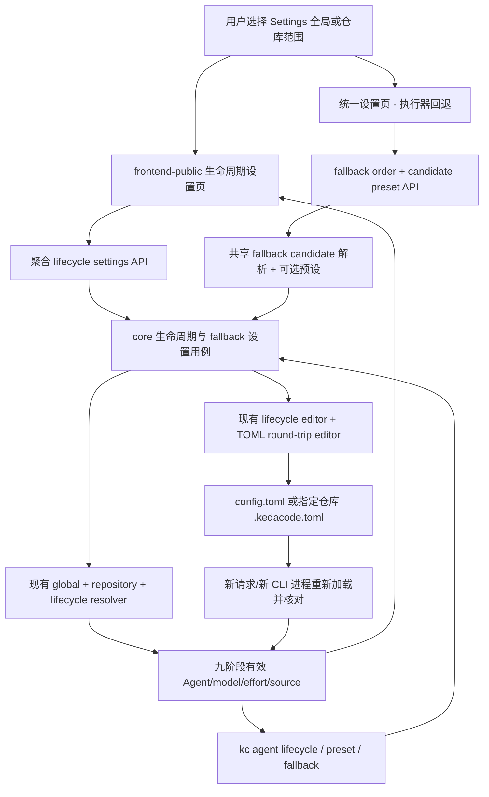

# PRD: 生命周期 Agent、模型与推理深度统一设置

- GitHub Issue: https://github.com/ZataZhang/keda/issues/262

> ✅ **交付前置**：无硬依赖，可立即开工。
> 结构化声明见 §8 Delivery Dependencies，**那里是唯一事实源**。

> 🧍 **验收状态**：待人工验收（执行侧交付完成，§9 非人工项已按证据勾选）。
> 本行是 §9 Acceptance Checklist 的投影，**那里是唯一事实源**。

本文分两层：Part A 需求层（§1-4）说明用户目标、已明确的范围与实现约束；Part B 执行器层（§5-13）给出复用路径、实现边界与验收证据。

## Feature Overview (功能一览)

以下能力清单是 §10 Functional Requirements 的简要投影；用户可见行为以 §1 行为样例为准。

- **九个生命周期统一查看**（FR-1、FR-2）：同一张表呈现每阶段最终生效的 Agent、模型、推理深度、预设与来源。
- **全局与仓库设置放在一起**（FR-3）：专门设置页通过范围选择器查看和编辑全局默认或指定仓库覆盖；Backlog 可提供回到同一页的仓库快捷入口。
- **网页编辑阶段绑定和模型预设**（FR-4）：新建或编辑 Agent + 模型 ID + 推理深度预设，查看会受共享预设改动影响的阶段，并保存到当前配置范围。
- **CLI 查看并持久化设置**（FR-5）：批量列出所有阶段及有效值，提供 JSON 输出和有明确目标范围的预设/阶段绑定修改。
- **保留现有解析和覆盖规则**（FR-6）：继续使用全局、仓库、PRD 与命令级优先级；继承、未指定及 Agent 不支持的推理深度都明确展示。
- **配置错误提前失败**（FR-7）：未注册 Agent、未知预设或缺少必要参数模板时，拒绝保存/执行并说明具体字段，不静默忽略。
- **文档与随包操作知识同步**（FR-8）：更新用户指南、CLI 帮助和随包 `kedacode-operator` skill。
- **执行器回退候选可绑定预设并允许同执行器重复**（FR-9/FR-10）：每个有序候选可绑定匹配的模型预设；同一执行器可用不同预设出现多次，完全相同的组合不能重复。

# Part A · 需求层 (Requirements Layer)

## 1. Introduction & Goals

### Problem Statement

KedaCode 已有 Agent 生命周期分配和模型预设：一个预设可以包含 Agent、模型 ID 与推理深度，也能绑定到九个生命周期阶段。但使用者不能在网页上一次看清所有阶段最终会用什么模型和推理深度。Settings 中原有 Agent-only 生命周期矩阵不能展示模型和推理深度，仓库配置入口又分散在 Backlog；需要用一个专门页面替换旧矩阵，并将全局与仓库范围合并到同一张有效配置表。命令行可列出预设或逐个诊断阶段，却没有完整生效矩阵的查看与持久化修改入口。

因此，用户需要在一处回答“这个阶段由谁执行、实际模型是什么、推理深度是什么、值来自哪一层”，并能把相同事实通过网页或 CLI 持久化到全局或指定仓库配置。配置缺省、继承、Agent 能力差异和 PRD/命令级覆盖都必须如实呈现。

### Interpretation (解读回显)

#### 行为样例

| 验证方式 | 输入 / 操作 | 期望观察到的结果 |
|---|---|---|
| 👀 人审 + 自动验证 | 打开专门的生命周期设置页，保持全局范围 | 一张表列出全部九个生命周期；每行可看出绑定预设、生效 Agent、模型 ID、推理深度及配置来源。没有显式模型/推理参数时明确标为 Agent 默认或未配置，不编造值。 |
| 👀 人审 + 自动验证 | 用 CLI 请求完整生命周期 JSON，并将一个阶段绑定到已有预设 | 输出包含九个阶段及各自的有效 Agent、模型、推理深度、预设和来源；绑定命令写入明确选定的全局或仓库配置，新的 CLI 进程读回相同值。 |
| 👀 人审 + 自动验证 | 打开统一设置页的“执行器回退顺序”，给 Claude 连续添加 `sonnet-5.5 / max` 与 `sonnet-5.5 / high` 两种候选并保存 | 两行都显示 Claude，但模型预设和推理深度分别可见；保存预览按数组顺序写入两个候选；同一个执行器可用另一预设再次尝试，候选预算按行数消耗；未绑定时使用执行器默认。 |
| 🤖 自动验证 | 把带模型或推理深度的预设绑定给 Agent 注册配置中缺少对应 CLI 参数模板的 Agent，或引用不存在的预设 | 根据本地 Agent 注册配置，在保存或调用 Agent 前失败，指出 Agent、缺失字段或预设名；不静默忽略参数，也不留下部分写入。此检查只验证模型/推理值能否按已声明模板传给 Agent CLI，不查询模型目录，也不验证模型 ID 在线有效或账号权限。 |
| 🤖 自动验证 | 不使用新持久化设置，只用现有单次运行参数启动任务 | 单次参数仍只影响当前调用，不写入生命周期配置；既有命令、PRD 覆盖和 `fix/closeout` 继承行为保持不变。 |

以上行为样例是当前验收口径，并分别对应 §7.6 的验收 oracle；修改任一结果格即修改相应验收标准。

#### 我默默定了这些

- 专门页面放在 Settings 下，以范围选择器组合全局和仓库设置；Backlog 仓库入口只作为指向该页的快捷入口，不再维护另一份生命周期编辑器。
- 页面首部提供「生命周期 / 模型预设 / 执行器回退」区块导航；生命周期用四列矩阵呈现阶段/触发时机、预设、当前执行器与参数、配置来源，避免把九阶段压进过多窄列。
- 模型预设使用双列卡片编辑，执行器回退顺序位于同页下方；回退卡片注明它固定写入全局 `config.toml`，不随生命周期范围切换。
- 页面按所选范围显示有效基线；仓库行同时标出本仓库覆盖、全局继承、既有配置或内置默认的来源。
- 命名预设仍是模型与推理深度的配置单元；阶段通过绑定预设获得三元组，修复和收尾在没有独立预设时继承实现阶段的选择。
- 执行器回退预设按候选绑定；只有实际走到对应候选时才应用。同一执行器可用不同预设重复，候选队列顺序不变，`max_agent_switches` 按候选步数计数；预设的 Agent 必须与候选执行器一致。
- PRD 级与命令级覆盖仍在其上下文中查看；本页展示全局/仓库基线，并提示更高优先级覆盖可能改变单个 PRD 或调用的最终值。
- 不替用户推断 Agent CLI 的默认模型或推理深度；无法从配置中确定时会明确显示“Agent 默认 / 未显式指定”。

#### 我理解为不做

- 不新增一个通用 TOML 编辑器，也不把生命周期配置搬进数据库。
- 不在本页编辑 PRD 文件头覆盖；PRD 覆盖继续跟随具体 PRD 上下文。
- 不改变现有单次运行覆盖的优先级或已有 Agent 执行语义。

本需求读作：将目前已经存在的九阶段 Agent/模型预设能力做成一个可看、可编辑的全局与仓库统一入口，并补上可脚本化的完整查看和持久化配置命令；同时评审是否在同一设置页为每个执行器回退候选绑定匹配的命名预设。每个阶段都要展示有效 Agent、模型、推理深度及来源；显式值可通过现有命名预设设置，未显式配置或 Agent 不支持的值必须如实标记。它不要求系统猜测外部 Agent CLI 的默认模型，也不把一次性覆盖写进长期配置。任何模型参数模板缺失、Agent 未注册、回退预设与候选执行器不匹配或目标范围不明确的操作都必须失败并保留原配置。

### What The User Gets

用户可以在 Settings 的一个统一页面切换全局和仓库范围，并一次查看九个生命周期的 Agent、模型、推理深度及配置来源。页面可新建或编辑命名预设、绑定到阶段，并提示共享预设影响的阶段；同页的“执行器回退顺序”可为每个候选选择匹配的模型预设。用户也可以从 CLI 获得完整的表格或 JSON 生效视图，并把预设定义、阶段绑定或执行器回退预设映射写入明确的配置范围。

### Measurable Objectives

- 页面和 CLI 输出始终包含固定九个生命周期键；每行同时提供预设、有效 Agent、模型值/缺省状态、推理深度值/支持状态及来源。
- 全局与仓库范围的读写准确映射到现有配置层；更改仓库后同一仓库的新进程读到新值，而全局和其他仓库不变。
- `fix` / `closeout` 未绑定独立预设时展示并保留其从实现阶段继承的 Agent、模型和推理深度。
- 当模型或推理深度无法由 Agent 注册模板注入时，页面和 CLI 明确指出不支持；拒绝不能生效的显式推理设置。
- 持久化写入仅修改点名的预设/阶段键；TOML 其余注释、未知键和格式不变；失败时配置文件不发生部分改动。
- 现有预设列表、单阶段诊断、单次命令覆盖及 PRD 覆盖语义保持有效。
- 回退候选未绑定专用预设时仍使用现有 Agent 默认模型与推理深度；绑定后模型/effort 来源和候选 Agent 一致且可诊断。
- 桌面与 400px 窄屏均能查看和操作完整设置，不依赖横向滚动来发现阶段字段。

## 2. 已明确需求与实现约束

以下产品需求已由用户在讨论中明确，不作为开工前待确认项：

- **统一设置入口**：生命周期矩阵、模型预设和“执行器回退顺序”放在同一 Settings 页面；页面能在全局与仓库范围间切换。Backlog 仓库入口打开同一页面并预选仓库。
- **生命周期模型细节**：九个阶段都显示有效 Agent、模型、推理深度和来源，并允许为阶段绑定具体预设。没有显式配置时保留 Agent 默认和 `fix/closeout` 继承行为，如实标示，不强制写入未经选择的模型。
- **CLI 查看与设置**：提供完整生命周期查看及持久化设置命令。
- **执行器回退预设**：统一页面中的每个回退候选可绑定同一执行器的命名预设；绑定时仅在该候选执行时应用，未绑定时沿用执行器默认。回退配置保持其既有写入范围，生命周期范围选择器不应意外改写回退配置的目标。
- **重复执行器候选**：同一执行器可用不同模型/推理预设在回退队列中出现多次；候选以 `(agent, preset)` 区分，完全相同的组合拒绝重复。预算按候选步数计算，因此同一执行器的不同预设也分别消耗一步。

### 实现约束（不作为额外产品决策）

- 查询可按可确定的仓库上下文推断有效范围；所有 CLI 写入显式指定全局或仓库范围，仓库写入显式提供 `repo_id`，避免脚本误写配置层。
- 未显式配置的阶段保留现有 Agent 默认和 `fix/closeout` 继承；同一回退候选的 `(agent, preset)` 组合不得重复，旧 `agent_fallback_order` 继续兼容读取。

因此，当前没有需要用户在开工前逐项回答的产品决策。若实现发现现有配置语义与以上要求冲突，再基于具体冲突提交一个聚焦的取舍问题。


原型截图验证层级：**interactive prototype**。图中展示 `sonnet-5.5 / max`、`kimi-k2.6 / high`、`gpt-5.4 / xhigh`；仅作具体的预设示例，不代表当前仓库已配置对应的 Agent 参数模板或账号可用性。生产行为与配置范围按 §2 已明确需求实现，截图不替代生产验证。

**自动门禁，不需要逐项人工审阅**：阶段键闭集、预设和 Agent 校验、配置层合并、TOML 保留式写入、HTTP 请求校验、CLI 参数/JSON 稳定性、静态前端构建、文档和随包 skill 同步由自动检查与独立 verifier 验证。实施后的人工验收针对 §9 的真实界面与 CLI 证据，不再要求重复确认已经明确的需求。

**本次明确不涉及**：自动查询供应商可用模型目录、为用户选模型、每阶段新增独立执行器回退顺序链、外网模型调用健康检查、PRD override editor 重做、数据库/迁移、改变一次性 CLI 覆盖或 Agent 调用授权。统一设置页配置既有回退队列，不为每个生命周期阶段另建独立回退链。

## 3. Usage And Impact After Implementation

**生命周期配置维护者**：从 Settings 打开统一设置页，切换全局范围或某个仓库范围；在九行表格查看当前生效 Agent、模型、推理深度和来源。编辑共享预设时先看受影响阶段，再保存；只想调整一个阶段时创建预设并只绑定该阶段。同页的“执行器回退顺序”可给每个备用执行器单独选择匹配的预设。

**CLI 使用者与脚本**：通过 CLI 查看全生命周期矩阵，需要机器处理时使用 JSON。持久化更新通过命名预设和阶段绑定命令完成，并指明全局或仓库目标；回退候选预设也能通过 fallback list/set/unset 操作。一次性模型/推理参数仍只用于当前调用。

**仓库开发者**：在全局范围保存的配置供仓库继承；仓库级设置覆盖同键全局值。Backlog 的仓库快捷入口将当前仓库作为页面范围，无需再找另一套仓库矩阵。

**PRD 作者与审阅者**：仍在具体 PRD 的现有覆盖控件/配置中查看该 PRD 的生命周期预设；全局/仓库页面会解释更高优先级覆盖来源，避免把基线误当成某个 PRD 的最终配置。

## 4. Requirement Shape

- **actor**：全局 Agent 配置维护者、仓库维护者、CLI/自动化脚本调用方、PRD 作者和审阅者。
- **trigger**：用户打开生命周期设置页面；或请求查看/修改某阶段预设、模型参数或配置范围。
- **expected behavior**：一次读取返回九个阶段的有效配置和来源；同一命名预设提供 Agent、模型 ID、推理深度；通过所选范围安全地持久化最小变更；缺省、继承与错误状态可解释。
- **scope boundary**：覆盖全局与仓库级现有配置中的生命周期 Agent、阶段预设绑定、预设定义，以及同 scope 的回退候选有序数组与候选预设；不覆盖 PRD 级配置、瞬时旗标、Provider 模型目录或数据库状态。

# Part B · 执行器层 (Build Layer)

## 5. Repository Context And Architecture Fit

### Existing Path / Reuse Candidates

- 配置事实源已经存在：`[agent_runner.presets.<name>]` 定义 Agent/模型/推理深度，`[agent_runner.lifecycle_presets]` 将预设绑定到九阶段；仓库同键预设整体覆盖全局预设。不得创造平行数据库或第二种预设语法。
- `src/backend/core/use_cases/lifecycle_agent_resolution.py` 已负责生命周期 Agent 与预设解析；`src/backend/engines/agent_runner/factory_config_merge.py` 已合并全局/仓库生命周期绑定和预设。
- `src/backend/core/use_cases/lifecycle_agents_console.py` 已返回生命周期矩阵与来源，并校验写回；`src/backend/api/routes/agent_runner_lifecycle_agents.py` 已提供 `GET/PUT /agent-runner/lifecycle-agents`。当前视图尚不能完整表达每个字段的独立来源与预设编辑写回。
- `src/backend/infrastructure/config/toml_section_editor.py` 是 TOML 保留式 round-trip 与原子替换的共享原语；新增写入复用 `create_lifecycle_settings_editor`/该原语及其仓库/全局解析，不复制 tomlkit 实现。
- CLI 已有 `kc agent presets` 和单阶段 `kc agent doctor --lifecycle <key>`；生命周期检查器可解析一个阶段，但没有全矩阵、JSON 来源视图或持久化设置命令。
- `agent_fallback_order` 被实现、校验、审核、监督等候选流程复用；现行 fallback 会丢弃主 Agent 的模型预设并使用所选候选 Agent 的默认模型/推理深度。FR-9/FR-10 如获确认，以有序 `agent_fallback_candidates` 数组表承载执行器和可选预设；旧字符串顺序按无预设候选读取。
- Settings 页面当前包含 Agent 标签与旧生命周期 Agent 矩阵；Backlog 仓库行已有仓库设置入口；PRD override 另有上下文抽屉。本需求以统一页面入口替换旧矩阵，保留标签设置和 PRD 上下文覆盖。
- 当前 Agent capability 是声明式参数模板：七个内置 Agent 都声明模型参数模板；`reasoning_effort_args` 目前只有 CodeBuddy、Qoder、Pi 声明。预设中的推理值为字符串，不能把未声明模板当作“已应用”。

### Architecture Constraints

- 继续遵循 `api -> core -> engines -> infrastructure`。HTTP 和 CLI 负责参数解析/呈现；生命周期解析、合并视图及输入校验归 core；Agent 调用模板保持 engine 责任；TOML 读写落 infrastructure。
- API 与 CLI 调用同一 core 用例和配置编辑器；CLI 不通过本机 HTTP 调用自身，也不复制模型解析逻辑。
- 继续使用现有全局/仓库/PRD/单次调用优先级。页面显示的是所选全局或仓库基线；必须明确提醒单个 PRD 或单次命令可能覆写。
- 全局和仓库设置沿用现有配置发现与仓库 registry。仓库写入不自动创建一个绕过现有注册/路径语义的新入口。
- 新增用户界面属于 `frontend-public/`（Next.js App Router、静态构建后由 `kc console` 同源托管）；`frontend-admin/` 不受影响。Playwright E2E 是独立 TypeScript/Node 包，使用 `pnpm` 和其自身 README。
- 不新增数据库表或 schema migration；不存在 ER 图需求。

### Existing PRD Relationship

- 归档 PRD `P1-FEAT-20260918-110027-lifecycle-agent-matrix.md` 建立全局/仓库 Agent 矩阵、来源和 TOML 写回原语；本 PRD扩展同一配置能力到完整 Agent/模型/推理值。
- 归档 PRD `P1-FEAT-20260930-130445-agent-model-preset-switching.md` 已定命名预设、阶段绑定、继承、模板缺失 fail-fast 和 CLI 一次性参数语义。本 PRD 复用这些语义，不重新定义引擎参数。
- Pending PRD `P1-FEAT-20261008-165241-console-cli-parity-operations.md` 已覆盖 CLI 一次性启动参数与若干 Console 操作，不包含长期生命周期配置；可能共同触及 CLI 定义文件和静态前端 bundle，属于文件协调软重叠。
- Pending PRD `P1-PERF-20261008-161246-backlog-list-snapshot-swr.md` 与本 PRD 的 Backlog 仓库快捷入口相邻，但不改变 backlog 数据流；没有语义依赖。
- Pending PRD `P1-FEAT-20261009-123512-kc-agentic-entry-and-stall-supervision.md` 也会修改 Agent 配置文档和静态前端 bundle；与本需求无核心逻辑依赖，交付时协调 shared bundle/rebase。

### Potential Redundancy Risks

- 不新增独立模型预设注册表、数据库模型、客户端配置缓存或 generic settings CRUD API。
- 不保留第二份生命周期矩阵编辑逻辑：Settings 的旧 Agent-only 矩阵由统一页面入口取代；Backlog 仓库齿轮只负责打开同一页面并预选仓库。既有 API 若仍被 PRD drawer/旧 client 使用，只保留兼容行为并委派同一 core/editor。
- 新生命周期页面的确需要新的聚合读写载荷，因为现有矩阵 API 只涵盖 Agent 行，不包含预设定义与最终三元组；范围应严格限定生命周期 Agent/预设，不推广为任意 TOML 编辑接口。

## 6. Recommendation

### Recommended Approach

在既有 lifecycle settings core/editor/API/CLI 路径中扩展一个“全阶段生命周期设置”用例，集中返回九阶段有效快照、每个字段来源和适用能力；由 Console 页面与 CLI 分别调用同一用例。预设仍是 (agent, model, reasoning_effort) 原子定义，生命周期阶段指向预设；直接 Agent 默认值和 `fix/closeout` 继承按当前 resolver 执行。保存仅提交用户改动的键，复用 TOML round-trip editor。

网页新增 Settings 子页面 `/app/settings/lifecycle/`；页面的全局/仓库选择器管理生命周期配置范围，页首的区块导航可直达生命周期矩阵、模型预设和执行器回退。生命周期矩阵使用四列宽布局显示九阶段、生效信息与来源；模型预设用双列卡片显示绑定阶段并编辑字段。Backlog 仓库齿轮改为进入该页面并预选仓库，不再独立提供一张编辑器。保留 PRD override 抽屉；共享预设编辑前提示所有受影响阶段。执行器回退顺序与生命周期设置在同一页面连续呈现；回退区每行绑定同执行器预设，同一执行器可用不同预设重复出现，保存预览按序呈现候选数组和预算。

CLI 扩展 `kc agent` 命令面：

```text
kc agent lifecycle list [--scope effective|global|repository] [--repo-id <id>] [--json]
kc agent lifecycle set <stage> --preset <name> --scope global|repository [--repo-id <id>]
kc agent lifecycle unset <stage> --scope global|repository [--repo-id <id>]
kc agent preset set <name> --agent <agent> [--model <id>] [--reasoning-effort <value>] --scope global|repository [--repo-id <id>]
kc agent fallback list [--scope effective|global|repository] [--repo-id <id>] [--json]
kc agent fallback candidate add --agent <agent> [--preset <name>] [--position <n>] --scope global|repository [--repo-id <id>]
kc agent fallback candidate preset set --position <n> --preset <name> --scope global|repository [--repo-id <id>]
kc agent fallback candidate preset unset --position <n> --scope global|repository [--repo-id <id>]
kc agent fallback candidate remove --position <n> --scope global|repository [--repo-id <id>]
kc agent fallback candidate move <position> --to <n> --scope global|repository [--repo-id <id>]
```

> 注：`candidate move` 采用位置参数 `<position>` + `--to <n>`（移动第 `<position>` 位候选到第 `<n>` 位），与 docs/guides/model-presets.md、随包 kedacode-operator skill 及守卫测试一致；PRD 早期草案的 `--from <n> --to <n>` 双旗标形态未采用（见 Change Log）。

`list` 默认按当前 cwd 可唯一解析的仓库显示 effective view；没有唯一仓库上下文时显示 global，并在表头/JSON 标明 scope。所有写命令必须显式给 `--scope`；repository scope 必须显式给注册 `repo_id`。`lifecycle set` 只绑定指定的命名预设；`lifecycle unset` 只删除当前层该阶段的 preset binding，仓库层清除后恢复全局层，global 清除后恢复既有直接 Agent/legacy/default 解析。要设置 Agent/model/effort 三元组，先用 `preset set` upsert preset 再绑定。预设 `set` 是 upsert：未提供 model/effort 表示该预设不显式设置该字段。fallback candidate 命令用 1-based `--position` 定位有序候选，因此同一 agent 可添加多次并绑定不同 preset；重复的 `(agent, preset)` 组合拒绝写入。现有 `kc agent presets` 列表命令保留；可扩展 JSON 输出但不得删除/改名既有入口。单次运行旗标不调用这些持久化命令。

本页和新增 CLI 通过命名预设设置生命周期阶段的 Agent/model/effort；预设只填写 Agent 时，表示使用该 Agent CLI 默认的 model/effort。现有直接 Agent 配置仍按 resolver 生效，但新增的页面/CLI 不把它和预设绑定的优先级重写成新规则。若绑定预设包含模型或推理深度但 Agent 缺少对应参数模板，则拒绝写入或标错为无效，并阻止执行。

执行器回退候选预设拟使用 `[[agent_runner.runner.agent_fallback_candidates]]` 数组表，每个条目包含 `agent` 与可选 `preset`。旧 `agent_fallback_order` 字符串列表按无 preset 候选读取；新格式存在时数组表是运行时事实源，旧列表仅作为执行器顺序兼容视图。数组顺序与 `max_agent_switches` 共同决定实际尝试；同一 agent 可绑定不同 preset 多次，重复的 `(agent, preset)` 组合拒绝写入。保存时要求 Agent 已注册、预设存在且 `preset.agent` 与候选执行器一致。运行时仅当 shared fallback chain 选中该候选时应用预设；one-shot `--agent` 不应用此映射。模型/effort 参数模板校验复用现有 lifecycle preset validation。

### ROI 与范围取舍

这不是再造模型选择器：`kc agent presets`、`doctor`、resolver、scope merge 和 TOML writer 都已在项目中。新增成本集中在一个跨全局/仓库的汇总读写载荷、Settings 页面和 CLI 持久化入口。相较人工在多处文件中查九个阶段并手动追继承关系，这会让常见配置排查和调整更直接，也减少“模型/推理参数看似已设、实际没有注入”的误判。继续只用 TOML/doctor 的成本更低，但无法满足统一网页和批量 CLI 查看；通用配置编辑器或 DB 则增加无关抽象，回报有限。

该目标是一组不可分的设置闭环：页面、CLI 和配置解析必须展示并修改同一事实源。拆开交付会留下一个已展示但无法持久化，或一个已持久化却网页仍不完整的中间态，因此保留单一 PRD。当前范围不扩展为全仓通用配置系统。

### Proposed Solution Summary (实现机制)

core 组合已解析的 global/repository config，为每个阶段返回预设绑定、生效 Agent/model/effort、继承/默认状态、每个字段来源和 Agent 参数模板能力；更新命令先校验全部请求，再通过既有 lifecycle editor/TOML 原子写回 sparse changes。CLI 与 HTTP 同用该 core 路径。Frontend 在一个 Settings 页面按全局/仓库范围加载快照、编辑预设/绑定并提交，保存后重新读取服务端视图。Backlog shortcut 只传仓库选择状态。

旧 `lifecycle-agents` API 如需维持兼容，继续响应旧的 Agent-only 形状并复用同一个 core/editor；新页面调用单一聚合生命周期设置端点。不要让旧 route 和新 route 各自拥有一份写回逻辑。

### Alternatives Considered

- **仅补充 CLI 文档或逐阶段 doctor 输出**：没有统一网页，也要人工组合九个命令，不能解决范围切换与预设影响关系。
- **直接在生命周期行内保存 model/effort 字符串**：重复已存在的命名预设语义，产生绑定优先级之外的第二种模型来源；不推荐。
- **每个范围复制全量预设和阶段配置到数据库**：重复 TOML 事实源并引入迁移、同步、导入导出冲突；不推荐。
- **扩展现有 Agent-only API 作为聚合载荷**：可以向前兼容添加字段，但预设列表/编辑与 scope snapshot 语义将让 lifecycle-agents 名称继续承载无关写入面；保留旧 API 并新增一个专用聚合 endpoint，复用同一个用例/editor。

## 7. Implementation Guide

> 本节是 living implementation guide。若实现发现新的复用路径或隐藏依赖，先更新本节与 Change Log，再继续交付。

### 7.1 Core Logic

1. 固定九个生命周期键来自 `LIFECYCLE_AGENT_KEYS`；不得在 UI、CLI 和 API 各自维护不同顺序/闭集。
2. `scope=global` 基于 global config 解析；`scope=repository` 基于现有 merge config 展示仓库有效值与字段来源。响应至少包含：`key/label`、`preset_name`、`effective_agent`、`model`、`reasoning_effort`、`field_sources`、`is_inherited`、`follows_implementation`、`model_supported`、`reasoning_effort_supported` 及绑定预设的影响阶段列表。
3. 缺少显式 `model` 或 `reasoning_effort` 时，区分“Agent CLI 默认”与“该 Agent 不支持该参数”；不能显示空白或猜测真实供应商默认值。当前模型/effort 通过注册块 `model_args` / `reasoning_effort_args` 模板是否存在来判定可注入性。
4. 预设仍为原子合并：仓库同名预设整体覆盖全局，不做字段级混合；仓库预设不覆盖全局同名时可引用已有全局预设。绑定预设整体决定 Agent/model/effort；未绑定继续使用直接 lifecycle Agent / 既有键 / builtin。`fix` / `closeout` 未自绑时沿用实现阶段解析结果。
5. 新页面的 scope 是用户当前编辑文件范围，不等于一次具体运行的最终 override：说明 PRD header/CLI flags 可能进一步覆盖。CLI `--json` 有稳定字段名和 deterministic lifecycle 顺序；表格和 JSON 都包含 scope/repo id 与来源。
6. 对写请求先解析/校验全体 stage/preset/agent/template/field，再通过既有 `toml_section_editor.update_toml_table_keys` 写入；复用全局/仓库 `lifecycle_editor` 的目标路径和原子替换，不复制 round-trip。失败不得改文件；成功后从 fresh config 重载并返回生效视图。
7. `agent preset set` 更新预设时会提示/返回该预设当前绑定的阶段；Web 页面保存共享预设前展示受影响阶段。若只改一阶段，提示先复制/新建 preset 并单独绑定。该提示不改变原子预设语义。
8. API 用一个聚合生命周期 settings endpoint 提供 snapshot/patch；patch 只包含用户修改的键。scope/repo 校验、旧 HTTP response 兼容及错误码由 routes 做协议映射，业务规则在 core。
9. CLI mutations 都需要显式 scope；读取 `effective` 在 registry path 能唯一解析时按仓库读取，否则按 global 读取并打印所选 scope。错误的 repo id、未知 lifecycle key、缺失 preset、unsupported effort template 应在写入或执行前返回可诊断非零错误。
10. FR-9/FR-10：以有序 `[[agent_runner.runner.agent_fallback_candidates]]` 数组表保存 `agent` 与可选 `preset`；数组顺序就是候选顺序。旧 `agent_fallback_order` 列表按无预设候选读取，并保留同值执行器顺序兼容视图。写入前校验 Agent 已注册、预设存在且预设 Agent 与候选一致；相同 `(agent, preset)` 组合拒绝重复，不同 preset 的同一 Agent 可重复。候选执行时使用其绑定 preset，未绑定继续用执行器默认。`max_agent_switches` 按候选步数计数，显式主 Agent / one-shot `--agent` 不直接应用候选 preset。

### 7.2 Change Impact Tree

```text
Database
└── 无数据库变化
    【总结】全局 config.toml 与仓库 .kedacode.toml 保持单一持久化事实源，不新增表或 migration

Infrastructure
├── src/backend/infrastructure/config/agent_runner_settings.py [按需修改]
│   【总结】按需增加 runner fallback Agent→preset 配置字段及生命周期设置载荷校验
├── src/backend/infrastructure/config/toml_section_editor.py [复用]
│   【总结】复用唯一 round-trip/原子 TOML 写回原语，不新增平行写入器
└── src/backend/engines/agent_runner/factory_config_merge.py [复用]
    【总结】复用已有的全局/仓库 preset 与 lifecycle binding 合并

Core
├── src/backend/core/use_cases/lifecycle_agents_console.py [修改]
│   【总结】构建完整九阶段 Agent/model/effort/source/能力视图并校验聚合更新
├── src/backend/core/use_cases/lifecycle_agent_resolution.py [按需修改]
│   【总结】仅补齐 UI/CLI 视图缺失的有效选择或来源信息，不复制已有解析优先级
├── src/backend/core/use_cases/agent_candidate_fallback.py [按需修改]
│   【总结】为共享 fallback candidate 构建路径提供可选 preset 解析，未绑定时保持原候选
├── src/backend/core/use_cases/agent_runner_orchestrate.py [按需修改]
│   【总结】Issue 执行跨 Agent 切换时应用该候选的 fallback preset
├── src/backend/core/use_cases/run_verifier_agent.py [按需修改]
│   【总结】校验候选顺延时使用对应 fallback preset，并保留独立性与失败顺延语义
├── src/backend/core/use_cases/agent_review.py [按需修改]
│   【总结】审核候选顺延时应用对应 fallback preset
├── src/backend/core/use_cases/pr_supervisor.py [按需修改]
│   【总结】监督候选顺延时应用对应 fallback preset
└── src/backend/engines/agent_runner/lifecycle_editor.py [修改]
    【总结】把经过 core 校验的 sparse preset/binding 变更委派给既有 TOML editor

API / CLI
├── src/backend/api/routes/agent_runner_lifecycle_agents.py [修改]
│   【总结】新增聚合生命周期 snapshot/patch，并扩展 fallback endpoint 读写有序候选数组；保持旧响应兼容
├── src/backend/api/cli_typer_agent.py [修改]
│   【总结】新增 lifecycle list/set、preset upsert 和 fallback list/preset set/unset 命令，旧 doctor/presets 保持兼容
└── src/backend/api/cli_schema.py [按需修改]
    【总结】若 schema 暴露命令树，同步帮助和机器可读命令定义

Frontend: frontend-public
├── frontend-public/app/(app)/app/settings/lifecycle/page.tsx [新增]
│   【总结】新增 Settings 生命周期设置真实页面及全局/仓库范围导航
├── frontend-public/app/(app)/app/settings/page.tsx [修改]
│   【总结】移除旧 Agent-only 生命周期矩阵，改为统一设置页入口；生命周期、模型预设和执行器回退放在同一页
├── frontend-public/components/agent-runner/lifecycle-settings-page.tsx [新增]
│   【总结】承载九阶段矩阵、来源、预设编辑、受影响阶段和写入状态
├── frontend-public/components/agent-runner/repository-agent-matrix-sheet.tsx [删除]
│   【总结】旧 Agent-only 仓库矩阵抽屉由统一设置页取代；Backlog 齿轮改为带 `scope=repository&repo_id=` 导航到同一页并预选该仓库，不维持第二套编辑状态
├── frontend-public/components/agent-runner/agent-fallback-order-editor.tsx [删除]
│   【总结】回退顺序编辑并入统一设置页的「执行器回退候选」区，避免第二套候选编辑器
├── frontend-public/components/layout/app-shell.tsx [修改]
│   【总结】<md 视口改为纵向堆叠（侧栏变顶部导航条）并把容器内边距降为 `p-4`，使统一设置页在 400px 窄屏真正可读；≥768px 计算样式不变
├── frontend-public/components/layout/app-sidebar.tsx [修改]
│   【总结】窄屏整宽、`md:` 起恢复 `w-64` 左侧栏与右边框，保持收起偏好与导航可用
├── frontend-public/lib/api/lifecycleSettings.ts [新增]
│   【总结】封装聚合 lifecycle settings API 与作用域/更新类型
├── frontend-public/lib/api/lifecycleAgents.ts [不变]
│   【总结】继续服务既有 Agent-only 调用方，不新建并行写回路径
└── frontend-public/lib/api/types.ts [修改]
    【总结】同步全阶段 tuple、来源和 capability response types

Tests
├── tests/test_lifecycle_agents_console_api.py [修改]
│   【总结】覆盖聚合视图、来源、scope 更新、TOML 持久化、无部分写入和旧接口兼容
├── tests/test_agent_model_presets.py [修改]
│   【总结】覆盖仓库 preset 原子覆盖、共享预设影响阶段和模板不支持 fail-fast
├── tests/test_lifecycle_agent_resolution.py [修改]
│   【总结】覆盖九行有效三元组及 fix/closeout 继承行为
├── tests/test_agent_runner_cli.py [修改]
│   【总结】覆盖 lifecycle/fallback list、显式范围、preset upsert/bind/unbind、回退候选映射与错误退出码
├── tests/playwright-e2e/tests/workflows/lifecycle-settings.spec.ts [新增]
│   【总结】通过生产 Settings 页面验证生命周期 scope、阶段绑定、执行器回退预设编辑、保存与窄屏布局
└── tests/playwright-e2e/tests/workflows/prototype-screenshots.spec.ts [修改]
    【总结】仅当正式原型截图需要重采时同步新生命周期设置画面的来源采集

Docs
├── docs/guides/model-presets.md [修改]
│   【总结】记录阶段矩阵和预设持久化 CLI、新页面范围及支持/缺省显示语义
├── docs/guides/agent-runner.md [修改]
│   【总结】说明页面入口、配置来源及 PRD/单次覆盖边界
├── src/backend/engines/agent_runner/templates/skills/kedacode-operator/SKILL.md [修改]
│   【总结】同步生命周期配置查看和设置命令，避免随包 agent 继续引用旧能力
├── src/backend/engines/agent_runner/templates/skills/kedacode-operator/references/setup-and-config.md [修改]
│   【总结】提供 list/set/json 示例和显式 scope 规则
└── docs/prototypes/lifecycle-agent-matrix.md [按需修改]
    【总结】保留目标原型链接并说明其与正式页面、旧 Backlog 快捷入口的关系
```

实现过程中若触及未列路径，以 `rg -n "build_lifecycle_agents_view|lifecycle_presets|agent presets" src/backend frontend-public docs` 重新定位后补回本树；本树是起点，不是假装穷尽的 allowlist。

交付后与本树的实际差异（按 `git status` 核对，供 reviewer 对照）：

- 预测为 `[按需修改]` 且**确实改动**：`src/backend/infrastructure/config/agent_runner_settings.py`（候选数组表与预设字段校验）、`src/backend/core/use_cases/agent_candidate_fallback.py`、`src/backend/core/use_cases/agent_runner_orchestrate.py`、`docs/prototypes/lifecycle-agent-matrix.md`。
- 预测为 `[复用]` 但**为消除 jscpd 重复而改动**：`src/backend/infrastructure/config/toml_section_editor.py`（抽出 `_load_roundtrip_document` / `_atomic_dump`，写回语义不变）。
- 树未列出但**确实改动**：`src/backend/core/shared/models/agent_runner.py`、`src/backend/core/shared/models/lifecycle_agent.py`（候选与阶段常量/模型）、`src/backend/core/use_cases/agent_runner_issue_handlers.py`、`src/backend/api/cli_parsed_commands/{__init__.py,agent.py}` 与 `src/backend/api/cli_parser_session_commands.py`（新子命令解析）、`src/backend/engines/agent_runner/lifecycle_editor.py`（已在树内，改动含数组表写回）、`tests/test_kedacode_operator_skill.py`（把新 CLI 子命令与旗标登记进随包 skill 漂移守卫的白名单，属该守卫设计好的扩展点，未放宽任何断言）、`docs/guides/lifecycle-agent-matrix.md`、`tests/playwright-e2e/tests/workflows/lifecycle-agent-matrix.spec.ts`（旧矩阵入口移除后改指统一页）。
- 树内列出但**未改动**：`src/backend/api/cli_schema.py`（命令树自动派生，无需改）、`src/backend/core/use_cases/lifecycle_agent_resolution.py`、`run_verifier_agent.py`、`agent_review.py`、`pr_supervisor.py`（复用现有 resolver，无需改）、`frontend-public/lib/api/lifecycleAgents.ts`（保持原样继续服务旧调用方）、`tests/playwright-e2e/tests/workflows/prototype-screenshots.spec.ts`（无需重采）。
- 路径纠正：本树原写 `frontend-public/types/agentRunner.ts`，该路径在仓库中不存在；前端契约类型实际位于 `frontend-public/lib/api/types.ts`，已按实际路径更正。

### 7.3 Risk Classification Register

| Change point | Tier | Decisive reason | Intervention | Failure-discriminating oracle/gate |
|---|---|---|---|---|
| 生命周期三元组、回退候选 preset 与 global/repository 解析、继承、TOML 更新 | R2 | 跨 core/config/runtime/CLI/HTTP，持久化配置会影响后续 Agent 执行 | Executor + real-entry oracle；Section 2 对未指定/不支持、fallback 行为与目标范围由人确认 | `rv-1` fresh CLI + file reread；`rv-2` browser save + fresh read；无效模板/不匹配 Agent 负控 |
| CLI `lifecycle` / `preset` / `fallback` 表面及 JSON | R2 | 新增持久化命令；目标范围/退出语义易使用户修改错误文件 | Executor + CLI contract and fresh-process oracle | `rv-1` 真实 CLI 调用、显式错范围负控、`kc agent presets` 兼容 |
| Settings 统一页面、执行器回退卡片、scope selector、仓库快捷入口 | R2 | 新的跨层写入界面，可能把 global/repository 来源显示错或保存到错误目标 | Executor + production-route browser E2E + 人审 | `rv-2` 真实页面/端点/磁盘/fresh config 链路与桌面/窄屏呈递 |
| 现有 PRD/单次覆盖及旧 endpoint 兼容 | R1 | 行为既有且可通过优先级/兼容测试明确区分 | Executor + targeted test | `rv-3` 旧命令及配置回归断言 |
| 文档、静态前端类型与原型入口同步 | R0 | 机械同步，可立即回滚 | Executor + lint/docs build and prototype Hub navigation | `rv-3` 文档/静态构建与 Hub 路径门禁 |

### 7.4 Core Flow



### 7.5 Executor Drift Guard

- 不得给每个生命周期建立新的 Agent/model/effort 存储结构；必须复用 `lifecycle_presets` 与 `presets`。
- 不得只呈现 preset 名称而省略最终生效 Agent/model/effort 或来源。
- 不得把 `None`、Agent CLI 默认和“参数模板不支持”混为一个空字符串。
- 不得修改 CLI 单次旗标或 PRD override 优先级；persistent setting 和 one-shot setting 不能共用写入路径。
- 不得把仓库页面快捷入口保留成另一套独立表单/缓存/写入 API。
- 不得在没有 `reasoning_effort_args` 时宣称推理深度已传给 Agent；不调用外部模型目录来“验证”随意输入的模型 ID。
- Fallback preset 只在 shared fallback chain 选中对应候选时应用；同一 Agent 的另一预设仍是独立候选；one-shot `--agent` 不消费该配置。
- 不允许 fallback Agent 引用其他 Agent 的 preset；未绑定 fallback preset 必须保留现有默认行为。
- 不得运行由 PRD 新增的通用配置编辑器、通用数据库设置层或第二 TOML writer。

### 7.6 Realistic Validation Plan

```yaml
- id: rv-1
  behavior: "CLI 能列出九阶段和 fallback 有效配置，并在显式范围内持久化阶段绑定、预设定义与有序回退候选。"
  reviewer: human
  real_entry: "uv run kc agent lifecycle list --scope repository --repo-id <fixture-repo> --json；随后设置并绑定 review-test，验证后 unset。再运行 uv run kc agent fallback list --scope global --json、uv run kc agent preset set fallback-test --agent claude --model example-model --scope global、添加两个同为 claude 但 preset 不同的候选、fresh list 后移除测试候选。"
  expected: "Lifecycle JSON 有固定九行和稳定字段；fallback JSON 有候选顺序、每个候选的 Agent/preset、候选步数预算与来源。Lifecycle 写入只落 fixture repo 的 .kedacode.toml；fallback global 候选只落 global config.toml。新 CLI 进程 list 返回相同值；相同 (agent,preset) 被拒绝，不同 preset 可重复；缺省与不支持字段有明示状态。"
  mock_boundary: "可使用临时注册仓库与外部 Agent 可执行器 stub；真实 Typer 命令树、配置发现、TOML parser/merge/editor、文件和 JSON stdout 不得 mock。"
  tier: R2
  test_layer: smoke
  required_for_acceptance: true
  presentation: "tasks/evidence/P1-FEAT-20261009-133425-lifecycle-agent-model-settings/rv-1-lifecycle-cli.txt；交付时用 open 打开终端记录，快速检查九行、scope/repo id 和写后 fresh process 输出。"
  critical_value_source: "CLI 输出中的实际 stage/preset/model/effort/source 与 fixture repo TOML 的写入内容；不得从预先拼好的 JSON 生成 evidence。"
  must_cross: "真实 CLI entry → config discovery → existing global/repository merge → core lifecycle/fallback snapshot/update → lifecycle/fallback candidate preset validation → editor → toml_section_editor → 写入文件 → 新 CLI 进程 fresh read。"
  forbidden_bypasses: "不得直接调用 core helper 代替命令；不得构造 AppConfig 假装来自文件；不得 mock TOML editor、stdout、exit code 或写后读取。"
  fresh_state_probe: "绑定和 preset upsert 完成后启动独立 uv run kc 进程重新请求 JSON；并从磁盘重新读取 global 与 repository 文件，确认仅目标层/键变化。"
  final_tree_evidence: "保存 stdout、退出码、fixture 配置 before/after 摘要与 git tree；CLI/config/resolver 改动后重跑。"
  negative_control: "省略写命令 --scope、对 repository scope 省略 repo_id、使用未知 preset、把别的 Agent 的 preset 绑定给 Claude，及对不支持 effort 参数模板的 Agent 设非空 effort。"
  expected_fail: "分别在文件写入前返回非零错误并指出缺失/未知项、候选 Agent 不匹配或不支持模板；目标 TOML 字节内容不变。"

- id: rv-2
  behavior: "Settings 统一页面可切换 global/repository 生命周期范围、展示九阶段最终值与来源、编辑预设/绑定；同页执行器回退区可设置候选预设并按明确范围持久化。"
  reviewer: human
  real_entry: "just e2e tests/playwright-e2e/tests/workflows/lifecycle-settings.spec.ts；生产路径 /app/settings/lifecycle/，使用本机 Console 的真实认证与 API。"
  expected: "桌面与 400px 窄屏页面均能操作完整九阶段；选择仓库后显示真实继承来源；同页执行器回退预设只显示同执行器选项、保存后行内模型/推理深度与来源更新；global/repository 持久化目标正确，重新打开页面及 fresh CLI 都读到相同值；页面不把 PRD/one-shot override 冒充为当前基线。"
  mock_boundary: "可 stub provider CLI/模型请求；不得 mock 前端 API client、HTTP route、core resolver、真实 TOML editor 或页面持久化写入。使用隔离 fixture config。"
  tier: R2
  test_layer: e2e
  required_for_acceptance: true
  presentation: "tasks/evidence/P1-FEAT-20261009-133425-lifecycle-agent-model-settings/rv-2-lifecycle-settings-desktop.png、rv-2-settings-fallback.png 与 rv-2-lifecycle-settings-mobile.png；交付时检查选中范围、九行字段和来源，并打开同页执行器回退图核对候选下拉、模型摘要和写入预览。"
  critical_value_source: "浏览器在真实 Settings 页面中展示的 API response 值、保存后的文件以及 fresh CLI response；截图必须从浏览器实际生产路由截取。"
  must_cross: "Settings lifecycle route/同页执行器回退卡片 → typed API client → canonical lifecycle/fallback endpoints → core scope selection/validation → TOML editor → fresh API GET + fresh CLI read；Backlog shortcut → 同一 lifecycle Settings route 并携带当前 repo id。"
  forbidden_bypasses: "不得用 component preview、静态截图/mock data、手工注入 React state 或直调 core 替代页面入口；不得经旧 Agent-only endpoint 保存预设；不得只截图不复读配置。"
  fresh_state_probe: "保存后关闭/重载 Settings 页面发起新 GET，并在新 CLI 进程查选中 repo；截图与 response 中 scope/repo_id/model/effort/source 对齐。"
  final_tree_evidence: "保存 E2E trace、desktop/mobile screenshots、API 请求记录的非敏感摘要、配置前后摘要和 git tree；页面/API/editor 修改后重跑完整路径。"
  negative_control: "在真实页面提交未知 preset、Agent 不匹配 preset 或 unsupported reasoning effort，然后再提交有效 repository-only lifecycle override。"
  expected_fail: "无效请求显示可操作错误且不改变配置；有效请求仅改变选中的 scope，global 和其他 repo fresh read 不变。"

- id: rv-3
  behavior: "历史查询、PRD 覆盖、单次运行旗标、无 fallback preset 映射时的既有默认行为及既有 Agent-only API 保持兼容，模板缺失仍 fail-fast；并覆盖预设删除引用完整性——删除仍被生命周期/回退候选绑定的 preset 必须在写盘前被拒、不留部分写入，越带外或既有悬空绑定的读取侧恒返回九键 200 并如实标注未解析（与 rv-1 CLI 写门禁同属『配置错误保存前失败』家族，仅入口为 Web 聚合 PATCH）。"
  reviewer: verifier
  real_entry: "uv run kc agent presets；uv run kc agent doctor --lifecycle verifier --json；既有 lifecycle-agents API contract；uv run kc run --help / uv run kc ask --help；uv run pytest tests/test_lifecycle_agents_console_api.py（删除引用完整性回归）；真实 PATCH/GET /api/v1/agent-runner/lifecycle-settings（删除仍被引用的预设、同批解绑后删除、悬空绑定读取不 500）。"
  expected: "原有命令/响应仍有效，one-shot 参数未写持久配置；PRD header precedence、仓库同名 preset 原子覆盖、fix/closeout inheritance 与 unsupported template error 均符合现有 contracts。删除仍被引用预设返回 422 并点名受影响阶段/候选、目标文件字节不变（同层与跨层继承两种）；同批解绑后删除放行 200；悬空绑定读取仍九键齐全 200 而非 500，implementation/继承 fix 行标注 preset_unresolved。"
  mock_boundary: "外部 Agent CLI 可以 stub；既有 CLI parser、配置加载/merge、API schema 与 core resolver 必须真实。删除完整性走真实 HTTP PATCH/GET（后端自拉起、隔离 fixture），不 mock 写门禁或读取容错。"
  tier: R1
  test_layer: integration
  required_for_acceptance: true
  negative_control: "删除仍被绑定的预设却不解绑（期望 422）、以及越带外写入悬空绑定后 GET 聚合端点（期望原缺陷会 500）。"
  expected_fail: "去写门禁版本会直接删除并遗留悬空绑定、随后 GET 触发 ValueError → 500；容错缺失时悬空绑定读取 500。二者在 rv3_delete_integrity.sh 的 A/B/C 段作为变红证据记录，判别正控（同批解绑放行 200、悬空态标注 preset_unresolved 且九键 200）变绿。"
```

失败排查顺序：先核对配置输入 scope 与 repo id，再核对 TOML 全局/仓库层内容及 preset 原子覆盖，之后核对 lifecycle resolver 对 fix/closeout 的继承，最后检查 Agent 注册块是否提供 model/effort 参数模板。UI 显示正确但 fresh CLI 不同，优先排查保存目标文件和配置发现，不要重建前端计算逻辑。

### 7.7 External Validation

不需要外部验证。模型预设格式、Agent 参数模板和范围合并语义均由仓库现有配置、实现与归档 PRD 定义；本功能不承诺外部 provider 的实时模型目录或模型可用性。

### 7.8 Frontend / Prototype / Data Model

- **Frontend impact**：`frontend-public/` 新增 `/app/settings/lifecycle/`，承载 global/repository scope、九阶段矩阵、preset editor 与影响阶段说明；Settings 原 Agent-only 矩阵由单一入口替换，Backlog 仓库 gear 打开同一页面并预选 repo。`frontend-admin/` 无影响。
- **Target prototype**：已登记在 Prototype Hub 的 [生命周期与执行器统一设置原型](../../docs/prototypes/lifecycle-agent-matrix.html?screen=lifecycle-settings)；回退预设交互可从 [含两个 Claude 预设的候选队列演示态](../../docs/prototypes/lifecycle-agent-matrix.html?screen=lifecycle-settings&demo=fallback-preset) 打开，保存结果见 `docs/prototypes/assets/lifecycle-agent-matrix/preview-fallback-settings.png`。验收关键状态为全局初始矩阵、编辑/保存预设、同执行器不同预设的回退候选及 400px 窄屏。实现 PR 中每个状态都提供匹配 viewport 的目标原型图与生产页面截图；原型标注 `interactive prototype`，生产页面截图标注实际 e2e/手动验证层级。
- **Prototype files changed in this PRD preparation**：prototype change log 在 `docs/prototypes/lifecycle-agent-matrix.md` 列出全部原型、registry、索引、静态底图 provenance 与导航变更。
- **No data model changes in this PRD.** Global/repository TOML 是唯一持久化配置；无需 ER diagram 或 migration。

## 8. Delivery Dependencies

### Delivery Dependencies

```yaml
depends_on_tasks_issues: []
gate_type: none
notes: "已检查 pending/archive。#247 console/CLI parity、#246 backlog snapshot 和 kc agentic entry PRD 与本任务仅有 shared CLI/frontend bundle 的文件协调软重叠，无语义或构建硬依赖；生命周期矩阵与模型 preset 两份归档 PRD 是本需求的既有约定来源。"
```

无硬依赖，可独立开工。若相关 PRD 并行改动 CLI/router/static frontend bundle，提交前协调 rebase 与同一套变更入口。该块是依赖唯一事实源，顶部 banner 仅作投影。

## 9. Acceptance Checklist

### 9.1 人读呈递区（Human Review Surface）

| 要看什么 | 呈递物 | 人如何快速确认 |
|---|---|---|
| CLI 生命周期与回退预设查看/持久化 | `tasks/evidence/P1-FEAT-20261009-133425-lifecycle-agent-model-settings/rv-1-lifecycle-cli.txt`。交付时运行 `open tasks/evidence/P1-FEAT-20261009-133425-lifecycle-agent-model-settings/rv-1-lifecycle-cli.txt`。 | 查看 JSON 是否有九个生命周期键和 fallback 顺序/预算/映射；核对 repository lifecycle 与 global fallback 写入后 fresh CLI 进程仍返回相同值。 |
| Settings 生命周期与执行器回退预设编辑 | `rv-2-lifecycle-settings-desktop.png`、`rv-2-settings-fallback.png` 与 `rv-2-lifecycle-settings-mobile.png`，位于 `tasks/evidence/P1-FEAT-20261009-133425-lifecycle-agent-model-settings/`。交付时打开 desktop 与 fallback 图。 | 生命周期图检查九行字段、来源和仓库选择；同页执行器回退图检查候选匹配下拉、模型/推理深度和写入预览；窄屏图检查字段可读且无横向滚动依赖；按报告核对 fresh API/CLI。 |

verifier-only 组：旧命令/route 兼容、invalid template fail-fast、PRD/one-shot 优先级、TOML 未变化负控、静态类型/lint/docs 门禁若失败才升级。人审仅呈递以上两个 oracle，不把纯日志当成产品体验证据。

判别性负控（证明上述 oracle 会变红，供 reviewer 抽查而不作为产品体验呈递）：

- `rv-2-lifecycle-page-negctl.txt`：同一真实入口但去掉「保存」动作后，rv-2 的三条持久化断言（磁盘含预设 / fresh CLI 读回 / 页面重读显示卡片）全部落空 3/3。
- `rv-2-e2e-narrow-screen-red.txt`：修复共享布局前，真实 Playwright 窄屏用例红（`Expected: > 300 / Received: 30`）；修复后同一用例转绿（`rv-2-e2e-lifecycle-settings.txt`，7 passed）。
- rv-1 / rv-3 的负控内嵌在各自证据文件开头（非法 scope、缺 `repo_id`、未知预设、无推理档模板设 effort、重复与跨 agent 候选均 `exit=2` 且目标文件 `shasum` 不变）。
- 复跑入口：`bash tasks/evidence/P1-FEAT-20261009-133425-lifecycle-agent-model-settings/scripts/rv1_capture.sh tasks/evidence/P1-FEAT-20261009-133425-lifecycle-agent-model-settings`（rv-3 同理）；rv-2 需先 `pnpm --filter frontend-public build` 并把 `out/` 复制到 `src/backend/api/static/console/`、以 `KEDACODE_CONFIG=<临时 fixture>` 启动后端，再用 `scripts/` 下 `rv2_capture.cjs` / `rv2_negative_control.cjs` 采集。全部 RV 脚本只存在于证据目录，不进入代码 diff。

### 9.2 Acceptance Evidence Package

#### Human-Confirmed

以下项目是实现完成后对真实交付证据的人工验收，不是要求用户再次确认需求范围：

- [ ] Settings 独立生命周期页面是主入口；Backlog 仓库快捷入口打开同一页面并预选该仓库。（§2；rv-2）
- [ ] CLI 持久化修改显式指定 global/repository；repository 修改显式提供 `repo_id`。（§2；rv-1）
- [ ] 九阶段都可查看/编辑；缺省与不支持的模型/推理深度如实标记，不强制更改现有运行默认。（§2；rv-1、rv-2）
- [ ] 执行器回退候选可绑定匹配的命名预设，未绑定时沿用执行器默认配置。（§2；rv-1、rv-2）
- [ ] 同一执行器可通过不同模型预设重复出现在回退队列；预算按候选步数计算，完全相同的执行器/预设组合不能重复。（§2；rv-1、rv-2）

#### Architecture Acceptance

- [x] CLI 与 API 使用同一 core snapshot/update use case；没有第二模型 resolver、通用 config CRUD API、数据库存储或第二 TOML writer；依赖方向保持 `api -> core -> engines -> infrastructure`。 <!-- 证据：`build_lifecycle_settings_view` / `update_lifecycle_settings` 单一 use case 同时服务 CLI 与聚合端点；`just lint --reuse` 的 Check architecture layer dependencies Passed；无新增表/迁移（rv-3 契约测试 + 代码审查） -->
- [x] nine lifecycle keys 来自 `LIFECYCLE_AGENT_KEYS`；effective value 与 field source 来自 existing resolver/merge，而不是 UI/CLI 硬编码映射。 <!-- 证据：rv-1 `lifecycle list --json` 九键齐全；rv-3 fix 行 `is_inherited` + `follows_implementation` 由 resolver 下发 -->
- [x] 每次写操作先完整校验，再 sparse-update 现有 TOML table；注释、未知键和未指定配置保持不变，验证失败文件不变。 <!-- 证据：rv-1/rv-3 A 段负控——非法输入 exit=2 且 `shasum` 前后字节不变；`update_toml_table_keys` / `update_toml_array_of_tables` 复用同一 round-trip writer -->
- [x] global 与 repository 的同名 preset 原子替换；仓库未设置的 stage 仍继承 global；`fix/closeout` 在无独立绑定时跟随实现预设。 <!-- 证据：rv-1 B 段仓库层写入不污染 global；rv-3 C 段继承语义；`tests/test_agent_model_presets.py` 全绿 -->
- [x] 无 migration、新模型表、新后台服务或额外配置副本。 <!-- 证据：改动树无 `alembic/versions/` 变更；`just test all` 3844 passed 无 schema 相关用例变化 -->

#### Behavior Acceptance

- [x] `kc agent lifecycle list` 输出九行；`--json` 字段稳定且包含所选 scope/repo id、绑定 preset、effective Agent/model/effort、来源/缺省/支持状态。 <!-- 证据：rv-1 B 段（`rv-1-lifecycle-cli.txt`） -->
- [x] lifecycle set 和 preset set 都需要显式 scope；未知 repo、未知 stage/preset、未注册 Agent、unsupported effort template 在写入前非零退出并返回字段级错误。 <!-- 证据：rv-1/rv-3 A 段四条负控全部 `[exit=2] …（负控如预期变红）` -->
- [x] 新 preset 可仅设置 Agent，model/effort 字段可缺省；提供模型/effort 时只有对应 Agent arg template 存在才允许绑定/显示为已生效。 <!-- 证据：rv-1 B 段仅 agent+model 的预设；rv-3 A 段 claude 无 effort 模板被拒 -->
- [x] 执行器回退候选只引用已存在且执行器匹配的 preset；候选执行时应用自身的模型/推理深度，未绑定时保持执行器默认；同一执行器可绑定不同 preset 多次，完全相同的 `(agent, preset)` 组合被拒绝。 <!-- 证据：rv-1 C 段（同 claude 两条不同预设通过、重复与跨 agent 被拒且文件字节不变） -->
- [x] `kc agent fallback list` 显示有序候选、每项 preset、最大候选步数与 effective scope；候选 set/unset 要显式 scope，repository 写入必须给 `repo_id`。 <!-- 证据：rv-1 C 段 JSON（`max_agent_switches`、`budget_by_candidate_step=true`）。落点口径（第三轮评审收口）：候选命令的 `--scope repository` 写的是**该仓库**配置文件里的 `[[agent_runner.runner.agent_fallback_candidates]]`，数组非空即对该仓库整体接管机器级链（写入会把当前生效链与该仓 `max_agent_switches` 物化进仓库文件）；HTTP API 与页面回退区仍只写机器级 `config.toml`。该落点由 `tests/test_agent_runner_cli.py::test_agent_fallback_candidate_repository_scope_lands_in_repo_file` 钉住，`docs/guides/model-presets.md` §7.1/§7.2/§7.3 与随包 kedacode-operator skill 同口径描述。 -->
- [x] 旧 `agent_fallback_order` 字符串列表可以读取为无 preset 候选；存在 `agent_fallback_candidates` 时它是运行时事实源，`agent_fallback_order` 只作为兼容顺序视图。 <!-- 证据：rv-1 C 段整表折叠行为（空数组时折叠出 preset-less 候选，判别口径见该段注释）；`tests/test_agent_candidate_fallback*` 于 `just test all` 全绿 -->
- [x] Settings 初始 global matrix 展示九阶段全部字段、继承/来源；repository scope 仅编辑所选 repo 文件，保存后页面和新 CLI 进程读回一致值。 <!-- 证据：rv-2 桌面截图 + `rv-2-lifecycle-page-run.txt`（PATCH 200 → 页面卡片 → fresh CLI 磁盘读回一致） -->
- [x] 编辑共享 preset 前明确展示其绑定生命周期；保存后所有绑定阶段的有效值随 preset 一起变化；新建 preset 并单独绑定只影响所选阶段。 <!-- 证据：rv-2 预设卡片显示「绑定阶段：review」；rv-1 B 段单阶段绑定；`affected_stages` 由视图下发 -->
- [x] Backlog repo gear 打开同一 Settings 路由并预选 repo；PRD override 保持原入口与高于 repository base 的语义。 <!-- 证据：e2e `lifecycle-settings.spec.ts` 用例「Backlog 仓库齿轮带 repo-id 进入统一页并预选仓库范围」通过（`rv-2-e2e-lifecycle-settings.txt`） -->
- [x] 现有 `kc agent presets` / `kc agent doctor --lifecycle` 输出仍兼容；单次 `--preset/--model/--reasoning-effort` 不写 persistent TOML。 <!-- 证据：rv-3 B 段（含只读/单次 surface 后 config 字节不变） -->
- [x] 400px 窄屏和桌面真实 Settings 页面均能完成 scope 切换、stage preset 绑定和保存；关键字段无需横向滚动才能发现。 <!-- 证据：rv-2 窄屏截图（九行最小宽度 318px、溢出 0px）+ e2e 窄屏用例；本轮由该用例的真实红（`rv-2-e2e-narrow-screen-red.txt`：Expected > 300 / Received 30）驱动修复共享 AppShell/AppSidebar 的 <md 布局 -->
- [x] 删除仍被引用的 preset 在写盘前被拒并点名受影响阶段/候选、不留部分写入（同层与「全局删被仓库继承引用」两层均然）；同批解绑后删除放行；对磁盘既有 / 越带外手改造出的悬空绑定，聚合视图仍返回九键 200 并如实标注 `preset_unresolved`，不 500。 <!-- 证据：rv-3 第二段（真实 HTTP PATCH/GET，`rv-3-delete-integrity.txt`，由 `rv3_delete_integrity.sh` 生成，与 rv-3 兼容段同属一个 Realistic Validation 检查点）A/B 段写门禁 422 + shasum 不变、同批解绑 200，C 段合法基线无标记 vs 悬空态 implementation/fix 行 `preset_unresolved` 且 status 200；配 rv-3 D 段 `tests/test_lifecycle_agents_console_api.py` 四条回归测试（去写门禁或读取容错即变红）——该检查点原记为独立 rv-4，因发布 Issue 的 Realistic Validation 清单冻结为 rv-1/rv-2/rv-3 三项，归入同属 fail-fast-before-write 家族的 rv-3，行为本身未削弱（见 Change Log） -->

#### Documentation Acceptance

- [x] 更新 `docs/guides/model-presets.md` 与 `docs/guides/agent-runner.md`：列出生命周期和 fallback 命令示例、范围语义、默认/unsupported 显示及 PRD/one-shot precedence。 <!-- 证据：两文件在本次改动树中已更新；`mkdocs build --strict` exit 0 -->
- [x] 同步 `src/backend/engines/agent_runner/templates/skills/kedacode-operator/SKILL.md` 与 `references/setup-and-config.md`；CLI 新子命令/旗标/JSON 语义不能只记在用户文档。 <!-- 证据：两 skill 文件已更新；`tests/test_kedacode_operator_skill.py` 25 passed（命令示例漂移与白名单↔真实 schema 双向守卫） -->
- [x] 配置 schema/help/命令文档与正式行为一致；更新文档导航时同步 `mkdocs.yml`。 <!-- 证据：`mkdocs build --strict` 无本 PRD 引入的新告警（余两条跨文件锚点告警为既有，已用 HEAD 基线核对） -->

#### Validation Acceptance

- [x] 按 §7.6 完成 rv-1/rv-2/rv-3；rv-1/rv-2 保存 fresh CLI/API 与最终目标配置摘要。 <!-- 证据：`tasks/evidence/P1-FEAT-20261009-133425-lifecycle-agent-model-settings/`（rv-1/rv-3 exit 0，rv-2 `RV-2 RESULT: PASS`，`evidence.json` 已按 item 分组并含 negative_control/expected_fail）。绑定关系：rv-1/rv-2/rv-3 的四段采集脚本（`rv1_capture` / `rv2_run` / `rv3_capture` / `rv3_delete_integrity`）与 `rv1_final_tree` 复验，已在含第二轮与第三轮评审修复（第二轮：scope 往返比对、逐字段来源口径、数组表原地改写与同值 no-op 落盘、CLI scope/预设名契约、`collect_repository_own_presets` 下沉 engines；第三轮：回退候选 `--scope repository` 落点口径与随包 skill/docs 纠正、该落点的文件级回归测试）的最终实现树整体重跑（`RV-1 / RV-3 / RV-3-DEL / RV-1-FINAL RESULT` 均 PASS，定向 344 passed：head 5100ee67 + 在途第三轮修复，含新增 `tests/test_toml_section_editor.py`、技能提炼有效候选链与候选仓库范围落点用例；`just lint --reuse` 全 Passed；FR-5 CLI surface 齐全）。**交付树标识以 `rv-1-final-tree-reverification.txt` 当次打印的 `head_commit` / `head_tree (committed only)` / `working_state_tree` 为唯一事实源**——早前条目里写死的 `git_tree: 24a7e1d6` 实际是 commit 2f85ce30 的**已提交** tree（`HEAD^{tree}`），不含当时的在途修复，故该标识不再作为绑定依据；复跑脚本现在把「oracle 实际运行的代码」单独写成 `working_state_tree`，runner 落交付 commit 后其 tree 应与之一致。rv-2 先 `just console-sync` 重建产物再在同一生产栈运行，`RV-2 RESULT: PASS` + 真实 Playwright `7 passed`（齿轮用例新增「切回全局渲染九行、加载占位消失」断言），`rv-2-lifecycle-settings-{desktop,mobile}.png` 与 `rv-2-settings-fallback.png` 为该树采集（AppShell/AppSidebar <md 窄屏修复与 mobile 行宽 318px 在其中）；第三轮只改 docs / 随包 skill / 测试，无页面与 API 生产行为改动，故 rv-2 采集不重跑，其判据由同一树上 `tests/test_lifecycle_agents_console_api.py` 的复跑覆盖。 -->
- [x] 跑受影响 Python 核心/API/CLI tests、`just test-changed`；修改核心生命周期 resolver 或跨层契约时额外跑 `just test all`。 <!-- 证据：第三轮修复后在同一交付树复跑 `just test all` 与 `just test`（结果见本节上一条与 `rv-1-final-tree-reverification.txt` 的当次打印）；`rv1_final_tree` 定向十一文件范围 344 passed（含第二轮新增 `tests/test_toml_section_editor.py`、技能提炼有效候选链与 console 契约用例，及第三轮新增的候选仓库范围落点回归用例） -->
- [x] 运行 `just e2e tests/playwright-e2e/tests/workflows/lifecycle-settings.spec.ts`，验证真实 Settings route、API、保存和 400px 窄屏；无 `.env.local` 时报告缺失的认证入口，并执行同一真实 Console 手动 fallback，不以 component preview 代替。 <!-- 证据：`rv-2-e2e-lifecycle-settings.txt` 7 passed（真实栈，无 stub）。**认证入口披露**：本 worktree 无 `PLAYWRIGHT_IDENTIFIER/PLAYWRIGHT_PASSWORD`，全套 e2e 中 19 项因缺凭据/registry 数据（`registry 中缺少 keda-main`）失败；已用 HEAD 基线对照确认这些失败与本次改动无关，并以真实浏览器 + 真实后端同源挂载的 rv-2 采集作为同一 Console 的真实入口 fallback -->
- [x] 执行 `just lint`、`just lint --reuse`、`mkdocs build --strict` 与 PRD/CLI schema 检查；按仓库守卫约定修复源代码，不放宽守卫。 <!-- 证据：`just lint` Passed；`just lint --reuse` 首跑被 jscpd 判出三处重复（TOML editor 载入/原子写尾、console use case 未知键守卫、CLI list 命令签名），全部按 code-reuse 规范提取 helper 或收敛签名后 Passed，未修改任何守卫断言；`mkdocs build --strict` exit 0 -->
- [~] 独立 verifier 对 R2 evidence PASS；resolver、writer、API、CLI 或 UI 行为变化后重跑受影响 oracle，最终 evidence 绑定待交付 Git tree。 — runner-owned gate: 独立 verifier 裁决（该门禁在归档检查之后、由 runner 在 PR 前执行，执行器无法在本轮勾选） <!-- 执行器侧可完成的部分已做并留证：第三轮（回退候选 repository 落点口径 + docs/随包 skill 纠正 + 落点回归测试）之后，`rv1_capture` / `rv3_capture` / `rv3_delete_integrity` / `rv1_final_tree` 在同一交付树整体复跑（head 5100ee67 + 在途第三轮修复：定向 344 passed + `just test` / `just test all` 绿 + `just lint --reuse` 与 `uv run mkdocs build --strict` 通过 + FR-5 CLI surface 齐全）；交付树标识以 `rv-1-final-tree-reverification.txt` 当次打印的 `working_state_tree` 为准（该文件同时列出 `head_tree`，以区分「已提交」与「oracle 实际运行的代码」）。绑定口径见 §9 Validation 的 rv-1/rv-2/rv-3 说明。verifier 的 PASS/FAIL 裁决不由执行器出具，故本项按 contract 记为 `[~]` 而非 `[x]`。 -->

#### Delivery Readiness

- [x] API、CLI、页面、文档与随包 skill 都指向同一生命周期配置事实源；没有临时 façade 或未处理的失败路径。 <!-- 证据：单一 `agent_runner.presets` / `lifecycle_presets` / `agent_fallback_candidates` 事实源；聚合端点与 CLI 共用同一 use case；无兼容 façade（旧 lifecycle-agents 端点保持其原有 Agent-only 职责，rv-3 C 段验证） -->
- [x] 最终 PR 证据包含 rv-1 CLI 输出、rv-2 桌面/窄屏实现截图和与目标原型匹配图；prototype 明确标注为设计目标，不冒充生产验证。 <!-- 证据：`evidence.json` 按 item 分组列出证据文件；§9.1 呈递区给出可打开路径；`docs/prototypes/lifecycle-agent-matrix.md` 标注为原型 -->
- [~] 按仓库 PRD 工作流收集证据、独立 verifier PASS、完成 Final Reconciliation，并随代码变更将 PRD 从 `tasks/pending/` 归档至 `tasks/archive/`；人工确认留待 Human-Confirmed。 — runner-owned gate: 独立 verifier PASS + PR 创建/评审 + PRD 归档（归档由 runner 在交付时执行，执行器不自行 `git mv`） <!-- 执行器侧可完成的部分已做：证据按 item 分组齐备（`evidence.json`）、Final Reconciliation 已完成（见本节上一条与各组证据注释）、§9 非人工项均已按证据落定；剩余的 verifier 裁决与归档动作发生在归档检查之后，故本项记为 `[~]`。`Human-Confirmed` 五项仍为 `- [ ]`，横幅按公式保持 🧍 待人工验收。 -->

## 10. Functional Requirements

- **FR-1 Lifecycle snapshot**：API/core 返回九个固定生命周期 stage 的 effective agent/preset/model/reasoning effort、逐字段来源、继承状态和 Agent parameter-template capability；顺序来自 core 常量。
- **FR-2 Accurate resolution**：应用现有命名 preset、global/repository 原子覆盖、`fix/closeout` implementation inheritance 和已有 fallback/legacy 语义；页面说明 PRD header 与 one-shot CLI 可进一步覆盖当前基线。
- **FR-3 Unified Settings scope**：新增 `/app/settings/lifecycle/`，全局与选中仓库在同一页面读取/编辑；Backlog repo shortcut 指向同一 route 并预选 repo；PRD override 保持 context-specific。
- **FR-4 Preset editor**：可 upsert 命名 preset 的 agent/model/reasoning_effort，并绑定/解绑 stage preset；展示被共享 preset 影响的 stage；未设置字段、Agent 默认和不支持字段有不同显示。
- **FR-5 CLI persistent lifecycle settings**：新增全矩阵 list table/JSON、stage preset set/unset、preset upsert 和 fallback candidate list/add/preset set/unset/remove/move；所有写入显式指定 scope，repository 写入显式提供 repo id；既有 `kc agent presets` 和 doctor 保持兼容。
- **FR-6 Targeted safe persistence**：复用现有 TOML round-trip/atomic writer，只更新用户指定键，写前校验完整 payload，写后 reload 并返回 fresh view；失败不写入。
- **FR-7 Fail-fast capability validation**：未知 stage/preset、未注册 Agent、model/effort 模板缺失均产生可操作错误；不静默忽略模型参数、不错误标为已应用、不调用 Agent。
- **FR-8 Docs and packaged skill sync**：同步使用指南、命令帮助和随包 `kedacode-operator` skill/reference；schema/CLI JSON contract 同步。
- **FR-9 Executor fallback candidate presets**：每个回退候选可选绑定一个匹配的命名预设；统一设置页可选择/清除并展示模型/推理深度，CLI 可 list/set/unset；未绑定时继续使用执行器默认配置。
- **FR-10 Repeated executor candidates**：回退链以有序 `agent_fallback_candidates` 条目保存；同一执行器可通过不同 preset 多次出现，完全相同的 `(agent, preset)` 不可重复；最多切换预算按回退候选步数计算，旧 `agent_fallback_order` 继续作为无预设配置的读取兼容形式。

## 11. Non-Goals

- 以数据库、API setting cache 或其他新文件保存生命周期配置。
- 通用化为任意 TOML 读写界面、全局所有配置的管理面板或任意 Agent 参数编辑器。
- 自动查询外部模型目录、验证供应商账户权限、推荐模型或发起模型调用探测。
- 为每个 lifecycle stage 增加独立 fallback 顺序；全局/仓库既有回退队列中的候选预设和重复执行器按 FR-9/FR-10 实现。
- 重做 PRD override editor、改写 PRD 文件头格式、改变 PRD 与 CLI 优先级。
- 改变 `kc run` / `ask` / `review` 等 one-shot flags 的语义，或把单次参数持久化。
- 保证 Agent CLI 内部默认模型/推理档可从本仓库读取；缺少显式配置时展示未知/默认。
- 保证模型 ID 在线有效；显式字符串经现有 Agent 参数模板传递，供应商验证由实际 Agent CLI 执行时负责。

## 12. Risks And Follow-Ups

| Risk | Outcome | Mitigation / follow-up |
|---|---|---|
| 只显示绑定 preset 而不解析继承 | 用户把未绑定 stage 误读为无模型/无 Agent | 使用现有 resolver 输出 effective tuple；`fix/closeout` 做专门覆盖测试 |
| `reasoning_effort` 在 Agent 注册块无参数模板 | UI 看似已配置，真实 CLI 未应用或报错 | response 显示 capability；写前拒绝；failure oracle 覆盖真实 CLI command build |
| 修改共享 preset 同时影响多个 lifecycle | 用户意外改动多个阶段 | UI 和 CLI 回显所有绑定 stage；提供新建 preset 并单阶段绑定路径 |
| repository scope 写到错误文件或 global 被覆盖 | 多仓库 Agent 行为扩散 | Mutation 要求明确 scope/repo id；fresh process 同时核对目标与非目标文件 |
| PRD/one-shot override 高于页面基线 | 用户比较时看到不同 Agent/模型 | 页面明确标为 global/repository baseline，列出更高优先级覆盖入口；`doctor --lifecycle` 保持 stage 诊断 |
| 回退候选以 Agent 名称作为身份 | 同一执行器无法尝试两个不同模型预设，或预算被误读成唯一执行器切换数 | 使用 `(agent, preset)` 作为候选身份；运行时按候选逐个消耗预算，旧字符串列表转成无预设候选 |
| fallback Agent 没有显式模型预设 | 切换到备用 Agent 后使用该 Agent 自己的默认模型和推理深度，可能与主阶段预设不同 | 允许候选绑定匹配预设；验证 Agent 一致与模型/effort 参数模板能力，未绑定保持现有默认行为 |
| 新 UI 与旧仓库 drawer 变成两套编辑器 | 状态和写入路径漂移 | Backlog gear 导航到同一 page/state；不得另造 repository-only form/API |
| UI 与 CLI 并行修改配置 | 某一字段值被最后写入覆盖 | sparse update 使用现有 writer 每次从最新磁盘文档 round-trip；返回 fresh snapshot；同一键并发仍按最后成功写入者为准并记录此限制 |
| frontend-public 静态 bundle 与相关 pending PRD 冲突 | rebase/发布冲突 | 提交前核对 #246/#247 和 agentic-entry PRD 状态，协调同一 static build 输出 |

本 PRD 允许九阶段分别设置具体模型与推理深度，但不默认写入未经用户选定的值。若未来要求所有阶段必须显式锁定且启动时拒绝缺省，应另行评估 Agent 参数模板覆盖率及缺省配置策略。

## 13. Decision Log

| ID | Decision | Rationale | Rejected alternative |
|---|---|---|---|
| D-01 | Settings 单页管理 global/repository；Backlog 只提供 repo 预选快捷入口 | 用户要把分散的仓库与全局设置放在一起，单一 editor 降低漂移 | 两处页面各自保存一套矩阵 |
| D-02 | CLI 只读可推断 effective scope，所有写入必须显式 scope，repo 写入必须给 repo_id | 避免脚本 cwd/context 不明时修改错误文件 | 修改命令静默默认为 global 或 cwd repo |
| D-03 | 九阶段都显示 effective value，但没有显式配置/Agent 不支持时如实标记 | 复用现有可选 preset/Agent 行为，不把外部 CLI 默认值猜成事实 | 随 PRD 默认强行写入九个未经用户选择的 preset |
| D-04 | 以现有 `presets` 与 `lifecycle_presets` 为唯一模型设置语法 | 已有三元组是 agent/model/reasoning_effort；复用已有 resolver 和 CLI template | 按 stage 另存一份 model/effort |
| D-05 | 旧 lifecycle-agent route 作为兼容入口，聚合页面用专门 settings route；两者共用 core/editor | 旧 API 仍为旧矩阵和 PRD 相关入口服务，聚合页面需要完整预设载荷 | 不兼容改写旧 route response 或维护第二套 writer |
| D-06 | 每个 fallback candidate 可选绑定同 Agent preset（用户需求） | 主 Agent 的模型预设在切换执行器时会被丢弃；候选预设能明确回退模型 | 所有候选继续使用 Agent CLI 默认，或把一个阶段的预设强行套给不同 Agent |
| D-07 | 同一执行器可用不同 preset 重复进入回退队列；候选以 `(agent, preset)` 区分，预算按候选步数（用户需求与必要实现约束） | 同一执行器可能有多种模型/推理档，重复候选可逐步降档或换模型；精确重复没有价值 | 每个执行器最多一次，或以 Agent 名称映射一个 preset |

### Final Reconciliation

- Interpretation: 用户明确要求九阶段 Agent/模型/推理深度统一视图、同页 global/repository 设置、CLI 查看/持久化操作，以及统一页面内的执行器回退预设；同一执行器可用不同预设重复出现在回退队列。§2 已记录这些需求及安全实现约束，没有遗留的开工前产品决策。
- Existing behavior/compatibility: 复核 `model-presets.md`、resolver、console API 与 TOML editor；PRD/one-shot precedence、preset tuple、仓库原子覆盖、`fix/closeout` inheritance 仍按现行语义。
- Public surfaces: Settings route `/app/settings/lifecycle/` 内含生命周期设置与“执行器回退”区；CLI lifecycle/fallback list/candidate commands 由 §6/§10 唯一描述。旧 `agent_fallback_order` 可继续读为无预设候选；新 `agent_fallback_candidates` 保存候选数组；`max_agent_switches` 键名保留，预算按候选步数计算。
- Related PRD status: 已检查 pending/archive；#247、#246 和 `kc-agentic-entry-and-stall-supervision` 仅有软文件重叠，无构建/语义硬依赖。
- Requirements, risks and overview: FR-1 至 FR-10 在 Feature Overview 均有锚点；fallback 配置由 rv-1 CLI 和 rv-2 页面 oracle 一并覆盖；不新增 DB/schema。
- Reconciled differences: 回退候选预设与同执行器使用不同预设重复均已纳入范围；Human-Confirmed 仅用于交付后检查真实页面、CLI 和证据，不作为需求前置审批。
- Evidence binding (交付时): rv-1/rv-2/rv-3 与 e2e `lifecycle-settings.spec.ts` 均在**最终实现树**上重跑；pre-PR review 第二轮修复（scope 往返、字段来源口径、落盘 no-op 与数组表原地改写、CLI scope/预设名契约、`collect_repository_own_presets` 下沉、死代码清理）后，`rv1_capture` / `rv2_run`（先 `just console-sync` 重建产物）/ `rv3_capture` / `rv3_delete_integrity` / `rv1_final_tree` 五段再次在同一树整体重跑通过。证据目录 `tasks/evidence/P1-FEAT-20261009-133425-lifecycle-agent-model-settings/` 含 `evidence.json`（按 item 分组，附 negative_control 与 expected_fail）；全部 RV 脚本只存在于该目录的 `scripts/` 下，不进入代码 diff，且不含密钥。
- Gates (交付时): `just test all` 3844 passed / 1 skipped（第二轮新增 22 条用例计入）；`just test` 257 passed；`just lint` 与 `just lint --reuse`（jscpd、pylint 重复码、架构层依赖、指南一致性、文件行数）全部 Passed；`mkdocs build --strict` exit 0；e2e 目标 spec 7 passed。全套 e2e 其余失败已用 HEAD 基线对照证明源于本 worktree 缺凭据与 registry 数据，非本次改动引入。

## Change Log

### 初稿：生命周期设置统一化
- Type: scope / architecture / evidence
- Before: 用户分别通过 Settings、Backlog 仓库入口、TOML、preset list 和逐阶段 doctor 获取生命周期配置。
- After: 新增单一 Settings 页面和全生命周期 CLI view/persistent edit 目标，移除旧 Agent-only 生命周期矩阵入口，保留现有 preset/resolver/TOML 事实源。
- Reason: 用户要求每阶段明确 Agent、模型与推理深度，并把全局/仓库设置与 CLI 查看/设置收敛到可发现入口。
- Impact: 需要后端聚合视图、CLI 写入、frontend-public Settings 页面、文档/随包 skill 同步；无数据库变化。
- Review: 初稿曾把需求和实现约束误列为五项待确认；该标记已由后续修订纠正。当前 §2 无开工前待确认项。

### 修订：补齐回退候选预设交互
- Type: scope / prototype / acceptance
- Before: Settings 回退卡片只编辑候选顺序和切换次数；PRD 将可选回退预设列为后续。
- After: 原型每个候选行可选同 Agent 的预设并展示模型/推理深度摘要，保存预览纳入映射；回退状态截图当时内嵌在 §2 决定四；PRD 新增 FR-9 与对应的范围说明（初稿曾误列为待确认），覆盖配置、CLI、API、runtime 和真实入口验证。
- Reason: 按用户提出的具体回退预设需求补齐原型；初稿误将其作为待确认决定。
- Impact: 将 fallback mapping 的 TOML/API/CLI/runtime 支持纳入当前需求；未绑定行为、回退顺序和预算保持兼容。
- Review: 用户需求按 §2 实现；本次只更新概念原型与 PRD，不实现生产行为。

### 修订：统一生命周期与执行器回退页面
- Type: prototype / interaction / terminology
- Before: 生命周期矩阵和模型预设位于专门页面，回退顺序仍在 Settings 的独立卡片中。
- After: 生命周期矩阵、模型预设和“执行器回退顺序”在同一设置页连续呈现；Settings 主页面只保留 Agent 标签设置和统一入口。用户可在上方定义模型预设，再为匹配的回退候选绑定预设。
- Reason: 设置分散导致用户难以发现如何给回退候选指定具体模型；“执行器回退”更贴近用户要配置的执行行为。
- Impact: 本原型和 PRD 的页面说明、回退命名与截图更新；底层 `agent_fallback_order` / `agent_fallback_presets` 配置标识不改。
- Review: 页面位置、术语和同页回退预设入口按用户指示更新。

### 修订：设置页布局与可读性
- Type: prototype / interaction / presentation
- Before: 生命周期矩阵有六列且字号偏小；统一设置内容面板左侧留有底图残片；模型预设卡片三列过窄，页面区块较难定位。
- After: 矩阵改为四列并放大字号和行距；内容面板对齐真实设置内容区；预设卡片改为双列；页面首部提供三个区块锚点，便于跳转。
- Reason: 原型评审指出布局拥挤、页面对齐不一致。
- Impact: 更新交互原型、预览截图和操作说明；生产页面尚未实现，PRD 验收仍以真实页面为准。
- Review: 等待继续评审。

### 修订：允许同一执行器使用不同预设重复回退
- Type: scope / configuration / interaction / acceptance
- Before: 回退候选按执行器名去重，模型预设映射也按执行器名索引；同一执行器不能顺序尝试不同预设。
- After: 每行作为独立候选，以 `agent` 和可选 `preset` 成对配置；同一执行器可用不同预设多次，完全相同组合拒绝。新配置以有序 `agent_fallback_candidates` 数组表为事实源，旧 `agent_fallback_order` 仍可读作无预设候选；切换预算按候选步数计算。
- Reason: 用户指出选择预设后，同一个执行器应能使用不同模型配置再次尝试。
- Impact: 更新原型、TOML 写入提案、API/CLI/runtime 校验和交付验收；本轮只更新概念原型与 PRD，不改生产实现。
- Review: 用户提出允许同一执行器用不同预设重复；fallback 截图展示 Claude 的 `sonnet-5.5 / max` 与 `sonnet-5.5 / high` 两条候选。

### 修订：纠正待确认决策标记
- Type: requirements / review / acceptance
- Before: §2 将统一页面、生命周期模型细节和执行器回退预设等用户已提出的需求列作五项待确认决策。
- After: §2 区分用户明确提出的需求与实现安全约束；移除开工前逐项确认要求，保留 §9 的交付后人工验收清单。
- Reason: 需求已由用户在本轮及此前对话中提出，不应再次要求用户拍板。
- Impact: 不改变功能范围；修正 PRD 的决策状态、实现条件和验收描述。
- Review: 当前无待确认产品决策；交付后 Human-Confirmed 仅验收真实实现与证据。

### 交付：真实入口验证与窄屏布局修复
- Type: implementation / evidence / acceptance
- Before: PRD 处于未开工状态，§9 全空；rv-2 窄屏判据只测「不横向溢出」。
- After: 后端聚合视图与写回、CLI lifecycle/preset/fallback 命令面、`/app/settings/lifecycle/` 统一页、文档与随包 skill 全部落地；rv-1/rv-2/rv-3 在隔离 fixture 上以真实入口跑通并附负控变红证据；`just test all` 3822 passed、`just lint --reuse` 与 `mkdocs build --strict` 通过、e2e `lifecycle-settings.spec.ts` 7 passed。真实 e2e 暴露共享 `AppShell`/`AppSidebar` 在 <md 视口把内容压成 30px 宽（矩阵九行全部 30px，`dashboard`/`settings`/`backlog` 同样只有 80px 内容宽），据此把侧栏在窄屏改为整宽顶部导航条、容器内边距改为 `p-4 md:p-8`，窄屏九行最小宽度升至 318px；rv-2 据此补测逐行实际占位宽度而非只看溢出。
- Reason: 窄屏「不溢出」并不等于「可读」——内容被压扁同样不产生横向滚动，原判据漏掉了真实缺陷；该缺陷由真实 Playwright 用例首先发现。
- Impact: 侧栏与容器属全站共享布局，改动仅作用于 <md 断点（≥768px 计算样式与改前一致）；已用 HEAD 基线对照重跑失败用例，确认其余 e2e 失败源于本 worktree 缺少 `PLAYWRIGHT_IDENTIFIER/PASSWORD` 凭据与 registry 数据，与本次改动无关。后端去重（TOML 载入/原子写 helper、未知阶段键 helper、CLI list 签名收敛）在证据采集后完成，故 rv-1/rv-3 已在最终实现树重跑。
- Review: 待人工验收项见 §9 Human-Confirmed；本条只记录执行侧交付与证据绑定关系。

### 复核：最终交付树 oracle 重跑与证据绑定收口
- Type: evidence / acceptance
- Before: §9 Validation 一处将 rv-1/rv-2/rv-3 统称“在最终实现树之后重跑”，与 Change Log「仅 rv-1/rv-3 在去重后重跑」表述不一致；独立 verifier 尚未在该树出具裁决（前序 6 次 claim 均因 agent `BrokenPipeError` 在 ~34s 内中止，verifier 未启动）。
- After: 交付树 `5e587d96` 上新增 `rv-1-final-tree-reverification.txt`——真实复跑定向 253 passed、`just test` 对该树 flag valid、`just lint --reuse` 五道门禁全 Passed、FR-5 CLI surface（lifecycle 3 + fallback candidate 4 子命令）齐全；并把 Validation 证据说明改为精确绑定口径：rv-1/rv-3（真实 CLI/HTTP→磁盘→fresh 进程）已在含后端去重的最终树复跑，rv-2 浏览器态采集于含窄屏布局修复的树、其后仅行为保持的去重落地、该 HTTP/前端路径由 `test_lifecycle_agents_console_api` 在同一树复跑覆盖。
- Reason: verifier 裁决依赖证据与交付 Git tree 一致（§7.6 rv-* final_tree_evidence 与 §9 L512「最终 evidence 绑定待交付 Git tree」），先消除自相矛盾陈述并在同一树复跑受影响 oracle，避免 reviewer/verifier 因表述不一致而质疑绑定。
- Impact: 纯证据与文档收口，无代码行为变更；未勾选 L512（独立 verifier 裁决归 verifier）与 L518（归档归交付流程），未新增生产断言。
- Review: 待独立 verifier 在交付树上出具 PASS/FAIL；人工验收项仍留 §9 Human-Confirmed 空框。

### 收口：runner 门禁项改写为 `[~]` 并统一证据文件命名
- Type: acceptance / evidence
- Before: §9 Validation 与 Delivery Readiness 各留一条 `- [ ]`（原 L512「独立 verifier 对 R2 evidence PASS…」、原 L518「…并随代码变更将 PRD 归档至 `tasks/archive/`」），两条都在等 runner 侧门禁（独立 verifier 裁决、PR 创建/评审、归档），而归档检查发生在这些门禁之前，执行器无论是否做完本轮工作都无法诚实勾选；上一条 Change Log 亦记录「未勾选 L512/L518」。另有证据文件 `rv-final-tree-reverification.txt` 不符合 `rv-<item_number>-<slug>.<ext>` 命名约定。
- After: 两条按 Machine Contract 改写为 `- [~] <原文> — runner-owned gate: <门禁>`，并在行内注释区分「执行器侧已完成并留证的部分」（受影响 oracle 已在交付树 `5e587d96` 复跑、证据按 item 分组齐备、Final Reconciliation 完成）与「不由执行器出具的裁决」；原文文本逐字保留，未删除任何条目。`rv-final-tree-reverification.txt` 重命名为 `rv-1-final-tree-reverification.txt`，`evidence.json` 的 `evidence_files` 与正文两处引用同步更新。§9 Human-Confirmed 五项仍为 `- [ ]`，故验收状态横幅按公式保持 🧍 待人工验收。
- Reason: 交付门禁把执行侧条目的 `- [ ]` 判为未完成，而等待 runner 门禁的条目在本轮不可能变绿；把它写成 `[~]` 是既不让执行器伪勾、也不让门禁空转的唯一口径。证据文件命名统一是为了让 reviewer 能按 `rv-<n>-*` 直接定位到对应检查点。
- Impact: 纯验收清单表述与证据文件命名变更，无代码行为变更、无新增或削弱生产断言；上一条 Change Log 中「未勾选 L512/L518」的表述由本条取代（其事实描述——verifier 裁决与归档归 runner——不变）。
- Review: 执行侧交付完成；verifier 裁决、PR 评审与归档由 runner 交付流程执行，人工验收项仍留 §9 Human-Confirmed 空框。

### 修复：verifier 会话记录污染交付树导致 clean-tree 门禁永久打红
- Type: bugfix / evidence / tooling
- Before: checkpoint cce2d963 意外把 worktree 本地会话记录 `.iar/agent-runner/sessions/{qoder,codebuddy}.json` 纳入版本跟踪；独立 verifier 经 `run_agent_with_prompt_resilient` 调用时未指定 profile，落入默认 `run` profile，进程退出时 `_persist_session_id` 用 verifier 自报会话 id 覆盖主实现会话记录——发生在 verdict 之后、commit 之前，runner 的 clean-tree 门禁（`git status --porcelain` 非空即拒）据此报「Independent verifier changed the committed code tree」，green verdict 永远无法被接受。辅助脚本 `scripts/rv1_final_tree.sh` 另把工作树干净设为硬失败项，在 pre-commit 时机（修复合法地尚未提交）必然变红。
- After: ① `run_agent_once.py` 的 `_persist_session_id` 增加 `invocation_phase == PHASE_VERIFICATION` 即跳过的守卫（verifier 仍走 `run` profile 保持与实现者同一调用形态，但不再落会话记录），配回归测试 `test_verification_phase_run_profile_does_not_overwrite_session`（去守卫即变红）；② 两个会话记录文件从 tree 移除（本地删除，由 runner 提交），`.gitignore` 新增 `.iar/agent-runner/`，恢复目录可写、即便旧版 daemon 再写也不会重新入树；③ `rv1_final_tree.sh` 的 tree 状态改为信息性记录（打印 head_commit/git_tree/porcelain 清单并注明在途改动待 runner 落 commit），退出码仍只由实质性 oracle（定向契约测试 + FR-5 CLI surface）决定，未删除任何生产断言。证据在同一最终树上全部重跑：rv-1 两项（157 passed、CLI surface 齐全，`rv-1-final-tree-reverification.txt` 重新生成 PASS）、rv-2（`RV-2 WRAPPER RESULT: PASS`、e2e 7 passed、三个 PNG 刷新）、rv-3（44 passed），与 `evidence.json` 各 item 的 stdout 断言逐条一致。
- Reason: 前次 claim 的失败是系统性矛盾而非本轮改动回退：verifier 阶段的会话持久化与其自身「不覆盖主会话」的设计意图相悖，且与被门禁检查的 clean-tree 要求直接冲突；不修复则任何 green verdict 都无法交付。daemon 本次运行加载的是 main 检出的旧代码，故本轮不受 ① 保护，靠 ② 的解跟踪 + gitignore 保证 commit 后会话文件不再入树。
- Impact: 行为保持型修复，不改 FR-1–FR-6 的任何需求、验收清单或 RV 判据；`git add -A` 会提交两个会话文件的删除（属解跟踪，非禁改路径）。定向契约测试计数以本轮重跑为准（lifecycle/preset/fallback/skill/console 八文件 157 passed），早前条目「定向 253 passed」为不同文件范围口径；`just test` 269 passed、`just lint --full` 与 `just lint --reuse` 门禁通过。
- Review: 执行侧已复跑并绑定证据；待独立 verifier 在含本修复的交付树上出具裁决；§9 Human-Confirmed 五项不变、不勾选。

### 修复：会话记录仍被跟踪 + 预设删除引用完整性缺失（verifier 拒收的根因收口）
- Type: bugfix / evidence / acceptance
- Before: 上一条 Change Log 记录「两个会话记录文件从 tree 移除（本地删除，由 runner 提交）」，但 `git status` 仍显示 `.iar/agent-runner/sessions/qoder.json` 被跟踪——已跟踪文件不受 `.gitignore` 影响，daemon/`_persist_session_id` 每次重写该跟踪文件即让 `git status --porcelain` 非空，clean-tree 门禁「Independent verifier changed the committed code tree」持续打红。同时 verifier 的 yellow verdict 还映射到一个真实产品缺陷：删除仍被绑定的 preset 时，写路径不做引用完整性校验，落盘留下悬空绑定（违反 FR-7「引用不存在的预设须保存前失败、不留部分写入」），且读取侧 `_implementation_selection` 对悬空绑定回落到 `resolve_lifecycle_agent`→`resolve_model_selection` 重新命中该悬空引用抛 `ValueError`，令 Settings 聚合 `GET` 崩溃为 500（fix/closeout 继承行同样 500）。
- After: ① `git rm --cached .iar/agent-runner/sessions/qoder.json` 真正解跟踪（工作树文件保留内容，仅摘除索引跟踪项；单纯工作树删除会被 daemon 重建、`git add -A` 遂把「修改」而非「删除」重新入树，故必须走索引解跟踪），此后该文件的重写不再出现在 `git status`；② 写侧新增 `validate_lifecycle_settings_reference_integrity`：删除置空的 preset 若仍被目标层生命周期绑定或执行器回退候选引用（全局删除另扫各仓库继承视图）即整批拒绝、返回点名预设与受影响位置的 422、任何文件都不写；同批「解绑 + 删除」放行；③ 读侧 `_resolve_bound_selection` 容错：预设缺失时不抛错，生命周期九行与回退候选行均如实标注新字段来源 `preset_unresolved`（值记 `None`、能力记不支持），聚合视图对悬空/旁路脏配置恒返回九键 200；`_implementation_selection` 改为返回 `resolved` 标志，悬空时继承行走同一 `preset_unresolved` 分支而非回落 `resolve_*`；④ 新增 4 条契约回归测试（`tests/test_lifecycle_agents_console_api.py`：同层删无解绑 422 + 文件字节不变、全局删被仓库继承引用 422 + 两文件不变、手改悬空 GET 200 九键 + `preset_unresolved`、手改悬空回退候选 GET 200 未解析；去写门禁或读容错任一即变红）。证据：新增 rv-4（真实 HTTP PATCH/GET，A/B 段写门禁、C 段读侧不 500，负控变红→同批正控判别变绿），rv-1/rv-2/rv-3 全部在含本修复的最终树重跑并重绑——rv-1 两项 PASS、rv-2 `RV-2 WRAPPER RESULT: PASS` + e2e 7 passed + 三 PNG 刷新、rv-3 D 段 44→48 passed（并把 `evidence.json` 中硬编码的「44 passed」断言改为不随计数漂移的稳定哨兵）。
- Reason: 前次连续 claim 被拒并非改动回退，而是两项未完成——解跟踪只做到了 `.gitignore` 未做到索引、yellow 背后的 preset 删除崩溃缺陷未修。二者都必须落地，green verdict 才可能被接受且不掩盖真实回归。
- Impact: 行为收敛型修复，强化（非削弱）FR-7 与「页面/CLI 输出恒含九键、配置错误保存前失败且保留原配置」的既有承诺；不改 CLI 表面（预设删除仅经 Web 聚合 PATCH，无对应 `kc` 子命令，故无需同步随包 skill 的命令面）。§9 增勾一条删除引用完整性 Behavior 项（rv-4 证据）；`just test` 已在本树刷新 flag、`just lint` 与 `just lint --reuse` 五道门禁全 Passed、未修改任何 `tests/guards/**` 守卫。
- Review: 执行侧已复跑并绑定 rv-1/rv-2/rv-3/rv-4；待独立 verifier 在含本修复的交付树上出具裁决；§9 Human-Confirmed 五项与两条 runner-owned `[~]` 门禁项均不勾选，PRD 保持归档态不自行移回。

### 证据归组：把独立 rv-4 折叠进 rv-3 以对齐发布 Issue 的三项 Realistic Validation 清单
- Type: evidence
- Before: 上一条 Change Log 新增了独立检查点 rv-4（预设删除引用完整性，真实 HTTP PATCH/GET），并同步写入 `evidence.json`（items 1/2/3/**4**）与 §9 Behavior 行；但 §7.6 Realistic Validation Plan 从未声明 rv-4，且发布到 GitHub Issue #262 的 Realistic Validation 清单在创建时冻结为 rv-1/rv-2/rv-3 **三项**。交付门禁 `validate_evidence_manifest` 以 `expected = range(1, len(issue.checklist)+1) = {1,2,3}` 比对 manifest，故报「Structured evidence manifest contains unexpected item number(s): 4」——纯结构不匹配，非 rv-4 证据本身有假。
- After: 删除引用完整性证据归入 rv-3。① RV 脚本 `scripts/rv4_delete_integrity.sh` → `scripts/rv3_delete_integrity.sh`，输出目标 `rv-4-delete-integrity.txt` → `rv-3-delete-integrity.txt`，成功哨兵 `RV-4 RESULT` → `RV-3-DEL RESULT`，并在**含本修复的最终工作树**上真实复跑（自拉起后端 + 隔离 fixture，A/B/C 段负控变红→判别正控变绿，`RV-3-DEL RESULT: PASS`，exit 0）；② `evidence.json` 收敛为 items 1/2/3，item 3 的 `command` 串联 `rv3_capture.sh`（兼容段）与 `rv3_delete_integrity.sh`（删除完整性段），其 `evidence_files`/`output_summary`/`explanation`/`risks`/`negative_control`/`expected_fail`/`stdout_assertions` 并入删除完整性内容；③ §7.6 rv-3 的 `behavior`/`real_entry`/`expected`/`mock_boundary` 显式纳入删除完整性并补 `negative_control`/`expected_fail`；④ §9 删除完整性 Behavior 行的证据标注由 rv-4 改为 rv-3 第二段。历史 Change Log 条目不改写。
- Reason: 被确定性证据门禁比对的事实源是**发布 Issue body 的清单条目数**，其在 issue 创建时即冻结为三项；执行器不改写远端 Issue（属共享状态写，且本轮重跑未必重新拉取），故以「折叠到已声明的同类检查点」而非「凭空加第四项」对齐。删除完整性与 rv-3 既有的「模板缺失仍 fail-fast / 配置错误保存前失败、不留部分写入」同属 fail-fast-before-write 家族，且 rv-3 D 段本已运行承载该行为的 `tests/test_lifecycle_agents_console_api.py` 四条回归测试——归组是最小且不误导的口径。
- Impact: 无代码行为变更，仅证据归组与 PRD 表述；删除完整性检查点**未被削弱**——仍经真实 HTTP PATCH/GET（写门禁 422 + shasum 不变、同批解绑 200、悬空绑定读取 200 九键 + `preset_unresolved`）与 4 条 console 契约回归测试证明，判据只增不减。RV 脚本与证据文件仍全部位于 `tasks/evidence/<stem>/scripts/` 与证据目录，gitignore 白名单确保不进入代码 diff。
- Review: 执行侧已真实复跑 `rv3_delete_integrity.sh` 变绿、`evidence.json` 收敛为三项且经本地解析校验；待独立 verifier 在含本修复的交付树上出具裁决；§9 Human-Confirmed 五项与两条 runner-owned `[~]` 门禁项均不勾选，PRD 保持归档态不自行移回。

### 修订：CLI `candidate move` 表面收敛为交付形态（位置参数 `<position>` + `--to`）
- Type: requirements / review / cli-surface
- Before: §6 命令面把 `kc agent fallback candidate move` 写为 `--from <n> --to <n>` 双旗标形态，与真实交付漂移。
- After: §6 改为交付形态 `kc agent fallback candidate move <position> --to <n> --scope global|repository [--repo-id <id>]`，并附注说明早期 `--from/--to` 草案未采用；该形态与 `docs/guides/model-presets.md`、随包 kedacode-operator skill（`references/setup-and-config.md`）及 CLI 漂移守卫测试完全一致。
- Reason: PR 评审发现 §6 与已发布 CLI 表面不一致；事实源是真实注册（`fallback_candidate_move_command` 以位置参数 `position` + `--to` 旗标实现），docs/skill/守卫测试均已按位置参数形态同步，故收敛 PRD 契约描述而非改动已交付代码。
- Impact: 纯契约文档对齐，无代码行为变更、无守卫断言修改；`kc` CLI 表面本身不变，无需同步随包 skill。
- Review: §6 现为交付形态的唯一描述；历史 Change Log 条目不改写。

### 评审修复：pre-PR review 收口（后端 core/runtime、CLI/persistence、前端、证据与文档）
- Type: bugfix / review / evidence / docs
- Before: PR 评审在合并前指出一轮问题。后端：聚合视图在 fix/closeout 经兼容矩阵 API 声明 executor 时 500；verifier 自动选择读旧 legacy 回退列表而非生效候选数组；未绑定回退候选把「Agent 默认」与「参数模板不支持」混标；旧 Agent-only 兼容视图对手改悬空绑定不容错（聚合视图已容错）；预设删除跨仓库扫描不能区分仓库自身同名预设副本与纯全局继承。CLI/persistence：聚合 PATCH 与回退候选 PUT 非单次批量写；回退候选数组表重写不保留注释/位置且不跳过 no-op；candidate 命令共写 `max_agent_switches`；`--repo/--repo-id` 可与 `--scope global` 并存；预设名未在 API 边界归一化；scope 报错误导建议只读 `effective`。前端：scope/仓库切换把旧草稿泄漏进新 scope 的保存；矩阵保存丢弃未保存的回退编辑；继承的 fix/closeout 行不显示具体生效 Agent；缺 PRD/one-shot 覆盖基线声明；仓库范围页首注释不准；删除预设误清同会话重绑；回退行摘要未按候选身份解析；矩阵网格多列断点落在 md:（768–986px 溢出）；折叠侧栏偏好破坏 <md 顶栏；e2e 入口用例未断言 Agent 标签编辑器；文件级 eslint-disable 过宽。证据/文档：`rv-3-delete-integrity.txt` 一条磁盘探针因环境问题误报 FAIL；§9 两处引用旧 tree/计数；§6 `candidate move` 形态漂移；`docs/guides/model-presets.md`「见第 8 节」为悬空引用。
- After: 后端 core/runtime——聚合视图不再 500；verifier 自动选择遵循生效回退候选数组（FR-10 事实源）；未绑定候选如实区分「Agent 默认」与「参数模板不支持」；旧 Agent-only 兼容视图对手改悬空绑定返回 200 + preset 置空，与聚合视图一致；预设删除跨仓库扫描区分仓库自身同名预设副本与纯全局继承。CLI/persistence——聚合 PATCH 与回退候选 PUT 收敛为单次批量 TOML 写、无部分写入窗口；回退候选数组表原地重写（保留注释/位置）并跳过 no-op；candidate 命令不再共写 `max_agent_switches`；`--repo/--repo-id` 与 `--scope global` 组合拒绝；预设名在 API 边界归一化（trim）；scope 报错不再建议只读 `effective`。前端——scope/仓库切换不再泄漏旧草稿；矩阵保存保留未保存的回退编辑；继承的 fix/closeout 行显示具体生效 Agent；补 PRD/one-shot 覆盖基线声明；仓库范围页首注释纠正（预设/绑定写仓库文件，仅回退为机器级）；删除预设不再误清同会话重绑；回退行摘要按候选身份解析；矩阵网格多列断点 md:→lg:；折叠侧栏偏好不再破坏 <md 顶栏；e2e 入口用例重断言 Agent 标签编辑器；文件级 eslint-disable 收窄。证据——`rv-3-delete-integrity.txt` 在最终树重新生成（`RV-3-DEL RESULT: PASS`、失败数 0），生成脚本加固：磁盘/JSON 探针改用 `uv run python`（无 uv 时回退 python3）、移除静默 `2>/dev/null`、探针环境/解析失败以「环境错误」exit 3 整体中止而非逐条 FAIL；rv-1-lifecycle-cli.txt 与 rv-3 其余段复核与 HEAD 一致未改动。文档——model-presets.md 悬空引用改指 §7.3；§9 两处引用更正为 `rv-1-final-tree-reverification.txt` 实际绑定（head e202b23d + 在途删除完整性修复、即交付 commit 2f85ce30；git_tree 17c3a149；161 passed（157+4 条契约测试））；§6 `candidate move` 收敛为交付形态（见上一条 Change Log）。
- Reason: PR 评审要求合并前修复；按「事实源对齐 + 环境错误与产品失败分离」收口，未削弱任何 oracle/守卫断言，全部修复不放宽既有判据。
- Impact: 行为修复与文档/证据对齐，无需求范围变化；定向受影响测试套件与 lint 已重跑通过；`uv run mkdocs build --strict` exit 0。
- Review: §9 Human-Confirmed 五项仍为 `- [ ]`，验收状态横幅保持 🧍 待人工验收；两条 runner-owned `[~]` 门禁项不勾选；PRD 保持归档态不自行移回。

### 评审修复（第二轮）：scope 往返死锁、字段来源口径、生效候选链读取面与未落地声明收口
- Type: bugfix / review / refactor / evidence / docs
- Before: 第二轮 pre-PR review 在同一交付树上发现六类问题。（1）前端：上一轮引入的「视图身份须与当前选择一致」比对把残留 `repoId` 算进全局视角（全局请求不带 `repo_id`、响应恒为 null），从 Backlog 齿轮带 repo_id 进入后点「全局」会永久停在「加载中…」且两个保存按钮禁用——rv-2 的 global/repository 切换口径实际失效，既有 e2e 未覆盖该往返。（2）「Agent 默认」与「参数模板不支持」混标只修了回退候选：矩阵行情形 C 的 `model` 仍硬标 `agent_default`，`fix` / `closeout` 继承行经 `_value_field_source(None, supported)` 同样把「没有注入通道」说成「Agent 默认」。（3）生效候选链还有第三处读取点：技能提炼证据直接读 `runner.agent_fallback_order`，候选数组写后往提示词里回显 stale 名单。（4）分层与复用：仓库自有预设收集写在 core facade 里，反向抓 engines 私有 helper、把 infrastructure 类型带进 core，并复刻 resolver 的仓库扫描与隔离语义。（5）上一轮 Change Log 的 CLI/persistence「After」有五项当时并未落地：数组表原地重写（保留注释/位置）与 no-op 跳过、candidate 命令不共写预算、`--repo/--repo-id` 与 `--scope global` 互斥、预设名写入归一化（当时只在报错文案里 strip，写回仍用原始名，可创建绑定解析不到的预设）；「聚合 PATCH 与回退候选 PUT 收敛为单次批量 TOML 写、无部分写入窗口」不成立。（6）证据绑定失真：rv-1/rv-2/rv-3 采集于 12:26–12:57，早于 12:59–13:04 的前后端修改，§9 仍声称绑定最终树。（7）本 PR 用统一页替换掉的旧 Agent-only 矩阵编辑器（`lifecycle-agent-matrix.tsx` 的 `LifecycleAgentMatrix` 组件 256 行）、其专用 API wrapper 与 `fetch/updateAgentFallbackOrder`（回退顺序编辑器已删除后无人调用）以及 `LifecycleAgentsView` / `AgentFallbackOrderView` 两个响应类型仍留在树里，成为无引用死代码。
- After: 前端——切回「全局」同步清掉 `repoId`，比对不再被残留选择污染，PATCH 也不再携带无意义的 `repo_id`；e2e 齿轮用例补「切回全局渲染九行 + 加载占位消失」断言。死代码——删除 `LifecycleAgentMatrix` 组件（编辑职责已由统一页承担，`lifecycle-agent-matrix.tsx` 只保留 PRD 覆盖抽屉仍在用的分组 / 取值呈现件），以及 `lib/api/lifecycleAgents.ts` 中已无调用方的矩阵 / 回退顺序四个 wrapper 与 `LifecycleAgentsView` / `AgentFallbackOrderView` 两个响应类型；`tsc --noEmit` 与 eslint 确认无残留引用。视图判据——收敛进 `_value_field_source`：Agent 未声明对应参数模板时一律 `not_supported`（矩阵未绑定行、继承行、候选未绑定行同一口径），并加未注册 `model_args` 的自定义 agent 回归用例。运行态读取——提炼证据改读有效候选链（按首次出现去重保序），候选数组为空时与旧名单逐字节一致；`run_verifier_agent` 两处仍以 `agent_fallback_order` 描述候选池的 docstring 同步为「有效回退候选链」。分层——`collect_repository_own_presets` 下沉到 `backend.engines.agent_runner.factory_repository_resolver`，经 factory 与 facade 纯转发，core 不再触碰 engines 私有成员或 infrastructure 类型。落盘——已存在的数组表按条**原地改写**（保住段前注释与其后子表顺序），`_atomic_dump` 增加「渲染文本与磁盘一致即不落盘」判定，使同值预算共写与重复提交同一候选链都不再抖动文件；新增 `tests/test_toml_section_editor.py` 覆盖 no-op、原地改写、增删收口与空列表删键。CLI/API——`--scope global` 与 `--repo-id/--repo` 互斥（USAGE 2，触达文件前失败）；`kc agent preset set` 的写回键与校验名同为 trim 后名字；聚合 PATCH 在 API 边界归一化预设名、拒绝同批重名，并用归一化后的绑定集合做悬空引用校验。撤回不实表述——聚合 PATCH 与候选 PUT **仍是逐键多次原子写**（每次 `os.replace`），真实口径是「写前完整校验 ⇒ 非法输入零写入」+「同值写入 no-op」，不宣称单事务批量写；该口径已写入 `docs/guides/model-presets.md` §7.2 与随包 kedacode-operator skill（`references/setup-and-config.md`）。证据——`rv1_capture.sh`、`rv2_run.sh`（先 `just console-sync` 重建产物）、`rv3_capture.sh`、`rv3_delete_integrity.sh`、`rv1_final_tree.sh` 全部在最终树重跑：`RV-1 / RV-2 / RV-3 / RV-3-DEL / RV-1-FINAL RESULT` 均 PASS、定向 189 passed（head 2f85ce30 + 在途修复，git_tree 24a7e1d6），`evidence.json` 三项摘要与 note 同步更新。
- Reason: 第二轮评审批到；按「声明必须与树一致」处置——能低成本落地的（原地改写、no-op 判定、scope 互斥、名字归一化、层次下沉、读取面统一到有效候选链）实现，落不了地的（单事务批量写）明确撤回并写清实际口径；全程未削弱任何 oracle 或守卫断言。
- Impact: 前端可用性、字段来源如实性、提炼证据、分层与落盘抖动均修复；docs 与随包 skill 同步 CLI 用法约束；无需求范围变化。最终树重跑 `just test`、`just test all`、`just lint --reuse`、pre-commit `--all-files` 与 `uv run mkdocs build --strict`。
- Review: §9 Human-Confirmed 五项仍为 `- [ ]`，验收状态横幅保持 🧍 待人工验收；两条 runner-owned `[~]` 门禁项不由执行器勾选；PRD 保持归档态，不自行移回 `tasks/pending/`。

### 评审修复（第三轮）：回退候选 repository 落点如实入文档，证据树标识改由当次打印出具
- Type: review / docs / evidence / tests
- Before: 两类问题。（1）**CLI 落点与文档 / 随包 skill 相反**：`kc agent fallback candidate add|remove|move|preset set|unset` 的落点跟着 `--scope` 走——`--scope repository --repo-id <id>` 经 `_LifecycleScopeTarget.editor()` 把 `[[agent_runner.runner.agent_fallback_candidates]]` 写进**该仓库**配置文件（隔离 fixture 复现：仓库文件收到该数组表并附带一条 `max_agent_switches`，机器级 `config.toml` 逐字节不变），而随包 `kedacode-operator` skill 当时写的是「machine-level, always global `config.toml`」，`docs/guides/model-presets.md` §7.1 与 `docs/guides/lifecycle-agent-matrix.md` 也只说「固定写入全局」。数组表按整体接管合并，因此这条仓库范围写入会把当前**生效**候选链（机器级数组，或旧 `agent_fallback_order` 的折叠结果）连同新候选一起物化进仓库文件，此后该仓库不再跟随机器级改动；而页面「执行器回退」区恒写机器级文件——仓库范围下显示的是该仓库自己的链、保存却写到全局。该落点当时没有任何测试钉住（`tests/test_agent_runner_cli.py` 只有缺 `--scope` 的负控）。（2）**证据绑定标识失真**：`rv-1-final-tree-reverification.txt` 的 `git_tree` 取自 `git rev-parse HEAD^{tree}`，只描述**已提交**内容——采集时它等于 commit 2f85ce30 的 tree，却被 §9 与第二轮 Change Log 当作「含第二轮在途修复的最终交付树」引用（交付 commit 5100ee67 的 tree 实为 9056475b）；且 `rv-3-compat.txt` / `rv-3-delete-integrity.txt` 的生成时间（13:53:43/44）早于它们所打的 PATCH 路由最后一次改动（13:53:56）。
- After: 按「事实源对齐」收口，不改 CLI 表面（`--scope repository` 是 §6/§9 已发布并已勾选的能力，回退它才是新的行为变更）。docs——§7.1 注明页面回退区固定写机器级、但展示的是所选范围内的**有效**链，仓库自带数组对该仓库整体接管，故仓库范围保存只改到机器级；§7.2 新增候选命令 `--scope repository` 的落点、物化语义（含该仓库 `max_agent_switches`）与回滚口径；§7.3 补「数组表可按仓库声明，非空即接管、不逐条合并」。`docs/guides/lifecycle-agent-matrix.md` 保留「API 无论是否带 `repo_id` 都只写全局」（对 API 仍成立）并显式标出命令行是例外。随包 skill——`references/setup-and-config.md` 的候选条目按 `--scope` 落点重写，提醒默认 `--scope global`、除非用户明确要按仓库定链。测试——新增 `tests/test_agent_runner_cli.py::test_agent_fallback_candidate_repository_scope_lands_in_repo_file`（真实 `IAR_CONFIG` fixture + 真实 git 仓库 + 真实 TOML editor，断言仓库文件收到数组表且机器级文件字节不变；去掉 scope 路由即变红）。证据——`rv1_final_tree.sh` 改为同时打印 `head_commit` / `head_tree (committed only)` / `working_state_tree`（后者用独立临时索引 `git read-tree HEAD` + `git add -A` + `git write-tree` 写出 oracle 实际运行的代码，不触碰真实 index 与任何文件），非干净时声明「runner 交付 commit 的 tree 应等于 working_state_tree」；定向范围补入 `tests/test_agent_runner_cli.py`。`rv1_capture` / `rv3_capture` / `rv3_delete_integrity` / `rv1_final_tree` 在含本轮全部改动（docs + 随包 skill + 新增测试 + PRD）的同一交付树整体重跑：`RV-1 / RV-3 / RV-3-DEL / RV-1-FINAL RESULT` 均 PASS，定向 344 passed；`just test all` → 3845 passed, 1 skipped，`just lint --reuse` 五道门禁全 Passed，`uv run mkdocs build --strict` exit 0。§9 的绑定表述改为以该文件当次打印为唯一事实源，并写明旧标识 `24a7e1d6` 为何不可再用；本轮只动 docs / 随包 skill / 测试 / 证据脚本，rv-2 的页面与 API 生产路径无改动，故其采集不重跑、判据由同树 `tests/test_lifecycle_agents_console_api.py` 复跑覆盖。另把 §6 命令面的 `--position <n|end>` 校正为交付形态 `--position <n>`（省略即追加，与 `docs/guides/model-presets.md` §7.2、随包 skill 与 CLI 漂移守卫一致）。
- Reason: 「文档承诺与已交付行为相反」正落在本 PRD 的核心承诺上——配置写入必须如实反映生效层；随包 skill 是 agent 侧唯一知识源，照它理解会让 agent 以为在改机器级配置、实际冻结了某个仓库的候选链，故按仓库的 CLI 表面↔随包 skill 同步约定纠正陈述并补测试，而非回退已验收表面。证据标识是方法论缺陷：写死的 `HEAD^{tree}` 永远只能描述已提交内容，把它当作含在途修复的交付树必然漂，改由采集脚本当次出具三种标识。
- Impact: 无生产代码行为变化；不削弱任何 oracle 与守卫断言；`just test all` 用例数 +1。全仓共享的 AppShell/AppSidebar、生命周期解析与 TOML 写入路径本轮未触碰。
- Review: §9 Human-Confirmed 五项仍为 `- [ ]`，验收状态横幅保持 🧍 待人工验收；两条 runner-owned `[~]` 门禁项不由执行器勾选；PRD 保持归档态，不自行移回 `tasks/pending/`。
