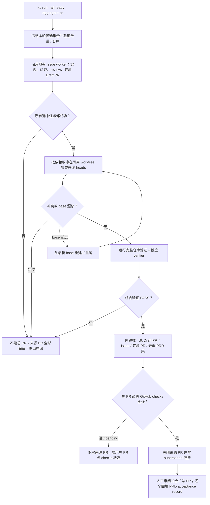

# PRD: 夜间任务批次聚合为单一总 PR

- GitHub Issue: https://github.com/ZataZhang/keda/issues/258

> ✅ **交付前置**：无硬依赖，可立即开工。
> 结构化声明见 §8 Delivery Dependencies，**那里是唯一事实源**。

> 🧍 **验收状态**：待人工验收。
> 本行是 §9 Acceptance Checklist 的投影，**那里是唯一事实源**。

本文分两层：Part A 人审层（§1-4）界定夜间批次的可见结果与验收选择；Part B 执行器层（§5-13）给出仓库落点、失败边界与验证证据。

## Feature Overview (功能一览)

以下清单是 §10 Functional Requirements 的行为投影；具体验收以 §1 行为样例为准。

- **两种批次入口**（FR-1）：自动入口仅适用于 `kc run --all-ready --aggregate-pr`；手动入口 `kc pr aggregate --issue <N> ...` 可把已完成的同仓库任务 PR 显式组成一个批次，包括分别通过不同 `kc run` 执行的任务。普通 `run`、daemon 和 loop 不自动汇总。
- **只在整批任务成功后集成**（FR-2、FR-3）：合并全部来源分支到一个新分支，并验证组合后的完整代码树。
- **生成唯一正式总 PR**（FR-4、FR-6）：正文列出每个来源 Issue、PR 和去重后的 PRD 路径；合并总 PR 接受其中全部 PRD。
- **收起来源 PR**（FR-5）：总 PR 创建且组合验证和必需的 GitHub 检查均通过后，自动关闭来源 PR 并写明取代关系；来源分支保留。
- **失败时保全来源并支持重试**（FR-2、FR-7）：任务失败、冲突、验证失败或 GitHub 写入失败时不提前关闭来源 PR，并输出可复制的重试命令。
- **同步操作说明与验收约定**（FR-8）：命令行帮助、PRD 多 PRD 验收语义、仓库指南和随包操作说明保持一致。

# Part A · 人审层 (Review Layer)

## 1. Introduction & Goals

### Problem Statement

当前每个 Agent Runner Issue 独立完成 worktree、验证、push、Draft PR 与可选的 PR 后监督，因此晚上跑多个任务后会留下多份 PR，早晨需要逐一打开并分别判断范围和证据。仓库虽有一次处理多个待领任务的队列入口，但每轮默认只领取一项；即使提高批量上限，每个 Issue 仍各自发布 PR。现行 PRD 合并验收正文契约也只接受单个 PRD 路径，无法把多个 PRD 的交付与验收明确绑定到一个总 PR。

这让自动执行省下的时间又消耗在重复切换 PR 上，也没有一个能代表“这一组任务整体通过”的组合验证结果。

### Interpretation (解读回显)

#### 行为样例

| 验证方式 | 输入 / 操作 | 期望观察到的结果 |
|---|---|---|
| ⚠️ 外部行为不验证 | 用户在真实仓库的一次队列运行中选择汇总，全部任务完成 | 目标行为是组合来源分支、重新验证总树、发布唯一总 PR，再按 required checks 关闭来源 PR；本轮不运行真实批次，也不以 mock 宣称通过。 |
| 🤖 自动验证（本地） | 检查 CLI 默认参数与聚合 / direct-pr / fast-merge 参数组合 | 本地 parser / 参数校验确认聚合默认关闭，冲突参数在执行器启动前被拒绝；不启动队列或外部客户端。 |
| 🤖 自动验证（本地） | 在临时 Git fixture 中组合多个 source SHA，或注入 Git merge conflict | 本地组合按显式顺序生成 tree；冲突时停止且不改写 fixture base / source refs。该结果不证明 GitHub 来源解析或 PR 发布。 |
| 🤖 自动验证（本地） | 向 v2 PR body contract 提供完整、漏项、重复项的 PRD 路径集合 | 纯本地契约验证完整集合并拒绝漏项 / 重复项；不创建 PR，也不验证 GitHub 对正文的呈现。 |
| ⚠️ 外部行为不验证 | 总 PR 的 GitHub checks pending / failed，或需要关闭来源 PR | 产品要求来源 PR 保持打开并允许重试；真实 GitHub 状态转移不在本轮验证，不使用 fake 状态代替。 |
| ⚠️ 外部行为不验证 | 审阅真实总 PR 与来源 PR | 产品目标为总 PR 覆盖唯一 PRD 集、来源 PR 标记取代且 branch 保留；本轮不创建 / 打开真实 PR，也不声称这一外部体验通过。 |

本地验证行对应 §7.6 rv-1—rv-3；外部行为行在 rv-4 明确记录未验证。更改行为或结果单元格时同步调整对应 oracle 与未验证范围。

#### 我默默定了这些

- 自动批次边界是一次明确启用汇总的队列运行实际选中的同仓库 Issue 集合；手动入口由操作员提供完整 Issue 列表，可覆盖多个不同 `kc run` 的结果，但不跨调用或仓库猜测成员关系。
- 自动聚合是显式 opt-in；普通单 Issue 运行、普通队列运行、daemon 和 loop 保留现状。自动 / 手动候选不足 2 个时拒绝，避免意外产生单任务总 PR。
- 来源任务各自继续走现有实现、验证、审核和来源 PR 发布流程；只有所有选中任务成功后才构造总分支。
- 总 PR 使用配置的目标分支并保持 Draft 状态，供用户统一审阅；系统不自动合并总 PR 到目标分支。
- 来源 PR 在组合树验证通过、总 PR 创建且必需 checks 全绿后改为 closed，并附“已由总 PR 取代”的说明。关闭只改变 PR 状态，不删除 PR 页面、评论或审查记录；来源分支与 Issue 历史保留。此时总 PR 仍待用户审阅和合并。
- 一次总 PR 可以包含多个不同 PRD；相同 PRD 在多个来源 Issue 出现时按路径去重。普通单任务 PR 的现行单 PRD 验收契约继续兼容。
- 组合、验证、总 PR 发布或来源 PR 收尾失败时，来源分支和可重试状态会保留，操作员可用单独的聚合命令重试而不重跑 Agent；若任务本身失败，先按现有方式修复该任务，再聚合完整集合。

#### 我理解为不做

- 不把不同仓库或不同时间运行的 Issue 自动推断为同一夜间批次。
- 不增加新的夜间调度器、跨调用批次数据库或常驻等待“所有任务都完成”的服务。
- 不自动合并总 PR，也不自动解决代码冲突或部分成功后发布子集总 PR。

本需求读作：用户在一次队列运行中明确选择一个批次；系统等该批次的每个任务都通过既有门禁后，把所有来源分支组合到新分支，重新验证完整树，发布唯一正式总 PR，然后关闭并标注其来源 PR。若任何任务或组合验证失败，系统保留来源 PR 供修复和追溯。总 PR 的正文与证据必须覆盖完整 Issue/PR 集及去重后的 PRD 集；总 PR 合并才是这些 PRD 的共同正式交付与验收事件。它不读作跨夜累积任意 PR、不读作跳过质量门禁，也不读作自动合并到主分支。

### What The User Gets

夜间一次队列运行完成后，用户只需打开一个总 Draft PR，就能看到本批次的所有 Issue、来源 PR、唯一 PRD 列表、逐任务证据和整批组合验证结果。来源 PR 在总 PR 合并前标记为被取代并关闭；它们的 PR 页面、评论、审查记录、来源分支和 Issue 历史都保留，方便追溯。用户只需对总 PR 作一次审阅和合并决定；任务失败或改动冲突时，来源 PR 保持开放，不会删除记录或把不完整批次伪装成成功总 PR。

### Measurable Objectives

- 汇总默认关闭；未选择汇总的现有单任务和队列运行保持相同 PR 数量、目标分支和标签行为。
- 在 2 个或更多来源任务全部成功的批次中，最终只有一份开放的正式 PR；正文包含所有来源 Issue / PR 和所有唯一 PRD，组合分支包含每个来源提交。
- 总 PR 创建前，组合分支上的仓库验证和独立 verifier 必须通过；任何来源失败、Git 冲突或组合验证失败都不创建总 PR、不关闭来源 PR。
- 每个来源 PR 在总 PR 发布、组合验证和必需的 GitHub 检查均成功后才会关闭，并能从其评论/正文追溯到总 PR；来源分支未被删除或改写。
- 多 PRD 总 PR 合并验收契约拒绝漏列 PRD、重复路径或证据 / 最终树不匹配；既有单 PRD 验收正文仍通过校验。

## 2. Human Review Map (介入与风险地图)

### 决定一：一个总 PR 是这一批 PRD 的共同验收事件

你已明确确认：总 PR 是唯一正式 PR；其合并成为正文列出的所有唯一 PRD 的共同交付与验收事件。错误地少列一个 PRD 会让该 PRD 的需求似乎已验收但没有经过同一次人工审阅；多列或重复列出则会模糊合并者实际接受的范围。实现审阅仅核对本地正文构造 / 契约代码；外部 PR 合并与实际验收行为不在本次验证中。

**实现审阅时检查：** 不运行真实批次，也不把 mock 结果作为 GitHub 行为证据；仅审阅本地正文构造和 v2 契约测试。真实 GitHub 上的 PRD 集和合并验收结果明确保持未验证。该需求口径已按你本轮回答锁定。

**验收：** 本地 v2 正文契约可断言 PRD 路径去重、完整性与授权语句；不对真实 GitHub PR body、合并授权是否生效或 PRD 实际验收状态作通过声明。

### 决定二：总 PR 成功后关闭来源 PR，保留可追溯记录

你已确认自动关闭来源 PR，并标记为被总 PR 取代。关闭必须发生在总 PR 已创建、组合验证和必需的 GitHub 检查都通过之后，因此会早于用户合并总 PR。关闭只改变来源 PR 的状态：PR 页面、评论、审查记录、来源分支和 Issue 记录都保留，关闭说明附总 PR 链接；如总 PR 验证未通过，来源 PR 保持打开。

**实现审阅时检查：** 不通过 fake GitHub 推断实际 PR 状态；代码审阅只确认实现请求的先后条件。真实 GitHub 检查状态、PR 关闭结果与分支保留状态都不验证。该关闭策略已按你本轮回答锁定。

**验收：** 只审阅代码中的关闭前置条件；不模拟或宣称验证 GitHub 的 required checks、关闭评论、真实 PR 状态或远端分支保留。该外部行为因本轮不访问真实服务而未验证。

**本地自动检查**：CLI 参数解析、Git tree 组合与 PR body 纯逻辑契约可在本地验证。GitHub Issue/PR 读取、创建、required checks、关闭和评论不使用 mock 作验收证据，也不在本轮连接真实服务；这些结果明确留空。

**本次明确不涉及**：前端、数据库 schema、跨仓库汇总、自动合并，以及总 PR 关闭未合并后的自动 reopen 服务。

## 3. Usage And Impact After Implementation

### 仓库操作员 / CLI 调用者

操作员在目标仓库把至少两个 Issue 标记为可执行，并启动：

```bash
kc run --all-ready --aggregate-pr --max-issues 4
```

此调用从当前仓库本轮实际选中的 Issue 中组成批次；`--max-issues` 或现有并发配置需要允许至少两个候选。操作员可以先用 `--dry-run` 查看候选 Issue、可确定的 PRD 路径和预计批次大小；来源 PR 链接在对应任务完成并发布来源 PR 后显示。批次成功时终端给出唯一总 Draft PR 链接、来源 PR 关闭结果及复制友好的恢复命令；遇到失败则逐项指出阻断原因，不声称存在完整总 PR。现有 `kc run --all-ready` 不带 `--aggregate-pr` 时保持原行为。

如果任务分别通过不同的 `kc run --issue` 或普通队列运行完成，操作员可显式指定它们聚合：

```bash
kc pr aggregate --issue 101 --issue 102
```

此命令只读取同仓库中已完成且符合条件的来源 PR，不自动猜测批次成员；任务数至少为两个。它也用于组合分支 / 最终验证失败后的重试，不需要重新运行已通过的任务 Agent。`kc run --issue`、未带 `--aggregate-pr` 的普通 `kc run`、daemon 和 loop 都不会自动聚合。若来源代码或 PRD 集本身变化，操作员先修复对应 Issue / 来源 PR，再重新聚合。

### 夜间任务发起者

发起者仍使用现有 Issue 队列、Agent、验证和审核流程；自动聚合只在单次显式 `kc run --all-ready --aggregate-pr` 调用中启用。若任务由多次调用完成，可用 `kc pr aggregate --issue ...` 明确列出成员；daemon / loop 不自动聚合，也不会把未来才出现的 Issue 暗中纳入已经结束的批次。

### PR 审阅者与 PRD 作者

审阅者查看总 PR 一处即可阅读本批次的任务、PRD、逐任务证据与组合验证结果。PRD 作者保留每份 PRD 独立的 oracle、证据目录和 `Human-Confirmed` 记录；总 PR 合并只为明确列出的 PRD 提供共同验收事件，不替代各 PRD 的逐项证据或合并后的验收记录。

### 兼容性影响

现有 `kc run`、单 Issue / PRD 执行、daemon、loop 和普通 PR 的合并验收行为保持不变。新的聚合入口为显式选择；只有批次总 PR 使用多 PRD 新契约。没有数据库、用户配置迁移或前端改动。

## 4. Requirement Shape

- **Actor**：KedaCode 仓库操作员、批次 Issue 的 PRD 作者、总 PR 的人工审阅者，以及维护 PRD 合并验收规则的仓库维护者。
- **Trigger**：操作员显式以聚合选项启动一个包含至少两个 Issue 的同仓库队列运行；或对已完成 Issue 显式发起 / 重试聚合。
- **Expected behavior**：等待全部选中任务成功，按依赖顺序组合各来源 PR 分支，验证组合树，创建唯一总 Draft PR，再关闭来源 PR 并提供一次审阅入口；总 PR 多 PRD 合并验收明确列出适用集合。
- **Scope boundary**：只聚合一组明确指定的同仓库 Issue 和其唯一合格来源 PR；不跨调用自动分批、不容许未验证 / 冲突内容、不自动合并到目标分支。

# Part B · 执行器层 (Build Layer)

## 5. Repository Context And Architecture Fit

### Existing Path / Reuse Candidates

- **最近的执行入口**：`kc run --all-ready` 经 CLI parsed command 进入 `run_once`，按本轮发现的 ready / resumable Issue 选择数量及并发，再调用 `_process_single_issue`。每项现有路径已负责 issue worktree、Agent、验证、push、来源 Draft PR 和可选 PR 后监督。
- **编排扩展点**：`src/backend/core/use_cases/agent_runner_orchestration_runtime.py` 在当前串行循环或线程池全部完成后已有准确的“本轮处理集合与每项结果”，适合在全体 join 后调用聚合用例。聚合不得在任一 worker 尚未返回时开始。
- **Git 发布复用点**：`src/backend/core/use_cases/agent_runner_git.py` 已有目标分支解析、fetch / push 与安全 Git 操作；`agent_runner_publish.py` 和 `IGitHubClient` / `github_client.py` 提供现有 Draft PR、body、远程 PR 查询和 base SHA 能力。应扩展它们，不直接拼接无边界 `git` / `gh` shell 流程。
- **正文契约扩展点**：`agent_runner_pr_body_contract.py` 当前对带 `PRD path:` 的普通 Issue PR 检查 v1 marker 与单个关联 PRD；v2 聚合正文需独立识别唯一 PRD 集，并继续接受普通 v1 正文。
- **CLI 扩展点**：`cli_parser_runner_commands.py` 与 `cli_typer_runner.py` 暴露 `kc run` 两种 CLI 入口；`cli_parsed_commands/runner.py` 负责运行参数校验和分发，`cli_typer_app.py` 汇总 Typer 子应用。`cli_schema.py` 负责机器可读 CLI schema。
- **已有并发能力**：`max_issues` 默认 1，`max_concurrent_issues` 默认 1；运行时可按 `--max-issues` / `--concurrency` 选择批次规模与并发，不应另造并行调度器。

### Architecture Constraints

- 继续遵守 `api -> core -> engines -> infrastructure` 依赖方向：候选校验和批次策略在 core；临时 worktree / Git 在既有 Git 边界；GitHub PR 关闭 / 创建通过 infrastructure 实现的 `IGitHubClient` 契约。
- 组合分支从一份固定的远程 base SHA 建立，与每个 `issue-<N>` 来源分支隔离；只创建并推送批次分支，不 checkout / merge 到操作员当前分支或远程目标分支。
- 组合顺序先满足显式 PRD / Issue 依赖，再用 Issue 编号打破无关任务的平局；如果依赖环、来源 PR 有歧义、base 不一致或来源无法读取，fail closed。
- 所有来源任务原本的质量门禁照跑；组合树还须运行仓库配置的验证命令和现有独立 verifier。任何失败都禁止将该批次呈现为可验收总 PR。
- GitHub 更新具有部分失败可能。先完成组合构建和本地验证，再发布总 Draft PR 并确认总 PR 的必需 GitHub checks 为成功，之后才逐个关闭来源 PR；关闭失败要可重试、逐项报告，不丢失来源分支，也不能把部分关闭报告成全部完成。
- 总 PR 的 PRD 集按仓库相对路径去重且排序稳定；每个被接受的 PRD 必须在总分支已归档、具备自己的验证证据，并由 v2 声明明确列出。source PR 关闭本身不满足任何 PRD 的 Human-Confirmed。

### Frontend Impact

**No frontend impact**：本需求只扩展仓库 CLI、后台编排、GitHub PR 集成与文档；没有新增或改变面向浏览器的 Keda 管理页面。

### Existing PRD Relationship

- `tasks/pending/P1-FEAT-20261009-123512-kc-agentic-entry-and-stall-supervision.md` 与本需求可能共享 CLI 编排区域，但目标是 stall supervision / agent entry，不依赖本需求；实现时协调同一 runtime 文件即可。
- `tasks/pending/P1-FEAT-20261009-133425-lifecycle-agent-model-settings.md` 会扩展共享 CLI / 文档面，但处理模型与阶段配置，与 PR 汇总无语义或构建依赖。
- `tasks/pending/P1-FEAT-20261009-161453-kc-hosted-runner-deployment.md` 与本需求可能共享 daemon / CLI 运行边界，但托管部署、资源清理和磁盘准入并不依赖批次总 PR；实现时协调共同触及的 runner runtime 和操作文档即可。
- `tasks/archive/P1-FEAT-20260703-105322-autopilot-merge-queue-fast-profile.md`、`tasks/archive/P1-FEAT-20260625-101522-iar-daemon-parallel-issue-execution-live-view.md` 与 `tasks/archive/20260527-234531-prd-agent-runner-pr-context-approval-gate.md` 分别提供现有发布门、同轮多 Issue 并发和 PR checks 读取约定。
- **关系结论**：本 PRD 不重复、不依赖或阻塞现有 pending PRD；有共享文件的软协调，不建立交付顺序依赖。

### Potential Redundancy Risks

- 不另造任务队列、daemon、批次数据库或跨进程 scheduler；批次成员来自一次运行的已发现 Issue 集，手动 retry 用显式 Issue 编号。
- 不复制单任务 push、Draft PR、正文补锚点或验证逻辑；只新增“汇总已有合格 PR 分支并发布一个集合 PR”的 core 用例。
- 不删改来源 PR 分支或把 aggregate merge commit 推回 issue 分支；来源记录用于追溯和修复。
- PRD 单件契约 v1 不升级或重写；新增 v2 仅描述批次来源和多 PRD 集，避免更改历史 PR 的判定。

## 6. Recommendation

### Recommended Approach

为 `kc run --all-ready` 增加默认关闭的 `--aggregate-pr`；在本轮全部 Issue worker 完成并分别通过原有检查后，调用共享的 core 批次聚合用例。另提供 `kc pr aggregate --issue <N> ...` 对已完成来源 PR 做显式聚合或失败重试。两条入口复用同一套资格验证、依赖排序、临时集成分支、组合验证、总 PR 正文构建与来源 PR 收尾逻辑。

总 PR 是唯一正式审阅与 PRD 验收 PR。组合验证通过后发布总 Draft PR，随后读取该 PR 的必需状态检查；检查全绿后、用户合并总 PR 之前，才使用既有 GitHub 客户端边界关闭来源 PR，并写明总 PR 链接。来源 PR 不会被删除：关闭只将其状态改为 closed，原 PR 页面、评论和 review 历史保留；来源分支与 Issue 也保留。组合失败时不创建总 PR、也不关闭来源；总 PR checks 失败 / 未完成或 GitHub 在关闭多个 PR 时部分失败，则保留总 Draft PR 和所有未收尾的来源 PR，允许重跑聚合命令完成检查和幂等收尾。

批次集成在隔离 worktree 中从远程目标分支的固定 SHA 起步，按 PRD / Issue 依赖顺序将来源 head 合入。组合分支验证完成后才创建 Draft 总 PR。若目标 base 在运行中前进，则基于最新 base 重新构建并重跑组合验证；若重建仍有冲突或验证失败，不发布合格总 PR。流程不自动合并至 base。

**新模块理由**：整批资格、GitHub 来源 PR 取回、Git 集成、v2 正文列表、部分失败恢复和来源关闭形成一个完整操作生命周期。把它全部塞进已承担线程池调度的 `agent_runner_orchestration_runtime.py` 会增加新的生命周期状态分支；独立 `agent_runner_batch_aggregate.py` 可由一次运行入口与重试入口共同复用。Git 与 GitHub 的底层原语仍沿用当前 interface / infrastructure，不新增第二套客户端。

### ROI 与范围取舍

夜间批量运行的收益是把早晨的审阅切换从 N 个 PR 降到一个总 PR，并让组合后的验证结果代表用户真实要合并的树。投入主要是一个显式 CLI flag、一个共享聚合用例、既有 GitHub 客户端增加关闭操作，以及多 PRD 验收正文的 v2 兼容；运行失败时保留来源 PR，日常路径仍由原逻辑承担。对于一次批次里多个 PR 的高频场景，这比每天逐个阅读、再人工判断分支组合关系成本更低。

更重的跨调用批次表、常驻等待服务和 Loop 集成能自动收集多次运行产生的 PR，但需要持久化批次身份、取消 / 超时 / 重启规则和跨调用恢复；当前诉求没有要求这些生命周期。一次调用即可给出可靠批次边界，手工 retry 命令补足聚合失败恢复，是当前最小闭环。CLI 批次入口与多 PRD 验收契约不能拆成独立交付：缺少任一项都会分别留下多个待审 PR，或留下无法证明共同验收范围的总 PR，因此保留为一个完整目标态。

设计挑战检查：若不同时间运行产生的 PR 被自动凑成一组，系统无法从现有 Issue 状态可靠判断哪些属于同一晚；因此只取显式的一次队列调用，跨调用成员由操作员明确传入。若在组合分支验证前关闭来源 PR，失败恢复会迫使用户重开多个 PR；因此关闭延后到总 PR 的本地门禁与 GitHub 检查均成功之后。

### Proposed Solution Summary (实现机制)

CLI 由操作员提供 opt-in 聚合声明及同仓库批次范围；`kc run` 把本轮明确选出的 Issue 集交给 core，core 不推断未来任务或其他进程成员。每个 Issue 仍走现有 runner 生命周期并产生来源 Draft PR；全体成功后，新 `agent_runner_batch_aggregate.py` 按来源 PR 解析合格 branch、source head、目标 base、Issue 依赖和 `PRD path:` 锚点，构建隔离的 batch branch，跑组合树验证与独立 verifier，再通过既有发布边界创建总 Draft PR。总 PR 以 `iar:merge-acceptance version=2` 声明去重 PRD 集，并带来源 Issue / PR 清单；同一成功边界之后才关闭来源 PR。批次命令复用相同 core 路径做显式 retry。复杂度刻意控制为不新增数据库、scheduler、前端、自动合并或来源分支改写。

### Alternatives Considered

- **保留所有来源 PR 打开**：拒绝；多个 PR 仍留在待审列表，不满足早晨只审一个总 PR 的目标。来源分支和 PR 记录会保留，但来源 PR 关闭并链接总 PR。
- **每个 Issue 改成不发布来源 PR，只保留 branch 到最终汇总**：拒绝；它要求重写当前 Issue 发布 / supervisor / recovery 生命周期，并会减少失败时可直接审阅的来源记录。先复用现有发布再在完整批次成功后收起来源 PR，改动更小且回退更清晰。
- **验证后自动合并总 PR 到配置 base**：拒绝；用户要求醒来审一个总 PR，自动合并会跳过这次人工审阅和统一验收。
- **新建常驻批次协调服务或数据库记录跨调用收集 PR**：拒绝；用户可显式指出同一次队列调用或在 retry 时提供 Issue 编号，不需要额外的批次存储和 daemon 生命周期。

## 7. Implementation Guide

> This section is a living implementation guide based on current repository analysis. If implementation discovers additional affected files, hidden dependencies, edge cases, or a better path, update this PRD before proceeding.

### 7.1 Core Logic

1. `--aggregate-pr` 只与 `kc run --all-ready` 组合；`--direct-pr` 和 `--fast-merge` 继续被拒绝。dry-run 在认领前展示候选 Issue、可确定的 PRD 路径及预计批次大小，不写 Issue、branch 或 PR；来源 PR 只有在对应任务完成后才会出现。
2. 聚合模式在开始处理前确认候选至少 2 个且属于同一目标仓库；手动 `kc pr aggregate` 至少接收两个显式 Issue。两种入口拒绝非终态、失败、无唯一合格来源 PR、来源 PR 必需检查非 SUCCESS、base 不一致或来源已无可读取 branch 的项。
3. 一次调用选择的 Issue 集是冻结批次。所有选中项各自现有流程都返回成功且来源 PR 可供审阅后，才能进入 aggregate；一个失败就结束此批次，不从成功子集发布总 PR。
4. 每个来源 PR 从 GitHub 读取 head、base、状态及 Issue body 的 `PRD path:`；显式依赖构成拓扑顺序，同级按 Issue 编号排序。环、缺依赖、多个候选 PR、来源不可信或 PRD 路径不能在 branch tree 解析时均 fail closed。重试时，`refs:` 搜索可能把正文提及 Issue 的现有总 PR 一并列出；仅当其 `batch-*` 分支、聚合来源 marker 和 Issue 集均匹配当前批次时才从来源候选中排除，之后仍严格核对 marker 中的来源 PR 集。
5. 聚合使用隔离 worktree / 新的 `batch-*` branch，从固定 base SHA 集成来源 head；不使用本地当前分支作为基线，不 checkout 到 base，不强推 issue 分支。已经包含的祖先 head 幂等跳过；任一 merge conflict 立即停止并保留来源。重试仅能用 force-with-lease 更新与已核实总 PR head SHA 完全一致的 batch ref；远端 ref 在读取后移动时拒绝覆盖。
6. 组合后按完整 tree 跑仓库 `verification_commands` 与当前配置的独立 verifier；只在二者 PASS 后创建总 Draft PR。base SHA 在集成期间变化时，以新的 SHA 重建并重新验证；若持续变化、冲突或命令失败则不创建总 PR。
7. 总 PR body 包含所有来源 Issue 与 PR 的稳定链接、去重有序的 PRD 路径、批次验证摘要、base/head/tree 证据，以及 `<!-- iar:aggregate-pr version=1 issues=... source_prs=... -->` 来源标记和 `<!-- iar:merge-acceptance version=2 -->`。同一 PRD 路径只列一次，任何来源 PRD 缺失、未归档、或其证据不齐均拒绝发布。总 PR 创建后读取现有 PR context / 必需 checks；只有 required checks 全 SUCCESS 时才进入来源 PR close。
8. 对 PRD-backed 的总 PR，v2 正文合同必须检查 PRD 路径集合与来源集合完整匹配，并明确“合并总 PR 会接受列出的所有人审决策 / 可见结果，并授权逐个记录验收”。合并后的 acceptance record 仍须按每份 PRD 的最终 Git tree 和证据单独回填；总 PR 的 merge 不省略任何单份 oracle 或 evidence gate。普通 v1 单 PRD 验收规则不变。
9. 总 PR required checks 仍 pending 或失败时保持 Draft、来源 PR 保持打开，输出检查链接和只重试聚合命令。checks 全绿后再逐个调用 GitHub close API 关闭来源 PR，并在每份来源 PR 留下总 PR 编号、取代说明及保留分支说明。来源关闭需可重试；若部分关闭失败，输出完整成功 / 待重试列表和同一 `kc pr aggregate` 命令，不报告批次收尾完成。
10. 成功输出只突出总 PR 链接作为正式审阅入口，并列出来源 PR 已关闭状态、批次 Issue / PRD 数量、base SHA、组合 head/tree、验证和 verifier 结果。总 PR 保持 Draft；人工审阅和合并由用户执行。

### 7.2 Change Impact Tree

```text
Infrastructure
├── src/backend/core/shared/interfaces/agent_runner.py [修改]
│   【总结】在现有 GitHub client 契约中增加可诊断、可重试的关闭来源 PR 操作
├── src/backend/infrastructure/github_models.py [修改]
│   【总结】扩展 PR 上下文以暴露 Draft 状态供发布收尾 fail closed 校验
├── src/backend/infrastructure/github_client.py [修改]
│   【总结】把新增的关闭 PR 能力接入既有 GitHub client
└── src/backend/infrastructure/github_pr_ops.py [修改]
    【总结】实现带取代评论的 PR 关闭和结果读取，保留现有 gh/API 错误处理边界

Core
├── src/backend/core/use_cases/agent_runner_batch_aggregate.py [新增]
│   【总结】共享批次生命周期、隔离分支集成、整树验证、总 PR 发布和来源 PR 收尾
├── src/backend/core/use_cases/agent_runner_batch_aggregate_sources.py [新增]
│   【总结】来源资格 / GitHub 上下文解析、依赖拓扑排序、PRD 集与重试标记
├── src/backend/core/use_cases/agent_runner_batch_aggregate_models.py [新增]
│   【总结】共享来源、请求、结果数据结构和可诊断批次错误
├── src/backend/core/use_cases/agent_runner_batch_aggregate_git.py [新增]
│   【总结】创建与清理隔离 worktree、按固定 SHA 组合来源并安全推送批次分支
├── src/backend/core/use_cases/agent_runner_orchestration_runtime.py [修改]
│   【总结】在一轮所有 Issue worker 完成后按 opt-in 结果调用批次聚合
├── src/backend/core/use_cases/agent_runner_orchestrate.py [修改]
│   【总结】把显式聚合选项从执行入口传入 runtime request
├── src/backend/core/use_cases/run_agent_repositories_once.py [修改]
│   【总结】将聚合 opt-in 传递到单仓库队列执行
├── src/backend/core/shared/models/agent_runner.py [修改]
│   【总结】为 core PR 上下文增加 Draft 状态
└── src/backend/core/use_cases/agent_runner_pr_body_contract.py [修改]
    【总结】新增聚合 PR v2 的多 PRD 集合校验，同时保留普通 PR v1 语义

API / CLI
├── src/backend/api/cli_parser_runner_commands.py [修改]
│   【总结】增加 `kc run --aggregate-pr` 参数及 `kc pr aggregate` 显式重试入口
├── src/backend/api/cli_parser_pr_commands.py [新增]
│   【总结】为 `kc pr aggregate` 声明 Issue 多选和 dry-run 参数
├── src/backend/api/cli_parser.py [修改]
│   【总结】注册新的 PR 命令解析器并沿用现有 CLI 参数 / 错误处理
├── src/backend/api/cli_parsed_commands/runner.py [修改]
│   【总结】校验 opt-in flag 的目标、至少两项规则和禁止的绕过参数组合
├── src/backend/api/cli_parsed_commands/aggregate_pr.py [新增]
│   【总结】将显式来源 Issue 聚合 / retry 命令接到共享 core 用例
├── src/backend/api/cli_parsed_commands/__init__.py [修改]
│   【总结】将新的聚合 parsed command 接到既有 CLI dispatch 表
├── src/backend/api/cli_typer_runner.py [修改]
│   【总结】让 Typer `kc run` 同样公开 opt-in 聚合参数
├── src/backend/api/cli_typer_pr.py [新增]
│   【总结】公开 Typer `kc pr aggregate` 命令和参数 help
├── src/backend/api/cli_typer_app.py [修改]
│   【总结】注册 `kc pr aggregate` 子应用并保持命令 help 一致
└── src/backend/api/cli_schema.py [复用，无改动]
    【总结】机器可读 schema 从 Typer 命令动态派生；新增命令和 flag 后经 rv-1 入口断言核对

Tests
├── tests/test_agent_runner_batch_aggregate.py [新增]
│   【总结】只验证临时本地 Git 的依赖排序、组合 tree 与冲突处理；不测试 GitHub Issue / PR 读取、发布、checks 或关闭
├── tests/test_agent_runner_pr_body_contract.py [修改]
│   【总结】覆盖 v1 向后兼容、v2 唯一 PRD 集、漏项 / 重复项拒绝及接受声明
├── tests/test_agent_runner_cli.py [修改]
│   【总结】只验证 CLI parser / 本地参数校验的 flag 默认值与互斥规则；不触发执行器或 GitHub client
└── tests/test_github_client.py [修改]
    【总结】验证本地 PR context 字段解析与命令字段兼容，不作为 GitHub 外部状态证据

Docs / Skills
├── AGENTS.md [修改]
│   【总结】把“一份 PR 唯一关联一份 PRD”的一般规则扩展为普通 PR 单件、总 PR 明确列多件的例外
├── docs/guides/agent-runner.md [修改]
│   【总结】文档化批次命令、来源关闭边界、失败恢复、分支与多 PRD PR 正文合同
├── docs/guides/prd-standard.md [修改]
│   【总结】说明 Keda 聚合 PR 对通用 PRD 合并验收规则的窄范围扩展和逐 PRD 回填要求
├── src/backend/engines/agent_runner/templates/skills/kedacode-operator/SKILL.md [修改]
    【总结】同步随包 CLI 用法、约束参数组合和失败恢复命令
└── src/backend/engines/agent_runner/templates/skills/kedacode-operator/references/run-once.md [修改]
    【总结】同步 `kc pr aggregate` 用法、dry-run 和部分收尾 retry 语义

Frontend
└── No frontend changes
    【总结】行为入口是本地 CLI 和 GitHub PR，不涉及浏览器产品界面

Database
└── No data model changes in this PRD
    【总结】批次成员由本轮选中项或重试命令显式传入，不新增持久表或 migration
```

### 7.3 Risk Classification Register

| Change point | Tier | Decisive dimension / override | Intervention | Failure-discriminating oracle / gate |
|---|---|---|---|---|
| CLI opt-in 参数与旁路参数组合 | R1 | 本地 parser / 参数校验；不启动执行器 | Executor + automated gate | `rv-1` 在本地验证参数默认值和互斥错误 |
| 来源 head 的本地 Git 组合 | R2 | 临时 bare remote 与完整本地 tree；不查 Issue / PR | Executor + automated gate | `rv-2` 验证拓扑顺序、冲突和组合 tree；不证明 GitHub 来源解析 |
| v2 多 PRD 正文纯逻辑契约 | R2 | 本地路径集合、去重与版本兼容；不发布 PR | Executor + automated gate | `rv-3` 证明契约拒绝漏项和重复项；不证明 GitHub 接受或展示正文 |
| GitHub PR 创建 / checks / close 外部语义 | R3 | 只能通过真实 GitHub 状态验证；用户明确禁止本轮访问，fake 无法证明 | Not run; limitation disclosed | `rv-4` 记录未验证边界，不以 mock 结果宣称通过；本项不阻塞本 PRD 的实现侧交付 |

### 7.4 Core Flow



### 7.5 Executor Drift Guard

实现前重新检索 `kc run` parser、Typer、dispatch 与 `run_once` 注册链；已有 `kc pr` 根命令与否必须以当前 CLI registry 为准，不可另做平行解析器。合并验收约定存在多个入口，更新时需覆盖仓库政策、指南、正文 contract 和随包 operator skill，并保留 v1 用例。可用以下搜索核实旧引用及新入口：

```bash
rg -n "merge-acceptance version=1|唯一关联该 PRD|唯一 PRD|PRD path:|--all-ready|def run_once" AGENTS.md docs src/backend/core/use_cases src/backend/api src/backend/engines/agent_runner/templates/skills/kedacode-operator/SKILL.md
```

`mkdocs.yml` 当前导航已经包含 `docs/guides/agent-runner.md` 与 `docs/guides/prd-standard.md`；本 PRD 不新建页面，因此只有在实际增加独立文档页时才扩展导航。

### 7.6 Realistic Validation Plan

**范围说明**：本计划只验证不依赖 GitHub 外部状态的本地逻辑。GitHub Issue / PR 读取、Draft PR 创建、required checks 查询、来源 PR 关闭 / 评论和远端 branch 保留都需要真实服务状态才能证明；用户明确要求不做此类验证，因此这些行为标为未验证。fake GitHub、录制响应或 mock 状态不作为其验收证据。

```yaml
- id: rv-1
  behavior: "CLI 暴露默认关闭的聚合参数，并在本地参数校验层拒绝候选不足和与 direct-pr / fast-merge 冲突的组合，不启动执行器。"
  reviewer: verifier
  real_entry: "调用实际 CLI help / parser 和本地参数校验入口；不运行 `kc run` 队列、不读取仓库配置、不创建 GitHub 或 Git client。"
  expected: "help 暴露聚合选项且默认值为关闭；不足两个候选和冲突参数组合在本地校验层失败，执行器与外部客户端均未启动。"
  mock_boundary: "无 mock；只解析 CLI 参数并调用无副作用的本地校验逻辑。"
  tier: R1
  test_layer: integration
  required_for_acceptance: true

- id: rv-2
  behavior: "多个已知 source SHA 可按给定依赖顺序在隔离的本地 Git worktree 中组合；冲突停止组合，不改写 base 或 source refs。"
  reviewer: verifier
  real_entry: "通过项目现有 Git integration helper 操作本次创建的临时仓库与 bare remote；不调用 `kc pr aggregate`，因为该命令需要读取 GitHub Issue / PR 状态。"
  expected: "临时 Git tree 包含 source SHA 的组合内容并遵循显式顺序；冲突时停止，base 与 source refs 不变。该结果只证明本地 Git 集成逻辑，不证明来源 PR 解析或 GitHub 发布。"
  mock_boundary: "无 GitHub fake；source SHA 和依赖关系直接来自本地静态 fixture manifest，不声称它们来自真实 Issue / PR。"
  tier: R2
  test_layer: integration
  required_for_acceptance: true
  critical_value_source: "source/base SHA 与依赖顺序由本地 fixture manifest 给出；组合后的 commit/tree 从临时 Git repository 读取。"
  must_cross: "project Git integration helper -> temporary worktree -> source SHA merge in declared order -> actual local Git tree inspection。"
  forbidden_bypasses: "禁止预先写入完成的 aggregate branch、用假的 Git 命令替代 git，或将本地 source fixture 描述为真实 GitHub PR 状态。"
  fresh_state_probe: "销毁 helper 进程后，从临时 bare remote 与新 worktree 重新读取 base/source refs 和 aggregate tree。"
  final_tree_evidence: "记录临时 base SHA、source SHA、aggregate HEAD/tree 与命令结果；不包含 GitHub PR number 或外部状态结论。"

- id: rv-3
  behavior: "本地 v2 PR body contract 对唯一 PRD 路径集合做稳定去重并拒绝漏列 / 重复列；普通 v1 contract 保持兼容。"
  reviewer: verifier
  real_entry: "调用 `agent_runner_pr_body_contract.py` 对本地 fixture PR body 执行 v1 / v2 contract 校验；不创建 PR、不读取 GitHub 状态。"
  expected: "完整集合通过；漏列、重复或排序不稳定的集合被本地 contract 拒绝；现有 v1 单 PRD 正文继续通过。该结果不证明 GitHub 创建或渲染正文。"
  mock_boundary: "无 GitHub fake；仅提供本地字符串和仓库相对 PRD 路径 fixture。"
  tier: R2
  test_layer: unit
  required_for_acceptance: true
  critical_value_source: "契约输入来自本地 fixture PR body 与 PRD 路径集合；实际判定结果来自纯 contract 函数。"
  must_cross: "local v1/v2 body -> PRD path parser -> set completeness / uniqueness / ordering assertions。"
  forbidden_bypasses: "禁止调用 fake GitHub 来声称 PR body 已成功发布、显示或被 GitHub 接受。"
  fresh_state_probe: "在独立进程重新读取本地 fixture body 并运行 contract parser；不查询 GitHub。"
  final_tree_evidence: "记录本地输入、contract 结果和实现 tree；不记录 PR number、CI 状态或远端 PR state。"

- id: rv-4
  behavior: "GitHub 实际接受总 PR 创建、required checks 状态、来源 PR 关闭 / 评论和远端分支保留。"
  reviewer: human
  real_entry: "未运行：要证明此行为必须连接真实 GitHub 仓库并观察远端状态；用户明确要求不执行。"
  expected: "不收集、不伪造通过证据；实现交付说明该外部边界未验证。"
  mock_boundary: "不使用 fake / mock GitHub 替代，因为它不能证明真实 PR 状态、required checks 或关闭行为。"
  tier: R3
  test_layer: sandbox/live
  required_for_acceptance: false
  presentation: "实现 PR 的限制说明：GitHub 外部创建、检查与关闭行为尚未验证；不呈递 fake GitHub 状态作为成功证据。"
  critical_value_source: "未获取真实 GitHub PR / checks / branch 状态；本轮不访问外部服务。"
  must_cross: "无；真实 GitHub write/read 需要用户明确允许且本轮明确不执行。"
  forbidden_bypasses: "禁止将 fake response、录制响应、静态 fixture 或本地内存状态写成 GitHub 实际状态证据。"
  fresh_state_probe: "无远端写入，因此不启动 GitHub fresh-state probe；保持未验证。"
  final_tree_evidence: "无外部行为证据；代码 tree 不能证明 GitHub 接受请求或执行关闭。"
  negative_control: "not feasible — 未授权且禁止访问真实 GitHub；fake GitHub 不能证明真实服务行为。"
```

**失败排查顺序**：本地 oracle 失败时检查参数解析、fixture Git refs / merge 顺序和 PRD 路径契约。涉及 GitHub read/write、required checks 或远端状态的问题不通过 fake 重试或改写为通过；按用户要求保持未验证并报告限制。

**人工交付面**：实现 PR 呈递本地 CLI / Git / body contract 证据，并单独明确 GitHub 外部行为未验证；不得呈递 mock 状态快照冒充真实 PR 结果。

### 7.7 External Validation

No external research required. This does not authorize live GitHub validation; §7.6 records that behavior as unverified.

### 7.8 Frontend / Prototype / Data Model

- No frontend impact; 该功能入口与结果都在 CLI / GitHub PR。
- No interactive prototype file changes in this PRD.
- No data model changes in this PRD.

## 8. Delivery Dependencies

### Delivery Dependencies

- Depends on tasks/issues:
  - none
- Gate type: none
- Sequence: via-main
- Notes: 与现有 pending CLI / agent-runner PRD 有共享文件的软协调，不构成交付前置。

## 9. Acceptance Checklist

### 9.1 人读呈递区（Human Review Surface）

| 要看什么 | 展示入口 | 约 10 秒自检 |
|---|---|---|
| 本地 PR body contract 的集合断言，以及外部 GitHub 行为未验证的范围说明。 | 打开 [`tasks/evidence/P1-FEAT-20261009-161921-nightly-batch-aggregate-pr/P1-FEAT-20261009-161921-nightly-batch-aggregate-pr.evidence-report.md`](../evidence/P1-FEAT-20261009-161921-nightly-batch-aggregate-pr/P1-FEAT-20261009-161921-nightly-batch-aggregate-pr.evidence-report.md)，或运行 `open tasks/evidence/P1-FEAT-20261009-161921-nightly-batch-aggregate-pr/P1-FEAT-20261009-161921-nightly-batch-aggregate-pr.evidence-report.md`。PR / CI 发布后由 runner 将同一 surface 呈递在实现 PR evidence comment。 | 检查报告中 rv-1—rv-3 有本地结果，rv-4 明确未验证真实 PR 创建、required checks、来源 PR 关闭 / 评论与远端 branch 状态；没有 fake PR 状态。 |

真实 GitHub 状态不在本轮验证；不得用 fake required checks 或 fake PR state 代替真实服务证据。

`reviewer: verifier` 的候选边界、Git tree 集成顺序、base SHA 变化重建、失败保全、验证命令、CLI 默认兼容和 v1/v2 contract 回归属于机器证据，不列为人读呈递项；仅在失败时升级给人。

### 9.2 Acceptance Evidence Package

证据顺序：首先披露 §7.6 rv-4 的外部行为未验证；其次是 R2 本地 Git tree 与 v2 body contract 结果，再是 R1 CLI 参数兼容。证据采集不使用 fake GitHub，也不连接真实 GitHub 或真实仓库。

### Human-Confirmed (来自 Part A 风险地图)

- [ ] **总 PR 是这一批 PRD 的唯一正式交付 / 验收事件**：人工审阅实现 PR 中的本地正文构造与 v2 contract；GitHub 实际 body、PRD 合并验收记录和 merge 结果保持未验证（§2 决定一）。
- [ ] **来源 PR 只在聚合成功后关闭并链接总 PR**：人工审阅关闭调用的代码前置条件；真实 checks、关闭评论、PR 状态和 branch 保留不验证，不以 mock 作为证据（§2 决定二）。
- [ ] **9.1 Human Review Surface 已呈递**：实现 PR evidence comment 呈递本地 CLI / Git / body contract 报告，并明确 GitHub 外部行为尚未验证。

### Architecture Acceptance

- [x] `agent_runner_batch_aggregate.py` 仅持有批次整合生命周期；编排、Git 和 GitHub 仍遵守 `api -> core -> engines -> infrastructure` 方向，且未创建第二个 CLI / GitHub client 或 scheduler。证据：独立 verifier `PASS`；`just lint --reuse` 架构与复用检查通过。
- [x] 新建 / 重试聚合均从配置目标 base SHA 和隔离 worktree 构建；审查最终 diff、source refs 与远程 base ref，确认未把批次改动写入 base 或 Issue branch。证据：独立 verifier `PASS`；rv-2 临时 bare remote 的 tree/ref 断言通过；失败发布清理仅按预期 SHA lease 删除。
- [x] 依赖拓扑无环且可排序；来源 PR 歧义、base 不一致、缺失依赖、无唯一来源分支或无有效 PRD tree 都 fail closed。证据：独立 verifier `PASS`；批次资格与拓扑测试包含在 rv-2 的 19 项通过结果中。

### Behavior Acceptance

- [x] CLI 聚合参数默认关闭；本地 parser / 参数校验能识别有效与冲突参数。证据：rv-1，4 passed，两个 CLI help 命令 exit 0；独立 verifier `PASS`。
- [x] 本地 Git helper 按输入顺序组合 source SHA，冲突停止且不改写 base / source refs。证据：rv-2，19 passed，含 SHA lease 清理与 ref 移动时拒绝删除；独立 verifier `PASS`。
- [x] 本地 PR body v2 contract 稳定去重并拒绝漏项 / 重复项，普通 v1 contract 继续通过。证据：rv-3，18 passed；独立 verifier `PASS`。
- [x] GitHub PR 创建、required checks 读取、来源 PR 关闭 / 评论、远端 branch 保留和实际合并行为未验证；没有将局部代码测试写成这些外部行为已通过。证据：rv-4 `NOT RUN`，evidence report 明确披露；独立 verifier `PASS`。

### Documentation Acceptance

- [x] `AGENTS.md` 与 `docs/guides/prd-standard.md` 明确普通 PR 仍只接受一个 PRD，只有带完整来源和 v2 集合契约的总 PR 才可共同验收多个唯一 PRD。证据：独立 verifier `PASS`；已复核对应规范与指南。
- [x] `docs/guides/agent-runner.md` 与 `kedacode-operator/SKILL.md` 同步准确的命令、参数约束、候选预览、source PR 关闭时点和 retry 操作；CLI help / schema 输出一致。证据：rv-1 help 输出与独立 verifier `PASS`。
- [x] `rg -n "merge-acceptance version=1|merge-acceptance version=2|aggregate-pr|kc pr aggregate" AGENTS.md docs src/backend/engines/agent_runner/templates/skills/kedacode-operator/SKILL.md src/backend/core/use_cases` 显示普通 v1 和 aggregate v2 的边界没有过期或冲突描述；现有 MkDocs 导航无需变更，因为只改已有页面。证据：独立 verifier `PASS`；`mkdocs build --strict` exit 0。

### Validation Acceptance

- [x] 仅运行不依赖 GitHub 的本地 CLI parser、Git helper 与 PR body contract 定向测试；测试目标仓库由自动创建的临时 fixture 提供，不调用完整聚合队列。证据：rv-1—rv-3 命令记录；独立 verifier `PASS`。
- [x] `rv-2` 使用真实本地 Git / 临时 bare remote 验证组合 tree；不读取 GitHub Issue / PR，不使用 fake GitHub。证据：rv-2，19 passed；独立 verifier `PASS`。
- [x] `rv-3` 使用本地输入验证 v1 / v2 正文契约；不创建或发布 PR。证据：rv-3，18 passed；独立 verifier `PASS`。
- [x] 对真实 GitHub PR 创建、checks、来源 PR close/comment 和远端 branch 状态不做验证；交付报告明确标记未验证，且不使用 fake 结果替代。证据：rv-4 `NOT RUN` 与 verifier `PASS`。

### Delivery Readiness

- [x] 本地正文构造和 body contract 与 PRD 集一致；evidence report 记录实际完成的本地验证，并单列未验证的 GitHub 边界。证据：rv-3、evidence report 与 verifier report 均经独立 verifier `PASS`。
- [x] 不执行 live 批次；若实现说明涉及 source close / checks 的行为，仅陈述代码合同，不报告真实 PR 状态或外部操作结果。证据：rv-4 `NOT RUN`，evidence report 与 verifier report 明确披露。
- [x] 独立 verifier `PASS` 后，非人工 checklist 项均有可追踪 evidence；执行侧 Final Reconciliation 与 banner / §9 状态一致，PRD 位于 `tasks/archive/`。证据：本次 §9 更新、§13 Final Reconciliation、verifier report `PASS`；三项 `Human-Confirmed` 保留空框，banner 为 `🧍 待人工验收`。
- [~] 完成消息呈递实现 PR URL、本地验证结果和未验证的 GitHub 外部边界；不得触发生产仓库批次或呈递 fake GitHub 状态作为证据。—— runner-owned gate：runner 发布 PR / CI 后补链接与 stable evidence surface。

## 10. Functional Requirements

- **FR-1: 显式批次入口与预览**：提供默认关闭的自动入口 `kc run --all-ready --aggregate-pr`，批次是本轮实际选中的同仓库 Issue，至少 2 项；提供手动入口 `kc pr aggregate --issue <N> ...`，可显式指定已完成来源 PR，包括来自不同 `kc run` 的任务，并用于聚合失败重试。两入口的 dry-run 显示候选 / 来源 / PRD 集且不产生副作用。聚合 option 与 `--direct-pr`、`--fast-merge` 冲突；`kc run --issue`、未带 option 的普通 `kc run`、daemon 和 loop 均不自动聚合。
- **FR-2: 全批成功门禁**：队列模式下，所有选中的 Issue 均须完成现有实现、验证、审核、push 和来源 Draft PR 流程，来源 PR 唯一且已有必需 GitHub checks 为 SUCCESS；一项失败就不开始总分支发布，不发布成功子集总 PR。
- **FR-3: 隔离分支集成与完整验证**：从配置 base 的固定远程 SHA 建立隔离 batch branch；按显式 Issue / PRD 依赖拓扑并以 Issue 编号稳定排序集成来源 heads；冲突、base 漂移后无法重新验证、来源 head 改变、循环或来源不一致时 fail closed。完整总树通过仓库验证命令及独立 verifier 后才可发布。
- **FR-4: 唯一总 Draft PR**：总 PR body 列出所有来源 Issue / PR、唯一 PRD 路径集合、批次验证摘要 / base-head-tree provenance；有 PRD 时带 `iar:merge-acceptance version=2` 声明合并接受整个集合。总 PR 保持 Draft，不自动 merge。普通单 PRD `version=1` contract 保持向后兼容。
- **FR-5: 来源 PR 收尾**：仅在总 PR 创建成功、全树验证通过且该 PR 必需 GitHub checks 全 SUCCESS 后（即用户合并总 PR 之前）关闭每个来源 PR，附总 PR 链接与 superseded 说明。关闭只改 PR 状态，不删除 PR 页面、评论、review 历史、来源 branch 或 Issue 记录。checks pending / failed 或收尾中断时保留未关闭来源并可幂等重试、逐项报告。
- **FR-6: 多 PRD 验收正确性**：总 PR v2 PRD 集必须等于来源 Issue 的唯一 PRD 路径集合；每条路径须存在于已集成 tree 且已归档，并带有各自 evidence。普通来源 PR 的打开、关闭或非总 PR merge 不能接受该集合。合并总 PR 是集合内每份 PRD 的共同人工接受事件；合并后需按每份 PRD 及最终 tree 分别回填记录。
- **FR-7: 失败可解释和恢复**：对选中任务失败、冲突、验证失败、GitHub 发布 / 关闭失败返回非零且准确指出 Issue、PR 或阶段；总 PR 创建前不关闭来源 PR。Issue 本身失败时指出先修复 / 重跑该 Issue；只有所有来源 PR 已合格而聚合或收尾失败时，才输出可复制的 `kc pr aggregate --issue ...` 命令并安全重试，不重跑已经成功的 Agent。
- **FR-8: 文档与随包知识同步**：更新现有 Agent Runner 指南、Keda PRD 验收补充说明、仓库入口政策、CLI help / schema 与随包 `kedacode-operator` skill，声明默认 / 范围、v1/v2、多 PRD merge acceptance、关闭时序、失败恢复及不自动合并。

## 11. Non-Goals

- 不自动发现或累积跨多条 `kc run`、daemon、loop、仓库或夜晚的批次。
- 不新建常驻 coordinator、批次数据库或面向前端的批次看板。
- 不让聚合模式跳过单 Issue 现有 Agent review、仓库命令、PRD evidence 或 verifier；也不支持 `direct-pr` / `fast-merge` 绕过。
- 不自动把总 PR 合到 base，不自动解决代码冲突，不对失败批次成功子集创建正式 PR。
- 不删除来源 PR 记录或 branch、不把批次 merge commit 写回 Issue branch；关闭仅改变来源 PR 状态，不移除页面、评论或 review 历史；不在总 PR closed-unmerged 时运行常驻自动 reopen 监听器。
- 不在总 PR 的 merge authorization 之外自动勾选 PRD oracle 或伪造 PRD 的人工记录；每份 PRD 仍需自己的证据与最终 tree 核对。

## 12. Risks And Follow-Ups

- **目标 base 在验证中移动**：可能产生过期集成树。解决策略是在发布前重新读 base SHA，变化后重建并重跑验证；不能以旧 PASS 创建新 tree PR。
- **GitHub 多次写操作非事务**：总 PR 创建后来源 PR 可能只关闭一部分。使用稳定的 aggregate marker 与来源编号执行幂等重试；终端及 PR 注释呈现精确收尾状态。在所有来源关闭前将 aggregate 保持 Draft 并标出未完成收尾。
- **总 PR 关闭但未合并**：来源 PR 已关闭，用户可能需要重开来源 PR 或基于保留分支重新发起聚合。重试入口仅接受带本系统 superseded 标记的 closed sources；不可把用户手动关闭的任意 PR 当作可恢复成员。
- **多 PRD 合并声明覆盖面扩大**：漏掉路径可能造成未经过人审的 PRD 被登记验收。严格比对唯一集合、逐条保留证据与 final tree 校验是发布门；旧 v1 合约只对普通单件 PR 生效，聚合总 PR 要求 v2。
- **失败批次被误认为成功**：流程按单项、集成、发布、source close 分阶段输出，并只在所有成功后输出“唯一正式总 PR 就绪”；非 PASS 不允许 merge acceptance。

## 13. Decision Log

| ID | Decision | Chosen | Rejected | Rationale |
|---|---|---|---|---|
| D-01 | 批次如何划界和启用 | 自动聚合由一次显式 opt-in `kc run --all-ready --aggregate-pr` 冻结本轮同仓库候选集；手动 `kc pr aggregate --issue ...` 可显式聚合跨不同 `kc run` 完成的同仓库来源 PR | daemon / loop 跨调用自动推断或持久化批次身份 | 自动入口复用现有队列且有清楚边界；跨运行场景由操作员显式给出 Issue 编号，不增加常驻状态和超时策略 |
| D-02 | 总 PR 与多份 PRD 的正式关系 | 用户已确认总 PR 是唯一正式 PR；v2 正文列出所有唯一 PRD，merge 作为该集合的共同接受事件 | 每个来源 PR 分别接受一份 PRD，或总 PR 仅作信息汇总 | 单一 PR 有一份完整集合的唯一正文和最终组合树，避免多次审阅 / 部分验收歧义 |
| D-03 | 原子 PR 如何收尾 | 用户已确认：总 PR 创建且整树验证通过后自动关闭来源 PR、标记 superseded；保留 branch 与 Issue | 来源 PR 永远保持 open，或只取消发布来源 PR | 关闭 open PR 才能让用户一眼只看到一个正式待审入口；保留 branch、PR 和关闭评论支持回溯 / 恢复 |
| D-04 | 合并策略和重试 | 总 PR 保持 Draft、需要人工 merge；保留一个显式 Issue-list retry 命令 | 自动 merge 总 PR；失败后重新跑所有 Agent | 请求目标是统一人工审阅；复用完成任务的来源分支能避免重复执行成本 |

### Final Reconciliation

- Interpretation: 已对照最终实现核对；自动批次仅限显式 `kc run --all-ready --aggregate-pr`，手动 / retry 用 `kc pr aggregate --issue ...`；整批 worker 成功后按依赖顺序在隔离 worktree 组合并重验，失败不发布总 PR。
- Public behavior and contracts: 已对照 CLI、core lifecycle 与 body contract 核对；默认队列行为保持不变；总 Draft PR 正文列出完整来源 Issue / PR 与去重 PRD 集，并以 v2 声明共同验收范围；来源 PR 只有在组合 tree 与总 PR required checks 均 PASS 后才进入关闭。真实 GitHub 创建、检查、关闭、评论、分支保留与实际 merge 本轮未验证。
- Related PRD status: 已检查当前 pending 与 archive；`kc-agentic-entry-and-stall-supervision`、`lifecycle-agent-model-settings` 和 `kc-hosted-runner-deployment` 只有共享 CLI / runtime 文件的软重叠，没有语义或交付硬依赖。
- Requirements and risks: Part A 的 CLI / Git / v1-v2 contract 可见结果已由 rv-1—rv-3 本地 oracle 覆盖；rv-4 按用户要求不连接 GitHub、不运行 live 批次、不使用 fake，真实外部语义保持未验证。FR-1—FR-8 与实现和文档同步；部分 close 失败保留已关闭来源的标记、未关闭来源供幂等重试；重试只在总 PR 分支和 Issue marker 匹配时排除总 PR 来源项，且只按已核实的 PR head SHA lease 更新 batch branch。源代码组合、资格检查、证据门、body 合同、CLI help、打包 skill 与指南均完成 executor-side 实现。
- Delivery status: 本地验证计划、rv-1—rv-4 边界记录、人审 checklist、evidence report 与 verifier report 位于 `tasks/evidence/P1-FEAT-20261009-161921-nightly-batch-aggregate-pr/`。独立 verifier 已给出 `PASS`；所有证据充分支持的执行侧验收项已勾选并引用证据。PR / CI surface 尚待 runner 发布，保留为唯一 runner-owned `[~]` gate。`Human-Confirmed` 三项保留未勾选，banner 为 `🧍 待人工验收`。

## Change Log

### 初稿：夜间任务批次总 PR
- Type: scope
- Before: 夜间多 Issue 各自生成 PR，PRD 合并验收仅接受单 PRD 正文。
- After: 为同仓库显式批次生成唯一总 Draft PR，验证完整集成树并用 v2 契约接受一组唯一 PRD。
- Reason: 用户希望夜间任务结束后早晨只审一份总 PR，并确认总 PR 为唯一正式 PR、来源 PR 自动关闭并标记取代。
- Impact: 增加 opt-in 队列集成与显式 retry CLI、多分支组合验证、多 PRD acceptance contract 和来源 PR 收尾；不改默认队列、不自动 merge。
- Review: 用户已确认多 PRD 共同验收和来源 PR 收尾决定；PRD 内容 / 证据仍待实现与人工审阅。

### 收窄验证范围：跳过无法由 mock 证明的 GitHub 行为
- Type: scope
- Before: 使用 fake GitHub 模拟总 PR 创建、required checks、来源 PR 关闭和远端状态，并将其作为验收证据。
- After: 只保留本地 CLI 参数解析、临时 Git 组合与 PR body 纯逻辑契约验证；真实 GitHub 读写与状态不验证，fake GitHub 状态也不作为证明。
- Reason: 用户要求不在真实仓库 / GitHub 上试跑；mock 状态无法证明真实 GitHub 的创建、检查或关闭结果。
- Impact: GitHub 外部行为在实现交付时明确披露为未验证；不触发真实批次、真实 PR 或凭证化 smoke。
- Review: 保留用户已确认的产品行为口径；本轮只调整验证范围，未运行产品测试。

### 实现与本地证据对账
- Type: evidence
- Before: §9 的实现验收项与 Final Reconciliation 均待实现；本地 oracle 尚无执行记录。
- After: 完成双 CLI 入口、整批编排、隔离 Git 集成、PRD 证据门、v2 contract 和文档同步；rv-1—rv-3 有本地运行记录，rv-4 明确未运行；独立 verifier 和 PR / CI 发布继续由 runner 处理。
- Reason: 对照最终代码和实际本地验证结果完成 executor-side reconciliation，并保留真实 GitHub 行为的既定未验证边界。
- Impact: 增加本地 evidence package 与 human review checklist；不扩大 scope、不改变已确认行为、不执行真实 GitHub 操作。§9 executor 项等待 runner 独立复核后回填，Human-Confirmed 保持开放。
- Review: executor 已核对命令输出、临时 Git refs、v1/v2 contract 和文档；独立 verifier 尚未裁决，不能据此声称 verifier PASS 或完成 archive。

### 按职责拆分聚合 core 模块
- Type: design
- Before: Change Impact Tree 将来源解析、批次模型和完整聚合生命周期集中写入 `agent_runner_batch_aggregate.py`。
- After: 来源资格 / 依赖 / retry 解析放在 `agent_runner_batch_aggregate_sources.py`，共享 DTO 与错误放在 `agent_runner_batch_aggregate_models.py`，生命周期留在 `agent_runner_batch_aggregate.py`。
- Reason: 聚合生命周期文件接近仓库单代码文件 1000 非空行上限；按既有依赖拆分以降低维护成本并保留清楚边界。
- Impact: 只调整 core 内部模块落点和 PRD Change Impact Tree，不改变 CLI、批次资格、合并顺序或外部行为。
- Review: executor 已更新 Change Impact Tree 并通过结构化导入 / 定向测试复核；独立 verifier 仍由 runner 执行。

### 排除重试搜索结果中的现有总 PR
- Type: implementation
- Before: 显式重试要求每个 Issue 的 `refs:` 搜索只返回一个 PR，但已发布的总 PR 正文也引用批次 Issue，可能被同一搜索结果返回。
- After: 来源解析只在总 PR 的稳定批次分支、严格来源 marker 和 Issue 集匹配时排除该总 PR；之后仍验证 v2 正文声明的来源 PR 集完整匹配解析结果。
- Reason: 保证已发布总 PR 与部分来源关闭后的重试不会把总 PR 本身误判成第二个来源 PR，也不放宽来源身份校验。
- Impact: 只修正同一批次现有总 PR 的重试成员解析；不改变批次范围、GitHub 状态验证边界或其他 PR 的资格。
- Review: 通过当前代码审阅确认筛选依赖稳定分支和来源 marker；GitHub `refs:` 搜索结果与真实重试仍按 rv-4 明确未验证。

### 按当前仓库落点校正 Change Impact Tree
- Type: design
- Before: 变更树预期修改通用 `agent_runner_git.py` / `agent_runner_publish.py`，并把 `cli_schema.py` 列为按需修改；没有列出新隔离 Git helper、CLI 参数透传层、两份 PR context model 和 skill reference。
- After: 单列实际新增的 `agent_runner_batch_aggregate_git.py`，将 `agent_runner_git.py` 与发布端标为既有能力复用；记录实际修改的 queue pass-through / context model / adapter 测试与 operator reference；schema 标为 Typer 派生并由 rv-1 核对，无静态文件修改。
- Reason: 代码检索确认新组合 Git 生命周期需要批次专用隔离边界；现有 Draft PR 创建端口可直接复用，机器 schema 由命令定义生成。
- Impact: 仅校准实施落点和复用说明；没有新增行为范围，也没有重建已存在的 CLI / GitHub client 结构。
- Review: 对照 `git status`、实际导入注册链、rv-1 help/schema 与依赖边界更新；全仓库搜索未发现计划内公共入口遗留为未实现路径。

### 保护重试时被人工推进的总分支
- Type: implementation
- Before: 已核实总 PR 身份后，聚合重试会读取远端 batch ref 当前 SHA 并直接以该值作为 `--force-with-lease`，但不会确认它仍是该 PR context 报告的 head。
- After: 更新远端 batch ref 前要求当前 SHA 与总 PR context 的 head SHA 完全一致；若分支在读取上下文后被修改，重试 fail closed 并保留远端 ref。
- Reason: 防止人工推进或并发更新的集成分支被重试意外覆盖。
- Impact: 只收紧同一总 PR 的 batch branch retry 更新条件；来源 branch 从不强推。
- Review: `rv-2` 增加临时 bare remote 的不匹配 head 负向控制，断言拒绝覆盖且远端 ref 不变；真实 GitHub 状态仍由 rv-4 留空。

### Final Reconciliation 同步重试安全边界
- Type: evidence
- Before: Final Reconciliation 未概述已加入的现有总 PR 搜索结果排除条件与远端 batch ref head 一致性门。
- After: Final Reconciliation 明确重试仅排除来源 marker / Issue 集匹配的同批总 PR，并要求远端 batch ref 与已核实 PR head SHA 一致后才可 lease 更新。
- Reason: 让最终叙事准确覆盖代码审阅中补充的 GitHub 搜索和并发 ref 风险处理，同时保留外部行为未验证边界。
- Impact: 只同步实现状态和恢复边界，不改变产品范围或人工验收选择。
- Review: 对照 source resolver、Git push helper、rv-2 fresh local bare-remote assertions 与 rv-4 披露核对。

### 恢复尝试 1：修复全量测试暴露的回归
- Type: implementation
- Before: 首次 `just test all` 有 19 项失败：权威 PR 响应 fixture 缺少新增必需的 `isDraft`；非聚合 `kc run` 在配置为空的测试上下文中提前解引用聚合设置；随包 skill 对新增聚合命令的 flag 白名单和路由数未同步。
- After: 权威响应 fixture 明确提供 `isDraft`；只在 `--aggregate-pr` 启用时读取聚合设置；skill 把聚合关键词并入现有 `run-once.md` 路由，并在 CLI 同步断言中登记 `--aggregate-pr` 与 `kc pr aggregate` flags。
- Reason: 让新增 CLI / PR 上下文契约与既有非聚合入口及随包操作说明保持兼容。
- Impact: 不改变聚合行为、严格 PR 身份要求或八份 reference 文件结构；恢复无聚合参数时原有命令的设置独立性。
- Review: 定向用例 25 passed；隔离 `HOME=/private/tmp/keda-issue258-home` 的 4 个 daemon 用例 passed。再次 `just test all` 的 full lint passed、3,829 passed、14 failed、1 skipped；剩余 14 项是沙箱阻止 `psutil.process_iter()` 经 `sysctl` 枚举进程（`EPERM`）及测试默认写入工作区外 `~/.kedacode`，不是本分支 scanner 改动（本分支未改迁移 / 进程扫描代码）。设置隔离 `HOME` 并显式提供本机 PRD skill 路径后，日常 `just test` 为 148 passed、10 failed、231 deselected；10 项仍全部因同一个进程枚举 `EPERM`。`just lint --reuse` passed，`just test` 内 full lint passed。未修改测试守卫或将环境失败记为通过。

### 总 PR 创建失败后的可重试恢复
- Type: implementation
- Before: batch branch 推送成功后，若 Draft PR 创建失败且确认远端没有对应 PR，重试会因分支已存在而拒绝覆盖，造成无法自动继续的孤儿分支。
- After: 查询确认没有对应 PR 时，只在远端 batch ref 仍等于本次推送 head SHA 的情况下通过 `--force-with-lease` 删除该 ref；若查询结果不确定、ref 已移动或清理失败，则保留分支并给出可重试错误。若创建请求实际成功但客户端报错，则继续验证已存在 PR 的身份与状态。
- Reason: 修复 FR-7 的失败恢复缺口，同时避免删除并发或人工更新的远端提交。
- Impact: 仅影响总 Draft PR 创建异常后的恢复路径；base 与来源 refs 不变，GitHub 外部行为本轮仍未验证。
- Review: 两个临时 bare-remote 测试验证仅删除匹配 SHA、ref 移动时拒绝删除；聚合 Git 文件 19 passed，兼容回归 110 passed；独立 verifier `PASS`。真实 GitHub PR 创建未运行。

### 独立复核与执行侧验收对账
- Type: evidence
- Before: rv-1—rv-3 和 GitHub 未验证边界已有执行器证据，但 verifier 报告为 PENDING，§9 runner-owned 项尚未完成回填。
- After: 独立 verifier 对最终实现和证据包给出 `PASS`；所有有证据支持的执行侧 checklist 项已勾选并引用证据，Final Reconciliation 对齐，保留三项 Human-Confirmed 与 PR / CI 发布 gate。
- Reason: 完成仓库要求的独立复核后对账，不把未执行的 live GitHub / PR / CI 行为描述为已通过。
- Impact: 验收横幅维持 `🧍 待人工验收`；PR / CI surface 发布后再补链接，用户人工验收项仍未确认。
- Review: `tasks/evidence/P1-FEAT-20261009-161921-nightly-batch-aggregate-pr/P1-FEAT-20261009-161921-nightly-batch-aggregate-pr.verifier-report.md` 首行 `PASS`，并披露两项非阻塞限制。

### 评审修正：拆分队列聚合接线并披露资格门
- Type: implementation
- Before: 队列侧聚合接线（`AggregateQueueCompletionRequest` 与 `_complete_aggregate_queue`）留在 `agent_runner_orchestration_runtime.py`，该文件 1045 非空行触发 CI 的 1000 行硬门（本地 `just lint` 只告警，所以只在远端暴露）；聚合资格门（成员 Issue 须 open 且带 `agent/review`、来源 PR 必需 checks 须 `SUCCESS`）只存在于代码，指南与随包 operator skill 未点名，操作员无法预期单次夜间调用一般会在资格阶段被拒；收尾门把批次身份（head/base/draft）与总 PR 正文差异一并报成 `required checks are not all SUCCESS`；`iar:aggregate-contract` 标注声称合并队列会据此拒绝自动合并，而队列实际只消费单 PRD 的 `iar:pr-contract`。
- After: 聚合接线落在新模块 `agent_runner_batch_aggregate_queue.py`（调度入口降到 954 非空行，被移动的公开名经导入仍可解析）；`docs/guides/agent-runner.md` 新增「批次聚合的资格门与两次调用」小节，并在功能概览、`resolve_batch_sources` docstring、两条资格错误文案与 `SKILL.md` / `references/run-once.md` 里点名这两道门与"通常需要再补一次 `kc pr aggregate`"；收尾拒绝按原因分成 checks 未全绿 / head-base-draft 身份不符 / 正文不符三条诊断，正文比较先做空白规范化；聚合标注改述为发布前的本地门信号并声明没有合并队列消费方。
- Reason: 处理 Issue #258 代码评审的四项发现。CI 硬门要求结构拆分而非 allowlist；未披露的门禁与不存在的机器门声明都会让操作员按错误预期调度夜间批次。
- Impact: 不改变聚合语义、资格判定结果、发布或关闭顺序，也不放宽任何门禁；只调整模块落点、失败诊断分类、文案与文档披露。真实 GitHub 行为仍按既定 rv-4 边界保持未验证。
- Review: 见 `tasks/evidence/P1-FEAT-20261009-161921-nightly-batch-aggregate-pr/P1-FEAT-20261009-161921-nightly-batch-aggregate-pr.evidence-report.md` 的 Review-cycle verification 一节——CI 同款 max-lines 命令在本树 exit 0（调度入口 954 非空行）、rv-1 exit 0、rv-2 **21 passed**、rv-3 **19 passed**、新增队列接线 oracle **5 passed**、定向回归 **353 passed**、CI 等价全量 **3853 passed / 1 skipped**、`mkdocs build --strict` 与 `just lint --reuse` 通过；真实 GitHub 行为仍为 rv-4 NOT RUN。
