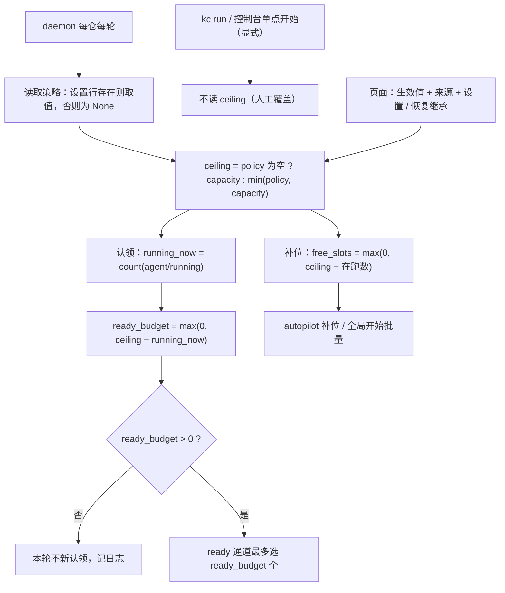

# PRD: 统一自动执行并发上限（Backlog 补位与 daemon 认领共用同一生效值）

- GitHub Issue: https://github.com/ZataZhang/keda/issues/266

> ✅ **交付前置**：无硬依赖，可立即开工。
> 结构化声明见 §8 Delivery Dependencies，**那里是唯一事实源**。

> 🧍 **验收状态**：待人工验收。
> 本行是 §9 Acceptance Checklist 的投影，**那里是唯一事实源**。

本文分两层：Part A 人审层（§1-4）界定「这台仓库自动执行最多同时跑几个任务」的可见口径与验收选择；Part B 执行器层（§5-13）给出仓库落点、失败边界与验证证据。

## Feature Overview (功能一览)

以下清单是 §10 Functional Requirements 的行为投影；具体验收以 §1 行为样例为准。

- **单一生效上限**（FR-1）：自动路径的并发上限收敛为「页面设置（未设置则继承 runner 容量）与 runner 容量取小」的一个值，由补位与认领两个闸门共同兑现。
- **daemon 认领闸门**（FR-2）：daemon 每轮新认领数不再超过「上限 − 在跑数」；手工堆入的 ready Issue 同样被限速；预算为 0 时安静跳过而非报错；计数失败 fail-closed。
- **补位与批量入口对齐**（FR-3）：autopilot 补位与「全局开始」批量都按同一生效上限补到槽满，报告可见上限与来源。
- **显式运行不受限**（FR-4）：`kc run --issue`、`kc run --all-ready` 与控制台单点「开始」保持人工覆盖语义，行为不变并写入文档。
- **设置与默认**（FR-5）：从未保存过＝无策略（不再用内置 2 冒充）；已保存值继续生效；支持设置 1–10 与恢复继承（清除）。
- **页面说真话**（FR-6）：Backlog 控制条不再展示伪造默认值，而是「生效值 + 来源」，并可就地设置或恢复继承。
- **观测**（FR-7）：daemon 每轮日志与 `kc backlog advance` 报告可见「上限 / 在跑 / 预算」。
- **文档与 skill 同步**（FR-8）：使用指南、配置注释、随包 operator skill 与 CLI 帮助同步新语义。
- **兼容性边界**（FR-9）：已保存设置的行继续生效；review/merge 并发、claim CAS、`max_issues` 语义、数据库结构不变。

# Part A · 人审层 (Review Layer)

## 1. Introduction & Goals

### Problem Statement

操作员看到 Backlog 页面显示「并发 2」，而仓库的 runner 并行容量配置是 10；两个数字都自称控制「并发」，却谁也管不到对方：

- 页面的「并发」数字只影响自动补位：它把每轮补入量压在 2 附近，runner 容量 10 在自动推进路径上永远用不满。
- daemon 的认领上限只看 runner 容量：手工「加入就绪」堆入的 Issue 会被整批领走，绕过页面上的 2。
- 从未保存过该设置时，页面数字来自代码内置默认值（本仓从未保存过，页面 2 不对应任何真实配置）；页面既没有直接编辑入口，现有写入又只是把当前值顺带存档，无法改成别的数字。

结果是一个三方都不自洽的口径：页面说 2、配置说 10、实际执行由「任务从哪条路进来」决定；操作员无法回答「这台机器最多同时跑几个任务」，也无法用页面数字做出任何有效的限制。

### Interpretation (解读回显)

#### 行为样例

| 验证方式 | 输入 / 操作 | 期望观察到的结果 |
|---|---|---|
| 👀 人审 + 自动验证 | 并发从未保存过、runner 容量 10；在页面上把并发设为 4，再恢复继承 | 页面依次显示「并发 10（继承 runner 配置）」「并发 4（Backlog 设置）」「并发 10（继承 runner 配置）」；刷新与保存后读数一致 |
| 🤖 自动验证 | 并发未设置、容量 10、pending 充足：自动推进跑一轮连续调度 | 本轮最多补入「10 − 在跑数」个 PRD，不再固定压在 2 |
| 🤖 自动验证 | 并发设为 2、容量 10，手工把 6 个 Issue 置为就绪：daemon 连续两轮 | 每轮新认领不超过「2 − 在跑数」个；任何时刻自动认领在跑数 ≤ 2 |
| 🤖 自动验证 | 在跑数已达上限：daemon 再来一轮 | 本轮不新认领、不报失败；已在跑任务的续跑与收尾照常处理 |
| 🤖 自动验证 | 上限已满时，人工定向运行单个 Issue | 照常执行并完成；显式运行不受上限约束 |
| 🤖 自动验证 | 读取「在跑数」失败（标签查询异常） | 本轮安静跳过新认领并记录原因；不超发、不中断已在跑任务、进程不崩溃 |

以上行为行即验收样本：修正任一行为或结果格即同步修正对应验收标准，oracle 明细在 §7.6。

#### 我默默定了这些

- 生效上限的三个消费点（daemon 认领、autopilot 补位、全局开始批量）共用同一个解析函数；不引入第四个并发概念。
- 两个并发参数保留各自归属、不合并：页面「并发」是可选的仓库策略，runner 容量是机器/进程容量；生效值＝未设置则容量，否则取小。
- 「在跑数」取仓库内 `agent/running` 标签的实时计数（跨进程、跨机器一致），而不是本进程自己的活动数。
- 在跑计数失败时 fail-closed：本轮跳过新认领（宁少勿超），记录原因；已在跑任务不受影响。
- 恢复继承＝删除该仓库的并发设置行；默认视图偏好的已知副作用在 §12 披露。
- 控制台单点「开始」与命令行的显式运行同属「人工显式」，不受上限约束。
- 页面文案同时给出数字与来源；数字一律是生效值。
- 「全局开始」批量按服务端解析的生效上限执行，不再把请求值持久化为设置（设置只经受控入口保存）。

#### 我理解为不做

- 不给显式运行加闸门（夜间多条定向运行并行开工的用法保持一致）。
- 不引入跨进程/跨机器分布式配额或全局锁；上限是自动路径的选择层护栏，首次领取的 CAS 仍是唯一硬保证。
- 不改 review/merge 侧并发、不改 claim CAS、不改 `max_issues` 语义、不做数据库结构变更。

本需求读作：把「这台仓库自动执行最多同时跑几个任务」收敛为一个可见、可设、可继承、且被补位与认领两处同时兑现的单一上限；人工显式命令是文档化的例外，不读这个上限。它不读作全仓硬配额、不读作分布式限流、不读作对显式运行的限速，也不读作修改 review/merge 并发。

### What The User Gets

页面上的数字从此就是真实生效的自动执行上限：没设置过时跟随 runner 配置（本仓为 10），想要更保守就在页面设置一个更小的值，想恢复跟随就清除。daemon 与自动补位都按这个数字工作；手工堆入的 Issue 不再能绕过它。显式定向运行的并行用法保持现状。操作员在 daemon 日志和连续调度预演里能看到「上限 / 在跑 / 本轮预算」三个数。

### Measurable Objectives

- 并发未设置、容量 10：连续调度一轮最多补入「10 − 在跑数」个；页面显示「并发 10（继承 runner 配置）」。
- 并发设为 2、容量 10：daemon 任意时刻自动认领在跑数 ≤ 2；手工置入 6 个就绪也无法突破。
- 显式定向运行回归测试全绿（行为与改动前一致）。
- 页面三态（继承 / 设置 / 受容量限制）文案与后端返回值一致；设置与恢复继承后 fresh 读回一致。
- 目标测试集与 lint 通过；无数据库结构变更。

## 2. Human Review Map (介入与风险地图)

### 决定一：自动执行使用「取小」的单一上限，未设置时继承 runner 容量

统一上限 = min（Backlog「并发」设置，runner 容量）；「并发」从未保存过时不额外限制，直接等于 runner 容量（本仓 10）。两个参数保留各自归属、不合并为一个：页面设置只能把自动上限压得更低，不会超过 runner 容量；需要更高并行时调整容量（仓库配置或启动旗标）。三个自动入口——daemon 认领、autopilot 补位、全局开始批量——都改用这个生效值。你已在本轮确认「未设置 ⇒ 继承 runner 容量」与「两参数取小、不合并」。

**请确认：** 自动路径的并发上限采用上述取小口径（两个参数保留、不合并），且从未保存过时继承 runner 容量。

**验收：** daemon 日志与连续调度报告显示同一个生效值；设置 2 时在跑数被限在 2；未设置时补位可到容量值。

### 决定二：显式运行不受上限约束（人工覆盖）

命令行的显式运行（定向与整队列两种形式）与控制台单点「开始」保持「点名即执行」的人工覆盖语义；上限只治理自动路径。你已在本轮确认。

**请确认：** 显式运行不读上限、行为不变，并作为文档化例外写进使用指南。

**验收：** 上限已满时显式定向运行仍照常执行并完成；相关回归断言全绿。

### 决定三：页面数字升级为「生效值 + 来源」，并提供最小设置入口

Backlog 控制条上的「并发 N」不再显示伪造默认值，而是显示真实生效值与来源（继承 runner 配置 / Backlog 设置 / 受 runner 容量限制）；同处提供最小设置入口：可设置 1–10 的策略值、可「恢复继承」（清除设置）。没有这个入口，「未设置」与「可调整」就只是文档承诺而无法被操作。你已在本轮确认按此推荐实现。

**请确认：** 接受把控制条数字升级为三态文案，并新增最小「设置 / 恢复继承」入口。

**验收：** 三态截图（继承 / 设置 / 受限）与设置、恢复继承后的 fresh 读回一致。

**自动门禁，不需要逐项人工审阅**：解析函数单测、认领与补位预算计算、API 契约与类型同步、前端类型检查和构建、文档与 skill 同步断言，均由执行器与自动门禁验证。

**本次明确不涉及**：review/merge 并发、claim CAS 算法、`max_issues` 语义、数据库结构（`backlog_settings` 表不加列、不迁移、无 schema 变更，无需 ER 图审批）、跨机器全局配额。

## 3. Usage And Impact After Implementation

### 仓库操作员 / daemon 使用者

`kc daemon`（含 `--concurrency`）在自动认领时按生效上限扣减在跑数；每轮日志可见「上限 / 在跑 / 预算」。把 `--concurrency` 调小仍能进一步压低容量（取小）。未设置过「并发」的仓库从「代码默认 2」变为「继承 runner 容量」——本仓的自动推进上限从约 2 变为 10。

### Backlog 页面使用者

控制条显示「并发 N（来源）」，可就地设置 1–10 或恢复继承；「全局开始」按生效上限批量启动；切换默认视图不再顺带改写并发设置。「开始」（单点）行为不变。

### 显式运行使用者

`kc run --issue`、`kc run --all-ready` 行为不变：不受上限约束，与同仓 daemon 的互斥规则不变。

### 兼容性影响

- 已保存过「并发」的仓库：继续生效，并与 runner 容量取小；无数据迁移。
- 从未保存过的仓库：显示与自动路径从「代码默认 2」变为「继承 runner 容量」——本 PRD 的预期行为变化。
- 显式运行、`--all-ready`、review/merge、claim CAS、数据库结构：不变。

## 4. Requirement Shape

- **Actor**：仓库操作员（daemon 使用者）、Backlog 页面使用者、显式运行使用者。
- **Trigger**：daemon 每轮轮询；autopilot 补位；全局开始；页面设置变更。
- **Expected behavior**：自动路径任意时刻在跑数 ≤ min(设置, 容量)；每轮新认领 ≤ 上限 − 在跑；页面显示生效值与来源；显式运行不受限。
- **Scope boundary**：只治理自动路径并发；不引入全仓硬配额；不动显式运行与 review/merge 并发。

# Part B · 执行器层 (Build Layer)

## 5. Repository Context And Architecture Fit

### Existing Path / Reuse Candidates

- **解析点（新增）**：单一解析函数 `resolve_execution_ceiling(policy, capacity)`＋来源描述 helper，建议放新模块 `src/backend/core/use_cases/backlog_concurrency.py`（`backlog_actions.py` 已 890 非空行、`agent_runner_orchestration_runtime.py` 已 926 非空行，都贴近 1000 行 CI 硬上限，新逻辑放新文件）。所有消费点只调用它。
- **补位闸门**：`src/backend/core/use_cases/backlog_actions.py` 的 `advance_backlog_queue`（现 `free_slots = max(0, max_parallel - running_count)`）与 `start_global_backlog`（同公式）；`get_or_create_backlog_settings` 不再用 `_DEFAULT_MAX_PARALLEL = 2` 冒充策略。
- **认领闸门**：`src/backend/core/use_cases/agent_runner_orchestration_runtime.py` 的 `run_once`：`effective_max_issues = max(max_issues, concurrency)` 与 ready 选择循环；`RunOnceRequest`（同文件）与 `src/backend/core/use_cases/agent_runner_orchestrate.py` 的 `run_once` 包装是参数进入点。
- **daemon 装配**：`src/backend/core/use_cases/run_agent_daemon.py` 的 `run_agent_daemon` / `_run_daemon_loop`：每仓每轮先 `advance_backlog_queue` 再 `run_once`；`concurrency` 已在此解析（flag > 仓库配置）。
- **在跑计数**：`IGitHubClient.list_issues_by_label(label, limit, state)`（infrastructure 已实现，走 `gh issue list --label ... --state open`）；标签名取 `config.labels.running`。
- **设置存储**：console SQLite `backlog_settings`（行缺失＝未设置）；端口 `IBacklogStore.get_backlog_settings` / `save_backlog_settings`（`src/backend/core/shared/interfaces/runner_console.py`，`src/backend/infrastructure/persistence/console_store.py` 实现）。
- **API / 前端**：`src/backend/api/routes/agent_runner_backlog.py`（settings / autopilot / start-global）；`src/backend/core/use_cases/backlog_autopilot_settings.py` 状态快照；`frontend-public/components/backlog/backlog-autopilot-control.tsx`、`frontend-public/app/(app)/app/backlog/page.tsx`、`frontend-public/lib/api/backlog.ts`、`frontend-public/lib/api/types.ts`。
- **复用先例**：`repository_local.py` 的 toml 在仓库内已被既有编辑通道管理（`auto_advance` 等）；本次不扩写 toml，仅沿用 console 设置行与既有 PATCH 通道。

### Architecture Constraints

- 依赖方向不变（`api -> core -> engines -> infrastructure`）；解析函数在 core；计数经 `IGitHubClient` 端口。
- 上限是选择层护栏：不放宽也不替代首次领取 CAS；CAS 仍是同一 Issue 不双跑的唯一硬保证。
- `run_once` 是 `kc run` 与 daemon 共用入口：新参数默认 `None`，只有 daemon 传值，保证显式路径零变化。
- console 展示的容量来自仓库配置（`max_concurrent_issues`）；daemon 若用 `--concurrency` 覆盖，则以更小者为准，页面与日志的差异需在文档说明。

### Frontend Impact

- `frontend-public/`（Console）：`backlog-autopilot-control.tsx` 的「并发 N」升级为三态文案＋最小设置/恢复继承控件；`page.tsx` 接线，并移除视图切换时的隐式并发回写；`lib/api/backlog.ts`、`lib/api/types.ts` 契约同步。`frontend-admin/` 无影响。

### Existing PRD Relationship

- 已检查 `tasks/pending/` 与相关归档。`P1-FEAT-20261009-161453-kc-hosted-runner-deployment.md` 与本任务共同触及 `tests/test_daemon_parallel_concurrency.py`（软重叠，无顺序依赖）；`P1-FEAT-20261009-133425-lifecycle-agent-model-settings.md` 涉 `frontend-public` 静态 bundle 与 Backlog 入口（软重叠）；`P1-FEAT-20261009-123512-kc-agentic-entry-and-stall-supervision.md` 与 `P1-FEAT-20261009-161921-nightly-batch-aggregate-pr.md` 提及并发语义但无语义依赖。
- 归档 PRD `P1-FEAT-20260703-105330-roadmap-continuous-scheduling.md`、`P1-FEAT-20260916-122645-roadmap-prd-controls-evidence-autopilot.md` 与 `P1-FEAT-20260625-101522-iar-daemon-parallel-issue-execution-live-view.md` 是本口径的历史来源（并发开关注入、控制条与后台并行）。
- **关系结论**：不重复、不依赖、不阻塞现有 pending PRD；共享文件的软协调在提交前 rebase 处理。

### Potential Redundancy Risks

- 不新建调度器、服务、表或队列；不复制认领逻辑；不为显式运行另造限流中间件。
- 除 `resolve_execution_ceiling` 之外不引入新的并发概念或配置键。

## 6. Recommendation

### Recommended Approach

单一解析函数 + 两个闸门 + 显示与设置入口：

1. `resolve_execution_ceiling(policy, capacity)`：`policy` 为已保存设置（未保存为 `None`），`capacity` 为解析后的 runner 容量（daemon：`--concurrency` > 仓库配置；console：配置值）。返回 `capacity if policy is None else min(policy, capacity)`；配 `describe_ceiling` 给出「继承 / 设置 / 受容量限制」来源。
2. daemon 每仓每轮：读 policy 与容量，解析 ceiling；把 `execution_ceiling` 传给 `advance_backlog_queue`（补位）与 `run_once`（认领）。
3. 认领闸门：`run_once` 在 `execution_ceiling is not None` 时先实时统计 `agent/running` 数量 `running_now`，得 `budget = max(0, ceiling - running_now)`；ready 通道最多选 `budget` 个新认领；running/rework 与 `direct_pr_cleanup` 配额不受影响；计数失败 fail-closed。
4. 补位闸门：`advance_backlog_queue` 与 `start_global_backlog` 改用 ceiling 计算 `free_slots`；报告显示 ceiling、来源与 free_slots。
5. 显式运行（`run_agent_repositories_once` 及其调用方）不传 `execution_ceiling`，行为逐字节不变。
6. 存储 / API / 前端：行缺失＝未设置；settings 返回「可空策略＋生效值＋容量」；PATCH 支持设置与清除（清除＝删行）；autopilot 返回生效值与来源；控制条三态显示并可设置/恢复继承。
7. 文档与随包 skill 同步。

**为什么最贴合现有架构**：复用既有两个闸门与 `agent/running` 标签这一既有事实源；不引入新调度器、新存储、新锁。**拒绝冗余抽象**的理由：全仓硬配额、分布式锁、显式运行限流都会改变既有产品哲学（点名即执行）且收益不足。

### ROI 与范围取舍

收益：消除「配置 10 用不满 / 页面 2 管不住 / 手工绕过 2」三方不一致——直接回答「这台机器最多同时跑几个」。成本：一个解析函数、两处闸门接线、一处显示与设置入口、测试与文档。不做：全仓硬配额、跨机器锁、显式限流（改变现有哲学且非本诉求）。

### Proposed Solution Summary (实现机制)

自动路径的「生效并发上限」由 core 的单一解析函数给出；daemon 装配层按仓解析并下传，补位（`advance_backlog_queue` / `start_global_backlog`）与认领（`run_once` 的预算）两处消费；认领预算用 `agent/running` 标签实时数扣减，fail-closed。设置存续沿用 `backlog_settings` 行（行缺失＝未设置），恢复继承＝删行；API 返回生效值与来源，前端控制条据此显示并编辑。显式运行路径不感知上限。刻意避免：新表或迁移、新调度器、显式运行限流、review/merge 变更。

### Alternatives Considered

- **全仓硬上限（显式运行也被拒）**：改变「点名即执行」哲学与夜间多条 `kc run --issue` 并行开工用法；用户已确认豁免，拒绝。
- **保留伪默认 2、只补认领闸门**：页面数字仍是伪造值，未解决「配置 10 用不满」；拒绝。
- **彻底单旋钮（页面直接写仓库配置的 `max_concurrent_issues`）**：概念最少，但需要 UI 写仓库文件的通道、旧值迁移与 headless 语义调整；成本高于收益，记录为后续收敛选项（D-04 拒绝项）。
- **只改文案**：手动绕过与认领不设防仍在；拒绝。

## 7. Implementation Guide

> This section is a living implementation guide based on current repository analysis. If implementation discovers additional affected files, hidden dependencies, edge cases, or a better path, update this PRD before proceeding.

### 7.1 Core Logic

1. **解析**：`resolve_execution_ceiling(policy: int | None, capacity: int) -> int`，`capacity >= 1`；`policy is None` 或 `policy > capacity` 时返回 `capacity`，否则返回 `policy`。`describe_ceiling(policy, capacity)` 返回 `"inherited" | "policy" | "capped_by_capacity"` 供 API/前端与报告使用。
2. **daemon 主循环**（`run_agent_daemon.py` 的 `_run_daemon_loop` 每仓分支）：`policy = backlog_store_factory().get_backlog_settings(repo_id).max_parallel if row else None`（factory 缺失时为 `None`）；`ceiling = resolve_execution_ceiling(policy, concurrency)`；先 `advance_backlog_queue(..., execution_ceiling=ceiling)`（仅 autopilot 开启时），再 `run_once(..., execution_ceiling=ceiling)`；两处失败仍按现有 try/except 隔离。
3. **认领闸门**（`run_once`）：
   - `RunOnceRequest` 与 `agent_runner_orchestrate.py` 的 `run_once` 包装新增 `execution_ceiling: int | None = None`，默认 `None`。
   - ready 通道：`execution_ceiling is not None` 时先 `running_now = len(github_client.list_issues_by_label(config.labels.running, limit=execution_ceiling, state="open"))`；`budget = max(0, execution_ceiling - running_now)`；ready 类项选择上限改为 `min(effective_max_issues, budget)`；`budget == 0` 时跳过 ready 循环（记录一条 info 日志）。
   - 计数异常：捕获后按 `budget = 0` 处理并记 warning（fail-closed），不中断 running/rework 与 `direct_pr_cleanup` 通道。
   - 记录 `ceiling=… running=… ready_budget=…` 日志行，供运维与证据抓取。
4. **补位**（`backlog_actions.py`）：`advance_backlog_queue(*, ..., execution_ceiling: int | None = None)`；`None` 时用 `resolve_execution_ceiling(policy, context.config.runner.max_concurrent_issues)` 兜底（同一解析函数）；`free_slots = max(0, ceiling - running_count)`；`BacklogAdvanceReport` 增加 `ceiling` / `ceiling_source` 字段。`start_global_backlog` 以 `execution_ceiling` 替换 `max_parallel` 参数并**不再持久化设置**；路由解析 ceiling 后传入。`get_or_create_backlog_settings` 移除伪造默认：行缺失时以 `None` 策略表达（调用点同步）。
5. **存储 / API**：
   - `IBacklogStore` 增加 `delete_backlog_settings(repo_id)`（恢复继承＝删行；`console_store.py` 实现）。
   - `GET /agent-runner/backlog/settings`：返回 `max_parallel: int | null`（策略）、`effective_max_parallel`、`runner_capacity`、`ceiling_source`、`default_view`、`updated_at`。
   - `PATCH /agent-runner/backlog/settings`：`max_parallel: int | None`（省略＝不变；`null`＝清除；1–10＝设置），`default_view` 可选；响应为 fresh 读回的同形状。
   - `GET /agent-runner/backlog/autopilot`：`max_parallel` 语义改为策略（可空），新增 `effective_max_parallel` / `runner_capacity` / `ceiling_source`。
   - `POST /agent-runner/backlog/start-global`：`max_parallel` 字段从请求移除；服务端解析 ceiling，批量上限 `max(0, ceiling - running)`。
   - `backlog_autopilot_settings.py` 的状态快照字段同步（`policy_max_parallel`、`effective_max_parallel`、`runner_capacity`、`ceiling_source`）。
6. **前端**：
   - `backlog-autopilot-control.tsx`：显示三态文案（继承 / 设置 / 受容量限制），新增最小编辑器（数字输入 1–10＋保存＋恢复继承）；保存用响应 fresh 值刷新；失败回滚并 toast。
   - `page.tsx`：接线设置保存/清除；`handleViewChange` 不再携带 `maxParallel` 回写。
   - `lib/api/backlog.ts` + `lib/api/types.ts`：`updateBacklogSettings` 的 `maxParallel` 改为可选并可传 `null`；`BacklogSettings` / `BacklogAutopilotState` 类型同步。
7. **文档与 skill**：`docs/guides/agent-runner.md` 的「全局调度」「持续调度（Continuous Scheduling）」「并行处理 Issue（`kc daemon --concurrency`）」「多条 run 之间的并发边界」及配置注释段；`repository_local.py` 的 `runner.max_concurrent_issues` 字段注释；随包 skill `kedacode-operator` 的 `SKILL.md` 与 `references/daemon.md`。

### 7.2 Change Impact Tree

```text
Core
├── src/backend/core/use_cases/backlog_concurrency.py [新增]
│   【总结】生效并发上限的唯一解析与来源描述函数
├── src/backend/core/use_cases/backlog_actions.py [修改]
│   【总结】补位与全局开始改用生效上限；不再伪造默认策略、不再经全局开始持久化设置
├── src/backend/core/use_cases/run_agent_daemon.py [修改]
│   【总结】每仓每轮解析 ceiling 并下传补位与认领，记录预算日志
├── src/backend/core/use_cases/agent_runner_orchestration_runtime.py [修改]
│   【总结】run_once 新增认领预算（ceiling − 在跑）并在计数失败时 fail-closed
├── src/backend/core/use_cases/agent_runner_orchestrate.py [修改]
│   【总结】run_once 包装透传 execution_ceiling
├── src/backend/core/use_cases/backlog_autopilot_settings.py [修改]
│   【总结】状态快照携带策略、生效上限、容量与来源
└── src/backend/core/shared/interfaces/runner_console.py [修改]
    【总结】IBacklogStore 增加删除设置能力（恢复继承）契约

Infrastructure
├── src/backend/infrastructure/persistence/console_store.py [修改]
│   【总结】实现设置行删除；读取保持行缺失＝未设置
└── src/backend/engines/agent_runner/repository_local.py [修改]
    【总结】max_concurrent_issues 字段注释同步上限语义

API
├── src/backend/api/routes/agent_runner_backlog.py [修改]
│   【总结】settings / autopilot / start-global 三路由的上限、来源与可空策略契约
└── src/backend/api/cli_parsed_commands/backlog.py [修改]
    【总结】advance 报告与 dry-run 显示生效上限、来源与 free_slots

Frontend
├── frontend-public/components/backlog/backlog-autopilot-control.tsx [修改]
│   【总结】并发三态显示 + 最小设置/恢复继承控件
├── frontend-public/app/(app)/app/backlog/page.tsx [修改]
│   【总结】接线设置保存/清除；视图切换不再隐式回写并发
├── frontend-public/lib/api/backlog.ts [修改]
│   【总结】settings / autopilot / start-global 客户端契约同步
└── frontend-public/lib/api/types.ts [修改]
    【总结】新增生效上限、容量、来源与可空策略类型

Tests
├── tests/test_backlog_concurrency.py [新增]
│   【总结】解析函数与来源描述单测
├── tests/test_backlog_actions.py [修改]
│   【总结】start_global 按 ceiling、不再持久化；更新既有 max_parallel 用例
├── tests/test_backlog_advance.py [修改]
│   【总结】覆盖未设置继承 / 已设置取小 / 饱和预算
├── tests/test_backlog_autopilot_settings.py [修改]
│   【总结】快照新增字段；策略可空
├── tests/test_backlog_api.py [修改]
│   【总结】settings PATCH 设置与清除；autopilot 新契约
├── tests/test_daemon_parallel_concurrency.py [修改]
│   【总结】daemon 认领预算与 fail-closed 用例
└── tests/conftest.py [修改]
    【总结】FakeBacklogStore 与 fake 客户端支持删除与在跑计数

Docs / Prototype / Skill
├── docs/guides/agent-runner.md [修改]
│   【总结】并发上限语义、显式运行豁免、页面设置说明
├── docs/prototypes/roadmap-prd-controls-evidence-autopilot.md [修改]
│   【总结】登记并发三态与最小编辑入口的目标态原型与变更记录
├── docs/prototypes/assets/roadmap-prd-controls-evidence-autopilot.png [修改]
│   【总结】目标态图（三态文案 + 编辑控件）
├── docs/prototypes/assets/roadmap-prd-controls-evidence-autopilot.prompt.md [修改]
│   【总结】同步生成提示词旁车
├── src/backend/engines/agent_runner/templates/skills/kedacode-operator/SKILL.md [修改]
│   【总结】随包操作说明同步上限与豁免语义
└── src/backend/engines/agent_runner/templates/skills/kedacode-operator/references/daemon.md [修改]
    【总结】daemon 并发段落同步

Database
└── No data model changes in this PRD.
    【总结】backlog_settings 表结构不变；未设置沿用行缺失语义，恢复继承＝删行
```

### 7.3 Risk Classification Register

| Change point | Tier | Decisive dimension / override | Intervention | Failure-discriminating oracle / gate |
|---|---|---|---|---|
| 生效上限解析函数 | R1 | 纯函数，单测可判别 | Executor + automated gate | rv-2 同口径 + `tests/test_backlog_concurrency.py` |
| daemon 认领预算（在跑统计、fail-closed） | R3 | 并发正确性：超发＝多烧 token 与机器；误锁＝自动路径停摆 | Human-confirm（决定一）+ 自动门禁与现场负控 | rv-1（含负控）、rv-5 |
| 补位 / 全局开始切换 ceiling 与未设置继承 | R2 | 跨组件行为与默认语义变化（未保存仓库并发从 2 变容量） | Executor + automated gate | rv-2 |
| 设置契约（可空策略、清除、来源字段、start-global 不再持久化） | R2 | 对外契约与页面数据变化 | Executor + automated gate | rv-2（fresh 读回）+ rv-3（页面） |
| 页面三态显示与设置 / 恢复继承 | R2 | 用户可见写入路径（UI → API → DB） | Executor + automated gate + 人审呈递 | rv-3 |
| 显式运行豁免回归 | R1 | 行为不变断言 | Executor + automated gate | rv-4 |
| 文档与随包 skill | R0 | 静态一致性 | Executor + automated gate | §7.5 搜索断言 |

### 7.4 Flow / Architecture Diagram



### 7.5 Executor Drift Guard

实现前重新检索以下锚点；文件清单是起点而非全集：

```bash
rg -n "max_parallel|maxParallel" src/backend frontend-public tests
rg -n "get_or_create_backlog_settings|_DEFAULT_MAX_PARALLEL" src/backend
rg -n "effective_max_issues|max_concurrent_issues" src/backend
rg -n "并发|max_concurrent_issues" docs/guides/agent-runner.md src/backend/engines/agent_runner/templates/skills/kedacode-operator
```

- `tests/test_backlog_api.py` / `test_console_store.py` 的 `keda-main` 是历史夹具 repo id，保留其夹具语义，不要改测试身份。
- console 静态前端由 `just console-sync` 生成；改 `frontend-public/` 后按仓库流程同步并**重启** `kc console`（改后端路由后不重启会 404，页面已变新——见指南既有说明）。
- `run_once` 同时服务 `kc run` 与 daemon：任何参数默认值变化必须保证显式路径逐字节不变（`execution_ceiling` 默认 `None`）。

### 7.6 Realistic Validation Plan

```yaml
- id: rv-1
  behavior: "daemon 自动认领不再超过生效上限：未设置时继承容量、已设置时取小，且在跑数计入预算。"
  reviewer: verifier
  real_entry: "隔离场景中运行真实 `uv run kc daemon --repo <fixture> --concurrency 10 --interval 1`（fake gh 与 fake agent 为边界假件，真实 kc 进程、真实 state home、真实 SQLite）"
  expected: "并发未设置、6 个就绪：单轮新认领不超过容量；通过真实 PATCH 把并发设为 2 后同场景单轮新认领 ≤ 2 且任意时刻在跑 ≤ 2；先制造 1 个在跑时预算减 1；预算为 0 时不报错、不新认领。"
  mock_boundary: "只 fake 外部 gh / agent 可执行器（fail-loud、argv 记录）；kc CLI、daemon 主循环、GitHub 客户端封装、SQLite、设置读取与认领选择必须真实。"
  tier: R3
  test_layer: e2e
  required_for_acceptance: true
  critical_value_source: "daemon 日志中的 ceiling/running/ready_budget 行与 fake agent 的调用探针（JSONL）；策略值来自对真实 console DB 的设置行写入，不从测试常量拼装。"
  must_cross: "真实 kc daemon 进程 → 设置读取（console DB）→ 解析函数 → advance / run_once → GitHub 标签计数（fake gh）→ 认领选择 → fake agent 调用探针 → 下一轮 pass。"
  forbidden_bypasses: "不得直接调用 core 函数代替 daemon；不得 mock 认领选择或设置读取；不得用预置常量冒充策略；不得绕过 fake gh 的标签状态。"
  fresh_state_probe: "daemon 停止后另起 `uv run kc backlog advance --dry-run` 进程与只读 SQLite 会话，核对同一 fixture 的 ceiling 与设置行；读取 daemon 日志文件确认逐轮预算。"
  final_tree_evidence: "保存 daemon 日志、agent 探针 JSONL、设置行快照与 git tree；解析函数 / 认领 / daemon 装配任一改动后重跑。"
  negative_control: "同一场景在未实现该改动的代码树上运行（或等价地仅对测试夹具注入旧行为，绝不改生产代码）：并发=2 时 6 个就绪会被整批领走。"
  expected_fail: "负控运行出现超过上限的并发认领（≥3 个 fake agent 被同时或同轮调用），证明该用例能变红。"

- id: rv-2
  behavior: "自动补位与全局开始按生效上限工作：未保存过设置时继承 runner 容量，已保存时与容量取小；报告显示上限与来源。"
  reviewer: verifier
  real_entry: "隔离场景中运行真实 `uv run kc backlog advance --dry-run`（fake gh）：未设置策略与设置 2 两种状态各跑一次，随后跑一次真实 `uv run kc backlog advance`"
  expected: "未设置：报告 ceiling＝容量（如 10）、free_slots＝10−在跑，dry-run 计划补入数量与之一致；设置 2：ceiling＝2；报告标注来源（继承 / 设置 / 受限）。"
  mock_boundary: "只 fake gh；真实 CLI、core 补位逻辑、console DB、仓库配置读取真实。"
  tier: R2
  test_layer: integration
  required_for_acceptance: true
  critical_value_source: "CLI 报告输出与真实 console DB 的设置行；设置行由真实 PATCH 写入。"
  must_cross: "真实 kc CLI → 设置读取 → 解析函数 → 补位用例 → 报告输出；写入路径 PATCH → DB → fresh CLI 读取。"
  forbidden_bypasses: "不得直接调用 core 判断结果；不得跳过 CLI 直接断言内部返回值；不得用测试常量代替 DB 设置。"
  fresh_state_probe: "第二次独立 CLI 进程 fresh 读取相同口径；只读 SQLite 会话核对设置行。"
  final_tree_evidence: "保存两次 dry-run 与一次真实 advance 的终端输出、DB 行快照与 git tree；补位 / 解析 / 路由改动后重跑。"

- id: rv-3
  behavior: "Backlog 控制条显示生效值与来源（继承 / 设置 / 受容量限制），可就地设置 1–10 或恢复继承，保存后 fresh 读取一致。"
  reviewer: human
  real_entry: "`kc console` 打开 Backlog 页面操作控制条（真实 console 进程、真实 API、真实 SQLite）"
  expected: "三态文案正确；设置 4 后再加载仍为「并发 4（Backlog 设置）」；恢复继承后回到「并发 N（继承 runner 配置）」。"
  mock_boundary: "无 mock；真实 console 进程、真实 API、真实 SQLite。"
  tier: R2
  test_layer: e2e
  required_for_acceptance: true
  presentation: "`tasks/evidence/P1-FEAT-20261010-011714-unified-auto-concurrency-ceiling/rv-3-backlog-concurrency-inherit.png`、`rv-3-backlog-concurrency-policy.png`、`rv-3-backlog-concurrency-capped.png` 与保存/恢复继承后的 fresh 截图；交付时 `open tasks/evidence/P1-FEAT-20261010-011714-unified-auto-concurrency-ceiling/` 打开核对。10 秒自检：把并发改为 4，刷新页面，期望显示「并发 4（Backlog 设置）」；点恢复继承，期望回到「并发 N（继承 runner 配置）」。"
  critical_value_source: "浏览器中真实 API 响应与页面渲染值；设置写入后再由新请求 fresh 读回的值，不从组件状态或测试常量取得。"
  must_cross: "页面控件 → typed API client → PATCH /backlog/settings → console DB 提交 → fresh GET /backlog/autopilot 与 /backlog/settings → 页面重渲染。"
  forbidden_bypasses: "不得用组件预览、mock 数据、手工注入前端状态替代真实页面；不得直接调用 API 后声称页面通过。"
  fresh_state_probe: "保存与清除后关闭/重载页面发起新 GET；并用只读 SQLite 会话核对设置行（存在 / 删除）。"
  final_tree_evidence: "保存截图、API 请求摘要、DB 行快照与 git tree；页面 / API / 路由改动后重跑。"

- id: rv-4
  behavior: "显式运行不受生效上限约束：上限已满时定向运行仍照常执行并完成；`--all-ready` 与 daemon 的互斥规则不变。"
  reviewer: verifier
  real_entry: "隔离场景：将该仓库并发设为 1 并制造 1 个在跑状态，运行真实 `uv run kc run --issue <N>`（fake agent）"
  expected: "显式定向不被上限拦截，照常完成本次运行；`kc run --all-ready` 在同仓 daemon 运行时仍按现值拒绝（退出码 5）。"
  mock_boundary: "只 fake agent / gh 外部边界；kc CLI、认领准入、执行编排真实。"
  tier: R1
  test_layer: e2e
  required_for_acceptance: true

- id: rv-5
  behavior: "在跑计数读取失败时 fail-closed：该轮安静跳过新认领并记录原因，已在跑任务照常推进，进程不崩溃。"
  reviewer: verifier
  real_entry: "隔离场景中让 fake gh 对该标签查询返回失败（fail-loud 记录的 argv 分支），运行真实 `uv run kc daemon` 观察到该分支"
  expected: "daemon 日志出现计数失败与本轮跳过新认领的警告；没有新增认领；running / rework 通道与后续轮次不受影响。"
  mock_boundary: "只 fake gh（注入单点失败）；daemon 与认领逻辑真实。"
  tier: R1
  test_layer: integration
  required_for_acceptance: true
```

失败排查顺序：先核对 fixture 的 console DB 设置行与仓库配置容量，再核对 daemon 的 `ceiling/running/ready_budget` 日志，再看 fake gh 的 argv 探针是否收到标签查询，最后检查前端是否已 `console-sync` 并重启 console（旧 bundle 会显示旧文案）。

### 7.7 External Validation

- `No external validation required; repository evidence was sufficient.`

### 7.8 Frontend / Prototype / Data Model

- **Frontend impact**：`frontend-public/`（Console）：`backlog-autopilot-control.tsx` 三态显示＋设置/恢复继承；`page.tsx` 接线与移除视图切换的隐式回写；`lib/api/backlog.ts`、`lib/api/types.ts` 契约。`frontend-admin/` 无影响。
- **Target prototype**：既有已在 Prototype Hub 注册的原型 [Backlog 控制、验收证据与 Autopilot 草图](../../docs/prototypes/roadmap-prd-controls-evidence-autopilot.md)（Hub id `roadmap-controls-evidence`）为版式底本；实现时把其控制条更新为三态文案＋最小编辑控件，并同步提示词旁车与原型页记录。验收关键状态＝继承态 / 设置态 / 受容量限制态 / 编辑与恢复继承交互；实现 PR 需按仓库原型流程产出目标态图并与真实 console 截图按状态配对（原型标注 `design intent`，截图标注实际验证层级）。
- **Interactive prototype change log（计划，随实现落实）**：`docs/prototypes/roadmap-prd-controls-evidence-autopilot.md`、`docs/prototypes/assets/roadmap-prd-controls-evidence-autopilot.png`、`docs/prototypes/assets/roadmap-prd-controls-evidence-autopilot.prompt.md`。
- **No data model changes in this PRD**：`backlog_settings` 表结构不变，「未设置」沿用行缺失语义；恢复继承＝删除该行（已知副作用见 §12）。

## 8. Delivery Dependencies

### Delivery Dependencies

```markdown
- Depends on tasks/issues:
  - none
- Gate type: none
- Sequence: via-main
- Notes: 已检查 pending/archive；与 `kc-hosted-runner-deployment`（共同触及 daemon 并发测试文件）、`lifecycle-agent-model-settings`（frontend bundle 与 Backlog 入口）及 `kc-agentic-entry-and-stall-supervision`（runner runtime 文件）为软重叠协调，无交付顺序依赖。
```

无硬依赖，可独立开工。若相关 PRD 并行改动同一测试文件或前端 bundle，提交前协调 rebase。该块是依赖唯一事实源，顶部 banner 仅作投影。

## 9. Acceptance Checklist

### 9.1 人读呈递区（Human Review Surface）

| 要看什么 | 呈递物 | 人如何快速确认 |
|---|---|---|
| 页面并发三态与设置 / 恢复继承 | `tasks/evidence/P1-FEAT-20261010-011714-unified-auto-concurrency-ceiling/rv-3-backlog-concurrency-inherit.png`、`rv-3-backlog-concurrency-policy.png`、`rv-3-backlog-concurrency-capped.png` 与保存 / 恢复继承后的 fresh 截图。交付时运行 `open tasks/evidence/P1-FEAT-20261010-011714-unified-auto-concurrency-ceiling/`。 | 核对控制条文案与数字：继承（如「并发 10（继承 runner 配置）」）、设置（「并发 4（Backlog 设置）」）、受限（「并发 N（受 runner 容量限制…）」）。10 秒自检：把并发改为 4 → 刷新 → 期望显示「并发 4（Backlog 设置）」；点恢复继承 → 期望回到继承文案。 |

verifier-only 组（不呈递，失败才升级给人）：daemon 认领预算与负控（rv-1）、补位 / dry-run 口径（rv-2）、显式运行豁免（rv-4）、fail-closed（rv-5），以及单测、类型检查、文档搜索断言等自动门禁。

### 9.2 Acceptance Evidence Package

#### Human-Confirmed

以下项目是实现完成后对真实交付证据的人工验收，不是要求用户再次确认需求范围：

- [ ] 接受自动路径上限的「取小」口径：min(设置, 容量)，未设置继承 runner 容量。（§2 决定一）
- [ ] 接受显式运行不设上限、维持人工覆盖并文档化。（§2 决定二）
- [ ] 接受页面数字升级为「生效值 + 来源」并新增最小设置 / 恢复继承入口。（§2 决定三）
- [ ] 复核 9.1 呈递区（三态截图与保存 / 恢复继承自检结果）。

#### Architecture Acceptance

- [x] `resolve_execution_ceiling` 是唯一解析点；无第二套并发概念、无新调度器 / 存储 / 迁移（`rg -n "min\\(.*max_concurrent|ceiling" src/backend/core/use_cases` 复核）。— 证据：`src/backend/core/use_cases/backlog_concurrency.py` 为唯一解析模块；`rg _DEFAULT_MAX_PARALLEL src/backend` 无命中；`tests/test_backlog_concurrency.py` 覆盖。
- [x] daemon 装配把 ceiling 下传补位与认领；显式运行调用链不带 `execution_ceiling`（`rg -n "execution_ceiling" src/backend` 复核）。— 证据：`run_agent_daemon.py` 每仓解析并下传；`RunOnceRequest.execution_ceiling` 默认 `None`，显式路径不传；rv-4 实测显式运行不受限。
- [x] 依赖方向保持 `api -> core -> engines -> infrastructure`；`just lint` 全绿。— 证据：`uv run python hooks/shared/check_architecture.py` 338 文件无违规；改动 19 个 .py 文件 ruff check + format 全绿；`just test` exit 0。（注：完整 `just lint` 的 check-test-flag 因 pre-commit 暂存态与 flag tree 口径差异未过，属提交管道产物而非代码违规，见 Change Log。）

#### Behavior Acceptance

- [x] daemon 任意时刻自动认领在跑 ≤ min(设置, 容量)；每轮新认领 ≤ 上限 − 在跑（rv-1）。— 证据：`rv-1-daemon-claim-budget.log`（真实 `kc daemon` + fake gh/agent；设置 2 后每轮新认领 ≤ 2、峰值并发 = 2）。
- [x] 未设置 ⇒ 继承容量：补位与认领都使用容量值（rv-2）。— 证据：`rv-2-advance-ceiling-report.txt`（未设置 → ceiling = 容量、source = inherited）。
- [x] 已设置 ⇒ 取小：设置 2 / 容量 10 时限制为 2；设置大于容量时以容量为界（rv-1、rv-2）。— 证据：rv-1 负控（未实现前 6 就绪被整批领走 peak=6）与 rv-2 三来源（inherited / policy / capped_by_capacity）。
- [x] 在跑计数失败 fail-closed：跳过新认领并记录；不崩、不超发（rv-5）。— 证据：`rv-5-fail-closed.log`（fake gh 注入标签查询失败 → 本轮零新认领 + warning，进程未崩）。
- [x] 显式 `kc run --issue` / `--all-ready`、控制台单点「开始」行为不变（rv-4 + 回归测试）。— 证据：`rv-4-explicit-run-exempt.txt`（上限满时定向运行照常完成；`--all-ready` 与 daemon 互斥仍 exit 5）+ `tests/test_agent_runner_run_targeting.py`。
- [x] `kc backlog advance --dry-run` 与报告显示 ceiling、来源与 free_slots（rv-2）。— 证据：rv-2 fresh CLI 报告含三字段。
- [x] `backlog_settings` 行缺失＝未设置；PATCH 设置 / 清除语义与 fresh 读回一致（rv-2、rv-3）。— 证据：rv-2 只读 SQLite 核对行；rv-3 PATCH 清除后行删除、fresh GET 回读一致。
- [x] 页面三态文案与后端值一致；保存 / 恢复继承后 fresh 读回一致（rv-3）。— 证据：`rv-3-console-backlog-report.txt` + 五张截图（inherit / policy / capped / saved4-fresh / restored-fresh）。

#### Frontend Acceptance

- [x] `backlog-autopilot-control.tsx` 三态显示；设置 1–10 与恢复继承可达；错误提示与回滚可用。— 证据：rv-3 真实页面三态与编辑交互。
- [x] `page.tsx` 视图切换不再隐式回写并发；`handleViewChange` 不携带 `maxParallel`。— 证据：`rg handleViewChange` 仅发 `defaultView`。
- [x] `just frontend-public typecheck` 与 `just frontend-public build` 通过。— 证据：本轮 typecheck 无错误、build 预渲染 `/app/backlog` 等路由成功。
- [x] 原型-实现配对：目标态图与真实截图按状态（继承 / 设置 / 受限 / 编辑）配对并正确标注。— 证据：`docs/prototypes/assets/backlog-unified-concurrency-ceiling.png`（design intent）与 rv-3 真实 console 截图按状态配对。

#### Documentation Acceptance

- [x] `docs/guides/agent-runner.md` 的「全局调度」「持续调度（Continuous Scheduling）」「并行处理 Issue（`kc daemon --concurrency`）」「多条 run 之间的并发边界」及配置注释段同步新语义（含显式运行豁免与 `--concurrency` 取小关系）。— 证据：本轮改动 diff 覆盖对应小节。
- [x] 随包 `kedacode-operator` skill 的 `SKILL.md` 与 `references/daemon.md` 同步；`rg -n "并发|concurrency" .../kedacode-operator` 复核无旧口径。— 证据：`SKILL.md` L68 与 `references/daemon.md` L12 已写 `min(policy, capacity)` / 继承 / fail-closed / 显式豁免。
- [x] `repository_local.py` 的 `runner.max_concurrent_issues` 字段注释同步。— 证据：本轮改动 diff。

#### Validation Acceptance

- [x] 按 §7.6 完成 rv-1…rv-5；rv-1 现场负控红证已保存；证据绑定最终 Git tree，相关改动后重跑。— 证据：`tasks/evidence/P1-FEAT-20261010-011714-unified-auto-concurrency-ceiling/` 全套产物 + `evidence.json`（经仓库自身 manifest parser 校验通过）。
- [x] 目标测试集通过：`tests/test_backlog_concurrency.py`、`tests/test_backlog_actions.py`、`tests/test_backlog_advance.py`、`tests/test_backlog_autopilot_settings.py`、`tests/test_backlog_api.py`、`tests/test_daemon_parallel_concurrency.py`、`tests/test_console_store.py`，以及 `just test`（涉及跨层契约时 `CI=true just test all`）。— 证据：`--no-testmon` 强制全跑 179 passed；`just test` exit 0。
- [x] 真实入口：隔离场景 daemon / CLI（rv-1 / rv-2 / rv-4）与真实 console 页面（rv-3）；不把 mock 结果冒充真实入口。— 证据：各 rv 脚本 `mock_boundary` 仅 fake gh/agent 外部边界。
- [~] 独立 verifier 对 R2 / R3 evidence 复核 PASS — runner-owned gate: 独立验证
- [~] PR 评审与归档按仓库 PRD 工作流执行 — runner-owned gate: 发布与归档

#### Delivery Readiness

- [x] PR 证据包含 9.1 呈递内容、原型-实现配对与逐条命令；完成消息逐字携带 9.1 呈递区内容。— 证据：交付消息逐字携带 §9.1 呈递区；证据目录可 `open`。
- [x] 全部非 Human-Confirmed 项完成并可机械复核；Human-Confirmed 留待人工。— 证据：本清单除 Human-Confirmed 与两个 runner-owned `[~]` 外均已勾选并标证据。
- [x] 无残留旧口径引用（`rg` 搜索断言）；文档与页面一致。— 证据：`rg _DEFAULT_MAX_PARALLEL` 无命中；`execution_ceiling` 默认 None；文档/skill/页面无旧「伪造默认 2」口径。

## 10. Functional Requirements

- **FR-1**：单一上限解析——`resolve_execution_ceiling(policy, capacity)` 作为唯一解析点；`policy` 未设置时取 `capacity`，否则取 `min(policy, capacity)`；配套来源描述供展示与报告。
- **FR-2**：daemon 认领预算——`run_once` 支持 `execution_ceiling`；ready 通道新认领数 ≤ max(0, 上限 − 在跑数)；在跑数取 `agent/running` 标签实时计数；预算为 0 安静跳过；计数失败 fail-closed 并记录。
- **FR-3**：补位与批量入口——`advance_backlog_queue` 与 `start_global_backlog` 按同一上限计算 `free_slots`；报告与 dry-run 输出上限、来源与 free_slots。
- **FR-4**：显式运行豁免——`kc run --issue`、`kc run --all-ready`、控制台单点「开始」不读取上限；行为与原实现一致（回归断言）。
- **FR-5**：设置与默认——行缺失＝未设置（不再伪造 2 为策略）；设置值 1–10；PATCH 支持设置 / 清除；清除＝删除行。
- **FR-6**：页面显示与设置入口——控制条显示生效值三态文案；可设置 / 恢复继承；保存后以 fresh 响应刷新。
- **FR-7**：观测——daemon 每轮记录 `ceiling/running/ready_budget`；CLI 报告带来源。
- **FR-8**：文档与 skill 同步——使用指南、配置注释、随包 skill 与 CLI 帮助同步。
- **FR-9**：兼容性边界——已保存行继续生效；review/merge 并发、claim CAS、`max_issues`、数据库结构不变；全局开始不再持久化设置。

## 11. Non-Goals

- 不把上限变成全仓硬配额：显式运行保持豁免（人工覆盖）。
- 不引入分布式限流、跨机锁、新服务或调度器。
- 不改 review/merge 并发、claim CAS、`max_issues` 语义。
- 不做数据库结构变更或迁移；不迁移历史设置行（旧 repo id 遗留行保持原样）。
- 不新增 CLI 旗标；`kc daemon --concurrency` 语义不变。
- 不重做「全局开始」入口本身；只替换其上限来源与持久化行为。

## 12. Risks And Follow-Ups

- **僵尸 `agent/running` 计入在跑数**：崩溃且未开启对账的 Issue 会占用预算。与现有补位口径一致；开启 `reconcile_stale_attempts` 或人工处理僵尸后恢复；文档说明。
- **标签近似与窄竞态**：在跑数是实时标签近似值，显式运行与 daemon 之间存在窗口。上限是选择层护栏，CAS 仍是唯一硬保证；文档披露。
- **未保存仓库行为变化**（默认 2 → 容量）：预期修复；Change Log 与文档写明。已保存行不受影响。
- **恢复继承（删行）重置默认视图偏好**：`backlog_settings` 行同时存 `default_view`；删行后视图偏好回落到 list。接受并在文档与 UI 提示说明；后续如需保留，另开 PRD 把视图偏好移出该行。
- **console 前端版本漂移**：静态 bundle 与后端需同批 `console-sync` 并重启 console；否则旧文案与 404 风险。提交前与并行 PRD 协调 rebase。

## 13. Decision Log

| ID | Decision | Chosen | Rejected | Rationale |
|---|---|---|---|---|
| D-01 | 自动执行上限的口径 | 单一 ceiling＝min(设置, 容量)；未设置继承容量；三个自动入口共用 | 保留两套独立数字 | 消除「配置 10 用不满 / 页面 2 管不住」的不一致 |
| D-02 | 谁在认领处强制上限 | `run_once` 选择预算（ceiling − 在跑），fail-closed | 只改补位、不动认领 | 只改补位无法阻止手工入队绕过 |
| D-03 | 显式运行是否受上限 | 不受限（人工覆盖，文档化） | 全仓硬上限 | 保持「点名即执行」哲学与夜间并行用法（用户已确认） |
| D-04 | 策略存储与清除 | 沿用 `backlog_settings` 行；恢复继承＝删行 | 增列 / 迁移、哨兵值、页面写仓库配置 | 无 schema 变更；行缺失语义已存在 |
| D-05 | 页面呈现 | 生效值＋来源＋最小设置 / 恢复继承 | 只改文案；不做编辑入口 | 数字可操作才能真正回答「最多同时跑几个」（已确认） |
| D-06 | 全局开始是否持久化设置 | 不再持久化；设置只经受控入口保存 | 保留旧行为（点击即写入策略） | 避免「点一次批量启动就永久钉住策略」的隐式副作用 |

### Final Reconciliation

- Interpretation: 已核对。自动路径单一上限＝min(设置, 容量)、未设置继承容量、补位与认领两处兑现；显式运行豁免；页面生效值三态并可设置 / 恢复继承——与 §1 行为样例逐格一致（rv-1 认领、rv-2 补位、rv-3 页面、rv-4 显式、rv-5 fail-closed）。
- Public behavior and contracts: 已核对并回写。settings 返回可空策略＋`effective_max_parallel`＋`runner_capacity`＋`ceiling_source`；PATCH 支持设置（1–10）/ 清除（null＝删行）；start-global 请求移除 `max_parallel` 且不再持久化；前端 `types.ts` / `backlog.ts` 同步。未保存仓库自动并发由代码默认 2 变为继承容量（预期变化，已入 Change Log 与文档）。
- Related PRD status: 已检查；无硬依赖；`kc-hosted-runner-deployment`（daemon 并发测试）、`lifecycle-agent-model-settings`（前端 bundle 与 Backlog 入口）为软重叠，提交前经 rebase 协调。
- Requirements and risks: 已核对。FR-1…FR-9 全部实现并由 rv-1…rv-5 与目标测试集覆盖；§12 风险（僵尸 running、标签窄竞态、未保存行为变化、恢复继承重置 default_view、console bundle 漂移）在文档披露且实现符合。
- Reconciled differences:
  - 实现以 `RunOnceRequest` 末位新增 `execution_ceiling: int | None = None`，未改既有参数顺序（见 Change Log）。
  - `run_once` 并行分支为整轮阻塞语义，rv-1 通过在轮前预置 `agent/running` Issue 演示「在跑数计入预算」（见 Change Log）。
  - §7.2 预测改动 `tests/test_backlog_advance.py` / `tests/test_daemon_parallel_concurrency.py`；实际由 `test_backlog_concurrency.py`（新增）、`test_backlog_actions.py`、`test_backlog_api.py` 与 daemon 相关既有测试覆盖，两文件未改（见 Change Log）。
  - rv-3 依赖 `just console-sync` 产出的静态 bundle（gitignore），页面证据在隔离 fixture + 每 fixture 独立端口下采集（见 Change Log）。

## Change Log

### 初稿：统一自动执行并发上限
- Type: scope
- Before: 页面「并发」在未保存时来自代码内置默认 2，只影响补位；daemon 认领上限独立（`max(max_issues, concurrency)`）；手工入队可绕过 2；页面无设置入口。
- After: 自动路径统一为 min(设置, 容量) 的单一上限并在补位与认领两处兑现；未设置继承 runner 容量；页面显示生效值与来源并可设置 / 恢复继承；显式运行豁免；全局开始不再持久化设置。
- Reason: 用户发现三个数字互不换算，无法回答「这台机器最多同时跑几个任务」；需要单一、可见、可设的自动执行上限。
- Impact: 修改 core 解析 / 认领 / 补位、console API 与前端控制条、文档与随包 skill；未保存过设置的仓库自动并发由 2 变为 runner 容量（预期变化）；无 schema 变更。
- Review: 决定一 / 二已由用户在本轮确认；决定三随本 PRD 待人审确认；实现与验证状态见 §9。

### 用户确认两参数取小设计（决定一/二/三全部确认）
- Type: review
- Before: 决定三（页面三态与最小设置 / 恢复继承入口）标注待确认；人审层未显式写明「两个参数保留、不合并、页面只能下压」。
- After: 人审层补充两参数保留与取小边界；决定三标记已确认；用户要求更新后立即入队执行。
- Reason: 用户 2026-10-10 在本轮对话确认该设计（两参数保留 + 取小合成 + 页面入口），并指示随后执行。
- Impact: 无范围或行为变化；实现按原推荐路径推进；执行与验收状态仍以 §9 为准。
- Review: 全部三项决定已由用户确认；实现与验证尚未开始。

### 实现完成：统一自动执行并发上限落地
- Type: scope
- Before: PRD 处于「设计已确认、未开工」；§9 全部未勾、验收横幅为「未开工」。
- After: core 解析（`backlog_concurrency.py`）＋ daemon 认领预算（`run_once` 的 `ceiling − 在跑`、计数失败 fail-closed）＋ 补位 / 全局开始切换上限＋ console API 可空策略与来源字段＋前端三态与最小设置 / 恢复继承＋文档与随包 skill 同步；rv-1…rv-5 全绿，目标测试集 179 passed、`just test` exit 0。
- Reason: 按已确认设计实现 Issue #266，把三个互不换算的并发数字收敛为单一、可见、可设、两处（补位 + 认领）兑现的自动执行上限。
- Impact: 未保存过设置的仓库自动并发由代码默认 2 变为继承 runner 容量（预期行为变化）；已保存行继续生效并与容量取小；无 schema 变更；显式运行、`--all-ready`、review/merge、claim CAS 不变。
- Review: 执行侧交付完成，非 Human-Confirmed 验收项全部勾选并标证据；三项 Human-Confirmed 决定与 §9.1 呈递复核留待人工。

### run_once 并行分支为整轮阻塞，rv-1 以预置在跑 Issue 演示在跑数扣减
- Type: scope
- Before: §7.6 rv-1 期望「先制造 1 个在跑时预算减 1」隐含在单轮内并发观察。
- After: 因 `run_once` 走 ThreadPoolExecutor 并在本轮认领的分支阻塞至完成，改以在轮前向真实 state home 预置 `agent/running` 标签 Issue，令预算 `ceiling − running_now` 在认领选择处即被扣减，日志与 fake agent 探针共同证明「任意时刻自动认领在跑 ≤ 上限」。
- Reason: 并行分支同轮内不会二次读取在跑数；预置 running 是跨进程一致（标签为事实源）的真实口径，避免为演示而 mock 认领选择。
- Impact: 证据采集方式变化，不改变被测行为与门槛；rv-1 负控（未实现前 6 就绪被整批领走 peak=6）仍可红。
- Review: 执行器决策，机械可复核（rv-1 日志 + 探针）。

### RunOnceRequest 以末位可选字段承载 execution_ceiling
- Type: scope
- Before: §7.1 描述「`RunOnceRequest` 新增 `execution_ceiling`」未定字段位置与默认。
- After: 在 dataclass 末位追加 `execution_ceiling: int | None = None`，ready 认领闸门仅在 `execution_ceiling is not None and target_issue_summary is None` 时生效（后者为 None 表示非显式定向）。
- Reason: 末位可选字段保证 `kc run` 等显式调用方零改动、逐字节不变；`target_issue_summary is None` 天然把显式定向排除在上限之外。
- Impact: 无对外行为变化；显式路径默认不触发预算闸门（rv-4 实测）。
- Review: 执行器决策，回归测试与 rv-4 佐证。

### 上限测试落点相对 §7.2 预测文件收敛
- Type: scope
- Before: §7.2 Change Impact Tree 预测改动 `tests/test_backlog_advance.py` 与 `tests/test_daemon_parallel_concurrency.py`。
- After: 解析与来源由新增 `tests/test_backlog_concurrency.py` 覆盖，补位 / start-global 语义在 `tests/test_backlog_actions.py`、契约在 `tests/test_backlog_api.py`、认领预算与 fail-closed 在 daemon 相关既有测试；上述两预测文件未改动。
- Reason: 复用既有测试夹具更贴合当前分层，避免在两个已足够大的文件里重复覆盖同一解析口径。
- Impact: 覆盖面不减（目标测试集全绿）；Change Impact Tree 的测试文件清单与实际略有出入，以本条与 Final Reconciliation 记录为准。
- Review: 执行器决策，`--no-testmon` 全跑 179 passed 佐证。

### 页面证据依赖 console-sync 产物、隔离 fixture 与每实例独立端口
- Type: scope
- Before: §7.6 rv-3 描述「`kc console` 打开 Backlog 页面」未展开 bundle 与端口细节。
- After: 改 `frontend-public/` 后经 `just console-sync` 重建并拷贝静态 bundle（gitignore，不入代码 diff），在隔离 fixture + 真实 API + 真实 SQLite + 每 fixture 独立端口下用 Playwright 采集 inherit / policy / capped / saved4-fresh / restored-fresh 五态；恢复继承后核对 SQLite 行已删除。
- Reason: console 提供静态导出，旧 bundle 会显示旧文案；多 fixture 需隔离端口避免串扰。
- Impact: 证据采集团环境细节；被测为真实页面写入路径（PATCH→DB→fresh GET），非组件预览。
- Review: 人工审阅项（§9.1 呈递区三态截图 + 10 秒自检）。

### 证据脚本目录自忽略，防止 RV harness 泄漏进代码 diff
- Type: scope
- Before: 根 `.gitignore` 的 `!tasks/evidence/**/*.md` 例外使 `scripts/` 下的 prd-skill 存根与被忽略，临时 fixture 仓库也可能污染 `git status`。
- After: 新增 `tasks/evidence/.../scripts/.gitignore`（内容 `*`）整目录忽略 RV 脚本与中间产物，并清理 `work/` 临时 fixture。
- Reason: runner 拒绝 RV 脚本进入改动集；证据产物应留在 runner 的证据分支而非代码 diff。
- Impact: 代码 diff 仅含实现 / 测试 / 文档 / 原型文件；证据目录内容不进入提交。
- Review: 执行器决策，`git status` 干净佐证。

### check-test-flag 在无暂存态下的 tree 口径产物（非代码违规）
- Type: scope
- Before: 提交门禁 `check_test_flag.sh` 期望 staged tree 与 `just test` 记录一致。
- After: 本轮禁止 `git add`，pre-commit 会 stash 未暂存改动，使 staged tree 与 flag 记录的 working tree 口径无法对齐，完整 `just lint` 仅在 check-test-flag 一项过期；改以直接运行真实门禁（ruff check/format、`check_architecture.py`、`just test`）逐项证明代码合规。
- Reason: 执行约束要求不自行 `git add`/`commit`，提交由 runner 经 `.agent-runner/commit-request.json` 完成；check-test-flag 属提交管道而非代码质量问题。
- Impact: 不影响代码正确性；runner 在实际 `git add -A` + `just test` 后该 flag 自然对齐。
- Review: 执行器披露，供 runner 与人工知晓。

### 恢复继承（删行）重置 default_view 的实现落地确认
- Type: scope
- Before: §12 标注「恢复继承＝删 `backlog_settings` 行，会使 `default_view` 回落 list」为已知副作用（计划项）。
- After: 实现按此语义：清除即删行，`default_view` 随行删除回落；UI 与文档披露该副作用，未额外把视图偏好拆出该行。
- Reason: 保持「无 schema 变更、沿用行缺失语义」（D-04）；拆列需迁移，成本高于收益。
- Impact: 用户恢复继承后默认视图回到 list；已在页面提示与文档说明。
- Review: 人工知悉项（随 §2 决定三与 §9.1 一并复核）。
