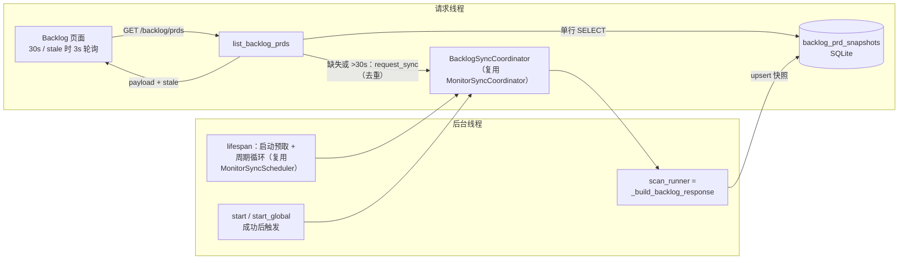
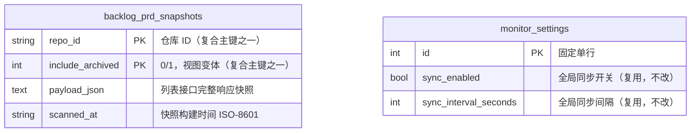

# PRD: Backlog 列表本地快照秒开与后台自动刷新（Phase 1）

- GitHub Issue: https://github.com/ZataZhang/keda/issues/246

> ✅ **交付前置**：无，可立即开工。
> 结构化声明见 §8 Delivery Dependencies，**那里是唯一事实源**。

> 🧍 **验收状态**：待人工验收（执行侧已完成：§9 除 Human-Confirmed 外全部勾选或标注 runner-owned 门禁；独立 verifier 由 runner 执行）。
> 本行是 §9 Acceptance Checklist 的投影，**那里是唯一事实源**。

本文档分两个高度：**Part A（§1–§4）** 给人看，用来确认"要不要做、做成什么样"，不含实现细节；**Part B（§5–§13）** 给执行者看，包含机制、改动树与验证命令。

## Feature Overview (功能一览)

> 本块是 §10 Functional Requirements 的通俗投影，不是第二事实源；行为验收以 §1 行为样例表为准。

- **列表秒开**（FR-1）：Backlog 页打开或切换仓库时，PRD 列表立即从本地持久化快照渲染，不再等待逐个 PRD 的 GitHub 实时查询；console 重启后快照仍然有效。
- **过期自动更新**（FR-2、FR-5）：返回的数据带有"是否过期"与"数据截至时间"标记；数据过期时后台自动重扫，界面先显示旧数据并标注"后台更新中"，几秒内自动换成新结果。
- **启动预取与周期刷新**（FR-3）：console 启动时为所有启用仓库预建快照，之后按已有的全局同步设置周期保持新鲜（默认 5 分钟，可在 dashboard 同步设置里关闭或调整）。
- **操作后立即重扫**（FR-4）：点"开始"或"全局开始"后，该仓库立刻触发一次后台重扫，列表尽快反映新状态。
- **首次使用与失败兜底**（FR-6）：全新环境没有快照时显示"正在同步"空态并自动补数据；后台同步失败时旧数据保留不清空。
- **单一缓存机制**（FR-7）：现有 30 秒内存缓存被快照机制取代，不再维护两套缓存。
- **其余接口语义不变**（FR-8）：PRD 详情、证据、CI/CD、Autopilot 接口保持每次实时读取；所有写接口契约不变，响应只增加字段不删减字段。

# Part A · 人审层 (Review Layer)

## 1. Introduction & Goals

### Problem Statement

打开 console 的 Backlog 页（`/app/backlog/`）或切换左侧仓库时，PRD 列表要等几十秒才出现。原因是列表接口在返回前要对每个 pending PRD 串行查 4~5 次 GitHub API（Issue 详情、评论流、合并检索、PR 上下文，见 `resolve_backlog_states` 的逐条循环）；以 3 个 PRD 计约 12~16 次串行 HTTPS 往返，叠加代理网络延迟就是 30 秒以上。现有 30 秒内存缓存只对"30 秒内的重复请求"有效，冷访问（首次进入、切换仓库、重启后）必然全量重扫。页面同时每 30 秒轮询一次，一旦缓存过期就会反复付出同样的等待。用户的目标是：点开就能看到数据（1 秒内），新鲜度由后台异步保证。

### Interpretation (解读回显)

**行为样例**（下表每一行都会逐字变成验收标准，改一个单元格就是改验收条件）：

| 验证方式 | 输入 / 操作 | 期望观察到的结果 |
|---|---|---|
| 👀 人审 + 自动验证 | console 重启后立刻打开 Backlog 页（该仓库此前已同步过） | 1 秒内渲染出 PRD 列表（来自本地快照，无需等 GitHub）；页面显示"数据截至 HH:MM" |
| 👀 人审 + 自动验证 | 停留页面时快照数据超过 30 秒后发生刷新周期 | 页面先继续显示旧数据并出现"后台更新中"提示；几秒内数据自动替换为最新扫描结果，提示消失；全程无需手动刷新 |
| 👀 人审 + 自动验证 | 全新环境（本地从无快照）首次打开 Backlog 页 | 显示"正在同步"空态（不报错、不白屏）；首次扫描完成后列表自动出现 |
| 🤖 自动验证 | 点击某 PRD 的"开始"（或"全局开始"）成功后 | 该仓库立即触发一次后台重扫（同仓库重复触发不叠加）；下一次列表读取能拿到反映新状态的扫描结果 |
| 🤖 自动验证 | 后台重扫期间 GitHub 不可达（失败情况） | 列表接口仍返回上一份快照（带过期标记），数据不被清空；下个周期自动重试 |
| 🤖 自动验证 | 快照内容损坏（合法 JSON 但不是列表接口的结构）（边界情况） | 视同"没有快照"：返回空态并触发重建，坏数据不下发给前端 |
| 🤖 自动验证 | 仓库在注册表中被禁用或删除（边界情况） | 列表接口维持现状返回 400；该仓库的历史快照不得重新出现在任何页面 |

**我默默定了这些**（没有逐一请示、直接定了的解读）：

- 快照存在 console 现有的本地 SQLite 库里（与 dashboard 快照同库同模式），不新增文件格式、不新增配置项。
- 后台周期刷新的开关与间隔**复用 dashboard 已有的全局同步设置**（默认 5 分钟，可在 dashboard 设置里调整或整体关闭），不给 Backlog 单独加一套设置 UI。
- "数据过期"的判定阈值沿用现有 30 秒；快照再旧也**立即返回**，只是带上过期标记并触发后台重建。
- 周期预扫只为默认视图（不含已归档）建快照；勾选"显示已归档"的视图第一次访问时按需构建，之后同样秒开。
- 现有 30 秒内存缓存**删除**，由快照机制取代——不养两套缓存。
- 前端在数据过期期间把轮询间隔临时缩短到 3 秒，拿到新鲜数据后恢复 30 秒；其余页面行为不变。
- 逐个 PRD 的 GitHub 查询次数优化（跳过 open Issue 的评论/合并检索）**不在本 PRD**，是独立的后续优化。

**我理解为不做**（你可能想要、但本 PRD 排除的）：

- 不做减少 GitHub 调用量的状态解析瘦身（Phase 2 独立 PRD；本 PRD 只改变"什么时候扫"，不改变"扫什么"）。
- 不做逐 PRD 增量更新（每个刷新周期仍是全量扫描）。
- 不做 WebSocket 实时推送（仍用轮询，保持现有架构）。
- 不改 PRD 详情、验收证据、CI/CD、Autopilot 等点击时加载的接口——它们本来就是即点即查的实时读取。

**文字版解读**：本需求读作"把 Backlog 列表的数据源从'请求时等待实时扫描 GitHub'切换为'立即返回本地持久化快照，快照由启动预取、周期刷新、按需触发和操作后触发共同维护'"，而**不是**"给现有实时扫描再加一层更快的缓存"或"改变扫描的内容与范围"。边界：快照必须进程重启后仍在；过期或缺失的快照不得阻塞请求路径；同步失败不得清除已有快照；详情类接口的实时语义保持不变；非目标见 §11。

### What The User Gets

打开 Backlog 页或切换仓库时立即看到上一次同步的 PRD 队列（秒级），页面上能看到数据是什么时候同步的、是否正在更新；后台按既有节奏自动保持数据新鲜，任何一次"开始"操作都会尽快反映到列表上；网络不好或 GitHub 不可达时，页面照常显示旧数据而不是转圈或报错。

### Measurable Objectives

- 快照存在时，`GET /api/v1/agent-runner/backlog/prds` 的本地响应时间 < 500ms（对比当前冷访问数十秒），前端首屏数据在 1 秒内就绪。
- console 进程重启后，无需任何网络请求即可渲染上一次的列表数据。
- 后台重扫进行期间，列表接口的响应时间不随 GitHub 延迟波动（重扫只发生在后台线程）。
- 重扫失败时旧快照原样保留（响应数据不为空、不被清场）。
- "开始"操作成功后，列表在下一次轮询（数据过期时 ≤3 秒，否则 ≤30 秒）内反映新扫描结果。

## 2. Human Review Map (介入与风险地图)

本次需要人工确认的只有两项，其余全部由执行者 + 自动化门禁覆盖。

### 决策一：本地库新增一张 Backlog 快照表

列表数据要"重启后仍在、随时秒读"，就必须落到本地 SQLite（console 现有本地库）。这会给数据库加一张表：按"仓库 + 视图（是否含已归档）"存一份列表接口的完整响应快照和同步时间。风险很低但有取舍：快照里保存的是上次扫描的结果，接受它就接受了"页面显示的可能是几十秒前（极端情况下重启前）的数据，而不是此刻的实时值"——这正是"秒开"的代价，且页面会如实标注数据截至时间。表结构见 §7 ER 图。

**请确认：** 同意为 Backlog 列表在本地库新增这张快照表（表只增不改，不影响任何现有表和数据）？

**验收：** console 重启前后打开 Backlog 页都能看到同一份列表数据；对快照记录的读写不触碰既有表（有迁移与隔离测试证明）。

### 决策二：列表接口从"等扫完再返回"改为"先返回快照、后台再更新"

这是本次的核心契约变化。今天接口承诺"返回的数据不超过 30 秒旧"；改后承诺变为"立即返回上次同步的完整数据 + 如实的过期标记，更新在后台进行"。意味着：页面上的状态徽章（就绪/进行中/待审等）和"开始"按钮的可用性可能短暂基于旧数据（窗口通常只有几秒，直到后台重扫落地）。作为补偿，接口与页面都会显式给出"数据截至 HH:MM"与"后台更新中"标记，让陈旧可见而不是伪装实时。所有写接口（开始/全局开始/停止/设置）行为不变；PRD 详情、证据、CI/CD、Autopilot 接口保持实时读取不变。

**请确认：** 接受"列表数据可能短暂陈旧但即时可见 + 陈旧状态显式标注"这一契约变化？

**验收：** 带快照的请求 1 秒内返回且带过期标记；触发后台重扫后页面自动更新为新数据；陈旧窗口内页面明确显示"后台更新中"，不会把旧数据伪装成实时值。

### 自动门禁，不需要逐项人工审阅

调度器生命周期（随应用启停、有界关闭）、写操作后的重扫触发、损坏快照的空态降级、失败保留旧快照、注册表禁用仓库的隔离，全部由单元/集成测试与既有 lint、架构检查覆盖；前端轮询节奏与提示由既有 Playwright e2e 场景覆盖。

### 本次明确不涉及

不新增任何配置项或设置 UI（复用 dashboard 全局同步设置）；不改数据库既有表结构；不改 GitHub 扫描的内容与调用量（状态解析瘦身是后续独立 PRD）。

## 3. Usage And Impact After Implementation

- **console 用户（Backlog 页使用者）**：入口不变（`/app/backlog/`），打开即见列表；新增"数据截至 HH:MM / 后台更新中"提示与首次使用的"正在同步"空态。"开始 / 全局开始 / 停止全局调度 / 显示已归档 / 视图切换"操作与今天一致。
- **console 用户（Dashboard 页使用者）**：行为不变；全局同步设置的开关与间隔现在同时约束 dashboard 与 Backlog 的后台刷新节奏（设置页 UI 无需改动，说明文案由本次交付顺带补充）。
- **API / 脚本调用方**：`GET /agent-runner/backlog/prds` 响应为纯增量变化——新增 `stale` 字段（布尔），`scanned_at` 在无快照时为 `null`；既有字段、状态枚举与写接口请求体完全不变，旧调用方不需修改。
- **daemon / CLI 执行链路**：不经过本次改动的读路径，行为不变。

## 4. Requirement Shape

- **Actor**：console 用户（Backlog 页与 Dashboard 页）；直接调用 backlog HTTP API 的脚本；后台同步循环（系统自身）。
- **Trigger**：用户打开/刷新 Backlog 页或切换仓库；console 进程启动；全局同步周期到期；用户执行"开始 / 全局开始"；快照缺失或过期。
- **Expected behavior**：列表读请求立即返回本地快照（缺失时返回空态）；快照缺失或超过 30 秒即触发对应仓库的后台重扫（同仓库同视图去重，不阻塞请求）；重扫结果写回快照供下一次读取；启动时为所有启用仓库预建快照并周期刷新；失败保留旧快照。
- **Scope boundary**：仅覆盖 Backlog 列表读路径与其后台刷新；详情/证据/CI/Autopilot 实时接口、写接口契约、GitHub 扫描内容均不在范围内。

# Part B · 执行器层 (Build Layer)

## 5. Repository Context And Architecture Fit

**Existing Path（最贴近的现有代码路径）**：dashboard 已交付过同构机制（归档 PRD `tasks/archive/P1-PERF-20260916-102117-iar-console-dashboard-snapshot-sync.md`，PR #143）：SQLite 快照表（`monitoring_snapshots` / `monitor_settings`）+ `MonitorSyncScheduler` 周期循环（FastAPI lifespan 启停）+ `MonitorSyncCoordinator` 按仓库去重 + 前端轻轮询。本次把同一模式套用到 Backlog 列表。

**Reuse Candidates（直接复用）**：

- `backend/core/use_cases/monitor_snapshots.py` 的 `MonitorSyncScheduler` 与 `MonitorSyncCoordinator`——两者已通过注入解耦（settings_reader / repo_id_provider / scan_runner 均为可调用对象），可原样实例化第二套，不需要新写调度器。
- `backend/api/monitor_sync.py` 的生命周期接线模式（进程级单例 + lifespan 启停 + wake）；`_read_monitor_settings`、`_list_enabled_repo_ids` 可直接导入复用。
- `backend/api/routes/agent_runner_backlog.py` 的 `_build_backlog_response(repo_id, include_archived)`——快照的构建函数就是它，扫描逻辑零改动。
- `backend/infrastructure/persistence/console_store.py` 的表定义与 upsert/list 方法模式。
- 前端 `frontend-public/app/(app)/app/dashboard/page.tsx` 的 15 秒轻轮询与"上次同步"展示模式；`tests/playwright-e2e/tests/smoke/backlog-*.spec.ts` 现成场景。

**Architecture Constraints**：四层依赖方向 `api -> core -> engines -> infrastructure` 不得破坏；core 不依赖 FastAPI 与具体 SQLite 实现（调度器/协调器已满足）；路由模块 import 不得产生线程或 I/O 副作用，后台线程只能由 lifespan 启停（`app.py` 现有注释明确此纪律）。

**Frontend Impact**：`frontend-public`（Next.js）。最近路由 `app/(app)/app/backlog/page.tsx`，API client `lib/api/backlog.ts`，类型 `lib/api/types.ts`。改动：响应类型加 `stale` 字段、按 stale 自适应轮询（3s/30s）、"数据截至 / 后台更新中 / 正在同步"提示。无新页面、无新组件树。

**Existing PRD Relationship**：`tasks/pending/` 仅有一份无关 PRD（kc skill 重装入口），无重复、无依赖；归档 PRD #143 是机制前驱但不构成本次的执行前置（代码已在 main）。§8 记 `none`。

**Potential Redundancy Risks**：最容易犯的冗余是"保留 _BACKLOG_CACHE 再叠加快照"形成双层缓存，以及为 Backlog 复制一份 Scheduler/Coordinator 类而不是实例化复用——两者都被 §6 推荐方案明确排除。

## 6. Recommendation

**Recommended Approach**：复用 dashboard 快照同步模式——新增一张 `backlog_prd_snapshots` 表 + 一个薄的 core 读写模块 + api 层接线（第二套 Coordinator/Scheduler 实例），列表读路径改为"读快照、缺失/过期即后台触发重扫"，删除内存缓存。

**为什么最适合当前架构**：调度、去重、生命周期、存储模式全部有已验证的先例，本次只新增"backlog 版"的接线与读写；`_build_backlog_response` 原样成为快照构建器，扫描语义零漂移。

**拒绝冗余抽象的理由**：不为 Backlog 新写调度器类（现有类注入即可）；不引入 JSON 文件等第二存储（SQLite 已在）；不加配置项（复用全局同步设置）；不做 WebSocket（轮询已满足）。

**可移除/合并的既有路径**：`_BACKLOG_CACHE` / `_BACKLOG_CACHE_TTL_SECONDS` / `_cache_lock` / `_get_cached_backlog_response` 整体删除（其"30 秒 TTL"语义由快照 stale 判定继承）。

### Proposed Solution Summary (实现机制)

- **核心机制**：列表响应以 `(repo_id, include_archived)` 为键持久化到 SQLite `backlog_prd_snapshots` 表；读路径 = 单行 SELECT + stale 判定（>30s 视为过期），完全不做网络调用。
- **谁提供输入**：快照内容由既有的 `_build_backlog_response` 在后台线程构建；同步节奏由用户在 dashboard 既有设置里给出的全局 `sync_enabled` / `sync_interval_seconds` 控制，系统只消费、不推断配置。
- **接入点**：新 core 模块 `backlog_snapshots.py`（persist / get / stale 判定，依赖新增的窄端口 `IBacklogSnapshotStore`）；新 api 模块 `backlog_sync.py`（进程级 Coordinator + Scheduler 接线，镜像 `monitor_sync.py`）；`app.py` lifespan 增加一对启停调用。
- **主要行为变化**：`GET /agent-runner/backlog/prds` 从"构建后返回"变为"快照立即返回 + 后台刷新"，响应新增 `stale` 字段；`start_prd` / `start_global` 把"弹内存缓存"改为"触发该仓库后台重扫"；启动首圈为所有启用仓库幂等补扫（预取），之后每周期全量刷新 pending 变体，archived 变体按需构建（协调器任务键用 `repo_id::archived` 复合键区分变体）。
- **刻意不做的复杂度**：无新配置面、无双缓存、无增量 diff、无推送通道、扫描逻辑零改动。

**Alternatives Considered**：仅做后台线程定期重建内存缓存（不落盘）——实施更小，但 console 重启后冷访问仍要等一次全量扫描，且与 dashboard 的持久化模式分叉，形成两套语义；否决。

## 7. Implementation Guide

> This section is a living implementation guide based on current repository analysis. If implementation discovers additional affected files, hidden dependencies, edge cases, or a better path, update this PRD before proceeding.

### Core Logic

读路径（请求线程）：`list_backlog_prds` → `_resolve_context(repo_id)`（保留，禁用/未知仓库仍 400）→ `get_backlog_snapshot(store, repo_id, include_archived)`（SQLite 单行读，损坏/形状不符视同缺失）→ 计算 `stale = snapshot is None or age > 30s` → 若 stale 调 `coordinator.request_sync(task_key)`（非阻塞、去重）→ 返回 payload + `stale`。

写路径（后台线程）：`request_sync` → scan_runner → `_build_backlog_response(...)` → `persist_backlog_snapshot(...)` upsert。失败只记日志与任务状态，不动旧快照。

调度路径（lifespan 线程）：`BacklogScheduler = MonitorSyncScheduler(coordinator=backlog_coordinator, settings_reader=复用全局 monitor 设置读取, repo_id_provider=启用仓库列表, missing_repo_id_provider=无 pending 变体快照的启用仓库)`。首圈幂等补扫（=启动预取），之后每周期对全部启用仓库重扫 pending 变体。`sync_enabled=False` 时既不预取也不周期刷新，但读路径的按需触发仍工作（保证页面不会永远停在空态）。

操作触发：`start_backlog_prd` / `start_backlog_global` 成功后调 `request_sync(repo_id)`（替换现有 `_BACKLOG_CACHE.pop`）。

任务键约定：pending 变体 = `repo_id`；archived 变体 = `f"{repo_id}::archived"`；scan_runner 解析复合键选择 `include_archived`。协调器按键去重，天然防止同仓库重复扫描。

### Change Impact Tree

```text
src/backend/core/shared/interfaces/runner_console.py [修改]
【总结】新增 BacklogSnapshotEntry 数据类与 IBacklogSnapshotStore 窄端口（upsert/get/list）。
    ├── [新增] BacklogSnapshotEntry(repo_id, include_archived, payload_json, scanned_at)
    └── [新增] IBacklogSnapshotStore ABC（镜像 IMonitorSnapshotStore 形状）
src/backend/infrastructure/persistence/console_store.py [修改]
【总结】新增 backlog_prd_snapshots 表（CREATE TABLE IF NOT EXISTS）与端口实现。
    ├── [新增] 表 DDL：repo_id + include_archived 复合主键、payload_json、scanned_at
    └── [新增] upsert_backlog_snapshot / get_backlog_snapshot / list_backlog_snapshots
src/backend/core/use_cases/backlog_snapshots.py [新增]
【总结】快照读写与过期判定的 core 编排：persist（唯一写入口）、get（损坏视同缺失）、STALE_TTL_SECONDS=30、task_key 复合键约定。
src/backend/api/backlog_sync.py [新增]
【总结】api 层接线：进程级 Coordinator/Scheduler 单例、scan_runner（构建+持久化）、ensure_fresh（读+按需触发），镜像 monitor_sync.py 的生命周期纪律。
src/backend/api/app.py [修改]
【总结】lifespan 中与 monitor 调度器并列增启停 backlog 调度器（有界 join）。
src/backend/api/routes/agent_runner_backlog.py [修改]
【总结】读路径改为快照优先；删除 _BACKLOG_CACHE 全家；start 两个写端点改为触发后台重扫。
    ├── [修改] list_backlog_prds → ensure_fresh 快照读 + stale 字段
    ├── [删除] _BACKLOG_CACHE / _BACKLOG_CACHE_TTL_SECONDS / _cache_lock / _get_cached_backlog_response
    └── [修改] start_backlog_prd / start_backlog_global 的缓存失效 → request_sync
frontend-public/lib/api/types.ts [修改]
【总结】backlog 列表响应类型新增 stale: boolean；scanned_at 允许 null。
frontend-public/lib/api/backlog.ts [修改]
【总结】fetchBacklogPrds 返回类型同步 stale 字段。
frontend-public/app/(app)/app/backlog/page.tsx [修改]
【总结】自适应轮询（stale 时 3s，fresh 恢复 30s）+「数据截至/后台更新中/正在同步」提示。
tests/test_backlog_snapshots.py（实际落点；仓库测试平铺在 tests/，无 tests/backend/ 目录）[新增]
【总结】快照读写、损坏降级、stale 判定、调度首圈补扫、失败保留旧快照的单元/集成测试。
tests/playwright-e2e/tests/smoke/backlog-realistic.spec.ts（或新增 spec）[修改]
【总结】补 stale→fresh 自动更新与「数据截至」提示的 e2e 断言。
```

以 `rg -n "_BACKLOG_CACHE" src/` 与 `rg -n "monitor_sync|MonitorSyncScheduler" src/backend/api` 为锚点定位；上表是起点而非穷举。

### Risk Classification Register

| change point | tier | decisive dimension/override | intervention | oracle/gate |
|---|---|---|---|---|
| 新增 `backlog_prd_snapshots` 表（schema 变化，固定区域） | R2 | 持久状态 + schema 固定区 override | 人工确认（§2 决策一） | rv-2（含 negative control） |
| 列表读路径契约变化（快照 + stale 标记） | R2 | 跨组件契约 + 数据新鲜度正确性 | 人工确认（§2 决策二） | rv-1 / rv-3（含 negative control） |
| `backlog_sync.py` 调度器接线与 lifespan 启停 | R1 | 单组件行为，镜像已验证模式 | 执行器 + 自动门禁 | rv-4 |
| 写端点失效方式替换（触发重扫） | R1 | 单组件行为，有明确测试预言 | 执行器 + 自动门禁 | rv-5 |
| 损坏快照降级与失败保留旧快照 | R1 | 单组件失败语义 | 执行器 + 自动门禁 | rv-6 / rv-4 |
| 前端自适应轮询与新鲜度提示 | R1 | 单页面展示/轮询节奏 | 执行器 + 自动门禁 | rv-7 |
| 删除 `_BACKLOG_CACHE` | R1 | 局部、可逆、编译期可见 | 执行器 + 自动门禁 | rg 断言无残留 + 全量测试 |

R2/R3 全链 oracle 共 2 个，未超上限。

### Flow / Architecture Diagram



### ER Diagram



仅新增一张表；`monitor_settings` 为既有表，此处只展示复用关系。无其他数据模型变化。

### Realistic Validation Plan

```yaml
- id: rv-1
  behavior: 快照存在时，console 重启后打开 Backlog 页 1 秒内渲染列表并显示"数据截至 HH:MM"
  reviewer: human
  real_entry: "启动 console（iar console，见下方 triage 说明）后浏览器打开 http://127.0.0.1:8314/app/backlog/ 并选中已有快照的仓库"
  expected: "首屏列表来自本地快照（网络面板无对 GitHub 的等待），从导航到列表可见 ≤1s，头部可见数据截至时间"
  mock_boundary: "GitHub/gh CLI 不 mock——重扫在后台真实发生；被测边界是读路径本身，只要求它不等待网络"
  tier: R2
  test_layer: manual
  required_for_acceptance: true
  presentation: "真实入口录屏或截图：重启 console → 打开页面到列表可见的全过程，含『数据截至』时间戳特写；附 ~10 秒自检：刷新页面，列表立即出现且时间戳不变化"
  critical_value_source: "列表接口响应体（prds 数组、scanned_at、stale 字段）由后端 SQLite 快照原样返回"
  must_cross: "浏览器 → console HTTP API → SQLite 快照读 → 前端渲染"
  forbidden_bypasses: "不得在前端用 localStorage/内存残存数据冒充快照；不得在请求线程内联触发扫描后返回"
  fresh_state_probe: "console 进程完全重启（快照内存态清零）后首次请求的响应即为新鲜证据"
  final_tree_evidence: "证据在交付分支最终 tree 上重采：重启 console 重录一遍首屏"
  negative_control: "删除该仓库快照行后同路径请求：预期返回空 prds + stale=true + scanned_at=null 的『正在同步』态，而不是秒出列表"
  expected_fail: "若实现仍在请求线程内联等待扫描，首屏耗时回到数十秒且无 stale 标记——rv-1 变红"
- id: rv-2
  behavior: 快照持久化跨进程重启有效，且新表不影响既有表
  reviewer: verifier
  real_entry: "CI=true just test all（含新增 tests/test_backlog_snapshots.py：upsert→新 store 实例读回→一致）"
  expected: "upsert 后用全新 store 实例（模拟重启后进程）能读回相同 payload；既有表读写测试全绿"
  mock_boundary: "SQLite 用真实临时库文件（store 现有测试模式），GitHub 不参与"
  tier: R2
  test_layer: integration
  required_for_acceptance: true
  critical_value_source: "store 层 upsert 的 payload_json 与 scanned_at 为唯一事实源"
  must_cross: "core persist → console_store SQLite 落盘 → 新 store 实例读回"
  forbidden_bypasses: "不得用内存 dict 假 store 代替 SQLite 断言持久性；不得复用同一连接实例伪装重启"
  fresh_state_probe: "以新打开的 SQLite 连接/新 store 实例读回为准"
  final_tree_evidence: "测试随交付分支合入，最终 tree 上 CI 全绿"
  negative_control: "向表中写入非法 JSON 后读取：预期 get 视同缺失返回 None（此即失败形态），断言不得抛错或返回坏数据"
  expected_fail: "若持久化缺失（仅内存缓存），新实例读回为 None——测试红"
- id: rv-3
  behavior: 列表接口立即返回且过期时携带 stale 标记并触发后台重扫
  reviewer: verifier
  real_entry: "pytest 集成测试：FakeAPI app 挂载真实路由 + 假 scan_runner（计数探针），先 persist 一份 >30s 的旧快照再 GET /api/v1/agent-runner/backlog/prds"
  expected: "响应 <500ms、stale=true、scanned_at 为旧值；scan_runner 探针被调用恰好一次（重复 GET 去重）"
  mock_boundary: "仅 scan_runner 用假实现（避免真 GitHub）；路由/存储/stale 判定全真"
  tier: R2
  test_layer: integration
  required_for_acceptance: true
  critical_value_source: "响应的 stale/scanned_at 与快照表 scanned_at 一致；重扫计数来自 scan_runner 探针"
  must_cross: "HTTP GET → 路由 → 快照读 → stale 判定 → 协调器触发"
  forbidden_bypasses: "不得绕过路由直接调内部函数断言；不得让测试等待真实扫描完成（非阻塞语义本身是被测项）"
  fresh_state_probe: "重扫完成后再次 GET（persist 新快照）应 stale=false"
  final_tree_evidence: "测试随分支合入，最终 tree 上重跑"
  negative_control: "将 stale 判定阈值人为置 0 断言必为 stale / 或移除触发调用后探针计数为 0——两向均可红"
  expected_fail: "若接口仍内联构建响应，GET 耗时不受控且探针在响应前被同步调用——测试红"
- id: rv-4
  behavior: console 启动预取：为所有启用仓库的 pending 变体补建快照
  reviewer: verifier
  real_entry: "pytest：实例化 MonitorSyncScheduler（backlog 接线），missing_repo_id_provider 返回两个仓库，start 后轮询等待，断言两仓库快照行出现"
  expected: "首圈为每个缺失快照的启用仓库各触发一次扫描（去重），快照落库；sync_enabled=false 时不触发"
  mock_boundary: "scan_runner 假实现；调度循环与协调器为真实类"
  tier: R1
  test_layer: integration
  required_for_acceptance: true
- id: rv-5
  behavior: 同步失败时旧快照原样保留
  reviewer: verifier
  real_entry: "pytest：persist 一份旧快照 → scan_runner 抛异常触发重扫 → GET 仍返回旧 payload 且 stale=true"
  expected: "响应数据与旧快照逐字段一致，不为空；错误只进日志/任务状态"
  mock_boundary: "scan_runner 假实现抛异常；存储与读路径为真"
  tier: R1
  test_layer: integration
  required_for_acceptance: true
- id: rv-6
  behavior: start 动作触发该仓库立即重扫（替换原缓存失效语义）
  reviewer: verifier
  real_entry: "pytest：调 POST /agent-runner/backlog/prds/{path}/start（start 用例注入假依赖）后断言协调器收到该仓库的 request_sync（探针计数）"
  expected: "start 成功后扫描请求恰好一次；不再存在 _BACKLOG_CACHE 引用"
  mock_boundary: "start 用例既有假依赖（supervisor/runner/github）沿用；被测边界是失效触发"
  tier: R1
  test_layer: integration
  required_for_acceptance: true
- id: rv-7
  behavior: 前端在 stale 时短轮询自动更新并显示新鲜度提示
  reviewer: human
  real_entry: "cd tests/playwright-e2e && npx playwright test backlog（扩展既有 backlog e2e：route mock 返回 stale=true 再返回 fresh，断言 3s 内二次请求与提示切换）"
  expected: "页面先显示『后台更新中 + 数据截至』，收到 fresh 响应后提示消失、列表更新；无快照场景显示『正在同步』空态"
  mock_boundary: "route mock 仅 mock 列表 API 的时序（这是被测的轮询契约本身）；渲染与轮询逻辑为真"
  tier: R1
  test_layer: e2e
  required_for_acceptance: true
  presentation: "e2e 运行录制或两帧截图（stale 态与 fresh 态），标注提示文案差异；~10 秒自检：本地 console 打开 Backlog 页观察提示出现又消失"
```

失败排查入口：先看 `src/backend/api/backlog_sync.py` 的 scan_runner 是否抛异常（日志 `Backlog sync failed`），再查快照表 `scanned_at` 是否为空——空表 + stale=true 说明首圈预取没跑或被 `sync_enabled=false` 挡住；`iar console` 的启动命令与端口以 `src/backend/api/cli_typer_app.py` 的 console 子命令为准（会话内启动注意清掉 `SERVER__PORT` 环境变量）。

### Low-Fidelity Prototype

改动是既有页面上的小状态提示，走聚焦低保真路径（ASCII 线框），不新建交互式原型文件：

```text
┌─ Backlog ────────── ☐ 显示已归档 ── 视图：依赖图 ── 3 个 PRD ────────────────┐
│  数据截至 14:32:05 · 后台更新中…      ← stale 态；fresh 态仅显示「数据截至 HH:MM:SS」 │
│ ┌──────────────┐ ┌──────────────┐ ┌──────────────┐                          │
│ │ PRD 卡片（现状不变，含状态徽章/依赖）      │ …                                      │
└──────────────────────────────────────────────────────────────────────────┘
无快照首访：画布区显示居中「正在同步…」空态 + 骨架占位，不出现错误样式。
```

验收关键状态两个：stale 态（提示可见）与 fresh 态（提示消失/仅时间戳）；无快照空态一个。PR 呈递时以真实实现截图配对。**豁免说明**：不新建交互式原型——无布局/交互结构变化，仅状态文本与轮询节奏，真实入口截图足以承载对比。

**No interactive prototype file changes in this PRD.**

### External Validation

No external validation required; repository evidence was sufficient.

## 8. Delivery Dependencies

### Delivery Dependencies

- Depends on tasks/issues:
  - none
- Gate type: none
- Sequence: via-main
- Notes: dashboard 快照同步（已归档 PRD #143）是机制前驱，其代码已在 main，不构成执行前置；状态解析瘦身（Phase 2）是本 PRD 的后续独立工作，非依赖。

## 9. Acceptance Checklist

### 9.1 人读呈递区（Human Review Surface）

| 观察点 | 呈递物 | 10 秒自检 |
|---|---|---|
| 重启 console 后打开 Backlog 页 1 秒内见列表 + "数据截至 HH:MM"（rv-1） | 真实入口截图 `tasks/evidence/P1-PERF-20261008-161246-backlog-list-snapshot-swr/rv-1-first-paint.png`（实测首屏 127ms、快照读 12ms，验收阈值 ≤1s / <500ms，毫秒数随采集当次机器负载浮动；另有刷新自检帧 rv-1-reload-same-timestamp.png、负控制帧 rv-1-negative-control-no-snapshot.png） | 刷新页面，列表立即出现且时间戳不变 |
| 数据过期时页面显示"后台更新中"并自动更新（rv-7） | e2e 两帧截图 `rv-7-stale-fresh.png`（上帧 stale 含「后台更新中」/ 下帧 fresh 提示消失；单帧 rv-7-stale.png / rv-7-fresh.png / rv-7-no-snapshot.png） | 本地 console 停留 Backlog 页，观察提示出现又消失 |

刻意不呈递的 verifier 组：快照持久化/接口契约/预取/失败保留/start 触发的自动化测试结果（rv-2～rv-6），全部为机器断言，仅在失败时上报。

### 9.2 Acceptance Evidence Package

按风险分级排序：rv-1（R2，人审决策二）→ rv-2（R2，人审决策一）→ rv-3（R2，契约）→ rv-4～rv-6（R1，调度/失败/触发）→ rv-7（R1，前端）。证据文件 `tasks/evidence/<prd-stem>/rv-<n>-<slug>.*`，报告 `<prd-stem>.evidence-report.md` 以人审导航开篇。

### Architecture Acceptance

- [x] 四层依赖保持——`backlog_snapshots.py` 只依赖 `IBacklogSnapshotStore` 端口，不 import FastAPI/SQLite（架构检查 + lint 通过）
- [x] 路由模块 import 无线程/IO 副作用，调度器仅由 `app.py` lifespan 启停（对照 monitor_sync 纪律的测试或检查）

### Dependency Acceptance

- [x] §8 声明 none，交付不引入新的上游依赖或第三方库

### Behavior Acceptance

- [x] rv-1 通过——重启后秒开 + 数据截至可见（证据文件见 §9.2）
- [x] rv-2 通过——快照跨"重启"（新 store 实例）读回一致，既有表不受影响
- [x] rv-3 通过——stale 判定 + 后台触发 + 去重 + fresh 恢复
- [x] rv-4 通过——启动预取为缺失快照仓库补扫，`sync_enabled=false` 时不触发
- [x] rv-5 通过——扫描失败旧快照保留、数据不清空
- [x] rv-6 通过——start 动作触发重扫；`rg -n "_BACKLOG_CACHE" src/` 零命中

### Frontend Acceptance

- [x] rv-7 通过——stale 短轮询 + 提示切换 + 无快照空态；`frontend-public` typecheck/lint 通过

### Documentation Acceptance

- [x] dashboard 全局同步设置的说明文案补充"同时约束 Backlog 后台刷新"（落点：`frontend-public/components/agent-runner/monitor-settings-panel.tsx` 面板文案 + `docs/guides/agent-runner.md`「本地快照与后台刷新」小节）

### Validation Acceptance

- [x] `CI=true just test all` 全绿（含新增测试）
- [x] `just e2e smoke`（backlog 相关 spec）通过
- [x] `rg -n "_BACKLOG_CACHE" src/ tests/` 零命中（旧缓存路径彻底移除）

### Delivery Readiness

- [x] 推荐方案完整实现（快照 + SWR + 预取 + 单一缓存机制），无未决回归
- [~] PR 正文按 pr-evidence-and-merge-acceptance 契约携带 §9.1 呈递内容、verifier 结论与 verified tree 标识；完成消息原文携带 9.1 表格内容 — runner-owned gate: PR 创建与证据评论由 runner 交付

### Human-Confirmed (来自 Part A 风险地图)

- [ ] 决策一：同意为 Backlog 列表在本地库新增 `backlog_prd_snapshots` 快照表（表只增不改，快照数据可能是上次同步而非实时，页面如实标注）
- [ ] 决策二：接受列表接口契约变化——"立即返回快照（可能短暂陈旧）+ 显式过期标记 + 后台更新"，写接口与详情类接口语义不变
- [ ] §9.1 呈递面复核：两个呈递物（首屏秒开录屏/截图、stale→fresh 两帧截图）内容与实际行为一致

## 10. Functional Requirements

- **FR-1**：`GET /agent-runner/backlog/prds` 从本地持久化快照返回数据，请求路径不发生任何 GitHub 网络调用；快照在 console 进程重启后仍然有效。
- **FR-2**：响应新增 `stale` 布尔字段；快照缺失或构建时间超过 30 秒时 `stale=true`，且该判定与是否触发后台重建解耦（返回不等待重建）。
- **FR-3**：console 启动时为所有启用仓库的 pending 变体幂等补建快照；之后按全局同步设置（`sync_enabled` / `sync_interval_seconds`，复用 dashboard 现有设置）周期刷新；设置关闭时无任何周期扫描，但读路径的按需触发仍生效。
- **FR-4**：`start_prd` / `start_global` 成功后立即为对应仓库触发一次后台重扫；同仓库同视图的并发扫描请求去重，不重复扫描。
- **FR-5**：`include_archived=true` 变体按需构建并同样持久化；构建期间该变体请求返回空态 + `stale=true`。
- **FR-6**：后台扫描或写库失败时旧快照原样保留；快照 JSON 损坏或形状不符时视同缺失（空态 + 触发重建），不得把坏数据下发给前端；已禁用/已删除仓库的快照不得出现在任何响应中（列表接口对该类仓库维持 400）。
- **FR-7**：现有 `_BACKLOG_CACHE` 内存缓存及其 TTL 逻辑整体删除，读路径只保留快照单一机制。
- **FR-8**：PRD 详情（content/lifecycle/evidence/ci）、Autopilot、设置等端点的 fresh 语义与全部写接口的请求/响应契约保持不变；前端轮询节奏为 stale 时 3 秒、fresh 时 30 秒，页面展示"数据截至 HH:MM"并在 stale 时追加"后台更新中"、无快照时展示"正在同步"空态。

## 11. Non-Goals

- 不减少 GitHub API 调用量（状态解析瘦身——跳过 open Issue 的评论/合并/PR 上下文查询——是 Phase 2 独立 PRD）。
- 不做逐 PRD 增量扫描或基于 updatedAt 的 diff。
- 不做 WebSocket/SSE 推送；维持 HTTP 轮询。
- 不为 Backlog 新增独立设置项或设置 UI（复用全局同步设置）。
- 不改 PRD 详情、证据、CI/CD、Autopilot 端点的读取语义。
- 不支持多实例部署下的快照一致性（console 是单机 127.0.0.1 工具）。

## 12. Risks And Follow-Ups

- **陈旧数据窗口**：页面状态徽章与按钮可用性可能基于旧快照（通常几秒内被后台重扫覆盖）。已用显式"数据截至 / 后台更新中"标注缓解；若某仓库被外部工具（如直接在 GitHub 上）改了标签，最长陈旧时间为同步间隔（默认 5 分钟）+ 一次重扫时长。跟进：若实测不可接受，把该仓库的同步间隔单独调小或提前做 Phase 2 瘦身让重扫变快。
- **GitHub 配额**：周期刷新使调用量 ≈ 启用仓库数 × pending PRD 数 × ~4 次调用 / 同步间隔；默认 5 分钟、8 仓库规模约 2k 次/小时，低于配额但非零。缓解：dashboard 全局同步开关可直接关闭周期刷新（按需触发仍在）。跟进：Phase 2 瘦身直接把单次扫描调用量降一半以上。
- **归档变体首访空态**：第一次勾选"显示已归档"时该变体快照可能尚未构建，会短暂显示空态后自动填充。属预期行为，不需要跟进。

## 13. Decision Log

| ID | 决策问题 | Chosen | Rejected | Rationale |
|---|---|---|---|---|
| D-01 | 快照存哪里 | console 现有 SQLite 库新增 `backlog_prd_snapshots` 表 | JSON 文件 / 新存储引擎 | 与 dashboard 快照同库同模式，重启存活性与并发读写已有先例 |
| D-02 | 调度与去重如何来 | 实例化复用 `MonitorSyncScheduler` / `MonitorSyncCoordinator` | 新写 backlog 专用调度器 / 并入 dashboard 调度器内 | 两类已通过注入解耦；新写是重复抽象，并入则两个数据域共享一条线程与设置语义，耦合更差 |
| D-03 | 读路径缓存机制 | 删除 `_BACKLOG_CACHE`，快照为唯一机制 | 双层缓存（内存 + 快照） | 双层引入两套 TTL 语义与失效顺序问题，30 秒 TTL 语义已被 stale 判定覆盖 |
| D-04 | 过期判定阈值 | 沿用 30 秒常量 | 更短阈值 / 可配置 | 与现有 TTL 行为一致，无新配置面；实测不满足再调 |
| D-05 | 周期刷新的开关与间隔 | 复用 dashboard 全局同步设置 | Backlog 独立设置项 | 同一用户对"后台刷新节奏"的意图是同一个；省一套 UI 与存储 |
| D-06 | 归档变体的快照策略 | 周期预扫仅 pending 变体，archived 变体按需构建 | 每周期两个变体都扫 | 归档视图访问频率低且构建含本地解析成本；按需 + 持久化后同样秒开 |
| D-07 | 状态解析瘦身是否本次做 | 不做（Phase 2 独立 PRD） | 与快照一起做 | 秒开目标由快照独立达成；瘦身收益是配额与重建速度，独立可验收、可回滚 |

## Change Log

### PRD 创建（初始版本）
- Type: scope
- Before: 无本文档；Backlog 列表为请求时实时扫描 + 30 秒内存缓存
- After: 新建本 PRD，定义快照持久化 + stale-while-revalidate + 启动预取/周期刷新/操作触发的目标状态
- Reason: 冷访问需等待逐 PRD 串行 GitHub 查询 30 秒以上，用户要求 1 秒内可见
- Impact: 新增一张 SQLite 表与三个模块级改动；列表接口响应新增 stale 字段；人审决策两项（§2）
- Review: Part A 待人工确认（Interpretation 与两项决策）

### 交付执行（2026-10-09）
- Type: validation
- Before: §7 rv-1 负控制设计为"gh 快速失败→重扫落不了地"；rv-2 的 real_entry 写 `tests/backend/test_backlog_snapshots.py`；rv-1 real_entry 端口 8314
- After: rv-1 负控制改为"gh 挂起桩（sleep 至客户端 15s 超时）+ 空态持续 8s 复测 + 重扫最终落地恢复探针"；测试实际落点为 `tests/test_backlog_snapshots.py`（仓库测试平铺 tests/，无 tests/backend/ 目录，已回改 §6/§7 两处引用）；rv-1 证据在隔离场景端口 8319 的真实 `kc console` 上采集
- Reason: 实测发现扫描对 gh 失败是降级处理（block_reason），快速失败的假 gh 反而让快照几秒内用磁盘数据重建，空态窗口不可靠；挂起桩才构造出确定的"重建在途"形态。测试路径为 PRD 笔误修正，oracle 语义不变
- Impact: 证据文件 `tasks/evidence/P1-PERF-20261008-161246-backlog-list-snapshot-swr/`（rv-1～rv-7 全量、evidence.json、verification-plan/evidence-report、human-review-checklist.md/.html）；§9 执行侧条目已勾选，横幅翻至 🧍
- Review: 呈递物两张（rv-1 首屏、rv-7 两帧合成）待人工复核（§9 Human-Confirmed）

### 证据最终树重采（2026-10-09）
- Type: validation
- Before: rv-1～rv-7 证据采集于 02:49–03:04；随后 runner 会话重启在 03:16 重写了工作树全部 PR 文件（功能核对一致：全量测试、契约断言与前端产物在重写后均与证据描述相符）；evidence.json item 2 的 stdout 断言误写为 `OVERALL: PASS`（该 harness 的 rv-2 证据文件不含此行）
- After: 全部 7 项证据在最终交付树上重采一遍并仍先负控制变红、后 green 变绿（rv-1 首屏 167ms / 快照读 13ms；rv-2～rv-6 红绿计数与首轮一致；rv-7 负控制 2 failed → green 6 passed）；evidence.json item 2 断言修正为 `VERDICT: green run 全绿 ✓`，item 1 摘要与 evidence-report / human-review-checklist 中的 PID、毫秒数、时间戳同步为新一轮实测值
- Reason: rv-1 的 final_tree_evidence 要求"证据在交付分支最终 tree 上重采"；工作树被会话重启机制触碰后，旧证据文件的时间戳早于树时间，重采消除歧义；断言修正消除一处 manifest 假阳（原 pattern 在证据文件中不存在）
- Impact: 仅证据目录与 §9.1 实测数字一行；本次重采不产生任何代码 diff 改动，oracle 语义与验收判定不变
- Review: 无需人工复核新决策（数字同步不改变任何验收条件）；呈递物两张仍待人工复核

### 证据 manifest 契约修复与全量重跑（2026-10-09）
- Type: validation
- Before: `evidence.json` 把 `risks` 写成字符串数组、`negative_control` 写成对象、`stdout_assertions[].source` 填成证据文件名；item 1/6/7 的 `command` 用 `> file 2>&1` 把输出整体重定向进证据文件；rv-7 负控制用 `git show HEAD:page.tsx` 取改动前实现；rv-2～rv-6 的 harness 只把报告写进文件、不打 stdout。门禁报错 `Item 1: missing or empty required field risks`
- After: 三个字段按解析器契约改为标量（`risks`/`negative_control` 为字符串，`source` 取 `stdout`），7 项全部补齐红→绿断言与"不得出现"反向断言；命令改为 `set -o pipefail; … | tee <证据文件>`（harness 自身同时 print），使门禁复跑的 stdout 可见判定行；item 6 命令串接 `rv6_cache_removal_check.py` 并 `tee -a` 进同一证据文件；rv-7 基线改为随证据目录留存的改动前实现副本 `scripts/rv7_page_baseline.tsx`（并修掉 `$baseline_file`/`$png` 紧跟全角标点触发的 `set -u` 未绑定变量崩溃）；7 项证据在最终 tree 上重跑一遍，数字同步为实测值（rv-1 首屏 127ms / 快照读 11.9ms，rv-7 green 6 passed 11.9s；rv-2～rv-6 红绿计数不变）
- Reason: 门禁复跑发生在 commit proxy **之后**、工作树干净时执行 `bash -lc <command>` 并对**真实 stdout** 断言——`git show HEAD:` 那时已是新实现，负控制会退化成空操作；重定向进文件的输出让 stdout 断言必然失败；字段写成容器类型直接被 `_extract_nonempty_string` 判红
- Impact: 仅证据目录（`evidence.json`、7 项 `rv-*` 证据与脚本）与 §9.1 实测数字一行、三份报告 .md 的数字与命令描述；无任何代码 diff 改动，oracle 语义与验收判定不变
- Review: 无需人工复核新决策（契约修复与重跑不改变任何验收条件）；呈递物两张仍待人工复核
