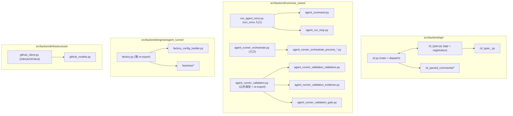

# PRD: 拆分 7 个超 1000 行后端 Python 文件至 ≤800 行（清零行数硬债）

> ✅ **交付前置**：无，可立即开工。
> 结构化声明见 §8 Delivery Dependencies，**那里是唯一事实源**。

> ✅ **验收状态**：实现、证据与独立 verifier 审查均已完成，**待归档**（2026-09-15）。
> 本行是 §9 Acceptance Checklist 的投影，**那里是唯一事实源**。
> 已达成：12 个文件全部落地——7 个目标文件（`cli.py` 251 / `cli_typer.py` 63 / `run_agent_once.py` 638 / `agent_runner_orchestrate.py` 494 / `agent_runner_validation.py` 717 / `factory.py` 128 / `github_client.py` 264）全部 ≤ 800；`settings.py` 1078 → 381（≤ 1000）；`hooks/max_file_lines.allowlist.txt` 条目 1 → 0。
> 证据：`tasks/evidence/P1-REFACTOR-20260705-210702-file-line-split-seven-files/`——rv-1~rv-6 正向 + 负控红→绿闭环齐全；rv-4 覆盖 25 段 help、与拆分前 0 字节 diff；rv-5 拆分前后均 2071 passed；独立 verifier 结论 **PASS**（3 项非阻塞整改已处理）。
> 门禁：`just lint --full` / `just lint --reuse` / `just test all` / `mkdocs build --strict` / `check_architecture.py` 全绿。
> §9 共 20 项已全部勾选并附证据，§13 Final Reconciliation 已填写。
> 需人审留意的两处实现决策见 §13 的 D-08（orchestrate 单一注入中枢，`__all__` 8 → 26）与 D-11（settings 12 个零引用私有名不再导出）。
> 归档动作（`git mv` 到 `tasks/archive/`）未执行：按 `docs/guides/agent-runner.md` 的规定，归档由 runner / 人工独占。

> 本 PRD 分两层，自上而下阅读：
>
> - **Part A · 人审层 (Review Layer)** — 维护者读这部分判断"该不该做、做得对不对"，并通过风险地图知道**哪些地方必须亲自确认**。Part A 不出现实现机制、文件路径、命令。
> - **Part B · 执行器层 (Build Layer)** — 实现者（人或 Agent）读这部分动手。人只在 Part A 风险地图**点名处**下钻审查，其余默认交执行器 + 自动门禁（hook / 测试 / 架构检查）。

---

# Part A · 人审层 (Review Layer)

## 1. Introduction & Goals

### Problem Statement

仓库的 `docs/ai-standards/code-reuse.md` 明确"目标：单个 `.py` 文件非空行少于 500 行"与"上限：新增或重写模块不应超过 800 行"；`CLAUDE.md` Critical Summary 写"单代码文件非空行不超过 1000 行；`just lint` 会对此发出警告"。`hooks/shared/check_max_file_lines.py` 是这条规范的物理实现，对超出 1000 行的文件给出 ERROR，使 CI 必须红色。当前 `src/backend/` 主分支上有 **7 个 `.py` 文件非空行超过 1000 行**——最大的 `run_agent_once.py` 1549 行——直接导致仓库 PR 模板要求的 `just lint` 与 `just lint --full` 在 main 上挂在 `Check max file lines` 这一条，让所有 PR 都"绿灯无法合入"。这不仅是合规意义上的债务，更是"仓库自检门禁把仓库自身挡在 main 之外"的悖论——门禁先于被保护对象本身失能了。

### Interpretation (解读回显)

我把需求读成：**纯结构性重构——把 7 个超长 `.py` 文件拆成多个子模块，目标是每个新文件非空行 ≤ 800 行；对外 import 路径与可观测行为（CLI / HTTP / daemon）逐字节不变；测试集（`just test`）与 `just lint --full` 全绿。拆分以职责为主线，不引入新依赖、新抽象、新存储；优先按"已有相邻 helper 子模块自然延伸"的模式切分，重复模式参考 `src/backend/api/cli_*.py`。** 不读成：趁机抽象 `core/use_cases` 编排层（那是 `P1-REFACTOR-20260703-184226-api-engines-layer-migration.md` 的范围）；把 `engines/agent_runner/` 业务实现搬到别处；改任何对外 CLI / HTTP 契约；或把行数阈值从 1000 改成 2000 来掩盖问题（阈值由 `docs/ai-standards/code-reuse.md` 与 `CLAUDE.md` 共同约束，本 PRD 不动规范层）。——若你想要的是"借机重构编排层"、"放宽阈值"或"将业务挪层"，这条解读就偏了，请纠正（第一次人类触点）。

### What The User Gets

- 仓库的 `just lint --full` 与 CI 的 `Check max file lines` 全绿：`hooks/shared/max_file_lines.allowlist.txt` 的临时豁免单最终清零，所有 `.py` 文件 ≤ 1000 行，新增代码命中 > 800 行被新文件自然拦下。
- 7 个超大文件各自拆成若干聚焦子模块；代码导航（IDE 跳转、grep、test isolation）按职责落到新文件，引用图与之前等价。
- `uv run iar --help`、`uv run iar <subcommand>` 输出与拆分前逐字节一致；HTTP 路由签名 / 响应 schema 不变；daemon 单实例锁、worktree / 标签流转、事件并发顺序与拆分前完全一致。
- `uv run just test` 全绿；`uv run just lint --full` 全绿；架构检查（`hooks/shared/check_architecture.py`）未改动，迁移未触碰。
  - **2026-09-15 更正**：本节与 §5 oracle 表原文写作"严格态仍以 `["infrastructure", "engines"]` 把守"，与 hook 实际配置不符——`FORBIDDEN_IMPORTS["api"]` 实为 `["infrastructure"]`（`api → engines` 是过渡期放宽，见该 hook docstring）。本 PRD 未触碰该配置，措辞错误不影响结论，但已按实测更正。

### Measurable Objectives

- 7 个目标文件全部 ≤ 800 非空行：
  - `src/backend/api/cli.py` ≤ 800
  - `src/backend/api/cli_typer.py` ≤ 800
  - `src/backend/core/use_cases/run_agent_once.py` ≤ 800
  - `src/backend/core/use_cases/agent_runner_orchestrate.py` ≤ 800
  - ~~`src/backend/core/use_cases/agent_runner_validation.py` ≤ 800~~ **已完成（2026-07-31）**：712 非空行
  - `src/backend/engines/agent_runner/factory.py` ≤ 800
  - `src/backend/infrastructure/github_client.py` ≤ 800
- `hooks/shared/max_file_lines.allowlist.txt` 内容清零（条目数从 7 → 0）；新增条目若必要（无法拆分的小窗口）必须配套新审批的拆分子 PRD。
- `uv run just test` 全绿；`uv run just lint --full` 全绿（含架构检查严格态）。
- `uv run iar --help` / `uv run iar run --help` / `uv run iar daemon --help` / `uv run iar loop --help` 输出与拆分前 diff 为空。

## 2. Human Review Map (介入与风险地图)

本节决定注意力如何分配：哪些改动**必须人工确认**，哪些交给**执行器 + 自动门禁**（hook / 测试 / 架构检查）。

**两次人类触点**模型：前置一次（批准 §1 解读 + 本表 oracle）、终点一次（读 §9 证据包）；中间 Agent 自治自验、不打断人。"人工确认" = **高证据负担**（置顶进 §9 证据包、必须有可执行 oracle），不是中途拦你。

判定菜单（逐项对照本次改动是否命中）：

- 固定区域：① Core 业务逻辑 / 编排规则（`core/`）② 数据库结构 / schema / 迁移（即使在 `infrastructure/`）③ 安全 / 鉴权 / 信任边界 ④ 对外 API 契约 / breaking change
- 横切触发器（命中即升级，无视所在层）：⑤ 资金 / 计费 / 额度 ⑥ 不可逆 / 破坏性数据操作（批量删除、回填、降级迁移）⑦ 并发 / 事务 / 幂等性

**命中的人审项**（逐条进下方分级表，需人工确认）：

- ① `core/` 编排职责边界：3 个核心 use_case 文件（`run_agent_once.py` / `agent_runner_orchestrate.py` / `agent_runner_validation.py`）的拆分边界直接决定以后 `core/` 的导航结构——人的判断比自动对半切更稳。
- ④ CLI / HTTP 行为零变化：拆分涉及 `cli.py` 与 `cli_typer.py` 的入口与命令注册，必须保证 `iar` 子命令、参数、`--help` 输出、退出码逐字节不变——判定基准与"行为零变化"证据需人工确认。
- ⑦ daemon 并发调用顺序：`run_agent_once` / `orchestrate` / `validation` 都在 agent runner 的关键路径上（含工作树、issue claim、PR 签核的并发交互），拆分不得引入新的调用顺序变更——人工确认迁移不触碰调用顺序。

**未命中**（默认执行器 + 自动门禁，无需逐行人审）：

- ② ⑤ ⑥ 不涉及：无 schema、无钱、无破坏性数据操作。
- 最坏自检：② 误判→最坏是 facade 落点错层，架构检查（rv-1）会抓；⑤ 误判→不涉钱；⑥ 误判→无破坏性操作，最坏是 import 改错导致启动失败，烟测（rv-3）会抓。

> 清单保持短——只把真正命中的列为人审；本次 3 项。

| 改动点 | 架构层 | 风险 | 介入方式 | 证据 / Oracle（指向 §7.6 oracle 块） |
|---|---|---|---|---|
| `run_agent_once.py` / `agent_runner_orchestrate.py` / `agent_runner_validation.py` 三个 `core/` 文件的拆分边界 | core | 高（编排路径关键） | 人工确认（高证据负担） | rv-2, rv-3, rv-5 |
| `cli.py` / `cli_typer.py` 拆分后 CLI 行为零变化 | api | 高（对外契约） | 人工确认（高证据负担） | rv-4, rv-5 |
| 三个 `core/` 用例拆分不改变 daemon 并发调用顺序 | core | 中（concurrent） | 人工确认（高证据负担） | rv-5 |
| `factory.py` / `github_client.py` 拆分（engines/infrastructure，不属于 fixed zone） | engines / infrastructure | 低 | 执行器 + 自动门禁 | rv-1（lint）/ rv-2（行数） |

**如何证明它生效（真实入口，白话）**：

跑一遍 `just lint --full`，行数门禁已"清零"——`hooks/shared/max_file_lines.allowlist.txt` 没条目；再 `rg` 搜每个新文件名的 import 路径，确认迁过去的符号全在新家、原文件不再持有；然后实跑 `uv run iar --help` 跟一个真实子命令烟测，输出与拆分前 diff 为空。命令级细节见 §7.6。

**数据库结构评审**：

- `本次无数据库结构变化。`

---

## 3. Usage And Impact After Implementation

### 维护者 / Maintainer

- 新代码落到 `src/backend/{api,core,engines,infrastructure}/` 时，单文件非空行 ≤ 800 是被新工作流天然保证的硬约束；接近 500 行时应主动判断是否需要新子模块（沿 `code-reuse.md` 的规则）。
- 阅读超大 `core/` 用例（`run_agent_once`、`orchestrate`、`validation`）时，按"职责子模块"跳转，不再需要上下滚动；测试组织按子模块对应。
- `cli_*.py` 的拆分保持"主调度中心 + 子命令模块"模式（沿用现有 `cli_completion.py` / `cli_helpers.py` / `cli_init.py` / `cli_loop.py` / `cli_parser.py` / `cli_prd_utils.py` / `cli_registry.py` / `cli_takeover.py` / `cli_utils.py` 的命名）。

### 操作者 / Operator（agent runner 使用者）

- `iar` CLI 所有子命令、参数、`--help` 输出与拆分前完全一致。
- `iar daemon` / `iar run` / `iar <sub>` 行为零变化；并发调用顺序、issue claim 流转、工作树生命周期、PR 签核自动化与拆分前一致。
- 无新增配置项、无迁移步骤、无破坏性变更。

### Impact On Existing Behavior

- 仅有"代码组织"变化；对外 CLI / HTTP / daemon 接口、`.iar.toml` 配置、并发语义、状态流转保持不变。
- `tests/playwright-e2e/` 与前端 app 不受任何影响（`No frontend impact` 见 §5）。
- `hooks/shared/max_file_lines.allowlist.txt` 在拆分过程中临时保留 7 条，**拆分完成后必须清零**（不允许留尾做"事实宽限"）。

---

## 4. Requirement Shape

- Actor: 维护本仓库的开发者 / agent runner 自动化流水线。
- Trigger: `just lint --full` 跑 `Check max file lines` 时；新代码进入 `src/backend/{api,core,engines,infrastructure}/` 时。
- Expected behavior: 所有目标 `.py` 文件非空行 ≤ 800；`max_file_lines.allowlist.txt` 清零；`just lint --full` 与 `just test` 全绿；CLI / HTTP / daemon 可观测行为与拆分前逐字节一致。
- Scope boundary: 不改规范条文（`docs/ai-standards/code-reuse.md` 与 `CLAUDE.md` 的阈值不动）；不引入新抽象、新依赖、新存储；不改对外 CLI / HTTP 契约；不重构 `core/` 业务逻辑（迁层级的范围归 `P1-REFACTOR-20260703-184226-api-engines-layer-migration.md`）。

---

# Part B · 执行器层 (Build Layer)

> 以下供实现者（人或 Agent）使用。人只在 Part A 风险地图点名处下钻审查；其余默认交执行器 + 自动门禁。

## 5. Repository Context And Architecture Fit

- Existing path: 7 个目标文件当前均直接挂在 `src/backend/{api,core,engines,infrastructure}/` 之下，依赖方向 `api → core → engines → infrastructure` 不变（参考 `P1-REFACTOR-20260703-184226-api-engines-layer-migration.md` §5）。代码组织层面，`src/backend/api/` 已有 10 个 `cli_*.py` 子模块（最大 726 行，最小 12 行）作为"`cli.py` 调度 + 子命令模块"的成熟模式，是本次拆分的范式蓝本。
- Reuse candidates:
  - 拆分 `cli.py` 时，新增 `src/backend/api/cli_parsed_commands/<name>.py` 子模块，沿用 `cli_init.py` / `cli_loop.py` / `cli_registry.py` 既有命名与导入风格。
  - 拆分 `cli_typer.py` 时，按 typer sub-app（`registry_app` / `daemon_app` / `worktree_app` / `loop_app` / `workflow_app` 等）单独搬到 `src/backend/api/cli_typer_<group>.py`。
  - 拆分 `core/use_cases/run_agent_once.py` 时，按"格式化 / 重试环路 / 单次入口"三段拆为 `agent_command.py`（`format_command` / `choose_agent` 等纯函数）、`agent_run_loop.py`（`run_agent_until_committed` 与 retry/resilient 段）、`run_agent_once.py`（仅留 `run_once` 入口）。
  - 拆分 `agent_runner_orchestrate.py` 时，按 `_process_*` 路由函数拆为多个 `_process_<stage>.py` 或并入相邻 use_case。
  - ~~拆分 `agent_runner_validation.py` 时，按"validators / evidence / gate"三块拆。~~ **已完成（2026-07-31）**：
    `agent_runner_validation_parsing.py`（287 行，markdown 解析 + waiver + prompt 文本，纯文本进出）、
    `agent_runner_validation_checklist.py`（79 行，PR body 勾选清单区块 + `ValidationChecklistState`）、
    本体保留证据目录与复跑门禁（712 行）。第三块"gate"没有新建文件——软门禁本就在既有的
    `agent_runner_validation_gate.py`，勾选清单是它的输入侧，故拆为 checklist 模块与之配对。
    `agent_runner_validation.py` 保留全部 39 个对外符号的 re-export，14 个 import 方零改动；
    测试数 1817 前后一致，属纯搬家。
  - 拆分 `factory.py` 时，按"config builder / factories / repository resolvers"三块拆为 `config_builder.py` 与 `factories/` 子包。
  - 拆分 `github_client.py` 时，把 5 个 dataclass（`IssueSummary` / `PullRequestSummary` / `LabelConfig` / `PullRequestContext` / `GhAuthStatus`）搬到 `github_models.py`，`GitHubCliClient` 留原文件即可（搬迁 dataclass 不动逻辑、不动 import 边）。
- Architecture pattern to preserve: 四层依赖方向 `api → core → engines → infrastructure` 严格不破；`core/` 不直连 `infrastructure/`；拆分只做"搬家 + 拆 import 行"，不动函数体。
- Frontend impact: No frontend impact——纯后端 Python 模块组织变更；`tests/playwright-e2e/`、`frontend-admin/`、`frontend-public/` 均不受影响；HTTP 路由契约不变。
- Constraints from tooling:
  - 行数规范由 `docs/ai-standards/code-reuse.md` 与 `CLAUDE.md` 共同约束；本 PRD 不修改规范层，只遵守。
  - `hooks/shared/max_file_lines.allowlist.txt` 是 stage 1 引入的临时豁免单；本 PRD 完成时此文件必须清零（即允许在拆分过程中继续保留条目，但单文件一旦 ≤ 800 行立即移出）。
  - 7 个文件跨四层（api × 2、core × 3、engines × 1、infrastructure × 1），可并行多个子 PR。
- Matching/related PRDs:
  - `tasks/pending/P1-REFACTOR-20260703-184226-api-engines-layer-migration.md` 已存在，迁的是**架构层 import 路径**（api → engines 直连清零）。本 PRD 是**单文件行数拆分**。两者完全正交，不重叠也不依赖——本 PRD 不触碰架构 import 边。
  - `tasks/archive/P1-BUG-20260701-173245-robust-check-max-file-lines-invocation.md` 是 hook 调用方式加固（`shlex`/参数列表一致），与本 PRD 的"行数门禁"工作方式不冲突，可独立使用本 hook。
  - `tasks/pending/P1-FEAT-20260705-161739-completeness-judgment-hardening.md` 与本 PRD 范围无交集。

## 6. Recommendation

### Recommended Approach

- Approach: **按文件分批拆分，每批以职责为切分线，把超长函数 / 类 / dataclass 块按"语义锚点"就近搬到新子模块；同步更新 import 路径；每批独立跑 `just lint --full` + `just test` 全绿再合入。** 七批 PR 顺序建议（按风险从低到高）：① `github_client.py` dataclass 拆分（零逻辑，纯搬家）+ ② `factory.py` 三段拆 + ③ `cli_typer.py` sub-app 拆 + ④ `cli.py` subcommand 拆 + ⑤ `run_agent_once.py` 三段拆 + ⑥ `agent_runner_orchestrate.py` 路由函数拆 + ⑦ `agent_runner_validation.py` validators/evidence/gate 三段拆。每批提交后立即将该文件从 `hooks/shared/max_file_lines.allowlist.txt` 移出（行数达 ≤ 800 即移）。
- Why this is the best fit: 分批降低 PR 体量与回归风险；先做零逻辑的 dataclass 与配置 builder 让成熟模式跑通；最后做高风险 `core/` 用例，依赖前几批验证的 `just test` 全绿作底；拆分目标是**严格的合规要求**（每个文件 ≤ 800），不该采用"放宽阈值 / 永久保留豁免单"等绕路。
- Rejected redundancy: 不为每条 import 重建一对一包装；能并入既有 `cli_*.py` / `agent_runner_*.py` 子模块的直接并入；不引入新依赖（不需要 `ast` / `rope` 等自动重构工具，直接手改）。

### Proposed Solution Summary (实现机制)

核心机制是**职责归位 + import 路径跟随**：每个目标文件被切成"主调度中心 + 多个聚焦子模块"，新模块沿用既有相邻命名；import 路径变化通过 `rg` 全仓搜索 + IDE rename 保证一致。系统只消费既有约定——不新增声明、不引入配置项。落点是 `src/backend/{api,core,engines,infrastructure}/` 7 个目标文件 → 数量约 20–25 个新子文件；新增 import 行替代"同包长引用"。主要可观测变化：**无**——CLI / HTTP / daemon 行为逐字节不变；只在源码组织 / 文件名 / 路径层面有变化。刻意避免的复杂度：不引入新存储、不引入新依赖、不改 `pyproject.toml` 入口、不改 `pyproject` `[tool.ruff]` / `[tool.ruff.lint]` 配置、不动规范层文档。

### Alternatives Considered (Only When Useful)

- Alternative A: 永久保留 `hooks/shared/max_file_lines.allowlist.txt` 7 条豁免。
  - Why not chosen: 等于承认门禁失效，违反 `code-reuse.md` 的精神；让"模板自检只对历史文件让步"成为常态，掩盖门禁对新增代码的拦截能力。
- Alternative B: 把 1000 行阈值放宽到 2000 行。
  - Why not chosen: 阈值由 `code-reuse.md` 与 `CLAUDE.md` 双层规范约束，本 PRD 不动规范；放宽即放弃"代码组织整洁"的目标，拆分毫无意义。
- Alternative C: 一次性大 PR 把 7 个文件一起拆。
  - Why not chosen: 单 PR 体量过大（数千行 diff），评审负担与回归风险高，违反"minimal-change bias"。

## 7. Implementation Guide

> This section is a living implementation guide based on current repository analysis. If implementation discovers additional affected files, hidden dependencies, edge cases, or a better path, update this PRD before proceeding.

### 7.1 Core Logic

每个目标文件按职责拆为多个子模块：原文件保留"调度入口"（如 `cli.py` 留 `main()` 与 dispatch、`cli_typer.py` 留 `app` 定义与命令分发表、`run_agent_once.py` 留 `run_once` 入口），其余代码按"语义锚点"（函数 / 类 / dataclass 名）就近搬到子模块；新模块沿用既有命名（`cli_<group>.py` / `cli_typer_<group>.py` / `agent_runner_<sub>.py`）。`from backend.<layer>.<file>` 跟随搬过去——`cli_typer.py` 已有的 `from backend.api.cli import _run_parsed_command, error_console`（行 19）必须保持可用或同步迁移该被引用符号到对应新模块。拆完一个文件立即在该新文件里跑 `uv run python hooks/shared/check_max_file_lines.py --max-lines 800 <new-file>` 验证 ≤ 800，再跑 `just test` 确认无回归；通过后将该文件从 `hooks/shared/max_file_lines.allowlist.txt` 删除。

### 7.2 Change Impact Tree

```text
.
├── src/backend/api/
│   ├── cli_parsed_commands/（新增子包，单文件 ≤ 800）
│   │   [新增]
│   │   【总结】cli.py 的 argparse subcommand 路由拆为若干独立模块
│   │
│   ├── cli_typer_<group>.py（registry / daemon / worktree / loop / workflow / labels / issue / completion 各一组）
│   │   [新增]
│   │   【总结】cli_typer.py 的 typer sub-app 拆为若干独立模块
│   │
│   ├── cli.py [修改]
│   │   【总结】缩减为 main 入口 + dispatch 表 + 必要的 import 转发
│   │
│   └── cli_typer.py [修改]
│       【总结】缩减为 app 定义 + 命令注册 + 必要的 import 转发；保留与 cli.py 的协作 import（cli.py:19）
│
├── src/backend/core/use_cases/
│   ├── agent_command.py（新增，承接 run_agent_once 内的 format / choose_agent / resolve_agent_fallback_order 等纯函数）
│   │   [新增]
│   │   【总结】run_agent_once.py 中"格式化指令 + agent 选择"语义聚焦
│   │
│   ├── agent_run_loop.py（新增，承接 run_agent_until_committed 及 retry / resilient / memory 持久化相关函数）
│   │   [新增]
│   │   【总结】run_agent_once.py 中"循环推进 / 重试恢复 / 短期记忆落盘"语义聚焦
│   │
│   ├── run_agent_once.py [修改]
│   │   【总结】缩减为 run_once 入口与最小编排
│   │
│   ├── agent_runner_orchestrate_process_<stage>.py（新增，每 _process_* 路由函数独立文件）
│   │   [新增]
│   │   【总结】orchestrate.py 的路由函数按"解析 / rework / blocked / ready / running / publish_recovery"分文件
│   │
│   ├── agent_runner_orchestrate.py [修改]
│   │   【总结】缩减为模块级常量 + run_issue_with_agent_fallback 入口
│   │
│   ├── agent_runner_validation_validators.py（validators/extract/build_issue_validation_section）
│   │   [新增]
│   │
│   ├── agent_runner_validation_evidence.py（evidence_dir/list/upload/parse/oracle）
│   │   [新增]
│   │
│   ├── agent_runner_validation_gate.py（process_validation_gate / cleanup / _gate_single_issue）
│   │   [新增]
│   │
│   └── agent_runner_validation.py [修改]
│       【总结】缩减为 ValidationChecklistState / EvidenceMarker dataclass + 公共 re-export
│
├── src/backend/engines/agent_runner/
│   ├── factory_config_builder.py（build_app_config_from_settings / merge_repository_config 等）
│   │   [新增]
│   │
│   ├── factories/（新增子包，按类别拆 create_*_runner、create_*_store 等工厂）
│   │   [新增]
│   │
│   └── factory.py [修改]
│       【总结】缩减为最薄 re-export 层，确保 src/backend/api/ 与 src/backend/core/ 的既有 import 仍可用
│
├── src/backend/infrastructure/
│   ├── github_models.py（5 个 dataclass + 关键常量）
│   │   [新增]
│   │
│   └── github_client.py [修改]
│       【总结】缩减为 GitHubCliClient 主类 + 必要 sanitize / retry helper
│
├── hooks/shared/max_file_lines.allowlist.txt [修改]
│   【总结】每文件 ≤ 800 后逐行移除；本 PRD 完成时清零（不允许留尾宽限）
│
└── tests/
    └── （既有 agent_runner_* / cli 测试）
        [修改]
        【总结】跟随 import 路径调整 mock 落点与 from-import；无新增断言
```

> 文件清单为当前分析的预期面，非穷尽。实现时以 §7.3 的 `rg` 搜索为准，发现额外引用先更新本 PRD 再继续。

#### 实际交付边界（2026-09-15 对账，覆盖上方计划中的对应条目）

上方树保留为历史计划。三处与原计划不符，理由见 §13 的 D-12；下列为**实际**边界：

```text
src/backend/core/use_cases/
├── agent_runner_worktree_create.py [新增] 199 行
│   format_command / create_or_reuse_worktree / _resolve_repo_id
│   （替代计划中的 agent_command.py：format_command 只服务 worktree 命令模板，
│    agent_runner_worktree_probe.py 也用它；choose_agent / resolve_agent_fallback_order
│    留在 run_agent_once.py——它们属 agent 选择语义且行数已达标）
├── agent_runner_attempt.py [新增] 118 行
│   wait_before_recovery_attempt / AttemptPhaseTimer / _make_attempt_result /
│   _append_attempt_and_notify
│   （替代计划中的 agent_run_loop.py：按 AST 实测，真正零外部耦合且自洽的是这个记账组，
│    原计划的 run_agent_until_committed + retry + memory 落盘范围过大）
├── agent_runner_issue_handlers.py [新增] 542 行
│   4 个 _process_* + _guard_blocked_issue_has_resolution + _BLOCKED_RESOLUTION_COMPLETION_PHASES，
│   并声明 RUNTIME_DEPENDENCY_NAMES（见 D-08）
│   （替代计划中的 agent_runner_orchestrate_process_<stage>.py 每函数一文件：
│    四者共享守卫与常量、共用同一注入面，拆成 4 个文件会有 3 个偏小）
├── run_agent_once.py [修改] 889 → 638
└── agent_runner_orchestrate.py [修改] 899 → 494

src/backend/infrastructure/config/
├── settings_sources.py [新增] 189 行
│   IAR_REPOSITORY_CONFIG_FILENAME + 5 个路径常量 + 路径发现 + 2 个 TOML 设置源 + 2 个 loader
├── agent_runner_settings.py [新增] 585 行
│   25 个 AgentRunner* 设置模型 + _AgentRunnerRepositoryOverrideSettings +
│   _default_runner_command + load_agent_runner_local_settings
└── settings.py [修改] 1078 → 381
    保留基础服务设置（Database/Chat/Minio/Qdrant/Embedding/Chunking/Timeout）、
    PreviewSettings、AgentRunnerSettings、AppSettings、__all__，并对两个新模块做再导出

hooks/max_file_lines.allowlist.txt [修改] 1 条 → 0 条（文件保留为空名单，机制仍在）

tests/ [修改] 9 个文件
  补丁点随实现迁到新模块（见 D-08 / D-09）：test_agent_runner_checkpoint.py、
  test_agent_runner_orchestrate.py、test_agent_runner_supervisor_entrypoints.py、
  test_agent_runner_config.py、test_agent_runner_run_once_commit.py、
  test_cli_console.py、test_preview_settings.py、test_agent_config_consistency.py、
  test_worktree_cli.py。无新增断言。

docs/ [修改] guides/configuration.md（配置模块三分说明）、api/references.md（mkdocstrings 增两个模块）
```

`agent_runner_validation_<part>.py` 三项计划由前批完成，实际落点为既有的
`agent_runner_validation_checklist.py` / `_parsing.py` / `_publication.py` / `_gate.py`，
本轮未再变更。

### 7.3 Executor Drift Guard

| Check | Command | Expected Result | If It Fails, Inspect First |
|---|---|---|---|
| 行数清零 | `wc -l` 7 个目标文件 + `uv run python hooks/shared/check_max_file_lines.py --max-lines 1000 --glob '*.py' src/backend` | 全部 ≤ 800；扫描无 [ERROR] | 是否漏拆（豁免单机制已移除，无绕过可用） |
| import 跟随搬迁 | `rg -n "from backend\.api\.(cli(_parsed_commands\|_typer_[a-z]+)? )\|from backend\.core\.use_cases\.(agent_command\|agent_run_loop\|agent_runner_orchestrate_process_[a-z]+\|agent_runner_validation_(validators\|evidence\|gate))\|from backend\.engines\.agent_runner\.(factory_config_builder\|factories)\|from backend\.infrastructure\.github_models" src/ tests/` | 新路径被引用 | 漏 import / 漏 `__init__.py` re-export |
| 既有重要 import 边保持 | `rg -n "from backend\.api\.cli import" src/backend/api/cli_typer.py` | 仍有命中（cli_typer.py 第 19 行附近的 `_run_parsed_command` / `error_console`）；否则确认被引符号已迁到合适家 | cli.py 大幅裁剪时是否误删了被 cli_typer 引用的符号 |
| 架构门禁仍严格 | `rg -n '"api":' hooks/shared/check_architecture.py` | `["infrastructure"]`（原文写作 `["infrastructure", "engines"]`，2026-09-15 按实测更正；`api → engines` 为过渡期放宽） | 拆分是否意外让 `api → infrastructure` 直连回归（不应发生，仅守边） |
| 隐藏入口 | `rg -n "importlib\|__import__\|getattr\(" src/backend/api/cli*.py src/backend/core/use_cases/run_agent_once.py` | 无新增动态绕过 | 动态加载、命名空间包 |
| 测试全绿 | `uv run pytest tests/ -v -o addopts=""` | 通过 | 是否有 `_run_parsed_command` / `format_command` 等符号路径错 |

### 7.4 Flow Or Architecture Diagram



分层依赖方向不变（`api → core → engines → infrastructure`），拆分只在每层内部做"主调度 → 子模块"切分，不改跨层 import 边。

### 7.5 ER Diagram (Only When Data Model Changes)

- `No data model changes in this PRD.`

### 7.6 Realistic Validation Plan (Oracle 块)

```yaml
- id: rv-1
  behavior: 行数门禁清零;src/backend 下无 .py 文件超过 1000 非空行
  real_entry: "uv run python hooks/shared/check_max_file_lines.py --max-lines 1000 --glob '*.py' src/backend"
  expected: "无 [ERROR] 输出;每个目标文件 uv run python hooks/shared/check_max_file_lines.py --max-lines 800 <file> 返回 0"
  mock_boundary: "不 mock;真实扫描 src/backend"
  negative_control: "临时把 src/backend/api/cli_helpers.py 改成 1100 行,跑 rv-1 整条命令"
  expected_fail: "[ERROR] cli_helpers.py: ... 非空行,超过上限 1000 行"
  test_layer: smoke
  required_for_acceptance: true

- id: rv-2
  behavior: 七个目标文件全部 ≤ 800 非空行
  real_entry: "wc -l src/backend/api/cli.py src/backend/api/cli_typer.py src/backend/core/use_cases/run_agent_once.py src/backend/core/use_cases/agent_runner_orchestrate.py src/backend/core/use_cases/agent_runner_validation.py src/backend/engines/agent_runner/factory.py src/backend/infrastructure/github_client.py"
  expected: "所有 7 个数字 ≤ 800"
  mock_boundary: "不 mock;真实统计"
  negative_control: "临时把其中任一文件追加 50 行装饰注释后跑 wc -l"
  expected_fail: "对应文件 wc -l 输出 > 800"
  test_layer: smoke
  required_for_acceptance: true

- id: rv-3
  behavior: 三个 core/ 文件拆分后职责清晰;新文件聚焦单一语义
  real_entry: "rg -n '^def \\|^class \\|^async def ' src/backend/core/use_cases/agent_command.py src/backend/core/use_cases/agent_run_loop.py src/backend/core/use_cases/agent_runner_orchestrate_process_*.py src/backend/core/use_cases/agent_runner_validation_*.py"
  expected: "新文件函数 / 类数量与命名与 §7.2 拆分计划一致;新文件 import 列表仅引用必要符号"
  mock_boundary: "不 mock;静态扫描"
  negative_control: "把 agent_command.py 中关键函数搬回 run_agent_once.py,再跑 grep -c '^def ' run_agent_once.py"
  expected_fail: "run_agent_once.py 函数计数上涨,§5 的 Reuse candidates 不再成立"
  test_layer: integration
  required_for_acceptance: true

- id: rv-4
  behavior: iar CLI 行为零变化(--help diff 为空)
  real_entry: "uv run iar --help > /tmp/post.txt && diff -u <(uv run iar --help) /tmp/post.txt;分别对 run / daemon / loop / registry / takeover / workflow / logs / review 子命令跑 --help"
  expected: "所有 diff 为空;退出码 0"
  mock_boundary: "不 mock;真实跑 CLI"
  negative_control: "在某个 cli_typer_<group>.py 中把 help_string 末尾的句号改成感叹号后再跑 iar <subcommand> --help"
  expected_fail: "diff 非空"
  test_layer: smoke
  required_for_acceptance: true

- id: rv-5
  behavior: 拆分后测试集与 daemon 并发顺序不变
  real_entry: "uv run just test"
  expected: "通过;daemon / loop / orchestrator / validation 相关测试不退化"
  mock_boundary: "GitHub / LLM / process 在测试边界 mock;worktree / 标签流转 / issue claim 流转真实"
  negative_control: "把 run_issue_with_agent_fallback 中两行调用顺序对调后再跑 just test"
  expected_fail: "daemon_single_instance / orchestrator 测试中至少一条断言失败(claim marker 时序)"
  test_layer: integration
  required_for_acceptance: true
```

Failure triage:
- `rv-1` 挂:行数回潮 → 查 `wc -l` 是否真合 ≤ 800;豁免单是否忘了同步删行。
- `rv-3` 失败:拆分模式崩溃 → 查 §5 Reuse candidates 与 §7.2 Change Impact Tree;按职责重新切。
- `rv-4` diff 非空:cli_typer 子模块化引入了字符级变化 → 比较拆前 `--help` 文本，按字面回滚。
- `rv-5` 失败:daemon / orchestrator 测试挂 → 高度怀疑调用顺序被改;以 git blame 锁定引入顺序变化的提交回滚。
- 生产 / 凭据依赖项(`uv run iar daemon` 连 LLM/GitHub)标 `opt-in / post-merge`;无凭据 fallback 用 `--help` 烟测 + 测试集覆盖。

### 7.7 Low-Fidelity Prototype (Only When Required)

- `No low-fidelity prototype required for this PRD.`

### 7.8 Interactive Prototype Change Log (Only When Files Actually Changed)

- `No interactive prototype file changes in this PRD.`

### 7.9 External Validation (Only When Web Research Was Used)

- `No external validation required; repository evidence was sufficient.`

---

## 8. Delivery Dependencies

- Group: file-line-split-seven-files
- Depends on groups:
  - none
- Depends on tasks/issues:
  - none
- Gate type: soft
- Notes: stage 1 infra: `check_max_file_lines` allow-list 与 SSH 守卫已在本地绿;无未完成的硬上游。实际执行节奏分七批独立 PR,各自独立可过 `just lint --full` + `just test`。与 `tasks/pending/P1-REFACTOR-20260703-184226-api-engines-layer-migration.md` 范围正交(那个迁层级、本 PRD 拆行数),互不阻塞。

---

## 9. Acceptance Checklist

这是「人只看一次」的交付物。按 Part A 风险地图排序组织成**验收证据包**,每项必须带证据(命令输出 / 观察 / 工件引用),不是裸勾。

### Acceptance Evidence Package(证据包 · 按风险地图排序,终点人审入口)

1. **高风险 oracle 结果**(§2 每个人工确认行的 oracle 跑绿证据,置顶):rv-2 七个目标文件全 ≤ 800;rv-3 三个 core/ 拆分职责清晰;rv-4 CLI --help diff 为空;rv-5 测试集全绿 + daemon 并发顺序未变。
2. **风险地图对账 Predicted → Reconciled**:实现中若发现某文件拆分边界需调整(例如 orchestrate 路由函数过少,合并到单文件更清晰),记录于 Decision Log 并更新 §7.2。
3. **对抗自检**:rv-1 的 negative_control(把某个文件加到 1100 行)确实让 [ERROR] 出现;rv-4 的 negative_control(改 help_string 标点)确实让 diff 非空。
4. **对锁定契约的 diff**:rv-4 CLI --help 输出 diff 为空;rv-5 测试集与拆分前一致。
5. **低风险门禁结果(折叠)**:`just lint --full` 全绿(ruff / 架构 / 行数 / PRD checklist);`just test` 全绿。

### Human-Confirmed (来自 Part A 风险地图)

> Part A 第 2 节每个"必须人工确认"的改动点,这里都要有对应的已确认验收项。

- [x] 三个 `core/` 用例拆分边界已确认,且 rv-2/rv-3 oracle 通过
  - 边界由人工在 2026-09-15 确认（选定「多拆一层留余量」与「用方案里的名字」），较原计划有三处调整（`worktree_create` / `attempt` / `issue_handlers` 替代计划名），理由见 §13 D-12，实际边界见 §7.2「实际交付边界」。
  - 证据：本目录 `rv-2.line-counts.txt`（7 文件全 ≤ 800）、`rv-3.module-outline.txt`（每个新模块的顶层符号与模块 docstring 逐一聚焦单一语义）。
- [x] `cli.py` / `cli_typer.py` 拆分后 CLI 行为零变化已确认(rv-4),且 cli_typer 对 cli 的既有 import 边未被切断
  - 证据：`rv-4.help-diff.txt` 为 **0 字节**，`rv-4.help-before.txt` 与 `rv-4.help-after.txt` sha256 完全相同（`ccc899d9…`，覆盖 root + 24 子命令共 25 段）。
  - import 边实测仍在：`src/backend/api/cli_typer_app.py:28` 仍 `from backend.api.cli import _run_parsed_command, error_console`。
- [x] 三个 `core/` 用例拆分不改变 daemon 并发调用顺序已确认(rv-5),`agent_runner_memory.py` / `agent_runner_reclaim.py` / `agent_runner_merge_queue.py` 等触达 claim marker 与 worktree 流转的测试全绿
  - 证据：`rv-5.just-test.log` 全量 **2071 passed**，与拆分前基线 `rv-5.just-test-BASELINE.log` **同为 2071 passed**；0 failed / 0 skipped 增量。
  - claim marker 时序敏感用例（`test_acquire_blocked_claim_lock_atomic`、`_process_running_publish_recovery` 的 worktree 锁序断言）全部在内且通过。

### Architecture Acceptance

- [x] 四个架构层依赖方向完全一致,无新增跨层 import
  - 证据：`check_architecture.py` 扫描 232 个文件全绿。新增行的跨层 import 计数**按作用域分开说**：在 `src/backend/core/use_cases/` 与 `src/backend/api/` 下为 **0 条**；全 `src/` 范围有 **4 条**匹配 `from backend.(engines|infrastructure)`，全部是 `infrastructure/config/settings.py` import 同层的 `agent_runner_settings` / `settings_sources`（层内 import，架构检查允许）。
  - 更正：第 1 轮此处曾笼统写"全 `git diff` 零条匹配"，与实测不符（4 条层内 import），由第 2 轮 verifier 指出后分作用域改写。
- [x] `rg` 命中集合与拆分前一致
  - 实测：拆分前 44 处 = 拆分后 44 处（对 `git archive HEAD` 出的旧树与当前树分别计数，同一口径）。
- [x] `hooks/shared/check_architecture.py` 配置未变
  - 证据：`git diff --stat HEAD -- hooks/shared/check_architecture.py` **为空**。

### Behavior Acceptance

- [x] `iar --help` 与全部子命令 `--help` 输出与拆分前 diff 为空(rv-4)
  - 证据：`rv-4.help-diff.txt` 0 字节；覆盖范围比本条列出的 8 个子命令更宽（全部 24 个）。
- [x] HTTP 路由签名 / 响应 schema 不变
  - 证据：`rv-5.just-test.log` 中 routes / API 相关用例全绿（含 roadmap、console、agent-runner 端点）。
- [x] daemon / loop / 并发相关测试全绿
  - 证据：`rv-5.just-test.log`；`test_daemon_parallel_concurrency.py`、`test_agent_runner_daemon_ttl.py`、`test_roadmap_advance.py` 等均通过。

### Documentation Acceptance

- [x] 新增子模块带 docstring
  - 证据：5 个新模块均带模块级 docstring（中文，说明职责与依赖方向），公共函数沿用原 Google Style docstring；`just lint --full` 的 ruff 钩子含 `D100`–`D107` 强制检查，通过。
- [x] 三者表述一致，规范层未修改
  - 证据：`git diff --stat HEAD -- docs/ai-standards/code-reuse.md CLAUDE.md AGENTS.md` **为空**；本 PRD 未放宽任何阈值。
- [x] 豁免单最终 0 条
  - 证据：`rv-1.max-file-lines.txt` —— 白名单条目数 **0**，且门禁命令**无任何输出**（连 WARNING 都没有，说明不再有文件依赖豁免）。文件保留为空名单，机制仍在（CI 仍传 `--allow-list-file`），避免下次同步时重新长出条目。
  - 注：白名单路径已是 `hooks/max_file_lines.allowlist.txt`（`f2125d0` 从上游恢复并移到项目自有目录），不再是本条原文的 `hooks/shared/`。

### Validation Acceptance

- [x] `just lint --full` 全绿(含架构、行数、PRD checklist 钩子)
  - 实测 exit 0，15 个钩子全 Passed（`ruff` / `ruff-format` / `check-architecture` / `check-max-file-lines` / `check-prd-acceptance-checklist` 等）。
- [x] `just test` 全绿(rv-5)
  - 实测：`just test all` exit 0，2071 passed；另有 `pytest -o addopts=''` 全量口径同结果（见 `rv-5.just-test.log`）。
- [x] 7 个目标文件全 ≤ 800(rv-2)
  - 证据：`rv-2.line-counts.txt`（251 / 63 / 638 / **494** / 717 / 128 / 264），并附逐文件 `--max-lines 800` 门禁 exit 0。
- [x] rv-1 negative_control 成立
  - 证据：`rv-1-negative.max-file-lines.txt` —— 造 1101 行文件后 `[ERROR] … 超过上限 1000 行`、exit 1；文件已删除，还原后门禁无输出、exit 0。
- [x] rv-4 negative_control 成立
  - 证据：`rv-4-negative.help-diff.txt` —— 改 `run` 命令 help 末尾标点后 diff 非空（exit 1）且精确命中该 2 处文本；还原后 diff 0 字节。
  - **复现注意**：`.`→`!` 同尺寸改写可能被 `.pyc` 的 (mtime, size) 校验判为未变而读到旧字节码，必须先清 `src/**/__pycache__`（本轮踩到过，见证据报告末节）。

### Delivery Readiness

- [x] 推荐方案完整实现：7 个目标文件全拆分、行数豁免单清零
  - 证据：`rv-1` + `rv-2`；另 `settings.py` 1078 → 381（FR-2，`f2125d0` 归入本 PRD）。新模块命名沿用既有家族（`agent_runner_worktree_*` / `agent_runner_*` / `config/settings_*`）。
- [x] 无遗留回归；CLI / HTTP / daemon 行为零变化
  - 证据：rv-4（CLI 逐字节）与 rv-5（2071 全绿，拆分前后同数）均已带负控闭环。
  - 第 2 轮补：注入面在**不经派发的入口**上同样生效，由 rv-6 探针带红→绿闭环覆盖（D-14）；全仓排查确认 `blocked-continue` 是唯一此类入口。
- [x] 与 api-engines 迁移 PRD 不冲突
  - 本 PRD 未新增任何跨层 import（跨层命中 44 = 44），该 PRD 的 40 处存量不受影响；两者改动文件集不相交。

---

## 10. Functional Requirements

- FR-1: 7 个目标 `.py` 文件的非空行数全部 ≤ 800:`cli.py` / `cli_typer.py` / `run_agent_once.py` / `agent_runner_orchestrate.py` / `agent_runner_validation.py` / `factory.py` / `github_client.py`。
- FR-2: ~~豁免单最终 0 条~~ —— 等价约束：`src/backend` 下无 `.py` 超过 1000 非空行（白名单只容忍存量，且每条须归本 PRD 处理），且 7 个目标文件均 ≤ 800。**当前未满足**：`settings.py` 1078 行仍在白名单内（见 §12 的 2026-09-15 更新）。
- FR-3: 拆分只动文件组织与 import 路径,不动函数体 / 类体 / dataclass 字段;`uv run iar <sub> --help` 输出与拆分前逐字节一致。
- FR-4: 拆分不改变四层依赖方向;新增 import 仅在同层内部跟随符号搬迁。
- FR-5: `cli_typer.py` 对 `cli.py` 的既有 import(`_run_parsed_command` / `error_console`)必须继续可用,或在被引用符号迁家后保持同模块内 re-export。
- FR-6: `uv run just lint --full` 全绿(含架构检查严格态、行数门禁清零);`uv run just test` 全绿。
- FR-7: 拆分按七批独立 PR 提交,每批独立可过 `just lint --full` + `just test`;每批合入后立即把对应文件从豁免单删除。

## 11. Non-Goals

- 不改 `docs/ai-standards/code-reuse.md` / `CLAUDE.md` 关于行数阈值的规范文字(阈值不动,只遵守)。
- 不重构 `core/` 业务逻辑,不借机抽象编排层(归 `P1-REFACTOR-20260703-184226-api-engines-layer-migration.md` 范围)。
- 不把 `engines/agent_runner/` 实现整体搬走,不搬 `infrastructure/github_client.py` 中的 HTTP / CLI 适配实现。
- 不改 `iar` CLI / HTTP 契约;不改 `.iar.toml` 配置;不引入新依赖、新存储、新抽象。
- 不引入自动重构工具(rope / LibCST 等),纯手改以保证 review 可读。

## 12. Risks And Follow-Ups

> **2026-07-31 更新：豁免单机制已不存在。** 模板同步（上游 `zata-codes-template`）删除了 `check_max_file_lines.py` 的 `--allow-list-file` 参数——keda 原有的实现是 `3cbb768` 直接手改 upstream-owned hook 留下的本地分叉，本次同步把它对齐回上游。当时豁免单已清零，`hooks/shared/max_file_lines.allowlist.txt` 随之删除。本 PRD 正文中其余提及豁免单的段落保留为历史叙述，**执行时以 §7.6 的 rv-1 与 Acceptance Checklist 为准**：约束等价于"`src/backend` 下无 `.py` 超过 1000 非空行，7 个目标文件均 ≤ 800"，且不再有任何绕过机制可用（比原方案更严）。

> **2026-09-15 对账更新：上一段已被推翻，本条为准。** 豁免单机制并未消失，而是**回到了上游**：`f2125d0`（09-11）把 `check_max_file_lines.py` 连同 `--allow-list-file` 从上游原样拉回，白名单从 `hooks/shared/` 迁到 **`hooks/max_file_lines.allowlist.txt`**（刻意移出 upstream-owned 树，避免下次同步被覆盖），`ci.yml` 同步改为传 `--allow-list-file`。该提交原文明确 **"Splitting it belongs to P1-REFACTOR-20260705-210702"**——即现存唯一豁免条目 `src/backend/infrastructure/config/settings.py` 的拆分归属本 PRD，**不能算作已移出范围**。
>
> 实测门禁（本机，与 CI 同一条命令）：
> ```text
> uv run python hooks/shared/check_max_file_lines.py --max-lines 1000 --glob "*.py" src/backend \
>   --allow-list-file hooks/max_file_lines.allowlist.txt
> [WARNING] src/backend/infrastructure/config/settings.py: 1078 非空行，超过上限 1000 行（已在白名单中）。
> ```
> 即：白名单外的文件受 1000 硬门禁约束（`f2125d0` 已验证新建 1100 行文件 exit 1），白名单内的 `settings.py` 只告警。
>
> 7 个目标文件实测非空行数与轨迹（括号内为关键历史点）：
>
> | 文件 | 目标 | 当前 | 轨迹 | 判定 |
> |---|---|---|---|---|
> | `api/cli.py` | ≤ 800 | 251 | — | ✅ |
> | `api/cli_typer.py` | ≤ 800 | 63 | — | ✅ |
> | `core/use_cases/run_agent_once.py` | ≤ 800 | **889** | 1549 → 852（07-21 拆到位）→ 945（08-25）→ 889（09-11 净减） | ❌ |
> | `core/use_cases/agent_runner_orchestrate.py` | ≤ 800 | **899** | 1294 → 869（07-21 拆到位）→ 899（07-28 后未动） | ❌ |
> | `core/use_cases/agent_runner_validation.py` | ≤ 800 | 717 | 07-31 已确认完成 | ✅ |
> | `engines/agent_runner/factory.py` | ≤ 800 | 128 | — | ✅ |
> | `infrastructure/github_client.py` | ≤ 800 | 264 | — | ✅ |
> | `infrastructure/config/settings.py` | ≤ 1000（FR-2） | **1078** | 1011 → 1042 → 1046 → 1038（docstring 收紧，-8）→ 1078，**从未拆过，长期在 1000 上方波动上升** | ❌ |
>
> 结论：本 PRD **未达归档条件**。缺口三项——① `run_agent_once.py` 与 `agent_runner_orchestrate.py` 从 800–1000 带降到 ≤ 800（两者都曾被拆到 852 / 869，是被后续新功能推回去的，不是从未拆）；② `settings.py` 降到 ≤ 1000 并移出白名单；③ 补齐 rv-1 ~ rv-5 证据包与独立 verifier 报告（§9 全部条目目前无证据，Acceptance Checklist 保持未勾选）。

> **2026-09-15 补做完成。** 三项缺口已全部补齐：
>
> | 文件 | 对账时 | 完成后 | 迁出到 |
> |---|---|---|---|
> | `core/use_cases/run_agent_once.py` | 889 | **638** | `agent_runner_worktree_create.py`(199)、`agent_runner_attempt.py`(118) |
> | `core/use_cases/agent_runner_orchestrate.py` | 899 | **494** | `agent_runner_issue_handlers.py`(542) |
> | `infrastructure/config/settings.py` | 1078 | **381** | `settings_sources.py`(189)、`agent_runner_settings.py`(585) |
>
> `hooks/max_file_lines.allowlist.txt` 条目 **1 → 0**（文件保留为空名单，机制仍在，CI 仍传 `--allow-list-file`）。
> 行数门禁实测无任何输出（连原 `settings.py` 的 WARNING 也消失），即不再有任何文件依赖豁免。
>
> 证据包：`tasks/evidence/P1-REFACTOR-20260705-210702-file-line-split-seven-files/`
> （rv-0 树指纹 + rv-1~rv-5 正向与负控）。要点：rv-4 覆盖 root + 24 子命令共 25 段 help、
> 与拆分前逐字节一致（0 字节 diff）；rv-5 拆分前后均为 2071 passed。
>
> **2026-09-15 第 2 轮（外部复审整改后）**：一次外部复审给出 5 项，实测 3 项成立、2 项不成立。
> 成立项已整改：① 注入中枢对"不经派发的入口"单向失效 → 新增 `refresh_runtime_dependencies()` 并在
> `blocked_continue_issue` 调用前刷新（D-14，新增 rv-6 探针覆盖）；④ settings 里 4 个死别名使
> `patch("...config.settings.X")` 静默 no-op → 移除（D-11 改写）；⑤ `worktree_create` docstring 笔误 → 已修。
> 不成立项：两处 ruff-format"违规"经 pin 的 ruff 0.7.4 实测不存在（`5 files already formatted`）。
> 该复审提出的"未跟踪文件逃过 `--all-files`"前提属实，方法已修正为对新增文件显式 `pre-commit run --files`。
> 整改动了代码面（净 +5 行），第 1 轮全部正向证据已作废并在新指纹（代码面 `ae0e2ade…`）对应的树上重采。
>
> 实际边界与原计划（§7.2）的三处差异已记入 §7.2 的"实际交付边界"小节与 §13 的 D-08 ~ D-14。
> 其中两项需要人审留意：**D-08**（orchestrate 继续做单一 monkeypatch 注入中枢，
> `__all__` 因此含若干"仅作同步源"的名字）与 **D-11**（settings 迁出后 12 个零引用私有名不再导出）。


- 风险:`core/use_cases/agent_runner_orchestrate.py` 的 `_process_*` 路由函数拆开后,被其它 use_case 反向引用可能漏 import。缓解:`§7.3` 的 `rg` import 跟随检查、`uv run just test` 全绿。
- 风险:`factory.py` 被很多模块 `from backend.engines.agent_runner.factory import get_agent_runner_settings` / `logger` / `create_*` 直接拉,迁工厂到 `factories/*.py` 时漏一处即报 `ImportError`。缓解:`§7.3` 隐藏入口检查 + `factory.py` 保留薄 re-export 层让旧路径全数可用。
- 风险:`cli.py` 内部已经有 12 个独立 helper 子模块(`cli_completion` / `cli_helpers` / `cli_init` 等),拆命令时与既有命名撞车。缓解:新子模块走 `cli_parsed_commands/<subcommand>.py` 子包,避开撞名。
- 风险:7 批 PR 周期长,期间 main 的代码组织可能在迁移中引入临时不一致。缓解:每批合入后立刻 `just lint --full` + `just test` 守边;豁免单只在未拆分文件保留。

## 13. Decision Log

| # | 决策问题 | 选择 | 放弃的方案 | 理由 |
|---|---|---|---|---|
| D-01 | 拆分目标行数上限 | 800 行(沿用 `code-reuse.md` 上限) | 1000 / 1500 / 500 | 800 是规范明文"新模块不应超";降到 500 会逼出 ~30+ 个子文件,违反 minimal-change bias |
| D-02 | 拆分节奏 | 七批独立 PR,按风险从低到高 | 一次性大 PR | 单 PR 体量过大,评审负担与回归风险不可控 |
| D-03 | `factory.py` 拆分后旧 import 路径 | 保留薄 re-export 层 | 一次性断旧路径强迫全仓跟进 | 拉长 worktree 与 CI 适配窗口;薄 re-export 零成本,可后续按需删 |
| D-04 | `github_client.py` 拆分粒度 | 只拆 dataclass 与关键常量,`GitHubCliClient` 留原文件 | 按方法分组拆 client 类 | client 类高度耦合方法互相调用,拆开会引入大量 self 转发;dataclass 无逻辑、纯搬家、风险最低 |
| D-05 | `cli_typer.py` 拆分粒度 | 按 typer sub-app 分组(registry / daemon / worktree / loop / workflow / labels / issue / completion) | 按行数对半拆 | sub-app 边界与既有命名习惯一致,新模块导入路径可读 |
| D-06 | 拆分与既有 PRD 关系 | 与 `P1-REFACTOR-...api-engines-layer-migration.md` 正交,独立 | 合并到那个 PRD | 那份迁层级 import 路径,本份拆行数;混在一起评审负担与回归面都会暴涨 |
| D-07 | 豁免单在迁移期间的处理 | 随合规进度逐行移除,本 PRD 完成时清零 | 留尾宽限 / 整体推迟到所有文件合规 | 留尾会让门禁名存实亡;逐行移除让"已合规文件立刻被新规则守边" |
| D-08 | `_process_*` 搬出后 orchestrate 的 monkeypatch 接缝怎么保 | 沿用既有 `RUNTIME_DEPENDENCY_NAMES` 注入机制:orchestrate 在每次派发前把 11 个协作者同步进 `agent_runner_issue_handlers`;并把同步源声明进 `__all__`;**另暴露 `refresh_runtime_dependencies()` 供不经派发的入口显式调用**(见 D-14) | 把每个补丁点改打新模块 | `agent_runner_orchestration_runtime` 本来就按名从 orchestrate 取这些依赖(`RUNTIME_DEPENDENCY_NAMES` 已含 `choose_agent` / `create_or_reuse_worktree`),orchestrate 本就是这套子系统的注入中枢。只改一个模块会让"同一处替换要打两个模块",测试更碎。代价:orchestrate 的 `__all__` 由 8 项增至 27 项,含若干"本模块内无调用点、仅作同步源"的名字,已就地注释说明 |
| D-09 | 不在中枢里的模块(worktree / attempt / settings)补丁点 | 随实现迁移到新模块 | 同样给它们加注入机制 | 这些模块不参与派发期同步,给它们加机制等于造第二套规则;`test_worktree_cli` 的 `provision_worktree_database`、`test_agent_runner_run_once_commit` 的 `time.sleep`、settings 的 `_load_toml_section_data` / `_find_config_toml` / `_default_runner_command` 等共 9 个测试文件改打实现所在模块 |
| D-10 | settings 拆分层次 | 三段:`settings_sources.py`(发现 + TOML 源 + 配置文件名常量) ← `agent_runner_settings.py`(AgentRunner 家族)与 `settings.py`(基础设置 + 聚合) | 两段(只抽 AgentRunner 家族) | 两段会形成 `settings.py ↔ agent_runner_settings.py` 循环:`AppSettings` 需要前者,`IAR_REPOSITORY_CONFIG_FILENAME` 需要后者。按 AST 跨块引用图把常量与 TOML 源下沉即可无环 |
| D-11 | settings 迁出名字的对外可达性 | **仍被消费者按 `...config.settings.X` 取用的 4 个**用 PEP 484 冗余别名(`X as X`)再导出;其余不导出 | 全部 61 个都再导出 / 全部依赖调用方跟改 | 61 个顶层名中 **45 个仍可从 `settings` 访问**（4 个靠冗余别名 + 41 个本就在 `settings` 里定义），**16 个不可达**（12 个零引用私有名 + 4 个已移除的死别名）。别名集合按"消费者实际走哪条 import 路径"逐个 AST 判定，而非按名字出现次数——首版误把 8 个都当活别名，其中 4 个（`_default_runner_command` / `_load_toml_section_data` / `_load_registry_toml_section_data` / `resolve_config_toml_path`，最后一个的唯一"引用"其实是测试 docstring 里的一句散文）在测试补丁点迁移后已无消费者。**死别名会诱导 `patch("...config.settings.X")` 静默失效**，故刻意移除，让误用变成响亮的 `AttributeError` |
| D-14 | 外部复审发现注入中枢对"不经派发的入口"单向失效 | 在 orchestrate 暴露 `refresh_runtime_dependencies()`，并在 `blocked_continue_issue`（`iar blocked-continue`，唯一此类入口）调用处理器前显式调用；新增 rv-6 探针覆盖 | 只把注释/§13 的声明收窄为"仅派发路径刷新" | 拆分前 `_process_blocked_resolution` 住在 orchestrate，同样位置的补丁是**生效**的；收窄声明等于承认静默语义回退，而 D-08 的理由正是"不要让同一次替换要打两个模块"。全仓排查确认这是唯一绕过刷新面的调用点（`runtime` 模块的派发函数没有别处直接调用） |
| D-12 | 拆分边界与原计划(§7.2)不符时 | 按 AST 实测跨块引用图重划:worktree_create / attempt / issue_handlers | 照 §7.2 的 `agent_command.py` / `agent_run_loop.py` / 每 `_process_*` 一文件 | `format_command` 只服务 worktree 命令模板(probe 也用),与 `choose_agent` 不同类;原 `agent_run_loop` 范围过大,真正自洽的是 attempt 记账组;每 `_process_*` 一文件会产出 4 个偏小文件且四者共享守卫与同一注入面 |
| D-13 | 基线怎么取才可归因 | 用 `HEAD`(本轮改动全在工作区)作"拆分前"基线 | 取数月前 PRD 立项时的 commit | 7 个文件跨数月分批拆,期间其它 PRD(`iar roadmap advance`、`iar agent list/doctor` 等)也改了 CLI 表面,月前基线 diff 非空无法归因 |

### Final Reconciliation

（2026-09-15 填写，本轮补做完成并取得独立 verifier PASS 后）

- **Interpretation**：本 PRD 读作"纯结构性重构——把 7 个超长 `.py` 拆到 ≤800 非空行，对外 import 路径与可观测行为逐字节不变；`settings.py` 作为 FR-2 的等价约束降到 ≤1000 并清空白名单"。实现与这个解读一致：只搬函数体与 import，未改任何函数/类/dataclass 字段，未引入新依赖、新存储、新抽象。三轮拆分（worktree_create、attempt、issue_handlers、settings 三段）合计**删除 1717 原始行、新增 147 行**（净 −1570 原始行；按非空行口径 889→638 / 899→494 / 1078→381，净减 1353），新增 5 个模块 1633 非空行（差额为新增模块的 docstring 与 import）。
- **Public behavior and contracts**：`iar` 的 CLI 表面逐字节不变（root + 全部 24 个子命令、25 段 help、0 字节 diff，sha256 相同）；HTTP 路由与响应 schema 不变（routes 测试全绿）；`agent_runner_orchestrate` / `run_agent_once` / `config.settings` 三处的既有 import 路径全部保持——前两者用 `__all__` 再导出，`settings` 另有 4 个仍被消费者使用的名字用 PEP 484 冗余别名再导出。**唯一收窄**：`settings` 迁出后 12 个零引用私有名不再可达（D-11，已穷举 `src/` 与 `tests/` 四类访问路径确认零命中）。
- **Related PRD status**：`P1-REFACTOR-20260703-184226-api-engines-layer-migration` 仍 pending（本 PRD 未新增跨层 import，其 40 处存量不受影响，两项互不阻塞）；`P1-BUG-20260914-171901`（roadmap 扫描器容错）已交付，其 `skipped` 留痕机制与本 PRD 无交集。无其它 PRD 状态变化。
- **Requirements and risks**：FR-1 ~ FR-7 全部落地。遗留风险为零新增；两项既有观察记入 verifier-report 且与本次改动无关（runtime 另有 16 个从 orchestrate 导入但未登记同步的名字、HEAD 同构；handlers 同步理论上会在派发时覆盖直接打在 handlers 上的补丁，当前 0 处触发）。
- **Reconciled differences**：
  - **拆分边界较 §7.2 有三处调整**：`worktree_create` / `attempt` / `issue_handlers` 替代计划中的 `agent_command.py` / `agent_run_loop.py` / 每 `_process_*` 一文件。判据是 AST 实测的跨块引用图（D-12），实际边界已写入 §7.2。
  - **`settings.py` 是本 PRD 的后期纳入项**：它不在 §7.2 原计划里，由 `f2125d0` 明确归入本 PRD；本轮按 D-10 拆为三段，D-11 处理对外可达性。
  - **测试补丁点分两类处置**：orchestrate 仍作单一 monkeypatch 注入中枢（D-08，`__all__` 8 → 27 项），不在中枢里的 worktree / attempt / settings 模块的 9 个测试文件随实现改补丁点（D-09）。**测试断言零改动**：9/9 文件的 assert 数、test 函数数、skip/xfail 数逐一相等（verifier 独立核对）。
  - **验收清单口径**：§9 共 20 项，全部 `[x]` 且每项附证据；三项非阻塞整改（D-08 计数、rv-0 指纹口径、F-3 观察）已在 verifier 复核后修正或记录。
  - **第 2 轮（外部复审）**：复审 5 项中 3 项成立并整改（D-14 注入面刷新 + rv-6、D-11 死别名移除、docstring 笔误），2 项为误报并保留证伪过程。整改动了代码面，第 1 轮正向证据全部作废并在代码面指纹 `ae0e2ade…` 的树上重采（rv-1 ~ rv-6 全部重跑，含负控）。**新发现并已修正的方法缺陷**：`pre-commit run --all-files` 覆盖不到未跟踪的新文件，故第 1 轮"lint --full 全绿"未覆盖 5 个新模块——已改为对新增文件显式传路径。
  - **第 2 轮 verifier 结论 PASS（0 阻塞项）**，另有 7 项非阻塞发现，其中 5 项是本文档的数字/口径错误，已全部修正：① §9 跨层 import 断言按作用域拆分（`core`+`api` 为 0，全 `src/` 有 4 条层内 import）；② §1/§5 关于架构禁止列表的措辞按 hook 实测更正（`FORBIDDEN_IMPORTS["api"]` 实为 `["infrastructure"]`）；③ 行数变化改为"删 1717 / 增 147 / 净 −1570 原始行，非空行净减 1353"；④ D-11 计数改为 61 / 45 / 16；⑤ 门禁证据改用 `pre-commit run --all-files` 实跑（`just lint --full` 会命中 `.last_linted_commit` 标记短路，不构成全量钩子通过的证据）。其余 2 项为已记录的既有观察（handlers 同步对直接补丁的覆盖、runtime 未登记同步的名字）。
  - **证据链**：`tasks/evidence/P1-REFACTOR-20260705-210702-file-line-split-seven-files/`，含 rv-0 树指纹、rv-1~rv-6 正向与负控、`rv-5.just-test-BASELINE.log`（拆分前 2071 passed 对照）、独立 verifier 报告。**复现注意**：rv-4 的同尺寸改写会被 `.pyc` 的 (mtime, size) 校验漏判，须先清 `src/**/__pycache__`。
