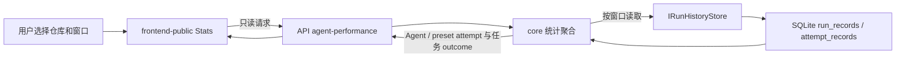
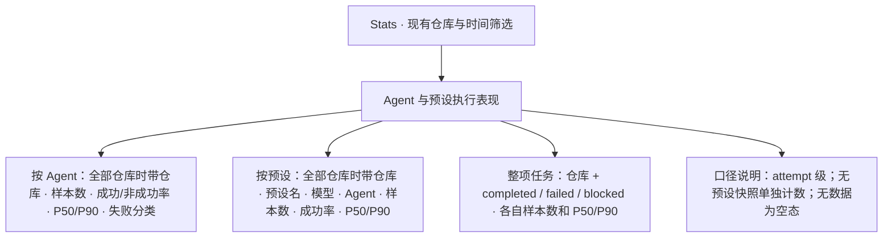

# PRD: Agent 与预设执行表现统计

- GitHub Issue: https://github.com/ZataZhang/keda/issues/263

> ✅ **交付前置**：无，可立即开工。
> 结构化声明见 §8 Delivery Dependencies，那里是唯一事实源。

> 🧍 **验收状态**：待人工验收 — 2 项 Human-Confirmed 待确认
> 本行是 §9 Acceptance Checklist 的投影，那里是唯一事实源。

本文分为两层：Part A 供需求方确认统计行为与口径；Part B 为实现者提供代码边界、复用路径和验证证据要求。

## Feature Overview (功能一览)

以下能力清单是 §10 Functional Requirements 的简要投影，行为以 §1 的样例为准。

- **按 Agent 与预设查看 attempt（单次 Agent 执行）表现**（FR-1、FR-2）：展示样本数、成功/非成功次数与比例、P50/P90 耗时和失败分类。
- **单独查看整项任务耗时**（FR-3）：按最终任务结果展示端到端耗时，不把任务结果错误归给某个 Agent 或预设。
- **保留已删除预设的历史统计**（FR-4）：统计读取执行时写入的历史快照，不要求预设仍存在于当前配置。
- **沿用 Stats 页已有筛选**（FR-5、FR-6）：仓库和时间范围过滤一致，其他 Stats 区块保持原有结果。

# Part A · 人审层 (Review Layer)

## 1. Introduction & Goals

### Problem Statement

Stats 页目前提供实时 GitHub 完成度、按天运行趋势、PRD 生命周期耗时和 Token 汇总，但没有按 Agent 或模型预设比较单次执行表现的视图。系统已经保留整次 runner 运行与单次 Agent 执行的结果和耗时，也留存执行时使用的 Agent、预设名和模型；这些记录尚未汇总成可比较的统计。

这让使用者难以判断某个 Agent 或预设是否更快、更常成功。预设定义会被编辑或删除，因此历史统计也必须来自执行时留存的信息，不能依赖当前配置反推。

### Interpretation (解读回显)

以下样例是本 PRD 的前置解释与验收对象；表格中的当前行为会成为 Part B 的验收 oracle，修正一格就会修正对应验收标准。

| 验证方式 | 输入 / 操作 | 期望观察到的结果 |
|---|---|---|
| 👀 人审 + 自动验证 | 打开 Stats，选定仓库和 30 天窗口 | 页面新增 Agent 与预设执行表现区；每行显示样本数、成功/非成功次数与比例、P50/P90 耗时；预设表同时显示 Agent 和模型；全部仓库视图显示仓库标识。 |
| 🤖 自动验证 | 同一 Issue 由两个 Agent 各产生 attempt，其中一个失败后另一个成功 | 每条 attempt 只计入实际执行它的 Agent 和生效预设；成功率按 attempt 计算，不把整项任务的最终成功重复归给多个 Agent。 |
| 🤖 自动验证 | 配置中删除一个曾经使用过的预设，再查看包含旧 attempt 的统计窗口 | 历史行仍显示已记录的预设名、Agent 和模型；删除配置不清除或改写已有统计。 |
| 🤖 自动验证 | 窗口内存在未绑定预设或旧记录缺少预设快照的 attempt | 它们进入明确的“未绑定 / 历史未记录”计数，不并入任一现存预设。 |
| 🤖 自动验证 | 所选仓库和窗口没有 attempt，或某组没有可用样本 | 显示明确空态或 `—`，不以 `0%` 暗示已经有样本且全部失败。 |
| 🤖 自动验证 | 新统计接口读取失败 | 新统计区显示独立的不可用状态；原有趋势、生命周期和 Token 区块仍可加载，不把读取失败伪装成零样本。 |

**我默默定了这些**

- 成功率按单次 attempt 计算：系统明确记录为成功的 attempt 计为成功，其余已记录结果属于非成功；失败分类仍单独展示。
- Agent 和预设耗时按单次 attempt 计算；整项 runner 任务耗时单独按最终结果汇总，不将整项任务成功率归给 Agent 或预设。
- 预设按历史记录中的仓库、预设名、实际 Agent 和模型分组；不读取当前配置补写历史定义。`preset` 为空的记录留在未绑定 / 历史未记录计数中。
- 中位数与 P90 使用窗口内该组的全部非负 attempt 耗时，按现有生命周期统计的线性插值定义；样本数始终可见，耗时不等于成功 attempt 耗时。
- “全部仓库”视图中按仓库分别列出预设、Agent 和整项任务耗时，显示仓库标识，避免同名配置和任务被混在一起。

**我理解为不做**

- 不计算“某 Agent / 预设最终把任务做成功的概率”；现有运行记录无法可靠地把失败任务归到实际尝试过的每个 Agent。
- 不拆分规划、实现、审核等生命周期阶段耗时，也不计算首次成功率、回退率或每个 PRD 的 Agent 耗时。
- 不换算 token 成本，不新增预设管理或预设版本管理能力。

请把它读成：在现有 Stats 页增加可信的单次 Agent 执行和预设统计，并把整项任务耗时作为独立口径展示；每个历史 attempt 使用自己记录的 Agent、预设和模型。不要把整项任务最终结果重复归因给失败后被替换的 Agent，也不要用现在的配置覆盖或删除历史记录。阶段级统计、按 Agent / 预设归因的最终任务成功率以及成本换算均不在本次范围。

### What The User Gets

打开 Stats 后，使用者可以在与运行趋势相同的仓库和时间范围内比较各 Agent 与预设的执行次数、成功情况、失败类型和耗时分布；也能单独看到整项任务按最终结果统计的耗时。删除一个预设后，之前使用它的统计仍可查。

### Measurable Objectives

- 对每个有样本的 Agent 和有效预设，统计的成功数、非成功数、成功率、P50/P90 与底层 attempt 记录一致。
- 一个 attempt 只归属到该 attempt 的实际 Agent 和预设；最终任务结果不被复制为多个 Agent / 预设的成功。
- 删除当前配置中的预设定义不会移除其已存储历史统计。
- 未绑定或历史缺少预设快照的数据会被明确披露；没有样本时不显示伪造的 0% 成功率。
- Stats 原有完成度、运行趋势、生命周期和 Token 统计的值与行为不变。

## 2. Human Review Map (介入与风险地图)

### 决策一：成功率按单次 Agent 执行计算，还是按整项任务计算

建议把 Agent / 预设成功率定义为单次 attempt 成功率。一个 Issue 可能先后切换多个 Agent；attempt 记录带有实际 Agent、预设、模型和结果，适合作为归属依据。整项任务运行记录对成功和失败场景的 Agent 字段语义不同，把最终结果算给某个 Agent 或预设会形成看似精确、实际误导的比较。主要取舍是：本版不能回答“这个预设最终完成任务的概率”，但能给出数据直接支持的单次执行结果；整项任务的耗时和最终状态仍单独呈现。

**请确认：** 是否接受 Agent / 预设成功率按 attempt 计算，且整项任务结果不归属到单个 Agent 或预设？

**验收：** Stats 中每个 attempt 只进入自己的 Agent / 预设行；一项任务的最终状态只进入整项任务汇总。

### 自动门禁，不需要逐项人工审阅

- SQLite 查询按仓库和时间范围筛选；统计从记录中的预设快照计算，预设删除后保留历史。
- 成功率、失败类型与耗时分位数由自动化测试对照精确样本计算；空数据和未知预设快照有明确处理。
- 浏览器从真实 Stats 页面入口验证两张表、筛选和窄屏呈现；既有 Stats 区块作为回归对照。

### 本次明确不涉及

不修改 Agent 执行流程、状态机、鉴权、外部 API 或 SQLite 表结构；不删除、回填或重写任何历史记录。

## 3. Usage And Impact After Implementation

### Console 运维者与 Agent Runner 使用者

从左侧导航进入 Stats，使用现有仓库选择器和 7 / 30 / 90 天窗口。新增的执行表现区按仓库展示 Agent 与预设统计，并单独显示整项任务按 completed / failed / blocked 汇总的耗时。预设行里的模型来自执行记录；预设是否仍在当前设置中不影响历史行。

### API 调用方与集成维护者

可读取新增的只读统计端点，并通过相同的仓库与天数参数筛选。现有运行趋势端点、PRD 生命周期统计和 Token 汇总响应保持不变。没有要求变更的外部调用方可以继续使用原端点。

### 开发与维护者

统计使用 console SQLite 旁路记录，不参与 Issue 状态决策。前端静态构建和 API 继续通过现有 `kc console` 管理终端分发；无需改动 dormant 的管理平台前端。

### Impact On Existing Behavior

- 不修改现有 API 路由与响应、不新增数据库字段或迁移、不改变历史数据保留策略。
- 新统计只读 `run_records` / `attempt_records` 中的记录；当前预设文件不作为历史事实源。
- 旧记录缺少预设快照时保留在“未绑定 / 历史未记录”计数，不猜测当时配置。
- 现有 Stats 页面其他区块、CLI、Agent 执行与回退流程保持不变。

## 4. Requirement Shape

- **Actor：** Console 运维者与 Agent Runner 使用者；读取 Stats API 的集成维护者。
- **Trigger：** 用户进入 Stats 或更改现有仓库 / 时间范围筛选器。
- **Expected behavior：** 查看按 Agent / 预设归属的 attempt 统计，以及独立的整项任务耗时汇总；窗口和仓库筛选作用于新统计。
- **Scope boundary：** 不把任务最终成功归给 Agent / 预设；不统计生命周期阶段、每项 PRD、fallback 链路或成本金额。

# Part B · 执行器层 (Build Layer)

> 以下供实现者使用；Part A 中的 attempt 归属、成功定义和统计展示口径是行为契约。

## 5. Repository Context And Architecture Fit

- **Existing path：** `GET /api/v1/agent-runner/console/stats/history`、`build_run_history_trend()` 和 Stats 页 `/app/stats`。
- **Reuse candidates：** `IRunHistoryStore`、`console_store.py` 的 SQLite 旁路账本、`console_stats.py`、`agent_runner_console.py`、`frontend-public/lib/api/console.ts` 与 `types.ts`。现有 `list_issue_attempts` 按单个 Issue 读取且有行数上限，是评论历史路径，不能用于完整窗口统计。
- **Architecture pattern to preserve：** API 只校验参数并序列化；core 用例定义分组、结果分类和分位数；infrastructure 只按仓库 / 时间窗口读取所需记录；frontend 只呈现 API 汇总。保留 `api -> core -> infrastructure` 依赖方向。
- **Frontend impact：** `frontend-public/` 是 Agent Runner 管理终端（Next.js 16、React 19）；运行入口 `just frontend-public dev`，UI 验证入口 `just e2e tests/playwright-e2e/tests/smoke/stats-agent-performance.spec.ts`。它新增 Stats 区块、API 客户端、类型与窄屏呈现。`frontend-admin/` 是已冻结的 Vite / React 19 管理平台模板；其入口为 `just frontend-admin dev`、浏览器测试命令为 `cd frontend-admin && pnpm test`，但不承载 Stats，本次不改动。
- **Existing PRD relationship：** `tasks/pending/P1-FEAT-20261009-133425-lifecycle-agent-model-settings.md` 负责预设设置和解析；本 PRD 只消费已记录的 attempt 快照，无执行顺序依赖。已归档的 `P1-FEAT-20260921-161621-prd-lifecycle-observability.md` 和 `P1-FEAT-20261006-013227-stats-token-usage-by-prd.md` 定义现有 Stats / lifecycle 区域；本次独立增加 Agent 执行表现，不改变生命周期与 Token 统计。
- **Redundancy risks：** 不从当前 TOML 预设反向重建历史；不从 GitHub 评论另建统计源；不在 Stats 前端重复计算业务口径；不新增一套运行账本或修改现有趋势 API 的语义。

### Existing data constraints

- `run_records` 提供整项 runner 运行的 `outcome`、开始时间和耗时。完成记录写入本轮最终使用的 Agent，失败 / 阻塞记录写入入口选定的 Agent，因此不可用它为每个 Agent 计算统一口径的任务成功率。
- `attempt_records` 提供实际 Agent、`failure_type`、耗时、可空 `preset` 和 `model`，适合按实际 attempt 分组；目前没有稳定 `run_id` 或 lifecycle stage。
- 预设名和模型是写入 attempt 时的快照，没有数据库外键指向当前配置，所以删除设置不会删 SQLite 历史。推理深度未写入 attempt；同一仓库同名预设、同 Agent 和模型但推理深度不同的历史记录会合并，若将来需要比较这类变体再增加快照字段。

## 6. Recommendation

### Recommended Approach

- **Approach：** 在现有运行历史旁路存储上增加按窗口读取 run / attempt 记录的端口能力；在 core 聚合用例构建 Agent、预设和整项任务统计；新增只读 `stats/agent-performance` API；Stats 页增加一张独立卡片并沿用已有筛选器。
- **Why this is the best fit：** 当前原始事实已经持久化，扩展读路径即可得到用户需要的指标。新端点让新增数据的读取失败与原趋势、PRD 生命周期区隔离，避免改变已有响应与行为。
- **Rejected redundancy：** 不新增统计数据库、预设外键或历史配置服务；不重复从日志 / GitHub 评论解析 attempt；不向运行趋势端点塞入不相干的新汇总。

### Proposed Solution Summary (实现机制)

Stats 页把当前仓库和天数传给新的只读 API。infrastructure 从 `run_records` 读取窗口内整项运行，从 `attempt_records` 读取窗口内每次执行；core 按仓库 + 实际 Agent 汇总 Agent 统计，按仓库 + 记录中的预设名 + 实际 Agent + 模型汇总预设统计，并按 `failure_type` 分类。`success` 是成功，其他值是不成功。P50 / P90 只对有效 attempt 耗时计算，分母和样本数显示在同一行。预设为空的记录单独计数。

整项任务按 `outcome` 计算样本数、P50 / P90；不按 Agent 或预设归因。新的 API 返回聚合 DTO，前端不访问配置文件，也不自行推导成功率。统计数据读取失败时，新卡片单独显示错误状态，不影响 Stats 页其他数据。

不改表结构：`attempt_records` 的现有快照字段已足够满足本版按名称 / Agent / 模型比较与删除后保留。范围筛选只读取目标时间窗口，不载入 attempt 的长文本 `detail`。

### Alternatives Considered

- **扩展 `stats/history` 响应：** 不采用。新汇总有不同的数据读取和错误状态；将它们塞进日趋势响应会让一次新增查询故障影响现有趋势入口。
- **将整项成功率归因到 run 的 Agent 字段：** 不采用。成功与失败 / 阻塞记录中的 Agent 字段来源不同，跨 fallback 时会错把最终结果归给入口 Agent 或最后 Agent。
- **新增 preset version 表或复制配置定义：** 不采用。现有记录已有预设名、实际 Agent 和模型；为尚未提出的历史版本比较增加存储结构不合算。

### Scope cohesion

Agent / 预设 attempt 汇总、整项任务耗时和删除预设后的历史保留都可独立测试，但它们共享同一仓库 / 时间窗口、同一个历史数据来源和同一张 Stats 卡片；合并交付避免页面出现半套统计或重复读取。生命周期阶段统计和基于 run_id 的任务归因不属于完整目标态所必需的部分，明确留在本 PRD 范围之外。

## 7. Implementation Guide

本节是当前代码分析下的实现起点。若实施发现窗口查询、历史数据或真实入口有遗漏，先更新本 PRD 的相关范围和验证项。

### 7.1 Core Logic

1. 由 API 限定 `days` 与可选 `repo_id`，使用同类 Stats 页面已有的时间范围语义。
2. Store 通过窗口查询端口返回轻量统计投影，只取仓库、结果、Agent、时间、耗时、preset 和 model，不读长 `detail`，也不访问当前仓库配置。
3. Core 保留仓库维度，避免“全部仓库”下同名预设碰撞；预设行键为仓库、preset、实际 agent、model。
4. 每行 `attempt_count = success_count + non_success_count`；成功率和非成功率之和为 100%；失败分类计数之和等于非成功数。样本数为零时不生成分组行；空 Agent 名称使用明确的“未记录”组。
5. 窗口内没有预设快照的记录进入单独计数；未知 `failure_type` 仍按非成功处理，并作为原始 / 未知分类披露，不能默认为成功。
6. 整项运行按仓库 + completed / failed / blocked 统计，不使用 `RunRecord.agent` 生成 Agent 级最终任务成功率；全部仓库视图展示仓库标识。

### Risk Classification Register

| Change point | Tier | Decisive reason | Intervention | Failure-discriminating oracle / gate |
|---|---|---|---|---|
| Agent / preset 成功率、失败分类与耗时统计口径 | R2 | core 统计语义会影响使用者选择 Agent / 预设；Part A 决策一由人确认 | 人确认 attempt 口径；自动验证每组分母和耗时分位数 | rv-1 精确样本对照；rv-2 展示正确分组和分母 |
| 历史窗口读取和已删除 preset 保留 | R2 | 跨越 API、core、SQLite；错误联接会丢失或错归历史数据 | Executor + 真实路由 / fresh read | rv-1 新 SQLite 会话与 API JSON 对照 |
| Stats 页面、筛选与错误 / 空态 | R1 | 可逆的单页面行为，有明确页面与 API contract | Executor + 真实页面 E2E 和人审截图 | rv-2 真实 `/app/stats` 页面及响应断言 |
| 用户指南和导航同步 | R0 | 文档变更可逆，目标章节现已纳入 MkDocs | Executor + 文档构建 | `uv run mkdocs build --strict` |

### 7.2 Change Impact Tree

```text
.
├── src/backend/core/shared/interfaces/runner_console.py
│   [修改]
│   【总结】为运行统计增加时间窗口读取端口、轻量记录投影与聚合结果类型。
│   ├── 复用现有 SQLite run / attempt 记录作为历史事实
│   └── 不增加表字段或持久化实体
├── src/backend/core/use_cases/console_stats.py
│   [修改]
│   【总结】按 Agent、预设和整项结果聚合次数、比率、失败分类与分位数。
│   └── 通过 rg -n "build_run_history_trend" 定位现有统计用例
├── src/backend/infrastructure/persistence/console_store.py
│   [修改]
│   【总结】按仓库与时间窗口读取 run / attempt 的轻量投影。
│   └── 查询不联接当前配置、不取长 detail，也不改写历史
├── src/backend/infrastructure/persistence/console_store_lifecycle.py
│   [新增]
│   【总结】承载既有 PRD lifecycle SQLite 适配方法，保持 console_store.py 边界清楚且低于 800 行。
│   └── 不改变生命周期查询、写入或 SQLite schema
├── src/backend/api/routes/agent_runner_console.py
│   [修改]
│   【总结】新增只读 /console/stats/agent-performance 路由并序列化 core 统计。
│   └── 保持 stats/history 与 stats/prd-lifecycle 契约不变
├── tests/test_console_stats.py + tests/test_agent_runner_console_api.py
│   [修改]
│   【总结】覆盖聚合口径、过滤、已删除预设快照和真实路由响应。
├── frontend-public/lib/api/types.ts + frontend-public/lib/api/console.ts
│   [修改]
│   【总结】同步新增统计类型和 API 客户端调用。
├── frontend-public/app/(app)/app/stats/page.tsx
│   [修改]
│   【总结】在 Stats 页渲染 Agent / 预设 attempt 表和整项任务耗时摘要。
├── tests/playwright-e2e/tests/smoke/stats-agent-performance.spec.ts
│   [新增]
│   【总结】从真实 Stats 页面验证新增卡片、筛选、空态与窄屏表格。
├── docs/guides/agent-runner.md
│   [修改]
│   【总结】说明统计口径、筛选、历史预设保留与数据限制。
└── mkdocs.yml
    [修改]
    【总结】同步更新 Agent Runner 文档导航名称，突出新增执行表现统计。
```

### 7.3 Executor Drift Guard

| Check | Command | Expected Result | If It Fails, Inspect First |
|---|---|---|---|
| 历史统计只从 SQLite 原始记录读取 | `rg -n "stats/agent-performance|list_.*attempt|attempt_records|run_records" src/backend` | API -> core -> store 路径清楚；未新增配置 / GitHub 统计来源 | `agent_runner_console.py`、`console_stats.py` 与 store 端口调用 |
| 预设统计使用持久化快照 | `rg -n "agent-performance|preset|model" src/backend/core/use_cases/console_stats.py src/backend/infrastructure/persistence/console_store.py` | 分组使用历史字段；没有按当前配置过滤或 join | attempt 列选择与预设解析路径 |
| 前端只呈现后端统计 | `rg -n "fetchAgentPerformanceStats|agent_performance|stats-agent-performance" frontend-public tests/playwright-e2e/tests` | 类型、请求和目标页面 / E2E spec 对齐 | API 类型、Stats 页 effect 与 E2E route fixture |
| 现有 Stats 路由仍被使用 | `rg -n "stats/history|stats/prd-lifecycle|stats/agent-performance" src/backend/api/routes/agent_runner_console.py frontend-public/lib/api/console.ts` | 新统计有独立入口；历史趋势和 PRD lifecycle 调用保持存在 | 路由和客户端函数是否被误合并或移除 |

### 7.4 Flow Or Architecture Diagram



### 7.5 ER Diagram

No data model changes in this PRD. Existing `run_records` and `attempt_records` are read-only sources; there is no new table, field, relationship, or migration.

### 7.6 Realistic Validation Plan (Oracle 块)

```yaml
- id: rv-1
  behavior: "统计 API 按仓库和时间范围返回精确的 Agent、预设 attempt 与整项任务结果聚合；预设从配置删除后历史记录仍被统计。"
  reviewer: verifier
  real_entry: "uv run pytest tests/test_console_stats.py tests/test_agent_runner_console_api.py -k agent_performance -q；测试通过真实 FastAPI 路由 GET /api/v1/agent-runner/console/stats/agent-performance?repo_id=<fixture-repo>&days=30 与临时 SQLite ConsoleStore。"
  expected: "同一 fixture 窗口下样本数、成功/非成功数、比率、失败分类、P50/P90 和 outcome 耗时逐项与已写入的真实 SQLite 行一致；另一仓库、窗口外行和当前配置已删除的 preset 不改变对应分组。"
  mock_boundary: "测试可以使用隔离的 repo_id、固定时间和临时 SQLite 文件；不得 mock FastAPI 路由、core 聚合用例或 ConsoleStore 查询，也不得从当前 config.toml 生成统计结果。"
  tier: R2
  test_layer: integration
  required_for_acceptance: true
  critical_value_source: "测试写入临时 SQLite 的 run_records / attempt_records 原始字段及真实 API JSON；预期数字必须从独立 SQL 读取结果计算。"
  must_cross: "真实 FastAPI app 路由 -> 参数校验 -> core 聚合 -> IRunHistoryStore -> ConsoleStore 查询 -> SQLite commit -> 新 API request -> JSON 观测。"
  forbidden_bypasses: "不得直接调用 aggregation helper 代替路由验证；不得 mock store / API；不得读配置文件填充历史预设；不得复用写入连接作为 fresh read。"
  fresh_state_probe: "attempt 与 run 写入后关闭写入连接，通过新 API request 和独立 SQLite connection 分别核对聚合响应、窗口和仓库过滤。"
  final_tree_evidence: "保存 pytest 输出、原始样本摘要、API JSON 摘要和 git tree；core、API、store 或统计类型变化后重跑。"

- id: rv-2
  behavior: "真实 Stats 页面展示按 Agent / 预设统计和独立的整项任务耗时，并随仓库 / 窗口筛选更新。"
  reviewer: human
  real_entry: "just e2e tests/playwright-e2e/tests/smoke/stats-agent-performance.spec.ts；使用 session fixture 进入 /app/stats，测试只拦截新增统计 API。完成后运行 just console-sync，再通过 kc console 打开内置静态控制台的 /app/stats 做冒烟检查。"
  expected: "页面显示 Agent 表、预设与模型表、样本数、成功/非成功比例、P50/P90、失败分类和按 outcome 的整项耗时；筛选参数准确传给新增 API；无数据时显示空态，新增 API 失败时显示独立不可用状态且其他统计仍可见；桌面与窄屏均可读，窄屏表格可横向滚动；内置静态控制台也包含新页面区块。"
  mock_boundary: "保留真实 Next.js route、Stats 页面、AppShell、session fixture、API client 和交互；只用确定性响应替代新增统计 API，响应字段与真实 API contract 一致。"
  tier: R1
  test_layer: e2e
  required_for_acceptance: true
  presentation: "tasks/evidence/P2-FEAT-20261009-171037-agent-preset-performance-stats/rv-2-stats-agent-performance.png；交付时从 just console-sync 后由 kc console 打开的真实 /app/stats 页面截图并内嵌呈递，标注 kc console 静态分发真实用户流程；另保存窄屏检查结果。"
  negative_control: "临时将 E2E fixture 中预设 attempt_count 从 4 改为 5，同时保留页面断言预期值。"
  expected_fail: "新增预设行的样本数断言失败；恢复 fixture 后该断言通过。"
```

Failure triage:
- rv-1 先核对临时数据库路径、ISO 时间窗口与 store 查询，再检查 core 的分组键和比率计算。
- rv-2 若失败，先检查 session fixture 和真实 `/app/stats` 路由，再核对 API 请求参数与 fixture 字段；不要改写既有 `stats/history` 响应来绕过新端点。
- API 用例不依赖 GitHub 或供应商凭据；页面 E2E 使用仓库现有认证凭据配置，未配置时仍可运行 rv-1 并通过 `just frontend-public build` 验证静态构建。

### 7.7 Low-Fidelity Prototype

下面是 Stats 新增区域的目标布局；实现可沿用页面现有卡片、表格与滚动样式，不要求新增交互模式。



### 7.8 Interactive Prototype Change Log

No interactive prototype file changes in this PRD. The Mermaid target layout above is the focused low-fidelity review artifact; it introduces no separate prototype route or interaction.

### 7.9 External Validation

No external validation required; repository evidence was sufficient.

## 8. Delivery Dependencies

- Depends on tasks/issues:
  - none
- Gate type: none
- Sequence: via-main
- Notes: 生命周期 Agent / 预设设置 PRD 可独立交付；本统计消费其运行后留下的 attempt 快照，不等待设置 UI 或 CLI。

## 9. Acceptance Checklist

### 9.1 人读呈递区（Human Review Surface）

| # | 你要看什么（对应 oracle） | 呈递物（交付时填实际路径） | 想自己复核？ |
|---|---|---|---|
| 1 | rv-2：Agent 与预设行是否显示样本数、成功 / 非成功比例、P50/P90 和失败分类；整项任务是否按 outcome 独立呈现 | `tasks/evidence/P2-FEAT-20261009-171037-agent-preset-performance-stats/rv-2-stats-agent-performance.png`（由 `just console-sync` 后 worktree `uv run kc console` 服务的真实 `/app/stats` 页面、1440px 浏览器窗口采集，无 mock，数据为本地运行账本真实记录；已内嵌进 `just prd review` 打开的人审 HTML）。打开方式：从仓库根目录执行 `open "tasks/evidence/P2-FEAT-20261009-171037-agent-preset-performance-stats/rv-2-stats-agent-performance.png"`；窄屏结果见同目录 `rv-2-stats-agent-performance-narrow.png` 与 `rv-2-prd-review-browser-check.txt` | 对照 Agent 表的样本数 / 成功率与预设表模型列；窄屏下确认表格能横向滚动（375px 收起导航后容器 173px < 内容 920px，`overflow-x: auto`；E2E 断言见 `rv-2-e2e-green-final.txt` 第 5 项） |

**以下项不需要你看**（`reviewer: verifier`，失败时才需人工介入）：rv-1 API + SQLite 聚合契约、仓库 / 时间窗口过滤、删除预设后的历史保留。证据见 §9.2。

### 9.2 Acceptance Evidence Package（机器证据 · verifier 入口）

1. **rv-2 页面呈递和断言：** Stats 页面桌面截图、窄屏检查结果、Playwright trace / 断言结果；实际截图必须来自 `just console-sync` 后由 `kc console` 打开的 `/app/stats`。
2. **rv-1 API 与持久化来源：** 精确 fixture 行、独立 SQLite fresh read、真实路由 JSON、窗口 / 仓库过滤结果和 pytest 输出。
3. **风险地图对账：** 确认没有将最终任务结果归给 Agent / preset；没有从当前配置生成历史统计。
4. **对抗自检：** 检查非成功失败分类、空样本、缺失 preset、多个仓库同名 preset、窗口外记录是否会污染率和分位数。
5. **回归门禁：** 既有 Stats 完成度、趋势、PRD 生命周期和 Token 汇总断言仍通过；前端类型检查与 build 通过。

### Human-Confirmed (来自 Part A 风险地图)

- [ ] §2 决策一：确认 Agent / 预设成功率按 attempt 计算，整项任务结果不归属到单个 Agent 或预设。
- [ ] §9.1 人读呈递区已查看，或按表中复核方法完成检查。

### Architecture Acceptance

- [x] API 只负责参数校验与序列化；统计分组和结果语义留在 core。
- [x] infrastructure 只通过 store port 返回窗口内持久化行，不导入 core，也不读取当前配置。
- [x] 无新 SQLite 表、字段、迁移、配置文件依赖或第二套历史来源。

### Dependency Acceptance

- [x] 新统计读取只经过 `IRunHistoryStore` 和现有 ConsoleStore SQLite 适配器。
- [x] 新端点不改变 `/console/stats/history` 与 `/console/stats/prd-lifecycle` 已有契约。
- [x] 不增加预设外键；删除当前配置中的预设不删除或改写历史 attempt。

### Behavior Acceptance

- [x] `success` 是成功；其他已记录 `failure_type` 是非成功，并被失败分类计数覆盖。
- [x] 每条 attempt 只计入实际记录的 Agent / preset 组；仓库和模型参与预设分组，空 preset 单独计数。
- [x] 每组样本数、成功 / 非成功率和耗时分位数与 SQLite 源记录一致；样本为空时没有 0% 伪值。
- [x] 整项任务按仓库和 completed / failed / blocked 独立汇总；全部仓库视图显示仓库标识，不按 `RunRecord.agent` 计算任务成功率。证据：`tasks/evidence/P2-FEAT-20261009-171037-agent-preset-performance-stats/rv-1-api-green.txt`。
- [x] Agent、预设、失败类型和整项任务耗时使用相同的仓库 / 时间窗口筛选。

### Frontend Acceptance

- [x] `frontend-public/app/(app)/app/stats/page.tsx` 从真实 Stats 页面显示 Agent 与预设执行表现卡片、任务结果耗时和空态。证据：`tasks/evidence/P2-FEAT-20261009-171037-agent-preset-performance-stats/rv-2-e2e-green-final.txt`（真实 `/app/stats` 页面 5/5 通过，含显示、空态与独立任务结果检查）及真实 kc console 页面截图 `rv-2-stats-agent-performance.png`。
- [x] 前端 API client 和 TypeScript 类型与新增 API 响应同步；仓库 / 天数参数正确传递。证据：`rv-2-typecheck-final.txt`、`rv-2-build-final.txt`；真实 Stats E2E 的仓库 / 天数筛选断言通过（`rv-2-e2e-green-final.txt` 第 3 项）；当前 spec 单文件 TypeScript / ESLint 检查见 `rv-2-e2e-spec-checks-final.txt`。
- [x] 窄屏下表格保持可读并按设计横向滚动；`frontend-admin/` 无变更。证据：`rv-2-e2e-green-final.txt` 第 5 项（375px 收起导航后预设表可见、`scrollWidth 920 > clientWidth`、`overflow-x: auto`）；真实 kc console 页面窄屏截图 `rv-2-stats-agent-performance-narrow.png`（容器 173px）；`git diff HEAD -- frontend-admin` 为空。

### Documentation Acceptance

- [x] `docs/guides/agent-runner.md` 说明 attempt 成功率定义、整项任务口径、删除预设后的历史保留和数据限制。
- [x] `mkdocs.yml` 的 Agent Runner 导航名称体现统计内容，且仍指向 `docs/guides/agent-runner.md`。
- [x] PRD 的统计定义与最终 API / 页面字段保持一致。

### Validation Acceptance

- [x] `uv run pytest tests/test_console_stats.py tests/test_agent_runner_console_api.py -k agent_performance -q` 通过，证据对应 rv-1。
- [x] `just e2e tests/playwright-e2e/tests/smoke/stats-agent-performance.spec.ts` 通过，并从真实 `/app/stats` 页面收集 rv-2 截图。证据：`rv-2-e2e-green-final.txt`（5 passed，exit 0）；预设样本数负控 4→5 变红、恢复转绿见 `rv-2-e2e-negative-control.txt`；截图 `rv-2-stats-agent-performance.png` 与窄屏 `rv-2-stats-agent-performance-narrow.png` 由 `just console-sync` 后 worktree `uv run kc console` 服务的真实 `/app/stats` 页面在浏览器中采集。
- [x] `pnpm typecheck` 与 `pnpm build` 在 `frontend-public/` 通过。证据：`rv-2-typecheck-final.txt`、`rv-2-build-final.txt`。
- [x] `just console-sync` 后通过 worktree 内 `uv run kc console` 读取 `/app/stats`，确认静态分发版本包含新统计区块。证据：`rv-2-console-sync-green.txt`、`rv-2-console-http-green.txt`（本轮重跑：页面与引用 bundle 均 200，目标 bundle 含新增区块文案）；浏览器渲染证据见 `rv-2-stats-agent-performance.png`（真实 kc console 页面截图）。
- [x] `uv run mkdocs build --strict` 通过。
- [x] 至少一条验证穿过 FastAPI 路由、core 聚合、真实 SQLite 查询和新 API 请求；不以直接调用 helper 替代。
- [x] API JSON 和截图证据在最后一次相关改动后重采，并关联最终代码树。证据：`rv-1-api-green.txt` / `rv-1-api-json.json` 与 `rv-2-e2e-green-final.txt`、`rv-2-stats-agent-performance*.png` 均在 spec 最终修改与负控恢复之后重采；`rv-1-final-tree.txt` 与 `rv-2-final-tree.txt` 绑定对应源码哈希。
- [x] `rg -n "stats/agent-performance|fetchAgentPerformanceStats|stats-agent-performance" src/backend frontend-public tests/playwright-e2e/tests` 命中预期后端、客户端、页面和 E2E 位置。

### Delivery Readiness

- [x] 实现推荐的单一统计路径；无重复 store、配置解析或前端业务计算。
- [x] 失败、空数据、缺少 preset 快照和多仓同名 preset 均有测试与明确呈现。证据：`tasks/evidence/P2-FEAT-20261009-171037-agent-preset-performance-stats/rv-1-api-green.txt`、`rv-1-api-json.json`、`rv-2-e2e-green-final.txt`（API / SQLite 集成用例覆盖失败、空值、预设快照和跨仓同名分组；真实页面 E2E 的显示、空态、错误隔离、窄屏及预设行检查 5/5 通过）。
- [x] §9.1 呈递区已回填实际截图和打开方式；完成回复包含呈递物和逐项自验方法。呈递物：`rv-2-stats-agent-performance.png`（桌面）与 `rv-2-stats-agent-performance-narrow.png`（窄屏），打开方式与自验方法已写入 §9.1 表格行。
- [x] `tasks/evidence/P2-FEAT-20261009-171037-agent-preset-performance-stats/human-review-checklist.md` 已列出人工确认项；配套 HTML 已通过 `just prd review <prd-file>` 解析并在真实浏览器完成呈现检查（零 pageerror、首项卡片、翻页、内嵌两张截图加载、结果 Markdown 生成），证据：`rv-2-prd-review-browser-check.txt`、`rv-2-prd-review-checklist-page2.png`。
- [~] verifier `PASS`，Final Reconciliation 完成，交付前 PRD 归档状态与 §9 一致。— runner-owned gate: 独立 verifier 在执行器交付后判定 PASS，并由 runner 处理归档；本轮不得伪造 verifier 结论或移动 PRD。

## 10. Functional Requirements

- **FR-1:** Agent attempt 汇总：在选定仓库和窗口内，按实际 Agent 展示 attempt 数、成功数、非成功数、成功率、非成功率、P50/P90 耗时和失败类型分布。
- **FR-2:** 预设 attempt 汇总：只对有历史 preset 快照的 attempt，按仓库、预设名、实际 Agent、模型汇总相同指标；不查询当前配置；空 preset 记录单独计数。
- **FR-3:** 整项任务耗时：按仓库和最终 completed / failed / blocked 分组展示 run 数、P50/P90 耗时；全部仓库视图显示仓库标识；不从 run 的 Agent 字段推导 Agent / preset 的最终成功率。
- **FR-4:** 历史留存：预设在配置中改名或删除不会改写 SQLite 已保存的 preset / model 记录，也不会使对应历史行消失。
- **FR-5:** 窗口和仓库：新统计响应遵循 Stats 页当前仓库与天数筛选；全部仓库视图保留 repo 分组，避免同名 preset 被合并。
- **FR-6:** 隔离与兼容：使用独立只读 API 和 UI 卡片；无数据 / 查询失败有本区块明确状态，既有 Stats 数据、API 和 runner 执行行为不变。

## 11. Non-Goals

- 生命周期阶段（规划 / 实现 / 审核等）耗时或按阶段的 Agent / 预设比较。
- 依赖 run_id 关联的首次尝试成功率、回退率、每任务 Agent 使用链或预设级最终任务成功率。
- 推理深度、Agent CLI 版本或完整配置快照维度；本版按已持久化的预设名、Agent 和模型统计。
- Token 用量、价格表、金额换算、成本预算或自动模型推荐。
- 任何 Agent / 预设选择、执行授权、状态机或运行回退策略变化。

## 12. Risks And Follow-Ups

- **历史快照不完整：** schema v6 之前的 attempt 行及未绑定 attempt 的 `preset` / `model` 为空，无法区分旧记录和真实未绑定。界面以“未绑定 / 历史未记录”统一披露，不回填猜测值。
- **同名配置变体：** 当前 attempt 快照不含 reasoning effort。若同仓库内同名 preset、Agent 和模型仅改变 effort，统计会合并。只有未来确实需要比较 effort 变体时，再单独评估给 attempt 增加完整配置快照。
- **任务归因不足：** run 记录缺少稳定执行 run id，且不同终态下 Agent 字段含义不同。因此本版不提供 Agent / preset 级整项任务成功率、首次成功率或 fallback 率。若需要这些指标，触发条件是使用者需要据此做 Agent 路由决策；届时单独规划 run_id / lifecycle 关联和阶段快照。
- **分位数样本量：** 小样本的 P50 / P90 波动很大。每行必须显示样本数；页面不暗示统计量能代表未来表现。
- **查询开销：** 查询仅加载时间窗口和必要字段，不加载长详情；若实际数据库规模使窗口读取变慢，再基于实测决定是否在 SQLite 聚合或增加只读索引，不预先加缓存 / 新表。

## 13. Decision Log

| # | 决策问题 | 选择 | 放弃的方案 | 理由 |
|---|---|---|---|---|
| D-01 | Agent / 预设成功率的统计单位 | 单次 attempt；任务 outcome 独立按结果统计 | 把整项任务结果归给某个 Agent 或 preset | Attempt 有实际 Agent / preset 和结果；RunRecord 的 Agent 归属随终态变化，无法支持可靠的单 Agent 任务率 |
| D-02 | 删除预设后的历史口径 | 只读 SQLite 已存的 preset / model 快照，不读当前设置 | 按当前配置联接或删除已不存在的 preset 行 | 历史统计必须在配置变更后稳定；现有 attempt 已持久化这些字段，无需 schema 变更 |
| D-03 | 新统计接入位置 | 新增独立 `stats/agent-performance` 只读 API 和 Stats 卡片 | 扩展日趋势 API 响应或新建统计存储 | 隔离查询失败与既有趋势，同时复用同一 run-history store，不引入第二事实源 |
| D-04 | 需求优先级 | P2 | P1 | 提升 Agent / 预设选择质量，但不阻塞现有执行或修复运行故障 |

### Final Reconciliation (Archive Only)

- Interpretation: 实现与 rv-1 集成测试保持 Part A 口径：Agent / preset 结果按单次 attempt 归属，任务 outcome 按仓库独立汇总；删除预设后继续使用 SQLite 快照。没有改变成功定义、范围或空值语义。
- Public behavior and contracts: 新增独立只读 `stats/agent-performance` API 与 Stats 卡片；原有趋势、lifecycle 与 Token 区域仍保留。FastAPI / SQLite 统计断言通过；最终 `just console-sync` 后由 worktree `uv run kc console` 新会话读取 `/app/stats/` 及引用 bundle 全部 HTTP 200（`rv-2-console-http-green.txt`），并在真实浏览器中完成页面水合、数据渲染与 375px 窄屏横向滚动检查（`rv-2-e2e-green-final.txt`、`rv-2-stats-agent-performance*.png`）。
- Related PRD status: 生命周期 Agent / 预设设置仍是独立的 pending PRD；本统计不等待其 UI 或 CLI，也不依赖读取当前配置。
- Requirements and risks: FR-1–FR-6、§12 的历史快照限制、任务归因边界与查询范围均未改变。rv-1 红 / 绿验证通过并重新采集三份 API JSON；共享 percentile helper 调整后的现有 lifecycle median / P90 回归用例 1 passed。此前真实 E2E 的 Stats 数据、仓库 / 天数筛选、空态和错误隔离检查通过；375px 测试曾因 `stats-agent-performance-preset-table` 被判定为 hidden 而失败，截图显示展开侧栏挤占内容区。窄屏 spec 现先点击已有的“收起导航栏”控件，但本轮最新完整 E2E 在 auth setup 因 Chromium `MachPortRendezvousServer` `Permission denied (1100)` 退出，4 个 Stats 页面测试未运行。CUA 显示 IAB 不可用、浏览器 inventory 为空且 Chrome 访问未获准。上述受阻项已在最终一轮全部完成：窄屏绿跑、预设样本数产品负控（4→5 红、恢复绿）、真实 kc console 桌面与窄屏截图、`just prd review` 浏览器呈递，见 `rv-2-e2e-green-final.txt`、`rv-2-e2e-negative-control.txt`、`rv-2-stats-agent-performance*.png` 与 `rv-2-prd-review-browser-check.txt`。
- Reconciled differences:
  - E2E spec 补充了预设行样本数与仓库筛选参数断言，以覆盖 PRD 已要求但原 spec 未明确断言的值；行为范围未扩大。
  - E2E spec 现在还断言新增 API 请求使用 GET 和 canonical `/api/v1/agent-runner/console/stats/agent-performance` 路径。目标 spec 单文件 ESLint / TypeScript 检查通过；这些断言在受阻轮次未执行，最终轮次目标 spec 5/5 真实运行已覆盖，见 `rv-2-e2e-green-final.txt`。
  - 复核此前实际执行到页面的 E2E 输出，确认数据展示、筛选、空态和错误隔离断言通过，375px 窄屏用例失败，首个可操作错误为 preset table 容器 `toBeVisible()` 收到 `hidden`。这是侧栏展开时内容区过窄；测试现在点击已有的侧栏收起控件后再验证横向滚动。该调整在当时仍被上一会话的 Chromium 启动失败阻断（`rv-2-e2e-final-red.txt`），最终轮次已在真实浏览器运行转绿，见 `rv-2-e2e-green-final.txt`。
  - `process_guard.sh` 改为在 `pgrep` 返回非零时进入脚本原有“无法计数则跳过进程上限”的分支，避免 `set -e -o pipefail` 提前终止 `just run`。该修复不改变进程枚举成功时的上限计算；环境中进程扫描不可用时的既有策略现可执行。
  - 先前裸 `kc console` 命令解析到 `/Users/zata/.local/bin/kc` 全局安装入口，并服务了不含新区块的旧 bundle；旧静态检查不作为本次证明。重新同步后改用 `UV_CACHE_DIR=/tmp/keda-issue-263-uv-cache uv run kc console --no-browser --port 8764`，worktree 版本的 `/app/stats/` 与 12 个引用 bundle 返回 200，目标 bundle 包含新区块。后续验收引用已更新到该证据。
  - 首次刷新 Next.js 开发服务后 `pnpm typecheck` 命中旧增量输出生成的 `LayoutProps` 错误；`pnpm build` 成功，执行 `pnpm exec tsc --build --clean` 清理 TypeScript 增量输出后，原 `pnpm typecheck` 通过。E2E 包级 `npm run typecheck` 另报未修改的 `tests/smoke/idea-inbox.spec.ts:123` 类型错误；本次 Stats spec 单文件类型检查通过。
  - 最终 worktree 上再次运行 `pnpm typecheck` 与 `pnpm build` 均通过；E2E 前端 API / DTO 类型项已据此及此前真实筛选断言通过而勾选。`just console-sync` 后使用 worktree `uv run kc console --no-browser --port 8879` fresh-read `/app/stats/` 和 12 个 bundle 均返回 200。API JSON 已在最终相关代码树重采；桌面与 375px 窄屏截图随后在真实浏览器从 kc console 静态分发采集，最终轮次相关 checklist 已勾选（`rv-2-stats-agent-performance*.png`、`rv-2-e2e-green-final.txt`）。
  - 为刷新本地核心测试标记而运行 `just test`：lint 阶段通过，随后 14 项失败、1 项通过、149 项未运行。失败首因是环境禁止 `psutil` 进程扫描，导致 `config migrate` 按安全策略拒绝运行；另有 daemon 测试写 `/Users/zata/.kedacode/daemon-locks/repo.lock` 被拒绝。单独 `just lint --full` 的唯一失败是 test flag 的 worktree tree 哈希已过期；统计定向用例和前端 build/typecheck 均独立通过。
  - 已按 PRD 模板生成交互式 `human-review-checklist.html` 并内嵌两张真实 kc console 页面截图；本轮在真实浏览器完成呈现检查（零 pageerror、首项卡片可见、翻页与结果 Markdown 生成、内嵌截图加载），`just prd review <prd-file> --print` 解析到该 HTML，见 `rv-2-prd-review-browser-check.txt`。
  - 本轮 rv-2 收口：窄屏用例先因点击落在 hydration 完成前而失败、后又因 GitHub overview 冷重建慢而超时，spec 增加「等待新统计请求出现后再点击收起并 toPass 重试」与「仓库选项耐心 45s 等待、超时才整页刷新重试」两项确定性前置（不改产品代码）；`just e2e` 目标 spec 5/5 通过；预设样本数 4→5 产品负控红、恢复绿；`just console-sync` 后由 worktree `uv run kc console` 在真实浏览器采集桌面与 375px 窄屏截图；rv-1 API / SQLite 证据与两份 final-tree 哈希在最终改动后重采。执行器侧交付完成，待独立 verifier 判定与 runner 归档；两项 `Human-Confirmed` 仍留人工。

## Change Log

### 实现与验证证据回填
- Type: evidence
- Before: Acceptance Checklist 的实现与验证项均未标记；Final Reconciliation 尚待实施。
- After: 仅勾选已有代码审查、API/SQLite 集成测试、类型检查、构建和文档构建证据支持的项目；依赖真实页面展示的全部仓库列、截图与窄屏行为、Playwright 浏览器验证、人工确认和独立 verifier 仍未完成。
- Reason: 将本轮实际执行结果与未完成的真实页面门禁明确区分，避免把 WIP 或环境受阻状态误写成验收通过。
- Impact: 未改变用户行为定义、范围或验证要求；PRD 保持在 pending，交付与验收状态仍需后续完成。
- Review: Executor evidence only; Human-Confirmed items remain open and no verifier verdict is claimed.

### SQLite 适配职责拆分
- Type: implementation-detail
- Before: `SqliteConsoleStore` 的运行历史、PRD lifecycle 与其他管理终端适配方法集中在同一文件，文件超过代码复用规范的 800 行目标。
- After: 将原有 PRD lifecycle 记录类型、查询与写入方法移至 `console_store_lifecycle.py` 的 mixin；`SqliteConsoleStore` 组合该 mixin，schema 和行为保持原样。
- Reason: 让本次修改遵守单文件规模约定，并使用仓库已有的 store mixin 组织方式。
- Impact: 不改变 SQLite schema、生命周期数据或 API 行为；新增持久化适配模块路径，必须通过生命周期、ConsoleStore 和统计相关回归测试。
- Review: Executor implementation detail; no user-visible scope or acceptance behavior changed.

### 恢复页面验证与证据状态
- Type: evidence
- Before: rv-1 集成测试已记录通过；rv-2 浏览器流程、负向控制、截图和静态控制台浏览器检查未完成，证据 manifest 不存在；Final Reconciliation 仍是待实施占位。
- After: rv-1 真实路由 / SQLite 用例以 `success_count=999` 负控观察红灯，恢复后 4 项通过；补齐 E2E 对预设样本数、仓库标识和仓库筛选请求的断言；新增按 rv-1 / rv-2 分组的 `evidence.json`。`just console-sync`、前端 typecheck、E2E spec lint、文档构建及复用检查通过。rv-2 真实断言仍未运行：Chromium 在 setup 阶段因 `Permission denied (1100)` 退出，CUA 无 IAB 且未获准访问 Chrome；没有截图或窄屏结果。Acceptance Status Banner 按 Human-Confirmed 未勾选状态设为 `🧍 待人工验收`。
- Reason: 恢复执行 Issue #263 缺失的真实验证与证据，并准确保留当前浏览器权限边界；不把服务启动 / HTTP 路由通过误写为浏览器验证。
- Impact: 不改变用户可见统计定义、范围、API 语义或验证要求。任务 outcome 行为由 rv-1 新增精确断言支持；rv-2、人工确认和独立 verifier 仍未完成，PRD 不归档。
- Review: Executor evidence only; rv-2 negative control was attempted but blocked before product assertions, Human-Confirmed remains open, and no verifier verdict is claimed.

### 进程计数不可用时执行既有跳过策略
- Type: implementation-detail
- Before: `apply_process_limit_guard()` 在 `pgrep` 无法枚举进程时，其 `pgrep | wc -l` 命令替换在 `set -e -o pipefail` 下直接退出，未到达代码中“无法计数则跳过进程守护”的分支。
- After: 显式处理 `pgrep` 非零，将计数设为 0 并进入既有的跳过分支；计数成功时仍按“当前进程数 + headroom”设置原来的上限。
- Reason: 当前运行环境禁止进程枚举，导致 PRD 真实入口启动命令在应用启动前异常退出；修复执行结果以符合脚本已声明的回退策略。
- Impact: 仅修复计数失败时的控制流；没有增加关闭进程守护的新开关，也未改变可计数环境的上限。`just e2e` 随后通过该分支启动到服务复用 / Playwright 阶段，页面测试仍因独立的 Chromium MachPort 权限问题未运行。
- Review: Executor implementation detail; no user-visible behavior or PRD scope changed.

### 对齐 Functional Requirement 机器格式
- Type: doc
- Before: FR 标识与说明之间使用 em dash；当前 PRD 机器检查器要求 FR 编号后使用冒号，因此无法提取 FR-1 至 FR-6。
- After: 将六项标识统一为 `FR-n:` 格式，保留原有需求文字和编号顺序。
- Reason: 使规范解析器能识别已有功能需求，不改变需求含义。
- Impact: 仅修正文档机器格式；不改变交付物、范围或验收行为。
- Review: Checked against the PRD Machine Contract checker; no user-visible behavior changed.

### 补齐整项任务耗时分位数断言
- Type: test
- Before: rv-1 的真实路由集成测试核对 completed / failed / blocked 分组和总数，但未逐项对照整项任务 P50 / P90 数值。
- After: 对 SQLite 窗口样本生成的三种 outcome 各自断言 run_count、P50 与 P90，completed 有两个耗时样本并验证 P90 线性插值为 58；将 attempt 成功数、blocked run P50 和 completed run P90 期望分别临时改为 999 后三次真实 API 断言均变红，恢复后 4 个统计用例通过。
- Reason: 让 PRD 要求的整项任务耗时精确值有可区分失败的真实路由证据。
- Impact: 只加强测试覆盖和证据；统计实现与用户行为范围未改变。
- Review: All three targeted negative controls failed against the real FastAPI response; rv-1 green output records the passing run-duration and interpolation expectations.

### 再次恢复尝试与证据 manifest 修复
- Type: evidence
- Before: rv-1 pytest 输出未保存实际 API JSON；rv-2 证据只记录旧的浏览器阻塞状态，静态 HTTP 与 bundle 检查引用不完整，manifest 对 rv-2 的阻塞说明未包含本轮最新 CUA 结果。
- After: 最终相关改动后重跑 rv-1，4 个统计用例通过并从相同的真实 SQLite / FastAPI 集成路径采集三份 API JSON；重跑 `just console-sync`，由 `kc console` 的 fresh HTTP 请求确认 `/app/stats` 与新增静态 bundle 返回 200，因此仅勾选静态分发路由项。更新 `evidence.json` 字段、输出断言与文件引用，并以 `rv-1-final-tree.txt` / `rv-2-final-tree.txt` 记录对应源码哈希；保留其余 rv-2 页面项为未完成：Chromium 仍在 setup 阶段退出，CUA 的 IAB 不可用且 Chrome 未获准。
- Reason: 修复遗漏的机器证据并让 manifest、报告和本地原始输出指向一致的最终采集结果；不得将静态文件检查提升为浏览器验证。
- Impact: 不改变功能范围、统计口径或验收 oracle。rv-1 证据已刷新，静态分发路由项有真实 kc console HTTP 证据；rv-2 的页面断言负控、筛选、空 / 错误状态、窄屏、截图和人工呈递仍未完成，因此对应 Acceptance Checklist 保持未勾选，PRD 仍在 pending。
- Review: Executor evidence only; rv-1 negative controls and green checks are recorded. rv-2 negative control did not reach product assertions, Human-Confirmed items remain open, and no verifier verdict is claimed.

### 恢复尝试 3：重跑页面入口并更新阻塞证据
- Type: evidence
- Before: rv-2 只有此前 Chromium 启动失败与浏览器访问受阻记录；本轮 E2E 输出、静态控制台 fresh read 和交互式人审清单状态尚未回填。
- After: 使用 `/tmp` uv 缓存重跑 `just e2e tests/playwright-e2e/tests/smoke/stats-agent-performance.spec.ts`；backend / public 前端启动后，Chromium 在 auth setup 因 `MachPortRendezvousServer` `Permission denied (1100)` 退出，4 条页面测试未运行。重新 `just console-sync` 后通过 kc console 和新 HTTP 请求检查 `/app/stats` 与引用 bundles，全部返回 200 且 bundle 含新统计区块。CUA 记录 IAB 不可用、浏览器列表为空、Chrome 访问被拒。更新 evidence manifest 的 `risks` 为解析器要求的非空字符串，并由仓库 `validate_evidence_manifest` 验证两个正整数分组、15 个文件引用和红控字段格式；当前 rv-1 又重跑 4 项通过并重采 3 份 JSON。rv-2 如实标为 `blocked`；从官方模板生成 `human-review-checklist.html`，但其真实浏览器检查尚未执行。
- Reason: 复现 PRD 要求的真实入口并区分环境准备失败、浏览器启动失败与产品断言；同时将当前可复现的静态分发结果和浏览器访问状态绑定到 rv-2。
- Impact: 不改变用户行为定义、统计口径或验收要求。页面产品负控、页面正向验证、真实截图、375px 窄屏及 `just prd review` 浏览器呈现仍未完成；相应 Acceptance Checklist 保持未勾选，PRD 留在 `tasks/pending/`，不得据此归档或声称 verifier `PASS`。
- Review: Executor evidence only; no rv-2 product-level red-to-green result was observed, Human-Confirmed items remain open, and no verifier verdict is claimed.

### 恢复尝试 4：修正页面验证入口并刷新证据
- Type: evidence
- Before: rv-2 仍引用裸 `kc console` 的静态检查与恢复尝试 3 记录；工作树页面 assertion 未覆盖实际请求 method / canonical path，`pnpm typecheck` 与 build / console-sync 证据需要按当前树重采。
- After: `just console-sync` 后使用 worktree 内 `uv run kc console` 新会话确认 `/app/stats/` 与 12 个 bundle 均为 HTTP 200，目标 bundle 含新区块；`pnpm build`、清理 TypeScript 增量输出后的 `pnpm typecheck`、`just lint --reuse`、`uv run mkdocs build --strict` 与 rv-1 API / SQLite 定向测试通过。E2E spec 增加 GET 与 canonical path 断言，并通过单文件 TypeScript / ESLint；真实 E2E 到 auth setup 后因 Chromium MachPort 权限错误退出，4 个 Stats 用例未运行。CUA 无 IAB 且 Chrome 访问遭拒。Manifest 已更新为 rv-1 / rv-2 两组当前证据与最终源码摘要。
- Reason: 完成恢复尝试 4 可执行的页面分发、API 与静态类型验证，纠正裸 `kc` 指向全局安装版的证据来源，并让前端请求 oracle 明确检查 canonical path / method。
- Impact: 未改变用户行为、统计口径或验证范围；产品级负控 / 绿跑、真实页面交互、桌面截图、窄屏检查和 `just prd review` 浏览器呈递未完成。所有依赖这些观察的 Acceptance Checklist 项继续未勾选；PRD 保持 pending。
- Review: Executor evidence only. `rv-2` remains blocked before page assertions; Human-Confirmed remains open; no verifier verdict or archive action is claimed.

### 恢复尝试 5：诊断窄屏失败并更新页面验证前置操作
- Type: test
- Before: 此前真实页面 E2E 的 auth setup 与三个 Stats 页面检查通过、窄屏项失败；`stats-agent-performance-preset-table` 的可见性断言实际得到 `hidden`。后续 Chromium 启动受限，未重新检查失败原因与测试操作前置条件。
- After: 从失败输出和测试截图确认 375px 视口中展开侧栏占据 256px，窄屏内容区不足。此前真实 E2E 的前三个页面检查（数据展示、空态 / 筛选和错误隔离）通过，现将对应 Frontend Acceptance 与边界状态测试项标记完成并链接输出；共享 percentile helper 的既有生命周期 P50/P90 回归用例通过 1 项。E2E 窄屏用例现先点击生产页面已有的“收起导航栏”控件，再验证表格可见、表格内容溢出及 `overflow-x: auto`。修改后目标 spec 的单文件 TypeScript 和 ESLint 检查通过；完整 `just e2e tests/playwright-e2e/tests/smoke/stats-agent-performance.spec.ts` 在 services readiness 成功后，于 auth setup 阶段因 Chromium `MachPortRendezvousServer` `Permission denied (1100)` 失败，4 个页面用例未运行。原窄屏红灯和本轮完整输出分别见 `rv-2-e2e-narrow-red.txt` 与 `rv-2-e2e-attempt5.txt`。
- Reason: 依据真实失败定位窄屏用例所需的现有用户操作，并让当前页面验证覆盖可复现的窄屏路径。
- Impact: 只更新 E2E 操作与证据，不改变页面功能范围或验收口径。此前真实 E2E 已验证并支持勾选的数据展示与边界状态项保持完成；侧栏收起后的窄屏绿跑、PRD 指定的预设计数负控、截图、静态 kc console 浏览器检查仍未完成，相关项继续未勾选，PRD 保持 pending。
- Review: Executor evidence only; the previous narrow-screen failure is recorded, but the updated test did not reach page assertions. `rv-2` remains blocked; Human-Confirmed remains open; no verifier verdict or archive action is claimed.

### 恢复尝试 6：rv-2 真实页面验证、截图与人审呈递交付
- Type: evidence
- Before: 最新 `just e2e` 在 Chromium auth setup 因 `MachPortRendezvousServer Permission denied (1100)` 退出，窄屏用例此前因点击落在 hydration 前而失败，仓库筛选用例受 GitHub overview 冷重建影响；无真实浏览器截图，人审 HTML 未在真实浏览器呈现，L373 / L384 / L389 / L396 / L397 未勾选。
- After: 本轮环境 Chromium 可正常启动。E2E spec 只做两处确定性加固：窄屏用例先等待新增统计 API 请求出现（hydration 证据）再点击“收起导航栏”并以 toPass 重试；仓库筛选用例对 GitHub overview 冷重建耐心等待 45s、返回空才整页刷新重试——不改产品代码。`just e2e tests/playwright-e2e/tests/smoke/stats-agent-performance.spec.ts` 5/5 通过（`rv-2-e2e-green-final.txt`）；预设样本数产品负控 4→5 变红、恢复转绿（`rv-2-e2e-negative-control.txt`）；`just console-sync` 后经 worktree `uv run kc console` 在真实浏览器采集 `/app/stats` 桌面截图与 375px 窄屏截图（`rv-2-stats-agent-performance.png`、`rv-2-stats-agent-performance-narrow.png`，容器 173px < 内容 920px 横向滚动）；人审 HTML 内嵌截图并通过真实浏览器呈现检查（零 pageerror、翻页、结果生成，`rv-2-prd-review-browser-check.txt`），`just prd review --print` 解析到该 HTML；rv-1 API / SQLite 证据与两份 final-tree 哈希在最终改动后重采。据此勾选窄屏、E2E、证据重采、§9.1 回填与人审清单五项。
- Reason: 完成 PRD 指定的 rv-2 真实入口验证与人工呈递物，把此前被环境阻塞的 executor-owned 门禁全部转为有证据的完成状态。
- Impact: 不改变功能范围、统计口径或用户可见要求；仅测试操作前置与证据更新。两项 `Human-Confirmed` 仍未确认，横幅保持 `🧍 待人工验收`；独立 verifier 判定与 PRD 归档由 runner 负责，本轮不声称 verifier `PASS`。
- Review: Executor evidence only; Human-Confirmed items remain open and no verifier verdict is claimed.

### 恢复尝试 5 最终复核与证据 manifest 更新
- Type: evidence
- Before: rv-1 JSON 与通过测试已有证据，但最终树采集脚本一次写入两个 RV 文件；rv-2 的筛选 / 类型验收仍未标记，最新完整 E2E 结果、静态控制台 HTTP 结果与浏览器可用性未回填。
- After: 将最终树采集改为按条目单独运行；仓库 validator 确认 `evidence.json` 的两个正整数分组、8 / 9 个纯文件名引用和负控字段结构有效。重新运行 rv-1 脚本得到 API / SQLite 4 passed、lifecycle 分位数回归 1 passed，并采集三份 HTTP 200 JSON；重跑前端 `pnpm typecheck` / `pnpm build`、`just console-sync`，再以 worktree `kc console` 新会话读取页面和 12 个 bundle，全部 HTTP 200。依据此前真实 E2E 的仓库 / 天数筛选断言及当前类型 / build 检查，勾选 API client / TypeScript 项。最新目标 E2E 在 Chromium auth setup 以 `MachPortRendezvousServer Permission denied (1100)` 退出；CUA 的 IAB 不可用，Chrome 访问被拒，4 个 Stats 页面用例未运行。
- Reason: 按用户指定的结构化格式修复证据分组与文件归属，刷新当前实现树相关证据，并只勾选实际运行与观察支持的验收项。
- Impact: 不改变功能范围、统计口径或用户可见要求。rv-2 产品样本数负控、修改后的窄屏绿跑、真实浏览器截图与 `just prd review` 浏览器呈递仍未完成；相应 Acceptance Checklist 保持未勾选。`Human-Confirmed` 两项仍未确认，横幅保持 `🧍 待人工验收`，PRD 留在 pending。
- Review: Executor evidence only; rv-1 red/green evidence and manifest structure validate. rv-2 remains blocked before product assertions, no screenshot or human decision is claimed, and no verifier verdict or archive action is claimed.

### rv-2 收口措辞与 evidence manifest 对齐
- Type: doc
- Before: Final Reconciliation 的三条 Reconciled differences 尾句停留在“断言未执行 / 截图未生成 / checklist 仍未勾选”的受阻轮次状态，与本轮已勾选的窄屏、E2E、截图与呈递验收项矛盾；`evidence.json` 的 rv-2 仍标记 `blocked` 并引用过时证据。
- After: 三条差异尾句改为“当时受阻、最终轮次已转绿 / 已采集并勾选”并指向 `rv-2-e2e-green-final.txt` 与 `rv-2-stats-agent-performance*.png`；`evidence.json` rv-2 重写为完成态（移除 `status` 字段，14 个 `rv-2-*` 证据文件、已执行的样本数负控与 `5 passed` stdout 断言），经仓库 `validate_evidence_manifest` 校验通过；证据报告追加“恢复尝试 6 收口”节、就地嵌入全部 4 张证据图片并重采两份 final-tree 哈希（rv-1 `0f61c4dc…` 不变，rv-2 `f181829f…`）。
- Reason: 让 PRD 正文、验收勾选状态与结构化证据 manifest 指向同一最终事实，避免 verifier 读到自相矛盾的受阻措辞。
- Impact: 仅文档与证据一致性修正；不改变功能范围、统计口径、验证要求或任何未勾选状态。两项 `Human-Confirmed` 与独立 verifier 判定保持原样。
- Review: Executor evidence only; no new user-visible behavior claimed; Human-Confirmed remains open.
