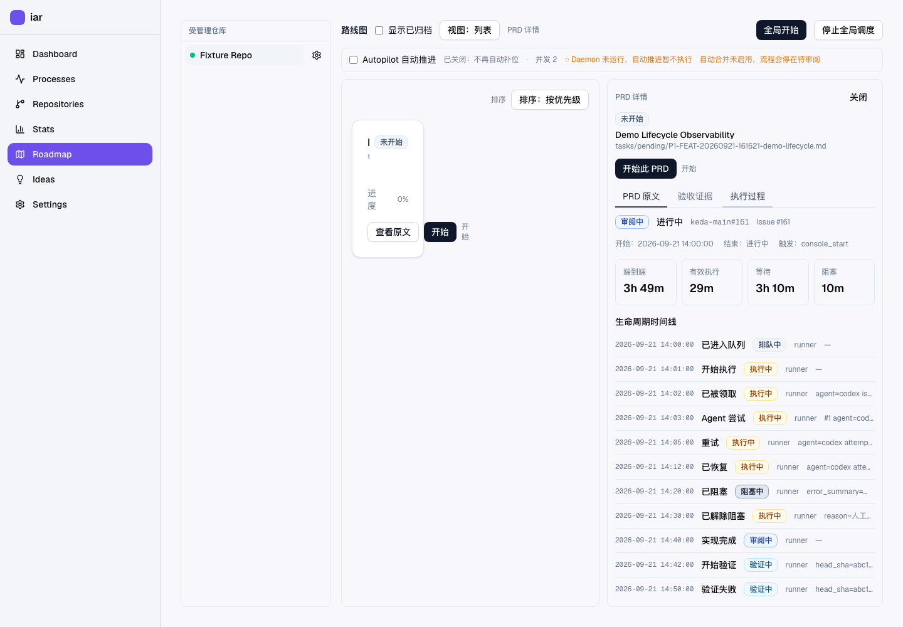
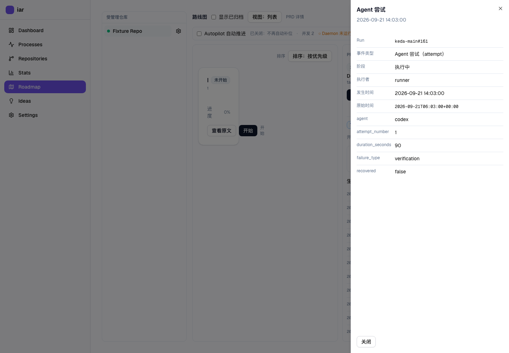
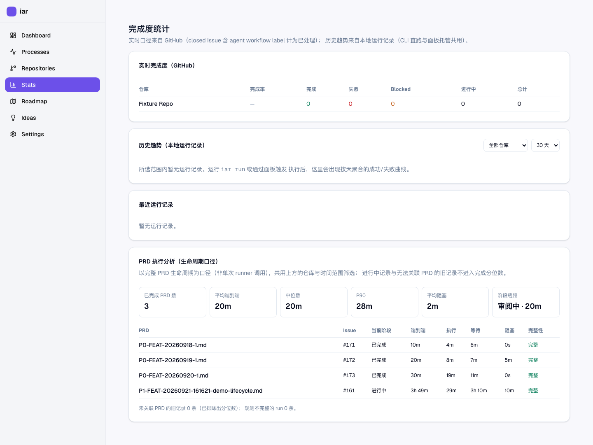
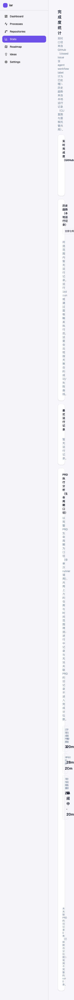

# Evidence Report — P1-FEAT-20260921-161621 PRD 生命周期观测与执行分析

- PRD: `tasks/pending/P1-FEAT-20260921-161621-prd-lifecycle-observability.md`
- 分支 / worktree: `prd-lifecycle-observability` @ `/Users/zata/code/keda-worktrees/prd-lifecycle-observability`
- 对应验证计划: `<stem>.verification-plan.md`
- 独立 verifier 结论: `<stem>.verifier-report.md`

## 人审导航（约 10 秒）

1. 打开 `rv-1-roadmap-lifecycle.png`：Roadmap 选中 PRD → **执行过程** 标签显示当前阶段
   `审阅中`、`进行中`、run id `keda-main#161`、Issue #161，以及端到端 / 有效执行 /
   等待 / 阻塞四项耗时与按时间排序的事件时间线（含失败 attempt、重试、恢复、阻塞、解除阻塞）。
2. 打开 `rv-1b-roadmap-event-drawer.png`：点击 `Agent 尝试` 事件后，抽屉显示 Run
   `keda-main#161`、时间、Agent `codex`、`failure_type=verification`、`recovered=false`。
3. 打开 `rv-2-prd-stats.png`：Stats 的 **PRD 执行分析（生命周期口径）** 卡片显示
   已完成 PRD 数、平均端到端、中位数、P90、平均阻塞、阶段瓶颈，以及每 PRD 明细表，
   底部披露 `未关联 PRD 的旧记录 0 条（已排除出分位数）`。
4. （可选）打开 `rv-2b-narrow-prd-stats.png`：390×844 真实页面无横向溢出。

可点击文本底稿仍在 `tasks/evidence/<stem>/`（`rv-1-lifecycle-detail.json`、
`rv-2-stats-response.json`）与 `docs/prototypes/prd-lifecycle-observability.html`。

## 呈递物

### rv-1 · Roadmap 单 PRD 执行过程（真实入口）



本地图片。打开命令：`open /Users/zata/code/keda-worktrees/prd-lifecycle-observability/tasks/evidence/P1-FEAT-20260921-161621-prd-lifecycle-observability/rv-1-roadmap-lifecycle.png`

### rv-1b · 事件抽屉（可从失败事件定位 attempt / Agent / 原因）



本地图片。打开命令：`open /Users/zata/code/keda-worktrees/prd-lifecycle-observability/tasks/evidence/P1-FEAT-20260921-161621-prd-lifecycle-observability/rv-1b-roadmap-event-drawer.png`

### rv-2 · Stats PRD 端到端统计



本地图片。打开命令：`open /Users/zata/code/keda-worktrees/prd-lifecycle-observability/tasks/evidence/P1-FEAT-20260921-161621-prd-lifecycle-observability/rv-2-prd-stats.png`

### rv-2b · 窄屏（390×844）真实页面，无横向溢出



本地图片。打开命令：`open /Users/zata/code/keda-worktrees/prd-lifecycle-observability/tasks/evidence/P1-FEAT-20260921-161621-prd-lifecycle-observability/rv-2b-narrow-prd-stats.png`

验证层级：**真实入口**（真实 console 静态页 + 真实后端）。采集脚本在该视口下断言
`documentElement.scrollWidth - clientWidth <= 2px`，不满足即失败，因此这张图同时是
“窄屏无横向溢出”的可执行证据。

诚实披露：截图里文字被压得很窄，是因为**既有 app shell 的侧栏在 <640px 不折叠**
（影响全部页面，非本 PRD 引入）。本 PRD 新增的生命周期卡片自身是响应式的
（指标 `grid-cols-2 sm:grid-cols-3 lg:grid-cols-6`，明细表包在 `overflow-x-auto` 里），
窄屏下的**目标布局**另由交互原型（rv-5）在 375px 下演示。生命周期视图的窄屏呈现
因此只声称“无横向溢出”，不声称“窄屏排版已优化”。

## 真实入口证据（rv-1 / rv-2 的穿越边界）

采集方式：`SKIP_CONSOLE_SYNC=1 bash tasks/evidence/<stem>/scripts/capture_real_console.sh`
（脚本与临时工作目录被 .gitignore 排除，不进 diff）。

脚本行为：

1. 在临时 `HOME` + `IAR_CONFIG` 下建一个一次性 git 仓库（含 `.iar.toml` 与 PRD）；
2. 用**真实** `SqliteConsoleStore` + `record_lifecycle_event/terminal` 把账本种入临时
   `console.db`（真实 schema、真实写入函数，不是直接拼 SQL）；
3. 启动**真实** uvicorn（同一进程提供已 `just console-sync` 的静态前端与真实 `/api/v1`
   + 真实 SQLite，端口 8899，隔离于用户 `~/.iar` 与常驻 8313 实例）；
4. 用**真实** Chromium 只 mock 会话守卫 `/api/auth/me`，其余请求全部打到真实后端。

真实 HTTP fresh-read（`rv-1-lifecycle-detail.json`）：

```text
run_id=keda-main#161  current_phase=reviewing  in_progress=true  history_complete=true
durations: end_to_end=13292.9s  active=1740.0s  waiting=10952.9s  blocked=600.0s
events=12（queued/started/claimed/attempt/retry/recovered/blocked/unblocked/
         implementation_completed/validation_started/validation_failed/review_started）
校验：active + waiting + blocked = 13292.9 = end_to_end ✓（互斥可复算；
      blocked=600s 来自 06:20→06:30 的真实阻塞区间，unblocked 事件已由 runner 产出）
```

真实 HTTP fresh-read（`rv-2-stats-response.json`）：

```text
completed_runs=3  average=1200.0s  median=1200.0s  p90=1680.0s  average_blocked=100.0s
bottleneck_phase=reviewing  bottleneck_phase_seconds=1200.0
unlinked_run_count=0  incomplete_run_count=0  runs=4
```

`p90` 与固定 fixture 手工复算一致：完成 run 端到端为 600 / 1200 / 1800 秒，
sorted 后 P90 位置 `(3-1)*0.9=1.8` → `1200 + (1800-1200)*0.8 = 1680`。

## e2e（真实 Next.js 页面 + 浏览器交互）

命令：

```bash
PLAYWRIGHT_IDENTIFIER=local-operator PLAYWRIGHT_PASSWORD=local \
  just e2e tests/smoke/roadmap-prd-lifecycle.spec.ts
```

结果：`5 passed (7.7s)`

- `RV-1 roadmap detail shows phase, duration split and ordered timeline`
- `RV-1b failed attempt and retry history is preserved`
- `RV-3b incomplete ledger shows an explicit warning`
- `RV-2 stats shows PRD lifecycle percentiles, bottleneck and detail rows`
- （另 1 项为 auth setup）

说明：该 spec 走真实 Next.js 页面、真实路由与浏览器交互；为 CI 稳定，用与真实响应
逐字一致的 fixture 顶替 GitHub 与 lifecycle/stats 两个读端点。**真实 FastAPI +
SQLite 的穿越由上面的 `capture_real_console.sh` 承担**（PRD rv-1/rv-2 的
`real_entry` 已按此改写），两者证据分开，不互相冒充。spec 的产物写入
`tasks/evidence/<stem>/e2e/` 子目录，与 harness 的真实响应文件互不覆盖。

## 后端与文档验证

| 检查 | 命令 | 结果 |
|---|---|---|
| 生命周期 + store + API + 相关回归 | `uv run pytest tests/test_prd_lifecycle.py tests/test_console_store.py tests/test_roadmap_api.py tests/test_console_stats.py tests/test_review_once.py tests/test_agent_runner_validation.py -q -o addopts=""` | `183 passed` |
| 全仓回归（权威） | `CI=true PYTEST_ADDOPTS="--deselect ...test_explicit_free_port_returned_as_is" just test all` | `2416 passed, 1 deselected` |
| 全仓回归（不过滤） | `uv run pytest tests -q -o addopts=""` | `2416 passed, 1 failed` —— 唯一失败为 `test_cli_console.py::TestResolveConsolePort::test_explicit_free_port_returned_as_is`：`socket.bind(58321)` 被本机无关进程（codex ↔ 代理的 ESTABLISHED 连接）占用而失败，**同一测试在 `main` 上同样失败**；该用例与本 PRD 无关，绝对路径见上表的“权威”一行 |
| 架构边界 | `uv run python hooks/shared/check_architecture.py` | `✅ 架构依赖方向全部合法`（259 文件） |
| 文档构建 | `uv run mkdocs build --strict` | exit 0 |
| 前端类型 | `pnpm --dir frontend-public typecheck` | exit 0 |
| 前端构建 | `pnpm --dir frontend-public build` | `✓ Compiled successfully`，13/13 静态页 |

## 覆盖 PRD §9.2 的关键项

- **event key 幂等 / 乱序稳定 / 重试不覆盖 / 四类耗时可复算**：
  `test_event_append_is_idempotent_by_event_key`、
  `test_duration_classification_is_mutually_exclusive`、
  `test_stats_percentiles_over_completed_runs_only`。
- **store 故障负控确实变红**：`test_store_failure_marks_run_incomplete_without_raising`
  （主流程不抛异常 + fresh 读回 `history_complete=false`）与
  `test_negative_control_healthy_store_stays_complete`（去掉故障后必须为 true）。
- **旧记录可读且被明确降级**：`test_legacy_runs_are_counted_and_excluded`、
  `test_console_prd_lifecycle_stats_endpoint`（既有 `run_records`/`attempt_records`
  schema 未改，`list_recent_runs` 仍可用）。
- **schema 迁移**：`test_v4_database_migrates_to_latest_and_creates_lifecycle_tables`
  从 v4 形态补 v5 表并保留既有运行历史。
- **前端契约一致**：`fetchPrdLifecycle` / `fetchPrdLifecycleStats` 与后端 DTO 逐字段对齐，
  `typecheck` + `build` 通过；PRD 详情新增 `执行过程` 标签，Stats 新增 PRD 统计卡片。
- **文档同步**：`docs/guides/agent-runner.md` 新增“PRD 生命周期账本与执行分析（Lifecycle Ledger）”
  小节并在 Console API 一览补充两个端点。

## R1 复核整改（第一轮 verifier REJECT → 整改）

第一轮独立 verifier 判 REJECT（1 HIGH / 2 MEDIUM / 4 LOW）。整改内容：

- **HIGH — 终态后重试破坏「执行 + 等待 + 阻塞 == 端到端」**：
  根因是 `finished_at` 由首个终态写定且永不清理，而同 stable run id 的重试会追加
  更晚的事件（如 10:10 收口、11:00 重试），结束边界早于事件 → 区间为负、四数自相矛盾，
  且出现 `outcome=failed / in_progress=false` 却 `current_phase=reviewing`。
  修法（两层防护）：
  1. 新增 `IPrdLifecycleStore.reopen_lifecycle_run`：`record_lifecycle_event` 写入
     **非终态**事件时重开已收口 run（清 `finished_at`/`outcome`），因此重试/解除阻塞后
     该 run 回到“进行中”；`failed`/`blocked` 事件仍完整保留在时间线上（事件不可变）。
  2. `classify_durations` 的结束边界改为 `max(finished_at, 最后事件时间, now 或
     finished_at)` 的钳制形式，保证任何脏数据下各区间非负、三段之和恒等于端到端。
  回归：`test_retry_after_terminal_reopens_run_and_keeps_duration_invariant`、
  `test_classify_durations_stays_consistent_when_finish_precedes_events`。
- **MEDIUM — e2e spec 与 harness 写同一证据文件名会污染 provenance**：spec 产物改写到
  `tasks/evidence/<stem>/e2e/` 子目录（已复跑确认，真实响应文件未被覆盖）。
- **MEDIUM — rv-1 的 `real_entry` 与实测入口不一致**：PRD Realistic Validation Plan 的
  rv-1/rv-2 `real_entry` 改为 `capture_real_console.sh` 并新增 `entry_note`；Playwright
  spec 明确定位为补充 UI 流程入口。
- **LOW — 跨时区字典序**：事件排序改为按解析后的 `datetime`（`_event_sort_key`），
  回归 `test_classify_durations_orders_events_by_real_time_across_offsets`。
- **LOW — 终态 docstring 与写行为不符**：改为描述“重开会把当前状态字段回到进行中，
  但事件历史不丢”，并让 `reopen_lifecycle_run` 只在已收口时生效。
- **LOW — UNBLOCKED 无生产者**：runner 在 `blocked_resolution` 成功领取后追加
  `UNBLOCKED` 事件；rework 分支追加 `RETRY` 事件（`running_rework` 消费标记时）。
- **LOW — Change Impact Tree 与实测文件不符**：已把 `agent_runner_closeout.py` 节点替换为
  真实触达的 `agent_runner_validation_gate.py` / `review_once.py` + `review_daemon.py` /
  `cli_parsed_commands/runner.py`，并补充证据 harness 节点。

## 已知限制（不声称完成）

1. **PRD 路径重命名别名未实现**：稳定 run id 以 Issue 编号为锚，改名后同一 run 继续
   累积事件并更新为最新 `prd_path`，但没有“旧路径 → 新路径”的别名表；用旧路径书签
   查不到历史。PRD §12 要求“若实现期发现无可靠重命名语义须补齐”——本实现选择了
   “以 Issue 编号锚定身份、只保最新路径别名”的方案，未实现旧路径回溯。
2. **`interactive_decision._execute_review_once` 路径未接生命周期观测**：该入口不经
   CLI/daemon 的 `run_history_store`，其中 review 事件不落账本；CLI `iar review` /
   `iar review-daemon` / `iar run` / `iar daemon` 已接入。
3. **`blocked_continue`（`iar blocked-continue` 子命令）路径未接观测**：该入口自行
   构造最小上下文，`UNBLOCKED` 目前只在 `run_once` 的 blocked_resolution 分支产出。
4. **阶段瓶颈口径**：阶段瓶颈只在等待类阶段（排队/验证/审阅/合并）中挑选，
   执行与阻塞已在顶部指标单独呈现；该选择写入代码注释与文档，属有意口径。
5. **窄屏排版**：既有 app shell 侧栏在 <640px 不折叠，窄屏下正文被压窄；这是**既有**
   行为（影响全部页面，非本 PRD 引入）。本 PRD 只声称生命周期视图在窄屏无横向溢出，
   目标窄屏布局由交互原型演示。

## 最终代码树

- 证据在本分支最终代码树上重采（见上述命令与截图）；本报告与截图、JSON 均位于同一
  evidence 目录。
- 冻结凭证（供 verifier 校验实现未被改动）：
  `git diff HEAD -- src tests frontend-public docs | shasum -a 256` 的输出记录于
  `<stem>.verifier-report.md`。
