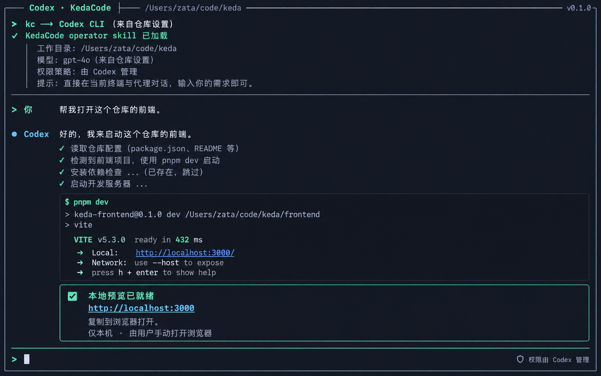

## 人审导航 / Human Review Navigation

| 要看什么 | 呈递物 | 打开方式 | 观察与状态 |
|---|---|---|---|
| 裸 `kc` 的原生 TTY、当前仓库/operator skill 与明确请求后返回的 preview URL | PRD 9.1 要求的真实运行截图 `rv-1-kc-terminal-preview.png` **未产生**。实际 TTY 尝试输出见 `rv-1-kc-native-session.txt`；人工审查条目集中在 `human-review-checklist.md`。概念原型仅用于对照设计，不是运行证据。 | `open tasks/evidence/P1-FEAT-20261009-123512-kc-agentic-entry-and-stall-supervision/human-review-checklist.md`；原始 TTY：`open tasks/evidence/P1-FEAT-20261009-123512-kc-agentic-entry-and-stall-supervision/rv-1-kc-native-session.txt` | 预期显示 provider、repo、skill/权限提示；裸启动无项目 server；显式请求后显示 loopback URL。实际只确认真实 `kc` 启动了 Claude/Codex TUI；第五次复核仍在用户输入前失败，preview 未启动。HTML 伴侣已按模板生成，但 CUA 报告无可用浏览器、Chrome 使用被安全策略拒绝，未完成 pageerror/翻页/结果卡 QC；因此不把 HTML 标作已验证呈递物。 |

**人审状态：RV-1 INCONCLUSIVE。** 没有真实 provider 对话与 `rv-1-kc-terminal-preview.png`，因此本报告不请求接受 §2 决定三/四，也没有 PR/CI 链接。可阅读 [人工审查清单](human-review-checklist.md)，但当前不具备对 RV-1 作最终确认的证据。唯一关联任务为 [GitHub Issue #256](https://github.com/ZataZhang/keda/issues/256)；当前工作树尚未提交或发布。

执行器已将真实 PTY 输出与 §9.1 的期望逐项对照：provider cwd 是当前 worktree；Claude 返回 `ConnectionRefused`；Codex TUI v0.162.0 启动后因宿主文件写入权限失败。第五次最终裸入口复核仍在首个输入前返回 `Operation not permitted`，没有观察到 provider 对话、skill 回复、preview 启动或 loopback URL。UI 自动化环境不允许打开 Terminal app，因此没有截图；没有生成或伪造图片。

## 自动证据摘要

| RV | 状态 | 关键结果 | 原始证据 |
|---|---|---|---|
| rv-1 | **INCONCLUSIVE** | skill-conflict 负控红，修复后 22 个 session 测试与 25 个 packaged-skill 测试通过（47 total）；最终空参数裸 `kc` 确实启动 Codex 原生 TTY，但宿主拒绝首个输入前的 provider 操作，缺少对话、preview 与截图。 | `rv-1-automated-tests.txt`、`rv-1-kc-native-session.txt` |
| rv-2 | PASS（executor evidence） | `kc --help`、`kc repl --help`、`kc console --help`、schema 与无额外参数的 no-TTY 裸入口符合预期；真实 console-script 退出码负控红，修复后 11 项 CLI/parser/schema/completion 测试与 18 项旧 REPL 会话测试通过。 | `rv-2-cli-routing.txt`、`rv-2-negative-control.txt` |
| rv-3 | PASS（executor evidence） | 63 个监督测试通过；真实子进程组精确取消，unknown owner 安全交班；诊断后 process creation identity 改变的负控变红。新增执行循环集成与 gate 负控：停滞取消复用 recovery budget，原验证/RV/verifier 次序仍在，验证失败不成功；恢复门禁集 5 passed。architecture reuse 搜索/负控通过，没有迁移或重复持久化。 | `rv-3-stall-supervision.txt`、`rv-3-architecture-reuse.txt`、`rv-3-stall-recovery-gates.txt` |
| rv-4 | PASS（executor evidence） | preview 20 tests、session 22 tests、配置/监督 10 tests；全局/仓库分层与真实 preview process group 生效；loopback 和 process creation identity 两个负控均红。 | `rv-4-config-supervision.txt` |

证据详情与复现命令见本目录的 `evidence.json` 和 `P1-FEAT-20261009-123512-kc-agentic-entry-and-stall-supervision.verification-plan.md`。RV-2/3/4 的 PASS 表示 executor 收集的自动证据符合各项 oracle，独立 verifier 尚未给出 verdict。RV-3 recovery/gate 定向集 5 passed；最新全量集 `3903 passed, 1 skipped`，full lint、reuse lint 与严格文档构建已通过；这些结果不替代 RV-1 真实 provider 对话与 preview 回传。

## 验证限制

- 最终全量 pytest：`UV_CACHE_DIR=/private/tmp/issue256-uv-cache just test all` 为 `3903 passed, 1 skipped`；既有 PRD 定向集为 `309 passed`，新增 recovery/review/verifier gate 定向集为 `5 passed`。早期 4 个 daemon CLI 用例与 10 个 config migration 用例暴露了宿主锁目录/进程扫描权限限制；测试现通过 CLI 测试中受控 lock 与 scanner 注入隔离宿主环境，同时保留锁管理与 scanner 不可用时 fail-closed 的独立测试。没有重定向 HOME、改 guard 或放宽产品安全检查。
- 最终 `UV_CACHE_DIR=/private/tmp/issue256-uv-cache just lint --full`、`just lint --reuse` 与 `uv run mkdocs build --strict` 均通过；`just lint --reuse` 报告的必要适配器签名重复只通过方法签名周围的 `jscpd:ignore` 注释限定，未放宽重复检测 hook 或跳过方法体。
- PRD checker `--all` 通过并能解析 FR-1 至 FR-8；只读运行 `--check-provided --archive-ready` 仍会列出真实 TTY/preview 等未解决的 executor-owned checklist 项，当前 PRD 不满足交付/归档门禁。Human-Confirmed 仍全部留空，banner 与 checklist 公式一致。恢复验证/review gate 已由本轮 `rv-3-stall-recovery-gates.txt` 补证。 `check_prd_evidence.sh` 依据 §7.8 的明确声明确认没有前端变更，因此本需求不要求虚构截图。
- 修复轮复现的 runner pre-commit 首错为 `agent_runner_backlog.py:776` 的 F821。该文件与当前 HEAD 一致，问题来自已合入 backlog enqueue 路由对旧 `_BACKLOG_CACHE` 的遗留引用；现改为复用 `request_backlog_resync()`，并新增 enqueue 路由重扫回归测试。此前默认 uv cache 因宿主 home 只读而无法初始化；设置 `UV_CACHE_DIR=/private/tmp/issue256-uv-cache` 后，`SKIP=check-test-flag UV_CACHE_DIR=/private/tmp/issue256-uv-cache just lint --full` 与 runner 原始 `pre-commit run --all-files --show-diff-on-failure` 均通过，Ruff 全量检查通过。受影响 API 测试 13 passed。
- `.last_tested_commit` 由成功的 `just test all` 写入当前测试工作树标识；最终普通 `just lint --full` 纳入 `check-test-flag` 并通过，没有用 skip flag 声称最后验证已完成。
- RV-3 新增架构复用脚本检查 migration/persistence 文件树、构造临时 migration 负控并运行 `check_architecture.py`；临时 defect 被捕获，真实树检查扫描 348 个文件且无依赖违规。证据同时 grep 到现有 invocation event store、恢复预算、verification 与 publish/review 入口。
- PRD checker `--all` 当前通过；archive-ready 仍因真实 RV-1 对话/preview 以及 runner-owned 独立 verifier 未完成而不能归档。全量/定向测试、full lint、reuse lint 和 strict docs 已通过；独立 verifier 未运行。Human-Confirmed 三项保持未勾选。
- 最终核对 `evidence.json`：4 项均使用正整数编号，`evidence_files` 为纯文件名且文件存在，每个 RV 文件仅保存该项输出，负控红与修复后绿均有记录；结构化 manifest 通过检查。evidence manifest 已放行，原始日志仍保持本地忽略。真实 provider 对话、skill 回复、对话发起 preview 回传与所需终端 PNG 仍未完成，RV-1 继续 INCONCLUSIVE。
- 按 PRD skill 生成 `human-review-checklist.md` 及从官方模板拷贝的 HTML companion，并在文档中逐项披露缺失的真实 TTY/preview 证据。当前 CUA browser inventory 为空，尝试打开 Chrome 被安全策略拒绝，因此 HTML 的真实浏览器零 pageerror、首卡可见、翻页和结果卡验证未完成；不将它标为已验证，不交付为通过状态。
- RV-2 复核时真实裸 `kc` 的空 argv 管道首探针实际返回 0，虽带 `--repo` 的 CLI 测试通过；已在 `cli_typer_app.main()` 显式处理无参数入口并添加真实 console-script no-TTY 与空 argv TTY dispatch 回归。负控把 no-TTY 返回改成 0 后真实入口测试变红；修复后管道输出帮助并以 1 退出，11 项 CLI/parser/schema/completion 测试与 18 项旧 REPL 会话测试通过。证据命令中的 zsh 只读特殊变量 `status` 已改为 `result_code`。
- 本报告未绑定最终 commit/tree；runner 需要在最终提交后生成 tree 与证据哈希，并运行独立 verifier。

## 结论

实现和 RV-2/3/4 自动证据已在工作树中，RV-1 真实 TTY 对话与 preview oracle 未完成。PRD 留在 `tasks/pending/`，Human-Confirmed 未勾选，当前不具备归档或发布条件。

- 最终 manifest 校验（当前工作树）：4 个 RV 分组、8 个唯一 raw evidence 文件；正整数 item_number、纯文件名、文件存在。RV-3/RV-4 新增的 process creation identity 负控均记录 expected fail 与 RESTORED_OK。恢复门禁定向集 5 passed、full tests `3903 passed, 1 skipped`、full/reuse lint、mkdocs strict 与 PRD checker 已通过；真实 RV-1、独立 verifier 与 PRD archive-ready 尚未通过。
