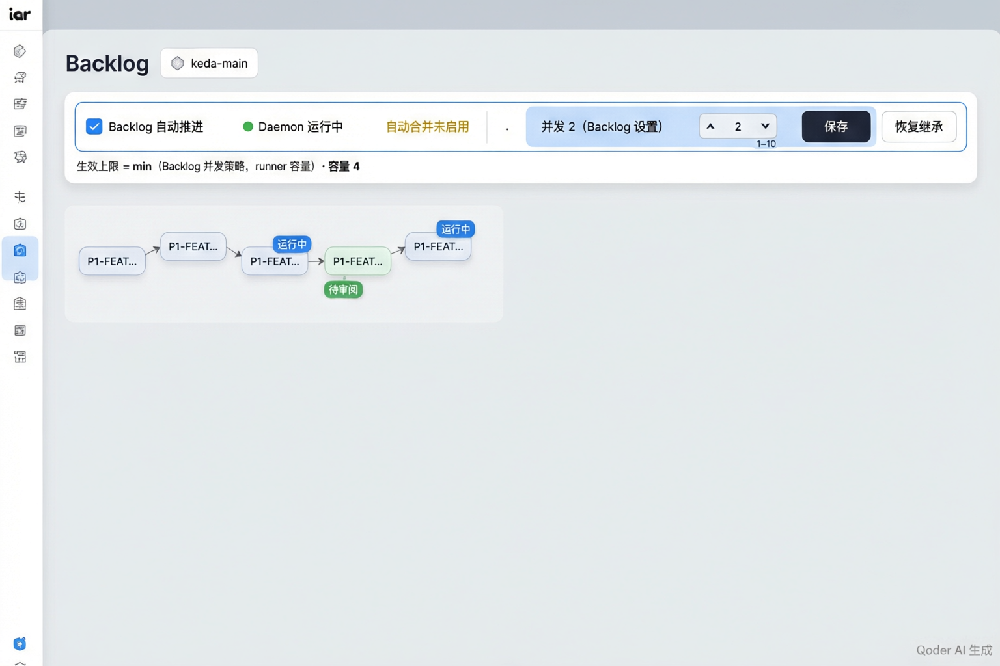

## 人审导航 / Human Review Navigation

### Backlog 并发控制条：设计意图与真实页面记录

| 呈递项 | 本地路径与打开方式 | 核对结果 |
|---|---|---|
| Issue #266 真实 console 页面状态记录（五态） | `tasks/evidence/P1-FEAT-20261010-011714-unified-auto-concurrency-ceiling`；`open "/Users/zata/code/keda/.iar-worktrees/issue-266/tasks/evidence/P1-FEAT-20261010-011714-unified-auto-concurrency-ceiling"` | 五态页面、API / PATCH / fresh GET / SQLite 截图来自此前真实 `kc console` red→green 运行，记录见 `rv-3-console-roundtrip.txt`。本轮 `just console-sync` 成功，但在页面断言前 Chromium 启动被 macOS 拒绝（`Permission denied (1100)`），故不把本轮重试记为 PASS；诊断见 `rv-3-backlog-control-roundtrip.txt`。本轮只改 daemon / backlog action 的 running 预算、CLI 报告与测试，未改前端页面、settings GET/PATCH 路由或设置读写用例；当前代码差异与浏览器限制见 `rv-3-tree-equivalence.txt`。 |

- Issue: [GitHub #266](https://github.com/ZataZhang/keda/issues/266)
- Pull request: 尚未创建；本工作流没有创建 PR。
- CI: 尚无关联 PR / CI run。
- 执行器交叉核对：rv-1、rv-2、rv-4、rv-5 已在本轮 review 工作树重跑并通过；每项的 base commit 与 source/test diff 指纹见对应 `rv-N-implementation-tree.txt`。RV-3 本轮重试在 Chromium 启动时被环境权限拒绝，旧页面红→绿证据仍保留，且本轮改动未触及页面验证所走的前端与设置读写边界；该重试状态为 INCONCLUSIVE，不写成产品 PASS。
- 快速自检：`rv-3-console-roundtrip.txt` 包含 `NEG CONTROL PASSED`、`RESULT: PASS` 和 `RV-3 PASSED`；`rv-3-console-backlog-report.txt` 记录 policy=2、capped effective=4、saved4-fresh=4 及恢复后 `[DB 终态] ... None`。

#### 目标原型（design intent；不是运行时证据）



原型图只表达控制条的目标设计。以下截图来自此前真实 `kc console` 页面流程；验证跨过页面、API 与 SQLite 边界。截图验证层级为 production UI，当前 review 轮次的浏览器启动受阻详见 RV3 诊断。

#### 继承态

**目标值：** 并发 4（继承 runner 配置）；fresh GET source=inherited、effective=4、max_parallel=null。


本地图片（本轮真实页面截图）：`rv-3-backlog-concurrency-inherit.png`。
打开原图：`open "/Users/zata/code/keda/.iar-worktrees/issue-266/tasks/evidence/P1-FEAT-20261010-011714-unified-auto-concurrency-ceiling/rv-3-backlog-concurrency-inherit.png"`。


本地图片（本轮真实页面截图）：`rv-3-backlog-concurrency-inherit-page.png`。
打开原图：`open "/Users/zata/code/keda/.iar-worktrees/issue-266/tasks/evidence/P1-FEAT-20261010-011714-unified-auto-concurrency-ceiling/rv-3-backlog-concurrency-inherit-page.png"`。

#### 策略设置态

**目标值：** 并发 2（Backlog 设置）；PATCH max_parallel=2 返回 200，fresh GET source=policy、effective=2。


本地图片（本轮真实页面截图）：`rv-3-backlog-concurrency-policy.png`。
打开原图：`open "/Users/zata/code/keda/.iar-worktrees/issue-266/tasks/evidence/P1-FEAT-20261010-011714-unified-auto-concurrency-ceiling/rv-3-backlog-concurrency-policy.png"`。


本地图片（本轮真实页面截图）：`rv-3-backlog-concurrency-policy-page.png`。
打开原图：`open "/Users/zata/code/keda/.iar-worktrees/issue-266/tasks/evidence/P1-FEAT-20261010-011714-unified-auto-concurrency-ceiling/rv-3-backlog-concurrency-policy-page.png"`。

#### 受容量限制态

**目标值：** 策略为 8、容量为 4 时显示并发 4（受 runner 容量限制）；fresh GET source=capped_by_capacity、effective=4。


本地图片（本轮真实页面截图）：`rv-3-backlog-concurrency-capped.png`。
打开原图：`open "/Users/zata/code/keda/.iar-worktrees/issue-266/tasks/evidence/P1-FEAT-20261010-011714-unified-auto-concurrency-ceiling/rv-3-backlog-concurrency-capped.png"`。


本地图片（本轮真实页面截图）：`rv-3-backlog-concurrency-capped-page.png`。
打开原图：`open "/Users/zata/code/keda/.iar-worktrees/issue-266/tasks/evidence/P1-FEAT-20261010-011714-unified-auto-concurrency-ceiling/rv-3-backlog-concurrency-capped-page.png"`。

#### 保存后 fresh 态

**目标值：** 刷新后并发 4（Backlog 设置）；PATCH / fresh GET 都返回策略 4。


本地图片（本轮真实页面截图）：`rv-3-backlog-concurrency-saved4-fresh.png`。
打开原图：`open "/Users/zata/code/keda/.iar-worktrees/issue-266/tasks/evidence/P1-FEAT-20261010-011714-unified-auto-concurrency-ceiling/rv-3-backlog-concurrency-saved4-fresh.png"`。


本地图片（本轮真实页面截图）：`rv-3-backlog-concurrency-saved4-fresh-page.png`。
打开原图：`open "/Users/zata/code/keda/.iar-worktrees/issue-266/tasks/evidence/P1-FEAT-20261010-011714-unified-auto-concurrency-ceiling/rv-3-backlog-concurrency-saved4-fresh-page.png"`。

#### 恢复继承 fresh 态

**目标值：** 并发 4（继承 runner 配置）；PATCH max_parallel=null 后设置行删除，fresh GET source=inherited。


本地图片（本轮真实页面截图）：`rv-3-backlog-concurrency-restored-fresh.png`。
打开原图：`open "/Users/zata/code/keda/.iar-worktrees/issue-266/tasks/evidence/P1-FEAT-20261010-011714-unified-auto-concurrency-ceiling/rv-3-backlog-concurrency-restored-fresh.png"`。


本地图片（本轮真实页面截图）：`rv-3-backlog-concurrency-restored-fresh-page.png`。
打开原图：`open "/Users/zata/code/keda/.iar-worktrees/issue-266/tasks/evidence/P1-FEAT-20261010-011714-unified-auto-concurrency-ceiling/rv-3-backlog-concurrency-restored-fresh-page.png"`。

## RV 验证结果

| RV | 结果 | red→green 证据与结论 |
|---|---|---|
| 1 | PASS | 本轮 `rv-1-daemon-ceiling.txt` 记录计数失真后实际 running 4 > ceiling 2；真实 daemon 绿态记录预算 2/1/0、峰值 2，以及 unset 继承容量 10。 |
| 2 | PASS | 本轮 `rv-2-unified-backfill-start.txt` 记录负控误补位 2 而期望 6；真实 CLI / 路由核对继承、策略、在跑预算与 start-global 输出。 |
| 3 | 此前真实运行 PASS；本轮重试 INCONCLUSIVE | `rv-3-console-roundtrip.txt` 和十张页面截图记录此前的页面 red→green、五态、fresh GET、PATCH 与 SQLite 终态。本轮 `rv-3-backlog-control-roundtrip.txt` 记录 Chromium 在页面断言前因 `Permission denied (1100)` 退出；前端页面与 settings GET/PATCH 实现没有进入本轮生产 diff。 |
| 4 | PASS | 本轮 `rv-4-explicit-run.txt` 记录错误 ceiling 会令定向运行不启动；正常路径 `kc run --issue 100 exit=0` 并完成，本地 fixture 发布成功，`--all-ready` 与 daemon 同跑仍 exit 5。 |
| 5 | PASS | 本轮 `rv-5-failclosed-recovery.txt` 记录旧异常传播导致 pass failed 且未发现 running 恢复候选；绿态记录 `pass_failed=0`、ready 保留、running 候选被发现且 `running_touched=True`。 |

### RV3 真实页面 red→green

```bash
just console-sync && cd tasks/evidence/P1-FEAT-20261010-011714-unified-auto-concurrency-ceiling/scripts && ../../../../.venv/bin/python rv3_negative.py && ../../../../.venv/bin/python rv3_console.py
```

此前真实页面运行已满足 red→green 条件：旧 bundle 时，继承和恢复继承显示 2 而 fresh API 为 4，容量受限态显示 8 而 effective 为 4，页面断言输出 `RESULT: FAIL` 与 `NEG CONTROL: RED 已复现`；负控脚本随后按字节还原 bundle。正常 bundle 下，真实页面控件完成继承、设置 2、受限 8、保存 4、恢复继承五态；页面文本、fresh API、PATCH 请求 / 响应和 SQLite 删除语义一致，输出 `RESULT: PASS` / `RV-3 PASSED`。完整 stdout 与截图见 `rv-3-console-roundtrip.txt`、`rv-3-console-backlog-report.txt` 和十张 `rv-3-backlog-concurrency-*.png`。本轮 `just console-sync` 成功，但 Playwright Chromium 在页面断言前触发 macOS `Permission denied (1100)`，负控未能运行到页面、不能作为当前负控证据；bundle 已按字节还原，诊断保留在 `rv-3-backlog-control-roundtrip.txt`。当前修复只涉及 daemon / backlog action 的 repository-wide running count、CLI 报告与测试；`frontend-public/`、settings GET/PATCH 路由、设置读写用例未变。历史截图因此只证明这些未变的页面边界，不能当作整棵当前工作树的树等价证据。

## 证据身份与范围

- 当前基线 commit：`bf9e39e200b0b4f831e23be68118bc429124e505`；RV-1/2/4/5 本轮使用该 review worktree 生产源码。每项的 production/test diff SHA-256 在 `rv-N-implementation-tree.txt`。
- RV-1 本轮真实 daemon 覆盖 policy=2 下 0/1/2 个预置 running 对应预算 2/1/0、容量 10 未设置继承并认领 6；空计数负控读取 ceiling+1 查询并观测到 running 4 > ceiling 2。RV-2 真实 CLI 与 HTTP 全局开始场景额外注入无 PRD 锚点的 running Issue，验证补位 / 全局开始按仓库标签扣减并在上限已满时零启动。RV-4 定向豁免红/绿控制通过。RV-5 count 与恢复候选查询负控通过；当前 fail-closed 路径连续完成多轮，无 ready 新认领，既有 running 候选仍被发现。
- 本轮 `UV_CACHE_DIR=/private/tmp/uv-cache-issue-266 uv run pytest --no-testmon tests/test_agent_runner_orchestrate.py tests/test_backlog_actions.py tests/test_backlog_advance.py`：75 passed。`just test` 因已有有效 test flag 跳过；本轮未运行 `just test all`，此前其他验证树的全量测试结果不代表本轮代码。
- 本轮 `just lint --reuse`、`just lint --full`、`uv run mkdocs build --strict`、`git diff --check` 均 exit 0；MkDocs 仅报告既有 nav/link 信息提示。默认 `just lint` 首次受宿主 pre-commit 缓存目录权限阻断；改用临时 `PRE_COMMIT_HOME` 重跑后 exit 0，但默认 staged-only 模式没有暂存文件，不能代替全文件验证；本轮全文件验证由 `just lint --full` 覆盖。
- 更新后的 `evidence.json` 已由仓库 `validate_manifest.py` 校验：RV1–RV5 均覆盖，字段、命名、文件存在性和负控声明通过。RV-3 本轮浏览器权限阻断单独记录，不作为产品负控或本轮 PASS。
- Canonical PRD 实际位于 `tasks/archive/`；本轮遵守归档边界：没有移动或编辑该 PRD，也没有代勾 Human-Confirmed 项。
- rv-3 图片对应此前的真实页面五态运行；完整页面图与控制条裁切图均逐张列出。当前 front end 与设置 GET/PATCH 目标边界未变，但整棵工作树有本轮 backend action/runtime 修改，详见 `rv-3-tree-equivalence.txt` 与各 RV 的工作树指纹。

## Pre-PR review repair revalidation

- Review finding repaired: when the ready budget reached zero, the candidate loop stopped before recognizing an already-published Direct PR handoff. The loop now identifies `direct_pr_cleanup` first, keeps that recovery item outside the new-ready budget, and still bounds the overall selected list by `effective_max_issues`. The normal ready candidate remains unclaimed when the ceiling is full.
- Regression test: `UV_CACHE_DIR=/private/tmp/uv-cache-issue-266 uv run pytest --no-testmon tests/test_agent_runner_orchestrate.py -q` — **52 passed**. This includes parameterized checks that cleanup does not consume a ready slot and still runs when the ceiling is saturated. The focused first attempt used an inaccessible default uv cache; the rerun with the temporary cache passed.
- Full-file lint: `SKIP=check-test-flag UV_CACHE_DIR=/private/tmp/uv-cache-issue-266 uv run pre-commit run --all-files --show-diff-on-failure` — **exit 0**; Ruff, Ruff format, architecture, PRD, and file-size hooks passed.
- Docs: `UV_CACHE_DIR=/private/tmp/uv-cache-issue-266 uv run mkdocs build --strict` — **exit 0** with the repository's existing nav/link notices. `git diff --check` — **exit 0**.
- Re-run real-entry evidence after the runtime change: rv-1 negative + daemon budget scenarios passed; rv-4 negative + explicit `kc run --issue` and `--all-ready` mutual-exclusion scenarios passed; rv-5 negative + fail-closed daemon and in-flight recovery probe passed. Their implementation-tree files bind the current review patch to base `787e2ac7b3f53a79062bfb557469e4bed82ff4a1`, tree `5ddab51ea9742d8fef2f81de0f305bb333b38a17`, source/test diff SHA-256 `d5b8944370cfc6f717e8256b5b9008ee43240b4b734677682155a7c561901bf9`.
- Independent verifier remains unresolved: `verifier-response.txt` records a timeout with no verdict for builder SHA `bf9e39e200b0b4f831e23be68118bc429124e505`. It is not a PASS for this review patch; the runner-owned verifier gate must return PASS against the committed final tree. The archived PRD and its Human-Confirmed items were not changed.
