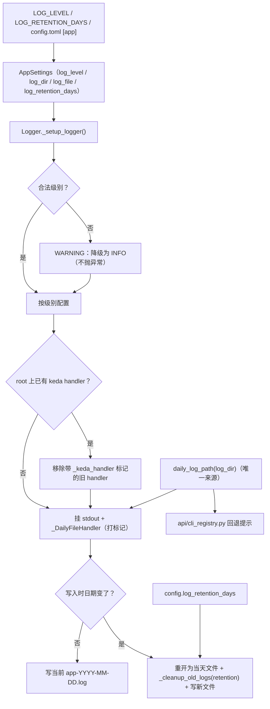

# PRD: 日志配置的健壮化与长驻进程跨天轮转（Logging Config Robustness & Daemon-Safe Rotation）

- GitHub Issue: https://github.com/ZataZhang/keda/issues/175

> ✅ **交付前置**：无，可立即开工。
> 结构化声明见 §8 Delivery Dependencies，**那里是唯一事实源**。

> ⬜ **验收状态**：未开工。
> 本行是 §9 Acceptance Checklist 的投影，**那里是唯一事实源**。

本文档分两个高度：**Part A（§1–§4）** 给人看，用来确认"要不要做、做成什么样"，不含实现机制、文件路径、命令与排期信息；**Part B（§5–§13）** 给执行者看，包含机制、改动树与验证命令。人只在 Part A 点名处下钻。

## Feature Overview (功能一览)

> 本块是第 10 节 Functional Requirements 的通俗投影，不是第二事实来源；行为验收以第 1 节的行为样例表为准。

- **坏日志级别不再让进程起不来**（FR-1）：`LOG_LEVEL` 写成小写、错拼或空值这类手误，今天会让进程在启动阶段直接抛异常退出；改为降级到默认级别并打一条醒目警告，进程照常工作。
- **长驻 daemon 跨天不再把日志全写进旧文件**（FR-2）：今天日志文件名在进程启动那一刻定死，一个跑过午夜的 daemon 第二天仍继续写昨天的文件；改为跨天自动切到当天文件，且文件名仍是 `app-YYYY-MM-DD.log`（既有约定不变）。
- **保留天数可配置**（FR-3）：今天"保留 14 天"写死在代码里、且只在启动时清理一次；改为由配置项 `log_retention_days` 控制（默认 14），并在跨天切换时顺带清理过期文件。
- **日文件路径只有一个来源**（FR-4）：今天"当天日志文件叫什么"这个约定在日志模块和 CLI 回退提示里各写了一份，容易漂移；收敛到一处，两处共用。
- **日志 handler 的幂等语义修正**（FR-5）：今天只要 root 上已有任何 handler，日志模块就整体跳过、连自己的文件 handler 都不挂；改为"只跳过重复挂载自己"，确保无论谁先碰过 root，keda 的文件日志都在。
- **正常路径零变化**（FR-6）：合法日志级别、root 为空、当天内运行这三条正常路径下，日志格式、默认级别与文件命名约定与改动前完全一致——本次只修缺陷，不动日常行为。
- **明确不做**（§11）：不做结构化 JSON 输出、不引入 correlation/run_id、不做日志格式统一、不重构"两套 logger 惯例"、不改访问日志、不重写为事件溯源——这些登记在 `tasks/inbox/ideas.md` 标注暂不做。

---

# Part A · 人审层 (Review Layer)

## 1. Introduction & Goals

### Problem Statement

Keda（`iar`）的日志配置集中在 `src/backend/infrastructure/logging/logger.py` 一个 105 行的单例里。它有三个已可复现的健壮性缺陷，全部落在同一段 `_setup_logger()` 上：

1. **坏级别炸进程**。日志级别用 `getattr(logging, config.log_level)` 解析（`logger.py:32,38,46,66`）。`config.log_level` 来自 `LOG_LEVEL` 环境变量或 `config.toml` 的 `[app] log_level`（默认 `"INFO"`，`settings.py:331`）。用户把它改成常见的小写 `info`、或任何非 `logging` 预定义名，`getattr` 直接抛 `AttributeError`——**不是"丢掉日志"，而是整个进程在启动阶段退出**。

2. **长驻进程跨天不切文件、不清理**。当天日志文件名 `app-{today}.log` 在 `_setup_logger()` 打开的瞬间用 `datetime.now()` 定死（`logger.py:59-60`），`FileHandler` 之后永远写这一个文件；保留清理 `_cleanup_old_logs(...)` 也只在 `_setup_logger()` 里调用**一次**（`logger.py:70`）。keda 明确存在长驻进程：`iar loop-daemon`（`api/cli_typer_loop.py:111` `loop_daemon_command`）与 `iar registry start` 拉起的 persistent runner / review-daemon（见派发目标仓的 `iar-operator` SKILL.md）。一个跨过午夜的 daemon，第二天仍继续写 `app-<昨天>.log`——保留策略不再推进，`iar logs --follow` 与按日归档都会踩到。

3. **handler 幂等策略过宽**。`_setup_logger()` 开头 `if root.handlers: return`（`logger.py:34-36`）——只要 root 上已有任意 handler（例如测试框架、某些库、或先导入的第三方），keda 就连自己的 stdout/文件 handler 都不挂，**静默地没有文件日志**。

此外，"当天日志文件叫什么"这个约定被复制了一份：`api/cli_registry.py:590-591` 在"找不到进程日志"的提示里**独立重建**了 `<project_root>/logs/app-<today>.log`。它与 `logger.py:60` 的命名必须手工保持一致，任何一侧改动都会让 `iar logs` 的回退提示指向一个不存在的文件。

后果：一个手误的配置值能让 keda 起不来；一个正常的夜间 daemon 会让日志落到错误日期、让保留策略失效。这些都不是新功能缺失，而是既有日志路径上的正确性缺陷。

### Interpretation (解读回显)

下表每一行都会**原样**变成第 7.6 节的验收 oracle，所以改表里的一格就等于改验收标准——值得逐行读。

| 验证方式 | 输入 / 操作 | 期望观察到的结果 |
|---|---|---|
| 👀 人审 + 自动验证 | 以 `LOG_LEVEL=bogus` 启动任一会初始化日志的真实 CLI 入口（如 `LOG_LEVEL=bogus uv run iar agent doctor claude --json`） | 进程**正常结束、退出码 0**，输出含一条明确的"无效日志级别，已降级"警告；不出现 `AttributeError` 或非零退出 |
| 👀 人审 + 自动验证 | 在一个临时 `LOG_DIR` 下真实启动一次 CLI，查看生成的日文件 | 生成 `app-<今天日期>.log`（命名与约定一致），文件非空，内容含本次运行的日志行 |
| 🤖 自动验证 | 让日志 handler 的切换间隔缩到秒级、连续写入跨越切换点 | 产生第二个日文件，且**两个文件的命名都符合 `app-YYYY-MM-DD.log`**（不出现 `app.log.2026-09-30` 这类默认后缀） |
| 🤖 自动验证 | 在目标目录放一个 20 天前的 `app-<旧日期>.log`，把 `log_retention_days` 设为 1，触发一次切换 | 旧文件被删除；保留期内的文件保留 |
| 🤖 自动验证 | 连续两次触发日志初始化 | root 上的 handler 集合**不出现重复**（不叠加两份 stdout / 文件 handler） |
| 🤖 自动验证 | 先向 root 挂一个第三方 handler，再触发日志初始化 | keda 自己的文件 handler **仍然被挂载**（不再因 root 非空而整体跳过） |
| 🤖 自动验证 | 触发 CLI "找不到进程日志"的回退提示分支 | 提示里的日文件路径与日志模块实际使用的路径**逐字符相同**（由同一解析函数产出） |
| 🤖 自动验证 | 运行既有日志测试套件 | 断言 FileHandler 类型与 `app-<today>.log` 命名的既有测试在**更新后**通过，无未预期的行为回归 |

**我默默定了这些**（未提问、直接选定的）：

- **轮转保留文件名约定**（`app-YYYY-MM-DD.log`），不采用标准 `TimedRotatingFileHandler` 默认的 `app.log` + `app.log.<日期>` 命名——因为该约定已被 `cli_registry` 回退提示与 `iar logs` 语义消费，换命名会连带改变运维可见行为。
- **坏级别降级到 `INFO` 并打一次 WARNING**，不是降级到 `DEBUG`，也不是"忽略后不提示"——降级方向取"不改变默认可见性"，且必须可见地告知。
- **保留天数默认 14**（与今天硬编码一致），新增配置键 `log_retention_days`，env 变量名 `LOG_RETENTION_DAYS`。
- **清理时机改为"随日切执行"**，不再只在启动跑一次；启动时仍执行一次以清理历史遗留。
- **日文件路径解析收敛到一个函数**，由日志模块提供，`cli_registry` 改为消费它（api 层向下依赖 infrastructure 属既有允许方向；若守卫测试另有规定则按守卫走，见 §7 Drift Guard）。
- **handler 幂等改为"标记自己"**：给 keda 挂的 handler 打一个私有标记属性，重复初始化时只移除/跳过带该标记的旧 handler，不影响第三方 handler。
- **本 PRD 只碰日志配置的健壮性**，不统一两套 logger 惯例、不做结构化输出、不加 correlation id、不改访问日志——这些登记为暂不做。

**我理解为不做**：

- 不做结构化 JSON 日志与人类可读的双通道输出。
- 不引入 `run_id` / `trace_id` 等关联键，也不把文本日志与 SQLite 生命周期账本打通。
- 不统一 `logging.getLogger(__name__)`（约 90 个模块）与共享 `logger` 单例两种惯例。
- 不把线程过滤器改成 `contextvar`，不重构每 Issue 日志路由。
- 不改 uvicorn 访问日志，不重写为事件溯源。

**可证伪的读法**：本 PRD 读作"修复日志配置路径上的三个健壮性缺陷（坏级别不崩、daemon 跨天切文件、handler 幂等正确），并顺带把重复的日文件路径约定收敛到一处"；**不**读作"升级日志能力"、**不**读作"引入结构化/关联/事件日志"、**不**读作"改变日志格式或默认可见性"。关键边界：非法级别从"硬失败"变为"降级 + 警告"；日文件命名约定**保持不变**；未配置新键时保留天数仍为 14；正常（root 为空）路径下本次改动不改变任何既有日志行为。

### What The User Gets

keda 的运维者与自动化流程获得三件确定性：**配错日志级别不再让 `iar` 起不来**（拿到一条警告而不是一栈报错）；**跑过午夜的 daemon 会把日志写进当天文件**，保留策略按天推进，"今天"的 `iar logs` 始终指向真正在写的文件；**无论进程里谁先动过 root logger，keda 的文件日志都在**。日志的格式、级别、文件命名约定与今天完全一致——变的只是这些缺陷在出错时不再发生。

### Measurable Objectives

- 以非法 `LOG_LEVEL` 启动任一真实 CLI 入口，进程退出码为 0，stderr/stdout 含一条明确的降级警告；不再出现 `AttributeError`。
- 跨越一次日切后，目标目录出现两个命名均符合 `app-YYYY-MM-DD.log` 的文件；默认后缀形式（`app.log.<date>`）不出现。
- 保留天数由 `log_retention_days` 决定：设为 1 时，2 天前的日文件在一次日切后被删除。
- 连续两次初始化日志后，root 上的 handler 数量不增长（无重复挂载）；root 上预置第三方 handler 时，keda 的文件 handler 仍被挂载（数量可验证）。
- "当日日志路径"在日志模块与 CLI 回退提示两处指向同一路径（同一函数产出，可静态断言）。

## 2. Human Review Map (介入与风险地图)

**决策一：日文件切换方式——保留 `app-YYYY-MM-DD.log` 约定，改用"按日自行切文件"的 handler，可以接受吗？** 长驻 daemon 必须跨天换文件，而标准库的按时间轮转 handler 默认产出 `app.log` + `app.log.<日期>` 这种命名，会改变"今天的文件叫什么"。本 PRD 的立场是**保留既有约定**：实现一个"每次写入时检查日期、跨天就重开文件并顺带清理"的小 handler（约 30 行），文件名继续是 `app-YYYY-MM-DD.log`。代价是引入一个自定义 handler 类；收益是 `cli_registry` 回退提示、`iar logs` 语义与既有按日归档习惯全部不变。另一条路是改用标准 `TimedRotatingFileHandler` 并同步改掉命名与回退语义（更"标准"，但改动面更大、运维可见行为变化）。**请确认：** 接受"自定义按日 handler + 保留命名约定"，还是要求"用标准库轮转、接受命名变化并同步改 `iar logs`"？**验收：** 跨天（或秒级模拟）后两个文件名均为 `app-YYYY-MM-DD.log`，且 `iar logs` 能找到当天文件。

**决策二：非法日志级别的语义从"硬失败"改为"降级 + 警告"，可以接受吗？** 今天非法 `LOG_LEVEL` 会让进程启动即退出——这相当于把日志配置错误升级成了服务不可用。本 PRD 的立场是**降级到 `INFO` 并打一条 WARNING**，让服务继续可用、同时把配置问题显式暴露。取舍是：错误配置不再"响亮地失败"，而需要从警告里发现。**请确认：** 接受"降级 + 警告"（服务优先），还是要求"保持硬失败，但把报错信息改得可读"？**验收：** `LOG_LEVEL=bogus` 时进程退出码 0 且出现降级警告。

**决策三：handler 幂等语义从"root 非空就整体跳过"改为"只跳过重复挂载自己"，可以接受吗？** 现行为在 root 已被第三方占用时会让 keda **完全没有文件日志**（静默）。改为按私有标记识别并只跳过自己，代价是：当 uvicorn / 测试框架等已挂 root handler 时，日志会同时流向它们的 handler 与 keda 的 handler（这是期望行为，但确实是可见的变化）。**请确认：** 接受"root 非空时仍挂载 keda 的 handler"，还是要求"保持整体跳过、只是把跳过改为显式警告"？**验收：** root 预置第三方 handler 时 keda 的文件 handler 仍存在；连续初始化不重复挂载。

**自动门禁，不需要逐项人工审阅**：`log_retention_days` 配置项解析（含默认值 14 与 env 覆盖）、日切 handler 的日期比较与重开、保留清理边界（含"保留期当天不删"）、路径解析单点（静态断言两处同一函数）、`logs/` 下既有文件命名的 `rg` 复核、`test_logger.py` 更新后通过、`just lint`、守卫测试与 `just test all`。

**本次明确不涉及**：不新增第三方依赖（用标准库）；不改前端（`No frontend impact`）；不改数据库 / schema；不改日志格式与默认级别；不统一 logger 惯例；不引入结构化 / 关联 / 事件日志。

## 3. Usage And Impact After Implementation

### [运维者 / Operator]

- **配错级别不再中断服务**：`LOG_LEVEL` / `[app] log_level` 写成非法值时，`iar` 正常启动，日志里出现一条"无效日志级别 X，已降级为 INFO"的警告。
- **长驻 daemon 日志按天归位**：`iar registry start` 的 runner / review-daemon 跨过午夜后自动把新日志写进当天的 `app-YYYY-MM-DD.log`；`iar logs` 回退提示里的路径始终指向当天文件。
- **保留策略可调**：新增可选配置 `log_retention_days`（默认 14）；改动后日志按天切换时顺带清理过期文件，不再依赖"重启才清理"。
- **不变的部分**：日志格式（`时间 - logger - 级别 - 文件:行 - 消息`）、默认级别 `INFO`、文件命名约定、`iar logs` 与 `iar logs --issue` 的既有行为全部不变。

### [开发者 / Developer]

- 日文件路径与轮转逻辑统一收敛到 `infrastructure/logging/logger.py`；`api/cli_registry.py` 的回退提示改为消费同一个路径解析函数，不再自行拼字符串。
- 新增配置字段经 `infrastructure/config` 声明（沿用现有 `log_dir` / `log_file` / `log_level` 同段风格），`[app]` 段追加 `log_retention_days` 注释模板。
- 自定义按日 handler 作为日志模块内部实现，不导出为公共 API；测试通过既有 `tests/test_logger.py` 扩展。

### Impact On Existing Behavior

- 既有配置文件无需改动：未声明 `log_retention_days` 时默认 14，行为与"今天的硬编码 14"一致。
- 合法 `LOG_LEVEL`（`INFO` / `DEBUG` / `WARNING` / `ERROR` / `CRITICAL`）路径**行为完全不变**。
- 日文件命名约定不变，故 `cli_registry` 回退提示与 `iar logs` 的可见输出在正常路径下不变（只是来源改为共享函数）。
- handler 幂等修正后，极端情况下日志会同时流向 root 上既有的第三方 handler（此前 keda 会整体跳过）——这是有意修正，见决策三。
- 不涉及数据库、不涉及前端。

## 4. Requirement Shape

- Actor: Keda 运维者 / 运行长驻 daemon 的自动化流程 / 维护日志模块的开发者。
- Trigger: 任何会初始化日志的 `iar` 入口（一次性命令、`iar run`、`iar loop-daemon`、`iar registry start` 的 runner / review-daemon），以及跨过日切的持续运行。
- Expected behavior: 非法级别被降级并警告而非崩溃；长驻进程跨天把日志切到当天文件且命名仍为 `app-YYYY-MM-DD.log`；保留天数由配置决定并在日切时清理；日志 handler 不再因 root 非空而整体缺失；当日日志路径在两处消费点同一来源。
- Scope boundary: 不改日志格式、默认级别与命名约定；不引入结构化 / 关联 / 事件日志；不统一 logger 惯例；不改前端与数据库。

---

# Part B · 执行器层 (Build Layer)

> 以下供实现者（人或 Agent）使用。人只在 Part A 风险地图点名处下钻审查；其余默认交执行器 + 自动门禁。

## 5. Repository Context And Architecture Fit

**现有相关模块**：

- 日志中枢：`src/backend/infrastructure/logging/logger.py`——单例 `Logger`，`_setup_logger()` 配置 root 的 stdout `StreamHandler`（`:45-53`）与日文件 `logging.FileHandler`（`:55-68`），`_cleanup_old_logs(log_dir, keep_days=14)`（`:70,74-89`）。导出：`src/backend/infrastructure/logging/__init__.py`（`Logger`、`logger`）。
- 配置：`src/backend/infrastructure/config/settings.py`——`log_level: str = Field(default="INFO")`（`:331`）、`log_dir`（`:352`）、`log_file`（`:353`）、`ensure_log_directory()`（`:393-395`）、模块级 `config = AppSettings()` + `config.ensure_log_directory()`（`:430-431`）。无 `env_prefix`，故 env 名即字段大写下划线形式。
- 重复路径约定：`src/backend/api/cli_registry.py:585-596`——在"无托管进程日志"分支里重建 `<project_root>/logs/app-<today>.log` 作为回退提示，注释自述"mirrors infrastructure/logging/logger.py"。
- 长驻进程入口：`src/backend/api/cli_typer_loop.py:111`（`loop_daemon_command`，`Run the loop scheduler continuously`）；`iar registry start` 拉起的 persistent runner / review-daemon（`iar-operator` SKILL.md 速查表）。
- 每 Issue 日志路由（**本 PRD 不改**）：`src/backend/core/use_cases/agent_runner_output_routing.py`（`_ThreadLogFilter`、`per_issue_log_path`）。
- 既有测试：`tests/test_logger.py`——4 个用例断言 root 上存在 `logging.FileHandler` 与 `StreamHandler`（`:28-30`）、文件名含 `app-{today}.log`（`:59-60`）、handler 挂在 root（`:84-85`）、`_cleanup_old_logs` 删除 20 天文件保留 1 天文件（`:124-126`）。这些用例在改动后需要相应更新（新增类型断言、保留天数来源）。

**Reuse candidates**：

- 复用 `Logger` 单例与 `_setup_logger()` 作为唯一配置入口，不新建第二个 setup 路径。
- 复用 `config`（`AppSettings`）承载新字段，沿用 `log_dir` / `log_file` 同段的声明与 `ensure_log_directory` 模式。
- 复用 `cli_registry` 既有的 engines 层路径解析上下文（`resolve_project_root_path()`），只是把"日文件名"部分换成共享函数。

**既有架构模式**：四层依赖方向 `api → core → engines → infrastructure`；配置只在 `infrastructure/config` 声明、模块级 `config` 单例消费；日志只在 `infrastructure/logging` 配置。

**Frontend Impact**：`No frontend impact` —— 纯后端日志基础设施改动，无页面 / 路由 / API 契约变化。

**Existing PRD Relationship**：检索 `tasks/pending/`（tauri-desktop-shell、roadmap-prd-cicd-monitor-auto-repair、blocked-draft-pr-validation-failure、agent-model-preset-switching、iar-agent-machine-contract）与 `tasks/archive/` 中与日志相关的已归档 PRD（含 lifecycle observability 账本 PR #153、console snapshot sync、iar logs `--follow` 修复 #170），**均与本 PRD 无重复、无依赖关系**：账本 PRD 建立的是 SQLite 事件账本（本 PRD 明确不碰），`--follow` 修复消费的是每 Issue 轨迹文件（本 PRD 不动该路径）。**无重复工作，可独立交付。**

## 6. Recommendation

### Recommended Approach

在既有 `_setup_logger()` 上做**四处定点修改**，不新建日志子系统：

1. **级别解析 fail-soft**：新增私有 `_resolve_log_level(value) -> int`，内部 `getattr(logging, str(value).strip().upper(), None)`；为 `None` 时 `logging.getLogger(__name__)` 打一条 WARNING（"无效日志级别 X，已降级为 INFO"）并返回 `logging.INFO`。`_setup_logger()` 里四处 `getattr(logging, config.log_level)` 全部替换为它。
2. **按日自切 handler**：新增 `_DailyFileHandler(logging.FileHandler)`（模块内私有）：构造时以当天路径 `app-YYYY-MM-DD.log` 打开；覆写 `emit()`，在写入前比较 `datetime.now().strftime("%Y-%m-%d")` 与当前已打开文件日期，不同则 `close()` 后以新日期路径重新 `open()`，并调用一次保留清理。文件名逻辑全部走同一个 `daily_log_path(log_dir)` 函数。
3. **保留天数配置化**：`AppSettings` 新增 `log_retention_days: int = Field(default=14)`；`_setup_logger()` 与 `_DailyFileHandler` 从 `config.log_retention_days` 取保留天数；启动时仍执行一次清理。
4. **幂等语义修正**：给 keda 挂的 stdout / 文件 handler 打私有标记属性（如 `_keda_handler = True`）；`_setup_logger()` 开头只移除带该标记的旧 handler（用于测试与重复 init），不再用 `if root.handlers: return` 整体跳过。
5. **路径单一来源**：新增模块级函数 `daily_log_path(log_dir: Path) -> Path`，`_setup_logger()`、`_DailyFileHandler`、`cli_registry` 三处共用；`cli_registry.py:590-591` 改为调用它。

**为什么最贴合现有架构**：全部改动落在既有日志单例与配置字段模式内，不新增模块、不新增依赖（只用标准库）、不改四层契约；`_setup_logger()` 已是唯一配置入口，四条修改都是对同一函数的定点改动；路径收敛消除了一个已存在的重复约定而非引入抽象。

**拒绝的冗余**：不新建 `LoggingConfig` / `LoggingService` 抽象层；不引入 structlog / loguru；不改用标准 `TimedRotatingFileHandler`（会改变命名约定，见决策一）；不导出 `_DailyFileHandler` 为公共 API。

### Proposed Solution Summary (实现机制)

- **谁提供输入**：运维者通过 `LOG_LEVEL` / `[app] log_level` 与新增 `LOG_RETENTION_DAYS` / `[app] log_retention_days` 提供；keda 只消费，不推断。
- **插入边界**：全部在 `infrastructure/logging/logger.py` 的 `Logger._setup_logger()` 内；配置字段在 `infrastructure/config/settings.py` 声明；`api/cli_registry.py` 改为调用共享的 `daily_log_path()`。
- **主要状态 / 可见行为变化**：非法级别从抛异常变为警告 + 降级；日文件在跨天时切换；保留清理随之发生；root 预置第三方 handler 时 keda handler 仍挂载。正常路径（合法级别、root 为空、当天内）行为不变。
- **自定义 handler 的边界**：仅在日期变化时重开文件并清理；不改变 formatter、级别与 handler 类型语义（仍是 `FileHandler` 子类，`isinstance(h, logging.FileHandler)` 仍为真，兼容既有测试意图）。
- **刻意避免的复杂度**：不新增独立日志服务；不引入队列 / 异步 handler；不改格式；不触碰每 Issue 路由与账本。

### Alternatives Considered (Only When Useful)

- **Alternative**：改用标准 `logging.handlers.TimedRotatingFileHandler(when="midnight")`。
- **Why not chosen**：其默认产出 `app.log` + `app.log.<日期>`，与既有 `app-YYYY-MM-DD.log` 约定冲突；要保留约定需自定义 `namer` 并改变"当天文件"语义，会连带改 `cli_registry` 回退与 `iar logs` 可见行为，改动面与回归面都更大（见决策一）。
- **Alternative**：外部 logrotate / 容器层轮转，进程内不做。
- **Why not chosen**：keda 同时以 CLI、daemon、容器三种方式运行，外部轮转无法覆盖本地 CLI 场景；且无法保证"当天文件"这一约定在各入口一致。
- **Alternative**：保留 `if root.handlers: return`，仅把静默跳过改成显式警告。
- **Why not chosen**：警告不能替代文件日志；一旦 root 被占用，keda 将永久没有文件日志，属未修复缺陷（见决策三）。

## 7. Implementation Guide

> This section is a living implementation guide based on current repository analysis. If implementation discovers additional affected files, hidden dependencies, edge cases, or a better path, update this PRD before proceeding.

### Core Logic

1. **配置层**（`infrastructure/config/settings.py`）：在 `log_level` / `log_dir` / `log_file` 同段新增 `log_retention_days: int = Field(default=14)`；保持无 `env_prefix` 的既有风格（env 名为 `LOG_RETENTION_DAYS`，TOML 键在 `[app]` 段）。如需对非正值防御，可在 `ensure_log_directory()` 邻近加轻量钳制（≤0 时回退 14）或交给日志层处理，二选一并在 Decision Log 记录。
2. **路径单点**（`infrastructure/logging/logger.py`）：新增模块级 `def daily_log_path(log_dir: Path) -> Path: return log_dir / f"app-{datetime.now().strftime('%Y-%m-%d')}.log"`。`_setup_logger()` 用它替换 `log_path = log_dir / f"app-{today}.log"`（`logger.py:59-60`）。
3. **级别解析**（`logger.py`）：新增 `def _resolve_log_level(raw: str) -> int`；四处 `getattr(logging, config.log_level)` 替换为 `_resolve_log_level(config.log_level)`。非法值首次出现时 `logging.getLogger(__name__).warning("无效日志级别 %r，已降级为 INFO", raw)`（注意避免在 handler 未就绪时递归/丢消息——用模块 logger 记录，setup 完成后会补齐）。
4. **按日 handler**（`logger.py`）：新增 `class _DailyFileHandler(logging.FileHandler)`，持有 `_retention_days` 与 `_current_date`；`emit()` 首行比较日期，变化则 `self.close()`、`self.baseFilename = str(daily_log_path(self._log_dir))`、重开、调用清理；标记 `self._keda_handler = True`。构造用 `logging.FileHandler.__init__(self, filename=str(daily_log_path(log_dir)), encoding="utf-8")`。
5. **保留清理**（`logger.py`）：`_cleanup_old_logs(log_dir, keep_days)` 复用现有实现，`keep_days` 改从 `config.log_retention_days` 传入；调用点从"仅启动一次"扩展为"启动一次 + 每次日切一次"。
6. **幂等**（`logger.py`）：`_setup_logger()` 开头把 `if root.handlers: return` 改为：遍历 root.handlers，移除带 `_keda_handler` 标记的旧 handler（`root.removeHandler` + `handler.close()`），然后照常挂载 keda 的 stdout / 文件 handler 并打标记。确保第三方 handler 不受影响。
7. **CLI 回退提示**（`api/cli_registry.py:585-596`）：把 `resolve_project_root_path() / "logs" / f"app-{today_str}.log"` 改为 `daily_log_path(resolve_project_root_path() / "logs")`；若 api→infrastructure 的 import 触发守卫测试失败，则改为经 engines 层薄封装转出（见 Drift Guard）。
8. **兼容性**：合法级别、root 为空、当天内运行三条正常路径的行为与格式保持不变。

### Change Impact Tree

```text
.
├── Infrastructure
│   ├── src/backend/infrastructure/logging/logger.py
│   │   [修改]
│   │   【总结】级别 fail-soft、按日自切 handler、保留天数配置化、幂等按标记、路径单点。
│   │
│   │   ├── 新增 daily_log_path(log_dir) 并于 _setup_logger / _DailyFileHandler 共用
│   │   ├── 新增 _resolve_log_level(raw) 替换四处 getattr(logging, config.log_level)
│   │   ├── 新增 _DailyFileHandler(logging.FileHandler)：跨天重开 + 顺带清理 + _keda_handler 标记
│   │   ├── _setup_logger 幂等由 "root.handlers 整体跳过" 改为 "移除/跳过带标记的自己"
│   │   └── _cleanup_old_logs 的 keep_days 改由 config.log_retention_days 提供
│   │
│   └── src/backend/infrastructure/config/settings.py
│       [修改] 【总结】新增 log_retention_days: int = 14（沿用 [app] 段与声明式字段风格）。
│
├── API
│   └── src/backend/api/cli_registry.py
│       [修改] 【总结】回退提示的日文件路径改为消费 daily_log_path()，消除重复约定。
│
├── Core / Engines
│   └── （无改动；若守卫禁止 api→infrastructure 直连，则新增 engines 层薄转出，
│        例如在 engines 侧 re-export daily_log_path，见 Drift Guard。）
│
├── Frontend
│   └── No frontend impact
│       【总结】纯后端日志基础设施改动。
│
├── Config
│   └── config.toml
│       [修改] 【总结】[app] 段补 `# log_retention_days = 14` 注释模板（非密钥类，保持注释状态）。
│
├── Tests
│   └── tests/test_logger.py
│       [修改] 【总结】断言 FileHandler 子类仍成立、日文件命名约定保持、
│       非法级别 fail-soft、按日切换产生新文件、保留天数来自配置、重复 init 不叠加 handler。
│
└── Docs
    ├── docs/guides/configuration.md
    │   [修改] 【总结】[app] 段新增 log_retention_days 说明。
    └── docs/guides/agent-runner.md
        [修改] 【总结】(如需) 说明 daemon 日志按天轮转与保留策略。
```

> 以上为起点而非穷尽集合；`rg -n "getattr\(logging|app-\{|app-\" *\+|log_retention|_cleanup_old_logs|FileHandler" src tests` 用于找出遗漏的复制点与断言点，详见 Executor Drift Guard。

### Risk Classification Register

| 改动点 | tier | 决定性维度 / override | intervention | oracle / gate |
|---|---|---|---|---|
| 按日自切 handler + 保留文件名约定（跨模块约定：logger ↔ cli_registry ↔ iar logs） | R2 | 跨组件 + 运维可见约定；写文件的操作行为 | 人确认（决策一）+ 全链 oracle（含负向控制） | `rv-2`、`rv-3`、`rv-7` |
| 非法级别 fail-soft（把"启动失败"改为"降级继续"） | R1 | 单点失败语义变化，无新持久化 | 人确认（决策二）+ 失败判别测试 | `rv-1` |
| handler 幂等语义修正（全局 setup 行为） | R1 | 全局配置函数，但影响可被单测判别 | 人确认（决策三）+ 单测 | `rv-6` |
| `log_retention_days` 配置项 + 日切清理 | R1 | 附加式配置字段 + 有既有清理实现 | executor + 边界测试 | `rv-4` |
| 日文件路径单点（消除 cli_registry 重复） | R1 | 跨模块小重构，静态可断言 | executor + 静态断言 | `rv-5` |
| 文档 / config.toml 注释模板 | R0 | 展示性，`rg` 可检 | executor + `rg` 复核 | `rv-8` |

> 本 PRD 无 R3 改动点（不触碰鉴权 / 凭据 / 不可逆数据 / 资金 / 并发事务）。仅一处 R2（日切与命名约定）按全链证据收集，其余按 R0/R1 单断言收集。

### Executor Drift Guard

The file list above is the expected implementation surface from current repository analysis. During implementation, treat it as a starting point and use these repository searches to catch hidden references or drift before marking the PRD complete.

| Check | Command | Expected Result | If It Fails, Inspect First |
|---|---|---|---|
| 残留 `getattr(logging, ...)` | `rg -n "getattr\(logging" src/backend` | 仅出现在 `logger.py` 的 `_resolve_log_level` 内部 | 是否仍有旁路级别解析 |
| 日文件命名约定复制点 | `rg -n 'app-\{|app-".*\.log|f"app-' src/backend` | 仅 `daily_log_path()` 一处产出日文件名 | `cli_registry.py` 是否仍自行拼串 |
| 保留天数硬编码 | `rg -n "keep_days|retention" src/backend` | `keep_days` 来源于 `config.log_retention_days`，无第二处 `14` 常量 | 是否遗漏调用点 |
| handler 类型断言 | `rg -n "FileHandler|StreamHandler" tests` | 断言与"子类仍成立"兼容；无对"root 非空即跳过"的旧行为断言 | `test_logger.py` 是否需同步 |
| 导入方向守卫 | `uv run pytest -o addopts='' tests/guards -q -k 'architecture or layer or import'` | 通过；若 api→infrastructure 直连被守卫拒绝 | 改为经 engines 层薄转出 |
| 文档 / 配置同步 | `rg -n "log_retention_days|app-" config.toml docs mkdocs.yml` | `config.toml [app]` 注释模板与 `configuration.md` 已含新键 | 是否遗漏文档 |

> 注意：不要为让 oracle 能"变红"而在生产代码里加故障开关；`rv-2` 的日切用秒级间隔或可注入时钟在测试内触发，不改生产默认行为。

### Flow or Architecture Diagram



### ER Diagram

- 无数据模型变更（不新增 / 修改数据库表、不做 migration）。

### Realistic Validation Plan

```yaml
- id: rv-1
  behavior: 非法 LOG_LEVEL 不再崩溃，进程正常结束并输出降级警告
  reviewer: human
  real_entry: "LOG_LEVEL=bogus uv run iar agent doctor claude --json"
  expected: "退出码 0；输出包含一条“无效日志级别 bogus，已降级为 INFO”类警告；无 AttributeError 栈、无非零退出"
  mock_boundary: "不 mock：真实 CLI 入口 + 真实 Logger 初始化（不替换日志模块）"
  tier: R1
  test_layer: integration
  required_for_acceptance: true
  presentation: "tasks/evidence/<prd-stem>/rv-1-invalid-level.txt（真实终端输出捕获）。约 10 秒自检：找退出码为 0、以及含“降级”的警告行；确认无 Traceback"

- id: rv-2
  behavior: 跨天切换产生新日文件，且文件名保持 app-YYYY-MM-DD.log 约定
  reviewer: verifier
  real_entry: "uv run pytest -o addopts='' tests/test_logger.py -q -k 'rotation or daily'"
  expected: "以真实 _setup_logger（monkeypatch 配置）挂载的 file handler 为 _DailyFileHandler；触发一次日期变化后生成第二个文件，两个文件名均匹配 ^app-\\d{4}-\\d{2}-\\d{2}\\.log$；不出现 app.log.<date> 形式"
  mock_boundary: "under-test 的 _setup_logger/_DailyFileHandler/保留清理不 mock；仅时钟或日切触发点被测试替换"
  tier: R2
  test_layer: integration
  required_for_acceptance: true
  critical_value_source: "config.log_dir 与 daily_log_path() 产出的真实路径；_DailyFileHandler 实际打开的文件名"
  must_cross: "AppSettings 加载 -> Logger._setup_logger -> _DailyFileHandler（跨日期判断 -> close/reopen）-> 实际落盘文件名"
  forbidden_bypasses: "不在测试内自行 new FileHandler 冒充；不用手工构造的文件名代替实际落盘文件；不放宽命名正则"
  fresh_state_probe: "全新 tmp 目录重跑，产出文件集稳定一致；连续两次跨天触发产生两个不同日期文件"
  final_tree_evidence: "证据与最终提交树绑定；任何对 logger.py 的后续改动使本证据失效并需重跑"
  negative_control: "把 handler 的日切判断短路（临时用固定日期）后重跑同一用例"
  expected_fail: "不再产生第二个文件，或第二个文件名偏离 app-YYYY-MM-DD.log 约定"

- id: rv-3
  behavior: 保留天数由配置决定，日切时清理过期文件
  reviewer: verifier
  real_entry: "uv run pytest -o addopts='' tests/test_logger.py -q -k 'retention or cleanup'"
  expected: "log_retention_days=1 时，2 天前的 app-<旧日期>.log 在一次日切后被删除；保留期内文件保留；默认（未配置）保留 14 天"
  mock_boundary: "不 mock：真实 _cleanup_old_logs 与真实配置字段"
  tier: R1
  test_layer: integration
  required_for_acceptance: true

- id: rv-4
  behavior: 合法级别下行为零变化，日志格式与默认级别不变
  reviewer: verifier
  real_entry: "uv run pytest -o addopts='' tests/test_logger.py -q"
  expected: "合法 LOG_LEVEL（INFO/DEBUG/WARNING/ERROR/CRITICAL）路径下 root 挂载 stdout StreamHandler 与 FileHandler 子类；formatter 格式串与改动前一致；默认级别仍为 INFO"
  mock_boundary: "不 mock；真实 setup 路径"
  tier: R1
  test_layer: integration
  required_for_acceptance: true

- id: rv-5
  behavior: 当日日志路径只有一个来源，cli_registry 回退提示与日志模块一致
  reviewer: verifier
  real_entry: "uv run pytest -o addopts='' tests/test_logger.py tests/test_container_ops.py -q -k 'log_path or registry or fallback'  # 或对 daily_log_path 的静态断言"
  expected: "daily_log_path(log_dir) 的产出被日志模块与 cli_registry 回退提示共同消费；对同一 log_dir 两处路径字符串逐字符相同；rx 'app-' 在 src/backend 下只由 daily_log_path 产出"
  mock_boundary: "不 mock；真实函数与真实调用点"
  tier: R1
  test_layer: unit
  required_for_acceptance: true

- id: rv-6
  behavior: handler 幂等——重复 init 不叠加；root 预置第三方 handler 时 keda handler 仍挂载
  reviewer: verifier
  real_entry: "uv run pytest -o addopts='' tests/test_logger.py -q -k 'idempotent or existing_handler'"
  expected: "连续两次 _setup_logger 后 root 上带 _keda_handler 的 handler 数量不增长；先向 root addHandler 一个第三方 handler 再 setup，keda 的 FileHandler 仍存在且第三方 handler 未被移除"
  mock_boundary: "不 mock；真实 root handler 操作"
  tier: R1
  test_layer: unit
  required_for_acceptance: true

- id: rv-7
  behavior: 真实入口下当天日志文件按约定生成且非空
  reviewer: human
  real_entry: "LOG_DIR=<tmp> uv run iar agent doctor claude --json（真实 CLI 入口）"
  expected: "<tmp> 下生成 app-<今天日期>.log，文件非空，内容含本次运行的日志行；iar logs 回退提示（若无进程日志）指向同一文件"
  mock_boundary: "不 mock：真实 CLI + 真实文件系统"
  tier: R1
  test_layer: integration
  required_for_acceptance: true
  presentation: "tasks/evidence/<prd-stem>/rv-7-daily-file.txt（列出 tmp 目录文件与首行日志捕获）。约 10 秒自检：文件名是否为 app-<今天>.log、文件是否非空"

- id: rv-8
  behavior: 文档与配置注释同步
  reviewer: verifier
  real_entry: "rg -n \"log_retention_days|app-\" config.toml docs mkdocs.yml && uv run mkdocs build --strict"
  expected: "config.toml [app] 含 `# log_retention_days = 14` 注释；configuration.md 已说明该键；strict 构建通过"
  mock_boundary: "不 mock：对仓库真实文件做文本断言并真实构建"
  tier: R0
  test_layer: unit
  required_for_acceptance: true
```

Failure triage:
- `rv-1` 若仍抛 `AttributeError`，先确认四处 `getattr(logging, ...)` 是否已全部替换为 `_resolve_log_level`（`rg -n "getattr\(logging" src/backend`）。
- `rv-2` 若出现 `app.log.<date>` 命名，说明误用了标准 `TimedRotatingFileHandler` 或 `namer` 未生效，回到 `_DailyFileHandler` 实现。
- `rv-4`/`rv-6` 失败先区分"legit 行为回归"与"测试断言过时"：既有 `tests/test_logger.py` 断言 `logging.FileHandler in handler_types` 对子类仍成立；若断言了"root 非空即跳过"，则属需更新的旧期望。
- `rv-5` 若守卫测试拒绝 api→infrastructure 直连，改为在 engines 层 re-export `daily_log_path` 后由 cli_registry 消费。

### Low-Fidelity Prototype

- `No interactive prototype file changes in this PRD.` 本能力无用户可见前端变化，验证以真实终端输出捕获（`rv-1`、`rv-7`）表达。

### Interactive Prototype Change Log

- `No interactive prototype file changes in this PRD.`

### External Validation

- 未使用 web 研究：改动仅依赖仓库内既有的 stdlib `logging` 用法与 `FileHandler` 语义，属稳定事实，不涉及第三方 API / 版本行为。

## 8. Delivery Dependencies

- Group: none
- Depends on tasks/issues:
  - none
- Gate type: none
- Notes: 独立 PRD；与在途 PRD（agent-model-preset-switching、iar-agent-machine-contract 等）及已归档的 lifecycle observability 账本、iar logs `--follow` 修复均无依赖。FR-2（按日 handler）在实现上需要 FR-4（路径单点）先提供 `daily_log_path`，二者在本 PRD 内按 FR 顺序实现，不构成外部依赖；FR-3（保留天数）为 FR-2 的配置输入。

## 9. Acceptance Checklist

这是「人只看一次」的交付物。按 Part A 风险地图排序组织成**验收证据包**，每项必须带证据（命令输出 / 观察 / 工件引用），不是裸勾。

### 9.1 人读呈递区（Human Review Surface）

| 应该看到的结果 | 呈递物 | 10 秒自检 |
|---|---|---|
| `LOG_LEVEL=bogus` 时 CLI 正常结束（退出码 0）并打印降级警告 | `tasks/evidence/<prd-stem>/rv-1-invalid-level.txt`（本地文本捕获，`open "<绝对路径>"` 查看） | 找退出码 0 与含"降级"的警告行；确认无 Traceback |
| 真实入口下当天日志按约定生成且非空 | `tasks/evidence/<prd-stem>/rv-7-daily-file.txt`（本地文本捕获，`open "<绝对路径>"` 查看） | 文件名是否为 `app-<今天>.log`、文件是否非空 |

`reviewer: verifier` 的组（跨天轮转 rv-2、保留天数 rv-3、合法级别零变化 rv-4、路径单点 rv-5、handler 幂等 rv-6、文档 rv-8）**不在此逐项展示**；它们由 Agent 自验、独立 verifier 审查，失败时才会呈递到人。

### 9.2 Acceptance Evidence Package

**Human-Confirmed（对应 §2 三个决策 + 呈递审阅）**
- [ ] 决策一：保留 `app-YYYY-MM-DD.log` 约定、用按日自切 handler —— 人确认（`rv-2`、`rv-7` 为佐证）
- [ ] 决策二：非法级别降级 + 警告，不再硬失败 —— 人确认（`rv-1` 为佐证）
- [ ] 决策三：handler 幂等改为"只跳过重复挂载自己" —— 人确认（`rv-6` 为佐证）
- [ ] 9.1 呈递区呈递物已逐项过目并认可

**Architecture Acceptance**
- [ ] 日志级别解析、日文件路径、轮转与清理全部收敛到 `src/backend/infrastructure/logging/logger.py`，无第二处级别解析（`rg -n "getattr\(logging" src/backend` 佐证）
- [ ] 日文件命名只由 `daily_log_path()` 产出，`cli_registry.py` 不再自行拼串（`rv-5`、`rg` 佐证）
- [ ] 四层依赖方向不变；若经 engines 薄转出，仍是 `api → engines → infrastructure`（守卫测试佐证）

**Dependency Acceptance**
- [ ] 未新增第三方依赖（仅用标准库 `logging` / `logging.handlers`）
- [ ] 未新增数据库 / schema / 前端改动

**Behavior Acceptance**
- [ ] 非法 `LOG_LEVEL` 降级为 INFO 且打警告，进程退出码 0（rv-1）
- [ ] 跨天切换产生新文件，命名保持 `app-YYYY-MM-DD.log`（rv-2）
- [ ] 保留天数由 `log_retention_days` 决定（默认 14），日切时清理过期文件（rv-3）
- [ ] 合法级别、root 为空、当天内运行的格式与默认级别零变化（rv-4）
- [ ] 连续初始化不叠加 handler；root 预置第三方 handler 时 keda handler 仍挂载（rv-6）

**Frontend Acceptance**
- [ ] `No frontend impact` 已记录并说明理由（纯后端日志基础设施）

**Documentation Acceptance**
- [ ] `config.toml [app]` 含 `log_retention_days` 注释模板；`docs/guides/configuration.md` 已说明（rv-8）

**Validation Acceptance**
- [ ] `LOG_LEVEL=bogus uv run iar agent doctor claude --json` 通过真实 CLI 入口验证 fail-soft（rv-1）
- [ ] `LOG_DIR=<tmp> uv run iar agent doctor claude --json` 验证当天文件生成与命名（rv-7）
- [ ] `uv run pytest -o addopts='' tests/test_logger.py -q` 全部通过（rv-2/3/4/5/6）
- [ ] `rg -n "getattr\(logging|app-\{" src/backend` 确认无旁路解析与重复命名

**Delivery Readiness**
- [ ] Recommended approach fully implemented；无未批准的平行抽象
- [ ] 无未决回归或上线阻塞项
- [ ] 完成消息逐字携带 9.1 呈递区内容（含 `open` 命令与本地 only 标注）

## 10. Functional Requirements

- FR-1: 非法 / 无法解析的 `LOG_LEVEL`（含小写、错拼、空值）不得导致进程异常退出；应降级为 `INFO` 并输出一条明确的 WARNING。
- FR-2: 长驻进程跨过日期边界后，后续日志写入新一天的日文件；文件名保持 `app-YYYY-MM-DD.log` 约定，不产生标准库默认的 `app.log.<date>` 形式。
- FR-3: 日志保留天数由配置项 `log_retention_days`（env `LOG_RETENTION_DAYS`，`[app]` 段，默认 14）决定；保留清理在启动时与每次日切时执行。
- FR-4: "当日日志文件路径"由单一函数产出，日志模块与 `api/cli_registry.py` 回退提示共同消费，无重复约定。
- FR-5: 日志 handler 的挂载幂等：重复初始化不重复挂载；root 上已存在第三方 handler 时，keda 自身的 stdout / 文件 handler 仍被挂载，且不移除第三方 handler。
- FR-6: 合法日志级别、root 为空、当天内运行三条正常路径下，日志格式、默认级别与文件命名约定与改动前一致。

## 11. Non-Goals

- 不引入结构化（JSON）日志，不做人类可读 / 机器可读双通道输出。
- 不引入 `run_id` / `trace_id` 等关联键，不打通文本日志与 SQLite 生命周期账本。
- 不统一 `logging.getLogger(__name__)`（约 90 个模块）与共享 `logger` 单例两种惯例。
- 不把每 Issue 日志路由的线程过滤器改为 `contextvar`，不重构 `agent_runner_output_routing.py`。
- 不改用标准 `TimedRotatingFileHandler`（会改变命名约定，见决策一）。
- 不改 uvicorn 访问日志，不重写为事件溯源，不实现 `Model-visible means logged` 不变量。
- 不新增第三方依赖、不改数据库 / schema、不改前端。
- 不做 `iar logs --follow` 的读取逻辑改动（仅其回退提示的路径来源随之统一）。

## 12. Risks And Follow-Ups

- 自定义按日 handler 属模块私有实现：需保持 `isinstance(handler, logging.FileHandler)` 为真（子类），以免既有测试意图失效。
- 日切依赖 `datetime.now()` 的系统本地时区；测试若需确定性，应在测试内注入时钟 / 秒级间隔，而非改动生产默认。
- `log_retention_days` 若被配置为非正数，需有明确回退（钳制到 14 或忽略），实现时二选一并记录（见 §7 Core Logic 第 1 条）。
- 决策三修正后，root 上既有第三方 handler 与 keda handler 会同时收到记录；在 uvicorn 场景下表现为"日志既进 uvicorn handler 又进 keda 文件"，属期望行为但需在文档中说明，避免被当成重复日志。
- 更深的日志能力（结构化 / 关联键 / 事件化 / logger 惯例统一 / 访问日志）已登记 `tasks/inbox/ideas.md` 标注暂不做，不在本 PRD 范围；后续如启动，应另开 PRD 引用本 PRD 建立的 `daily_log_path` 与 handler 标记约定。

## 13. Decision Log

| # | 决策问题 | 选择 | 放弃的方案 | 理由 |
|---|---|---|---|---|
| D-01 | 长驻进程如何按天轮转且保持命名 | 自定义 `_DailyFileHandler`（按日重开 + 顺带清理），保留 `app-YYYY-MM-DD.log` | 标准 `TimedRotatingFileHandler`（默认 `app.log.<date>`） | 命名约定已被 `cli_registry` 回退与 `iar logs` 消费，换命名会改变运维可见行为、扩大回归面 |
| D-02 | 非法日志级别的失败语义 | 降级为 `INFO` + 一条 WARNING | 保持硬失败（仅优化报错文案） | 日志配置手误不应升级为服务不可用；同时用警告保留可见性 |
| D-03 | handler 幂等策略 | 按私有标记只跳过 / 移除 keda 自己的 handler | 保持 `if root.handlers: return`（仅改为警告） | 现行为会让 keda 在 root 被占用时静默失去文件日志，属缺陷 |
| D-04 | 保留天数的来源 | 新增 `log_retention_days`（默认 14） | 继续硬编码 14 | 与 `log_dir` / `log_level` 同为运维可调项，且清理时机需要该值 |
| D-05 | 日文件路径的产出点 | 收敛到 `daily_log_path()` 单一函数 | 保持 `logger.py` 与 `cli_registry.py` 各写一份 | 两处重复约定必然漂移，回退提示会指向不存在的文件 |
| D-06 | 本 PRD 是否顺带做结构化 / 关联 / 事件日志 | 不做，登记 `tasks/inbox/ideas.md` 暂不做 | 一并升级日志能力 | 与"修健壮性缺陷"不是同一目标状态；混入会扩大回归面、违反最小改动 |

## 14. Change Log

### 2026-09-30 · 初稿：日志配置健壮化与 daemon 跨天轮转
- Type: feat（新建 PRD，未开工故无代码影响）
- Before: 无对应 PRD；日志健壮性缺陷散落在既有实现（`logger.py` 的 `getattr(logging, ...)`、启动时定死的日文件名与一次性清理、`if root.handlers: return`，以及 `cli_registry.py` 重复的日文件路径约定）。
- After: 新建本 PRD，界定五个 FR——非法级别 fail-soft、daemon 跨天按日轮转且保留命名约定、保留天数配置化并随日切清理、日文件路径单点、handler 幂等修正；三个 Part A 人审决策；一个 R2 改动点（日切与命名约定）按全链证据收集；其余日志能力（结构化 / 关联 / 事件化 / 惯例统一 / 访问日志）明确列为 Non-Goals 并登记暂不做。
- Reason: 本次会话完成了对 keda 日志现状的对照体检，确认上述三点是可复现的正确性缺陷，需在升级日志能力之前先修复。
- Impact: 后续任何涉及日志轮转 / 保留 / 路径约定的 PRD 应复用本 PRD 建立的 `daily_log_path` 与 handler 标记约定。
- Review: 待人工审阅。
