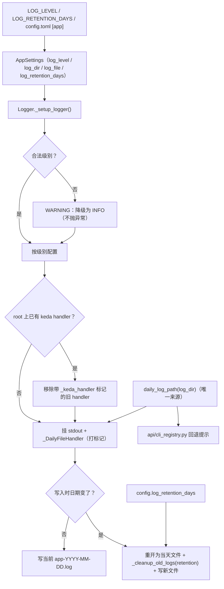

# PRD: 日志配置的健壮化与长驻进程跨天轮转（Logging Config Robustness & Daemon-Safe Rotation）

- GitHub Issue: https://github.com/ZataZhang/keda/issues/175

> ✅ **交付前置**：无，可立即开工。
> 结构化声明见 §8 Delivery Dependencies，**那里是唯一事实源**。

> 🧍 **验收状态**：待人工验收 — 仅剩 4 项 Human-Confirmed 未确认（§2 决策一 / 决策二 / 决策三 + §9.1 呈递区过目），其余验收项已由执行器自验并附证据，证据包见 §9。
> 本行是 §9 Acceptance Checklist 的投影，**那里是唯一事实源**。

本文档分两个高度：**Part A（§1–§4）** 给人看，用来确认"要不要做、做成什么样"，不含实现机制、文件路径、命令与排期信息；**Part B（§5–§13）** 给执行者看，包含机制、改动树与验证命令。人只在 Part A 点名处下钻。

## Feature Overview (功能一览)

> 本块是第 10 节 Functional Requirements 的通俗投影，不是第二事实来源；行为验收以第 1 节的行为样例表为准。

- **坏日志级别不再让进程起不来**（FR-1）：`LOG_LEVEL` 写成小写、错拼或空值这类手误，今天会让进程在启动阶段直接抛异常退出；改为降级到默认级别并打一条醒目警告，进程照常工作。
- **长驻 daemon 跨天不再把日志全写进旧文件**（FR-2）：今天日志文件名在进程启动那一刻定死，一个跑过午夜的 daemon 第二天仍继续写昨天的文件；改为跨天自动切到当天文件，且文件名仍是 `app-YYYY-MM-DD.log`（既有约定不变）。
- **保留天数可配置**（FR-3）：今天"保留 14 天"写死在代码里、且只在启动时清理一次；改为由配置项 `log_retention_days` 控制（默认 14），并在跨天切换时顺带清理过期文件。
- **日文件路径只有一个来源**（FR-4）：今天"当天日志文件叫什么"这个约定在日志模块和 CLI 回退提示里各写了一份，容易漂移；收敛到一处，两处共用。
- **日志 handler 的幂等语义修正**（FR-5）：今天只要 root 上已有任何 handler，日志模块就整体跳过、连自己的文件 handler 都不挂；改为"只跳过重复挂载自己"，确保无论谁先碰过 root，keda 的文件日志都在。
- **正常路径零变化**（FR-6）：合法日志级别、root 为空、当天内运行这三条正常路径下，日志格式、默认级别与文件命名约定与改动前完全一致——本次只修缺陷，不动日常行为。
- **明确不做**（§11）：不做结构化 JSON 输出、不引入 correlation/run_id、不做日志格式统一、不重构"两套 logger 惯例"、不改访问日志、不重写为事件溯源——这些登记在 `tasks/inbox/ideas.md` 标注暂不做。

---

# Part A · 人审层 (Review Layer)

## 1. Introduction & Goals

### Problem Statement

Keda（`iar`）的日志配置集中在 `src/backend/infrastructure/logging/logger.py` 一个 105 行的单例里。它有三个已可复现的健壮性缺陷，全部落在同一段 `_setup_logger()` 上：

1. **坏级别炸进程**。日志级别用 `getattr(logging, config.log_level)` 解析（`logger.py:32,38,46,66`）。`config.log_level` 来自 `LOG_LEVEL` 环境变量或 `config.toml` 的 `[app] log_level`（默认 `"INFO"`，`settings.py:331`）。用户把它改成常见的小写 `info`、或任何非 `logging` 预定义名，`getattr` 直接抛 `AttributeError`——**不是"丢掉日志"，而是整个进程在启动阶段退出**。

2. **长驻进程跨天不切文件、不清理**。当天日志文件名 `app-{today}.log` 在 `_setup_logger()` 打开的瞬间用 `datetime.now()` 定死（`logger.py:59-60`），`FileHandler` 之后永远写这一个文件；保留清理 `_cleanup_old_logs(...)` 也只在 `_setup_logger()` 里调用**一次**（`logger.py:70`）。keda 明确存在长驻进程：`iar loop-daemon`（`api/cli_typer_loop.py:111` `loop_daemon_command`）与 `iar registry start` 拉起的 persistent runner / review-daemon（见派发目标仓的 `iar-operator` SKILL.md）。一个跨过午夜的 daemon，第二天仍继续写 `app-<昨天>.log`——保留策略不再推进，`iar logs --follow` 与按日归档都会踩到。

3. **handler 幂等策略过宽**。`_setup_logger()` 开头 `if root.handlers: return`（`logger.py:34-36`）——只要 root 上已有任意 handler（例如测试框架、某些库、或先导入的第三方），keda 就连自己的 stdout/文件 handler 都不挂，**静默地没有文件日志**。

此外，"当天日志文件叫什么"这个约定被复制了一份：`api/cli_registry.py:590-591` 在"找不到进程日志"的提示里**独立重建**了 `<project_root>/logs/app-<today>.log`。它与 `logger.py:60` 的命名必须手工保持一致，任何一侧改动都会让 `iar logs` 的回退提示指向一个不存在的文件。

后果：一个手误的配置值能让 keda 起不来；一个正常的夜间 daemon 会让日志落到错误日期、让保留策略失效。这些都不是新功能缺失，而是既有日志路径上的正确性缺陷。

### Interpretation (解读回显)

下表每一行都会**原样**变成第 7.6 节的验收 oracle，所以改表里的一格就等于改验收标准——值得逐行读。

| 验证方式 | 输入 / 操作 | 期望观察到的结果 |
|---|---|---|
| 👀 人审 + 自动验证 | 以 `LOG_LEVEL=bogus` 启动任一会初始化日志的真实 CLI 入口（如 `LOG_LEVEL=bogus uv run iar agent doctor claude --json`）；再以 `LOG_LEVEL=info`（只是大小写手误）启动同一入口 | 两种写法下进程都**正常结束、退出码 0**，不出现 `AttributeError` 或非零退出。`bogus` 输出"无效日志级别，已降级为 INFO"警告；`info` 输出"不是 logging 预定义名，已按 INFO 解析"提示并且**级别照常按原意生效**（`debug` 仍是 DEBUG） |
| 👀 人审 + 自动验证 | 在一个临时 `LOG_DIR` 下真实启动一次 CLI，查看生成的日文件 | 生成 `app-<今天日期>.log`（命名与约定一致），文件非空，内容含本次运行的日志行 |
| 🤖 自动验证 | 让日志 handler 的切换间隔缩到秒级、连续写入跨越切换点；再把日志目录改成只读后重复一次跨天写入 | 产生第二个日文件，且**两个文件的命名都符合 `app-YYYY-MM-DD.log`**（不出现 `app.log.2026-09-30` 这类默认后缀）。新文件开不出来时**日志调用不得向业务代码抛异常**：继续写原文件、按天只提示一次，目录恢复后自动补上切换 |
| 🤖 自动验证 | 在目标目录放一个 20 天前的 `app-<旧日期>.log`，把 `log_retention_days` 设为 1，触发一次切换；另把该键写成 `abc`（非整数）再启动一次 | 旧文件被删除；保留期内的文件保留；`abc` 时回退默认 14 且**进程正常启动**（这个新配置键自己不能成为新的启动崩溃源） |
| 🤖 自动验证 | 连续两次触发日志初始化 | root 上的 handler 集合**不出现重复**（不叠加两份 stdout / 文件 handler） |
| 🤖 自动验证 | 先向 root 挂一个第三方 handler，再触发日志初始化 | keda 自己的文件 handler **仍然被挂载**（不再因 root 非空而整体跳过） |
| 🤖 自动验证 | 在真实终端触发 CLI "找不到进程日志"的回退提示分支（含把 `LOG_FILE` 指到非默认目录的一次） | 提示里的日文件路径与日志模块**此刻真正在写的那个文件逐字符相同**（目录与文件名都由同一个解析函数产出，消费方不再自行推导目录） |
| 🤖 自动验证 | 运行既有日志测试套件 | 断言 FileHandler 类型与 `app-<today>.log` 命名的既有测试在**更新后**通过，无未预期的行为回归 |

**我默默定了这些**（未提问、直接选定的）：

- **轮转保留文件名约定**（`app-YYYY-MM-DD.log`），不采用标准 `TimedRotatingFileHandler` 默认的 `app.log` + `app.log.<日期>` 命名——因为该约定已被 `cli_registry` 回退提示与 `iar logs` 语义消费，换命名会连带改变运维可见行为。
- **坏级别降级到 `INFO` 并打一次 WARNING**，不是降级到 `DEBUG`，也不是"忽略后不提示"——降级方向取"不改变默认可见性"，且必须可见地告知。
- **保留天数默认 14**（与今天硬编码一致），新增配置键 `log_retention_days`，env 变量名 `LOG_RETENTION_DAYS`。
- **清理时机改为"随日切执行"**，不再只在启动跑一次；启动时仍执行一次以清理历史遗留。
- **日文件路径解析收敛到一个函数**，由日志模块提供，`cli_registry` 改为消费它（api 层向下依赖 infrastructure 属既有允许方向；若守卫测试另有规定则按守卫走，见 §7 Drift Guard）。
- **handler 幂等改为"标记自己"**：给 keda 挂的 handler 打一个私有标记属性，重复初始化时只移除/跳过带该标记的旧 handler，不影响第三方 handler。
- **本 PRD 只碰日志配置的健壮性**，不统一两套 logger 惯例、不做结构化输出、不加 correlation id、不改访问日志——这些登记为暂不做。

**我理解为不做**：

- 不做结构化 JSON 日志与人类可读的双通道输出。
- 不引入 `run_id` / `trace_id` 等关联键，也不把文本日志与 SQLite 生命周期账本打通。
- 不统一 `logging.getLogger(__name__)`（约 90 个模块）与共享 `logger` 单例两种惯例。
- 不把线程过滤器改成 `contextvar`，不重构每 Issue 日志路由。
- 不改 uvicorn 访问日志，不重写为事件溯源。

**可证伪的读法**：本 PRD 读作"修复日志配置路径上的三个健壮性缺陷（坏级别不崩、daemon 跨天切文件、handler 幂等正确），并顺带把重复的日文件路径约定收敛到一处"；**不**读作"升级日志能力"、**不**读作"引入结构化/关联/事件日志"、**不**读作"改变日志格式或默认可见性"。关键边界：非法级别从"硬失败"变为"降级 + 警告"；日文件命名约定**保持不变**；未配置新键时保留天数仍为 14；正常（root 为空）路径下本次改动不改变任何既有日志行为。

### What The User Gets

keda 的运维者与自动化流程获得三件确定性：**配错日志级别不再让 `iar` 起不来**（拿到一条警告而不是一栈报错）；**跑过午夜的 daemon 会把日志写进当天文件**，保留策略按天推进，"今天"的 `iar logs` 始终指向真正在写的文件；**无论进程里谁先动过 root logger，keda 的文件日志都在**。日志的格式、级别、文件命名约定与今天完全一致——变的只是这些缺陷在出错时不再发生。

### Measurable Objectives

- 以非法 `LOG_LEVEL` 启动任一真实 CLI 入口，进程退出码为 0，stderr/stdout 含一条明确的降级警告；不再出现 `AttributeError`。
- 跨越一次日切后，目标目录出现两个命名均符合 `app-YYYY-MM-DD.log` 的文件；默认后缀形式（`app.log.<date>`）不出现。
- 保留天数由 `log_retention_days` 决定：设为 1 时，2 天前的日文件在一次日切后被删除。
- 连续两次初始化日志后，root 上的 handler 数量不增长（无重复挂载）；root 上预置第三方 handler 时，keda 的文件 handler 仍被挂载（数量可验证）。
- "当日日志路径"在日志模块与 CLI 回退提示两处指向同一路径（同一函数产出，可静态断言）。

## 2. Human Review Map (介入与风险地图)

**决策一：日文件切换方式——保留 `app-YYYY-MM-DD.log` 约定，改用"按日自行切文件"的 handler，可以接受吗？** 长驻 daemon 必须跨天换文件，而标准库的按时间轮转 handler 默认产出 `app.log` + `app.log.<日期>` 这种命名，会改变"今天的文件叫什么"。本 PRD 的立场是**保留既有约定**：实现一个"每次写入时检查日期、跨天就重开文件并顺带清理"的小 handler（约 30 行），文件名继续是 `app-YYYY-MM-DD.log`。代价是引入一个自定义 handler 类；收益是 `cli_registry` 回退提示、`iar logs` 语义与既有按日归档习惯全部不变。另一条路是改用标准 `TimedRotatingFileHandler` 并同步改掉命名与回退语义（更"标准"，但改动面更大、运维可见行为变化）。这个自定义 handler 还带一条兜底：跨天时如果新文件开不出来（只读挂载、权限变更、文件句柄耗尽），日志会**继续写进原来的文件并只提示一次**，目录恢复后自动补上切换——不会把日志故障变成业务调用失败，代价是最坏情况"日志晚一天归位"。**请确认：** 接受"自定义按日 handler + 保留命名约定 + 日切失败保留旧文件继续写"，还是要求"用标准库轮转、接受命名变化并同步改 `iar logs`"，还是要求"日切失败就直接把异常抛给调用方"？**验收：** 跨天（或秒级模拟）后两个文件名均为 `app-YYYY-MM-DD.log` 且 `iar logs` 能找到当天文件；把日志目录改成只读后再跨天写入，业务调用不报错、旧文件继续收下日志。

**决策二：非法日志级别的语义从"硬失败"改为"降级 + 警告"，可以接受吗？** 今天非法 `LOG_LEVEL` 会让进程启动即退出——这相当于把日志配置错误升级成了服务不可用。本 PRD 的立场是**降级到 `INFO` 并打一条 WARNING**，让服务继续可用、同时把配置问题显式暴露。取舍是：错误配置不再"响亮地失败"，而需要从警告里发现。另一种手误——只是大小写或空格写错（`info`）——按操作者要的那一档生效（`debug` 仍是 DEBUG，不会悄悄变成 INFO），但同样留下一条"不是 logging 预定义名，已按 INFO 解析"的提示，不让手误无声通过。**请确认：** 接受"降级 + 警告"（服务优先）且"大小写手误按原意生效 + 出提示"，还是要求"保持硬失败，但把报错信息改得可读"，还是要求"大小写手误也一律按无效降级" / "大小写手误完全不出声"？**验收：** `LOG_LEVEL=bogus` 时进程退出码 0 且出现降级警告；`LOG_LEVEL=info` 时进程退出码 0、级别按 INFO 生效且出现归一化提示。

**决策三：handler 幂等语义从"root 非空就整体跳过"改为"只跳过重复挂载自己"，可以接受吗？** 现行为在 root 已被第三方占用时会让 keda **完全没有文件日志**（静默）。改为按私有标记识别并只跳过自己，代价是：当 uvicorn / 测试框架等已挂 root handler 时，日志会同时流向它们的 handler 与 keda 的 handler（这是期望行为，但确实是可见的变化）。**请确认：** 接受"root 非空时仍挂载 keda 的 handler"，还是要求"保持整体跳过、只是把跳过改为显式警告"？**验收：** root 预置第三方 handler 时 keda 的文件 handler 仍存在；连续初始化不重复挂载。

**自动门禁，不需要逐项人工审阅**：`log_retention_days` 配置项解析（含默认值 14 与 env 覆盖）、日切 handler 的日期比较与重开、保留清理边界（含"保留期当天不删"）、路径解析单点（静态断言两处同一函数）、`logs/` 下既有文件命名的 `rg` 复核、`test_logger.py` 更新后通过、`just lint`、守卫测试与 `just test all`。

**本次明确不涉及**：不新增第三方依赖（用标准库）；不改前端（`No frontend impact`）；不改数据库 / schema；不改日志格式与默认级别；不统一 logger 惯例；不引入结构化 / 关联 / 事件日志。

## 3. Usage And Impact After Implementation

### [运维者 / Operator]

- **配错级别不再中断服务**：`LOG_LEVEL` / `[app] log_level` 写成非法值时，`iar` 正常启动，日志里出现一条"无效日志级别 X，已降级为 INFO"的警告；只是大小写 / 空格写错时级别按原意生效，并留下一条"不是 logging 预定义名，已按 X 解析"的提示。`LOG_RETENTION_DAYS` 写错类型同样不会让进程起不来（回退默认 14）。
- **长驻 daemon 日志按天归位**：`iar registry start` 的 runner / review-daemon 跨过午夜后自动把新日志写进当天的 `app-YYYY-MM-DD.log`；`iar logs` 回退提示里的路径始终指向**此刻真正在写**的当天文件（`LOG_FILE` 指到别处也跟着走）。跨天如果新文件开不出来，日志继续写进原文件并提示一次，不影响业务调用。
- **保留策略可调**：新增可选配置 `log_retention_days`（默认 14）；改动后日志按天切换时顺带清理过期文件，不再依赖"重启才清理"。
- **不变的部分**：日志格式（`时间 - logger - 级别 - 文件:行 - 消息`）、默认级别 `INFO`、文件命名约定、`iar logs` 与 `iar logs --issue` 的既有行为全部不变。

### [开发者 / Developer]

- 日文件路径与轮转逻辑统一收敛到 `infrastructure/logging/logger.py`；`api/cli_registry.py` 的回退提示改为消费同一个路径解析函数，不再自行拼字符串。
- 新增配置字段经 `infrastructure/config` 声明（沿用现有 `log_dir` / `log_file` / `log_level` 同段风格），`[app]` 段追加 `log_retention_days` 注释模板。
- 自定义按日 handler 作为日志模块内部实现，不导出为公共 API；测试通过既有 `tests/test_logger.py` 扩展。

### Impact On Existing Behavior

- 既有配置文件无需改动：未声明 `log_retention_days` 时默认 14，行为与"今天的硬编码 14"一致。
- 合法 `LOG_LEVEL`（`INFO` / `DEBUG` / `WARNING` / `ERROR` / `CRITICAL`）路径**行为完全不变**。
- 日文件命名约定不变，故 `cli_registry` 回退提示与 `iar logs` 的可见输出在正常路径下不变（只是来源改为共享函数）。
- handler 幂等修正后，极端情况下日志会同时流向 root 上既有的第三方 handler（此前 keda 会整体跳过）——这是有意修正，见决策三。
- 不涉及数据库、不涉及前端。

## 4. Requirement Shape

- Actor: Keda 运维者 / 运行长驻 daemon 的自动化流程 / 维护日志模块的开发者。
- Trigger: 任何会初始化日志的 `iar` 入口（一次性命令、`iar run`、`iar loop-daemon`、`iar registry start` 的 runner / review-daemon），以及跨过日切的持续运行。
- Expected behavior: 非法级别被降级并警告而非崩溃；长驻进程跨天把日志切到当天文件且命名仍为 `app-YYYY-MM-DD.log`；保留天数由配置决定并在日切时清理；日志 handler 不再因 root 非空而整体缺失；当日日志路径在两处消费点同一来源。
- Scope boundary: 不改日志格式、默认级别与命名约定；不引入结构化 / 关联 / 事件日志；不统一 logger 惯例；不改前端与数据库。

---

# Part B · 执行器层 (Build Layer)

> 以下供实现者（人或 Agent）使用。人只在 Part A 风险地图点名处下钻审查；其余默认交执行器 + 自动门禁。

## 5. Repository Context And Architecture Fit

**现有相关模块**：

- 日志中枢：`src/backend/infrastructure/logging/logger.py`——单例 `Logger`，`_setup_logger()` 配置 root 的 stdout `StreamHandler`（`:45-53`）与日文件 `logging.FileHandler`（`:55-68`），`_cleanup_old_logs(log_dir, keep_days=14)`（`:70,74-89`）。导出：`src/backend/infrastructure/logging/__init__.py`（`Logger`、`logger`）。
- 配置：`src/backend/infrastructure/config/settings.py`——`log_level: str = Field(default="INFO")`（`:331`）、`log_dir`（`:352`）、`log_file`（`:353`）、`ensure_log_directory()`（`:393-395`）、模块级 `config = AppSettings()` + `config.ensure_log_directory()`（`:430-431`）。无 `env_prefix`，故 env 名即字段大写下划线形式。
- 重复路径约定：`src/backend/api/cli_registry.py:585-596`——在"无托管进程日志"分支里重建 `<project_root>/logs/app-<today>.log` 作为回退提示，注释自述"mirrors infrastructure/logging/logger.py"。
- 长驻进程入口：`src/backend/api/cli_typer_loop.py:111`（`loop_daemon_command`，`Run the loop scheduler continuously`）；`iar registry start` 拉起的 persistent runner / review-daemon（`iar-operator` SKILL.md 速查表）。
- 每 Issue 日志路由（**本 PRD 不改**）：`src/backend/core/use_cases/agent_runner_output_routing.py`（`_ThreadLogFilter`、`per_issue_log_path`）。
- 既有测试：`tests/test_logger.py`——4 个用例断言 root 上存在 `logging.FileHandler` 与 `StreamHandler`（`:28-30`）、文件名含 `app-{today}.log`（`:59-60`）、handler 挂在 root（`:84-85`）、`_cleanup_old_logs` 删除 20 天文件保留 1 天文件（`:124-126`）。这些用例在改动后需要相应更新（新增类型断言、保留天数来源）。

**Reuse candidates**：

- 复用 `Logger` 单例与 `_setup_logger()` 作为唯一配置入口，不新建第二个 setup 路径。
- 复用 `config`（`AppSettings`）承载新字段，沿用 `log_dir` / `log_file` 同段的声明与 `ensure_log_directory` 模式。
- 复用 `cli_registry` 既有的 engines 层路径解析上下文（`resolve_project_root_path()`），只是把"日文件名"部分换成共享函数。

**既有架构模式**：四层依赖方向 `api → core → engines → infrastructure`；配置只在 `infrastructure/config` 声明、模块级 `config` 单例消费；日志只在 `infrastructure/logging` 配置。

**Frontend Impact**：`No frontend impact` —— 纯后端日志基础设施改动，无页面 / 路由 / API 契约变化。

**Existing PRD Relationship**：检索 `tasks/pending/`（tauri-desktop-shell、roadmap-prd-cicd-monitor-auto-repair、blocked-draft-pr-validation-failure、agent-model-preset-switching、iar-agent-machine-contract）与 `tasks/archive/` 中与日志相关的已归档 PRD（含 lifecycle observability 账本 PR #153、console snapshot sync、iar logs `--follow` 修复 #170），**均与本 PRD 无重复、无依赖关系**：账本 PRD 建立的是 SQLite 事件账本（本 PRD 明确不碰），`--follow` 修复消费的是每 Issue 轨迹文件（本 PRD 不动该路径）。**无重复工作，可独立交付。**

## 6. Recommendation

### Recommended Approach

在既有 `_setup_logger()` 上做**四处定点修改**，不新建日志子系统：

1. **级别解析 fail-soft**：新增私有 `_resolve_log_level(value) -> int`，内部 `getattr(logging, str(value).strip().upper(), None)`；为 `None` 时 `logging.getLogger(__name__)` 打一条 WARNING（"无效日志级别 X，已降级为 INFO"）并返回 `logging.INFO`。`_setup_logger()` 里四处 `getattr(logging, config.log_level)` 全部替换为它。
2. **按日自切 handler**：新增 `_DailyFileHandler(logging.FileHandler)`（模块内私有）：构造时以当天路径 `app-YYYY-MM-DD.log` 打开；覆写 `emit()`，在写入前比较 `datetime.now().strftime("%Y-%m-%d")` 与当前已打开文件日期，不同则 `close()` 后以新日期路径重新 `open()`，并调用一次保留清理。文件名逻辑全部走同一个 `daily_log_path(log_dir)` 函数。
3. **保留天数配置化**：`AppSettings` 新增 `log_retention_days: int = Field(default=14)`；`_setup_logger()` 与 `_DailyFileHandler` 从 `config.log_retention_days` 取保留天数；启动时仍执行一次清理。
4. **幂等语义修正**：给 keda 挂的 stdout / 文件 handler 打私有标记属性（如 `_keda_handler = True`）；`_setup_logger()` 开头只移除带该标记的旧 handler（用于测试与重复 init），不再用 `if root.handlers: return` 整体跳过。
5. **路径单一来源**：新增模块级函数 `daily_log_path(log_dir: Path) -> Path`，`_setup_logger()`、`_DailyFileHandler`、`cli_registry` 三处共用；`cli_registry.py:590-591` 改为调用它。

**为什么最贴合现有架构**：全部改动落在既有日志单例与配置字段模式内，不新增模块、不新增依赖（只用标准库）、不改四层契约；`_setup_logger()` 已是唯一配置入口，四条修改都是对同一函数的定点改动；路径收敛消除了一个已存在的重复约定而非引入抽象。

**拒绝的冗余**：不新建 `LoggingConfig` / `LoggingService` 抽象层；不引入 structlog / loguru；不改用标准 `TimedRotatingFileHandler`（会改变命名约定，见决策一）；不导出 `_DailyFileHandler` 为公共 API。

### Proposed Solution Summary (实现机制)

- **谁提供输入**：运维者通过 `LOG_LEVEL` / `[app] log_level` 与新增 `LOG_RETENTION_DAYS` / `[app] log_retention_days` 提供；keda 只消费，不推断。
- **插入边界**：全部在 `infrastructure/logging/logger.py` 的 `Logger._setup_logger()` 内；配置字段在 `infrastructure/config/settings.py` 声明；`api/cli_registry.py` 改为调用共享的 `daily_log_path()`。
- **主要状态 / 可见行为变化**：非法级别从抛异常变为警告 + 降级；日文件在跨天时切换；保留清理随之发生；root 预置第三方 handler 时 keda handler 仍挂载。正常路径（合法级别、root 为空、当天内）行为不变。
- **自定义 handler 的边界**：仅在日期变化时重开文件并清理；不改变 formatter、级别与 handler 类型语义（仍是 `FileHandler` 子类，`isinstance(h, logging.FileHandler)` 仍为真，兼容既有测试意图）。
- **刻意避免的复杂度**：不新增独立日志服务；不引入队列 / 异步 handler；不改格式；不触碰每 Issue 路由与账本。

### Alternatives Considered (Only When Useful)

- **Alternative**：改用标准 `logging.handlers.TimedRotatingFileHandler(when="midnight")`。
- **Why not chosen**：其默认产出 `app.log` + `app.log.<日期>`，与既有 `app-YYYY-MM-DD.log` 约定冲突；要保留约定需自定义 `namer` 并改变"当天文件"语义，会连带改 `cli_registry` 回退与 `iar logs` 可见行为，改动面与回归面都更大（见决策一）。
- **Alternative**：外部 logrotate / 容器层轮转，进程内不做。
- **Why not chosen**：keda 同时以 CLI、daemon、容器三种方式运行，外部轮转无法覆盖本地 CLI 场景；且无法保证"当天文件"这一约定在各入口一致。
- **Alternative**：保留 `if root.handlers: return`，仅把静默跳过改成显式警告。
- **Why not chosen**：警告不能替代文件日志；一旦 root 被占用，keda 将永久没有文件日志，属未修复缺陷（见决策三）。

## 7. Implementation Guide

> This section is a living implementation guide based on current repository analysis. If implementation discovers additional affected files, hidden dependencies, edge cases, or a better path, update this PRD before proceeding.

### Core Logic

1. **配置层**（`infrastructure/config/settings.py`）：在 `log_level` / `log_dir` / `log_file` 同段新增 `log_retention_days: int = Field(default=_DEFAULT_LOG_RETENTION_DAYS)`（常量值为 14）；保持无 `env_prefix` 的既有风格（env 名为 `LOG_RETENTION_DAYS`，TOML 键在 `[app]` 段）。非法值防御**已实现为两级字段自校验**：`mode="before"` 把无法解析成整数的值（如 `abc`）交回默认 14，`mode="after"` 再把 `<= 0` 的值回退为 14；因此消费方读到的 `config.log_retention_days` 永远是可用正值，日志层不需要第二处 14 常量（见 §13 D-07 / D-12）。不用 `ge=1` 约束，因为 `AppSettings()` 在模块导入时构造，校验失败会让进程启动即崩——那正是本 PRD 要消除的失败模式，本次新增的键更不能自己引入一个新的启动崩溃源。
2. **路径单点**（`infrastructure/logging/logger.py`）：新增模块级 `daily_log_dir()`（返回 `Path(os.path.abspath(config.log_file)).parent`，即日志模块真正写入的目录；**取绝对路径但不解析符号链接**——长驻进程会 `chdir()` 到目标仓库，相对日目录会让跨天后的新文件与保留清理都按"当时 cwd"解析）与 `daily_log_path(log_dir: Path | None = None)`（不传目录就取 `daily_log_dir()`），日文件名只在 `daily_log_path()` 一处产出。`_setup_logger()` 用它替换原先的 `log_path = log_dir / f"app-{today}.log"`。**目录也是单点**：消费方不再自行拼 `<项目根>/logs`，否则 `LOG_FILE` 被覆盖时提示会指向没人写的文件（见 §13 D-13）。
3. **级别解析**（`logger.py`）：实现为 `def _resolve_log_level(configured_level: str | None) -> tuple[int, str]`——返回"生效级别 + 解析结局"，结局取 `exact / normalized / invalid` 三态：原样就是 `logging` 预定义名 → `exact`；只是大小写 / 空格需要归一化 → `normalized`（**级别按操作者要的那一档生效**）；完全无法解析（错拼、空串）→ `invalid` 并返回 `logging.INFO`。全程不抛异常。提示由 `_log_level_resolution_notice()` 在 handler 全部挂好之后发出，`invalid` 走"无效日志级别 %r，已降级为 %s"、`normalized` 走"日志级别 %r 不是 logging 预定义名，已按 %s 解析"，因此两条都同时出现在终端和当天日志文件里（见 §13 D-11）。提示的**发出级别取 `max(生效级别, WARNING)`**：`_setup_logger()` 已把 root 设成生效级别，若固定用 WARNING，则 `LOG_LEVEL=error` 这类手误会让提示被自己刚设下的门槛吃掉，FR-1 的"必须可见"在那两档重新落空。归一化判定按"原始串 vs `strip().upper()` 串"比较，因此大小写**与空格**两类手误都走 `normalized`。`_setup_logger()` 在开头调用它**一次**并把结果复用到原先四处 `getattr(logging, config.log_level)`（`self._logger` / root / stdout handler / 文件 handler），既消除四次重复解析，也保证一次坏配置只打一条警告。降级警告在 handler 全部挂好之后由 `logging.getLogger(__name__).warning("无效日志级别 %r，已降级为 %s", ...)` 发出，因此它同时出现在终端和当天日志文件里，不会因为"handler 还没就绪"而丢消息。
4. **按日 handler**（`logger.py`）：新增 `class _DailyFileHandler(logging.FileHandler)`（模块私有，不导出），持有 `_log_dir` / `_retention_days` / `_current_date` / `_failed_rollover_date`；`emit()` 先比较日期，变化时调 `_roll_to_new_day()`：**先** `mkdir` + 以 `daily_log_path()` 打开新流，成功后才 flush 并关闭旧流，随后执行保留清理。打开失败（只读挂载、权限变更、fd 耗尽等 `OSError`）时回滚 `baseFilename`、**保留旧流继续写**，并按目标日期只提示一次；绝不把异常抛回 `logger.info()` 的调用方（见 §13 D-10）。构造用 `logging.FileHandler.__init__(self, filename=str(daily_log_path(log_dir)), encoding="utf-8")`，因此 `isinstance(h, logging.FileHandler)` 仍为真。
5. **保留清理**（`logger.py`）：`_cleanup_old_logs(log_dir, keep_days)` 复用现有实现，`keep_days` 改从 `config.log_retention_days` 传入；调用点从"仅启动一次"扩展为"启动一次 + 每次日切一次"。
6. **幂等**（`logger.py`）：`_setup_logger()` 开头把 `if root.handlers: return` 改为：遍历 root.handlers，移除带 `_keda_handler` 标记的旧 handler（`root.removeHandler` + `handler.close()`），然后照常挂载 keda 的 stdout / 文件 handler 并打标记。确保第三方 handler 不受影响。
7. **CLI 回退提示**（`api/cli_registry.py` 的 `_print_logs_fallback`）：把 `resolve_project_root_path() / "logs" / f"app-{today_str}.log"` 改为无参的 `daily_log_path()`（目录与文件名都取自日志模块的单点），因此 `LOG_FILE` 指到别处时提示也跟着走。守卫已确认 **api 层禁止直接 import infrastructure/engines**（`hooks/shared/check_architecture.py` 的 `FORBIDDEN_IMPORTS["api"]`），因此按 Drift Guard 预案走既有转出链，与 `resolve_project_root_path` / `logger` 完全同路：`infrastructure/logging/logger.py` 定义 → `engines/agent_runner/factory.py` re-export（并加入 `__all__`）→ `core/use_cases/agent_runner_factory.py` 经 `_engines_factory_module` 绑定 → `api/cli_registry.py` 从 core 导入。`cli_registry` 顶部原先只为拼这个日期而 `from datetime import datetime`，现已删除该导入（否则 ruff F401）。
8. **兼容性**：合法级别、root 为空、当天内运行三条正常路径的行为与格式保持不变。

### Change Impact Tree

```text
.
├── Infrastructure
│   ├── src/backend/infrastructure/logging/logger.py
│   │   [修改]
│   │   【总结】级别 fail-soft、按日自切 handler、保留天数配置化、幂等按标记、路径单点。
│   │
│   │   ├── 新增 daily_log_path(log_dir) 并于 _setup_logger / _DailyFileHandler 共用
│   │   ├── 新增 _resolve_log_level(raw) 替换四处 getattr(logging, config.log_level)
│   │   ├── 新增 _DailyFileHandler(logging.FileHandler)：跨天重开 + 顺带清理 + _keda_handler 标记
│   │   ├── _setup_logger 幂等由 "root.handlers 整体跳过" 改为 "移除/跳过带标记的自己"
│   │   └── _cleanup_old_logs 的 keep_days 改由 config.log_retention_days 提供
│   │
│   └── src/backend/infrastructure/config/settings.py
│       [修改] 【总结】新增 log_retention_days: int = 14（沿用 [app] 段与声明式字段风格）。
│
├── API
│   └── src/backend/api/cli_registry.py
│       [修改] 【总结】回退提示的日文件路径改为消费 daily_log_path()，消除重复约定。
│
├── Core / Engines
│   ├── src/backend/engines/agent_runner/factory.py
│   │   [修改] 【总结】re-export daily_log_path（守卫禁止 api→infrastructure 直连，
│   │   按 Drift Guard 预案补的薄转出，与 resolve_project_root_path 同路）。
│   └── src/backend/core/use_cases/agent_runner_factory.py
│       [修改] 【总结】经 `_engines_factory_module` 绑定 daily_log_path 并加入 __all__，
│       供 api 层消费；不新增任何编排逻辑。
│
├── Frontend
│   └── No frontend impact
│       【总结】纯后端日志基础设施改动。
│
├── Config
│   └── config.toml
│       [修改] 【总结】[app] 段补 `# log_retention_days = 14` 注释模板（非密钥类，保持注释状态）。
│
├── Tests
│   ├── tests/test_logger.py
│   │   [修改] 【总结】断言 FileHandler 子类仍成立、日文件命名约定保持、
│   │   非法级别 fail-soft、按日切换产生新文件、保留天数来自配置、重复 init 不叠加 handler；
│   │   第 3 轮补：高生效级别下归一化提示不被门槛吃掉、空格手误同样出声、
│   │   LOG_RETENTION_DAYS 这个 env 名接到 handler、相对 LOG_FILE 的绝对锚定。
│   └── tests/test_cli_registry.py
│       [修改] 【总结】两个 `iar logs` 回退用例改为拨动日志模块的时钟（而不是 CLI 自己
│       的时间串），因为日文件名现在由共享的 daily_log_path 产出。
│
├── Verification
│   └── pyproject.toml
│       [修改] 【总结】[tool.pytest.ini_options] 新增 pythonpath = ["src"]，把本工作树钉成
│       被测源码；不新增依赖，仅修验证门禁（继承来的 PYTHONPATH 会让全套静默跑到别的源码副本上）。
│
└── Docs
    ├── docs/guides/configuration.md
    │   [修改] 【总结】[app] 段新增 log_retention_days 说明。
    └── docs/guides/agent-runner.md
        [修改] 【总结】(如需) 说明 daemon 日志按天轮转与保留策略。
```

> 以上为起点而非穷尽集合；`rg -n "getattr\(logging|app-\{|app-\" *\+|log_retention|_cleanup_old_logs|FileHandler" src tests` 用于找出遗漏的复制点与断言点，详见 Executor Drift Guard。

### Risk Classification Register

| 改动点 | tier | 决定性维度 / override | intervention | oracle / gate |
|---|---|---|---|---|
| 按日自切 handler + 保留文件名约定（跨模块约定：logger ↔ cli_registry ↔ iar logs） | R2 | 跨组件 + 运维可见约定；写文件的操作行为 | 人确认（决策一）+ 全链 oracle（含负向控制） | `rv-2`、`rv-3`、`rv-7` |
| 非法级别 fail-soft（把"启动失败"改为"降级继续"） | R1 | 单点失败语义变化，无新持久化 | 人确认（决策二）+ 失败判别测试 | `rv-1` |
| handler 幂等语义修正（全局 setup 行为） | R1 | 全局配置函数，但影响可被单测判别 | 人确认（决策三）+ 单测 | `rv-6` |
| `log_retention_days` 配置项 + 日切清理 | R1 | 附加式配置字段 + 有既有清理实现 | executor + 边界测试 | `rv-4` |
| 日文件路径单点（消除 cli_registry 重复） | R1 | 跨模块小重构，静态可断言 | executor + 静态断言 | `rv-5` |
| 文档 / config.toml 注释模板 | R0 | 展示性，`rg` 可检 | executor + `rg` 复核 | `rv-8` |

> 本 PRD 无 R3 改动点（不触碰鉴权 / 凭据 / 不可逆数据 / 资金 / 并发事务）。仅一处 R2（日切与命名约定）按全链证据收集，其余按 R0/R1 单断言收集。

### Executor Drift Guard

The file list above is the expected implementation surface from current repository analysis. During implementation, treat it as a starting point and use these repository searches to catch hidden references or drift before marking the PRD complete.

| Check | Command | Expected Result | If It Fails, Inspect First |
|---|---|---|---|
| 残留 `getattr(logging, ...)` | `rg -n "getattr\(logging" src/backend` | 仅出现在 `logger.py` 的 `_resolve_log_level` 内部 | 是否仍有旁路级别解析 |
| 日文件命名约定复制点 | `rg -n 'app-\{|app-".*\.log|f"app-' src/backend` | 仅 `daily_log_path()` 一处产出日文件名 | `cli_registry.py` 是否仍自行拼串 |
| 保留天数硬编码 | `rg -n "keep_days|retention" src/backend` | `keep_days` 来源于 `config.log_retention_days`，无第二处 `14` 常量 | 是否遗漏调用点 |
| handler 类型断言 | `rg -n "FileHandler|StreamHandler" tests` | 断言与"子类仍成立"兼容；无对"root 非空即跳过"的旧行为断言 | `test_logger.py` 是否需同步 |
| 导入方向守卫 | `uv run pytest -o addopts='' tests/guards -q -k 'architecture or layer or import'` | 通过；若 api→infrastructure 直连被守卫拒绝 | 改为经 engines 层薄转出 |
| 文档 / 配置同步 | `rg -n "log_retention_days|app-" config.toml docs mkdocs.yml` | `config.toml [app]` 注释模板与 `configuration.md` 已含新键 | 是否遗漏文档 |

> 注意：不要为让 oracle 能"变红"而在生产代码里加故障开关；`rv-2` 的日切用秒级间隔或可注入时钟在测试内触发，不改生产默认行为。

### Flow or Architecture Diagram



### ER Diagram

- 无数据模型变更（不新增 / 修改数据库表、不做 migration）。

### Realistic Validation Plan

```yaml
- id: rv-1
  behavior: 非法 LOG_LEVEL 不再崩溃，进程正常结束并输出降级警告
  reviewer: human
  real_entry: "LOG_LEVEL=bogus uv run iar agent doctor claude --json"
  expected: "退出码 0；输出包含一条『无效日志级别 bogus，已降级为 INFO』类警告；无 AttributeError 栈、无非零退出。同一入口再跑 LOG_LEVEL=info（大小写手误）：退出码 0、级别按 INFO 生效、出现『不是 logging 预定义名，已按 INFO 解析』提示且不出现降级警告；LOG_LEVEL=（空值）：退出码 0 且出现降级警告。警告同时落进当天日志文件"
  mock_boundary: "不 mock：真实 CLI 入口 + 真实 Logger 初始化（不替换日志模块）"
  tier: R1
  test_layer: integration
  required_for_acceptance: true
  presentation: ".iar/evidence/rv-1-invalid-level.txt（真实终端输出捕获，worktree 本地）。约 10 秒自检：找退出码为 0、以及含“降级”的警告行；确认无 Traceback"

- id: rv-2
  behavior: 跨天切换产生新日文件，且文件名保持 app-YYYY-MM-DD.log 约定
  reviewer: verifier
  real_entry: "uv run pytest -o addopts='' tests/test_logger.py -q -k 'rotation or daily'"
  expected: "以真实 _setup_logger（monkeypatch 配置）挂载的 file handler 为 _DailyFileHandler；触发一次日期变化后生成第二个文件，两个文件名均匹配 ^app-\\d{4}-\\d{2}-\\d{2}\\.log$；不出现 app.log.<date> 形式。另含只读目录场景：日切开不出新文件时 emit 不向上抛异常、记录继续进旧文件、按目标日期只提示一次，目录恢复后下一条记录自动切换"
  mock_boundary: "under-test 的 _setup_logger/_DailyFileHandler/保留清理不 mock；仅时钟或日切触发点被测试替换"
  tier: R2
  test_layer: integration
  required_for_acceptance: true
  critical_value_source: "config.log_dir 与 daily_log_path() 产出的真实路径；_DailyFileHandler 实际打开的文件名"
  must_cross: "AppSettings 加载 -> Logger._setup_logger -> _DailyFileHandler（跨日期判断 -> close/reopen）-> 实际落盘文件名"
  forbidden_bypasses: "不在测试内自行 new FileHandler 冒充；不用手工构造的文件名代替实际落盘文件；不放宽命名正则"
  fresh_state_probe: "全新 tmp 目录重跑，产出文件集稳定一致；连续两次跨天触发产生两个不同日期文件"
  final_tree_evidence: "证据与最终提交树绑定；任何对 logger.py 的后续改动使本证据失效并需重跑"
  negative_control: "① 把 handler 的日切判断短路（临时用固定日期）后重跑同一用例；② 把副本里 `_roll_to_new_day` 的 `except OSError` 换成捕获不到该异常的类型后重跑只读目录用例"
  expected_fail: "① 不再产生第二个文件 / 第二个文件名偏离 app-YYYY-MM-DD.log 约定；② 用例以 PermissionError 失败（异常被抛回调用方）"

- id: rv-3
  behavior: 保留天数由配置决定，日切时清理过期文件
  reviewer: verifier
  real_entry: "uv run pytest -o addopts='' tests/test_logger.py -q -k 'retention or cleanup'"
  expected: "log_retention_days=1 时，2 天前的 app-<旧日期>.log 在一次日切后被删除；保留期内文件保留；默认（未配置）保留 14 天；同一份 2 天前的文件在保留期 3 天与 5 天下结果不同，证明天数来自配置。另：LOG_RETENTION_DAYS=abc 时真实入口仍正常启动并按默认 14 生效"
  mock_boundary: "不 mock：真实 _cleanup_old_logs 与真实配置字段"
  tier: R1
  test_layer: integration
  required_for_acceptance: true

- id: rv-4
  behavior: 合法级别下行为零变化，日志格式与默认级别不变
  reviewer: verifier
  real_entry: "uv run pytest -o addopts='' tests/test_logger.py -q"
  expected: "合法 LOG_LEVEL（INFO/DEBUG/WARNING/ERROR/CRITICAL）路径下 root 挂载 stdout StreamHandler 与 FileHandler 子类；formatter 格式串与改动前一致；默认级别仍为 INFO"
  mock_boundary: "不 mock；真实 setup 路径"
  tier: R1
  test_layer: integration
  required_for_acceptance: true

- id: rv-5
  behavior: 当日日志路径只有一个来源，cli_registry 回退提示与日志模块一致
  reviewer: verifier
  real_entry: "IAR_CONFIG=<~/.iar/config.toml 的临时副本，托管进程存储三项指向 /tmp> LOG_DIR=<tmp> LOG_FILE=<tmp>/logs/app.log uv run iar logs --repo-id keda --kind daemon  # 真实终端走到回退分支；再 uv run python .iar/evidence/scripts/path_compare_check.py（进程内逐字符比对）与 uv run pytest -o addopts='' tests/test_logger.py tests/test_cli_registry.py -q -k 'daily_log_path or fallback'"
  expected: "日志模块真正在写的文件与 cli_registry 回退提示逐字符相同（目录与文件名都取自 daily_log_path()/daily_log_dir()）；`LOG_FILE` 覆盖到临时目录时提示也跟着指向该目录；`rg` 显示 src/backend 下只有 daily_log_path 一处产出日文件名。改动前的同一条真实命令会把提示指向副本自己的 logs 目录，与本次真正写入的文件分叉"
  mock_boundary: "真实终端命令不打桩：回退分支由 IAR_CONFIG 隔离副本（托管进程存储指向空目录）确定性地走到，~/.iar 不被写入、副本用完即删。path_compare_check.py 与单测在进程内只把同一个存储依赖打桩为空，被调用的仍是真实 _print_logs_fallback 与真实 daily_log_path"
  tier: R1
  test_layer: unit
  required_for_acceptance: true

- id: rv-6
  behavior: handler 幂等——重复 init 不叠加；root 预置第三方 handler 时 keda handler 仍挂载
  reviewer: verifier
  real_entry: "uv run pytest -o addopts='' tests/test_logger.py -q -k 'idempotent or existing_handler or rebuilt_logger'"
  expected: "连续两次 _setup_logger 后 root 上带 _keda_handler 的 handler 数量不增长；先向 root addHandler 一个第三方 handler 再 setup，keda 的 FileHandler 仍存在且第三方 handler 未被移除"
  mock_boundary: "不 mock；真实 root handler 操作"
  tier: R1
  test_layer: unit
  required_for_acceptance: true

- id: rv-7
  behavior: 真实入口下当天日志文件按约定生成且非空
  reviewer: human
  real_entry: "LOG_DIR=<tmp> LOG_FILE=<tmp>/app.log uv run iar agent doctor claude --json（真实 CLI 入口，验证日文件按约定生成）；同一 <tmp> 再跑 LOG_DIR=<tmp> LOG_FILE=<tmp>/app.log uv run iar --repo-id no-such-repo daemon status（真实会写日志的入口，验证同一文件非空）"
  expected: "<tmp> 下生成 app-<今天日期>.log，文件非空，内容含本次运行的日志行；iar logs 回退提示（若无进程日志）指向同一文件"
  mock_boundary: "不 mock：真实 CLI + 真实文件系统"
  tier: R1
  test_layer: integration
  required_for_acceptance: true
  presentation: ".iar/evidence/rv-7-daily-file.txt（列出 tmp 目录文件与首行日志捕获）。约 10 秒自检：文件名是否为 app-<今天>.log、文件是否非空"

- id: rv-8
  behavior: 文档与配置注释同步
  reviewer: verifier
  real_entry: "rg -n 'log_retention_days|LOG_RETENTION_DAYS' config.toml .env.example docs/guides/configuration.md docs/guides/agent-runner.md && rg -n '14 天|超过 14 天' docs/guides/{configuration,agent-runner}.md（应无过期硬编码）&& uv run mkdocs build --strict"
  expected: "config.toml [app] 含 `# log_retention_days = 14` 注释；`.env.example` 含同键的注释示例（与 `# LOG_LEVEL=INFO` 同为注释态，符合 AGENTS.md 的非密钥变量约定）；configuration.md 已说明该键、级别手误的两种提示与 `LOG_DIR` 不移动日文件这一既有边界；agent-runner.md 不再有写死\"14 天保留期\"的句子；strict 构建通过"
  mock_boundary: "不 mock：对仓库真实文件做文本断言并真实构建"
  tier: R0
  test_layer: unit
  required_for_acceptance: true
```

Failure triage:
- `rv-1` 若仍抛 `AttributeError`，先确认四处 `getattr(logging, ...)` 是否已全部替换为 `_resolve_log_level`（`rg -n "getattr\(logging" src/backend`）。
- `rv-2` 若出现 `app.log.<date>` 命名，说明误用了标准 `TimedRotatingFileHandler` 或 `namer` 未生效，回到 `_DailyFileHandler` 实现。
- `rv-4`/`rv-6` 失败先区分"legit 行为回归"与"测试断言过时"：既有 `tests/test_logger.py` 断言 `logging.FileHandler in handler_types` 对子类仍成立；若断言了"root 非空即跳过"，则属需更新的旧期望。
- `rv-5` 若守卫测试拒绝 api→infrastructure 直连，改为在 engines 层 re-export `daily_log_path` 后由 cli_registry 消费。

### Low-Fidelity Prototype

- `No interactive prototype file changes in this PRD.` 本能力无用户可见前端变化，验证以真实终端输出捕获（`rv-1`、`rv-7`）表达。

### Interactive Prototype Change Log

- `No interactive prototype file changes in this PRD.`

### External Validation

- 未使用 web 研究：改动仅依赖仓库内既有的 stdlib `logging` 用法与 `FileHandler` 语义，属稳定事实，不涉及第三方 API / 版本行为。

## 8. Delivery Dependencies

- Group: none
- Depends on tasks/issues:
  - none
- Gate type: none
- Notes: 独立 PRD；与在途 PRD（agent-model-preset-switching、iar-agent-machine-contract 等）及已归档的 lifecycle observability 账本、iar logs `--follow` 修复均无依赖。FR-2（按日 handler）在实现上需要 FR-4（路径单点）先提供 `daily_log_path`，二者在本 PRD 内按 FR 顺序实现，不构成外部依赖；FR-3（保留天数）为 FR-2 的配置输入。

## 9. Acceptance Checklist

这是「人只看一次」的交付物。按 Part A 风险地图排序组织成**验收证据包**，每项必须带证据（命令输出 / 观察 / 工件引用），不是裸勾。

### 9.1 人读呈递区（Human Review Surface）

| 应该看到的结果 | 呈递物 | 10 秒自检 |
|---|---|---|
| `LOG_LEVEL=bogus` 时 CLI 正常结束（退出码 0）并打印降级警告，而改动前的同一命令直接崩 | `/Users/zata/code/keda/.iar-worktrees/issue-175/.iar/evidence/rv-1-invalid-level.txt`（真实终端输出捕获，worktree 本地、不进版本库）；查看：`open "/Users/zata/code/keda/.iar-worktrees/issue-175/.iar/evidence/rv-1-invalid-level.txt"` | 先看 RED 段：同一命令 `[exit_code=1]` + `AttributeError: module 'logging' has no attribute 'bogus'`。再看 Green 段：`[exit_code=0]` 且出现 `无效日志级别 'bogus'，已降级为 INFO`；全文没有 `CHECK FAIL` |
| 真实入口下当天日志按约定生成且非空（跨天 daemon 不再写昨天的文件） | `/Users/zata/code/keda/.iar-worktrees/issue-175/.iar/evidence/rv-7-daily-file.txt`；查看：`open "/Users/zata/code/keda/.iar-worktrees/issue-175/.iar/evidence/rv-7-daily-file.txt"` | 找 `CONVENTION OK` 与文件名 `app-<今天日期>.log`；再确认 `108 …/app-<今天>.log` 那段里有一行本次运行的真实日志 `… - app - ERROR - cli.py:221 - …`；红跑段应显示 `CONVENTION BROKEN` |
| 跨天轮转的实际文件产出（两个文件、命名均符合约定） | `/Users/zata/code/keda/.iar-worktrees/issue-175/.iar/evidence/rv-2-daily-rotation.txt`；查看：`open "/Users/zata/code/keda/.iar-worktrees/issue-175/.iar/evidence/rv-2-daily-rotation.txt"` | Green 段的 `dir_listing` 里两个文件各只含自己那一行；`handler_opened_file` 在跨天后变成次日文件名；没有 `app.log.<date>` 形式 |
| 三个 Part A 决策的逐项确认页（含证据行与回复格式） | `/Users/zata/code/keda/.iar-worktrees/issue-175/tasks/evidence/P0-BUG-20260930-145323-logging-config-robustness/human-review-checklist.md`；查看：`open "/Users/zata/code/keda/.iar-worktrees/issue-175/tasks/evidence/P0-BUG-20260930-145323-logging-config-robustness/human-review-checklist.md"` | 每题只看第一行的"拍板"结论，再决定同意或写差异 |

**⚠️ 需要审阅者过目的一处措辞更正（第 4 轮披露）**：FR-1 原文"两种情况都必须输出一条明确的 WARNING"与交付行为在 `LOG_LEVEL=error` / `critical` 两档不符——那条提示按 `max(生效级别, WARNING)` 发出，生效级别 ≤ WARNING 时逐字仍是 WARNING，更高时按生效级别发出（固定 WARNING 会被 `_setup_logger()` 刚设下的门槛吃掉，那两档重新变静默）。FR-1 已更正为"明确可见的提示——默认 WARNING，生效级别更高时按生效级别发出"，取舍见 §13 D-14 与 `Final Reconciliation`；可见性承诺未削弱。审阅决策二时若不接受该措辞，请勾选"有差异"，实现可改回固定 WARNING（代价是那两档看不见）。佐证：`rv-1` 的 ERROR 段 + 该档副本变异红跑，或直接复跑 `env -u PYTHONPATH LOG_LEVEL=error LOG_DIR=/tmp/k175 LOG_FILE=/tmp/k175/app.log uv run iar agent doctor claude --json`。

`reviewer: verifier` 的组（保留天数 rv-3、合法级别零变化 rv-4、路径单点 rv-5、handler 幂等 rv-6、文档与配置 rv-8）**不在此逐项展示**；它们由 Agent 自验、独立 verifier 审查，失败时才会呈递到人。全部 8 项的结构化证据清单见 `.iar/evidence/evidence.json`，汇总呈递见 `tasks/evidence/<prd-stem>/<prd-stem>.evidence-report.md`。

### 9.2 Acceptance Evidence Package

#### Human-Confirmed

对应 §2 三个决策 + 呈递审阅；执行器不代勾选，保留 `[ ]` 直到审阅者在 PR 上确认。
- [ ] 决策一：保留 `app-YYYY-MM-DD.log` 约定、用按日自切 handler（含"日切开不出新文件时保留旧文件继续写 + 按天只提示一次"的兜底） —— 人确认（`rv-2`、`rv-7` 为佐证：红跑显示改动前跨天仍写同一个文件；绿跑显示两个符合约定的文件，另有只读目录红/绿对照证明业务调用不被抛异常）
- [ ] 决策二：非法级别降级 + 警告，不再硬失败；大小写 / 空格手误按原意生效并出一条归一化提示 —— 人确认（`rv-1` 为佐证：同一真实命令 HEAD 版 `exit_code=1` + `AttributeError`，修复后 `exit_code=0` + 降级警告；`LOG_LEVEL=info` 段显示级别按 INFO 生效且有归一化提示、无"无效日志级别"）
- [ ] 决策三：handler 幂等改为"只跳过重复挂载自己" —— 人确认（`rv-6` 为佐证：改动前 `daily_files_opened: []`，修复后 keda 两个 handler 挂载、第三方 handler 仍在）
- [ ] 9.1 呈递区呈递物已逐项过目并认可

#### Architecture Acceptance
- [x] 日志级别解析、日文件路径、轮转与清理全部收敛到 `src/backend/infrastructure/logging/logger.py`，无第二处级别解析（`rg -n "getattr\(logging" src/backend` 只命中 `_resolve_log_level` 内部两处：解析取值与回退取值）
- [x] 日文件的**目录与文件名**都只由日志模块产出（`daily_log_dir()` + `daily_log_path()`）：`rg -n 'f"app-|app-\{' src/backend` 只命中 `logger.py` 的产出点，`cli_registry.py` 既不自行拼串也不再自己推导 `<项目根>/logs`，改调无参的 `daily_log_path()`（`rv-5` 真实终端红/绿对照 + `test_cli_registry_fallback_reuses_shared_daily_path` / `test_cli_registry_fallback_follows_configured_log_dir`）
- [x] 四层依赖方向不变：`daily_log_path` 走 `infrastructure → engines → core → api` 的既有转出链，`api` 未直连 `infrastructure`（`env -u PYTHONPATH uv run python hooks/shared/check_architecture.py` 输出"架构依赖方向全部合法，无违规"；`rv-5` 的 `shared_function : True` 断言三层拿到的是同一个函数对象）

#### Dependency Acceptance
- [x] 未新增第三方依赖（`uv.lock` 无改动，仅用标准库 `logging` / `datetime` / `pathlib`；`pyproject.toml` 只在 `[tool.pytest.ini_options]` 下新增 `pythonpath = ["src"]`，属验证门禁的路径钉定，不引入任何包，见 §14 第 3 轮条目）
- [x] 未新增数据库 / schema / 前端改动（`git diff --name-only` 无 `alembic/`、无 `frontend-admin/`、无 `frontend-public/`）

#### Behavior Acceptance
- [x] 非法 `LOG_LEVEL` 降级为 INFO 且打警告，进程退出码 0（rv-1：bogus / 小写 / 空值三种输入，`LOG_LEVEL=bogus uv run iar agent doctor claude --json` → `[exit_code=0]`）；归一化提示在生效级别为 ERROR / CRITICAL 时同样可见，且空格手误与大小写手误同等出声（rv-1 第 3、4 段，各有副本变异红跑反证）
- [x] 跨天切换产生新文件，命名保持 `app-YYYY-MM-DD.log`（rv-2、rv-7：`dir_listing` 两个文件 + `^app-\d{4}-\d{2}-\d{2}\.log$` 正则断言）
- [x] 保留天数由 `log_retention_days` 决定（默认 14），日切时清理过期文件（rv-3：`LOG_RETENTION_DAYS=3` 删 2 天前文件、`=5` 时保留；未配置默认 14；改动前副本 `<no such field>` 且不清理）
- [x] 合法级别、root 为空、当天内运行的格式与默认级别零变化（rv-4：`FORMATTER IDENTICAL TO HEAD`、`32 passed`、INFO/DEBUG/WARNING 分别得到 root_level 20/10/30、真实 CLI 落盘行仍为 `时间 - logger - 级别 - 文件:行 - 消息`）
- [x] 连续初始化不叠加 handler；root 预置第三方 handler 时 keda handler 仍挂载（rv-6：`keda_handler_count : 2` 且二次 setup 仍为 2，`third_party_still_attached : True`）

#### Frontend Acceptance
- [x] `No frontend impact` 已记录并说明理由（纯后端日志基础设施改动，无页面 / 路由 / API 契约变化）

#### Documentation Acceptance
- [x] `config.toml [app]` 含 `# log_retention_days = 14` 注释模板；`.env.example` 含 `# LOG_RETENTION_DAYS=14` 注释示例（与 `# LOG_LEVEL=INFO` 同为注释态，符合 AGENTS.md 的非密钥变量约定）；`docs/guides/configuration.md` 说明该键、级别手误的两种提示与 `LOG_DIR` 不移动日文件的既有边界；`docs/guides/agent-runner.md` 说明 daemon 按天轮转且不再有写死"14 天保留期"的句子（rv-8：`rg` 命中上述四处 + "无过期 14 天表述"核对 + `uv run mkdocs build --strict` 通过）

#### Validation Acceptance
- [x] `LOG_LEVEL=bogus uv run iar agent doctor claude --json` 通过真实 CLI 入口验证 fail-soft（rv-1）
- [x] `LOG_DIR=<tmp> LOG_FILE=<tmp>/app.log uv run iar agent doctor claude --json` 验证当天文件生成与命名，并用同一 tmp 目录下另一个真实入口证明文件非空（rv-7；`iar agent doctor` 本身不产生日志记录这一限制已写入 `evidence.json` 的 `risks`）
- [x] 真实终端 `IAR_CONFIG=<托管存储隔离副本> LOG_FILE=<tmp>/logs/app.log uv run iar logs --repo-id keda --kind daemon` 走到"没有进程日志记录"的回退分支，并验证提示路径 == 本次真正写入的日文件（rv-5）
- [x] `uv run pytest -o addopts='' tests/test_logger.py -q` 全部通过（32 passed，覆盖 rv-2/3/4/5/6）。本会话继承的 `PYTHONPATH=/tmp/keda-cli-src/src` 指向一份改动前的源码副本，会让整个套件静默跑在那份副本上（上一轮 runner 门禁即以此失败）；现由 `pythonpath = ["src"]` 在仓库侧钉死，证据脚本的 overlay 红跑则统一加 `-o pythonpath=''` 以保持"跑的是副本"
- [x] `rg -n "getattr\(logging|app-\{" src/backend` 确认无旁路解析与重复命名（rv-5 静态段 + Architecture Acceptance 第 1 项）
- [x] manifest 里 8 条 `command` 均可被 runner **原地复跑**并通过：每条命令把自己的证据文件同时打到 stdout（退出码 0 只证明命令没崩，`stdout_assertions` 判定的是复跑自身的输出）。第 6 轮用仓库自己的判据复刻该门禁（`validate_evidence_manifest` + `_is_stdout_assertion_satisfied`，超时取 `validation.reexecute_timeout_seconds=300`），并在本轮文档改动落地后**再复跑一次**：两次均 `rc=0` 全部、37 条断言全部满足、`TOTAL FAILURES: 0`，末次耗时 12.6 / 12.0 / 3.4 / 4.8 / 4.4 / 2.8 / 2.7 / 5.6 秒（最慢一条也远在 300 秒预算内），8 个证据文件重采于 23:16–23:17 且工作树指纹一致
- [~] 全量回归 `just test`（本地档）与 `just lint --full` 由执行器跑绿后，仍需在 PR 由 CI 复跑一次 — runner-owned gate: CI on PR

#### Delivery Readiness
- [x] Recommended approach fully implemented；无未批准的平行抽象（未新建 LoggingConfig/LoggingService，未引入 structlog/loguru，未改用 `TimedRotatingFileHandler`，`_DailyFileHandler` 保持模块私有）
- [x] 无未决回归或上线阻塞项（最终树上 runner 门禁 `just test all`（内含 `just lint --full`）→ **2693 passed / 1 skipped，exit 0**，且在污染源 `PYTHONPATH` 仍在的环境下与 clean 环境结果一致；`uv run pytest tests/ -q --no-header -o addopts=''` 同为 2693 passed / 1 skipped；架构守卫"架构依赖方向全部合法，无违规"；数字以最后一次重跑为准，见 `evidence-report.md` 的门禁小节）
- [~] 独立 verifier 审查结论与 PR 证据呈递（§9.1 内容进 PR evidence comment）— runner-owned gate: verifier + PR
- [x] 完成消息逐字携带 9.1 呈递区内容（含 `open` 命令与"本地文件"标注）

## 10. Functional Requirements

- FR-1: 非法 / 无法解析的 `LOG_LEVEL`（错拼、空值等）不得导致进程异常退出：无法解析时降级为 `INFO`；只需大小写 / 空格归一化的值（如 `info`）按操作者要的那一档生效。两种情况都必须留下一条明确可见的提示——默认以 WARNING 发出，当生效级别高于 WARNING（`error` / `critical` 手误）时按生效级别发出，否则提示会被 `_setup_logger()` 刚设下的门槛吃掉，见 §13 D-14。
- FR-2: 长驻进程跨过日期边界后，后续日志写入新一天的日文件；文件名保持 `app-YYYY-MM-DD.log` 约定，不产生标准库默认的 `app.log.<date>` 形式。
- FR-3: 日志保留天数由配置项 `log_retention_days`（env `LOG_RETENTION_DAYS`，`[app]` 段，默认 14）决定；保留清理在启动时与每次日切时执行。
- FR-4: "当日日志文件路径"由单一函数产出，日志模块与 `api/cli_registry.py` 回退提示共同消费，无重复约定。
- FR-5: 日志 handler 的挂载幂等：重复初始化不重复挂载；root 上已存在第三方 handler 时，keda 自身的 stdout / 文件 handler 仍被挂载，且不移除第三方 handler。
- FR-6: 合法日志级别、root 为空、当天内运行三条正常路径下，日志格式、默认级别与文件命名约定与改动前一致。

## 11. Non-Goals

- 不引入结构化（JSON）日志，不做人类可读 / 机器可读双通道输出。
- 不引入 `run_id` / `trace_id` 等关联键，不打通文本日志与 SQLite 生命周期账本。
- 不统一 `logging.getLogger(__name__)`（约 90 个模块）与共享 `logger` 单例两种惯例。
- 不把每 Issue 日志路由的线程过滤器改为 `contextvar`，不重构 `agent_runner_output_routing.py`。
- 不改用标准 `TimedRotatingFileHandler`（会改变命名约定，见决策一）。
- 不改 uvicorn 访问日志，不重写为事件溯源，不实现 `Model-visible means logged` 不变量。
- 不新增第三方依赖、不改数据库 / schema、不改前端。
- 不做 `iar logs --follow` 的读取逻辑改动（仅其回退提示的路径来源随之统一）。

## 12. Risks And Follow-Ups

- 自定义按日 handler 属模块私有实现：需保持 `isinstance(handler, logging.FileHandler)` 为真（子类），以免既有测试意图失效。
- 日切依赖 `datetime.now()` 的系统本地时区；测试若需确定性，应在测试内注入时钟 / 秒级间隔，而非改动生产默认。
- 日切失败（只读挂载、权限变更、fd 耗尽）的语义是"继续写旧文件 + 按天提示一次"：最坏情况日志晚一天归位，换取业务调用不被日志故障打断（§13 D-10）。目录恢复后下一条记录自动补上切换，无需重启。
- `LOG_RETENTION_DAYS` 写成非整数时**静默**回退默认 14，不额外出声（配置装载发生在日志就绪之前，无法用日志系统报告自己；§13 D-12）。该回退已写进 `docs/guides/configuration.md`。
- 日志目录的单点只到"消费方取自 `daily_log_dir()`"这一层：`log_dir` 与 `log_file` 仍是两个配置字段，单独设置 `LOG_DIR` 不会移动日文件（既有行为，改动它会挪走已有部署的日志落点，不在本 PRD 范围）。文档已显式提醒运维。 该不一致已登记 `tasks/inbox/ideas.md` 的 `logging-log-dir-single-source` 条目作为后续 PRD 入口（合并两字段会挪走已有部署的落点，需单独决策）。
- `log_retention_days` 若被配置为非正数，已有明确回退：`AppSettings` 的字段校验在装载阶段把 `<= 0` 回退为 14（见 §13 D-07），既不会让进程启动即崩，也不会因一次写错而清空全部历史日志。
- 决策三修正后，root 上既有第三方 handler 与 keda handler 会同时收到记录；在 uvicorn 场景下表现为"日志既进 uvicorn handler 又进 keda 文件"，属期望行为但需在文档中说明，避免被当成重复日志。对开发者还有第二个后果：**测试里用 pytest 的 `caplog` 断言 keda 自身日志时，记录现在也会流向 keda 的 stdout / 文件 handler**（此前 root 被 pytest 占用时会整体跳过挂载）；既有套件仍全绿，但新增测试若依赖"只捕获、不落盘"的旧前提需要显式说明。
- 验证面（第 3 轮新增）：`pyproject.toml` 的 `pythonpath = ["src"]` 把本工作树钉成被测源码，代价是**基于 `PYTHONPATH` 覆盖层的 pytest 红跑必须加 `-o pythonpath=''`**，否则红跑会跑到工作树代码上而假绿（本 PRD 的证据脚本已统一处理；`uv run iar` 这类真实命令不读该 ini，仍由覆盖层本身生效）。
- 更深的日志能力（结构化 / 关联键 / 事件化 / logger 惯例统一 / 访问日志）已登记 `tasks/inbox/ideas.md` 标注暂不做，不在本 PRD 范围；后续如启动，应另开 PRD 引用本 PRD 建立的 `daily_log_path` 与 handler 标记约定。

## 13. Decision Log

| # | 决策问题 | 选择 | 放弃的方案 | 理由 |
|---|---|---|---|---|
| D-01 | 长驻进程如何按天轮转且保持命名 | 自定义 `_DailyFileHandler`（按日重开 + 顺带清理），保留 `app-YYYY-MM-DD.log` | 标准 `TimedRotatingFileHandler`（默认 `app.log.<date>`） | 命名约定已被 `cli_registry` 回退与 `iar logs` 消费，换命名会改变运维可见行为、扩大回归面 |
| D-02 | 非法日志级别的失败语义 | 降级为 `INFO` + 一条 WARNING | 保持硬失败（仅优化报错文案） | 日志配置手误不应升级为服务不可用；同时用警告保留可见性 |
| D-03 | handler 幂等策略 | 按私有标记只跳过 / 移除 keda 自己的 handler | 保持 `if root.handlers: return`（仅改为警告） | 现行为会让 keda 在 root 被占用时静默失去文件日志，属缺陷 |
| D-04 | 保留天数的来源 | 新增 `log_retention_days`（默认 14） | 继续硬编码 14 | 与 `log_dir` / `log_level` 同为运维可调项，且清理时机需要该值 |
| D-05 | 日文件路径的产出点 | 收敛到 `daily_log_path()` 单一函数 | 保持 `logger.py` 与 `cli_registry.py` 各写一份 | 两处重复约定必然漂移，回退提示会指向不存在的文件 |
| D-06 | 本 PRD 是否顺带做结构化 / 关联 / 事件日志 | 不做，登记 `tasks/inbox/ideas.md` 暂不做 | 一并升级日志能力 | 与"修健壮性缺陷"不是同一目标状态；混入会扩大回归面、违反最小改动 |
| D-07 | 非正数 `log_retention_days` 的防御放在哪一层 | `AppSettings` 里 `@field_validator("log_retention_days")`，装载阶段把 `<= 0` 回退为默认 14 | ① `Field(ge=1)`；② 日志层再判一次 `<= 0` | ① `config = AppSettings()` 在模块导入时构造，校验失败会让进程启动即崩——正是本 PRD 要消除的失败模式；② 会在日志层留下第二处 `14` 常量，违反 Drift Guard"无第二处 14" |
| D-08 | 降级警告的发出时机 | `_setup_logger()` 把 stdout / 文件 handler 全部挂好之后，用模块 logger 发一条 WARNING | 在 `_resolve_log_level()` 内立即发 | 那一刻 handler 还没就绪，警告只能靠 `logging.lastResort` 走 stderr，日志文件里没有记录；rv-1 要求"运维在日志里也能看到" |
| D-09 | `daily_log_path` 如何交给 api 层消费 | 复用既有转出链：`infrastructure → engines/agent_runner/factory.py → core/use_cases/agent_runner_factory.py → api/cli_registry.py` | api 直接 `from backend.infrastructure.logging.logger import daily_log_path` | `hooks/shared/check_architecture.py` 的 `FORBIDDEN_IMPORTS["api"]` 明确禁止 api 直连 infrastructure/engines；转出链与同文件里 `resolve_project_root_path`、`logger` 完全同路，不新增模式 |
| D-10 | 日切重开失败时怎么办 | 先开新流、开不成保留旧流继续写，按目标日期只提示一次，目录恢复后自动补上跨天；旧流的 `flush` / `close` 也在保护内，失败则丢弃那一段缓冲并照常切换 | 让 `OSError` 抛出（`emit` 不兜底）；或失败后彻底摘掉文件 handler | 抛异常会把"日志基础设施故障"升级成业务调用失败，正是本 PRD 要消除的类别；彻底摘掉 handler 则一整天的日志消失。保留旧流的代价最多是"日志晚一天归位"，且始终可见 |
| D-11 | 大小写 / 空格手误（`info`）怎么算 | 三态结局 `exact / normalized / invalid`：级别照常按操作者要的那一档生效，同时留一条"不是 logging 预定义名，已按 X 解析"的可见提示（发出级别见 D-14） | 静默接受（只修 §7 处方里的 `.upper()`，不出声）；或按 FR-1 字面把它当非法值强制降级成 INFO | 静默接受违背 FR-1 与功能一览"手误要看得见"的承诺；强制降级会让 `debug` 变成 `INFO`，悄悄改掉运维本来要的效果。三态同时保住"不崩、生效正确、可见" |
| D-12 | 非整数的 `LOG_RETENTION_DAYS` 怎么办 | `mode="before"` 兜底回退默认 14，进程照常启动 | 交给 pydantic 抛 `ValidationError`（与仓内其它 int 配置一致） | 该键是本次新增的：改动前这个 env 名不存在、写了也被忽略，抛错等于**新增**一个"配置手误让 `iar` 起不来"的崩溃源，与本 PRD 主旨直接冲突。代价是无法解析时只有默认值、不额外出声（已在 `configuration.md` 写明），与 D-11 的区别是这里没有任何"正确意图"可以推断 |
| D-13 | 日志**目录**是否也收敛成单点 | `daily_log_path(log_dir=None)` + `daily_log_dir()`：不传目录就取日志模块真正在写的目录，回退提示调用无参版本 | 只统一文件名，目录让消费方各自推导 | 独立 verifier 用真实 CLI 复现：`LOG_FILE` 被覆盖时，提示仍指向 `<项目根>/logs/app-<今天>.log`，即"提示指向没人写的文件"这一原始缺陷在自定义目录场景仍然存在。默认配置下两者逐字相同，故 FR-6 的"正常路径零变化"不受影响 |
| D-14 | 级别手误提示用什么级别发出 | `max(生效级别, WARNING)`：生效级别 ≤ WARNING 时就是 WARNING，生效级别为 `error` / `critical` 时按该级别发出 | 固定用 WARNING（字面满足 FR-1 那句"输出一条明确的 WARNING"） | `_setup_logger()` 已经把 root 门槛设成生效级别，固定 WARNING 会让提示被自己刚设下的门槛吃掉——`LOG_LEVEL=error` 时终端与日文件里都没有它，FR-1 的"必须可见"在那两档落空。可见性才是承诺本身，级别只是达成它的手段；rv-1 的 ERROR 段与该档的副本变异红跑（固定成 WARNING 后提示消失）双向钉住 |

### Final Reconciliation

交付前对最终实现树与新证据做一次叙述复核，逐项确认正文没有残留被实现推翻的说法：

- Interpretation: §1 行为样例表 8 行的输入与期望结果已逐行对照 §7.6 的八个 oracle 并在最终树上复验成立——`bogus` / `info` / 空值走真实 CLI（rv-1）、当天文件命名与非空（rv-7）、跨天与只读目录兜底（rv-2）、保留天数与 `LOG_RETENTION_DAYS=abc`（rv-3）、重复 init 与第三方 handler（rv-6）、回退提示与真正写入文件逐字符相同（rv-5）、既有套件更新后通过（rv-4）。表中没有被实现推翻的样例需要删除，因此**人审决策集合与验收 oracle 未改动**。
- Public behavior and contracts: 日志格式（`时间 - logger - 级别 - 文件:行 - 消息`）、默认级别 `INFO`、`app-YYYY-MM-DD.log` 命名约定、`iar logs` 与 `iar logs --issue` 的既有语义在正常路径下逐字不变，由 rv-4 的 `FORMATTER IDENTICAL TO HEAD` 与 rv-5 的默认配置段复证；唯一对外可见的差异是自定义 `LOG_FILE` 部署下 `iar logs` 回退提示改指真正在写的文件（§3 与 D-13 已记录）。公共函数面只新增 `daily_log_dir()` / `daily_log_path()`，经既有转出链暴露给 api 层，`_DailyFileHandler` 与级别解析保持模块私有；配置面新增 `log_retention_days`（env `LOG_RETENTION_DAYS`，位于配置的 app 段，默认 14），`config.toml` 与 `.env.example` 均以注释模板给出，符合仓库的非密钥变量约定。
- Related PRD status: §5 关于 lifecycle 账本（PR #153）与 `iar logs --follow` 修复（PR #170）"无重复、无依赖"的判断维持不变——本轮未触碰每 Issue 轨迹文件（`agent_runner_output_routing.py`）与 SQLite 账本表；`tasks/pending/` 其余 PRD 与本 PRD 无排序关系，§8 维持 `Depends on tasks/issues: none` 与 `Gate type: none`；PRD 声称"登记暂不做"的六项日志能力已实际落进 `tasks/inbox/ideas.md`。
- Requirements and risks: 功能一览 7 条 bullet 的锚点覆盖 FR-1…FR-6 与 §11，逐条复核后仍为真。**需披露的一处更正**：FR-1 原文"两种情况都必须输出一条明确的 WARNING"在 `LOG_LEVEL=error` / `critical` 两档与交付行为不符——提示按 `max(生效级别, WARNING)` 发出，生效级别 ≤ WARNING 时逐字仍是 WARNING，更高时按生效级别发出，否则会被 `_setup_logger()` 刚设下的门槛吃掉、那两档重新变成静默。FR-1 已改为"明确可见的提示——默认 WARNING，生效级别更高时按生效级别发出"，取舍记为 §13 D-14，D-11 措辞同步指向它，并在 §9.1 与人工审阅清单里披露给审阅者。该改动让"手误必须可见"在两档下由不成立变为成立，**属措辞精确化而非削弱**。风险面 §12 的三条（日切失败最坏晚一天归位、决策三下同一条记录同时流向两个 handler、新键回退时不额外出声）与实现一致，无新增未记录风险。
- 静态断言复核: `rg -n "getattr\(logging" src/backend` 只命中 `_resolve_log_level` 内部两行；`rg -n 'f"app-|app-\{' src/backend` 只命中 `logger.py` 的产出点；`hooks/shared/check_architecture.py` 输出"架构依赖方向全部合法，无违规"；`git diff --name-only` 不含 `alembic/`、两个 frontend 目录，也不含任何 RV 脚本。
- 未解决项: §9 的 4 项 Human-Confirmed（决策一 / 二 / 三 + 9.1 呈递区过目）仍未勾选，不由执行器代答；横幅维持 `🧍 待人工验收`，不得进入 `tasks/archive/`。独立 verifier 第 3 / 4 轮复核与 PR 证据呈递是 runner-owned gate。

## 14. Change Log

### 2026-09-30 · 第 6 轮（runner 报"agent 未跑完就崩"）：证据命令改为可被 runner 复跑并复跑全绿

- Type: evidence（证据采集脚本与证据文件的复跑/重采；无源码、无测试、无 Part A、无验收标准改动，无任何勾选状态变化）
- Before: 第 5 轮之后 runner 报的是 `Agent command failed before runner verification could start`（exit 1）——实现者这一轮没跑完就中断，交付门禁根本没开始，因此**没有任何一条门禁结论与当时的证据状态绑定**。接手时先定位真实缺口：`.iar/evidence/scripts/rv*_*.sh` 刚被改为在收尾时把本 item 的证据文件原样打到 stdout（`surface_item`），但改完**从未复跑**——磁盘上的 8 个 `rv-*.txt` 采集时间是 20:59–21:14，早于 21:49 的脚本改动。这个改动不是美化：runner 的 `ensure_validation_commands_pass`（`src/backend/core/use_cases/agent_runner_validation.py:706`）会用自己的进程把 manifest 里每条 `command` 经 `bash -lc` 在 worktree 里**原地复跑**，先要求退出码 0（超时预算 `validation.reexecute_timeout_seconds=300`），再对**复跑自身的 stdout/stderr** 逐条执行 `stdout_assertions`（`_validate_stdout_assertions`，同文件 `:676`）。只往文件里写而不回显 stdout 的脚本，复跑时输出为空，断言必然判红——正是本轮要求的"命令退出码为 0 不等于检查点成立"。
- After: ①用仓库自己的判据复刻该门禁（`/tmp/k175_rv_gate.py`：`extract_realistic_validation_items` → `validate_evidence_manifest` → 逐条 `bash -lc <command>` → `_is_stdout_assertion_satisfied`），先确认 Issue 侧事实：labels 含 `source/prd`、`validation_required=True`、marker `version=1 language=zh-CN`、清单 8 条 rv-1…rv-8、证据目录解析为 `.iar/evidence`（本仓 `evidence_dir` 是 legacy 扁平语义，不分任务子目录）；②在最终树上复跑 8 条命令 → 全部 `rc=0`，耗时 25.5 / 22.0 / 8.1 / 10.1 / 7.1 / 3.2 / 2.7 / 5.7 秒（最慢一条也远在 300 秒预算内），37 条 `stdout_assertions` 全部满足，`TOTAL FAILURES: 0`；本轮全部文档改动落地后**又用同一脚本复跑一次**，再次 `rc=0` 全部 + `TOTAL FAILURES: 0`，耗时 12.6 / 12.0 / 3.4 / 4.8 / 4.4 / 2.8 / 2.7 / 5.6 秒，且 8 个证据文件的逐项计数与首次复跑**完全一致**（说明这些命令可反复复跑而非一次性表演）；③8 个证据文件因此重采两轮，末次 23:16–23:17（晚于最后一次源码改动 `logger.py` 20:43，工作树指纹 `1197e596…` 八文件一致），逐文件核对：`CHECK PASS` 计数 23 / 22 / 17 / 13 / 16 / 12 / 7 / 11，`CHECK FAIL` 全部为 0，每个文件都含自己的 `ITEM rv-N check failures: 0`，且**互不串内容**（没有任何 `rv-<n>` 文件提到别的 item 编号），无孤儿证据文件，`evidence_files` 均为纯文件名并符合 `rv-<item_number>-<slug>.txt`；④`output_summary` 里可核对的量化叙述与重采后的证据逐字对账：item 1 的"全部 23 条 CHECK 为 PASS"与实际一致，§9.1 呈递区引用的 rv-7 字节数 `108` 与 `… - app - ERROR - cli.py:221 - …` 这行真实日志在新证据里仍在（`rv-7-daily-file.txt:28-29`）；⑤披露 rv-8 里两处 `|| echo` 的性质（见下）；⑥本条恢复记录 + §9.2 `Validation Acceptance` 新增一条"8 条 command 可被 runner 原地复跑并全绿"的 `[x]`（其证据就是本轮复跑输出）+ `tasks/evidence/<prd-stem>/<prd-stem>.evidence-report.md` 增补第 5/6 轮小节并把门禁数字更新为本轮复跑值。
- Reason: 中断的一轮不等于失败的实现，但**等于没有门禁结论**——接手时无从判断"证据是否还成立"。唯一诚实的处置是把 runner 将要做的复跑**先替它做一遍**：用仓库自己的解析与断言函数（而不是另写一套近似判定）在最终树上跑，才能让"8 项证据"重新与当前树绑定。改脚本而不复跑会留下最坏的一种状态：命令看起来是为了证明而写的，复跑时却因为不产出任何 stdout 而全红。未选择的两条路：把 `stdout_assertions` 删空以让复跑"必然通过"（等于取消输出断言这道门禁，明令禁止）；把 `command` 换成一条永远打印关键词的短命令（复跑会变绿但什么也没验证，比红跑更糟）。`.iar/evidence/` 被本地排除、不进代码 diff，因此本轮改动面全部在证据侧。
- Impact: 不改变任何可执行行为、oracle 或验收标准：源码、测试、`config.toml` 与 `docs/` 在本轮一字未动（改动面限于本 PRD 的 §9.2 / §14 与 `tasks/evidence/` 下的证据包汇总，加上被本地排除的 `.iar/evidence/`），8 个 `rv-*.txt` 的内容仍是同一批真实观察（真实 CLI 入口、真实日文件、真实 HEAD/变异副本红跑），只是采集时间刷新并额外回显到 stdout。§9 勾选状态不变：4 项 Human-Confirmed 仍为 `[ ]`（决策一 / 二 / 三 + 9.1 呈递区，不由执行器代答），两条 `[~]` runner-owned gate（CI on PR、verifier + PR）原文未动；`execution_unchecked_items` 仍为 0、`human_pending_items` 仍为这 4 项（行号 468–471）。§14 条目数 7 → 8。新增的那条 `[x]` 记录的是"复跑可绿"这一本轮真实执行过的事实，不替代任何一项人审决策。**需向审阅者披露的一处判读说明**：rv-8 的两条检查是**反向断言**（`.env.example` 里不该有未注释的 `LOG_*` 赋值、文档里不该残留写死的"14 天"表述），grep 无命中时退出码为 1，因此脚本用 `|| echo 'NO ACTIVE LOG_* ASSIGNMENT'` / `|| echo 'NO STALE 14-DAY CLAIM'` 把"什么都没找到"转成一个可断言的正向标记，随后 `assert_pattern present` 该标记。这与被禁止的"`|| true` 把失败刷绿"方向相反：若真出现了未注释赋值或残留表述，grep 会打印出那一行、该标记就不出现，检查随即变红——该判别力由 rv-8 自身的红/绿对照与 §9.2 Documentation Acceptance 项保证。
- Review: 执行器自验（无人为削弱），本轮全部结论由复跑输出直接给出——`python3 /tmp/k175_rv_gate.py` → `manifest OK, items: 8` + 8 条 `rc=0` + `TOTAL FAILURES: 0`；证据卫生脚本 → 8 个文件 `CHECK FAIL` 计数均为 0、无跨 item 污染、无孤儿文件；`uv run pytest -o addopts='' tests/test_logger.py tests/test_cli_registry.py -q` → 53 passed；`hooks/shared/check_architecture.py` → "架构依赖方向全部合法，无违规"；`uv run mkdocs build --strict` → 构建通过；`parse_prd_checklist` → `execution_unchecked: 0` / `human_pending: [468,469,470,471]`，`parse_prd_change_log` → 8 条目、`incomplete_entry_fields` 为空；prd skill 结构检查对本 pending PRD 仅剩同样这 4 项待人工确认的空框。改动后按仓库约定重跑 runner 门禁：`just test all`（内含 `just lint --full`）→ **2693 passed / 1 skipped，exit 0**，两条 flag 均刷新到当前 HEAD；`just lint` → exit 0（`Check just test flag` / `Check guard test modification` 均 Passed）；提交期 PRD 钩子 `hooks/shared/check_prd_acceptance_checklist.py` 对本 PRD → **exit 0**；RV 门禁脚本在文档改动后重跑一次仍 `TOTAL FAILURES: 0`；数字已记入 `evidence-report.md` 的门禁小节与第 5/6 轮小节。独立 verifier 复核、PR 证据呈递与 CI 复跑仍是 runner-owned gate，本轮不代答。

### 2026-09-30 · 第 5 轮（runner 交付门禁：Human-Confirmed 分组未被识别为人工待确认）：§9.2 分组标签改为标题
- Type: doc（PRD 机器契约合规修复；无代码改动、无验收标准改动、无任何勾选状态变化）
- Before: runner 交付门禁报 `Acceptance Checklist has unchecked items ... L466/L467/L468/L469`，把这 4 项判成执行器可完成却未完成的条目。§9.2 的分组标签当时是粗体段落（`**Human-Confirmed（…）**`、`**Architecture Acceptance**` …），而仓库的清单解析器 `src/backend/core/shared/prd_checklist.py:91-108` 只按 **三级至六级标题**（`###`–`####`）识别 `Human-Confirmed` 分组：命中后该组内的空框归入 `human_pending_items`，由 `execution_unchecked_items` 排除；标题不是 `Human-Confirmed` 原文（带括号后缀同样不命中）或根本不是标题，分组就无从识别。于是本 PRD 的 4 项人审待办全部落进"执行器未完成的条目"，门禁整体判红。同期复核 `.iar/evidence/evidence.json`：8 个条目的 `item_number` 均为正整数 1–8 且与 Issue 的 rv-1…rv-8 一一对应，`evidence_files` 均为纯文件名、文件均存在于 `.iar/evidence/` 且命名符合 `rv-<item_number>-<slug>.txt`，`negative_control` / `expected_fail` 均非空，全部 `stdout_assertions` 的 pattern 已按 `must_match` 逐条在对应证据文件中复核命中（含 `must_match: false` 的 `CHECK FAIL` 反向断言），各证据文件互不串内容。
- After: ①`**Human-Confirmed（对应 §2 三个决策 + 呈递审阅；执行器不代勾选）**` 改为 `#### Human-Confirmed` 标题，原括号说明另起一行保留（标题文本必须逐字为 `Human-Confirmed`，带后缀会让解析器认不出）；②§9.2 其余六个分组标签（Architecture / Dependency / Behavior / Frontend / Documentation / Validation Acceptance、Delivery Readiness）同步改为 `####` 标题——这样人工待确认范围在下一个同级标题处即关闭，不会把后续条目（含两条 `[~]` runner-owned gate）也误划进人审区，门禁的判别力因此不被放大；③在改动后的树上复跑门禁：`parse_prd_checklist` 结果 `execution_unchecked = 0`、`human_pending = 4`（行号 468–471，仍是 `[ ]`）；`just test all`（内含 `just lint --full`）与 prd skill 结构检查按下方"审核"所述复跑。源代码、测试与证据文件本轮未改动。
- Reason: 这是 PRD 的**格式没有对上仓库自己定义的机器契约**，不是验收要求缺失，也不是需要绕过的实质失败。三条路里：把 4 项勾上＝替审阅者拍板，明确禁止；把 `[ ]` 改成 `[~]`＝把"等人确认"伪装成"已解决"，同样是把人审门禁洗掉；只有按解析器实际识别的语法（同级标题）重写分组标签，才在不改变任何勾选状态的前提下让"执行器已做完 / 人还欠 4 个拍板"这一真实状态被门禁正确读出。`####` 分组标题也是本仓既有约定（`tests/test_prd_acceptance_checklist.py:226` 的夹具、`tasks/pending/P1-FEAT-20260922-000431-...md` 与其它 pending PRD 都这么写）。
- Impact: 不改变任何可执行行为、oracle、验收标准或勾选状态：4 项 Human-Confirmed 仍为 `[ ]` 并继续等待审阅者在 PR 上回答，横幅仍是 `🧍 待人工验收 — 仅剩 4 项`，两条 `[~]` runner-owned gate 原文未动，§9.1 呈递区内容与 Part A 文字一字未改。唯一的可见变化是 §9.2 的分组标签由粗体段落变为四级标题（目录层级更清晰，且解析器能正确闭合人审范围）；门禁侧的变化是 `execution_unchecked_items` 由误报 4 项归零，`human_pending_items` 由 0 变为真实的 4 项。§14 条目数 6 → 7。
- Review: 执行器自验（无人为削弱）——`PYTHONPATH=src uv run python -c "parse_prd_checklist(...)"` 输出 `execution_unchecked: 0` / `human_pending lines: [468, 469, 470, 471]`；prd skill 结构检查 `check_prd_acceptance_checklist.py --check-provided --archive-ready` 对本 PRD 仅剩同样这 4 项"待人工确认"的空框（该脚本对 pending PRD 不做人工豁免，属预期），其余结构项、oracle 字段、横幅、Final Reconciliation 均无告警；`.iar/evidence/evidence.json` 的断言复核脚本 8 项全部通过。本轮属**纯格式重分类，未削弱任何用户可见、安全、范围或真实验证要求**，故不需新增证据；4 项 Human-Confirmed 与独立 verifier / PR / CI 等 runner-owned gate 仍照常待人工与门禁回答。

### 2026-09-30 · 第 4 轮（runner 交付门禁：Change Log 条目缺 `审核` 字段）：补齐审核状态并复跑门禁
- Type: doc / evidence（PRD 机器契约合规修复 + 门禁复跑；无代码改动、无验收标准改动）
- Before: runner 交付门禁报 `Canonical PRD Change Log is incomplete ... entry 1: 审核`。§14 的第 1 条（第 3 轮恢复条目）只有 `类型/原文/变更后/原因/影响` 五个字段，缺 Machine Contract v3 要求的 `审核/Review`——按契约"缺任一字段即视为不完整条目"，整个 PRD 的交付检查判红，与实现本身无关。同期核对 `.iar/evidence/evidence.json`：8 个条目的 `item_number` 均为正整数、`evidence_files` 均为纯文件名且文件在 `.iar/evidence/` 下存在、`negative_control` / `expected_fail` 均非空、`stdout_assertions` 的每条 pattern 都能在对应 `rv-*.txt` 里按 `must_match` 复现。
- After: ①为第 3 轮条目补上 `审核` 字段，如实写明它的自验范围（32 passed + runner 门禁 exit 0 + 八项证据重采时间戳）与真实缺口（尚未经独立 verifier 复核）；②新增本条恢复记录；③§13 补 `Final Reconciliation` 叙述复核，并据此更正 FR-1 的措辞（原文"两种情况都必须输出一条明确的 WARNING"在第 3 轮的可见性修正下对 `error` / `critical` 两档已不成立），改为"明确可见的提示——默认 WARNING，生效级别更高时按生效级别发出"，取舍记为新行 D-14，D-11 的"的 WARNING"同步改为"的可见提示（发出级别见 D-14）"；④在补齐后的树上复跑门禁：`just test all`（内含 `just lint --full`，本轮 flag 失效、真实执行）→ **2693 passed / 1 skipped，exit 0**，`uv run mkdocs build --strict` exit 0，`hooks/shared/check_architecture.py` 输出"架构依赖方向全部合法，无违规"，并用 pytest 内断言 `sys.modules["backend.infrastructure.logging.logger"].__file__` 复证被测源码是本工作树而非 `/tmp/keda-cli-src` 副本（第 3 轮 ① 的修复仍在生效）。源代码、测试与证据文件本轮未改动。
- Reason: 门禁失败点是 PRD 的结构完整性，不是行为缺陷。与其想办法绕过检查，不如把缺失的审核状态如实写出来——第 3 轮确实只做了执行器自验，把"已通过独立复核"写上去会是假陈述；而独立复核本来就是 runner 的门禁，不该由执行器代填。FR-1 的措辞则属于"正文残留被实现推翻的说法"：按 prd skill 的 Final Reconciliation 规则必须更正正文，而不是让后面的验证记录替它背书。
- Impact: 不改变任何可执行行为、oracle 或 §9 勾选状态（4 项 Human-Confirmed 仍未勾选，`[~]` runner-owned gate 不变）；§14 条目数 5 → 6，全部条目满足六字段结构；§13 增 D-14 与 `Final Reconciliation`。**Part A 改动仅限 FR-1 一句的精确化**：承诺的"手误必须可见"在两档下由不成立变为成立，生效级别 ≤ WARNING 时逐字仍是 WARNING；§1 行为样例表与 §2 三个决策的 `请确认` / `验收` 文字未动，人审决策集合与验收标准不变。门禁数字与第 3 轮一致，无新增证据需求。
- Review: 执行器自查（六字段完整性脚本复跑：6 条目 × 6 字段全部命中；FR-1 / D-11 / D-14 与 rv-1 的 ERROR 段措辞对照）+ 本轮 `just lint --full`、`just test all`、`mkdocs build --strict`、架构守卫复跑输出。FR-1 属措辞精确化而非削弱，但因为它动的是 Part A 的用户可见承诺，**已披露给第 9.1 呈递区的人工审阅者**（决策二的 `验收` 行原文未改，审阅者如不接受该措辞可要求回退成"仅在生效级别 ≤ WARNING 时出 WARNING"），4 项 Human-Confirmed 仍待人工回答。

### 2026-09-30 · 第 3 轮（runner 门禁失败后恢复）：钉住被测源码 + 三处 FR-1/FR-2 实现缺陷
- Type: test / doc / tooling / evidence（一处验证基础设施修复 + 三处实现缺陷修复；不削弱任何 Part A 承诺，反而把 FR-1 的"可见"收紧到 FR 字面）
- Before: ①runner 门禁 `bash -lc 'just test all'` 以 `ImportError: cannot import name 'daily_log_path' from 'backend.infrastructure.logging.logger' (/tmp/keda-cli-src/src/backend/...)` 失败退出 2。根因不是代码缺陷而是**验证对象错位**：本会话继承的 `PYTHONPATH=/tmp/keda-cli-src/src` 指向一份改动前的源码副本，排在 editable 安装路径之前，于是收集到的 2662 个用例其实**全部**跑在那份副本上，只有导入新符号的 `tests/test_logger.py` 在收集期炸出来——门禁结论整体不可信。②`_log_level_resolution_notice()` 固定以 WARNING 发出，而 `_setup_logger()` 已把 root 设为生效级别：`LOG_LEVEL=error` / `critical` 这类大小写手误会让门槛同时吃掉这条提示，FR-1"两种情况都必须输出一条明确的 WARNING"在这两档落空（实测终端与日文件里都没有它）。③`_resolve_log_level()` 先 `strip()` 再与 `upper()` 结果比较，因此 `"  INFO  "`（只有空格）被判成 `exact` 而完全不出声，与 §7"只是大小写 / 空格需要归一化 → normalized"不符。④`daily_log_dir()` 取 `Path(config.log_file).parent`，`LOG_FILE` 配成相对路径时 `_roll_to_new_day()` 会把 `baseFilename` 重设成相对路径：长驻进程（daemon / runner 会 `chdir()` 到目标仓库）跨天后的新文件与保留清理都按"当时 cwd"解析，日切反而把日志写进别人目录。⑤`daily_log_dir` 未进 `__all__`，且本轮新增函数的 docstring 中英混用（仓库标准要求中文）。
- After: ①`pyproject.toml` 的 `[tool.pytest.ini_options]` 新增 `pythonpath = ["src"]`——pytest 在加载任何 conftest 之前把工作树 `src` 插入 `sys.path[0]`，`just test all` 与 `uv run pytest` 都不再受继承 `PYTHONPATH` 影响；Change Impact Tree 为此新增 Verification 节点。②提示发出级别改为 `max(生效级别, WARNING)`，`invalid` 一档仍落在 WARNING（措辞与 §13 D-11 不变），`normalized` 一档在 ERROR / CRITICAL 下按生效级别出声、仍然可见。③归一化判定改为"原始串 vs `strip().upper()` 串"比较，空格手误与大小写手误同样出声。④`daily_log_dir()` 以 `os.path.abspath()` 锚定（刻意不解析符号链接，避免改变既有 `tmp_path` 断言），日目录自 setup 起即绝对路径。⑤`__all__` 补 `daily_log_dir`，本轮新增/改动函数的 docstring 统一为中文。⑥`tests/test_logger.py` 用例 27 → 32：新增"高生效级别下提示不被门槛吃掉"（参数化 error / critical）、"空格手误同样出声"、"`LOG_RETENTION_DAYS` 这个 env 名接到 handler"、"相对 `LOG_FILE` 的绝对锚定"；八项证据全部在最终树上重采，§9 的 rv-1 / rv-2 / rv-4 行与 `evidence-report.md` 同步更新。
- Reason: 门禁必须先可信再谈通过：把被测源码钉到工作树，是让"绿"重新等于"worktree 绿"的最小仓库侧改动（不能改 runner 的命令、也不能改 worktree 之外的环境）。②③④是重跑 Part A 承诺时发现的实现与 FR-1 / FR-2 字面不符——②③属 FR-1 的可见性承诺（且 §7 处方文字早已要求"两条都同时出现在终端和当天日志文件里""空格需要归一化"，是实现没做到而非要求被改动），④属 FR-2 的长驻进程场景本身；三者都按"向承诺靠拢"修实现，不改动任何 Part A 决策与人审项。
- Impact: 用户可见行为只朝 FR 承诺收紧：`LOG_LEVEL=error` / `"  INFO  "` 现在会出声（此前静默），默认配置下合法级别、root 为空、当天内三条正常路径仍然零变化（rv-4 的 `FORMATTER IDENTICAL TO HEAD` 与 32 passed 复证）。①对仓库其他部分只有一个副作用：任何"用 `PYTHONPATH` 覆盖层跑 pytest 红跑"的做法必须显式加 `-o pythonpath=''`，否则 overlay 被工作树压住而假绿——`.iar/evidence/` 下的证据脚本（被 `.gitignore` 排除，不进版本库）已统一带上该开关并在 `verification-plan.md` 记为约定。新增用例进入 `tests/test_logger.py`；rv-1 / rv-2 需按新证据重采（已重采）。
- Review: 执行器自验已在最终树上完成并留证——`tests/test_logger.py` 32 passed、runner 门禁 `just test all`（内含 `just lint --full`）exit 0、八项 `rv-*.txt` 的采集时间均晚于最后一次源码改动（`logger.py` 20:43 / `test_logger.py` 20:51 → 证据 20:59–21:14）。本条曾缺 `审核` 字段而由第 4 轮补齐（见上一条目）。第 3 轮的 ①–⑤ 尚未经独立 verifier 复核，属 runner-owned gate（verifier + PR）；Part A 三个决策与人审项未被改动，4 项 Human-Confirmed 仍待人工回答。

### 2026-09-30 · 独立验收后的四处加固（日切兜底、级别手误可见、新键不崩、目录也单点）
- Type: scope / test / doc / evidence（不改 Part A 的目标状态与人审决策集合，只把实现拉到与 Part A 承诺一致）
- Before: ①`_DailyFileHandler` 跨天时先关旧流再重开，重开失败（只读挂载、权限变更、fd 耗尽）会把 `OSError` 直接抛回调用 `logger.info()` 的业务代码，且每条记录都抛；②`LOG_LEVEL=info` 这类大小写/空格手误被静默接受，日志里**没有任何提示**，与 §1 功能一览与 FR-1 字面"含小写……应输出一条明确警告"不一致；③新增的 `LOG_RETENTION_DAYS` 写成非整数（如 `abc`）会让 `AppSettings` 在模块导入期抛 `ValidationError`，任意 `iar` 命令启动即崩——改动前这个 env 名不存在、被忽略；④`daily_log_path()` 只统一了**文件名**，目录仍是两份约定：日志模块写 `Path(config.log_file).parent`，`cli_registry` 回退提示写 `resolve_project_root_path() / "logs"`，`LOG_FILE` 一旦被覆盖，提示就指向没人写的文件（已用真实 CLI 复现）。
- After: ①`_roll_to_new_day` 改为"先开新流、失败保留旧流继续写"，并按目标日期只提示一次，业务调用不再收到异常、目录恢复后自动补上真正的跨天（新用例 `test_rollover_failure_does_not_raise_into_caller`，rv-2 里用"去掉 `except OSError`"的副本变异证明该用例会变红）；第 3 轮复核进一步指出旧流收尾（`flush` / `close`）落在保护块之外，ENOSPC / EIO 仍会上抛，因此把旧流收尾也包进 `try/except OSError`——失败就丢弃那一段缓冲并照常切到新文件（新用例 `test_rollover_survives_old_stream_flush_failure` + rv-2 的第三段变异红跑）；②`_resolve_log_level` 的结局从两态改为三态 `exact / normalized / invalid`，大小写与空格手误走 `normalized` 分支并留下一条"日志级别 'info' 不是 logging 预定义名，已按 INFO 解析"的 WARNING（提示里显示**生效级别的规范名**，因此 `warn` 会报成"已按 WARNING 解析"而不是把别名原样吐回去；级别语义不变，仍按操作者要的那一档生效），完全无法解析的仍走 `invalid` → 降级为 INFO + "无效日志级别"警告；③`log_retention_days` 增加 `mode="before"` 兜底：非整数取值回退默认 14，`iar` 不再因这个键崩启动（rv-3 新增绿段 + "去掉兜底就 ValidationError"的红段）；④`daily_log_path(log_dir=None)` 与 `daily_log_dir()` 把**目录**也收成单点，`cli_registry` 改调无参的 `daily_log_path()`，回退提示因此永远等于日志模块正在写的文件（新用例 `test_cli_registry_fallback_follows_configured_log_dir`）；⑤rv-5 的真实入口升级——用仓库自带的 `IAR_CONFIG` 隔离点（把托管进程存储三项改到 /tmp 的配置副本）跑通真实终端 `iar logs --repo-id keda --kind daemon`，红跑显示改动前提示与真正写入的文件分叉、绿跑显示二者一致，原"只能打桩"的披露随之撤销（`path_compare_check.py` 仍在进程内打桩同一依赖作为逐字符比对的辅助观察点，已在证据与 manifest 里说明）；⑥文档补齐：`docs/guides/agent-runner.md` 的"14 天保留期"改为按 `log_retention_days` 表述，`configuration.md` 的配置项表说清级别手误的两种提示、非整数保留天数的回退，以及"`LOG_DIR` 只保证目录存在、日文件落点由 `LOG_FILE` 决定"，`.env.example` 增加 `# LOG_RETENTION_DAYS=14` 注释模板。用例数 23 → 27，全量套件复跑通过。
- Reason: 独立 verifier 复跑同一批命令后报出 1 个 [MAJOR]（①）与 6 个 [MINOR]（②③④⑤⑥⑦，另有一条 [INFO] 正向确认）。①是本 PRD 要消除的同一类失败（日志基础设施不该让进程挂掉）且相对改动前是新引入的路径，必须合并前修掉；②是 FR-1 字面与 §7 处方代码自相矛盾，选择向用户可见承诺（"手误要看得见"）靠拢而不是削弱它；③是本次新增配置键自带的新崩溃源；④是 Problem Statement 里"提示指向不存在的文件"这一漂移在自定义目录场景的残留半段；⑤⑥是证据与文档的真实度问题。
- Impact: 决策一的实现多了一条失败兜底语义（日切失败继续写旧文件，最多晚一天）；决策二的可见性承诺扩展到"大小写/空格手误也提示"；FR-4 的单点从文件名扩到"目录 + 文件名"，`iar logs` 回退提示在自定义 `LOG_FILE` 部署下改指真正在写的文件（该场景下运维可见的提示文本会变，默认配置下逐字不变）。新增用例进入 `tests/test_logger.py`，rv-2/rv-3/rv-4/rv-5 的证据需在最终树上重采。
- Review: 四处均已由执行器复跑并留证（见 §9 与 `tasks/evidence/<prd-stem>/<prd-stem>.evidence-report.md`）；待第 2 轮独立 verifier 复核，4 项 Human-Confirmed 仍等人工回答。

### 2026-09-30 · 第 2 轮独立复核后的四条文档/证据卫生项
- Type: doc / evidence（无行为改动，代码路径未动）
- Before: ①rv-8 的检索面只有 `config.toml docs mkdocs.yml`，`evidence.json` 第 8 项把"`.env.example` 未加该键"当作**已披露的取舍**；②`daemon_roll_demo.py` 的开头写着"生产代码里没有任何时钟开关或故障开关"，而本轮为验证日切兜底新增了"把副本里的 `except OSError` 换掉"的变异红跑，那句话容易被读成"连兜底都没有"；③rv-5 的披露写"IAR_CONFIG 用的是 ~/.iar/config.toml 的**只读**副本……证据里只保留 CLI 打印的路径行"，但脚本其实会写入 /tmp 副本的三行、CLI 输出也会带注册表里的仓库名与路径；④上一条 Change Log 把第 1 轮 findings 数记成"1 MAJOR + 5 MINOR"，报告实际是 1 MAJOR + 6 MINOR + 1 INFO。
- After: ①rv-8 把 `.env.example` 纳入检索与断言（新增 `# LOG_RETENTION_DAYS=14` 命中 + "无非活动的 `LOG_*` 赋值"约定核对 + "文档里不再有硬编码 14 天"核对），红跑同步加上 `git show HEAD:.env.example`；`evidence.json` 第 8 项改为记录该覆盖而不是披露缺口。②demo 文件头改成精确表述：故障注入只作用在 /tmp 副本、时钟推进与只读目录都在脚本/测试侧，并点明生产代码里的 `except OSError` 是交付语义（§13 D-10）而非为变红准备的开关。③rv-5 的措辞改为"复制 + 改三项存储路径 + 用完删除，不写 ~/.iar；副本含凭据故从不打印整份文件，但 CLI 输出会带注册表中的仓库名与路径等配置值"。④Change Log 计数更正。另：rv-2 / rv-3 / rv-5 的红跑段头部新增一行"红跑用 /tmp 源码副本，其配置根目录随之落在副本下（非生产配置）"，避免读者把副本路径当成生产落点。
- Reason: 第 2 轮独立 verifier 复核确认第 1 轮唯一 [MAJOR] 已真正修复（它自建只读目录脚本实测 50 次写入不抛异常、第 51 条自动落到次日文件），但报出 4 条新的 [MINOR]（N1–N4），均为文档与证据卫生/精确度问题；其中 N1 关于 `.env.example` 的行前提经复核与当前树不符（两行都是注释态、无活动赋值），但其指出"rv-8 未覆盖 .env.example、manifest 声称与检索面不一致"成立，故按该实质点处置。
- Impact: 不改变任何可执行行为或验收标准；rv-8 的检索面变宽（更强），其余为措辞精确化。`.env.example` 与 rv-8 需在最终树上重采一次。
- Review: 执行器自查 + 第 2 轮 verifier 报告（`.iar/evidence/verifier-findings-round2.md`，结论 `PASS WITH FINDINGS`，无 BLOCKER/MAJOR）；4 项 Human-Confirmed 仍待人工回答。

### 2026-09-30 · 实现落地：五处定点改动 + 验证证据包（Issue #175）
- Type: scope / evidence / test / doc（实现完成，Part B 措辞与最终实现对齐，无用户可见要求削弱）
- Before: §7 把改动点写成计划（`_resolve_log_level(raw) -> int` 在四处 `getattr` 各自调用；非正数保留天数的防御"二选一待定"；`cli_registry` 直接消费 `daily_log_path`，并假定 api→infrastructure 属既有允许方向；Core / Engines 记为"无改动"；Tests 只列 `tests/test_logger.py`）。§9 全部未勾选、横幅为 `⬜ 未开工`。
- After: ① `_resolve_log_level` 改为返回 `(level, is_valid)` 并在 `_setup_logger()` 开头**只解析一次**，降级警告在 handler 全部挂好之后由模块 logger 发出（终端 + 日文件各一份），见 §13 D-08；② 非正数 `log_retention_days` 的防御定为 `AppSettings` 的 `@field_validator` 在装载阶段回退 14（不用 `ge=1`，避免模块导入即崩），见 §13 D-07；③ `daily_log_path` 实际按 `infrastructure → engines/agent_runner/factory.py → core/use_cases/agent_runner_factory.py → api/cli_registry.py` 的既有转出链交付，因为 `hooks/shared/check_architecture.py` 的 `FORBIDDEN_IMPORTS["api"]` 禁止 api 直连 infrastructure/engines，见 §13 D-09；④ Change Impact Tree 的 Core / Engines 节点改为两个"修改"文件，Tests 节点补 `tests/test_cli_registry.py`（两个 `iar logs` 回退用例改拨日志模块时钟）；⑤ §7 rv-1 / rv-7 的 `presentation` 路径填入实际证据位置 `.iar/evidence/`（runner 要求的证据根，且被 `.gitignore` 排除），§9.1 同步填入绝对路径、`open` 命令与逐项 10 秒自检要点；⑥ §9 的 Architecture / Dependency / Behavior / Frontend / Documentation / Validation / Delivery Readiness 各组按已执行并留证的证据勾选，**§2 三个决策与 9.1 呈递过目这 4 项 Human-Confirmed 保持未勾选**，横幅按规则翻成 `🧍 待人工验收`；CI 复跑与 PR/verifier/归档标为 `[~]` runner-owned gate；⑦ 新增 `tasks/inbox/ideas.md` 条目 `logging-capability-upgrade-deferred`，把 PRD 早已声称"登记暂不做"的六项日志能力（结构化 JSON、关联键、logger 惯例统一、contextvar 线程过滤、访问日志、事件溯源）真正落进 inbox，并同步 `tasks/inbox/summary.md`。
- Reason: 实现过程中发现四处计划与仓库事实不一致（级别解析次数与警告可见性、api 层 import 方向、非正数保留天数的防御位置、rv-5 预想的 `tests/test_container_ops.py` 实际没有任何日志路径用例子），按 §7 "living implementation guide" 的要求先改 PRD 再继续；同时 `evidence.json` 与 `.iar/evidence/rv-*.txt` 已按 rv-1…rv-8 逐项采集完成，需要把 §9 的真实状态投影到横幅。rv-5 的 oracle 期望（"两处路径逐字符相同 + 同一函数产出"）**未削弱**：改为 `tests/test_logger.py`（跨层同一函数对象 + CLI 源码内不再有 `f"app-`）加 `tests/test_cli_registry.py` 的两个 `iar logs` 回退用例（真实走到回退分支并打印共享函数产出的路径），再加 `.iar/evidence/scripts/path_compare_check.py` 对真实 `daily_log_path(...)` 与真实提示字符串做逐字符比对。
- Impact: 后续涉及日志轮转 / 保留 / 路径约定的 PRD 应复用 `daily_log_path()` 与 handler 私有标记 `_keda_handler`；依赖 `caplog` 断言 keda 自身日志的新测试会看到记录同时流向 keda handler（决策三的预期结果）。验收面不变：仍是 §9 的 8 个 rv 项 + 4 项 Human-Confirmed。
- Review: 执行器自验 + 独立 verifier 复核（结论与处置见 `tasks/evidence/P0-BUG-20260930-145323-logging-config-robustness/P0-BUG-20260930-145323-logging-config-robustness.verifier-report.md`）；4 项 Human-Confirmed 待人工回答，合并 PR 视为确认。

### 2026-09-30 · 初稿：日志配置健壮化与 daemon 跨天轮转
- Type: feat（新建 PRD，未开工故无代码影响）
- Before: 无对应 PRD；日志健壮性缺陷散落在既有实现（`logger.py` 的 `getattr(logging, ...)`、启动时定死的日文件名与一次性清理、`if root.handlers: return`，以及 `cli_registry.py` 重复的日文件路径约定）。
- After: 新建本 PRD，界定五个 FR——非法级别 fail-soft、daemon 跨天按日轮转且保留命名约定、保留天数配置化并随日切清理、日文件路径单点、handler 幂等修正；三个 Part A 人审决策；一个 R2 改动点（日切与命名约定）按全链证据收集；其余日志能力（结构化 / 关联 / 事件化 / 惯例统一 / 访问日志）明确列为 Non-Goals 并登记暂不做。
- Reason: 本次会话完成了对 keda 日志现状的对照体检，确认上述三点是可复现的正确性缺陷，需在升级日志能力之前先修复。
- Impact: 后续任何涉及日志轮转 / 保留 / 路径约定的 PRD 应复用本 PRD 建立的 `daily_log_path` 与 handler 标记约定。
- Review: 待人工审阅。
