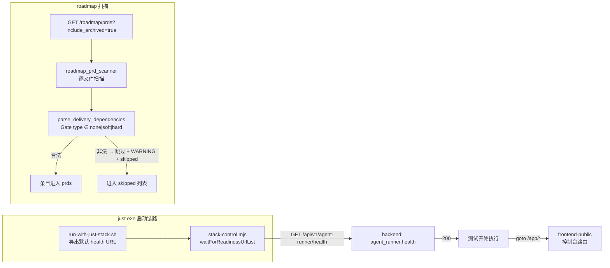

# PRD: 修复控制台 e2e 与 roadmap 归档视图的既有失效项

> ✅ **交付前置**：无，可立即开工。三项缺陷彼此独立（见 §8），可整批交付，也可拆成三个提交分批交付。
> 结构化声明见 §8 Delivery Dependencies，**那里是唯一事实源**。

本 PRD 分两层阅读：**Part A（人审层）** 供人决定"做不做、怎么做才对"；**Part B（执行器层）** 供执行者（人或 Agent）落地实现。人只需审 Part A，并按 Part A 的指引在需要时下钻 Part B。

## Feature Overview (功能一览)

> 本块是第 10 节 Functional Requirements 的通俗投影，不是第二事实来源；行为验收以第 1 节的行为样例表为准。

- **`just e2e` 开箱可跑**（FR-1）：不用手工设 `PLAYWRIGHT_HEALTH_URL` 也能通过就绪探针。
- **控制台 e2e 真正覆盖页面**（FR-2）：6 个 spec 与 1 个 page object 改用真实的 `/app/` 路由前缀，不再全部 404。
- **「显示已归档」不再 500**（FR-3）：扫描器对单条脏数据容错，并修掉现有那条非法 `Gate type`。
- **共享模板的修复不丢**（FR-4）：改动落在模板同步边界内，或显式登记为项目私有，避免下次 `just sync-template` 被覆盖。

# Part A · 人审层 (Review Layer)

## 1. Introduction & Goals

### Problem Statement

在 `P1-FEAT-20260913-204530-console-prd-content-reader` 的 rv-1 / rv-2 取证过程中，撞上三处**与本 PRD 无关、但确实挡路**的既有失效项。三者的共同点是：控制台相关的验证与功能有一条路径长期不可用，但因为没人走那条路，所以一直没暴露。

已核实的现状事实（2026-09-14 对着代码与运行时核过）：

**缺陷 A — `just e2e` 的就绪探针打一个不存在的路径。**
`scripts/shared/e2e/run-with-just-stack.sh:208` 默认导出
`PLAYWRIGHT_HEALTH_URL="http://127.0.0.1:$BACKEND_PORT/health"`，
`tests/playwright-e2e/scripts/stack-control.mjs:68/78` 与 `support/env.ts:115` 同样默认 `/health`。
但后端**没有** `/health`（只有 `/api/v1/agent-runner/health`），实测 `curl /health` → 404。
结果：readiness 轮询 240s 必超时，抛 `Timed out waiting for Playwright stack readiness`，
**任何** `just e2e` 都在测试真正开始之前失败。

**缺陷 B — 控制台真实路由带 `app/` 段，多数 spec 没写。**
`frontend-public/app/(app)/app/roadmap/page.tsx` 中 `(app)` 是路由组不占 URL，但 `app/` 是真实段，
因此 canonical 路径是 `/app/roadmap`（权威依据：`frontend-public/components/layout/app-sidebar.tsx` 的 `href`；
旁证：`workflows/console-served-static.no-auth.spec.ts` 的注释明确写「刷新 /app/roadmap、/app/stats 不 404」）。
实测 dev server：`/app/roadmap` → 200，`/roadmap` → 404。
仍写无前缀路径的位置共 **7 处文件、15 处 goto**：

| 文件 | 次数 | 路径 |
|---|---|---|
| `tests/smoke/roadmap.spec.ts` | 2 | `/roadmap` |
| `tests/smoke/roadmap-realistic.spec.ts` | 3 | `/roadmap` |
| `tests/smoke/idea-inbox.spec.ts` | 2 | `/ideas` |
| `tests/smoke/pages.spec.ts` | 1 | `/dashboard` |
| `tests/workflows/screenshot.spec.ts` | 2 | `/dashboard` |
| `tests/workflows/console-pages.no-auth.spec.ts` | 5 | `/dashboard` ×2、`/processes`、`/repositories`、`/stats` |
| `page-objects/AgentRunnerMonitorPage.ts:124` | 1 | `/dashboard`（经 `goto()` 方法） |

其中 `setup/auth.setup.ts` 已在上一轮修为 `/app/dashboard`——它是 `chromium` project 的依赖，
不修则带鉴权的 e2e 一条都跑不起来。

**缺陷 C — `include_archived=true` 因为一条脏数据整端 500。**
`tasks/archive/P1-FEAT-20260626-093939-agent-runner-session-persistence.md:70` 写着
`- Gate type: research-gate（需先完成调研，再决定是否进入实现）`，
而 `src/backend/core/use_cases/agent_runner_dependencies.py:131` 只接受 `none / soft / hard`，
直接 `raise ValueError` → `scan_roadmap_prds` 整体抛出 → 端点 500。
结果：roadmap 页的「显示已归档」开关在当前仓库数据下 100% 不可用，且单条脏数据能让整个列表端点瘫痪。

### Interpretation (解读回显)

**行为样例**（下表每一行会被逐字转录为 Part B 的验收判据——改正任何一格，就等于改正验收标准）：

| 输入 / 操作 | 期望观察到的结果 |
|---|---|
| 不带任何 env 覆盖直接 `just e2e tests/smoke/pages.spec.ts` | 就绪探针在数秒内通过，测试真正开始执行（不再 240s 超时） |
| 对 `/health` 与 `/api/v1/agent-runner/health` 各发一次请求 | 前者 404、后者 200；修复后探针打的是后者 |
| 上表 7 个文件里的控制台路由 | 全部带 `/app/` 前缀；`just e2e` 打开这些页面时不再 404 |
| 勾选 roadmap 页「显示已归档」 | 正常列出 archived PRD，不 500 |
| 故意构造一条 `Gate type` 非法的 PRD | 该条被跳过/降级并留痕，**其余 PRD 照常返回**，端点仍 200 |
| 修复后再次 `just sync-template` | 本次改动不被模板回滚冲掉（或已在 `config.toml` 登记为项目私有） |

**我默默定了这些**（有异议请直接指出）：

- 缺陷 A 的修复**优先改默认值**，而不是继续靠调用方传 `PLAYWRIGHT_HEALTH_URL`。默认就该是对的。
- 缺陷 B 只改路径字符串，不改 spec 的断言语义、不改被测行为。
- 缺陷 C 采用**容错 + 修数据**双管：扫描器不该让一条脏数据打挂整个端点；那条历史 PRD 也顺手改成合法值。
- 三件事可以在同一个提交里落地，也可以在三个提交里落地，互不阻塞。

**我理解为不做**：

- 不重写 e2e 套件、不引入新的测试框架、不补新的业务页面测试。
- 不改动 `parse_delivery_dependencies` 的**合法值域**（`none/soft/hard` 不变）。
- 不为归档 PRD 做全量数据清洗；只修当前会炸的那一条，并让扫描器有抗压能力。

**文字版解读**：把这件事读作"把控制台 e2e 从一个跑不起来的套件修成能跑，并把一个会被单条脏数据打挂的列表端点加上抗压"，
而不是"给 e2e 套件做现代化改造"或"做 PRD 元数据校验体系"。关键边界：改默认值、改路径、加容错；
非目标：换框架、扩值域、全量洗数据。

### What The User Gets

`just e2e` 敲下去就能跑，不用先查 wiki 找该设哪个 env；控制台的页面测试真的在测页面而不是在 404 上空转；
roadmap 的「显示已归档」能打开，而且以后某条 PRD 写错了门禁类型，也只会让那一条缺席，不会让整个页面报错。

### Measurable Objectives

- `just e2e` 在**不设** `PLAYWRIGHT_HEALTH_URL` 的前提下，就绪探针在 30s 内通过。
- 缺陷 B 列出的 7 个文件在 `just e2e` 中不再产生页面 404；`rg -n "goto\('/(?!app)" tests/playwright-e2e` 无命中。
- `GET /roadmap/prds?include_archived=true` 返回 200 且 `prds` 中含 `status == "archived"` 的条目。
- 注入一条非法 `Gate type` 的临时 PRD 后，端点仍返回 200，只是该条不出现在列表里。

## 2. Human Review Map (介入与风险地图)

本期有两个决策需要人工确认，其余改动走自动门禁。

### 决策一：扫描器遇到非法/损坏的 PRD 时怎么办

这是**可用性 vs 静默丢失**的取舍，判错一次的后果是"某条 PRD 悄悄从列表里消失而没人知道"，
所以不能由执行器自己拍板。

**请确认：** 同意「单条 PRD 解析失败时跳过该条 + 记录 WARNING 日志 + 在响应里给出被跳过的条目清单」，
而不是「整端点 500」或「静默丢弃不留痕」？

**验收：** 注入一条非法 `Gate type` 的临时 PRD，端点仍 200，其余 PRD 照常返回，
且被跳过的条目能在响应字段或日志中被查到。

备选（若不接受"跳过"）：让 `parse_delivery_dependencies` 把非法值降级为 `none` 并告警——
这样条目不消失，但语义是从"门禁未知"变成了"没有门禁"，属于静默篡改作者意图，故不作为默认推荐。

### 决策二：共享模板文件的修复方式

`scripts/shared/`、`tests/playwright-e2e/scripts/`、`tests/playwright-e2e/support/`、`page-objects/`
按 `tests/playwright-e2e/README.md` 属于 `just sync-template` 同步的共享基础设施，
README 明确写着「不要改动上层共享基础设施，除非要向上游模板反馈改进」。
但缺陷 A 的根因**就在**共享文件里，缺陷 B 也命中了 `page-objects/`。

**请确认：** 采用下面哪一条？
1. **改上游模板 + 本地同步**（推荐）：修 `zata-codes-template` 后 `just sync-template` 拉回，改动不会丢。
2. **本地改 + 登记为项目私有**：把相关路径加进 `config.toml` 的 `project_skip_paths`，本地直接改。
3. **只改本地、不登记**：最快，但下次 `just sync-template` 可能被覆盖，属已知技术债。

**验收：** 修复后跑一次 `just sync-template --list`，确认本次改动的文件不在"将被覆盖"的清单里。

**自动门禁，不需要逐项人工审阅：** 路径字符串替换、日志与响应字段的形态、`config.toml` 登记。
这些改动失败时局限在测试与扫描逻辑内、可回滚，由针对性测试与构建门禁拦截。

**本次明确不涉及：** 无数据库结构变更；不改动既有合法 PRD 的语义；不动 frontend-admin；
不动 PyPI / Homebrew 分发链路；不改动 `/api/v1/agent-runner/health` 本身。

## 3. Usage And Impact After Implementation

- **控制台开发者：** `just e2e` 开箱可用；页面级 e2e 开始真正覆盖 `/app/*` 路由。
- **写 PRD 的人：** 即便某条 PRD 的 Delivery Dependencies 写坏，也只是那一条不出现在 roadmap 里，
  不会让整页报错，且日志里能查到原因。
- **CLI / API 用户：** 无感知。端点契约不变，只是不再 500。
- **兼容性影响：** 无破坏性变更。`PLAYWRIGHT_HEALTH_URL` 的覆盖能力保留（只是默认值变对）。

## 4. Requirement Shape

- **actor:** 本项目开发者；次要：写 PRD 的人（Agent 与人）
- **trigger:** 想用 `just e2e` 验证控制台页面，或在 roadmap 页查看已归档 PRD
- **expected behavior:** e2e 开箱跑通并真正命中页面；归档视图可用且对脏数据抗压
- **explicit scope boundary:** 只修这三类失效项；不重写套件、不扩值域、不全量洗数据

# Part B · 执行器层 (Build Layer)

## 5. Repository Context And Architecture Fit

**现有模块与最近路径：**

- e2e 就绪探针：`scripts/shared/e2e/run-with-just-stack.sh:208`（导出默认 health URL）、
  `tests/playwright-e2e/scripts/stack-control.mjs:68/78`（`readinessUrlList`）、
  `tests/playwright-e2e/support/env.ts:115`（`getHealthUrl()`）。
- 后端健康检查：`src/backend/api/routes/agent_runner.py` 的 `@router.get("/agent-runner/health")`；
  router 前缀 `/api/v1`（`src/backend/api/app.py`）。**根路径 `/health` 不存在。**
- 控制台路由前缀：`frontend-public/app/(app)/app/<page>/page.tsx`；侧边栏 `href` 在
  `frontend-public/components/layout/app-sidebar.tsx:19-25`。
- 扫描器：`src/backend/core/use_cases/roadmap_prd_scanner.py:243` 调 `parse_delivery_dependencies`；
  后者在 `src/backend/core/use_cases/agent_runner_dependencies.py:129` 抛 `ValueError`。
- 模板同步边界：`tests/playwright-e2e/README.md` 的"模板同步边界"小节；
  `config.toml` 的 `project_skip_paths`（当前含 `tests/`，不含 `page-objects/`）。

**架构约束：**

- 四层依赖方向 `api -> core -> engines -> infrastructure` 不可破。缺陷 C 的容错属于 core 用例内部，
  不得把 try/except 上浮到 api 层去兜。
- 公共 Python API 用 Google Style 中文 docstring（后端启用 Ruff `D100`–`D107`）。
- 前端公共函数/类需中文 JSDoc/TSDoc。
- `tests/playwright-e2e` 是独立 TypeScript/Node 包，用 `npm`，遵循该目录自己的 README。

**相关 PRD 关系：**

- `tasks/archive/P1-FEAT-20260913-204530-console-prd-content-reader.md`（已归档）：本 PRD 的三项缺陷
  都是在它的 rv-1 / rv-2 取证中撞出来的，它在 §7 的 Drift 记录里已登记这些发现。本 PRD 是那些记录的正式落地，
  不反向阻塞它。
- `tasks/pending/P1-FEAT-20260913-204531-tauri-desktop-shell.md`：与本 PRD 无依赖关系。

## 6. Recommendation

**Recommended Approach：改默认值 + 批量改路径 + 扫描器容错 + 修那一条脏数据。**

1. **缺陷 A**：把三处默认 health URL 从 `<base>/health` 改为 `<base>/api/v1/agent-runner/health`，
   保留 `PLAYWRIGHT_HEALTH_URL` 的覆盖能力。
2. **缺陷 B**：把上表 7 个文件里的控制台路由批量加 `/app/` 前缀；`/` 与 `/login` 等不受影响。
3. **缺陷 C**：`scan_roadmap_prds` 对单条 PRD 的解析异常做捕获——跳过该条、记 WARNING、
   并把被跳过的条目带在响应里；同时把那条 `research-gate` 改成合法值。
4. **缺陷 A/B 涉及的共享文件**：按决策二选定的方式处理同步边界。

**为什么最贴合现有架构：** 全是修默认值与加边界防护，不引入新的抽象、新的依赖、新的端点；
`parse_delivery_dependencies` 的合法值域与签名都不动。

**拒绝的冗余抽象：** 不为 e2e 再包一层启动器；不做 PRD 元数据的 schema 校验体系；
不引入 PRD lint 命令（那是独立提案）；不为脏数据做全量清洗脚本。

### Proposed Solution Summary (实现机制)

缺陷 A：三处默认值统一指向后端真实存在的 `/api/v1/agent-runner/health`，覆盖开关语义不变。
缺陷 B：纯字符串替换，用 `rg` 全量核对后再改，改完用同一条 `rg` 断言无残留。
缺陷 C：`roadmap_prd_scanner.py` 在遍历单文件时包 try/except，异常时 `continue` 并收集到
`skipped` 列表（含路径与原因），`WARNING` 日志落一条；响应体新增 skipped 字段供前端/日志排查。
刻意避开的复杂度：不做重试、不做异步校验、不改既有合法 PRD 的解析结果。

### Alternatives Considered

| 备选 | 结论 | 理由 |
|---|---|---|
| 缺陷 A：继续靠调用方传 `PLAYWRIGHT_HEALTH_URL` | 拒绝 | 默认值本身就是错的，每个新人都会先撞一次 240s 超时才知道要传什么 |
| 缺陷 A：新增一个 `/health` 后端路由 | 拒绝 | 为迁就测试脚手架而给生产加端点；且 `/api/v1/agent-runner/health` 已经是既定的健康检查入口 |
| 缺陷 B：改前端路由去掉 `app/` 段 | 拒绝 | 反向迁就测试；`app/` 段是静态导出深层路由能被 `StaticFiles(html=True)` 解析的前提 |
| 缺陷 C：只修那一条脏数据 | 拒绝 | 治标。同类问题再来一次仍会让整个端点 500 |
| 缺陷 C：把非法值静默降级为 `none` | 拒绝 | 静默篡改作者意图；"门禁未知"变成"没有门禁"会让下游误判依赖 |
| 缺陷 C：在 api 层 try/except 兜成 200 | 拒绝 | 违背分层；且会让"扫到一半失败"这种状态被当成成功 |

## 7. Implementation Guide

> This section is a living implementation guide based on current repository analysis. If implementation discovers additional affected files, hidden dependencies, edge cases, or a better path, update this PRD before proceeding.

### Core Logic

**缺陷 A 控制流：** `run-with-just-stack.sh` 导出默认 health URL → `stack-control.mjs` 的
`waitForReadinessUrlList` 轮询 → `isUrlReady` 要求 `response.ok`。把默认 URL 换成真实存在的路径后，
轮询在数秒内返回 true。

**缺陷 C 控制流：** `scan_roadmap_prds` 逐文件 `parse_delivery_dependencies(prd_text)`。
改成：单条抛 `ValueError` 时不让它冒出函数，而是记录 `{prd_path, reason}` 后继续下一条；
函数返回结构里带上 `skipped`。api 层不变。

### Change Impact Tree

```text
.
├── scripts/shared/e2e/run-with-just-stack.sh
│   [修改]
│   【总结】就绪探针默认 URL 由 /health 改为 /api/v1/agent-runner/health
│   └── 锚点：rg -n "PLAYWRIGHT_HEALTH_URL" scripts/shared/e2e/
│   ⚠ 共享模板文件：按决策二处理同步边界
├── tests/playwright-e2e/
│   ├── scripts/stack-control.mjs
│   │   [修改]
│   │   【总结】两处 readinessUrlList 默认值同上修正
│   │   ⚠ 共享模板文件
│   ├── support/env.ts
│   │   [修改]
│   │   【总结】getHealthUrl() 默认后缀由 /health 改为 /api/v1/agent-runner/health
│   │   ⚠ 共享模板文件
│   ├── page-objects/AgentRunnerMonitorPage.ts
│   │   [修改]
│   │   【总结】goto() 的 /dashboard 改为 /app/dashboard
│   │   ⚠ 共享模板文件（page-objects/ 当前不在 project_skip_paths 内，需先按决策二敲定）
│   └── tests/
│       [修改]
│       【总结】6 个 spec 的控制台路由加 /app/ 前缀
│       ├── smoke/roadmap.spec.ts（/roadmap ×2）
│       ├── smoke/roadmap-realistic.spec.ts（/roadmap ×3）
│       ├── smoke/idea-inbox.spec.ts（/ideas ×2）
│       ├── smoke/pages.spec.ts（/dashboard ×1）
│       ├── workflows/screenshot.spec.ts（/dashboard ×2）
│       └── workflows/console-pages.no-auth.spec.ts（/dashboard ×2、/processes、/repositories、/stats）
│       锚点：rg -n "goto\('/(?!app)" tests/playwright-e2e/ → 修复后应无命中
├── src/backend/core/use_cases/
│   ├── roadmap_prd_scanner.py
│   │   [修改]
│   │   【总结】单条 PRD 解析失败时跳过并留痕，不让异常冒到 api 层
│   │   └── 返回结构新增 skipped 列表（prd_path + reason）
│   └── agent_runner_dependencies.py
│       [修改/不改]
│       【总结】值域 none/soft/hard 不变；若有需要可把异常类型收窄为专用异常便于捕获
├── src/backend/api/routes/agent_runner_roadmap.py
│   [可能修改]
│   【总结】仅在响应体需要透出 skipped 时改动，否则不动
├── tasks/archive/P1-FEAT-20260626-093939-agent-runner-session-persistence.md
│   [修改]
│   【总结】第 70 行 Gate type 由 research-gate（…）改为合法值（按作者原意判为 soft 或 hard，需人确认）
└── config.toml
    [可能修改]
    【总结】仅在决策二选「登记为项目私有」时才动 project_skip_paths
```

以上为起点而非穷尽清单；发现隐藏引用时按下方 Drift Guard 处理。

### Risk Classification Register

| change point | tier | decisive dimension/override | intervention | oracle/gate |
|---|---|---|---|---|
| 就绪探针默认值（共享模板） | R1 | 影响所有 e2e 运行；失败可判别 | 人工确认（决策二）+ 强判据 | rv-1 |
| spec 路由前缀批量替换 | R0 | 机械替换，失败立即可见 | 执行器 + `rg` 断言 | rv-2 |
| `page-objects/` 是否可改 | R1 | 模板同步边界，改错会被回滚冲掉 | 人工确认（决策二） | rv-4 |
| 扫描器单条容错 | R2 | 会把"整端 500"变成"静默少一条"，有信息丢失风险 | 人工确认（决策一）+ 负向对照 | rv-3 |
| 归档 PRD 数据修正 | R0 | 改一条历史文档的一个字段 | 执行器 + 端点返回 200 | rv-3 |

### Executor Drift Guard

- 默认值分布：`rg -n "PLAYWRIGHT_HEALTH_URL" scripts/ tests/playwright-e2e/`
- 后端健康检查唯一入口：`rg -n '"\(/api/v1\)\?/health' src/backend/`
- 控制台路由权威来源：`rg -n 'href: "/app' frontend-public/components/layout/app-sidebar.tsx`
- 残留无前缀路由：`rg -n "goto\('/(?!app)" tests/playwright-e2e/`（修复后应无命中）
- 拦截点：`rg -n "raise ValueError" src/backend/core/use_cases/agent_runner_dependencies.py`
- 模板同步清单：`just sync-template --list`
- 若上述搜索暴露清单外文件，先更新本 PRD 的 Change Impact Tree 再动手。

### Flow / Architecture Diagram



### ER Diagram

No data model changes in this PRD.

### Low-Fidelity Prototype

```text
终端：
  $ just e2e tests/smoke/pages.spec.ts
  Services ready on ports 8498/5933/3309.     ← 不再 240s 超时
  Running 3 tests using 1 worker
    ✓ pages.spec.ts:9 › dashboard renders

roadmap 页（勾选「显示已归档」）：
  ┌──────────────────────────────────────┐
  │ 路线图（117）                         │
  │ ├ ● pending PRD …                    │
  │ └ ○ archived PRD …   ← 不再 500      │
  └──────────────────────────────────────┘
  日志：WARNING 跳过 1 条 PRD：…/xxx.md（Invalid 'Gate type' …）
```

### Realistic Validation Plan

```yaml
oracles:
  - id: rv-1
    behavior: 不设 PLAYWRIGHT_HEALTH_URL 时 just e2e 的就绪探针能在 30s 内通过
    real_entry: "just e2e tests/smoke/pages.spec.ts（不导出任何 PLAYWRIGHT_* 覆盖）"
    expected: "readiness 在 30s 内通过，测试真正开始执行；不再出现 'Timed out waiting for Playwright stack readiness'"
    mock_boundary: "后端与前端真实启动；不 mock 就绪探针"
    tier: R1
    test_layer: e2e
    required_for_acceptance: true
    must_cross: "just e2e -> run-with-just-stack.sh -> stack-control.mjs 轮询 -> 真实 HTTP GET health -> 200"
    forbidden_bypasses: "禁止靠命令行传 PLAYWRIGHT_HEALTH_URL 让它通过（那是绕过默认值缺陷，不是修好它）"
    negative_control: "把默认值改回 /health 后重跑，应再次出现 readiness 超时"
    expected_fail: "修复前：不传 env 覆盖时必然超时"
  - id: rv-2
    behavior: 缺陷 B 列出的 7 个文件不再命中不存在的路由
    real_entry: "just e2e tests/smoke tests/workflows（真实栈）"
    expected: "无页面 404；被打开的页面能拿到预期的标题/主区域；rg -n \"goto\\('/(?!app)\" tests/playwright-e2e/ 无命中"
    mock_boundary: "真实后端与真实前端；不改被测页面行为"
    tier: R0
    test_layer: e2e
    required_for_acceptance: true
    negative_control: "把任一处改回 /roadmap，对应 spec 应立刻失败（页面 404）"
  - id: rv-3
    behavior: include_archived=true 返回 200 且含 archived 条目；单条脏数据不再打挂整体
    real_entry: "iar console --no-browser --port <port> 起服后 curl 'GET /api/v1/agent-runner/roadmap/prds?repo_id=keda-main&include_archived=true'"
    expected: "HTTP 200；prds 中含 status == 'archived' 的条目；再注入一条 Gate type 非法的临时 PRD 后仍返回 200，该条不出现在 prds 而出现在 skipped"
    mock_boundary: "后端与文件系统必须真实；不 mock 解析逻辑；临时脏数据必须显式命名（如 ZZ-RV-FIXTURE-*）并在断言中区分，用完即删"
    tier: R2
    test_layer: integration
    required_for_acceptance: true
    critical_value_source: "archived 条目必须来自真实 tasks/archive/ 目录，不得手工构造路径"
    fresh_state_probe: "独立 curl 进程重取一次结果一致；删除临时脏数据后该条从 skipped 消失"
    negative_control: "把容错逻辑去掉（恢复成直接抛出），注入同一条脏数据后端点应回到 500"
    expected_fail: "修复前：include_archived=true 直接 500；容错去掉后同请求再次 500"
  - id: rv-4
    behavior: 本次改动不会被 just sync-template 覆盖
    real_entry: "just sync-template --list"
    expected: "本次改动涉及的共享文件不在将被覆盖的清单中（取决于决策二的选项：改上游 / 登记为私有 / 显式记债）"
    mock_boundary: "真实配置与真实模板状态"
    tier: R1
    test_layer: integration
    required_for_acceptance: true
    negative_control: "若选了『只改本地、不登记』，本条应判为不通过并在报告中写明，而不是假装通过"
```

失败排查提示：rv-1 先确认后端端口来自 `.env.run-state` 而非硬编码 8000；
rv-2 先确认 `frontend-public` 的 dev server 已经重新编译（路由改动后首次访问会有编译延迟）；
rv-3 先确认 `skipped` 是新增字段而不是把异常吞掉。

### Interactive Prototype Change Log

No interactive prototype file changes in this PRD.

### External Validation

本 PRD 未新增联网核实需求。所有依据均来自 2026-09-14 对本仓代码与运行时行为的直接核查：
`just e2e` 的超时堆栈、`/health` 与 `/api/v1/agent-runner/health` 的实测状态码、
`/app/roadmap` 与 `/roadmap` 的实测状态码、`include_archived=true` 的 500 与对应 `ValueError` 堆栈。

## 8. Delivery Dependencies

- Group: none
- Depends on tasks/issues:
  - none
- Gate type: none
- Notes: 本 PRD **无任何上游依赖**，可立即开工。三项缺陷彼此独立：
  缺陷 A（就绪探针）与缺陷 B（spec 路径）都在 e2e 侧、可同一提交落地；
  缺陷 C（扫描器容错）在后端侧、独立可交付。任一单项完成都可单独验收，
  不要求三项齐活。缺陷 A/B 的共享文件同步方式（决策二）会同时影响两者，
  若选「改上游模板」，需等上游合入后才能 `just sync-template` 拉回。

## 9. Acceptance Checklist

验收证据包按风险排序呈现：人工确认项与高层级判据在前，普通门禁折叠在后。所有证据须在最终代码树上采集；相关代码后续改动使对应证据失效，须重验后方可归档。

### Human-Confirmed

- [ ] （决策一）rv-3 证据显示注入非法 `Gate type` 的临时 PRD 后端点仍 200，该条出现在 skipped 而非 prds，且日志/响应可查到原因
- [ ] （决策一）负向对照**实跑记录**：去掉容错逻辑后，同一条脏数据让端点回到 500
- [ ] （决策二）rv-4 证据显示本次改动的共享文件不在 `just sync-template --list` 的覆盖清单内（或已按选定选项显式处理）

### Architecture Acceptance

- [ ] 四层依赖方向未被破坏：容错逻辑落在 core 用例内，api 层没有新增 try/except 兜底（`rg -n "except" src/backend/api/routes/agent_runner_roadmap.py` 无新增）
- [ ] 新增/修改的公共 Python API 有中文 Google Style docstring，Ruff `D100`–`D107` 通过
- [ ] `parse_delivery_dependencies` 的合法值域仍为 `none/soft/hard`，未被放宽

### Behavior Acceptance

- [ ] `GET /roadmap/prds`（不带 include_archived）行为与响应结构与修复前一致（`include_archived=false` 路径未受影响）
- [ ] `include_archived=true` 返回 200 且含 `status == "archived"` 条目
- [ ] 归档 PRD `P1-FEAT-20260626-093939-agent-runner-session-persistence.md` 的 Gate type 已改为合法值，改动有说明（为何判为该值）

### Frontend / Test Acceptance

- [ ] rv-1 通过：`just e2e` 在不设 `PLAYWRIGHT_HEALTH_URL` 时就绪探针 30s 内通过
- [ ] rv-2 通过：7 个文件的控制台路由全部带 `/app/` 前缀，`rg -n "goto\('/(?!app)" tests/playwright-e2e/` 无命中
- [ ] 缺陷 B 涉及的 spec 在 `just e2e` 中不再产生页面 404
- [ ] frontend-admin 无任何改动（`git diff --stat frontend-admin/` 为空）

### Documentation Acceptance

- [ ] `tests/playwright-e2e/README.md` 补充一条说明：控制台路由以 `app/` 段开头，写 spec 时不要漏
- [ ] `docs/guides/agent-runner.md` 中若仍有无前缀路由写法，一并修正；`uv run mkdocs build --strict` 通过

### Validation Acceptance

- [ ] rv-1 / rv-2 / rv-3 / rv-4 全部通过
- [ ] `just lint --full` 与 `just test` 全绿
- [ ] 临时注入的脏数据 fixture 已删除（`rg -l "ZZ-RV-FIXTURE" tasks/` 无命中）

### Delivery Readiness

- [ ] 三项缺陷全部落地，无遗留"二期再补"项；若拆分交付，未交付项已从本 PRD 移出并另立 PRD

## 10. Functional Requirements

- FR-1: `just e2e` 的就绪探针默认值指向后端真实存在的健康检查路径（`/api/v1/agent-runner/health`），不设任何 env 覆盖时亦可通过；`PLAYWRIGHT_HEALTH_URL` 的覆盖能力保留。
- FR-2: 缺陷 B 列出的 7 个文件中的控制台路由全部带 `app/` 段；`/`、`/login` 等不受影响。
- FR-3: `scan_roadmap_prds` 对单条 PRD 的解析失败做容错——跳过该条、记录 WARNING、并在结果中给出被跳过条目（路径 + 原因）；整端点不再因单条脏数据返回 500。同时修正现有的那条非法 `Gate type`。
- FR-4: 本次改动涉及的共享模板文件，其同步边界按决策二的选定选项处理，确保后续 `just sync-template` 不会静默回滚本 PRD 的修复。

## 11. Non-Goals

- 不重写 e2e 套件、不换测试框架、不新增业务页面测试。
- 不改动 `parse_delivery_dependencies` 的合法值域（`none/soft/hard`）。
- 不为归档 PRD 做全量数据清洗或引入 PRD 元数据 schema 校验体系（独立提案）。
- 不新增 `/health` 后端路由。
- 不改动 frontend-admin；不改动 PyPI / Homebrew tap 分发链路。

## 12. Risks And Follow-Ups

| 风险 | 影响 | 缓解 |
|---|---|---|
| 扫描器容错后，坏 PRD 悄悄消失没人发现 | 某条 PRD 长期不出现在 roadmap 里 | 决策一要求"留痕"：WARNING 日志 + 响应里带 `skipped`；后续可在 roadmap 页上显式提示被跳过的条目数 |
| 共享模板改动被 `just sync-template` 回滚 | 缺陷 A 复发，e2e 又跑不起来 | 决策二 + rv-4 门禁；优先改上游模板 |
| `page-objects/` 归属不明确，改了会不会被同步掉不确定 | 改动丢失 | 先用 `just sync-template --list` 确认；必要时把该路径加入 `project_skip_paths` |
| 批量改路径时误伤了非控制台路由（如 `/login`） | 本该正确的路径被改坏 | 改动限定在上表列出的 7 个文件与具体路径；改完用 `rg` 反向核对 |
| 修归档 PRD 的 Gate type 时猜错作者原意 | 依赖门禁语义被改动 | 改动必须在提交说明里写清判据；拿不准时取更严的一侧（hard）并在 PRD §13 记录 |

**Follow-ups（不阻塞本 PRD）**：

- roadmap 页上展示被跳过的 PRD 条目数与原因（把"留痕"做到界面上）。
- 给 PRD 元数据加一个 lint 命令，在写 PRD 时就能发现非法的 `Gate type`。
- `tests/playwright-e2e` 的其他共享基础设施默认值（如 `docker` 模式的 8080/8081 端口）同样未经本项目校准，值得一起核。

## 13. Decision Log

| ID | 决策问题 | Chosen | Rejected | Rationale |
|---|---|---|---|---|
| D-01 | 扫描器遇到非法 PRD 怎么办 | 跳过该条 + WARNING + `skipped` 清单 | 整端 500；静默丢弃；静默降级为 none | 500 让整页不可用；静默丢弃不可观测；降级为 none 是篡改作者意图 |
| D-02 | 共享模板文件怎么改 | 待人工确认（决策二：改上游 / 登记私有 / 只改本地） | — | 待定，见 §2 决策二 |
| D-03 | 缺陷 A 是改默认值还是加后端路由 | 改默认值指向既有 `/api/v1/agent-runner/health` | 新增 `/health` 路由 | 不为迁就测试脚手架给生产加端点 |
| D-04 | 缺陷 B 是改测试还是改路由 | 改测试，加 `app/` 前缀 | 改前端路由去掉 `app/` 段 | `app/` 段是静态导出深层路由能被解析的前提，动它会波及生产 |

### Final Reconciliation

- 待归档前填写。须按模板核对：Interpretation、Public behavior and contracts、Related PRD status、Requirements and risks，以及 `Feature Overview (功能一览)` 与 §10 的一致性。
