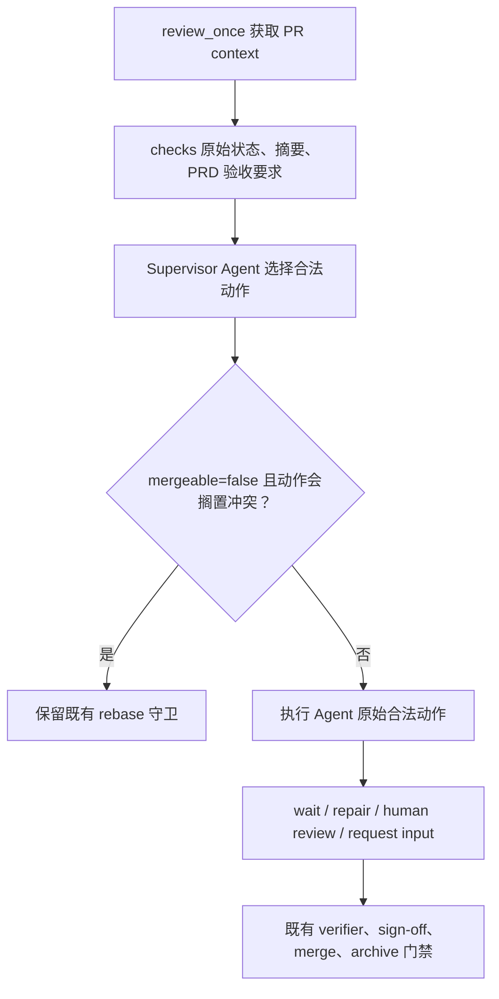

# PRD: 由 Post-PR Supervisor Agent 判断 CI 状态与下一步

- GitHub Issue: https://github.com/ZataZhang/keda/issues/156

> ⛔ **交付前置**：无；可立即开工。本 PRD 是 Roadmap CI/CD 产品化 PRD 的前置契约，后者必须等待本文交付。
> 结构化声明见 §8 Delivery Dependencies，那里是唯一事实源。
>
> ⬜ **验收状态**：未开工。
> 本行是 §9 Acceptance Checklist 的投影，那里是唯一事实源。
>
> 本 PRD 分为 **Part A · 人审层**与 **Part B · 执行器层**。

## Feature Overview (功能一览)

- **Agent 读取事实并作决定**（FR-1、FR-2）：平台向 Post-PR Supervisor 提供原始 checks 状态、摘要、链接和 PRD 验收要求；Agent 判断是代码/测试失败、CI 基础设施未执行/不可用，还是证据不足。
- **移除按 checks 状态改写动作的代码**（FR-3）：`FAILURE` 不再自动改写成 repair，`PENDING` 不再自动改写成 wait；平台执行 Agent 返回的合法动作。
- **账单或 runner 故障不自动阻塞可审阅工作**（FR-4）：当工作流未实际运行且本地验证、verifier 与审阅均通过时，Agent 可以把工作交给人审，并明确披露远端 CI 未验证；不得声称 CI 通过或自动验收。
- **保留非 CI 安全门**（FR-5）：PR mergeability 冲突仍由确定性逻辑要求先 rebase；verifier、人工签核、禁止路径、合并与归档门禁保持有效。

# Part A · 人审层 (Review Layer)

## 1. Introduction & Goals

### Problem Statement

当前 `pr_supervisor.py::guard_supervisor_action_for_pr_state` 会根据聚合状态覆盖 Agent 的选择：任意 `FAILURE` 会把 `approve_for_human_review` 改成 `repair_pr_branch`，`PENDING` 会改成 `wait_for_checks`。`review_once.py` 随后把 `request_human_input` 标为 `blocked`。因此，“GitHub 显示失败”被当成“代码失败”，“工作流因账单限制根本没有启动”也可能被 Agent 送入阻塞；目前代码不会判断是否有 job 真正执行。

同一仓库的 pending Roadmap CI/CD PRD 曾把 `FAILURE` 定义为 repair 输入；其当前工作树版本已改为声明硬依赖本文、把 checks 定义为 Agent 输入（见其 §1 行为样例与 §8，修订尚未提交，见 git status）。但平台侧 `guard_supervisor_action_for_pr_state` 的 FAILURE/PENDING 改写仍原样存在于代码中——只改提示词或只改 Roadmap 文档都不解决问题；且 Roadmap PRD 的实现必须等待本文交付，否则会先固化同一旧策略。

### Interpretation (解读回显)

以下行为样例会逐项成为 §7.6 验收 oracle；改表格单元格即修改对应验收标准。

| 输入 / 操作 | 期望观察到的结果 |
|---|---|
| GitHub 返回 `FAILURE`，失败 job 有实际测试执行和失败摘要 | Supervisor Agent 检查详情后可选择 `repair_pr_branch`；平台执行该动作，不需要状态守卫代选。 |
| checks 为 `FAILURE`，workflow 因账单限制未启动、没有 job 执行；本地验证及 verifier 通过，PRD 未要求必须远端 CI | Agent 可选择 `approve_for_human_review`；结果明确写明 CI 未运行/未验证，Issue 进入 review；不得标记为 CI 通过、验收完成、可自动合并或可归档。 |
| checks 为 `PENDING`，但 Agent 根据可见事实决定先交人审并披露 CI 仍在运行 | 平台保留 `approve_for_human_review`，不改写为 `wait_for_checks`；既有更高层验收/合并门禁仍按原规则生效。 |
| PRD 明确要求远端 CI 通过，但 CI 因账单或服务故障不可用 | Agent 不得把该验收项判为通过；应保留未验证项，并根据可用信息请求人工输入或等待，不得伪造通过。 |
| PR `mergeable=false`，Agent 选择 approve、wait 或 request human input | 确定性 mergeability 守卫仍要求 rebase；该守卫不读取 checks 状态。 |
| Agent 选择的动作不在协议中，或响应无法解析 | 既有协议错误/失败处理继续生效；平台不得根据 CI 状态猜测另一个动作。 |

**我默默定了这些**：

- `checks_state` 是 Agent 的观察事实，不是平台动作指令；代码不按 `FAILURE`、`PENDING` 或 sign-off-only 聚合结果改写动作。
- 平台仍负责验证动作 schema、PR/head 新鲜度、幂等、动作授权和非 CI 安全条件；“由 Agent 判断”不等于“移除执行器安全边界”。
- GitHub CI 未运行或不可用只代表远端证据缺失，不等于代码正确，也不等于验收通过。
- 一个任务能否进入人工 review、自动合并或归档，分别继续受现有 Agent 动作协议、verifier、sign-off、merge queue 与 PRD 验收门禁约束。

**我理解为不做**：

- 不实现账单、GitHub Actions 或 runner 故障的机器分类器；不新增错误分类枚举。
- 不取消 PR mergeability 冲突守卫，也不削弱 verifier、sign-off、分支保护、自动合并或归档门禁。
- 不在本文实现 Roadmap CI/CD 面板、自动修复开关、轮次 UI 或 CI 日志抓取；它们属于依赖本文的 Roadmap PRD。

**文字版解读**：本需求读作“把 checks 的原始观察结果和 PRD 验收要求交给 Supervisor Agent，让它选择等待、修复、交人审或请求信息；平台执行合法选择，并继续执行与 CI 分类无关的安全门”。它不是用 prompt 取代所有后端校验，也不是把未运行的 CI 当成通过。

### What The User Gets

当 GitHub workflow 因账单或服务问题没有执行时，Issue 不会仅因红色聚合状态被代码强行送去修复或阻塞。Supervisor Agent 会结合 job 执行情况、可用的本地验证、verifier 结果和 PRD 要求作出选择，并在评论中如实说明什么已验证、什么仍未验证。真实代码失败仍可由 Agent 请求修复。

### Measurable Objectives

- 对任意 `FAILURE` 与 `PENDING` 输入，合法 Agent 动作在动作守卫后保持不变；唯一例外是与 checks 无关的 mergeability 冲突动作守卫。
- Prompt 包含原始 checks 信息与相关 PRD 验收要求，并要求区分已执行失败、未执行/基础设施不可用、证据不足。
- 账单阻断场景可以进入人工 review 并明确保留 CI 未验证状态；不会产生伪造的 PASS、自动合并或归档资格。

## 2. Human Review Map (介入与风险地图)

### 决策一：把 CI 结果作为 Agent 输入，而非代码动作策略

建议保留 GitHub checks adapter 提供的状态、摘要与可用链接；删除 `guard_supervisor_action_for_pr_state` 中基于 `checks_state` 的动作改写。Supervisor prompt 明确要求 Agent 检查“是否有 job 执行”和 PRD 是否要求远端 CI，并为证据缺失保留未验证表述。

**请确认：** 允许 Agent 根据 checks 详情和 PRD 验收要求选择下一步；平台不再把 `FAILURE` 强制改写成修复、把 `PENDING` 强制改写成等待，是否符合预期？

**验收：** 至少覆盖真实代码测试失败与账单导致 workflow 未运行两种情况；Agent 的合法动作不被状态守卫覆盖，未运行 CI 始终显示未验证。

### 决策二：保留哪些确定性安全守卫

建议仅移除 CI 状态驱动的动作守卫。`mergeable=false` 仍要求先解决冲突；Agent 动作 schema、fresh head、幂等与现有 verifier/sign-off/merge/archive 门禁保持不变。

**请确认：** 接受“CI 判断交给 Agent，非 CI 安全约束仍由代码强制执行”的边界？

**验收：** checks 为任意状态时，mergeability 冲突依然不能被 approve/wait/request-human-input 绕过；其余合法动作只受既有协议与非 CI 守卫约束。

### 自动门禁，不需要逐项人工审阅

Prompt 契约测试、动作保持性测试、mergeability 负控和现有 review CLI 路径由执行器与 verifier 验证。最终行为摘要和真实 review surface 留给 §9.1 呈递。

## 3. Usage And Impact After Implementation

**Issue/PRD 操作者**：继续使用 `iar review` 或现有 review daemon。若 checks 失败，Issue 评论会记录 Agent 依据 job 是否执行、失败摘要、本地验证和 PRD 要求作出的判断。基础设施未运行时，工作可呈递给人审，但评论明确指出未验证项。

**Supervisor Agent**：读取 checks 状态/摘要/链接、PRD 验收上下文和现有验证证据；按 prompt 协议选择动作与说明。机器不替它分类账单、代码失败或服务故障。

**仓库维护者**：仍由既有 verifier、review、sign-off、merge queue 与归档流程决定能否接受和合并。进入人工 review 不代表验收完成。

**Impact on Existing Behavior**：现有合法动作 schema 和无 CI 冲突时的 `mergeable=false` rebase 守卫保持兼容。变化仅是 `checks_state` 不再重写 Agent 动作；因此依赖旧改写行为的提示词和测试需要同步调整。无前端影响：行为通过现有 Issue 评论和 review workflow 呈递，不新增用户界面。

## 4. Requirement Shape

- **Actor**：Post-PR Supervisor Agent、Issue/PRD 操作者、仓库维护者。
- **Trigger**：`review_once` 获取当前 PR 上下文并发起 Supervisor cycle。
- **Expected behavior**：Supervisor 依据原始 checks、PRD 要求与其它验证证据选择合法动作；平台不按 checks 状态改写该动作；CI 未执行/不可用不得被描述为通过。
- **Scope boundary**：改变 post-PR 决策输入和动作守卫；不改变 pre-PR verifier 判定，不重建 CI 执行器，不新增状态存储或错误分类服务。

# Part B · 执行器层 (Build Layer)

## 5. Repository Context And Architecture Fit

### Existing Path

- `src/backend/core/use_cases/pr_supervisor.py::build_supervisor_prompt` 已向 Supervisor prompt 提供 `checks_state` 与 `checks_summary`；Action Protocol 列出 `approve_for_human_review`、`repair_pr_branch`、`wait_for_checks`、`request_human_input` 等动作。
- `build_supervisor_prompt` 当前含有“sign-off-only 时必须 approve”的固定提示；`guard_supervisor_action_for_pr_state` 也对 sign-off-only、`mergeable=false`、`FAILURE` 和 `PENDING` 执行动作改写。本文移除 prompt 与 guard 中按 CI/sign-off 状态指定动作的特例，只保留 `mergeable=false` 分支。
- `run_post_pr_supervisor_cycle` 解析 Agent 动作后调用同一 guard（`pr_supervisor.py:1012`）；`_process_review_candidate` 在按动作推进 workflow label 之前会**再次**调用同一 guard（`review_once.py:337`）。当前各分支对二次应用幂等，但移除 checks 改写时必须意识到 guard 有两个生产调用点，两处都不得残留 CI 状态策略。
- `PullRequestContext` 与 `github_pr_ops.py`/`github_helpers.py` 提供 checks 聚合：adapter 只暴露 `checks_state` 与 `checks_summary`；summary 每行是失败/进行中 check 的展示名加 `status/conclusion/state` 字段，仅在 GitHub 返回 `detailsUrl`/`targetUrl` 时附 URL；成功通过的 check 不进入 summary；没有结构化 job 名、日志或独立链接字段。prompt 只能基于这些既有事实，不新建 GitHub 数据抓取系统。
- `tests/test_pr_supervisor.py` 当前断言 FAILURE→repair、PENDING→wait、sign-off-only prompt/guard 特例；这些测试应改为动作保持性与 prompt 证据要求，并保留 mergeability 断言。

### Reuse Candidates

- 复用 `build_supervisor_prompt` 的 checks 上下文和现有 Action Protocol，不引入第二套分类提示。
- 复用 `review_once` 的动作执行与 Issue 评论呈递路径。
- 复用当前 GitHub PR context 汇总与 mergeability 守卫；只删除 checks 状态动作改写。

### Architecture Constraints

- 动作决策仍由 Supervisor Agent 产出，core 只做协议解析、状态迁移与与 CI 分类无关的安全约束。
- 不新增账单/基础设施故障判定器，不从 core 直接引入 GitHub SDK。
- `approve_for_human_review` 只表示进入人工 review；它不得代替 verifier PASS、sign-off 或 PRD Acceptance Checklist。

### Frontend Impact

**No frontend impact**：现有 Issue detail 已展示 checks 与 supervisor 事件；本 PRD 调整服务端 prompt/动作守卫和既有事件评论，不新增可视化或交互。

### Existing PRD Relationship

- **硬前置**：pending `P1-FEAT-20260916-134008-roadmap-prd-cicd-monitor-auto-repair.md` 依赖本文。文档侧对齐已在工作树完成：其 §8 已声明 `Gate type: hard` 依赖本文，行为样例与 §5 已改为“checks 是 Agent 输入，自动修复策略只约束 Agent 选出的 repair 动作”，监控、开关、次数上限及 UI 行为保留。剩余约束是实现顺序：其代码实现必须等本文交付后进行；注意该 PRD 的修订当前仅存在于工作树（git status 显示未提交），提交前两边引用才会持久一致。
- **软相关**：pending `P1-FEAT-20260922-000431-blocked-draft-pr-validation-failure.md` 处理 pre-PR verifier 耗尽与交接，并规定失败性质不建机器枚举；本文处理 post-PR Supervisor 动作选择，二者是不同生命周期阶段，不应把其实现并入对方。
- Operator Skill/priority queue PRD（`P1-FEAT-20260924-020856-iar-operator-skill-and-predictable-queue.md`）已从 pending 移至 `tasks/archive/`，与本文独立。
- 归档 `P1-BUG-20260527-093356-agent-runner-ci-rework-state-recovery` 和相关 post-PR supervisor 安全设计记录了旧 FAILURE/PENDING 策略；本文明确替换其“按聚合 checks 状态强制改写 Agent 动作”部分，不影响崩溃恢复、次数上限和 mergeability 守卫。

### Potential Redundancy Risks

- 不要在 `review_once`、Roadmap API 或前端再加一份 checks→动作映射。
- 不要新增“billing blocked”等持久枚举或分类器；原始 GitHub 证据与 Agent 解释即可。
- 不要为了 Agent prompt 增加未被 GitHub adapter 实际提供的 job 事实；信息不可得时必须让 Agent表述为不确定/未验证。

## 6. Recommendation

### Recommended Approach

1. 更新现有 Supervisor prompt：要求检查 `checks_summary` 中可见的 check 名称/结论/摘要，区分已执行检查失败、未运行或基础设施不可用、信息不足；以 PRD 的验收要求决定未验证项能否进入人审。若摘要不足以确认是否执行，必须说明不确定，不能假设 job 运行或成功。
2. 提供行为规则：代码/测试失败且证据充分时可请求 repair；workflow 未启动/额度限制等基础设施问题不得仅凭红色 aggregate state 请求盲目修代码；本地验证和已有 review evidence 通过且 PRD 未要求该远端 gate 时，可进入人审并披露未验证；不得仅因账单阻断就请求人工输入或把 Issue 标为 blocked；信息不足或 PRD 硬性要求未满足时，保留未验证并等待/请求人工输入。
3. 从 `build_supervisor_prompt` 移除 sign-off-only 直接要求 approve 的固定规则；从 `guard_supervisor_action_for_pr_state` 删除所有由 checks 状态或 sign-off-only 检测触发的动作改写；保留独立的 `mergeable=false` 冲突守卫。
4. 保持动作解析、动作执行、Issue 状态映射、幂等与现有 verifier/sign-off/merge/archive 门禁不变。
5. 更新 `test_pr_supervisor.py` 和 prompt contract 测试，验证 Agent 合法动作原样通过 CI 状态 guard；真实入口走 `iar review`/review once 路径。

### Alternatives Considered

- **按 GitHub FAILURE 强制 repair**：拒绝；测试失败和零 job 启动会得到同一 aggregate 状态，无法从 `checks_state` 判根因。
- **写 billing/infra allowlist**：拒绝；服务错误和账单原因会变动，分类表会持续滞后且继续把判断写死。
- **移除所有动作守卫**：拒绝；merge conflict 是独立、机器可确定的安全/可执行条件，不属于 CI 失败分类。

### Executor Drift Guard

先用 `rg -n "guard_supervisor_action_for_pr_state|checks_state|is_sign_off_gate_only_failure|build_supervisor_prompt" src/backend/core/use_cases/pr_supervisor.py src/backend/core/use_cases/review_once.py tests/test_pr_supervisor.py` 重定位调用点。允许的行为差异是删除 checks/sign-off 动作改写；不得删除 mergeability 冲突守卫或 verifier/签核/归档门禁。检查完成后同步修订 Roadmap CI/CD PRD 的所有 FAILURE/PENDING→动作描述。

### Risk Classification Register

| Change point | Tier | Decisive dimension / override | Intervention | Oracle / gate |
|---|---|---|---|---|
| Prompt 对 CI 已执行/未执行与 PRD 要求的决策指导 | R2 | 决定 repair、blocked 或人工 review；错误会造成返工或错误验收表述 | Human confirmation | rv-1 |
| Checks 动作改写移除、mergeability guard 保留 | R2 | Post-PR 核心状态迁移；错误会覆盖 Agent 决策或丢失冲突处理 | Human confirmation | rv-2 |
| docs/相关 PRD 对齐 | R0 | 机械契约同步 | Executor + automated gates | rv-3 |

### Flow / Architecture Diagram



### Realistic Validation Plan

```yaml
- id: rv-1
  behavior: Supervisor prompt 要求根据 checks 详情和 PRD 要求区分真实执行失败与未执行/基础设施不可用，并如实保留未验证项
  reviewer: human
  real_entry: "在配置好的隔离 Keda 仓库中运行 `uv run iar review`，按 docs/guides/agent-runner.md 将目标 Issue 放入 review 流程"
  expected: "Issue review 结果如实说明 checks 未运行/未验证；只在人审条件满足且 PRD 未要求该 CI gate 时进入 review，不将其标为通过"
  mock_boundary: "默认验证允许 fake Agent 与 fake GitHub context；prompt 组装和 review_once 编排必须经过真实 CLI/use-case 路径；opt-in sandbox 使用真实 Agent/GitHub"
  tier: R2
  test_layer: integration
  required_for_acceptance: true
  presentation: "tasks/evidence/P1-BUG-20260924-100212-agent-led-post-pr-ci-decision/rv-1-issue-review.txt；交付时在完成消息中展示该真实 Issue 评论与状态记录"
  critical_value_source: "review_once 传给 run_post_pr_supervisor_cycle 的 PullRequestContext、Issue 引用 PRD 的验收要求及 fake/真实 Agent 收到的 prompt"
  must_cross: "iar review CLI -> review_once -> PR context 与 PRD 上下文装配 -> supervisor prompt -> 合法 Agent action -> Issue 状态/comment fresh read"
  forbidden_bypasses: "不得直接调用 prompt helper 代替 CLI；不得在测试中预设 billing 分类结果；不得把未运行 checks 改写成 SUCCESS；不得用单测代替真实 workflow 状态迁移"
  fresh_state_probe: "使用新的 fake GitHub 查询/CLI review pass读取 Issue labels 与 supervisor comment，确认 review 状态且包含未验证披露"
  final_tree_evidence: "保存 CLI transcript、Agent 输入 prompt 和 fresh Issue 状态；记录 git tree SHA，最终相关代码或文档改动后重跑"
  negative_control: "在测试边界将 Agent prompt 中‘CI 未运行不等于通过’规则移除并重跑相同账单/零 job fixture"
  expected_fail: "负控应产生把未运行 CI 描述为已通过/验收完成的错误结果，rv-1 必须失败"
- id: rv-2
  behavior: checks FAILURE/PENDING 不覆盖 Agent 合法动作，mergeability conflict 守卫仍生效
  reviewer: verifier
  real_entry: "uv run pytest tests/test_pr_supervisor.py -q"
  expected: "FAILURE 下 Agent approve 保持 approve、Agent request_human_input 保持 request_human_input；PENDING 下 Agent approve 保持 approve；mergeable=false 时冲突相关动作仍变为 rebase"
  mock_boundary: "Agent 与 PullRequestContext 可在测试边界构造；必须调用公开动作守卫与 supervisor cycle 实际接线，不得 mock guard 本身"
  tier: R2
  test_layer: integration
  required_for_acceptance: true
  critical_value_source: "guard_supervisor_action_for_pr_state 输入的 SupervisorActionResult 与 PullRequestContext"
  must_cross: "Supervisor action parse -> production guard -> review_once/runner action dispatch"
  forbidden_bypasses: "不得只测新的纯 helper；不得删除 mergeability 测试；不得将 checks 状态归一化成无差异 fixture"
  fresh_state_probe: "运行一组同时包含 FAILURE、PENDING、SUCCESS 和 mergeable=false 的 review 状态转换并读取返回 outcome"
  final_tree_evidence: "pytest 结果与最终 git tree SHA 一同记录；修改 prompt/guard/接线后重新运行"
  negative_control: "在测试边界恢复 FAILURE→repair 的动作覆盖并运行动作保持性断言"
  expected_fail: "Agent 在 FAILURE 下返回 approve_for_human_review 时被改写，rv-2 断言失败"
- id: rv-3
  behavior: 实现与运维文档说明未执行 CI 不等于通过，且 Roadmap 自动修复依赖本 PRD 的 Agent 决策契约
  reviewer: verifier
  real_entry: "rg -n 'checks_state.*(repair|wait)|未运行|未验证|agent-led-post-pr-ci-decision' tasks/pending docs/guides/agent-runner.md"
  expected: "不存在与新契约冲突的 FAILURE/PENDING 强制动作描述；Roadmap PRD 对本文声明 hard dependency；指南说明人审不等于验收或自动合并"
  mock_boundary: "不适用；仓库文本搜索与 PRD 结构检查"
  tier: R0
  test_layer: integration
  required_for_acceptance: true

# Failure triage: 先检查实际拼入 prompt 的 checks_summary/job 信息和 PRD 验收上下文，再检查 guard 是否仍依据 checks_state 改写动作。
```

### ER Diagram

No data model changes in this PRD.

### External Validation

No external validation required; repository evidence was sufficient.

### Interactive Prototype Change Log

No interactive prototype file changes in this PRD.

## 7. Implementation Guide

> This section is a living implementation guide based on current repository analysis. If implementation discovers additional affected files, hidden dependencies, edge cases, or a better path, update this PRD before proceeding.

### Change Impact Tree

```text
.
├── src/backend/core/use_cases/pr_supervisor.py
│   [修改]【总结】向 Supervisor 提供 CI 判断指引并移除 checks/sign-off 驱动的动作覆盖
│   ├── prompt 基于现有 checks_summary 和 Issue/PRD 内容，不虚构不可见 job 事实
│   ├── 删除 sign-off-only 必须 approve 的提示特例
│   └── 仅保留 mergeability 冲突守卫
├── src/backend/core/use_cases/review_once.py
│   [可能修改]【总结】guard 在本文件 :337 有第二个生产调用点；若 guard 原地修改则此处通常无需改动，但必须保持两个调用点无 CI 状态改写语义一致，不新增 CI 状态策略
├── tests/test_pr_supervisor.py
│   [修改]【总结】将 FAILURE/PENDING/sign-off 特例断言换成动作保持性与 prompt 证据规则断言，并保留冲突负控
├── docs/guides/agent-runner.md
│   [完成·待实现复核]【总结】契约说明已于 2026-09-28 按本文 §6 口径先行更新（Agent 决策 + 仅 mergeability 守卫）；guard/prompt 代码落地后须复核文档与行为一致，并随 rv-3 验收
└── tasks/pending/P1-FEAT-20260916-134008-roadmap-prd-cicd-monitor-auto-repair.md
    [复核]【总结】文档侧对齐已在该 PRD 工作树完成（§8 hard 依赖本文、移除 checks 状态直接触发 repair 的表述）；交付时复核其随本文实现保持一致
```

### Validation Commands

```bash
uv run pytest tests/test_pr_supervisor.py -q
rg -n "checks_state.*(repair|wait)|guard_supervisor_action_for_pr_state|is_sign_off_gate_only_failure" src/backend/core/use_cases tests
uv run mkdocs build --strict
```

## 8. Delivery Dependencies

- Group: post-pr-agent-decision
- Depends on tasks/issues:
  - none
- Gate type: none
- Notes: 本文可独立实现。Roadmap CI/CD monitor PRD 反向依赖本文；不得先把其旧的 FAILURE→repair 语义产品化。

## 9. Acceptance Checklist

### 9.1 人读呈递区（Human Review Surface）

| 要看的结果 | 呈递物 | 10 秒自检 |
|---|---|---|
| CI 失败分类由 Agent 决定，账单/零 job 情况可呈递人审但明确未验证 | `tasks/evidence/P1-BUG-20260924-100212-agent-led-post-pr-ci-decision/rv-1-review-cycle.txt`（交付时填真实记录） | 记录里能看到 Agent 输入、返回动作与 Issue fresh state |
| FAILURE/PENDING 不覆盖 Agent 合法动作，merge conflict 仍要求 rebase | `tasks/evidence/P1-BUG-20260924-100212-agent-led-post-pr-ci-decision/rv-2-guard-tests.txt`（交付时填真实记录） | checks 动作保持，mergeability 负控变为 rebase |

注：rv-1、rv-2、rv-3 均由 `reviewer: verifier`；没有需要人逐张查看的新增 UI。上表记录需要在人审时呈递的行为结论与可追溯证据。

### 9.2 Acceptance Evidence Package

1. **R2 行为**：rv-1 真实 CLI review cycle 的 prompt、Agent 决定与 Issue fresh state；rv-2 动作保持及 mergeability 负控。
2. **R0 文档**：rv-3 PRD/指南契约搜索与文档构建。

#### Behavior Acceptance

- [ ] rv-1 证明 Agent 收到原始 checks 与 PRD 验收要求，并能对账单/零 job 情况给出可审阅且明确未验证的结论
- [ ] rv-2 证明 FAILURE/PENDING 不改写合法 Agent 动作，`mergeable=false` 冲突守卫仍要求 rebase
- [ ] 未运行 CI 不会被记录成 SUCCESS、verifier PASS、验收完成或自动合并资格

#### Documentation Acceptance

- [ ] `docs/guides/agent-runner.md` 解释真实检查失败、未执行 CI、证据不足的处理边界
- [ ] Roadmap CI/CD pending PRD 声明依赖本文，并不再定义 FAILURE/PENDING 到 repair/wait 的代码映射
- [ ] `uv run mkdocs build --strict` 通过

#### Validation Acceptance

- [ ] rv-1 至 rv-3 的证据绑定最终相关代码树；prompt/guard/dispatch/doc 任一改动后重采受影响证据
- [ ] rv-1 经过 `iar review` 实际入口；测试 Agent/GitHub 可在边界替身，但 review 编排与状态迁移必须真实执行
- [ ] rv-2 同时覆盖 FAILURE、PENDING、SUCCESS 与 mergeability conflict；不得删掉非 CI 安全守卫
- [ ] 人工确认自动修复 Roadmap 后续 PRD 已引用本 PRD 的动作决策契约

#### Delivery Readiness

- [ ] 推荐目标态完整交付；没有残留由 checks_state 或 sign-off-only 分类决定 Agent 动作的守卫
- [ ] 保留 Agent action schema、mergeability 冲突守卫与既有 verifier/sign-off/merge/archive 门禁
- [~] 独立 verifier review — runner-owned gate
- [~] PRD 归档至 `tasks/archive/` — runner-owned gate

#### Human-Confirmed

- [ ] 决策一确认：CI checks 作为 Agent 输入，failure/pending 不强制改写动作
- [ ] 决策二确认：保留非 CI 安全门和所有既有验收/合并/归档门禁
- [ ] §9.1 行为呈递物已查看并接受

## 10. Functional Requirements

- **FR-1**：Supervisor Agent 输入必须包含当前可获得的 checks 状态、摘要及链接，并包含可获得的 PRD 验收/验证要求；不得捏造 adapter 未提供的 job 事实。
- **FR-2**：Supervisor prompt 必须指导 Agent 区分已执行检查失败、workflow/job 未运行或基础设施不可用、当前信息不足；失败性质由 Agent 判断，不创建代码分类器或持久分类状态。
- **FR-3**：平台不得仅因 `checks_state == FAILURE`、`PENDING`、`SUCCESS` 或 sign-off-only 检查改写合法 Agent action。
- **FR-4**：遇到账单/runner/GitHub 服务问题导致检查未执行时，若 PRD 没有要求该远端检查作为硬性验收项，且本地验证/verifier 与 review 条件满足，Agent 可选择 `approve_for_human_review`，但必须明确标注未验证；不得仅因账单阻断选择 `request_human_input`/`blocked`；若 PRD 硬性要求未满足，不得声称该要求通过。
- **FR-5**：`approve_for_human_review` 不得被描述为验收完成、verifier PASS、自动合并或归档授权；后续既有门禁继续生效。
- **FR-6**：`mergeable=false` 守卫继续要求对冲突进行 rebase；该逻辑不得依赖 CI 状态。
- **FR-7**：未知或不可解析的 Agent action 继续遵循现有协议错误处理，不根据 checks 状态推测替代动作。
- **FR-8**：同步更新 Post-PR Supervisor 测试、操作指南和依赖本文的 Roadmap CI/CD PRD。

## 11. Non-Goals

- 不实现 GitHub Actions job/log 获取、账单 API 集成或基础设施根因分类器。
- 不新增 CI 失败枚举、状态标签、数据库表、marker 或前端页面。
- 不移除 Agent action schema 校验、mergeability 守卫、verifier、sign-off、分支保护、merge queue、自动合并或 PRD 归档门禁。
- 不修改 pre-PR verifier 耗尽/失败 Draft PR 生命周期；其契约由独立 pending PRD 负责。

## 12. Risks And Follow-Ups

- **Job 事实不足**：现有 adapter 可能只提供 aggregate state/summary。prompt 必须在缺 job 详情时要求 Agent 明说证据不足；若产品需要区分更多根因，应另立 PRD 扩展 GitHub 数据读取，而不是暗加分类器。
- **提示词服从性**：Agent 可能误把 unavailable 当通过；PRD 硬性验收仍由人的 checklist 和现有 verifier/merge/archive 门禁控制，prompt 与真实 CLI oracle 必须覆盖该失败模式。
- **Roadmap 并行实施**：Roadmap PRD 与本文修改相同 supervisor 路径，必须通过 §8 hard dependency 串行，避免新 UI 固化旧映射。

## 13. Decision Log

| ID | Decision | Chosen | Rejected | Rationale |
|---|---|---|---|---|
| D-01 | 谁判断 CI 失败性质 | Supervisor Agent 依据原始证据与 PRD 要求判断 | 按 aggregate `checks_state` 强制动作映射 | FAILURE 可由测试失败或零 job/基础设施问题产生，单一状态无法确定处理动作。 |
| D-02 | CI 状态 guard 范围 | 删除 checks 与 sign-off-only 动作改写，保留 mergeability guard | 删除所有 guard；或继续 FAILURE/PENDING 改写 | 冲突是可确定的非 CI 条件；CI 根因分类无法由聚合状态可靠决定。 |
| D-03 | 账单受阻时的结论 | 可在条件满足时进入人审并披露远端 CI 未验证 | 直接 blocked；或把未运行当成通过 | 前者避免基础设施事故冻结可审阅工作，同时不伪造验收结果。 |

## 14. Change Log

| Date | Change | Reason |
|---|---|---|
| 2026-09-24 | 初版 | 根据 Issue #31 的账单受阻与 Post-PR Supervisor 状态守卫问题，定义 Agent-led CI 决策契约。 |
| 2026-09-28 | 对照当前代码树与关联 PRD 复核修订：§1/§5 更新 Roadmap CI/CD PRD 关系（其工作树已声明 hard 依赖本文并移除 FAILURE→repair 表述）；§5 更新 Operator Skill PRD 已归档；§5/§7 补充 guard 在 `review_once.py:337` 的第二个生产调用点；§5 把 adapter 能力描述从推测改为事实（仅聚合 state + 失败/进行中 summary 行，无结构化 job/链接字段）；§7 标记 `docs/guides/agent-runner.md` 契约说明已先行更新、待实现后复核。 | 使现状描述与 2026-09-28 代码树及 pending/archive PRD 实际状态一致；不改变产品目标、功能需求或验收判据。 |

### Final Reconciliation

- Interpretation: pending — 实现后按真实 review 行为复核。
- Public behavior and contracts: pending — 实现后检查 Agent action、Issue 状态与验收门禁。
- Related PRD status: pending — Roadmap CI/CD PRD 必须依赖本文并同步策略。
- Requirements and risks: pending — 实现后结合 verifier 与真实入口证据复核。
- Reconciled differences: none at creation time.
