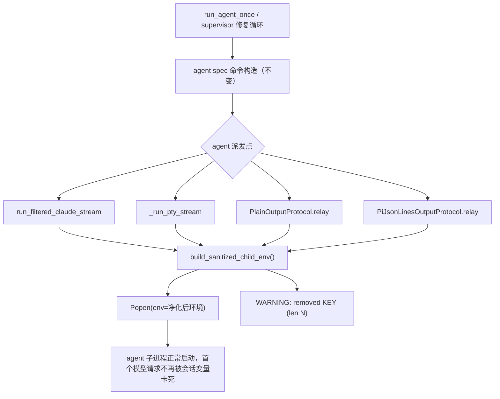

# PRD: Agent Runner 子进程环境净化（child env sanitize）

> ✅ **交付前置**：无，可立即开工。
> 结构化声明见 §8 Delivery Dependencies，**那里是唯一事实源**。
>
> ⬜ **验收状态**：未开工。
> 本行是 §9 Acceptance Checklist 的投影，**那里是唯一事实源**。
>
> 本 PRD 分为 **Part A · 人审层**与 **Part B · 执行器层**。

## Feature Overview (功能一览)

> 本块是 §10 Functional Requirements 的投影；行为验收以 §1 行为样例表为准。

- **Agent 子进程获得净化环境**（FR-1、FR-2）：runner 派发的 headless agent 子进程不再继承会话注入的私有变量（含已证实致毒的 `SERVER__PORT`），杜绝 2026-09-28 Issue #156 式的「零输出卡死 20 分钟后被 watchdog 杀掉」事故。
- **非名单变量原样透传**（FR-3）：PATH、HOME、代理、API key 等业务所需变量不受影响，agent 的鉴权与 MCP 依赖照常工作。
- **净化行为可观测**（FR-4）：每剔除一个变量记一条 WARNING 日志（只含变量名与值长度摘要），误剔可立即从日志发现。
- **净化范围限定 agent 派发点**（FR-5）：覆盖 process_runner 的两个 agent 流式 spawn 与 engines 层两个 relay 协议；git/gh/测试等工具命令路径不在范围。
- **防回退守卫**（FR-6）：守卫测试保证未来新增的 agent 派发点必须接入净化 env。
- **文档同步**（FR-7）：`docs/guides/agent-runner.md` 说明净化行为与已知致毒场景。

# Part A · 人审层 (Review Layer)

## 1. Introduction & Goals

### Problem Statement

runner（`iar run` / `iar review`）派发 headless agent 子进程时，子进程**原样继承 runner 进程的完整环境**。当 runner 本身是从某个交互式 AI 会话（如 CodeBuddy / Claude Code 的 Bash 工具）启动时——这是用户手动触发任务的常见路径——父环境携带该会话的私有注入变量，污染子进程。

一次已发生的事故（2026-09-28，Issue #156）：交互式 CodeBuddy 会话向 shell 注入 `SERVER__PORT=56469`（会话 daemon 正监听该端口）；headless 子进程继承后尝试监听同一端口，日志出现 `listen EADDRINUSE: address already in use 127.0.0.1:56469`，随后在第一个模型请求前**永久卡死、stdout 零输出**，20 分钟后被 inactivity watchdog 杀掉。连续 3 次重试全部同因失败，浪费约 70 分钟并产生误导性的 `transient` attempt 记录；根因已用环境变量二分法**单变量复现确认**：仅 `SERVER__PORT=56469` 一个变量即可复现零输出，去掉即恢复正常。

### Interpretation (解读回显)

以下行为样例会逐项成为 §7.6 验收 oracle；改表格单元格即修改对应验收标准。

| 验证方式 | 输入 / 操作 | 期望观察到的结果 |
|---|---|---|
| 🤖 自动验证 | 父环境含 `SERVER__PORT=56469`，经 runner 的 agent 派发路径启动子进程 | 子进程实际环境**不含** `SERVER__PORT`；`PATH`、`HOME`、`https_proxy` 等**原样存在** |
| 👀 人审 + 自动验证 | 从交互式 AI 会话 shell 直接 `iar run`，父环境带 `SERVER__PORT=56469`，用真实 agent 跑一个 Issue 周期 | agent 正常流式输出并完成周期；不再出现「20 分钟零输出后被 watchdog 杀掉」 |
| 🤖 自动验证 | 父环境含 `CODEBUDDY_SESSION_ID` 等会话噪声变量 | 子进程环境不含这些变量，且 runner 日志出现对应 WARNING（只含变量名与值长度，不含完整值） |
| 🤖 自动验证 | 父环境完全干净（无任何名单变量） | 子进程环境与改动前一致（纯透传），行为无回归 |
| 🤖 自动验证 | 未来有人在 agent 派发路径新增一个未接净化 env 的裸 `Popen` | 守卫测试失败，明确指出违规派发点 |
| 🤖 自动验证 | `iar run` / `iar review` 的工具命令类子进程（git、gh、pytest 等） | 环境继承行为**不变**（不在净化范围） |

**我默默定了这些**：

- 8 变量名单（1 致毒 + 7 会话噪声）与「硬编码、无配置面」已在 PRD 讨论中获用户确认，本表只是落档。
- `SERVER__PORT` 按**变量名**剔除，不区分值；不是按端口值过滤。
- 会话噪声变量（`CODEBUDDY_SERVICE_PROXY_URL`、`CODEBUDDY_SESSION_ID`、`CODEBUDDY_CONVERSATION_REQUEST_ID`、`CODEBUDDY_ROOT_REQUEST_ID`、`CODEBUDDY_CONVERSATION_MESSAGE_ID`、`CODEBUDDY_PROJECT_DIR`、`CODEBUDDY_CURRENT_MODEL_ID`）单独存在无害（已实测），剔除属于防御性收敛。
- 工具命令类子进程（`SubprocessRunner` 路径）不净化：这些命令不会绑定 `SERVER__PORT`，净化它们是纯扩面。
- 容器执行路径（agent 容器内 env 注入）机制不同，不在本文处理。

**我理解为不做**：

- 不做 allowlist 白名单模式——继承语义太广，容易误伤鉴权/代理变量。
- 不做 `config.toml` / `.iar.toml` 配置覆盖能力——只有一个真实案例，为假设需求加配置面是过度设计。
- 不修 codebuddy CLI 上游对 `EADDRINUSE` 的处理——那是 CLI 厂商侧的健壮性问题，本文只做平台侧防御。
- 不给 console 守护子进程（iar 自身 daemon 管理）做净化——它依赖父环境语义不同，且其下游 agent 子进程已在覆盖范围内。

**文字版解读**：本需求读作「runner 在派发 agent 子进程时，从继承环境中剔除一份固定的、有实证依据的会话私有变量名单，并记录每次剔除；其余变量原样透传，全部 agent 派发点统一接入，并用守卫测试防止未来新增派发点绕过」。它不是环境白名单重构，也不是对 CLI 上游缺陷的修复。

### What The User Gets

从自己的 AI 会话里随手启动 `iar run` 不再需要记得先 `env -u SERVER__PORT`。runner 派发的 agent 在被会话环境污染的 shell 里也能正常完成任务；一旦真的有名单内变量被剔除，日志会明确告诉你剔了什么。此前需要手工重排队死 claim Issue 的操作也不再因这个根因而发生。

### Measurable Objectives

- 在父环境注入 `SERVER__PORT=56469` 的条件下，agent 派发路径产生的子进程环境中该变量不存在（可通过子进程自身打印 env 断言，pass/fail 明确）。
- 同条件下完整 `iar run` Issue 周期能正常完成，attempt history 不再出现零输出 inactivity kill（对 2026-09-28 事故场景的反向验证）。
- 守卫测试对「agent 派发点未接净化 env」的构造性违规能稳定报错（failure oracle）。

## 2. Human Review Map (介入与风险地图)

### 决策一：净化名单与「硬编码、无配置面」的边界

建议名单固定为 8 个变量：致毒的 `SERVER__PORT`，加 7 个指向父会话私有状态的注入变量（`CODEBUDDY_SERVICE_PROXY_URL`、`CODEBUDDY_SESSION_ID`、`CODEBUDDY_CONVERSATION_REQUEST_ID`、`CODEBUDDY_ROOT_REQUEST_ID`、`CODEBUDDY_CONVERSATION_MESSAGE_ID`、`CODEBUDDY_PROJECT_DIR`、`CODEBUDDY_CURRENT_MODEL_ID`），以模块常量硬编码，不提供配置覆盖。名单里的 7 个噪声变量今天无害（已实测），但它们都指向父会话的私有状态，headless 子进程没有任何合法理由继承；`SERVER__PORT` 的教训正是这类「看起来无关的注入变量」在 CLI 行为变化后变成致毒点。风险是剔错变量破坏 agent 鉴权或代理——因此每个剔除都有 WARNING 日志，且透传路径（PATH/代理/API key）有显式断言保护。

**请确认：** 接受这份 8 变量固定名单 + 硬编码（首版不做 config 覆盖）的方案吗？

**验收：** 注入全部 8 个变量后，agent 子进程环境中一个都不存在；同时 PATH、代理、API key 原样透传；每次剔除在 runner 日志留下 WARNING 记录。

### 决策二：净化范围的边界——只覆盖 agent 子进程派发点

建议只对 agent 子进程派发点（process_runner 的两个 agent 流式 spawn、engines 层两个 relay 协议）接入净化；git/gh/pytest 等工具命令路径和 console 守护子进程（iar 自身 daemon 管理）保持原样。风险是范围划错：扩到工具命令会改变大量既有命令的环境语义、验证面暴涨；漏掉某个 agent 派发点则净化对那类 agent 无效——后者由守卫测试兜底。

**请确认：** 接受「agent 派发点净化、工具命令与 console 守护子进程不动」的范围划分吗？

**验收：** 四个 agent 派发点全部接入（守卫测试逐一核对）；工具命令路径环境继承行为与改动前一致。

### 自动门禁，不需要逐项人工审阅

净化 helper 的单测与真实 spawn 路径集成测试、守卫测试的负控、文档同步由执行器与 verifier 验证。本次不涉及数据库结构变更。

## 3. Usage And Impact After Implementation

**操作者（从 AI 会话或普通 shell 启动 runner 的人）**：`iar run` / `iar review` 的启动方式不变、无新参数；从被会话变量污染的 shell 启动时不再卡死。若日志出现 child env sanitized WARNING，表示名单内变量被剔除，属预期行为。

**被派发的 agent 子进程**：环境更干净——不再携带父会话私有变量；其余变量（含鉴权、代理）与现在完全一致，agent 内的工具、MCP、鉴权流程无感。

**Issue 操作者 / 维护者**：Issue 评论中的 attempt history 不再出现「零输出 20 分钟被杀」的 `transient` 记录；死 claim 手工重排队的频率下降。除此之外 review / merge / archive 流程无任何变化。

## 4. Requirement Shape

- **Actor**：runner（agent runner 执行循环）、被派发的 agent 子进程、启动 runner 的操作者。
- **Trigger**：runner 派发任何 agent 子进程（run / rework / supervisor 修复循环均走同一派发点）。
- **Expected behavior**：子进程环境 = 父环境剔除固定名单变量后的结果；每次剔除有 WARNING 日志；全部 agent 派发点行为一致；非名单变量逐字节透传。
- **Scope boundary**：只改子进程环境组装；不改 agent 命令构造、不改 watchdog、不改工具命令路径、不改容器执行路径、不新增配置项。

# Part B · 执行器层 (Build Layer)

## 5. Repository Context And Architecture Fit

### Existing Path

- `src/backend/infrastructure/process_runner.py`（928 行，接近 1000 行 CI 硬上限）：`run_filtered_claude_stream` 与 `_run_pty_stream` 是两个 agent 流式 spawn 点，内部 `subprocess.Popen(...)` 均未传 `env=`；同文件的 `SubprocessRunner.run` / `_run_captured_process` 服务于工具命令（git/gh/pytest），**不在净化范围**。
- `src/backend/engines/agent_runner/output_protocols/plain.py`（`PlainOutputProtocol.relay`）与 `pi_json_lines.py`（`PiJsonLinesOutputProtocol.relay`）各有裸 `Popen`，同样是 agent 派发点，也未传 `env=`。
- agent Spec 与命令构造在 `src/backend/core/shared/models/agent_spec.py`，与本文无关（不改命令，只改 env）。
- inactivity watchdog（`_ProcessWatchdog`）是事故中杀进程的机制，本 PRD 不改它。
- 事故排查证据：Issue #156 attempt history（3 次 `transient`、1201s）、子进程日志 `~/.codebuddy/logs/2026-09-28/issue-156_*.log` 中的 EADDRINUSE 记录、env 二分法单变量复现记录（保留在操作者会话记录中）。

### Reuse Candidates

- 新增 `src/backend/infrastructure/child_env.py` 承载 `build_sanitized_child_env()`（独立模块原因：`process_runner.py` 已 928 行，见 §6）。四层依赖方向合法：engines → infrastructure。
- 复用 `tests/test_process_runner.py` 的既有测试基建做 spawn 路径测试。
- rv-2 的真实入口 harness 复用 repair-agent routing PRD（已归档）验证过的「假 agent + 进程隔离 `RV_WORK_ROOT`」模式。

### Architecture Constraints

- 四层依赖方向：`engines/agent_runner` 只能导入 `infrastructure` 的净化 helper，不得反向；core 不感知 env 细节。
- 单文件非空行 ≤1000：`process_runner.py` 只减不增净行数（spawn 点改动是参数追加，净增接近零）。
- 不新增配置 schema 字段（决策一）。

### Frontend Impact

**No frontend impact**：本 PRD 只改 runner 后端的子进程环境组装，前端（`frontend-admin`/`frontend-public`）无任何路由、组件、API 契约变化。

### Existing PRD Relationship

- **无重复**：已检索 `tasks/pending/` 全部 5 个 PRD，无一涉及子进程环境组装。
- **软相关**：`P1-FEAT-20260928-183700-issue-live-output-cli-console.md`（agent 运行输出的实时可见性）与本文都触及「runner 子进程输出/环境」观测面，但机制不同（它做输出流转发，本文做 env 组装），不合并、不互相阻塞。
- **软相关**：`P1-BUG-20260924-100212-agent-led-post-pr-ci-decision.md`（正在实施中，Issue #156）修改 `pr_supervisor.py`/`review_once.py`，与本文触碰的文件不相交；若两者并行实施，注意 worktree rebase 顺序即可。
- `P1-FEAT-20260922-000431-blocked-draft-pr-validation-failure.md` 处理 pre-PR verifier 生命周期，无交集。

### Potential Redundancy Risks

- 不要在 engines 层再写一份本地 env 过滤逻辑——统一从 `child_env.py` 导入。
- 不要把净化 helper 塞进 `process_runner.py` 导致突破 1000 行上限。
- 不要顺手给 `SubprocessRunner`/`_run_captured_process` 也加净化——范围失控（决策二）。

## 6. Recommendation

### Recommended Approach

1. 新增 `src/backend/infrastructure/child_env.py`：
   - 模块常量 `AGENT_CHILD_ENV_DENYLIST: frozenset[str]`，内容为 §2 决策一的 8 个变量名；
   - `build_sanitized_child_env() -> dict[str, str]`：拷贝 `os.environ`，剔除名单变量，每剔除一个用 WARNING 记录 `child env sanitized: removed KEY (value length N)`（不含完整值）；
   - Google Style Docstring + 中文内部注释（遵守 `docs/ai-standards/comments-docstrings.md`）。
2. 四个 agent 派发点接入：`run_filtered_claude_stream`、`_run_pty_stream` 的 `Popen(...)` 增加 `env=build_sanitized_child_env()`；`PlainOutputProtocol.relay`、`PiJsonLinesOutputProtocol.relay` 同样处理（从 `infrastructure.child_env` 导入）。
3. 新增守卫测试 `tests/guards/test_agent_spawn_env_guard.py`：静态扫描 `src/backend/infrastructure/process_runner.py` 与 `src/backend/engines/agent_runner/` 中面向 agent 的 `Popen` 调用，断言传入了净化 env；对构造性违规（fixture 中加一个裸 Popen）能报错。文件头标注「守卫测试（guard test）」。
4. 更新 `tests/test_process_runner.py`：新增净化单测 + 经 `run_filtered_claude_stream` 真实 spawn 路径的集成断言（子命令用 `/usr/bin/env` 打印自身环境）。
5. 更新 `docs/guides/agent-runner.md`：新增「子进程环境净化」小节，说明名单、日志形态、以及「从 AI 会话启动 runner 现在是安全的」。

### Proposed Solution Summary (实现机制)

核心机制是一个纯函数 `build_sanitized_child_env()`（infrastructure 层）：输入为当前进程环境（隐式 `os.environ`，无需调用方提供数据），输出为剔除 8 变量后的新 dict；它插入到现有 agent 子进程派发点——`run_filtered_claude_stream` / `_run_pty_stream` / 两个 relay 协议的 `Popen(env=...)` 参数位——不改变命令构造、进程生命周期与 watchdog 行为。系统状态无变化，用户可见变化仅为：被污染 shell 下 agent 能正常完成 + 日志出现剔除记录。有意避免的复杂度：无新存储、无并行抽象、无配置 schema、无状态机改动。

### Alternatives Considered

- **allowlist 白名单环境**：拒绝。继承语义广（PATH、代理、各类 API key、locale），白名单的漏配是静默故障，比 denylist 的显式日志剔除危险得多。
- **config.toml 覆盖名单**：拒绝。当前只有一个真实案例；等出现第二个真实需求再加配置面（届时改动面小）。
- **在 CLI wrapper 脚本层 `unset`**：拒绝。治标且只覆盖单机单会话，runner 侧统一净化才是所有入口共享的防御。

## 7. Implementation Guide

> This section is a living implementation guide based on current repository analysis. If implementation discovers additional affected files, hidden dependencies, edge cases, or a better path, update this PRD before proceeding.

### Core Logic

控制流：`run_agent_once` / supervisor 修复循环 → agent spec 命令构造（不变）→ 派发点（`run_filtered_claude_stream` / `_run_pty_stream` / `relay()`）→ **此处插入净化**：`env=build_sanitized_child_env()` → `Popen` 继承净化后的环境。数据流：`os.environ`（runner 进程）→ denylist 剔除 + WARNING 日志 → 子进程环境（只能通过子进程自身输出或 `/proc` 等外部观测验证）。

### Change Impact Tree

```text
.
├── src/backend/infrastructure/child_env.py
│   [新增]【总结】denylist 常量 + build_sanitized_child_env() + WARNING 日志
├── src/backend/infrastructure/process_runner.py
│   [修改]【总结】run_filtered_claude_stream 与 _run_pty_stream 的 Popen 传 env=
│   └── 净增行数接近零，先跑 check_max_file_lines 确认余量
├── src/backend/engines/agent_runner/output_protocols/plain.py
│   [修改]【总结】PlainOutputProtocol.relay 的 Popen 传 env=（从 infrastructure 导入）
├── src/backend/engines/agent_runner/output_protocols/pi_json_lines.py
│   [修改]【总结】PiJsonLinesOutputProtocol.relay 的 Popen 传 env=（同上）
├── tests/test_process_runner.py
│   [修改]【总结】净化单测 + 经真实 spawn 路径的子进程 env 断言（rv-1）
├── tests/guards/test_agent_spawn_env_guard.py
│   [新增]【总结】守卫：agent 派发点必须传净化 env；对构造性违规报错（rv-3）
├── docs/guides/agent-runner.md
│   [修改]【总结】新增「子进程环境净化」小节（rv-4）
└── mkdocs.yml
    [可能修改]【总结】仅当新文档独立成页时需要；小节内更新则不动
```

以上是起点而非穷举：若实施发现其他 agent 派发点（如 `claude_stream_json.py` 协议自带 spawn），按守卫测试指引一并接入并更新本树。

### Risk Classification Register

| Change point | Tier | Decisive dimension / override | Intervention | Oracle / gate |
|---|---|---|---|---|
| 净化 helper 与 8 变量名单 | R2 | 跨所有 agent 派发的兼容性；剔错变量破坏 agent 鉴权/代理（blast radius = 全部 agent 运行） | Human confirmation | rv-1 |
| 四个 agent 派发点接入 `env=` | R2 | 所有 agent 子进程的启动路径；漏接 = 净化对该 agent 无效 | Executor + automated gate | rv-1、rv-2 |
| 守卫测试（防回退） | R0 | 机械静态检查 | Executor + automated gate | rv-3 |
| 文档同步 | R0 | 机械契约同步 | Executor + automated gate | rv-4 |

### Executor Drift Guard

先用 `rg -n "subprocess.Popen" src/backend/infrastructure/process_runner.py src/backend/engines/agent_runner/` 重定位全部派发点（行号会漂移，以符号为准：`run_filtered_claude_stream`、`_run_pty_stream`、`PlainOutputProtocol.relay`、`PiJsonLinesOutputProtocol.relay`）。允许的行为差异是「agent 派发点传入净化 env + 新增 child_env 模块 + 守卫 + 文档」；不得改动 `SubprocessRunner` / `_run_captured_process` 的 env 行为，不得删除或弱化 watchdog，不得新增配置 schema 字段。完成后跑 `rg -n "SERVER__PORT" src/backend tests` 确认名单常量是唯一出现点。

### Flow / Architecture Diagram



### Realistic Validation Plan

```yaml
- id: rv-1
  behavior: agent 派发路径产生的子进程环境剔除名单变量且非名单变量原样透传
  reviewer: verifier
  real_entry: "uv run pytest tests/test_process_runner.py -q 中新增的 spawn 路径用例：经公开派发函数 run_filtered_claude_stream 启动真实子进程 /usr/bin/env，读取其打印的实际环境"
  expected: "父环境注入全部 8 个名单变量时，子进程 env 不含任何一个；PATH、HOME、https_proxy、一个代表性 API key 原样存在；每次剔除在测试捕获的日志中留下 WARNING（变量名+长度，无完整值）"
  mock_boundary: "子进程命令用真实 /usr/bin/env，不得 mock Popen 或 spawn 函数本身；不得只单测 build_sanitized_child_env 纯函数"
  tier: R2
  test_layer: integration
  required_for_acceptance: true
  critical_value_source: "真实子进程进程打印的自身环境（/usr/bin/env 输出），非测试构造的 dict"
  must_cross: "公开派发函数 -> build_sanitized_child_env -> 真实 Popen -> 子进程实际环境"
  forbidden_bypasses: "不得在测试里手工组装 env 直接调 Popen 代替派发函数；不得把名单断言写成只查 SERVER__PORT 一个变量"
  fresh_state_probe: "每个用例重新构造污染/干净父环境并启动新子进程，从其 fresh 输出读取断言，不缓存"
  final_tree_evidence: "pytest 输出与最终 git tree SHA 一同记录到证据文件；任何名单或派发点改动后重跑"
  negative_control: "在测试边界用未净化 env 调同一 spawn 逻辑（模拟改动前行为）"
  expected_fail: "子进程 env 含 SERVER__PORT，rv-1 断言失败"
- id: rv-2
  behavior: 真实 iar run 入口在父环境带 SERVER__PORT 时完成完整 Issue 周期，agent 不再零输出卡死
  reviewer: human
  real_entry: "在进程隔离 harness（RV_WORK_ROOT + 假 agent 脚本，复用已归档 repair-agent routing PRD 的模式）中以 env SERVER__PORT=56469 运行 uv run iar run --repo-id <harness 仓库>"
  expected: "假 agent 子进程的输出包含 sanitize 探针行：SERVER__PORT=<unset>；Issue 完成一个完整周期（claim -> agent 完成 -> workflow label 正常推进），attempt history 无 inactivity kill"
  mock_boundary: "agent 用假脚本（打印环境探针），GitHub 用 harness 内的隔离仓库；iar CLI、spawn 路径、净化逻辑必须真实执行"
  tier: R2
  test_layer: e2e
  required_for_acceptance: true
  presentation: "tasks/evidence/P1-BUG-20260928-232844-agent-runner-child-env-sanitize/rv-2-iar-run-poisoned-env.txt（CLI transcript + 假 agent 探针输出 + workflow label 终态）；交付时在完成消息中展示探针行与周期结果"
  critical_value_source: "假 agent 进程打印的自身环境与 Issue label 终态"
  must_cross: "iar run CLI -> run_agent_once -> 真实派发点 -> 净化 env -> 假 agent 进程探针 -> workflow label 迁移"
  forbidden_bypasses: "不得直接调用派发函数代替 CLI；不得预设探针结果；不得跳过 workflow label 断言"
  fresh_state_probe: "使用全新 harness 仓库与新 Issue 读取终态 label 与探针输出"
  final_tree_evidence: "transcript 记录 git tree SHA；净化逻辑或派发点改动后重采"
  negative_control: "harness 中以未净化 env 直接启动同一假 agent"
  expected_fail: "探针行显示 SERVER__PORT=56469，rv-2 断言失败"
- id: rv-3
  behavior: 守卫测试拦截未接净化 env 的 agent 派发点
  reviewer: verifier
  real_entry: "uv run pytest tests/guards/test_agent_spawn_env_guard.py -q"
  expected: "守卫对当前代码全绿；fixture 中构造一个未传 env= 的 agent Popen 后守卫转红并指出违规位置；移除 fixture 后恢复绿色"
  mock_boundary: "静态扫描 + fixture 构造；不需要真实子进程"
  tier: R0
  test_layer: unit
  required_for_acceptance: true
- id: rv-4
  behavior: 操作文档说明净化行为与名单，构建通过
  reviewer: verifier
  real_entry: "rg -n \"SERVER__PORT|child env|环境净化\" docs/guides/agent-runner.md && uv run mkdocs build --strict"
  expected: "agent-runner.md 含「子进程环境净化」小节（名单、WARNING 日志形态、从 AI 会话启动安全性说明）；mkdocs strict 构建通过"
  mock_boundary: "不适用；文本搜索与文档构建"
  tier: R0
  test_layer: integration
  required_for_acceptance: true
```

### Interactive Prototype Change Log

No interactive prototype file changes in this PRD.

### External Validation

No external validation required; repository evidence and the 2026-09-28 incident record were sufficient.

## 8. Delivery Dependencies

- Group: agent-runner-child-env-sanitize
- Depends on tasks/issues:
  - none
- Gate type: none
- Notes: 本文可独立实现。与 `P1-BUG-20260924-100212-agent-led-post-pr-ci-decision` 无文件交集，可并行（注意 worktree rebase）；与 `P1-FEAT-20260928-183700-issue-live-output-cli-console` 机制无关，不互相阻塞。

## 9. Acceptance Checklist

### 9.1 人读呈递区（Human Review Surface）

| 要看的结果 | 呈递物 | 10 秒自检 |
|---|---|---|
| 被污染 shell 下真实 `iar run` 完成完整 Issue 周期，agent 环境已净化 | `open "tasks/evidence/P1-BUG-20260928-232844-agent-runner-child-env-sanitize/rv-2-iar-run-poisoned-env.txt"`（交付时填真实记录） | transcript 里能看到假 agent 探针行 `SERVER__PORT=<unset>`、Issue label 终态推进、attempt history 无 inactivity kill |

注：rv-1、rv-3、rv-4 由 `reviewer: verifier` 自验并经独立 verifier 审查，不进入人读呈递区；人审如需复核，证据文件在同一目录。

### 9.2 Acceptance Evidence Package

1. **R2 行为（人确认 + 最高优先）**：rv-2 真实 CLI 周期证据（transcript + 探针 + label 终态）；rv-1 spawn 路径环境断言（8 变量剔除 + 透传 + WARNING 日志）与负控失败记录。
2. **R0 门禁**：rv-3 守卫测试绿色 + fixture 负控转红记录；rv-4 文档搜索与 mkdocs strict 构建输出。
3. **树绑定**：全部证据注明采集时的 git tree SHA；净化逻辑、名单或派发点任一改动后重采受影响证据。

#### Behavior Acceptance

- [ ] rv-1：经真实 spawn 路径断言 8 变量被剔除、PATH/HOME/代理/API key 透传、WARNING 日志形态正确（负控可失败）
- [ ] rv-2：真实 `iar run` 在 `SERVER__PORT=56469` 污染环境下完成 Issue 周期，探针显示净化生效
- [ ] 工具命令路径（`SubprocessRunner`）env 行为与改动前一致（有显式测试或既有测试覆盖证明）

#### Documentation Acceptance

- [ ] `docs/guides/agent-runner.md` 新增「子进程环境净化」小节：名单、日志形态、从 AI 会话启动安全性
- [ ] `uv run mkdocs build --strict` 通过

#### Validation Acceptance

- [ ] rv-3：守卫测试对现存代码全绿，对构造性裸 `Popen` 转红并指认位置
- [ ] 全部证据绑定最终 git tree SHA；净化逻辑/名单/派发点改动后重采
- [ ] `CI=true just test all` 全绿

#### Delivery Readiness

- [ ] 四个 agent 派发点（`run_filtered_claude_stream`、`_run_pty_stream`、两个 `relay`）全部接入净化 env
- [ ] 无配置 schema 变更、无 `SubprocessRunner`/`_run_captured_process` 行为变化、无 watchdog 改动
- [ ] `process_runner.py` 非空行数不超过 1000（`hooks/shared/check_max_file_lines.py` 通过）
- [~] 独立 verifier review — runner-owned gate: 交付后由 runner 派发独立 verifier 按 §7.6 oracle 复核
- [~] PRD 归档至 `tasks/archive/` — runner-owned gate: 验收清单全勾后由 runner 执行归档

#### Human-Confirmed

- [ ] 决策一确认：8 变量固定名单 + 硬编码、无配置覆盖
- [ ] 决策二确认：净化范围限定 agent 派发点，工具命令与 console 守护子进程不动
- [ ] §9.1 行为呈递物已查看并接受

## 10. Functional Requirements

- **FR-1**：所有 agent 子进程派发点必须以 `build_sanitized_child_env()` 的结果作为子进程环境；名单变量不得出现在 agent 子进程环境中。
- **FR-2**：denylist 为模块常量 `AGENT_CHILD_ENV_DENYLIST`，固定 8 个变量（`SERVER__PORT` + 7 个 `CODEBUDDY_` 会话变量），不提供任何配置覆盖入口。
- **FR-3**：非名单变量必须逐字节透传（含 `PATH`、`HOME`、`http(s)_proxy`、API key 类变量）。
- **FR-4**：每剔除一个变量必须记录一条 WARNING 日志，内容含变量名与值长度摘要，不得记录完整值。
- **FR-5**：净化范围限定为 agent 子进程派发点（`run_filtered_claude_stream`、`_run_pty_stream`、`PlainOutputProtocol.relay`、`PiJsonLinesOutputProtocol.relay`）；工具命令路径与 console 守护子进程环境行为保持不变。
- **FR-6**：必须存在守卫测试，对 agent 派发路径上未接净化 env 的裸 `Popen` 构造性违规报错；修改 `tests/guards/**` 需 `GUARD_UPDATE_ACK=1 git commit`。
- **FR-7**：`docs/guides/agent-runner.md` 必须说明净化名单、日志形态与「从 AI 会话启动 runner 安全」的结论。

## 11. Non-Goals

- 不实现 allowlist 白名单环境模式。
- 不新增任何配置字段（config.toml / .iar.toml 均不动）。
- 不修改 codebuddy CLI 上游对 `EADDRINUSE` 的处理。
- 不净化工具命令路径（`SubprocessRunner` / `_run_captured_process`）与 console 守护子进程（`process_supervisor.py`）。
- 不处理容器执行路径（`agent_runner_container` / `container_ops`）内的 env 注入。
- 不改动 watchdog 超时策略、agent 命令构造或 agent spec。

## 12. Risks And Follow-Ups

- **名单误剔**：若未来 agent 运行时合法需要名单内某变量（如某 agent 依赖 `CODEBUDDY_SERVICE_PROXY_URL` 做 credential bootstrap），会被静默剔除——WARNING 日志是发现手段，届时把该变量移出名单是单行改动。
- **上游 CLI 行为漂移**：codebuddy CLI 更新可能引入新的会话注入变量成为新致毒点；本 PRD 的名单机制（常量 + 守卫 + 文档）为追加变量提供了清晰落点，但不主动防御未知变量。
- **守卫误报**：静态扫描可能对非 agent 用途的 Popen 误报；守卫实现须把扫描范围锚定在 §FR-5 列出的文件/类集合，并允许显式豁免注释。

## 13. Decision Log

| ID | Decision | Chosen | Rejected | Rationale |
|---|---|---|---|---|
| D-01 | 净化策略形态 | denylist（8 变量固定名单）+ WARNING 日志 | allowlist 白名单 | 白名单漏配是静默故障，denylist 显式可观测且透传语义安全。 |
| D-02 | 名单维护方式 | 模块常量硬编码，无配置面 | config.toml 覆盖 | 只有一个真实案例；配置面是为假设需求付的复杂度。 |
| D-03 | 净化范围 | 仅 agent 子进程派发点（4 处） | 扩展到工具命令与 console 守护子进程 | 工具命令不绑定名单变量，扩面只增验证成本；agent 派发点是事故的实际入口。 |
| D-04 | helper 落点 | 独立模块 `infrastructure/child_env.py` | 塞进 `process_runner.py` | 该文件 928 行已贴 1000 行 CI 硬上限；独立模块同时满足 engines 层导入的依赖方向。 |

## Change Log

### 初版创建
- Type: scope
- Before: 无正式 PRD；方案存在于 `tasks/inbox/prd-drafts/20260928-231700-agent-runner-child-env-sanitize.md` 草稿与 ideas.md 2026-09-28 23:17 条目。
- After: 升级为 `tasks/pending/P1-BUG-20260928-232844-agent-runner-child-env-sanitize.md` 正式 PRD，含完整 Part A/B、验收清单与四条 RV oracle。
- Reason: 用户确认三项拍板（8 变量名单硬编码、无配置覆盖、process_supervisor 不纳入）后要求升级为正式 PRD。
- Impact: 草稿保留作溯源；后续实现以本 PRD 为唯一事实源。
- Review: 待人工验收（Interpretation 与 §2 两项决策为首次人审目标）。
