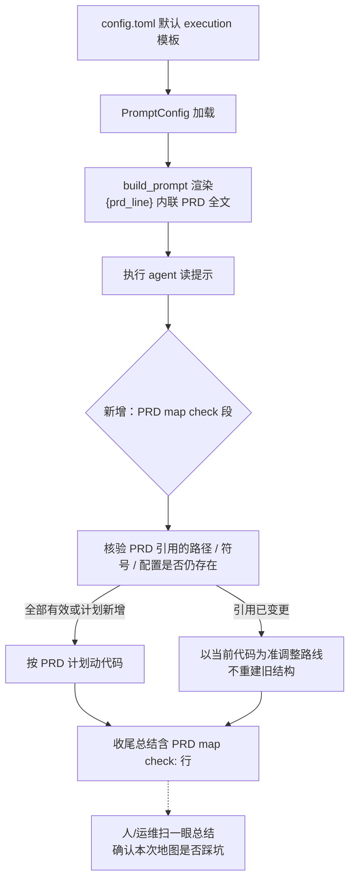

# PRD: 执行开工前的 PRD 引用核验

> ✅ **交付前置**：无，可立即开工。
> 结构化声明见 §8 Delivery Dependencies，**那里是唯一事实源**。

> ⬜ **验收状态**：未开工。
> 本行是 §9 Acceptance Checklist 的投影，**那里是唯一事实源**。

> 本 PRD 分两个 altitude，分别服务不同读者，自上而下阅读：
>
> - **Part A · 人审层 (Review Layer)** — 需求方 / 验收人读这部分，决定"该不该做、做得对不对"，并通过风险地图知道**哪些地方必须亲自确认**。Part A 不出现实现机制、文件路径、命令。
> - **Part B · 执行器层 (Build Layer)** — 实现者（人或 Agent）读这部分动手。人只在 Part A 风险地图**点名处**下钻审查，其余默认交执行器 + 自动门禁（hook / 测试 / 架构检查）。

---

## Feature Overview (功能一览)

> 本块是 §10 Functional Requirements 的白话投影，**§10 是唯一事实源**；行为验收以 §1 行为样例表为准。

- **开工前核验地图**（FR-1）：执行 agent 在动代码之前，先核对 PRD 引用的文件、符号、配置是否仍存在于当前工作树；已变更就以当前代码为准调整路线，不重建已经不存在的旧结构。
- **收尾声明核验结论**（FR-2）：每次执行结束时，总结里固定带一行以 `PRD map check:` 开头的结果——哪些引用过期、怎么适配，没有就写 `none`。人不用翻日志猜它有没有核验过。
- **零新增机制与成本**（FR-3）：不写新代码、不加配置键、不多跑 agent、不加流水线阶段；没关联 PRD 的 Issue 与自定义过提示模板的仓库，行为与现在完全一致。
- **文档对齐**（FR-4）：agent-runner 使用指南记录这条规则与声明格式。
- **不做并行撞车避让**（§11）：原版的"触碰面预测 + 等待让路"整体移除，本 PRD 只解决"地图过期"，不再涉足并行调度。

---

# Part A · 人审层 (Review Layer)

## 1. Introduction & Goals

### Problem Statement

PRD 写下的时刻和它被执行的时刻之间隔着一段时间，这段时间里仓库还在变。这个仓库的等待期不是几小时：当前待执行清单里最老的一份 PRD 写于约十周前，它排队期间点名的关键文件被改动过 9 次、后端目录累计 53 次提交。

而执行 agent 是拿着"写就时刻的地图"开工的：执行提示会把 PRD 全文原样交给它，里面逐条写着该改哪个文件、该加哪个符号。问题在于，当前执行提示的规则清单（8 条）里**没有任何一条**要求它先核对这份地图是否还有效——8 条全部在讲"改什么"和"怎么交作业"。于是当某个引用已经失效时，怎么处理完全靠 agent 临场判断，而且判断过程与结论都不出现在交付物里：总结里不会写"PRD 说的那个文件已经改了名，我换了做法"，运维只能事后翻执行记录去猜。

这个失效不是理论假设：本仓库自己就在用"修订既有决策"来吸收这类漂移——最近一次归档的实施 PRD 就显式修订了更早一份 PRD 的目录选址决策。PRD 假设会随仓库演进过期是常态，但在执行 agent 的工作流里，这件事目前没有任何明确位置。

### Interpretation (解读回显)

| 输入 / 操作 | 期望观察到的结果 |
|---|---|
| 跑一次普通 Issue 的执行，PRD 引用全部仍有效 | agent 开工时完成核验；收尾总结含一行 `PRD map check: none`，其余行为与现状一致 |
| PRD 引用的文件已被此前合并的 PRD 改名 | agent 以当前代码为准调整路线，不去重建旧名字的文件；总结的 `PRD map check:` 行点名该引用与适配方式 |
| PRD 的变更清单里写着"新增文件 X"，X 当前确实还不存在 | agent 按计划把 X 建出来——**不得**把"尚未存在的计划新增"误判为"过期引用"而跳过 |
| 一个没有关联 PRD 的 Issue | 核验无对象；总结的同一行写 `none`，执行流程不受任何影响 |
| agent 忽略了这条核验指令 | 执行照常完成（可能没有那行声明）——规则是增益，不是门禁，不阻塞、不报错、不影响交付判定 |

以上每一行会被逐字转成 §7.6 的验收 oracle：**改一格就等于改验收标准**，所以逐行看一遍是值得的。

**我默默定了这些**（没问你、我自己定的歧义点）

- 核验由**执行 agent 本人**在开工时做，不额外跑一个"核验 agent"、不额外产出一份"勘误附录"。
- 落点选在既有的默认执行提示模板里（加规则文本），不新增模板变量、不新增配置键、不新增独立流水线阶段。
- 可观测性只要求总结里一行固定前缀的文本（`PRD map check:`），不要求写结构化文件、不新增评论或标记。
- 只改**默认模板**；各仓库自己在本地配置里覆盖过提示模板的，行为完全不变（模板是仓库自有资产）。

**我理解为不做**（你可能想要、但我读成不在范围内的）

- 不做"触碰面预测"与"两个 PRD 改同一批文件就让它排队"的并行避让——原版 PRD 的这半边整体移除（理由见 §6 与 §13 D-03）。
- 不做 PRD 文件的自动改写或内容同步：PRD 的验收清单是归档基准，基准不可变，这条沿用原版决策。
- 不把核验做成强制门禁：核验失败或未执行，不阻塞交付、不报错、不回滚。

读成"给执行 agent 一条显式的开工前核验指令 + 一行收尾声明"，**不是**"新的流水线阶段"、**不是**"再一次 agent 调用"、**不是**"并行调度避让"，也**不是**"自动订正 PRD 文件"。冲突时的权威顺序被明确为：**当前代码是事实基础，PRD 的计划按现实调整；但 PRD 明确计划要新建的东西不算冲突，按计划实施。**

### What The User Gets

- 执行 agent 开工前先核对自己手里的地图是否还对得上当前代码，对不上就按当前代码走——不再按旧地图施工，也不再自己花时间摸索"这个文件哪去了"。
- 每次执行收尾有一行明示的核验结论：哪些引用过期、怎么适配的。运维扫一眼总结就知道这次有没有在地图上踩到坑。
- 零新增成本：没有额外的 agent 调用、没有额外的等待、没有新的失败模式、没有新的配置要维护。

### Measurable Objectives

- 从默认模板渲染出的执行提示文本中包含核验规则（三条正反约束：已变更按当前代码、计划新增按计划实施、收尾声明格式），仓库搜索可检出。
- 一次真实执行的收尾总结中出现 `PRD map check:` 行（opt-in 真实验证；无条件环境以模板渲染断言替代，并在证据中记录跳过理由）。
- 未关联 PRD 的 Issue：提示渲染与执行结果除那一行固定声明外与现状一致。
- 改动集内不含任何 Python 生产代码与新增配置键：文件清单只有提示模板、测试、文档三处。

## 2. Human Review Map (介入与风险地图)

### 决策一：PRD 与当前代码冲突时，谁说了算？

建议把执行 agent 的权威顺序明确为：**当前代码是事实基础，PRD 里的计划按现实调整；但 PRD 明确计划"新建"的东西不算冲突，按计划实施**。这句话会成为写进默认执行提示的固定规则，替代现在的"没有规则、各凭判断"。

之所以值得你亲自确认，是因为这条规则有两个反向的失败方式，且都会真实发生：写得太软，agent 会死守已不存在的旧结构，造出与主干冲突的代码；写得太硬（只说"以当前代码为准"），agent 会把 PRD 里"还没建、正等着这次建"的新文件误判成过期引用而跳过——这是本 PRD 最可能出的错，所以规则里专门写了"计划新增按计划实施"这一条正反约束。另外要接受一个边界：这是提示指令，不是代码约束，agent 的遵守率不是 100%；未遵守时行为退回现状（总结里没有那行声明），不产生损害也不阻塞交付。

**请确认：** 冲突判定用"当前代码优先 + 计划新增按计划实施"这个双向规则，并且接受"遵守与否不阻塞交付（失败静默退回现状）"这一边界。

**验收：** 从默认模板渲染出的执行提示同时包含"已变更按当前代码"与"计划新增按计划实施"两条约束（模板渲染断言在案）；一次真实执行的总结中出现 `PRD map check:` 行（有条件时）。

### 自动门禁，不需要逐项人工审阅

规则文本进入默认模板后的回归、提示契约测试、文档搜索断言、全量测试套件，全部由执行器与自动门禁完成，不要求逐项阅读实现细节。本改动不触碰业务编排、数据库结构、鉴权边界或对外接口契约。

### 本次明确不涉及

- 不改数据库结构，不涉及迁移（无 schema 变化，无 ER 图）。
- 不做并行调度避让、不新增任何标签流转与等待状态（原版该半边已整体移除）。
- 不改 PRD 文件本身、不改验收清单、不改归档流程。
- 不改任何前端界面。

---

## 3. Usage And Impact After Implementation

### 仓库运维（repo operator）

1. 无需任何新操作，也无需改配置：照常跑 `iar run` 或 `iar daemon run`。
2. 变化只有两处可见：执行提示里多一段"开工前 PRD 引用核验"规则；每次执行的收尾总结里多一行 `PRD map check:`（无过期引用时为 `PRD map check: none`）。
3. 若某次执行的总结里没有这一行，代表该 agent 忽略了指令——执行本身不受影响，不需要任何处置。

### 仓库本地覆盖过提示模板的维护者

在本地配置里自定义过执行阶段提示模板的仓库，行为与现在**完全一致**：本 PRD 只改默认模板，不读取、不覆盖、不校验各仓库自己的模板。

### Impact On Existing Behavior

- 未关联 PRD 的 Issue：除收尾总结多一行 `PRD map check: none` 之外与现状一致（核验无对象）。
- 无新配置键、无新环境变量、无新命令；回退方式就是把默认模板里新增的规则文本删掉。
- 对执行成功/失败判定零影响：核验不是门禁，任何"没核验""核验不出结论"都不会改变交付判定。

## 4. Requirement Shape

- **actor**：执行流水线里的执行 agent（所有执行入口共用同一默认模板），以及跑这些流水线的仓库运维。
- **trigger**：执行 agent 拿到提示、准备动代码之时。
- **expected behavior**：先核验 PRD 引用的路径/符号/配置是否仍存在；已变更按当前代码调整路线且不重建旧结构；PRD 计划新增的按计划实施；收尾总结带一行 `PRD map check:` 结论。
- **scope boundary**：只动默认提示模板与文档；不新增变量、配置键、流水线阶段、agent 调用、状态流转；不改 PRD 文件；不做并行避让；失败静默退回现状。

---

# Part B · 执行器层 (Build Layer)

## 5. Repository Context And Architecture Fit

**现有相关模块**：

- `config.toml` → `[agent_runner.prompts.phases]` 的 `execution` 模板：默认执行阶段提示，含 `{prd_line}` / `{validation_line}` 变量与 8 条 `Execution rules`。**本 PRD 的唯一行为改动落点**。
- `src/backend/core/use_cases/agent_runner_feedback.py`：`build_prompt` 从 `PromptConfig` 渲染模板；`_build_prd_context_block` 会把 PRD 全文内联进 `{prd_line}`（上限 `_DEFAULT_PRD_INLINE_MAX_CHARS`，超限退化为路径指针）。**零代码改动，仅作为事实依据**。
- `tests/test_agent_runner_prompt_contract.py`：prompt 契约测试（execution/recovery/continuation/closeout 四类断言、validation line、机器契约指针单源），本 PRD 在此加核验规则断言。
- `tests/test_agent_runner_prompt.py`：`build_prompt` 的渲染与占位符行为测试，作为回归基线。
- `docs/guides/agent-runner.md`：Agent Runner 使用指南，含 prompt 模板变量与执行规则说明章节（`rg -n "Prompt Templates|Execution rules" docs/guides/agent-runner.md` 定位）。

**架构约束**：改动为配置模板文本 + 文档 + 测试，不触碰四层依赖方向；不新增模块、不新增端口。

**Frontend impact**：No frontend impact——改动是后端 agent 提示模板与使用指南，`frontend-public` / `frontend-admin` 均不消费该模板（已核实模板变量仅由 `agent_runner_feedback.build_prompt` 解析）。

**相关 PRD（已检查 `tasks/pending/` 与 `tasks/archive/`）**：

- **本 PRD 是既有 pending PRD 的修订**：原版 `P1-FEAT-20260703-105340-prd-regrounding-touch-map-avoidance`（re-grounding 独立阶段 + 触碰面避让）经 2026-09-16 评估后收缩为本精简版，原因与拒绝理由见 §6 Alternatives 与 §13 D-03；文件与 slug 保留以维持既有交叉引用。
- **依赖解除**：原版声明的 hard 依赖 `tasks/archive/P1-FEAT-20260703-105330-roadmap-continuous-scheduling.md`（waiting 重晋升挂点）随避让机制一并移除，本 PRD 现无任何交付依赖。
- **协调（已交付）**：`P1-FEAT-20260705-161739-completeness-judgment-hardening` 已于 2026-09-16 交付归档（PR #142，改 `config.toml` 的 `post_pr_supervisor` 段与 `docs/guides/agent-runner.md`），未触碰 execution 模板，与本 PRD 无残留协调点。
- **机制先例（archive）**：`20260521-140600-...-agent-prompt-template-phase`（prompt 模板 phase 结构）、`P1-FEAT-20260916-023404-iar-prd-skill-alignment`（prompt 契约指针单源化与证据目录约定，本 PRD 的测试落点沿用其模式）。
- **无重复**：pending 其余 PRD（roadmap 控制台、CI/CD 监控、桌面壳、console 快照）与本 PRD 正交。

## 6. Recommendation

### Recommended Approach

在 `config.toml` 的默认 `execution` 提示模板中，于 `Issue body:` 段之后、`Execution rules:` 段之前插入一段固定规则（4 条）：

```toml
  "PRD map check (before coding):",
  "- The PRD predates this run; verify the file paths, symbols, and config keys it references still exist in the current worktree.",
  "- When a referenced path or interface has changed, follow the current code and adapt the plan; do not recreate structures the PRD describes that no longer exist.",
  "- When the PRD plans work that is not built yet (e.g. a file it asks you to create), implement it as specified.",
  "- In your final summary, include one line starting with `PRD map check:` listing stale references and how you adapted; write `PRD map check: none` when nothing is stale (an Issue without a PRD is trivially none).",
```

**为什么贴合现有架构**：执行提示模板是既有的、人可读的行为注入点；`{prd_line}` 已经把 PRD 全文内联给 agent（`agent_runner_feedback.py` 的 `_build_prd_context_block`），核验所需的全部输入早就在上下文里——本 PRD 只是补上"拿到地图后先核对"这一条缺失的指令，不加任何新管道。规则文本天然对所有执行入口生效，无需分别接线。

**拒绝的冗余抽象**：

- 不新增 `{regrounding_line}` 变量（原版设计）：静态文本已覆盖需求，变量只会引入模板兼容性负担。
- 不新增配置键/配置段：没有需要运维决策的参数（开关的意义只在原版的独立 agent 调用上）。
- 不新增流水线阶段、不新增 agent 调用、不新增状态流转：核验的执行者就是即将开工的 agent 本人，时机就是它读提示的时刻。
- 不要求结构化产出（文件/marker）：收益只是措辞整齐，代价是新失败面与解析负担；一行固定前缀文本已足够可观测。

### Proposed Solution Summary (实现机制)

- **核心机制**：默认 `execution` 模板加入上文的 4 条 `PRD map check` 规则；执行 agent 开工前核验，收尾总结带 `PRD map check:` 行。
- **谁供给**：无运行时输入、无配置项；规则文本随默认模板分发，仓库本地覆盖模板即完全接管。
- **插入点**：`config.toml` → `[agent_runner.prompts.phases].execution` 数组中，`"Issue body:"` 块之后、`"Execution rules:"` 之前。
- **主要状态变化**：无系统状态变化；唯一可见变化是渲染出的提示文本与 agent 收尾总结各多一段/一行。
- **刻意避免的复杂度**：无新存储、无新进程、无新 agent 调用、无新变量、无新门禁、无 PRD 文件写入。

### Alternatives Considered

- **原版方案：只读 agent 生成勘误附录（addendum）注入提示 + 触碰面预测与并行避让**（本 PRD 的初版）：拒绝。避让机制两头堵——默认串行（`max_concurrent_issues` 默认 1）时"在途集合"恒空、永不触发；并发开启时同一批 Issue 会在彼此触碰面发布前同时通过判定，在最需要的场景失效（原版已在自身 Risks 中承认该竞态窗口）。且触碰面本可从 PRD 自带的 `### Change Impact Tree` 静态解析（当前 pending 6/6 均含该节），无需 agent 预测。叠加每次执行多一次 agent 调用的成本与"agent 生成内容注入提示"的信任面，成本收益倒挂。
- **结构化记录核验结果**（要求 agent 写核验文件或 marker 评论）：拒绝。可检性提升有限，却引入新的产出契约与解析负担；一行固定前缀文本已足以被人与 `rg` 检出。
- **把核验做成强制门禁**（未核验则阻塞交付）：拒绝。不遵守时的实际后果只是"少一行声明"，把它升级为阻塞会凭空制造新的失败模式，违背"只增益、不添堵"。

## 7. Implementation Guide

> This section is a living implementation guide based on current repository analysis. If implementation discovers additional affected files, hidden dependencies, edge cases, or a better path, update this PRD before proceeding.

### 7.1 Core Logic

控制流：`config.toml` 定义默认 `execution` 模板 → `PromptConfig` 加载 → `build_prompt`（`agent_runner_feedback.py`）渲染（`{prd_line}` 内联 PRD 全文）→ 执行 agent 读提示，按新增规则先核验引用、再动代码 → 收尾总结输出 `PRD map check:` 行。本 PRD 在链条上只改第一环（模板文本），其余环节零改动。

幂等与边界：规则文本是静态常量，重复渲染无副作用；未关联 PRD 时核验无对象（收尾声明写 `PRD map check: none`）；agent 忽略指令时无任何系统后果。

### 7.2 Change Impact Tree

```text
.
├── Config
│   └── config.toml
│       [修改]【总结】[agent_runner.prompts.phases].execution 数组在 "Issue body:" 块后、
│            "Execution rules:" 前插入 "PRD map check (before coding):" 段（4 条规则）
│            （同时在该文件顶部 Template variables 注释附近说明该段为固定规则文本，
│            无对应占位符——如现有注释结构不适合，可仅在段内自带说明，不强制）
├── Tests
│   ├── tests/test_agent_runner_prompt_contract.py
│   │   [修改]【总结】新增：渲染出的 execution prompt 含三条正反约束与声明格式；
│   │        未关联 PRD 的渲染同样含规则文本；负控用例（临时删除模板段后断言必须红）。
│   │        新用例名含 map_check，供 rv-1 的 -k 选择器复现
│   └── tests/test_agent_runner_prompt.py
│       [修改]【总结】如既有占位符/渲染用例对模板文本有全量断言则同步；否则不改
└── Docs
    └── docs/guides/agent-runner.md
        [修改]【总结】Prompt Templates / 执行规则章节记录 PRD map check 规则、
            输出行格式与"非门禁、失败静默"语义
```

以上文件清单是起点而非穷尽集合，见 §7.4 Executor Drift Guard。

### 7.3 Risk Classification Register

| 改动点 | tier | 决定性维度 / override | 介入方式 | oracle / 门禁 |
|---|---|---|---|---|
| 默认执行模板加入核验规则与声明要求 | R1 | 行为变化限定在单一 workflow（执行 agent 的读提示环节）；回退=删掉模板文本，立即且干净 | 执行器 + 失败可判别断言 | rv-1（模板渲染 + 负控）、rv-2（真实运行，opt-in） |
| 文档记录规则与声明格式 | R0 | 纯展示性 | 执行器 + 搜索断言 | rv-3 文档 grep |
| 提示契约与既有渲染行为回归 | R1 | 兼容性（占位符闭集不可变、未关联 PRD 场景不变） | 执行器 + 既有契约测试 + 全量回归 | rv-3 |

无 fixed-zone 命中（非 core 业务编排、无 schema、无鉴权、无对外契约），无跨切面触发器（无金钱/不可逆操作/并发幂等改动）；故无新增人工确认点，§2 的决策一为唯一的 R1 语义确认（双向冲突规则），其 oracle 由 rv-1 承载。

### 7.4 Executor Drift Guard

```bash
# 1. 默认执行模板与其当前规则清单（插入点定位）
rg -n "agent_runner.prompts.phases|PRD map check|Execution rules" config.toml

# 2. 模板渲染入口与占位符闭集（确认不新增变量）
rg -n "def build_prompt|_build_prd_context_block|format_map|PromptConfig" src/backend/core/use_cases/agent_runner_feedback.py

# 3. 既有 prompt 契约测试（新断言落点与回归基线）
rg -n "def test_prompt_contract_execution_prompt|def test_build_prompt" tests/test_agent_runner_prompt_contract.py tests/test_agent_runner_prompt.py

# 4. 文档章节（改动落点）
rg -n "Prompt Templates|Execution rules|prompt 模板" docs/guides/agent-runner.md

# 5. 确认没有第二处执行模板副本需要同步（.iar.toml / repository_local 默认值）
rg -n "Execution rules|execution = \[" src/backend/engines/agent_runner/repository_local.py .iar.toml 2>/dev/null
```

若第 5 条在 `repository_local.py` 或 `.iar.toml` 发现另一份 execution 默认模板，须确认该处是否为渲染实际采用来源，并同步插入同一规则段（本 PRD 假定默认来源为 `config.toml`，以第 2 条的加载路径为准）。

### 7.5 Flow Or Architecture Diagram



### 7.6 Realistic Validation Plan (Oracle 块)

```yaml
oracles:
  - id: rv-1
    behavior: 从真实 config.toml 加载的默认模板渲染出的 execution prompt 含三条正反约束与收尾声明格式；未关联 PRD 的 Issue 渲染同样含该规则段
    reviewer: human
    real_entry: "uv run pytest -o addopts=\"\" tests/test_agent_runner_prompt_contract.py -k map_check"
    expected: "渲染结果含 'PRD map check' 段、'follow the current code' 与 'implement it as specified' 两条相反方向约束、以及 'PRD map check: none' 声明格式；无 PRD 锚点的 Issue 渲染同样命中规则段；既有 execution/recovery/continuation/closeout 契约用例全绿"
    presentation: "渲染出的 execution prompt 全文（含新增段的位置与措辞），验收消息原样附上"
    mock_boundary: "模板来自真实 config.toml，渲染走真实 build_prompt 与真实 PromptConfig；仅 Issue/文件系统用测试 fixture"
    tier: R1
    test_layer: integration
    required_for_acceptance: true
    negative_control: "临时从 config.toml 模板中删除 PRD map check 段后运行同一测试"
    expected_fail: "map_check 断言转红（规则段缺失），既有契约用例不受影响"
  - id: rv-2
    behavior: 真实执行（iar run）的收尾总结含以 PRD map check: 开头的一行结论
    reviewer: human
    real_entry: "uv run iar run --issue <编号>（沙箱仓 + 本地 agent CLI + gh 登录态）"
    expected: "执行完成的总结输出中出现一行 PRD map check:（引用有效时为 none，存在过期引用时列出引用与适配方式）；若无人为制造的过期引用，至少证明该行出现且格式正确"
    presentation: "该次执行的收尾总结终端输出（含 PRD map check 行）"
    mock_boundary: "全真实；opt-in——依赖 gh 登录态、可用 agent CLI 与沙箱仓，无条件环境显式记录跳过理由并以 rv-1 全绿替代"
    tier: R1
    test_layer: e2e
    required_for_acceptance: false
  - id: rv-3
    behavior: 全量回归与文档对齐——既有 prompt 契约/渲染测试全绿；使用指南记录规则与声明格式
    reviewer: verifier
    real_entry: "uv run pytest -o addopts=\"\" tests/ && just test all"
    expected: "全绿；rg -n \"PRD map check\" docs/guides/agent-runner.md 命中；config.toml 模板可被 PromptConfig 正常加载（占位符闭集不变）"
    mock_boundary: "沿用各测试既有 mock 策略；文档为真实文件检查"
    tier: R1
    test_layer: regression
    required_for_acceptance: true
```

**失败排查提示**：rv-1 红先确认测试读取的是仓库根 `config.toml`（而非测试内联 fixture），再看新段插入位置是否破坏了 `{prd_line}` / `{validation_line}` 占位符解析；rv-2 红先确认所用 agent 是否把总结写进 transcript 末尾（runner 日志路径），再确认提示渲染确实含新段；rv-3 红先跑 `just test all` 区分是模板断言还是既有回归。keda 本仓 pytest 默认 `--testmon` 增量，验收一律 `-o addopts=""` 全量。

### 7.7 Low-Fidelity Prototype (Only When Required)

无 UI 变更，无需低保真原型。

### 7.8 Interactive Prototype Change Log (Only When Files Actually Changed)

No interactive prototype file changes in this PRD.

### 7.9 External Validation (Only When Web Research Was Used)

No external validation required; repository evidence was sufficient.

## 8. Delivery Dependencies

### Delivery Dependencies

- Group: none
- Depends on tasks/issues:
  - none
- Gate type: none
- Notes: 本 PRD 为既有 pending PRD 的收缩修订（原版 hard 依赖 `tasks/archive/P1-FEAT-20260703-105330-roadmap-continuous-scheduling.md` 随避让机制移除而解除）。`P1-FEAT-20260705-161739-completeness-judgment-hardening` 已交付归档且未触碰 execution 模板，本 PRD 无任何同文件协调点。

## 9. Acceptance Checklist

本节分两层读者：**9.1 是给人看的**——验收时只看这一层，目标是几分钟内看完；**9.2 起是给 verifier 和未来回溯用的机器证据**，默认不用打开，出问题再下钻。每项必须带证据（命令输出 / 观察 / 工件引用），不是裸勾。

### 9.1 人读呈递区（Human Review Surface）

| # | 你要看什么（对应 oracle） | 呈递物（交付时填实际路径） | 想自己复核？ |
|---|---|---|---|
| 1 | 渲染出的执行提示里新增段的位置与措辞（rv-1）：三条正反约束是否按 §2 决策一的方向写、声明格式是否可一眼认出 | 渲染 prompt 全文（文本文件，落 `tasks/evidence/<prd-stem>/`，验收消息原样附上） | 搜 `PRD map check`，确认"已变更按当前代码"与"计划新增按计划实施"两条都在 |
| 2 | 真实一次执行的收尾总结含 `PRD map check:` 行（rv-2，有条件时） | 终端输出捕获（`.txt`，含 PRD map check 行） | 看该行结论与格式；无过期引用时应为 `none` |

**以下项不需要你看**（`reviewer: verifier`，agent 自验 + verifier 复核，挂了会自己红）：rv-3 全量回归与文档搜索断言。它们的证据在 §9.2。

### 9.2 Acceptance Evidence Package（机器证据 · verifier 入口，人默认跳过）

按 §7.3 分级排序：决策一（human-confirmed，rv-1 支撑）在前，R1 项随后，R0 门禁结果折叠附后。

**Human-Confirmed**

- [ ] 决策一：核验双向规则已进入默认模板（rv-1 渲染断言含"已变更按当前代码"与"计划新增按计划实施"两条相反约束）；"未遵守不阻塞交付"语义已随规则文本与文档固化 —— 人审通过
- [ ] §9.1 呈递区各项已亲眼看过（渲染 prompt 全文；rv-2 有条件时附真实执行输出）

**Architecture Acceptance**

- [ ] 改动集不含 Python 生产代码与四层依赖变化：`git diff --name-only -- src/` 零命中（改动仅限 `config.toml` / `tests/` / `docs/`）
- [ ] 无新增模板变量与配置键：`git diff -U0 -- config.toml | rg '^\+.*\{[a-z_]+\}'` 零命中；`rg -n "regrounding|touch-map" config.toml src/backend/ tests/ docs/` 零命中（原版机制的专有名词不得引入；注意 `defer` 一词已被 supervisor 既有语义占用，不作断言）

**Behavior Acceptance**

- [ ] rv-1：渲染 prompt 含规则段与两条相反方向约束、`PRD map check: none` 声明格式；无 PRD Issue 渲染同样命中规则段（输出在案）
- [ ] 占位符闭集不变：`git diff -U0 -- config.toml | rg '^\+.*\{[a-z_]+\}'` 零命中，既有 `{prd_line}` / `{validation_line}` 渲染行为不变（既有契约用例绿）

**Documentation Acceptance**

- [ ] `docs/guides/agent-runner.md` 记录 PRD map check 规则、`PRD map check:` 行格式与"非门禁、失败静默"语义：`rg -n "PRD map check" docs/guides/agent-runner.md` 命中

**Validation Acceptance**

- [ ] rv-3：`uv run pytest -o addopts="" tests/` 与 `just test all` 全绿（输出在案）
- [ ] rv-2（opt-in）：真实 `iar run` 的收尾总结含 `PRD map check:` 行（终端输出在案）；无条件环境显式记录跳过理由并以 rv-1 全绿替代

**Delivery Readiness**

- [ ] 推荐方案完整落地（模板规则 / 文档 / 测试三处齐备，无 Phase 2 残留）；复用单一模板入口，无并行抽象引入
- [ ] 无未解决回归或发布阻塞项；回退路径明确（删除模板新增段即恢复现状行为）
- [ ] §9.1 呈递区的呈递物路径已全部回填，且完成回复已原样带上呈递表内容（只给 evidence 目录链接不算交付）
- [ ] 三份证据报告（verification-plan / evidence-report / verifier-report）落 `tasks/evidence/P1-FEAT-20260703-105340-prd-regrounding-touch-map-avoidance/` 并随提交入库
- [~] 独立 verifier Agent 按 rv-id 逐项复核并给出 PASS —— runner-owned gate: 交付流程的独立验证环节，由 runner 安排

## 10. Functional Requirements

- **FR-1**：默认 `execution` 提示模板在 `Issue body:` 段之后、`Execution rules:` 段之前加入 `PRD map check (before coding):` 规则段，含三条行为约束——核验 PRD 引用的文件路径、符号、配置键是否仍存在于当前工作树；已变更时以当前代码为准调整路线且不重建已不存在的旧结构；PRD 计划新增但尚未存在的按计划实施。
- **FR-2**：同一规则段要求执行 agent 在收尾总结中包含一行以 `PRD map check:` 开头的结果（列出过期引用与适配方式；无过期引用或无关联 PRD 时写 `PRD map check: none`）。
- **FR-3**：零新增机制——不新增模板变量、配置键、环境变量、流水线阶段、agent 调用与状态流转；未关联 PRD 的 Issue 与仓库本地覆盖模板的场景行为与现状一致（后者完全不受影响）。
- **FR-4**：`docs/guides/agent-runner.md` 记录核验规则、声明行格式与"非门禁、失败静默退回现状"语义。

## 11. Non-Goals

- 不做触碰面预测、不做并行撞车避让、不引入 `agent/waiting` 流转与 defer 计数（原版设计的该半边整体移除，理由见 §13 D-03）。
- 不改写 PRD 文件或其验收清单（PRD 基准不可变，沿用原版决策）。
- 不生成结构化勘误产物（addendum 文件 / marker 评论），不追加额外 agent 调用。
- 不把核验做成强制门禁，不因未核验阻塞、回滚或报错。
- 不新增前端界面；不改数据库结构；不改归档流程。

## 12. Risks And Follow-Ups

- **遵守率不确定**：核验与声明都是提示指令，agent 可能部分或完全不执行。影响面被刻意限制为"总结里少一行"——不阻塞交付、不改变成功判定；rv-2 真实验证仅证明"会发生"，不承诺"必然发生"。若长期观察遵守率低，可另开 PRD 评估是否升级为结构化产出。
- **过度核验的可能**：agent 可能把"计划新增"误判为过期（§2 决策一的正反约束即为缓解），或把大量时间花在逐条核验上。当前缓解是规则文本明确双向语义；残余风险接受，因为最坏后果是执行变慢而非做错。
- **无过期引用的空转**：核验在绝大多数执行中结论为 `none`，规则的价值只在罕见的漂移场景兑现；这是显式接受的成本（每次执行多几条 prompt 文本与一句核对，无额外调用）。

## 13. Decision Log

| ID | 决策问题 | Chosen | Rejected | Rationale |
|---|---|---|---|---|
| D-01 | 核验落点 | 默认 execution 提示模板内固定规则文本 | 新增独立 re-grounding 阶段（只读 agent 产出 addendum 注入） | 核验所需的 PRD 全文已被 `{prd_line}` 内联在上下文里，独立阶段只是把同一件事多绕一次 agent 调用，且引入"agent 生成内容注入提示"的信任面 |
| D-02 | 冲突权威顺序 | 当前代码为事实基础 + 计划新增按计划实施（双向规则） | 单纯"以当前代码为准" / 单纯"以 PRD 为准" | 单向规则各有一种实际误伤：前者误杀计划新增，后者再造过期结构；双向规则同时封住两个失败方向 |
| D-03 | 触碰面避让机制 | 整体移除（本轮不做） | 保留原版：agent 预测触碰面 + marker 评论 + waiting/defer 流转 + max_defers 防活锁 | 默认串行时"在途集合"恒空永不触发；并发下同批 Issue 在彼此触碰面发布前同时通过判定、在最需要的场景失效（原版 Risks 自认）；触碰面可从 PRD 自带 `### Change Impact Tree` 静态解析（pending 6/6 均含），无需 agent 预测；叠加每执行一次多一 agent 调用的成本，收益倒挂 |
| D-04 | 可观测性形式 | 收尾总结一行固定前缀 `PRD map check:` | 结构化核验文件 / marker 评论 / 新标签 | 一行文本已满足"可被人与 rg 检出"的验收需求；结构化产出引入新契约、新失败面与解析负担 |
| D-05 | PRD 文件是否可被自动修订 | 不可（沿用原版 D-01） | 自动改写 PRD 正文使其与现实同步 | 验收清单是归档门禁基准，执行侧自改基准=运动员兼裁判 |
| D-06 | 失败语义 | 静默退回现状：未核验/无声明不阻塞交付 | 未核验即阻塞或报错 | 该机制定位于"只增益、不添堵"；升级为门禁会凭空制造新的失败模式，与收益完全不成比例 |
| D-07 | PRD 载体处置 | 原地改写同一文件、保留文件名与 slug | 删除本文件另开新 PRD | 文件已被三处 pending/archive PRD 交叉引用；同一议题的收缩修订应保留线程而非制造"新工作"的错觉（H1 标题已改为反映实际内容） |

### Final Reconciliation (Archive Only)

- Interpretation: [confirmed / corrected — 归档前填写]
- Public behavior and contracts: [confirmed / corrected — 归档前填写]
- Related PRD status: [confirmed / corrected — 归档前填写]
- Requirements and risks: [confirmed / corrected — 归档前填写]
- Reconciled differences:
  - [none，或归档前列出已反向修正到正文的差异]

---

## Change Log

### 机制收缩：从 re-grounding 独立阶段收缩为提示模板内的核验指令

- Type: scope / mechanism
- Before: 新增 `run_prd_regrounding` use case：只读 agent 产出 addendum 注入提示 + 触碰面物化为 `iar:touch-map` 评论 + 与在途 running Issue 做文件交集避让（running→waiting 流转 + `iar:defer` 计数 + `max_defers` 防活锁 + 调度循环 waiting 重晋升）；8 条 FR，改动横跨 settings / 域模型 / factory / use case / 提示模板 / 测试 / 文档，hard 依赖调度 PRD。
- After: 单一机制——默认 `execution` 提示模板加入 4 条 `PRD map check` 规则（核验/适配/计划新增/收尾声明）；4 条 FR，改动限于默认模板 + 测试 + 文档，零 Python 代码改动、零新增配置键、无交付依赖。
- Reason: 避让机制两头堵（默认串行恒不触发；并发下触碰面发布竞态使其在最需要的场景失效，原版 Risks 自认）；触碰面本可从 PRD 自带 Change Impact Tree 静态解析，无需 agent 预测；每执行多一次 agent 调用的成本收益倒挂，且"agent 生成内容注入执行提示"引入不必要信任面。
- Impact: 交付依赖清零（解除对 `roadmap-continuous-scheduling` 的 hard 依赖）；改动面由跨分层十余处收缩为模板/测试/文档三处；地图过期痛点保留但实现换为提示指令，触碰面避让整体移除。
- Review: 用户 2026-09-16 决策"按建议改写为精简版"；本 Change Log 记录改写本身，待实现后按流程复核。

### 结构升级：对齐当前 prd skill 契约（双横幅 / Feature Overview / 双受众验收 / Machine Contract v1）

- Type: doc / format
- Before: 文档开头无交付前置横幅与验收状态横幅，无 Feature Overview；§9 为单一验收清单；§7.6 oracle 块无 `reviewer` / `presentation` / `tier` 字段；无 Change Log 章节。
- After: 补齐交付前置横幅（✅ 无依赖）与验收状态横幅（⬜ 未开工）；新增 Feature Overview（锚定 FR-1~FR-4 与 §11）；§9 拆为 9.1 人读呈递区 + 9.2 机器证据包，oracle 声明 `reviewer` 并按 tier 深度赋证；新增本 Change Log 章节（`###` + 六字段 bullet）。
- Reason: 同步 `zata_code_template` 的 prd skill 2026-09-16 版（Machine Contract v1 与双受众验收证据拆分），本机安装副本已同步后再改写，避免旧格式被交付门禁拒绝。
- Impact: 文档结构变化，不改行为目标与验收结论；oracle 由 7 条收缩为 3 条（全部 R1），验收清单按新分组重排。
- Review: 改写随本 PRD 定稿；交付时由 runner 门禁与 verifier 复核格式合规。

### 关联 PRD 状态同步：completeness-judgment-hardening 已交付归档

- Type: doc / fact-sync
- Before: §5 与 §8 将 `P1-FEAT-20260705-161739-completeness-judgment-hardening` 描述为 pending 协调对象（共享 `config.toml` / `docs/guides/agent-runner.md` 面，并行实施需协调）。
- After: 该 PRD 已于 2026-09-16 交付归档（PR #142，commit 36c6411），未触碰 execution 模板；§5/§8 更新为"无残留协调点"，本 PRD 同文件协调点清零。
- Reason: 开工前事实核对发现关联状态漂移，按 §7 living implementation guide 规则先同步 PRD 再开工。
- Impact: 仅事实描述更新；方案、插入点、oracle 与验收清单均不变（插入点与 Execution rules 8 条的现状核对仍吻合）。
