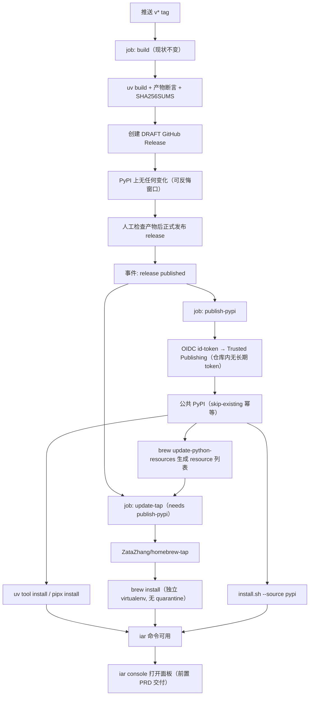

# PRD: 一条包管理器命令装上 iar 并打开面板

- GitHub Issue: （待创建）

> 本 PRD 分两个阅读高度：Part A 供人审（判断要不要做、哪里必须人工确认），Part B 供执行器（怎么做）。人审只需读 Part A，按 Human Review Map 指到的点再下钻 Part B。

# Part A · 人审层 (Review Layer)

## 1. Introduction & Goals

### Problem Statement

目标用户是**已经在用终端的开发者**，他们不缺 `gh`、不缺 agent CLI，只是嫌命令行麻烦、想要一个界面。对这群人，"好装"的标准就是 `gh` / `uv` / `just` 那种体验：一条包管理器命令，装完就能用。

keda 今天离这个标准差得很远，而且 README 承诺了做不到的事：

1. **keda 根本不在 PyPI 上。** `https://pypi.org/pypi/keda/json` 返回 **404**。
2. **README 却已经在教人从 PyPI 装。** 第 14 行有一个 `img.shields.io/pypi/v/keda` 徽章（当前渲染不出版本），正文有「从 PyPI 安装（keda 已发布到 PyPI 后可用）」一节和 `pip install --user keda` / `uv tool install keda` 两条命令——今天照抄都会失败。
3. **`install.sh` 的 PyPI 分支是一条死路。** `--source pypi` / `KEDA_PYPI=1` 的代码路径存在（`tarball_url()` 里 `pypi)` 分支返回 `pypi:keda`），执行必然失败。
4. **发布流水线没有发布这一步。** `.github/workflows/release.yml` 只 `uv build` 后把 sdist/wheel 挂到一个 **draft** GitHub Release，没有任何 PyPI 上传。
5. **安装冒烟测试从没真装过一次。** `.github/workflows/install-smoke.yml` 只跑 `install.sh --check`（dry-run）加一次本地 `uv tool install --editable .`；矩阵是 ubuntu + macos，**没有 Windows**。真实的"从远端装一次"路径无人验证。
6. **没有 Homebrew 入口。** 用户拿不到 `brew install`，而这正是他们装 `gh` / `uv` / `just` 的方式。
7. **README 顶部那条一键安装命令今天必然失败。** 这是最靠前的一道坎，链条是：仓库至今 **0 个 release、0 个 tag**（`gh api repos/ZataZhang/keda/releases --jq length` = 0，`tags` 为空）→ `install.sh` 查 `releases/latest` 得 404 → 走 fallback 把 `VERSION_TAG` 置为 `main` → 但 `tarball_url()` 拼出的是 `archive/refs/tags/main.tar.gz`，而 `main` 是**分支不是 tag**，实测 **404**（同一路径改成 `archive/refs/heads/main.tar.gz` 实测 200）。也就是说 fallback 分支本身是坏的，用户连第一步都过不去。
8. **仓库里到处是已失效的旧 GitHub 用户名，且该用户名现在可被任何人抢注。** 账号已从 `zata-zhangtao` 改名为 `ZataZhang`（`gh api repos/ZataZhang/keda --jq .full_name` = `ZataZhang/keda`），但 `install.sh` 的 `REPO_SLUG` 默认值、README 的徽章与全部链接仍写旧名。今天靠 GitHub 的仓库级重定向还能用（`raw.githubusercontent.com/zata-zhangtao/keda/main/install.sh` 实测 200），但**旧用户名的 profile 已经 404**（`gh api users/zata-zhangtao` → 404，`github.com/zata-zhangtao` → 404），说明它已被释放、任何人都可以注册。一旦有人注册 `zata-zhangtao` 并建一个名为 `keda` 的仓库，README 让用户 `curl … | bash` 的那个 raw URL 就会指向对方的脚本——这是一条活的安装脚本劫持路径。

顺带一个已经核实的名字问题：`iar` 这个 PyPI 名**已被占用**（`iar` 1.2.9，"Irregularly Observed Autoregressive Models"，作者 Felipe Elorrieta），所以包名不能直接用 CLI 名。

### Interpretation (解读回显)

**行为样例**

| 输入 / 操作 | 期望观察到的结果 |
|---|---|
| 任意机器上 `uv tool install kedacode` | 从公共 PyPI 装成功，`iar --version` 打印版本，`iar console` 能打开面板 |
| macOS 上 `brew install ZataZhang/tap/kedacode` | 装成功且不弹任何 Gatekeeper 提示，`iar --version` 与 `iar console` 均可用 |
| Windows PowerShell 里 `uv tool install kedacode` | 同样装成功，`iar --version` 通过（Windows 是一等支持平台，不是"应该也行"） |
| `curl … install.sh \| bash -s -- --source pypi` | 真的从 PyPI 装成功，而不是像今天这样必然失败 |
| 打一个 `v*` tag，但先不发布那个 draft release | **不**向 PyPI 推送任何东西——PyPI 的版本号一旦占用就永远不能重用，误发无法撤回 |
| 把上一步的 draft release 正式发布 | 才触发 PyPI 上传；上传后同一版本号重复上传被 PyPI 拒绝，流水线视为幂等成功而非报错 |
| 有人照着 README 的 PyPI 徽章和安装段操作 | 徽章显示真实版本，命令真的能跑通 |

以上每一行都会被逐字转成 Section 7.6 的验收 oracle —— 改其中一格就等于改验收标准。

**我默默定了这些**

- Homebrew 走**自建 tap**（`ZataZhang/homebrew-tap`），不投 homebrew-core：core 有知名度门槛且每次更新都要给别人提 PR。
- Homebrew formula 用官方推荐的 Python CLI 模式（独立 virtualenv + 逐个 `resource` 声明依赖），resources 由 CI 自动生成并在每次发布后自动更新 formula。
- Windows 侧**不**做 Scoop bucket 或 winget manifest：那两条路都为原生二进制设计，而 `uv tool install` / `pipx install` 在 Windows 上原生可用，PyPI 发布一落地就同时解决了 Windows。
- 发布顺序改为「GitHub Release 正式发布」触发 PyPI 上传，而不是「打 tag」触发——因为 PyPI 版本不可撤回，而 draft release 是可以反悔的。
- 重复上传同版本按幂等成功处理（`skip-existing`），避免重跑流水线时红一片。
- `install-smoke.yml` 从"检查计划"升级为"真的装一次"，矩阵补上 `windows-latest`。
- 不改 CLI 名：命令仍是 `iar`，只有**分发包名**可能与它不同。

**我理解为不做**

- 不做 macOS / Windows 原生安装包（.dmg / .exe）——见下方非目标里的核实结论。
- 不做 Scoop bucket、winget manifest、Linux 发行版打包（apt / rpm / AUR）。
- 不改管理终端的任何页面与功能，也不新增环境体检页。

**判定式解读**

本需求读作：**把"开发者用惯的那条安装路径"真正打通，并让 README 不再承诺做不到的事**。边界上，(a) 首次 PyPI 发布是**不可撤回**的动作——包名与版本号一旦占用就收不回来，所以名字必须先定、发布触发点必须挂在可反悔的 GitHub Release 之后；(b) Homebrew formula 必须把**全部**依赖（含传递依赖）逐个声明为 resource，因为 Homebrew 安装时用 `--no-deps`，漏一个的表现是"装得上、一跑就崩"；(c) `install.sh` 现有的 uv / pipx / pip 三条分支与 `--source tarball` 默认行为必须继续可用，本次只是让 `--source pypi` 从死路变成活路；(d) CLI 名 `iar` 不变。非目标：原生安装包、Scoop / winget、Linux 发行版包、面板功能改动。

### What The User Gets

一条命令装上，和装 `gh` 一样：

Mac 上 `brew install ZataZhang/tap/kedacode`；任何平台上 `uv tool install kedacode` 或 `pipx install kedacode`；不想记包管理器的人继续用 `curl … install.sh | bash`。装完 `iar console` 打开面板。

Windows 从"应该也能跑"变成有 CI 每次验证的一等支持平台。README 里的徽章和安装命令从此说的是真话。

### Measurable Objectives

- `curl -s -o /dev/null -w '%{http_code}' https://pypi.org/pypi/kedacode/json` 返回 200，且版本与仓库 `pyproject.toml` 一致。
- 在一台干净环境里 `uv tool install kedacode` 后，`iar --version` 与 `iar console` 均可用，全程不需要仓库检出。
- `brew install ZataZhang/tap/kedacode` 在干净 brew 环境装成功，`iar --version` 通过，且安装产物无 `com.apple.quarantine` 属性（即零 Gatekeeper 摩擦）。
- `install-smoke` 工作流矩阵包含 `windows-latest`，且执行的是真实安装而非 `--check`；三平台全绿。
- `bash install.sh --source pypi` 真实执行成功。
- 打 tag 但不发布 release 时，PyPI 上不出现新版本；发布 release 后才出现。
- `rg -n "已发布到 PyPI 后可用" README.md` 无输出。

## 2. Human Review Map (介入与风险地图)

### 决策一：分发包名，以及首次发布这个不可撤回的动作

这是本 PRD 唯一真正不可逆的一步。PyPI 的版本号一旦上传就永久占用、不能重用，包名实质上也收不回来。所以名字必须现在定。

三个已核实的事实：`iar` 在 PyPI **已被占用**（是一个统计学包 "Irregularly Observed Autoregressive Models"），所以用不了；`keda` 在 PyPI 是空的，可以注册；但 `keda` 同时是 CNCF 的一个毕业项目（Kubernetes 事件驱动自动扩缩，keda.sh），在 k8s 圈知名度很高。

**已定：包名为 `kedacode`**（2026-09-10 确认）。它避开了与 CNCF KEDA 的直接撞名——`code` 把语义锚到 AI 编码工具那一档，与 k8s 事件驱动自动扩缩彻底分开；同时保留了 `keda` 的品牌延续性。GitHub 仓库继续叫 `keda`，只有分发包名、徽章 URL 与文档措辞变化。

以下候选当时均已核实在 PyPI 可用（2026-09-10 逐个查询 `pypi.org/pypi/<name>/json`，全部 404），保留评估结论以备将来复查：

| 候选 | 评价 |
|---|---|
| `kedacode` | **← 已选定**。`code` 把语义锚到 AI 编码工具（Claude Code / Codex 语境），与 k8s 自动扩缩彻底分开，搜索时不会互相干扰 |
| `keda` | 与仓库名一致、改动最小，但与 CNCF 毕业项目 KEDA（keda.sh）正面撞名，搜索干扰真实存在 |
| `keda-iar` | 与 CLI 名呼应，但 `iar` 对外没有认知度，读者看不出是什么 |
| `issue-agent-runner` | 描述性最强、零撞名，但最长，且与仓库品牌完全脱钩 |
| `iarcli` / `iar-cli` | 唯一能同时消除撞名**和**"包名≠命令名"错位的选项，代价是与 `keda` 这个仓库品牌彻底断开 |
| `kedacli` | **比直接用 `keda` 更糟，不建议**。它读起来就是"KEDA 的命令行工具"；而 CNCF KEDA 在 2020 年的 sandbox 申请里明确写过要提供 CLI，等于我们抢占了对方未来 CLI 最顺理成章的名字，混淆与投诉风险都比 `keda` 高 |

换名的连带成本：徽章、README、`install.sh` 的 `DEFAULT_TOOL_NAME`、文档和 `pyproject.toml` 的 `name` 全部要同步改成 `kedacode`（穷举命令见 7.5 第 3 条）。两个必须守住的拼写约束：`kedacode` 与 `keda-code` 在 PyPI 是两个**不同**的名字，全部文档只能出现前者；而**命令名仍是 `iar`**，不随包名改变（装 `kedacode`、敲 `iar`，这种错位在 Python 生态常见，如 `pillow` → `PIL`），文档必须把两者都写清楚以免用户以为有个 `kedacode` 命令。

另外因为 `kedacode` 在 PyPI 上还不存在，**首次发布必须先在 PyPI 账号侧登记 pending publisher**（见决策二与 7.10）；pending publisher **不预留名字**，真正发布前若被他人抢注则登记失效，所以登记应尽早完成。

**请确认：** 包名 `kedacode` 已确认，此项无待决问题。

**验收：** 该名字在 PyPI 上可被真实安装（`uv tool install kedacode` 从公共索引装成功后 `iar --version` 与 `iar console` 均可用）；同时验证"发布之前同一条命令必须失败"的反向场景，证明这条验收不是自说自话。因为不做 TestPyPI 排练（见决策三），不可逆上传前必须先用**本地构建产物**做一次等价预检：`twine check` 过元数据，并把 `dist/*.whl` 装进干净 venv 跑通 `iar console`。

> **已确认（2026-09-10）**：包名 `kedacode`；仓库名保持 `keda`；命令名保持 `iar`。

### 决策二：发布凭据用 Trusted Publishing，不放长期 API token

要让 CI 能往 PyPI 推包，得给它凭据。传统做法是把一个长期有效的 PyPI API token 存进仓库 Secrets——那意味着仓库里长期躺着一把"可以往公共索引发任意版本"的钥匙，泄露后果是供应链级别的（别人可以冒名发布一个带后门的版本，而用户的 `uv tool install` 会照装）。

我建议用 PyPI 的 Trusted Publishing：在 PyPI 侧把这个仓库的这个 workflow 登记为可信发布者，CI 用 GitHub 签发的短期 OIDC 身份换取一次性凭据，仓库里**不存任何长期密钥**。代价是配置要在 PyPI 网页上做一次，且换发布 workflow 的文件名或 job 名后要回去同步登记信息，否则发布会认证失败。

选它还有一个 token 拿不到的附带收益：`gh-action-pypi-publish` v1.11.0+ 在 Trusted Publishing 下**默认**生成 PEP 740 数字证明（attestations），用 Sigstore 把发行物的名字与摘要绑定到"来自本仓库该 workflow"这一来源。PyPI 只接受来自可信发布者身份的 attestation——用 token 发布拿不到。（现阶段 pip / uv 都不会因缺 attestation 拒装，它是可审计证据而非安装时门禁。）

**请确认：** 包名与凭据两项均已确认，此项无待决问题。

**验收：** 仓库工作流与 Secrets 中不存在任何 PyPI token，发布 job 走 OIDC 完成上传；反向验证改为**故意先不加 `permissions: id-token: write` 跑一次**——GitHub 会拒绝签发 OIDC 令牌、发布必须失败，证明这条链路是真在起作用而不是被某个隐藏 token 顶着（这个 red 在实现过程中天然存在，不需要动生产配置、也不需要 TestPyPI）。

> **已确认（2026-09-10）**：使用 PyPI Trusted Publishing（GitHub OIDC），仓库内不放任何长期 PyPI token。

### 决策三：不做 TestPyPI 排练，改用本地产物预检

原计划是先在 TestPyPI 把整条链路跑一遍再打正式 PyPI。TestPyPI 是完全独立的站点，要另注册账号、另开 2FA、另存恢复码、另登记一份 pending publisher——为一次排练付这些手续，维护者判断不值得。

需要如实记下代价：**跳过排练意味着首次正式上传就是整条 OIDC 链路第一次端到端运行**。这里要区分两种失败——链路本身没通（认证失败、job 报错）是**安全**的，PyPI 上什么都不会出现，修完重跑即可；真正的风险是链路通了但**内容是错的**（元数据坏、README 渲染不了、wheel 里漏了前端产物），因为那个版本号会被永久占用，只能靠发 `0.2.1` 来盖，`0.2.0` 永远留在索引上。

补偿措施是把排练搬到本地：打 tag 之前先过一遍元数据检查，再把构建出来的 wheel 装进一个干净的空环境、把面板真的打开一次——和最终验收里"从公共索引装一遍"用的是同一套检查，只是提前用本地产物跑。它验证不了 OIDC 那一段，但 OIDC 失败属于上面说的"安全失败"那一类。

**请确认：** 已确认不做 TestPyPI，此项无待决问题。

**验收：** 首次发布前留存本地预检证据（`twine check` 输出 + 干净 venv 从 `dist/*.whl` 装后 `iar console` 返回 200）。

> **已确认（2026-09-10）**：不注册 TestPyPI 账号、不做 TestPyPI 排练；以本地产物预检替代，并接受"内容错误会烧掉一个版本号"这一残余风险。

### 自动门禁，不需要逐项人工审阅

其余改动都走执行器 + 自动门禁：Homebrew formula 的依赖完整性由"在干净 brew 环境真实 `brew install` 后跑 `iar --version` 与 `iar console`"把关（这是最容易出错的一环——Homebrew 安装时不解析传递依赖，漏一个的表现是装得上、一跑就崩）；发布触发时机由"打 tag 但不发布 release 时 PyPI 无新版本"把关；`install.sh --source pypi` 由真实执行把关；Windows 支持由 install-smoke 矩阵的真实安装把关；README 徽章与安装段的真实性由搜索断言把关。

### 本次明确不涉及

不涉及数据库结构、认证体系、管理终端页面与功能，也不改 CLI 名 `iar`。不做原生安装包——理由见下：我核实过，macOS 侧不签名不公证是硬阻断（Sequoia 已取消「右键 → 打开」的绕过方式），而 Homebrew 在 5.0 移除了 `--no-quarantine` 并从 2026-09-01 起下架过不了 Gatekeeper 的 cask，也就是说原生 .app 这条路的入场费是每年 $99 的 Apple 开发者账号；而本 PRD 面向的开发者用户，走 CLI 包管理器路径**完全不碰** Gatekeeper（本机 `gh` / `uv` / `just` 的安装产物都没有隔离属性），成本为零。

## 3. Usage And Impact After Implementation

**开发者用户（本 PRD 的目标角色）**
三条等价入口，任选其一：Mac 上 `brew install ZataZhang/tap/kedacode`；任何平台 `uv tool install kedacode` 或 `pipx install kedacode`；或继续用 `curl … install.sh | bash`。装完 `iar console` 打开面板，`iar --help` 看命令。此前这些人只能 clone 仓库或从 GitHub tarball 装，README 里的 PyPI 段落照抄会失败。

**Windows 用户**
从"文档里没提、CI 没测"变成一等平台：`uv tool install kedacode` 原生可用，每次 PR 与发布都有 `windows-latest` 的真实安装冒烟。

**现有从 tarball 安装的用户**
不受影响。`install.sh` 默认仍是 `--source auto`（GitHub tarball），uv / pipx / pip 三条分支行为不变，`--version` / `--method` / `--check` / `--uninstall` 参数语义不变。变化只有一处：`--source pypi` 从必然失败变成真的可用。

**keda 仓库开发者**
本地开发流程不变（`uv tool install --reinstall --editable .` 照旧）。多一个约束：新增或删除运行时依赖后，Homebrew formula 的 resource 列表需要重新生成——这一步由发布 CI 自动完成，但依赖变动较大时要留意 tap 仓库的自动更新 PR。

**发布者**
发布动作从一步变两步，且顺序有意义：打 `v*` tag → CI 构建产物并创建 **draft** release（与今天一致，此时 PyPI 上什么都没发生）→ 人工检查产物 → 正式发布该 release → 触发 PyPI 上传与 tap formula 自动更新。这个顺序是为了给"发错了"留一次反悔机会，因为 PyPI 版本不可撤回。首次发布前需在 PyPI 网页上完成一次 Trusted Publishing 登记。

**向后兼容**
已发布的 GitHub Release 资产、`install.sh` 的既有参数与默认行为、`~/.iar/` 状态目录全部不变。`iar` 命令名不变。若决策一选择了非 `keda` 的包名，则**只有** PyPI/Homebrew 的安装命令措辞变化，命令行使用方式不受影响。

## 4. Requirement Shape

- **Actor**：开发者用户（macOS / Linux / Windows）、Windows 用户、现有 tarball 安装用户、keda 仓库开发者、发布者。
- **Trigger**：用户执行 `brew install` / `uv tool install` / `pipx install` / `install.sh`；或维护者正式发布一个 GitHub Release。
- **Expected behavior**：包从公共 PyPI 与自建 Homebrew tap 可安装，装完 `iar --version` 与 `iar console` 立即可用；发布凭据不落长期密钥；PyPI 上传只在 release 正式发布后发生；三平台安装路径有真实 CI 冒烟。
- **Scope boundary**：只做分发通道与文档真实性。不做原生安装包、不做 Scoop / winget / Linux 发行版包、不改 CLI 名、不改面板。

# Part B · 执行器层 (Build Layer)

## 5. Repository Context And Architecture Fit

**当前相关文件**

| 关注点 | 位置 | 现状 |
|---|---|---|
| 发布流水线 | `.github/workflows/release.yml` | 单 `ubuntu-latest` job：`uv build` → 产物断言（拒绝打包 skills）→ `SHA256SUMS` → `softprops/action-gh-release@v2`（`draft: true`）；**无 PyPI 上传** |
| 安装冒烟 | `.github/workflows/install-smoke.yml` | 矩阵 `[ubuntu-latest, macos-latest] × [3.11, 3.12]`；只跑 `install.sh --check` + 本地 `uv tool install --editable .` + `iar init`；**无 Windows、无真实远端安装** |
| 安装脚本 | `install.sh` | uv / pipx / pip 三分支；`tarball_url()` 的 `pypi)` 分支返回 `pypi:$DEFAULT_TOOL_NAME`；`--source auto` 默认走 GitHub tarball |
| 包元数据 | `pyproject.toml` | `name = "keda"`、`version = "0.2.0"`、`[project.scripts] iar = "backend.api.cli:main"` |
| README | `README.md` | 第 14 行 PyPI 徽章；「从 PyPI 安装（keda 已发布到 PyPI 后可用）」一节 |
| 产物断言范式 | `release.yml` 的 "Verify distributions omit bundled skills" | `python -m zipfile -l dist/*.whl \| grep -qE …`，本 PRD 的产物断言沿用同一风格 |

**要遵循的模式**：本 PRD 只动仓库外围的分发与 CI 配置，不触碰 `src/backend/` 的四层结构，因此不存在层间依赖问题。`install.sh` 的改动限定在 `pypi` 分支的可用性，不重构其三分支选择逻辑。

**前端影响**：`No frontend impact` —— 本 PRD 只改分发通道、CI 与文档，不动 `frontend-public/` 或 `frontend-admin/` 的任何代码。（面板本身的可安装性由前置 PRD 交付。）

**运行时约束**：Homebrew formula 安装时用 `pip --no-deps`，因此必须逐个声明 resource；`brew update-python-resources` 要求包及其全部依赖在 PyPI 上有 sdist——这使 **PyPI 发布是 Homebrew formula 的前置条件**，两件事有先后顺序。

**Existing PRD Relationship**

- `tasks/pending/P1-FEAT-20260910-111901-iar-console-bundled-web-terminal.md`：**hard 依赖**。本 PRD 的价值主张是"装完能打开面板"，而"wheel 内含前端产物"与 `iar console` 命令都由它交付；它未落地前发布到 PyPI 只是发一个没有面板的 CLI。它的依赖瘦身（FR-11）同时直接减少本 PRD 需要声明的 Homebrew resource 数量。
- 本 PRD **取代**了原先的 `P1-FEAT-20260910-114319-iar-desktop-installer-tauri`（Tauri 桌面安装包）。该 PRD 已删除，其核实过的签名/Gatekeeper 事实保留在本 PRD 的 7.10 中，作为"为何选包管理器而非原生安装包"的依据。
- `tasks/pending/` 其余 6 份 PRD 均不触及分发链路，独立。
- `tasks/archive/P2-FEAT-20260707-141659-iar-runner-docker-containerization.md`：容器化解决"隔离执行环境"，与本 PRD 的"本机安装通道"目标不同、不冲突。

**潜在冗余风险**：`install.sh` 已实现安装器选择逻辑，新增分发通道时不要在 Homebrew formula 里重复实现同类判断——formula 只负责建独立 virtualenv 并链接 `iar`，不调用 `install.sh`。

## 6. Recommendation

**Recommended Approach**：先把包发到 PyPI（Trusted Publishing、由 release 正式发布触发），再基于 PyPI 建一个自建 Homebrew tap 的 formula 并让 CI 自动更新它；同时把 `install.sh` 的 PyPI 分支救活、把 install-smoke 升级成真实安装并补上 Windows、把 README 的空头承诺改成真话。

为什么这是最贴合的做法：目标用户是开发者，他们装 `gh` / `uv` / `just` 的方式就是包管理器，而 Python CLI 走 PyPI 是这条路的天然形态——一次发布同时覆盖 macOS、Linux 和 Windows 三个平台，不需要为任何平台单独做打包或签名。仓库里已经有 `install.sh` 的 pypi 分支、README 的 PyPI 段落和徽章，本 PRD 是把这些**已经声明但没兑现**的东西兑现，而不是新造通道。

为什么拒绝更重的替代：不做原生 .dmg / .exe（对必然是开发者的用户付出每年 $99 与双平台签名 CI 的复杂度，换来的体验反而不如 `brew install`，详见 7.10）；不投 homebrew-core（有知名度门槛，且每次版本更新都要向别人的仓库提 PR）；不做 Scoop / winget（两者都为原生二进制设计，而 `uv tool install` 在 Windows 上原生可用，PyPI 发布一步就把 Windows 覆盖掉了）。

### Proposed Solution Summary (实现机制)

核心机制是**"一次发布，三个平台；名字与凭据先定，通道再建"**。

`release.yml` 拆成三个职责清晰的 job：`build`（沿用现有 `uv build` + 产物断言 + `SHA256SUMS` + 创建 draft release，行为不变）、`publish-pypi`、`update-tap`。后两者的**触发点从 tag 改为 `release: types: [published]`**——因为 PyPI 版本号不可撤回，而 draft release 可以反悔，这个顺序给误发留了一次拦截机会。`publish-pypi` 用 `pypa/gh-action-pypi-publish` 配合 `permissions: id-token: write` 走 OIDC Trusted Publishing，仓库内**不存任何长期 token**，并开启 `skip-existing` 让重跑幂等。

**声明方与消费方**：包名由 `pyproject.toml` 的 `name` 单一声明，`install.sh` 的 `DEFAULT_TOOL_NAME` 与 README 徽章 URL 均为消费方，不得各写一份字面量（决策一若改名，改动点以 7.5 的搜索命令穷举）。

Homebrew 侧新建 tap 仓库 `ZataZhang/homebrew-tap`，formula 采用官方推荐的 Python CLI 模式：`include Language::Python::Virtualenv`、`depends_on "python@3.12"`、把 sdist URL 与全部依赖（含传递依赖）逐个写成 `resource`，`def install` 里 `virtualenv_install_with_resources`。resource 列表由 `brew update-python-resources` 生成——这是 PyPI 发布必须先落地的原因。`update-tap` job 在 PyPI 上传成功后重新生成 resources 并向 tap 仓库提交更新。

`install.sh` 只改 `pypi` 分支的可用性：包名从单一来源读取，并在 PyPI 不可达或版本不存在时给出明确错误而不是静默回退到 tarball。

`install-smoke.yml` 的矩阵补 `windows-latest`，并把 `install.sh --check` 之外增加一档**真实安装**：tag 事件下从 PyPI 装、非 tag 事件下从本次构建的 wheel 装，装完跑 `iar --version` 与 `iar console --no-browser` 的启动探活。

有意避开的复杂度：不新增打包格式、不做代码签名、不改 CLI 入口、不重构 `install.sh` 的安装器选择逻辑、不引入 Scoop / winget / 发行版打包。

**Alternatives Considered**

| 方案 | 为何不选 |
|---|---|
| 原生 .dmg / .exe 安装包（原 Tauri 方案） | 目标用户必然是开发者（需 GitHub 仓库、`gh auth login`、agent CLI 订阅、目标仓库工具链），为他们付每年 $99 + 双平台签名 CI 的成本，体验还不如 `brew install`；详见 7.10 |
| 投 homebrew-core | 有知名度门槛，且每次版本更新都要向 Homebrew 仓库提 PR，维护者失去发布节奏控制 |
| Scoop bucket / winget manifest | 两者都为原生二进制设计；`uv tool install` 在 Windows 上原生可用，PyPI 一步覆盖 |
| 仓库 Secrets 放 PyPI API token | 长期有效的供应链级密钥常驻仓库，泄露即可冒名发布带后门版本 |
| tag 直接触发 PyPI 上传 | PyPI 版本不可撤回，误发无法回滚；挂在 release 正式发布后才有拦截窗口 |

## 7. Implementation Guide

This section is a living implementation guide based on current repository analysis. If implementation discovers additional affected files, hidden dependencies, edge cases, or a better path, update this PRD before proceeding.

**顺序是硬的**：人工前置步骤 → 本地产物预检（`twine check` + 干净 venv 装 `dist/*.whl` 跑通 `iar console`）→ 打 tag 产 draft release → 正式发布 release 触发 PyPI 上传 → 生成 Homebrew resources → tap formula。中间任何一步没绿就不要往下走，因为 PyPI 那一步不可逆。

### 7.0 人工前置步骤（执行器无法完成，必须由维护者先做）

以下两件事需要登录第三方账号，agent runner 做不到；**它们没完成之前，发布 job 必然失败**（典型报错 `invalid-publisher: valid token, but no corresponding publisher`）。执行器遇到这两项缺失时应停下并报告，不要尝试改用 API token 绕过。

1. **在 PyPI 账号侧登记 pending publisher**（`kedacode` 尚不存在，所以只能走 pending 路径）—— **已完成（2026-09-10，维护者截图确认）**：
   - 位置：PyPI 账号侧栏的 Publishing（不是项目侧栏——项目还不存在）
   - 已登记值：platform = GitHub Actions、Owner = `ZataZhang`、Repository name = `keda`、Workflow name = `release.yml`（**只写文件名**，不带 `.github/workflows/` 前缀）、Environment name = `pypi`、PyPI Project Name = `kedacode`
   - Owner 必须是**当前**的 GitHub 登录名 `ZataZhang`（账号曾用名 `zata-zhangtao` 已失效）。GitHub OIDC 令牌的 `repository_owner` claim 用的是当前登录名，不是重定向前的旧名——填旧名会直接 `invalid-publisher`
   - **Environment 锁定为 `pypi`**：因此 `publish-pypi` job **必须**声明 `environment: pypi`，两侧逐字一致。注意 GitHub 对 workflow 里引用的不存在 environment 会**自动创建**（且无任何保护规则），所以维护者不需要手动去建这个 environment；也正因为自动创建会静默吞掉拼写错误，这里的最后一道保险是 PyPI 自己会校验 environment claim——名字写错会明确报 `invalid-publisher`，而不是静默放行
   - 在 `pypi` environment 上加 required reviewer 是**可选增强，本次已决定不做**（2026-09-10）：人工闸门已由"必须先手动把 draft release 正式发布"提供，再加一道审批收益有限
   - pending publisher **不预留名字**：正式发布前若 `kedacode` 被他人抢注，登记即失效
   - **TestPyPI 不做**（2026-09-10 决定，见决策三）：不注册 TestPyPI 账号、不登记第二份 pending publisher；排练由本地产物预检替代。执行器不得因为"想先排练"而自行去注册 TestPyPI 或生成 API token
2. **创建 Homebrew tap 仓库与写入凭据** —— 仓库部分**已完成（2026-09-10）**：
   - `ZataZhang/homebrew-tap` 已建，实测 `visibility: public`、`default_branch: main`、`size: 0`（空仓库）
   - 仓库名 `homebrew-tap` 是**强制**的：`brew tap ZataZhang/tap` 的单参数形式会写死解析到 `github.com/ZataZhang/homebrew-tap`，前缀不能省。因此 formula 不能放在 `keda` 仓库内（那会被解析成 `homebrew-keda`）
   - **必须 public**：`brew tap` 走匿名 `git clone`，私有 tap 会要求每个用户自备 git 凭据
   - formula 路径用平铺的 `Formula/kedacode.rb`（第三方 tap 的标准位置；homebrew-core 的按首字母分片布局不适用）
   - **首次推送的特殊处理**：空仓库尚无任何 commit，`main` 分支实际不存在，`update-tap` job 第一次运行必须 `git push -u origin main` 建分支，不能假设 clone 后就有可提交的分支——这是自动化最容易在首次运行挂掉的地方，实现时需覆盖"空仓库首推"与"已有内容更新"两条路径
   - **仍待完成**：生成一个**仅对 `ZataZhang/homebrew-tap` 的 contents 有写权限**的细粒度 PAT，存为 keda 仓库的 secret 供 `update-tap` job 使用。禁止复用任何具备 keda 仓库写权限的 token（本项到 B 的后半段才用得上，不阻塞前半段开工）

改动 `release.yml` 的**文件名**或其 `environment:` 之后，必须回 PyPI 同步更新登记信息，否则发布会突然认证失败。

### 7.1 Core Logic

```
打 v* tag
  └─ job: build（现状不变）
       └─ uv build → 产物断言 → SHA256SUMS → 创建 DRAFT release
             ↳ 此时 PyPI 上什么都没发生（可反悔）

人工检查 draft release 产物 → 正式发布

release: published
  ├─ job: publish-pypi
  │    └─ OIDC(id-token: write) → Trusted Publishing → upload（skip-existing 幂等）
  └─ job: update-tap（依赖 publish-pypi 成功）
       └─ brew update-python-resources → 更新 formula → 提交到 tap 仓库

用户侧三条等价入口
  ├─ brew install ZataZhang/tap/kedacode → 独立 virtualenv + 逐 resource 安装 → 链接 iar
  ├─ uv tool install / pipx install kedacode → 从 PyPI
  └─ install.sh（--source auto 走 tarball；--source pypi 走 PyPI）
        └─ 全部落到同一个 iar 入口 → iar console 打开面板（前置 PRD 交付）
```

### 7.2 Change Impact Tree

```text
.
├── .github/workflows/release.yml
│   [修改]
│   【总结】拆成 build / publish-pypi / update-tap 三个 job，后两者改由 release 正式发布触发
│
│   ├── job: build 保留现有 uv build + skills 产物断言 + SHA256SUMS + draft release（行为不变）
│   ├── 新增 on.release.types: [published]
│   ├── job: publish-pypi —— permissions.id-token: write；environment: pypi（须与 PyPI 登记逐字一致）；pypa/gh-action-pypi-publish@release/v1；skip-existing
│   ├── job: update-tap —— needs: publish-pypi；重新生成 resources 并向 tap 仓库提 PR / 直推
│   └── 【禁止】把 PyPI 上传挂在 tag 事件上（锚点：rg -n "^on:" -A 10 .github/workflows/release.yml）
│
├── .github/workflows/install-smoke.yml
│   [修改]
│   【总结】矩阵补 Windows，并把 dry-run 升级为一次真实安装 + iar console 启动探活
│
│   ├── matrix.os 增加 windows-latest（Windows 上 install.sh 不适用，走 uv tool install 分支）
│   ├── 新增「真实安装」步骤：tag 事件从 PyPI 装，其余从本次构建的 wheel 装
│   └── 装完执行 iar --version 与 iar console --no-browser 的启动探活后终止
│
├── pyproject.toml
│   [修改]
│   【总结】分发包名的单一声明处：name 改为 kedacode
│   └── [project].name = "kedacode"（CLI 名 iar 不动）
│
├── install.sh
│   [修改]
│   【总结】救活 PyPI 分支、修掉坏的 main fallback、去掉对已失效旧用户名的依赖
│
│   ├── REPO_SLUG 默认值 zata-zhangtao/keda → ZataZhang/keda（不再依赖 GitHub 重定向）
│   ├── 修 fallback：VERSION_TAG=main 时必须拼 archive/refs/heads/main.tar.gz，
│   │   不能继续拼 refs/tags/main.tar.gz（实测 404，正确形式实测 200）
│   ├── tarball_url() 的 pypi) 分支：包名不再各写字面量
│   ├── PyPI 不可达或版本不存在时给出明确错误，不静默回退 tarball
│   └── uv / pipx / pip 三分支与 --source auto 默认行为保持不变
│       （锚点：rg -n "DEFAULT_TOOL_NAME|REPO_SLUG|refs/tags|pypi)" install.sh）
│
├── README.md
│   [修改]
│   【总结】把 PyPI 徽章与安装段从空头承诺改成真话，并补 brew 与 CNCF KEDA 免责说明
│
│   ├── 删除「（keda 已发布到 PyPI 后可用）」的条件式措辞
│   ├── 新增 brew install ZataZhang/tap/kedacode 一档 —— 必须写**全限定名**：
│   │   Homebrew 6.0 起第三方 tap 需显式信任，而全限定名安装会顺带只信任该
│   │   formula，是唯一的一条命令解法；若改写成 brew tap + 短名 brew install，
│   │   用户会多出一步 brew trust --formula，不要这样写
│   ├── 顶部加一句与 CNCF KEDA（keda.sh）无关的说明
│   ├── 徽章 URL 指向 pypi/v/kedacode（锚点：rg -n "pypi/v/" README.md）
│   └── 全部 github.com / raw.githubusercontent.com 链接与徽章从旧用户名
│       zata-zhangtao 改为 ZataZhang —— 旧名 profile 已 404、可被他人抢注，
│       一键安装的 raw URL 继续挂在旧名下等于留了一条脚本劫持路径
│
├── docs/getting-started/installation.md
│   [修改]
│   【总结】三条安装入口与各自适用场景，含 Windows 说明
│
├── docs/guides/release-process.md
│   [新增]
│   【总结】发布两步走的顺序与理由、Trusted Publishing 一次性配置、误发不可撤回的注意事项
│
├── mkdocs.yml
│   [修改]
│   【总结】新增发布流程文档页导航
│
├── roadmap.md
│   [修改]
│   【总结】登记分发通道能力，并记录"不做原生安装包"的结论与依据
│
└── （仓库外）ZataZhang/homebrew-tap
    [新增]
    【总结】自建 tap，Formula/kedacode.rb 采用独立 virtualenv + 逐 resource 声明，由 update-tap job 自动更新
```

本仓库之外的 tap 仓库需要一个可写它的凭据（细粒度 PAT 或 GitHub App），该凭据只授予对 tap 仓库的 contents 写权限，不得复用任何具备本仓库写权限的 token。

### 7.3 Risk Classification Register

| 变更点 | 层 | 层级 | 决定性维度 / 覆盖 | 介入 | oracle / 门禁 |
|---|---|---|---|---|---|
| PyPI 包名与首次发布 | 分发 | R3 | 可逆性：版本号永久占用、包名实质不可回收；外部契约一旦公开即不可撤回 | 人工确认 | rv-1（含反向验证） |
| 发布凭据机制（OIDC vs 长期 token） | CI / 安全 | R2 | 覆盖：安全 / 信任边界（fixed zone）——泄露即可冒名发布供应链后门 | 人工确认 | rv-2（含反向验证） |
| Homebrew formula 依赖完整性 | 分发 | R2 | 正确性：Homebrew 用 `--no-deps`，漏一个传递依赖的表现是"装得上、一跑就崩"，用户侧难诊断 | 执行器 + 强 oracle | rv-3（全链路） |
| PyPI 上传触发时机 | CI | R2 | 可逆性：挂错事件会让误发无法拦截，而 PyPI 不可撤回 | 执行器 + 强 oracle | rv-4（全链路） |
| `install.sh --source pypi` 可用性 | 分发 | R1 | 局部，失败立即可见，回滚即恢复 | 执行器 + 真实执行 | rv-5 |
| install-smoke 补 Windows 与真实安装 | CI | R1 | CI 侧，失败在合并前可见 | 执行器 + 三平台全绿 | rv-6 |
| README / 文档 / 徽章真实性 | docs | R0 | 无行为，机械可检 | 执行器 + 搜索断言 | rv-7 |

三个 `R2` 与一个 `R3` 已达本 PRD 的全链路证据上限；若还要加，先回到 Phase 3.4 重新评估拆分。

### 7.4 Flow / Architecture Diagram



### 7.5 Executor Drift Guard

```bash
# 1. 【最重要】确认 PyPI 上传没有挂在 tag 事件上（挂错等于失去误发拦截窗口）
rg -n "^on:" -A 12 .github/workflows/release.yml && rg -n "gh-action-pypi-publish" -B 12 .github/workflows/release.yml

# 2. 确认仓库里没有任何长期 PyPI 凭据
rg -ni "pypi.?token|PYPI_API_TOKEN|twine.*password|__token__" .github/ install.sh docs/
gh secret list   # 人工核对：不应存在 PyPI token

# 3. 改名时穷举所有写了包名的地方（不要只改 pyproject）
rg -n "\bkeda\b" pyproject.toml install.sh README.md README_CN.md docs/ mkdocs.yml .github/ 2>/dev/null

# 3b. 穷举已失效的旧 GitHub 用户名（靠重定向"还能用"不算数，旧名已可被他人抢注）
rg -n "zata-zhangtao" . --glob '!node_modules' --glob '!.git' 2>/dev/null

# 3c. 确认 fallback 不再把分支名拼进 tags 路径
rg -n "refs/tags|refs/heads|VERSION_TAG=\"main\"" install.sh

# 4. 确认包名只有一处声明、其余为消费方
rg -n "DEFAULT_TOOL_NAME" install.sh

# 5. 发布后核对 PyPI 上的真实状态（不要只看 workflow 日志）
curl -s https://pypi.org/pypi/kedacode/json | python3 -c "import json,sys;d=json.load(sys.stdin)['info'];print(d['name'],d['version'])"

# 6. 确认 install-smoke 真的装了一次，而不只是 --check
rg -n "install.sh --check|uv tool install|iar --version" .github/workflows/install-smoke.yml

# 7. 依赖变动后必须重新生成 resources，否则 formula 会漏传递依赖
rg -n "^dependencies" -A 25 pyproject.toml   # 与 tap formula 的 resource 列表逐项对照
```

`brew update-python-resources` 要求包及其全部依赖在 PyPI 上都有 sdist；若某个依赖只发 wheel，该工具会失败，此时改用 `brew-python-resources` 或 `homebrew-pypi-poet` 生成，并在 tap 仓库 README 记录用了哪个工具。

### 7.6 Realistic Validation Plan

```yaml
- id: rv-1
  behavior: 包能从公共 PyPI 真实安装，装完 iar 与面板都可用
  real_entry: "python -m venv /tmp/pm-clean && /tmp/pm-clean/bin/pip install kedacode==<version> && /tmp/pm-clean/bin/iar --version && /tmp/pm-clean/bin/iar console --no-browser --port 8801"
  expected: "pip 从 pypi.org 解析并安装成功；iar --version 打印与 pyproject 一致的版本；iar console 前台常驻且另一终端 curl -s -o /dev/null -w '%{http_code}' http://127.0.0.1:8801/ 返回 200"
  mock_boundary: "必须从公共 PyPI 索引安装；不得 pip install ./dist/*.whl、不得 --find-links 本地目录、不得 -e ."
  tier: R3
  test_layer: smoke
  required_for_acceptance: true
  critical_value_source: "https://pypi.org/pypi/kedacode/json 返回的 name 与 version，以及 pip 安装日志中显示的下载 URL（必须是 files.pythonhosted.org）"
  must_cross: "本地 pip → PyPI 索引解析 → files.pythonhosted.org 下载 → 全新 venv 安装 → console script 入口点 → FastAPI 真实监听 → HTTP 200"
  forbidden_bypasses: "不得用 rv-8 的本地 wheel 预检结果充当正式发布证据（那只证明产物可用，不证明 PyPI 上装得下来）；不得用仓库检出目录安装；不得用开发机已有的 uv 环境验证"
  fresh_state_probe: "venv 每次 rm -rf 重建后重跑，确认不是本地缓存或既有安装在撑着"
  final_tree_evidence: "证据绑定到该 PyPI 版本的 sdist/wheel 校验和；发布新版本即重采"
  negative_control: "在正式发布之前执行同一条命令 —— 必须以找不到包/版本失败"
  expected_fail: "pip 报 No matching distribution found for kedacode==<version>，退出码非 0"

- id: rv-2
  behavior: 发布凭据走短期 OIDC，仓库内不存在长期 PyPI 密钥
  real_entry: "gh secret list; gh api repos/ZataZhang/keda/environments/pypi/secrets --jq '.secrets[].name' 2>&1; rg -ni 'pypi.?token|PYPI_API_TOKEN|twine.*password|__token__' .github/ install.sh; 然后正式发布一个 release 触发真实的 publish-pypi job"
  expected: "gh secret list 无任何 PyPI 相关条目；搜索无匹配（退出码 1）；发布 job 日志显示通过 OIDC 交换到临时凭据并上传成功；workflow 中存在 permissions.id-token: write"
  mock_boundary: "凭据交换与上传必须在正式 PyPI 上真实发生（本次不使用 TestPyPI，见决策三）；不得用 --dry-run 或 mock 的上传步骤充当证据"
  tier: R2
  test_layer: smoke
  required_for_acceptance: true
  critical_value_source: "gh secret list 的真实输出与发布 job 的原始日志 —— 不接受读 workflow 文件自述"
  must_cross: "GitHub OIDC 签发 → PyPI 可信发布者校验 → 临时凭据 → 上传接口"
  forbidden_bypasses: "不得为了跑通而临时添加 API token；不得把 token 放在 environment 级 secret 里绕过 gh secret list 的核对（environment secrets 也要一并核对）"
  fresh_state_probe: "在一个全新的 workflow run 中复现，确认不依赖上一次运行留下的状态"
  final_tree_evidence: "证据绑定到 release.yml 的最终内容；该文件的 job 名或文件名再改就必须回 PyPI 同步可信发布者登记并重采"
  negative_control: "两段，均不动生产配置、不需要 TestPyPI。(a) OIDC 链路是否真在起作用：实现过程中先跑一次**不带** permissions.id-token: write 的 publish job —— GitHub 拒绝签发 OIDC 令牌，发布必须失败（这是实现前天然存在的 red，按顺序优先采用）。(b) 无 token 断言是否真能判负：把 release.yml 复制到临时文件并插入一行 password: ${{ secrets.PYPI_API_TOKEN }}，对该临时文件跑同一条 rg —— 必须命中；仅在临时副本上操作，不提交、不改仓库配置"
  expected_fail: "(a) 步骤报 OIDC token 不可用 / Missing id-token permission，job 失败且 PyPI 上无新版本；(b) rg 对临时副本退出码 0 并打印出插入的那一行"

- id: rv-3
  behavior: brew 装出来的 iar 依赖完整、能真的跑起来，且无 Gatekeeper 摩擦
  real_entry: "brew uninstall kedacode 2>/dev/null; brew untrust --formula ZataZhang/tap/kedacode 2>/dev/null; brew untap ZataZhang/tap 2>/dev/null; brew install ZataZhang/tap/kedacode && iar --version && iar console --no-browser --port 8802"
  expected: "brew install 成功；iar --version 通过；iar console 起服后 curl 返回 200（证明 fastapi/uvicorn/typer 等传递依赖齐全）；xattr -p com.apple.quarantine $(brew --prefix)/bin/iar 报 No such xattr"
  mock_boundary: "必须从 tap 真实安装；不得 brew install --build-from-source 本地路径，不得先手动 pip install 补依赖；**禁止**用已废弃的 HOMEBREW_NO_REQUIRE_TAP_TRUST 绕过 Homebrew 6.0 的 tap trust——全限定名安装本身就会信任该 formula，用不着绕
  tier: R2
  test_layer: smoke
  required_for_acceptance: true
  critical_value_source: "brew install 的真实输出与 iar console 的 HTTP 200 —— 装得上不算证据，跑得起来才算（漏传递依赖的典型表现正是装得上、一跑就崩）"
  must_cross: "tap 拉取 → formula resource 逐个下载 → 独立 virtualenv 安装（--no-deps）→ iar 链接 → 真实进程启动 → HTTP 监听"
  forbidden_bypasses: "不得在已有 keda 开发环境的机器上验证（PYTHONPATH / 既有 venv 会掩盖缺失依赖）；不得只跑 --version（它不加载 web 栈，漏 uvicorn 也能过）"
  fresh_state_probe: "先 brew uninstall + untap 回到干净状态再装；理想情况在一台未装过本项目的机器上执行"
  final_tree_evidence: "证据绑定到 tap 中该版本 formula 的 commit；pyproject 依赖变动后 formula 重新生成即重采"

- id: rv-4
  behavior: 打 tag 不会误发到 PyPI，只有正式发布 release 才会
  real_entry: "推送一个预发布 tag（如 v0.0.0-rc-drill）→ 等 build job 完成 → 检查 PyPI → 然后正式发布该 draft release → 再检查 PyPI"
  expected: "第一次检查：curl -s -o /dev/null -w '%{http_code}' https://pypi.org/pypi/kedacode/<drill-version>/json 返回 404，且 draft release 已存在；正式发布后第二次检查返回 200"
  mock_boundary: "必须对真实的 PyPI 与真实的 release 事件断言；不得只读 workflow 配置推断"
  tier: R2
  test_layer: smoke
  required_for_acceptance: true
  critical_value_source: "两次 curl 对 PyPI 的真实 HTTP 状态码，以及 gh release view 的 isDraft 字段"
  must_cross: "tag push → build job → draft release 创建（PyPI 无变化）→ 人工发布 → release published 事件 → publish-pypi job → PyPI 出现版本"
  forbidden_bypasses: "不得用 workflow_dispatch 手动触发充当 tag 事件证据；演练用的版本号不得与真实发布版本冲突（PyPI 版本不可重用）"
  fresh_state_probe: "两次检查各用一个新的 curl 进程，且中间不复用缓存"
  final_tree_evidence: "证据绑定到 release.yml 的 on 段最终内容；触发条件再改就重采"

- id: rv-5
  behavior: install.sh 的 PyPI 分支真的能装出可用的 iar
  real_entry: "bash install.sh --source pypi --method uv && iar --version"
  expected: "脚本成功结束，iar --version 打印版本；对照：在包发布前同一命令必须以明确错误失败，而不是静默回退到 tarball"
  mock_boundary: "真实执行，不加 --check"
  tier: R1
  test_layer: smoke
  required_for_acceptance: true

- id: rv-6
  behavior: 三平台安装冒烟真实通过，Windows 是一等平台
  real_entry: "gh run list --workflow install-smoke.yml --limit 1 --json conclusion,jobs; 并查看 windows-latest job 的日志"
  expected: "矩阵含 ubuntu-latest / macos-latest / windows-latest 且全部 success；Windows job 日志显示真实执行了 uv tool install 与 iar --version（不是 --check）"
  mock_boundary: "对真实 CI run 断言，不得只读 workflow 文件"
  tier: R1
  test_layer: smoke
  required_for_acceptance: true

- id: rv-7
  behavior: README 与文档不再承诺做不到的事
  real_entry: "rg -n '已发布到 PyPI 后可用' README.md README_CN.md; rg -n 'brew install' README.md docs/getting-started/installation.md; rg -n 'CNCF|keda.sh' README.md; uv run mkdocs build --strict"
  expected: "第一条搜索无输出（退出码 1）；brew 安装段与 CNCF 免责说明均命中；mkdocs 严格模式通过（新页已进导航、无死链）"
  mock_boundary: "无"
  tier: R0
  test_layer: unit
  required_for_acceptance: true

- id: rv-8
  behavior: 不可逆上传之前，本地构建产物的元数据与可用性已通过预检（替代被取消的 TestPyPI 排练）
  real_entry: "uv build && uv run twine check dist/* && python -m venv /tmp/pm-preflight && /tmp/pm-preflight/bin/pip install dist/*.whl && /tmp/pm-preflight/bin/iar --version && /tmp/pm-preflight/bin/iar console --no-browser --port 8803"
  expected: "twine check 对 sdist 与 wheel 均输出 PASSED（证明长描述能在 PyPI 正常渲染）；干净 venv 装完后 iar --version 通过，iar console 起服且另一终端 curl 返回 200（证明 wheel 内含前端静态产物且依赖齐全）"
  mock_boundary: "必须用 uv build 真实产出的 dist/ 产物与全新 venv；不得用 -e . 或开发机现有环境；本条只证明产物可用，不替代 rv-1 的公共索引安装"
  tier: R1
  test_layer: smoke
  required_for_acceptance: true
```

**失败排查提示**：`twine check` 报 long description 问题 → 先修 README 渲染再打 tag，这是最容易烧掉一个版本号的错误；`pip install` 找不到包 → 先 `curl https://pypi.org/pypi/kedacode/json` 确认发布真的成功，再看是不是版本号写错；发布 job 报 invalid-publisher → PyPI 侧可信发布者登记的仓库名/workflow 文件名/job 名/environment 必须与实际完全一致，改过 workflow 文件名是最常见的原因；`brew install` 装完 `iar console` 崩 → 几乎一定是 formula 漏了传递依赖，用 7.5 第 7 条对照依赖列表重新生成 resources；Windows job 失败 → `install.sh` 是 bash 脚本，Windows 档必须走 `uv tool install` 分支而不是调用它。

### 7.7 ER Diagram

No data model changes in this PRD.

### 7.8 Low-Fidelity Prototype

不需要：本 PRD 无用户界面改动（`No frontend impact`），交付物是分发通道、CI 配置与文档。

### 7.9 Interactive Prototype Change Log

No interactive prototype file changes in this PRD.

### 7.10 External Validation

| Topic | Source | Checked On | Relevant Finding | Impact On Recommendation |
|---|---|---|---|---|
| keda 是否已在 PyPI | `https://pypi.org/pypi/keda/json` | 2026-09-10 | 返回 404，包名可用但从未发布过 | 确立本 PRD 的第一件事就是 PyPI 发布；README 的 PyPI 段落与徽章目前均为空头承诺 |
| `iar` 包名可用性 | `https://pypi.org/pypi/iar/json` | 2026-09-10 | HTTP 200，已被占用：`iar` 1.2.9 "Irregularly Observed Autoregressive Models"（felipeelorrieta/iAR） | 分发包名不能用 CLI 名 `iar`；备选 `keda-iar` / `issue-agent-runner` 均已核实可用（404） |
| macOS Gatekeeper 对未签名应用 | [Sequoia Removes Gatekeeper Contextual Menu Override](https://mjtsai.com/blog/2024/07/05/sequoia-removes-gatekeeper-contextual-menu-override/)、[iDownloadBlog](https://www.idownloadblog.com/2024/08/07/apple-macos-sequoia-gatekeeper-change-install-unsigned-apps-mac/) | 2026-09-10 | Sequoia 起「右键 → 打开」不再可用，必须进系统设置 → 隐私与安全性点「仍要打开」，且该按钮只在失败启动后约一小时内出现 | 原生 .app 路线的摩擦比预期更高，是"不做原生安装包"结论的第一个依据 |
| Homebrew 对未签名 cask 的政策 | [Homebrew/brew#20755](https://github.com/Homebrew/brew/issues/20755)、[Homebrew 5.0.0 说明](https://workbrew.com/blog/homebrew-5-0-0) | 2026-09-10 | `--no-quarantine` 已移除；**2026-09-01** 起结束对所有过不了 Gatekeeper 的 cask 的支持 | "靠 brew cask 绕过签名"这条历史后门已关闭，原生 .app 必须签名公证 |
| macOS 公证的费用门槛 | [Apple Developer Forums: notarization without $99](https://developer.apple.com/forums/thread/121113)、[Inkscape issue #2606](https://gitlab.com/inkscape/inbox/-/issues/2606) | 2026-09-10 | 公证必须付费 Apple Developer Program（个人 $99/年）；免费 Apple ID 无法公证；开源项目普遍靠维护者自掏或项目经费解决 | 原生安装包的入场费明确为 $99/年；而 CLI 包管理器路径为零成本，构成方案取舍的决定性依据 |
| Homebrew 6.0 的 tap trust | [Homebrew 6.0.0 发布说明](https://brew.sh/2026/06/11/homebrew-6.0.0/)、[Tap Trust 文档](https://docs.brew.sh/Tap-Trust)、[Taps 文档](https://docs.brew.sh/Taps) | 2026-09-10 | Homebrew 6.0（2026-06-11）起不再自动加载第三方 tap 的 formula/cask/命令，需显式信任（起因是 2026-03 攻击者同时投毒 Trivy release 与其自定义 tap）。关键点：**全限定名安装会顺带只信任该 formula**，`brew install user/repo/formula` 仍是一条命令；`brew tap` 本身**不**授予整 tap 信任；trust 按**设备**记录且绑定 tap 的 **remote URL**（同名 shortname 换 remote 继承不到）；`HOMEBREW_NO_REQUIRE_TAP_TRUST` 等绕过变量已废弃、将移除 | 决定 README 必须写全限定名而非 `brew tap` + 短名（否则用户多一步 `brew trust`）；rv-3 的清理步骤加 `brew untrust`；禁止在 CI 用废弃变量绕过 |
| 一个 tap 能放多少东西 | [Taps 文档](https://docs.brew.sh/Taps) | 2026-09-10 | 一个 tap 仓库可同时包含 formulae、casks 与 external commands；第三方 tap 的 formula 与 homebrew-core 同名时 **core 优先**，用户必须写全限定名才能装到 tap 版 | `ZataZhang/homebrew-tap` 可承载未来所有工具，不必每个项目开新仓库；formula 命名须避开 homebrew-core 已有名（`kedacode` 不冲突） |
| Homebrew formula 打包 Python CLI | [Homebrew: Python for Formula Authors](https://github.com/Homebrew/brew/blob/master/docs/Python-for-Formula-Authors.md)、[Simon Willison TIL](https://til.simonwillison.net/homebrew/packaging-python-cli-for-homebrew)、[auto-updating formulas via Actions](https://til.simonwillison.net/homebrew/auto-formulas-github-actions) | 2026-09-10 | 标准模式：`include Language::Python::Virtualenv` + 每个依赖一个 `resource` + `virtualenv_install_with_resources`；`pip_install` 用 `--no-deps`，因此**传递依赖也必须逐个声明**；resources 由 `brew update-python-resources` 生成（要求依赖在 PyPI 有 sdist），备选 `homebrew-pypi-poet` / `brew-python-resources`；CI 自动更新 formula 有成熟范式 | 决定了 formula 的实现模式、rv-3 必须"跑起来"而不只是"装上"、以及 PyPI 发布是 formula 的前置条件 |
| Windows 代码签名现状（供未来参考） | [Azure Artifact Signing 定价](https://azure.microsoft.com/en-us/pricing/details/artifact-signing/)、[Trusted Signing 面向个人开发者开放](https://techcommunity.microsoft.com/blog/microsoft-security-blog/trusted-signing-is-now-open-for-individual-developers-to-sign-up-in-public-previ/4273554)、[SmartScreen reputation](https://learn.microsoft.com/en-us/windows/apps/package-and-deploy/smartscreen-reputation) | 2026-09-10 | Azure Artifact Signing（原 Trusted Signing）$9.99/月起、无需硬件令牌、可接 CI；但**个人开发者资格目前限美国与加拿大**；且签名不等于立即通过 SmartScreen——EV 证书"首次下载免检"的特权 2024 年已取消，需靠同一发布者身份连续发布累积声誉 | 记录在案供未来重新评估原生安装包；本 PRD 走 CLI 路径，完全不触发 SmartScreen |

以上均为已核实的外部事实。若实现时 Homebrew 或 PyPI 的机制与上表冲突，先回填本节再继续。

## 8. Delivery Dependencies

- Group: iar-console-distribution
- Depends on tasks/issues:
  - P1-FEAT-20260910-111901-iar-console-bundled-web-terminal
- Gate type: hard
- Notes: 前置 PRD 交付「wheel 内含前端静态产物」与 `iar console` 命令；它未落地时发布到 PyPI 只是发一个打不开面板的 CLI，本 PRD 的价值主张不成立。其依赖瘦身（FR-11）同时减少本 PRD 需要声明的 Homebrew resource 数量，因此顺序不可颠倒。本 PRD 取代已删除的 `P1-FEAT-20260910-114319-iar-desktop-installer-tauri`。

## 9. Acceptance Checklist

### Human-Confirmed

- [ ] **包名与首次发布**：`curl -s https://pypi.org/pypi/kedacode/json` 返回 200 且 name/version 与 `pyproject.toml` 一致；全新 venv 从公共 PyPI 安装后 `iar --version` 与 `iar console` 均可用（pip 日志显示下载自 `files.pythonhosted.org`）；反向验证（发布前同一命令必须失败）已在发布前采集（rv-1）
- [ ] **包名与首次发布**：不可逆上传前的本地预检已留证——`twine check dist/*` 对 sdist 与 wheel 均 PASSED，且干净 venv 从 `dist/*.whl` 装后 `iar console` 返回 200（rv-8）；该预检结果未被当作 rv-1 的公共索引安装证据
- [ ] **包名与首次发布**：若选定 `keda`，README 顶部已加与 CNCF KEDA（keda.sh）无关的说明；若改名，`rg -n "\bkeda\b" pyproject.toml install.sh README.md docs/ mkdocs.yml .github/` 无遗留旧名
- [ ] **发布凭据**：`gh secret list`（含 environment secrets）无任何 PyPI 相关条目，`rg -ni 'pypi.?token|PYPI_API_TOKEN|twine.*password|__token__' .github/ install.sh` 无匹配；发布 job 日志显示走 OIDC 交换临时凭据；两段反向验证均已跑过——不带 `id-token: write` 时 publish job 必须失败，且对插入了 token 行的临时副本跑同一条 `rg` 必须命中（rv-2）
- [ ] **不做 TestPyPI**：`rg -ni "test\.pypi|TestPyPI" .github/ install.sh docs/` 无匹配，仓库中不存在任何 TestPyPI 凭据或登记依赖（决策三）

### Behavior Acceptance

- [ ] `brew install ZataZhang/tap/kedacode` 在干净 brew 环境装成功，`iar --version` 通过，`iar console --no-browser` 起服后 `curl` 返回 200（证明传递依赖齐全），`xattr -p com.apple.quarantine $(brew --prefix)/bin/iar` 报 No such xattr（rv-3）
- [ ] 推送预发布 tag 后 PyPI 无对应版本（404）且 draft release 已存在；正式发布 release 后 PyPI 出现该版本（200）（rv-4）
- [ ] `rg -n "^on:" -A 12 .github/workflows/release.yml` 证明 PyPI 上传挂在 `release: published` 而非 tag 事件
- [ ] 同一版本重复触发发布时 `skip-existing` 生效，流水线为幂等成功而非失败
- [ ] `bash install.sh --source pypi --method uv` 真实执行成功且 `iar --version` 通过；`--source auto` 默认行为与 `--version` / `--method` / `--check` / `--uninstall` 语义均未变（rv-5）
- [ ] **无 release 场景**：在尚无任何 release/tag 的状态下 `bash install.sh` 走 main fallback 也能成功装出可用 `iar`；`rg -n "refs/tags" install.sh` 不再出现用于分支的场景（FR-12）
- [ ] **旧用户名清零**：`rg -n "zata-zhangtao" install.sh README.md README_CN.md docs/ .github/ mkdocs.yml` 无输出；README 的一键安装 raw URL 指向 `ZataZhang`，且 `curl -fsSL <该 URL>` 返回 200（FR-13）

### CI Acceptance

- [ ] `install-smoke.yml` 矩阵含 `ubuntu-latest` / `macos-latest` / `windows-latest` 且全部 success；Windows job 日志显示真实执行 `uv tool install` 与 `iar --version`，不是 `--check`（rv-6）
- [ ] `release.yml` 的 build job 行为未变：`uv build` + 拒绝打包 skills 的产物断言 + `SHA256SUMS` + draft release 全部保留
- [ ] tap 仓库写入凭据是仅对 tap 仓库 contents 有写权限的细粒度凭据，未复用任何具备本仓库写权限的 token
- [ ] `update-tap` job 的**首次运行**能在空 tap 仓库（无任何 commit、`main` 分支不存在）上成功建分支并推送 `Formula/kedacode.rb`；`gh api repos/ZataZhang/homebrew-tap/contents/Formula/kedacode.rb --jq .name` 能读到该文件

### Dependency Acceptance

- [ ] tap formula 的 resource 列表与 `pyproject.toml` 的运行时依赖（含传递依赖）逐项对齐，生成方式已记录在 tap 仓库 README
- [ ] `update-tap` job `needs: publish-pypi`，PyPI 上传失败时不会产生指向不存在版本的 formula

### Documentation Acceptance

- [ ] `rg -n "已发布到 PyPI 后可用" README.md README_CN.md` 无输出；PyPI 徽章 URL 与最终包名一致且渲染出真实版本
- [ ] README 与 `docs/getting-started/installation.md` 同时列出 brew / uv·pipx / install.sh 三条入口并说明各自适用场景，含 Windows 说明
- [ ] 新增 `docs/guides/release-process.md` 写明两步发布顺序与理由、Trusted Publishing 一次性配置、PyPI 版本不可撤回的注意事项
- [ ] `mkdocs.yml` 导航同步，`uv run mkdocs build --strict` 通过（rv-7）
- [ ] `roadmap.md` 登记分发通道能力，并记录"不做原生安装包"的结论与 7.10 的依据

### Validation Acceptance

- [ ] rv-1 至 rv-7 全部执行并留档；rv-1 / rv-2 的反向验证确认可转红，且 rv-1 的反向验证在正式发布**之前**采集（发布后无法再复现）
- [ ] R2/R3 证据均取自真实产出（PyPI JSON API 响应、pip 下载日志、`gh secret list`、`brew install` 输出、`xattr` 输出），不接受读 workflow 文件或源码自述
- [ ] 最终实现树变更后，受影响的 R2/R3 证据已重采

### Delivery Readiness

- [ ] 推荐方案完整落地，无遗留的临时兼容层或"下一阶段再补"的必需项
- [ ] 现有从 GitHub tarball 安装的用户路径不变，已发布的 Release 资产不受影响
- [ ] CLI 名 `iar` 未变；`~/.iar/` 状态目录与 `.iar.toml` / `config.toml` 全部沿用

## 10. Functional Requirements

- **FR-1**：确定分发包名并在 `pyproject.toml` 的 `[project].name` 单一声明；`install.sh` 与 README 徽章作为消费方不得各写字面量。CLI 名 `iar` 不变。
- **FR-2**：包发布到公共 PyPI，`uv tool install` / `pipx install` / `pip install` 在 macOS、Linux、Windows 三平台均可安装出可用的 `iar`。
- **FR-3**：发布凭据使用 PyPI Trusted Publishing（GitHub OIDC），仓库内不存在任何长期 PyPI token；pending publisher 由维护者在正式 PyPI 登记一份即可（已完成，见 7.0），**不使用 TestPyPI**；执行器不得在登记缺失时改用 API token 绕过，也不得自行注册 TestPyPI。
- **FR-4**：PyPI 上传由 `release: published` 事件触发，不由 tag 事件触发；`v*` tag 仍只产出 draft release。
- **FR-5**：重复上传同一版本按幂等成功处理，不使流水线失败。
- **FR-6**：新建自建 Homebrew tap 并提供 formula，采用独立 virtualenv + 逐个 `resource` 声明全部依赖（含传递依赖）的官方 Python CLI 模式。
- **FR-7**：发布 CI 在 PyPI 上传成功后自动重新生成 resource 列表并更新 tap formula；写入 tap 使用仅对该仓库有 contents 写权限的凭据。
- **FR-8**：`install.sh --source pypi` 真实可用；PyPI 不可达或版本不存在时给出明确错误，不静默回退到 tarball。既有 uv / pipx / pip 分支与 `--source auto` 默认行为不变。
- **FR-9**：`install-smoke.yml` 矩阵补 `windows-latest`，并新增真实安装档（tag 事件从 PyPI 装，其余从本次构建 wheel 装），装完执行 `iar --version` 与 `iar console --no-browser` 启动探活。
- **FR-10**：README 删除条件式 PyPI 措辞、修正徽章、新增 brew 入口；若包名为 `keda`，顶部加与 CNCF KEDA 无关的说明。
- **FR-11**：新增 `docs/guides/release-process.md`，同步 `docs/getting-started/installation.md`、`mkdocs.yml` 与 `roadmap.md`（含"不做原生安装包"的结论与依据）。
- **FR-12**：修复 `install.sh` 在无 release 时的 fallback：`VERSION_TAG=main` 必须拼 `archive/refs/heads/main.tar.gz` 而非 `archive/refs/tags/main.tar.gz`，使 README 顶部的一键安装命令在首个 release 发布前也能成功。
- **FR-13**：把 `install.sh` 的 `REPO_SLUG` 默认值与 README 中全部 `github.com` / `raw.githubusercontent.com` 链接及徽章从已失效的旧用户名 `zata-zhangtao` 改为 `ZataZhang`，不再依赖 GitHub 的仓库级重定向。
- **FR-14**：打 tag 之前必须完成本地产物预检（`uv build` + `twine check dist/*` + 干净 venv 从 `dist/*.whl` 装后跑通 `iar console`），并把该预检写进 `docs/guides/release-process.md` 的发布清单，作为取消 TestPyPI 排练后的替代门禁。

## 11. Non-Goals

- 不做 macOS / Windows 原生安装包（.dmg / .app / .exe / .msi），不做代码签名与公证。依据见 7.10：目标用户必然是开发者，CLI 路径零成本且零 Gatekeeper 摩擦，而原生路线入场费为 $99/年。
- 不做 Scoop bucket、winget manifest、Linux 发行版打包（apt / rpm / AUR）。
- 不投 homebrew-core，只维护自建 tap。
- 不改 CLI 名 `iar`，不改 `iar` 子命令与参数。
- 不改管理终端的页面与功能，不新增环境体检页（作为独立 follow-up）。
- 不改 `install.sh` 的安装器选择逻辑与默认 `--source auto` 行为。
- 不做自动更新机制。

## 12. Risks And Follow-Ups

| 风险 | 影响 | 缓解 |
|---|---|---|
| 首次 PyPI 发布不可撤回 | 名字或版本发错无法回收 | 决策一先定名；发布触发挂在可反悔的 release published 之后；rv-4 专门验证 tag 不会误发 |
| 取消 TestPyPI 排练后，首次正式上传就是 OIDC 链路的第一次端到端运行 | 链路不通只是 job 失败（安全，PyPI 上无痕，修完重跑）；但**内容错误**（元数据坏、README 渲染不了、wheel 漏前端产物）会永久占用该版本号，只能靠发下一个补丁版盖过去 | rv-8 把排练搬到本地：`twine check` 过元数据 + 干净 venv 装 `dist/*.whl` 跑通 `iar console`；FR-14 把它写进发布清单，打 tag 前必过 |
| 包名 `keda` 与 CNCF KEDA 混淆 | 搜索干扰，理论上存在商标投诉可能 | 决策一显式确认；README 加免责说明；备选名 `keda-iar` / `issue-agent-runner` 已核实可用 |
| Homebrew formula 漏传递依赖 | 用户装得上但一跑就崩，且难自行诊断 | rv-3 要求"跑起来"而非"装上"，且禁止只跑 `--version`；依赖变动后 CI 自动重新生成 resources；7.5 第 7 条逐项对照 |
| Homebrew 6.0 的 tap trust 让"brew tap + 短名安装"多一步 | 若文档写成 `brew tap` + `brew install kedacode`，用户会撞上"tap 未受信任、formula 被忽略"的警告并卡住 | README 与安装文档只写全限定名 `brew install ZataZhang/tap/kedacode`（该形式会自动信任该 formula）；rv-3 从 untrust + untap 的干净态起跑，验证这条命令真的一步到位；禁止用已废弃的绕过变量 |
| `brew update-python-resources` 要求依赖有 sdist | 某个依赖只发 wheel 时该工具失败 | 备选 `brew-python-resources` / `homebrew-pypi-poet`，并在 tap README 记录实际使用的工具 |
| 改 workflow 文件名或 environment 会打断 Trusted Publishing | 发布突然认证失败，错误信息不直观 | 写入 `docs/guides/release-process.md`；7.0、7.5 第 1 条与失败排查提示均点明这一原因 |
| 7.0 的两个人工前置步骤未完成就开工 | 发布 job 必然失败，且执行器可能"顺手"改用 API token 绕过，把已确认的安全决策悄悄废掉 | 7.0 显式声明执行器遇缺失必须停下报告、禁止改用 token；rv-2 用 `gh secret list` 与源码搜索双重断言无 token |
| `kedacode` 在正式发布前被他人抢注 | pending publisher 登记失效，需重新选名并回改全部文档 | 7.0 要求名字定了就尽早登记；风险窗口 = 从今天到首次发布之间 |
| tap 仓库需要跨仓库写凭据 | 凭据范围过大会扩大泄露影响面 | 使用仅对 tap 仓库 contents 有写权限的细粒度凭据，禁止复用本仓库写权限 token |

**Follow-ups（不阻塞本 PRD）**：首次启动的环境体检页（git / `gh auth` / agent CLI 检测与修复指引）——它对开发者用户价值较低但仍是真实摩擦点，作为独立小 PRD 处理；原生安装包在出现真实的非开发者用户诉求时按 7.10 记录的事实重新评估；`iar console` 的自动更新提示。

## 13. Decision Log

| ID | 决策问题 | Chosen | Rejected | Rationale |
|---|---|---|---|---|
| D-01 | 面向"嫌 CLI 麻烦的开发者"，该做哪种分发 | 包管理器分发（PyPI + 自建 Homebrew tap） | 原生 .dmg / .exe 安装包（原 Tauri PRD） | keda 的用户必然是开发者（需 GitHub 仓库、`gh auth login`、agent CLI 订阅、目标仓库工具链），CLI 路径与他们装 `gh` / `uv` 的习惯一致、零 Gatekeeper 摩擦且零成本；原生路线要付 $99/年加双平台签名 CI，换来的体验反而不如 `brew install` |
| D-02 | PyPI 包名 | **`kedacode`**（2026-09-10 已确认） | `keda`（与 CNCF 毕业项目正面撞名）；`iar`（已被占用）；`kedacli`（明确不建议）；`keda-iar`；`issue-agent-runner`；`iarcli` | `iar` 在 PyPI 已被统计学包 "Irregularly Observed Autoregressive Models" 占用；`kedacli` 读作"KEDA 的 CLI"，而 CNCF KEDA 在 2020 年 sandbox 申请中明确规划过 CLI，抢占该名的混淆与投诉风险高于直接用 `keda`；`kedacode` 的 `code` 把语义锚到 AI 编码工具，与 k8s 自动扩缩彻底分开，同时保留 `keda` 品牌延续性 |
| D-03 | 发布凭据机制 | Trusted Publishing（GitHub OIDC） | 仓库 Secrets 存 PyPI API token | 长期有效的发布密钥常驻仓库是供应链级风险，泄露后可冒名发布带后门版本而用户照装；OIDC 换取的是一次性凭据 |
| D-04 | PyPI 上传的触发点 | `release: published` | tag push | PyPI 版本号不可撤回，而 draft release 可反悔；挂在正式发布之后才有一次人工拦截窗口 |
| D-05 | Homebrew 分发形态 | 自建 tap `ZataZhang/homebrew-tap` | 投 homebrew-core | core 有知名度门槛，且每次版本更新都要向 Homebrew 仓库提 PR，维护者失去发布节奏控制 |
| D-06 | Windows 覆盖方式 | 靠 PyPI + `uv tool install`，并在 CI 加 `windows-latest` 真实安装 | Scoop bucket / winget manifest | 两者都为原生二进制设计；`uv tool install` 在 Windows 上原生可用，PyPI 一步即覆盖，额外打包无增量收益 |
| D-07 | Homebrew formula 的依赖声明方式 | 逐个 `resource` + `virtualenv_install_with_resources`，CI 自动生成 | 在 formula 里调 `pip install` 直接拉依赖 | Homebrew 安装用 `--no-deps` 且构建期不依赖实时网络解析，逐个声明是官方唯一支持的模式 |
| D-08 | 环境体检页归属 | 拆为独立 follow-up | 并入本 PRD | 它与分发通道可独立实现、独立回滚、独立验收；对已装好 `gh` 的开发者用户价值也较低，绑在一起只会拖慢分发这件事 |
| D-09 | 是否先在 TestPyPI 排练整条发布链路 | 不做（2026-09-10 确认），改为本地产物预检 | 注册独立 TestPyPI 账号 + 第二份 pending publisher 后完整排练 | TestPyPI 是完全独立站点，要另注册账号、另开 2FA、另存恢复码、另登记发布者，为一次排练付这些手续不划算；且链路不通只会让 job 失败（PyPI 上无痕、可重跑），真正的风险是"内容错误烧掉版本号"，而这一类恰好能被本地 `twine check` + 干净 venv 装 wheel 完整覆盖 |
| D-10 | 取消 TestPyPI 后 rv-2 的反向验证怎么做 | 用"实现过程中先跑一次不带 `id-token: write` 的 publish job"作为天然 red，外加对临时副本插入 token 行验证 `rg` 能判负 | 在正式 PyPI 上临时移除可信发布者登记再重跑 | 后者要对线上项目的发布者配置做增删，风险和麻烦都更大；前者是 PRD 规范里优先级最高的 red 来源（实现前天然存在的失败），且完全不触碰生产配置 |
| D-11 | `pypi` environment 是否加 required reviewer | 不加（2026-09-10 确认） | 在 GitHub Settings → Environments 上配置必需审批人 | 人工闸门已由"必须手动把 draft release 正式发布"提供；GitHub 对 workflow 引用的不存在 environment 会自动创建，因此不加也不影响发布，而 environment 名写错的静默风险已由 PyPI 侧校验 environment claim 兜住 |
