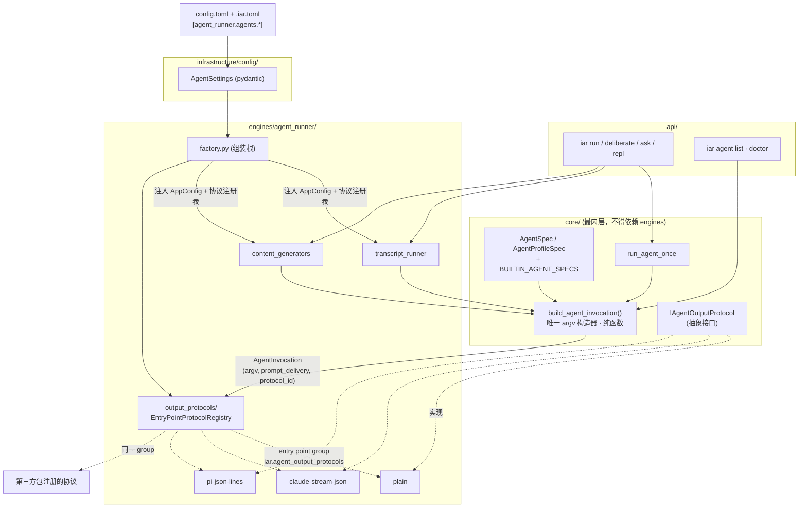

# PRD: Agent CLI 适配层：单一命令构造器 + 声明式 agent 注册

> ✅ **交付前置**：无，可立即开工。
> 结构化声明见 §8 Delivery Dependencies，**那里是唯一事实源**。

- GitHub Issue: （待创建）

> 本 PRD 分两个阅读高度，自上而下阅读：
>
> - **Part A · 人审层 (Review Layer)** — 需求方 / 验收人读这部分，决定"该不该做、做得对不对"，并通过风险地图知道**哪些地方必须亲自确认**。Part A 不出现实现机制、文件路径、命令。
> - **Part B · 执行器层 (Build Layer)** — 实现者（人或 Agent）读这部分动手。人只在 Part A 风险地图**点名处**下钻审查，其余默认交执行器 + 自动门禁（hook / 测试 / 架构检查）。

---

# Part A · 人审层 (Review Layer)

## 1. Introduction & Goals

### Problem Statement

keda 的 runner 支持 claude / codex / kimi 三个命令行 agent，但"怎么启动一个 agent"这件事在代码里被写了**三遍**，而且三遍互不相通：主执行路径一套、多方辩论（deliberate）一套、内容生成与 REPL 又一套。它们各自用 if/else 分支判断 agent 名字，各自拼出一串命令行参数；同一个 agent 在不同路径下的调用形态是不同的（比如 codex 在主执行里用可写沙箱、在辩论里用只读沙箱、在内容生成里又分只读/可写两种），所以这不是"三份重复代码"那么简单——它实际是一个 **agent × 用途** 的矩阵，被拆散在三个文件里手写。

除了这三处，agent 的名字还硬编码在另外 8 类地方：命令行参数的合法值白名单（8 处）、GitHub 路由标签的名字与颜色（3 个不同的数据结构各写一份）、容器认证要复制哪个家目录、去哪里找 skills、失败后按什么顺序切换到下一个 agent、以及若干"合法 agent 名"的集合校验。全仓库共有 **24 个文件**出现写死的 agent 名。

后果是：接入第 4 个 agent 不是"填一段配置"，而是一次跨 4 个架构层、要改十余处、且**漏改任何一处都会被相同的默认值掩盖**（这类漏映射曾在本仓的配置双写结构上真实发生过）的手术。这直接卡住了"多接几个 agent 试试哪个更合适"这件对 runner 来说最基本的事。

### Interpretation (解读回显)

**行为样例**

| 输入 / 操作 | 期望观察到的结果 |
|---|---|
| 在仓库配置里写一段 `pi` 的 agent 注册块，然后运行 agent 自检命令 | 逐项打印 4 种用途（主执行 / 辩论 / 内容生成 / REPL）各自解析出的完整命令行、提示词投递方式、输出协议；可执行文件存在则以退出码 0 报告"可用" |
| 用 `pi` 跑一次真实的多方辩论会话 | pi 被真实启动、输出实时进入终端 live 面板、会话正常收尾，产出与 claude / codex 同格式 |
| 一个**完全没写**任何 agent 注册块的既有仓库照常跑 runner | claude / codex / kimi 实际执行的命令行与本次改动前**逐字节一致**；既有仓库配置一个字都不用改 |
| 把某个 agent 的"只读"用途配成了带写权限的调用，然后用它跑只读决策入口 | 该入口 fail fast 拒绝执行，并明确说明这个 agent 缺少可验证的只读调用方式；不会退化成"先跑起来再说" |
| agent 自检命令指向一个 PATH 上不存在的可执行文件 | 非零退出，报"可执行文件不存在"，不尝试启动进程 |
| 配置里引用了一个没有注册过的输出协议名字 | 加载配置时立刻报错并列出所有已注册的协议名，而不是跑到一半才炸 |
| 第三方 Python 包注册了一个新的输出协议后重新安装 | 自检命令能列出这个协议；agent 注册块可以直接引用它，无需改 keda 源码 |

上表每一行都会被逐字转写为 Part B 的验收断言（Section 7.6 的 oracle）。**改表里的一格，就等于改了验收标准**——所以这张表值得逐行读。

**我默默定了这些**

- 三处命令构造合并后，claude / codex / kimi 现有的命令行**逐字节不变**——不趁机"顺手优化"任何参数。
- 用途维度定为 4 个：主执行 / 辩论 / 内容生成 / REPL，直接对应现有三个构造点（内容生成的只读开关拆成"内容生成"与"REPL"两个独立用途）。
- 内置的输出协议也走与第三方插件**同一套**注册机制，而不是内置走一条捷径、插件走另一条——否则插件机制会因为没有真实使用者而腐烂。
- pi 的主执行调用带上"信任本项目文件"开关（`--approve`）。不带的话 pi 在非交互模式下会**忽略项目里的 CLAUDE.md / AGENTS.md 和项目级 skills**，而这恰恰是 runner 的核心前提。
- pi 的"只读"用**工具白名单**（`--no-tools`）表达，而不是文件系统沙箱——因为 pi 明确声明自己不提供内置沙箱。
- agent 注册配置放在仓库级与全局两层配置里，沿用现有的两层合并语义；密钥仍然只走环境变量，配置里不放密钥。
- **不**把 pi 加进"失败后自动切换 agent"的默认顺序——保持现状三个，要用得自己显式配。

**我理解为不做**

- 不做 agent 的会话续跑 / 断点恢复（pi 有这个能力，本次不接；keda 现在靠重发完整 transcript 实现多轮）。
- 不做多模型路由（pi 能选 provider 和 model，这些不进 keda 的调度决策，本次只当作固定参数）。
- 不在管理终端前端加 agent 选择器或注册界面。

**解读**：这件事读成 **"把 agent 的调用方式从散落在代码里的 if/else，收敛成一份可声明的注册表；注册表里能表达的部分靠改配置接入，表达不了的部分（输出流的解析方式）靠一个有明确契约的插件点接入；并用真实接入 pi 来证明这条路走得通"**。不读成："趁机重构 runner 的编排逻辑"、"给 agent 做一个通用的模型抽象层"、或"把 agent 名字彻底变成动态的、连默认值都不给"。

关键边界（少了任何一条，实现就可能跑偏成另一件事）：

- **现有三个 agent 的可观测行为必须零变化。** 这不只是"测试通过"，而是实际发出的命令行逐字节一致，且既有仓库配置零改动即可继续工作。
- **配置只能引用能力，不能注入能力。** 配置里的参数是字面量 argv 片段加有限的占位符；不做 shell 展开，不能写管道、反引号、通配符；运行时才能确定的参数（如 codex 需要额外放行的 git 元数据目录）只能引用**代码里已命名的**展开器，不能由配置自由构造。
- **只读用途必须是可验证的。** 只读决策入口现有的硬性要求是"agent 没有可验证只读调用方式就 fail fast"，本次改造不得把这条门禁削弱成"配置说它只读它就只读"。

**非目标**：不改 runner 的状态机、不改 GitHub 标签的流转语义、不改 PRD / Issue 流程、不动前端。

### What The User Gets

**对跑 runner 的人**：多一个可用的 agent（pi），以及一条"这个 agent 到底会被怎么启动"的自检命令——以前只能靠读源码猜。

**对想接入新 agent 的人（或 agent 自己）**：接入一个新的命令行 agent，主要工作从"改十几处源码、跨 4 个架构层"变成"在仓库配置里写一段注册块，然后跑自检命令看它绿不绿"。注册块能表达：可执行文件名、4 种用途各自的参数、提示词怎么递进去（命令行参数还是标准输入）、输出怎么解析、GitHub 路由标签、容器认证的家目录、skills 目录。

**对既有仓库**：什么都不用做。不写注册块就完全维持现状。

**对第三方**：如果某个 agent 的输出格式内置协议表达不了，可以用一个独立 Python 包注册自己的解析器，不需要 fork keda。

### Measurable Objectives

- 全仓库 agent 名字硬编码的文件数从 **24** 降到可枚举的少数几处（注册表定义、默认注册块、以及注册表自身的测试）；用仓库搜索断言可验证。
- 命令行构造点从 **3 处** 降到 **1 处**；搜索断言可验证不存在第二处拼 argv 的地方。
- claude / codex / kimi 在 4 种用途下解析出的命令行，与改动前的黄金样本**逐字节一致**。
- 一个**全新**的 agent（pi）在**不修改任何 `src/` 下 agent 专有分支代码**的前提下，通过配置完成注册，并真实跑通一次辩论会话。
- 自检命令对合法配置退出码 0、对不存在的可执行文件 / 未注册的输出协议 / 缺失的只读用途分别以非零退出并给出可定位的错误。
- 既有仓库配置（只有旧标签段、没有 agent 注册块）零改动跑通一次真实 runner 轮询。

## 2. Human Review Map (介入与风险地图)

### 决策一：合并三处命令构造后，现有三个 agent 的行为必须**逐字节**零变化

这是整件事的地基。三处构造点合并成一处，意味着 claude / codex / kimi 在**所有**执行路径上的启动命令都改由新代码生成。如果哪怕一个参数顺序变了、一个 flag 掉了，后果不是"报错"而是"静默跑偏"——比如 codex 在主执行路径上少了放行 git 元数据目录的参数，agent 会在写 lint 标记时拿到"Operation not permitted"，但表现为一次莫名其妙的验证失败；再比如 claude 少了流式 JSON 参数，live 面板会变哑但进程照常退出 0。

同样属于这条承诺的还有**既有仓库配置的兼容性**：下游产品仓的仓库配置文件是由初始化命令写出来的，里面已经写死了三个 agent 的路由标签。新的注册表接管标签之后，这些既有的标签配置必须继续生效且优先级不变，否则会出现"标签路由到一半失效、Issue 卡在队列里"这种极难定位的故障。

我的建议是把"零变化"做成**可执行的黄金样本**而不是靠 review 眼看：先在改动前把三个 agent × 四种用途共 12 条命令行落成快照，改动后逐字节比对。

**请确认：** 认可"现有三个 agent 的实际命令行逐字节不变、且既有仓库配置零改动继续工作"作为这次改造的硬性验收线吗？（如果你其实希望顺便修正某个现存参数——比如给 kimi 也加上流式输出——请现在说，那会变成一条独立的行为变更，需要单独立项。）

**验收：** 改动前后各导出一次 12 条命令行的完整快照，逐字节比对无差异；并用一份只含旧标签段、没有任何 agent 注册块的仓库配置，真实跑通一次 runner 轮询。

### 决策二：pi 的"只读"用工具白名单表达，够不够格通过只读决策入口的门禁

keda 有一个只读决策入口（`iar ask`），它的硬性规则是：**所选 agent 如果没有可验证的只读调用方式，就必须 fail fast**，绝不退化去复用可能写仓库的调用形态。这条规则是上一个 PRD 明确立下的安全门。

现有三个 agent 里，codex 的只读是**文件系统沙箱**级别的（`--sandbox read-only`，进程根本没有写权限）。pi 不一样——它在文档里明确声明**不提供任何内置沙箱**，工具就是以当前用户权限直接跑。pi 能提供的最强只读表达是**禁用全部工具**（`--no-tools`）：模型仍然会推理和产出文本，但它没有 read / bash / edit / write 任何一个工具可调用，因此无法触碰文件系统。

这两者的强度不同：沙箱是操作系统级的，工具白名单是应用级的——如果 pi 自身有 bug 或被提示词注入绕过了工具开关，理论上防线就没了。我倾向于**认可**工具白名单作为只读表达，理由是：只读决策入口的用途是"让模型看一眼当前状态然后产出一个计划"，它本来就不需要任何工具；禁用全部工具在这个用途下不是"削弱的沙箱"，而是"比沙箱更彻底的能力剥夺"。但这是一条信任边界，不该由我单方面定。

**请确认：** 同意"禁用全部工具"算作可验证只读，让 pi 可以用于只读决策入口吗？如果不同意，pi 就只注册主执行 / 内容生成两种用途，只读入口继续只认沙箱级 agent。

**验收：** 用 pi 真实跑一次只读决策入口，观察到它产出了计划且**没有**产生任何文件变更；再把 pi 的只读用途配置故意改成带写能力的形态，观察到入口以非零退出拒绝执行——这一条必须能真的变红，红不了就不算证明。

### 决策三：agent 注册配置和第三方插件都是"可执行面"，信任边界划在哪

这次改造有两个新的东西会变成**能影响进程实际行为**的输入，而不只是数据：

第一，**agent 注册配置最终会变成命令行参数**。里面躺着 codex 的沙箱开关、审批策略开关、claude 的跳过权限确认开关。原始需求是"让新接入的 agent 自己去改这个配置文件"——那就等于让一个 agent 有能力改写另一个 agent 的沙箱参数。我的建议是：配置里的参数只能是**字面量 argv 片段 + 有限占位符**，不做任何 shell 展开（不认管道、反引号、通配符——这与本仓验证命令的既有语义一致）；运行时才能算出来的参数只能引用**代码里已命名的展开器**，配置不能自由构造。这样配置的能力上限是"给某个可执行文件传一组固定参数"，而不是"执行任意东西"。至于"能不能关掉 codex 的沙箱"——技术上能，因为那本来就是一个命令行参数；我的建议是**不做技术阻拦，改为自检命令显式高亮**：自检输出会把每个用途解析出的完整命令行原样打印，沙箱 / 审批类参数缺失时给出醒目告警。理由是任何"禁止改沙箱参数"的白名单都会在下一个 agent 上失效，而"把实际会执行的命令原样摊开给人看"是稳定的。

第二，**输出协议插件是第三方 Python 代码，在 runner 进程内执行**。这跟配置不同——插件能做的事没有上限。我的建议是：插件只在**显式安装到同一环境**时才被发现（沿用 Python 生态标准的 entry point 机制，不做任何自动下载或远程加载）；加载失败**不静默降级**成默认协议，而是直接报错——静默降级会让"我以为在用我的解析器，实际在用纯文本"这种错误潜伏很久。

**请确认：** 同意"配置不做 shell 展开、只能引用已命名展开器；沙箱参数不做技术阻拦但自检强制摊开并告警；插件仅限本地显式安装、加载失败即报错"这套边界吗？

**验收：** 在配置里写入带管道 / 反引号 / 通配符的参数，观察到它们被当作**字面量**传给可执行文件（而不是被 shell 解释执行）；把 codex 的沙箱参数从配置里删掉，观察到自检命令给出告警且把完整命令行打印出来；注册一个会抛异常的插件，观察到加载阶段直接报错而不是回落到纯文本协议。

---

**自动门禁，不需要逐项人工审阅：** 配置 schema 与两层合并、注册表数据结构、自检命令本身、pi 的容器认证家目录与 skills 目录接入、11 处硬编码收敛、以及全部文档同步——这些由执行器完成，由架构检查 hook（层间依赖方向）、文件行数 hook、重复检测、单元测试与仓库搜索断言把守。任何一处硬编码没清干净，搜索断言会直接变红。

**本次明确不涉及：** 没有数据库结构变更（agent 注册表是配置文件，不落库）；没有前端变更（管理终端把 agent 名当自由字符串展示，标签徽章走通用前缀剥离，不含任何 agent 名枚举）；不改 GitHub 标签流转语义；不改 runner 状态机；不改 PRD / Issue 流程。

## 3. Usage And Impact After Implementation

**跑 runner 的操作者**：入口不变，仍然是 `iar run` / `iar daemon` / `iar deliberate` / `iar ask`，`--agent` 参数的用法也不变。变化是 `--agent` 现在接受注册表里的**任意** agent（含 pi），而不再是写死的四选一；传一个没注册的名字会得到一条列出所有已注册 agent 的错误，而不是静默落到默认 agent。新增一条只读的自检入口，用来在真正跑之前确认某个 agent 会被怎么启动。

**接入新 agent 的人（或 agent 自己）**：入口是仓库配置文件。写一段注册块，声明可执行文件名、4 种用途各自的参数、提示词投递方式、输出协议、路由标签、认证家目录、skills 目录，然后跑自检命令。自检绿了就可以用 `--agent <name>` 真实跑。全过程不需要动 `src/` 下任何代码——这是本 PRD 的核心可观测结果。

**下游产品仓的维护者**：**零动作**。既有仓库配置不含 agent 注册块，行为与今天完全一致。新的注册块是纯增量的可选段，不写就继承内置默认值。仓库初始化命令写出的配置模板会新增一段注释掉的注册块示例，作为文档。

**daemon 运维**：常驻 daemon 需要重启才能载入改动后的代码（editable 安装对已启动进程不生效，这是本仓既有事实，不是本次引入的）。配置本身的改动仍然是下一轮轮询自动生效，无需重启。

**管理终端的观察者**：**界面无变化**。run 记录里的 agent 字段本来就是自由字符串，`agent/*` 标签徽章走的是通用前缀剥离逻辑，pi 出现时会自动显示为 `pi` 徽章，不需要前端改动。

**向后兼容影响**：既有仓库配置的三个 agent 路由标签段继续被识别且优先级不变；`--agent` 现有的四个取值（auto / claude / codex / kimi）语义不变；失败切换 agent 的默认顺序不变；claude / codex / kimi 的实际命令行不变。新增配置段全部可选，缺省即当前行为。

## 4. Requirement Shape

- **Actor**：跑 runner 的操作者；接入新 agent 的人或 agent 自身；下游产品仓维护者（受影响但零动作）；daemon 运维；管理终端观察者（受影响但界面不变）。
- **Trigger**：（a）操作者用 `--agent <name>` 指定 agent 或让 runner 自动选择；（b）有人在仓库配置里新增 / 修改一段 agent 注册块并运行自检；（c）第三方包通过 entry point 注册输出协议。
- **Expected behavior**：所有执行路径通过**唯一**的命令构造器把「agent 名 + 用途 + 提示词 + 工作目录」解析成一次具体调用；解析结果对既有三个 agent 逐字节等于今天；对新注册的 agent 完全由配置决定；解析或执行失败给出可定位的错误而非静默降级。
- **Scope boundary**：只覆盖"如何启动一个命令行 agent、如何解析它的输出流"。不覆盖 runner 的编排 / 状态机 / 标签流转 / PRD 流程 / 前端 / 会话续跑 / 模型路由。

---

# Part B · 执行器层 (Build Layer)

## 5. Repository Context And Architecture Fit

### 当前相关模块

**三处 argv 构造点**（本次收敛目标）：

| 文件 | 符号 | 用途 | 特有形态 |
|---|---|---|---|
| `src/backend/core/use_cases/run_agent_once.py` | `_build_claude_command` / `_build_kimi_command` / `_build_codex_command`、`_AGENT_COMMAND_BUILDERS` | 主执行 | codex 走 `workspace-write` 沙箱 + 开网 + 动态 `--add-dir`；codex 被特判在 `_AGENT_COMMAND_BUILDERS` 字典**之外** |
| `src/backend/engines/agent_runner/transcript_runner.py` | `_build_deliberation_command` | 多方辩论 | codex 走 `read-only` 沙箱；kimi 用 `--input-format text`（提示词走 stdin） |
| `src/backend/engines/agent_runner/factories/content_generators.py` | `_build_content_generation_command`（带 `read_only` 开关）、`_build_repl_command` | 内容生成 / REPL | codex 只读与可写两种；claude 用精简的 `-p` 形态（无流式 JSON） |

**提示词投递与输出协议的分叉**：`transcript_runner.py` 中 `should_filter_claude_stream(command)` 为真时走 `run_filtered_claude_stream`（claude 流式 JSON），`agent_name in ("kimi", "codex")` 时走 `_run_agent_with_stdin_prompt`（避免 transcript 增长后 `Argument list too long`），其余走通用 `_relay_process_stdout`。

**其余硬编码点**（用 `rg -n --glob '!**/__pycache__/**' '"(claude|codex|kimi)"' src/backend` 可复现，当前命中 **24 个文件**）：

- 合法值白名单：`src/backend/api/cli_parser.py`（8 处 `choices`）、`src/backend/core/use_cases/loop_recipe.py` 的 `_VALID_AGENTS`、`src/backend/core/use_cases/create_issue_from_prd.py` 的 `resolve_agent_name`、`content_generators.py` 的 planner 校验。
- 路由标签**三写**：`src/backend/core/shared/models/agent_runner.py` 的 `LabelConfig.agent_labels`（domain dataclass）、`src/backend/infrastructure/config/settings.py` 的 `AgentRunnerLabelSettings`（pydantic）、`src/backend/infrastructure/github_labels.py`（颜色 + 描述），外加 `config.toml` / `.iar.toml` 的 `[agent_runner.labels]` 段。
- 容器认证：`src/backend/engines/agent_runner/container_auth.py` 的 `_CLAUDE_SPEC` / `_CODEX_SPEC` / `_KIMI_SPEC`（已经是 `AgentImportSpec` 声明式 dataclass——本次设计的现成范式）。
- skills 目录：`src/backend/core/use_cases/generated_content.py` 的 `_DEFAULT_PRD_SKILL_ROOT_RELATIVE_PATHS`。
- 切换顺序：`agent_runner.py` 的 `RunnerConfig.agent_fallback_order` + `settings.py` 同名字段 + `run_agent_once.py` 的 `resolve_agent_fallback_order`。

### 架构约束（权威来源：`hooks/shared/check_architecture.py` 的 `FORBIDDEN_IMPORTS`）

```
infrastructure  禁止 import  core / engines / api   （白名单例外：core.shared.interfaces、core.shared.models）
core            禁止 import  engines / infrastructure / api
api             禁止 import  infrastructure          （engines 为过渡期放宽）
engines         禁止 import  api
```

**关键推论**：`core/` 是最内层，**不能**依赖 `engines/`；`engines/` 可以依赖 `core/`。因此三处构造点（1 处在 `core/`、2 处在 `engines/`）要合并，唯一合法的落点是 **`core/`**，且必须是纯函数（无 I/O、无插件加载）。插件发现与输出协议实现必须留在 `engines/`，通过 `core/shared/interfaces/` 的抽象接口在组装根（`engines/agent_runner/factory.py`）注入。

其他约束：单文件非空行 ≤ 1000（`hooks/shared/check_max_file_lines.py` 硬失败），目标 ≤ 800（`docs/ai-standards/code-reuse.md`）；`run_agent_once.py` 当前 945 非空行，本次**净减少**。

### 配置的双类结构（本仓已知陷阱）

新增配置字段必须同步三处，否则会被相同的默认值掩盖：domain dataclass（`core/shared/models/agent_runner.py`，运行时读的是这个）+ pydantic settings（`infrastructure/config/settings.py`，负责读 TOML/env）+ factory 映射（`engines/agent_runner/factory_config_builder.py` 逐字段手写）。`.iar.toml` 的仓库级覆盖走 `engines/agent_runner/factory_config_merge.py`；`iar init` 的模板与字段注释在 `engines/agent_runner/repository_local.py`。

### Frontend Impact

**No frontend impact。** 理由：管理终端（`frontend-public/`，Next.js）不含任何 agent 名枚举——`rg -n -i "codex|kimi" frontend-public/app frontend-public/components frontend-public/lib` 无命中；run 记录的 `agent` 字段在 `frontend-public/lib/api/types.ts` 中是 `string`；`frontend-public/components/agent-runner/label-variant.ts` 对 `agent/*` 标签走通用前缀剥离（`label.slice("agent/".length)`），新 agent 的徽章自动生效。`frontend-admin/` 是纯模板，无关。

### Existing PRD Relationship

| PRD | 关系 |
|---|---|
| `tasks/pending/P1-REFACTOR-20260705-210702-file-line-split-seven-files.md` | **soft 依赖 / 文件级重叠**。该 PRD 计划把 `run_agent_once.py` 拆成 `agent_command.py`（放 `format_command` / `choose_agent`）、`agent_run_loop.py`、`run_agent_once.py`。本 PRD 同样改 `run_agent_once.py`，且会新增模块——为避免隐式撞车，本 PRD **不使用 `agent_command.py` 这个文件名**（见 Section 7 change tree），并且本 PRD 会把三个 builder 从 `run_agent_once.py` 移出，**减少**该文件行数，对拆分 PRD 是净帮助。两者可任意顺序执行。 |
| `tasks/pending/P1-REFACTOR-20260703-184226-api-engines-layer-migration.md` | **独立**。该 PRD 处理 `api → engines` 的 40 处违规；本 PRD 新增代码不引入新的 `api → engines` 依赖（新 CLI 子命令沿用现有 `cli_parsed_commands/` 分发模式）。 |
| `tasks/archive/P2-FEAT-20260527-162000-agent-runner-unified-entry.md`（`iar ask`） | **上游约束来源**。它立下"planner 没有可验证只读 command builder 时必须 fail fast"这条硬规则（其 rv-3 证据）。本 PRD 的决策二直接受它约束，改造后该门禁必须仍然成立。 |
| `tasks/pending/P1-FEAT-20260703-105340-prd-regrounding-touch-map-avoidance.md` | **独立**，但它描述的"隐式撞车"正是与文件拆分 PRD 之间的风险，已在上面显式处理。 |

其余 pending PRD（roadmap 调度、completeness 判定、console web terminal、包分发、memory 锚定）与本 PRD 无重叠。

## 6. Recommendation

### Recommended Approach

**在 `core/` 建立唯一的、纯函数的 agent 调用注册表与命令构造器；把 agent 的全部差异沉到一份声明式 spec；输出协议通过 `core/shared/interfaces/` 的抽象接口 + `engines/` 的 entry point 注册表解析。**

为什么这是当前架构下的最佳落点：

- 三处构造点分处 `core/` 与 `engines/` 两层，而 `core/` 禁止依赖 `engines/`——所以合并点**只能**在 `core/`，且必须无 I/O。这不是设计偏好，是架构检查 hook 的硬约束。
- `container_auth.py` 的 `AgentImportSpec` 已经是"per-agent 声明式 dataclass 集中定义"的成熟范式，本次是**把这个已被验证的模式扩展到调用维度**，不是发明新模式。
- 配置读取沿用现有 pydantic settings + domain dataclass + factory 映射三件套与 `.iar.toml` 两层合并，不新建配置通道。
- 插件用 Python 生态标准的 entry point，不自建加载器、不做远程加载。

拒绝的冗余抽象：

- **不**建"agent 抽象基类 + 每个 agent 一个子类"。那会把今天的 3 处 if/else 变成 N 个类文件，差异仍然是代码而不是数据，接入新 agent 仍要写 Python——正好是本 PRD 要消除的东西。
- **不**给命令构造做模板引擎 / shell 展开。本仓验证命令的既有语义就是 `shlex.split` 后直接 `subprocess.run`、不做 shell 展开；保持一致，且这是决策三的信任边界。
- **不**新增存储。注册表是配置文件，不落库。
- **不**改 `IAgentTranscriptRunner` / `IContentGenerator` 的方法签名——注册表通过**构造器注入**在组装根传入，调用侧零改动。

### Proposed Solution Summary (实现机制)

核心机制是**一份 spec + 一个纯函数 + 一个协议注册表**：

- **谁提供声明**：用户（或代自己注册的 agent）在 `config.toml` / `.iar.toml` 的 `[agent_runner.agents.<name>]` 段显式写出 agent 的调用形态。系统**只消费显式数据，不做任何推断**——不去嗅探 PATH、不猜参数、不从 agent 的 `--help` 反推。内置三个 agent 的 spec 以代码默认值形式提供（等价于"出厂就写好的注册块"），用户配置按现有两层合并语义覆盖。
- **核心函数**：`core/use_cases/agent_invocation.py::build_agent_invocation(agent_name, profile, prompt, worktree_path, config) -> AgentInvocation`。纯函数，返回 `AgentInvocation(argv, prompt_delivery, output_protocol_id, cwd, read_only)`。这是全仓库**唯一**拼 agent argv 的地方。
- **插进哪里**：三处旧构造点全部改为调用它——`run_agent_once.py`（profile=`run`）、`transcript_runner.py`（profile=`deliberate`）、`content_generators.py`（profile=`generate` / `repl`）。`transcript_runner` 与 `content_generators` 在 `engines/`，通过组装根 `factory.py` 注入 `AppConfig`（构造器参数，不改 `run()` / `generate()` 签名）。
- **输出协议**：`core/shared/interfaces/agent_output_protocol.py` 定义 `IAgentOutputProtocol`（把子进程 stdout/stderr 中继成 `CommandResult`）；`engines/agent_runner/output_protocols/` 提供 entry point 注册表。内置三个协议（`plain` / `claude-stream-json` / `pi-json-lines`）**经由同一 entry point group 注册**，与第三方插件走同一条路——这是让插件机制不腐烂的关键。
- **系统状态 / 可见行为变化**：新增 `iar agent list` / `iar agent doctor <name>`（只读）；`--agent` 的合法值来自注册表而非写死的 choices；新增 pi 可用。既有三个 agent 的实际命令行、标签语义、状态机全部不变。
- **刻意回避的复杂度**：不新增存储、不新增服务边界、不改状态机、不做 shell 展开、不做插件的远程加载或版本协商、不做 agent 抽象基类。

### Alternatives Considered

| 方案 | 为什么不选 |
|---|---|
| 只合并三处构造点，不做配置注册表 | 解决了重复，没解决"接入新 agent 要改十几处"——而后者才是原始诉求。 |
| 只做配置注册表，不合并构造点 | 配置会变成三份平行数据分别喂三个构造器，分叉从 3 处变成 3×N。收敛是引入配置的**前提**，顺序不能反。 |
| 输出协议做成封闭枚举，不做插件点 | 更小，但用户在被明确告知取舍后选择了 entry point 插件机制（见 Decision Log D-05）。为避免"零消费者的平行抽象"这一 `code-reuse.md` 明确要挡的问题，设计上让**内置协议也走同一注册路径**，机制day-one 即有 3 个真实使用者。 |

## 7. Implementation Guide

> This section is a living implementation guide based on current repository analysis. If implementation discovers additional affected files, hidden dependencies, edge cases, or a better path, update this PRD before proceeding.

### 7.1 Core Logic

数据与控制流：

1. 调用方（`run_agent_once` / `transcript_runner` / `content_generators`）拿到 `agent_name`、用途 `profile`、`prompt`、`cwd` 和 `AppConfig`。
2. `build_agent_invocation` 从 `config.agents[agent_name].profiles[profile]` 取出 spec，按顺序组装 argv：`[spec.bin] + base_args(占位符替换) + expanders(运行时展开) + tail_args`，并根据 `prompt_delivery` 决定 prompt 是追加到 argv 尾部、放在指定 flag 后、还是走 stdin。
3. 返回 `AgentInvocation`。调用方把它交给进程执行层；执行层按 `output_protocol_id` 从协议注册表取实现，由该实现负责中继 stdout/stderr 并产出 `CommandResult`。
4. 任何一步失败（agent 未注册 / profile 未定义 / 协议未注册 / 展开器未命名）都抛带上下文的异常，不降级。

占位符（**闭集**，不可扩展）：`{cwd}`、`{prompt}`、`{worktree}`。展开器（**闭集**，代码内命名）：目前只有 `git_writable_roots`（对应 codex 现有的 `_resolve_worktree_git_writable_roots`），配置写法 `expand = ["git_writable_roots:--add-dir"]`，语义是"对展开器返回的每个值追加一次 `--add-dir <value>`"。**不做 shell 展开**——argv 元素是字面量，与本仓 `verification_commands` 的既有语义一致。

内置 spec 的目标形态（必须使这 12 条命令行与今天逐字节一致）：

| agent | run | deliberate | generate | repl |
|---|---|---|---|---|
| claude | `--dangerously-skip-permissions --verbose -p --output-format stream-json --include-partial-messages`，prompt 走 argv 尾部（流式路径下由协议剥离），协议 `claude-stream-json` | 同 run | `--dangerously-skip-permissions -p`，prompt 走 argv 尾部，协议 `plain` | 同 generate |
| codex | `--cd {cwd} --sandbox workspace-write --config sandbox_workspace_write.network_access=true --ask-for-approval never` + `expand git_writable_roots:--add-dir` + tail `exec`，prompt 走 stdin，协议 `plain` | `--cd {cwd} --sandbox read-only --ask-for-approval never` + tail `exec`，prompt 走 stdin，协议 `plain` | `--cd {cwd} --sandbox read-only --ask-for-approval never` + tail `exec`，prompt 走 argv 尾部，协议 `plain` | `--cd {cwd}` + tail `exec`，prompt 走 argv 尾部，协议 `plain` |
| kimi | `--prompt {prompt}`（argv），协议 `plain`，走 stdin 中继路径 | `--input-format text`，prompt 走 stdin，协议 `plain` | `--prompt {prompt}`（argv），协议 `plain` | 同 generate |

> **注意**：上表是从现有三处构造点读出来的目标状态，**必须**以改动前导出的黄金快照为准逐字节校对（rv-1），不要以本表为准手抄。若发现本表与实际代码有出入，以代码为准并回来更新本 PRD。

pi 的注册块（新增，写入 `config.toml` 内置默认 + `.iar.toml` 模板注释示例）：

```toml
[agent_runner.agents.pi]
bin = "pi"
label = "agent/pi"
label_color = "7C3AED"
label_description = "Use pi for local runner execution."
auth_home = "~/.pi/agent"
auth_include = ["auth.json", "settings.json", "models.json", "skills"]
auth_exclude = ["sessions", "pi-crash.log", "models-store.json"]
project_skills_dir = ".pi/skills"

[agent_runner.agents.pi.profiles.run]
args = ["--approve", "--mode", "json"]
prompt_delivery = "stdin"
output_protocol = "pi-json-lines"

[agent_runner.agents.pi.profiles.deliberate]
args = ["--approve", "--no-tools", "--print"]
prompt_delivery = "stdin"
output_protocol = "plain"
read_only = true

[agent_runner.agents.pi.profiles.generate]
args = ["--no-tools", "--print"]
prompt_delivery = "stdin"
output_protocol = "plain"
read_only = true

[agent_runner.agents.pi.profiles.repl]
args = ["--approve", "--print"]
prompt_delivery = "stdin"
output_protocol = "plain"
```

pi 事实依据（见 Section 7.9 External Validation）：`-p/--print` 模式**读取管道 stdin 并并入初始 prompt**；`--mode json` 输出 JSON Lines 事件流（首行是 session 头，随后是 `agent_start` / `message_update` / `tool_execution_*` / `agent_end` 等）；`--no-tools` 禁用全部工具；`--approve` 信任项目本地文件（不带时非交互模式按 `defaultProjectTrust=ask` **忽略**项目 CLAUDE.md / AGENTS.md / 项目级 skills）；pi **无内置沙箱**；配置与凭据在 `~/.pi/agent/`（`auth.json` / `settings.json` / `models.json` / `skills/`，`sessions/` 是运行时状态）；项目级 skills 目录是 `.pi/skills/`。

### 7.2 Change Impact Tree

```text
.
├── src/backend/core/shared/models/
│   └── agent_spec.py
│       [新增]
│       【总结】agent 调用的声明式领域模型：一个 agent 的可执行文件、认证/skills 路径、
│               以及 4 种用途各自的 argv 片段、prompt 投递方式、输出协议 id。
│
│       ├── AgentProfileSpec：base_args / expand / tail_args / prompt_delivery /
│       │   prompt_flag / output_protocol / read_only
│       ├── AgentSpec：bin / label / label_color / label_description / auth_home /
│       │   auth_include / auth_exclude / project_skills_dir / profiles: dict[str, AgentProfileSpec]
│       ├── PromptDelivery 字面量集合：argv_tail / flag / stdin
│       ├── AgentProfile 字面量集合：run / deliberate / generate / repl
│       └── BUILTIN_AGENT_SPECS：claude / codex / kimi / pi 的内置默认（唯一来源）
│
├── src/backend/core/shared/interfaces/
│   └── agent_output_protocol.py
│       [新增]
│       【总结】输出协议抽象：把已启动的子进程中继成 CommandResult，供 engines 实现、
│               core 侧只依赖接口（满足 core 不得依赖 engines 的架构约束）。
│
│       ├── IAgentOutputProtocol.relay(process, prompt, sinks) -> CommandResult
│       └── IAgentOutputProtocolRegistry.resolve(protocol_id) / list_ids()
│
├── src/backend/core/use_cases/
│   ├── agent_invocation.py
│   │   [新增] （刻意不叫 agent_command.py：避让 file-line-split PRD 计划的同名文件）
│   │   【总结】全仓库唯一的 agent argv 构造器，纯函数、无 I/O。
│   │
│   │   ├── AgentInvocation 结果 dataclass（argv / prompt_delivery / output_protocol / cwd / read_only）
│   │   ├── build_agent_invocation(agent_name, profile, prompt, worktree_path, config)
│   │   ├── 占位符替换（闭集 {cwd} / {prompt} / {worktree}）与展开器分派（闭集，目前仅 git_writable_roots）
│   │   ├── resolve_registered_agents(config) → 供 CLI choices 与校验共用的合法值来源
│   │   └── 未注册 agent / profile / 协议 / 展开器 → 抛带上下文异常，不降级
│   │
│   ├── run_agent_once.py
│   │   [修改]
│   │   【总结】删掉三个私有 builder 与 _AGENT_COMMAND_BUILDERS，改调用统一构造器；文件净减行。
│   │
│   │   ├── 删除 _build_claude_command / _build_kimi_command / _build_codex_command / _AGENT_COMMAND_BUILDERS
│   │   ├── _resolve_worktree_git_writable_roots 迁到展开器实现处（保留行为）
│   │   ├── run_agent / run_agent_with_prompt 改为 build_agent_invocation(..., profile="run")
│   │   └── 删除 command_name != "claude" or "stream-json" not in ... 的协议特判，改由 output_protocol 决定
│   │
│   └── generated_content.py
│       [修改]
│       【总结】skills 根目录候选改为从注册表的 project_skills_dir 派生，去掉写死的四个目录。
│
├── src/backend/engines/agent_runner/
│   ├── output_protocols/__init__.py
│   │   [新增]
│   │   【总结】输出协议注册表：经 entry point group 发现实现，内置协议走同一条注册路径。
│   │
│   │   ├── ENTRY_POINT_GROUP = "iar.agent_output_protocols"
│   │   ├── EntryPointProtocolRegistry：加载失败直接抛错，不静默回落
│   │   └── list_ids() 供 iar agent doctor --protocols 使用
│   │
│   ├── output_protocols/plain.py
│   │   [新增]
│   │   【总结】通用中继：现有 _relay_process_stdout / _run_agent_with_stdin_prompt 行为的协议化封装。
│   │
│   ├── output_protocols/claude_stream_json.py
│   │   [新增]
│   │   【总结】claude 流式 JSON 中继：包裹现有 run_filtered_claude_stream，行为不变。
│   │
│   ├── output_protocols/pi_json_lines.py
│   │   [新增]
│   │   【总结】pi 的 JSON Lines 事件流解析：把 message_update / tool_execution_* 渲染成 live 面板文本。
│   │
│   ├── transcript_runner.py
│   │   [修改]
│   │   【总结】删掉 _build_deliberation_command 与 agent 名 if/else，改由注册表决定命令与中继方式。
│   │
│   │   ├── SubprocessTranscriptRunner.__init__ 增加 config + protocol_registry（构造器注入）
│   │   ├── run() 签名不变；内部改 build_agent_invocation(..., profile="deliberate")
│   │   └── 删除 should_filter_claude_stream / agent_name in ("kimi","codex") 分支
│   │
│   ├── factories/content_generators.py
│   │   [修改]
│   │   【总结】删掉 _build_content_generation_command 的 agent 分支，read_only 开关映射为 generate/repl 两个 profile。
│   │
│   │   ├── SubprocessContentGenerator.__init__ 增加 config + protocol_registry
│   │   ├── _build_repl_command → profile="repl"；read_only=True → profile="generate"
│   │   └── planner 只读校验改为读 spec 的 read_only 字段（决策二的门禁落点）
│   │
│   ├── container_auth.py
│   │   [修改]
│   │   【总结】_CLAUDE_SPEC/_CODEX_SPEC/_KIMI_SPEC 改为从注册表的 auth_* 字段派生，新增 pi 自动生效。
│   │
│   ├── factory_config_builder.py
│   │   [修改]
│   │   【总结】把 pydantic AgentSettings 映射成 domain AgentSpec，并入 AppConfig.agents。
│   │
│   ├── factory_config_merge.py
│   │   [修改]
│   │   【总结】新增 agents 段的仓库级合并；旧 labels.{codex,claude,kimi} 继续作为对应 agent label 的覆盖来源。
│   │
│   ├── factory.py
│   │   [修改]
│   │   【总结】组装根：构造协议注册表并注入 transcript runner 与 content generator。
│   │
│   └── repository_local.py
│       [修改]
│       【总结】iar init 模板新增注释掉的 [agent_runner.agents.*] 示例块与字段说明。
│
├── src/backend/core/shared/models/agent_runner.py
│   [修改]
│   【总结】AppConfig 增加 agents 字段；LabelConfig.agent_labels 改为从注册表派生，去掉三个写死键。
│
├── src/backend/infrastructure/config/settings.py
│   [修改]
│   【总结】新增 AgentSettings/AgentProfileSettings pydantic 模型与 [agent_runner.agents.*] 读取；
│           AgentRunnerLabelSettings 去掉 codex/claude/kimi 三个字段（改由注册表提供，旧键保留兼容读取）。
│
├── src/backend/infrastructure/github_labels.py
│   [修改]
│   【总结】标签颜色与描述改为从注册表的 label_color / label_description 派生。
│
├── src/backend/api/
│   ├── cli_parser.py
│   │   [修改]
│   │   【总结】8 处写死的 choices 改为从注册表动态取值，非法值报错时列出全部已注册 agent。
│   │
│   ├── cli_typer_app.py
│   │   [修改]
│   │   【总结】注册 agent_app 子命令组（list / doctor）。
│   │
│   └── cli_parsed_commands/agent.py
│       [修改]
│       【总结】新增 run_agent_list_command / run_agent_doctor_command 两个只读命令实现。
│
├── src/backend/core/use_cases/
│   ├── loop_recipe.py            [修改] 【总结】_VALID_AGENTS 改为从注册表派生。
│   ├── create_issue_from_prd.py  [修改] 【总结】resolve_agent_name 的三元组改为注册表成员校验。
│   └── run_agent_once.py         （见上）
│
├── pyproject.toml
│   [修改]
│   【总结】声明 iar.agent_output_protocols entry point group 并注册三个内置协议。
│
├── config.toml
│   [修改]
│   【总结】新增 [agent_runner.agents.*] 段（claude/codex/kimi/pi 四个注册块）；
│           [agent_runner.labels] 的三个 agent 键标注为兼容保留。
│
├── tests/
│   ├── test_agent_invocation_golden.py  [新增] 【总结】12 条命令行黄金快照逐字节比对（rv-1 的自动化部分）。
│   ├── test_agent_spec_config.py        [新增] 【总结】配置解析、两层合并、旧 labels 键兼容、非法值报错。
│   ├── test_output_protocol_registry.py [新增] 【总结】entry point 发现、加载失败不降级、内置三协议可解析。
│   ├── test_agent_doctor_cli.py         [新增] 【总结】doctor 正/负路径（缺可执行文件、未注册协议、缺只读 profile）。
│   └── （既有 runner / deliberation / content 测试）[修改] 【总结】适配构造器注入，断言改指注册表。
│
└── docs/
    ├── guides/agent-runner.md   [修改] 【总结】新增"接入一个新 agent"章节：注册块字段表 + doctor 自检流程。
    ├── guides/configuration.md  [修改] 【总结】[agent_runner.agents.*] 字段说明与两层合并语义。
    ├── architecture/system-design.md [修改] 【总结】记录命令构造器落在 core、协议实现落在 engines 的依赖理由。
    └── mkdocs.yml               [修改] 【总结】导航同步（若新增页面）。
```

上述文件清单是**起点而非穷举**——`agent` 名字的引用面较广，执行前必须跑 Executor Drift Guard 的搜索。

### 7.3 Risk Classification Register

| change point | layer | tier | 决定性维度 / override | intervention | oracle / gate |
|---|---|---|---|---|---|
| 三处 argv 构造点合并为一处；12 条命令行逐字节不变 | core | **R2** | 正确性关键 + 爆炸半径（所有执行路径）；错误静默不报 | 人工确认（兼容承诺） | rv-1（黄金快照 + 真实 `iar run`） |
| 既有 `.iar.toml` 旧 labels 键零改动继续生效 | engines / infrastructure | **R2** | 兼容边界；失效表现为 Issue 静默卡队列 | 人工确认（与上同一决策） | rv-1 |
| pi 的只读用途以 `--no-tools` 表达并用于 `iar ask` 只读门 | core | **R3** | 安全 / 信任边界 override（fixed zone：security / trust boundary） | 人工确认 + 可变红的负控 | rv-2 |
| agent 注册配置 → argv（可改写沙箱/审批参数）；entry point 插件在 runner 进程内执行第三方代码 | infrastructure / engines | **R3** | 安全 / 信任边界 override | 人工确认 + 负控 | rv-3 |
| `AgentSpec` / `AgentProfileSpec` 领域模型与内置默认 | core | R1 | 纯数据结构；错了被黄金快照直接抓住 | 执行器 + 门禁 | rv-1 / 单测 |
| pydantic `AgentSettings` + `[agent_runner.agents.*]` 解析 + 两层合并 | infrastructure / engines | R1 | 新增可选配置面，缺省等价现状 | 执行器 + 门禁 | rv-5 / `test_agent_spec_config.py` |
| 输出协议注册表 + 内置三协议（`plain` / `claude-stream-json` / `pi-json-lines`） | engines | R1 | 行为等价包装；claude 流式路径不变 | 执行器 + 门禁 | rv-1 / `test_output_protocol_registry.py` |
| `iar agent list` / `iar agent doctor`（新增只读 CLI） | api | R1 | 只读命令，无副作用 | 执行器 + 门禁 | rv-5 |
| pi 接入：spec + 容器认证 + skills 目录 + 标签 | 跨层 | R1 | 纯增量；不写配置不生效 | 执行器 + 门禁 | rv-4 |
| 11 处硬编码收敛（choices / 标签三写 / fallback / 校验集合） | 跨层 | R1 | 漏改会被搜索断言与单测抓住 | 执行器 + 门禁 | rv-6 |
| 文档与 `iar init` 模板同步 | docs | R0 | 展示性 | 执行器 + 门禁 | rv-7 |

### 7.4 Executor Drift Guard

开工前与收尾前各跑一次，确认没有遗漏引用（清单不是穷举，以搜索结果为准）：

```bash
rg -n --glob '!**/__pycache__/**' '"(claude|codex|kimi|pi)"' src/backend
```

```bash
rg -n --glob '!**/__pycache__/**' '_build_(claude|kimi|codex|deliberation|content_generation|repl)_command|_AGENT_COMMAND_BUILDERS|should_filter_claude_stream' src tests
```

```bash
rg -n 'choices=\("auto", "codex", "claude", "kimi"|_VALID_AGENTS|resolve_agent_name|agent_fallback_order' src/backend
```

```bash
rg -n 'agent_labels|AgentRunnerLabelSettings|_CLAUDE_SPEC|_CODEX_SPEC|_KIMI_SPEC|_DEFAULT_PRD_SKILL_ROOT_RELATIVE_PATHS' src/backend config.toml
```

失败排查要点：

- **改完命令行变了但测试全绿** → 本仓 `pytest` 默认带 `--testmon` 增量（`addopts`），只跑受影响子集。关键改动用 `uv run pytest -o addopts="" tests/` 跑全量，别只信 `just test` 的绿。
- **`just lint` 报"刚测完仍过期"** → lint 的质量标记优先校验 staged 树、`just test` 记的是 working 树；`git add -A` 归一后重跑。
- **架构检查失败** → 检查是否在 `core/` 里 import 了 `engines/`（本 PRD 的头号风险）。协议**实现**必须留在 `engines/`，`core/` 只能依赖 `core/shared/interfaces/` 里的抽象。
- **`pi --mode json` 与 `-p` 的组合行为未经实测** → 内置 spec 里 pi 的 `run` profile 写的是 `--mode json`。执行时先用 `iar agent doctor pi` 打印命令行，再手工验证 `--mode json` 是否接受管道 stdin；若不接受，回落到 `["--print"]` + `output_protocol = "plain"`，并回来更新本 PRD 与 `pi-json-lines` 协议的适用范围。
- **重复检测门禁全绿但没查到新文件** → jscpd 默认跳过 >1000 行文件、`tests/` 不在候选范围、`pre-commit --all-files` 看不见未 track 文件。新增文件先 `git add` 再跑 `just lint --reuse`。
- **daemon 行为没跟上代码** → editable 安装对已启动进程不生效，常驻 daemon 必须重启才载入。

### 7.5 Flow / Architecture Diagram



### 7.6 Realistic Validation Plan

```yaml
- id: rv-1
  behavior: 合并三处构造点后，claude/codex/kimi 在 4 种用途下的命令行逐字节不变；且只含旧标签段、无 agents 注册块的既有仓库配置零改动继续跑通 runner。
  real_entry: "uv run iar agent doctor claude codex kimi --all-profiles --json > /tmp/iar-argv-after.json && diff /tmp/iar-argv-before.json /tmp/iar-argv-after.json && uv run iar run --repo <fixture-repo> --agent codex"
  expected: "diff 无输出（12 条命令行逐字节一致）；iar run 在只有旧 [agent_runner.labels] 段的 fixture 仓库上完成一轮轮询，agent/* 路由标签被正确读写。"
  mock_boundary: "GitHub 用 fake gh 桩；agent 可执行文件用 PATH 注入的假脚本（只回显 argv 与 stdin）。命令构造器、配置加载、两层合并、标签解析必须是真实的——它们是被测边界。"
  tier: R2
  test_layer: e2e
  required_for_acceptance: true
  critical_value_source: "/tmp/iar-argv-before.json 必须在动任何代码前、由改造前的 HEAD 生成。注意 `iar agent doctor` 是本 PRD 新增的，改造前不存在——因此 before 快照必须用一次性脚本在 `git worktree add` 出来的干净旧树里直接调用旧的三个 builder（`run_agent_once._build_claude_command` / `_build_kimi_command` / `_build_codex_command`、`transcript_runner._build_deliberation_command`、`content_generators._build_content_generation_command` 的 read_only True/False 两态）导出，共 12 条。该脚本与 after 侧的 doctor --json 必须归一到同一 JSON 形状（键：agent / profile / argv 数组 / prompt_delivery），归一逻辑写在脚本里而不是改 doctor 输出去迁就快照。脚本随证据一并归档。"
  must_cross: "TOML 配置 -> pydantic AgentSettings -> factory 映射 -> AppConfig.agents -> build_agent_invocation -> 实际 argv -> subprocess 启动"
  forbidden_bypasses: "不得直接调用 build_agent_invocation 单测代替 doctor CLI；不得用本 PRD 新写的默认值反推 before 快照；不得跳过 .iar.toml 两层合并直接喂 AppConfig。"
  fresh_state_probe: "在一个全新 clone 的 fixture 仓库（只有 iar init 写出的旧格式 .iar.toml）上以全新进程跑一次 iar run，确认标签路由生效。"
  final_tree_evidence: "证据必须在最后一次改动 agent_invocation.py / agent_spec.py / factory_config_merge.py / settings.py 之后重新采集；任一文件再动即作废。"

- id: rv-2
  behavior: pi 的只读用途（禁用全部工具）真的无法写文件；且任何没有可验证只读用途的 agent 会让只读决策入口 fail fast。
  real_entry: "uv run iar ask '列出当前仓库下一步该做什么' --repo <fixture-repo> --agent pi --plan-only"
  expected: "命令退出码 0 并产出计划；执行前后 `git -C <fixture-repo> status --porcelain` 输出完全一致（无任何文件变更）；决策审计文件记录 read_only=true。"
  mock_boundary: "pi 进程必须是真实的（被测对象就是它的只读能力）；GitHub 侧用 fake gh 桩。不得 mock 掉 build_agent_invocation 或只读门禁本身。"
  tier: R3
  test_layer: manual
  required_for_acceptance: true
  critical_value_source: "只读判定必须来自 AgentSpec.profiles['deliberate'].read_only 与实际发出的 argv（由 iar agent doctor pi 打印），不得来自测试里另写的常量。"
  must_cross: "配置 -> AgentSpec.read_only -> iar ask 只读门禁 -> build_agent_invocation -> 真实 pi 进程 -> 文件系统"
  forbidden_bypasses: "不得用 --dry-run 跳过真实进程；不得用 mock 的 content generator；不得把只读断言退化成'检查 argv 里有 --no-tools'而不实际运行。"
  fresh_state_probe: "在一个干净 git 树上运行，事后用独立的 `git status --porcelain` + `git stash list` 双重确认无变更、无暂存。"
  final_tree_evidence: "证据须在最后一次改动 content_generators.py 只读校验或 pi 内置 spec 之后重采。"
  negative_control: "把 fixture 的 .iar.toml 里 [agent_runner.agents.pi.profiles.deliberate] 的 read_only 改为 false（或删掉该 profile），重跑同一条 iar ask 命令。"
  expected_fail: "iar ask 以非零退出，stderr 明确指出 pi 缺少可验证只读调用方式，且**没有**启动任何 pi 进程。"

- id: rv-3
  behavior: 配置不做 shell 展开（只能传字面量 argv）；沙箱参数缺失时自检强制摊开并告警；输出协议插件加载失败直接报错而不静默回落。
  real_entry: "uv run iar agent doctor <name> --all-profiles"
  expected: "① 配置里写 `args = [\"--config\", \"$(whoami)\", \"a|b\", \"*.py\"]` 时，doctor 打印的 argv 里这三项原样出现（未被 shell 解释、未被通配符展开）；② 删掉 codex run profile 的 --sandbox 后，doctor 退出码非零或打印显式 WARN 且完整摊开命令行；③ 注册一个 import 即抛异常的协议插件后，doctor 与实际执行都以非零退出并指名该插件，绝不回落 plain。"
  mock_boundary: "协议插件用 tests/ 下的假包通过 entry point 真实安装（uv pip install -e tests/fixtures/broken_protocol）；配置解析、注册表加载必须真实。"
  tier: R3
  test_layer: integration
  required_for_acceptance: true
  critical_value_source: "argv 字面量断言取自 doctor 的 --json 输出，与 subprocess 实际收到的 sys.argv（由假 agent 脚本回显）交叉比对，两者必须一致。"
  must_cross: "TOML -> pydantic -> AgentSpec -> build_agent_invocation -> subprocess argv（不经过任何 shell）"
  forbidden_bypasses: "不得用 shell=True 启动；不得在断言里只看 doctor 输出而不看子进程实际收到的 argv；不得把插件失败降级为 WARN 后继续。"
  fresh_state_probe: "在新装了坏插件的独立虚拟环境中以全新进程运行 doctor，确认失败是加载期而非运行期。"
  final_tree_evidence: "证据须在最后一次改动 output_protocols/__init__.py 或 agent_invocation.py 的占位符/展开器逻辑之后重采。"
  negative_control: "把展开器名从 git_writable_roots 改成 __import__('os').system 之类的任意字符串，重跑 doctor。"
  expected_fail: "doctor 非零退出，报'未知展开器'并列出全部已命名展开器；绝不尝试解析或执行该字符串。"

- id: rv-4
  behavior: pi 作为一个全新 agent，仅通过配置注册即可真实跑通一次多方辩论会话。
  real_entry: "uv run iar deliberate '用一句话说明本仓库的定位' --repo <fixture-repo> --agents pi"
  expected: "pi 进程被真实启动并产出内容；终端 live 面板实时显示其输出；会话正常收尾并落盘 transcript，格式与 claude/codex 会话一致。"
  mock_boundary: "pi 与其模型调用是真实的（需本机已安装并完成 pi auth）；GitHub 侧不参与。"
  tier: R1
  test_layer: manual
  required_for_acceptance: true

- id: rv-5
  behavior: 自检命令对合法配置放行、对三类坏配置分别给出可定位的错误。
  real_entry: "uv run iar agent list && uv run iar agent doctor pi && uv run iar agent doctor <未注册名>"
  expected: "list 列出 claude/codex/kimi/pi 及各自 4 种用途；doctor pi 退出码 0 并打印 4 条命令行；未注册名、bin 不在 PATH、引用未注册协议这三种情况分别非零退出并在 stderr 指名具体原因。"
  mock_boundary: "PATH 探测真实执行；不启动 agent 进程（doctor 是只读的）。"
  tier: R1
  test_layer: integration
  required_for_acceptance: true

- id: rv-6
  behavior: agent 名硬编码已收敛，不存在第二处 argv 构造点。
  real_entry: "rg -n --glob '!**/__pycache__/**' '_build_(claude|kimi|codex|deliberation|content_generation)_command|_AGENT_COMMAND_BUILDERS|should_filter_claude_stream' src ; echo \"builders_exit=$?\" ; rg -c -l --glob '!**/__pycache__/**' '\"(claude|codex|kimi)\"' src/backend | wc -l"
  expected: "第一条 rg 无命中（打印 builders_exit=1，无匹配行）；第二条输出的文件数从改造前的 24 降到可枚举的少数几处，且每一处都能说明为何必须保留（注册表定义 / 内置默认 / 兼容读取）。注意两条命令用 `;` 分隔而非 `&&`——第一条按预期是退出码 1，用 `&&` 会短路掉第二条。"
  mock_boundary: "无；纯仓库搜索断言。"
  tier: R1
  test_layer: smoke
  required_for_acceptance: true

- id: rv-7
  behavior: 全量回归与质量门禁不因本次改造退化。
  real_entry: "uv run pytest -o addopts='' tests/ && uv run just lint --full"
  expected: "测试全绿；架构检查（core 不依赖 engines）、文件行数（全部 ≤1000，新增文件 ≤800）、重复检测全部通过。"
  mock_boundary: "无。"
  tier: R0
  test_layer: unit
  required_for_acceptance: true
```

**失败排查起点**：先看 `iar agent doctor <name> --json` 打印的 argv 与实际子进程收到的 argv 是否一致（不一致 → 占位符/展开器逻辑）；再看 `AppConfig.agents` 里的 spec 是否与 TOML 一致（不一致 → factory 映射漏字段，本仓已知的配置双写陷阱）；协议相关问题先跑 `iar agent doctor --protocols` 确认注册表内容。真实 agent 相关的条目（rv-2 / rv-4）依赖本机已安装并认证的 pi；无 pi 环境下的降级回退是用 `tests/fixtures/` 的假 agent 脚本走完同一条路径，但**不计入** rv-2 / rv-4 的验收证据。

### 7.7 Low-Fidelity Prototype

不需要。本次无用户界面变更（见 Section 5 Frontend Impact）。

### 7.8 ER Diagram

`No data model changes in this PRD.` agent 注册表是配置文件内容，不落库、不产生持久化实体。

### 7.9 Interactive Prototype Change Log

`No interactive prototype file changes in this PRD.`

### 7.10 External Validation

pi 的调用契约来自**本机已安装的 vendor 文档与 CLI**，不是网络检索：

| Topic | Source | Checked On | Relevant Finding | Impact On Recommendation |
|---|---|---|---|---|
| pi 版本与非交互模式 | 本机 `pi --version` / `pi --help`（`@earendil-works/pi-coding-agent` v0.84.2） | 2026-09-11 | `-p/--print` 非交互；`--mode json\|rpc`；`--no-tools`；`--approve`；无 `--cd`（靠进程 cwd） | 决定 4 种用途的参数与 prompt 投递方式；工作目录走 subprocess cwd |
| print 模式的 stdin 行为 | 包内 `docs/usage.md`（"In print mode, pi also reads piped stdin and merges it into the initial prompt"） | 2026-09-11 | `-p` 支持管道 stdin 并入 prompt | pi 全部用途采用 `prompt_delivery = "stdin"`，规避 transcript 增长导致的 `Argument list too long` |
| JSON 事件流格式 | 包内 `docs/json.md` | 2026-09-11 | JSON Lines；首行 session 头，随后 `agent_start` / `message_update` / `tool_execution_*` / `agent_end` | 支撑 `pi-json-lines` 协议实现，为 live 面板提供结构化事件（与 claude 流式 JSON 对等） |
| 沙箱与信任模型 | 包内 `docs/security.md` / `docs/usage.md` | 2026-09-11 | **无内置沙箱**；非交互模式下 `defaultProjectTrust=ask` 会忽略项目本地资源，需 `--approve` | 决策二的事实基础（只读只能用工具白名单表达）；run 用途必须带 `--approve` 否则读不到 CLAUDE.md / AGENTS.md |
| 配置、凭据与 skills 路径 | 本机 `~/.pi/agent/` 目录 + 包内 `docs/skills.md` | 2026-09-11 | `auth.json` / `settings.json` / `models.json` / `skills/`；`sessions/` 为运行时状态；项目级 skills 为 `.pi/skills/` | 决定 pi 的 `auth_home` / `auth_include` / `auth_exclude` / `project_skills_dir` |

以上均为**引用的一手厂商文档事实**；"`--mode json` 是否同时接受管道 stdin"是**我的推断**，尚未实测，已列入 Executor Drift Guard 的必测项与回退方案。

## 8. Delivery Dependencies

### Delivery Dependencies

- Group: agent-runner-extensibility
- Depends on tasks/issues:
  - none
- Gate type: soft
- Notes: 与 `P1-REFACTOR-20260705-210702-file-line-split-seven-files` 在 `src/backend/core/use_cases/run_agent_once.py` 上文件级重叠。两者无逻辑依赖、可任意顺序执行：本 PRD 把三个 command builder 移出该文件，对拆分 PRD 是净减行。为避免隐式撞车，本 PRD 的新模块**刻意命名为 `agent_invocation.py`**，避开拆分 PRD 计划的 `agent_command.py`。若两者并行推进，后合入的一方需处理 `run_agent_once.py` 的 rebase 冲突。`tasks/archive/P2-FEAT-20260527-162000-agent-runner-unified-entry`（`iar ask` 只读门）是本 PRD 决策二的上游约束来源，已归档，不构成执行门。

## 9. Acceptance Checklist

按风险排序的验收证据包——人只需在交付末尾读这一节。

### Human-Confirmed（人工确认项，最高证据负担）

- [ ] **决策一 · 现有三个 agent 逐字节零变化**：`/tmp/iar-argv-before.json`（在 `git worktree` 的改造前旧树里、由一次性脚本直接调用旧的三个 builder 导出——`iar agent doctor` 当时还不存在）与 `/tmp/iar-argv-after.json` 的 `diff` 输出为空，12 条命令行全部一致；导出脚本、两份 JSON、以及生成它们的 commit SHA 一并归档。**这必须是实现的第 0 步**：一旦开始改代码，before 快照就再也拿不到了。（rv-1）
- [ ] **决策一 · 既有仓库配置兼容**：在只含旧 `[agent_runner.labels]` 段、无 `agents` 注册块的全新 clone fixture 仓库上，`uv run iar run` 完成一轮轮询，`agent/*` 路由标签读写正确；附终端输出与 fake gh 的调用记录。（rv-1）
- [ ] **决策二 · pi 只读真的只读**：`iar ask --agent pi --plan-only` 产出计划且 `git status --porcelain` 前后完全一致（附两次输出）；负控——把 `read_only` 改为 `false` 后同一命令**非零退出**且未启动 pi 进程（附 stderr）。红能红、绿能绿两份证据缺一不可。（rv-2）
- [ ] **决策三 · 配置不做 shell 展开**：含 `$(whoami)`、`a|b`、`*.py` 的配置项在 doctor 的 `--json` 输出与假 agent 脚本回显的 `sys.argv` 中**同时**以字面量出现（附两份输出交叉比对）。（rv-3）
- [ ] **决策三 · 沙箱参数缺失被摊开告警**：删掉 codex run profile 的 `--sandbox` 后，`iar agent doctor codex` 打印完整命令行并给出显式告警（附输出）。（rv-3）
- [ ] **决策三 · 插件加载失败不静默降级**：安装一个 import 即抛异常的协议插件后，doctor 与实际执行均非零退出并指名该插件，未回落 `plain`（附 stderr）；负控——把展开器名改成任意未注册字符串，doctor 非零退出并列出全部已命名展开器。（rv-3）

### Behavior Acceptance

- [ ] `uv run iar deliberate ... --agents pi` 真实跑通：pi 被启动、live 面板实时输出、transcript 落盘且格式与 claude/codex 一致（附会话输出片段与 transcript 路径）。（rv-4）
- [ ] pi 的接入过程**未修改 `src/` 下任何 agent 专有分支代码**：`git diff --stat` 显示 pi 相关改动仅落在 `config.toml`、`.iar.toml` 模板与文档（内置 spec 表除外，且该表是注册表的唯一数据来源而非分支逻辑）。
- [ ] `uv run iar agent list` 列出 4 个 agent × 4 种用途；`iar agent doctor pi` 退出码 0 并打印 4 条命令行。（rv-5）
- [ ] `iar agent doctor` 对「未注册 agent 名」「bin 不在 PATH」「引用未注册协议」三种坏输入分别非零退出且 stderr 指名具体原因（附三份输出）。（rv-5）
- [ ] `--agent` 传入未注册名时报错并列出全部已注册 agent，不静默落到默认 agent。

### Architecture Acceptance

- [ ] `rg -n --glob '!**/__pycache__/**' '_build_(claude|kimi|codex|deliberation|content_generation)_command|_AGENT_COMMAND_BUILDERS|should_filter_claude_stream' src` **无命中**——全仓库只剩一处 argv 构造点。（rv-6）
- [ ] `rg -c -l --glob '!**/__pycache__/**' '"(claude|codex|kimi)"' src/backend` 命中文件数由 24 降至可枚举的少数几处，且逐一说明保留理由（注册表定义 / 内置默认 / 旧键兼容读取）。（rv-6）
- [ ] `hooks/shared/check_architecture.py` 通过：`core/` 无任何对 `engines/` / `infrastructure/` 的 import；协议实现全部在 `engines/`。
- [ ] `hooks/shared/check_max_file_lines.py` 通过：全部 `.py` ≤ 1000 非空行；本次新增文件 ≤ 800；`run_agent_once.py` 行数相对改造前**净减少**（附前后行数）。
- [ ] 新增文件先 `git add` 后 `uv run just lint --reuse` 通过（规避重复检测对未 track 文件不可见的盲区）。

### Dependency Acceptance

- [ ] 未新增 `api → infrastructure` 依赖；未新增 `api → engines` 违规（不加重 `P1-REFACTOR-20260703-184226` 的 40 处存量）。
- [ ] 新模块命名为 `agent_invocation.py`，与 `P1-REFACTOR-20260705-210702` 计划的 `agent_command.py` 无文件名冲突。

### Documentation Acceptance

- [ ] `docs/guides/agent-runner.md` 新增"接入一个新 agent"章节：注册块字段表（含每个字段的取值域）+ `iar agent doctor` 自检流程 + pi 作为完整范例。
- [ ] `docs/guides/configuration.md` 记录 `[agent_runner.agents.*]` 全部字段与两层合并语义，并写明"配置不做 shell 展开、展开器为闭集"这条边界。
- [ ] `docs/architecture/system-design.md` 记录"命令构造器落 `core/`、协议实现落 `engines/`"的依赖理由。
- [ ] `config.toml` 与 `iar init` 写出的 `.iar.toml` 模板均含注释齐全的注册块示例；`mkdocs.yml` 导航同步（若新增页面）。
- [ ] 未在配置文件中引入任何密钥；pi 的凭据仍只来自 `~/.pi/agent/auth.json` 与环境变量。

### Validation Acceptance

- [ ] rv-1 ~ rv-7 全部条目取得证据并归档；rv-1 / rv-2 / rv-3 的 provenance 字段逐条落实（临界值来源、跨越的边界、被禁的旁路、fresh-state 探针、final-tree 重采时点）。
- [ ] rv-2 与 rv-3 的 `negative_control` 实际跑出红色，附红色输出；未通过给生产代码加故障注入开关的方式制造红色。
- [ ] `uv run pytest -o addopts='' tests/` 全量绿（**不接受**仅 `just test` 的增量绿——本仓 `addopts` 默认带 `--testmon`）。（rv-7）
- [ ] `uv run just lint --full` 全绿。（rv-7）
- [ ] 所有真实入口证据在最后一次触及 `agent_invocation.py` / `agent_spec.py` / `output_protocols/` / `factory_config_*.py` / `settings.py` 之后重新采集。

### Delivery Readiness

- [ ] 推荐方案完整落地：三处构造点合并为一处、声明式注册表可用、entry point 插件机制可用且内置三协议经同一路径注册、pi 已注册并真实跑通、`iar agent list/doctor` 可用、11 处硬编码收敛完成。
- [ ] 无遗留的 `Phase 2` / TODO / 临时兼容层。
- [ ] 常驻 daemon 已重启以载入新代码（editable 安装对已运行进程不生效）。
- [ ] 归档前完成 Section 13 的 Final Reconciliation。

## 10. Functional Requirements

- **FR-1**：系统必须提供**唯一**的 agent 命令构造入口，接受「agent 名 + 用途 + 提示词 + 工作目录 + 配置」，产出包含 argv、提示词投递方式、输出协议 id、工作目录、只读标记的调用描述。该入口必须是纯函数（无 I/O、无插件加载），位于 `core/`。
- **FR-2**：用途维度固定为 4 个：`run`（主执行）、`deliberate`（辩论）、`generate`（内容生成）、`repl`。三处旧构造点必须全部改为调用 FR-1 的入口，且 `IAgentTranscriptRunner` / `IContentGenerator` 的方法签名不变（依赖通过构造器注入）。
- **FR-3**：claude / codex / kimi 在 4 种用途下产出的 argv，必须与本次改造前逐字节一致。
- **FR-4**：agent 的全部差异必须由声明式 spec 表达：可执行文件、每种用途的参数片段、提示词投递方式（`argv_tail` / `flag` / `stdin`）、输出协议 id、只读标记、GitHub 路由标签（名称 / 颜色 / 描述）、容器认证家目录与包含/排除清单、项目级 skills 目录。
- **FR-5**：spec 必须可通过 `config.toml`（全局默认）与 `.iar.toml`（仓库级覆盖）的 `[agent_runner.agents.<name>]` 段声明，沿用现有两层合并语义。未声明 `agents` 段的既有配置必须维持当前行为。
- **FR-6**：配置中的参数必须是字面量 argv 片段，**不做任何 shell 展开**（管道、反引号、通配符均按字面量传递）。运行时才能确定的参数只能通过**代码内已命名的**展开器引用（当前闭集：`git_writable_roots`）；占位符为闭集 `{cwd}` / `{prompt}` / `{worktree}`。
- **FR-7**：输出协议必须通过 `core/shared/interfaces/` 的抽象接口定义、`engines/` 的 entry point 注册表（group：`iar.agent_output_protocols`）解析。内置协议 `plain` / `claude-stream-json` / `pi-json-lines` 必须经由同一 group 注册。协议加载失败必须报错，**不得**静默回落到默认协议。
- **FR-8**：只读决策入口（`iar ask`）的现有门禁必须保持：所选 agent 若无标记为 `read_only = true` 的可验证只读用途，必须 fail fast 且不启动任何 agent 进程。
- **FR-9**：必须新增只读命令 `iar agent list`（列出全部已注册 agent 与用途）与 `iar agent doctor <name>...`（解析并原样打印每种用途的完整 argv、提示词投递方式、输出协议；校验可执行文件存在性、协议已注册、展开器已命名；沙箱/审批类参数缺失时给出显式告警）。doctor 必须接受**一个或多个** agent 名（rv-1 的黄金快照依赖一次调用导出多个 agent），必须支持 `--all-profiles` 与 `--json` 以产出稳定排序、可 diff 的结构化输出，并支持 `--protocols` 列出全部已注册的输出协议 id。
- **FR-10**：`--agent` 的合法取值、`_VALID_AGENTS`、`resolve_agent_name`、路由标签映射、标签颜色与描述、容器认证 spec、skills 目录候选，全部必须从注册表派生，不得再写死 agent 名。传入未注册名时必须报错并列出全部已注册 agent。
- **FR-11**：必须注册 pi 并使其在 4 种用途下可用；`agent_fallback_order` 的默认值保持 `["claude", "kimi", "codex"]` 不变。
- **FR-12**：既有 `.iar.toml` / `config.toml` 中 `[agent_runner.labels]` 下的 `codex` / `claude` / `kimi` 三个键必须继续被识别为对应 agent 路由标签的覆盖来源，优先级与今天一致。

## 11. Non-Goals

- 不做 agent 的会话续跑 / 断点恢复（pi 的 `--continue` / `--session-id` 等能力不接入）。
- 不做多模型路由：pi 的 `--provider` / `--model` 只作为固定参数写在注册块里，不参与 keda 的调度决策。
- 不在管理终端前端新增 agent 选择器、注册界面或任何 UI。
- 不改 runner 状态机、GitHub 标签流转语义、PRD / Issue 流程、worktree 生命周期。
- 不做 agent 抽象基类或"每个 agent 一个子类"的继承体系。
- 不做插件的远程加载、自动下载、版本协商或签名校验（仅支持本地显式安装的 entry point）。
- 不新增数据库表或任何持久化实体。
- 不趁机修正 claude / codex / kimi 现有命令行的任何参数。
- 不实现 pi 之外的第 5 个 agent。

## 12. Risks And Follow-Ups

| 风险 | 性质 | 处理 |
|---|---|---|
| 与 `P1-REFACTOR-20260705-210702` 在 `run_agent_once.py` 上的 rebase 冲突 | 不可避免的并行开发风险 | 已通过错开新模块文件名降低；后合入方处理冲突。两者无逻辑依赖。 |
| `pi --mode json` 是否接受管道 stdin 未实测 | 未验证假设 | 已列入 Executor Drift Guard 必测项，附明确回退方案（`--print` + `plain` 协议）。实测后回来更新本 PRD 与 `pi-json-lines` 的适用范围。 |
| 配置能改写沙箱参数 | 已知并**明确接受**的残余风险 | 决策三已确认：不做技术阻拦，改由 doctor 强制摊开命令行 + 告警。任何基于白名单的技术阻拦都会在下一个 agent 上失效。 |
| entry point 插件在 runner 进程内执行第三方代码 | 已知并**明确接受**的残余风险 | 决策三已确认：仅限本地显式安装，无远程加载；加载失败即报错。等同于用户主动 `pip install` 一个包的既有信任模型。 |
| pi 无内置沙箱，只读靠工具白名单 | 强度低于沙箱 | 决策二已由人确认；rv-2 用真实运行 + 负控证明其有效性。若日后引入需要沙箱级隔离的用途，需重新评估。 |
| rv-2 / rv-4 依赖本机已安装并认证的 pi，CI 无法复跑 | 交付验证的可复现性 | 标记为 `manual` / opt-in；无 pi 环境的降级路径是假 agent 脚本走同一代码路径（但**不**计入这两条的验收证据）。 |

**Follow-ups（明确不属于本次目标状态，不阻塞交付）**：pi 的会话续跑接入；若第三方真的开始注册协议插件，再评估是否需要版本协商机制。

## 13. Decision Log

| ID | 决策问题 | 选择 | 拒绝的具体替代 | 理由 |
|---|---|---|---|---|
| D-01 | 统一的命令构造器放哪一层 | `core/use_cases/agent_invocation.py`，纯函数 | 放 `engines/agent_runner/` 与两个现有构造点同层 | `hooks/shared/check_architecture.py` 的 `FORBIDDEN_IMPORTS` 里 `core` 禁止 import `engines`，而三处构造点有一处在 `core/`——放 `engines/` 会让 `run_agent_once.py` 直接触发架构检查硬失败。 |
| D-02 | agent 差异用什么表达 | 声明式 `AgentSpec` 数据 + 配置文件 | agent 抽象基类 + 每 agent 一个子类 | 子类方案把 3 处 if/else 变成 N 个类文件，差异仍是代码而非数据，接入新 agent 仍需写 Python——正好是本 PRD 要消除的成本。且 `container_auth.py` 的 `AgentImportSpec` 已验证"per-agent 声明式 dataclass"在本仓可行。 |
| D-03 | 先收敛还是先加配置 | 先合并三处构造点，再引入配置 | 只加配置、保留三处构造点 | 保留三处意味着同一份 spec 要喂三个构造器，分叉从 3 处变成 3×N；收敛是引入配置的前提，顺序反了会放大问题。 |
| D-04 | 配置里的动态参数怎么表达 | 闭集占位符 + 代码内已命名展开器；不做 shell 展开 | 允许配置写 shell 命令或模板引擎求值 | 与本仓 `verification_commands` 的既有语义一致（`shlex.split` 后直接 `subprocess.run`，不做 shell 展开）；且这是决策三的信任边界——配置的能力上限必须是"传一组固定参数"而非"执行任意东西"。 |
| D-05 | 输出协议做封闭枚举还是插件点 | entry point 插件机制，且内置三协议走同一 group | 封闭枚举（`plain` / `claude-stream-json` 二选一） | 我先提出"零消费者的平行抽象"这一 `code-reuse.md` 明确要挡的问题并给出封闭枚举建议；用户在知悉取舍后仍选择插件机制。为使其不腐烂，设计上让内置协议也经同一 group 注册，机制 day-one 即有 3 个真实使用者，且 pi 的 JSON Lines 事件流是一个真实的第三种协议。 |
| D-06 | 用什么证明"接新 agent 只改配置" | 真实接入 pi（本机已安装） | 只用 PATH 注入的假 agent 脚本 | 用户明确选择 pi。假脚本能证明代码路径通，但证明不了"一个真实 agent 的全部差异都能被 spec 表达"——pi 恰好暴露了三个内置 agent 没有的形态（无沙箱、JSON Lines 输出、项目信任开关），是更强的证据。假脚本保留为无 pi 环境的降级路径。 |
| D-07 | pi 的只读怎么表达 | 工具白名单（`--no-tools`）+ `read_only` 标记 | 沿用 codex 的文件系统沙箱语义 | pi 文档明确声明无内置沙箱，沙箱语义无法实现；禁用全部工具在"产出计划"这一用途下是比沙箱更彻底的能力剥夺。该判断已作为决策二交人确认。 |
| D-08 | 新模块叫什么 | `agent_invocation.py` | `agent_command.py` | `P1-REFACTOR-20260705-210702` 已计划在同一目录创建 `agent_command.py`；错开命名可避免两个 pending PRD 并行时的隐式文件级撞车。 |
| D-09 | 旧 `[agent_runner.labels]` 的三个 agent 键怎么处理 | 保留为对应 agent 路由标签的覆盖来源，优先级不变 | 直接删除，强制迁移到 `agents` 段 | 下游产品仓的 `.iar.toml` 由 `iar init` 写出、已包含这三个键；删除会让既有仓库的标签路由静默失效，表现为 Issue 卡在队列里且极难定位。 |

### Final Reconciliation

（归档前填写）

- Interpretation: 待归档时确认 / 修正 — [summary]
- Public behavior and contracts: 待归档时确认 / 修正 — [summary]
- Related PRD status: 待归档时确认 / 修正 — [summary]
- Requirements and risks: 待归档时确认 / 修正 — [summary]
- Reconciled differences:
  - 待归档时填写
