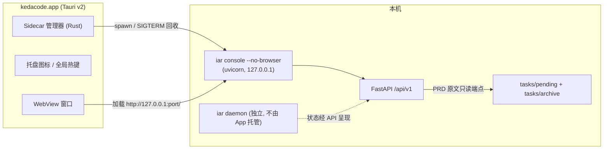

# PRD: Tauri 桌面 GUI —— 原生窗口浏览 PRD 与任务执行状态

本 PRD 分两层阅读：**Part A（人审层）** 供人决定"做不做、怎么做才对"，不含实现细节；**Part B（执行器层）** 供执行者（人或 Agent）落地实现。人只需审 Part A，并按 Part A 的指引在需要时下钻 Part B。

## Feature Overview (功能一览)

> 本块是第 10 节 Functional Requirements 的通俗投影，不是第二事实来源；行为验收以第 1 节的行为样例表为准。

- **一条命令装出桌面 App**（FR-1）：本机构建 `kedacode.app` 并装入应用目录，双击即用，全程不需要 Apple 开发者账号。
- **打开就是熟悉的管理控制台**（FR-2、FR-7）：窗口内容与 `iar console` 浏览器面板一致、数据同源；后端拉不起来时看到明确的错误提示，而不是白屏。
- **PRD 全文随手读**（FR-5、FR-6）：在 roadmap 列表点开任意 pending/archived PRD，直接阅读渲染后的完整 Markdown 原文，不用跳回编辑器翻文件。
- **用完即走，不留痕迹**（FR-3）：退出 App 时自动收回它拉起的后台服务；你自己独立运行的 `iar console` 不受任何影响。
- **Raycast 式呼出**（FR-4）：菜单栏常驻图标 + 全局热键，随时唤出窗口。
- **边界清晰**（FR-5、FR-8、§11）：PRD 接口只读且路径受限；本期不做 PRD 编辑、不做签名分发、不动既有 PyPI/Homebrew 链路，文档同步记录修订后的分发决策边界。

# Part A · 人审层 (Review Layer)

## 1. Introduction & Goals

### Problem Statement

kedacode 目前没有独立的桌面界面。用户要查看 PRD 或 agent 任务执行情况，只能执行 `iar console` 打开浏览器面板，或者干脆去编辑器里翻 `tasks/pending/` 的 Markdown 文件。两个可观察的现状事实：

- 浏览器控制台（`iar console` 启动）只展示 PRD 的元数据（标题、状态、验收清单计数等），**没有任何入口能看到 PRD 原文**，想读内容必须离开面板去打开文件。
- 仓库已有一条正式记录的分发决策（`tasks/pending/P1-FEAT-20260910-125248-iar-package-manager-distribution.md`）："不做 macOS / Windows 原生安装包，不做代码签名与公证"，其依据是 $99/年的开发者账号成本。该决策针对的是"向公开用户分发签名安装包"，并未覆盖"开发者本机构建自用"这条零成本路径。

用户（本项目的开发者本人）想要的是一个像 Raycast 那样的独立原生窗口：双击打开（或全局热键呼出），直接浏览 PRD 原文、看任务队列和执行状态，而不是每次先起命令行再开浏览器。

### Interpretation (解读回显)

**行为样例**（下表每一行会被逐字转录为 Part B 的验收判据——改正任何一格，就等于改正验收标准）：

| 输入 / 操作 | 期望观察到的结果 |
|---|---|
| 本机执行 GUI 构建命令（如 `install.sh --app` 或对应 just 命令） | 产出 `kedacode.app` 到用户应用目录，双击直接打开，全程不需要 Apple 开发者账号、不弹 Gatekeeper 拦截 |
| 打开 App | 原生窗口显示与浏览器控制台一致的 PRD roadmap 列表（来自 `tasks/pending/` + `tasks/archive/` 的真实数据） |
| 在 App 里点开某个 PRD | 看到该 PRD 的**完整 Markdown 原文渲染**，而不只是标题和状态 |
| 在 App 里查看任务执行情况 | 看到与 `curl` 控制台 API 返回一致的进程/队列/日志数据 |
| 边缘情况：本机已有一个独立运行的 `iar console`（占用默认端口）时再打开 App | App 自带的后端自动改用其它端口，两者互不干扰，各自可用 |
| 失败情况：App 自带的后端进程意外退出 | 窗口显示明确的"后端未运行"错误提示，而不是白屏或永久转圈 |
| 退出 App | 由 App 拉起的后端进程随之退出，`pgrep` 查不到残留进程；用户自己独立启动的 `iar console` 不受影响 |

**我默默定了这些**（有异议请直接指出）：

- 桌面壳里复用的是 **frontend-public 的控制台界面**（任务队列、roadmap、idea inbox 的真实 UI 都在这里），不是 frontend-admin——后者目前只是模板演示，没有接任何 agent-runner 接口。
- App 拉起的后台进程是 **`iar console` 的 HTTP 服务**（已有 `--no-browser` 参数），不是在 Rust 里内嵌 Python，也不是 agent 轮询 daemon；任务执行本身仍由现有 runner 进程机制负责，App 不托管 daemon。
- App 的窗口内容直接加载本机 HTTP 服务地址（界面和 API 同源），而不是把前端静态文件打包进 .app——这样以后改前端，桌面 App 不用重新构建就自动拿到新界面。
- 分发只走"本机构建自用"：不签名、不公证、不上 Homebrew cask；将来要向他人公开分发 GUI 时再单独决策 $99 签名。
- 菜单栏托盘图标 + 全局热键呼出纳入本期范围（这是"像 Raycast"体验的核心）。
- 新增的 PRD 原文接口是**只读**的，只允许读取 `tasks/pending/` 和 `tasks/archive/` 内的 `.md` 文件，拒绝任何目录穿越。

**我理解为不做**：

- 不推翻"不上 cask、不签名"的**公开分发**结论——本 PRD 只覆盖本机构建自用。
- 不在 GUI 里编辑 PRD（只读浏览；已有的启动/重试等操作按钮随控制台界面自然带入）。
- 不做 Windows / Linux 桌面包，不替换 `iar console` 浏览器入口（两者并存）。

**文字版解读**：把这件事读作"给 kedacode 加一个 Tauri 原生壳，壳内加载本机 console 服务提供的现有控制台界面，并补上 PRD 原文浏览这块缺失的能力"，而不是"重写一套桌面 UI"或"恢复此前被否决的签名安装包分发方案"。关键边界：桌面 App 只是 HTTP 客户端，不拥有任何业务状态；PRD 原文接口只读且路径受限；不引入签名/公证/cask。非目标：PRD 编辑、跨平台安装包、替换浏览器控制台。

### What The User Gets

开发者（也是本产品的用户）得到一个独立的 macOS 桌面应用：

- 双击图标或按全局热键呼出一个原生窗口，里面就是熟悉的管理控制台，不用再先开终端敲命令、再等浏览器打开。
- 在控制台里点任意 PRD，能直接读完整原文并跟随验收清单进度，不用跳回编辑器翻文件。
- 任务队列、执行进程、日志与浏览器版完全一致（同一个后端、同一份数据）。
- 菜单栏有常驻图标，关掉窗口后一键再呼出；不用 App 时，原有的 `iar console` 浏览器流程丝毫不受影响。

### Measurable Objectives

- 本机执行构建命令后产出 `.app`，双击可打开并显示真实 PRD 列表；全程无 Apple 开发者账号、无 Gatekeeper 拦截（构建产物不带 quarantine 属性）。
- App 内打开任一 pending/archived PRD，能看到完整渲染的 Markdown 原文（与磁盘文件内容一致）。
- App 任务页数据与 `curl http://127.0.0.1:<port>/api/v1/agent-runner/console/processes` 的返回一致。
- PRD 原文接口：对合法路径返回原文；对 `../` 目录穿越、非 `.md`、不在 `tasks/pending|archive` 白名单内的路径返回 4xx。
- 退出 App 后无残留的后端子进程（`pgrep -f` 验证）；与预先独立运行的 `iar console` 并存互不抢占端口。
- 以上行为经真实入口验证（真实构建的 App + 真实后端 + 真实 `tasks/` 数据），不接受纯单元测试充数。

## 2. Human Review Map (介入与风险地图)

本期只有三个决策需要人工确认，其余改动走自动门禁。

### 决策一：修订"不做原生 .app"的旧决策（仅限本机构建自用路线）

此前的分发 PRD 明确写下"不做原生安装包、不签名不公证"，理由是公开分发绕不开 $99/年的 Apple 开发者账号。本 PRD 不是推翻它，而是补上它没覆盖的一条缝：**开发者在本地用源码构建的 .app 不经过互联网下载，不带 quarantine 标记，Gatekeeper 不拦截，成本为零**。旧决策的前提（"目标用户必然是开发者"）反而支持这条路线——开发者自己构建自用，正是零成本场景。风险在于：这条缝如果被误读为"可以向公众分发未签名的 .app"，用户会在 Sequoia 上被 Gatekeeper 硬阻断，所以新决策必须把"仅限本机构建/install.sh 自用，公开分发仍需签名"写成显式边界。

**请确认：** 同意将旧决策修订为"不做签名安装包的公开分发；允许本机构建自用的未签名 .app"？

**验收：** roadmap 与相关文档同步记录修订后的决策边界；本机构建出的 .app 在一台未装开发证书的机器上双击直接打开。

### 决策二：桌面壳复用 frontend-public 控制台，而不是 frontend-admin

直觉上"admin 面板"像是桌面 GUI 的宿主，但仓库事实是反的：任务队列、roadmap、idea inbox 的真实界面全部在 frontend-public（`iar console` 服务的就是它）；frontend-admin 仍是脚手架模板，没接任何 agent-runner 接口。复用 frontend-public 意味着桌面 App 第一天就有全部既有功能，新增工作只有"PRD 原文详情"这一块界面。选 frontend-admin 则等于把整套控制台重写一遍。风险：frontend-public 同时承担"公开站点"和"控制台"两个角色，桌面化会让控制台角色更重——这是既有架构事实，本 PRD 不扩大它。

**请确认：** 桌面 GUI 以 frontend-public 控制台为界面载体，frontend-admin 本期不动？

**验收：** 构建出的 App 窗口里呈现的任务队列/roadmap 界面与 `iar console` 浏览器版一致，且包含新的 PRD 原文浏览入口。

### 决策三：新增"PRD 原文"只读接口的信任边界

让界面能读 PRD 原文，需要后端新增一个通过 HTTP 返回本地 Markdown 文件内容的接口。这本质上是"经 HTTP 读本地文件"，必须钉死边界：服务本就只监听 127.0.0.1（本机回环是唯一访问控制，这是仓库既有设计），新接口在此基础上再叠加三重限制——只读、只允许 `tasks/pending/` 与 `tasks/archive/` 两个目录、只允许 `.md` 后缀、拒绝目录穿越。不允许出现"传入任意绝对路径读任意文件"的形态。

**请确认：** 同意以上述四重边界（回环监听 + 只读 + 双目录白名单 + 拒绝穿越）新增 PRD 原文接口？

**验收：** 合法 PRD 路径返回与磁盘一致的原文；构造 `../` 穿越、绝对路径、非 `.md` 文件的请求一律返回 4xx，且有对应的自动化负向测试。

**自动门禁，不需要逐项人工审阅：** Tauri 子项目脚手架与构建、sidecar 进程生命周期（退出回收、端口共存）、前端 PRD 详情页与 Markdown 渲染、`install.sh` 新增本机构建分支、文档与导航同步、各层 lint/测试/构建管线。这些改动失败时局限在本功能内、可回滚，由针对性测试和构建门禁拦截。

**本次明确不涉及：** 无数据库结构变更；不改动 `iar daemon` 轮询循环；不改动 Homebrew tap / PyPI 既有分发链路；不做 Windows/Linux 包；不做 PRD 编辑。

## 3. Usage And Impact After Implementation

- **本机开发者（主要用户）：** 构建一次后，`~/Applications/kedacode.app` 双击即用；窗口内浏览 PRD 列表、点开读原文、看任务队列与日志；全局热键/菜单栏图标随时呼出。日常流程从"终端 → `iar console` → 浏览器"变成"热键呼出"。
- **CLI / 浏览器控制台用户：** 完全不变。`iar console` 照旧启动并打开浏览器；桌面 App 与浏览器面板只是同一后端的两个客户端，数据一致。新增接口为纯增量，不改动任何既有端点行为。
- **API 调用方（脚本/未来的 Raycast 扩展）：** 多一个只读的 PRD 原文端点可用；既有契约不变。
- **分发维护者：** `install.sh` 增加一个本机构建分支（可选参数，默认行为不变）；发布流水线（PyPI + tap）不受影响，Release 产物不新增签名安装包。
- **兼容性影响：** 无破坏性变更；新增可选命令行参数与接口均有安全默认值；不引入新的必填配置。

## 4. Requirement Shape

- **actor:** 本机开发者（桌面 App 用户）；次要：CLI 用户、API 调用方、分发维护者
- **trigger:** 用户希望在独立原生窗口中浏览 PRD 原文与任务执行状态，且不产生签名/分发成本
- **expected behavior:** 一条命令本机构建出免签名可用的桌面 App；App 自带本机后端 sidecar，界面与既有控制台一致并新增 PRD 原文浏览；退出无残留；与独立运行的 console 并存
- **explicit scope boundary:** 仅限 macOS 本机构建自用；不做签名/公证/cask；PRD 只读；不托管 agent daemon

# Part B · 执行器层 (Build Layer)

## 5. Repository Context And Architecture Fit

**现有模块与最近路径：**

- 组合根：`src/backend/api/app.py`（FastAPI app，挂载 5 个 router 后将 `backend.api.static/console` 静态目录挂在 `/`）。
- HTTP 服务入口：`src/backend/api/cli_typer_console.py` —— `iar console` 用 uvicorn 跑 `backend.api.app:app`，固定监听 `127.0.0.1`，默认端口 8313（占用时自动向后扫最多 20 个），**已有 `--no-browser` 参数**（`launch_console(..., open_browser=not no_browser)`）。
- 注意：`iar daemon` 是 agent 轮询循环，**不**提供 HTTP；桌面 App 的 sidecar 是 console 服务，不是 daemon。
- PRD 元数据接口已存在：`GET /api/v1/agent-runner/roadmap/prds`（`src/backend/api/routes/agent_runner_roadmap.py`），扫描逻辑在 `src/backend/core/use_cases/roadmap_prd_scanner.py`（`_DEFAULT_PRD_DIRS = ("tasks/pending", "tasks/archive")`）。**缺口：没有任何接口返回 PRD 原文。**
- roadmap 路由已有 base64url 编码路径的先例：`POST /roadmap/prds/{encoded_path}/start`——新原文接口复用同一编码约定。
- 控制台 UI 在 frontend-public（Next.js 静态导出，`output: "export"`，`trailingSlash: true`），API 客户端在 `frontend-public/lib/api/`（`roadmap.ts`、`agentRunner.ts`、`console.ts`、`ideaInbox.ts`），axios `baseURL: "/api"` 相对路径、同源调用。无 WebSocket/SSE，日志与概览均为轮询。
- frontend-admin 是 React+Vite 模板，未接 agent-runner，本期不动。
- 鉴权：本机单用户信任模型，`/api/auth/*` 是显式桩（`src/backend/api/routes/local_auth.py`）；无 CORS 中间件；唯一签名接口是 idea-inbox webhook。
- 分发：`install.sh`（仓库根，用户入口）经 uv/pipx 安装 `kedacode` 包；Homebrew tap 在外部仓库由 CI 更新；`packaging/keda-code/` 只是 PyPI 占位名。无任何 .app 产物处理。

**架构约束：**

- 四层依赖方向 `api -> core -> engines -> infrastructure` 不可破；PRD 原文读取属于 core 用例（读文件走既有基础设施/标准库方式，与 `roadmap_prd_scanner.py` 同级）。
- Python 文本 I/O 显式 `encoding="utf-8"`；公共 API 用 Google Style 中文 docstring。
- 前端公共函数/类需 JSDoc/TSDoc（中文）。
- `frontend-public/AGENTS.md`：该 Next.js 版本有破坏性变更，写代码前必须读 `node_modules/next/dist/docs/` 对应指南。
- `install.sh` 既有不变量：不用 sudo、不碰系统包管理器——本机构建分支同样遵守（拷贝到 `~/Applications`，无需 sudo）。

**相关 PRD 关系：**

- `tasks/pending/P1-FEAT-20260910-125248-iar-package-manager-distribution.md`：本 PRD **修订**其"不做原生 .app"结论的边界（仅限公开分发场景）；其 §7.10 的签名/Gatekeeper 核实事实被本 PRD 继承引用，不构成重复。
- `tasks/pending/P1-FEAT-20260910-111901-iar-console-bundled-web-terminal.md`：已落地的 `iar console`（wheel 内置控制台 + 一键启动）是本 PRD 的直接底座——sidecar 复用它，界面复用它服务的静态导出。
- 原 Tauri 桌面安装包 PRD（`P1-FEAT-20260910-114319`）已被删除，本 PRD 是不同前提（零签名、本机构建）下的新提案，非恢复旧案。
- 无其他 pending PRD 与本提案重复或阻塞；roadmap.md 开放问题"交互终端和前端 Dashboard 的边界如何划分"由本 PRD 部分回答（桌面壳与浏览器面板同为 console 服务的客户端）。

## 6. Recommendation

**Recommended Approach：Tauri v2 壳 + 复用 console 服务同源界面 + 只读 PRD 原文接口 + 本机构建分发。**

1. 新增 `desktop/` Tauri v2 子项目：WebView 直接加载 `http://127.0.0.1:<port>/`（sidecar 同源地址），Rust 侧负责拉起/回收 sidecar 子进程（`iar console --no-browser`）、菜单栏托盘、全局热键。
2. 后端新增只读端点 `GET /api/v1/agent-runner/roadmap/prds/{encoded_path}/content`，复用既有 base64url 路径编码与 `tasks/pending|archive` 扫描边界，返回 Markdown 原文。
3. frontend-public 新增 PRD 详情视图（Markdown 渲染），API 客户端 `lib/api/roadmap.ts` 增加对应方法；因界面同源加载，桌面 App 自动获得该能力。
4. `install.sh` 增加可选 `--app` 分支：本机构建 .app 并拷贝到 `~/Applications`（遵守无 sudo 不变量）；配套 `just` 命令。

**为什么最贴合现有架构：** sidecar 就是现有 `iar console`，界面就是现有静态导出，新增的只有"壳"和"一个只读端点"；App 不拥有状态，四层架构零侵入。

**拒绝的冗余抽象：** 不新建独立 GUI 技术栈（PyQt/PySide6 需重写全部界面）；不把静态文件打包进 .app 走自定义协议（会失去"前端更新、壳免重建"）；不在 Rust 内嵌 Python 运行时；不新增 WebSocket（现有轮询已够）。

### Proposed Solution Summary (实现机制)

核心机制：Tauri 壳启动时用子进程拉起 `iar console --no-browser`（显式指定空闲端口，端口由壳分配），窗口加载该回环地址——界面（静态导出）与 API 天然同源，前端相对 `baseURL: "/api"` 无需任何改动。PRD 原文由新只读端点提供：客户端传入与既有 start 接口相同的 base64url 编码相对路径，core 用例校验其解析后落在 `tasks/pending/` 或 `tasks/archive/` 内且后缀为 `.md`，以 `utf-8` 读出原文返回。sidecar 生命周期绑定 App 生命周期（App 退出时终止子进程；独立启动的 console 进程不受管理）。分发形态：构建产物仅供本机，`install.sh --app` 本地执行 `tauri build` 并拷贝至 `~/Applications`。刻意避开的复杂度：无新增存储、无新状态机、无打包进壳的前端副本、无签名流水线。

### Alternatives Considered

| 备选 | 结论 | 理由 |
|---|---|---|
| PyQt / PySide6 原生重写 | 拒绝 | 抛弃已有前端全部重写；打包 150MB+；$99 签名问题一分不省；PyQt 还有 GPL/商业许可问题 |
| pywebview（纯 Python 壳） | 拒绝 | 窗口管理/托盘/全局热键能力弱，分发仍绕不开 PyInstaller 打包痛点 |
| Electron | 拒绝 | 产物体积与内存占用大，相对 Tauri 无能力增益 |
| 复用 frontend-admin 做壳内界面 | 拒绝 | 其未接任何 agent-runner 接口，等于重写整套控制台 |
| 静态文件打包进 .app（自定义协议） | 拒绝 | 前端每次更新都要重建壳；同源加载方案零代价获得更新 |
| 立即签名 + brew cask 公开分发 | 拒绝（暂缓） | $99/年成本对"自用"阶段无收益；架构上不返工，将来补签名只是流水线加步骤 |

## 7. Implementation Guide

> This section is a living implementation guide based on current repository analysis. If implementation discovers additional affected files, hidden dependencies, edge cases, or a better path, update this PRD before proceeding.

### Core Logic

数据流：`desktop/` 壳 → 子进程 `iar console --no-browser --port <分配端口>` → uvicorn 服务 `backend.api.app:app` → WebView 加载 `http://127.0.0.1:<port>/` → 静态导出页面经同源 `/api/*` 调后端 → 新端点 `/api/v1/agent-runner/roadmap/prds/{encoded_path}/content` 走 core 用例读 `tasks/pending|archive/*.md` 原文返回 → 前端 PRD 详情视图渲染 Markdown。

控制流：壳负责端口分配（复用 console 的端口扫描逻辑或自行探测后显式传 `--port`）、子进程stdout 健康探测、退出时 SIGTERM 回收；后端无状态时，sidecar 崩溃由前端错误页呈现"后端未运行"。

### Change Impact Tree

```text
.
├── src/backend/
│   ├── api/routes/agent_runner_roadmap.py
│   │   [修改]
│   │   【总结】新增 PRD 原文只读端点，复用既有 base64url 路径编码约定
│   │   ├── 新增 GET /roadmap/prds/{encoded_path}/content，返回 Markdown 原文（text/plain 或结构化 JSON）
│   │   ├── 路径非法/越界/非 .md 返回 4xx，语义与既有 start 端点的路径解码错误处理对齐
│   │   └── 锚点：现有 @router.post("/roadmap/prds/{encoded_path}/start") 附近；rg -n "encoded_path" src/backend/api/routes/agent_runner_roadmap.py
│   ├── core/use_cases/roadmap_prd_scanner.py（或同目录新文件 prd_content.py）
│   │   [修改]/[新增]
│   │   【总结】新增 PRD 原文读取用例：解码→解析为绝对路径→校验落在 tasks/pending|archive 内且 .md→utf-8 读取
│   │   ├── 白名单目录复用 _DEFAULT_PRD_DIRS，不复制常量
│   │   ├── resolve() 后做目录归属校验，拒绝符号链接逃逸与目录穿越
│   │   └── 文件不存在/不可读返回明确的领域错误，由 api 层映射 4xx
│   └── api/cli_typer_console.py
│       [修改]（可选小改）
│       【总结】sidecar 场景支持显式 --port 时输出机器可读的监听行，供壳探测实际端口
│       └── 既有 --no-browser 直接复用，不改默认行为
├── frontend-public/
│   ├── lib/api/roadmap.ts
│   │   [修改]
│   │   【总结】新增 getPrdContent(encodedPath) 客户端方法，类型与既有 roadmap API 风格一致
│   ├── app/（roadmap 相关路由目录，按 frontend-public/AGENTS.md 要求先读 node_modules/next/dist/docs/ 对应指南）
│   │   [新增]/[修改]
│   │   【总结】PRD 详情视图：从列表进入，渲染 Markdown 原文，保留返回列表导航
│   │   ├── 详情页/抽屉组件 + 加载/错误态（后端不可达时显示明确错误而非空白）
│   │   └── 锚点：rg -n "roadmap" frontend-public/app frontend-public/components
│   └── package.json
│       [修改]
│       【总结】新增 Markdown 渲染依赖（如 react-markdown 系，选型时核对 Next 版本兼容性）
├── desktop/（新增 Tauri v2 子项目，独立 package，参照 tests/playwright-e2e/ 的独立 TS 包模式）
│   ├── src-tauri/src/main.rs（或 lib.rs）
│   │   [新增]
│   │   【总结】壳逻辑：分配空闲端口→spawn sidecar（iar console --no-browser --port N）→健康探测→创建窗口加载回环地址→托盘与全局热键→退出回收子进程
│   │   ├── sidecar 查找顺序：PATH 中的 iar → 常见 pipx/uv 安装位置（~/.local/bin/iar）
│   │   ├── sidecar 不可启动时窗口显示错误页（不白屏）
│   │   └── 全局热键/托盘用 tauri 官方插件
│   ├── src-tauri/tauri.conf.json
│   │   [新增]
│   │   【总结】应用标识、bundle 目标（macOS app）、窗口与安全策略（仅允许访问 127.0.0.1 回环地址）
│   └── package.json / just 集成
│       [新增]
│       【总结】pnpm + tauri CLI 脚本（dev/build），遵循仓库 uv/just 工具链习惯
├── install.sh（仓库根；与 scripts/install/install.sh 的关系先核实，以根 install.sh 为用户入口）
│   [修改]
│   【总结】新增可选 --app 分支：本机执行 tauri build 并拷贝产物到 ~/Applications，无 sudo、默认行为不变
├── justfile
│   [修改]
│   【总结】新增 app 相关 recipe（如 just app build / dev），复用现有前端 recipe 风格
├── tests/
│   ├── test_roadmap_prd_content.py（新增，与既有 roadmap 用例测试同目录同风格）
│   │   [新增]
│   │   【总结】core 用例 + api 端点测试：合法原文往返、目录穿越/绝对路径/非 .md/越界符号链接全部 4xx
│   └── playwright-e2e/tests/（新增 PRD 详情 spec，走真实栈）
│       [新增]
│       【总结】真实浏览器打开 roadmap→进入 PRD 详情→断言渲染的原文标题与磁盘文件一致
├── docs/ + mkdocs.yml
│   [修改]
│   【总结】新增桌面 GUI 使用文档页并登记导航；README 安装段补一条本机构建说明
└── roadmap.md
    [修改]
    【总结】修订"不做原生 .app"表述为"不做签名安装包公开分发；允许本机构建自用"，并登记桌面 GUI 能力
```

以上为起点而非穷尽清单；发现隐藏引用时按下方 Drift Guard 处理。

### Risk Classification Register

| change point | tier | decisive dimension/override | intervention | oracle/gate |
|---|---|---|---|---|
| 修订分发决策文档边界 | R1 | 文档语义，可即时回滚 | 人工确认（决策一，策略边界）+ rv-2 佐证 | rv-2 |
| 壳内界面载体选型（frontend-public） | R1 | 复用既有界面，失败局限本功能 | 人工确认（决策二，产品形态） | rv-2 |
| PRD 原文只读端点（信任边界：HTTP 读本地文件） | R2 | 安全/信任边界（固定区） | 人工确认（决策三）+ 强判据 | rv-1 |
| Tauri 壳 + sidecar 生命周期/端口共存 | R2 | 跨组件运行行为：孤儿进程、端口冲突影响本机其它服务 | 执行器 + 强判据 | rv-3 |
| 前端 PRD 详情视图 + Markdown 渲染 | R1 | 单一前端功能内 | 执行器 + 失败可判别测试 | rv-4 |
| console `--no-browser`/端口输出复用与小改 | R0 | 既有参数，行为不变 | 执行器 + 既有 CLI 测试 | 既有测试 + rv-3 |
| install.sh `--app` 分支 | R1 | 可选分支，默认路径不变；拷贝限 `~/Applications` | 执行器 + 手动真实构建 | rv-2 覆盖 |
| desktop/ 脚手架、just/docs/roadmap 更新 | R0 | 机械新增 | 执行器 + 构建/lint 门禁 | `just lint`、构建命令 |

### Executor Drift Guard

- 路由注册核对：`rg -n "include_router" src/backend/api/app.py`
- base64url 编解码既有实现：`rg -n "urlsafe_b64|base64url|encoded_path" src/backend/`
- console 端口扫描逻辑：`rg -n "resolve_console_port|_CONSOLE_DEFAULT_PORT" src/backend/`
- frontend-public 的 roadmap 页面与组件：`rg -n "roadmap" frontend-public/app frontend-public/components frontend-public/lib`
- frontend-public Next 版本与文档：`cat frontend-public/package.json` 后读 `frontend-public/node_modules/next/dist/docs/` 对应篇章（该目录 AGENTS.md 强制要求）
- 两份 install.sh 差异：`diff install.sh scripts/install/install.sh`（以根 install.sh 为用户入口，另一份若为模板需同步或注明）
- 若上述搜索暴露清单外文件，先更新本 PRD 的 Change Impact Tree 再动手。

### Flow / Architecture Diagram



### ER Diagram

No data model changes in this PRD.

### Low-Fidelity Prototype

```text
┌────────────────────────── kedacode ───────────────────────────┐
│ [Roadmap] [任务] [Idea Inbox]            ● 后端已连接 :8313    │
├────────────────────────────┬──────────────────────────────────┤
│ PRD 列表 (pending/archive) │  PRD 原文 (Markdown 渲染)         │
│ ┌────────────────────────┐ │  ┌──────────────────────────────┐ │
│ │● tauri-desktop-gui     │ │  │ # PRD: Tauri 桌面 GUI …      │ │
│ │  P1 FEAT  清单 3/24    │ │  │                              │ │
│ ├────────────────────────┤ │  │ ## 1. Introduction …         │ │
│ │○ agent-cli-adapter…    │ │  │ (渲染原文全文)               │ │
│ └────────────────────────┘ │  └──────────────────────────────┘ │
├─────────────────────────────────────────────────────────────────┤
│ 任务执行: 3 运行中 / 1 失败   [查看进程与日志 →]                │
└─────────────────────────────────────────────────────────────────┘
  菜单栏: ⚡ kedacode  [呼出窗口 ⌘⇧K] [打开浏览器控制台] [退出]
```

### Realistic Validation Plan

```yaml
oracles:
  - id: rv-1
    behavior: PRD 原文只读接口对合法路径返回与磁盘一致的 Markdown 原文，对穿越/越界/非 .md 一律 4xx
    real_entry: "iar console --no-browser --port 8313 启动后：curl -s http://127.0.0.1:8313/api/v1/agent-runner/roadmap/prds/<base64url(tasks/pending/本PRD文件名)>/content"
    expected: "HTTP 200，正文与 tasks/pending/ 下该文件逐字节一致；以 ../ 穿越、绝对路径、.py 后缀构造的编码路径均返回 4xx"
    mock_boundary: "后端与文件系统必须真实；不 mock 路径校验；测试仓库 tasks/ 数据用真实文件"
    tier: R2
    test_layer: integration
    required_for_acceptance: true
    critical_value_source: "encoded_path 必须来自 GET /roadmap/prds 列表响应中的真实条目，而非手工构造"
    must_cross: "HTTP 请求 -> api 路由 -> core 用例路径校验 -> 真实文件系统读取 -> HTTP 响应"
    forbidden_bypasses: "禁止直接调用 core 函数代替 HTTP；禁止临时往 tasks/pending 塞测试文件后冒充真实条目（fixture 文件须显式命名并在用例内创建/清理）"
    fresh_state_probe: "第二个独立 curl 进程重新请求同一端点，结果一致；修改磁盘文件后新请求反映新内容"
    final_tree_evidence: "证据采集于最终端点实现提交之后；端点代码或路径校验逻辑任何后续改动须重跑"
    negative_control: "在实现前的代码树上运行同一 curl（端点不存在）返回 404；pytest 中对穿越用例断言 4xx 在实现前失败"
    expected_fail: "实现前：合法路径 404；若路径校验被删除，穿越用例返回 200 即判据变红"
  - id: rv-2
    behavior: 本机一条命令构建出免签名 .app，双击打开后窗口显示真实 PRD 列表与任务数据（佐证决策一与决策二）
    real_entry: "install.sh --app（或 just app build）构建并安装到 ~/Applications 后，双击 ~/Applications/kedacode.app"
    expected: "无 Gatekeeper 拦截（本机构建无 quarantine：xattr ~/Applications/kedacode.app 无 com.apple.quarantine）；窗口加载出与 iar console 浏览器版一致的控制台，PRD 列表含 tasks/pending 真实条目"
    mock_boundary: "构建、App、后端、tasks/ 数据全部真实；不 stub 任何 HTTP"
    tier: R2
    test_layer: manual
    required_for_acceptance: true
    critical_value_source: "窗口中显示的 PRD 标题必须与 curl 同端口 /roadmap/prds 响应中的标题一致"
    must_cross: "Finder 双击 -> Tauri 壳 -> sidecar spawn -> uvicorn 监听 -> WebView 加载 -> 同源 /api 请求 -> 真实 tasks/ 扫描"
    forbidden_bypasses: "禁止用 pnpm tauri dev 的开发服务器代替正式构建产物；禁止手工 xattr -d 移除 quarantine 后声称免拦截"
    fresh_state_probe: "完全退出 App 后重新双击打开，列表数据与当前磁盘 tasks/ 状态一致"
    final_tree_evidence: "证据须来自最终 desktop/ 与 install.sh 代码树构建的产物；二者任一改动须重建重验"
    negative_control: "实现前执行 install.sh --app：参数不存在，脚本按既有未知参数行为报错退出——即该入口此前不可用"
    expected_fail: "实现前 --app 报未知参数；若壳未配置正确 CSP/地址，窗口白屏即红"
  - id: rv-3
    behavior: App 退出回收 sidecar 子进程，且与独立运行的 iar console 并存不抢端口
    real_entry: "先独立运行 iar console（占 8313），再打开 kedacode.app；随后退出 App"
    expected: "App 内功能正常（sidecar 用了其它端口）；退出 App 后 pgrep -f 'iar console --no-browser' 无残留；独立 console 进程仍在且可访问"
    mock_boundary: "全部真实进程；不允许用 mock 进程代替 uvicorn"
    tier: R2
    test_layer: manual
    required_for_acceptance: true
    critical_value_source: "App 实际使用端口须来自 sidecar 输出的监听行或壳的端口分配日志"
    must_cross: "壳端口分配 -> sidecar 绑定 -> App 退出信号 -> 子进程 SIGTERM -> 进程表验证"
    forbidden_bypasses: "禁止用 pkill 无差别清理后声称无残留；必须区分 App 子进程与用户独立进程"
    fresh_state_probe: "退出后新开 shell 执行 pgrep 验证；独立 console 用 curl /api/auth/me 验证存活"
    final_tree_evidence: "证据采集于最终 sidecar 生命周期代码；回收逻辑改动须重验"
  - id: rv-4
    behavior: 前端 PRD 详情视图在真实浏览器中渲染真实 PRD 原文
    real_entry: "just e2e（真实栈）中新增 spec：打开 roadmap 页 -> 点击一个 PRD -> 详情视图"
    expected: "详情视图渲染出的 H1 与磁盘 tasks/pending/ 对应文件首行标题一致"
    mock_boundary: "后端真实；可复用 e2e 既有真实 tasks/ 数据，不 stub PRD 内容接口"
    tier: R1
    test_layer: e2e
    required_for_acceptance: true
```

失败排查提示：rv-1 先查 `encoded_path` 解码与 `_DEFAULT_PRD_DIRS` 白名单归属校验；rv-2 先查 sidecar 端口（`iar console listening on` 输出）与 WebView 加载地址是否同源、再查 `xattr` 是否因经过网络下载环节被重新打上 quarantine；rv-3 先查壳退出时是否只对子进程 PID 发 SIGTERM；rv-4 失败先按 `frontend-public/AGENTS.md` 核对 Next 版本专属 API。

### Interactive Prototype Change Log

No interactive prototype file changes in this PRD.

### External Validation

本 PRD 未新增联网核实；签名/Gatekeeper/Homebrew cask 的外部事实继承自已核实来源：`tasks/pending/P1-FEAT-20260910-125248-iar-package-manager-distribution.md` §7.10（核实日期 2026-09-10）。本 PRD 的前提（本机构建产物无 quarantine）属于 macOS 本地行为，由 rv-2 的真实构建验证兜底，不依赖二手结论。

## 8. Delivery Dependencies

### Delivery Dependencies

- Group: none
- Depends on tasks/issues:
  - none
- Gate type: none
- Notes: 底座 `iar console`（PRD P1-FEAT-20260910-111901）能力已在代码库中可用，无阻塞依赖；与 P1-FEAT-20260910-125248 是决策修订关系而非执行依赖。

## 9. Acceptance Checklist

验收证据包按风险排序呈现：人工确认项与高层级判据在前，普通门禁折叠在后。所有证据须在最终代码树上采集；相关代码后续改动使对应证据失效，须重验后方可归档。

### Human-Confirmed

- [ ] （决策一）roadmap.md 与决策日志记录修订后边界——"不做签名安装包公开分发；允许本机构建自用"；rv-2 证据显示本机构建 .app 双击直开、`xattr` 无 `com.apple.quarantine`
- [ ] （决策二）rv-2 证据显示 App 窗口呈现与 `iar console` 浏览器版一致的任务队列/roadmap 界面，且含 PRD 原文入口；frontend-admin 无任何改动（`git diff --stat frontend-admin/` 为空）
- [ ] （决策三）rv-1 证据显示合法路径原文与磁盘逐字节一致，且目录穿越/绝对路径/非 `.md` 请求全部 4xx（含自动化负向测试记录）

### Architecture Acceptance

- [ ] 新增端点经 api -> core 分层落地，无跨层直连（`rg -n "content" src/backend/api/routes/agent_runner_roadmap.py` 与 core 用例对应）
- [ ] 目录白名单复用 `_DEFAULT_PRD_DIRS`，无第二份硬编码常量（`rg -n "tasks/pending" src/backend/core/use_cases/`）
- [ ] desktop/ 不引入任何业务状态，仅做进程管理与窗口加载

### Behavior Acceptance

- [ ] rv-3 证据：与独立 `iar console` 并存不抢端口；退出 App 后 `pgrep -f 'iar console --no-browser'` 无残留且独立进程存活
- [ ] sidecar 不可启动时窗口显示明确错误页（非白屏/永久加载）——附截图并标注验证层级
- [ ] `iar console` 默认行为（自动开浏览器）不变——既有 CLI 测试通过

### Frontend Acceptance

- [ ] rv-4 证据：`just e2e` 中 PRD 详情 spec 通过，渲染 H1 与磁盘文件标题一致
- [ ] frontend-public 构建通过（`pnpm --filter frontend-public build`），静态导出仍被 FastAPI 正常挂载

### Documentation Acceptance

- [ ] docs/ 新增桌面 GUI 使用页并登记 `mkdocs.yml` 导航；README 安装段补充本机构建说明
- [ ] roadmap.md 完成决策修订表述更新

### Validation Acceptance

- [ ] rv-1（integration，真实 HTTP + 真实文件系统）通过，含实现前 404 的红色对照记录
- [ ] rv-2（manual，真实构建产物 + 真实双击入口）通过，截图证据标注验证层级为真实入口验证
- [ ] rv-3（manual，真实进程）通过
- [ ] rv-4（e2e，`just e2e` 真实栈）通过
- [ ] `just lint` 与后端测试套件全绿

### Delivery Readiness

- [ ] 推荐方案全部落地，无遗留临时兼容层或"二期再补"项
- [ ] 独立 verifier Agent 审查通过
- [ ] 归档前完成 Section 13 Final Reconciliation，正文无与最终实现矛盾的表述

## 10. Functional Requirements

- FR-1: 提供一条本机命令（`install.sh --app` 及对应 just recipe）构建并安装 `kedacode.app` 至 `~/Applications`，不使用 sudo，不改变 install.sh 默认行为。
- FR-2: App 启动时自动拉起 `iar console --no-browser` 作为 sidecar（显式分配空闲端口），窗口加载其回环地址；sidecar 不可用时窗口显示明确错误页。
- FR-3: App 退出时回收其拉起的 sidecar 子进程；用户独立启动的 console 进程不受管理、不受影响。
- FR-4: App 提供菜单栏托盘图标与全局热键呼出窗口。
- FR-5: 新增只读端点 `GET /api/v1/agent-runner/roadmap/prds/{encoded_path}/content`：对落在 `tasks/pending/` 或 `tasks/archive/` 内的 `.md` 文件返回 utf-8 原文；其余路径（穿越、绝对路径、非 `.md`、符号链接逃逸）返回 4xx。
- FR-6: frontend-public 新增 PRD 详情视图：从 roadmap 列表进入，渲染 Markdown 原文，含加载与错误态。
- FR-7: 桌面 App 与浏览器控制台共享同一后端与数据，互不干扰；`iar console` 既有行为不变。
- FR-8: 文档（docs/、mkdocs.yml、README、roadmap.md）同步记录桌面 GUI 用法与修订后的分发决策边界。

## 11. Non-Goals

- 不做代码签名与公证；不上 Homebrew cask；不在 Release 流水线产出任何安装包。
- 不做 Windows / Linux 桌面包。
- 不做 PRD 编辑、写作或状态流转操作（沿用既有只读浏览 + 控制台已有动作）。
- 不托管或改造 `iar daemon` 轮询循环；不改动 agent runner 执行机制。
- 不改动 frontend-admin；不改动 PyPI / Homebrew tap 既有分发链路。
- 不引入 WebSocket/SSE（沿用现有轮询）。

## 12. Risks And Follow-Ups

- 风险：Tauri/Rust 工具链首次引入仓库，构建环境要求（Xcode CLT、Rust）须写入文档；CI 不构建 .app，仅本机构建。
- 风险：sidecar 依赖用户已安装 `iar`（pipx/uv 路径探测），未安装时的引导文案需清晰；该路径在 rv-2 真实环境验证。
- 后续（非本期）：若未来要向他人公开分发 GUI，回到 $99 签名 + 公证 + cask 决策，届时仅在构建流水线加步骤，架构不返工。
- 后续（非本期）：Raycast 扩展可作为第二个 HTTP 客户端另行立项，与本 PRD 无依赖。

## 13. Decision Log

| ID | 决策问题 | Chosen | Rejected | Rationale |
|---|---|---|---|---|
| D-01 | 桌面壳技术选型 | Tauri v2 | PyQt/PySide6 原生重写；pywebview；Electron | 现有 React 界面可整体复用，产物小，sidecar 模型与 console 服务天然契合；重写或弱能力壳都要付出更大代价 |
| D-02 | 壳内界面载体 | frontend-public 控制台（同源加载 sidecar 地址） | frontend-admin；静态文件打包进 .app | 任务队列/roadmap 真实 UI 只在 frontend-public；同源加载让前端更新免重建壳 |
| D-03 | sidecar 形态 | 子进程 `iar console --no-browser` | Rust 内嵌 Python 运行时；App 托管 daemon | console 已有 `--no-browser` 与端口扫描，零改造复用；daemon 职责独立不应混入 GUI 生命周期 |
| D-04 | 分发策略 | 本机构建 + install.sh，不签名不上 cask | 立即 $99 签名 + cask 公开分发 | 本机构建产物无 quarantine、零成本覆盖自用场景；签名留待公开分发时补且不返工 |
| D-05 | PRD 原文获取方式 | 新增只读 HTTP 端点（base64url 路径 + 白名单校验） | WebView 直读文件系统；扩展现有元数据端点塞全文 | 壳只有 HTTP 通道；独立只读端点信任边界清晰，且与既有 start 端点编码约定一致 |
| D-06 | 修订旧分发决策的方式 | 新 PRD 显式修订边界（仅限公开分发场景不适用） | 静默绕过旧决策；恢复已删除的旧 Tauri PRD | 旧决策的核实事实仍有效，只有"本机构建自用"这一缝隙未被覆盖，须显式修订而非回避 |

### Final Reconciliation

- 待归档前填写。须按模板核对：Interpretation、Public behavior and contracts、Related PRD status、Requirements and risks，以及 `Feature Overview (功能一览)` 投影——每个 `FR-n` 仍被至少一条 bullet 锚定、每条 bullet 仍与交付行为一致；Reconciled differences 逐条列出已在正文修正的差异。
