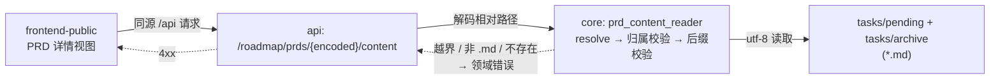

# PRD: 控制台内直接阅读 PRD 原文

本 PRD 分两层阅读：**Part A（人审层）** 供人决定"做不做、怎么做才对"，不含实现细节；**Part B（执行器层）** 供执行者（人或 Agent）落地实现。人只需审 Part A，并按 Part A 的指引在需要时下钻 Part B。

## Feature Overview (功能一览)

> 本块是第 10 节 Functional Requirements 的通俗投影，不是第二事实来源；行为验收以第 1 节的行为样例表为准。

- **点开就能读全文**（FR-2）：在控制台的 roadmap 列表里点任意 pending / archived PRD，直接看到渲染后的完整 Markdown 原文，不用切回编辑器翻文件。
- **只读且路径受限**（FR-1）：新接口只允许读 `tasks/pending/` 与 `tasks/archive/` 下的 `.md` 文件，拒绝目录穿越、绝对路径与符号链接逃逸。
- **读不到时有明确提示**（FR-3）：后端不可达或文件读取失败时显示错误态，而不是白屏或永久转圈。
- **不动既有任何东西**（§11）：纯增量接口，既有端点行为不变；不引入桌面壳、不碰分发链路。

# Part A · 人审层 (Review Layer)

## 1. Introduction & Goals

### Problem Statement

控制台（`iar console` 服务的 frontend-public 面板）的 roadmap 页只展示 PRD 的**元数据**——标题、优先级、类型、验收清单计数、状态。想读 PRD 内容必须离开面板，去编辑器里打开 `tasks/pending/` 下的文件。

两个已核实的现状事实（2026-09-13 对着代码核过）：

- `src/backend/api/routes/agent_runner_roadmap.py` 现有端点只有 `GET /roadmap/prds`、`GET /roadmap/settings`、`POST /roadmap/prds/{encoded_path}/start`、`POST /roadmap/start-global`、`POST /roadmap/stop-global`——**没有任何一个返回 PRD 原文**。
- 扫描逻辑 `src/backend/core/use_cases/roadmap_prd_scanner.py` 已经在读这些文件（`_DEFAULT_PRD_DIRS = ("tasks/pending", "tasks/archive")`）解析元数据，但只把解析结果吐出来，原文丢弃。

这是一个真实缺口：面板已经知道每个 PRD 在哪个文件，却不提供读它的入口。

### Interpretation (解读回显)

**行为样例**（下表每一行会被逐字转录为 Part B 的验收判据——改正任何一格，就等于改正验收标准）：

| 输入 / 操作 | 期望观察到的结果 |
|---|---|
| 在控制台 roadmap 列表点开一个 pending PRD | 看到该文件**完整 Markdown 原文的渲染结果**，与磁盘内容一致，而不只是标题和状态 |
| 点开一个 archived PRD | 同上，`tasks/archive/` 下的文件同样可读 |
| 直接请求接口，传入从列表响应里拿到的编码路径 | HTTP 200，正文与磁盘文件逐字节一致（含 UTF-8 中文） |
| 边缘情况：PRD 文件名含中文或空格 | 正常返回，编码/解码不丢字符 |
| 失败情况：构造 `../` 目录穿越、绝对路径、或 `.py` 后缀的编码路径 | 一律 4xx，且不返回任何文件内容 |
| 失败情况：编码路径指向一个已被删除的 PRD | 4xx 并带明确错误信息，不是 500 |
| 失败情况：前端请求时后端不可达 | 详情视图显示明确错误态，不是白屏或永久加载中 |

**我默默定了这些**（有异议请直接指出）：

- 接口是**只读**的。不提供任何写入、编辑、重命名 PRD 的能力。
- 路径编码复用既有约定：`POST /roadmap/prds/{encoded_path}/start` 已经用 base64url 编码相对路径（`agent_runner_roadmap.py` 的 `_encode_prd_path` / `_decode_prd_path`），新接口用同一套，不发明第二种。
- 目录白名单复用 `roadmap_prd_scanner.py` 的 `_DEFAULT_PRD_DIRS`，不复制第二份常量。
- 前端落在 **frontend-public**（控制台 UI 的真实所在），不是 frontend-admin（仍是未接任何 agent-runner 接口的模板）。
- 渲染 Markdown 需要新增一个前端依赖（frontend-public 目前**没有**任何 markdown/remark/mdx 依赖，已核实）。
- 详情视图的形态（独立路由页 or 抽屉/分栏）留给执行器按 frontend-public 既有 roadmap 页结构决定，不在本 PRD 钉死。

**我理解为不做**：

- 不做桌面应用外壳。本 PRD 只让浏览器控制台能读原文；原生窗口是独立提案，见 §8。
- 不在界面里编辑 PRD，也不做 PRD 的状态流转（既有的启动/停止按钮不动）。
- 不扩展 `GET /roadmap/prds` 让它顺带塞全文——列表接口要保持轻量，全文按需单独取。

**文字版解读**：把这件事读作"给已有的 roadmap 面板补上一个只读的 PRD 全文视图，后端为此新增一个路径受限的只读端点"，而不是"做一个 PRD 管理器"或"顺手把桌面 GUI 一起做了"。关键边界：只读、双目录白名单、`.md` 后缀、拒绝穿越。非目标：编辑、桌面壳、列表接口塞全文。

### What The User Gets

在控制台里点一个 PRD，右边（或新页面）就是它的全文，渲染好的 Markdown——标题层级、表格、代码块、验收清单的勾选状态都看得见。想确认某条验收项写的是什么、某个决策当初的理由是什么，不用再切回编辑器按文件名搜。

### Measurable Objectives

- 对列表里任意一条 pending / archived PRD，接口返回的正文与磁盘文件**逐字节一致**。
- 目录穿越、绝对路径、非 `.md` 后缀、符号链接逃逸四类请求全部 4xx，且响应体不含任何文件内容。
- 前端详情视图渲染出的一级标题与磁盘文件首行标题一致，经真实浏览器 e2e 验证。
- 以上均经真实入口验证（真实 HTTP + 真实文件系统 + 真实 `tasks/` 数据），不接受纯单元测试充数。

## 2. Human Review Map (介入与风险地图)

本期只有一个决策需要人工确认，其余改动走自动门禁。

### 决策一：新增"经 HTTP 读本地文件"接口的信任边界

让界面读到 PRD 原文，后端就必须新增一个通过 HTTP 返回本地文件内容的接口。这类接口天然是路径穿越的高发区，边界必须一次钉死，不能留"以后再收紧"。

拟定的四重限制：服务本就只监听 `127.0.0.1`（回环是既有设计里唯一的访问控制，`CONSOLE_HOST` 硬编码不可配），在此之上叠加——**只读**、**只允许 `tasks/pending/` 与 `tasks/archive/` 两个目录**、**只允许 `.md` 后缀**、**路径 resolve 后必须仍落在白名单目录内**（同时挡住 `../` 与符号链接逃逸）。不允许出现"传入任意绝对路径读任意文件"的形态。

需要人工确认而不是执行器自行决定，是因为这是安全/信任边界：判错一次的后果不是功能不可用，而是把整个磁盘暴露给任何能访问回环端口的进程。

**请确认：** 同意以"回环监听 + 只读 + 双目录白名单 + `.md` 后缀 + resolve 后归属校验"这五重边界新增 PRD 原文接口？

**验收：** 合法 PRD 路径返回与磁盘逐字节一致的原文；构造 `../` 穿越、绝对路径、非 `.md`、符号链接逃逸的请求一律 4xx；且这四类负向用例在**校验逻辑被删除时会变红**（不是恒绿的摆设）。

**自动门禁，不需要逐项人工审阅：** 前端详情视图与 Markdown 渲染、API 客户端方法、新增前端依赖的选型、docs/mkdocs 同步。这些改动失败时局限在本功能内、可回滚，由针对性测试与构建门禁拦截。

**本次明确不涉及：** 无数据库结构变更；不改动任何既有端点的行为；不动 `iar console` 的 CLI 行为；不动 frontend-admin；不动 PyPI / Homebrew 分发链路。

## 3. Usage And Impact After Implementation

- **控制台用户（本项目开发者）：** roadmap 页多一个 PRD 详情入口，点进去读全文；其余页面与行为不变。
- **API 调用方（脚本、未来的桌面壳或 Raycast 扩展）：** 多一个只读端点可用；既有端点契约完全不变。
- **CLI 用户：** 无感知。`iar console` 启动方式、端口行为、默认开浏览器一律不变。
- **兼容性影响：** 纯增量，无破坏性变更；不引入新的必填配置；wheel 里的静态产物随前端一起重建即可。

## 4. Requirement Shape

- **actor:** 控制台用户（本项目开发者）；次要：API 调用方
- **trigger:** 用户在 roadmap 列表里想读某个 PRD 的内容，而面板只有元数据
- **expected behavior:** 点击列表项进入详情视图，看到渲染后的完整 Markdown 原文；后端提供路径受限的只读端点
- **explicit scope boundary:** 只读；只限 `tasks/pending/` 与 `tasks/archive/` 下的 `.md`；不做编辑；不做桌面壳

# Part B · 执行器层 (Build Layer)

## 5. Repository Context And Architecture Fit

**现有模块与最近路径：**

- 路由：`src/backend/api/routes/agent_runner_roadmap.py`。既有 base64url 路径编解码在 `_encode_prd_path`（第 87 行附近）/ `_decode_prd_path`（第 90 行附近）；既有带编码路径的端点是 `POST /agent-runner/roadmap/prds/{encoded_path}/start`（第 263 行附近）。
- 用例：`src/backend/core/use_cases/roadmap_prd_scanner.py`，`_DEFAULT_PRD_DIRS = ("tasks/pending", "tasks/archive")` 是白名单的唯一事实来源。
- 组合根：`src/backend/api/app.py`，5 个 router 之后把 `backend.api.static/console` 挂在 `/`。新端点挂在既有 roadmap router 上，不新增 router。
- 前端：`frontend-public`（Next.js 静态导出，`output: "export"`、`trailingSlash: true`）。API 客户端在 `frontend-public/lib/api/`，其中 `roadmap.ts` 是本次要改的；axios `baseURL: "/api"` 同源相对路径。
- **frontend-public 当前没有任何 markdown / remark / mdx 依赖**（已核实 `package.json`），需要新增。
- frontend-admin 是未接 agent-runner 的模板，本期不动。
- 鉴权：本机单用户信任模型，`src/backend/api/routes/local_auth.py` 是显式桩；无 CORS 中间件。监听地址由 `src/backend/api/cli_typer_console.py` 的 `CONSOLE_HOST = "127.0.0.1"` 硬编码，settings 里没有 `host` 字段（有回归测试守着）。

**架构约束：**

- 四层依赖方向 `api -> core -> engines -> infrastructure` 不可破。路径校验与文件读取属于 core 用例，api 层只做 HTTP 映射（含把领域错误映射为 4xx）。
- Python 文本文件 I/O 必须显式 `encoding="utf-8"`。
- 公共 Python API 用 Google Style 中文 docstring（后端启用 Ruff `D100`–`D107`）。
- 前端公共函数/类需中文 JSDoc/TSDoc。
- `frontend-public/AGENTS.md` 要求：该 Next.js 版本有破坏性变更，写代码前必须读 `frontend-public/node_modules/next/dist/docs/` 对应指南。

**相关 PRD 关系：**

- `tasks/archive/P1-FEAT-20260910-111901-iar-console-bundled-web-terminal.md`（已归档）：本 PRD 改的面板与端点就跑在它交付的 `iar console` 上，是底座而非依赖阻塞。
- `tasks/pending/P1-FEAT-20260913-204531-tauri-desktop-shell.md`：**下游**提案（Tauri 桌面壳）。它以同源方式加载本控制台，因此本 PRD 落地后它自动获得 PRD 原文能力。两者可独立交付、独立回滚，无硬依赖。
- 本 PRD 与原 `P1-FEAT-20260912-181533-tauri-desktop-gui.md` 是拆分关系：那份把"读 PRD 原文"与"做桌面壳"绑在一起，二者成本与价值差一个数量级且可独立交付，已按 Scope Cohesion 拆为两份，原文件删除。

## 6. Recommendation

**Recommended Approach：在既有 roadmap router 上加一个只读端点 + 在 frontend-public 加一个详情视图。**

1. 后端新增 `GET /api/v1/agent-runner/roadmap/prds/{encoded_path}/content`，复用既有 base64url 编码约定与 `_DEFAULT_PRD_DIRS` 白名单，core 用例负责解码、resolve、归属校验、UTF-8 读取。
2. 前端 `lib/api/roadmap.ts` 加 `getPrdContent(encodedPath)`，roadmap 页加详情视图并渲染 Markdown，带加载态与错误态。

**为什么最贴合现有架构：** 路径编码、白名单常量、router、API 客户端风格全部复用既有实现；新增的只有一个端点、一个 core 用例、一个前端视图和一个渲染依赖。

**拒绝的冗余抽象：** 不新建 router；不复制第二份目录白名单常量；不发明第二种路径编码；不扩展列表端点塞全文（会让列表响应随 PRD 数量线性膨胀）；不引入 WebSocket/SSE（原文是静态内容，一次取完即可）。

### Proposed Solution Summary (实现机制)

客户端把从 `GET /roadmap/prds` 列表响应里拿到的编码路径原样回传给 `/content` 端点；api 层解码后交给 core 用例，用例把相对路径 resolve 成绝对路径，校验它**仍落在** `_DEFAULT_PRD_DIRS` 的某个目录内（resolve 之后再校验，这一步同时挡住 `../` 与符号链接逃逸）、后缀为 `.md`，然后以 `encoding="utf-8"` 读出原文返回；任何校验不通过或文件不存在都抛领域错误，由 api 层映射为 4xx。前端拿到原文后用 Markdown 组件渲染。刻意避开的复杂度：无新增存储、无缓存层、无状态机、不接受任何形式的绝对路径入参。

### Alternatives Considered

| 备选 | 结论 | 理由 |
|---|---|---|
| 扩展 `GET /roadmap/prds` 直接返回全文 | 拒绝 | 列表响应体随 PRD 数量与篇幅线性膨胀（本仓单个 PRD 已达 700 行），而绝大多数请求只需要元数据 |
| 前端直接读文件（`fetch` 本地路径 / Node fs） | 拒绝 | 前端是静态导出，运行在浏览器里，没有文件系统访问能力；桌面壳场景下让 WebView 直读文件系统等于放弃全部路径约束 |
| 端点接受绝对路径 + 后端校验前缀 | 拒绝 | 入参形态本身就把"任意路径"暴露成合法输入，校验一旦有缺口就是全盘失守；用编码过的相对路径能让非法输入在解码阶段就大概率失败 |
| 用 iframe 直接展示 GitHub 渲染结果 | 拒绝 | 依赖网络与远端状态，pending PRD 未推送时读不到，且拿不到本地未提交的修改 |

## 7. Implementation Guide

> This section is a living implementation guide based on current repository analysis. If implementation discovers additional affected files, hidden dependencies, edge cases, or a better path, update this PRD before proceeding.

### Core Logic

数据流：前端详情视图 → `GET /api/v1/agent-runner/roadmap/prds/{encoded_path}/content` → api 层 `_decode_prd_path` → core 用例（resolve → 归属校验 → 后缀校验 → UTF-8 读取）→ 返回原文 → 前端 Markdown 渲染。

控制流：校验失败与文件缺失都走领域错误，由 api 层统一映射 4xx（与既有 start 端点的路径解码错误处理语义对齐）；前端对 4xx 与网络错误分别呈现错误态。

### Change Impact Tree

```text
.
├── src/backend/
│   ├── api/routes/agent_runner_roadmap.py
│   │   [修改]
│   │   【总结】新增 PRD 原文只读端点，复用既有 base64url 路径编码约定
│   │   ├── 新增 GET /agent-runner/roadmap/prds/{encoded_path}/content
│   │   ├── 领域错误 → 4xx 的映射语义与既有 start 端点的路径解码错误对齐
│   │   └── 锚点：rg -n "encoded_path" src/backend/api/routes/agent_runner_roadmap.py
│   └── core/use_cases/prd_content_reader.py（新增；或并入 roadmap_prd_scanner.py 同目录）
│       [新增]
│       【总结】PRD 原文读取用例：解码后的相对路径 → resolve → 归属校验 → 后缀校验 → utf-8 读取
│       ├── 白名单复用 roadmap_prd_scanner 的 _DEFAULT_PRD_DIRS，不复制常量
│       ├── **必须 resolve 之后再做归属校验**，否则 ../ 与符号链接都能绕过
│       └── 文件不存在/不可读 → 明确的领域错误，不让 OSError 直接冒到 api 层变 500
├── frontend-public/
│   ├── lib/api/roadmap.ts
│   │   [修改]
│   │   【总结】新增 getPrdContent(encodedPath)，类型与既有 roadmap API 风格一致
│   ├── app/（roadmap 相关路由目录；按 frontend-public/AGENTS.md 要求先读 node_modules/next/dist/docs/ 对应指南）
│   │   [新增]/[修改]
│   │   【总结】PRD 详情视图：从列表进入，渲染 Markdown 原文，含加载态与错误态，保留返回列表导航
│   │   └── 锚点：rg -n "roadmap" frontend-public/app frontend-public/components frontend-public/lib
│   └── package.json
│       [修改]
│       【总结】新增 Markdown 渲染依赖（frontend-public 目前一个都没有；选型时核对 Next 版本兼容性）
├── tests/
│   ├── test_roadmap_prd_content.py
│   │   [新增]
│   │   【总结】core 用例 + api 端点测试：合法原文往返；目录穿越/绝对路径/非 .md/符号链接逃逸全部 4xx
│   │   └── 负向用例必须能判负：删掉归属校验后这些用例应变红（见 rv-1 的 expected_fail）
│   └── playwright-e2e/tests/
│       [新增]
│       【总结】真实浏览器打开 roadmap → 进入 PRD 详情 → 断言渲染的 H1 与磁盘文件首行标题一致
└── docs/ + mkdocs.yml
    [修改]
    【总结】控制台使用文档补充 PRD 原文浏览说明并登记导航
```

以上为起点而非穷尽清单；发现隐藏引用时按下方 Drift Guard 处理。

### Risk Classification Register

| change point | tier | decisive dimension/override | intervention | oracle/gate |
|---|---|---|---|---|
| PRD 原文只读端点（信任边界：经 HTTP 读本地文件） | R2 | 安全/信任边界（固定区） | 人工确认（决策一）+ 强判据 | rv-1 |
| core 用例的路径归属校验 | R2 | 同上，是该边界的实际执行点 | 执行器 + 可判负的负向测试 | rv-1 |
| 前端 PRD 详情视图 + Markdown 渲染 | R1 | 单一前端功能内，可回滚 | 执行器 + 失败可判别测试 | rv-2 |
| 新增前端 Markdown 依赖 | R1 | 新依赖引入，影响构建 | 执行器 + 构建门禁 | `pnpm --filter frontend-public build` |
| docs / mkdocs 同步 | R0 | 机械新增 | 执行器 + 构建门禁 | `uv run mkdocs build --strict` |

### Executor Drift Guard

- 既有 base64url 编解码实现：`rg -n "urlsafe_b64|_encode_prd_path|_decode_prd_path" src/backend/`
- 白名单常量唯一来源：`rg -n "_DEFAULT_PRD_DIRS" src/backend/`
- 路由注册核对：`rg -n "include_router" src/backend/api/app.py`
- frontend-public 的 roadmap 页面与组件：`rg -n "roadmap" frontend-public/app frontend-public/components frontend-public/lib`
- frontend-public Next 版本与文档：`cat frontend-public/package.json` 后读 `frontend-public/node_modules/next/dist/docs/` 对应篇章（该目录 AGENTS.md 强制要求）
- 若上述搜索暴露清单外文件，先更新本 PRD 的 Change Impact Tree 再动手。

### Flow / Architecture Diagram



### ER Diagram

No data model changes in this PRD.

### Low-Fidelity Prototype

```text
┌──────────────────────── Roadmap ─────────────────────────────┐
│ PRD 列表 (pending/archive)  │  PRD 原文 (Markdown 渲染)       │
│ ┌─────────────────────────┐ │ ┌───────────────────────────┐  │
│ │● console-prd-content…   │ │ │ # PRD: 控制台内直接阅读…  │  │
│ │  P1 FEAT  清单 0/18     │ │ │                           │  │
│ ├─────────────────────────┤ │ │ ## 1. Introduction…       │  │
│ │○ tauri-desktop-shell    │ │ │ (渲染全文，含表格与勾选)  │  │
│ ├─────────────────────────┤ │ │                           │  │
│ │○ agent-cli-adapter…     │ │ │                           │  │
│ └─────────────────────────┘ │ └───────────────────────────┘  │
│                             │  [← 返回列表]                   │
└──────────────────────────────────────────────────────────────┘
  错误态： ⚠ 读取失败（后端不可达 / 该 PRD 已不存在）
```

### Realistic Validation Plan

```yaml
oracles:
  - id: rv-1
    behavior: PRD 原文只读端点对合法路径返回与磁盘一致的 Markdown 原文，对穿越/越界/非 .md/符号链接逃逸一律 4xx
    real_entry: "iar console --no-browser --port 8313 起服后，curl 该端点；编码路径取自 GET /roadmap/prds 列表响应"
    expected: "HTTP 200 且正文与 tasks/pending 下该文件逐字节一致（diff 为空）；四类非法路径均 4xx 且响应体不含任何文件内容"
    mock_boundary: "后端与文件系统必须真实；不 mock 路径校验；tasks/ 用仓库真实文件"
    tier: R2
    test_layer: integration
    required_for_acceptance: true
    critical_value_source: "encoded_path 必须来自 GET /roadmap/prds 列表响应中的真实条目，不得手工构造；比对用的磁盘文件以该条目解码出的路径为准"
    must_cross: "HTTP 请求 -> api 路由 -> base64url 解码 -> core 用例 resolve 与归属校验 -> 真实文件系统读取 -> HTTP 响应体"
    forbidden_bypasses: "禁止直接调用 core 函数代替真实 HTTP；禁止为通过用例而临时往 tasks/pending 塞文件冒充真实条目（测试用 fixture 必须显式命名并在断言中区分）；禁止用 startswith 字符串前缀代替 resolve 后的路径归属校验"
    fresh_state_probe: "另起一个独立 curl 进程重新请求同一端点结果一致；修改磁盘文件后新请求反映新内容（证明没有隐式缓存）"
    final_tree_evidence: "证据采集于端点与 core 用例的最终实现提交之后；两者任一后续改动须重跑"
    negative_control: "实现前对同一路径 curl 返回 404（端点不存在）；实现后临时删除 core 用例里 resolve 后的归属校验，穿越用例应由 4xx 变 200 —— 该对照必须实际跑一次并记录，不得只在文档里声称"
    expected_fail: "实现前合法路径 404；归属校验被删除时穿越用例返回 200 即判据变红"
  - id: rv-2
    behavior: 前端 PRD 详情视图在真实浏览器中渲染真实 PRD 原文
    real_entry: "just e2e（真实栈）新增 spec：打开 roadmap 页 -> 点击一个 PRD -> 详情视图"
    expected: "详情视图渲染出的 H1 文本与磁盘 tasks/pending 对应文件首行标题一致"
    mock_boundary: "后端真实；复用 e2e 既有真实 tasks/ 数据，不 stub PRD 原文接口"
    tier: R1
    test_layer: e2e
    required_for_acceptance: true
    negative_control: "把接口响应改为 4xx 时该 spec 应失败（错误态不满足 H1 断言）"
```

失败排查提示：rv-1 先查 `encoded_path` 解码结果与 `_DEFAULT_PRD_DIRS` 归属校验的先后顺序（必须 resolve 之后再校验）；rv-2 先查前端 `baseURL: "/api"` 是否同源命中以及 Markdown 组件是否在静态导出下正常工作。

### Interactive Prototype Change Log

No interactive prototype file changes in this PRD.

### External Validation

本 PRD 未新增联网核实需求。所有依据均来自 2026-09-13 对本仓代码的直接核查（端点清单、`_encode_prd_path`/`_decode_prd_path`、`_DEFAULT_PRD_DIRS`、frontend-public 无 markdown 依赖）。

## 8. Delivery Dependencies

- Group: none
- Depends on tasks/issues:
  - none
- Gate type: none
- Notes: 底座 `iar console`（已归档 PRD `P1-FEAT-20260910-111901`）能力已在代码库可用。下游 `P1-FEAT-20260913-204531-tauri-desktop-shell.md` 会因同源加载自动获得本能力，但两者**无硬依赖**，可任意顺序独立交付与回滚。

## 9. Acceptance Checklist

验收证据包按风险排序呈现：人工确认项与高层级判据在前，普通门禁折叠在后。所有证据须在最终代码树上采集；相关代码后续改动使对应证据失效，须重验后方可归档。

### Human-Confirmed

- [ ] （决策一）rv-1 证据显示合法路径原文与磁盘逐字节一致（`diff` 为空），且目录穿越、绝对路径、非 `.md`、符号链接逃逸四类请求全部 4xx、响应体不含文件内容
- [ ] （决策一）负向对照**实跑记录**：删除 core 用例里 resolve 后的归属校验时，穿越用例由 4xx 变 200 —— 证明这组测试能判负而非恒绿

### Architecture Acceptance

- [ ] 新增端点经 `api -> core` 分层落地，无跨层直连（api 层不含文件读取逻辑）
- [ ] 目录白名单复用 `_DEFAULT_PRD_DIRS`，无第二份硬编码常量（`rg -n "tasks/pending" src/backend/core/`）
- [ ] 路径编码复用既有 `_encode_prd_path` / `_decode_prd_path`，未发明第二种编码
- [ ] 文件读取显式 `encoding="utf-8"`

### Behavior Acceptance

- [ ] 既有端点行为不变：`GET /roadmap/prds`、`POST /roadmap/prds/{encoded_path}/start` 等响应结构与既有测试全绿
- [ ] 文件不存在时返回 4xx 而非 500（OSError 未泄漏到 api 层）
- [ ] 含中文/空格文件名的 PRD 正常往返，无字符丢失

### Frontend Acceptance

- [ ] rv-2 证据：`just e2e` 中 PRD 详情 spec 通过，渲染 H1 与磁盘文件标题一致
- [ ] 后端不可达时详情视图显示明确错误态（附截图并标注验证层级），非白屏或永久加载
- [ ] `pnpm --filter frontend-public build` 静态导出通过，产物仍被 FastAPI 正常挂载
- [ ] frontend-admin 无任何改动（`git diff --stat frontend-admin/` 为空）

### Documentation Acceptance

- [ ] 控制台文档补充 PRD 原文浏览说明，`mkdocs.yml` 导航同步，`uv run mkdocs build --strict` 通过

### Validation Acceptance

- [ ] rv-1（integration，真实 HTTP + 真实文件系统）通过，含实现前 404 与校验删除后变红两组对照记录
- [ ] rv-2（e2e，`just e2e` 真实栈）通过
- [ ] `just lint` 与后端测试套件全绿

### Delivery Readiness

- [ ] 推荐方案全部落地，无遗留临时兼容层或"二期再补"项
- [ ] 独立 verifier Agent 审查通过
- [ ] 归档前完成 Section 13 Final Reconciliation，正文无与最终实现矛盾的表述

## 10. Functional Requirements

- FR-1: 新增只读端点 `GET /api/v1/agent-runner/roadmap/prds/{encoded_path}/content`。对落在 `tasks/pending/` 或 `tasks/archive/` 内、后缀为 `.md` 的文件返回其 UTF-8 原文；对目录穿越、绝对路径、非 `.md`、符号链接逃逸一律返回 4xx 且不返回任何文件内容。路径归属校验必须在 `resolve()` 之后进行。
- FR-2: frontend-public 新增 PRD 详情视图：从 roadmap 列表进入，渲染完整 Markdown 原文，保留返回列表的导航。
- FR-3: 详情视图具备加载态与错误态；后端不可达或返回 4xx 时显示明确错误信息，不得白屏或永久加载。
- FR-4: 路径编码复用既有 base64url 约定，目录白名单复用 `_DEFAULT_PRD_DIRS`，均不新建第二份实现。
- FR-5: 既有端点与 `iar console` 的 CLI 行为不变；本 PRD 为纯增量。

## 11. Non-Goals

- 不做桌面应用外壳（独立提案 `P1-FEAT-20260913-204531-tauri-desktop-shell.md`）。
- 不做 PRD 的编辑、写作或状态流转。
- 不扩展 `GET /roadmap/prds` 让列表响应携带全文。
- 不新增缓存层、不引入 WebSocket/SSE。
- 不改动 frontend-admin；不改动 PyPI / Homebrew tap 分发链路。

## 12. Risks And Follow-Ups

| 风险 | 影响 | 缓解 |
|---|---|---|
| 路径校验实现有缺口（如用 `startswith` 代替 resolve 后归属校验） | 回环端口上的任意进程可读取磁盘任意文件 | 决策一钉死五重边界；rv-1 的负向对照要求实跑"删掉校验就变红"，禁止字符串前缀式校验 |
| 新增 Markdown 渲染依赖与 Next 静态导出不兼容 | 前端构建失败或详情页无法导出 | 选型时先读 `frontend-public/node_modules/next/dist/docs/`（AGENTS.md 强制）；构建门禁拦截 |
| PRD 文件很大时一次性返回全文的响应体偏大 | 单次请求变慢 | 本仓 PRD 量级在百 KB 以内，先不做分页/流式；若将来成为问题再单独评估 |
| 符号链接逃逸容易被漏测 | 校验看似完整但存在绕过 | 把符号链接逃逸列为 rv-1 必测的四类负向用例之一 |

**Follow-ups（不阻塞本 PRD）**：

- PRD 原文的全文搜索（跨 pending/archive 检索关键字）可作为后续独立提案。
- 若桌面壳提案落地，本接口天然复用，无需改动。

## 13. Decision Log

| ID | 决策问题 | Chosen | Rejected | Rationale |
|---|---|---|---|---|
| D-01 | PRD 原文如何暴露给界面 | 新增只读 HTTP 端点（base64url 相对路径 + 白名单校验） | 扩展列表端点塞全文；前端直读文件系统；端点接受绝对路径 | 列表端点会随 PRD 篇幅线性膨胀；静态导出的前端没有文件系统能力；绝对路径入参把"任意路径"变成合法输入形态 |
| D-02 | 路径编码方式 | 复用既有 base64url（`_encode_prd_path` / `_decode_prd_path`） | 新定义查询参数或路径段编码 | 同一资源的既有端点 `.../{encoded_path}/start` 已用该约定，复用避免两套并存 |
| D-03 | 目录白名单来源 | 复用 `roadmap_prd_scanner._DEFAULT_PRD_DIRS` | 在新用例里另写一份常量 | 两份常量必然漂移，届时扫描范围与可读范围不一致会形成安全缺口 |
| D-04 | 归属校验时机 | `resolve()` 之后再校验目录归属 | 对原始字符串做前缀匹配 | 前缀匹配挡不住 `../` 与符号链接逃逸，是此类接口最常见的实际漏洞 |
| D-05 | 与桌面壳的关系 | 拆为两个独立 PRD，本 PRD 不依赖壳 | 与 Tauri 壳合并为一个 PRD | 二者可独立实现、独立回滚、独立验收，且成本与价值差一个数量级；合并会让一个低成本高价值改动被高成本改动拖住 |

### Final Reconciliation

- 待归档前填写。须按模板核对：Interpretation、Public behavior and contracts、Related PRD status、Requirements and risks，以及 `Feature Overview (功能一览)` 与 §10 的一致性。
