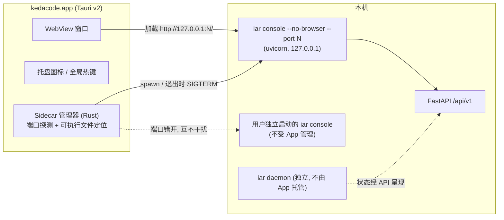

# PRD: Tauri 桌面壳 —— 免签名本机构建的原生窗口

> ⛔ **交付前置**：排在 `P1-FEAT-20260913-204530-console-prd-content-reader.md` 之后开工。
> 构建上不依赖它（壳单独能跑），但先做壳只会得到一个读不了 PRD 的窗口。
> 结构化声明见 §8 Delivery Dependencies，**那里是唯一事实源**；本行只为让人一眼看到，改动请以 §8 为准。

本 PRD 分两层阅读：**Part A（人审层）** 供人决定"做不做、怎么做才对"，不含实现细节；**Part B（执行器层）** 供执行者（人或 Agent）落地实现。人只需审 Part A，并按 Part A 的指引在需要时下钻 Part B。

## Feature Overview (功能一览)

> 本块是第 10 节 Functional Requirements 的通俗投影，不是第二事实来源；行为验收以第 1 节的行为样例表为准。

- **一条命令装出桌面 App**（FR-1）：本机构建 `kedacode.app` 并装进 `~/Applications`，双击即用，全程不需要 Apple 开发者账号。
- **打开就是熟悉的控制台**（FR-2）：窗口内容就是 `iar console` 服务的那个面板，数据同源；后端拉不起来时显示明确错误页，不是白屏。
- **用完即走**（FR-3）：退出 App 时自动回收它拉起的后台服务；你自己独立运行的 `iar console` 不受任何影响。
- **随手呼出**（FR-4）：菜单栏常驻图标 + 全局热键。
- **边界清晰**（FR-5、§11）：只做 macOS 本机构建自用，不签名、不公证、不上 cask、不进 Release 流水线；文档同步记录修订后的分发决策边界。

# Part A · 人审层 (Review Layer)

## 1. Introduction & Goals

### Problem Statement

要看 PRD 或 agent 任务执行情况，目前的路径是：开终端 → 敲 `iar console` → 等浏览器打开。这条链路每次都要走一遍，而且**需要先知道有这条命令**——这一点在 2026-09-13 的一次真实对话里被直接印证：用户（本项目开发者本人）在功能已经交付并发布之后，仍需要问"我要怎么打开可视化界面"。命令行入口的可发现性本身就是摩擦。

另一个已核实的现状事实：仓库有一条正式记录的分发决策（已归档的 `tasks/archive/P1-FEAT-20260910-125248-iar-package-manager-distribution.md`，D-01）——"不做 macOS / Windows 原生安装包，不做代码签名与公证"，依据是公开分发绕不开 $99/年的 Apple 开发者账号。该决策的适用范围是**向公开用户分发签名安装包**，并未覆盖"开发者在本机用源码构建、自己用"这条路径。这条路径的成本为零：本机构建的产物不经过互联网下载，不带 `com.apple.quarantine` 扩展属性，Gatekeeper 不拦截。

### Interpretation (解读回显)

**行为样例**（下表每一行会被逐字转录为 Part B 的验收判据——改正任何一格，就等于改正验收标准）：

| 输入 / 操作 | 期望观察到的结果 |
|---|---|
| 本机执行构建命令（`install.sh --app` 或对应 just recipe） | 产出 `~/Applications/kedacode.app`；`xattr` 查不到 `com.apple.quarantine`；双击直接打开，不弹 Gatekeeper 拦截 |
| 双击打开 App | 原生窗口显示与 `iar console` 浏览器面板一致的控制台（真实 `tasks/` 数据、真实进程数据） |
| 按全局热键 / 点菜单栏图标 | 窗口呼出到前台；关掉窗口后仍可再次呼出 |
| 边缘情况：本机已有独立运行的 `iar console` 占着默认端口 | App 自带的 sidecar 自动用其它端口，两者互不干扰、各自可用 |
| 边缘情况：机器上装了 `iar` 但只在 Homebrew 路径（`/opt/homebrew/bin/iar`），且从 Finder 双击启动 | App 仍能找到并拉起 sidecar（Finder 启动的 App 拿不到登录 shell 的 PATH，必须显式枚举安装位置） |
| 失败情况：机器上根本没装 `iar` | 窗口显示明确的引导文案（告知如何安装），不是白屏、不是静默失败 |
| 失败情况：sidecar 进程意外退出 | 窗口显示"后端未运行"错误页，不是白屏或永久转圈 |
| 退出 App | 它拉起的 sidecar 随之退出（`pgrep` 查不到）；用户独立启动的 `iar console` 仍存活 |

**我默默定了这些**（有异议请直接指出）：

- 壳里加载的是 **frontend-public 的控制台界面**（`iar console` 服务的就是它），不是 frontend-admin——后者仍是未接任何 agent-runner 接口的模板。
- 壳拉起的后台进程是 **`iar console` 的 HTTP 服务**（已有 `--no-browser` 参数），不是 `iar daemon`（那是 agent 轮询循环，不提供 HTTP），也不是在 Rust 里内嵌 Python。
- 窗口直接加载本机 HTTP 地址（界面与 API 同源），而不是把前端静态文件打包进 `.app`。
- 分发只走"本机构建自用"：不签名、不公证、不上 Homebrew cask、不进 Release 流水线。
- 菜单栏托盘图标 + 全局热键纳入本期范围（这是"随手呼出"体验的核心）。
- 只做 macOS。Windows / Linux 桌面包不在本期。

**我理解为不做**：

- 不推翻"不签名、不上 cask"的**公开分发**结论——本 PRD 只覆盖本机构建自用。
- 不替换 `iar console` 浏览器入口，两者并存。
- 不做 PRD 原文浏览功能本身——那由另一份 PRD（`P1-FEAT-20260913-204530-console-prd-content-reader.md`）交付，壳因同源加载会自动获得它。注意这不代表两者无关：**本 PRD 排在它后面做**（§8 声明为 hard 门禁）。壳单独跑得起来，但先做壳只会得到一个读不了 PRD 的窗口——恰好是本 PRD 立项时最想要的那件事没有。

**文字版解读**：把这件事读作"给 kedacode 加一个 Tauri 原生壳，壳内加载本机 console 服务提供的现有控制台界面"，而不是"重写一套桌面 UI"或"恢复被否决的签名安装包分发方案"。关键边界：壳只是 HTTP 客户端，不拥有任何业务状态；不引入签名/公证/cask。非目标：跨平台包、替换浏览器控制台、在壳里做界面功能。

### What The User Gets

按一下全局热键（或点菜单栏图标），一个原生窗口弹出来，里面就是那个控制台——任务队列、roadmap、进程与日志。不用先开终端、不用记命令、不用等浏览器。关掉窗口它还在菜单栏待着，随时再呼出。不用 App 的时候，原有的 `iar console` 浏览器流程一点不受影响。

### Measurable Objectives

- 本机执行构建命令后产出 `.app`，`xattr` 无 `com.apple.quarantine`，双击直接打开且无 Gatekeeper 拦截。
- 窗口内显示的控制台数据与同端口 `curl /api/v1/agent-runner/...` 的返回一致。
- 与预先独立运行的 `iar console` 并存时互不抢端口，双方均可用。
- 退出 App 后 `pgrep` 查不到它拉起的 sidecar；独立启动的 console 进程仍存活。
- 在**只有 Homebrew 路径装了 `iar`** 的条件下从 Finder 双击，仍能拉起 sidecar。
- 以上均经真实入口验证（真实构建产物 + 真实双击 + 真实后端 + 真实数据），不接受开发服务器或纯单元测试充数。

## 2. Human Review Map (介入与风险地图)

本期有两个决策需要人工确认，其余改动走自动门禁。

### 决策一：修订"不做原生 .app"的旧决策（仅限本机构建自用）

已归档的分发 PRD 明确写下"不做原生安装包、不签名不公证"，理由是公开分发绕不开 $99/年的 Apple 开发者账号。本 PRD 不推翻它，而是补上它没覆盖的一条缝：**开发者在本机用源码构建的 `.app` 不经过互联网下载，不带 quarantine 标记，Gatekeeper 不拦截，成本为零**。旧决策的前提（"目标用户必然是开发者"）反而支持这条路线。

风险在于：这条缝如果被误读成"可以向公众分发未签名的 .app"，拿到产物的用户会在 Gatekeeper 上被硬阻断。所以新决策必须把"仅限本机构建自用；公开分发仍需签名"写成**显式边界**，并落到文档里。

**请确认：** 同意将旧决策修订为"不做签名安装包的公开分发；允许本机构建自用的未签名 .app"？

**验收：** roadmap 与相关文档同步记录修订后的边界；本机构建出的 `.app` 在一台未装开发证书的机器上双击直开，且 `xattr` 无 quarantine。

### 决策二：为一个原生窗口，往仓库里永久引入 Rust 工具链

这是本 PRD 真正的成本项，值得单独确认。仓库目前**没有任何 Rust 源码**（已核实：不存在 `Cargo.toml`）。做这个壳意味着新增 `desktop/` 子项目及其独立依赖树、把 Rust + Xcode CLT 写进开发环境要求、并长期承担 Tauri v2 的 API 演进。

换来的是：原生窗口、菜单栏图标、全局热键。**功能上不多一分**——界面和数据与浏览器控制台完全相同。这是一次纯体验投入。

反面事实要一并摆出：`iar console` 本身已经会自动打开浏览器，浏览器也能加书签。所以如果只是"少敲一条命令"，成本收益是不划算的；它值得做的前提是"全局热键随手呼出 + 菜单栏常驻"这套交互对你确有价值。

**请确认：** 接受为原生窗口 + 托盘 + 全局热键，长期在仓库里维护一个 Rust/Tauri 子项目？

**验收：** 用真实构建出来的 App（不是开发服务器）双击打开，窗口里显示的控制台数据与直接查询后端得到的结果逐字一致；壳本身不含任何业务逻辑，只做进程管理与窗口加载。

**自动门禁，不需要逐项人工审阅：** Tauri 脚手架与构建配置、sidecar 进程生命周期（端口共存、退出回收、可执行文件定位）、`install.sh` 的 `--app` 分支、justfile recipe、文档与导航同步。这些改动失败时局限在本功能内、可回滚，由针对性验证与构建门禁拦截。

**本次明确不涉及：** 无数据库结构变更；不改动 `iar daemon` 轮询循环；不改动 PyPI / Homebrew tap 既有分发链路；不做 Windows / Linux 包；不改动 frontend-public 或 frontend-admin 的任何界面代码。

## 3. Usage And Impact After Implementation

- **本机开发者（主要用户）：** 构建一次后 `~/Applications/kedacode.app` 双击即用；日常流程从"终端 → `iar console` → 浏览器"变成"热键呼出"。
- **CLI / 浏览器控制台用户：** 完全不变。`iar console` 照旧启动并打开浏览器；桌面 App 与浏览器面板只是同一后端的两个客户端。
- **分发维护者：** `install.sh` 增加一个可选分支，默认行为不变；发布流水线（PyPI + tap）不受影响，Release 产物不新增任何安装包。
- **兼容性影响：** 无破坏性变更；不引入新的必填配置；不改动任何后端接口。

## 4. Requirement Shape

- **actor:** 本机 macOS 开发者；次要：分发维护者
- **trigger:** 用户希望用原生窗口 / 全局热键访问控制台，且不产生签名与分发成本
- **expected behavior:** 一条命令本机构建出免签名可用的 `.app`；App 自带 sidecar，界面与既有控制台一致；退出无残留；与独立 console 并存
- **explicit scope boundary:** 仅 macOS 本机构建自用；不签名/公证/cask；壳内不做任何界面功能；不托管 agent daemon

# Part B · 执行器层 (Build Layer)

## 5. Repository Context And Architecture Fit

**现有模块与最近路径：**

- HTTP 服务入口：`src/backend/api/cli_typer_console.py`。`iar console` 用 uvicorn 跑 `backend.api.app:app`；监听地址由 `CONSOLE_HOST = "127.0.0.1"` **硬编码且不可配置**（settings 里没有 `host` 字段，有回归测试守着）；端口由 `resolve_console_port` 决定——未显式指定时从配置默认端口起在 `_PORT_SCAN_WINDOW` 范围内顺延，显式指定则占用即失败；**已有 `--no-browser` 参数**。
- 注意：`iar daemon` 是 agent 轮询循环，**不**提供 HTTP。壳的 sidecar 是 console 服务，不是 daemon。
- 界面：frontend-public 的 Next.js 静态导出，由 `src/backend/api/app.py` 的 `_mount_console_static()` 在所有 router 之后挂到 `/`；静态产物随 wheel 分发（`pyproject.toml` 的 `"backend.api.static" = ["console/**/*"]`）。
- frontend-admin 是未接 agent-runner 的模板，本期不动。
- 分发：仓库根 `install.sh` 是用户入口，经 uv/pipx 安装 `kedacode`；另有 `scripts/install/install.sh`（与根目录那份内容不同，见 Drift Guard）。Homebrew tap 在外部仓库由 CI 更新。当前无任何 `.app` 产物处理。
- **仓库目前没有任何 Rust 源码**（不存在 `Cargo.toml`）。

**架构约束：**

- 壳不进入后端四层架构：`desktop/` 是与 `tests/playwright-e2e/` 同类的独立子项目，遵循自己的工具链，不受 Python SSA 命名规范约束。
- 壳不得持有任何业务状态，只做进程管理与窗口加载。
- `install.sh` 既有不变量：不用 sudo、不碰系统包管理器——`--app` 分支同样遵守（拷贝到 `~/Applications` 无需 sudo）。

**相关 PRD 关系：**

- 已归档 `P1-FEAT-20260910-125248-iar-package-manager-distribution.md`：本 PRD **修订**其 D-01 的适用边界（该结论仅约束公开分发）。其 §7.10 关于签名/Gatekeeper/cask 的外部核实事实被继承引用，不重复核实。
- 已归档 `P1-FEAT-20260910-111901-iar-console-bundled-web-terminal.md`：其交付的 `iar console`（wheel 内置控制台 + 一键启动）是本 PRD 的直接底座——sidecar 复用它，界面复用它服务的静态导出。
- `tasks/pending/P1-FEAT-20260913-204530-console-prd-content-reader.md`：**上游**提案，§8 声明为 `hard` 门禁。需要分清两种依赖：**构建上不依赖**——壳同源加载控制台，对方没落地壳照样能跑通；**交付顺序上依赖**——本 PRD 的立项动机含「读 PRD 原文」，那块能力由对方交付，壳先落地会交出一个读不了 PRD 的窗口且本 PRD 验收仍全绿。故按交付顺序钉死为 hard。
- 本 PRD 与原 `P1-FEAT-20260912-181533-tauri-desktop-gui.md` 是拆分关系：那份把"读 PRD 原文"与"做桌面壳"绑在一起，二者成本与价值差一个数量级且可独立交付，已按 Scope Cohesion 拆为两份，原文件删除。

## 6. Recommendation

**Recommended Approach：Tauri v2 壳 + 子进程拉起既有 `iar console` + 同源加载回环地址 + 本机构建分发。**

1. 新增 `desktop/` Tauri v2 子项目：Rust 侧分配空闲端口、spawn sidecar（`iar console --no-browser --port N`）、健康探测、创建窗口加载 `http://127.0.0.1:N/`、托盘与全局热键、退出回收子进程。
2. `install.sh` 增加可选 `--app` 分支：本机执行 `tauri build` 并把产物拷到 `~/Applications`（无 sudo，默认行为不变）；配套 just recipe。
3. 文档与 roadmap 同步记录修订后的分发决策边界。

**为什么最贴合现有架构：** sidecar 就是现成的 `iar console`，界面就是现成的静态导出；新增的只有"壳"。后端与前端代码零改动，四层架构零侵入。

**拒绝的冗余抽象：** 不新建 GUI 技术栈（PyQt/PySide6 需重写全部界面）；不把静态文件打包进 `.app` 走自定义协议；不在 Rust 内嵌 Python 运行时；不新增 WebSocket（现有轮询已够）。

### Proposed Solution Summary (实现机制)

壳启动时先探测一个空闲端口，再以该端口显式启动 sidecar（显式 `--port` 时 console 占用即失败，不会悄悄换端口，因此端口由壳单方面决定、可预测）。窗口加载该回环地址，界面与 API 天然同源，前端 `baseURL: "/api"` 的相对路径无需任何改动。sidecar 生命周期绑定 App 生命周期：App 退出时 SIGTERM 回收；用户独立启动的 console 进程不在管理范围。分发形态：`install.sh --app` 本地执行 `tauri build` 并拷贝至 `~/Applications`。刻意避开的复杂度：无新增存储、无状态机、无打包进壳的前端副本、无签名流水线。

**一处需要说准的机制：** "前端更新后壳免重建"成立，但更新路径是"更新已安装的 `kedacode` 包"——静态产物打在 wheel 里，不是 `pnpm build` 完就生效。壳解耦掉的是"壳与界面的构建耦合"，不是"界面与后端包的耦合"。

### Alternatives Considered

| 备选 | 结论 | 理由 |
|---|---|---|
| 什么都不做，用浏览器书签 | **应认真对待的基线** | 零成本；`iar console` 已自动开浏览器。仅当"全局热键 + 菜单栏常驻"确有价值时，本 PRD 才划算——这正是决策二要确认的 |
| PyQt / PySide6 原生重写 | 拒绝 | 抛弃已有前端全部重写；打包 150MB+；$99 签名问题一分不省；PyQt 另有 GPL/商业许可问题 |
| pywebview（纯 Python 壳） | 拒绝 | 窗口管理/托盘/全局热键能力弱，分发仍绕不开 PyInstaller 打包痛点 |
| Electron | 拒绝 | 产物体积与内存占用大，相对 Tauri 无能力增益 |
| 静态文件打包进 `.app`（自定义协议） | 拒绝 | 前端每次更新都要重建壳；同源加载零代价获得更新 |
| 立即签名 + brew cask 公开分发 | 拒绝（暂缓） | $99/年成本对"自用"阶段无收益；将来补签名只是流水线加步骤，架构不返工 |

## 7. Implementation Guide

> This section is a living implementation guide based on current repository analysis. If implementation discovers additional affected files, hidden dependencies, edge cases, or a better path, update this PRD before proceeding.

### Core Logic

数据流：`desktop/` 壳 → 探测空闲端口 → spawn `iar console --no-browser --port <N>` → uvicorn 服务 `backend.api.app:app` → WebView 加载 `http://127.0.0.1:<N>/` → 静态导出页面经同源 `/api/*` 调后端。

控制流：壳负责端口分配与 sidecar 可执行文件定位、健康探测（轮询 `/api/v1/agent-runner/health` 直到 200 或超时）、退出时 SIGTERM 回收。sidecar 定位失败或健康探测超时，均渲染对应错误页（区分"没装 `iar`"与"后端启动失败"两种文案）。

### Change Impact Tree

```text
.
├── desktop/（新增 Tauri v2 子项目，独立 package，参照 tests/playwright-e2e/ 的独立包模式）
│   ├── src-tauri/src/（main.rs / lib.rs）
│   │   [新增]
│   │   【总结】壳逻辑：端口探测 → spawn sidecar → 健康探测 → 创建窗口 → 托盘与全局热键 → 退出回收
│   │   ├── **sidecar 可执行文件定位（本 PRD 最易出错处）**：从 Finder 双击启动的 .app
│   │   │   拿到的是最小 PATH（约 /usr/bin:/bin:/usr/sbin:/sbin），**不继承登录 shell 的 PATH**，
│   │   │   因此"在 PATH 里找 iar"这一档在真实场景下基本命不中。必须显式枚举候选：
│   │   │     ~/.local/bin/iar        （uv tool / pipx 默认）
│   │   │     /opt/homebrew/bin/iar   （Apple Silicon Homebrew，本项目自建 tap 的安装位置）
│   │   │     /usr/local/bin/iar      （Intel Homebrew / 手工安装）
│   │   │     $PATH 查找              （保底，命中率低但无害）
│   │   │   全部落空时渲染"未找到 iar"引导页，不得静默失败
│   │   ├── 健康探测轮询 /api/v1/agent-runner/health，超时渲染"后端未运行"错误页（不白屏）
│   │   └── 托盘与全局热键用 Tauri 官方插件
│   ├── src-tauri/tauri.conf.json
│   │   [新增]
│   │   【总结】应用标识、bundle 目标（macOS app）、窗口配置、安全策略仅允许 127.0.0.1 回环
│   └── package.json / just 集成
│       [新增]
│       【总结】tauri CLI 脚本（dev/build），遵循仓库既有前端工具链习惯
├── install.sh（仓库根，用户入口）
│   [修改]
│   【总结】新增可选 --app 分支：本机执行 tauri build 并拷贝产物到 ~/Applications
│   ├── 无 sudo、不碰系统包管理器（既有不变量）
│   ├── 默认行为完全不变；缺 Rust / Xcode CLT 时给出明确前置条件提示而非中途崩
│   └── **先解决**：根 install.sh 与 scripts/install/install.sh 的关系（见 Drift Guard），
│       确定改哪一份或两份如何同步，再动手
├── justfile
│   [修改]
│   【总结】新增 app 相关 recipe（如 just app build / dev），复用现有前端 recipe 风格
├── docs/ + mkdocs.yml
│   [修改]
│   【总结】新增桌面 App 使用与构建前置条件文档页并登记导航；README 安装段补一条本机构建说明
└── roadmap.md
    [修改]
    【总结】把"不做原生 .app"修订为"不做签名安装包公开分发；允许本机构建自用"，并登记桌面壳能力
```

以上为起点而非穷尽清单；发现隐藏引用时按下方 Drift Guard 处理。

### Risk Classification Register

| change point | tier | decisive dimension/override | intervention | oracle/gate |
|---|---|---|---|---|
| 修订分发决策的文档边界 | R1 | 文档语义，可即时回滚 | 人工确认（决策一）+ rv-1 佐证 | rv-1 |
| 引入 Rust/Tauri 子项目 | R1 | 新工具链，但失败局限本功能且可整体删除 | 人工确认（决策二，成本承诺） | rv-1 |
| sidecar 生命周期：端口共存 + 退出回收 | R2 | 跨组件运行行为：孤儿进程与端口冲突会影响本机其它服务 | 执行器 + 强判据 | rv-2 |
| sidecar 可执行文件定位 | R2 | 决定 App 能否在真实安装方式下启动；Finder 最小 PATH 极易漏 | 执行器 + 强判据（含 Homebrew-only 场景） | rv-3 |
| `install.sh --app` 分支 | R1 | 可选分支，默认路径不变；拷贝限 `~/Applications` | 执行器 + 真实构建 | rv-1 覆盖 |
| justfile / docs / roadmap 更新 | R0 | 机械新增 | 执行器 + 构建/lint 门禁 | `just lint`、`mkdocs build --strict` |

### Executor Drift Guard

- console 端口与监听常量：`rg -n "resolve_console_port|_PORT_SCAN_WINDOW|CONSOLE_HOST" src/backend/`
- console CLI 既有参数：`uv run iar console --help`（确认 `--no-browser` 与 `--port` 语义未变）
- 健康端点路径：`rg -n "health" src/backend/api/routes/`
- **两份 install.sh 的关系（动手前必须先有结论）**：`diff install.sh scripts/install/install.sh`。二者内容不同；确定哪一份是用户入口、另一份是否为模板副本、以及 `--app` 分支应落在哪里、是否需要同步。结论写回本 PRD 再动手。
- 既有前端/工具链 recipe 风格：`rg -n "frontend|pnpm" justfile`
- 若上述搜索暴露清单外文件，先更新本 PRD 的 Change Impact Tree 再动手。

### Flow / Architecture Diagram



### ER Diagram

No data model changes in this PRD.

### Low-Fidelity Prototype

```text
┌────────────────────────── kedacode ───────────────────────────┐
│ [Roadmap] [任务] [Idea Inbox]            ● 后端已连接 :8314    │
├───────────────────────────────────────────────────────────────┤
│                                                               │
│        （窗口内容 = iar console 浏览器面板，完全一致）        │
│                                                               │
├───────────────────────────────────────────────────────────────┤
│ 任务执行: 3 运行中 / 1 失败   [查看进程与日志 →]              │
└───────────────────────────────────────────────────────────────┘
  菜单栏: ⚡ kedacode  [呼出窗口 ⌘⇧K] [打开浏览器控制台] [退出]

  错误页（二选一，文案必须可区分）：
    ⚠ 未找到 iar —— 请先安装：uv tool install kedacode
    ⚠ 后端未运行 —— sidecar 启动失败，查看日志
```

### Realistic Validation Plan

```yaml
oracles:
  - id: rv-1
    behavior: 本机一条命令构建出免签名 .app，双击打开后窗口显示真实控制台数据（佐证决策一与决策二）
    real_entry: "install.sh --app（或 just app build）构建并安装到 ~/Applications 后，在 Finder 中双击 ~/Applications/kedacode.app"
    expected: "xattr ~/Applications/kedacode.app 无 com.apple.quarantine，双击无 Gatekeeper 拦截；窗口加载出与 iar console 浏览器版一致的控制台界面与真实数据"
    mock_boundary: "构建、App、后端、tasks/ 与进程数据全部真实；不 stub 任何 HTTP"
    tier: R2
    test_layer: manual
    required_for_acceptance: true
    critical_value_source: "窗口中显示的任一 PRD 标题与进程条目，必须与对同一 sidecar 端口 curl /api/v1/agent-runner/roadmap/prds 及 /console/processes 的响应逐字比对一致；端口取自壳日志或 sidecar 的 'listening on' 输出"
    must_cross: "Finder 双击 -> Tauri 壳 -> sidecar spawn -> uvicorn 监听 -> WebView 加载 -> 同源 /api 请求 -> 真实 tasks/ 与进程数据"
    forbidden_bypasses: "禁止用 tauri dev 开发服务器代替正式构建产物；禁止手工 xattr -d 移除 quarantine 后声称免拦截；禁止从终端用 open 命令启动后冒充 Finder 双击（二者 PATH 环境不同，正是 rv-3 要覆盖的差异）"
    fresh_state_probe: "完全退出 App 后重新双击打开，列表数据与当时磁盘 tasks/ 状态一致"
    final_tree_evidence: "证据须来自最终 desktop/ 与 install.sh 代码树构建的产物；二者任一改动须重建重验"
    negative_control: "把 tauri.conf.json 的窗口加载地址改为一个未监听端口后重建，窗口应显示错误页而非正常界面 —— 该对照必须实跑一次，证明'窗口显示真实数据'不是恒真"
    expected_fail: "壳未正确配置加载地址或 CSP 时窗口白屏/错误页即红"
  - id: rv-2
    behavior: App 退出回收 sidecar 子进程，且与独立运行的 iar console 并存不抢端口
    real_entry: "先独立运行 iar console（占用默认端口），再双击打开 kedacode.app；随后退出 App"
    expected: "App 内功能正常且 sidecar 用了其它端口；退出 App 后 pgrep 查不到 App 拉起的 sidecar；独立 console 进程仍存活且 curl 可访问"
    mock_boundary: "全部真实进程；不允许用 mock 进程代替 uvicorn"
    tier: R2
    test_layer: manual
    required_for_acceptance: true
    critical_value_source: "App 实际使用的端口须取自壳的端口分配日志或 sidecar 的 'listening on' 输出，不得靠猜；独立 console 的存活以 curl 返回 200 为准，不以 ps 输出为准"
    must_cross: "壳端口探测 -> sidecar 绑定该端口 -> App 退出信号 -> 子进程 SIGTERM -> 进程表验证 -> 独立进程 curl 验活"
    forbidden_bypasses: "禁止用 pkill 无差别清理后声称无残留；必须按 pid 区分 App 子进程与用户独立进程"
    fresh_state_probe: "退出后新开一个 shell 执行 pgrep 验证；独立 console 另用 curl /api/v1/agent-runner/health 验活"
    final_tree_evidence: "证据采集于最终 sidecar 生命周期代码；回收逻辑任何改动须重验"
    negative_control: "临时注释掉退出回收逻辑后重建，退出 App 时 pgrep 应查到残留 sidecar —— 证明该判据能判负"
  - id: rv-3
    behavior: 在只有 Homebrew 路径装了 iar 的机器上从 Finder 双击，App 仍能定位并拉起 sidecar
    real_entry: "确保 ~/.local/bin/iar 不存在（或临时移走）、仅 /opt/homebrew/bin/iar 可用，然后在 Finder 中双击 .app"
    expected: "窗口正常加载控制台（不是'未找到 iar'引导页）；壳日志显示命中的是 Homebrew 路径"
    mock_boundary: "真实安装、真实 Finder 启动；不得从终端启动"
    tier: R2
    test_layer: manual
    required_for_acceptance: true
    critical_value_source: "命中的可执行文件路径取自壳自身的定位日志，而非事后推断"
    must_cross: "Finder 启动（最小 PATH）-> 壳的候选路径枚举 -> spawn 命中的 iar -> uvicorn 监听 -> 窗口加载"
    forbidden_bypasses: "禁止从终端 open 或直接跑二进制来通过本条（那会继承 shell PATH，掩盖真实缺陷）；禁止在 .app 里写死单一绝对路径充数"
    fresh_state_probe: "把 iar 从全部候选路径移走后重开 App，应显示'未找到 iar'引导页而非白屏 —— 同时验证正反两向"
    final_tree_evidence: "证据采集于最终定位逻辑实现之后；候选路径列表改动须重验"
    negative_control: "全部候选路径都无 iar 时必须出现引导页（见 fresh_state_probe），证明定位失败被正确识别而不是静默卡住"
```

失败排查提示：rv-1 先查 sidecar 端口（壳日志或 `iar console listening on` 输出）与 `tauri.conf.json` 的加载地址；rv-2 先查退出信号是否真的送到了子进程组；rv-3 先打印壳启动时的实际 `PATH` 环境变量——从 Finder 启动时它与终端里完全不同。

### Interactive Prototype Change Log

No interactive prototype file changes in this PRD.

### External Validation

本 PRD 未新增联网核实。签名 / Gatekeeper / Homebrew cask 的外部事实继承自已归档的 `P1-FEAT-20260910-125248-iar-package-manager-distribution.md` §7.10（核实日期 2026-09-10）。本 PRD 的核心前提（本机构建产物无 quarantine）属 macOS 本地行为，由 rv-1 的真实构建直接验证，不依赖二手结论；同一机制已在该 PRD 的 rv-3 中对 Homebrew 源码构建产物实测过（`xattr -p com.apple.quarantine` 返回 `No such xattr`）。

## 8. Delivery Dependencies

- Group: none
- Depends on tasks/issues:
  - `tasks/pending/P1-FEAT-20260913-204530-console-prd-content-reader.md`
- Gate type: hard
- Notes: 这是**交付顺序依赖，不是构建依赖**。技术上本 PRD 不碰对方的任何产物——壳加载回环地址，控制台服务什么它就显示什么，先做壳也能跑通。但本 PRD 的立项动机（§1）原文是"双击打开、直接浏览 PRD 原文、看任务队列和执行状态"，而"读 PRD 原文"由对方交付；壳先落地而对方没有，等于交付一个读不了 PRD 的原生窗口——最想要的那件事恰好缺席，且本 PRD 的验收会全绿，掩盖这个缺口。两种写错的代价不对称：写 none 会让执行器先啃成本最大的壳（要首次引入 Rust）却没解决原始诉求；写 hard 若将来确实想先做壳，改这一行即可解开。底座 `iar console`（已归档 PRD `P1-FEAT-20260910-111901`）能力已在代码库可用，不构成额外依赖。

## 9. Acceptance Checklist

验收证据包按风险排序呈现：人工确认项与高层级判据在前，普通门禁折叠在后。所有证据须在最终代码树上采集；相关代码后续改动使对应证据失效，须重验后方可归档。

### Human-Confirmed

- [ ] （决策一）roadmap.md 与文档记录修订后边界——"不做签名安装包公开分发；允许本机构建自用"；rv-1 证据显示本机构建 `.app` 双击直开、`xattr` 无 `com.apple.quarantine`
- [ ] （决策二）rv-1 证据显示窗口呈现与 `iar console` 浏览器版一致的控制台，且数据与同端口 curl 响应逐字一致；`desktop/` 不含任何业务逻辑
- [ ] （决策二）rv-1 负向对照**实跑记录**：把加载地址改为未监听端口后窗口显示错误页 —— 证明"窗口显示真实数据"不是恒真

### Architecture Acceptance

- [ ] `desktop/` 不引入任何业务状态，仅做进程管理与窗口加载
- [ ] 后端与前端代码零改动（`git diff --stat src/backend frontend-public frontend-admin` 为空）
- [ ] `tauri.conf.json` 的安全策略只允许访问 `127.0.0.1` 回环地址

### Behavior Acceptance

- [ ] rv-2 证据：与独立 `iar console` 并存不抢端口；退出 App 后按 pid 确认无残留 sidecar，且独立进程 curl 仍 200
- [ ] rv-2 负向对照实跑记录：注释掉回收逻辑后退出 App 能查到残留进程
- [ ] rv-3 证据：仅 Homebrew 路径有 `iar` 时从 **Finder 双击**仍能拉起 sidecar，壳日志显示命中路径
- [ ] rv-3 反向：全部候选路径无 `iar` 时显示"未找到 iar"引导页（非白屏、非静默失败），附截图
- [ ] sidecar 启动失败时显示"后端未运行"错误页，与"未找到 iar"文案可区分，附截图
- [ ] `iar console` 默认行为（自动开浏览器、端口顺延）不变——既有 CLI 测试通过

### Documentation Acceptance

- [ ] docs/ 新增桌面 App 使用页（含 Rust + Xcode CLT 前置条件）并登记 `mkdocs.yml` 导航；`uv run mkdocs build --strict` 通过
- [ ] README 安装段补充本机构建说明，并写明"仅限本机自用，公开分发仍需签名"
- [ ] roadmap.md 完成决策修订表述更新
- [ ] 两份 install.sh 的关系已在本 PRD 中给出结论并按结论落地

### Validation Acceptance

- [ ] rv-1（manual，真实构建产物 + Finder 双击）通过，截图证据标注验证层级为真实入口验证
- [ ] rv-2（manual，真实进程）通过，含负向对照记录
- [ ] rv-3（manual，真实安装布局 + Finder 启动）通过，含正反两向记录
- [ ] `just lint` 与后端测试套件全绿（本 PRD 不应改动后端，绿色即佐证）

### Delivery Readiness

- [ ] 推荐方案全部落地，无遗留临时兼容层或"二期再补"项
- [ ] 独立 verifier Agent 审查通过
- [ ] 归档前完成 Section 13 Final Reconciliation，正文无与最终实现矛盾的表述

## 10. Functional Requirements

- FR-1: 提供一条本机命令（`install.sh --app` 及对应 just recipe）构建并安装 `kedacode.app` 至 `~/Applications`，不使用 sudo，不改变 `install.sh` 默认行为；缺少 Rust / Xcode CLT 时给出明确前置条件提示。
- FR-2: App 启动时自动拉起 `iar console --no-browser --port <壳分配的空闲端口>` 作为 sidecar，窗口加载其回环地址。sidecar 可执行文件的定位必须显式枚举候选路径（至少覆盖 `~/.local/bin`、`/opt/homebrew/bin`、`/usr/local/bin` 与 `$PATH`），因为从 Finder 启动的 App 不继承登录 shell 的 PATH。
- FR-3: App 退出时回收其拉起的 sidecar 子进程；用户独立启动的 console 进程不受管理、不受影响；两者端口不冲突。
- FR-4: App 提供菜单栏托盘图标与全局热键呼出窗口。
- FR-5: 两类失败必须有可区分的可视反馈：未找到 `iar` 时显示安装引导页；sidecar 启动失败或健康探测超时时显示"后端未运行"错误页。任何情况下不得白屏或永久加载。
- FR-6: 桌面 App 与浏览器控制台共享同一后端与数据，互不干扰；`iar console` 既有行为不变；后端与前端代码零改动。
- FR-7: 文档（docs/、mkdocs.yml、README、roadmap.md）同步记录桌面 App 用法、构建前置条件与修订后的分发决策边界。

## 11. Non-Goals

- 不做代码签名与公证；不上 Homebrew cask；不在 Release 流水线产出任何安装包。
- 不做 Windows / Linux 桌面包。
- 不在壳里实现任何界面功能（包括 PRD 原文浏览——那是并行 PRD 的范围）。
- 不托管或改造 `iar daemon` 轮询循环；不改动 agent runner 执行机制。
- 不改动 frontend-public / frontend-admin 的界面代码；不改动 PyPI / Homebrew tap 既有分发链路。
- 不引入 WebSocket/SSE（沿用现有轮询）。

## 12. Risks And Follow-Ups

| 风险 | 影响 | 缓解 |
|---|---|---|
| **Finder 启动的 App 不继承 shell PATH** | 用 uv/pipx 或 Homebrew 装的 `iar` 找不到，App 首次双击即失败——这是本 PRD 最可能的翻车点 | FR-2 要求显式枚举候选路径；rv-3 专门在"仅 Homebrew 路径"条件下从 Finder 双击验证，并禁止用终端 `open` 代替 |
| 首次把 Rust/Tauri 引入仓库 | 构建环境要求上升（Rust + Xcode CLT）；长期承担 Tauri v2 API 演进 | 决策二显式确认这笔成本；CI 不构建 `.app`，只本机构建；`desktop/` 可整体删除而不影响任何其它功能 |
| "本机构建自用"被误读为可公开分发 | 拿到未签名产物的用户被 Gatekeeper 硬阻断 | 决策一要求把边界写进 roadmap 与 README；Release 流水线不产出任何安装包 |
| 两份 install.sh 关系未定 | 改错文件导致用户入口没有 `--app`，或两份长期漂移 | Drift Guard 要求动手前先 `diff` 并把结论写回本 PRD；列为 Documentation Acceptance 的一条 |
| sidecar 孤儿进程 | 反复开关 App 后残留多个 uvicorn 占用端口 | rv-2 要求按 pid 验证回收，并要求实跑"注释掉回收逻辑就能查到残留"的负向对照 |

**Follow-ups（不阻塞本 PRD）**：

- 若将来要向他人公开分发 GUI，回到 $99 签名 + 公证 + cask 决策；届时仅在构建流水线加步骤，架构不返工。
- Raycast 扩展可作为第二个 HTTP 客户端另行立项，与本 PRD 无依赖。
- 自动更新提示（App 内提示 `kedacode` 有新版本）可后续单独评估。

## 13. Decision Log

| ID | 决策问题 | Chosen | Rejected | Rationale |
|---|---|---|---|---|
| D-01 | 是否为原生窗口引入 Rust 工具链 | 引入 Tauri v2 子项目 | 维持现状用浏览器书签 | 功能上零增量，纯体验投入；仅当全局热键 + 菜单栏常驻确有价值时才划算，故列为人工确认的决策二 |
| D-02 | 桌面壳技术选型 | Tauri v2 | PyQt/PySide6 重写；pywebview；Electron | 现有界面整体复用，产物小，sidecar 模型与 console 天然契合 |
| D-03 | 壳内界面载体 | 同源加载 sidecar 地址（frontend-public 控制台） | frontend-admin；静态文件打包进 .app | 真实控制台 UI 全在 frontend-public；同源加载让界面更新不必重建壳 |
| D-04 | sidecar 形态 | 子进程 `iar console --no-browser` | Rust 内嵌 Python 运行时；App 托管 daemon | console 已有 `--no-browser` 与端口语义，零改动复用；daemon 不提供 HTTP，不是壳的对象 |
| D-05 | 分发策略 | 本机构建 + `install.sh --app`，不签名不上 cask | 立即 $99 签名 + cask 公开分发 | 本机构建产物无 quarantine、零成本覆盖自用场景；将来补签名只是加流水线步骤 |
| D-06 | 修订旧分发决策的方式 | 新 PRD 显式修订其适用边界 | 静默绕过旧决策 | 旧决策是正式记录，边界变化必须留痕，否则后人无法判断哪条有效 |
| D-07 | sidecar 可执行文件如何定位 | 显式枚举候选路径 + `$PATH` 保底 | 只依赖 `$PATH` | Finder 启动的 App 只有最小 PATH，依赖 `$PATH` 在真实安装方式下基本命不中 |
| D-08 | 与 PRD 原文浏览的关系 | 拆为两个 PRD，并把本 PRD 对其声明为 `hard` 交付门禁 | 合并为一个 PRD；拆开但不声明依赖（`none`） | 拆分理由：二者可独立实现、独立回滚，成本与价值差一个数量级，合并会让低成本高价值改动被高成本改动拖住。但拆开后仍须声明顺序——本 PRD 构建上不依赖对方，交付上依赖：壳先落地会交出一个读不了 PRD 的窗口而验收全绿。两种写错的代价不对称：`none` 会让执行器先啃需要引入 Rust 的壳却没解决原始诉求；`hard` 若将来确实想先做壳，改一行即可解开 |

### Final Reconciliation

- 待归档前填写。须按模板核对：Interpretation、Public behavior and contracts、Related PRD status、Requirements and risks，以及 `Feature Overview (功能一览)` 与 §10 的一致性。
