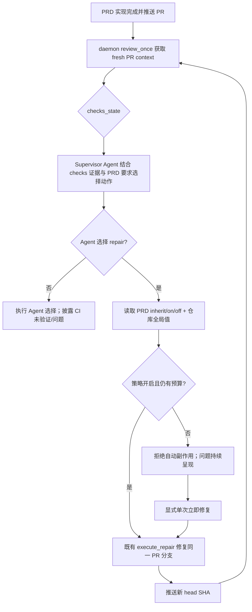

# PRD: Roadmap PRD 完成后 CI/CD 监控与可选自动修复

> ⛔ **交付前置**：硬依赖 Agent-led Post-PR CI Decision PRD `P1-BUG-20260924-100212-agent-led-post-pr-ci-decision.md`；必须先完成 Supervisor 的 CI 决策契约，再将其产品化。前端上游 `P1-FEAT-20260916-122645-roadmap-prd-controls-evidence-autopilot` 已归档，统一右侧详情容器和受限 `.iar.toml` writer 已可用。
> 结构化声明见 §8 Delivery Dependencies，**那里是唯一事实源**。

> ⬜ **验收状态**：未开工。
> 本行是 §9 Acceptance Checklist 的投影，**那里是唯一事实源**。

本文档分两个高度：**Part A（§1–§4）** 给人确认行为与风险，**Part B（§5–§13）** 给执行器实现和验证。

## Feature Overview (功能一览)

> 本块是 §10 Functional Requirements 的通俗投影，不是第二事实源；行为验收以 §1 行为样例表为准。

- **PRD 完成后必须等待真实 CI/CD**（FR-1、FR-2）：有 PR 的任务不能从“实现完成”直接进入交付完成；系统持续读取同一 PR 的 GitHub checks，直到通过或出现可见问题。
- **当前仓库的全局自动修复**（FR-3、FR-4）：Roadmap 顶部提供“全局自动修复 CI/CD”开关，统一控制当前仓库所有 PRD；它只约束 Agent 选出的自动 repair 动作，不把 checks 状态映射成动作。
- **每个 PRD 可继承或覆盖**（FR-13、FR-14）：右侧提供 `跟随全局 / 强制开启 / 强制关闭` 三态控制；未设置时继承仓库全局值，并始终显示最终生效值。
- **允许多轮 repair 与复检**（FR-5、FR-6）：Supervisor Agent 根据 checks 详情与 PRD 要求决定是否 repair；每次获准的修复推送后重新读取新 head SHA，直到 Agent 选择其它动作或达到既有修复上限。
- **关闭时失败成为右侧问题**（FR-7、FR-8）：开关关闭不触发 Agent；失败 check 以问题卡显示原始名称、摘要、轮次和 GitHub 链接，保持可见直到状态改变。
- **崩溃重入不重复修复**（FR-9、FR-10）：状态从 PR checks 与既有事件 marker 重建，同一 head SHA/失败轮次只触发一次自动修复，不新增数据库事实源。
- **人工仍可发起单次修复**（FR-11）：自动修复关闭或耗尽时，操作者可从问题卡显式请求一次修复；该动作仍受 worktree、修复上限与安全门禁约束。
- **原有本地验证、签核和合并门禁不变**（FR-12）：本功能只补齐 post-PR CI/CD 等待与呈现，不把预提交验证、人工 sign-off 或自动合并压成一个开关。

# Part A · 人审层 (Review Layer)

## 1. Introduction & Goals

### Problem Statement

当前 runner 已能读取 PR 的 `checks_state`/`checks_summary`，`review_once` 会在 PR 上下文变化时触发 supervisor。独立的 Agent-led Post-PR CI Decision PRD 将让 Supervisor Agent 结合原始 checks 与 PRD 验收要求决定等待、修复或交人审；本 PRD 在其上产品化 CI/CD 状态和用户可控的自动修复策略。Roadmap 当前 `RoadmapPrd` 契约只暴露 PRD 状态、验收计数和 next action，无法在选中 PRD 的右侧区分 checks、repair 轮次、策略与问题。

仓库另有 `runner.fix_agent_enabled`，但它只处理提交前 staged verification 失败，不是 GitHub PR checks 开关；直接复用其语义会把两个时点和两类副作用混为一谈。

### Interpretation (解读回显)

**行为样例**（下表每一行都会逐字变成验收标准，修改单元格即修改对应验收条件）：

| 输入 / 操作 | 期望观察到的结果 |
|---|---|
| PRD 实现已完成并已推送 PR，GitHub checks 为 `PENDING` | Roadmap 右侧显示“等待 CI/CD”、当前 head SHA 与轮询状态；任务不得显示为可归档或已交付 |
| 全局自动修复已打开，checks 为 `FAILURE`，Supervisor Agent 根据已执行测试失败选择 `repair_pr_branch` | 对该 head SHA 至多启动一次获准的 repair；push 新 head 后重新获取 checks。`FAILURE` 本身不触发 repair |
| 自动 repair 后新 head 再次 `FAILURE`，Agent 再次选择 repair，直至达到 repair 上限 | 每个新 head 各记录至多一轮获准 repair；达到 `max_repair_attempts` 后停止自动动作并保留耗尽原因 |
| 全局自动修复未打开，checks 为 `FAILURE`，Agent 将零 job/账单限制判断为未执行且选择人审 | 不启动 repair、不产生修复提交；问题详情明确显示 CI 未运行/未验证，不得标成代码失败、通过或已验收 |
| 全局关闭，但选中 PRD 设置为“强制开启” | 仅该 PRD 的真实 CI 失败自动进入 repair；详情同时显示“强制开启”和“当前生效：开启”，其他未覆盖 PRD 仍关闭 |
| PRD 从“强制关闭”改回“跟随全局” | 清除显式覆盖并立即按当前仓库全局值计算；不得把当时的全局布尔值复制成永久 per-PRD 设置 |
| daemon 重启，或 GitHub 暂时不可达（失败/恢复情况） | 重启后从 checks 与 markers 恢复且同一 head 不重复修复；不可达时显示最近成功同步时间，不得当作通过或启动修复 |

**我默默定了这些**：

- “全局”指当前选中仓库范围，默认关闭；该仓库所有 PRD 共享偏好，不是跨所有受管理仓库的一把总开关，也不为每个 PRD 保存独立开关。
- 每个 PRD 的策略是三态：`inherit`（默认/未设置）、`on`、`off`；最终生效值按“显式 `on/off` 优先，否则全局值”计算。
- 单 PRD 覆盖以对应 GitHub Issue 的最新 `iar:ci-auto-repair-policy` marker 为事实源；没有 Issue 的 PRD 只能跟随全局，控制项禁用并说明原因。
- “PRD 完成”指实现、提交、PR 创建与 runner 本地验证已结束，但交付仍需等待远端 checks；无 PR 的任务保持原有流程。
- `checks_state` 本身不触发动作。Supervisor Agent 判断真实执行失败、未运行/基础设施不可用或信息不足；自动修复开关和次数上限只约束 Agent 选择的自动 `repair_pr_branch` 动作。
- 轮次事实源使用 GitHub PR head SHA、checks 和现有 `iar:event` marker，不新增数据库表或前端自造历史。
- 多轮上限复用 `post_pr_supervisor.max_repair_attempts`，不再增加第二个次数配置。
- 手动“立即修复”是一次性请求，不会暗中打开仓库级自动修复。
- 问题卡以 GitHub `checks_summary` 为输入；若只能得到汇总状态，明确显示汇总错误而不伪造 job/日志细节。

**我理解为不做**：

- 不在本 PRD 中实现 GitHub Actions 日志全文抓取、日志流式展示或任意 CI 厂商插件系统。
- 不让开关绕过 verifier、人工 sign-off、禁止路径、rebase、合并或分支保护门禁。
- 不自动修复部署环境、密钥、额度、审批等需要外部权限或人工决策的问题。

**文字版解读**：本需求读作“把 PRD 的交付尾段扩展为可观察、可重入的远端 CI/CD 等待阶段；用户可按仓提供默认自动修复策略，也可让单个 PRD 跟随、强制开启或强制关闭，并允许多轮修复/复检。最终生效值必须可见；关闭时系统仍持续监控，只把失败作为右侧问题展示”。它不是新建 CI 执行器，也不是新增一套 Agent、队列或合并状态机。

### What The User Gets

Roadmap 操作者能在顶部为当前仓库统一开关自动修复，并看到每个 PRD 的原始 CI 状态、Supervisor Agent 决定、未验证说明和下一次同步时间。开关只控制 Agent 选择的 repair 是否能自动执行；它不会将账单/零 job 的失败状态误当成代码失败。

### Measurable Objectives

- 有 PR 的任务在 checks 未 `SUCCESS` 前不会被展示为 CI/CD 已完成或进入最终完成态。
- 同一 PR head SHA 的同一失败观察最多触发一次自动修复；新修复 commit 产生新 SHA 后才允许下一轮。
- 开关关闭时，Agent 选择的自动 repair 不执行、不产生修复提交；Supervisor 仍会收到 checks 状态并能选择其它合法动作。
- 开关打开时至少验证两轮 `Agent selects repair → new SHA → Agent selects repair → new SHA → checks SUCCESS`；零 job/账单导致 workflow 未运行时不得由 FAILURE 自动触发 repair。
- daemon 重启、GitHub 暂时不可达和修复次数耗尽均不会造成重复修复、无限循环或假绿。
- 三态矩阵全部可判定：`inherit` 随全局实时变化，`on/off` 不受全局变化影响；清除覆盖后恢复 `inherit`。

## 2. Human Review Map (介入与风险地图)

### 决策一：自动修复默认关闭，并与 Autopilot/本地 Fix Agent 分开

自动修复会让 Agent 修改代码并推送新的 PR commit，副作用高于纯监控。推荐新增独立的仓库级 `post_pr_supervisor.auto_repair_ci=false`，Roadmap 只切换这一项。它不跟随顶部 Autopilot 自动打开，也不复用提交前 `runner.fix_agent_enabled`；这样用户可以自动排程但仍人工处理 CI，或反之。

**请确认：** 接受“自动修复 CI/CD”默认关闭，且不与 Autopilot、自动合并或提交前 Fix Agent 联动？

**验收：** 新仓库/缺省配置显示关闭；切换前后配置 diff 只有目标布尔值变化；关闭态不执行 repair、不产生修复 commit，Supervisor 仍可判断并呈递问题。

### 决策二：多轮 Agent repair 复用既有 supervisor 上限，耗尽后停下并显错

Agent 可能多轮选择 repair，但无限循环会持续消耗资源并可能反复改坏代码。推荐每个 PR 延续现有 `post_pr_supervisor.max_repair_attempts` 上限；仅 Agent 选择 repair 后，以 `head SHA + failure summary` 去重，每次修复成功推送后才进入新一轮。达到上限、worktree 不可恢复或 repair 失败时，停止自动动作，把原因作为问题保留给人。

**请确认：** 接受多轮自动修复受既有 repair attempts 上限约束，耗尽后不再自动重试，必须人工处理或显式发起单次修复？

**验收：** Agent 连续选择 repair 的场景严格执行配置轮数；最后一次耗尽后轮询仍继续、repair 副作用停止，右侧显示“修复次数已用尽”和当前问题。

### 决策三：单 PRD 使用三态覆盖，并随 Issue 保存

二态开关无法区分“明确关闭”和“没有设置”，会导致全局值变化时行为不可预测。推荐用 `inherit / on / off` 三态：默认 `inherit`；覆盖写入对应 GitHub Issue 的幂等策略 marker，daemon 与 Console 都从同一评论流读取最新值。这样覆盖跟随任务存在，不依赖只在本机可见的 Console SQLite，也不受 PRD 从 pending 移到 archive 的路径变化影响。

**请确认：** 接受每个 PRD 使用“跟随全局 / 强制开启 / 强制关闭”三态，并将覆盖保存在对应 Issue marker；无 Issue 时只允许跟随全局？

**验收：** 全局开关与三态组成的六种组合都显示正确生效值；重启 daemon/console 后选择不变；PRD 归档改路径后仍按同一 Issue 读取覆盖；恢复跟随全局后立即响应全局变化。

三项决策保持在同一 PRD：全局默认、单 PRD 覆盖和多轮执行共同决定同一个 effective policy；拆开会迫使中间版本临时采用二态或双事实源，并让 daemon 与 UI 在过渡期对同一失败得出不同结论。

### 自动门禁，不需要逐项人工审阅

checks 展示、Agent repair action 策略、事件 marker 去重、未知状态降级、API 路径与前端渲染通过 core/API 测试和真实 Roadmap E2E 覆盖；配置写回复用上游已交付的受限原子 writer（`repository_settings_editor` / `toml_section_editor.update_toml_table_keys`）；GitHub 网络在常规测试中由 fake client 隔离，真实 GitHub sandbox 验证为 opt-in。

**本次明确不涉及**：无数据库结构变化；不改 GitHub Actions workflow；不改 CI job 本身；不新增前端路由；不改 `frontend-admin/`。

## 3. Usage And Impact After Implementation

**Roadmap 操作者**：仍从 `/app/roadmap/` 选择仓库和 PRD。顶部提供仓库全局默认值；右侧提供当前 PRD 的“跟随全局 / 强制开启 / 强制关闭”和最终生效值。CI 状态卡展示 GitHub 原始状态；动作和原因展示 Supervisor Agent 的决定。Agent 判为未运行/基础设施不可用时，问题卡明确写“未验证”，而非“代码失败”或“通过”。关闭自动修复不会停止监控。

**代码审阅者/验收者**：从问题卡跳转到对应 GitHub check；可分辨机器 CI 失败、人工 sign-off 门禁和 GitHub 不可达。已有 PR 审阅、verifier 与 sign-off 流程保持不变。

**daemon 运维者**：daemon 的既有 review pass 继续刷新 checks 并唤起 Supervisor。打开自动修复后，Agent 选择 repair 才进入既有修复路径；重启不需要恢复新数据库，marker 与 PR head 足以重建状态。达到上限后持续观测并禁止新的自动 repair。

**CLI/API 调用方**：既有 issue monitor 与 Roadmap 列表保持兼容；Roadmap PRD 响应增加结构化 CI 状态，另提供仓库级设置更新与显式单次修复动作。

## 4. Requirement Shape

- **actor**：Roadmap 操作者、代码审阅者/验收者、daemon 运维者；API 调用方读取相同状态。
- **trigger**：PRD 对应 PR 创建/更新后 checks 变化；操作者切换自动修复；操作者显式请求单次修复；daemon review pass 重入。
- **expected behavior**：按 `PRD override ?? repository global` 计算最终策略；持续等待真实 checks；生效为开时按上限多轮修复并复检，关闭时零自动副作用且右侧展示问题；崩溃重启不重复处理同一轮。
- **explicit scope boundary**：只处理 GitHub PR checks 与既有 supervisor repair；不执行 CI workflow、不抓取完整日志、不改合并/签核门禁、不新增持久化表。

# Part B · 执行器层 (Build Layer)

## 5. Repository Context And Architecture Fit

**当前相关路径**：

- `src/backend/core/use_cases/review_once.py` 已按 `checks_state` 变化触发 supervisor；当 Supervisor Agent 选择 `wait_for_checks` 时返回 `waiting_for_checks` outcome，`PENDING` 本身不触发动作改写。
- `src/backend/core/use_cases/pr_supervisor.py` 在 Agent-led Post-PR CI Decision PRD 交付后不再按 `FAILURE`/`PENDING` 强制改写动作；`execute_repair` 和 repair loop 已有次数上限。
- `src/backend/core/use_cases/agent_runner_merge_queue.py::_wait_for_checks_green` 已轮询 PR context，但面向自动合并，不是 Roadmap 状态或可选修复控制面。
- `src/backend/core/use_cases/agent_runner_events.py` 已提供 `iar:event` marker 的格式化/解析与最新事件读取，是单 PRD 策略 marker 的复用模式。
- `src/backend/infrastructure/github_pr_ops.py` 已把 GitHub `statusCheckRollup` 聚合为 `checks_state` 与 `checks_summary`。
- `frontend-public/components/agent-runner/issue-detail.tsx` 已渲染 PR checks 与事件时间线，可复用状态标签语义，不复制 GitHub 状态翻译。
- `frontend-public/app/(app)/app/roadmap/page.tsx`、`components/roadmap/`、`lib/api/roadmap.ts` 与 `lib/api/types.ts` 是 Roadmap UI/API 契约入口。
- `frontend-public/components/roadmap/prd-detail.tsx` 是上游已交付的统一右侧详情容器，暴露 `PrdDetailTab` / `additionalTabs`，是本 PRD 追加 CI/CD tab 的扩展点。
- `src/backend/infrastructure/config/repository_settings_editor.py`（白名单写回）与 `src/backend/infrastructure/config/toml_section_editor.py::update_toml_table_keys`（共享原语）是仓库 `.iar.toml` 设置的受限写入口。
- `src/backend/core/shared/models/roadmap.py` 与 `src/backend/api/routes/agent_runner_roadmap.py` 负责 Roadmap PRD 状态及响应装配。
- `src/backend/infrastructure/config/agent_runner_settings.py` 和 `engines/agent_runner/factory_config_builder.py` 已映射 `post_pr_supervisor`/runner 配置。

**Existing Path**：daemon `review_once` → PR context → supervisor decision → `execute_repair` → push/review → 下一次 checks；展示路径为 Roadmap API → `RoadmapPrd` → 统一 PRD 右侧详情。

**Reuse Candidates**：checks 聚合、`build_rework_intent_comment`/`iar:event` marker parser、repair loop 与 `max_repair_attempts`、上游已交付的 `repository_settings_editor`（白名单写回，底层为 `toml_section_editor.update_toml_table_keys`）、`prd-detail.tsx` 的 `additionalTabs` 详情扩展点、Roadmap 30 秒刷新、Issue detail 的 checks badge/summary。

**Architecture Constraints**：自动修复策略和去重属于 core；GitHub 与 TOML 实现留在 infrastructure；API 只做 DTO/调用；前端只消费规范 API。不得让 core import FastAPI、tomlkit 或 concrete GitHub client。

**Frontend Impact**：**Full-stack**，只改 `frontend-public` Roadmap 的统一右侧详情、API client 与类型；`frontend-admin` 无影响。运行命令 `just run frontend-public`，真实 UI 验证 `just e2e tests/workflows/roadmap-cicd-auto-repair.no-auth.spec.ts`。

**Existing PRD Relationship**：硬前置 `P1-BUG-20260924-100212-agent-led-post-pr-ci-decision.md` 定义 Supervisor Agent 对原始 checks 与 PRD 验收要求的决策契约，并移除 checks→动作改写；本文仅在其上增加 Roadmap 展示、repair 策略控制和轮次产品化。此前端硬前置 `P1-FEAT-20260916-122645-roadmap-prd-controls-evidence-autopilot` 已归档，建立统一右侧详情、`additionalTabs`、Autopilot 设置 writer 与 PRD 证据 tabs。受限 `.iar.toml` 写回复用 `repository_settings_editor` / `toml_section_editor.update_toml_table_keys`。相关已归档 PRD：`P1-BUG-20260527-093356-agent-runner-ci-rework-state-recovery`（恢复）、`P1-FEAT-20260703-105322-autopilot-merge-queue-fast-profile`（checks 等待/自动合并）、`P1-FEAT-20260824-133115-runner-delivery-closeout-agent`（交付尾段）。

**Potential Redundancy Risks**：不要新建 CI worker、repair Agent、轮询线程、数据库 round/override 表或第二套 event log；不要用 PRD path 作为长期 override key；不要把 `runner.fix_agent_enabled` 改名挪用；不要在前端自行计算 effective value。

## 6. Recommendation

### Recommended Approach

在 Agent-led Post-PR CI Decision PRD 交付后，为 Supervisor 已选的 repair 动作增加策略约束，并在 Roadmap 聚合一份只读 `ci_delivery` 视图：

1. 给仓库配置 `post_pr_supervisor.auto_repair_ci` 增加默认 `false`，通过 `repository_settings_editor` 的白名单 PATCH 修改（底层复用 `toml_section_editor.update_toml_table_keys`）。
2. 从 Issue 评论解析最新 `iar:ci-auto-repair-policy`（`inherit/on/off`），与 fresh 全局配置合成唯一 effective bool；没有 marker 即 `inherit`。
3. `review_once` 仍持续观察所有 checks；Supervisor Agent 根据原始 checks 与 PRD 验收要求选择动作。仅 Agent 选择 repair 且服务端准备执行时才生成 failure key。
4. Agent 选择 `repair_pr_branch` 且 effective bool 打开、未超过上限时，走现有 repair；关闭/耗尽时拒绝自动副作用并返回可观察 outcome。不得由 checks 状态单独触发 repair/wait/blocked。
5. 从 PR context 与 markers 组装 `ci_delivery`：状态、当前轮次、问题列表、最近同步、stored/global/effective policy、耗尽原因；不持久化派生视图。
6. Roadmap 顶部保留全局开关；右侧新增三态策略、effective value、CI/CD tab 和一次性手动 repair；策略 PATCH 写 marker 后 fresh 读取 Issue 评论回显。

### Proposed Solution Summary (实现机制)

全局配置由 Roadmap 操作者显式提供，系统不从 Autopilot 推断；单 PRD override 由对应 Issue 最新 marker 提供。core 统一计算 `override ?? global`，API 返回 stored policy、global value 与 effective value，前端不得自行推断。GitHub `statusCheckRollup` 是 checks 真值，事件 marker 是策略、修复请求/完成的幂等历史。避免新增存储、后台服务、WebSocket、CI provider abstraction 和重复 repair implementation。

### Alternatives Considered

- **复用 `runner.fix_agent_enabled`**：拒绝；该值控制 pre-commit staged verification，与远端 CI 的时点、Agent 和副作用不同。
- **把开关存进 Roadmap SQLite settings**：拒绝；daemon 消费 `.iar.toml`，另存会形成两个事实源。
- **每个 PRD 保存独立开关/轮次表**：拒绝；需求是一个开关，轮次可由不可变 head SHA + markers 重建，新表增加迁移与一致性成本。
- **把 PRD 覆盖存入 Console SQLite 或按 PRD path 写 `.iar.toml` map**：拒绝；daemon 与其他机器可能看不到本地 SQLite，PRD 归档又会改变 path，Issue marker 才是稳定任务身份。
- **新增独立 CI polling worker/WebSocket**：拒绝；daemon review pass 与页面 30 秒刷新已覆盖所需时效。

## 7. Implementation Guide

> This section is a living implementation guide based on current repository analysis. If implementation discovers additional affected files, hidden dependencies, edge cases, or a better path, update this PRD before proceeding.

### Core Logic

1. PRD 对应 Issue/PR 进入 review 阶段后，daemon 获取 fresh PR context。
2. 将原始 checks 状态/摘要与 PRD 验收要求交给 Supervisor Agent；不从 `PENDING`/`FAILURE`/`SUCCESS` 推导动作。
3. Agent 选择 `repair_pr_branch` 后才计算 failure key，检查 marker、自动修复策略与 repair 次数。
4. 自动修复关闭或次数耗尽时不产生自动副作用，持续展示问题；Agent 选择 wait、人审或请求输入等其它合法动作时保留其结论，并如实呈递未验证项。
5. repair push 后以新 head 为新轮，后续 daemon pass 重新等待 checks。
6. Roadmap API 每次 fresh 读取 PR + marker，返回派生 `ci_delivery`；前端不缓存成功覆盖新失败。

### Change Impact Tree

```text
.
├── src/backend/core/shared/models/agent_runner.py
│   [修改]【总结】给 post-PR supervisor 配置增加独立的 CI 自动修复策略
│   └── 新增 auto_repair_ci，默认 false
├── src/backend/core/shared/models/roadmap.py
│   [修改]【总结】定义 Roadmap CI 交付状态、轮次和问题的跨层 DTO
│   ├── CiDeliveryStatus / CiCheckProblem
│   └── RoadmapPrd 增加 ci_delivery
├── src/backend/core/use_cases/review_once.py
│   [修改]【总结】持续监控 checks，并只对 Agent 选择的 repair 应用策略与上限
│   ├── 复用 Agent-led CI 决策，不根据 checks 状态自行分类
│   ├── 用 head SHA + failure digest 去重
│   └── 保留明确 outcome/marker
├── src/backend/core/use_cases/roadmap_ci_delivery.py
│   [新增]【总结】从 PR context 与事件 marker 投影 Roadmap CI 状态，不持久化派生数据
│   ├── 组装当前轮次与问题列表
│   ├── 解析 inherit/on/off 并计算 effective policy
│   └── 构造一次性手动 repair 请求
├── src/backend/core/use_cases/agent_runner_events.py
│   [修改]【总结】增加单 PRD CI 自动修复策略 marker 的稳定格式化与 latest-wins 解析
├── src/backend/infrastructure/config/agent_runner_settings.py
│   [修改]【总结】加载 auto_repair_ci 的仓库默认值与校验
├── src/backend/engines/agent_runner/factory_config_builder.py
│   [修改]【总结】把 infrastructure 设置映射到 core AppConfig
├── src/backend/api/routes/agent_runner_roadmap.py
│   [修改]【总结】暴露 CI 状态、自动修复设置和一次性手动修复入口
│   ├── Roadmap response 增加 ci_delivery
│   ├── PATCH auto-repair 设置
│   ├── PATCH PRD override 并 fresh 回读 Issue marker
│   └── POST 单次 repair，保留幂等/上限门禁
├── frontend-public/lib/api/types.ts
│   [修改]【总结】同步 CI 交付、问题和设置契约
├── frontend-public/lib/api/roadmap.ts
│   [修改]【总结】封装 auto-repair PATCH 与单次 repair API
├── frontend-public/components/roadmap/prd-detail.tsx
│   [修改]【总结】经上游已交付的 `additionalTabs` 扩展点增加 PRD 三态策略、effective value、CI/CD tab 和问题卡，不重构详情容器
├── frontend-public/app/(app)/app/roadmap/page.tsx
│   [修改]【总结】在顶部接入当前仓库全局开关，并把轮询结果与 repair action 接入选中 PRD
├── tests/
│   [修改/新增]【总结】覆盖配置映射、关闭零副作用、多轮修复、重启去重和 API 契约
├── tests/playwright-e2e/tests/workflows/roadmap-cicd-auto-repair.no-auth.spec.ts
│   [新增]【总结】从真实 Roadmap 入口验证等待、关闭显错、开启多轮和耗尽态
└── docs/
    [修改]【总结】同步 runner 配置、Roadmap CI 流程、API 与原型索引
    ├── prototypes/hub.html + assets/prototype-hub.css 登记可视化卡片入口
    └── prototypes/index.md / mkdocs.yml 保持 Hub 可发现
```

前端落点已按上游归档 PRD 的最终结构核实：统一详情是 `frontend-public/components/roadmap/prd-detail.tsx`，其 `PrdDetailProps.additionalTabs` 即为本 PRD 追加 CI/CD tab 的扩展点（上游归档 PRD §9 已明确该容器按可扩展设计）。实现前先运行：

```bash
rg -n "checks_state|post_pr_rework_requested|execute_repair|max_repair_attempts|RoadmapPrd" src/backend frontend-public tests
rg -n "fix_agent_enabled|autopilot.enabled|auto_merge" src/backend docs config.toml
```

### Risk Classification Register

| Change point | Tier | Decisive dimension / override | Intervention | Oracle / gate |
|---|---|---|---|---|
| post-PR CI 自动修复策略与多轮去重 | R2 | core orchestration fixed zone；错误会重复修改/推送代码 | Human confirmation | rv-1 |
| per-PRD override 与继承计算 | R2 | core workflow contract；错误会对错误任务产生或抑制代码修改 | Human confirmation | rv-2 |
| `.iar.toml` 设置写回 | R2 | 跨进程配置与持久文件完整性 | Human confirmation | rv-2 |
| Roadmap CI 状态/问题显示 | R1 | 单一 UI/API 视图，可逆且无写副作用 | Executor + E2E | rv-3 |
| 手动单次 repair | R2 | 显式远端代码修改动作，但复用既有受限 repair | Executor + strong oracle | rv-4 |
| 文档、类型、构建 | R0 | 机械同步 | Automated gates | rv-5 |

### Executor Drift Guard

上游 PRD 已交付并归档，统一详情组件（`prd-detail.tsx`，含 `additionalTabs`）与配置 writer（`repository_settings_editor`，底层 `toml_section_editor.update_toml_table_keys`）已在代码库落地，Change Impact Tree 是起点而非完整文件清单。实现前用上述 `rg` 重定位最终 symbol；这些既有扩展点必须复用而非另造。交付前用 `rg -n "auto_repair_ci|ci_delivery|ci_failed_manual|ci_repair_exhausted"` 检查契约贯通，并用 `rg -n "fix_agent_enabled.*CI|autopilot.*auto_repair"` 排除错误联动。

### Flow / Architecture Diagram


```mermaid
flowchart TD
    A["PRD 实现完成并推送 PR"] --> B["daemon review_once 获取 fresh PR context"]
    B --> C{"checks_state"}
    C --> D["Supervisor Agent 结合 checks 证据与 PRD 要求选择动作"]
    D --> E{"Agent 选择 repair?"}
    E -->|否| G["执行 Agent 选择；披露 CI 未验证/问题"]
    E -->|是| H["读取 PRD inherit/on/off + 仓库全局值"]
    H --> M{"策略开启且仍有预算?"}
    M -->|否| I["拒绝自动副作用；问题持续呈现"]
    M -->|是| J["既有 execute_repair 修复同一 PR 分支"]
    J --> K["推送新 head SHA"]
    K --> B
    I --> L["显式单次立即修复"]
    L --> J
```

### Realistic Validation Plan

```yaml
- id: rv-1
  behavior: Supervisor Agent 根据执行失败证据选择 repair 后，自动修复策略允许时跨新 head 重试；同一 Agent repair 决定重入不重复修复
  reviewer: human
  real_entry: "在 GitHub sandbox 仓库运行 daemon：为测试 PR 依次产生 FAILURE(head A) -> repair/head B -> FAILURE -> repair/head C -> SUCCESS，并在 /app/roadmap 查看状态"
  expected: "每次 repair 都对应 Agent 合法 repair action；每个新 head 至多一次且最多两轮；零 job/billing 场景不因 FAILURE 自动 repair；重启后同一 action/failure key 不重复"
  mock_boundary: "opt-in sandbox 使用真实 GitHub PR/checks、真实 daemon/worktree/repair Agent；默认 CI 用 fake GitHub 状态机覆盖相同序列，不要求生产凭据"
  tier: R2
  test_layer: sandbox
  required_for_acceptance: true
  presentation: "tasks/evidence/P1-FEAT-20260916-134008-roadmap-prd-cicd-monitor-auto-repair/rv-1-multiround-ci-repair.webm；自检：时间线只有第 1、2 轮两次 repair，最终为通过"
  critical_value_source: "GitHub statusCheckRollup 返回的 checks_state/checks_summary 和每次 PR head SHA；轮次来自既有 iar:event marker"
  must_cross: "GitHub checks -> infrastructure GitHub client -> review_once policy -> existing execute_repair -> git push new head -> new GitHub checks -> Roadmap API -> browser"
  forbidden_bypasses: "不得直接调用 repair helper冒充 checks 触发；不得手工注入前端轮次；不得复用旧 head 的 SUCCESS；不得绕过真实 push"
  fresh_state_probe: "每次 repair 后用新 GitHub API request读取新 head/checks；中途重启 daemon 并从新浏览器 context 读取 Roadmap"
  final_tree_evidence: "录屏、event marker 与 PR head 序列在最终代码树重采；policy、GitHub adapter、repair 或 UI 改动后重跑"
  negative_control: "在 auto_repair_ci=false 的同一 FAILURE 序列运行一个 review pass"
  expected_fail: "若出现 Agent 调用或新 head，负控失败；页面应只显示问题"
- id: rv-2
  behavior: 自动修复默认关闭；PRD 可跟随全局、强制开启或强制关闭，六种组合的 effective value 正确；关闭态零自动副作用，耗尽后停止副作用并保持问题
  reviewer: human
  real_entry: "真实 console + 临时仓库 .iar.toml，在 /app/roadmap 切换自动修复，刷新并运行 FAILURE/耗尽场景"
  expected: "缺省全局关闭且 PRD=inherit；六种组合全部正确；切回 inherit 会跟随全局变化；配置 diff 只有 auto_repair_ci，override 只产生 latest policy marker；关闭态可以运行 Supervisor 判断但不执行自动 repair/commit；耗尽后显错"
  mock_boundary: "真实 FastAPI、真实临时配置文件和真实浏览器；GitHub/Agent 用记录副作用的 fake，配置 writer 不 mock"
  tier: R2
  test_layer: e2e
  required_for_acceptance: true
  presentation: "tasks/evidence/P1-FEAT-20260916-134008-roadmap-prd-cicd-monitor-auto-repair/rv-2-toggle-off-and-exhausted.webm + rv-2-config-diff.txt；自检：关闭态问题可见且 worktree HEAD 不变"
  critical_value_source: "全局值来自 fresh AppConfig；override 来自对应 Issue 最新策略 marker；问题来自 checks_summary；commit 计数来自真实临时 worktree HEAD"
  must_cross: "global: browser PATCH -> API -> TOML writer -> fresh load；override: browser PATCH -> API -> GitHub Issue marker -> fresh comments parse -> core effective policy -> daemon/UI"
  forbidden_bypasses: "不得写 console.db/前端 localStorage；不得按 PRD path 长期存 override；不得联动其他开关；不得由前端计算 effective value"
  fresh_state_probe: "重启 console 后新标签读取开关；每个场景从新 worktree/GitHub fake 状态重建并读取 HEAD"
  final_tree_evidence: "录屏与 config diff 在最终 writer/API/UI 树采集；任一相关变更后重采"
  negative_control: "临时测试边界把 auto_repair_ci=false 改为 true 后重跑关闭场景"
  expected_fail: "出现 repair 调用/新 commit，零副作用断言变红"
- id: rv-3
  behavior: Roadmap 同时呈现 GitHub 原始 checks 状态与 Supervisor 决定/未验证说明；全局/单 PRD effective repair policy 在刷新后稳定
  reviewer: human
  real_entry: "just e2e tests/playwright-e2e/tests/workflows/roadmap-cicd-auto-repair.no-auth.spec.ts"
  expected: "原始状态、check 摘要与 Agent outcome 分开呈现；零 job 场景明确未验证；策略显示刷新稳定，不把 aggregate FAILURE 呈现成代码失败或通过"
  mock_boundary: "真实 console/FastAPI/Next.js 页面；GitHub adapter 在 API 边界提供确定性 PR context，Roadmap under-test path 不 mock"
  tier: R1
  test_layer: e2e
  required_for_acceptance: true
  presentation: "tasks/evidence/P1-FEAT-20260916-134008-roadmap-prd-cicd-monitor-auto-repair/rv-3-roadmap-ci-problems.png（标注 real UI / fake GitHub boundary）；自检：CI/CD tab 数字等于卡片数"
- id: rv-4
  behavior: 自动修复关闭或耗尽时，操作者可显式请求一次修复；重复点击/重试对同一 failure key 幂等且仍受修复上限、worktree 和禁止路径门禁
  reviewer: verifier
  real_entry: "uv run pytest -o addopts=\"\" tests/test_roadmap_ci_delivery.py tests/test_roadmap_api.py -k 'manual_repair or idempotent or exhausted' -v"
  expected: "首次合法请求进入既有 repair；重复请求不重复 commit；耗尽、无 worktree 或无法 fresh-read 当前 PR/checks 时返回明确冲突/no-op"
  mock_boundary: "FastAPI TestClient 和 core policy 真实；GitHub/Agent/process runner 使用记录副作用 fake"
  tier: R2
  test_layer: integration
  required_for_acceptance: true
  critical_value_source: "请求中的 PRD path 经 server 解析到当前 PR number/head/failure key，不能由前端提交可信 SHA"
  must_cross: "POST manual repair -> repository/PR resolution -> current failure validation -> existing repair gate -> marker/side effect"
  forbidden_bypasses: "不得接受客户端伪造 head/round；不得直接 shell 调 Agent；不得绕过 max attempts、forbidden paths 或 dirty worktree checks"
  fresh_state_probe: "请求后重新读取 Issue markers、PR head 与 worktree；第二次相同请求从 fresh TestClient 验证零新增副作用"
  final_tree_evidence: "定向测试在最终 API/policy/repair 树运行；契约或 repair 边界变化后重跑"
- id: rv-5
  behavior: 后端/前端契约、架构、复用、全仓测试、静态构建和文档保持通过
  reviewer: verifier
  real_entry: "just lint --reuse && just lint --full && just test && cd frontend-public && pnpm typecheck && pnpm build && cd .. && uv run mkdocs build --strict"
  expected: "全部退出 0；无重复 CI 状态机、反向依赖、类型漂移或文档断链"
  mock_boundary: "各质量门禁既有边界；无行为 mock"
  tier: R0
  test_layer: smoke
  required_for_acceptance: true
```

失败排查：重复 repair 先检查 failure key 与 `post_pr_rework_requested` marker；假绿先核对 head SHA 是否为最新；页面问题缺失先比较 GitHub adapter `checks_summary` 与 Roadmap `ci_delivery.problems`；设置漂移先检查 `repository_settings_editor` 的 allowlist 和 fresh load。

### Low-Fidelity Prototype

```text
┌ Roadmap 仓库控制条 ───────────────────────────────────────────────┐
│ [● Autopilot 自动推进]  [○ 全局自动修复 CI/CD · 已关闭]           │
│                         当前仓库所有 PRD · 失败后修复并持续复检    │
├ PRD 详情 ─────────────────────────────────────────────────────────┤
│ Agent Runner 会话持久化  [等待 CI/CD]                 [查看 Issue] │
│ 此 PRD 的自动修复 [跟随全局*] [强制开启] [强制关闭]              │
│ 当前生效：关闭 · 未单独设置，继承当前仓库全局策略                │
│ [PRD 原文] [验收证据 2] [CI/CD 1]                                 │
│ ┌ CI/CD 检查未通过 [1 个问题]  最近同步：刚刚 · 下次：30 秒后 ┐ │
│ │ ✓ 等待检查 ── ✕ 第 1 轮失败 ── ○ 等待处理                    │ │
│ └──────────────────────────────────────────────────────────────┘ │
│ ┌ backend / typecheck [失败]                [查看 GitHub 检查] ┐ │
│ │ mypy 类型检查失败：SessionSnapshot 缺少 resume_token 字段     │ │
│ │ 自动修复已关闭；问题保留在详情中，不会启动修复 Agent。        │ │
│ │                                          [立即修复此问题]     │ │
│ └──────────────────────────────────────────────────────────────┘ │
└──────────────────────────────────────────────────────────────────┘
```

高保真草图：`docs/prototypes/assets/roadmap-prd-cicd-auto-repair.png`。

### Interactive Prototype Change Log

| File Path | Change Type | Before | After | Why |
|---|---|---|---|---|
| `docs/prototypes/assets/roadmap-prd-cicd-auto-repair.png` | Add | 原 Roadmap 草图只有 PRD 原文/验收证据 | 顶部增加仓库全局开关，详情增加 PRD 三态覆盖、生效值、CI/CD tab、多轮摘要与问题卡 | 确认继承/覆盖、关闭显错和多轮监控的信息层级 |
| `docs/prototypes/assets/roadmap-prd-cicd-auto-repair.prompt.md` | Add | 图片没有可继续编辑的出处记录，提示词只在说明页里以摘要形式存在 | 记录保存方式、保持不变区域、逐区域变化、画布与日期，并完整保存本轮两条模型提示词原文与未采纳原因 | 让 AI 生成/编辑图片下次能基于原提示词继续编辑，而不是从零反推 |
| `docs/prototypes/assets/roadmap-prd-cicd-0{1..4}-*.png` + 各自 `.prompt.md` | Add | 只有单张静态草图，无法演示多轮失败与恢复 | 四张 1536 × 1024 状态图（等待 / 第 1 轮修复 / 第 2 轮复查 / 通过）与同名旁车 | 让评审能按轮次走完主线，并为每张图留下出处 |
| `docs/prototypes/roadmap-prd-cicd-auto-repair.html` + `assets/roadmap-prd-cicd-flow.{css,js}` | Add | 静态草图无法点击切换状态 | 图片状态原型入口，保留“关闭自动修复后问题留在详情中”的人工分支 | 用最短路径补上点击演示，并回链说明页 |
| `docs/prototypes/assets/prototype-hub.js` | Add | Hub 只有静态卡片，状态数据手写 | registry 作为唯一清单，由界面渲染列表与详情抽屉 | 避免 HTML/Markdown/脚本三份状态数据互相漂移 |
| `docs/prototypes/roadmap-prd-cicd-auto-repair.md` | Add | 无本功能视觉说明 | 记录草图、交互边界与生成方式 | 让评审和实现者可追溯 |
| `docs/prototypes/hub.html` + `assets/prototype-hub.css` | Add | 仓库只有 Markdown 链接索引，没有可视化原型 Hub | 增加缩略图卡片、最新标记、原图/说明/演示入口与移动端布局 | 让评审从统一视觉入口发现原型，而不是依赖文件路径 |
| `docs/prototypes/index.md` + `mkdocs.yml` | Modify | 无 CI/CD 原型和 Hub 入口 | 增加 Prototype Hub 与本草图导航 | 保持文档站可发现 |

### Data Model

No database schema changes in this PRD. `ci_delivery` 是从 GitHub 和事件 marker 投影的运行时 DTO；仓库默认值持久化为 `.iar.toml` 布尔值，单 PRD 覆盖持久化为对应 GitHub Issue 的 latest-wins marker。

### External Validation

No external validation required; repository code and existing PRDs were sufficient.

## 8. Delivery Dependencies

- Group: roadmap-delivery-control
- Depends on tasks/issues:
  - tasks/pending/P1-BUG-20260924-100212-agent-led-post-pr-ci-decision.md
- Gate type: hard
- Notes: 先交付 Agent-led CI 决策契约，确保 Roadmap 的 repair 策略只限制 Agent 选择的动作，而不是新增 checks→动作映射。前端容器与设置 writer 的历史依赖已由归档上游满足。

## 9. Acceptance Checklist

### 9.1 人读呈递区（Human Review Surface）

| 要看的结果 | 呈递物 | 10 秒自检 |
|---|---|---|
| 右侧 CI/CD tab 分开显示原始状态与 Agent 决定/未验证说明 | `.../rv-3-roadmap-ci-problems.png` | 零 job 场景未被标为代码失败或 CI 通过 |

注：rv-1、rv-2、rv-4、rv-5 属于 `reviewer: verifier`，不在人读呈递区逐项展示，仅失败时上报。

### 9.2 Acceptance Evidence Package

1. **Human-Confirmed / R2**：rv-1 由 Agent 选择的多轮自动修复、重启去重和零 job 不触发 repair；rv-2 默认关闭、配置隔离、耗尽停止。
2. **R2 verifier**：rv-4 手动 repair 的 server-side 解析、幂等与安全门禁。
3. **R1 human**：rv-3 真实 Roadmap 入口的状态/问题呈现。
4. **R0 verifier**：rv-5 架构、复用、测试、构建与文档。

#### Architecture Acceptance

- [ ] `review_once`/新 policy 只调用既有 supervisor repair，未新增 Agent runner、队列、轮询线程或数据库表；代码搜索与 Change Impact Tree 一致
- [ ] core 未 import `backend.infrastructure`/FastAPI/tomlkit；API 未直接执行 Git/Agent；架构 guard 通过
- [ ] `runner.fix_agent_enabled`、`autopilot.enabled`、`safety.auto_merge` 与 `post_pr_supervisor.auto_repair_ci` 四个语义保持独立，定向配置一致性测试通过
- [ ] CI 状态映射只有一个 core 来源，Roadmap 与 issue detail 复用它或共享常量，不各自解释 `checks_state`
- [ ] PRD override 未写入 Console SQLite、浏览器存储或 PRD path map；daemon 与 API 复用同一个 latest marker parser 和 effective-policy 函数

#### Behavior Acceptance

- [ ] rv-1 通过：Agent 选择的两轮 repair 在两个新 head 上各执行一次；同一 action/head 重入与 daemon 重启零重复；零 job/账单问题不因 FAILURE 自动 repair
- [ ] rv-2 通过：默认/关闭态不执行 repair、不产生 commit；写回只改单一键；达到既有上限后停止修复并持续显错
- [ ] `PENDING`、unknown/unreachable、sign-off-only 均作为原始观察展示；wait/repair/human-review 等动作来自 Agent，状态展示不得伪造通过
- [ ] `inherit/on/off × global on/off` 六种组合全通过；无 marker 等同 inherit；latest marker 胜出；恢复 inherit 后全局变化立即影响 effective value
- [ ] 每个问题来自当前 `checks_summary` 或明确的汇总失败；实现未伪造不存在的 job 名、日志或根因

#### Frontend Acceptance

- [ ] rv-3 截图来自真实 `/app/roadmap/` 生产边界并标注 GitHub fake；Dialog/Portal 不适用
- [ ] CI/CD tab 覆盖 loading、PENDING、FAILURE、SUCCESS、unavailable、exhausted；关闭时问题保留，开关状态刷新后不漂移
- [ ] 页面顶部明确区分 Autopilot 与“全局自动修复 CI/CD”；右侧三态控制可键盘操作，同时显示 stored policy、global value 与 effective value
- [ ] 手动修复有 pending/成功/失败反馈，重复点击禁用；不会前端乐观伪造新轮次

#### Documentation Acceptance

- [ ] `docs/guides/agent-runner.md` 说明完成后 CI 等待、auto repair 默认值、多轮/上限、sign-off-only 与失败语义
- [ ] API/配置参考同步新增字段、DTO 与动作；`.env.example` 无需新增变量并在交付说明注明
- [ ] 原型页、索引和最终 PRD 路径互相可发现，`uv run mkdocs build --strict` 通过
- [ ] `docs/prototypes/hub.html` 出现 CI/CD 最新原型卡片，缩略图加载成功，原图与说明链接可打开；桌面和窄屏均不横向溢出

#### Validation Acceptance

- [ ] rv-1 至 rv-5 全部通过，证据按 `rv-<n>-<slug>.<ext>` 归入本 PRD evidence 目录
- [ ] 三个 R2 oracle 的 critical source、must-cross、forbidden bypass、fresh probe 和 final-tree 证据均实际满足
- [ ] rv-1/rv-2 负控按预期变红，且不是网络、凭据或 fixture 错误；无 GitHub sandbox 凭据时 fake 状态机全跑并明确标注 live oracle 待 opt-in
- [ ] 任一 policy、marker、GitHub adapter、repair、设置 writer 或详情 UI 变更后已重采受影响证据

#### Delivery Readiness

- [ ] 推荐目标态全量实现，无“先监控后续再修复”等拆分或隐藏兼容层
- [ ] 完成消息逐字携带 §9.1 人读呈递区的全部内容与实际呈递物
- [~] 独立 verifier Agent 审查通过 — runner-owned gate: verifier review
- [~] PRD 归档至 tasks/archive/ — runner-owned gate: archive

#### Human-Confirmed

- [ ] 决策一确认：自动修复默认关闭，且不与 Autopilot、auto merge 或 pre-commit Fix Agent 联动
- [ ] 决策二确认：多轮自动修复复用既有 repair attempts 上限，耗尽后停止自动动作并持续显错
- [ ] 决策三确认：单 PRD 使用 inherit/on/off 三态并保存在 Issue marker；无 Issue 时只能跟随全局
- [ ] §9.1 三项人读呈递物均已查看并接受

## 10. Functional Requirements

- **FR-1**：有对应 PR 的 PRD 在实现/本地验证完成后必须进入 CI/CD waiting 状态；最新 head 的 checks 未 `SUCCESS` 前不得显示 CI/CD 已完成。
- **FR-2**：daemon 必须在既有 review pass 中持续刷新 PR context，并将原始 checks 状态/摘要及 PRD 验收要求交给 Supervisor Agent；checks 状态本身不得映射为 repair、wait、blocked 或 approval。Roadmap 分开呈现原始状态与 Agent outcome。
- **FR-3**：Roadmap 顶部仓库控制条必须提供当前仓库级“全局自动修复 CI/CD”开关，统一控制该仓库所有 PRD，持久化到 `post_pr_supervisor.auto_repair_ci`，默认 `false`；切换仓库必须读取各自值。
- **FR-4**：该开关不得修改或继承 `autopilot.enabled`、`safety.auto_merge` 或 `runner.fix_agent_enabled`；配置响应必须来自写后 fresh load。
- **FR-5**：Supervisor Agent 选择 `repair_pr_branch`、effective 策略开启且未超过上限时，系统必须复用既有 repair 流程；修复 push 后读取新 head checks。`FAILURE` 本身不能触发 repair。
- **FR-6**：自动修复允许多轮，但必须受 `post_pr_supervisor.max_repair_attempts` 限制；达到上限、repair 失败或 worktree 不可恢复时停止自动副作用并保留失败状态。
- **FR-7**：开关关闭时，不执行 Agent 选择的自动 repair、不创建修复 commit、不 push；checks 监控与 Agent 对其它合法动作的执行继续。Agent 判断 CI 未运行且选择人审时，界面不得错误标成代码失败或通过。
- **FR-8**：右侧 `CI/CD` 标签与详情必须显示当前状态、问题数、轮次、最近同步、失败 check 名称/摘要和 GitHub URL；信息不足时标记汇总/不可用，不得推断根因。
- **FR-9**：Agent 选择 repair 后，服务端以当前 PR number、head SHA 和失败摘要生成稳定 failure key；同一 key 的 daemon 重入、页面重试或重复动作不得重复 repair。
- **FR-10**：CI 状态与轮次必须从 GitHub PR context 和既有 `iar:event` markers 重建，不新增数据库表或浏览器持久事实源。
- **FR-11**：关闭/耗尽态的问题卡可显式请求一次 repair；服务端必须重新解析当前 PR/head/failure，执行幂等、上限、worktree、禁止路径与现有安全门禁。
- **FR-12**：本地 verification、verifier、Realistic Validation sign-off、mergeability/rebase、merge queue、auto merge 双门禁与 PRD archive 验收流程保持兼容且不可被本开关绕过；进入 human review 不等于验收通过。
- **FR-13**：每个有对应 Issue 的 PRD 必须支持 `inherit / on / off` 三态，对应 UI 文案为“跟随全局 / 强制开启 / 强制关闭”；无显式 marker 必须解释为 `inherit`。
- **FR-14**：服务端必须按 `on → true`、`off → false`、`inherit → fresh repository global` 计算并返回 effective value；覆盖使用对应 Issue 的 latest-wins marker 持久化，清除覆盖写回 `inherit`，不得由前端自行计算或按 PRD path 保存。

## 11. Non-Goals

- 不创建或执行 GitHub Actions workflow，不提供 CI provider 插件框架。
- 不抓取/存储完整 job log、artifact 或部署日志，不做实时日志流。
- 不自动处理密钥缺失、额度、环境审批、生产部署审批等外部权限问题。
- 不给每个 PRD 新增二态布尔开关或数据库行；三态覆盖只使用既有 Issue marker 机制，不新增 repair round 数据表。
- 不替换 `pr_supervisor`、`execute_repair`、Fix Agent、Recovery Agent 或 merge queue。
- 不因 CI SUCCESS 自动勾选人工 sign-off，不自动归档 PRD。
- 不改 `frontend-admin/`，不新增第三方前端或后端依赖。

## 12. Risks And Follow-Ups

- **GitHub 汇总粒度**：当前 `checks_summary` 可能只有聚合文本，问题卡不能承诺完整日志。若未来需要 job log 深链/全文，另立 CI provider PRD。
- **并发状态变化**：手动 repair 点击时 head 可能已变化；服务端必须 fresh resolve 并对 stale failure 返回明确冲突，不能修复旧 head。
- **成本控制**：监督判断与自动修复会调用 Agent；repair attempts 上限约束副作用轮次，不把 checks 聚合状态当作触发条件。更细的额度/成本预算不在本范围。
- **live sandbox 可用性**：真实 GitHub CI 多轮验证需要 opt-in 仓库与凭据；无凭据时必须完成 deterministic fake 状态机证据，但归档前仍应尽最高可行保真度补一条 live 演练或记录不可执行原因。

## 13. Decision Log

| ID | Decision | Chosen | Rejected | Rationale |
|---|---|---|---|---|
| D-01 | 自动修复配置归属 | 新增 `post_pr_supervisor.auto_repair_ci=false` | 复用 `runner.fix_agent_enabled` | 两者分别控制远端 post-PR CI 与本地 staged verification，副作用和时点不同。 |
| D-02 | 多轮次数来源 | 复用 `post_pr_supervisor.max_repair_attempts` | 新增 CI 专用 max rounds | 同一 supervisor repair 路径已有预算，再加上限会产生冲突语义。 |
| D-03 | 轮次/问题事实源 | GitHub PR context + `iar:event` marker 投影 | 新增数据库 repair round 表 | head SHA 和既有 marker 已能支持重入与审计，新表只会增加同步失败面。 |
| D-04 | 开关关闭后的行为 | 持续监控并在右侧显错 | 停止轮询或把 Issue 直接标 failed | 用户只关闭自动修改，不代表不关心 CI；保留监控才不会丢失真实交付状态。 |
| D-05 | UI 落点 | 上游统一 PRD 详情的 CI/CD tab | 新路由或 Issue monitor 专属页面 | 用户要求问题出现在右侧详情，且上游 PRD 已建立该容器。 |
| D-06 | 全局与单 PRD 控制落点 | 顶部放仓库默认值；详情放三态覆盖与生效值 | 顶部和详情各放含义相同的二态开关 | 分层落点准确表达默认值与覆盖值，三态避免把“未设置”误认为关闭。 |
| D-07 | 单 PRD 控制模型 | inherit/on/off 三态，服务端返回 effective value | 每个 PRD 一个二态开关 | 三态能区分“未设置”和“明确关闭”，全局变化时语义稳定。 |
| D-08 | 单 PRD 覆盖存储 | 对应 GitHub Issue 的 latest-wins marker | Console SQLite 或 `.iar.toml` 的 PRD path map | Issue 是稳定任务身份且 daemon 已读取评论；本地库不可跨进程/机器，path 会因归档变化。 |

### Final Reconciliation

- Interpretation: pending — 实现完成后对照最终行为与用户原意复核。
- Public behavior and contracts: pending — 对照最终 API/UI/config 复核。
- Related PRD status: confirmed — 上游 `P1-FEAT-20260916-122645-roadmap-prd-controls-evidence-autopilot` 已归档（`tasks/archive/`），交付顺序门禁已解除；§8 已由 `hard` 改为 `none`。
- Requirements and risks: pending — 对照最终实现与 fresh evidence 复核。
- Reconciled differences:
  - none at creation time

## 14. Change Log

### 解除已满足的硬依赖并对齐上游实际落点

- Type: doc
- Before: §8 在 `## 8. Delivery Dependencies` 下嵌套了 `### Delivery Dependencies` 子标题，解析器 `parse_delivery_dependencies` 在下一个 `#{1,4}` 标题处截断小节，实测把声明的 `hard` 门禁静默降级为 `none` 且读不到 `Group`；banner 仍为 `⛔ 交付前置`；§5 称上游为"pending"；Change Impact Tree 与 Drift Guard 指向不存在的 `frontend-public/components/roadmap/prd-detail-view.tsx`；"受限 `.iar.toml` writer" 未点名具体实现；§13 `Related PRD status` 仍为 pending。
- After: 删除嵌套子标题，`Depends on tasks/issues` 改为 `none`、`Gate type` 改为 `none`，Notes 保留历史理由与已满足事实；banner 改为 `✅ 交付前置`；§5 DRY 引用改为 `prd-detail.tsx` 的 `additionalTabs` 与 `repository_settings_editor` / `toml_section_editor.update_toml_table_keys`；Change Impact Tree 与 Drift Guard 同步为实际文件名与扩展点；§13 更新为 confirmed。
- Reason: 上游 `P1-FEAT-20260916-122645-roadmap-prd-controls-evidence-autopilot` 已归档，交付顺序门禁已满足；同时该上游实际落地的是 `prd-detail.tsx`（`additionalTabs`）与 `repository_settings_editor`，与 PRD 写作时的假设文件名不同；嵌套子标题则使依赖声明对 runner 完全不可见。
- Impact: 恢复依赖/分组字段可解析（现为 `none`），前端与配置落点与当前代码一致；不改变任何功能需求或验收判据。
- Review: 自审通过；复跑 `parse_delivery_dependencies` 与 `extract_realistic_validation_items` 确认解析结果符合预期。

### 修复 §8 依赖目标的解析可见性

- Type: doc
- Before: `Depends on tasks/issues:` 下的 PRD 路径是顶层列表项（无缩进），`parse_delivery_dependencies` 的 `_DELIVERY_LIST_ITEM_RE` 要求嵌套列表项，导致 `depends_on_prds` 解析为空——hard 门禁的目标文件对 runner 不可见。
- After: 将该路径缩进为 `Depends on tasks/issues:` 的嵌套列表项；复跑解析确认 `gate=hard`、`depends_on_prds=('tasks/pending/P1-BUG-20260924-100212-agent-led-post-pr-ci-decision.md',)`。
- Reason: §8 自称唯一事实源，但解析器读不到依赖目标时无法执行交付顺序门禁。
- Impact: 不改变任何功能需求或验收判据，仅修复结构化声明的机器可读性。
- Review: 2026-09-28 复核中发现；用 `parse_delivery_dependencies` 验证通过。
