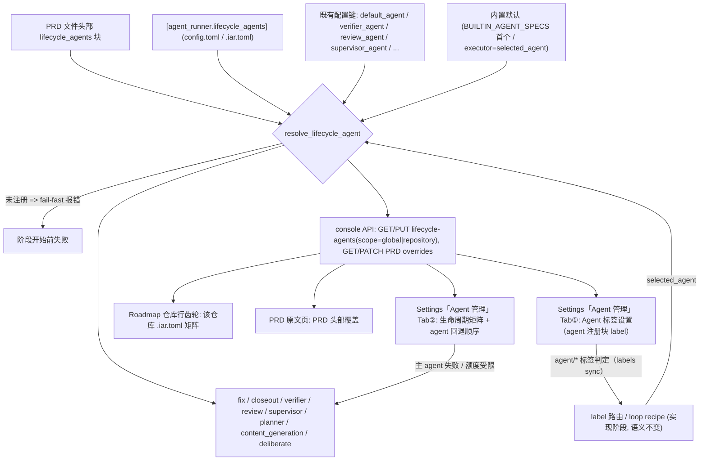

# PRD: 生命周期 Agent 矩阵——全局统一配置 + PRD 级覆盖

- GitHub Issue: （创建后回填）

> ✅ **交付前置**：无，可立即开工。
> 结构化声明见 §8 Delivery Dependencies，**那里是唯一事实源**。

> 🟡 **验收状态**：实施 + 自动化验证完成，人工决策与四项呈递物已确认（2026-09-20）；Playwright e2e 与 PR 审查未完成，故暂不归档。
> 本行是 §9 Acceptance Checklist 的投影，**那里是唯一事实源**。

本文档分两个高度：**Part A（§1–§4）** 给人看，用来确认"要不要做、做成什么样"，不含实现机制与命令；**Part B（§5–§13）** 给执行者看，包含机制、改动树与验证命令。

## Feature Overview (功能一览)

> 本块是第 10 节 Functional Requirements 的通俗投影，不是第二事实来源；行为验收以第 1 节的行为样例表为准。

- **一个矩阵看清"哪个阶段用哪个 agent"**（FR-1）：实现、修复、收尾、校验、审核、监督、决策、内容生成、辩论九个生命周期，在配置里是一张统一的表，不再散落在五个不同的配置段里；矩阵在全局（`config.toml`）与仓库（`.iar.toml`）两层都可用，仓库层赢过全局层。
- **修复和收尾可以换人了**（FR-2）：这两段今天被硬绑在实现阶段的 agent 身上，矩阵允许独立指定，默认仍跟随实现 agent（与今天一致）。
- **三层覆盖、顺序固定**（FR-3）：PRD 文件头部> 仓库 `.iar.toml` > 全局 `config.toml` > 原有零散配置 > 内置默认；不写任何新配置时行为与今天完全一致。
- **具体 PRD 可以覆盖全局**（FR-4）：在 PRD 文件头部声明一个或多个生命周期的 agent 切换，只影响这个 PRD 的执行。
- **配错了会立刻响**（FR-5）：矩阵或覆盖里写了没注册的 agent 名，该阶段开始前就报错并指名，不静默回落到别的 agent。
- **console 里有可视化编辑**（FR-6、FR-7、FR-8、FR-12）：Settings 页新增 **「Agent 管理」** 区块，用**粘性 Tab** 分两页——**① Agent 标签设置（默认页）**：配置每个 agent 的路由标签名 / 颜色 / 描述（`auto` 的判定依据）；**② 生命周期 Agent 设置**：全局矩阵 + agent 回退顺序。**Roadmap 受管理仓库列表**每行右侧的齿轮打开该仓库 `.iar.toml` 矩阵（可写，含"跟随全局"项）；**PRD 原文页**工具栏「Agent 覆盖」编辑本 PRD 的覆盖并写回 PRD 文件头部。每层都标注生效值与来源层。
- **文档与配置注释同步**（FR-9）：config.toml 注释与 docs 说明更新，矩阵键名有唯一权威定义。

---

# Part A · 人审层 (Review Layer)

## 1. Introduction & Goals

### Problem Statement

keda 的流水线由多个生命周期阶段组成（实现、修复、收尾、校验、审核、监督、决策、内容生成、辩论），每个阶段都会调用一个 agent（codex / claude / kimi / pi 或自定义注册的 agent）。操作者想为每个阶段指定用哪个 agent，但今天做不到完整配置，具体缺口在仓库里可直接观察到：

1. **配置散落**：实现阶段的 agent 写在 `[agent_runner.runner]` 的 `default_agent`，校验在 `[agent_runner.validation]` 的 `verifier_agent`，审核在 `[agent_runner.pre_pr_review]` 的 `review_agent`，监督在 `[agent_runner.post_pr_supervisor]` 的 `supervisor_agent`，决策在 `[agent_runner.interactive_decision]` 的 `default_agent`——想回答"我的流水线各段都用谁"必须翻五个配置段。
2. **修复与收尾阶段没有自己的配置项**：代码里这两个阶段直接复用实现阶段选中的 agent（`run_agent_execution_loop.py` 中 `run_fix_agent(selected_agent, ...)` 与 `run_closeout_agent(request.selected_agent, ...)`），想"便宜的模型修小问题、贵的模型收尾"配不出来。
3. **没有 PRD 级覆盖**：某个具体 PRD 想换一个阶段的 agent（例如让它用另一个模型实现），只能改全局配置，影响所有 PRD。
4. **没有任何图形界面**：产品前端 frontend-public 的设置页（`app/(app)/app/settings/page.tsx`）目前只有会话信息与退出登录；Roadmap 页的受管理仓库列表（`app/(app)/app/roadmap/page.tsx`）只支持切换仓库、没有任何仓库级设置入口。配置只能手工改 TOML。

另有一个待办 PRD `P1-FEAT-20260917-102125-stage-repair-agent-routing` 解决"审核/监督阶段发现问题时**谁来修**"（repair_agent 路由）；本 PRD 解决"每个生命周期**本体用哪个 agent**"。两者正交，本 PRD 不依赖它。

### Interpretation (解读回显)

**用户澄清**：本 PRD 的"工具"指**每个生命周期阶段调用的 agent CLI**（codex / claude / codebuddy / opencode 等），不是沙箱、联网之类的工具开关。

下表每一行都会**原样**变成第 7.6 节的验收 oracle，所以改表里的一格就等于改验收标准——值得逐行读。

| 输入 / 操作 | 期望观察到的结果 |
|---|---|
| 配置里不写任何新字段，跑完一个 Issue 的完整流程 | 各阶段使用的 agent 与今天一致：实现用 `default_agent`、校验用 `verifier_agent`、审核用 `review_agent`、监督用 `supervisor_agent`，修复与收尾跟随实现 agent |
| 在全局矩阵里把 `fix` 设成 `kimi`（实现是 codex），本地验证失败触发修复阶段 | 修复阶段子进程是 kimi 的命令行，不再是 codex |
| 在某个 PRD 文件头部声明 `lifecycle_agents: {implementation: claude}`，该 PRD 由 runner 执行 | 只有这个 PRD 的实现阶段用 claude；其他 PRD 仍用全局矩阵/原有配置的 agent |
| 同一个 PRD 头部同时声明 `implementation` 和 `review` 两个生命周期的覆盖 | 两个阶段都生效，未声明的阶段（如校验、监督）不受影响 |
| 矩阵或 PRD 覆盖里写了未注册的 agent 名（如 `codebuddy` 未注册） | 该阶段开始前报错并指名"agent codebuddy 未注册"，不静默回落 |
| 全局 `config.toml` 设 `fix = "kimi"`、仓库 `.iar.toml` 设 `fix = "pi"`，实现 agent 是 codex，触发修复阶段 | 修复阶段子进程是 pi——仓库层赢过全局层 |
| 只在全局 `config.toml` 设 `fix = "kimi"`（仓库层未设置），触发修复阶段 | 修复阶段子进程是 kimi——仓库层未设置时回落到全局层 |
| console Settings 页把全局 `verifier` 从 `auto` 改成 claude 并保存 | 全局 `config.toml` 的 `[agent_runner.lifecycle_agents]` 写入新值（各仓库 `.iar.toml` 不被改动）；重新加载配置后，未覆盖该校验阶段的仓库其校验阶段真的用 claude |
| console Roadmap 的某仓库行齿轮打开仓库级矩阵，把 `verifier` 改成 codex 并保存 | 该仓库 `.iar.toml` 写入新值（全局 `config.toml` 不被改动）；该仓库的校验阶段用 codex，其他仓库不受影响 |
| console 仓库级矩阵点某行的「跟随全局（删除本键）」 | 该仓库 `.iar.toml` 中该键被移除，生效值回落到全局 `config.toml` 矩阵（或既有配置键） |
| console PRD 原文页把 `closeout` 覆盖设成 pi 并保存 | 该 PRD markdown 文件头部的 `lifecycle_agents` 块被写入 `closeout: pi` |
| 实现 agent 崩溃或额度受限，恢复次数耗尽 | 按 `runner.agent_fallback_order`（默认 `claude, kimi, codex`）换下一个 agent，最多切换 `runner.max_agent_switches` 次（默认 2，即最多试 3 个）；本机未安装的 agent 跳过；链为空时不换人、按原语义失败 |
| console Settings 页把「agent 回退顺序」改成 `codex, claude` 并保存 | 全局 `config.toml` 的 `[agent_runner.runner]` 段写入 `agent_fallback_order = ["codex", "claude"]`，段内其余键不变 |
| 校验阶段的值是 `auto` | 从 `runner.agent_fallback_order` 里挑第一个 ≠ 实现者的 agent（配成具体 agent 时固定用它，不再自动换人） |
| console Settings 页「Agent 标签设置」把 claude 的标签从 `agent/claude` 改成 `agent/cc` 并保存 | 全局 `config.toml` 的 `[agent_runner.agents.claude]` 段 `label` 变新值（该段其它字段不变）；`iar labels sync` 后新标签出现在 GitHub，auto 路由改按 `agent/cc` 判定 |
| 「Agent 标签设置」把两个 agent 配成同一个标签并保存 | 保存被阻断并指出重复的标签名——重复会让 auto 无法判定 Issue 属于谁 |

#### 我默默定了这些

- 统一矩阵的键名定为九个：`implementation`、`fix`、`closeout`、`verifier`、`review`、`supervisor`、`planner`、`content_generation`、`deliberate`。**不叫 `agent_tools`**：本 PRD 的"工具"即 agent 本体，键名直接用 agent 语义，避免和沙箱/联网类工具开关混淆。
- `fix` 与 `closeout` 的取值支持 `executor`（跟随实现阶段 agent）与任意已注册 agent 名，默认 `executor`，与今天行为一致。
- 矩阵其他键（实现/校验/审核/监督/决策等）不支持 `executor` 值——它们今天就是独立配置的，写 `executor` 会形成循环引用，遇到即报配置错误。
- **`auto`（按 agent 标签路由）是九个键都合法的取值**：今天校验 / 审核 / 监督 / 辩论的值就是 `auto`，矩阵必须能如实表达它（否则第一次打开界面就没法显示现状）。
- **`auto` 的含义按阶段不同，界面上如实描述、不统一**：实现 = 按 Issue 上的 `agent/*` 标签路由；校验 = 从回退链挑第一个 ≠ 实现者的 agent；审核 = 优先挑 ≠ 实现者、`allow_same_agent` 时沿用实现者；监督 = 发布路径沿用本次实现者；辩论 = 按 `agent/deliberate` 标签路由。没有实现 `auto` 的阶段（决策 / 内容生成 / 修复 / 收尾）不提供该选项。
- **矩阵只选主 agent，"挂了换下一个"是另一张表**：`[agent_runner.runner]` 的 `agent_fallback_order`（默认 `["claude", "kimi", "codex"]`，本机 `config.toml` 未写出、走代码默认）与 `max_agent_switches`（默认 2）；Settings 页给出可排序编辑，全阶段共用一条链，第一个尝试的 agent 仍由矩阵 / 标签路由决定。
- **Settings 页的 UI 组织用「Agent 管理」+ 粘性 Tab**：Tab ①「Agent 标签设置」在前（默认页），配置 agent 注册块里的 `label` / `label_color` / `label_description`——因为 `auto` 就是"看 Issue 上挂的哪个 agent 标签"，这张表是 auto 的解析依据；Tab ②「生命周期 Agent 设置」放矩阵与回退顺序。三个保存按钮各写 `config.toml` 的不同段。
- 覆盖链是**显式三层**：PRD 文件头部（PRD 级）> `.iar.toml`（仓库级）> `config.toml`（全局/机器级），再回落到既有配置键与内置默认。TOML 两层的合并复用既有"`.iar.toml` 覆盖 `config.toml`"机制，同键时仓库赢全局，仓库未设置时回落全局。
- console 的三层界面**各自写各自的配置文件**：Settings 页写全局 `config.toml`（机器级默认）、Roadmap 受管理仓库列表的齿轮写该仓库 `.iar.toml`（随仓库走、跨仓库隔离）、PRD 原文页写该 PRD 文件头部。
- 下拉里**只有真实取值**（已注册 agent / `auto` / fix-closeout 的 `executor`），**当前生效值直接选中**，不造"未设置""跟随全局"这类伪选项；本层是否显式声明由「来源」列的恢复入口（「不写本键（跟随既有配置）」/「跟随全局（删除本键）」）表达。
- **只有改动过的行会写进本层文件**：没动的行在该层保持"未声明"，继续沿回退链走（这与"零配置行为不变"是同一件事）；把取值改回与继承值相同也视为未改动。
- 「来源」列标注生效值来自哪一层：PRD 覆盖 / 仓库 / 全局 / 既有配置键 / 内置默认。
- 辩论（deliberate）的矩阵值是"辩论参与者的默认 agent 来源"；显式点名参与者的既有调用方式不变，仅作为未点名时的默认。
- `repl`（交互式会话）不算流水线生命周期，不进矩阵。
- 未注册 agent 名的报错时机：该阶段开始前 fail-fast，与待办 PRD repair_agent 的报错语义一致。
- 生命周期键写错名（如 `implemenation`）在配置加载时报错，不静默忽略。

#### 我理解为不做

- 不做沙箱/联网/审批等"调用形态"开关的配置化——本 PRD 只管"用哪个 agent"，profile argv 仍走 agent 注册表。
- 不做 per-Issue 的 agent 指定（GitHub label 路由、loop recipe frontmatter 等现有机制不变，继续作为更细一层生效：label/loop 优先于本 PRD 的实现阶段解析结果，规则见 §6）。
- **不做每阶段独立的回退顺序**：跨 agent 回退沿用 `runner.agent_fallback_order` 一条全局链（见决策四）。
- **不改变既有 `auto` 语义**：只把各阶段的真实含义在 UI 上写清，不把校验 / 审核 / 监督的"自动挑不同的人"改成标签路由。
- 不做 agent 的运行健康度、用量统计或成本展示（console doctor 等既有能力不变）。

#### 落地读法

本 PRD 读作"**给九个生命周期阶段一张统一的'用谁'配置表，允许 PRD 级覆盖，并在 console 里可视化编辑**"，不读作"重构 agent 注册表"或"引入新的 agent 类型"。边界：不改任何 agent 的调用形态（argv/profile）；不改状态机、标签、轮数语义；不写新配置时所有阶段行为与今天一致。非目标见 §11。

### What The User Gets

- **运维者（机器级）**：在 console 的 Settings 页编辑九个生命周期的全局默认，保存写入 `config.toml`，对本机所有仓库生效。
- **运维者（仓库级）**：在 console 的 Roadmap 受管理仓库列表点某行的齿轮，编辑该仓库的矩阵，保存写入该仓库的 `.iar.toml`；只影响这个仓库，其他仓库不受影响。
- **PRD 作者**：在具体 PRD 上声明"这个 PRD 的实现/审核阶段换用某个 agent"，只影响本 PRD；可以在 PRD 原文页点选，也可以直接写 PRD 文件头部。
- **流水线本身**：修复和收尾阶段第一次拥有独立的 agent 配置能力；所有配置错误在开工前报错，不会跑到一半才发现用错了 agent。

### Measurable Objectives

- 不写任何新配置时，九个生命周期解析出的 agent 与改动前逐阶段一致（可用配置加载单测逐键断言）。
- 修复/收尾阶段显式指定 agent 后，该阶段子进程的可执行文件与指定 agent 的 `bin` 一致。
- PRD 文件头部覆盖仅影响声明了的阶段与该 PRD 本身。
- console 保存后，配置加载端（runner）读取到与 UI 一致的值。

## 2. Human Review Map (介入与风险地图)

**决策一：九个生命周期键名与清单。** 矩阵键为 `implementation` / `fix` / `closeout` / `verifier` / `review` / `supervisor` / `planner` / `content_generation` / `deliberate`，`repl` 不进矩阵。键名一旦被 PRD 文件和文档引用，后续改名会破坏已有覆盖配置，所以现在定死比以后迁移便宜。**请确认：** 这九个键名与清单是否符合你对"生命周期"的划分？有没有你预期要配但清单里没有的阶段？**验收：** 配置加载单测对九个键逐一断言默认解析结果与今天一致。

**决策二：修复与收尾的默认值语义。** 这两段今天硬绑实现阶段的 agent；矩阵给它们独立配置能力，但默认值是 `executor`（跟随实现 agent），保证不写配置时行为不变。`executor` 只在这两个键上合法（其余阶段写 `executor` 报配置错误，避免循环引用）。**请确认：** 默认跟随实现 agent、需要时再显式换人——这个默认方向对吗？**验收：** 默认配置下修复阶段子进程与实现 agent 相同；显式指定后子进程切换为指定 agent。

**决策三：三层覆盖的配置分层与 UI 落点。** 覆盖链为 PRD 文件头部（PRD 级）> `.iar.toml`（仓库级）> `config.toml`（全局/机器级）> 既有配置键 > 内置默认，TOML 两层复用既有合并机制。UI 落点按层对齐，而不是全部塞进一个页面：

| 层 | 写入文件 | UI 落点 | 下拉与写入语义 |
|---|---|---|---|
| 全局（机器级） | `config.toml` | Settings 页新增矩阵卡片 | 下拉选中当前生效值；只写入改动过的行，没动的行继续沿用既有配置键 |
| 仓库级 | 该仓库 `.iar.toml` | Roadmap 受管理仓库列表每行右侧的齿轮（抽屉） | 同上；没动的行继续跟随全局层 |
| PRD 级 | PRD 文件头部 | PRD 原文页工具栏「Agent 覆盖」（抽屉） | 勾选即声明；不勾选则跟随仓库级与全局层 |

仓库级配置不放 Settings：Settings 是机器级页面，仓库级配置跟着仓库走，入口挂在仓库列表上（每行一个齿轮，点行仍只切换当前仓库）。三层都可写、都随各层文件进 git（本仓库 `config.toml` 与 `.iar.toml` 均被跟踪），UI 改动在 git diff 里可回滚；保存一律保留式写入，只动 `[agent_runner.lifecycle_agents]` 段 / PRD 头部那一个 bullet 块。**请确认：** 三层落点、"各层写各自文件"、以及"下拉显示真实取值 + 只写入改动行"的交互边界，可以吗？**验收：** 三层各自保存后只有对应文件发生变化、且文件里只多出改动过的键；仓库层值赢过全局层；仓库级点「跟随全局（删除本键）」后该键从 `.iar.toml` 消失、生效值回落全局层；PRD 覆盖只影响该 PRD。

**决策四：矩阵是单值，回退顺序单独一张表。** 每个生命周期在矩阵里只选**一个** agent（"这个阶段用谁"）；"主 agent 失败就换下一个"沿用既有机制 `[agent_runner.runner]` 的 `agent_fallback_order` + `max_agent_switches`，在 Settings 页给一个可排序编辑的区块，**全阶段共用一条链**，不按阶段各排一条。`auto` 的含义各阶段本来就不同（实现=标签路由 / 校验=挑一个 ≠ 实现者 / 审核=不同人优先 / 监督=沿用本次实现者 / 辩论=标签路由），界面上**如实描述而不用统一**。**请确认：** "矩阵单值 + 全局一条回退链"和"`auto` 按阶段如实描述"，符合你的预期吗？还是希望每个阶段各配一条顺序链？**验收：** Settings 保存后 `[agent_runner.runner]` 段只多出这两个键；实现阶段主 agent 失败时按链切换（rv-6）。

**决策五：Settings 页的 UI 组织——「Agent 管理」+ 粘性 Tab，Agent 标签设置在前。** Settings 页在真实的「设置」标题下方新增一个「Agent 管理」区块，用**粘性 Tab 栏**分两页：① **Agent 标签设置**（默认页）配置每个 agent 的 GitHub 路由标签（名 / 颜色 / 描述），因为 `auto` 的判定就是"看 Issue 上挂着哪个 agent 标签"，这张表是 auto 的解析依据；② **生命周期 Agent 设置**放九行矩阵与 agent 回退顺序。原 Settings 页的「关于 iar 管理终端」与「退出登录」保持在区块下方。**请确认：** 这个分组与 Tab 顺序（Agent 标签设置在前）符合你的预期吗？**验收：** 三个保存按钮分别只写 `config.toml` 的 agent 注册块 / `[agent_runner.lifecycle_agents]` / `[agent_runner.runner]` 段（rv-6、rv-7）。

**自动门禁，不需要逐项人工审阅**：配置合并函数的优先级单测、PRD 文件头部块解析的边界单测（空值/未知键/非法值）、未注册 agent 的 fail-fast 测试、console API 契约测试、frontend-public 页面的 Playwright e2e、`just lint` 与守卫测试。

**本次明确不涉及**：数据库表结构无任何变化（全部配置仍走 TOML 与 PRD 文件头部，不入库）。

## 3. Usage And Impact After Implementation

**运维者（全局层）**：入口 `just run` 打开 frontend-public → Settings → **「Agent 管理」**区块，粘性 Tab 两页：

- **Agent 标签设置（默认页）**：四个 agent 各一行，可改 GitHub 标签名、颜色、描述；保存写入 `config.toml` 里各自的 `[agent_runner.agents.<name>]` 段（段内其余字段不变）。标签名不能为空、也不能两个 agent 重复（重复则保存阻断）。`iar labels sync` 后新标签同步到 GitHub，auto 路由随之改判。
- **生命周期 Agent 设置**：**「生命周期 Agent 矩阵 · 全局」**（九行，每行一个下拉，选中该键当前生效值，含该阶段语义的 `auto`；只写入改动过的行到 `config.toml`；点来源列的「不写本键（跟随既有配置）」即删键回落）与 **「agent 回退顺序」**（可排序的 `agent_fallback_order` + 数字输入 `max_agent_switches`，写入 `config.toml` 的 `[agent_runner.runner]` 段且其余键不变；说明它作用于 Issue 执行阶段的跨 agent 回退）。

区块下方保留原页面的「关于 iar 管理终端」卡片与「退出登录」。保存前 UI 校验取值合法。

**运维者（仓库层）**：入口 frontend-public → Roadmap → 受管理仓库列表 → 某行右侧的齿轮 → 该仓库的 Agent 设置抽屉。矩阵同样九行，每行一个下拉，选中该仓库当前生效值（可能继承自全局层，来源列会标注）。保存只写入改动过的行到该仓库 `.iar.toml`（`config.toml` 不动）；点来源列的「跟随全局（删除本键）」即删键回落。仓库之间互不影响，点列表行本身仍只切换当前仓库。

`iar agent doctor` 与后续 runner 执行使用新的三层合并结果。

**PRD 作者**：在 frontend-public 的 PRD 原文页（既有 PRD 内容阅读器）工具栏点「Agent 覆盖」，勾选要覆盖的生命周期并选择 agent，保存时写回 PRD 文件头部的 `lifecycle_agents` 块；直接在文件里手写同样生效。

**runner / 流水线**：各阶段解析 agent 的入口统一为"生命周期解析函数"；不写新配置时返回值与今天的散落配置一致。GitHub label 路由与 loop recipe frontmatter 的 `agent` 字段继续以更高优先级决定**实现阶段**的 agent（既有语义不变）。

**开发者 / 集成者**：`iar` CLI 不新增必用命令；配置加载 API 新增生命周期矩阵查询，现有导出的 `AppConfig` 字段向后兼容（新增字段，不改旧字段）。

## 4. Requirement Shape

- **Actor**：运维者（frontend-public 的 Settings 页 + Roadmap 受管理仓库列表）、PRD 作者（PRD 文件/frontend-public PRD 原文页）、runner 流水线（阶段执行）、`iar` CLI 用户（配置加载）。
- **Trigger**：配置加载时（全局矩阵、仓库矩阵与 PRD 文件头部块的合并）；流水线到达某个生命周期阶段时（解析该阶段 agent）；frontend-public 保存动作时（写 `config.toml` / 写 `.iar.toml` / 写回 PRD 文件头部）。
- **Expected behavior**：按 §1 优先级链解析出每个生命周期的 agent；未注册名 fail-fast；未配置阶段保持既有行为。
- **Scope boundary**：仅覆盖"阶段→agent"选择；agent 调用形态（argv/profile/沙箱）、状态机、标签、Issue 级路由机制全部不变。

---

# Part B · 执行器层 (Build Layer)

## 5. Repository Context And Architecture Fit

**现有相关模块**：

- `src/backend/core/shared/models/agent_spec.py`：`BUILTIN_AGENT_SPECS`、`AGENT_PROFILES`——agent 注册表唯一代码内默认来源；每个 spec 的 `label` / `label_color` / `label_description` 就是 auto 路由用的标签（本 PRD 的「Agent 标签设置」写这三个字段）。
- `src/backend/engines/agent_runner/factory_config_builder.py`：`build_app_config_from_settings` 把 pydantic settings 装配为 `AppConfig`；各阶段配置在此进入 config 模型。
- `src/backend/infrastructure/config/agent_runner_settings.py`：`[agent_runner]` 全部段的 pydantic 模型；`.iar.toml` 仓库级覆盖合并（`_AgentRunnerRepositoryOverrideSettings`）。
- `src/backend/core/use_cases/run_agent_execution_loop.py`：`run_fix_agent(selected_agent, ...)`、`run_closeout_agent(request.selected_agent, ...)`——fix/closeout 硬绑实现 agent 的两个落点。
- `src/backend/core/use_cases/run_verifier_agent.py`、`agent_review.py`、`pr_supervisor.py`、`generated_content.py`：校验/审核/监督/内容生成阶段各自的 agent 消费点。
- `src/backend/core/use_cases/run_agent_once.py`：各阶段 agent 解析的既有落点——`choose_agent`（标签路由）、`resolve_agent_fallback_order`（回退链拼接）、`resolve_reviewer_agent` / `resolve_supervisor_agent` / `resolve_repair_agent`；`_choose_verifier_agent` 在 `run_verifier_agent.py`。**本 PRD 的解析函数必须与这些既有 `auto` 语义对齐，不能另起一套。**
- `src/backend/infrastructure/config/agent_runner_settings.py` 的 `RunnerSettings.agent_fallback_order` / `max_agent_switches`（跨 agent 回退链，本机 `config.toml` 未写出、走代码默认 `["claude","kimi","codex"]` / `2`）；`agent_runner_orchestrate.py` 把它截断为 `candidate_agents`。
- `src/backend/core/shared/models/loop.py` + `loop_recipe.py`：loop recipe frontmatter `agent` 字段——既有"任务级覆盖"先例，PRD 文件头部块解析沿用其模式。
- `src/backend/api/routes/agent_runner_console.py`：console API 路由层；`src/backend/infrastructure/persistence/console_store.py`：console 持久化（本次不新增表）。
- `frontend-public/app/(app)/app/settings/page.tsx`：Settings 页（目前仅会话信息与退出登录）——全局层矩阵卡片的落点。
- `frontend-public/app/(app)/app/roadmap/page.tsx`：Roadmap 页左侧"受管理仓库"列表（`aside.w-60`，每行是切换仓库的 `<button>`）——仓库级矩阵的入口（每行右侧新增齿轮按钮）落点。
- `frontend-public/components/roadmap/prd-content-view.tsx`：PRD 原文阅读器（顶部工具栏 + `article.prd-markdown`）——PRD 级覆盖入口的落点。
- `frontend-public/components/ui/`：shadcn 子集（button/card/checkbox/badge/dropdown-menu/sheet/separator 等，无 select/table——矩阵下拉用 dropdown-menu 或新增 select 组件，抽屉复用 `sheet.tsx`）。
- `frontend-public/lib/api/client.ts` + `agentRunner.ts`：axios 实例与 agent-runner 域 API client，新增 lifecycle-agents 函数落在此处；`frontend-public/app/(app)/`：受保护路由（RequireSession 守卫）。

**架构约束**：四层依赖方向 `api -> core -> engines -> infrastructure`；配置合并属 core/infrastructure，路由层只做适配；Python 文本 I/O 显式 `encoding="utf-8"`；命名避免 `data`/`item`。

**前端影响**：frontend-public（Next.js 16 App Router + pnpm，中文界面）。Settings 页新增「Agent 管理」区块（粘性 Tab + 两个面板），三层各改一处，不新增路由、不动 `components/layout/app-sidebar.tsx` 导航：

1. `app/(app)/app/settings/page.tsx` 内新增「Agent 管理」区块：**Tab ①「Agent 标签设置」**（编辑 `[agent_runner.agents.<name>]` 的 `label` / `label_color` / `label_description`，本地校验非空 + 不重复）；**Tab ②「生命周期 Agent 设置」**（"生命周期 Agent 矩阵 · 全局"写 `[agent_runner.lifecycle_agents]` 段，"agent 回退顺序"写 `[agent_runner.runner]` 段的 `agent_fallback_order` / `max_agent_switches`）。Tab 栏粘性；区块下方保留原有的"关于 iar 管理终端"与"退出登录"。
2. `app/(app)/app/roadmap/page.tsx` 的受管理仓库列表每行右侧新增齿轮按钮（需把行从"单个 `<button>`"改为"行容器 + 切换按钮 + 齿轮按钮"），点击打开该仓库的 Agent 设置抽屉（写该仓库 `.iar.toml`）。
3. `components/roadmap/prd-content-view.tsx` 工具栏新增「Agent 覆盖」按钮，打开覆盖抽屉（写 PRD 文件头部块）。

`lib/api/agentRunner.ts` 新增 lifecycle-agents 与 PRD 覆盖读写客户端函数，`lib/api/types.ts` 同步类型。frontend-admin 不涉及。

**Existing PRD Relationship**：`tasks/pending/P1-FEAT-20260917-102125-stage-repair-agent-routing.md` 相邻但正交（它管"审核/监督发现问题时谁修"，本 PRD 管"各阶段本体用谁"）。两 PRD 都会触碰审核/监督阶段的 agent 解析路径，协调约定：repair 路由以本 PRD 解析出的 review/supervisor agent 为"审核者"来源。无重复工作。`tasks/archive/` 中无定义生命周期矩阵语义的在先 PRD。

## 6. Recommendation

### Recommended Approach

在现有配置加载链上**加一层"生命周期解析函数"**，而不是新建平行的 agent 选择系统：

1. **配置模型**：`agent_runner_settings.py` 新增 `[agent_runner.lifecycle_agents]` 段（九个可选键，值为 agent 名或 `executor`），经既有 `.iar.toml` 覆盖机制自然获得"仓库层 > 全局层"两层能力。`AppConfig` 新增 `lifecycle_agents` 冻结模型（含各键的来源层信息）。
2. **解析函数**（core 层）：`resolve_lifecycle_agent(config, prd_overrides, lifecycle, *, selected_agent=None) -> str`，优先级：PRD 文件头部覆盖 > 矩阵仓库层（`.iar.toml`）> 矩阵全局层（`config.toml`）> 阶段对应的既有配置键（`default_agent` / `verifier_agent` / `review_agent` / `supervisor_agent` / `interactive_decision.default_agent` / generated_content / deliberation 既有配置，自身已按既有规则做 `.iar.toml` > `config.toml` 合并）> 内置默认（`BUILTIN_AGENT_SPECS` 首个）。`fix`/`closeout` 的内置默认与矩阵值 `executor` 都解析为 `selected_agent`。各消费点（fix、closeout、verifier、review、supervisor、planner、generated_content、deliberate 默认值）改为调用该函数；实现阶段的 label/loop 路由（`choose_agent`）保持不动，其结果作为 `selected_agent` 输入本函数。**实现阶段的优先级特例**：Issue 上的 `agent/*` 标签路由与 loop recipe / CLI `--agent` 仍高于 PRD 覆盖——PRD 的 `implementation` 覆盖作用于"没有标签路由时的实现阶段选择"。
3. **PRD 文件头部块**：`lifecycle_agents:` 块，解析挂进既有 PRD 读取路径（与 loop recipe frontmatter 同模式）；未知键名与非法值在解析时报错并带 PRD 路径。
4. **fail-fast 校验**：解析结果不在注册表时抛带阶段名与 agent 名的配置错误，各阶段调用点统一捕获为"阶段开始前失败"。
5. **console API**（api 层新路由）：`GET /api/v1/agent-runner/lifecycle-agents?repo_id=<id>`（GET=该仓库视角下三层合并后的生效视图，每键带来源层标注与上一层的只读参照值；`scope=global` 时返回全局层视角）、`PUT /api/v1/agent-runner/lifecycle-agents`（body 带 `scope=global|repository` 与可选 `repo_id`：`scope=global` 更新 `config.toml`，`scope=repository` 更新该仓库 `.iar.toml`，均为保留式写入、只动 `[agent_runner.lifecycle_agents]` 段、只写请求里显式给出的键（`null` 表示删除该键））；`GET/PATCH /api/v1/agent-runner/roadmap/prds/{encoded_path}/agent-overrides`（读=当前头部覆盖；写=改写 PRD 文件头部、只动 `lifecycle_agents` 块；沿用既有 PRD 原文端点的 base64url 路径约定，而非另起 `/prds/{prd_id}` 命名空间）。
6. **frontend-public**：Settings 页新增「Agent 管理」区块（粘性 Tab：Agent 标签设置 / 生命周期 Agent 设置，前者默认）；Roadmap 受管理仓库列表每行新增齿轮入口与该仓库的矩阵抽屉；PRD 原文页工具栏新增「Agent 覆盖」抽屉。三处矩阵共用同一个矩阵行组件，只是可编辑列与参照列不同。`lib/api/agentRunner.ts` 与类型同步。
7. **与既有 `auto` / 回退链对齐**（不改既有语义，只把入口搬到 UI）：矩阵解析出的阶段 agent 作为该阶段的"主 agent"，`auto` 的语义沿用 `run_agent_once.py` / `run_verifier_agent.py` 里既有的实现（解析函数只负责"这一阶段的主 agent 是谁"，不做回退）；跨 agent 回退仍由 `agent_fallback_order` + `max_agent_switches` 驱动，UI 只是给它一个可编辑入口。

### 实现机制 (Proposed Solution Summary)

核心机制是**在既有配置分层（内置默认 < config.toml < .iar.toml）之上，把"阶段→agent"从五个散落键收敛为一个命名解析函数**。声明来源有三层——PRD 文件头部块（作者写或 console 写回）、仓库级 TOML（console UI 或手工）、机器级 TOML（console UI 或手工）——系统只消费显式声明，不推断；未声明的阶段回落到既有配置键与内置默认。挂载点是 `build_app_config_from_settings` 之后的解析入口与各阶段消费点，用户可见变化为 console 三个新界面（Settings 全局矩阵、Roadmap 仓库齿轮 + 抽屉、PRD 原文页覆盖抽屉）与 PRD 文件头部块。刻意不做的复杂度：不建数据库表、不迁移既有配置键、不改 agent 注册表结构、不新增抽象层。

### Alternatives Considered

- **直接给五个散落段各加"PRD 覆盖"字段**：每段独立解析、无统一视图，fix/closeout 仍无解，PRD 覆盖要写五处——正是本次要消除的散落，放弃。
- **矩阵入库（console_store 新表）**：UI 写库简单，但配置与 TOML 事实源分裂、跨机器不同步、git 不可追溯；且用户已确认 PRD 文件头部为 PRD 级事实源，放弃。

## 7. Implementation Guide

> This section is a living implementation guide based on current repository analysis. If implementation discovers additional affected files, hidden dependencies, edge cases, or a better path, update this PRD before proceeding.

### Core Logic

数据流：PRD 文件（头部 lifecycle_agents 块）与 TOML（config.toml / .iar.toml）→ pydantic settings（`agent_runner_settings.py`）→ `AppConfig.lifecycle_agents` → `resolve_lifecycle_agent(...)` → 各阶段消费点（fix / closeout / verifier / review / supervisor / planner / generated_content / deliberate）与 console API（矩阵读写、PRD 文件头部读写）→ frontend-public 三个界面（Settings 全局层 / Roadmap 仓库层 / PRD 原文页 PRD 层）。

### Change Impact Tree

```text
.
├── src/backend/infrastructure/config/agent_runner_settings.py
│   【总结】新增 lifecycle_agents 配置段模型与校验（键闭集、值=agent 名 / auto / executor，executor 仅限 fix/closeout）；agent_fallback_order 与 max_agent_switches 已有，本 PRD 只补 UI 写入口
│   ├── 新增 AgentRunnerLifecycleAgentsSettings 模型与 AgentRunnerSettings.lifecycle_agents 字段
│   ├── auto 的合法性按阶段校验（决策 / 内容生成 / 修复 / 收尾 不接受 auto）
│   └── .iar.toml 覆盖合并自然生效（走既有 override 机制）
├── src/backend/core/shared/models/agent_runner.py
│   【总结】AppConfig 新增 lifecycle_agents 冻结模型（九键、含来源信息）
├── src/backend/core/use_cases/lifecycle_agent_resolution.py
│   【总结】新增统一解析函数 resolve_lifecycle_agent：PRD 覆盖 > 矩阵 > 既有配置键 > 内置默认；未注册 fail-fast
│   ├── 新增 PRD 文件头部 lifecycle_agents 块解析（未知键/非法值报错，带 PRD 路径）
│   └── 新增注册表成员校验
├── src/backend/core/use_cases/run_agent_execution_loop.py
│   【总结】fix 与 closeout 调用点改为经解析函数取 agent，不再直接用 selected_agent
├── src/backend/core/use_cases/run_verifier_agent.py / agent_review.py / pr_supervisor.py / generated_content.py
│   【总结】各消费点改为经解析函数取 agent（既有配置键继续作为回落层）
├── src/backend/core/shared/models/loop.py
│   【总结】（仅当实现阶段需暴露 selected_agent 语义时）确认 label/loop 路由结果作为 selected_agent 输入解析函数，不改变路由本身
├── src/backend/api/routes/agent_runner_console.py（或新增 routes/lifecycle_agents.py）
│   【总结】新增 GET/PUT lifecycle-agents（scope=global 写 config.toml / scope=repository 写该仓库 .iar.toml）、GET/PATCH PRD agent-overrides、GET/PUT agent-fallback-order（写 [agent_runner.runner]）、GET/PUT agent-labels（写各 agent 注册块的 label / label_color / label_description）
├── src/backend/infrastructure/（TOML 读写 helper）
│   【总结】新增保留式 TOML 段更新（只改 lifecycle_agents / runner 里点名的键，其余内容不动；config.toml 与 .iar.toml 共用）
├── frontend-public/app/(app)/app/settings/
│   【总结】Settings 页新增「Agent 管理」区块：粘性 Tab（Agent 标签设置默认在前 / 生命周期 Agent 设置），含标签编辑、矩阵、回退顺序与三处保存逻辑
├── frontend-public/app/(app)/app/roadmap/
│   【总结】受管理仓库列表每行右侧新增齿轮按钮（行结构由单个 button 改为行容器 + 切换按钮 + 齿轮），点击打开该仓库的 Agent 设置抽屉
├── frontend-public/components/roadmap/（新增矩阵行/抽屉组件）
│   【总结】三层共用的矩阵行组件 + 仓库级抽屉 + PRD 覆盖抽屉
├── frontend-public/components/roadmap/prd-content-view.tsx
│   【总结】工具栏新增「Agent 覆盖」入口，打开 PRD 覆盖抽屉（勾选生命周期 + 选 agent + 写回）
├── frontend-public/lib/api/agentRunner.ts / types.ts
│   【总结】新增 lifecycle-agents 与 PRD 覆盖读写 API client 函数及类型
├── frontend-public/components/layout/app-sidebar.tsx
│   【总结】不改（三层都挂在既有页面上，不新增导航项）
├── tests/（unit + integration）
│   【总结】解析优先级、头部块解析边界、fail-fast、API 契约、fix/closeout 切换行为测试
├── tests/guards/
│   【总结】（如新增调用点防漏守卫）新阶段消费点必须走解析函数的守卫
├── tests/playwright-e2e/
│   【总结】console 矩阵编辑保存 + PRD 覆盖抽屉写回的 e2e
├── config.toml / .env.example
│   【总结】config.toml 增加 [agent_runner.lifecycle_agents] 注释模板（默认全注释）；.env.example 无新增
└── docs/ + mkdocs.yml
    【总结】生命周期矩阵键名权威定义与优先级说明页，导航同步
```

以上文件为起点，不是穷举；隐藏引用见 Executor Drift Guard。

### Risk Classification Register

| change point | tier | decisive dimension/override | intervention | oracle/gate |
|---|---|---|---|---|
| 解析优先级链（core 配置合并） | R2 | 跨组件行为、兼容承诺（既有键不迁移） | human 决策一 + 强 oracle | 优先级单测逐键断言；兼容性 rv-1 |
| fix/closeout 独立 agent 化 | R2 | 流水线行为变化（此前硬绑） | human 决策二 + oracle | rv-2（含 negative control） |
| agent 回退顺序 UI 写 config.toml 的 runner 段 | R1 | 只加一对既有键的写入口，回退行为本身不变 | human 决策四 + oracle | rv-6 |
| Agent 标签设置写 agent 注册块的 label 字段 | R1 | 只改三个字段、可逆、本地可校验 | human 决策五 + oracle | rv-7（含重复标签拒绝） |
| `auto` 各阶段语义对齐 | R2 | 语义易被误统一成标签路由 | human 决策四 + oracle | rv-1 的逐阶段 auto 断言 |
| PRD 文件头部块解析与覆盖 | R1 | 单文件、解析器模式有先例、可逆 | executor + 测试 | 头部块解析边界单测 |
| fail-fast 校验 | R1 | 行为清晰、局部 | executor + 测试 | 未注册名报错测试（rv-5 断言层） |
| console API（TOML / PRD 头部写） | R2 | 写共享文件（config.toml / .iar.toml / PRD 文件） | executor + 强 oracle | rv-3（三层 UI→API→文件→重载全链） |
| frontend-public 三个界面 | R1 | 局部 UI，e2e 可覆盖 | executor + e2e | Playwright e2e |
| 文档/注释/守卫 | R0 | 机械 | executor + lint/守卫 | `just lint`、守卫测试 |

### Executor Drift Guard

- 各阶段消费点可能有隐藏调用方：开工前执行 `rg -n "selected_agent" src/backend/core/use_cases/` 与 `rg -n "review_agent|supervisor_agent|verifier_agent|default_agent" src/backend/core/use_cases/ src/backend/engines/`，确认全部"阶段取 agent"的落点都改走解析函数。
- 既有配置键语义在多处文档/注释出现：`rg -n "default_agent|verifier_agent|review_agent|supervisor_agent" docs/ config.toml`。
- `.iar.toml` 与 `config.toml` 写入必须保留既有内容（用户可能有其他手工段）；实现前先读 `agent_runner_settings.py` 的 override 合并单测确认既有行为不被破坏；两个文件共用一个保留式 TOML 段更新 helper，不要写两份。
- generated_content 与 deliberation 的 agent 配置字段名以 `agent_runner_settings.py` 当前定义为准（本 PRD 写作 `generated_content` / `deliberation` 段，执行时核对实际键名）。

### Flow Diagram



### Realistic Validation Plan

```yaml
- id: rv-1
  behavior: 不写任何新配置时，九个生命周期解析出的 agent 与改动前逐阶段一致；写新矩阵时仓库层赢过全局层、矩阵赢过既有配置键、PRD 覆盖赢过一切
  reviewer: verifier
  real_entry: "uv run pytest tests/test_lifecycle_agent_resolution.py -q"
  expected: "优先级单测全绿：PRD 覆盖 > 矩阵仓库层(.iar.toml) > 矩阵全局层(config.toml) > 既有配置键 > 内置默认，且零配置基线断言每键与改动前的值一致"
  mock_boundary: "agent 注册表可用测试夹具，不得 mock 解析函数本身"
  tier: R2
  test_layer: integration
  required_for_acceptance: true
  critical_value_source: "各层配置值由测试显式写入 config.toml/.iar.toml tmp 文件并从加载后的 AppConfig 读取，不从测试常量取"
  must_cross: "config.toml 与 .iar.toml 两层 TOML 文本 -> pydantic settings 合并 -> AppConfig -> 解析函数"
  forbidden_bypasses: "直接构造 AppConfig 绕过 settings 加载；手写解析结果对象；跳过 .iar.toml 合并直接读单层"
  fresh_state_probe: "每个用例独立 tmp config.toml/.iar.toml 文件对加载，无跨用例配置残留"
  final_tree_evidence: "解析函数与其消费点在最终树上无后续改动后重跑本测试"
  note: "`auto` 的断言必须逐阶段对齐既有语义：实现=标签路由、校验=链上第一个 ≠ 实现者、审核=不同人优先、监督=沿用本次实现者；不得把 auto 统一成标签路由"
- id: rv-2
  behavior: 修复/收尾阶段默认跟随实现 agent；矩阵显式指定后该阶段子进程切换为指定 agent
  reviewer: verifier
  real_entry: "uv run pytest tests/test_lifecycle_agent_routing.py -q"
  expected: "默认断言 fix/closeout 传入 run_*_agent 的 agent_name == selected_agent；矩阵 fix=kimi 断言 == kimi；未注册名断言阶段开始前抛错"
  mock_boundary: "子进程执行层用 fake process runner；解析与装配链路必须真实"
  tier: R2
  test_layer: integration
  required_for_acceptance: true
  critical_value_source: "agent_name 从执行循环实际传给 run_fix_agent / run_closeout_agent 的参数捕获"
  must_cross: "配置加载 -> 执行循环 -> run_fix_agent/run_closeout_agent 入参"
  forbidden_bypasses: "在测试里重写执行循环的 agent 选择；fake 解析函数"
  fresh_state_probe: "每用例新建执行上下文夹具，selected_agent 显式设定"
  final_tree_evidence: "run_agent_execution_loop.py 最终树版本上重跑"
  negative_control: "在旧代码路径（解析函数引入前）上运行同一断言，fix/closeout 传参恒为 selected_agent，矩阵指定分支必然失败"
  expected_fail: "矩阵 fix=kimi 用例在旧实现下 agent_name 仍为 selected_agent，断言红色"
- id: rv-3
  behavior: 三层 UI 各自保存后只改自己那一份文件，且 runner 配置加载端读到与 UI 一致的值：Settings 页写 config.toml、Roadmap 仓库行齿轮写该仓库 .iar.toml
  reviewer: human
  real_entry: "just run frontend：先在 Settings 页改全局矩阵保存，再到 Roadmap 点某仓库行齿轮改仓库矩阵保存；用 uv run python -c 加载配置打印九键解析值"
  expected: "两次保存后 config.toml 与 <仓库>/.iar.toml 各自出现 [agent_runner.lifecycle_agents] 新值且互不污染（保存全局后 .iar.toml 不变，反之亦然），两个文件其余段均不变；重新加载配置的解析值与 UI 保存值一致；点仓库级的「跟随全局（删除本键）」后该键从 .iar.toml 消失、生效值回落全局层"
  mock_boundary: "不 mock API 与文件写入；后端真实起服"
  tier: R2
  test_layer: manual
  required_for_acceptance: true
  critical_value_source: "UI 保存后的响应体与 config.toml / .iar.toml 文件内容为唯一事实源，验证脚本从文件读取"
  must_cross: "UI(Settings) -> PUT scope=global -> config.toml 写盘 / UI(Roadmap 齿轮) -> PUT scope=repository -> <仓库>/.iar.toml 写盘 -> settings 重载 -> 解析输出"
  forbidden_bypasses: "直接调 API 写文件后截 UI 图冒充；从内存状态读值代替文件；只验一层就宣称三层都通"
  fresh_state_probe: "两次保存后各新开配置加载进程读取对应文件"
  final_tree_evidence: "前端保存链路与后端写入路径最终树上无改动后重验"
  presentation: "tasks/evidence/<prd-stem>/rv-3-three-layer-editors.png（Settings 全局卡片 / Roadmap 仓库齿轮抽屉 / 两个文件的段 diff 的对照截图），约 10 秒自检：打开 config.toml 与 <仓库>/.iar.toml，看各自 [agent_runner.lifecycle_agents] 段是否等于对应界面所选，且另一份文件没被改动"
- id: rv-4
  behavior: console PRD 原文页覆盖编辑保存后，PRD 文件头部出现 lifecycle_agents 块且仅影响该 PRD
  reviewer: human
  real_entry: "just run frontend 打开某 PRD 原文页设置覆盖保存；查看 PRD markdown 文件头部"
  expected: "写入所选键值，正文与头部其余内容不变"
  mock_boundary: "不 mock 文件写入；走真实 PRD 读取/写回端点"
  tier: R1
  test_layer: manual
  required_for_acceptance: true
  presentation: "tasks/evidence/<prd-stem>/rv-4-prd-override.png（PRD 原文页覆盖抽屉与文件头 diff 对照截图），约 10 秒自检：打开该 PRD 文件看头部 lifecycle_agents 块"
- id: rv-5
  behavior: 矩阵或 PRD 覆盖写了未注册 agent 名时，阶段开始前报错并指名
  reviewer: verifier
  real_entry: "uv run pytest tests/test_lifecycle_agent_resolution.py -q -k unregistered"
  expected: "抛出的配置错误包含阶段名与未注册 agent 名，不产生任何回落"
  mock_boundary: "注册表用真实内置夹具"
  tier: R1
  test_layer: unit
  required_for_acceptance: true
- id: rv-6
  behavior: Settings 页「agent 回退顺序」保存写入 [agent_runner.runner] 段，且实现阶段主 agent 失败时按该链换下一个
  reviewer: human
  real_entry: "just run frontend 打开 Settings 调整回退顺序并保存；对照 config.toml；uv run pytest tests/test_lifecycle_agents_console_api.py -q"
  expected: "config.toml 的 [agent_runner.runner] 段只多出 agent_fallback_order / max_agent_switches（default_agent / verification_commands 等既有键不变）；单测断言 candidate_agents 等于 [主 agent] + 配置链去重后按 max_agent_switches 截断，链为空时只含主 agent，本机未安装的 agent 被跳过"
  mock_boundary: "agent 可用性探测用夹具；回退链解析与截断逻辑必须真实"
  tier: R1
  test_layer: integration
  required_for_acceptance: true
  critical_value_source: "回退顺序从界面保存后的 config.toml 文本读取，不从测试常量取"
  must_cross: "UI -> PUT agent-fallback-order -> config.toml 的 runner 段 -> settings 加载 -> resolve_agent_fallback_order -> candidate_agents"
  forbidden_bypasses: "只测 UI 或只测解析函数；用测试常量代替配置文件里的链"
  fresh_state_probe: "保存后新开配置加载进程读取 config.toml"
  presentation: "tasks/evidence/<prd-stem>/rv-6-fallback-order.png（Settings 回退顺序卡片与 config.toml 的 runner 段 diff 对照截图），约 10 秒自检：打开 config.toml 看 agent_fallback_order 是否等于界面顺序、段内其它键是否没动"
- id: rv-7
  behavior: Settings「Agent 标签设置」保存后写入各 agent 注册块，重复标签被拒绝
  reviewer: human
  real_entry: "just run frontend 打开 Settings 的 Agent 标签设置，改 claude 的标签并保存；对照 config.toml；必要时跑 iar labels sync 看 GitHub 标签"
  expected: "config.toml 的 [agent_runner.agents.claude] 段 label 变新值、label_color / label_description 与段内其余字段不变；重新加载配置后 agent 注册表的 label 同步为新值；把两个 agent 配成同一标签时界面与接口都拒绝保存并指出重复标签名"
  mock_boundary: "不 mock 文件写入与配置加载；GitHub 侧只在需要时真实跑 labels sync"
  tier: R1
  test_layer: manual
  required_for_acceptance: true
  critical_value_source: "config.toml 里各 agent 注册块的文本为唯一事实源，验证脚本从文件读取"
  must_cross: "UI -> PUT agent-labels -> config.toml 写盘 -> settings 加载 -> agent 注册表 label"
  forbidden_bypasses: "只截 UI 图不查文件；从内存状态读值代替文件"
  fresh_state_probe: "保存后新开配置加载进程读取 config.toml"
  presentation: "tasks/evidence/<prd-stem>/rv-7-agent-labels.png（Agent 标签设置与 config.toml 各 agent 注册块的 diff 对照截图），约 10 秒自检：打开 config.toml 看 label 是否等于界面值、label_color / 其它字段是否没动"
```

失败排查顺序：先看 tmp TOML 是否被夹具正确写入，再看 `.iar.toml` override 合并是否吞掉新段，最后查 PRD 文件头部块解析的键名闭集。

### Low-Fidelity Prototype

交互原型见 `docs/prototypes/lifecycle-agent-matrix.html`（说明页 `docs/prototypes/lifecycle-agent-matrix.md`，入口已注册 `docs/prototypes/hub.html`）。形式为 **真实 frontend-public 截图 + HTML 覆盖层**：底图是 Settings / Roadmap 依赖图 / PRD 原文三张真实截图（1440×1200），覆盖层只绘制本 PRD 新增的区域，画布等比缩放、热点坐标实测对齐。

三个画面按三层落点组织。**Settings 页**新增「Agent 管理」区块（粘性 Tab：①「Agent 标签设置」默认在前——四个 agent 的路由标签名 / 颜色 / 描述；②「生命周期 Agent 设置」——九行矩阵 + 「agent 回退顺序」卡片），分别写 `config.toml` 的 agent 注册块、`[agent_runner.lifecycle_agents]` 与 `[agent_runner.runner]` 段；**Roadmap 受管理仓库列表**每行右侧的齿轮 → 该仓库的矩阵抽屉（写该仓库 `.iar.toml`）；**PRD 原文页**工具栏「Agent 覆盖」→ 覆盖抽屉（写 PRD 文件头部 bullet 块）。视图切换走真实侧栏导航，原型无自造标签栏。

矩阵行的交互口径（三层一致）：**下拉里只有真实取值**（已注册 agent / 该阶段的 `auto` / fix-closeout 的 `executor`），**当前生效值直接选中**；`auto` 的文案按阶段如实描述（五种语义各不相同）；「当前值来源」列说明它来自哪一层，本层已显式设置时给出恢复入口（「不写本键（跟随既有配置）」/「跟随全局（删除本键）」）；**只有改动过的行会写进本层文件**。

Agent 标签设置：四个 agent 的标签名 / 颜色 / 描述可编辑，标签名非空且不重复（重复阻断保存）；保存预览按 agent 分组列出改动字段，并注明段内其余字段不变。

回退顺序卡片：可排序的 `agent_fallback_order` + `max_agent_switches`，明确标注"作用于 Issue 执行阶段的跨 agent 回退，第一个尝试的 agent 由矩阵 / 标签路由决定"。

**原型在实施前暴露的五个待确认点**（详见 `docs/prototypes/lifecycle-agent-matrix.md` 的"需要在实施前定的事"）：

1. 矩阵单值 + 全局一条回退链（若之后要"每阶段一条顺序链"，配置格式要从单值改数组，属破坏性变更）。
2. 下拉里会出现五种不同说明的 `auto`，评审时要确认这个表达是否可接受。
3. 矩阵与覆盖下拉在原型中用原生 `select` 演示，真实实现需按 §5 落 shadcn `dropdown-menu`；回退顺序的拖拽排序在原型里用 ↑/↓ 按钮代替。
4. 「Agent 管理」粘性 Tab 是新增的页面组织；原型里滚动的是覆盖层（静态底图无法真滚页面），所以 Tab 栏钉在区块顶部而非视口顶部。
5. 仓库行"选中"行为未在原型里还原（真实产品点行会切换当前仓库并重绘 PRD 画布，静态底图无法表现）。

（PRD 文件没有 YAML frontmatter 这一条已按真实格式修正到 §7 / FR-4 / FR-7 的措辞中：覆盖块落在标题下的 bullet 区。）

### Interactive Prototype Change Log

| File Path | Change Type | Before | After | Why |
|---|---|---|---|---|
| `docs/prototypes/lifecycle-agent-matrix.html` | Modify | 图片生成模型产出的假外壳图（蓝色主题）+ 百分比覆盖层，含自造 reviewer 标签栏与"仓库齿轮"入口 | 真实 frontend-public 截图 + 固定像素覆盖层，三个画面通过真实侧栏导航切换 | 假外壳图与真实产品主题/结构不符，百分比覆盖层行列漂移；改为真实底图后页面结构即真实结构 |
| `docs/prototypes/lifecycle-agent-matrix.md` | Modify | 说明与旧 hybrid 形式绑定 | 重写为真实截图 + 覆盖层形式、状态模型、四个待确认点与截图溯源 | 与重做后的原型保持一致，并把原型暴露的决策缺口显式记录 |
| `docs/prototypes/assets/lifecycle-agent-matrix/{settings,roadmap,prd-content}-real.png` | Add | 不存在（原为 `shell-*.png` 生成图，已删除） | 三张真实 frontend-public 截图（1440×1200@2x）及各自 `.source.md` 旁车 | 覆盖层需要对真实像素对齐，且截图必须可追溯、可重采 |
| `docs/prototypes/assets/lifecycle-agent-matrix/preview-settings.png` | Add | 不存在 | Hub 列表缩略图 | Hub 卡片需要可识别预览 |
| `docs/prototypes/assets/prototype-hub.js` | Modify | registry 记录 `form: code-native`、`version: v1.2`、无缩略图 | 版本 v2.1、描述改为真实截图 + 覆盖层 + 三层落点、补缩略图 | 保持 Prototype Hub 注册信息与原型实际形态一致 |
| `tests/playwright-e2e/tests/workflows/prototype-screenshots.spec.ts` | Add | 不存在 | `@visual` 标记的底图采集 spec（默认 `pnpm test` 不跑，`just e2e @visual` 可重采） | 真实底图需要一条可重放的采集入口，保证截图可复现 |
| `mkdocs.yml` | Modify | 原型说明页未挂导航 | 新增"生命周期 Agent 矩阵原型"导航项 | 与 `roadmap-prd-*` 两个原型说明页保持一致，避免 strict 构建的未挂载页警告 |
| `docs/prototypes/lifecycle-agent-matrix.html` | Modify | 仓库级矩阵卡片放在 Settings 页（与"UI 只写仓库级"的旧决策一致，但与"配置跟仓库走"的直觉相反） | Settings 页改为全局层卡片；仓库级改为 Roadmap 受管理仓库列表每行齿轮 + 抽屉；PRD 覆盖仍是工具栏抽屉 | 仓库级配置应挂在仓库上而不是机器级页面上；三层各写各自文件后，Settings/仓库列表/PRD 原文页三层落点直觉对齐 |
| `docs/prototypes/lifecycle-agent-matrix.md` | Modify | 说明把仓库级编辑写在 Settings | 增加"三层落点"对照表，说明三层的界面/文件/画面映射与四个原型限制 | 与重做后的原型一致，并记录用户对落点的判断 |
| `docs/prototypes/assets/lifecycle-agent-matrix/{settings,roadmap}-real.source.md` | Modify | 描述旧覆盖范围 | 更新覆盖层范围说明（Settings 画全局卡片；Roadmap 画 10 个仓库行齿轮） | 旁车必须与最终图片/覆盖层的用法一致 |
| `docs/prototypes/lifecycle-agent-matrix.html` | Modify | 矩阵下拉含"未设置（沿用既有配置）"/"跟随全局（未设置）"伪项，另设一列只读参照值 | 下拉只列真实取值（注册 agent / `auto` / `executor`）并选中当前生效值；来源列替代参照列，并提供「跟随上一层」恢复入口；只写入改动过的行 | 用户判断"你直接下拉框显示原本的那个配置项不就行了"——伪状态既不像真实控件，也把"继承"这件事复杂化；改成"不改动即继承"后语义更准，同时逼出"`auto` 必须是合法取值"这个结论 |
| `docs/prototypes/lifecycle-agent-matrix.md` | Modify | 下拉语义按伪项描述 | 增加"下拉语义（三层共用）"一节，说明取值域、当前生效值选中、只写改动行与恢复入口 | 与重做后的原型一致 |
| `docs/prototypes/assets/lifecycle-agent-matrix/preview-settings.png` | Modify | 旧矩阵卡片缩略图 | 三列新矩阵卡片缩略图 | Hub 预览需要反映最新形态 |
| `docs/prototypes/lifecycle-agent-matrix.html` | Modify | 只有矩阵编辑器；`auto` 统一标成"按 agent 标签路由" | Settings 新增"agent 回退顺序"卡片（可排序 + 最多切换次数）；`auto` 文案按阶段如实描述；没有 auto 语义的阶段不提供该选项 | 用户问到"之前那个 agent 顺序表，出了问题换下一个"——`runner.agent_fallback_order` + `max_agent_switches` 一直没有 UI 入口且没写进 config.toml；同时 `auto` 在实现/校验/审核/监督四个阶段的真实语义不同，统一描述会误导 |
| `docs/prototypes/lifecycle-agent-matrix.md` | Modify | 无回退顺序与分阶段 auto 说明 | 新增"agent 回退顺序"一节与 `auto` 逐阶段语义表；更新状态模型与待确认点 | 与原型一致，并把两处代码事实沉淀成评审材料 |
| `docs/prototypes/lifecycle-agent-matrix.html` | Modify | Settings 页平铺三张卡片（无分组、无 Tab） | Settings 页改为「Agent 管理」区块 + 粘性 Tab：① Agent 标签设置（默认，编辑各 agent 注册块的标签 / 颜色 / 描述，含重复标签校验）② 生命周期 Agent 设置（矩阵 + 回退顺序） | 用户要求用粘性顶部 Tab 区分「生命周期 Agent 设置」与「Agent 智能体的 Auto 标签设置」，标题叫「Agent 管理」，并把标签设置放第一位；Tab 名定为「Agent 标签设置」（编辑的是每个 agent 自己的标签，不是 auto 开关） |
| `docs/prototypes/lifecycle-agent-matrix.md` | Modify | 说明里 Settings 是平铺卡片 | 增加「Agent 管理：粘性 Tab 两页」一节与标签编辑的校验说明，更新状态模型与待确认点 | 与原型一致 |

### External Validation

- `No external validation required; repository evidence was sufficient.`

## 8. Delivery Dependencies

### Delivery Dependencies

- Group: lifecycle-agent-matrix
- Depends on tasks/issues:
  - none
- Gate type: none
- Notes: 与待办 PRD `P1-FEAT-20260917-102125-stage-repair-agent-routing` 正交可并行；仅约定 repair 路由以本 PRD 解析出的 review/supervisor agent 为审核者来源，落地顺序不影响各自构建。

## 9. Acceptance Checklist

### 9.1 人读呈递区（Human Review Surface）

| 应该看到的结果 | 呈递物 | 10 秒自检 |
|---|---|---|
| Settings 页改全局矩阵保存后，`config.toml` 出现新矩阵值，且各仓库 `.iar.toml` 未被改动 | `tasks/evidence/<prd-stem>/rv-3-three-layer-editors.png`（本地截图，`open` 该路径查看） | 打开 `config.toml` 与任一 `.iar.toml`，看只有 `config.toml` 的 `[agent_runner.lifecycle_agents]` 段变了 |
| Roadmap 仓库行齿轮改仓库矩阵保存后，该仓库 `.iar.toml` 出现新值，全局层与其它仓库不受影响 | 同上呈递物的后半（齿轮抽屉 + `.iar.toml` diff 对照） | 打开该仓库 `.iar.toml` 看 `[agent_runner.lifecycle_agents]` 段是否等于界面所选；打开 `config.toml` 确认没变 |
| PRD 原文页保存覆盖后，PRD 文件头部出现 `lifecycle_agents` 块且只影响该 PRD | `tasks/evidence/<prd-stem>/rv-4-prd-override.png`（本地截图，`open` 该路径查看） | 打开该 PRD 文件看头部 bullet 块 |
| Settings 页调整「agent 回退顺序」保存后，`config.toml` 的 `[agent_runner.runner]` 段出现新顺序且段内其它键不变 | `tasks/evidence/<prd-stem>/rv-6-fallback-order.png`（本地截图，`open` 该路径查看） | 打开 `config.toml` 看 `agent_fallback_order` 是否等于界面顺序、`default_agent` / `verification_commands` 是否原样 |
| Settings 页「Agent 标签设置」保存后，各 agent 注册块的 `label` 变新值且段内其它字段不变；重复标签被拒绝 | `tasks/evidence/<prd-stem>/rv-7-agent-labels.png`（本地截图，`open` 该路径查看） | 打开 `config.toml` 看 `[agent_runner.agents.<name>]` 的 `label` 是否等于界面值、`label_color` 与原值一致 |
| 原型与交付界面一致（三层落点、矩阵九行、fix/closeout 有"跟随实现"项、保存预览） | `open docs/prototypes/lifecycle-agent-matrix.html` | 对照 §1 行为样例表第 5–8 行 |

`reviewer: verifier` 的组（优先级链、fix/closeout 切换、fail-fast、API 契约、e2e）不在此逐项展示；它们由 Agent 自验、独立 verifier 审查，失败时才会呈递到人。

### 9.2 Acceptance Evidence Package

**Human-Confirmed（对应 §2 五个决策 + 呈递审阅）**
- [x] 决策一：九个生命周期键名与清单获人确认（`rv-1` 全键基线断言为佐证）——2026-09-20 用户逐条确认
- [x] 决策二：fix/closeout 默认 `executor` 语义获人确认（`rv-2` 为佐证）——2026-09-20 用户逐条确认
- [x] 决策三：三层覆盖顺序（PRD 文件头部 > 仓库 `.iar.toml` > 全局 `config.toml` > 既有配置键 > 内置默认）与三层 UI 落点（Settings「Agent 管理」写全局 / Roadmap 仓库行齿轮写该仓库 / PRD 原文页写 PRD 头部）获人确认（`rv-1` 分层断言 + `rv-3` 为佐证）——2026-09-20 用户逐条确认
- [x] 决策四：矩阵单值 + 全局一条回退链、`auto` 按阶段如实描述获人确认（`rv-6` + `rv-1` 的逐阶段 auto 断言为佐证）——2026-09-20 用户逐条确认
- [x] 决策五：Settings 用「Agent 管理」粘性 Tab 组织、Agent 标签设置在前获人确认（`rv-7` 为佐证）——2026-09-20 用户逐条确认
- [x] 9.1 呈递区四项呈递物已逐项过目并认可——2026-09-20 采齐 `rv-3-three-layer-editors.png` / `rv-4-prd-override.png` / `rv-6-fallback-order.png` / `rv-7-agent-labels.png` 并呈递

**Architecture Acceptance**
- [ ] `resolve_lifecycle_agent` 位于 core 层，api/routes 无业务解析逻辑；`uv run pytest tests/test_lifecycle_agent_resolution.py -q` 全绿（rv-1 佐证）
- [ ] 数据库无新表：`git diff` 不含 `console_store.py` 表结构改动与 alembic 变更

**Behavior Acceptance**
- [ ] 零新配置基线：九键解析值与改动前一致（rv-1 基线用例）
- [ ] fix/closeout 矩阵指定生效且默认跟随（rv-2，含 negative control 记录）
- [ ] 未注册 agent 名阶段前 fail-fast（rv-5）
- [ ] `auto` 各阶段语义与既有实现一致（rv-1 的逐阶段 auto 断言；实现=标签路由、校验=链上第一个 ≠ 实现者、审核=不同人优先、监督=沿用本次实现者）
- [ ] agent 回退顺序保存后驱动 `candidate_agents`（rv-6，含"链为空只试主 agent"用例）
- [ ] Agent 标签设置保存后写入各 agent 注册块且重复标签被拒绝（rv-7）
- [ ] PRD 文件头部覆盖仅影响声明键与该 PRD（rv-1 + rv-4）

**Frontend Acceptance**
- [ ] 三层界面 + 「Agent 管理」两个 Tab + 回退顺序 e2e 通过（Agent 标签设置、生命周期矩阵、回退顺序、Roadmap 仓库行齿轮抽屉、PRD 覆盖抽屉）：`cd tests/playwright-e2e && pnpm test --grep lifecycle-agent`
- [ ] `cd frontend-public && pnpm typecheck && pnpm lint` 通过

**Documentation Acceptance**
- [ ] `docs/` 新增矩阵键名权威定义页并挂 `mkdocs.yml`；config.toml 注释模板同步（`rg -n "lifecycle_agents" config.toml docs/` 命中）
- [ ] 既有配置键兼容性说明写入文档（`rg -n "既有配置键|legacy" docs/` 至少一处命中优先级说明）

**Validation Acceptance**
- [ ] `just lint` 通过
- [ ] `just test all` 全绿
- [ ] rv-3 / rv-4 的真实入口手工验证已执行且截图归档（`tasks/evidence/<prd-stem>/`）

**Delivery Readiness**
- [ ] 完成消息逐字携带 9.1 呈递区内容（含嵌入图、open 命令与本地 only 标注）
- [ ] Change Log（§13 后）就绪；Decision Log 与最终实现一致

## 10. Functional Requirements

- **FR-1**：新增统一配置段 `[agent_runner.lifecycle_agents]`，键为闭集九个生命周期（`implementation`、`fix`、`closeout`、`verifier`、`review`、`supervisor`、`planner`、`content_generation`、`deliberate`），值为已注册 agent 名、`auto`（语义按阶段，见 FR-11）或 `executor`（仅 fix/closeout）；未知键名与非法取值在配置加载时报错。该段在全局 `config.toml` 与仓库级 `.iar.toml` 均可声明，同键时仓库层赢过全局层（复用既有 TOML 合并机制），仓库层未声明的键回落全局层。
- **FR-2**：`fix` 与 `closeout` 可独立指定 agent；默认 `executor`（跟随实现阶段选中 agent），与改动前行为一致；`executor` 仅在这两个键合法，其余键出现即报配置错误。
- **FR-3**：解析优先级为 PRD 文件头部覆盖 > `[agent_runner.lifecycle_agents]` 仓库层（`.iar.toml`）> 矩阵全局层（`config.toml`）> 既有散落配置键（`runner.default_agent`、`validation.verifier_agent`、`pre_pr_review.review_agent`、`post_pr_supervisor.supervisor_agent`、`interactive_decision.default_agent`、generated_content 与 deliberation 既有配置，其自身仍按既有 `.iar.toml` > `config.toml` 合并）> 内置默认；既有键继续生效，不迁移、不删除；label 路由与 loop recipe `agent` 字段对实现阶段的更高优先级语义不变。
- **FR-4**：PRD 文件头部支持 `lifecycle_agents:` 覆盖块，可声明一个或多个生命周期键，仅影响该 PRD 的执行；解析容忍头部其余内容不动。
- **FR-5**：解析结果不在 agent 注册表时，该阶段开始前 fail-fast 报错，错误信息包含阶段名与 agent 名，不静默回落。
- **FR-6**：frontend-public 新增**两层矩阵编辑器，各写自己的文件**，两处共用同一个矩阵行组件：
  - **全局层**（Settings 页 `app/(app)/app/settings/` 的「Agent 管理」区块 → Tab ②「生命周期 Agent 设置」）：九行矩阵；每行一个 agent 下拉，选项为已注册 agent + `auto（按本阶段语义）`（fix/closeout 另含 `跟随实现（executor）`），**下拉选中该键当前生效值**；「当前值来源」列标注它来自哪一层（本机 `config.toml` / 既有配置键 / 内置默认）。**只写入改动过的行**：保存写 `config.toml` 的 `[agent_runner.lifecycle_agents]` 段（只含改动键），不改 `.iar.toml`、不改文件其余内容。本层已显式设置的键在来源列提供「不写本键（跟随既有配置）」，点它即从该段移除该键。
  - **仓库层**（Roadmap 页 `app/(app)/app/roadmap/` 的受管理仓库列表）：每行右侧新增齿轮按钮，点击打开该仓库的矩阵抽屉；抽屉内九行语义同上，下拉选中该仓库当前生效值（可能继承自全局层，来源列标注「本机 config.toml / 继承全局层」）；**只写入改动过的行**，保存只写该仓库 `.iar.toml` 的 `[agent_runner.lifecycle_agents]` 段（`config.toml` 与其它仓库不变）；本层已显式设置的键在来源列提供「跟随全局（删除本键）」。
  - 下拉中不出现"未设置 / 跟随全局"这类伪选项；点仓库列表行本身仍只"切换当前仓库"。
  - 写入前 UI 校验取值合法（已注册 agent / `auto` / fix-closeout 的 `executor`）与键名闭集。
- **FR-7**：frontend-public PRD 原文页（`components/roadmap/prd-content-view.tsx` 的工具栏）新增「Agent 覆盖」入口，打开覆盖抽屉：勾选生命周期并选择 agent，保存写回该 PRD 文件头部的 `lifecycle_agents` 块且不动头部其余内容与正文。
- **FR-8**：console API 新增：`GET /api/v1/agent-runner/lifecycle-agents?repo_id=<id>&scope=global|repository`（返回该视角下的生效视图、每键的来源层标注与本层是否已显式设置）；`PUT /api/v1/agent-runner/lifecycle-agents`（body 带 `scope` 与可选 `repo_id`，`global` 写 `config.toml`、`repository` 写该仓库 `.iar.toml`，均保留式写入且**只写请求里显式给出的键**，`null`/缺省表示移除该键）；`GET/PATCH /api/v1/agent-runner/roadmap/prds/{encoded_path}/agent-overrides`（写 PRD 文件头部块）；未注册 agent 名与非法取值在写入时同样校验拒绝。
- **FR-9**：config.toml 增加 `[agent_runner.lifecycle_agents]` 注释模板（默认全部注释，行为不变）；`docs/` 新增矩阵键名与优先级的权威说明页并同步 `mkdocs.yml`。
- **FR-10**：frontend-public Settings 页新增 "agent 回退顺序" 卡片，编辑 `[agent_runner.runner]` 的 `agent_fallback_order`（可上下移动 / 移除 / 从剩余已注册 agent 追加）与 `max_agent_switches`（数字输入，界面显示"最多尝试 N 个 agent"），保存为保留式写入（段内 `default_agent`、`verification_commands` 等既有键一字不动）；console API 新增 `GET/PUT /api/v1/agent-runner/agent-fallback-order`。该卡片明确说明它作用于 Issue 执行阶段的跨 agent 回退，且第一个尝试的 agent 由矩阵 / 标签路由决定；本机未安装的 agent 在运行时跳过。
- **FR-11**：`auto` 的合法性与语义按阶段定义并逐阶段校验：实现（按 Issue 标签路由）、校验（从回退链挑第一个 ≠ 实现者）、审核（优先 ≠ 实现者，`allow_same_agent` 时沿用实现者）、监督（发布路径沿用本次实现者）、辩论（按 `agent/deliberate` 标签路由）接受 `auto`；决策、内容生成、修复、收尾不接受 `auto`。解析实现必须复用既有的 `choose_agent` / `_choose_verifier_agent` / `resolve_reviewer_agent` / `resolve_supervisor_agent` 语义，不得统一成标签路由；界面上 `auto` 的文案也按阶段如实描述（见 FR-6）。
- **FR-12**：frontend-public Settings 页新增 **「Agent 管理」** 区块（`app/(app)/app/settings/`），用**粘性 Tab 栏**分两页，**默认停在第一页**：
  - **Tab ①「Agent 标签设置」**：四个已注册 agent 各一行，可编辑 GitHub 标签名 / 标签颜色 / 标签描述；保存写入 `config.toml` 各自的 `[agent_runner.agents.<name>]` 段的 `label` / `label_color` / `label_description`（**段内其余字段不变**）；写入前校验标签名非空且各 agent 互不重复（重复即阻断保存并指名冲突标签）；页面注明工作流标签（`agent/ready` 等，来自 `[agent_runner.labels]`）不在本表范围。
  - **Tab ②「生命周期 Agent 设置」**：放置 FR-6 的全局矩阵编辑器与 FR-10 的 agent 回退顺序卡片。
  - 区块下方保持真实页面原有的「关于 iar 管理终端」卡片与「退出登录」；Tab 栏在内容滚动时保持粘性。
  - console API 新增 `GET/PUT /api/v1/agent-runner/agent-labels`（读=各 agent 当前标签；写=保留式更新各注册块的这三个字段）。

## 11. Non-Goals

- 不做沙箱/联网/审批等调用形态（profile argv）的配置化。
- 不做 per-Issue 的新路由机制（GitHub label、loop recipe 既有机制不变）。
- 不做 agent 注册表结构变更或新 agent 类型；不新增数据库表；不入库配置。
- 不做 agent 健康度/用量/成本展示。
- `repl` 不进矩阵。
- 不迁移或删除既有配置键。

## 12. Risks And Follow-Ups

- **`config.toml` / `.iar.toml` 写入破坏用户手工内容**：两处 PUT 都必须保留式更新（只重写 `lifecycle_agents` 段）；风险由 rv-3 的"其余段不变 + 另一份文件不变"断言覆盖。
- **与 stage-repair-agent-routing 的解析点重叠**：两 PRD 都改审核/监督阶段取 agent 的代码路径；后落地的一方需在合并时处理该路径的小冲突。已在 §8 记录协调约定，无阻塞。
- **九键闭集的扩展成本**：未来新增生命周期阶段必须同步加矩阵键；守卫测试断言"新增阶段消费点必须走解析函数"，防漏。

## 13. Decision Log

| ID | Decision | Chosen | Rejected | Rationale |
|---|---|---|---|---|
| D-01 | "工具"语义 | 每生命周期选用的 agent CLI | 沙箱/联网等 profile 开关配置化 | 用户明确澄清工具=agent 本体；argv 形态配置化会引入跨 agent 安全语义难题 |
| D-02 | PRD 覆盖承载 | PRD 文件头部为事实源 + console 写回 | 入库新表 | 用户选"两者都要"；文件头部随文件走、git 可追溯，写回满足 UI 需求 |
| D-03 | 配置粒度 | 命名 agent 选择（键=生命周期） | 语义能力开关 / 原始 argv 覆盖 / 档位制 | 用户澄清不需要细粒度；agent 选择复用既有注册表，最小改动 |
| D-09 | 矩阵与"换下一个"的关系 | 矩阵只选单值主 agent；主 agent 失败后按 `[agent_runner.runner]` 的 `agent_fallback_order` + `max_agent_switches` 换人，Settings 页给这一对键一个可排序编辑入口，全阶段共用一条链 | 每个生命周期各配一条有序候选链 | 既有的跨 agent 回退链已经解决"挂了换下一个"，按阶段各排一条会把两层语义混在一起、配置格式也要从单值改数组；用户确认"矩阵保持单值 + 全局回退顺序" |
| D-10 | `auto` 的界面表达 | 按阶段如实描述各自语义（实现=标签路由 / 校验=挑一个 ≠ 实现者 / 审核=不同人优先 / 监督=沿用本次实现者 / 辩论=标签路由） | 统一描述成"按 agent 标签路由" | 四个阶段的既有 `auto` 实现本来就不同（`run_agent_once.py` / `run_verifier_agent.py`），统一描述会让用户以为改了标签就能换校验者；用户确认"按阶段如实描述" |
| D-11 | Settings 页的 UI 组织 | 「Agent 管理」区块 + 粘性 Tab：① Agent 标签设置（默认）/ ② 生命周期 Agent 设置；Agent 标签设置编辑各 agent 注册块的 `label` / `label_color` / `label_description` | 平铺多张卡片 / 把标签设置并进矩阵 | 用户要求"用粘性顶部 Tab 区分生命周期 Agent 设置和 Agent 智能体的 Auto 标签设置，第一个是 Auto 标签设置，标题叫 Agent 管理"；Tab 名随后定为「Agent 标签设置」——它编辑的是每个 agent 自己的标签，不是 auto 开关，且与第二个 Tab「生命周期 Agent 设置」形成平行命名 |
| D-04 | 实现范围 | 全栈一次到位 | 后端先行 | 用户明确选择；前端三层界面有 e2e 与原型支撑，风险可控 |
| D-05 | 覆盖分层与 UI 写入位置 | 三层：PRD 文件头部 > 仓库 `.iar.toml`（UI 可写）> 全局 `config.toml`（UI 可写） | UI 直写 `config.toml` / 矩阵只做单层 | 用户明确三层语义；仓库级随仓库走、git 可追溯，全局层复用既有 TOML 合并机制零新代码 |
| D-06 | fix/closeout 默认 | `executor`（跟随实现） | 强制显式指定 | 零配置行为不变是兼容底线 |
| D-07 | 配置层结构 | 解析函数收敛既有配置键为回落层 | 迁移既有键进矩阵 / 五段各加覆盖字段 | 不迁移避免破坏既有配置；解析函数给出统一视图 |
| D-08 | 三层 UI 落点 | 全局层 → Settings 页卡片；仓库层 → Roadmap 受管理仓库列表每行齿轮 + 抽屉；PRD 层 → PRD 原文页工具栏抽屉（三层都可写，各写各自文件） | 三层都放 Settings 页（原 FR-6 写法）；仓库级只读展示 | 用户判断"仓库级别的设置不应该放在 Settings 里，应该放在 Roadmap 的仓库列表里"——Settings 是机器级页面，仓库级配置跟着仓库走；三层各写各自文件后，落点与配置文件一一对应，也让全局层从"只读参照"升级为可编辑（`config.toml` 与 `.iar.toml` 均被 git 跟踪，可追溯性不构成反对理由） |

## Change Log

### 全栈落地实施
- Type: implementation
- Before: PRD 处于待开工状态，生命周期矩阵只存在于原型与文档。
- After: 后端（配置段 / 合并 / 解析函数 / 八个消费点 / console API / 保留式 TOML 写回）与 frontend-public 三个界面（Settings「Agent 管理」粘性 Tab、Roadmap 仓库行齿轮抽屉、PRD 原文页覆盖抽屉）均已实现，并新增 `tests/test_lifecycle_agent_resolution.py`、`tests/test_lifecycle_agent_routing.py`、`tests/test_lifecycle_agents_console_api.py`。
- Reason: 按 §6 Recommended Approach 在既有配置分层之上收敛"阶段 -> agent"解析。
- Impact: FR-1~FR-12 均有实现落点；`resolve_lifecycle_agent` 成为唯一解析入口，fix/closeout 首次拥有独立 agent 配置能力；零新配置行为不变由基线单测锁定。
- Review: 待独立 verifier 与人工审阅（本次未完成 §9.2 的 Human-Confirmed 与视觉证据项）。

### 验证入口路径与实际仓库布局对齐
- Type: test
- Before: Realistic Validation Plan 的 `real_entry` 写作 `tests/backend/core/use_cases/test_*.py`。
- After: 改为仓库真实的扁平布局 `tests/test_lifecycle_agent_resolution.py` / `tests/test_lifecycle_agent_routing.py` / `tests/test_lifecycle_agents_console_api.py`（本仓库业务测试都在 `tests/` 根目录，无 `tests/backend/`）。
- Reason: 路径必须可直接执行，否则 rv 入口不可用。
- Impact: rv-1 / rv-2 / rv-5 / rv-6 的命令可直接运行；oracle 语义不变。
- Review: 已按实际命令执行并全绿。

### PRD 覆盖端点命名空间修正
- Type: api
- Before: FR-8 与 §6 写作 `GET/PATCH /api/v1/prds/{prd_id}/agent-overrides`。
- After: 改为 `GET/PATCH /api/v1/agent-runner/roadmap/prds/{encoded_path}/agent-overrides`，沿用既有 PRD 原文端点的 base64url 路径约定。
- Reason: 仓库既有 PRD 内容端点以 `repo_id` + 编码后的 PRD 相对路径为键，没有数值 `prd_id`；另起命名空间会与既有约定分叉。
- Impact: 前端 `lib/api/lifecycleAgents.ts` 复用 `encodePrdPath`；读写语义（读=当前头部覆盖、写=只改 `lifecycle_agents` 块）不变。
- Review: 已由 `tests/test_lifecycle_agents_console_api.py` 的 PRD 覆盖用例覆盖。

### 消费点防漏守卫的落点
- Type: test
- Before: §7 Change Impact Tree 把"新阶段消费点必须走解析函数"的守卫写在 `tests/guards/`。
- After: 以 AST 守卫形式放进普通测试文件 `tests/test_lifecycle_agent_routing.py`。
- Reason: 仓库既有同型守卫（`test_every_agent_invocation_call_site_passes_config`）就放在普通测试文件；`tests/guards/**` 的改动需要 `GUARD_UPDATE_ACK` 且约定为"仓库级约定"，本守卫只约束本特性内部调用点。
- Impact: 守卫语义不变——fix / closeout 的 agent 入参必须来自 `resolve_lifecycle_agent`。
- Review: 守卫带反空转断言（找不到调用点即失败）。

### PRD 级覆盖随 Issue 流动（独立 verifier R1 整改）
- Type: fix
- Before: `prd_overrides` 只在执行循环里解析并传给 closeout / fix / verifier；`choose_agent`（实现）、pre-PR review、post-PR supervisor 的调用链拿不到 PRD 覆盖，导致行为样例表第 3–4 行（PRD 头部声明 implementation/review）端到端不生效。
- After: 新增 `IssueSummary.lifecycle_overrides` 与 `attach_prd_lifecycle_overrides(issue, repo_path)`；编排入口 `_process_single_issue` 在唯一同时掌握仓库路径与 Issue 的位置解析 PRD 头部并回填，`choose_agent` / `resolve_reviewer_agent` / `resolve_supervisor_agent` / `_choose_verifier_agent` 经 `effective_prd_overrides` 统一读取。执行循环优先用 Issue 上的那份，缺失时回退到就地解析 worktree 文本。
- Reason: 独立 verifier 判 R1（阻断）：PRD 级覆盖对实现 / 审核 / 监督三个阶段不生效，直接违背 §1 行为样例表的验收 oracle。
- Impact: rv-1 的 PRD 覆盖断言与行为样例表第 3–4 行现在端到端成立；新增 `test_choose_agent_honors_issue_carried_prd_override`、`test_resolve_reviewer_agent_honors_issue_carried_prd_override`、`test_resolve_supervisor_agent_honors_issue_carried_prd_override`、`test_attach_prd_lifecycle_overrides_reads_prd_header` 锁定。
- Review: 已整改并重跑；独立 verifier 第二轮结论见 `<stem>.verifier-report.md`。

### Agent 回退顺序 / 标签端点的写入目标显式化（R3 整改）
- Type: doc
- Before: `PUT /agent-runner/agent-fallback-order` 与 `PUT /agent-runner/agent-labels` 接受 `repo_id`，但恒写全局 `config.toml`，语义未在文档与响应中说明。
- After: 两个端点的 docstring 明确"这两个键是机器级配置（Settings 层），写入目标恒为 `config.toml`；`repo_id` 只用于选取校验视角"。
- Reason: 独立 verifier 判 R3：参数与行为不一致会让调用方误以为可做仓库级写入。
- Impact: 行为不变（PRD FR-10/FR-12 本就要求 Settings 编辑全局），仅消除歧义。
- Review: 代码注释与 PRD 口径一致。

### PRD 覆盖写回前的取值规范化（R3 整改）
- Type: fix
- Before: `PATCH .../agent-overrides` 校验后仍把**未规范化**的原始取值写进 PRD 文件头部。
- After: 先经 `validate_lifecycle_agents_update` 规范化（小写、去空白）再落盘。
- Reason: 独立 verifier 判 R3：文件里的取值可能与解析函数期望的大小写不一致。
- Impact: 写回内容与解析结果一致；解析函数本身对大写取值也能容忍。
- Review: 已整改。

### 消费点防漏守卫扩大扫描范围（R3 整改）
- Type: test
- Before: AST 守卫只扫描 `run_agent_execution_loop.py` 一个文件。
- After: 扫描整个 `core/use_cases/` 目录，任何新增的 `run_fix_agent` / `run_closeout_agent` 调用点绕过解析函数都会失败。
- Reason: 独立 verifier 判 R3：单文件扫描覆盖面窄。
- Impact: 守卫强度提升，反空转断言保留。
- Review: 已整改。

### 人工决策确认与四项呈递物采齐
- Type: evidence
- Before: §9.2 的 Human-Confirmed 六条全部未勾选；rv-3/4/6/7 要求的真实浏览器截图不存在，§9.1 呈递区四项无人过目。
- After: 2026-09-20 用户逐条确认决策一～五与呈递审阅；用真实 console（`just console-sync` 的静态产物 + 隔离 `IAR_CONFIG` 起的后端 + 一个一次性 git 仓库）在真实浏览器里跑通四组操作并采齐 `rv-3-three-layer-editors.png` / `rv-4-prd-override.png` / `rv-6-fallback-order.png` / `rv-7-agent-labels.png`，另附 `rv-7-agent-labels-duplicate.png`（重复标签被阻断）。
- Reason: PRD §9.1/§9.2 要求人工确认与真实入口证据，不能以组件级或内存态证据替代。
- Impact: §9.2 的 Human-Confirmed 六条全部达到完成态；rv-3/4/6/7 的真实入口行为与文件落盘结果均有截图 + 文件内容对照。自动化侧不变。
- Review: 截图与文件内容对照见 `tasks/evidence/P1-FEAT-20260918-110027-lifecycle-agent-matrix/`（png 本地 only，报告 md 入库）。
