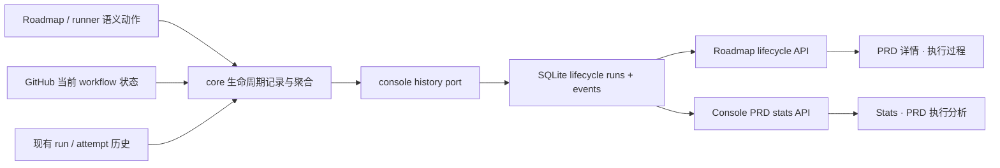
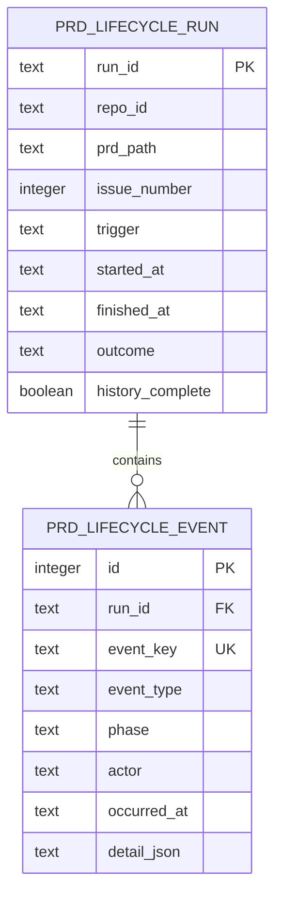

# PRD: PRD 生命周期观测与执行分析

> ⛔ **交付前置**：建议排在 `P1-FEAT-20260916-134008-roadmap-prd-cicd-monitor-auto-repair` 之后开工，以避免两个 PRD 同时修改 Roadmap 详情标签和运行状态展示。
> 结构化声明见 §8 Delivery Dependencies，**那里是唯一事实源**。

> ⬜ **验收状态**：未开工。
> 本行是 §9 Acceptance Checklist 的投影，**那里是唯一事实源**。

本文分为两层：Part A 供产品与工程负责人确认行为和验收结果；Part B 供执行器实现、测试与留存证据。

## Feature Overview（功能一览）

本节是 §10 Functional Requirements 的易读投影；具体行为以 §1 行为样例和 §10 为准。

- **单 PRD 执行过程**（FR-1、FR-2）：在 Roadmap 详情中查看当前阶段、开始时间、累计耗时和不可覆盖的生命周期时间线。
- **失败、阻塞与重试可追溯**（FR-2、FR-3）：每次状态变化、Agent 尝试和恢复动作都有时间、结果与原因。
- **正确区分耗时口径**（FR-4）：分别展示端到端、有效执行、等待和阻塞时间，避免把 runner 单轮耗时误称为 PRD 耗时。
- **仓库级 PRD 统计**（FR-5）：查看每个 PRD 的耗时，以及平均值、中位数、P90 和阶段瓶颈。
- **兼容已有运行历史**（FR-6）：复用现有 run/attempt 数据；旧记录无法可靠归属 PRD 时明确标记，不制造虚假完整轨迹。
- **真实入口可验证**（FR-7）：Roadmap 与 Stats 均通过现有 `frontend-public` 页面、API 和 Playwright 用户流程验收。

# Part A · 人工评审层 (Review Layer)

## 1. Introduction & Goals

### Problem Statement

当前 Roadmap 只能根据 PRD 文件和 GitHub Issue labels 显示一个瞬时状态；单 PRD 详情只有“PRD 原文”和“验收证据”，不能回答它何时开始、经历过哪些阶段、卡在哪里以及总共花了多久。Stats 虽然展示单次 runner 记录，并且后端已经计算 `average_duration_seconds`，但页面没有呈现该平均值；更关键的是，这个值代表一次 Issue runner 调用而非完整 PRD 生命周期。因此仓库负责人无法比较每个 PRD 的交付周期，也无法定位流程瓶颈。

### Interpretation（解读回显）

#### 行为样例

| 输入 / 操作 | 期望观察到的结果 |
|---|---|
| 在 Roadmap 打开一个正在执行的 PRD，并选择“执行过程” | 页面显示当前阶段、端到端耗时、执行/等待拆分和按时间排序的生命周期事件。 |
| 一个 PRD 的 Agent 首次验证失败，之后自动恢复 | 时间线同时保留失败与恢复事件，重试次数和各次耗时可见，不以成功结果覆盖失败历史。 |
| 打开 Stats 并选择一个仓库和最近 30 天 | 页面展示每个 PRD 的总耗时及仓库平均值、中位数、P90、平均阻塞时间和阶段瓶颈。 |
| PRD 仍在执行或阻塞中 | 总耗时计算到当前时刻，并明确显示“进行中”或“阻塞中”，不伪造结束时间。 |
| 历史 run 记录只有 Issue 编号，无法可靠关联 PRD | 页面把它标记为“未关联 PRD”的旧记录，且不将其纳入完整生命周期分位数统计。 |
| 生命周期事件写入失败 | runner 主流程不被旁路观测阻断，但页面显示数据不完整告警，日志中保留可诊断错误。 |

这些行将逐字转写为 §7.6 验收 oracle 的行为目标；修改任一单元格即修改对应验收标准。

#### 我默默定了这些

- “执行多久”默认指从首次进入执行队列到归档的端到端历时，并同时拆出有效执行、等待和阻塞时间。
- 生命周期以 `repo_id + prd_path + stable run id` 为主身份，Issue 编号只是外部关联，避免 PRD 改名之外的重试互相覆盖。
- 状态变化采用追加事件，当前状态与统计由事件聚合；不把 GitHub label 当前值冒充历史。
- 页面放在现有 `frontend-public` 的 Roadmap 与 Stats，不新增第三个业务页面或改动已冻结的 `frontend-admin`。
- SQLite 继续作为本地旁路存储，不引入 PostgreSQL、外部时序数据库或新的服务进程。
- 生命周期写入失败保持现有旁路原则：不阻断 runner，但必须留下告警和可见的不完整标志。

#### 我理解为不做

- 不做跨仓库云端遥测、用户行为分析或远程日志采集平台。
- 不记录 Agent 的完整私密 prompt、模型思维过程或可能含密钥的原始终端内容。
- 不在本 PRD 中重做 Roadmap 调度、CI/CD 自动修复或生命周期 Agent 选择逻辑。

本需求被解读为：给现有本地 Agent Runner 增加以 PRD 为中心、可长期追溯的生命周期账本与可视化，而不是只在现有进程日志上加搜索，也不是把一次 runner 调用的耗时换个名字展示。

### What The User Gets

仓库负责人能够从任意 PRD 详情看到它现在执行到哪一步、过去发生过什么、每一步花了多久；在 Stats 中能够横向比较仓库内 PRD 的交付周期和瓶颈。失败、恢复、等待与阻塞不再被最终状态覆盖。

### Measurable Objectives

- 任一新启动 PRD 都有稳定 run id，关键状态变化形成按发生时间排序的追加事件。
- Roadmap 详情从真实 API 加载时间线，并能从失败事件定位到对应 attempt、Agent 和原因。
- Stats 对完整 PRD 生命周期计算平均值、中位数、P90；进行中记录不进入已完成分位数。
- 执行、等待、阻塞与端到端时长满足可复算关系，跨刷新和进程重启后结果一致。
- 旧数据无法可靠关联时明确降级，不通过标题、模糊路径或当前 label 猜测归属。

## 2. Human Review Map（介入与风险地图）

### 耗时口径采用“端到端 + 分类拆分”

建议总耗时从 PRD 首次进入执行队列开始，到归档结束；同时单独展示实际 Agent 工作、等待外部结果和明确阻塞的时间。只展示单个总数会掩盖流程瓶颈，只展示 Agent 执行时间又不能反映用户实际等待。

**请确认：** 是否接受“端到端耗时”为主指标，并以执行、等待、阻塞作为互斥分类拆分？

**验收：** 同一 PRD 的详情与 Stats 使用一致口径，示例事件可从时间线重新计算出页面数字。

### 生命周期记录保持旁路，不阻断交付

现有 `run_records` 与 `attempt_records` 明确采用旁路写入策略。建议新事件账本继承这一边界：观测存储故障不能让已完成的代码交付失败，但必须在日志及页面标记观测缺口，避免静默假装数据完整。

**请确认：** 是否接受“主流程继续、观测明确降级”的故障语义，而不是在生命周期事件写入失败时停止 runner？

**验收：** 注入事件存储失败后 runner 仍完成既有动作，同时 API/UI 明确报告生命周期记录不完整。

### 自动门禁，不需要逐项人工审阅

执行器与独立 verifier 负责架构依赖、SQLite 并发、事件顺序与幂等、API 契约、前端类型同步、旧记录降级、构建和真实浏览器流程；人工只需确认上述两个产品口径和最终 UI 呈递。

### 本次明确不涉及

不改变 GitHub labels/comments/PR 作为 workflow 当前事实来源，不修改 CI/CD 自动修复策略，不引入跨机器遥测或新的权限边界。

## 3. Usage And Impact After Implementation

### 仓库负责人

从现有 Roadmap 选择 PRD，在详情的“执行过程”标签查看当前阶段、关键指标和事件时间线；点击事件查看 Agent、持续时间、失败原因与关联对象。需要横向比较时，从详情进入 Stats 或直接使用侧栏“统计”。现有“PRD 原文”“验收证据”和启动操作保持不变。

### Runner 运维者

继续使用现有 `iar run`、`iar daemon`、Roadmap 启动与托管进程入口。新生命周期记录自动产生；事件存储故障时 runner 不被阻断，但日志与页面显示观测缺口。无需新增外部服务或凭据。

### 开发者与验证者

沿用 `SqliteConsoleStore`、FastAPI `/api/v1/agent-runner/*` 和 `frontend-public` 类型/API 客户端。旧 `run_records` 与 `attempt_records` 继续可读；新增统计以生命周期 run/event 为准，避免破坏现有 console 最近运行列表。

## 4. Requirement Shape

- **Actor**：仓库负责人、Runner 运维者、开发者与独立验证者。
- **Trigger**：PRD 被排队、启动、切换阶段、失败、阻塞、恢复、合并或归档；用户打开 Roadmap PRD 详情或 Stats。
- **Expected behavior**：系统追加生命周期事件并聚合出可复算的当前阶段、耗时拆分、完整时间线与仓库统计；异常或旧数据明确降级。
- **Explicit scope boundary**：只覆盖本地 IAR Console 的 PRD 生命周期观测；不替代 GitHub workflow 当前状态、不采集敏感模型内容、不实现远程遥测。

# Part B · 执行器层 (Build Layer)

## 5. Repository Context And Architecture Fit

### Existing Path

- `roadmap_prd_scanner.py` 与 `roadmap_state_resolver.py` 生成当前 PRD 列表和瞬时状态。
- `agent_runner_run_history.py` 向 `IRunHistoryStore` 旁路写入单次 Issue run；`agent_runner_orchestrate.py` 写 attempt 历史。
- `console_store.py` 已承载 `run_records`、`attempt_records`、`roadmap_queue`、审计和监控快照，适合扩展本地生命周期账本。
- `agent_runner_roadmap.py` 已提供 PRD 列表、原文和证据 API；`agent_runner_console.py` 已提供统计 API。
- `PrdDetail` 已提供可扩展标签容器；Stats 页面已消费每日趋势和最近 run。

### Reuse Candidates

- 复用 `IRunHistoryStore` 的 run/attempt 类型与 `SqliteConsoleStore` 的 WAL、迁移、并发和旁路错误策略。
- 复用 `RoadmapPrd.prd_path` 与 `issue_number` 的关联、Roadmap API 的 base64 路径编码、`PrdDetail.additionalTabs` 扩展点。
- 复用 Stats 的仓库/时间范围筛选、`formatDuration`、API client 与现有卡片/表格样式。

### Architecture Constraints

- 新的业务聚合与耗时规则属于 `core`；SQLite schema/查询属于 `infrastructure`；FastAPI 只做 DTO 与用例调用。
- `infrastructure` 不导入 `core`，继续采用同构 dataclass/鸭子类型实现端口。
- GitHub 当前状态与本地历史账本角色不同：前者用于 workflow 决策，后者用于观测，不能反向驱动状态机。
- `frontend-admin` 已冻结，无前端影响；完整前端影响位于 `frontend-public`（Next.js 16、React 19，`pnpm dev/build/typecheck`；真实 UI 验证使用 `just e2e`）。

### Existing PRD Relationship

- 待办 `P1-FEAT-20260916-134008-roadmap-prd-cicd-monitor-auto-repair` 会修改同一 Roadmap 详情扩展区，功能不重复但存在文件冲突，记录为 soft dependency。
- 已归档 `P1-FEAT-20260611-205725-agent-runner-unified-ops-console` 定义 SQLite 旁路历史和 Stats 基线，本 PRD 延伸而不取代它。
- 已归档 `P1-FEAT-20260614-200054-frontend-prd-roadmap`、`P1-FEAT-20260916-122645-roadmap-prd-controls-evidence-autopilot` 定义 Roadmap 页面与统一详情容器，本 PRD复用其入口。
- 已归档 `P1-FEAT-20260626-174127-agent-runner-attempt-history-persistence` 定义 attempt 持久化，本 PRD 将其关联到 PRD run 时间线。

### Potential Redundancy Risks

- 不新增第二套 run history store；生命周期表与现有表同库、同端口族。
- 不在前端重复计算耗时或状态；API 返回聚合结果与原始事件，前端只格式化。
- 不从 GitHub 评论重新抓取并解析整条历史；只把写入时的业务事件作为账本。

## 6. Recommendation

### Recommended Approach

在现有 console SQLite 中新增 `prd_lifecycle_runs` 与 `prd_lifecycle_events` 两张追加式账本表；core 定义生命周期事件、聚合快照与统计 DTO，通过一个扩展后的 console history 端口写入和查询。现有 Roadmap/runner 编排在已存在的状态切换语义点追加事件，Roadmap API 提供单 PRD 时间线，Stats API 提供 PRD 维度统计。前端只在 `PrdDetail` 增加“执行过程”标签，并把现有 Stats 扩展成生命周期统计。

这条路径比继续扩充 `roadmap_queue` 更可靠：queue 会被清空且只保留当前状态；比单独引入 event service 更轻量：现有 SQLite 已具备并发与迁移机制。新表是必要的新持久化结构，因为当前表没有稳定 PRD run id，也不能表达多阶段状态变迁。

### Proposed Solution Summary（实现机制）

Roadmap 启动动作提供 `repo_id` 与规范化 `prd_path`，core 创建稳定 run id 并追加 `queued` 事件；runner 在 claim、attempt、validation、review、merge、archive、failed、blocked、retry 等既有语义点追加事件。聚合用例读取 run/event 与可关联 attempt，按事件区间计算端到端、执行、等待和阻塞时长，返回详情与统计 DTO。事件 payload 仅存结构化摘要和关联标识，不保存敏感原始输出。前端从新增只读 API 获取结果并呈现；不新增页面、服务、消息队列或前端自算状态。

### Alternatives Considered

- **只展示 `run_records.duration_seconds`**：无法覆盖排队、审阅、阻塞、归档和跨重试全过程，语义错误。
- **把每次状态写入 `roadmap_queue` 新行**：queue 是调度临时状态且支持清空，生命周期与调度所有权混淆。
- **解析 GitHub label/comment 时间线**：依赖远端完整性、调用成本高，且本地 attempt 与写入失败不可稳定关联。

## 7. Implementation Guide

> This section is a living implementation guide based on current repository analysis. If implementation discovers additional affected files, hidden dependencies, edge cases, or a better path, update this PRD before proceeding.

### Core Logic

1. 定义稳定的 lifecycle run/event 模型、事件种类闭集和耗时分类规则。
2. 扩展 `IRunHistoryStore` 或将其重命名为保持兼容的 console history 端口，提供创建 run、追加事件、按 PRD 查询、聚合统计能力。
3. 以 SQLite `PRAGMA user_version` 升级 schema；写入使用事务和幂等 event key，失败只告警并记录数据不完整状态。
4. 在 Roadmap start/advance、runner claim/orchestrate/closeout/rework/blocked 等现有语义点调用 core 记录函数；禁止 API 或 infrastructure 猜测业务事件。
5. 单 PRD API 按 `repo_id + prd_path` 返回当前/最近 run、指标、事件、完整性；统计 API 按仓库与日期窗口返回分位数、阶段聚合和 PRD 行。
6. 前端详情标签延迟加载时间线；Stats 使用后端聚合数据，支持仓库与 7/30/90 天筛选。

### Change Impact Tree

```text
.
├── src/backend/core/shared/interfaces/runner_console.py [修改]
│   【总结】扩展现有旁路历史端口，声明 PRD lifecycle run/event 的写入与查询契约。
├── src/backend/core/shared/models/roadmap.py [修改]
│   【总结】增加详情快照、事件和统计的跨层 DTO，不把持久化字段泄漏给 API。
├── src/backend/core/use_cases/agent_runner_lifecycle.py [新增]
│   【总结】集中定义事件追加、当前阶段推导、耗时分类和统计聚合规则。
├── src/backend/core/use_cases/roadmap_actions.py [修改]
│   【总结】在单 PRD 与全局启动的既有语义点创建 lifecycle run 和初始事件。
├── src/backend/core/use_cases/agent_runner_orchestration_runtime.py [修改]
│   【总结】把稳定 run context 带入执行、失败、恢复与收尾链路。
├── src/backend/core/use_cases/agent_runner_closeout.py [修改]
│   【总结】记录验证、审阅、合并和归档相关生命周期事件。
├── src/backend/infrastructure/persistence/console_store.py [修改]
│   【总结】迁移并实现追加式 PRD run/event 表、幂等写入和统计查询。
├── src/backend/api/routes/agent_runner_roadmap.py [修改]
│   【总结】新增单 PRD 生命周期详情只读端点。
├── src/backend/api/routes/agent_runner_console.py [修改]
│   【总结】新增 PRD 维度耗时与阶段瓶颈统计端点。
├── frontend-public/lib/api/types.ts [修改]
│   【总结】同步 lifecycle detail 与 PRD statistics 契约。
├── frontend-public/lib/api/roadmap.ts [修改]
│   【总结】封装单 PRD 生命周期详情请求。
├── frontend-public/lib/api/console.ts [修改]
│   【总结】封装 PRD 生命周期统计请求。
├── frontend-public/components/roadmap/prd-lifecycle-view.tsx [新增]
│   【总结】呈现指标、正常/失败/阻塞事件时间线和事件详情。
├── frontend-public/components/roadmap/prd-detail.tsx [修改]
│   【总结】在统一 PRD 详情中注册“执行过程”标签。
├── frontend-public/app/(app)/app/stats/page.tsx [修改]
│   【总结】从单次 runner 趋势升级为 PRD 端到端统计与明细。
├── tests/test_prd_lifecycle.py [新增]
│   【总结】覆盖事件幂等、阶段推导、耗时分类、分位数与降级语义。
├── tests/test_roadmap_api.py + tests/test_console_stats.py [修改]
│   【总结】验证 API 契约和 SQLite fresh-read 聚合。
├── tests/playwright-e2e/tests/smoke/roadmap-prd-lifecycle.spec.ts [新增]
│   【总结】从真实 Roadmap 与 Stats 页面验证详情、失败轨迹和统计往返。
├── docs/guides/agent-runner.md [修改]
│   【总结】说明生命周期口径、数据完整性与存储边界。
└── docs/prototypes/prd-lifecycle-observability.* + docs/prototypes/assets/prd-lifecycle-observability.* [新增]
    【总结】提供已登记 Hub 的可点击目标交互原型和维护说明。
```

文件列表基于当前代码树；执行器必须用 `rg -n "append_run_record|append_attempt|update_roadmap_queue_status|PrdDetail|average_duration_seconds" src/backend frontend-public tests` 重新定位实际语义点，并在发现遗漏时先更新本 PRD。

### Risk Classification Register

| Change point | Tier | 决定性原因 | Intervention | Oracle / gate |
|---|---|---|---|---|
| 生命周期身份、追加事件与耗时分类 | R3 | 新持久化业务事实影响所有统计，错误会产生可信但错误的历史 | 人工确认口径；幂等、乱序、重试和故障负控 | rv-1、rv-3 |
| Roadmap 生命周期详情 API/UI | R2 | 跨 SQLite、core、HTTP 与真实页面，错误会误导当前进度 | fresh DB + HTTP + 浏览器链路 | rv-1 |
| 仓库级统计与分位数 | R2 | 聚合口径跨多 PRD，进行中/旧数据纳入错误会污染决策 | 固定 fixture 手工复算 + fresh API/UI | rv-2 |
| 旧记录无法关联的降级 | R1 | 局部兼容展示，不改变 workflow | 集成断言明确标记且排除完整统计 | rv-4 |
| 文档、类型与原型登记 | R1 | 用户可见但局部可回滚 | build、Hub 浏览器检查、静态一致性 | rv-5 |

### Executor Drift Guard

- 开工前确认 `console_store.py` 的 schema version、Roadmap 详情标签、Stats API 和待办 CI/CD PRD 是否已变化。
- 不假定 Change Impact Tree 穷尽所有状态语义点；搜索所有 label 迁移、blocked/rework/closeout/archive 调用。
- 若 pending CI/CD PRD 已实施，复用其 `additionalTabs` 与监控 DTO，不恢复旧组件结构。
- 不把原型 fixture、事件 id 或文案硬编码进生产逻辑。

### Flow / Architecture Diagram



### ER Diagram



`event_key` 必须在同一 run 内唯一以抵抗重试重复写；`detail_json` 只允许结构化非敏感摘要。现有 `run_records` / `attempt_records` 保持原 schema，通过 `repo_id + issue_number + 时间窗口` 做展示关联，但不反向伪造 lifecycle event。

### Realistic Validation Plan

```yaml
- id: rv-1
  behavior: 在 Roadmap 打开一个正在执行的 PRD，并选择“执行过程” | 页面显示当前阶段、端到端耗时、执行/等待拆分和按时间排序的生命周期事件。
  reviewer: human
  real_entry: "just e2e tests/smoke/roadmap-prd-lifecycle.spec.ts"
  expected: "从真实 Roadmap 路由选择 fixture PRD 后，执行过程标签展示与 API fresh-read 一致的指标和有序事件；截图包含页面 shell 与详情父级布局。"
  mock_boundary: "GitHub 可使用现有 fake client；FastAPI 路由、core 聚合、SQLite、Next.js 页面与浏览器交互必须真实。"
  tier: R2
  test_layer: e2e
  required_for_acceptance: true
  presentation: "tasks/evidence/<prd-stem>/rv-1-roadmap-lifecycle.png；人工查看当前阶段、四项指标和时间线，并点击一个事件打开详情。"
  critical_value_source: "Roadmap 页面列表返回的 prd_path 与 lifecycle API 响应中的 run_id/event timestamps。"
  must_cross: "browser -> Next.js route -> /api proxy -> FastAPI roadmap route -> core aggregate -> SQLite -> fresh HTTP read -> browser render"
  forbidden_bypasses: "直接渲染组件、手工注入 React state、绕过 HTTP 调 core、前端重算时间线"
  fresh_state_probe: "事件写入完成后新建浏览器页面并重新请求详情 API，比较 run_id 与事件顺序。"
  final_tree_evidence: "最终相关代码树上重跑 e2e，截图与 trace 归档到同一 evidence dir。"
- id: rv-2
  behavior: 打开 Stats 并选择一个仓库和最近 30 天 | 页面展示每个 PRD 的总耗时及仓库平均值、中位数、P90、平均阻塞时间和阶段瓶颈。
  reviewer: human
  real_entry: "just e2e tests/smoke/roadmap-prd-lifecycle.spec.ts"
  expected: "Stats 页面数值与固定 SQLite fixture 的独立手工计算一致；进行中和未关联旧记录不进入完成分位数。"
  mock_boundary: "时间固定器与 GitHub 可替换；统计 SQL/core、API、页面和筛选交互必须真实。"
  tier: R2
  test_layer: e2e
  required_for_acceptance: true
  presentation: "tasks/evidence/<prd-stem>/rv-2-prd-stats.png；人工核对平均值、中位数、P90、阻塞时间和 PRD 表格。"
  critical_value_source: "测试预置的 lifecycle event timestamps 与 Stats API 原始响应。"
  must_cross: "SQLite fixture -> core aggregation -> console stats API -> Next.js page -> browser filter/render"
  forbidden_bypasses: "复用 run_records AVG 冒充 lifecycle 统计、前端内嵌 fixture、只断言字段存在"
  fresh_state_probe: "新 HTTP client 查询 API，新浏览器上下文打开 Stats 并核对同一仓库/窗口。"
  final_tree_evidence: "在最终代码树同时保存独立复算输出、API 响应和浏览器截图。"
- id: rv-3
  behavior: 生命周期事件写入失败 | runner 主流程不被旁路观测阻断，但页面显示数据不完整告警，日志中保留可诊断错误。
  reviewer: verifier
  real_entry: "uv run pytest -q tests/test_prd_lifecycle.py -k 'store_failure or idempotent or duration'"
  expected: "主流程完成，history_complete=false 或等价不完整状态可从 fresh API 读取，日志包含 run/event 上下文且不含敏感 payload。"
  mock_boundary: "仅在测试边界令 store append 抛错；业务错误处理与 API 降级必须真实。"
  tier: R3
  test_layer: integration
  required_for_acceptance: true
  critical_value_source: "测试产生的 run_id、存储异常与 fresh API 完整性字段。"
  must_cross: "runner use case -> failing history port -> warning/incomplete marker -> fresh API read"
  forbidden_bypasses: "生产故障开关、吞错后默认 history_complete=true、直接构造 API DTO"
  fresh_state_probe: "使用新 store/API session 读取同一 run 的完整性状态。"
  final_tree_evidence: "最终代码树重跑测试并保存 pytest 与日志捕获。"
  negative_control: "在测试临时 subclass 中去掉存储异常，断言不完整告警必须失败。"
  expected_fail: "未出现 history_complete=false 或告警时测试变红。"
- id: rv-4
  behavior: 历史 run 记录只有 Issue 编号，无法可靠关联 PRD | 页面把它标记为“未关联 PRD”的旧记录，且不将其纳入完整生命周期分位数统计。
  reviewer: verifier
  real_entry: "uv run pytest -q tests/test_prd_lifecycle.py tests/test_console_stats.py -k legacy"
  expected: "旧记录仍可在最近运行列表查看，生命周期统计排除它并返回明确降级标记。"
  mock_boundary: "使用真实临时 SQLite schema 和查询；无需真实 GitHub。"
  tier: R1
  test_layer: integration
  required_for_acceptance: true
- id: rv-5
  behavior: PRD 生命周期原型可从 Hub 打开、演示失败重试和统计往返，并可返回 Hub。
  reviewer: human
  real_entry: "uv run mkdocs serve"
  expected: "桌面与窄屏均可从 Hub 直开原型，完成 Roadmap -> 事件详情 -> 失败重试 -> Stats -> Roadmap -> Hub，且无横向溢出。"
  mock_boundary: "原型使用明确标注的静态 fixture；Hub、HTML/CSS/JS 与浏览器交互真实。"
  tier: R1
  test_layer: manual
  required_for_acceptance: true
  presentation: "http://127.0.0.1:8000/prototypes/prd-lifecycle-observability.html；约 10 秒检查失败轨迹切换、事件抽屉和 Stats 返回。"
```

失败排查顺序：先检查 lifecycle event 写入与 run identity，再检查 core 区间聚合，最后检查 API 序列化与前端类型；UI 数字与 API 不一致时禁止在前端修补口径。

### Interactive Prototype Change Log

| File Path | Change Type | Before | After | Why |
|---|---|---|---|---|
| `docs/prototypes/prd-lifecycle-observability.html` | 新增 | 无对应 PRD 生命周期原型 | Roadmap 详情、事件抽屉、失败重试与 Stats 往返可点击 | 让人先确认信息层级与口径 |
| `docs/prototypes/assets/prd-lifecycle-observability.css` | 新增 | 无 | 复用真实产品 shell 与设计令牌的响应式布局 | 保持原型贴近生产页面 |
| `docs/prototypes/assets/prd-lifecycle-observability.js` | 新增 | 无 | 稳定 fixture 驱动的状态模型 | 演示关键分支且可重置 |
| `docs/prototypes/prd-lifecycle-observability.md` | 新增 | 无 | 启动、点击语义、模拟边界与设计依据 | 保持原型可维护 |
| `docs/prototypes/assets/prototype-hub.js` | 修改 | 原型未登记 | 新增完整 registry 元数据与入口 | 维持 Hub 为唯一清单 |
| `docs/prototypes/index.md` / `mkdocs.yml` | 修改 | 文档导航缺少入口 | 增加原型说明页导航 | 让文档站可发现 |

### External Validation

No external validation required; repository evidence was sufficient.

## 8. Delivery Dependencies

### Delivery Dependencies

- Group: roadmap-observability
- Depends on tasks/issues:
  - `P1-FEAT-20260916-134008-roadmap-prd-cicd-monitor-auto-repair`
- Gate type: soft
- Notes: 功能独立，但二者修改 Roadmap 详情扩展区；若并行实施，后开工者必须基于已合并组件结构重定位，不以此阻止调度。

## 9. Acceptance Checklist

### 9.1 人读呈递区（Human Review Surface）

| 要查看的结果 | 呈递物（交付时填入最终路径） | 约 10 秒自检 |
|---|---|---|
| Roadmap 单 PRD 当前阶段、耗时拆分和生命周期时间线 | `tasks/evidence/<prd-stem>/rv-1-roadmap-lifecycle.png`；交付时内联本地图片并附 `open` 绝对路径 | 点击一条失败事件，确认抽屉显示时间、Agent、原因与 run id。 |
| Stats 的平均值、中位数、P90、阻塞时间和 PRD 明细 | `tasks/evidence/<prd-stem>/rv-2-prd-stats.png`；交付时内联本地图片并附 `open` 绝对路径 | 核对页面顶部四项指标与表格第一行口径一致。 |
| 可点击目标原型 | `http://127.0.0.1:8000/prototypes/prd-lifecycle-observability.html` | 切换“失败与重试”，进入 Stats，再点击 PRD 名称返回。 |

Verifier-only 且不在本区逐项呈递：SQLite/聚合单测、旁路故障负控、旧记录降级、架构/lint/build 和证据一致性；仅失败时向人工报告。

### 9.2 Acceptance Evidence Package

#### Human-Confirmed

- [ ] 人工确认 §2 的“端到端 + 执行/等待/阻塞互斥拆分”口径；证据为 rv-1/rv-2 呈递与独立复算结果。
- [ ] 人工确认 §2 的“观测写入失败不阻断主流程但必须明确降级”语义；证据为 rv-3 失败注入输出和页面告警。
- [ ] 人工完成 §9.1 三个呈递物的一次性审阅，并记录可接受或差异。

#### R3 / R2 Behavior Acceptance

- [ ] `tests/test_prd_lifecycle.py` 证明 event key 幂等、乱序读取稳定、重试不覆盖历史、四类耗时可复算，证据保存为 `rv-3-*.txt`。
- [ ] 生命周期 store 故障负控确实变红，恢复实现后主流程完成且 fresh API 显示数据不完整。
- [ ] Roadmap real user flow 从列表真实 `prd_path` 穿过 API/SQLite 并呈现最终代码树数据，证据为 rv-1 screenshot/trace/API capture。
- [ ] Stats fixture 独立复算值与 fresh API、页面一致，进行中/未关联记录不污染完成分位数，证据为 rv-2 screenshot/API/recalculation。

#### Architecture Acceptance

- [ ] `uv run python hooks/shared/check_architecture.py` 通过；业务聚合只在 core，SQL 只在 infrastructure，API 未直接导入 engines/infrastructure。
- [ ] 生命周期继续复用 console SQLite 与现有端口族，没有新增服务、数据库依赖或前端重复计算状态。

#### Frontend Acceptance

- [ ] `frontend-public` 类型、Roadmap API、Console API、PRD 详情标签和 Stats 页面与后端契约一致，`pnpm --dir frontend-public typecheck`、`build` 通过。
- [ ] `just e2e tests/smoke/roadmap-prd-lifecycle.spec.ts` 在 production composition/real user flow 层通过，保留真实 shell、父布局、标签容器与 API proxy。
- [ ] 桌面与窄屏视觉证据标注验证层级，事件抽屉可关闭、失败分支可恢复、Stats 可返回 PRD。

#### Compatibility And Documentation Acceptance

- [ ] 旧 `run_records`/`attempt_records` 仍可由现有 API 读取；无法关联记录有明确标志且不制造 lifecycle event。
- [ ] `docs/guides/agent-runner.md`、API/类型文档和 `mkdocs.yml` 已同步，`uv run mkdocs build --strict` 通过。
- [ ] Prototype Hub 从 registry 展示新原型，桌面和窄屏完成 Hub → 原型关键状态 → Hub，且原型说明明确模拟边界。

#### Validation Acceptance

- [ ] `just lint --reuse`、`just lint --full`、受影响 pytest、前端 typecheck/build、mkdocs strict build 和 `git diff --check` 全绿；证据指向最终代码树。
- [ ] 独立 verifier 对 rv-1 至 rv-5 的来源、真实边界、fresh-state 与反例审查结果为 PASS。

#### Delivery Readiness

- [ ] 实现与 PRD Final Reconciliation 一致，无必需工作被推迟为未声明 follow-up。
- [ ] 完成消息逐字携带 §9.1 人读呈递区内容；所有静态图先内联，再标注“本地图片”并附可运行的 `open` 命令。
- [~] PR 创建、独立审查与归档由 runner 在执行器交付门禁之后完成 — runner-owned gate: PR/review/archive。

## 10. Functional Requirements

- **FR-1**：系统必须为每次 PRD 执行创建稳定、可跨进程恢复的 lifecycle run identity，并关联仓库、规范化 PRD 路径和可选 Issue。
- **FR-2**：系统必须以追加方式记录排队、执行、验证、审阅、等待、阻塞、失败、重试、合并、归档等语义事件；重复写不产生重复事件，后续成功不覆盖失败历史。
- **FR-3**：单 PRD 详情必须展示当前阶段、完整性状态、关键指标、有序事件以及单事件详情，并对进行中、失败、阻塞和无数据提供明确状态。
- **FR-4**：core 必须按统一规则计算端到端、执行、等待、阻塞时长；前端不得自行重新定义或聚合这些口径。
- **FR-5**：Stats 必须按仓库和时间窗口展示完成 PRD 数、平均值、中位数、P90、平均阻塞时间、阶段瓶颈与每 PRD 明细。
- **FR-6**：现有 run/attempt API 和最近运行列表保持兼容；旧记录无法可靠关联时必须标记并排除出完整生命周期统计。
- **FR-7**：实现必须同步 API/前端类型/文档，并通过真实 Roadmap 与 Stats 用户流程、SQLite fresh-read 和独立 verifier 验收。

## 11. Non-Goals

- 不改变 GitHub workflow 状态机、Roadmap 调度与 CI/CD 自动修复行为。
- 不提供远程 SaaS 遥测、跨机器聚合、长期日志仓库或数据导出平台。
- 不保存完整模型 prompt、思维过程、未脱敏终端输出或密钥。
- 不追求从所有旧记录重建完整历史；无法证明的历史必须保持未知。

## 12. Risks And Follow-Ups

- SQLite 属于本地旁路数据，删除 console DB 后历史不可恢复；本 PRD 不新增远程备份，文档必须披露。
- PRD 路径被重命名时需通过 stable run id 保持既有历史，同时更新最新路径别名；若实现期发现当前归档 hook 无可靠重命名语义，必须在本 PRD 中补齐而非静默丢失。
- 长期事件量可能增长；本次先通过索引与查询窗口控制，不在未测量前加入自动删除策略。

## 13. Decision Log

| ID | Decision | Rejected | Rationale |
|---|---|---|---|
| D-01 | 新增追加式 lifecycle run/event 表并复用 console SQLite | 复用可清空的 `roadmap_queue` | 调度队列不具备不可变历史与稳定 run identity，无法可靠计算阶段区间。 |
| D-02 | 主指标采用端到端耗时并拆分执行/等待/阻塞 | 只展示 `run_records.duration_seconds` | 单次 runner 调用不覆盖排队、审阅、阻塞、重试和归档。 |
| D-03 | 观测失败旁路降级且显式标记不完整 | 事件写入失败即终止 runner | 观测系统不应破坏交付主流程，但静默缺失同样不可接受。 |
| D-04 | 在现有 Roadmap 详情与 Stats 扩展 | 新增独立“生命周期”页面 | 用户已从 PRD 和统计两个心智入口完成任务，新页面会复制筛选与导航。 |

### Final Reconciliation

- Interpretation: 待实现后确认 — 当前按 §1 解读执行。
- Public behavior and contracts: 待实现后确认 — 当前以 §10 和原型为目标。
- Related PRD status: 待实现后确认 — 开工前重查 soft dependency 状态。
- Requirements and risks: 待实现后确认 — 归档前对最终实现与新证据重读。
- Reconciled differences:
  - none

## Change Log

### 创建 PRD 与交互原型
- Type: scope
- Before: Roadmap 仅有瞬时状态，Stats 仅有单次 runner 记录，没有以 PRD 为中心的生命周期要求。
- After: 定义追加式生命周期账本、单 PRD 执行过程、仓库统计、兼容降级和可点击目标原型。
- Reason: 用户要求补齐 PRD 全生命周期日志、当前进度、单项耗时和仓库平均统计，并更新原型。
- Impact: 新增全栈实现计划、SQLite schema、Roadmap/Stats UI、真实入口验证与 Prototype Hub 登记。
- Review: pending human interpretation and decisions confirmation
