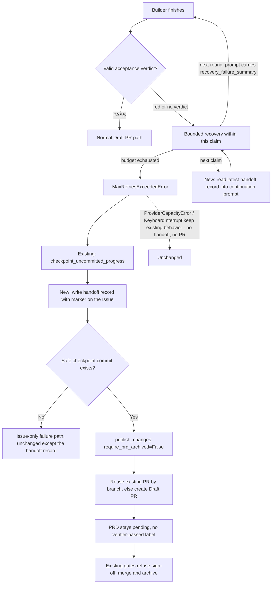
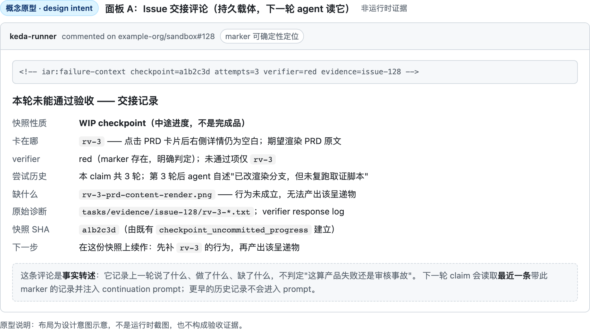
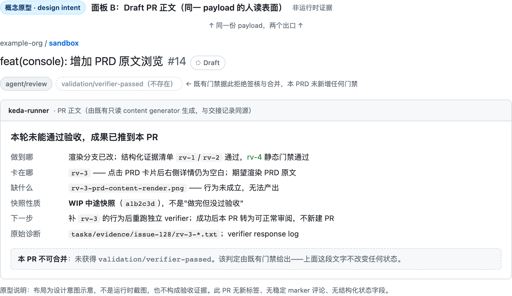

# PRD: 跨 claim 交接失败上下文，并发布人可审阅的失败 Draft PR

> 命名说明：「Blocked Draft PR」是本 PRD 对"因缺少 `validation/verifier-passed` 而被既有门禁拒绝合并的 Draft PR"的口语称呼，**不是新增的标签、状态或 PR 类型**。文件 stem 沿用 `blocked-draft-pr-validation-failure`。

> ✅ **交付前置**：无。此横幅是 §8 Delivery Dependencies 的投影。
>
> 🧍 **验收状态**：待人工验收 — 机器门禁 rv-1…rv-4 已全绿并绑定最终树，仅剩 §9.1 第 1、2 行与 §9.2 Human-Confirmed 共 4 项需 PRD 作者本人执行/确认。本行是 §9 Acceptance Checklist 的投影，**那里是唯一事实源**。
>
> 本 PRD 分为 **Part A · 人审层**与 **Part B · 执行器层**。Part A 决定行为是否符合预期；Part B 提供实现、验证与交付细节。

## Feature Overview (功能一览)

- **失败不是终点，是交班点**（FR-1、FR-2）：recovery 消耗尽时，把"上一轮做到哪、为什么没过"写成一份可持久、可定位的交接记录，而不是只留给 Issue 里一段日志。
- **下一轮能读到它**（FR-3、FR-4）：接手的新 claim 把最近一次交接记录读回 continuation prompt，agent 不必从零反推；读取限量，只取最近一条。
- **交接内容只做事实转述**（FR-5）：verifier 判定与发现、attempt 历史与 agent 自述、缺失呈递物、checkpoint SHA；**不新增**"产品失败 / 审核事故"的机器判定、标签或状态枚举。
- **一个事实源，一个同源表面**（FR-6、FR-7）：交接评论是唯一事实源；同一份 payload 发布成 Draft PR 正文作为人读表面，并固定回链该评论。
- **只放宽一条安全检查且有界**（FR-8）：仅 `require_prd_archived` 在耗尽路径显式传 `False`，不得成为默认值或泄漏到正常成功路径。
- **绝不冒充通过**（FR-9）：失败 Draft PR 不获得 `validation/verifier-passed`，既有签核、合并与归档门禁一律拒绝推进，PRD 保持 pending。
- **恢复后复用同一 PR**（FR-10）：重跑成功后复用既有 Draft PR，不制造重复 PR。

# Part A · 人审层 (Review Layer)

## 1. Introduction & Goals

### Problem Statement

keda 把独立 verifier 放在 Draft PR 创建之前：`run_verifier_gate()` 判红 → `ValidationEvidenceError` → recovery 循环（同一 claim 内重试）→ 预算耗尽 → `MaxRetriesExceededError`。在 `agent_runner_issue_handlers.py`（`run_agent_until_committed` 的 `except` 分支）里，runner 会先把在途进度 `checkpoint_uncommitted_progress()` 提交成 WIP 快照，再重新抛出；最终由 `_mark_issue_failed()` 把失败详情写成一条 Issue 评论。

**经实测，这里有一个跨 claim 的上下文断裂：**

| 范围 | 上一轮的结论是否传得下去 | 实测依据 |
|---|---|---|
| 同一 claim 内的重试 | ✅ 传得下去 | `run_agent_execution_loop.py` 每轮把 `recovery_failure_summary`（verifier 红灯时即 `_format_verifier_block_message` 的判定与发现）拼进 recovery prompt |
| 跨 claim 续作 | ❌ **传不下去** | 唯一入口 `build_progress_continuation_prompt(issue, worktree_path, *, failure_summary, verification_results)`（`agent_runner_feedback.py:970`）**不接收 Issue 评论、不接收 attempt 历史、不接收 agent 自己的输出**；`failure_summary` 只是 `_reuse_existing_local_commit` 抛出的异常摘要 |
| 跨 claim 且 verifier 判红 | ❌ **丢得更彻底** | `_reuse_existing_local_commit`（`agent_runner_publication.py:348`）只跑 verification 命令、PRD 交付检查与证据存在性检查，**根本不跑 `run_verifier_gate`**；"上一轮 verifier 为什么判红"没有任何路径跨 claim 留存 |
| agent 自己的结论 | ❌ 只写给人看 | `MaxRetriesExceededError` 的 message 仅 `"Failed after N attempts."`；`attempt_results`（含 agent 输出）只被 `format_failure_comment` 用于渲染 Issue 评论，**从不喂回任何 prompt** |

后果是接手的新 claim 只能从工作树上的 WIP 快照与 PRD 反推，看不到上一轮解到哪、卡在哪、verifier 说了什么——**同一个坑反复踩，"一直验证不通过"**。次要后果才是人也不方便：失败只留在一段 Issue 评论里，没有可直接审阅 diff 的表面。

### Interpretation (解读回显)

#### 行为样例

| 输入 / 操作 | 期望观察到的结果 |
|---|---|
| 上一次 claim 的 verifier 判红、recovery 耗尽，且存在安全 commit | 产出**一份交接记录**（verifier 判定与发现、attempt 与 agent 自述摘要、缺失呈递物、checkpoint SHA），以带标记的 Issue 评论持久化；并把**同源**内容发布（或复用）为 Draft PR 正文 |
| 下一个 claim 接手同一个 Issue | continuation prompt 里能看到上一轮的失败上下文（限量：最近一条交接记录），agent 能直接针对未通过项续作，而不是从零反推 |
| 上一次 verifier 未形成结论（超时 / 缺 marker） | 同样交接，如实说明"上一轮没有形成结论"；不得写成产品失败，也不得写成通过 |
| recovery 耗尽且没有任何可安全推送的 commit（或只含 forbidden paths） | **不发布** Draft PR；但仍写出交接记录，供下一轮接手 |
| 该 Draft PR 进入签核、合并或归档路径 | 既有门禁拒绝推进（无 `validation/verifier-passed` 即不签核、不合并；PRD 不归档），**不新增第二套门禁** |
| 后续恢复执行取得有效 verifier PASS | 复用同一个 PR 转为可正常审阅；不新建重复 PR |

以上各行会逐字成为 §7.6 的验收 oracle；修正一个单元格就等于修正对应验收标准。

#### 我默默定了这些

- **交接 payload 是事实转述，不是判定**：它记录 verifier 说了什么、agent 尝试了什么、缺了什么、快照在哪个 SHA；"这算产品失败还是审核事故"仍由 Agent 在正文里陈述，机器不为它建状态。
- **持久载体用既有通道**：Issue 评论（`format_failure_comment` 已在写的内容）+ 一个可确定性定位的 marker（沿用仓库既有 `iar:*` marker 约定，**不是标签、不是状态枚举**）。
- **回灌限量**：claim 时只取**最近一条**交接记录并做长度截断；不把 Issue 上所有评论塞进 prompt。
- **一个事实源，一个同源表面**：交接评论是唯一事实源（回灌读它、人回溯读它）；Draft PR 正文是"发布那一刻的快照"，固定回链该评论，但复用既有 PR 时不保证被改写——不维护两套各自演进的正文。
- **发布复用既有原语**：`publish_changes(..., require_prd_archived=False)`；`require_prd_archived` 是本 PRD 唯一放宽的安全检查，且只在耗尽路径使用。
- **前提要说准**：耗尽时能拿到的 commit 是既有代码建的 **WIP checkpoint 快照**（`checkpoint_uncommitted_progress`），语义是"中途进度"，**不是"实现做完了但没过验收"**。交接记录必须把这个性质说清楚，否则会误导人。

#### 我理解为不做

- 不新增标签、状态枚举或失败判定器。
- 不把 Issue 上的历史评论全量注入 prompt。
- 不新增数据库表或长期状态服务；交接记录跟着 Issue 走。
- 不让失败 Draft PR 自动合并、自动签核或自动归档。

我把需求读成：**recovery 耗尽不是终点，而是交班点。** 上一轮必须把"我做到哪、为什么没过、快照在哪"写成一份机器可定位、人和下一个 agent 都能读的交接记录；Draft PR 只是这份记录的对外表面。它不放松任何验收标准，只补上缺失的上下文与一个可审阅的表面。

### What The User Gets

- 下一轮接手的 agent 能直接看到上一轮的失败结论，不再原地打转——这是本 PRD 的主要收益。
- 维护者在 GitHub PR 列表能直接看到失败任务的 diff 与失败说明，不必先去翻 Issue 日志。
- 失败说明不会给实现伪造 PASS：写什么都不能让 PR 获得 `validation/verifier-passed`，也不能让它被签核或合并。
- 修复或环境恢复后，原 PR 原地转为可继续审阅的正常 Draft PR，历史完整保留。

### Measurable Objectives

- 耗尽后，Issue 上出现一条可被 marker 确定性定位的交接记录，内容包含 verifier 判定、attempt 摘要、缺失呈递物与 checkpoint SHA。
- 存在安全 commit 时，同一 payload 发布（或复用）为 Draft PR；无安全 commit 时不产生任何 PR，但交接记录仍然写出。
- 下一个 claim 的 continuation prompt 含上一轮交接内容；无交接记录时不注入、不报错。
- 失败 Draft PR 不获得 `validation/verifier-passed`，且既有签核、合并与归档门禁对其一律拒绝——**在完全不新增门禁的前提下成立**。
- 恢复后只存在一个 PR。

## 2. Human Review Map (介入与风险地图)

### 决策一：交接记录放在哪一层

建议用 **Issue 评论 + 一个可定位 marker**，不新增存储。理由：Issue 评论是本仓库既有的持久通道，`format_failure_comment` 已经在写这些内容；缺的只是一个让下一轮能确定性找到它的锚点，而 `iar:*` marker 正是仓库既有约定（`iar:event`、`iar:verifier-verdict`、`iar:depends-on` 等十余个）。

**请确认：** 是否接受"交接记录 = Issue 评论 + marker，不新增数据库或状态文件"？

**验收：** Issue 上能找到该 marker 的评论；新 claim 读取后 prompt 里出现上一轮结论；清空该评论后新 claim 不报错、只是没有上下文。

### 决策二：回灌给下一轮的粒度

建议**只回灌最近一条交接记录并截断**，而不是把 Issue 全部评论或完整 attempt 历史灌进 prompt。理由：prompt 是有限资源，历史评论里既有噪音也有早已修复的旧失败；注入越多，agent 越可能被过期信息带偏。

**请确认：** 是否接受"只取最近一条 + 截断"的限量回灌？

**验收：** 存在多条历史记录时，prompt 里只出现最近一条的关键内容；记录内容超长时被截断而非整段灌入。

### 决策三：人读表面用什么

建议**复用既有 publish 原语发布 Draft PR**，正文与交接记录同源（不另写一份）。理由：github PR 是审 diff 与失败说明最自然的表面；而 `publish_changes(..., require_prd_archived=False)` 已经存在，发布链路零新增。

**请确认：** 是否接受"交接记录为事实源，Draft PR 正文为同源的人读表面"？

**验收：** 有安全 commit 时出现 Draft PR，正文能回答"上一轮做到哪、卡在哪、缺什么、下一步"，且不含 `validation/verifier-passed`。

### 自动门禁，不需要逐项人工审阅

checkpoint 安全筛选、forbidden paths、分支/remote 校验、PR 幂等复用、marker 格式化与解析、既有签核/合并/归档门禁，以及现有测试/lint/docs 构建由执行器和 verifier 验证。

### 本次明确不涉及

无数据库结构变化，无前端页面变化，不新增标签、状态枚举或判定器，不新增发布模式，不改变普通 green/yellow 成功路径的用户入口，不允许失败 Draft PR 自动合并或归档。

## 3. Usage And Impact After Implementation

### 下一轮接手的 Agent（主要受益者）

接手时不再只有一棵带 WIP 快照的工作树：continuation prompt 里会带上上一轮的 verifier 判定与发现、尝试历史摘要、缺失的呈递物与快照 SHA。它可以直接针对未通过项续作，而不是重新推理"上一轮到底干了什么"。

### 代码审阅者

入口仍是 GitHub Draft PR。失败 PR 的正文说明：上一轮做到哪、卡在哪、缺哪个呈递物、下一步怎么解除阻塞，并回链原始诊断。reviewer 可直接看 diff、正文与诊断，不必先翻 Issue 日志。

### runner 操作者

`iar run-once` / daemon 的成功路径不变。失败路径在 recovery 用尽后多两步："写交接记录"与"若存在安全 commit 则发布 Draft PR"；无安全 commit 时仍不发布 PR。恢复执行复用相同分支和 PR。

### 自动合并与归档

**完全沿用既有实现**：merge queue 与 post-merge reconciliation 只接受当前 tree 上有效 verifier PASS、完整证据和人工签核，具体表现为"缺 `validation/verifier-passed` 即拒绝"（`agent_runner_merge_queue.py::process_merge_queue`，受 `autopilot.require_verifier_pass` 控制）。本 PRD 不新增门禁，也因此不改变它们的行为。

### Impact On Existing Behavior

既有正常 Draft PR、Issue failure comment、publish recovery、evidence branch 与 `validation/verifier-passed` 标签继续工作。本 PRD 不新增标签、状态枚举或数据库 schema，只增加"耗尽时写交接记录、有安全 commit 时发布 Draft PR、接手时回灌上下文"这一串动作；无安全 commit 时的 Issue-only 失败路径除多一条交接记录外逐字不变。

## 4. Requirement Shape

- **Actor**：下一轮接手的执行 Agent、GitHub PR reviewer、runner 操作者、既有 merge queue 与归档流程。
- **Trigger**：recovery 预算耗尽（此时既可能是真实行为不满足 PRD，也可能是 verifier 自身故障）。
- **Expected behavior**：把上一轮失败结论写成可定位的交接记录；有安全 commit 时发布同源的 Draft PR；接手时把最近一条交接记录回灌 continuation prompt；"是什么性质的失败"由 Agent 在正文里陈述，机器只管确定性定位与既有门禁。
- **Scope boundary**：只修改耗尽路径的交接与发布接线、continuation prompt 的上下文注入、marker 解析与文档；No frontend impact；不新增判定器、标签、状态枚举、发布模式或持久化 schema。

# Part B · 执行层 (Build Layer)

## 5. Repository Context And Architecture Fit

### Existing Path

- `src/backend/core/use_cases/run_verifier_agent.py::run_verifier_gate`：pre-PR verifier；red 抛 `ValidationEvidenceError`，green/yellow 才继续发布。`ValidationVerdict.marker_found` 已能区分"真的判了 red"与"没吐出 verdict"。
- **耗尽链路的真实落点**：`run_agent_execution_loop.py::run_agent_until_committed` 的 Phase 3.6 捕获 `ValidationEvidenceError`；`attempt_index >= max_recovery_attempts` 时 `raise MaxRetriesExceededError`（该文件内共 8 处抛出点，全部经由下述 handler）。
- `src/backend/core/use_cases/agent_runner_issue_handlers.py`：`run_agent_until_committed` 的 `except (MaxRetriesExceededError, ProviderCapacityError, KeyboardInterrupt)` 分支里调用 `checkpoint_uncommitted_progress()` 建 WIP 快照、拿到 `checkpoint_sha`，然后 `raise`。**本 PRD 的主改动在这一处**：交接记录与 Draft PR 发布都接在这里，因为只有这里同时握有异常、`attempt_results` 与 `checkpoint_sha`。注意该 `except` 元组覆盖三类异常，而本 PRD 的 hook **必须只对 `MaxRetriesExceededError` 生效**（`ProviderCapacityError` / `KeyboardInterrupt` 保持既有行为，见 FR-2）。`exc.attempt_results[*].detail` 已由 `_classify_and_record_gate_failure()` 写入 verifier 的判定文本，是交接记录里 verifier 摘要的来源。
- `src/backend/core/use_cases/agent_runner_publication.py`：`_reuse_existing_local_commit()` 是下一个 claim 的"复用既有提交"入口——**它不跑 verifier gate**，这正是跨 claim 丢失 verifier 结论的根因之一。续作 prompt 也在这里的上游构造。
- `src/backend/core/use_cases/agent_runner_feedback.py::build_progress_continuation_prompt`：唯一构造跨 claim prompt 的地方，当前只接受 `failure_summary` 与 `verification_results`；**本 PRD 要给它加上"上一轮交接上下文"入参**。
- `src/backend/core/use_cases/agent_runner_publish.py`：`push_changes(..., require_prd_archived=...)` 与 `publish_changes(..., content_generator=..., require_prd_archived=...)`（push + 建 Draft PR 的合并入口，`create_prd_from_issue.py:325` 在用）。**注意 `create_draft_pr` 本身没有 `require_prd_archived` 参数**——放宽项属于 `push_changes` / `publish_changes`。
- `src/backend/core/use_cases/agent_runner_publish.py::create_draft_pr`：PR 标题与正文本来就由只读 Agent 生成（`generate_pr_content` + `IContentGenerator`，接口自述"通过本地只读 Agent 生成人类可读的 Markdown 内容"），未启用时回落到模板正文。
- `src/backend/core/use_cases/agent_runner_failure.py`：`format_failure_comment()` / `format_attempt_history()` 已在渲染失败评论与尝试历史；`MaxRetriesExceededError` 携带 `attempt_results`。
- `src/backend/core/use_cases/agent_runner_events.py`：`iar:event` marker 的格式化/解析与 latest-wins 读取，是新增 marker 的直接模板。
- `src/backend/core/use_cases/agent_runner_merge_queue.py::process_merge_queue`：**已要求** `validation/verifier-passed` 才允许签核（`require_verifier_pass`）。本 PRD 不改它。

### Reuse Candidates

- 复用 `checkpoint_uncommitted_progress()` 的返回值作为快照 SHA 与安全筛选结论，不实现第二套"失败提交"逻辑。
- 复用 `format_failure_comment()` / `format_attempt_history()` 渲染交接正文，不新建渲染层。
- 复用 `agent_runner_events.py` 的 marker 约定实现交接记录的可定位与 latest-wins 读取。
- 复用 `publish_changes(..., require_prd_archived=False)` 一次完成 push 与建 Draft PR；`require_prd_archived` 是唯一放宽项，且只在耗尽路径传 `False`。
- 复用 `IContentGenerator` 生成 PR 正文（既有能力），不新增 Agent 调用原语。
- 复用既有签核/合并/归档门禁（"缺 `validation/verifier-passed` 即拒绝"），不新增标签也不新增门禁。

### Architecture Constraints

- 交接组装、发布接线与 prompt 注入属于 `src/backend/core/use_cases/`；GitHub I/O 继续只依赖 `IGitHubClient`，进程 I/O 继续只依赖 `IProcessRunner`。
- `api → core → engines → infrastructure` 方向不变；不从 core 导入 GitHub SDK。
- PRD pending/archive 是验收状态，不得为了创建失败 PR 提前归档。
- **不新增判定器、状态枚举、标签或发布模式**；"是什么性质的失败"由 Agent 在正文里陈述。
- **fail-closed 不变**：交接记录解析不出时，回灌环节按"没有上下文"处理（不阻断、不猜测）；既有动作协议的 fail-closed 语义不受本 PRD 影响。

### Frontend Impact

`No frontend impact`：本次只改耗尽路径的交接与发布接线、continuation prompt 与 marker 解析，不改 `frontend-public/` 或 `frontend-admin/`。

### Existing PRD Relationship

- 承接已归档 `P1-FEAT-20260628-041733-realistic-validation-independent-verifier-gate.md`：它把 verifier 放在 PR 之前，因而隐含"PR 存在 ⟹ verifier 已通过"。本 PRD 让耗尽时也能有 PR，**但判据仍是标签与当前 tree 证据**，不改那套门禁。
- 承接已归档 `P1-FEAT-20260626-015233-agent-runner-recovery-friction-reduction.md`：它引入了跨 claim 的 checkpoint 与续作 prompt；本 PRD 补上它没有传递的失败结论。
- 复用已归档 `P1-FEAT-20260619-021821-pre-pr-review-push-before-pr.md` 拆出的 push/create Draft PR 原语。
- 兼容已归档 `P1-FEAT-20260703-105322-autopilot-merge-queue-fast-profile.md` 的双门禁：失败 Draft PR 因缺 `validation/verifier-passed` 自然被拒，无需改动。
- 与 pending `P1-FEAT-20260916-134008-roadmap-prd-cicd-monitor-auto-repair.md` 有软关系：后者将来可在 Roadmap 展示失败 Draft PR，但双方不修改同一契约。
- 与 pending Tauri desktop shell 无关。

### Potential Redundancy Risks

- **不新建"失败上下文"契约对象或分类枚举**：payload 的字段就是既有渲染函数已在用的那几项，再包一层不产生新信息。
- **不扩张 `pr_supervisor` 的动作词表去承载同一件事**：`pr_supervisor` 是 post-PR 时点，而红色 verifier 是 pre-PR，那一刻没有 PR，它不在循环里。
- **不新增 `validation/blocked` 之类的标签**：合并门禁已由"缺 `validation/verifier-passed`"覆盖，新标签会成为第二个事实源。
- **不新增存储**：交接记录跟着 Issue 走，不写数据库、不写状态文件。
- **不做全量评论注入**：只读最近一条交接记录，避免 prompt 被历史噪音与过期失败污染。

## 6. Recommendation

### Recommended Approach

**在既有的耗尽分支上补三件事，全部复用现成部件：**

1. **写交接记录**：在 `agent_runner_issue_handlers.py` 的 `except` 分支里（`checkpoint_sha` 已就绪），用 `format_failure_comment()` / `format_attempt_history()` 生成正文，前面附一个 `iar:failure-context` marker（携带 `checkpoint_sha`、attempt 数、verifier 判定摘要、证据目录），作为一条 Issue 评论发出。
2. **发布同源的人读表面**：存在安全 commit 时调用 `publish_changes(..., require_prd_archived=False)`；PR 正文由既有 `IContentGenerator` 生成（把交接 payload 作为上下文喂进去）。无安全 commit 则跳过发布。
3. **回灌下一轮**：`build_progress_continuation_prompt` 增加"上一轮交接上下文"入参；claim 时用 `agent_runner_events.py` 的 latest-wins 读取最近一条记录（限量 + 截断）并注入。

这比"自造判定器 + 新标签 + 新门禁"少得多的改动面，也比现状多出**修复闭环**：上下文终于跨过 claim 边界。

### Proposed Solution Summary (实现机制)

- **输入**：耗尽时的异常与其 `attempt_results`、`checkpoint_sha`、verifier 判定（红灯消息即 `_format_verifier_block_message` 的输出）、证据目录与缺失呈递物。
- **接入点**：`agent_runner_issue_handlers.py` 的耗尽 `except` 分支——异常、attempt 历史与快照 SHA 在此处同时可得；其余入口不变。
- **持久载体**：一条带 `iar:failure-context` marker 的 Issue 评论。marker 只带键值元数据（供确定性定位），人读正文仍是 Markdown。
- **人读表面**：同一 payload 经 `publish_changes(..., require_prd_archived=False)` 发布/复用为 Draft PR，正文由既有 content generator 产出。
- **回灌**：`build_progress_continuation_prompt(..., previous_failure_context=...)`；调用方传入最近一条记录的关键内容，超长截断。
- **安全门禁**：不改动任何既有门禁；失败 PR 因缺 `validation/verifier-passed` 自然不能被签核、合并或归档。
- **刻意避免**：无新判定器、无新枚举、无新标签、无新发布模式、无新存储、无前端。

### Alternatives Considered

- **自造判定器 + 新标签 + 新门禁**：拒绝；用分类枚举、上下文对象、新标签与 merge queue 改动换取"可机器核对"，但需求要的是**下一轮能接上**，脚手架不产生这个收益。
- **把交接记录只放进 Draft PR 正文**：拒绝；无安全 commit 时根本没有 PR，交接就丢了——而"无 commit 也要交班"恰恰是必须覆盖的一格。
- **把 Issue 全部评论灌进 prompt**：拒绝；噪音与过期失败会稀释信号，且 prompt 预算有限。
- **继续只在 Issue 报失败**：拒绝；既没有可审阅表面，也没有任何跨 claim 回灌。
- **让 executor 单方面宣布 reviewer 误判**：**已接受为代价**，不再作为拒绝项。移除机器判定后这条约束无法再被强制；缓解是正文必须回链原始诊断供人对照，且无论怎么写都改不了标签与合并态。该残留风险记于 §12。

## 7. Implementation Guide

> This section is a living implementation guide based on current repository analysis. If implementation discovers additional affected files, hidden dependencies, edge cases, or a better path, update this PRD before proceeding.

### 7.1 Core Logic

1. builder 跑完 → Phase 3.6 pre-PR verifier gate 判红 → `ValidationEvidenceError` 进入既有 recovery 循环（**不改**）。
2. 重试预算耗尽 → `raise MaxRetriesExceededError`（**不改**）。所有 8 处抛出点都在 `run_agent_execution_loop.py` 内，都会经过下一步的 handler。
3. `agent_runner_issue_handlers.py` 的 `except (MaxRetriesExceededError, ProviderCapacityError, KeyboardInterrupt)` 分支先执行既有 `checkpoint_uncommitted_progress()`（**不改**），拿到 `checkpoint_sha`（可能为 `None`：worktree 干净 / 分支不符 / 全为 forbidden）。
4. **新增，且必须收窄到 `MaxRetriesExceededError` 一类**：写出一条带 `iar:failure-context` marker 的 Issue 交接记录；正文复用 `format_failure_comment()` / `format_attempt_history()`，verifier 判定取自 `exc.attempt_results[*].detail`（`_classify_and_record_gate_failure` 已把 `_format_verifier_block_message` 的文本记进 attempt 历史），并显式标明这是 **WIP 中途快照**而非完成品。
   - **不得**让 `ProviderCapacityError`（限流/容量）与 `KeyboardInterrupt`（用户主动中断）触发交接记录与发布：前者不代表"这轮工作没通过"，后者的异常**根本没有 `attempt_results` 属性**，误用会直接 `AttributeError` 掩盖用户的中断意图。二者保持既有行为。
5. **新增**：`checkpoint_sha` 非空时调用 `publish_changes(..., require_prd_archived=False)` 发布或复用 Draft PR；正文由既有 `IContentGenerator` 生成（交接 payload 作为上下文），并**在正文尾部固定附一条指向该交接评论的链接**——即使内容生成被关闭（`fallback_body`）或复用既有 PR 未改写正文，人也能顺链找到最新结论。发布失败只记日志，**不得掩盖原始失败**（沿用该分支既有的 best-effort 语义）。
6. 原样 `raise`，让既有的 `_mark_issue_failed()` 与 workflow 标签转换照常执行。
7. **下一个 claim**：`_reuse_existing_local_commit()` 之后构造 continuation prompt 时，读取最近一条 `iar:failure-context`，注入 `previous_failure_context`（限量 + 截断）；没有记录则不注入。
8. 后续 recovery 成功 → 走原有发布路径，按分支复用同一个 PR，不新建重复 PR。

**事实源唯一性**：交接评论是**唯一事实源**（回灌读它、人回溯读它）；Draft PR 正文只是"发布那一刻的快照"。重复耗尽时，既有 PR 不会被改写正文（`create_draft_pr` 命中 open PR 即直接返回），因此**最新结论一律以 Issue 交接评论为准**，PR 正文可能落后——这是刻意的取舍，不是缺陷。

### 7.2 Change Impact Tree

```text
.
├── src/backend/core/use_cases/agent_runner_issue_handlers.py
│   [修改]【总结】耗尽分支在既有 checkpoint 之后写交接记录，并在有安全 commit 时发布/复用 Draft PR
├── src/backend/core/use_cases/agent_runner_failure.py
│   [修改]【总结】交接记录的渲染与 marker 格式化，复用既有 format_failure_comment / format_attempt_history
├── src/backend/core/use_cases/agent_runner_events.py
│   [修改]【总结】新增 iar:failure-context marker 的解析与 latest-wins 读取
├── src/backend/core/use_cases/agent_runner_feedback.py
│   [修改]【总结】build_progress_continuation_prompt 增加上一轮交接上下文入参，限量注入
├── src/backend/core/use_cases/agent_runner_publish.py
│   [修改]【总结】耗尽路径以 require_prd_archived=False 复用既有 publish_changes / push_changes，原语本身不改
├── tests/
│   ├── test_agent_runner_recovery.py
│   │   [修改]【总结】rv-1：耗尽时写交接记录、有安全 commit 时发布 Draft PR 并回链，以及限流/中断零副作用的正反断言
│   ├── test_agent_runner_feedback.py
│   │   [修改]【总结】rv-2：续作 prompt 注入上一轮上下文，且无记录时不注入、超长时截断、latest-wins 限量
│   ├── test_agent_runner_checkpoint.py
│   │   [修改]【总结】rv-2 真实入口：下一个 claim 从 Issue 读回最近一条记录并注入 continuation prompt
│   ├── test_agent_runner_publish.py
│   │   [修改]【总结】require_prd_archived 默认值与落点白名单，以及"无新标签/无失败判定器"静态审计
│   ├── test_agent_runner_run_once.py
│   │   [修改]【总结】失败评论计数按 marker 排除交接记录，并单独断言交接记录被写出
│   └── test_agent_runner_run_once_commit.py
│       [修改]【总结】同上：交接记录会原样引用门禁报告文本，需从既有失败报告计数中排除
└── docs/
    ├── guides/agent-runner.md
    │   [修改]【总结】跨 claim 交接与失败 Draft PR 的行为、边界与人工验证方式
    └── ai-standards/testing.md
        [修改]【总结】失败呈现与交接类验证的取证和人工验证边界
```

`src/backend/core/use_cases/agent_runner_publish.py` 在实测中**未被修改**：本 PRD 只以 `require_prd_archived=False` 调用它的既有原语（见"实现发现一"），因此从影响树移除。

文件名以实现时实测为准；先运行：

```bash
rg -n "checkpoint_uncommitted_progress|MaxRetriesExceededError|build_progress_continuation_prompt|require_prd_archived|publish_changes|format_failure_comment" src/backend tests
rg -n "iar:event|MARKER_PATTERN|latest" src/backend/core/use_cases/agent_runner_events.py
```

### 7.3 Risk Classification Register

| Change point | Tier | Decisive reason | Required intervention | Oracle / gate |
|---|---|---|---|---|
| 耗尽后写交接记录并发布 Draft PR | R2 · Material | 改变 reviewer 可见状态，并首次以 `require_prd_archived=False` 放行 pending PRD | 人工确认 + **手动验证（PRD 作者本人执行）** | 人工手动 + rv-1 |
| 触发条件收窄到 `MaxRetriesExceededError` | R2 · Material | 写宽会误伤限流与用户中断（含 `AttributeError` 假故障），写窄会漏掉真正的失败 | Executor + 正反断言 | rv-1 场景③ |
| 交接上下文回灌下一轮 prompt | R2 · Material | 注入内容直接影响下一轮 agent 的行为；过量或过期会带偏 | Human confirmation + 限量断言 | rv-2 |
| 失败性质区分不再由机器判定 | R2 · Material | 正文不可机器核对，可能把产品失败说成审核事故 | 人工确认（接受代价） | 人工手动；见 §12 残留风险 |
| 失败 Draft PR 不得被签核、合并、归档 | R3 · Critical | 会把未验收代码合入并错误归档 | **既有门禁已覆盖，本 PRD 不改它** | 既有 `test_agent_runner_merge_queue.py`（无新 oracle） |
| 无安全 commit 不发布 | R1 · Contained | 防止空 PR 或 forbidden 内容发布 | 自动集成测试 | rv-3 |
| 文档与文案 | R0 · Mechanical | 可静态检查 | docs build + search | rv-4 |

### 7.4 Executor Drift Guard

实现前和交付前分别运行：

```bash
rg -n "PR exists|PR 存在|verifier.*passed|verifier_passed|publish_changes|require_prd_archived|MaxRetriesExceededError" \
  src/backend tests docs config.toml
```

逐一核对：① `require_prd_archived=False` 是否只在耗尽路径出现，别泄漏到正常成功路径；② 交接记录的写入是否真的在所有耗尽分支上执行（`run_agent_execution_loop.py` 有 8 处 `MaxRetriesExceededError`，逐个确认都经过同一个 handler），同时确认**没有**被挂到 `ProviderCapacityError` / `KeyboardInterrupt` 上；③ 是否有人顺手加了 `validation/blocked` 这类新标签或失败判定器（不应存在）；④ 回灌是否只取最近一条且做了截断（防 prompt 膨胀）；⑤ PR 正文是否仍带着指向交接评论的链接。**禁止只修主执行路径而漏掉 `recover_publish`、existing-commit publication 或 post-merge reconciliation。**

### 7.5 Flow Diagram



### 7.6 Realistic Validation Plan

```yaml
- id: rv-1
  behavior: MaxRetriesExceededError 耗尽时写出带 marker 的交接记录；存在安全 commit 时发布（或复用）Draft PR，正文回链该交接评论；PR 不含 validation/verifier-passed。verifier 判红与"未形成结论"两种场景都要跑，且要证明另外两类异常不触发本功能
  reviewer: verifier
  real_entry: "在测试 harness 中构造：① verifier 明确判红后耗尽；② verifier 超时/未产出 verdict marker（`marker_found=false`）后耗尽；两者各带一个已通过安全筛选的 commit；③ 分别抛出 ProviderCapacityError 与 KeyboardInterrupt 走同一个 except 分支（用户 Ctrl-C 亦可）"
  expected: "①②都出现带 iar:failure-context marker 的 Issue 交接记录（含 verifier 判定摘要、attempt 摘要、缺失呈递物、checkpoint SHA），并出现 Draft PR（或复用既有 PR）且正文含指向交接评论的链接；场景②措辞是'上一轮没有形成结论'而非'产品行为不满足'，任何场景都不得声称通过；PR 不含 validation/verifier-passed；PRD 仍在 tasks/pending/。③**不得**出现交接记录、**不得**出现任何 PR，且原异常按既有语义上抛（KeyboardInterrupt 不得因访问 attempt_results 而变成 AttributeError）"
  presentation: "harness 在记录型 fake GitHub client 上记录的 Issue 评论正文、marker 与 PR 正文（保存为文本证据）"
  mock_boundary: "GitHub 侧用记录型 fake client；checkpoint 安全筛选、交接渲染、marker 格式化、publish_changes 的 require_prd_archived 取值均使用真实 core 组合；PR 正文生成器可用 fixture"
  tier: R2
  test_layer: integration
  required_for_acceptance: true
  critical_value_source: "harness 记录的 marker 内容、交接正文、publish_changes 调用参数（尤其 require_prd_archived=False 只在此路径出现），以及③中 fake client 未收到任何评论或 PR 调用"
  must_cross: "verifier 判红 / 无 verdict → recovery 耗尽 → MaxRetriesExceededError → checkpoint → 写交接记录 → publish_changes；对照：ProviderCapacityError / KeyboardInterrupt 走同一分支但零副作用"
  forbidden_bypasses: "禁止把 require_prd_archived=False 泄漏到正常成功路径；禁止在正文里伪造 verifier PASS；禁止为了'有 PR'而绕过 forbidden paths；禁止发布失败时掩盖原始异常；禁止让限流或用户中断触发交接与发布"
  fresh_state_probe: "重跑同一次耗尽，断言按分支复用同一 PR 而不新建；再次读取 PR 标签确认无 verifier-passed"
  final_tree_evidence: "证据绑定最终耗尽 handler 与 publish 调用；任一改动后重采"

- id: rv-2
  behavior: 下一个 claim 的 continuation prompt 注入了最近一条交接记录的关键内容，且限量、截断；无记录时不注入也不报错
  reviewer: verifier
  real_entry: "构造三种状态：① Issue 上有最近一条交接记录；② 有多条历史记录（含一条过期失败）；③ 没有任何记录。分别构造 continuation prompt 并断言注入内容"
  expected: "①prompt 含上一轮 verifier 判定摘要与缺失呈递物；②只出现最近一条的关键内容，过期记录的关键断言不出现在 prompt 中；③prompt 与不含本功能时一致、无异常"
  mock_boundary: "issue 评论列表用 fixture；marker 解析、latest-wins 选取与截断逻辑真实"
  tier: R2
  test_layer: integration
  required_for_acceptance: true
  critical_value_source: "构造出的 prompt 文本本身，以及被选中/被丢弃的 marker 记录"
  must_cross: "Issue 评论列表 → marker 解析 → latest-wins 选取 → 截断 → continuation prompt"
  forbidden_bypasses: "禁止注入全量历史评论；禁止把截断做成'静默丢弃关键字段'；禁止在无记录时伪造上下文"
  fresh_state_probe: "清空记录后重建 prompt，断言回到无上下文形态"
  final_tree_evidence: "测试绑定最终 marker 解析与 prompt 构造实现"

- id: rv-3
  behavior: recovery 耗尽且没有任何可安全推送的 commit，或改动只包含 forbidden paths
  reviewer: verifier
  real_entry: "分别构造空 worktree 与 only-forbidden changes，运行耗尽失败处理路径"
  expected: "不创建任何 PR；Issue 上仍写出交接记录（说明本轮没有可发布的快照）与恢复动作"
  mock_boundary: "Git/GitHub side effects 用记录型 fake；安全筛选与分叉路由真实"
  tier: R1
  test_layer: integration
  required_for_acceptance: true
  critical_value_source: "publish_changes 未被调用，而交接记录仍存在"
  must_cross: "耗尽 → checkpoint 返回 None → 跳过发布 → 写交接记录 → 只评论 Issue"
  forbidden_bypasses: "禁止对空改动或只含 forbidden paths 的改动调用发布原语；禁止因跳过发布而省略交接记录"
  fresh_state_probe: "断言 fake GitHub client 未收到任何 PR 创建调用，但收到了带 marker 的 Issue 评论"
  final_tree_evidence: "测试绑定最终耗尽 handler；安全筛选改动后重验"

- id: rv-4
  behavior: 文档与静态门禁与实现保持一致
  reviewer: verifier
  real_entry: "uv run mkdocs build --strict && just lint --repo && just test"
  expected: "文档构建、架构/复用检查与全量测试通过；全仓不出现新增的 blocked 标签或失败判定器，且 require_prd_archived=False 只出现在耗尽路径"
  mock_boundary: "无"
  tier: R0
  test_layer: static
  required_for_acceptance: true
```

**取证范围说明**：失败性质区分**不再由机器判定**，因此没有对应的分类矩阵 oracle——那正是被移除的脚手架。失败 Draft PR 的创建与呈现、以及"它不能被签核/合并/归档"，仍属人工手动验证（见 §9.1）；其中"不能被签核/合并/归档"**完全依赖既有门禁**，本 PRD 不改它，故由既有测试覆盖、不新增 oracle。

处理顺序：先 checkpoint；再写交接记录（无论有没有快照）；有快照才发布 PR；最后原样抛出。**不要试图从交接正文里解析失败性质并据此改变标签或门禁——那正是本设计刻意不做的事。**

### 7.7 Low-Fidelity Prototype

人审表面有两层：**Issue 交接评论**（持久载体，下一轮 agent 与人共用的上下文）与 **Draft PR 正文**（正式人读表面，同源）。两张图是本地 HTML 渲染截图（`docs/prototypes/blocked-draft-pr-surface.html`），是可继续编辑的设计意图示意，**不构成验收证据**。

> 注意区分：下图里的 `rv-3` 等是被测任务自己（示例 `issue-128`）的验收项，不是本 PRD 的 §7.6 oracle。

```text
┌ Issue #128 · keda-runner 评论（持久载体，下一轮 agent 读它）──────────┐
│ <!-- iar:failure-context checkpoint=a1b2c3d attempts=3                │
│      verifier=red evidence=issue-128 -->                              │
│ ## 本轮未能通过验收 —— 交接记录                                        │
│ 快照性质 : WIP checkpoint（中途进度，不是完成品）                      │
│ 卡在哪   : rv-3 —— 点击 PRD 卡片后详情仍为空白，期望渲染 PRD 原文      │
│ verifier : red（marker 存在，明确判定）；未通过项 rv-3                 │
│ 尝试历史 : 3 轮；第 3 轮后 agent 自述"已改渲染分支但未复跑取证"        │
│ 缺什么   : rv-3-prd-content-render.png（行为未成立，无法产出）         │
│ 诊断     : tasks/evidence/issue-128/rv-3-*.txt；verifier response log │
│ 快照 SHA : a1b2c3d                                                    │
│ 下一步   : 在快照上续作，先补 rv-3 的行为再产出该呈递物               │
└───────────────────────────────────────────────────────────────────────┘
                              ↓ 同一 payload
┌ Draft PR #14 · 正文（人读表面）──────────────────────────────────────┐
│ （◌ Draft） feat(console): 增加 PRD 原文浏览                          │
│ [agent/review] ✗ 无 validation/verifier-passed                        │
│ 上一轮做到哪 / 卡在哪 / 缺什么 / 下一步 / 原始诊断 —— 与交接记录同源   │
│ 本 PR 不可合并：缺 validation/verifier-passed（既有门禁给出，          │
│ 本段文字不改变任何状态）                                              │
└───────────────────────────────────────────────────────────────────────┘
```

verifier **未形成结论**时，两层的结构完全相同，差别只在措辞：如实说明"上一轮没有形成结论，原始超时/输出日志在……"，不声称产品失败、也不声称通过。**这个差别不进机器状态**——没有状态码、没有标签，因此也没有机器可核对性（这是决策二接受的代价）。





说明页与图片来源：[`docs/prototypes/blocked-draft-pr-surface.md`](../../docs/prototypes/blocked-draft-pr-surface.md)。原型入口：`docs/prototypes/blocked-draft-pr-surface.html`；Hub 卡片 `blocked-draft-pr-surface`。

### 7.8 Interactive Prototype Change Log

| File Path | Change Type | Before | After | Why |
|---|---|---|---|---|
| `docs/prototypes/blocked-draft-pr-surface.html` | Add | 无本功能视觉示意，交接记录该长什么样只能靠正文文字想象 | 自包含 HTML：面板 A 为 Issue 交接评论（含 `iar:failure-context` marker），面板 B 为同源的 Draft PR 正文 | 主线改为上下文交接后，必须同时看到"持久载体"与"人读表面"两层 |
| `docs/prototypes/assets/blocked-draft-pr-01-failure-context-comment.png` | Add | 无 | 面板 A 真实渲染截图（Playwright / Chromium，deviceScaleFactor 2） | 提供可看图的人审件；标注为概念原型、非运行时证据 |
| `docs/prototypes/assets/blocked-draft-pr-02-draft-pr-body.png` | Add | 无 | 面板 B 真实渲染截图（同上） | 让人确认两层同源、且不可合并的归因说清了 |
| `docs/prototypes/blocked-draft-pr-surface.md` | Add | 无本功能视觉说明 | 记录两层要点、marker 字段、图片来源与实现解释 | 让评审和实现者可追溯 |
| `docs/prototypes/assets/prototype-hub.js` | Modify | Hub registry 无本原型 | 新增 `blocked-draft-pr-surface` 条目（图片原型 / Agent Runner · 失败交接） | 从统一视觉入口可发现 |
| `docs/prototypes/index.md` + `mkdocs.yml` | Modify | 无本草图入口 | 增加本草图索引与导航 | 保持文档站可发现 |
| `docs/prototypes/blocked-draft-pr-surface.html` 及两张截图 | Modify | 首版画的是"`validation/blocked` 标签 + 稳定 marker 详情评论 + 结构化状态字段"，其后改为"PR 正文即失败说明" | 主线改为上下文交接：面板 A 补上带 marker 的 Issue 交接评论，面板 B 保留同源的 PR 正文 | 若不同步，实现者会漏掉"持久载体"这一半，回灌就无从实现 |

### 7.9 External Validation

- 用户提供的 [dewell-ai-assistant-team/ai-assistant PR #14](https://github.com/dewell-ai-assistant-team/ai-assistant/pull/14)，核实于 2026-09-21/22。其 PR 正文把 live 验收失败、平台错误、受阻 `rv-id`、未产生呈递物和 PRD 未归档状态集中呈现，是本 PRD 人读表面的参考，不作为 keda 内部实现契约。

## 8. Delivery Dependencies

- Group: agent-runner-validation-transparency
- Depends on tasks/issues:
  - none
- Gate type: none
- Notes: 可独立执行；与 pending CI/CD monitor 为软关联，但不要求后者先交付。实现时必须兼容已归档 verifier、autopilot merge queue 和 roadmap evidence control 决策；本 PRD 只补跨 claim 的上下文交接与失败表面，不改任何门禁。

## 9. Acceptance Checklist

本节分两层读者：**9.1 是给人看的**——验收时只看这一层；**9.2 起是给 verifier 和未来回溯用的机器证据**，默认不用打开，出问题再下钻。每项必须带证据（命令输出 / 观察 / 工件引用），不是裸勾。

### 9.1 人读呈递区（Human Review Surface）

> **本区前两行由人工手动验证，不由 runner 取证。** 失败 Draft PR 的创建与呈现、以及"它不能被签核/合并/归档"，依赖真实 GitHub 仓与既有门禁的组合行为；前者已从 §7.6 机器门禁中移除，后者本 PRD 根本不改（由既有测试覆盖）。这两行由 PRD 作者本人手动执行并在交付时自行回填观察记录。

| # | 你要看什么（对应行为） | 呈递物（交付时手工回填实际路径/链接） | 想自己复核？ |
|---|---|---|---|
| 1 | （**手动**）耗尽后有安全 commit 时，出现 Draft PR，正文说清"上一轮做到哪、卡在哪、缺什么、下一步"并回链原始诊断；同时 Issue 上有一条带 marker 的交接记录；PRD 仍在 `tasks/pending/` | 手工记录：PR URL + Issue 交接评论 URL、触发方式与观察结论 | 打开该 PR 首屏与 Issue 交接评论，确认两者同源、诊断可点，且 PRD 仍在 `tasks/pending/` |
| 2 | （**手动**）该 PR 无法被签核、合并或归档，即使 Draft 标志被手动取消 | 手工记录：签核/合并/归档探针的输出与结论 | 打开 PR 的 labels 与 checks，确认无 `validation/verifier-passed`，且签核与合并被明确拒绝 |
| 3 | 交接上下文确实回灌给了下一轮：新 claim 的 prompt 里出现上一轮结论 | `tasks/evidence/<prd-stem>/rv-2-*.txt`（机器取证，见 §9.2） | 读该文件里的 prompt 片段：应含上一轮 verifier 判定摘要与缺失呈递物，且不含更早的过期记录 |

`reviewer: verifier` 的 rv-1、rv-3、rv-4 是交接记录与发布、无安全 commit、回归与文档门禁，人工肉眼不增加判别力，因此不在 9.1 展开。

交付时，完成回复必须原样携带本表实际内容（含手动的两行记录）、预期观察和自检提示；只把链接写进本地 evidence 目录不算呈递。

### 9.2 Acceptance Evidence Package

#### Human-Confirmed

- [ ] 确认失败实现可以进入 Draft PR 且"PR 存在 ≠ 验收已通过"；证据为 9.1 第 1 行的手动验证记录。
- [ ] 确认"失败性质的区分只在正文里、不进机器状态"这一取舍被接受；证据为 9.1 第 3 行与 §12 的残留风险条目。
- [ ] 确认交接记录确实跨 claim 生效（下一轮不再从零反推）；证据为 9.1 第 3 行。
- [ ] 已按 9.1 一次性审阅三行内容，且 completion message 已原样呈递该表实际内容。

#### R3 Merge And Archive Safety（既有门禁，本 PRD 不改）

- [ ] （**手动，PRD 作者本人执行**）失败 Draft PR 在 Draft 与误改非 Draft 两种状态下都不能被签核、合并或归档；记录受测 PR 的 head/tree、labels、checks 与 pending PRD 路径。判定依据是既有 `validation/verifier-passed` 门禁，本 PRD 未新增任何门禁。

#### R2 Behavior

- [x] rv-1 证明耗尽时写出带 marker 的交接记录、有安全 commit 时发布/复用 Draft PR、PR 正文回链该评论且不含 `validation/verifier-passed`，`require_prd_archived=False` 未泄漏到正常成功路径；并证明 `ProviderCapacityError` / `KeyboardInterrupt` **不**触发交接与发布、原异常按既有语义上抛。证据：`tasks/evidence/<prd-stem>/rv-1-handoff-and-draft-pr.txt`（`tests/test_agent_runner_recovery.py` 的 4 条用例：判红 / 未形成结论两参数化 + 限流与中断零副作用两参数化 + 发布失败不掩盖原始异常）。
- [x] rv-2 证明下一轮 continuation prompt 注入了最近一条交接记录且限量、截断；无记录时不注入也不报错。证据：`tasks/evidence/<prd-stem>/rv-2-context-reflow.txt`（`tests/test_agent_runner_feedback.py` 4 条 + `tests/test_agent_runner_checkpoint.py` 走 `_process_ready_issue` 真实入口的 2 条）。
#### R1/R0 Regression And Documentation

- [x] rv-3 证明无安全 commit 或只含 forbidden paths 时不创建任何 PR，但交接记录仍然写出。证据：`tasks/evidence/<prd-stem>/rv-3-no-safe-commit.txt`。
- [x] rv-4 的 `uv run mkdocs build --strict`、`just lint --repo`、`just test` 全绿，文档同步。证据：`tasks/evidence/<prd-stem>/rv-4-static-gates.txt`。
- [x] `rg` 审计确认全仓未出现新增的 blocked 标签或失败判定器，且 `require_prd_archived=False` 只出现在耗尽路径。证据：已固化为 `tests/test_agent_runner_publish.py` 的两条常驻断言（`test_no_new_blocked_label_or_failure_classifier_was_introduced`、`test_require_prd_archived_false_appears_only_on_the_exhaustion_path`），后者用白名单同时钉住既有的 `create_prd_from_issue.py` 允许点。

#### Delivery Readiness

- [ ] 完成回复已原样携带 9.1 三行内容（含两行手动验证记录）。
- [x] 相关实现最后一次变更后已重采 rv-1、rv-2；证据绑定最终树（见 `<prd-stem>.evidence-report.md` 的 verified tree）。
- [~] 独立 verifier 审查通过 — runner-owned gate: verifier review
- [~] 归档前完成 §13 Final Reconciliation — runner-owned gate: archive

## 10. Functional Requirements

- **FR-1**：`MaxRetriesExceededError` 一类 recovery 耗尽后，runner 必须判断是否存在通过安全发布检查的 commit（沿用既有 `checkpoint_uncommitted_progress` 的结果）。
- **FR-2**：无论该 commit 是否存在，runner 都必须写出一条可被 marker 确定性定位的 Issue 交接记录；记录至少包含快照性质、卡在哪、verifier 判定摘要、尝试历史摘要、缺失呈递物、诊断路径与快照 SHA。**触发条件必须收窄为 `MaxRetriesExceededError`**：`ProviderCapacityError`（限流/容量）与 `KeyboardInterrupt`（用户主动中断）**不得**写交接记录、**不得**发布 PR，二者保持既有行为（前者不代表本轮工作未通过；后者无 `attempt_results`，误用会抛 `AttributeError` 掩盖中断）。
- **FR-3**：下一个 claim 构造 continuation prompt 时，必须注入最近一条交接记录的关键内容；无记录时不得注入、不得报错。
- **FR-4**：回灌必须限量并截断，只取最近一条记录；不得把 Issue 上全部历史评论灌进 prompt。
- **FR-5**：交接内容只做事实转述；**不得**为此新增失败判定器、状态枚举或标签。
- **FR-6**：存在安全 commit 时必须发布或复用唯一 Draft PR，正文**尾部固定附一条指向该交接评论的链接**（即使内容生成关闭或复用既有 PR 未改写正文，人也能顺链找到最新结论）；无安全 commit 或只含 forbidden paths 时不得创建任何 PR。
- **FR-7**：交接评论是**唯一事实源**（回灌与人的回溯都以它为准）；Draft PR 正文只是发布那一刻的快照，复用既有 PR 时不保证更新——最新结论一律以交接评论为准。
- **FR-8**：耗尽路径对既有发布原语只允许放宽 `require_prd_archived` 一项（注意该参数属于 `push_changes` / `publish_changes`，`create_draft_pr` 无此参数），必须显式传入、不得成为默认值，也不得泄漏到正常成功路径；其余安全检查一律保留。
- **FR-9**：失败 Draft PR 不得获得 `validation/verifier-passed`；签核、合并与归档由**既有**门禁拒绝推进——本 PRD 不新增门禁，也不改变这些门禁的行为。
- **FR-10**：后续恢复成功必须复用相同 branch/PR，不制造重复 PR。
- **FR-11**：写交接记录或发布 PR 失败时，必须 best-effort 处理并保留原始异常，不得掩盖真实失败原因。
- **FR-12**：现有 green/yellow 成功路径、Issue failure fallback、publish recovery、forbidden-path 与 remote/branch 安全检查保持兼容；无安全 commit 时的 Issue-only 失败路径除多一条交接记录外不变。
- **FR-13**：文档必须写清"失败性质不进机器状态、只由人读正文判断"这一边界与它的代价，以及"WIP 快照 ≠ 完成品"。

## 11. Non-Goals

- 不新增 Roadmap 前端组件或可视化页面。
- 不新增 `validation/blocked` 之类的标签、失败分类枚举、判定器或发布模式。
- 不扩张 `pr_supervisor` 的动作词表来承载本功能（它是 post-PR 时点，与 pre-PR 的耗尽路径不同时点）。
- 不新增数据库表、状态文件或长期状态服务；交接记录跟着 Issue 走。
- 不做 Issue 评论的全量注入，也不建"对话历史"式记忆。
- 不允许失败 Draft PR 自动合并、自动签核或自动归档。
- 不改变普通业务项目的验收 oracle 内容，只改变失败结果如何交接与呈现。

## 12. Risks And Follow-Ups

- **（本设计的核心代价）失败性质不可机器核对**：产品失败与审核事故的区分只在 Agent 写的自由文本里。它可能把真实的产品失败说成"审核事故"，也可能把事故说成产品缺陷。**放弃机器判定是有意选择**（见 §2 决策二），缓解只有两条既有的硬约束：正文必须回链原始诊断（verifier response log / 证据路径）供人对照；无论正文怎么写，都改不了标签、签核与合并态——所以最坏情况是"人（或下一轮 agent）读到了误导说明"，而不是"未验收代码被合入"。
- **交接记录会反过来带偏下一轮**：回灌的是上一轮的结论，若上一轮的判断本身就错，错误会被继承并放大。缓解：限量只取最近一条、正文必须回链原始诊断与证据路径（让接手方可以自行核对而不是全盘接受）、且 prompt 明确说明这是"上一轮的陈述"而非事实裁定。这条风险在有回灌之后**比没有回灌时更高**，必须如实记账。
- **prompt 膨胀**：交接记录含 attempt 历史，容易过长。缓解：FR-4 的限量与截断是硬要求，并在 Drift Guard 里列为核对项。
- **`require_prd_archived=False` 泄漏风险**：这是本 PRD 唯一放宽的安全检查。一旦进入正常成功路径，就等于绕过了 PRD 归档门禁。
- **hook 范围若写宽，会误伤限流与用户中断**：实现位置的 `except` 元组同时覆盖 `MaxRetriesExceededError`、`ProviderCapacityError` 与 `KeyboardInterrupt`。若把交接与发布挂在整个分支上，CTRL-C 或限流也会发出一条"本轮未能通过验收"的记录甚至一个 Draft PR——而限流并不代表工作未通过、中断更是用户主动意图；且 `KeyboardInterrupt` **没有 `attempt_results` 属性**，误访问会抛 `AttributeError` 把用户的中断变成一条假故障。缓解：FR-2 把触发条件硬性收窄为 `MaxRetriesExceededError`，并由 rv-1 场景③做正反断言。
- **限流后的下一轮仍然没有上下文**（D-11 的已知代价）：限流不写交接记录，因此它打断后接手的新 claim 只能靠 worktree 上的 checkpoint 反推，没有一份写好的"上一轮做到哪"。这是**有意接受**的限制（保持"交接 = 这轮没通过验收"的语义纯净），不是漏写；若将来实测发现空转成本足够高，再单开 PRD 处理。
- **发布失败不得掩盖真实失败**：新增的发布步骤位于既有的失败处理分支内，任何异常都必须 best-effort 吞掉并保留原始异常，否则会把"验证没过"变成"报告写挂了"，更难排查。
- 外部平台长期不可用时失败 Draft PR 可能积压；清理/关闭策略属于后续运维策略，不在本 PRD 扩展。
- pending CI/CD monitor 将来可在 Roadmap 展示失败 Draft PR，但不是本次交付前提。
- **失败 Draft PR 的创建与呈现，以及它与既有门禁的组合行为仍属人工手动验证**（§9.1 第 1、2 行）：没有自动化兜底，若人工未实际执行或未回填记录，交付链路上不会有任何环节报错。
- **WIP 快照可能连编译都不过**：它是为"下次先续作"而建的中间态。若交接记录或 PR 正文没把这一点说清，reviewer 会把"中途快照"误读成"实现完成但没过验收"，从而误判工作量与风险。

## 13. Decision Log

| ID | Decision | Chosen | Rejected | Rationale |
|---|---|---|---|---|
| D-01 | recovery 耗尽后是否创建 PR | 有安全 commit（既有 WIP checkpoint）时发布/复用 Draft PR | 继续只写 Issue；创建可合并的普通 PR | PR 是集中审阅 diff 的最佳表面；合并权限由既有 `validation/verifier-passed` 门禁隔离，不需要新增门禁 |
| D-02 | 失败上下文放在哪一层 | **Issue 评论 + `iar:failure-context` marker**（既有通道 + 既有 marker 约定） | 新增数据库/状态文件；只放进 PR 正文 | 无安全 commit 时根本没有 PR，交接不能只依赖 PR；Issue 评论已是既有的持久通道 |
| D-03 | 产品失败与审核事故的区分放在哪 | **只在 Agent 写的正文里**，不进机器状态 | 新增 `REVIEW_INCIDENT / INCONCLUSIVE` 状态码 + 判定器 + 标签 | 需求要的是"下一轮能接上、人能看懂"，自造判定器/枚举/标签/门禁四套脚手架换不到这个收益。代价是正文不可机器核对，已记入 §12 |
| D-04 | 回灌给下一轮的粒度 | 只取最近一条交接记录并截断 | 注入 Issue 全部评论；注入完整 attempt 历史 | prompt 预算有限；历史噪音与已修复的旧失败会稀释信号甚至带偏 |
| D-05 | 交接记录的载体形态 | 人读 Markdown 正文 + 附带键值元数据的 marker | 纯结构化 JSON；纯自由文本 | 人读要 Markdown，机器定位要 marker；两者合一避免第二份可漂移副本 |
| D-06 | 发布实现方式 | 复用既有 `publish_changes(..., require_prd_archived=False)` | 新增 blocked 发布模式 / 新建 publisher 模块；直接调 `create_draft_pr` | 该入口已存在且 `require_prd_archived` 只属于 `push_changes` / `publish_changes`——`create_draft_pr` 没有这个参数 |
| D-07 | PR 正文由谁写 | 复用既有只读 `IContentGenerator`（把交接 payload 作为上下文） | 新增一次 `run_agent_with_prompt` 调用 | PR 正文本来就由该端口生成，无需新增 Agent 调用原语 |
| D-08 | 自动化安全判断 | **沿用既有**门禁（缺 `validation/verifier-passed` 即拒绝签核/合并/归档） | 新增 `validation/blocked` 标签与新门禁；仅依赖 Draft 标志 | 既有门禁已覆盖"失败 PR 不能合入"；新标签会变成第二个事实源 |
| D-09 | 为什么不用 `pr_supervisor` 承载 | 不用；耗尽发生在 pre-PR，那一刻没有 PR，supervisor 不在循环里 | 扩张其动作词表 | 实测时点不同（`MaxRetriesExceededError` 在 `run_agent_execution_loop.py`，supervisor 在 post-PR），硬接会造出第二套时点语义 |
| D-10 | 前端范围 | No frontend impact | 同时修改 Roadmap UI | GitHub PR 与 Issue 评论是本次指定人审表面，前端展示可独立演进 |
| D-11 | `ProviderCapacityError`（限流/容量）是否也写交接记录 | **不写**，保持既有行为；只有真正的 `MaxRetriesExceededError` 耗尽才交接 | 限流也写一条"只记录、不发布 PR"的交接记录 | 限流不代表本轮工作未通过，把它写成失败会污染"交接 = 这轮没通过验收"的语义。**已知代价**：限流打断后，下一轮 claim 仍拿不到上一轮进度上下文（只能靠 worktree 上的 checkpoint 反推）。这是一个**已被显式接受**的限制，不是漏写；若将来实测证明限流后的空转成本足够高，再按 B 方案单开一条 PRD 处理 |

### Final Reconciliation

- 待归档前填写：核对 Interpretation、PR/Issue 状态契约、交接记录与回灌契约、相关 PRD 状态、Functional Requirements、Risks、Decision Log、Feature Overview 与最终实现/证据一致。
- 待记录：最终 PR、verified head/tree、merge/final tree、verifier 或人工裁决结果、9.1 三行呈递内容（含前两行人工手动验证记录）及归档动作。

## 14. Change Log

### 移除真实 sandbox 取证，两条核心行为改由人工手动验证

- Type: scope / evidence
- Before: §7.6 的 rv-1（`test_layer: live`，要求真实 GitHub sandbox 仓创建测试 Issue 并跑出 Blocked Draft PR）与 rv-4（`test_layer: live`，R3，要求在 sandbox 触发 merge queue / sign-off / 归档探针）均为 `required_for_acceptance: true`；§9.1 三行全部建立在它们之上，§9.2 另有 "R3 Merge And Archive Safety" 与 Delivery Readiness 条目引用。全文没有任何"拿不到 sandbox 凭据时怎么办"的条款。
- After: 从 §7.6 oracle 块移除这两项，其余 5 项按位次重编号为 rv-1..rv-5（覆盖对账按 `enumerate(checklist_items, start=1)` 的位置命名 `rv-<n>-*`，故必须连续）；原 rv-2 的 `reviewer` 由 `human` 改为 `verifier` 并显式声明 GitHub 侧用记录型 fake client；§7.3 风险登记表把两条改为"人工手动（PRD 作者本人执行）"；§9.1 前两行改为人工手动验证并说明 runner 不产出证据、不因缺证据拦下；§9.2 的 R3 组改写为人工手动条目、其余条目按新编号更新；新增 §12 残留风险条目与 §7.6 取证范围说明。
- Reason: 真实 sandbox 仓与写凭据是全局验证门禁里最重、最易把交付卡死的一环——拿不到 sandbox 时 `required_for_acceptance: true` 的 oracle 跑不出证据，§9 勾不满，PRD 会永久停在 `tasks/pending/`。经确认这两条改由 PRD 作者本人按需手动验证。
- Impact: 机器门禁从 7 项缩为 5 项（审查事故发布、分类防绕过、PR 幂等复用、无安全 commit 不发布、文档与静态门禁）。**行为要求本身不变**（FR-2/FR-3/FR-4/FR-7/FR-8 原样保留），但这两条核心行为从此无自动化兜底，须依赖人工签收；该残留风险已记入 §12。
- Review: 自审通过；以 `extract_realistic_validation_items` 复跑确认现为 5 项且编号连续（rv-1..rv-5），`parse_delivery_dependencies` 仍为 `gate=none`、`group=agent-runner-validation-transparency`。

### 修正 §8 嵌套子标题以恢复依赖字段解析

- Type: doc
- Before: §8 在 `## 8. Delivery Dependencies` 下嵌套了 `### Delivery Dependencies` 子标题，解析器 `parse_delivery_dependencies` 在下一个 `#{1,4}` 标题处截断小节，实测声明的 `Group: agent-runner-validation-transparency` 读不出来（`group` 返回空）。`Depends on tasks/issues: none` / `Gate type: none` 的值本身正确，故对开工无影响。
- After: 删除嵌套子标题，字段直挂 §8；复跑解析得到 `gate=none`、`group=agent-runner-validation-transparency`。
- Reason: 机器契约要求 `Group` / `Depends on tasks/issues` / `Gate type` / `Notes` 直挂 §8；嵌套标题会让分组排期关系对 runner 不可见。
- Impact: 分组声明恢复可解析；不改变依赖结论（无依赖）、功能需求或验收判据。
- Review: 自审通过，并以 `parse_delivery_dependencies` / `extract_realistic_validation_items` 复跑确认。

### 与当前代码核对结论（无正文改动）

- Type: evidence
- Before: 正文引用的模块、符号与测试文件未复核。
- After: 逐项核实存在——`run_verifier_agent.py::run_verifier_gate`（red 抛 `ValidationEvidenceError`，`ValidationVerdict.marker_found` 区分真 red 与协议事故）、`checkpoint_uncommitted_progress`、`push_changes(require_prd_archived=...)`、`create_draft_pr(require_prd_archived=...)`、`recover_publish.py`、`github_labels.py` 中的 `validation/verifier-passed`，以及 6 个列名测试文件；RV oracle 解析正常（当时 7 项，后经下方三条设计修订缩为 4 项）。当时假设需要新增的 `validation/blocked` 标签，已在下方的"设计改向"条目中被移除；其中"`create_draft_pr(require_prd_archived=...)`"这一条在下方"主线改为上下文交接"条目中被纠正为签名错误。
- Reason: 记录"内容无需修改"这一核实结论，避免后续重复核对。
- Impact: 确认本 PRD 可直接开工，无需正文修正。
- Review: 自审通过。

### 补充失败呈现低保真原型与原型变更记录

- Type: doc / prototype
- Before: §7 只有 Change Impact Tree、Flow Diagram 与 RV Plan，没有 Low-Fidelity Prototype 与 Interactive Prototype Change Log 两节；失败 PR 的信息层级只能靠正文文字与外部示例 PR 想象。
- After: 新增 §7.7 Low-Fidelity Prototype 与 §7.8 Interactive Prototype Change Log（逐文件记录），原 §7.7 External Validation 顺延为 §7.9。原型落 `docs/prototypes/blocked-draft-pr-surface.html` + 说明页，并登记进 Hub registry、`index.md` 与 `mkdocs.yml`。
- Reason: 需求确认阶段需要直观看到人审表面的信息层级，这是本 PRD 全部对外呈现的样子。
- Impact: 纯文档与原型资产新增，不改任何行为要求、验收判据或 RV oracle。原型明确标注为设计意图示意、不构成验收证据。
- Review: 自审通过；截图由 Playwright / Chromium 对自包含 HTML 真实渲染（`deviceScaleFactor: 2`），非 AI 生图、非运行时证据。

### Change Impact Tree 改为仓库约定的中文【总结】写法，并恢复 FILES 触达列

- Type: doc
- Before: §7.2 影响树的节点说明是英文，且写成挂在文件节点下的二级树枝行，节点本身也不带 `[新增]/[修改]` 动作标记。解析器 `parse_impact_tree` 要求动作标记才把节点当文件，实测该树解析出 **0 个节点**——FILES 触达进度列对本 PRD 完全瞎掉；那些英文说明行还会被 `├──/└──` 误当成文件节点。
- After: 按仓库约定改写为「文件路径节点 + `[新增]/[修改]` 标记 + 独立一行中文 `【总结】…`」（说明行不再用树枝符号，避免污染节点解析）。复跑 `parse_impact_tree` 得到 **19 个节点**，与 `git ls-files` 求交后 19/19 全部解析到真实文件、0 个无法判定；`tests/guards/shared/test_prd_impact_tree.py` 23 项全绿。
- Reason: 仓库约定（另两份 pending PRD 与守卫测试的 fixture 均如此）是中文 `【总结】` + 动作标记；这不只是语言问题——缺动作标记会让影响树对 FILES 列完全不可见，而英文说明行用树枝符号会凭空造出假节点。
- Impact: FILES 触达列重新可用；不改任何行为要求与验收判据。文件路径集合与原树一致（仅把目录节点展开为完整文件路径）。
- Review: 自审通过；以 `parse_impact_tree` + `RepoPathIndex` 复跑确认 19/19 命中，守卫测试通过。

### 设计改向：判断与叙述交给 Agent，机器不建状态

- Type: scope / design
- Before: 要求新增 `ReviewOutcomeKind` 枚举与 `BlockedDraftContext`（`core/shared/models`）、`validation/blocked` 标签、blocked 发布模式、merge queue 新门禁，以及一个确定性"失败分类器"；影响树覆盖 10 个 backend 模块 + 6 个测试文件，§7.6 含一条专门的分类矩阵 unit oracle。
- After: 删除全部上述脚手架：无新枚举、无新标签、无新发布模式、无新门禁、无分类器。"是什么性质的失败"改由 Agent 在正文里陈述。
- Reason: 需求要的是"人打开 PR 能看懂失败"，而自造判定器 + 状态枚举 + 标签 + 门禁四套脚手架换不到这个收益；仓库既有门禁（`agent_runner_merge_queue.py` 要求 `validation/verifier-passed`）**已经**覆盖"失败 PR 不能合入"，新标签只会变成第二个事实源。另经实测确认 `pr_supervisor` 是 post-PR 时点，而耗尽发生在 pre-PR，因此不能用它承载本功能。
- Impact: 交付面显著缩小。**已明确接受的代价**：产品失败与审核事故的区分只在 Agent 自由文本里，不可机器核对（§12）。**本条取代"移除真实 sandbox 取证"条目中关于门禁项数、分布与 FR 编号引用的表述**，并被下方"主线改为上下文交接"条目进一步取代。
- Review: 自审通过；复跑 `extract_realistic_validation_items` 与 `parse_impact_tree` 确认一致。

### 主线改为上下文交接：补上跨 claim 断裂，并纠正落点、签名与前提

- Type: scope / design
- Before: 本 PRD 的主线是"发布一个失败 Draft PR 给人看"。核实发现（1）**真正的痛点在跨 claim 断裂**：同一个 claim 内的重试有 `recovery_failure_summary`，但跨 claim 的唯一入口 `build_progress_continuation_prompt` 既不接收 Issue 评论、attempt 历史，也不接收 agent 自述；`_reuse_existing_local_commit` 又不跑 verifier gate，导致"上一轮 verifier 为什么判红"完全没有路径留存，接手的新 claim 只能从 WIP 快照与 PRD 反推、原地打转。（2）**落点写错**：`checkpoint_sha` 产生在 `agent_runner_issue_handlers.py` 的耗尽 `except` 分支，原文却把落点写成 `run_agent_execution_loop.py`（只是抛异常处）与 `agent_runner_orchestration_runtime.py`（拿不到该 SHA）。（3）**签名写错**：原文写 `create_draft_pr(..., require_prd_archived=False)`，但该参数只属于 `push_changes` / `publish_changes`，`create_draft_pr` 没有它。（4）**前提描述错**：原文写"实现已有安全 commit"，暗示实现已完成；实际 verifier 在 Phase 4 commit 之前跑，耗尽时可发布的只是 `checkpoint_uncommitted_progress` 建的 **WIP 中途快照**。（5）失败文本的生成方式：原文要求新增一次 `run_agent_with_prompt` 调用，但 PR 正文本来就由既有只读 `IContentGenerator` 生成。
- After: 主线改为**跨 claim 交接失败上下文**——耗尽分支在既有 checkpoint 之后写出一条带 `iar:failure-context` marker 的 Issue 交接评论（复用 `format_failure_comment` / `format_attempt_history`），有安全 commit 时用 `publish_changes(..., require_prd_archived=False)` 发布同源的 Draft PR；`build_progress_continuation_prompt` 新增"上一轮交接上下文"入参，claim 时按 latest-wins 只取最近一条并截断。落点改为 `agent_runner_issue_handlers.py`，签名纠正为 `publish_changes`，前提改为"WIP 快照语义"并在正文中显式标注。§7.2 影响树、§7.6 oracle（仍 4 条，重写为交接/回灌/无快照/静态）、§9、§10（FR-1…FR-12）、§11、§12、§13（D-01…D-10）与 §7.7/§7.8 原型全部同步重写。
- Reason: 用户质询"上一轮的 Agent 哪里出错、为什么一直验证不通过、他的结论有没有丢给下一个"——实测确认跨 claim 结论确实丢失（`MaxRetriesExceededError` 的 message 仅 `"Failed after N attempts."`，`attempt_results` 只用于渲染 Issue 评论、从不回灌任何 prompt），这才是"一直验证不通过"的根因；"人看不到 PR"只是次要后果。两者指向同一份 payload、两个出口，因此合并为主线。
- Impact: **新增的真实风险**（已记入 §12）：回灌会把上一轮的（可能错误的）判断继承给下一轮，因此必须有"限量 + 只作陈述不作裁定 + 回链原始诊断可自行核对"三重约束；无回灌时不存在这条风险。行为要求相应重写（FR-2 要求无快照也写交接记录；FR-3/FR-4 要求回灌且限量）。唯一放宽的安全检查仍是 `require_prd_archived=False`，现明确限定在耗尽路径。**本条取代上一条"设计改向"的落点与签名表述、以及"与当前代码核对结论"中关于 `create_draft_pr(require_prd_archived=...)` 的记录。**
- Review: 自审通过；复跑 `extract_realistic_validation_items` 确认 oracle 为连续 4 项（rv-1..rv-4）、`parse_delivery_dependencies` 为 `gate=none` / `group=agent-runner-validation-transparency`、`parse_impact_tree` 节点全部可判定。

### 复审补正：收窄触发异常、固定回链、明确唯一事实源

- Type: scope / design
- Before: §7.1 把交接与发布挂在 `agent_runner_issue_handlers.py` 的整个 `except` 分支上，而该元组覆盖三类异常；FR 未区分触发条件。PR 正文只用既有 content generator 生成（内容生成关闭时回落到不含上下文的 `fallback_body`），也未规定与交接评论的关系；"同源"在复用既有 PR 时（`create_draft_pr` 命中 open PR 直接返回、不改写正文）实际不成立。FR 编号因新增条目出现重复（两个 FR-7）。
- After: FR-2 硬性把触发条件收窄为 `MaxRetriesExceededError`，`ProviderCapacityError` / `KeyboardInterrupt` 保持既有行为；§5 / §7.1 / §7.4 / §7.5 / §7.3 / §12 同步写明并给出理由（限流不代表本轮未通过；中断无 `attempt_results`，误访问会抛 `AttributeError` 掩盖用户意图）。FR-6 要求 PR 正文**固定附指向交接评论的链接**；新增 FR-7 明确**交接评论是唯一事实源、PR 正文只是发布那一刻的快照**。FR 全量重编为 FR-1…FR-13（含消除重复编号），Feature Overview 的映射同步更新。rv-1 增加场景③（限流/中断零副作用的正反断言），§9.2 与 §7.4 增加对应核对项。
- Reason: 对抗式复审时验证了两个前提——"verifier 判定在耗尽时仍可用"**成立**（`_classify_and_record_gate_failure(detail=format_validation_evidence_detail(str(exc)))` → `_record_attempt` → `AttemptResult.detail`，随 `MaxRetriesExceededError.attempt_results` 上抛）；"hook 只覆盖耗尽"**不成立**（`except` 元组同时含 `ProviderCapacityError` 与 `KeyboardInterrupt`）。后者若不修，一次 Ctrl-C 就会发出一份"本轮未能通过验收"的记录并推送一个 Draft PR。
- Impact: 触发边界与两个出口的事实源关系被写死，消除了"误伤中断/限流"与"PR 正文与交接记录各说各话"两类缺陷；不改变任何门禁与行为要求的实质，只补精确性。`ProviderCapacityError` 是否也应写交接记录经确认按**不写**处理，已作为显式决策记入 D-11、并把"限流后下一轮仍无上下文"这一代价记入 §12，避免后人当成漏写而改宽。
- Review: 自审通过；复跑 `extract_realistic_validation_items`（4 项，连续）、`parse_delivery_dependencies`（`gate=none` / group 可解析）、`parse_impact_tree`（11/11 可判定）、`parse_prd_change_log`（8 条、六字段完整），并核对 FR-1…FR-13 无重复编号、Part A 无悬空 FR 引用。

### 实现发现一：PR 正文回链改由发布后补写，而非喂给内容生成器

- Type: scope / design
- Before: §6 与 §7.1 第 5 步写"PR 正文由既有 `IContentGenerator` 生成（把交接 payload 作为上下文喂进去）"，同时 §7.2 影响树规定 `agent_runner_publish.py` 的"原语本身不改"。
- After: 保留 `publish_changes(..., require_prd_archived=False)` 原语不变，交接 payload 与回链由发布**之后**的一次正文补写落到 PR 尾部（`_attach_handoff_ref_to_draft_pr`，用既有 `get_pull_request_context` 读正文 + `update_pull_request_body` 写回，按 `<!-- iar:failure-context-ref -->` 锚点替换而非叠加）。
- Reason: 两条要求在既有实现下不能同时成立——`create_draft_pr` 内部自己调 `build_pr_context(issue, branch, ...)` 组装上下文，不接受外部注入；且 `generated_content.enabled=false` 时它直接用 `fallback_body`、**根本不调用** generator。FR-6 明确要求"即使内容生成被关闭"回链也必须在，所以喂 generator 这条路覆盖不了自己要求的场景。
- Impact: 不新增发布模式、不改发布原语签名，只在 core 的耗尽 handler 内多一次 best-effort 正文补写；`update_pull_request_body` 是既有端口方法，未扩接口。PR 正文仍是"发布那一刻的快照"，交接评论仍是唯一事实源（FR-7 不变）。
- Review: 自审通过；`tests/test_agent_runner_recovery.py` 断言 PR 正文含 `#issuecomment-` 回链且保留原正文，`test_pr_handoff_ref_block_replaces_instead_of_stacking` 断言重复耗尽时替换而非叠加。

### 实现发现二：一次 claim 可留下多条交接记录（agent fallback 阶梯）

- Type: evidence / doc
- Before: §7.1 与行为样例把耗尽描述成"产出**一份**交接记录"，隐含一次 claim 一条。
- After: 明确一次 claim 可能留下多条记录。`run_issue_with_agent_fallback` 为每个候选 agent 各调一次 `_process_ready_issue`，而交接挂在其中每次耗尽的 `except` 分支上（默认 `max_agent_switches=2` → 最多 3 条）。每条对应一次真实 WIP 快照（SHA 与进度都不同），下一轮按 latest-wins 只读最近一条，Draft PR 按分支复用同一个。
- Reason: 这不是漏写而是落点选择的必然结果——同时握有异常、`attempt_results` 与 `checkpoint_sha` 的唯一位置就是这个 `except` 分支（§5 的原有判断），而 per-agent checkpoint 本就是既有语义。写宽会丢快照、抑制中间记录需要在阶梯与 handler 之间新增状态传递，收益不及代价。
- Impact: 行为要求不变（FR-2/FR-6/FR-10 原样成立，PR 仍唯一）；`docs/guides/agent-runner.md` 新增边界说明；两条既有 `run_once` 测试的评论计数从"恰好一条失败报告"改为"失败报告一条 + 交接记录 ≥1"，并按 marker 排除交接记录（它会原样引用门禁报告文本，含 `commit request` / `no git commits` 字样）。
- Review: 自审通过；latest-wins 的限量语义由 `rv-2` 的过期记录负断言覆盖。

### 实现发现三：marker 的 checkpoint 取值放宽为单 token

- Type: test / doc
- Before: `iar:failure-context` 的 `checkpoint=` 仿 `iar:event` 的 `head=` 写成 `[a-f0-9]+|none`。
- After: 改为 `[^\s>]+`，并在 `agent_runner_events.py` 注明理由。
- Reason: marker 解析失败时回灌按"没有上一轮上下文"处理（fail-closed），也就是说一次取值形状不符就会**静默退回本 PRD 要消除的"从零反推"**。定位能力比取值校验更重要，且该 marker 只由本仓库自己写出、不被外部输入污染。
- Impact: 真实 git SHA 均命中；`test_failure_context_marker_round_trips_without_a_shared_contract_object` 覆盖 `checkpoint=none` 与 `iar:failure-context-ref` 不被误认两种边界。
- Review: 自审通过；该缺陷由 `rv-1` 首次跑红暴露（回链退化成 Issue URL），不是事后补写。

### 测试落点调整：不增大已超 1000 行的 orchestrate 测试文件

- Type: test
- Before: §7.2 影响树把交接分叉与 marker 解析的测试放在 `tests/test_agent_runner_orchestrate.py`。
- After: rv-1 / rv-3 / 发布失败不掩盖 → `tests/test_agent_runner_recovery.py`；rv-2 的 prompt 侧 → `tests/test_agent_runner_feedback.py`，跨 claim 真实入口侧 → `tests/test_agent_runner_checkpoint.py`；`require_prd_archived` 默认值与落点白名单、"无新标签/无判定器"静态审计 → `tests/test_agent_runner_publish.py`。
- Reason: `test_agent_runner_orchestrate.py` 实测已有 1195 个非空行，超过仓库"单文件非空行 ≤1000"的约定（`just lint` 会告警），再往里加会把告警固化；checkpoint 与 cross-claim 续作测试本就集中在 `test_agent_runner_checkpoint.py`，放那里主题也更贴。
- Impact: 覆盖的 oracle 与 §7.6 逐条对应，只换文件位置；未新增测试目录或框架。
- Review: 自审通过；`just lint --repo` 的 `Check max file lines (non-empty)` 通过。

### 独立 verifier 审查轮：修掉一个 FR-11 缺口与一条零判别力的 oracle

- Type: test / evidence
- Before: `_record_failure_handoff` 只把评论 / 发布 / 回链三步包进 try，渲染（`attempt_results` 取值、证据路径解析、`format_failure_context_comment` 及其对 `parse_verifier_verdict` 的延迟导入）留在守卫之外；rv-2 场景③的测试拿改动后的同一个函数跟自己比；verifier 结论只从 `attempt_results[-1]` 解析；"缺失呈递物"无独立字段；rv-3 把 `checkpoint_uncommitted_progress` 直接 patch 成 `None`，未走 PRD 自己声明的"安全筛选…真实"；"PR 不含 `validation/verifier-passed`"只断言了正文文字。
- After: ① `_record_failure_handoff` 改为整层守卫，实际步骤移入 `_write_failure_handoff`，三步各自仍吞异常以保留部分成功的日志粒度；② 空 `handoff_section` 改为整个不插入，并把该测试改钉**改动前实现实跑采集的 prompt 金标准**，加反向断言"给了记录就必须变内容"；③ verdict 从最近 attempt 往前找**第一个真正形成的判定**，判定轮次与末轮不同时在正文写明；④ 新增 `_extract_named_deliverables`，原样摘出门禁点名的 `rv-<n>` 项并声明不判断其真伪；⑤ 新增在真实 git 仓上只改 `.env` 的一例，让真实 checkpoint 安全筛选自己判定；⑥ 新增对 `edit_issue_labels` add 列表的负向断言。另修 PRD 两处失效措辞（`agent_runner_commit.py` 的"checkpoint 永远不会被推送"不变量、handler 内"其余安全检查全部照旧生效"对已提交内容实为空转），并让评论写入失败时 PR 回链措辞如实降级而非宣称一条不存在的"权威记录"。
- Reason: 独立 verifier 实证证明第①项可复现：让渲染器抛 `RuntimeError` 会直接从 `_process_ready_issue` 逃出，`MaxRetriesExceededError` 降级为 `__context__`，且因异常类型不符，agent fallback 阶梯也接不住，最终由 runtime 通用 handler 拿渲染错误去 `_mark_issue_failed`——把"验证没过"变成"报告写挂了"，正是 FR-11 禁止的形态。第②项属同义反复：实现即便注入任意文本也照样通过，该 oracle 格子原本零判别力。第③项会把上一轮真实的 RED 误写成"没有形成结论"，恰是本 PRD 要消除的那类误导。
- Impact: 新增 6 个测试函数（累计 20 个），全量由 2488 升至 **2493 passed**；`mkdocs --strict` 与 `just lint --repo` 仍 EXIT=0；rv-1…rv-4 全部证据在同一最终树（变更集 `8a3dc39acad9`）重采。行为要求不变，未新增门禁、标签或状态。
- Review: 独立 verifier 首轮判 PASS WITH FINDINGS，8 项发现中 1 MAJOR + 4 MINOR + 2 NIT 已处置，1 项（marker 派生对 4000 字符截断的脆弱性）确认为只降级措辞、不会误报 PASS，作为残余风险记账；处置后结论为 PASS。详见 `tasks/evidence/<prd-stem>/<prd-stem>.verifier-report.md`。
