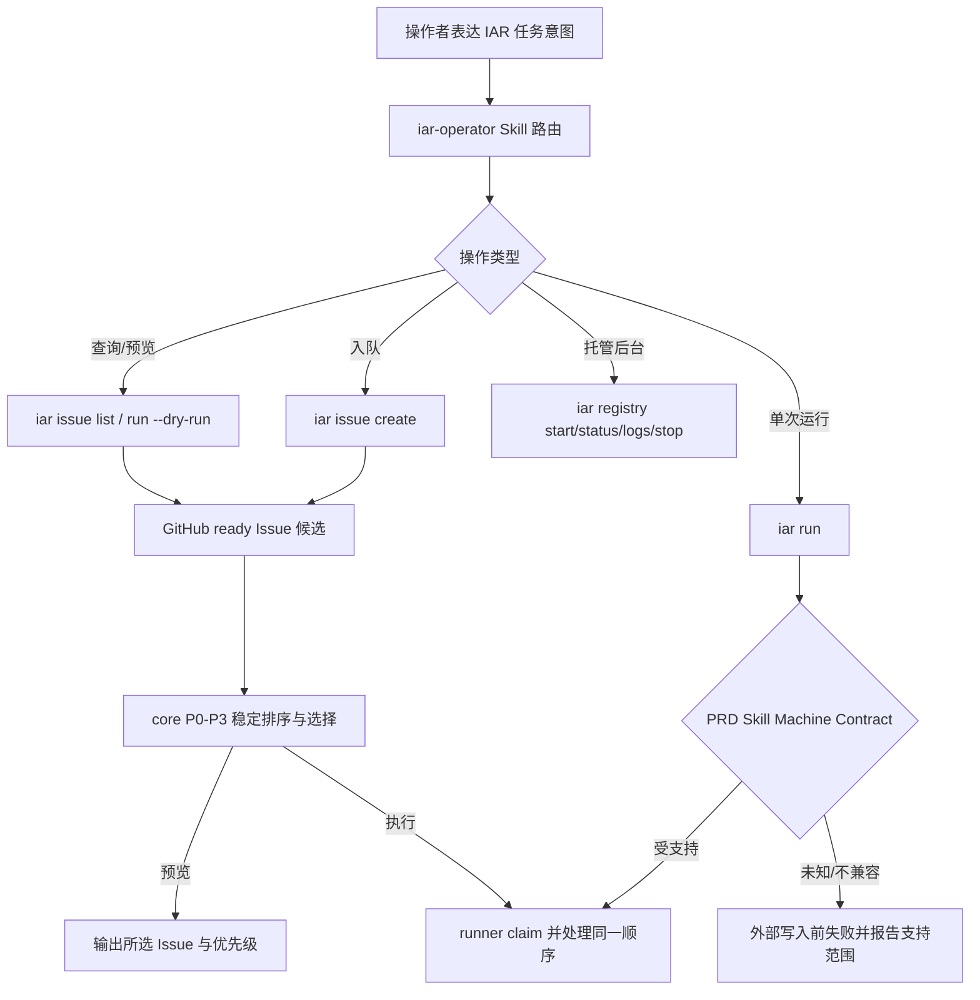

# PRD: IAR 操作 Skill 与可预期的 PRD 队列

> ✅ **交付前置**：无，可立即开工。
> 结构化声明见 §8 Delivery Dependencies，**那里是唯一事实源**。

> 🧍 **验收状态**：实现与自动门禁已完成，等待 PR 中的人审确认和合并验收。
> 本行是 §9 Acceptance Checklist 的投影，**那里是唯一事实源**。

本文档分两层阅读：**Part A · 人审层**（§1–§4）用于确认目标和可见结果；**Part B · 执行器层**（§5–§13）记录仓库现状、实现边界与可复核证据。

## Feature Overview (功能一览)

> 本区块是 §10 Functional Requirements 的通俗投影，**那里是唯一事实源**。

- **可跟着做的 IAR 操作 Skill**（FR-1、FR-2）：操作者能从仓库初始化、PRD 入队、预览待执行任务，一直到单次运行或托管后台运行，清楚知道每一步会改变什么。
- **兼容的 PRD 约定预检**（FR-3）：IAR 对已发布和历史 PRD Machine Contract 给出准确的兼容判断和修复说明，不再把不兼容误导成“强制重装即可修复”。
- **可靠的 Issue 查看和队列次序**（FR-4、FR-5）：`iar issue list` 的筛选参数可用；执行器按 PRD 的 P0–P3 优先级稳定选择 ready Issue，预览结果与实际选择一致。
- **文档与真实入口验证**（FR-6）：操作 Skill、CLI、预检和队列规则由真实 CLI 入口验证，并同步长期操作文档。

# Part A · 人审层 (Review Layer)

## 1. Introduction & Goals

### Problem Statement

IAR 已有覆盖面很广的 `docs/guides/agent-runner.md`，但没有一份面向 Agent 的短操作 Skill，能教它根据用户意图选对安全的 IAR CLI 流程。操作者因此可能只凭命令列表尝试操作，无法判断初始化、创建 Issue、预览、立即运行和启动后台 daemon 的差别。

这个摩擦已经造成实际后果：三份排队任务中，P1 的质量基线 Issue #31 先于 P0 的 R1e Issue #29、R1d Issue #30 被 runner 选中。Roadmap 已按 P0→P3 排序，但普通 ready-Issue 执行路径直接沿用 GitHub 返回顺序。另外，当前 `iar issue list` handler 将筛选值传入不存在的构造参数，命令会在列出 Issue 前失败。PRD Machine Contract 也存在漂移：runner 只接受 v1，而当前已发布 PRD Skill 声明 v3，错误提示还建议 `iar init --force`，该操作本身具有覆盖用户级 Skill 的风险。

### Interpretation (解读回显)

**行为样例**（每行都对应 §7.6 的验收 oracle；修订某个预期即修订验收标准）：

| 输入 / 操作 | 期望观察到的结果 |
|---|---|
| 用户要求“把这个 PRD 加入执行队列” | 操作 Skill 说明如何创建 Issue、是否立即标记 ready，以及如何先预览将处理的任务；不会把创建、运行或启动后台服务混为一步 |
| 在当前 PRD Skill 声明 v3 的环境运行 PRD 任务预检 | v3 通过；已淘汰的 v1 和未知版本 fail closed；用户级 Skill 不会被覆盖 |
| 运行 `iar issue list --state open --label agent/ready` | CLI 正常返回满足状态和标签条件的列表，不因请求参数名不匹配而报错 |
| P0 和 P1 Issue 都带 ready 标签，执行器请求处理一个 Issue | dry-run 与真实执行都选择 P0；同一优先级按 Issue 编号从小到大稳定排序 |
| ready Issue 缺少优先级标签 | 按 §2 确认的缺省规则排队；预览中清楚显示该规则，不隐式提升其优先级 |
| 用户只想检查队列，不想启动 Agent | Skill 指引使用零副作用预览；不启动 runner daemon 或 review daemon |
| 用户明确要求后台持续处理 | Skill 说明启动命令会运行哪些后台进程，以及对应的查看和停止方式 |

**我默默定了这些**：

- 操作 Skill 是 Keda/IAR 自有内容，与通用 `prd` 和 `code-reviewer` Skill 分开维护；沿用现有用户级 Skill 安装和冲突保护机制，不在本项目复制维护远程通用 Skill。
- Skill 应以任务意图路由命令，并简述副作用和停止/恢复方式；它不重复抄写 `agent-runner.md` 的完整参考手册，而是链接并定位到相关章节。
- 队列排序优先级沿用 Roadmap 的 P0→P3 规则；同级按 Issue 编号升序以保证稳定性。用户已确认未带优先级的 Issue 排在显式 P3 之后。
- 真实 GitHub 服务不作为默认自动验收前提；用隔离的 CLI fixture 覆盖真实参数解析、排序与 dry-run 输出，另提供可选的真实仓库 smoke 流程。

**我理解为不做**：

- 不重做 Issue/PR 管理界面，不增加新的 Web 控制台。
- 不更改 runner 的并发、重试、review、合并或权限策略，也不启动实际后台任务作为该功能的默认验证。
- 不在本 PRD 中重构 PRD Machine Contract 全部格式内容；只解决兼容策略、预检反馈及操作 Skill 涉及的使用路径。

**解读（可证伪版）**：本 PRD 读作“让 Agent 和操作者能安全地把意图映射到现有 IAR 工作流，并确保预览与实际队列选取遵循既有优先级”；不读作“把所有命令重新设计一遍”或“增加一个新的 Issue 调度系统”。

### What The User Gets

- 维护者可以用自然语言要求 Agent 初始化项目、加入任务、检查队列、单次执行或启动托管 daemon；Agent 能解释执行前后会发生什么。
- 操作者可以先看见下一批会执行哪些任务，并相信 P0 会排在 P1 前面。
- `iar issue list` 能按公开参数工作，PRD 预检遇到兼容问题时会提供真实有效的处理建议。

### Measurable Objectives

- 安装的 IAR 操作 Skill 覆盖初始化、PRD 入队、Issue 列表、dry-run、一次性执行、daemon 状态/日志/启停，并区分只读和会写状态的操作。
- 当前明确支持的 Machine Contract 版本能通过真实预检入口；不支持的版本在任何 Issue / GitHub 状态写入前失败，并给出不会误导覆盖用户文件的指引。
- `iar issue list` 的 `--state` 和 `--label` 参数经真实 CLI 入口成功应用。
- ready Issue 的选取与 dry-run 输出都按 P0→P3、同级 Issue 编号升序；不存在优先级时遵循经确认的缺省规则。

## 2. Human Review Map (介入与风险地图)

### 决策一：Machine Contract 的兼容窗口

当前 runner 精确要求 v1，而已发布的共享 PRD Skill 是 v3；当前 fail-fast 提示建议使用 `iar init --force`。用户确认只支持当前最新的 v3，历史 v1 视为淘汰，与未知版本一样 fail closed。错误信息应指出只支持 v3，并给出不覆盖用户自有 Skill 的更新建议；不得推荐盲目执行覆盖式 `--force`。

**已确认：** 只支持当前最新的 v3；历史 v1 与未知版本均 fail closed。后续契约升级时显式调整受支持版本。

**验收：** v3 通过预检；v1 与未知版本在 GitHub 状态写入前失败，错误指出仅支持 v3 且不要求盲目执行覆盖式 `--force`。

### 决策二：无优先级 Issue 的位置

现有 Roadmap 只排序显式的 P0–P3；普通 ready Issue 由 GitHub API 返回顺序决定。将缺少优先级标签的 Issue 放在 P3 之后，并在 dry-run 中标明缺省优先级；不从标题或 Issue 正文临时猜测优先级。

**已确认：** 未带 `priority/P0`…`priority/P3` 标签的 ready Issue 排在显式 P3 之后。

**验收：** 缺少优先级的 Issue 不会抢在任何显式 P0–P3 任务前面；dry-run 明确展示其未设置优先级。

### 自动门禁，不需要逐项人工审阅

操作 Skill 的安装冲突安全、CLI 参数映射、优先级排序、同级稳定排序、contract 预检副作用顺序，由 §7.6 的失败可区分 oracle 覆盖；用户无需逐行人工检查实现细节。

### 本次明确不涉及

无数据库变更。无前端影响：变化限于本地 CLI、用户级 Skill 安装、GitHub Issue 标签/排序和操作文档，不增加 Web 页面或 API。

## 3. Usage And Impact After Implementation

- **维护者给 Agent 一个任务**：Agent 先识别用户是在初始化仓库、入队、检查、运行一次还是启动后台服务；对会创建/修改 GitHub Issue、运行 Agent 或启动后台进程的动作，按当前授权与项目规则执行，并说明结果。
- **操作者检查队列**：先用只读预览查看下一条或下一批 Issue，看到优先级和稳定排序；确认后再启动实际执行。
- **操作者遇到 Skill 版本错误**：收到支持版本列表和非破坏性处理建议；不会把 `--force` 当成普遍修复办法。
- **旧行为**：现有完整操作手册保留，`iar issue create` 和其他命令的既有参数含义保持不变；排序只改变 ready 任务实际调度顺序，以 Roadmap 中已存在的 P0→P3 业务顺序为准。

## 4. Requirement Shape

- **Actor**：使用 IAR 的开发者、维护者，以及受托代为操作 CLI 的 Agent。
- **Trigger**：用户表达初始化、入队、查看状态/队列、执行任务或管理后台 runner 的意图；或 runner 在启动 PRD 任务前校验 Skill Machine Contract。
- **Expected result**：意图被映射为正确的 CLI 流程；风险和副作用可见；列表筛选有效；dry-run 和执行使用相同、稳定的队列排序；版本拒绝在外部写操作之前完成。
- **Scope**：IAR 专用操作 Skill、现有 Skill 安装接入、Machine Contract 兼容预检、`iar issue list` 回归、ready Issue 优先级排序、对应长期文档与验证。

# Part B · 执行器层 (Build Layer)

## 5. Repository Context And Architecture Fit

- **Existing Path**：`iar init` 经 API CLI handler 调用 engines 层远程模板 Skill 安装；`iar issue list` 经 `labels_issue.py` 创建 core `IssueListRequest`；普通 runner 从 infrastructure GitHub client 读取 ready Issue 后由 core orchestration runtime 选择；Roadmap 晋升路径已有 P0→P3 排序。
- **Reuse Candidates**：`remote_template_skills.py` 的用户级安全安装/冲突检查；`IssueListRequest` 和 `list_issues_with_prs`；`list_ready_issues` 及 `IssueSummary`；Roadmap priority parser/sort policy；`iar run --dry-run` 现有预览模式；`docs/guides/agent-runner.md`。
- **Architecture Constraints**：CLI 只负责参数与输出，排序规则和 contract 兼容判断落在既有 core use case/shared contract 边界；GitHub 访问沿用 infrastructure 接口；Skill 打包/安装沿用现有 engines 模板资源机制，不把核心业务规则另做一套 API。
- **Frontend Impact**：No frontend impact。Keda 的管理控制台不需要承载本 PRD 的 Skill、CLI 列表或调度预览。
- **Existing PRD Relationship**：与当前三个 pending PRD（Tauri desktop shell、Roadmap CI/CD monitor、blocked draft PR validation）无硬依赖；既有归档 PRD 已提供 `iar issue list` 功能契约、用户级 Skill 安装边界、Machine Contract v1 的设计历史，本文修复/扩展其当前实现，不重复重建功能。
- **Potential Redundancy Risks**：不要复制 Issue list use case、另建优先级排序策略、将通用远程 Skills 再打包一份，或在操作 Skill 重写完整参考文档。

### Relevant Prior Work

- `tasks/archive/P1-FEAT-20260916-023404-iar-prd-skill-alignment.md`：建立 Machine Contract v1 精确匹配策略；本 PRD 重新评估版本兼容窗口，需保持契约职责清楚。
- `tasks/archive/P1-REFACTOR-20260716-132633-user-level-skill-installation.md`：约束用户级 Skill 安装与覆盖保护。
- `tasks/archive/P2-FEAT-20260622-215922-iar-issue-list-with-pr-status.md`：定义 `iar issue list` 用户行为；当前工作是修复其 CLI 接线回归，不另造列表功能。
- `tasks/archive/P1-FEAT-20260623-012835-iar-registry-start-stop-daemon.md`：定义托管 daemon 启停行为；操作 Skill 应准确说明它启动 daemon 与 review-daemon 的副作用。

## 6. Recommendation

### Recommended Approach

为 Keda/IAR 新增一个短小、任务路由式的 `iar-operator` Skill，并使用现有 Skill 资源打包和安全安装机制；先修复该 Skill 会调用到的 `issue list` 参数接线与操作说明，同时让 ready Issue 读取结果进入可复用的优先级排序规则。普通队列与 Roadmap 共用 P0→P3 语义。Machine Contract 明确只支持最新 v3，并在旧版、缺失或未知版本时于写操作前拒绝。

### Design Challenge

如果只增加 Skill 文档，Agent 可能会照文档运行一个会立即失败的 `issue list`，或在“队列预览”看到 P1 后实际处理 P0/P1 中 GitHub 恰好先返回的任务；所以修复 CLI 参数映射与统一预览/执行排序是必要组成。如果为 Skill 建一套新的安装器，则会复制现有远程 Skill 的冲突保护；因此只扩展现有资源安装路径。若兼容器按“未知版本尽量解析”宽松接受，版本字段就无法保护行为边界；因此未知版本保持 fail closed。

### Proposed Solution Summary (实现机制)

1. 在现有 engines 模板资源机制中加入 IAR 专用操作 Skill；从已安装模板分发到用户 Skill 目录时沿用冲突检查、dry-run 计划和显式覆盖语义。Skill 内容区分只读预览、GitHub 写操作、Agent 单次运行、托管 daemon 生命周期，并链接详细指南。
2. 修正 CLI handler 到 `IssueListRequest` 的字段映射，确保 state/label/with-pr 参数按既有 use case 语义传递。
3. 为 ready Issue 携带可比较的 P0–P3 priority；优先级标签由 PRD priority 来源生成或读取，不基于自然语言猜测。core 选择器按 priority 升序（P0 最先），同级按 issue number 升序；列表不足 `max_issues` 时依次填充。dry-run 使用同一选择器并展示 priority/未设置状态。
4. 将 PRD Machine Contract 解析从单版本相等判断扩展为显式支持集合或有界兼容解析。拒绝未知版本发生在任何 Issue 标签、评论、PRD 发布或其他 GitHub 写入之前。错误提示不得把覆盖式 `--force` 当作纯版本修复。
5. 同步更新 `docs/guides/agent-runner.md` 的 Skill 安装、队列排序、dry-run 和 daemon 生命周期说明；保持命令参考的详细内容仍以现有指南为准。

### Scope Cohesion

四个实现面共同完成一条操作者旅程：Skill 会推荐 `issue list` 查看状态、`run --dry-run` 预览和后续入队/执行；这些操作必须真实可用，而且预览必须真实反映实际调度顺序。版本预检决定同一条 PRD 工作流能否启动。将它们拆开会让操作 Skill 在已知错误仍存在时发布，或让用户按队列新语义预览却由 runner 使用旧次序。

## 7. Implementation Guide

本节根据当前仓库分析形成，是执行期间持续更新的实现指南；实现者应复查扩展点和相关 PRD，若事实有变须同步修订实现与验收 oracle。

### 7.1 Core Logic

#### 操作 Skill

- 首先确认现有 `remote_template_skills.py` 面向远端通用 Skill 的资源加载、目标 Skill 目录解析和安全覆盖行为。新增 Keda 自有资源应随包发布，避免依赖网络才能安装；通过现有 init orchestration 接入并保留 `--dry-run` 展示能力。
- Skill 以任务意图为入口，说明仓库定位、初始化、Issue/PRD 入队、只读状态查询、队列 dry-run、单次执行、后台启动/停止/日志/状态。标注会执行 GitHub 写入、运行 Agent、创建持久后台进程的操作；不得把 `iar run --dry-run` 与真实 run 等同。
- 不在 Skill 中复制整个 `agent-runner.md`；提供具体章节链接或路径指引。无必要时不要求用户安装额外依赖或登录新服务。
- 发生同名用户自有 Skill 冲突时，默认报告并保留原文件；仅在现有明确覆盖选项被用户选择时覆盖。`init --dry-run` 显示安装目标和冲突结果。

#### PRD Machine Contract

- 搜索版本解析、生成 prompt 和所有预检调用点，集中定义一份支持策略，避免 CLI 与 daemon 判断不同。
- 明确只支持最新 v3；历史 v1、缺失及未知版本均拒绝，并给出当前支持版本和不覆盖用户文件的修复建议。
- 修正错误信息：分别说明缺失 Skill、不可读 Skill、未知/不兼容版本；只有确实要刷新安装资源时才推荐 init 安装流程，且不得默认建议覆盖。
- 用 spy/fake GitHub client 证明拒绝发生时没有写操作；生产代码禁止新增仅用于测试的故障开关。

#### Issue list 与调度排序

- handler 的参数名须匹配 `IssueListRequest.state_filter`、`label_filter` 等字段；不要在 API handler 复制列表 use case。
- 检查 priority 的稳定来源：优先复用现有 Roadmap priority 解析/标签映射；`iar issue create` 从 PRD 创建 Issue 时保留优先级信息，并保证已有 Issues 的 priority label 能被读取。避免同时维护标题解析、正文解析、label 三种可冲突优先级源。
- 建议以 `priority/P0`…`priority/P3` 为 GitHub 标签事实源；PRD filename 的 P0–P3 与 Roadmap 已有解析一致。Issue 无显式 priority 时按 §2 决策处理。若现有 label 配置存在项目自定义名称，沿用配置映射而不是硬编码双份标签。
- 排序实现放在 core，输入顺序任意都得到确定输出。并列按 Issue number 升序；查询 limit 应足以在排序前获得候选集，不能先由 GitHub 任意截断后再假称全局优先级正确。若 GitHub API 限制使全量排序不可行，需明确分页/候选集方案并在 dry-run 声明范围。
- `iar run --dry-run` 与真正 claim 执行共同调用排序/选择逻辑；不得只让展示层排序。输出所选 Issue、priority、同级顺序和是否缺省优先级。

### 7.2 Change Impact Tree

```text
IAR 操作 Skill 与可预期的 PRD 队列
├── engines / packaged resources
│   ├── 新增 iar-operator Skill 资源
│   └── 复用安全安装、冲突保护、init dry-run 资源路径
├── api / CLI
│   ├── iar init 安装清单接入自有 Skill
│   ├── 修复 iar issue list 参数到 use case 的映射
│   └── dry-run 展示真实队列排序与优先级
├── core / use cases
│   ├── Machine Contract 显式兼容策略与 fail-closed 预检
│   └── 共用的 ready Issue priority 排序/选择器
├── infrastructure
│   ├── GitHub priority label 读取/写入复用现有 client
│   └── 如现有列表需要，分页获取足够候选供全局排序
├── tests
│   ├── 操作 Skill 打包/安装、冲突保护、dry-run
│   ├── PRD Skill v3/v1/unknown 真实预检顺序
│   ├── issue list real CLI 参数映射
│   └── mixed-priority queue: dry-run 与执行共享顺序
└── docs
    └── 更新 docs/guides/agent-runner.md 的相关操作指引
```

### 7.3 Executor Drift Guard

- 新 Skill 若与现有通用 Skill 同名，不可静默覆盖；核对目标目录与覆盖决策。
- priority 的核心规则必须只有一个实现，Roadmap 与普通 runner 共用定义或明确复用同一策略函数。
- dry-run 和真实执行必须调用同一排序/选择入口；只在输出层排序不能满足要求。
- contract 的接受集合必须有测试断言；禁止用“版本大于等于某值”静默放行未知大版本。
- 更新文档时引用当前命令和真实行为，不将此前一次性手工绕过方法写成推荐工作流。

### 7.4 Flow / Architecture Diagram



### 7.5 ER Diagram

无数据库 schema 变更。Issue priority 复用 GitHub labels，不新增本地实体或迁移。

### 7.6 Realistic Validation Plan

以下 YAML 为结构化验收 oracle。CLI 入口使用真实 Typer 命令/进程；外部 GitHub 调用可通过受控 `gh` fixture 替换，除显式 live smoke 外不要求凭据。

```yaml
oracles:
  - id: rv-1
    behavior: "mixed-priority ready Issue 候选在 dry-run 与真实选择路径中均按 P0→P3、同级 issue number 升序；未设置优先级的 Issue 遵循 §2 确认的规则。"
    reviewer: verifier
    real_entry: "uv run iar run --dry-run --max-issues 3；同一隔离 GitHub fixture 下执行 core claim/selection 的真实 runner entry。"
    expected: "P0 先于 P1；同级 #10 先于 #11；dry-run 和执行选择完全相同，并打印每项 priority/default 状态。"
    mock_boundary: "替换 gh 子进程响应为隔离 fixture；真实 CLI 参数解析、用例装配、core 排序和 dry-run 输出不替换。"
    tier: R2
    test_layer: real_entry
    required_for_acceptance: true
    critical_value_source: "GitHub Issue priority label；ready label；issue number；max_issues。"
    must_cross: "Typer CLI → orchestration runtime → GitHub adapter boundary → core selection → dry-run renderer；执行路径再穿过实际 claim 入口。"
    forbidden_bypasses: "测试不得直接调用 sort helper 代替 CLI dry-run；不得只对显示结果重排；不得依赖 fixture 输入顺序已经正确。"
    fresh_state_probe: "每次运行新建隔离 Issue fixture，分别打乱输入顺序并重新启动 CLI 进程，读取输出与 claim 请求。"
    final_tree_evidence: "记录最终 git tree、命令、fixture Issue/labels、输出顺序与执行选择；证据文件和最终实现树绑定。"
    negative_control: "移除排序调用后，混合优先级 fixture 必须返回错误顺序并使 oracle 失败。"
    expected_fail: "排序被移除或只用于 dry-run 时，至少一个断言失败。"

  - id: rv-2
    behavior: "iar issue list --state open --label agent/ready 通过真实 CLI 参数解析，并只输出同时满足 state 与 label 的 Issue。"
    reviewer: verifier
    real_entry: "隔离临时仓库执行 uv run iar issue list --repo <fixture-repo> --state open --label agent/ready --output json。"
    expected: "进程退出码为 0；结果只包含 open 且带 agent/ready label 的 fixture Issue；不出现 IssueListRequest 构造参数异常。"
    mock_boundary: "GitHub 数据由 gh fixture 返回；Typer、handler、request 构造和 use case 均真实运行。"
    tier: R1
    test_layer: real_entry
    required_for_acceptance: true

  - id: rv-3
    behavior: "当前 PRD Skill v3 通过真实预检；淘汰的 v1 和未知版本在 GitHub 写操作前失败，错误建议不误导执行覆盖式 init。"
    reviewer: verifier
    real_entry: "通过真实 PRD runner preflight 入口启动隔离 fixture run，分别提供 v3、v1 和未知 Machine-Contract-Version Skill 文本。"
    expected: "仅 v3 可到达后续执行阶段；v1 与未知版本提示仅支持 v3，并在任何 gh label/comment/PRD 写命令前失败。"
    mock_boundary: "隔离 GitHub 子进程并记录调用；预检、Skill 解析、启动编排走真实实现。"
    tier: R2
    test_layer: real_entry
    required_for_acceptance: true
    critical_value_source: "每个 fixture SKILL.md 的 Machine-Contract-Version marker；仅支持 v3 的确认规则。"
    must_cross: "daemon/PRD run composition root → Skill path resolution → parser → preflight → GitHub client boundary。"
    forbidden_bypasses: "不得只测试 parser；不得 mock preflight 本身；不得在测试中跳过启动流程或对未知版本静默放行。"
    fresh_state_probe: "为每个版本新建空仓库与独立 Skill 文件，重新启动 runner 进程，并检查 GH 调用记录。"
    final_tree_evidence: "记录最终 git tree、各 Skill marker、完整 CLI 命令、退出码、输出和 gh 写调用清单。"
    negative_control: "以未知 v99 运行时，在任何写操作前失败；将版本校验移到写操作之后必须使 oracle 失败。"
    expected_fail: "对未知版本继续处理或先执行 GitHub 写命令时，oracle 失败。"

  - id: rv-4
    behavior: "Keda 自有 iar-operator Skill 可从已构建发行资源被 init dry-run 发现并列出目标路径；用户已有同名 Skill 时默认保留原文件。"
    reviewer: human
    presentation: "交付时直接呈现最终 skills/iar-operator/SKILL.md 内容，并展示干净 home 与同名冲突 home 两次 iar init --dry-run 的安装计划。"
    real_entry: "构建项目发行包后，以隔离 HOME 执行 uv run iar init --dry-run；再在含预存同名 Skill 的隔离 HOME 重复执行。"
    expected: "资源无需网络即可解析；计划包含准确安装目录；无冲突时显示待安装，有冲突时显示保留/需显式覆盖且 dry-run 不写文件。"
    mock_boundary: "仅隔离 HOME、repo 和 GitHub 无关的本地配置；包构建、资源解析、init CLI 与安装规划走真实路径。"
    tier: R1
    test_layer: real_entry
    required_for_acceptance: true

  - id: rv-5
    behavior: "操作 Skill 清晰区分 issue list、run dry-run、单次 run、registry start，并说明 registry start 的 daemon/review-daemon、副作用及 stop/status/logs 操作。"
    reviewer: human
    presentation: "最终安装版 skills/iar-operator/SKILL.md 文件本身；评审时逐段呈现任务路由表与后台生命周期说明。"
    real_entry: "从隔离用户级 Skill 安装后的最终文件阅读，并对照 iar --help 与 docs/guides/agent-runner.md 对应章节。"
    expected: "五类行为样例都能映射到当前存在的 CLI 命令；只读预览不会被描述为后台或真实执行；daemon 启停对象准确。"
    mock_boundary: "无服务 mock；通过源文件和当前 CLI help 对照语义，不实际启动持久 daemon。"
    tier: R1
    test_layer: manual_review
    required_for_acceptance: true
```

#### Risk Classification Register

| Change point | Tier | Decisive dimension / override | Intervention | Oracle / gate |
|---|---|---|---|---|
| Skill contract compatibility and preflight order | R2 | 跨版本兼容及潜在 GitHub 写副作用 | 人工确认策略；verifier 锁定失败顺序 | Section 2 决策一、rv-3 |
| Queue priority and stable selection | R2 | correctness-critical ordering; dry-run/执行一致 | 人工确认缺省行为；verifier 真实入口验证 | Section 2 决策二、rv-1 |
| issue list handler mapping | R1 | 单一 CLI adapter regression | executor + real CLI gate | rv-2 |
| Skill packaging and operator wording | R1 | user-perceivable artifact and conflict handling | 人工审阅最终 Skill；安装真实入口验证 | rv-4、rv-5 |

## 8. Delivery Dependencies

### Delivery Dependencies
- Group: none
- Depends on tasks/issues:
  - none
- Gate type: none
- Notes: 无硬依赖。三个当前 pending PRD 与本工作无任务顺序关系；复用的相关工作均已归档，见 §5。

## 9. Acceptance Checklist

### 9.1 人读呈递区（Human Review Surface）

| Oracle | 呈递内容 | 完成时的呈递动作 |
|---|---|---|
| rv-4 | 安装计划与 Skill 冲突保护 | PR evidence comment 展示干净 HOME 与同名冲突 HOME 两次 `iar init --dry-run` 的计划输出 |
| rv-5 | 操作 Skill 的任务路由与 daemon 生命周期说明 | PR body/evidence comment 链接完整 Skill 文件，并摘录关键任务路由与后台生命周期段落 |

人工验收导航见 `tasks/evidence/P1-FEAT-20260924-020856-iar-operator-skill-and-predictable-queue/human-review-checklist.md`；PR 页面会直接呈递 Skill 全文及安装计划，无需本地 checkout。

verifier-only 的 rv-1、rv-2、rv-3 不进入人工呈递区。

### 9.2 Acceptance Evidence Package

#### Human-Confirmed

- [ ] **Contract 版本策略**：确认仅支持当前 v3，淘汰 v1 与未知版本均 fail closed；证据见 rv-3。
- [ ] **无 priority 标签的顺序**：确认无优先级 Issue 排在显式 P3 之后；证据见 rv-1。
- [ ] **操作 Skill 与安装体验**：阅读呈递的 Skill 内容和安装计划，确认其能准确指导 IAR 操作且清楚说明后台副作用；证据见 rv-4、rv-5。

#### Behavior and compatibility

- [x] `iar issue list` state/label 参数通过真实 CLI 入口并产生正确筛选结果（rv-2）。证据见 evidence report 与全量测试。
- [x] P0–P3 与同级稳定次序在 dry-run 和真实执行选择中一致（rv-1）。证据见 evidence report 与全量测试。
- [x] 当前 v3 contract 通过，v1 与未知版本写入前失败（rv-3）。证据见 evidence report 与全量测试。

#### Packaging and documentation

- [x] IAR 自有 Skill 随发行资源可用，经 init dry-run 正确规划；冲突默认保留用户文件（rv-4）。证据见 evidence report。
- [x] Skill 命令和副作用说明与真实 CLI、`agent-runner.md` 一致（rv-5）。证据见 verifier report。
- [x] 操作指南同步更新，优先级来源、未设置标签规则和预览语义清楚。

#### Delivery readiness

- [x] PRD §7.6 指定的自动化 oracle 在当前实现树通过，并保存可复核证据；rv-4/rv-5 的人审呈递待 PR 发布。
- [x] Keda 对应测试、架构检查和文档构建通过；外部 GitHub live smoke 未运行，不替代离线真实入口验证。

## 10. Functional Requirements

- **FR-1**：提供 Keda/IAR 专用 `iar-operator` Skill，并复用现有用户级 Skill 解析、安装计划、冲突保护及显式覆盖行为。
- **FR-2**：Skill 按用户意图覆盖 init、Issue/PRD 入队、Issue list、队列预览、单次 run、托管 daemon 状态/日志/启停，明确副作用与确认边界，并引用完整操作指南。
- **FR-3**：Machine Contract 预检采用显式支持策略；版本缺失、未知或不兼容时提供准确错误；拒绝必须先于 GitHub 状态写入；错误不得把覆盖式 `--force` 当成无条件修复。
- **FR-4**：修复 `iar issue list` handler 的请求字段映射，使公开的 state、label、PR 状态筛选通过既有 use case 执行。
- **FR-5**：ready Issue 以 PRD priority / 对应 GitHub priority label 为优先级来源，按 P0→P3 排序，同级按 issue number 升序；缺省行为遵循 §2 决策；dry-run 与执行使用相同候选和排序规则。
- **FR-6**：同步 `docs/guides/agent-runner.md` 和必要的包资源说明，并通过 §7.6 的真实入口 oracle 验证发行包、Skill 安装规划、参数映射、contract preflight 和队列选择。

## 11. Non-Goals

- 不新增 Web UI、REST API、数据库表或本地 priority ledger。
- 不改 runner concurrency、claim 生命周期、重试策略、审查流程、自动合并或凭据授权模型。
- 不将 Roadmap 晋升、普通 Issue 执行合并为一个新的通用调度服务；只复用可共享的 priority 定义/排序策略。
- 不重写 `agent-runner.md` 全部内容或将通用 prd/code-reviewer Skill 拷入 Keda。
- 不为解决测试而往生产代码增加 fault injection、test-only 环境变量、计数器或观测钩子。

## 12. Risks And Follow-Ups

- **版本漂移**：升级 Machine Contract 时显式变更唯一受支持版本，并同步更新安装 Skill 与预检测试。
- **priority 数据来源**：如果 GitHub label 配置允许自定义名称，标签映射必须从配置解析；PRD 文件名优先级和 Issue 标签不得无提示冲突。
- **候选截断**：现有 `gh issue list --limit N` 在排序前截断会遗漏更高优先级任务。实现者必须验证分页/limit 契约；无法完整排序时不得宣称全局确定性。
- **并发 Runner**：稳定排序约束的是每次候选选择顺序，不保证多个并发 worker 的完成顺序；文档需避免承诺完成顺序。
- **未来工作**：若 Skill 安装资源目录不是稳定公共接口，可在本 PRD 内选择现有模板资源的最小扩展；不另建插件系统。

## 13. Decision Log

| ID | 决策 | 状态 | 说明 |
|---|---|---|---|
| D-01 | 操作 Skill 是 Keda 自有发行资源，通用 Skill 保持现有远程安装 | Proposed | 避免复制通用内容，离线可用 IAR 操作说明 |
| D-02 | 仅支持当前最新 Machine Contract v3，v1 与未知版本 fail closed | Human-Confirmed | 用户确认只跟进最新 Skill；实现前固定语义 |
| D-03 | 未标优先级的 ready Issue 排在显式 P3 之后 | Human-Confirmed | 用户确认按 PRD 建议执行；不得从文本猜测 |
| D-04 | 同级 ready Issue 按 issue number 升序；dry-run/执行共享 selector | Proposed | 稳定性规则，减少预览与执行偏差 |

## Change Log

### Change 1 — 创建 IAR Operator Skill 与可预期队列 PRD

- **Type**: Initial
- **Before**: IAR 有详细操作指南和多个 CLI 命令，但缺少面向 Agent 的任务路由 Skill；queue issue 选择顺序依赖 GitHub 返回顺序；当前 issue list 参数接线和 Machine Contract 版本存在已知问题。
- **After**: 定义用户级操作 Skill、contract 兼容策略、issue list 回归修复、ready Issue 稳定优先级顺序及真实入口验收。
- **Reason**: 让 Keda/IAR 的操作方式更容易被 Agent 正确使用，并修复已观察到的操作错误与队列次序偏差。
- **Impact**: 新增一份 pending P1 PRD；无实现代码、数据库和前端改动。
- **Review**: 请先确认 §2 两项规则与 §9.1 呈递面，再进入实现。

### Change 2 — 实施与独立验收

- **Type**: Implementation
- **Before**: 缺少 IAR 自有 Operator Skill，Issue 列表参数映射错误，普通 runner 不稳定按 priority 选择，Machine Contract 接受策略落后于当前 v3。
- **After**: 增加随包 Skill 与安全安装规划，修复 CLI 筛选接线，统一 Roadmap/runner 的 priority 顺序，仅支持 v3，并补齐版本拒绝副作用、真实 CLI 过滤和安装 dry-run 验收。
- **Reason**: 执行已确认的 D-02/D-03，并满足 FR-1 至 FR-6。
- **Impact**: 无 schema/API/frontend 变更；Issue 创建会写入从 PRD 文件名读取的 priority label；普通 ready Issue 执行次序改变为 P0→P3→unset。
- **Review**: 自动验收通过，独立 verifier PASS；D-02/D-03 与 Skill 人审仍待 PR 合并事件确认。
