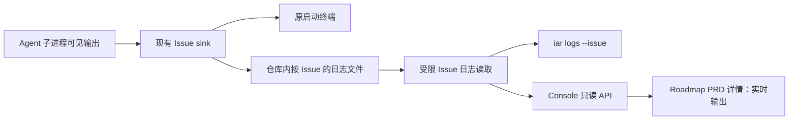
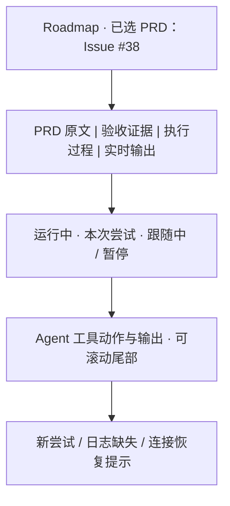

# PRD: 按 Issue 在 CLI 与控制台查看 Agent 实时输出

> ✅ **交付前置**：无硬依赖；§8 是唯一依赖事实源。
>
> ⬜ **验收状态**：未开工；§9 是唯一验收事实源。

> 本文分为 Part A 人审层与 Part B 执行层。标题下的横幅和功能一览只投影正文，不另定义行为。

## Feature Overview (功能一览)

- **FR-1–FR-3：** 每次 Issue 执行都留下可独立跟随的输出，单次串行运行、托管 daemon 和并行 daemon 使用同一归属规则。
- **FR-4–FR-6：** CLI 按仓库与 Issue 号查看最近输出、持续跟随、新尝试切换和结束状态。
- **FR-7–FR-9：** 浏览器在现有 PRD 详情查看同一 Issue 的输出，暂停、继续和重开页面均能续读。
- **FR-10–FR-12：** 读取范围、日志大小、缺失与截断状态受控；不暴露任意本地文件路径或重写现有进程日志功能。

# Part A · 人审层 (Review Layer)

## 1. Introduction & Goals

### Problem Statement

开发者用单次命令启动一个 Issue 后，Agent 的输出只在启动命令所在的终端里。若命令由另一会话启动，之后打开的终端和浏览器都无法按 Issue 找到那条流。仓库代码可直接观察到：单次串行处理分支不建立每 Issue 日志文件；只有并发处理分支使用按 Issue 的日志路由。现有 CLI 日志命令和网页“进程日志”都按托管进程查找，不能定位单次命令正在处理的 Issue。这使得“任务还在跑吗、Agent 正在做什么”需要回到原终端或猜测工作树状态。

### Interpretation (解读回显)

下表每行的输入和结果对应 §7 的验收 oracle；纠正其中一格，应同步纠正对应 oracle。

| 验证方式 | 输入 / 操作 | 期望观察到的结果 |
|---|---|---|
| 👀 人审 + 自动验证 | 在终端启动单次 Issue 执行，另开终端查看该 Issue | 能看到已输出的最近内容，并持续看到后续 Agent 工具动作；原启动终端仍实时显示输出 |
| 👀 人审 + 自动验证 | 在控制台打开正在执行的 PRD，进入“实时输出” | 页面显示与 CLI 同一 Issue、同一次尝试的最新文本，后续内容自动追加，不混入另一 Issue |
| 🤖 自动验证 | 关闭网页再打开，或暂时失去连接后恢复 | 从已读偏移继续；若文件已轮转或新尝试开始，明确切到新尝试并显示提示，不重复拼接旧内容 |
| 🤖 自动验证 | Issue 尚未开始、日志已清理、仓库或 Issue 不存在 | 显示可区分的“暂无输出”或“不可用”状态，不回退到另一个进程或 Issue 的日志 |
| 🤖 自动验证 | 本仓库两个 Issue 同时运行，查看其中一个 | CLI 与网页只出现所选 Issue 的输出，不能由 URL 或参数读取任意本地文件 |

**我默默定了这些：** 查看对象是“仓库 + Issue 编号”，默认显示最近一次尝试；CLI 与网页共享同一日志事实源；浏览器使用现有登录后的本地控制台；持续跟随采用小块偏移轮询，不要求推送协议；只覆盖功能上线后开始的执行，不倒填已经结束且没有日志文件的旧任务。

**我理解为不做：** 改造 Agent 的思考内容或暴露供应商未输出的内部推理；把完整日志永久保存到 GitHub/PR；远程多人共享日志和任意路径文件浏览；让独立于 Codex 会话启动的 Keda 任务自动注册到 `/ps`。

这份需求是让操作者从第二个终端或控制台随时找到指定 Issue 的可见执行输出，包括单次运行。进程日志仍用于排查 daemon 进程，Issue 输出用于追踪具体任务。缺少日志时必须如实说明，不能把“进程还活着”包装成“已有实时输出”。

### What The User Gets

- 启动任务后，换一个终端也能通过 Issue 编号看到 Agent 当前动作。
- 在控制台选择该 PRD，打开实时输出标签即可观察同一流，无需知道进程 ID 或日志目录。
- 任务重试时能辨认新尝试，结束后仍能回看本地保留的输出。

### Measurable Objectives

- 单次串行执行开始后的下一段 Agent 输出，在第二终端和网页各自下一次刷新窗口内可见，且源终端输出不丢失。
- 同一 Issue 的 CLI/网页文本和尝试标识一致；另一 Issue 的唯一标记不出现。
- 断开再接续不重复文本；新尝试、截断和无日志分别有明确状态。
- 日志读取不能越出已注册仓库的受控日志目录，不能接受客户端传入的文件路径。

## 2. Human Review Map (介入与风险地图)

### 同一个 Issue 在两处看到同一条输出

建议把“仓库 + Issue”作为主定位，CLI 和页面默认跟随最新尝试。这样查看者不用知道任务由单次命令还是 daemon 启动，也不用寻找 PID。主要风险是把另一个 Issue 或上一次尝试的内容误当成当前进度。

**请确认：** 是否同意 CLI 与页面都按仓库和 Issue 号查看同一条输出，重试时自动切换并明确提示？

**验收：** 用真实任务分别在第二终端和页面查看，能看到同一尝试的动作与新输出；并发的另一任务不混入。

### 本地回看与缺口提示

建议日志按现有本地仓库目录保存，完成后可回看；已清理或功能上线前未落盘的任务显示“无可用输出”。这能保持当前本机控制台的权限边界，也避免把含命令、路径或业务内容的原始日志自动公开到 GitHub。

**请确认：** 是否同意回看仅覆盖本地仍保留的日志，而清理或旧任务明确提示缺口？

**验收：** 结束后能回看已落盘任务；不存在日志时 CLI 和页面都给出准确空态，不显示其他任务内容。

**自动门禁，不需要逐项人工审阅：** 偏移续读、日志大小限制、仓库路径约束、错误处理、前台输出兼容、布局与自动化回归由执行器和 verifier 完成。

**本次明确不涉及：** 新身份权限体系、日志上云、GitHub 评论同步、任务执行或重试控制、数据库 schema 变更。

## 3. Usage And Impact After Implementation

### 本机开发者

启动任务的原终端继续显示 Agent 输出。需要从另一终端看进度时，输入仓库和 Issue 编号，先得到最近内容，再可持续跟随；重试时显示尝试切换。无需改用 daemon，也无需在启动前手工运行 `tee`。

在 Codex CLI 会话内请 Codex 以后台终端启动 `iar run --repo <路径> --max-issues 1`，然后输入 `/ps`，即可从该会话的后台终端视图看到命令及最近输出。也可让 Codex 以后台终端启动 `iar logs --repo <路径> --issue <编号> --follow`，使 `/ps` 显示指定 Issue 的最近输出。Keda 必须持续向这些命令的标准输出写出可辨认的 Issue、尝试和关键动作；`/ps` 只适合快速查看最近几行，完整历史仍用 `iar logs --issue` 或网页。独立于该 Codex 会话启动的任务不会自动出现在 `/ps`。

Codex 行为依据：[OpenAI 官方 Developer commands 文档的 `/ps` 说明](https://learn.chatgpt.com/docs/developer-commands?surface=cli#check-background-terminals-with-ps)：它列出后台终端及最多三行最近非空输出，且后台终端依赖 `unified_exec`。Keda 只适配标准输出，不修改宿主的任务注册机制。

### 控制台操作者

照常打开本地控制台，从 Roadmap 选中有 Issue 的 PRD，在“实时输出”标签查看当前尝试。切换 PRD 或关闭标签后停止轮询；重新打开从该尝试的最新窗口开始。原有“托管进程”页仍显示 daemon 进程自身日志。

### 集成和运维人员

现有进程日志接口与托管进程启停流程不变。新的只读 Issue 日志能力以已注册仓库为界；日志清理策略仍由本地运维控制，不创建新的必填配置。

### Impact On Existing Behavior

- 默认单次运行与 daemon 的领取、执行、发布和失败状态语义不变。
- 现有 `iar logs` 不带 Issue 参数时继续查看托管 daemon/review-daemon 日志。
- 控制台原进程日志抽屉和 API 保持兼容；本功能只是增加 Issue 维度读取。
- Codex 管理的后台终端可借已有标准输出被 `/ps` 查看；Keda 不依赖 Codex 私有注册接口。

## 4. Requirement Shape

- **Actor:** 本机开发者、控制台操作者、调用只读接口的本地集成方。
- **Trigger:** Agent 处理一个 Issue，操作者在另一终端或现有控制台选择该 Issue。
- **Expected behavior:** 输出按 Issue 实时落盘；CLI 和网页从同一日志源按尝试标识与字节偏移续读，显示当前状态和缺口。
- **Scope boundary:** 不改变任务调度、GitHub 状态机或托管进程日志语义；不接收原始文件路径，也不公开供应商未产生的推理文本。

# Part B · 执行器层 (Build Layer)

## 5. Repository Context And Architecture Fit

### Existing Path

- `src/backend/core/use_cases/agent_runner_orchestration_runtime.py` 的串行 `concurrency <= 1` 分支直接处理 Issue；并行分支才包装 `_OutputRoutedProcessRunner` 并调用 `issue_output_routing`。这是本需求的可观察缺口。
- `src/backend/core/use_cases/agent_runner_output_routing.py` 已有按 Issue、仓库、时间戳命名的日志写入和即时 flush；应扩展它，不另建第二种日志格式。
- `src/backend/api/cli_registry.py` 的 `iar logs` 只从托管进程 registry 选记录。CLI 参数定义在 `cli_typer_runner.py`，对应解析入口还需查 `cli_parser.py`。
- `src/backend/api/routes/agent_runner_console.py` 已提供托管进程的 offset 日志读取；`console_processes.py` 经 `IProcessSupervisor` 读取登记进程日志。Issue 日志不属于托管进程 registry，不能伪造 process_id。
- `frontend-public/app/(app)/app/processes/page.tsx` 已有 2.5 秒 offset 轮询日志抽屉；`components/roadmap/prd-detail.tsx` 已有可扩展详情标签，Roadmap 页把 `repoId`、`prd.issue_number` 传给它。

### Reuse Candidates And Architecture Constraints

- 复用现有 per-Issue sink、输出协议过滤、进程日志续读 UX 与 PRD 详情容器。读文件的安全边界应复用既有小块读取语义，新增最窄的 Issue 日志读取端口/实现，因为现有 supervisor 只认登记的托管进程 ID。
- Core 只决定仓库/Issue/尝试的选择规则；Infrastructure 只读该注册仓库的固定日志子树；API 只校验参数和序列化，不直接 glob 任意用户路径。
- 保持四层依赖方向；Console 本机单用户与回环监听是当前权限边界，不在此 PRD 引入远程多用户授权承诺。

### Frontend Impact

Full-stack。`frontend-public/` 是 Next.js 16/React 19 静态导出控制台，开发入口 `just run frontend-public`，构建 `cd frontend-public && pnpm build`；真实 UI 验证走 `tests/playwright-e2e/` 的 README/`just e2e`。修改 Roadmap 的 PRD 详情标签及其 API client/type；`frontend-admin/` 是独立模板后台，不承载 iAR Console 页面。本机 wheel 中的静态导出要经现有 `just console-sync` 或打包流程同步。

### Existing PRD Relationship And Redundancy Risks

- 已归档 M9 统一管理终端、并行 Issue 看板和 CLI 进程日志 PRD 提供现有功能；本 PRD 补足它们未覆盖的“单次串行运行之后从第二入口按 Issue 查看”能力，不重做进程监控。
- Pending Tauri 桌面壳仅加载相同 Console；本 PRD 不以它为前置，壳日后自动获得此页面。Pending Roadmap CI/CD 监控明确排除实时 job 日志，属不同对象；Pending post-PR CI 决策与 blocked Draft PR 处理也无交付顺序依赖。
- 不建立日志数据库、WebSocket 服务或第二张操作台页面；不把 Issue 输出附着到进程 registry，也不把整份日志塞进生命周期事件 detail。

## 6. Recommendation

### Recommended Approach

把现有 per-Issue 日志路由应用到串行 `iar run`，并为原终端保留原样输出。CLI 给 `iar logs` 增加互斥的 Issue 选择模式；Console 新增同一日志源的只读小块读取 API，再在 PRD 详情加“实时输出”标签。按最近尝试读取并显式传递尝试标识，避免重试时把旧偏移用于新文件。

### Proposed Solution Summary (实现机制)

1. 单次串行执行进入 `_process_single_issue` 前建立现有 `issue_output_routing`，sink 同时写带 Issue ID 的本地日志并把可读文本镜像到原前台输出。对输出协议的解析只进行一次；并行分支继续复用当前路由。不要以简单 stdout 重定向代替 sink，因为其他并发进程/线程会混入。
2. 通过已注册仓库根与固定 `logs/agent-runner/issues/<repo_id>/` 子树发现该 Issue 的尝试文件，返回不透明 `attempt_id`、状态、内容、`next_offset` 和 `eof`。按字节偏移读取有上限的小块，处理 UTF-8 分段、截断/轮转与文件消失；不能接受绝对路径、任意 repo_id 目录或客户端文件名。
3. CLI `iar logs --issue <N> [--follow] [--repo ...]` 在不带 Issue 时保持旧语义。首次给尾部窗口；`--follow` 按 offset 轮询，在新尝试出现时提示并重置 offset，Issue 结束且日志稳定后退出或允许 Ctrl-C；不把空态假装成成功输出。
4. Console API 通过仓库和 Issue 号取得同一读取结果。前端新标签使用已有轮询模式，打开时按最近窗口读取，保持滚动与暂停/继续，限制内存文本长度；切换尝试重置显示并提示。页面从真实 Roadmap PRD 详情进入，不新增平行 Issue 页面。
5. 更新发行包自带的 `iar-operator` Skill：把“启动任务并用 `/ps` 看摘要”“按 Issue 跟随完整输出”“只查看已有任务”“网页查看”分成明确操作路径。命令示例与当前 CLI `--help` 保持一致；写清 `/ps` 的同会话后台终端和最近三行限制、外部启动任务的替代查看方式、Issue 编号的获取方法、完成/重试/无日志状态，以及旧版 `iar logs` 只读托管进程日志的兼容语义。Skill 引导不得因用户只说“查看进度”就启动新任务。

### Alternatives Considered

| 方案 | 结论 |
|---|---|
| 复用托管进程日志 API，并给单次命令伪造 process_id | 拒绝；单次 CLI 不是 Console 托管进程，registry 生命周期和 Issue 归属不同。 |
| WebSocket/SSE 推送 | 暂不采用；现有 2.5 秒 offset 轮询已满足观察需求，减少连接与断线状态。 |
| 把日志写入 Console SQLite 或 GitHub 评论 | 拒绝；本地文件已承载并行 Issue 输出，全文持久化/同步会扩大敏感信息边界。 |

## 7. Implementation Guide

This section is a living implementation guide based on current repository analysis. If implementation discovers additional affected files, hidden dependencies, edge cases, or a better path, update this PRD before proceeding.

### 7.1 Core Logic

- 先定位串行与并行调用 `_process_single_issue` 的两处入口，抽取共同的 Issue 日志上下文，保持并行调度逻辑不变。串行 console mirror 必须在 TTY 和重定向两种情况下保留当前可读输出；不要产生 Rich 控制字符污染日志文件。
- 读取侧用 `(registered_repo, issue_number, attempt_id, offset)` 明确选择文件。`attempt_id` 由服务端文件身份生成并返回；无指定时选该 Issue 最新尝试，已指定且文件消失时返回显式状态。重试新文件出现后，CLI/浏览器提示“切换至新尝试”。禁止服务端静默改读别的 Issue。
- API 对非注册仓库、非法 Issue、越界 offset、路径逃逸和日志文件不可用分别返回稳定错误/空态；CLI 将它们映射成可读提示与非零退出码。仅在控制台现有本机访问边界内暴露原始 Agent 可见输出。
- 输出只包含 runner 已经过滤后的可见 Agent 文本与当前线程的执行日志；证据中不要放真实凭据。文件大小和前端内存分别限额；日志读取不能整文件装载。

### 7.2 Change Impact Tree

```text
.
├── src/backend/core/use_cases/agent_runner_orchestration_runtime.py [修改]
│   【总结】串行 Issue 使用现有输出 sink 落盘，同时保持原前台输出。
├── src/backend/core/use_cases/agent_runner_output_routing.py [修改]
│   【总结】复用每 Issue 写入和 flush，暴露共同的尝试身份/定位语义。
├── src/backend/core/shared/interfaces/issue_log_reader.py [新增]
│   【总结】定义按已注册仓库、Issue、尝试和字节偏移读取的窄端口。
├── src/backend/infrastructure/console/issue_log_reader.py [新增]
│   【总结】在既有 Console 文件读取边界内限制日志子树、稳定枚举尝试及有界读文件。
├── src/backend/core/use_cases/issue_logs.py [新增]
│   【总结】统一 CLI/API 的最新尝试、续读和缺失/轮转状态规则。
├── src/backend/api/cli_typer_runner.py [修改]
│   【总结】为现有 iar logs 增加 --issue 选择参数。
├── src/backend/api/cli_parser.py [修改]
│   【总结】同步 argparse 镜像参数，维持双入口一致。
├── src/backend/api/cli_registry.py [修改]
│   【总结】分流进程日志与 Issue 日志模式，支持 --follow。
├── src/backend/api/routes/agent_runner_console.py [修改]
│   【总结】新增只读仓库/Issue 日志查询，保持 process_id 端点不变。
├── frontend-public/lib/api/console.ts [修改]
│   【总结】接入 Issue 日志 offset API。
├── frontend-public/lib/api/types.ts [修改]
│   【总结】定义尝试标识、内容、偏移和缺失状态 DTO。
├── frontend-public/components/roadmap/prd-detail.tsx [修改]
│   【总结】对有 Issue 的 PRD 增加实时输出标签。
├── frontend-public/components/roadmap/prd-issue-output-view.tsx [新增]
│   【总结】复用现有日志抽屉的轮询/尾部限额模式显示 Issue 输出。
├── src/backend/engines/agent_runner/templates/skills/iar-operator/SKILL.md [修改]
│   【总结】补齐 Codex 后台终端、/ps、按 Issue 完整日志与网页查看的操作选择和边界。
├── tests/test_daemon_parallel_concurrency.py [修改]
│   【总结】锁定串行与并行输出归属及原 stdout 兼容。
├── tests/test_agent_runner_console_api.py [修改]
│   【总结】覆盖仓库边界、分页、轮转、缺失与越界读取。
├── tests/test_iar_operator_skill.py [修改]
│   【总结】核对发行包 Skill 的命令示例、只读/执行分流与安装冲突保护。
├── tests/playwright-e2e/tests/workflows/console-pages.no-auth.spec.ts [修改]
│   【总结】经真实 Roadmap 详情验证标签、轮询、重试和空态。
├── docs/guides/agent-runner.md [修改]
│   【总结】解释单次/daemon 的 Issue 查看命令与 Console 路径。
└── docs/architecture/system-design.md [修改]
    【总结】记录 Issue 日志读取与进程日志的职责边界。
```

文件清单以语义锚点为准。若当前并行重构改变了 `run_once` 或前端详情位置，先更新本树；不要复制旧实现到第二套目录。

### 7.3 Risk Classification Register

| Change point | Tier | Decisive reason | Intervention | Oracle/gate |
|---|---|---|---|---|
| 单次命令的每 Issue 落盘与原终端输出 | R2 | 真实执行跨 CLI、Agent 子进程、文件和第二消费者 | Human confirmation | rv-1 |
| 仓库/Issue 读取边界 | R3 | 任意路径读取会暴露其他仓库或本机文件 | Executor + security gate | rv-3 |
| Console PRD 详情实时显示 | R2 | UI 路由与 API/文件续读跨边界 | Human confirmation | rv-2 |
| 尝试切换、轮转与 UTF-8 偏移 | R2 | 续读错误会把旧尝试错拼成当前进度 | Executor + strong oracle | rv-1、rv-2、rv-3 |
| 文档、类型与空态文案 | R1 | 本地可逆，静态断言可判别 | Executor + build gate | typecheck、mkdocs |
| 发行包 `iar-operator` Skill 的操作引导 | R2 | 错误指令可能把“查看”变成执行或误导 `/ps` 可发现外部进程 | Executor + human review | rv-5 |

### 7.4 Executor Drift Guard

- 复核 `rg -n 'concurrency <= 1|issue_output_routing|_OutputRoutedProcessRunner' src/backend/core/use_cases`；只修缺少落盘的入口，避免改变并行处理顺序。
- 复核 `rg -n 'processes/.*/logs|PrdDetail|fetchProcessLog' src/backend/api frontend-public`；先复用原进程日志 reader 与 UI 交互模式，再增加 Issue 维度。
- 如果现有生命周期台账已经为每次执行提供稳定 run ID，可用它关联尝试，但不能以它存储整份输出。若启用多进程/不同机器执行，则本地日志可见性必须在文档中标注节点边界。
- 任一日志路径、偏移计算、API 或页面数据源改变后，重收受影响 oracle 的最终 tree 证据。

### 7.5 Flow / Architecture Diagram



No data model changes in this PRD.

### 7.6 Realistic Validation Plan

```yaml
- id: rv-1
  behavior: "第二终端按 Issue 跟随单次运行，源终端仍输出；重试能切换尝试，结束后可回看"
  reviewer: human
  real_entry: "在隔离测试仓运行 uv run iar run --repo <绝对路径> --max-issues 1；另一终端运行 uv run iar logs --repo <绝对路径> --issue <编号> --follow"
  expected: "Agent 新的唯一标记在两个终端和 Issue 日志中出现且顺序一致；重试提示新尝试；结束后重开 CLI 可回看；另一 Issue 标记不出现"
  mock_boundary: "可用本地 fake gh 与确定性 stream-json Agent；真实 CLI 解析、run_once、子进程流、sink、文件 flush、第二终端读取必须保留"
  tier: R2
  test_layer: smoke
  required_for_acceptance: true
  presentation: "真实两终端录屏及按 Issue 的日志文件；交付时填写绝对路径、open 命令和 PR 内可访问链接"
  critical_value_source: "Issue 号来自 fake gh 创建响应；日志标记由确定性 Agent 子进程写出；attempt_id 和 offset 来自 CLI 首次读取结果"
  must_cross: "真实 iar run -> CLI 解析 -> Issue claim -> Agent 子进程 -> 输出协议 -> Issue sink -> flush 文件 -> 独立 iar logs 进程 -> 新输出/重试/EOF"
  forbidden_bypasses: "不得用 shell tee、直接 tail 日志、预种日志、只测并行 daemon、从原终端复制文本或拼造 attempt_id"
  fresh_state_probe: "原运行启动后另开进程跟随，结束后第三个新 CLI 进程回看同一 Issue 与尝试"
  final_tree_evidence: "保存最终 Git tree、两个 CLI 命令与输出时间戳、文件摘要、尝试切换记录；sink/CLI/reader 变更后重跑"
  negative_control: "在测试边界切断单次 run 的 Issue sink，保持 Agent 原 stdout；复跑同一真实 CLI smoke"
  expected_fail: "第二终端收不到唯一新标记，或错误显示旧尝试"
- id: rv-2
  behavior: "控制台 PRD 详情显示与 CLI 同一 Issue 的最新输出，关闭重开后可续读并明确空态"
  reviewer: human
  real_entry: "iar console --repo <隔离测试仓>；从浏览器 Roadmap 选择关联 Issue 的 PRD，打开实时输出标签"
  expected: "页面真实网络请求携带所选仓库与 Issue，显示与 CLI 相同的 attempt_id/唯一标记；新输出在下一轮轮询出现；暂停/重开不重复；无日志时显示准确空态"
  mock_boundary: "可用 fake gh 与确定性 Agent 提供输入；真实 Console 静态产物、浏览器页面、路由、API、文件 reader 与轮询必须真实"
  tier: R2
  test_layer: e2e
  required_for_acceptance: true
  presentation: "真实 Roadmap 详情同视口录屏和截图；交付时填写绝对路径、open 命令与 PR 内可访问链接；目标态用 §7.7 图与真实截图配对"
  critical_value_source: "repo_id、issue_number 来自真实 Roadmap 详情选中项；attempt_id、offset 和文本来自浏览器实际 API 响应；比较标记来自 rv-1 Agent 输出"
  must_cross: "真实浏览器 -> Roadmap PRD 详情 -> API client/proxy -> canonical Issue 日志 API -> 注册仓库解析 -> 有界文件读 -> 浏览器轮询/重开"
  forbidden_bypasses: "不得用组件预览、手工注入页面 state、伪造日志 API 响应、直接打开日志文件或从进程日志端点取值"
  fresh_state_probe: "新浏览器 context 再打开同一 PRD；在新输出写入后观察下一轮请求和 DOM，核对与新的 CLI 读取一致"
  final_tree_evidence: "保存最终 Git tree、浏览器请求 URL/响应、页面截图/录屏、CLI 同源摘要；前端/API/reader 变更后重跑"
  negative_control: "在 Playwright 网络边界令所选 Issue API 返回另一 Issue 的唯一标记，检查页面按响应归属拒绝或 oracle 的跨 Issue 断言变红"
  expected_fail: "页面显示错误 Issue 标记或归属断言失败"
- id: rv-3
  behavior: "Issue 日志读取仅限注册仓库和所选 Issue，轮转与无文件有明确状态"
  reviewer: verifier
  real_entry: "uv run iar logs --repo <隔离测试仓> --issue <编号>；另对 iar console 的真实 HTTP API 发起 GET /api/v1/agent-runner/console/repositories/<repo_id>/issues/<编号>/logs?offset=0"
  expected: "未知仓库、非法 Issue、越界 offset 与符号链接逃逸不能读到任意文件；两个并发 Issue 的标记相互隔离；截断/新尝试返回明确重置状态"
  mock_boundary: "可用本地 fake gh/Agent；真实 CLI、HTTP 路由、注册仓库解析、文件枚举与字节 reader 必须真实"
  tier: R3
  test_layer: integration
  required_for_acceptance: true
  critical_value_source: "repo_id 来自 registry 响应；Issue 编号来自任务队列；两个唯一标记由各自 Agent 子进程产生；offset/attempt_id 来自首次 API 响应"
  must_cross: "CLI 或 HTTP -> 参数校验 -> registry 仓库解析 -> 固定日志子树 -> symlink/path 检查 -> 有界字节读 -> 独立客户端观察"
  forbidden_bypasses: "不得直接调用 reader、接受客户端 path、读 process_id 日志冒充 Issue 日志、把另一仓库目录拼进 URL 或跳过 symlink 检查"
  fresh_state_probe: "关闭写句柄后用新的 CLI 进程和新的 HTTP client session 分别读取所选与越界目标"
  final_tree_evidence: "保存最终 Git tree、原始 URL、CLI 命令、状态码和不同 Issue 摘要；路径/registry/reader 改变后重跑"
  negative_control: "在测试边界把另一 Issue 的日志文件作为所选 Issue 的读取候选，执行同一真实 API/CLI 断言"
  expected_fail: "跨 Issue 唯一标记或仓库边界断言失败"
- id: rv-4
  behavior: "Codex CLI 会话管理 Keda 后台终端时，/ps 可快速看到对应命令的最近进度"
  reviewer: human
  real_entry: "在启用 unified_exec 的 Codex CLI 会话中，让 Codex 启动后台终端运行 iar run --repo <隔离测试仓> --max-issues 1；执行期间在同一会话输入 /ps；另以后台终端运行 iar logs --repo <隔离测试仓> --issue <编号> --follow 后再次输入 /ps"
  expected: "/ps 列出对应后台命令、运行状态与最近非空输出；输出能辨认 Issue、尝试和关键动作；完整内容能用独立 iar logs 命令回看"
  mock_boundary: "可用 fake gh 与确定性 Agent 形成持续输出；Codex CLI 后台终端、/ps、Keda CLI 与真实 stdout 不得 mock"
  tier: R2
  test_layer: manual user flow
  required_for_acceptance: true
  presentation: "同一 Codex 会话中后台启动、/ps 展示与完整日志回看的终端录屏或截图；记录 Codex CLI 版本、unified_exec 状态和命令"
  critical_value_source: "Issue 编号由测试仓任务队列产生；/ps 的命令和最近输出来自 Codex 实际后台终端，日志回看来自另一个 CLI 进程"
  must_cross: "Codex CLI -> 后台终端/unified_exec -> Keda CLI -> Agent stdout -> Codex /ps；另由 Issue sink -> iar logs 回看"
  forbidden_bypasses: "不得把外部 shell 后台作业手工写入 /ps、伪造终端截图，或以直接 tail 文件替代 Codex 后台终端"
  fresh_state_probe: "新 Codex CLI 会话重新启动一次任务并打开 /ps；确认只有当前会话管理的命令出现在该视图"
  final_tree_evidence: "保存最终 Git tree、Codex 版本/功能状态、实际启动命令、/ps 截图与同一 Issue 的回看输出；stdout 路径变化后重做"
  negative_control: "在同一测试仓由独立 shell 启动 Keda，不经 Codex 后台终端，确认该外部任务不作为新后台终端出现在 /ps"
  expected_fail: "若把外部任务误认为 /ps 原生注册，当前会话后台终端列表与启动记录不匹配"
- id: rv-5
  behavior: "发行包 iar-operator Skill 正确指导查看进度，并区分只读观察与启动执行"
  reviewer: human
  real_entry: "从构建后的发行包安装 iar-operator Skill；分别以‘只看看 Issue 进度’、‘在当前 Codex 会话启动并用 /ps 看’、‘任务已在另一个终端运行’为输入阅读 Skill 的操作路径，并用本版 iar logs --help 核对命令"
  expected: "只读意图仅引导 iar logs --issue 或网页；Codex 后台运行路径说明 /ps 仅见当前会话最近输出；外部任务给出按 Issue 跟随命令；命令参数与 --help 一致，旧进程日志语义和 Skill 安装冲突保护仍准确"
  mock_boundary: "可用本地构建发行包和隔离 HOME；Skill 文件、安装入口和 CLI --help 均使用真实产物，不用工作树文件代替安装结果"
  tier: R2
  test_layer: real entry
  required_for_acceptance: true
  presentation: "发行包 Skill 绝对路径、安装/冲突预览输出、iar logs --help 与逐场景操作审查记录"
  critical_value_source: "Skill 来自本次发行包安装；参数来自同一发行包的 iar logs --help；Issue 编号来自目标仓库现有队列"
  must_cross: "发行包 -> iar init Skill 安装 -> 实际 SKILL.md -> 操作选择 -> 同版本 iar logs --help"
  forbidden_bypasses: "不得仅检查源码模板、不经安装路径，或把只读进度请求解释为 iar run/registry start"
  fresh_state_probe: "新的隔离 HOME 中安装并读取 Skill；再模拟已有不同内容的同名 Skill，确认默认不覆盖"
  final_tree_evidence: "保存最终 Git tree、构建包标识、安装 Skill 摘要、CLI help 和逐场景审查；模板或 CLI 参数变化后重做"
  negative_control: "将测试输入由‘启动任务’改为‘只看已有任务’，确认 Skill 选择从执行路径切换到只读路径"
  expected_fail: "仍建议执行 iar run 或 registry start，或错误承诺外部任务自动进入 /ps"
```

失败排查：rv-1 先查串行分支是否真正装配 sink 与即时 flush；rv-2 先查 Roadmap 选择项、浏览器请求和静态导出同步；rv-3 先查注册仓库解析、固定目录和文件身份。需要外部 GitHub/Agent 凭据的真实现场可补充，但上述本地确定性真实入口验证是无凭据的验收底线。

### 7.7 Low-Fidelity Prototype

下图是目标布局，可由 Mermaid 渲染为目标图；实现前固定桌面与窄屏两张目标截图，最终 PR 证据用相同视口、状态与代表数据的真实页面截图配对。它描述的只是界面目标，不是运行证据。



No interactive prototype file changes in this PRD. No external validation required; repository code and archived decisions suffice.

## 8. Delivery Dependencies

### Delivery Dependencies

- Group: issue-live-output
- Depends on tasks/issues:
  - none
- Gate type: none
- Notes: M9 控制台与并行 Issue 输出已归档交付；Tauri 壳和 Roadmap CI/CD 监控是相邻但非前置工作。

## 9. Acceptance Checklist

### 9.1 人读呈递区（Human Review Surface）

| 人审结果 | 呈递材料 | 十秒自查 |
|---|---|---|
| 第二终端可跟随指定 Issue，原终端仍输出（rv-1） | 最终交付填写双终端录屏绝对路径及 `open "<绝对路径>"`，并在 PR 证据评论提供可访问版本。 | 录屏中看所选 Issue 号、两终端同一个唯一动作标记和新尝试提示。 |
| 真实 Roadmap 详情显示同一 Issue 输出（rv-2） | 最终交付填写真实页面截图/录屏绝对路径及 `open "<绝对路径>"`；静态截图在 PRD 和 evidence-report 内用相对路径 Markdown 图片内嵌，标注本地可见，并在 PR 评论提供可访问版本。 | 页面“实时输出”标签的 Issue 号、尝试标识和动作标记应与 CLI 一致。 |

rv-3 的仓库/Issue 隔离、符号链接防护与偏移边界由 verifier 审查，人工无须阅读原始安全测试日志。当前尚未实施，呈递路径留空；不得把预期图或 mock 页面当作真实截图。

### 9.2 Acceptance Evidence Package

#### Human-Confirmed

- [ ] 依 rv-1、rv-2 的同源输出和尝试切换材料，确认 CLI/页面按仓库 + Issue 查看同一流，且不混入另一任务。
- [ ] 依完成后回看及“旧任务无日志”的 CLI/页面材料，确认本地回看和缺口提示符合 §2 决策。
- [ ] 打开 §9.1 两份实际呈递材料，确认真实使用界面与终端操作可读。

#### Security And Behavior Acceptance

- [ ] rv-3 的最终树证据证明未知仓库、非法 Issue、越界偏移及 symlink 逃逸不能读到其他本机文件；两个 Issue 的唯一标记无交叉。
- [ ] rv-1 证明串行 `iar run` 有 per-Issue 即时落盘，原 stdout 保持可读；并行 daemon 的既有文件与面板行为仍通过回归。
- [ ] rv-1/rv-2 证明完成、重试、日志截断与清理后的状态准确，没有旧尝试静默拼接。
- [ ] rv-4 在真实 Codex CLI 的同一会话验证后台启动 Keda 后 `/ps` 可见命令和最近进度，并记录其仅显示最近输出的边界。
- [ ] rv-5 证明发行包安装后的 `iar-operator` Skill 能按用户意图区分启动与只读查看，命令与同版 `--help` 相符，并正确解释 `/ps` 的会话边界。

#### Frontend And Contract Acceptance

- [ ] rv-2 从真实 Roadmap 详情进入，浏览器请求命中 canonical Issue 日志 API；真实截图标为 `real user flow`，目标图标为 `design intent`，同状态与视口配对。
- [ ] `frontend-public` 的 typecheck/build 与 Console 静态导出通过；托管进程页原日志抽屉仍从 process_id API 读取。
- [ ] `iar logs` 无 `--issue` 的 daemon/review-daemon 语义不变；`--issue` 与 `--kind` 的互斥和参数错误有 CLI 证据。

#### Architecture And Documentation Acceptance

- [ ] Issue 文件发现只经注册仓库解析与窄 reader 端口；Core 不直接依赖 API/Infrastructure；架构检查与 reuse lint 通过。
- [ ] `docs/guides/agent-runner.md` 与 `docs/architecture/system-design.md` 说明 CLI、页面、保留边界和旧任务缺口；`uv run mkdocs build` 通过。

#### Validation Acceptance

- [ ] §7.6 的 rv-1、rv-2、rv-3 在最终 Git tree 上执行，证据含原值来源、必经边界、禁止旁路、fresh probe 与负控；独立 verifier 给出 PASS。
- [ ] 任何现场结果与证据冲突时重开相应 oracle；review 工具故障记 `REVIEW_INCIDENT / INCONCLUSIVE`，最多两轮独立验证后交人裁决。

#### Delivery Readiness

- [ ] PR 或完成消息原样呈递 §9.1 的实际材料，PR 证据评论包含验证树、必要门禁与可访问审阅入口；所有非人工项只在 verifier PASS 后凭证据勾选。
- [ ] 完成 §13 Final Reconciliation；仅余 Human-Confirmed 时横幅改为 `🧍 待人工验收`，全部确认后才改 `✅ 可归档` 并归档。

## 10. Functional Requirements

- **FR-1:** 所有新启动的 Issue 执行，包括串行 `iar run`、daemon 默认串行及 daemon 并行，按仓库/Issue/尝试即时落盘可见输出。
- **FR-2:** 原启动终端保持流式可读；同一 Issue 的日志不混入其他 Issue，日志写入即时 flush。
- **FR-3:** 文件只保存已有输出协议过滤后可见的 Agent 文本与该 Issue 的 runner 日志；不承诺供应商内部推理或旧任务回填。
- **FR-4:** `iar logs --issue <N>` 在目标仓库显示最近尝试的尾部；`--follow` 按字节偏移持续显示新增内容。
- **FR-5:** 重试产生新尝试时 CLI 明确提示并切换；截断/轮转、终态和 Ctrl-C 都有确定行为，不重复或错拼文本。
- **FR-6:** 不带 `--issue` 的 `iar logs` 继续按现有 `--kind` 读取托管进程日志；非法组合明确报错。
- **FR-7:** 浏览器在既有 Roadmap PRD 详情中，仅对有关联 Issue 的 PRD 显示“实时输出”标签，按所选仓库/Issue 读取。
- **FR-8:** 页面用有界轮询读取最新尝试，提供暂停/继续与新尝试提示；关闭标签停止轮询，重开从一致窗口读取。
- **FR-9:** 页面明确区分暂无日志、日志已清理、连接失败和运行结束；窄屏不遮挡内容，长日志不使页面持续增长。
- **FR-10:** API 只接受 repo_id、Issue 编号、attempt_id 与非负偏移；从已注册仓库固定日志子树读取，防路径逃逸和跨 Issue 混读。
- **FR-11:** 单次返回内容有字节上限与稳定 `next_offset`/`attempt_id`，可跨 UTF-8 分块续读；文件替换/截断不静默复用旧偏移。
- **FR-12:** 日志留本地受既有清理策略控制；原进程日志 API、Issue 状态机、PR 发布流程和数据库 schema 不变。
- **FR-13:** 在 Codex 管理的后台终端中运行 `iar run` 或 `iar logs --issue ... --follow` 时，标准输出持续给出可辨认的 Issue 编号、尝试切换与关键动作，使 Codex `/ps` 的最近输出摘要有用；不依赖 Codex 私有 API，也不声称外部启动的任务可自动注册。
- **FR-14:** 更新发行包自带的 `iar-operator` Skill，以真实 CLI 命令和用户意图驱动四条路径：启动并由 Codex 后台管理、查看当前会话 `/ps` 摘要、按 Issue 查看完整/持续日志、在网页查看；明确只读请求不触发执行、外部任务不自动出现在 `/ps`、旧版无 `--issue` 的进程日志语义，并保持安装时默认不覆盖用户自有 Skill。

## 11. Non-Goals

- 提供跨机器汇聚、长期云日志、GitHub 原文归档或新日志数据库。
- 将供应商未输出的内部推理展示为“实时进度”。
- 新建远程多用户鉴权、WebSocket 服务或任意文件浏览器。
- 改动 Agent 调度、失败重试、PR/Issue 状态机与现有进程启停权限。
- 倒填功能上线前没有保存的串行运行日志。
- 将独立于 Codex 会话启动的 Keda 任务自动接入 `/ps` 或其他宿主的后台任务列表。

## 12. Risks And Follow-Ups

- **敏感输出：** Agent 可见文本可能含用户文件片段；只在现有本机 Console 权限边界读取，不自动发布到远程；证据先扫描秘密。
- **本地节点边界：** 控制台只能读取其能访问的注册仓库日志目录。runner 在另一机器或容器独立文件系统运行时，应明确显示“本机无日志”，不能显示过期进度；跨节点聚合另立需求。
- **截断与缓存：** 轮转、清理和新尝试会改变文件身份；客户端按 attempt_id/offset 重置，不能只靠 offset 数值。
- **终端兼容：** 串行 tee 若让原终端改成带前缀或失去 stream-json 可读动作，即使文件正确也属回归。

## 13. Decision Log

| ID | Decision | Chosen | Rejected | Rationale |
|---|---|---|---|---|
| D-01 | 查看对象 | 仓库 + Issue，默认最新尝试 | 只按进程 PID | 单次 CLI 不登记为托管进程；用户拿到的是 Issue 号。 |
| D-02 | 输出事实源 | 复用 per-Issue 本地日志并覆盖串行入口 | SQLite 全文表、GitHub 评论 | 当前并行路径已经证明 sink 与即时 flush，增量最小。 |
| D-03 | 传输 | 有界字节偏移轮询 | WebSocket/SSE | 与现有进程日志交互一致，断线续读简单。 |
| D-04 | 页面位置 | Roadmap PRD 详情加标签 | 新建 Issue 日志页面 | 当前详情已有 repo_id、issue_number 与可扩展标签。 |
| D-05 | 缺失日志 | 明确空态和本机节点限制 | 回退到 daemon 全局日志 | 其他任务/进程内容不能冒充所选 Issue 的进度。 |

### Final Reconciliation

- Interpretation: pending — 实施后按 CLI/页面真实结果复核。
- Public behavior and contracts: pending — 核对进程日志兼容及新 Issue API。
- Related PRD status: pending — 核对 Tauri、CI/CD 与 M9 现状。
- Requirements and risks: pending — 核对本地保留、截断、隔离和前台输出。
- Reconciled differences: none yet.
