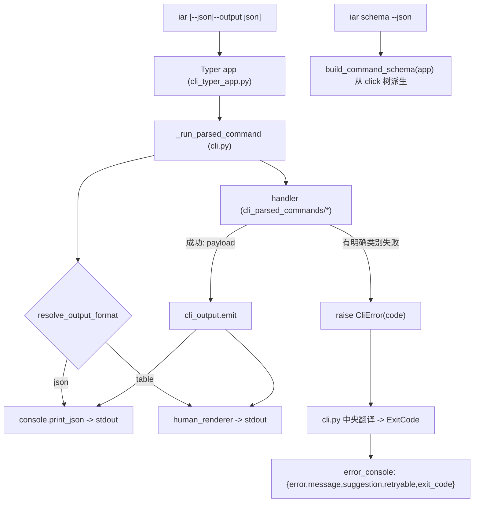

# PRD: iar 的 Agent 机读契约（结构化输出、语义退出码与运行时自省）

> ✅ **交付前置**：无，可立即开工。
> 结构化声明见 §8 Delivery Dependencies，**那里是唯一事实源**。

> ⬜ **验收状态**：未开工。
> 本行是 §9 Acceptance Checklist 的投影，**那里是唯一事实源**。

本文档分两个高度：**Part A（§1–§4）** 给人看，用来确认"要不要做、做成什么样"，不含实现机制、文件路径、命令与排期信息；**Part B（§5–§13）** 给执行者看，包含机制、改动树与验证命令。人只在 Part A 点名处下钻。

## Feature Overview (功能一览)

> 本块是第 10 节 Functional Requirements 的通俗投影，不是第二事实来源；行为验收以第 1 节的行为样例表为准。

- **统一机读输出**（FR-1、FR-2）：所有"产数据/产结果"的 `iar` 子命令都接受 `--output json`（`--json` 为别名）；默认仍是给人看的表格，**不做**"非 TTY 自动切 JSON"以免打破既有管道脚本。
- **数据与消息分离**（FR-2）：JSON 模式下 stdout 只放数据，进度/警告/错误一律走 stderr，`jq` 能无条件解析 stdout。
- **语义退出码**（FR-3）：在 POSIX 的 `0/1/2` 之外补 `3`（未找到）、`4`（无权限/未鉴权）、`5`（冲突/已存在）、`10`（dry-run 通过），让 agent 不必去 parse stderr 猜发生了什么。
- **结构化错误**（FR-4）：JSON 模式下错误以 `{error, message, suggestion, retryable, exit_code}` 落 stderr，`suggestion` 直接给出下一步可跑的命令。
- **运行时自省**（FR-5）：新增只读命令 `iar schema`（`--json`），从真实命令树派生"有哪些命令、参数类型/必填/枚举/默认/示例"，agent 不必背文档、也不怕文档过期。
- **知识随包发**（FR-6）：新旗标、退出码表与自省入口同步进 `iar-operator` skill 与 `docs/`，让操作 keda 的 agent 一并拿到。
- **零回归**（FR-7）：不传新旗标的默认输出与既有退出码语义对既有脚本保持兼容；既有 `iar issue list --output json` 行为不变、新增 `--json` 别名。
- **明确不做**（§11）：不做 `--fields` 字段裁剪、不做 MCP surface、不做非 TTY 自动 JSON、不重构 HTTP API 或前端、不新增第三方依赖。

---

# Part A · 人审层 (Review Layer)

## 1. Introduction & Goals

### Problem Statement

keda 的 `iar` CLI 现在把 agent 当作"顺带的使用者"，而不是一等消费者。三个具体症状（均已在仓库中确认）：

1. **机读输出是零散的例外，不是契约**。全仓只有两处 JSON：`iar issue list --output json`（`cli_parsed_commands/labels_issue.py` 走 `console.print_json`）和 `iar agent ... --json`（`cli_parsed_commands/agent.py` 走 `print(json.dumps(...))`）。两者旗标名、序列化方式、返回结构互不相同；`registry list`、`daemon status`、`worktree path`、`loop list`、`logs` 等要么没有 JSON，要么只能靠正则去啃人类表格。
2. **退出码几乎是二值的**。除极少数用法错误返回 `2` 外，绝大多数失败都塌缩成 `1`。调用方无法区分"仓库没注册"（可改用别的仓库）和"网络超时"（可重试）和"参数写错"（该改命令）——只能回过头去 parse stderr 的自然语言。
3. **没有运行时自省入口**。agent 想知道某条命令有哪些参数、哪些是枚举、默认值是什么，只能读 `--help` 或依赖 `iar-operator` skill 里手写的命令表；一旦 CLI 演进，skill 与真实命令树就会漂移。

后果：当 Claude / Codex 这类外部 agent 通过 shell 操作 keda 时，成功率被"输出不可解析 + 失败原因不可判别 + 能力不可自省"三者拖累，而这恰是 agent-facing CLI 这一代被反复点名的三个最低门槛。

### Interpretation (解读回显)

下表每一行都会**原样**变成第 7.6 节的验收 oracle，所以改表里的一格就等于改验收标准——值得逐行读。

| 验证方式 | 输入 / 操作 | 期望观察到的结果 |
|---|---|---|
| 👀 人审 + 自动验证 | `iar issue list --json --repo-id <repo>`（真实 CLI 入口） | stdout 是**合法且纯**的 JSON 数组，`... \| jq -e 'type=="array"'` 通过；表格、警告、进度条都不出现在 stdout |
| 👀 人审 + 自动验证 | `iar logs --repo-id does-not-exist --issue 1; echo $?`（真实 CLI 入口） | 退出码为 `3`（not_found），stderr 给出去哪找合法仓库的提示 |
| 🤖 自动验证 | `iar schema --json` | 输出命令树 JSON；能查到 `issue list` 的 `--output` 参数、其枚举值 `table\|json` 与默认值 |
| 🤖 自动验证 | 任意命令在 JSON 模式下的失败 | stderr 是 `{error,message,suggestion,retryable,exit_code}` 结构；`suggestion` 含一条可跑命令 |
| 🤖 自动验证 | `iar run --dry-run --json` | 退出码 `10`（dry-run 通过）且输出结构化预览；不带 `--dry-run` 时不产生 `10` |
| 🤖 自动验证 | 不传 `--json` / `--output` 运行既有命令 | 默认人类输出与 `--help` 黄金快照**逐字节不变**；既有脚本行为不变 |
| 🤖 自动验证 | `iar issue list --output json`（旧写法） | 与 `--json` 等价，行为与改动前一致（向后兼容） |
| 🤖 自动验证 | 用法错误（如缺必填参数 / 互斥旗标） | 退出码仍为 `2`（POSIX 用法错误） |

**我默默定了这些**（未提问、直接选定的）：

- **旗标以 `--output {table,json}` 为主、`--json` 为等价别名**——同时照顾既有 `--output` 用法与 agent 惯用的 `--json`。
- **默认保持人类输出，不做 TTY 自动切 JSON**——自动切换会静默改变既有 `iar ... | grep/awk` 管道的行为，风险大于收益；机器模式必须显式声明。
- **退出码在 `0/1/2` 之上只补 `3/4/5/10` 四个语义码**，不引入更细的码表；`1` 继续作为"未分类失败"兜底。
- **`iar schema` 从真实 Typer/click 命令树运行时派生**，不维护静态 schema 文件。
- **本次只覆盖"产数据/产结果"的命令集**（list/status/path/创建结果/预览/日志），不含 `iar repl`、`iar console serve` 这类长驻交互或服务命令。

**我理解为不做**：

- 不做 `--fields` / `--limit-tokens` 这类字段裁剪或响应体量控制（下一份 PRD）。
- 不做 MCP surface（按 AXI benchmark，agent-optimized CLI 在成功率/成本/延迟上普遍优于 MCP，MCP 的价值在"无 shell 环境"——留给后续按需评估）。
- 不做输入硬化增强（控制字符/路径穿越/双 URL 编码防御），本次只承诺"输出与退出码契约"。
- 不改 HTTP API 契约、不改前端、不改 Docker/部署、不改状态机、不新增第三方依赖。

**可证伪的读法**：本 PRD 读作"把 `iar` 的输出与退出码收敛成一份**显式、可自省、向后兼容**的机读契约，让外部 agent 能稳定解析每次调用的结果与失败原因"；**不**读作"把所有命令默认改成机器输出"、**不**读作"引入 MCP 或远程协议"、**不**读作"重构业务逻辑"。关键边界：不传新旗标时默认输出与既有退出码语义不变；JSON 模式必须显式声明；`--output json` 旧写法继续有效。

### What The User Gets

调用 keda 的自动化流程与外部 agent 得到一份稳定契约：任何"取数据"的命令都能用 `--json` 拿到纯 JSON（stdout 无杂质，可直接 `jq`），任何失败都能从退出码读出**类别**（用法错 / 未找到 / 无权限 / 冲突 / 可重试），并可在 stderr 拿到一条 `suggestion` 指向下一步命令；agent 还能用 `iar schema --json` 在运行时问清"这条命令接受什么参数、哪些是枚举、默认是什么"，不必依赖可能过期的文档。人工终端体验完全不变——默认仍是表格，只有显式要机器输出时才切换。

### Measurable Objectives

- 目标命令集中，每条产数据命令均支持 `--json`，且 stdout 可被 `jq -e .` 无条件解析（默认人类模式不受影响）。
- `iar logs`（未找到仓库/Issue）、用法错误、dry-run 通过等代表性场景返回**可区分的**退出码（`1/2/3/10` 各归其位），并有文档化的码表。
- `iar schema --json` 能列出全部命令及其参数元数据（类型/必填/枚举/默认/示例），且与真实命令树一致（同源派生）。
- 不传新旗标时，默认人类输出与 `--help` 输出与改动前**逐字节一致**（零回归）；既有 `iar issue list --output json` 行为不变。
- 新的旗标、退出码与自省入口同步进 `iar-operator` skill 与 `docs/`，守卫测试通过。

## 2. Human Review Map (介入与风险地图)

**决策一：JSON 模式必须显式声明、默认保持人类输出（不做非 TTY 自动切换），可以接受吗？** 这一代 agent-facing CLI 的主流建议是"非 TTY 时自动切 JSON"。但 keda 已有大量把 `iar ...` 输出接进管道/脚本的用法，自动切换会在无人察觉的情况下改变这些管道的输入。本 PRD 的立场：**机器模式必须显式传 `--json` / `--output json`**，默认永远是给人看的输出。取舍是：agent 必须记住加旗标（但 `iar-operator` skill 会把这条不变量写死，等于替它记住）。**请确认：** 接受"显式声明、默认人类"，还是要求"非 TTY 自动切 JSON"（更省心但会静默改既有管道行为）？**验收：** 显式 `--json` 时 stdout 纯 JSON、`jq` 通过；不带旗标时默认输出与黄金快照零 diff。

**决策二：引入语义退出码 `3/4/5/10` 是对外契约的行为变更，可以接受吗？** 这属于"对外 CLI 契约 / breaking change"固定区。现状绝大多数失败返回 `1`；引入语义码后，"未找到"返回 `3`、"冲突"返回 `5`、"dry-run 通过"返回 `10`。对只判断"是否非零"的脚本无害；对**假设任何非零都等于 `1`** 的脚本是行为变更。本 PRD 只在"有明确类别"的失败点启用新码，其余仍返回 `1`，并在 release note 与 `--help` 公布码表。**请确认：** 接受"引入 `3/4/5/10` 并以 `1` 兜底"，还是要求"本 PRD 仅做输出、退出码完全不动"（更保守，但 agent 仍无法区分失败类别）？**验收：** not_found 场景返回 `3`、用法错误返回 `2`、dry-run 通过返回 `10`，且有文档化码表。

**自动门禁，不需要逐项人工审阅**：输出单一 emit 出口（`rg` 断言没有旁路 `print_json`/`json.dumps`）、默认人类输出与 `--help` 黄金快照零 diff、`--json` 与 `--output json` 等价、schema 与真实命令树同源（解析出的选项数/枚举值与 click 对象一致）、结构化错误 envelope 形状测试、既有 `issue list --output json` 兼容测试、`iar-operator` skill 同步的守卫测试、`just lint` 与 `just test all`。

**本次明确不涉及**：不新增第三方依赖；不改 HTTP API（console 的 HTTP 层不动）；不改前端（`frontend-public/`、`frontend-admin/` 均不动）；不做 `--fields` / MCP / 输入硬化；不改并发/事务/状态机；**本次无数据库结构变化**。

## 3. Usage And Impact After Implementation

### [运维者 / Operator]

- 交互终端体验不变：`iar issue list`、`iar registry list` 等仍打印表格，`--help` 输出不变。
- 需要机器可读时，显式加 `--json`（等价 `--output json`），把 stdout 直接交给 `jq`：
  `iar issue list --json --repo-id keda | jq '.[] | select(.state=="open") | .number'`。
- 失败时看退出码判类别（`2` 用法 / `3` 未找到 / `4` 权限 / `5` 冲突 / `10` dry-run 通过 / `1` 其他），用 `$?` 分流。

### [调用方 / 外部 Agent]

- 通过 `iar-operator` skill 学到不变量：机器消费一律 `--json`；写操作先 `--dry-run`；按退出码分流；需要参数细节时先 `iar schema --json` 自省。
- 失败时读 stderr 的结构化 `suggestion` 直接拿到下一条命令，不需要猜。

### [开发者 / Developer]

- 新增"产数据"命令时，沿用共享的 `OutputOption` 与统一 emit：只写一个"人类渲染器 + 一份 data 结构"，JSON 通道自动成立，不重复造序列化。
- 失败路径统一抛 `CliError(code=...)`（或在返回处用退出码常量），由中央 dispatcher 翻译为退出码；不要在 handler 里散落裸 `return 1`。

### Impact On Existing Behavior

- 既有用户/脚本：不传新旗标时默认输出、`--help` 文本、既有退出码语义保持不变；既有 `iar issue list --output json` 继续有效。
- 新增均为可选：`--json`/`--output json` 与 `iar schema` 是纯增量；未使用时配置加载与运行路径不变。
- 退出码：仅"有明确类别"的失败点从 `1` 变为 `3/4/5/10`；其余保持 `1`。这是对外契约变更，需在 release note 标注。

## 4. Requirement Shape

- Actor: 调用 `iar` 的自动化流程 / 外部 agent / 需要机器可读输出的运维者；以及新增 CLI 命令的开发者。
- Trigger: 任一"产数据/产结果"的 `iar` 命令被调用——传了 `--json`/`--output json` 则走机器通道，否则走人类通道；失败走统一退出码翻译。
- Expected behavior: 机器模式下 stdout 只含可解析 JSON、stderr 承载消息与结构化错误，退出码表达失败类别；`iar schema --json` 从真实命令树提供运行时自省。
- Scope boundary: 不接管各 agent CLI；不改 HTTP API 与前端；不做字段裁剪/MCP/输入硬化；不改业务状态机；无数据库变更。

---

# Part B · 执行器层 (Build Layer)

> 以下供实现者（人或 Agent）使用。人只在 Part A 风险地图点名处下钻审查；其余默认交执行器 + 自动门禁。

## 5. Repository Context And Architecture Fit

- Existing path: `iar` 入口是 Typer app（`src/backend/api/cli_typer_app.py`）；每个 Typer 命令经 `_run_typer_command` → `_run_parsed_command`（`src/backend/api/cli.py`）→ `dispatch_parsed_command`（`src/backend/api/cli_parsed_commands/__init__.py`）分发到各 handler；handler 返回 `int` 退出码。输出经 `src/backend/api/cli_console.py` 的 `console`（stdout）/`error_console`（stderr）。
- Reuse candidates: `cli_console.py` 的双 console 已是 stdout/stderr 分离的天然基础；`cli_parsed_commands/labels_issue.py` 的 `--output json` 分支与 `cli_parsed_commands/agent.py` 的 `--json` 分支是要收敛的两个既有样本；`cli_typer_app.py` 的 `Annotated[...]` 共享选项类型（如 `RepoOption`）是新增 `OutputOption` 的落点。
- Architecture pattern to preserve: 四层依赖方向（`api -> core -> engines -> infrastructure`）不变；本次只动 `api` 层与其测试、文档、skill 模板，不新增跨层契约。
- Frontend impact: **No frontend impact**。本次只改 CLI 进程的 stdout/stderr 契约、退出码与一个只读自省命令，不触碰任何 HTTP 路由、DTO 或 `frontend-public/`、`frontend-admin/`。
- Existing PRD relationship: 与 `tasks/pending/` 下现有 PRD（tauri-desktop-shell、roadmap-prd-cicd-monitor-auto-repair、blocked-draft-pr-validation-failure、agent-model-preset-switching）**无重叠、无依赖、可独立执行**。`agent-model-preset-switching` 会新增 `iar agent doctor --json` 输出，本 PRD 的机读契约应与其兼容（doctor 的 `--json` 走统一 emit）——记为 soft 关系，不构成阻塞。
- Redundancy risks: 新增 `cli_output.py` 若与 `cli_console.py` 职责重叠会造成两套输出层——必须让 `cli_output.py` **复用** `cli_console.py` 的 console 实例，而不是另建 Console；schema 若从"单独维护的静态表"生成会复制命令定义——必须从 Typer/click app 运行时派生。

## 6. Recommendation

### Recommended Approach

- Approach: 在 `src/backend/api/` 新增三个薄模块（`cli_output.py` 统一输出契约、`cli_exit_codes.py` 语义退出码、`cli_schema.py` 自省派生），复用既有 `cli_console.py` 的两个 Console；把两个既有 JSON 分支收敛到统一 emit，并把 `OutputOption` 作为共享旗标挂到目标命令；退出码由中央 dispatcher 翻译 `CliError`。
- Why this is the best fit: 输出与退出码天然是"每条命令的公共横切面"，集中在 `api` 层最靠近入口、不越层；复用既有 Console 与既有选项类型，符合最小改动；schema 从 click 对象派生，零维护漂移。
- Rejected redundancy: 不新增独立序列化库、不在每个 handler 各写一套 `json.dumps`、不引入静态 schema 文件、不动 `core`/`engines`/`infrastructure`。

### Proposed Solution Summary (实现机制)

- **输出形态由调用方显式声明**：新增共享 `OutputOption = Annotated[str, typer.Option("--output", ...)]`（枚举 `table|json`，默认 `table`）与 `--json` 布尔别名；两者任一为真即机器模式，`--output` 取值优先。默认 `table` 保持人类输出。
- **单一 emit 出口**：`cli_output.emit(payload, *, human_renderer, fmt)` —— 机器模式用 `console.print_json(payload)`（复用一个 JSON 序列化口径），人类模式调用传入的 renderer。**消息（进度/警告/错误）一律走 `error_console`**，stdout 只承载 payload。`--issue` 这类流式日志命令的机器模式按行输出 NDJSON。
- **结构化错误**：新增 `CliError(message, *, code, suggestion=None, retryable=False)`；JSON 模式下由中央 dispatcher 捕获并落 `{error,message,suggestion,retryable,exit_code}` 到 stderr，人类模式打印等价文本。
- **退出码**：`cli_exit_codes.ExitCode`（`SUCCESS=0, GENERAL=1, USAGE=2, NOT_FOUND=3, PERMISSION=4, CONFLICT=5, DRY_RUN_OK=10`）。中央翻译点：Typer/argparse 用法错误 → `2`（现状已基本如此）；handler 抛 `CliError(code=...)` → 对应码；其余未分类 → `1`。**只对"有明确类别"的失败点启用新码**。
- **自省**：`cli_schema.build_command_schema(app)` 遍历 Typer app 的 click 命令树，导出 `{name, path, help, arguments[], options[]}`，每项含 `name/type/required/enum/default/help`；`cli_typer_schema.py` 注册 `iar schema [--json]`（默认人类缩进文本）。这是唯一新增命令。
- **知识同步**：更新 `iar-operator` skill 与 `docs/`，写入"机器消费一律 `--json`"的不变量、退出码表与 `iar schema` 入口。
- 刻意避免的复杂度：不新增存储、不改状态机、不引入协议层（MCP）、不接管 agent 凭据。

### Alternatives Considered (Only When Useful)

- Alternative: 直接在每个 handler 就地加 `if fmt == "json": print(json.dumps(...))`。
- Why not chosen: 正是现状（两处各写各的）导致旗标名与结构不一致；继续扩散会让"机读契约"名存实亡。

## 7. Implementation Guide

This section is a living implementation guide based on current repository analysis. If implementation discovers additional affected files, hidden dependencies, edge cases, or a better path, update this PRD before proceeding.

### 7.1 Core Logic

1. Typer 命令把参数交给 `_run_typer_command` → `_run_parsed_command(args.Namespace)`。
2. `_run_parsed_command` 在分发前解析输出格式（供 handler 经 `ctx` 读取）与退出码上下文。
3. handler 计算 payload；调用 `cli_output.emit(payload, human_renderer=..., fmt=...)`：机器模式 stdout 出 JSON，人类模式 stdout 出表格；所有非数据消息走 `error_console`。
4. handler 遇到"未找到/无权限/冲突/dry-run 通过"时抛 `CliError(code=...)`；`_run_parsed_command` 捕获后按码返回并（机器模式）落结构化错误。
5. `iar schema` 命令读取全局 `app` 的 click 命令树，输出自省 JSON。

### 7.2 Change Impact Tree

```text
.
├── API (src/backend/api/)
│   ├── cli_output.py
│   │   [新增] 【总结】统一输出契约：OutputOption 解析、单一 emit、结构化错误 envelope。
│   │   ├── OutputOption / resolve_output_format(parsed)（table|json，--json 别名）
│   │   ├── emit(payload, human_renderer, fmt)（复用 cli_console 的 console/error_console）
│   │   └── CliError(message, code, suggestion, retryable) 与 render_cli_error(...)
│   ├── cli_exit_codes.py
│   │   [新增] 【总结】语义退出码常量与"异常 → 退出码"翻译。
│   │   └── ExitCode(IntEnum) + translate_exit_code(exc) -> int
│   ├── cli_schema.py
│   │   [新增] 【总结】从 Typer/click app 派生命令树 schema。
│   │   └── build_command_schema(app) / render_schema_human(schema)
│   ├── cli_typer_schema.py
│   │   [新增] 【总结】注册只读命令 `iar schema`。
│   │   └── schema_command(ctx, json_output: bool) -> int（结构参照 cli_typer_agent.py）
│   ├── cli_typer_app.py
│   │   [修改] 【总结】注册 schema_app；导出共享 OutputOption。
│   │   ├── 新增 schema_app 并 app.add_typer(schema_app, name="schema")
│   │   └── 新增 OutputOption / JsonOutputOption 共享 Annotated 类型（与 RepoOption 并列）
│   ├── cli.py
│   │   [修改] 【总结】中央捕获 CliError，翻译退出码；输出格式入 ctx。
│   │   ├── _run_parsed_command 捕获 CliError → render_cli_error + return code（锚点：现有 except Exception 分支）
│   │   └── ParsedCommandContext 增加 output_format 字段
│   ├── cli_typer_issue.py
│   │   [修改] 【总结】`issue list` 的 `--output` 复用共享 OutputOption 并加 `--json` 别名；`issue create` 增数据输出。
│   ├── cli_typer_agent.py / cli_typer_registry.py / cli_typer_runner.py / cli_typer_worktree.py / cli_typer_loop.py
│   │   [修改] 【总结】目标命令挂共享 OutputOption（`--json`/`--output`）。
│   ├── cli_parser.py
│   │   [修改] 【总结】argparse 侧同步 `--output`/`--json` 与取值范围（保持 cli_typer 一致）。
│   └── cli_parsed_commands/
│       ├── __init__.py
│       │   [修改] 【总结】ParsedCommandContext 注入 output_format；导出自省入口。
│       ├── labels_issue.py
│       │   [修改] 【总结】`issue list` 两个 JSON 分支收敛到 emit；错误改用 CliError。
│       ├── agent.py
│       │   [修改] 【总结】`agent ... --json` 收敛到 emit；错误改用 CliError。
│       ├── registry.py / runner.py / worktree.py / loop.py / roadmap.py
│       │   [修改] 【总结】目标命令接入 emit 与语义退出码。
│       └── ...
│
├── Skill (src/backend/engines/agent_runner/templates/skills/)
│   └── iar-operator/SKILL.md
│       [修改] 【总结】写入"机器消费一律 --json"、退出码表与 iar schema 入口。
│
├── Tests (tests/)
│   ├── test_cli_output_contract.py
│   │   [新增] 【总结】--json/--output json 等价、stdout 纯净、结构化错误形状。
│   ├── test_cli_exit_codes.py
│   │   [新增] 【总结】not_found/permission/conflict/dry-run 的码值。
│   ├── test_cli_schema.py
│   │   [新增] 【总结】schema 与真实命令树同源、含枚举/默认/必填。
│   └── test_agent_runner_cli.py / test_issue_list.py / test_cli_registry.py / test_iar_operator_skill.py
│       [修改] 【总结】默认输出零回归、旧 --output json 兼容、skill 守卫更新。
│
└── Docs (docs/)
    ├── docs/guides/agent-runner.md
    │   [修改] 【总结】新增"面向 Agent 的机读契约"小节（旗标/退出码/自省）。
    └── docs/api/references.md
        [修改] 【总结】退出码表与机读输出约定。
```

> 以上为起点而非穷尽集合；`rg -n "print_json|json.dumps|json_output|--output" src/backend/api` 与 `rg -n "return 1" src/backend/api/cli_parsed_commands` 用于找出遗漏的输出点与退出点，详见 Executor Drift Guard。

### 7.3 Risk Classification Register

| 改动点 | tier | 决定性维度 / override | intervention | oracle / gate |
|---|---|---|---|---|
| 统一机读输出契约（旗标 + emit + stdout/stderr 分离） | R2 | 跨多命令的对外输出面；兼容边界（默认不变） | 人确认（决策一）+ 强 oracle（含负向控制） | `rv-1`、`rv-2`、`rv-6` |
| 语义退出码 `3/4/5/10` + 结构化错误 | R2 | 对外 CLI 契约行为变更（breaking，固定区④） | 人确认（决策二）+ 行为 oracle | `rv-3`、`rv-4` |
| `iar schema` 运行时自省 | R1 | 只读派生，新增单一命令，局部 | executor + 同源断言测试 | `rv-5` |
| 既有 `issue list --output json` / `agent --json` 收敛 | R1 | 复用既有分支，局部 | executor + 兼容测试 | `rv-6` |
| `iar-operator` skill 与 docs 同步 | R0 | 展示性，守卫与 `rg` 可检 | executor + `rg` / 守卫测试 | `rv-7` |

> 本 PRD 无 R3 改动点（不触碰鉴权/凭据、不可逆数据、资金）；两处 R2 证据深度按全链要求收集。

### 7.4 Executor Drift Guard

The file list above is the expected implementation surface from current repository analysis. During implementation, treat it as a starting point and use these repository searches to catch hidden references or drift before marking the PRD complete.

| Check | Command | Expected Result | If It Fails, Inspect First |
|---|---|---|---|
| JSON 旁路 | `rg -n "print_json|json\.dumps|json_output|output == \"json\"" src/backend/api` | JSON 序列化只出现在 `cli_output.py`（`issue list`/`agent` 的旧分支已收敛） | 是否有 handler 仍自行 `print(json.dumps(...))` |
| 裸退出码 | `rg -n "return [0-9]" src/backend/api/cli_parsed_commands src/backend/api/cli_registry.py` | 明确类别处使用 `ExitCode.*`；未分类处保留 `1` | 是否有 not_found/conflict 点仍返回 `1` |
| 新符号引用 | `rg -n "OutputOption|emit\(|CliError|ExitCode|build_command_schema" src` | 契约符号在 `api` 层成对出现；无跨层泄漏 | 是否被 `core`/`engines` 反向 import |
| 隐藏入口 | `rg -n "--output|--json" src/backend/api/cli_parser.py src/backend/api/cli_typer_app.py` | argparse 与 Typer 两侧旗标一致、取值域一致 | 两套解析器漂移（`cli.py` 顶部注释要求同步） |
| 旧写法兼容 | `rg -n "issue list --output json|agent .* --json" docs src/backend/engines/agent_runner/templates/skills` | 旧写法仍被文档/测试覆盖 | 是否有文档只提 `--json` 删了 `--output` |
| 命令树消费 | `rg -n "add_typer|@.*_app\.command" src/backend/api/cli_typer_*.py` | `schema` 命令已注册，且派生覆盖全部子 app | 是否有子 app 未挂到根 `app` |

### 7.5 Flow or Architecture Diagram



### 7.6 ER Diagram

- `No data model changes in this PRD.`

### 7.7 Realistic Validation Plan (Oracle 块)

机读 + 执行追踪的**单一 oracle 源**：§9 证据包和任何确定性抽取器都引用 / 解析这里的 `id`。不要把命令、边界字段或 `rv-id` 复制到 Part A。

```yaml
- id: rv-1
  behavior: 目标命令的 JSON 模式 stdout 是合法且纯的机器输出
  reviewer: human
  real_entry: "uv run iar issue list --json --repo-id keda 2>/dev/null | jq -e 'type==\"array\"'"
  expected: "jq 退出 0 并打印 true；stdout 无表格/警告/进度，只有 JSON 数组"
  mock_boundary: "gh CLI 可被 PATH 上的 fake 脚本替代以提供确定性数据；under-test 的 CLI 输出层不被替换"
  tier: R2
  test_layer: integration
  required_for_acceptance: true
  presentation: "tasks/evidence/iar-agent-machine-contract/rv-1-issue-list-json.txt（真实终端捕获）。约 10 秒自检：`... | jq -e 'type==\"array\"'` 是否为 true、stdout 首字符是否 `[`"
  critical_value_source: "真实 `iar` 进程 stdout（经管道进入 jq），不是测试内重建的字符串"
  must_cross: "argparse/Typer 解析 -> resolve_output_format -> handler 取数 -> emit(JSON) -> 进程 stdout -> jq"
  forbidden_bypasses: "不直接调用 render_*_json 断言、不 mock emit、不把 handler 返回值当 stdout"
  fresh_state_probe: "独立新进程重跑同一命令，JSON 稳定；改 `--json` 为不带旗标后 stdout 不再是合法 JSON"
  final_tree_evidence: "命令与最终提交树绑定；任何对 src/backend/api 输出层的后续改动都使本证据失效并需重跑"
  negative_control: "同一命令去掉 --json：`uv run iar issue list --repo-id keda 2>/dev/null | jq -e .`"
  expected_fail: "jq 报 parse error 并以非零退出（人类表格不是合法 JSON），证明 rv-1 的断言有判别力"

- id: rv-2
  behavior: 数据与消息分离——stderr 承载警告/错误，stdout 保持纯净
  reviewer: verifier
  real_entry: "uv run iar agent doctor claude --json 2>/dev/null | jq -e '.argv | type==\"array\"'"
  expected: "stdout 是纯 JSON（argv 为数组）；任何提示/警告只出现在未重定向的 stderr"
  mock_boundary: "不 mock；读真实 AppConfig + 内置 spec"
  tier: R1
  test_layer: integration
  required_for_acceptance: true

- id: rv-3
  behavior: 未找到类失败返回语义退出码 3
  reviewer: human
  real_entry: "bash -c 'uv run iar logs --repo-id does-not-exist --issue 1; echo exit=$?'"
  expected: "printed exit=3；stderr 给出如何找到合法仓库的提示"
  mock_boundary: "不 mock；仓库注册表真实读取"
  tier: R2
  test_layer: integration
  required_for_acceptance: true
  presentation: "tasks/evidence/iar-agent-machine-contract/rv-3-exit-codes.txt（真实终端捕获）。约 10 秒自检：`exit=` 后是否为 3；用法错误行是否为 2"
  critical_value_source: "真实进程 `$?`，不是测试内 catch 的异常码"
  must_cross: "handler 抛 CliError(NOT_FOUND) -> cli.py 中央翻译 -> 进程退出码 -> shell $?"
  forbidden_bypasses: "不在测试内直接断言 ExitCode.NOT_FOUND 常量、不 mock 翻译层"
  fresh_state_probe: "独立 shell 重跑；换一个合法 repo-id 且已有日志时同命令返回 0"
  final_tree_evidence: "命令与最终提交树绑定；改动 cli.py 退出码翻译或对应 handler 后必须重跑"
  negative_control: "对同一命令的用法错误变体：`bash -c 'uv run iar logs --issue 1 --kind review_daemon; echo exit=$?'`"
  expected_fail: "打印 exit=2（用法错误），与 not_found 的 3 可区分；若两者都印 1 则证明码表未接入"

- id: rv-4
  behavior: JSON 模式下的失败是结构化错误 envelope
  reviewer: verifier
  real_entry: "uv run iar logs --repo-id does-not-exist --issue 1 --json 2>&1 1>/dev/null | jq -e '.error and .exit_code'"
  expected: "stderr 为 JSON，含 error/message/suggestion/retryable/exit_code 字段；suggestion 含可跑命令"
  mock_boundary: "不 mock"
  tier: R1
  test_layer: integration
  required_for_acceptance: true

- id: rv-5
  behavior: iar schema 从真实命令树提供运行时自省
  reviewer: verifier
  real_entry: "uv run iar schema --json | jq -e '.commands[] | select(.name==\"issue list\") | .options[] | select(.name==\"--output\") | .enum'"
  expected: "输出 `[\"table\",\"json\"]`；schema 中的命令数与根 app 的子命令数一致"
  mock_boundary: "不 mock；派生自真实 Typer/click 对象"
  tier: R1
  test_layer: integration
  required_for_acceptance: true

- id: rv-6
  behavior: 默认人类输出与旧写法零回归
  reviewer: verifier
  real_entry: "bash -c 'uv run iar --help > /tmp/h1 && uv run pytest -o addopts=\"\" tests/test_cli_output_contract.py tests/test_issue_list.py -q'"
  expected: "--help 与既有黄金快照一致；`iar issue list --output json` 与改动前输出等价；不传旗标时表格输出不变"
  mock_boundary: "不 mock；以既有黄金快照与既有测试为基线"
  tier: R1
  test_layer: integration
  required_for_acceptance: true

- id: rv-7
  behavior: 新契约同步进 operator skill
  reviewer: verifier
  real_entry: "rg -n \"schema|--output json|--json|exit\" src/backend/engines/agent_runner/templates/skills/iar-operator/SKILL.md"
  expected: "skill 含'机器消费一律 --json'不变量、退出码表与 iar schema 入口；test_iar_operator_skill.py 通过"
  mock_boundary: "不 mock"
  tier: R0
  test_layer: unit
  required_for_acceptance: true
```

Failure triage:
- `real_entry` 跑挂，先查 `gh`/`fake gh` 是否在 PATH、`--repo-id` 是否为真实注册仓、命令是否在 `uv run` 下执行，别急着改输出层。
- 生产 / 需凭据的 `gh` 路径标 `opt-in`：无凭据时用 PATH 上的 fake `gh`（返回固定 issue 列表）仍可跑 rv-1/rv-6 的核心断言；rv-3/rv-5 不需要凭据。
- CLI 产生的关键值（stdout/`$?`）必须从真实进程提取；写操作先 `--dry-run`。

### 7.8 Low-Fidelity Prototype (Only When Required)

- `No low-fidelity prototype required for this PRD.`

### 7.9 Interactive Prototype Change Log (Only Files Actually Changed)

- `No interactive prototype file changes in this PRD.`

### 7.10 External Validation (Only When Web Research Was Used)

| Topic | Source | Checked On | Relevant Finding | Impact On Recommendation |
|---|---|---|---|---|
| Agent-facing CLI 设计共识 | Anthropic《Writing effective tools for agents》 https://www.anthropic.com/engineering/writing-tools-for-agents | 2026-09-30 | 不要 1:1 包 API；错误要 specific & actionable；工具 description 是准确率最大变量 | 支持"单一 emit + `suggestion` 字段 + `iar schema` 自省" |
| CLI 重写指南 | Justin Poehnelt《You Need to Rewrite Your CLI for AI Agents》 https://justin.poehnelt.com/posts/rewrite-your-cli-for-ai-agents/ | 2026-09-30 | `--output json` 是最低门槛；schema introspection 替代文档；env-var 鉴权 | 支持 `--json` 统一 + `iar schema` + 退出码分流 |
| Agent-First CLI 16 原则 | https://agentfirstcli.github.io/ | 2026-09-30 | Structured Output / Semantic Exit Codes / Machine-Readable Help 等 | 与本 PRD 的 FR 一一对应 |
| Agent CLI Guide 10 原则 | https://github.com/Johnixr/agent-cli-guide | 2026-09-30 | stdout=数据、stderr=消息；语义退出码表（0/2/3/4/5/10）；help < 50 行 | 直接采用其退出码取值 |
| Agent-optimized CLI vs MCP 实证 | GenAI Playbook（含 AXI benchmark） https://www.genai-playbook.com/articles/agent-friendly-cli.html | 2026-09-30 | Agent-optimized CLI 在成功率/成本/延迟上普遍优于 MCP（100%/$0.050/15.7s vs 87%/$0.148/34.2s） | 支持"先做 CLI 契约、MCP 列为非目标" |

> 来源多为 2026 年社区实践与厂商工程博客，非 POSIX/ISO 级正式标准；当参考坐标而非硬约束。唯一有实测数据的是 AXI benchmark。

## 8. Delivery Dependencies

工具中立的排期元数据，不是工具专属队列语法。无依赖时显式写 `none`。

- Group: iar-agent-cli-contract
- Depends on tasks/issues:
  - none
- Gate type: none
- Notes: 与 pending 的 agent-model-preset-switching 为 soft 关系（其 `iar agent doctor --json` 需经本契约的 emit；不阻塞，二者可并行，合并时后者应 rebase 到统一输出层）。

## 9. Acceptance Checklist

本节分两层读者：**9.1 是给人看的**——验收时只看这一层；**9.2 起是给 verifier 和未来回溯用的机器证据**。

### 9.1 人读呈递区（Human Review Surface）

| # | 你要看什么（对应 oracle） | 呈递物（交付时填实际路径） | 想自己复核？ |
|---|---|---|---|
| 1 | rv-1：`iar issue list --json` 的 stdout 是纯 JSON | `tasks/evidence/iar-agent-machine-contract/rv-1-issue-list-json.txt` + `open` 命令 | 终端粘 `uv run iar issue list --json --repo-id keda \| jq -e 'type=="array"'`，看是否打印 `true` |
| 2 | rv-3：未找到/用法错误返回可区分退出码 | `tasks/evidence/iar-agent-machine-contract/rv-3-exit-codes.txt` + `open` 命令 | 粘 `bash -c 'uv run iar logs --repo-id does-not-exist --issue 1; echo $?'`，看是否为 `3` |

**以下项不需要你看**（`reviewer: verifier`，agent 自验 + verifier 复核，挂了会自己红）：rv-2、rv-4、rv-5、rv-6、rv-7。它们的证据在 §9.2。

### 9.2 Acceptance Evidence Package（机器证据 · verifier 入口，人默认跳过）

1. **人审项的 oracle 跑绿证据**（对应 §9.1 各行）：rv-1、rv-3 的终端捕获 + 命令证据。
2. **verifier-only 项结果**：rv-2/4/5/6/7 的输出。
3. **风险地图对账 Predicted → Reconciled**：是否出现未预测到的输出点/退出点被触发，如何处理。
4. **对抗自检**：对"默认人类输出零回归""旧 `--output json` 兼容""非目标项确实未做"的反方检查。
5. **对锁定契约的 diff**：新增旗标/退出码 vs 本 PRD §7.7 前置约定。
6. **低风险门禁结果（折叠）**：`just lint`、`just test all`、守卫测试、`--help` 黄金快照。

### Human-Confirmed (来自 Part A 风险地图)

- [ ] 决策一（JSON 显式声明、默认人类输出、不做非 TTY 自动切换）已确认
- [ ] 决策二（引入语义退出码 `3/4/5/10`、`1` 兜底、码表文档化）已确认
- [ ] §9.1 呈递区各项已亲眼看过（截图/自验，二选一或都做）

### Architecture Acceptance

- [ ] 新增代码仅落在 `src/backend/api/`，未新增跨层契约，四层依赖方向不变
- [ ] `cli_output.py` 复用 `cli_console.py` 的 `console`/`error_console`，未新建第二套 Console
- [ ] `cli_schema.build_command_schema` 从真实 Typer/click 命令树派生，未引入静态 schema 文件

### Dependency Acceptance

- [ ] 未新增第三方依赖（`pyproject.toml` 无新增 runtime 依赖）
- [ ] JSON 序列化收敛到单一出口；`rg -n "print_json|json\.dumps" src/backend/api` 只命中 `cli_output.py`

### Behavior Acceptance

- [ ] 目标命令均接受 `--json` 与 `--output json` 且二者等价
- [ ] JSON 模式 stdout 纯净（`jq -e .` 无条件通过），消息走 stderr
- [ ] `3/4/5/10` 在对应场景返回；用法错误为 `2`；未分类失败仍为 `1`
- [ ] JSON 模式失败落结构化错误 `{error,message,suggestion,retryable,exit_code}`
- [ ] `iar schema --json` 输出与真实命令树一致
- [ ] 不传新旗标时默认输出与 `--help` 与改动前逐字节一致；旧 `--output json` 行为不变

### Documentation Acceptance

- [ ] `docs/guides/agent-runner.md` 含机读契约小节（旗标/退出码/自省）
- [ ] `docs/api/references.md` 含退出码表
- [ ] `iar-operator/SKILL.md` 含"机器消费一律 `--json`"、退出码表与 `iar schema` 入口

### Validation Acceptance

- [ ] `uv run pytest -o addopts="" tests/test_cli_output_contract.py tests/test_cli_exit_codes.py tests/test_cli_schema.py -q` 通过
- [ ] `uv run iar issue list --json --repo-id keda 2>/dev/null | jq -e 'type=="array"'` 通过（真实 CLI 入口，不绕过输出层）
- [ ] `bash -c 'uv run iar logs --repo-id does-not-exist --issue 1; echo exit=$?'` 打印 `exit=3`
- [ ] `uv run iar schema --json | jq -e '.commands | length > 0'` 通过
- [ ] `rg -n "print_json|json\.dumps|json_output" src/backend/api` 仅命中 `cli_output.py`
- [ ] `rg -n "return 1" src/backend/api/cli_parsed_commands` 中 not_found/conflict 点已改用 `ExitCode.*`
- [ ] `uv run pytest -o addopts="" tests/test_iar_operator_skill.py -q` 通过

### Delivery Readiness

- [ ] 推荐方案完整实现；未引入未获批的并行抽象
- [ ] 无未解决的回归或发布阻塞
- [ ] §9.1 呈递区路径已回填，完成回复已原样带上呈递表内容
- [ ] 每个呈递物带可直接执行的打开方式与逐项期望值

## 10. Functional Requirements

- FR-1: 目标"产数据/产结果"命令均支持 `--output {table,json}`，并提供等价 `--json` 别名；默认 `table`。
- FR-2: 机器模式下 stdout 只含数据，进度/警告/错误一律走 stderr。
- FR-3: 定义并使用语义退出码 `0/1/2/3/4/5/10`，并在 `--help` 与 `docs/` 公布码表。
- FR-4: 机器模式下失败输出结构化错误 envelope `{error,message,suggestion,retryable,exit_code}`；`suggestion` 给出可执行的下一步命令。
- FR-5: 新增只读命令 `iar schema`（支持 `--json`），从真实命令树派生命令/参数元数据（含类型、必填、枚举、默认、示例）。
- FR-6: 新旗标、退出码与 `iar schema` 入口同步到 `iar-operator` skill 与 `docs/`。
- FR-7: 向后兼容：不传新旗标时默认人类输出与 `--help` 不变；既有 `iar issue list --output json` 行为不变。
- FR-8: `--json` / `--output json` 在非 TTY 下不触发任何交互提示。

## 11. Non-Goals

- 不做 `--fields` 字段裁剪 / 响应体量控制。
- 不做 MCP surface。
- 不做非 TTY 自动切 JSON。
- 不做输入硬化增强（控制字符/路径穿越/双 URL 编码防御）。
- 不改 HTTP API、前端、Docker/部署、数据库 schema、业务状态机。
- 不接管各 agent CLI 的鉴权/端点/凭据。

## 12. Risks And Follow-Ups

- **退出码为对外行为变更**：假设"任何非零 = 1"的既有脚本需适配；以 release note + `--help` 码表披露，未启用新码的失败点仍返回 `1` 以缩小影响面。
- **命令集边界**：本次只覆盖"产数据/产结果"的命令集；`repl`/`console serve` 等长驻交互命令不纳入，后续按需扩展（不得声称"全部命令"）。
- **后续跟进（非阻塞）**：`--fields`/分页、MCP surface、输入硬化增强各自单独立 PRD。

## 13. Decision Log

| # | 决策问题 | 选择 | 放弃的方案 | 理由 |
|---|---|---|---|---|
| D-01 | 机读输出旗标命名 | `--output {table,json}` 为主 + `--json` 别名 | 仅 `--json`；或仅 `--output` | 兼容既有 `issue list --output json`，同时满足 agent 惯用 `--json` |
| D-02 | 非 TTY 是否自动切 JSON | 否，默认保持人类输出 | 非 TTY 自动 JSON | 自动切换会静默改变既有管道脚本的输入，风险大于收益 |
| D-03 | 退出码是否扩展 | 引入 `3/4/5/10`，`1` 兜底 | 仅保留 `0/1`（现状） | agent 需区分"未找到/无权限/冲突/dry-run 通过"，仅二值码无法分流 |
| D-04 | schema 来源 | 从 Typer/click 命令树运行时派生 | 维护静态 schema 文件 | 静态文件必然随 CLI 演进漂移，派生零维护 |
| D-05 | 输出实现落点 | 新增 `cli_output.py` 单一 emit，复用既有 Console | 各 handler 就地 `print(json.dumps)` | 现状两处各写各的正是不一致的根源，继续扩散则契约失效 |

### Final Reconciliation (Archive Only)

- Interpretation: [pending]
- Public behavior and contracts: [pending]
- Related PRD status: [pending]
- Requirements and risks: [pending]
- Reconciled differences:
  - [pending]

## 14. Change Log

### 2026-09-30 · 初稿：iar 的 Agent 机读契约

- 目标行为：为 `iar` 的"产数据/产结果"命令集引入统一机读输出（`--json`/`--output json`，默认人类）、语义退出码（`3/4/5/10`）、结构化错误与 `iar schema` 运行时自省；默认输出与既有脚本零回归。
- 变更动机：外部 agent 通过 shell 操作 keda 时，受"输出不可解析 + 失败原因不可判别 + 能力不可自省"三者拖累；这三项是 agent-facing CLI 的最低门槛。
- 范围：仅 `src/backend/api/`、测试、`docs/` 与 `iar-operator` skill；不触碰 HTTP API、前端、数据库。
- 关键决策：D-01 旗标命名、D-02 不做非 TTY 自动 JSON、D-03 引入语义退出码、D-04 schema 运行时派生、D-05 单一 emit 出口。
- 验收：见 §9；人审 2 项（决策一/二）+ verifier 5 项。
