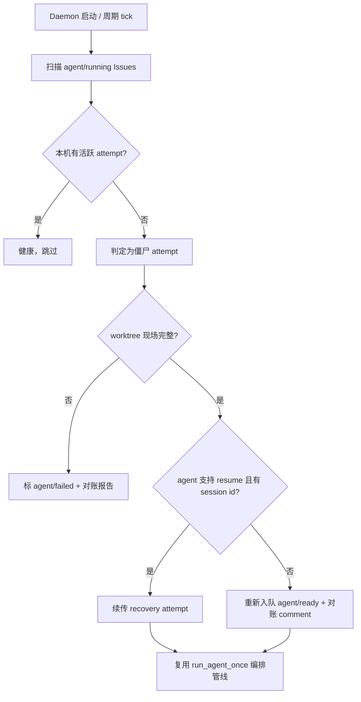

# PRD: Daemon 崩溃对账与 Agent 会话续传

- GitHub Issue: https://github.com/ZataZhang/keda/issues/206

> 本 PRD 分两个 altitude，分别服务不同读者，自上而下阅读：
>
> - **Part A · 人审层 (Review Layer)** — 需求方 / 验收人读这部分，决定"该不该做、做得对不对"，并通过风险地图知道**哪些地方必须亲自确认**。Part A 不出现实现机制、文件路径、命令。
> - **Part B · 执行器层 (Build Layer)** — 实现者（人或 Agent）读这部分动手。人只在 Part A 风险地图**点名处**下钻审查，其余默认交执行器 + 自动门禁。

---

# Part A · 人审层 (Review Layer)

## 1. Introduction & Goals

### Problem Statement

keda 的自动恢复能力在**单次 attempt 内部**已经很强：commit request 失败、验证失败、pre-commit 失败都有定向 recovery loop。但恢复的边界止于 runner 进程自己活着的前提。两类跨进程边界的崩溃目前没有兜底：

1. **daemon / host 进程崩溃**：runner daemon 在执行某个 Issue 的 attempt 中途被杀（OOM、机器重启、误杀）。Issue 的 label 停在"执行中"状态，worktree 里留着半成品，Issue comment 里没有任何"这轮 attempt 死了"的终态记录。daemon 重启后不会回头看这些僵尸任务——它们既不会被重新调度，也不会被标记失败，只能靠人发现并手工处理。同类开源项目（autonomous-dev-team 的 Dispatcher 崩溃恢复）已经把"崩溃后自动检测并重新调度"做成了标配能力。
2. **agent 进程崩溃 / 超时被杀**：agent CLI 进程中途死亡后，recovery agent 是一个**全新的会话**，只有失败文本摘要可看。跑了几小时的上下文（读过哪些文件、试过什么方案、卡在哪一步）全部丢失，长任务的恢复成本接近重跑。主流 agent CLI（Claude Code、Codex）都支持按 session id 续传会话，runner 目前没有利用这一点。

### Interpretation (解读回显)

我理解为：给 runner 补上**跨进程边界的恢复层**，而不是重做现有的 attempt 内 recovery loop。具体边界：

- 是：daemon 启动时（以及运行中周期性）对账"label 为执行中但本机没有对应活跃 attempt"的 Issue，给它们明确的终态或重新入队；agent 进程异常死亡时，若该 agent CLI 支持会话续传，recovery 尝试优先用 `resume` 原会话而不是全新 prompt。
- 不是：不改 attempt 内的失败分类规则（surgical recovery loop 原样保留）；不引入新的持久化存储（对账依据 = 现有 label + Issue comment attempt history + worktree 现场状态）；不承诺所有 agent CLI 都能续传——只对已声明支持 resume 的 agent 生效，不支持的按现有全新会话路径走。

### What The User Gets

运营者重启 daemon（或机器重启后 daemon 自启）不再需要逐个检查"哪些 Issue 卡死在执行中"——系统自己找回这些任务：能续的续上（agent 接着上次聊，而不是从零开始重读代码），不能续的明确告诉你死在哪一轮、为什么，并回到可调度的状态。长任务的崩溃损失从"整轮重跑"降到"从断点继续"。

### Measurable Objectives

- daemon 非正常终止后重启，僵尸"执行中" Issue 在首个调度周期内被对账处理，无一永久卡死。
- 支持续传的 agent 在 recovery 场景下，恢复会话携带原 attempt 的完整上下文（可从续传后的回复中引用上轮内容验证）。
- 对账动作与续传失败都在 Issue comment 留下可审计记录，与现有 Attempt History 表格风格一致。

---

## 2. Human Review Map (介入与风险地图)

本节决定注意力如何分配：哪些改动**必须人工确认**，哪些交给**执行器 + 自动门禁**。默认按架构层定介入档（`api`/`infrastructure` 偏自动，`core` 偏人工），再用风险因子——**不可逆性、影响面、安全·资金、正确性关键度**——上调或下调。**两次人类触点**模型：前置一次（批准 §1 解读 + 本表 oracle）、终点一次（读 §9 证据包）；中间 Agent 自治自验、不打断人。

**命中的人审项**：

- ① Core 业务逻辑 / 编排规则（对账判定"僵尸 running → 恢复 / 重新入队 / 标失败"是核心编排决策，判错会把健康任务重新入队造成重复执行，或把活任务误标失败）
- ⑦ 并发 / 事务 / 幂等性（daemon 多仓库并发 + 对账与调度同周期运行，重复入队 / 双 daemon 抢同一个僵尸 Issue 是真实风险）

**未命中**：

- ②③④⑤⑥ 不涉及（无 schema 变化；agent 会话续传复用 agent CLI 自带能力，不新增信任边界；不动对外 API 契约；无资金操作；对账本身不做不可逆数据操作——最坏情况是把一个 Issue 多跑一轮 attempt，损失为算力，可接受）
- 最坏自检：对账误判最坏后果 = 健康 Issue 被重复调度一轮 attempt，产生一个多余 PR，人工关闭即可——不可逆程度低，可留作未命中。

| 改动点 | 架构层 | 风险 | 介入方式 | 证据 / Oracle（指向 §7.6 oracle 块的 rv-id） |
|---|---|---|---|---|
| 僵尸 running 对账判定与重新入队规则 | core | 高 | 人工确认（高证据负担） | rv-1, rv-2（详见 §7.6） |
| 对账与正常调度的并发互斥 | core | 高 | 人工确认（高证据负担） | rv-3（详见 §7.6） |
| agent 会话续传（按 agent 能力声明降级） | engines | 中 | 执行器+门禁 | rv-4（详见 §7.6） |
| 对账结果 Issue comment 渲染 | api | 低 | 执行器+门禁 | rv-5（详见 §7.6） |

**如何证明它生效（真实入口，白话）**：

- 在真实仓库里跑一个长任务 Issue，执行中途杀掉 daemon 再重启：看到 Issue 在重启后的第一个周期被对账——要么续传上下文继续跑，要么带着明确的终态说明回到待调度状态；全程没有人手工改 label。

**数据库结构评审（schema 变化时必填）**：

- 本次无数据库结构变化。（keda 的生命周期账本为 append-only 追加写，对账事件以新事件追加，不改既有记录结构。）

---

## 3. Usage And Impact After Implementation

### 终端用户（运营者 / Issue 提交人）

- daemon 重启后照常运行；曾经"跑一半就人间蒸发"的 Issue 现在会在 comment 里多一条对账记录：说明检测到僵尸 attempt、评估结论（续传 / 重新入队 / 标失败）和依据。
- 提交人视角：Issue 不会无声卡死；中断恢复的 attempt 的评论里能看到 agent 接续上轮上下文的痕迹。

### 管理员 / Admin

- 无新增管理面。对账行为跟随现有 daemon 配置开关（默认开启，可关闭回到现状）。

### 开发者 / Developer

- 现有 `iar run-once` / `iar daemon` 入口不变；失败分类模块新增"对账"入口点，扩展者按现有 failure classification 的模式接入新分类。

### Impact On Existing Behavior

- 现有 recovery loop、supervisor、review daemon 行为全部不变。
- 新增对账默认开启；提供配置关闭（`[agent_runner] reconcile_stale_attempts = false`）以支持回退到现状。

---

## 4. Requirement Shape

- Actor: runner daemon（启动时与运行中周期）。
- Trigger: daemon 启动；调度周期内发现"label 为执行中但无对应活跃 attempt"的 Issue；agent 进程异常终止（超时击杀、非零退出、信号死亡）。
- Expected behavior: 对账引擎给出明确处置（续传恢复 / 重新入队 / 标失败），全链路留痕；续传在 agent CLI 支持时优先于全新会话。
- Scope boundary: 不覆盖 supervisor / review-daemon 自身的崩溃恢复（ROADMAP 已列为独立缺口）；不处理 GitHub 侧故障（网络断连沿用现有 transient retry）；不实现跨机器的 worktree 迁移（僵尸 attempt 只在原 host 对账）。

---

# Part B · 执行器层 (Build Layer)

> 以下供实现者（人或 Agent）使用。人只在 Part A 风险地图点名处下钻审查；其余默认交执行器 + 自动门禁。

## 5. Repository Context And Architecture Fit

- Existing path:
  - 失败分类与 attempt 历史：`src/backend/core/use_cases/agent_runner_failure.py`（`classify_failure` / `format_attempt_history` / `AgentUnavailableError`）
  - 调度编排：`src/backend/core/use_cases/agent_runner_orchestrate.py`、`agent_runner_orchestration_runtime.py`、`run_agent_once.py`
  - agent 执行：`src/backend/engines/agent_runner/factory.py`、`transcript_runner.py`、`output_protocols/`
  - daemon 单实例互斥：`src/backend/core/use_cases/daemon_single_instance.py`
  - label 流转：core 层 issue handlers（`agent/running` 等状态 label 的读写）
- Reuse candidates: `AttemptResult` / attempt history 渲染、`transient_retry_attempts` 的延迟重试机制、worktree 存活检测（`create_or_reuse_worktree` 的路径校验）、`daemon_single_instance` 的互斥原语、`IProcessRunner` 抽象。
- Architecture pattern to preserve: `core` 编排 / `engines` 执行 / `api` 呈现的依赖方向（`api` 不得 import `engines`/`infrastructure`，`hooks/shared/check_architecture.py` 门禁）；失败分类集中在 `agent_runner_failure.py`，不散落。
- Frontend impact: `No frontend impact` —— 纯 runner 编排与 agent 执行层改动，不动 `frontend-admin` / `frontend-public`。
- Existing PRD relationship:
  - `tasks/archive/20260521-143000-prd-surgical-failure-recovery.md`：已交付**attempt 内** recovery loop。本 PRD 是它的跨进程边界延伸，不重复其范围（surgical 管"runner 活着时如何修复错误"，本 PRD 管"runner / agent 死了之后如何找回现场"）。依赖关系：`independent`（实现上互不触碰对方路径，运行上互补）。
  - `tasks/archive/P0-BUG-20260930-145323-logging-config-robustness.md`：日志配置健壮性，与本 PRD `independent`（对账日志受益于它，但不构成阻塞）。已归档交付；原文写作 `tasks/pending/…`，已按实际位置更正。
  - `tasks/pending/` 其余 PRD 与 `tasks/archive/` 相关归档：无重复。
- Redundancy risks: 不得在 GitHub 之外新增"对账状态库"——label + Issue comment 已是权威媒介，第二状态源必然漂移。不得为续传自建会话存储——session id 的持有方是 agent CLI，runner 只记录与回传。

---

## 6. Recommendation

### Recommended Approach

- Approach: 扩展现有路径——在 core 编排层新增一个对账入口（daemon 启动钩子 + 周期调用），复用 `classify_failure` 的分类模式新增"僵尸 attempt"处置决策；agent 命令构建层为支持续传的 agent 记录 session id 并在 recovery 时改用 resume 形态调用。
- Why this is the best fit: 对账本质是"另一种触发时机跑同一条编排管线"，复用 `run_agent_once` 的领取-执行-留痕链路，只替换触发条件与入口判定；续传是 agent 调用参数的变化，落在 factory / invocation 边界内。
- Rejected redundancy: 不新建对账数据库或独立对账 daemon（复用主 daemon 单实例互斥）；不引入通用"checkpoint 框架"（attempt 历史已经足够做恢复锚点）。

### Proposed Solution Summary (实现机制)

1. **僵尸 attempt 识别**：daemon 启动及每个调度周期，扫描本仓库 label 为 `agent/running` 的 Issue。判定依据 = 本机 daemon 单实例锁存活 + 该 Issue 无本进程发起的活跃 attempt + worktree 现场存在（worktree 存在且分支领先 base，或 attempt history 最新一轮无终态 comment）。多仓库 registry 下逐仓库执行。
2. **处置决策**（对账引擎，三个出口）：
   - **可续传**：worktree 完整 + agent 支持会话续传 + 距中断未超过 `max_recovery_attempts` 预算 → 以 resume 模式发起 recovery attempt，prompt 注明"上轮会话中断，请从上次进度继续"。
   - **可重跑**：worktree 完整但不满足续传条件 → 按 attempt history 现状重新入队（label 回 `agent/ready`，comment 记录对账结论）。
   - **判失败**：worktree 损坏 / 分支不可解析 / 重试预算耗尽 → 走现有失败通道（`agent/failed` + `format_failure_comment` 风格的对账报告）。
3. **会话续传**：agent 执行层在支持 resume 的 agent 上，attempt 启动后从输出协议（`output_protocols/` 的 stream 解析）捕获 session id，随 attempt 记录持久化在 worktree 局部（复用 Agent Runner 记忆持久化的 tmp + `os.replace` 原子写模式）；recovery 时若 session id 存在且 CLI 支持，命令改用 resume 形态。agent 能力用声明式配置表达（`[agents.<name>] supports_resume = true` + resume 命令模板），不支持的自然降级到全新会话。
4. **并发与幂等**：对账复用 `daemon_single_instance` 互斥；对账动作与正常调度在同一 tick 内串行（先对账后领取）；"重新入队"与"标失败"均先写 comment 再改 label，comment 以 content hash 去重（复用 review-daemon 的自去重模式），保证对账重放不产生重复评论。

### Alternatives Considered (Only When Useful)

- Alternative: 引入独立的心跳 / 租约表（attempt 启动时写心跳，超时未续约判僵尸）。
- Why not chosen: 需要新的持久化与过期语义，而 keda 单 host 部署 + 单实例互斥已把"谁是权威"简化到 label + comment + worktree 三件现成事实；租约表在多 host 时才有必要（列入 Non-Goal，未来多机时再评估）。

---

## 7. Implementation Guide

> This section is a living implementation guide based on current repository analysis. If implementation discovers additional affected files, hidden dependencies, edge cases, or a better path, update this PRD before proceeding.

### 7.1 Core Logic

数据与控制流：daemon tick → 对账入口扫描 `agent/running` Issues（经现有 GitHub client）→ 本机活跃 attempt 表（进程内存 + 单实例锁）比对 → 僵尸判定 → 处置决策（续传 / 重跑 / 失败）→ 复用 `run_agent_once` 编排管线执行 → attempt history 与对账 comment 留痕 → label 终态。续传路径额外一条数据流：attempt 启动时从 agent 输出流捕获 session id → 原子写入 worktree 局部记录 → recovery 构建命令时读取并注入 resume 参数。

### 7.2 Change Impact Tree

```text
.
├── Backend (core 编排层)
│   └── src/backend/core/use_cases/
│       ├── agent_runner_reconcile.py          [新增]
│       【总结】对账引擎：僵尸 attempt 识别 + 三出口处置决策（纯函数化，便于测试）
│
│       ├── run_agent_once.py                  [修改]
│       【总结】daemon 启动与周期 tick 接入对账入口；对账与领取在同一 tick 串行
│
│       ├── agent_runner_failure.py            [修改]
│       【总结】新增 StaleAttempt 分类与对账 comment 渲染（复用 format_attempt_history 风格）
│
│       └── (daemon 启动钩子所在 use case)      [修改]
│       【总结】启动时先跑一轮对账再进入常规循环；新增 reconcile 开关读取
│
├── Backend (engines 执行层)
│   └── src/backend/engines/agent_runner/
│       ├── factory.py / output_protocols/     [修改]
│       【总结】从 agent 输出流捕获 session id；resume 命令形态构建
│
│       └── (agent 能力声明所在配置模型)        [修改]
│       【总结】[agents.<name>] 增加 supports_resume / resume_command_template 声明
│
├── Backend (shared models)
│   └── src/backend/core/shared/models/agent_runner.py [修改]
│       【总结】RunnerSettings 增加 reconcile 开关与对账预算字段
│
└── Frontend (frontend-admin / frontend-public)   # No frontend impact
    纯 runner 编排层改动，两个前端应用均不感知。
```

### 7.3 Executor Drift Guard

文件列表是当前分析的预期实现面，不是穷举。实现时用以下检索捕获漂移：

| Check | Command | Expected Result | If It Fails, Inspect First |
|---|---|---|---|
| 架构依赖方向未被破坏 | `python hooks/shared/check_architecture.py`（或 `just lint --full`） | `FORBIDDEN_IMPORTS["api"]` 检查通过 | 新代码是否把对账引擎 import 进了 `api/` |
| 失败分类未散落 | `grep -rn "StaleAttempt" src/backend --include="*.py"` | 分类仅定义于 `agent_runner_failure.py`，消费方引用之 | 是否有人在各处自行 new 分类 |
| resume 参数未绕过 factory | `grep -rn "resume" src/backend/engines/agent_runner --include="*.py"` | resume 构建只在 factory / output_protocols 拥有文件中 | 调用侧是否手拼命令行 |
| 无第二状态源 | `grep -rn "reconcile" src/backend --include="*.py" -l` | 对账判定只读 label / comment / worktree / 进程状态 | 是否新增了自建状态文件或库表 |

### 7.4 Flow Or Architecture Diagram



### 7.5 ER Diagram

- `本次无数据库结构变化。`（会话记录为 worktree 局部 JSON 文件，非数据库表；生命周期账本仅追加新事件。）

### 7.6 Realistic Validation Plan (Oracle 块)

```yaml
- id: rv-1
  behavior: daemon 崩溃后重启，僵尸"执行中" Issue 被对账为"重新入队"，不永久卡死
  real_entry: "在真实仓库跑 run-once 的 Issue 执行中途 kill -9 daemon 进程，重启 iar daemon"
  expected: "重启后第一个周期内该 Issue 被对账：label 回 agent/ready，comment 含对账结论与中断 attempt 的 attempt history"
  mock_boundary: "GitHub API 与 git 操作必须真；只有时钟/睡眠可注入"
  negative_control: "对账开关关闭（reconcile_stale_attempts=false）时重启 daemon，该 Issue 保持 agent/running 不被触碰"
  expected_fail: "Issue 长期停留 agent/running，无对账 comment"
  test_layer: e2e
  required_for_acceptance: true

- id: rv-2
  behavior: worktree 损坏的僵尸 Issue 被对账为失败而非盲目重试
  real_entry: "构造僵尸 Issue 后手动删除其 worktree 的 .git 指针，重启 iar daemon"
  expected: "该 Issue 进入 agent/failed，comment 报告 worktree 不可解析的具体原因"
  mock_boundary: "GitHub API 必须真；损坏注入用真实文件系统操作"
  negative_control: "worktree 完整的对照 Issue 走重跑/续传出口，不进 failed"
  expected_fail: "损坏 worktree 被原样重跑并产生不可解释的失败"
  test_layer: e2e
  required_for_acceptance: true

- id: rv-3
  behavior: 对账与正常调度不产生双跑（幂等）
  real_entry: "同一 tick 内放置一个僵尸 Issue 与一个新 ready Issue，观察单周期处理结果"
  expected: "僵尸 Issue 被对账处置一次且仅一次；comment 无重复（content hash 去重生效）；无两个 attempt 同时操作同一 worktree"
  mock_boundary: "GitHub 必须真；并发注入通过两次快速触发 daemon 实现"
  negative_control: "人为连发两次对账（模拟重放），第二次产生零新增 comment、零重复 label 变更"
  expected_fail: "同一僵尸 Issue 被两个 attempt 同时领取或重复评论"
  test_layer: integration
  required_for_acceptance: true

- id: rv-4
  behavior: 支持 resume 的 agent 在 recovery 时接续原会话上下文
  real_entry: "让 agent 在长任务中途被超时击杀，观察 recovery attempt 的回复内容"
  expected: "recovery 会话的输出能引用上轮已做的工作（如'上轮已修改 X 文件'），证明上下文来自续传而非全新 prompt"
  mock_boundary: "agent CLI 真实调用；不支持 resume 的 agent（如无该声明的 fallback agent）走全新会话路径作对照组"
  negative_control: "无 session id 记录（删掉局部记录文件）时，recovery 回到全新会话，输出不含上轮引用"
  expected_fail: "声明支持 resume 但 recovery 仍全新起会话，或 resume 命令参数拼错导致 CLI 报错"
  test_layer: e2e
  required_for_acceptance: true

- id: rv-5
  behavior: 对账 comment 与现有 Attempt History 风格一致且可审计
  real_entry: "任一真实对账发生后查看 Issue comment"
  expected: "comment 含中断时间、中断原因分类、处置结论、依据四要素，格式与既有 attempt history 表格协调"
  mock_boundary: "纯渲染逻辑，单测覆盖渲染函数即可；真实入口由 rv-1 附带验证"
  negative_control: "渲染函数缺字段时快照测试变红"
  expected_fail: "comment 缺关键要素或格式与既有风格冲突"
  test_layer: unit
  required_for_acceptance: true
```

Failure triage:
- rv-1 跑挂，先查对账扫描的 label 过滤条件与 `agent/running` 的实际 label 名是否一致（LabelConfig）。
- rv-4 跑挂，先查 session id 捕获点——不同 agent 的输出协议里 session id 出现的位置不同（`output_protocols/`），不是先改 resume 命令模板。

### 7.7 Low-Fidelity Prototype

- `No low-fidelity prototype required for this PRD.`（无 UI 面。）

### 7.8 Interactive Prototype Change Log

- `No interactive prototype file changes in this PRD.`

### 7.9 External Validation

| Topic | Source | Checked On | Relevant Finding | Impact On Recommendation |
|---|---|---|---|---|
| 同类项目崩溃恢复能力 | zxkane/autonomous-dev-team（经 ruanyf/weekly issue #9268） | 2026-09-30 | Dispatcher 定时扫描 + 崩溃检测 + 自动重调度 + 断点续传避免重复工作 | 确认"崩溃检测 + 重新调度 + 续传"是该品类标配能力，本 PRD 对齐该水位 |
| agent CLI 会话续传能力 | Claude Code / Codex 官方文档（resume 子命令与 `--resume` 参数） | 2026-09-30 | 两大主流 agent CLI 均支持按 session id 续传会话 | 续传用声明式配置按 agent 降级，不支持的 agent 保持全新会话路径 |
| 编排层对账模式 | OpenAI Symphony SPEC（经 InfoQ / The Agent Times 报道） | 2026-09-30 | orchestrator 负责调度、重试与 reconciliation，workspace 与 issue 映射隔离 | 对账属 orchestrator 职责的业界共识；keda 实现落在 core 编排层与该分工一致 |

---

## 8. Delivery Dependencies

- Group: runner-crash-resilience
- Depends on groups:
  - none
- Depends on tasks/issues:
  - none
- Gate type: none
- Notes: 与 `P0-BUG-20260930-145323-logging-config-robustness`、`P1-FEAT-20260930-*-browser-e2e-verification` 均为 `independent`，可并行交付。

---

## 9. Acceptance Checklist

### Acceptance Evidence Package（证据包 · 按风险地图排序，终点人审入口）

1. **高风险 oracle 结果**（置顶）：rv-1 / rv-2 / rv-3 全链证据（真实 daemon 击杀重启实录 + comment 截录）。
2. **风险地图对账 Predicted → Reconciled**：[实现中有无未预测到的高风险面被触发，如何处理]
3. **对抗自检**：[对"未命中"项与关键断言的反方检查结论——特别是"误判健康 Issue 为僵尸"的反例构造与结果]
4. **对锁定契约的 diff**：对账不改既有 label 语义集合（`agent/ready|running|supervising|review|failed|blocked`），diff 中无新增/改名 label。
5. **低风险门禁结果（折叠）**：`just lint --full`、`just test`、架构检查。

### Human-Confirmed (来自 Part A 风险地图)

- [ ] 对账三出口判定规则（续传 / 重跑 / 失败）已由人工确认，rv-1 / rv-2 证据通过
- [ ] 对账与调度的并发互斥已确认，rv-3 证据通过（含重放负控）

### Architecture Acceptance

- [ ] 对账引擎位于 `core/use_cases/`，`api/` 层无对账逻辑，`hooks/shared/check_architecture.py` 通过
- [ ] 对账判定不新增持久化状态源（label / comment / worktree / 进程状态四项之外无读取面）

### Dependency Acceptance

- [ ] 续传能力仅通过 agent 声明式配置（`supports_resume`）启用，无对特定 CLI 的硬编码分支散落在编排层
- [ ] 不引入新第三方依赖

### Behavior Acceptance

- [ ] rv-1 / rv-2 / rv-4 / rv-5 通过
- [ ] `reconcile_stale_attempts = false` 时行为与现状完全一致（负控通过）
- [ ] 既有 surgical recovery loop 回归通过（本 PRD 不改变其任何行为）

### Frontend Acceptance

- [ ] `No frontend impact` —— 记录理由：纯 runner 编排与 agent 执行层改动，两个前端应用不感知。

### Documentation Acceptance

- [ ] `docs/guides/agent-runner.md` 补对账行为与配置开关说明
- [ ] ROADMAP"自动恢复能力"部分状态同步更新

### Validation Acceptance

- [ ] `just test` passes
- [ ] rv-1 的真实入口（kill daemon → 重启 → 观察 Issue）全流程人工走查通过
- [ ] `grep -rn "StaleAttempt" src/backend --include="*.py"` 确认分类无散落
- [ ] `grep -rn "reconcile" src/backend --include="*.py" -l` 确认无第二状态源

### Delivery Readiness

- [ ] Recommended approach fully implemented; no unapproved parallel abstraction introduced
- [ ] No open regression or rollout blocker remains

---

## 10. Functional Requirements

- FR-1: daemon 启动及每个调度周期对 `agent/running` 的 Issue 执行僵尸 attempt 对账；对账可通过配置整体关闭。
- FR-2: 对账判定依据仅限：本机活跃 attempt 状态、Issue label、Issue comment 的 attempt history、worktree 现场文件状态。
- FR-3: 处置出口恰为三种——续传恢复、重新入队（回 `agent/ready`）、标失败（`agent/failed`）；每种处置必须留下符合 Attempt History 风格的 comment 记录。
- FR-4: 声明支持会话续传的 agent，其 recovery 优先使用 resume 模式；session id 从该 attempt 的输出流捕获并持久化于 worktree 局部；记录缺失或 CLI 续传失败时降级为全新会话，不得因续传失败而丢失整轮 recovery。
- FR-5: 对账动作幂等：重复对账同一 Issue 不产生重复 comment、不重复变更 label、不并发领取同一 worktree。
- FR-6: 对账重试预算复用现有 `max_recovery_attempts` 语义，不新增独立预算体系。

---

## 11. Non-Goals

- 多 host 部署下的分布式对账（心跳 / 租约表）——单 host + 单实例互斥当前足够，多机时另立 PRD。
- supervisor / review-daemon 自身的崩溃恢复（ROADMAP 已单列）。
- attempt 内失败分类规则的任何改动。
- 跨机器 worktree 迁移或云端恢复。
- GitHub 侧网络故障的重试（沿用现有 transient retry）。

---

## 12. Risks And Follow-Ups

- agent 输出协议捕获 session id 依赖各 CLI 的输出格式，CLI 升级可能破坏捕获——已由声明式能力开关隔离，失效时降级为全新会话（功能退化为降级模式，不是故障）。
- 对账在极端情况下可能把"刚被人工接管操作中"的 Issue 误判为僵尸——缓解：人工介入路径（现有 takeover / 手工 label 操作）产生的 label 变更时间戳纳入判定；遗留风险由 rv-3 的重放负控与人工 review 兜底。

---

## 13. Decision Log

| # | 决策问题 | 选择 | 放弃的方案 | 理由 |
|---|---|---|---|---|
| D-01 | 僵尸判定的权威状态源 | label + comment + worktree + 进程状态四件现成事实 | 新建心跳/租约表 | 单 host + 单实例互斥下四件事实已充分；第二状态源必然漂移 |
| D-02 | 续传机制 | agent 声明式能力配置 + session id 捕获 | runner 自建会话存储 / 全 agent 统一续传 | 会话的持有方是 agent CLI，runner 只记录回传；不支持者自然降级 |
| D-03 | 对账触发时机 | daemon 启动 + 周期 tick 串行 | 独立对账 daemon | 复用单实例互斥与调度周期，避免多进程互斥问题 |
| D-04 | 处置出口设计 | 三出口（续传 / 重跑 / 失败） | 二出口（仅重跑 / 失败） | worktree 完整 + 可续传时丢弃上下文重跑代价过高，与断点续传目标矛盾 |
