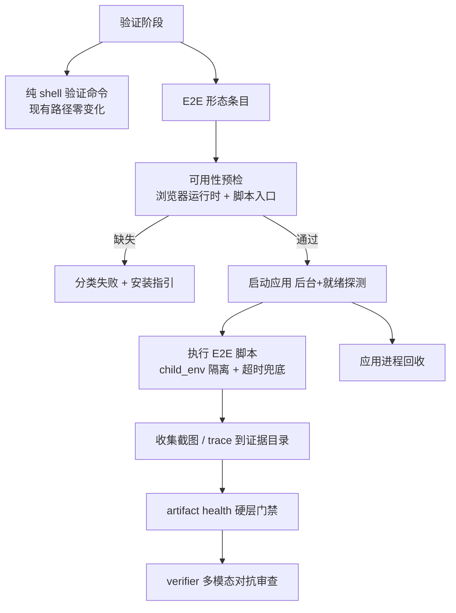

# PRD: 浏览器 E2E 验证工具链（UI 类 Issue 的真实页面验证）

> 本 PRD 分两个 altitude，分别服务不同读者，自上而下阅读：
>
> - **Part A · 人审层 (Review Layer)** — 需求方 / 验收人读这部分，决定"该不该做、做得对不对"，并通过风险地图知道**哪些地方必须亲自确认**。Part A 不出现实现机制、文件路径、命令。
> - **Part B · 执行器层 (Build Layer)** — 实现者（人或 Agent）读这部分动手。人只在 Part A 风险地图**点名处**下钻审查，其余默认交执行器 + 自动门禁。

---

# Part A · 人审层 (Review Layer)

## 1. Introduction & Goals

### Problem Statement

keda 的验证与 review 环节对"改了后端逻辑、跑测试能证明"的任务已经很扎实：配置化验证命令、独立 verifier、Realistic Validation 证据门禁。但 UI 类任务——改一个页面组件、调一个交互流程、修一个前端 bug——的验证目前是整个链路最弱的一环：

- 配置的验证命令是纯 shell 字符串：虽然可以 shell out 到自建的 E2E 入口（本仓即有 `just e2e` + `tests/playwright-e2e/`，见 `docs/ai-standards/testing.md:106-182`），但 runner 并未把"浏览器 E2E"作为**一等验证形态**提供——没有可用性预检、没有子进程环境隔离约定、产出的多模态产物也没有默认的证据通道；前端构建通过不等于页面没坏。
- verifier 虽然能多模态读截图，但截图从哪来？现在要么靠实现 agent 自己补采（closeout 视觉证据补采路径），要么靠 verifier 自由发挥——**没有一个官方支持的、把"真实运行的应用"变成证据的通道**。同类项目（autonomous-dev-team 的 Review Agent）已经把"E2E 浏览器验证"作为合并前的标准动作。
- 结果是：UI 类 Issue 的证据质量依赖 agent 自觉，"假绿"风险集中在人最不容易肉眼兜底的改动面上。

### Interpretation (解读回显)

我理解为：给验证与证据体系补上**浏览器这一执行环境的官方支持**，让 UI 类 Issue 的验证和证据走与后端任务同等的"真实入口 + 机读门禁"标准。具体边界：

- 是：verification 阶段可以配置"启动应用 + 无头浏览器执行 E2E 脚本 + 产出截图/trace 证据"的验证命令形态；E2E 产出的多模态产物无缝进入现有 RV 证据与 artifact 健全性门禁（mime / min_size / key_claim 硬层）；验证脚本是声明式产物，进证据脚本目录，不进代码 diff。
- 不是：不给 keda 本体引入通用浏览器自动化平台或测试框架二选一的绑定（用什么断言风格由仓库自己的 E2E 脚本决定）；不改既有验证命令的语义；不为非 UI 任务增加任何验证负担。

### What The User Gets

提交一个 UI 类 Issue（改页面、调交互、修前端 bug），跑完 keda 流程后，PR 里附带的验证证据不再是"lint 过了 + 一张来历不明的截图"，而是：真实启动的应用、浏览器里走通关键路径的截图序列或 trace 文件、以及机器可验的产物健全性门禁记录。review 人看证据就知道"页面真的被打开并操作过"，而不是"agent 说它应该是对的"。

### Measurable Objectives

- UI 类 Issue 的 RV 证据可以包含浏览器 E2E 产出的截图 / trace，且通过现有 artifact 健全性硬卡点（mime、尺寸、key_claim）。
- E2E 验证命令复跑（`validation.reexecute_commands = true`）能稳定复现相同证据产物结构。
- 非 UI Issue 的验证耗时与行为零变化。

---

## 2. Human Review Map (介入与风险地图)

本节决定注意力如何分配：哪些改动**必须人工确认**，哪些交给**执行器 + 自动门禁**。默认按架构层定介入档，再用风险因子上调或下调。**两次人类触点**模型：前置一次（批准 §1 解读 + 本表 oracle）、终点一次（读 §9 证据包）。

**命中的人审项**：

- ③ 安全 / 信任边界（E2E 执行意味着 runner 环境要驱动一个真实浏览器进程，验证脚本来自 Issue 产出——脚本的执行边界与环境变量隔离必须人工确认，防止"验证脚本"成为绕过受限提交代理的旁路）
- ④ 对外契约（验证命令形态是对 `.iar.toml` / runner 配置的外部用户可见契约扩展，配置错了用户会拿到难诊断的失败）

**未命中**：

- ①②⑤⑥⑦ 不涉及（不改业务编排规则；无 schema 变化；无资金；无不可逆数据操作；浏览器实例生命周期由验证命令自身管理，不涉及 keda 侧并发原语——最坏情况是端口占用导致验证失败，可观测、可重试）
- 最坏自检：浏览器进程失控（内存泄漏 / 僵尸进程）最坏拖慢 runner 机器——现有 `timeout_seconds` / `inactivity_timeout_seconds` 超时击杀机制覆盖子进程树，可留作未命中。

| 改动点 | 架构层 | 风险 | 介入方式 | 证据 / Oracle（指向 §7.6 oracle 块的 rv-id） |
|---|---|---|---|---|
| E2E 验证命令的执行边界与进程隔离 | infrastructure | 高 | 人工确认（高证据负担） | rv-1, rv-2（详见 §7.6） |
| 验证命令配置契约（新形态声明 + 错误诊断） | api | 高 | 人工确认（高证据负担） | rv-3（详见 §7.6） |
| E2E 产物接入 artifact 健全性门禁 | core | 中 | 执行器+门禁 | rv-4（详见 §7.6） |
| runner 运行环境的浏览器可用性保障 | infrastructure | 中 | 执行器+门禁 | rv-5（详见 §7.6） |

**如何证明它生效（真实入口，白话）**：

- 在带前端的真实仓库提交一个 UI 类 Issue 走完整 runner 流程：PR 的 RV 证据里能看到浏览器真实打开页面并操作留下的截图 / trace，证据通过健全性门禁；把页面故意改坏再跑一轮，E2E 验证变红、runner 拒绝放行。

**数据库结构评审（schema 变化时必填）**：

- 本次无数据库结构变化。

---

## 3. Usage And Impact After Implementation

### 终端用户（运营者 / 配置 runner 的人）

- 在 `.iar.toml` 的验证命令配置里新增一种声明形态：声明"这是浏览器 E2E 验证"并指定脚本入口；配置错误（缺浏览器、端口冲突、脚本路径不存在）会得到指向明确原因的失败诊断，而不是裸的非零退出码。

### 终端用户（Issue 提交人 / PR review 人）

- UI 类 Issue 的 PR 证据包中出现 E2E 产物（截图 / trace），可点开查验；verifier 的结论引用这些产物。

### 开发者 / Developer

- 既有验证命令（shell 形态）写法完全不变；E2E 形态是增量可选项。给验证脚本写测试的人把脚本放在证据脚本目录（与现有 RV 脚本同一归宿），复跑机制自动纳入。

### Impact On Existing Behavior

- 未声明 E2E 形态的仓库与 Issue：验证行为、耗时、证据结构零变化。
- 新增可选配置默认关闭；不开即完全回到现状路径。

---

## 4. Requirement Shape

- Actor: 配置 runner 的运营者（声明 E2E 验证）；验证与 verifier 阶段（执行与审查证据）。
- Trigger: 验证阶段执行到声明为浏览器 E2E 形态的验证命令；RV oracle 的 `evidence_files` 声明了浏览器类产物。
- Expected behavior: runner 以受控方式启动应用与无头浏览器、执行脚本、收集产物进证据、产物过健全性门禁；失败给出可诊断的错误分类。
- Scope boundary: 不做可视化 E2E 编辑器或录像回放 UI；不替代 verifier 的对抗性判断（E2E 证据是输入，verifier 仍是审查主体）；不承诺所有前端框架——只要仓库能用自己的脚本把应用跑起来并驱动浏览器即可。

---

# Part B · 执行器层 (Build Layer)

> 以下供实现者（人或 Agent）使用。人只在 Part A 风险地图点名处下钻审查；其余默认交执行器 + 自动门禁。

## 5. Repository Context And Architecture Fit

- Existing path:
  - 验证命令执行：`src/backend/core/use_cases/agent_runner_validation.py`（RV 物化与证据门禁）、`src/backend/core/use_cases/agent_runner_feedback.py`（验证输出摘要）
  - 验证命令配置：`src/backend/core/shared/models/agent_runner.py`（`verification_commands` 元组、`pre_commit_verification_command`）
  - 产物健全性：`validate_evidence_artifact` 硬层（stat / ffprobe / file --mime，实现在 `src/backend/core/use_cases/agent_runner_structured_evidence.py`）、`validation.artifact_health_enabled` 开关、`expected_artifacts` 的 ArtifactSpec
  - 证据脚本目录约定：`tasks/evidence/<prd-stem>/scripts/`（标准见 `docs/guides/prd-standard.md`）
  - 子进程环境隔离：`src/backend/infrastructure/child_env.py`
  - 已有 E2E 基础设施（本 PRD 自举试点的现成执行基础）：`tests/playwright-e2e/`（独立 Playwright 包，`@playwright/test ^1.50.0`）与单命令入口 `just e2e`（自动启停 backend + admin/public 前端、已在运行的服务直接复用；见 `docs/ai-standards/testing.md:106-182`）
  - 前端应用：`frontend-admin/`、`frontend-public/`（`iar console` 服务的两个 UI，可作 E2E 的第一个真实验证对象）
- Reuse candidates: `IProcessRunner` 超时击杀、`child_env` 的环境变量隔离、artifact health 两层设计（硬层 ArtifactSpec + 软层 key_claim）、证据复跑缓存键机制、`just e2e` 的应用启停编排与 `tests/playwright-e2e` 的 stack-control / session 夹具。
- Architecture pattern to preserve: 验证命令的"配置声明 → 子进程执行 → 证据收集 → 门禁"管线不变；E2E 只是在命令形态与产物种类上扩展，不另起第二条验证管线。
- Frontend impact: `No frontend impact`——`frontend-admin` / `frontend-public` 本身是被验证对象而非改动对象，本 PRD 不改任何前端代码。
- Existing PRD relationship:
  - `tasks/pending/P1-FEAT-20260930-225000-daemon-crash-reconciliation-session-resume.md`：`independent`（不同子系统，可并行）。
  - `tasks/archive/P0-BUG-20260930-145323-logging-config-robustness.md`：`independent`（已归档交付；原文写作 `tasks/pending/…`，已按实际位置更正）。
  - `tasks/archive/P1-FEAT-20260628-041733-realistic-validation-independent-verifier-gate.md`：交付 FR-11a 产物健全性硬卡点，是本 PRD 的直接复用基础（`depends on` 其运行时行为，但其已交付，无排队依赖）。
  - `tasks/archive/P1-BUG-20260707-173613-runner-frontend-visual-evidence-gate.md`：已交付的前端改动**强制视觉证据 fail-closed 门禁**，其自述边界为**「只拦不产」**——只要求前端 diff 附带视觉文件，不负责产出证据。本 PRD 补的正是「产出」那一侧（真实启动应用 + 浏览器执行 + 收证据），二者互补、不重复。
- Redundancy risks: 不得在 keda 内自建一套 E2E 断言框架（Playwright 等工具是仓库自己的 devDependency，keda 只负责"提供执行环境 + 收证据 + 门禁"）；不得让 verifier 与 E2E 脚本两套断言并行生效——E2E 脚本的断言结果作为证据输入 verifier，verifier 做对抗审查。与已交付的 `runner-frontend-visual-evidence-gate`（只拦不产）保持互补：本 PRD **不重做**该 fail-closed 门禁，只新增证据产出通道并复用现有 artifact health 硬层。

---

## 6. Recommendation

### Recommended Approach

- Approach: 扩展验证命令配置模型新增"浏览器 E2E"命令形态（带脚本入口与产物声明的结构化配置项），执行层用现有子进程管线驱动（应用启动脚本 + 无头浏览器脚本 + 产物收集），产物走现有 `evidence_files` + artifact health 通道。
- Why this is the best fit: E2E 验证 = "一种更复杂的验证命令 + 一类新的证据产物"，两者在现有架构里都有明确扩展点；不新增阶段、不改编排。
- Rejected redundancy: 不在 keda 里捆绑 Playwright 依赖（由目标仓库自行声明，keda 只检测可用性并给出安装指引）；不建独立"E2E 服务"或常驻浏览器池。

### Proposed Solution Summary (实现机制)

1. **配置形态**：`verification_commands` 现有的纯 shell 字符串之外，新增结构化条目（kind 标记 + 脚本入口 + 应用启动方式 + 产物声明）。纯字符串条目行为零变化；两类条目在同一队列按序执行。
2. **执行管线**：复用 `IProcessRunner` + `child_env` 隔离。执行顺序：应用启动脚本（后台，health 探测或固定等待）→ E2E 脚本（驱动浏览器，产出截图 / trace 到证据目录）→ 应用进程回收（超时由现有 `timeout_seconds` / `inactivity_timeout_seconds` 兜底击杀进程树）。环境变量白名单经 `child_env` 过滤，验证脚本拿不到 runner 凭据。
3. **产物门禁**：E2E 产物路径写进 RV oracle 的 `evidence_files`；ArtifactSpec 声明 mime（image/png、video/webm、application/zip-trace 等）+ min_size + key_claim，复用 `validate_evidence_artifact` 硬层；复跑缓存键含脚本内容摘要（证据脚本目录约定自动满足）。
4. **可用性检测与诊断**：验证开始前探测浏览器运行时与脚本入口存在性，缺失时给出分类失败（含安装指引文案），不跑一半才发现环境不对。
5. **首个真实验证对象**：`frontend-admin` / `frontend-public` 的关键页面（登录、issue 列表）作为 keda 自仓的 E2E 试点，用本 PRD 交付的能力验证本 PRD（自举）。

### Alternatives Considered (Only When Useful)

- Alternative: keda 内置 Playwright 依赖并自带一套 E2E runner DSL。
- Why not chosen: 断言风格与浏览器工具是目标仓库的自主选择，keda 绑定具体框架会把"验证基础设施"做成"验证框架绑架"；且 keda 验证的仓库栈多样（本仓有 Vite 前端，其他被管仓库未必）。

---

## 7. Implementation Guide

> This section is a living implementation guide based on current repository analysis. If implementation discovers additional affected files, hidden dependencies, edge cases, or a better path, update this PRD before proceeding.

### 7.1 Core Logic

控制流：验证阶段遍历 `verification_commands` → 纯 shell 条目走现有路径（零变化）→ E2E 条目：可用性预检（浏览器运行时 + 脚本入口）→ 启动应用（后台 + 就绪探测）→ 执行 E2E 脚本（受控环境变量、超时兜底）→ 收集产物到证据目录 → 回收应用进程 → 产物路径回写 RV `evidence_files` → artifact health 硬层门禁 → verifier 以多模态读取产物并按 key_claim 对抗审查。失败路径：预检失败 / 脚本非零 / 门禁失败均进入现有验证失败分类（`VERIFICATION_FAILED` 可恢复通道）。

### 7.2 Change Impact Tree

```text
.
├── Backend (shared models — 配置契约)
│   └── src/backend/core/shared/models/agent_runner.py [修改]
│   【总结】verification_commands 支持 E2E 形态结构化条目（kind / script / app_start / artifacts）
│
├── Backend (core — 验证管线)
│   └── src/backend/core/use_cases/
│       ├── agent_runner_validation.py         [修改]
│       【总结】E2E 条目分发到浏览器执行路径；产物路径并入 evidence_files 门禁
│       ├── agent_runner_e2e_browser.py        [新增]
│       【总结】可用性预检、应用启停管理、产物收集、分类失败诊断
│       └── agent_runner_failure.py            [修改]
│       【总结】E2E 失败子分类（环境缺失 / 脚本失败 / 产物不健全）的渲染
│
├── Backend (infrastructure — 进程与环境)
│   └── src/backend/infrastructure/child_env.py [修改]
│   【总结】E2E 子进程环境变量白名单（浏览器所需 display / home 缓存目录等）
│
├── Backend (api — 配置解析)
│   └── (验证命令配置解析入口)                  [修改]
│   【总结】.iar.toml 中新形态的解析与错误诊断文案
│
├── 仓库自身试点
│   └── tasks/evidence/<prd-stem>/scripts/     [新增]
│   【总结】frontend-admin / frontend-public 关键页面的 E2E 试点脚本（进证据脚本目录，不进代码 diff）
│
└── Frontend (frontend-admin / frontend-public)   # No frontend impact
    被验证对象，本 PRD 不修改其代码。
```

### 7.3 Executor Drift Guard

| Check | Command | Expected Result | If It Fails, Inspect First |
|---|---|---|---|
| 既有 shell 验证命令路径未变 | `grep -rn "verification_commands" src/backend --include="*.py" -l` | 消费方仍集中于现有管线文件，无新旁路 | 是否有人绕过验证管线自行跑命令 |
| E2E 逻辑未泄漏进 verifier prompt 生成 | `grep -rn "playwright\|chromium" src/backend --include="*.py" -l` | 仅 E2E 执行与预检文件命中 | verifier prompt 是否被塞入框架绑定 |
| 环境隔离未被绕过 | `grep -rn "child_env" src/backend/core/use_cases/agent_runner_e2e_browser.py` | E2E 子进程创建点引用 child_env | 是否裸用 Popen / subprocess 直启浏览器 |
| 试点脚本不进代码 diff | `git status --porcelain frontend-admin frontend-public` | 无前端代码改动 | 是否有人把"修前端"误当"修验证" |

### 7.4 Flow Or Architecture Diagram



### 7.5 ER Diagram

- `本次无数据库结构变化。`

### 7.6 Realistic Validation Plan (Oracle 块)

```yaml
- id: rv-1
  behavior: UI 类 Issue 的验证证据包含真实浏览器操作产物
  real_entry: "对本仓 frontend-admin 关键页面提交 UI 修改 Issue，跑完整 run-once 流程后查看 RV 证据目录"
  expected: "证据目录含 E2E 产出的截图（image/png）与 trace，且对应 evidence_files 条目通过 artifact health 硬层"
  mock_boundary: "应用与浏览器必须真实启动（headless）；GitHub 侧可注入"
  negative_control: "E2E 脚本中把断言目标改错（种入错误选择器），验证变红且失败分类为脚本失败"
  expected_fail: "证据目录无浏览器产物，或产物为 0 字节 / mime 错配被硬层拦截"
  test_layer: e2e
  required_for_acceptance: true

- id: rv-2
  behavior: E2E 验证子进程拿不到 runner 凭据，且失控进程被超时回收
  real_entry: "E2E 脚本内打印可见环境变量清单并故意挂起，观察 runner 行为"
  expected: "可见环境变量不含 runner 凭据（经 child_env 白名单过滤）；挂起脚本与后台应用均被超时击杀，runner 不留僵尸进程"
  mock_boundary: "凭据存在性用真实环境断言；超时用真实时钟"
  negative_control: "把敏感变量名加入白名单的对照分支应被代码评审门禁拦截（评审检查项）"
  expected_fail: "凭据泄漏进 E2E 环境或出现未回收的浏览器/应用进程"
  test_layer: integration
  required_for_acceptance: true

- id: rv-3
  behavior: 配置错误得到可诊断的分类失败而非裸退出码
  real_entry: "分别配置缺浏览器运行时、脚本路径不存在、产物 mime 声明错误三种错误 .iar.toml 后跑 run-once"
  expected: "三种错误各自得到指向原因的失败分类与修复指引（含安装/配置建议），Issue comment 可读"
  mock_boundary: "配置解析必须真；浏览器安装状态用真实环境"
  negative_control: "正确配置的对照 Issue 正常走通，不误报"
  expected_fail: "所有配置错误坍缩为同一个不可区分的 VERIFICATION_FAILED"
  test_layer: integration
  required_for_acceptance: true

- id: rv-4
  behavior: E2E 产物复跑稳定且缓存键随脚本内容变化
  real_entry: "validation.reexecute_commands=true 下连续两次复跑同一 RV；随后修改 E2E 脚本再复跑"
  expected: "前两次复跑产出同结构证据且命中缓存；脚本修改后缓存失效、真实重跑"
  mock_boundary: "应用与浏览器真实运行"
  negative_control: "不修改脚本只改注释也会改变内容摘要，缓存应失效（证明键算的是内容不是路径）"
  expected_fail: "复跑跳过真实执行或缓存键不随脚本内容变化"
  test_layer: integration
  required_for_acceptance: true

- id: rv-5
  behavior: 非 UI Issue 与未配置 E2E 的仓库验证行为零变化
  real_entry: "跑既有纯后端 Issue 的验证阶段"
  expected: "验证耗时与证据结构与交付前一致；回归测试全绿"
  mock_boundary: "全真"
  negative_control: "无（回归性质）"
  expected_fail: "任何既有验证路径的行为漂移"
  test_layer: integration
  required_for_acceptance: true
```

Failure triage:
- rv-1 跑挂，先查应用就绪探测的端口 / URL 约定是否与被测前端 dev server 实际行为一致，别急着改浏览器脚本。
- rv-2 跑挂，先查 `child_env` 白名单条目，再查进程树击杀是否覆盖了浏览器派生的子进程。

### 7.7 Low-Fidelity Prototype

- `No low-fidelity prototype required for this PRD.`（无 keda 自身 UI 面；被验证的前端页面即真实原型。）

### 7.8 Interactive Prototype Change Log

- `No interactive prototype file changes in this PRD.`

### 7.9 External Validation

| Topic | Source | Checked On | Relevant Finding | Impact On Recommendation |
|---|---|---|---|---|
| 同类项目 review 环节的浏览器验证 | zxkane/autonomous-dev-team（经 ruanyf/weekly issue #9268） | 2026-09-30 | Review Agent 含 E2E 浏览器验证，通过后自动合并 | 确认浏览器验证是该品类 review 环节的既有水位，本 PRD 对齐 |
| 拉取类 Agent 的浏览器证据实践 | Pullfrog AI（经 InfoQ 报道，2026-05） | 2026-09-30 | 自带无头浏览器工具跑 E2E、截图并迭代 UI，运行于仓库自身 CI 环境 | 印证"runner 提供执行环境 + 证据收集、不绑定断言框架"的分工可行 |
| 产物健全性既有设计 | keda 自仓 `docs/guides/prd-standard.md`（FR-11a 两层设计） | 2026-09-30 | ArtifactSpec 硬层（mime/min_size/ffprobe）+ verifier 软层 key_claim 已落地 | E2E 产物直接复用该门禁，无需新建标准 |

---

## 8. Delivery Dependencies

- Group: browser-e2e-verification
- Depends on groups:
  - none
- Depends on tasks/issues:
  - none
- Gate type: none
- Notes: 与 `P1-FEAT-20260930-225000-daemon-crash-reconciliation-session-resume` 均为 `independent`；`P0-BUG-20260930-145323-logging-config-robustness` 亦为 `independent`，且已归档交付（`tasks/archive/`，非 pending）。运行时依赖已交付的 FR-11a artifact health 通道（已在代码中，无排队关系）。

---

## 9. Acceptance Checklist

### Acceptance Evidence Package（证据包 · 按风险地图排序，终点人审入口）

1. **高风险 oracle 结果**（置顶）：rv-1 / rv-2 / rv-3 全链证据（真实 UI Issue 跑通 + 凭据隔离断言输出 + 三种配置错误诊断实录）。
2. **风险地图对账 Predicted → Reconciled**：[实现中有无未预测到的高风险面被触发，如何处理]
3. **对抗自检**：[对"未命中"项与关键断言的反方检查结论——特别是"验证脚本能否触碰 git 写操作"的边界测试结论]
4. **对锁定契约的 diff**：既有纯 shell `verification_commands` 条目的解析与执行行为逐字段不变。
5. **低风险门禁结果（折叠）**：`just lint --full`、`just test`、架构检查。

### Human-Confirmed (来自 Part A 风险地图)

- [ ] E2E 子进程执行边界（环境变量白名单、进程树回收）已人工确认，rv-2 证据通过
- [ ] 新验证命令配置契约（形态声明与错误诊断）已人工确认，rv-3 证据通过

### Architecture Acceptance

- [ ] E2E 执行位于 core use case + infrastructure 进程层，未新建第二条验证管线
- [ ] keda 本体无 Playwright 等浏览器框架硬依赖（可用性预检 + 指引模式）

### Dependency Acceptance

- [ ] E2E 子进程环境变量经 `child_env` 白名单过滤（rv-2 通过即为证据）
- [ ] 证据脚本位于 `tasks/evidence/<prd-stem>/scripts/`，不进代码 diff（标准约定回归）

### Behavior Acceptance

- [ ] rv-1 / rv-3 / rv-4 / rv-5 通过
- [ ] 纯 shell 验证命令既有行为逐字段回归通过

### Frontend Acceptance

- [ ] `No frontend impact` —— 记录理由：前端应用为被验证对象，代码零改动；试点脚本进证据脚本目录。

### Documentation Acceptance

- [ ] `docs/guides/` 验证配置说明补 E2E 形态章节（声明方式、产物声明、常见失败分类）
- [ ] `docs/guides/prd-standard.md` RV 编写指引补浏览器类产物的 ArtifactSpec 示例

### Validation Acceptance

- [ ] `just test` passes
- [ ] rv-1 的真实入口（真实 UI Issue 全流程）人工走查通过
- [ ] `grep -rn "playwright\|chromium" src/backend --include="*.py" -l` 确认无框架绑定泄漏
- [ ] `git status --porcelain frontend-admin frontend-public` 确认前端零改动

### Delivery Readiness

- [ ] Recommended approach fully implemented; no unapproved parallel abstraction introduced
- [ ] No open regression or rollout blocker remains

---

## 10. Functional Requirements

- FR-1: 验证命令配置支持声明浏览器 E2E 形态的条目（脚本入口、应用启动方式、产物声明），与既有纯 shell 条目共存且按序执行。
- FR-2: E2E 执行前进行可用性预检（浏览器运行时、脚本入口存在性），缺失时产生带修复指引的分类失败。
- FR-3: 应用进程由 runner 以受控方式启动与回收；E2E 脚本与被测应用的失控均被现有超时机制兜底击杀，不留僵尸进程。
- FR-4: E2E 子进程环境变量经白名单过滤，runner 凭据不可见。
- FR-5: E2E 产物（截图 / trace 等）进入 RV `evidence_files`，通过 artifact health 硬层门禁；产物声明支持 mime / min_size / key_claim。
- FR-6: E2E 脚本存放于证据脚本目录，纳入复跑缓存键（内容摘要）；复跑语义与既有 RV 一致。
- FR-7: 未使用 E2E 形态的配置与 Issue，验证行为与交付前完全一致。

---

## 11. Non-Goals

- keda 内置或绑定任何 E2E 断言框架 / 浏览器自动化 DSL。
- 常驻浏览器实例池或跨 Issue 复用的浏览器服务。
- E2E 结果的可视化回放 UI、录像管理界面。
- verifier 判断逻辑的改动（E2E 产物只是其输入之一）。
- 非 GitHub 托管仓库的适配。

---

## 12. Risks And Follow-Ups

- 浏览器运行时在各平台 / CI 容器的安装差异较大，首次落地的预检与指引可能覆盖不全——按失败分类逐步补指引文案，遗留项进 follow-up。**（2026-10-05 决定：首版只承诺本机（本仓 macOS）预检 + 指引，CI 容器覆盖列 follow-up——见 D-08。）**
- 应用"就绪探测"对非常规启动方式（非 HTTP 服务的前端、多进程应用）可能不适用——首版仅承诺 HTTP 可探测形态，其他形态回退为固定等待 + 脚本自测。
- E2E 引入的验证耗时增长对 autopilot 吞吐的影响——E2E 仅在声明处生效，可观测后按仓库自行取舍。
- **Roadmap 登记与排序（2026-10-05 决定：已登记）**：已在本 PRD 登记进 `ROADMAP.md` 的 M3「Verification And Review」小节与「当前 pending PRD 与交付顺序」小节中，并顺带把已被移入 `tasks/hold/` 的 Tauri 项标注为暂缓；daemon sibling `P1-FEAT-20260930-225000` 亦已于 2026-10-05 登记进同一 M3 与 pending 视图。
- **与既有 E2E 资产的分工（2026-10-05 决定：复用）**：本仓已有 `just e2e` + `tests/playwright-e2e/`（见 §5）。决定**复用**该入口与夹具，不另起并行启停编排；试点脚本与产物接入其现有启停与就绪探测，产出走 RV `evidence_files` + artifact health。不得与其并行维护两套不一致的应用启停逻辑。（见 D-06）

---

## 13. Decision Log

| # | 决策问题 | 选择 | 放弃的方案 | 理由 |
|---|---|---|---|---|
| D-01 | 浏览器工具归属 | keda 只提供执行环境 + 证据门禁，框架由目标仓库自选 | keda 内置 Playwright 并自带 DSL | 被管仓库栈多样；绑定框架会把基础设施做成绑架 |
| D-02 | 产物标准 | 复用 FR-11a artifact health 两层设计 | 为浏览器证据新建独立标准 | 硬层机检 + verifier 软层已验证有效，新标准必然漂移 |
| D-03 | E2E 失败语义 | 进入现有 VERIFICATION_FAILED 可恢复通道 | 新增独立的"E2E 失败"终态 | recovery loop 已有修复-重试闭环，UI 失败同样适用；少一种状态机分支 |
| D-04 | 首个试点对象 | keda 自仓 frontend-admin / frontend-public | 外部仓库 | 自举验证（吃自己的狗粮），且证据脚本天然有归宿 |
| D-05 | 与已交付视觉证据门禁的边界 | 确认「拦 vs 产」互补，不合并 | 合并为一个端到端 PRD | 现有门禁已交付且只做 fail-closed 拦截；本 PRD 净新增产出通道，职责正交，合并会重开已交付范围 |
| D-06 | 本仓试点的 E2E 执行编排 | 复用既有 `just e2e` + `tests/playwright-e2e/` | 另起独立编排 | 已有单命令启停与就绪探测；复用避免两套不一致的启停逻辑 |
| D-07 | FR-11a 未收敛 follow-up | 不作前置，本 PRD 独立推进 | 先补齐 follow-up 再开工 | 硬层已在代码中可用，follow-up 属增强而非阻塞；绑入会扩大本 PRD 范围 |
| D-08 | 浏览器运行时覆盖范围 | 首版只承诺本机 + 指引，CI 容器列 follow-up | 首版必须覆盖 CI 容器 | 现有 E2E 资产均为本机形态，无容器证据；承诺容器覆盖会引入无法验证的验收项 |
| D-09 | 自举试点的验收定位 | 保留为验收证据，实现时必须真实跑通 | 降级为 follow-up | 自举是 D-04 核心价值，rv-1 依赖真实 UI Issue；降级会让产出侧缺端到端证据 |

---

## 14. Change Log

### 校正过期引用、补齐相关 PRD 与既有 E2E 资产

- Type: doc
- Before: §1 把"验证命令是纯 shell 字符串"绝对化为"跑不了浏览器 E2E"，与仓内既有的 `just e2e` + `tests/playwright-e2e/` 事实不符；§5 / §8 把已归档的 `P0-BUG-20260930-145323-logging-config-robustness` 写作 `tasks/pending/…`；§5 未点名交付 FR-11a 的归档 PRD、未声明与已交付的前端视觉证据 fail-closed 门禁（自述"只拦不产"）的关系、未记录仓内既有 E2E 资产；全文无 §14 Change Log。
- After: §1 改为"shell 可 shell out 到自建 E2E，但 runner 未把浏览器 E2E 作为一等形态（无预检 / 无环境隔离约定 / 无默认证据通道）"；§5 与 §8 将 P0 更正为 `tasks/archive/` 并注明已交付；§5 点名交付 FR-11a 的 `P1-FEAT-20260628-041733-realistic-validation-independent-verifier-gate.md`，补入 `P1-BUG-20260707-173613-runner-frontend-visual-evidence-gate.md`（只拦不产，与本 PRD 互补）及 `just e2e` / `tests/playwright-e2e/` 既有资产；§12 新增 Roadmap 登记与既有 E2E 资产分工两条待决；补 §14 本条。
- Reason: 与本仓当前代码、交付态与文档对齐，避免执行器按过期路径找依赖、或把已交付的视觉证据门禁误判为重复范围；Roadmap 顺序视图已知过期，按规范只在 PRD 内记录、不改路线。
- Impact: 仅文案与引用校正；不改产品目标、§10 FR、§7.6 RV oracle、§11 Non-Goals 或任何验收判据；不新增 / 删除交付依赖，不改变交付顺序。
- Review: 逐条核对代码符号与文档位置（`agent_runner_structured_evidence.py:81,1037,149`、`agent_runner_settings.py:394`、`agent_runner.py:432,436`、`docs/ai-standards/testing.md:106-182`、`ROADMAP.md` 的路线更新 / pending 顺序视图 / M3 小节、`tasks/archive/` 实况）后自审通过。

### 回填 decision board 的 7 项决定（2026-10-05）

- Type: doc
- Before: §12 的「Roadmap 登记与排序」「与既有 E2E 资产的分工」两条为待决；浏览器运行时覆盖范围未定；§13 无对应决策记录。
- After: §12 三条改为已决（Roadmap 已登记 M3、复用既有 E2E 资产、首版只承诺本机覆盖）；§13 新增 D-05 … D-09；同步更新 `ROADMAP.md`（本 PRD 登记进 M3「Verification And Review」与 pending 顺序视图，并标注 Tauri 项已移入 `tasks/hold/`），并更正 sibling daemon PRD 的过期 P0 引用。追加：daemon sibling `P1-FEAT-20260930-225000` 也登记进 Roadmap M3 与 pending 视图。
- Reason: 用户经 decision board 就 7 项待决全部选择推荐项（Q1–Q7 = A），按结论回写；随后按用户指示补登记 daemon sibling。
- Review: 读取 `.iar/decisions/answers.json`（`selection.answers` 全为 `A`、`changed` 为空）后回写；daemon sibling 已按用户后续指示登记，§12 与本条同步更新。
