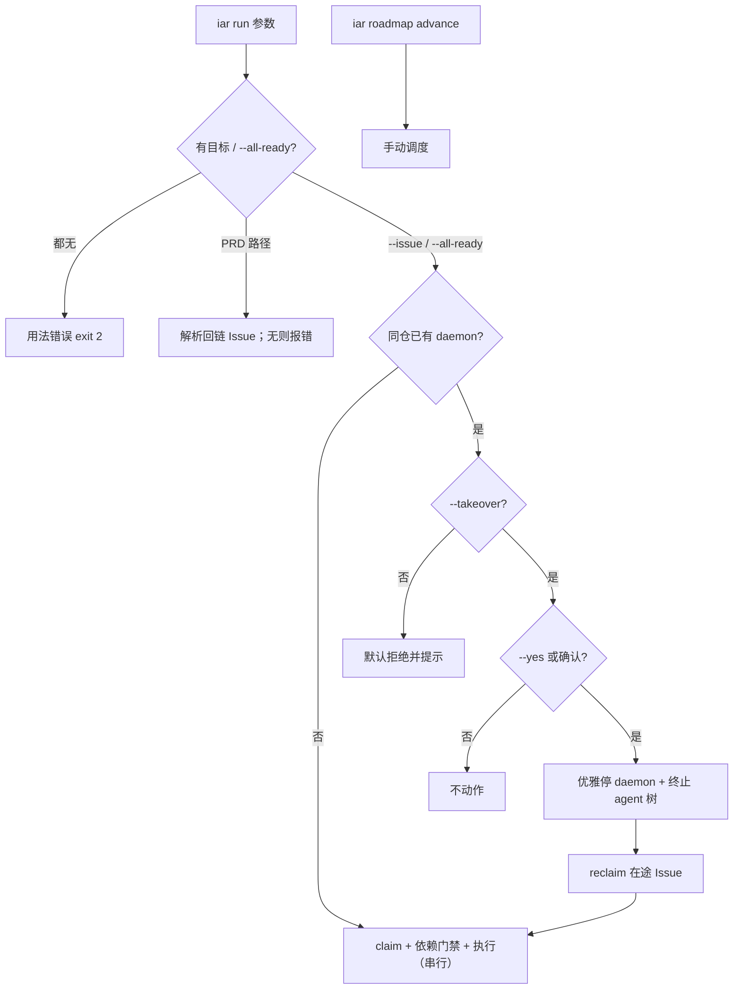

# PRD: iar run / daemon 的执行语义与控制面（目标必填 + 显式接管）

> ✅ **交付前置**：无，可立即开工。
> 结构化声明见 §8 Delivery Dependencies，**那里是唯一事实源**。

> ⬜ **验收状态**：未开工。
> 本行是 §9 Acceptance Checklist 的投影，**那里是唯一事实源**。

本文档分两个高度：**Part A（§1–§4）** 给人看，用来确认"要不要做、做成什么样"，不含实现机制、文件路径、命令与排期信息；**Part B（§5–§13）** 给执行者看，包含机制、改动树与验证命令。人只在 Part A 点名处下钻。

## Feature Overview (功能一览)

> 本块是第 10 节 Functional Requirements 的通俗投影，不是第二事实来源；行为验收以第 1 节的行为样例表为准。

- **定向执行是唯一默认形态**（FR-1）：`iar run` **必须带目标**——`--issue <N>` 或位置参数传 PRD 路径（解析其回链 Issue）。不再"默认按优先级捞 top-N"。
- **旧行为显式化**（FR-2）：想"处理整个 ready 队列"必须显式 `--all-ready`（等价旧的 `iar run` 行为），不隐式发生。
- **run / daemon 职责边界**（FR-3）：`iar run` = 手动单次、串行、**不调度、不碰合并、不涉及 autopilot**；`iar daemon` = 无人值守、**唯一**运行 autopilot 调度的地方。
- **默认互斥（拒绝）**（FR-4）：同仓库已有 daemon 时，`iar run` 默认**拒绝并提示**，不再无保护地抢同一 ready 队列。
- **显式接管**（FR-5）：`iar run --takeover` 在强警告 + 二次确认下**优雅停掉 daemon 并接管**——因为手动 run 代表"人已介入"；复用既有进程监管与 reclaim 收尾在途 Issue。
- **手动调度走既有入口**（FR-6）：需要手动补位时用既有 `iar roadmap advance`，而不是给 `iar run` 加 autopilot 旗标。
- **迁移而非报废**（FR-7）：旧"不带目标=捞队列"用法改为显式 `--all-ready`，**行为等价**；默认行为变更（无目标报用法错误）在 release note 标注——这是本 PRD 唯一的有意 breaking change。
- **明确不做**（§11）：不给 run 加 `--autopilot`、不默认接管、不用 SIGKILL 停 daemon、不给 run 加并行、不改 HTTP/前端。

---

# Part A · 人审层 (Review Layer)

## 1. Introduction & Goals

### Problem Statement

keda 有 `iar run`（单次轮询）与 `iar daemon`（常驻循环）两个入口，但它们的语义边界、目标选择与互斥都不清晰，运维者难以按意图驱动。四个具体症状（均已在仓库中确认）：

1. **`iar run` 没有"目标"概念**。现状不传参数就是"按优先级捞 ready 队列"，无法表达"就跑这一个 PRD/Issue"。Console 有「开始此 PRD」，CLI 没有对应物。
2. **run 与 daemon 的互斥缺失**。daemon 启动前有单实例锁（`cli_parsed_commands/runner.py` 的 `acquire_daemon_locks`），而 `iar run` 没有任何互斥，同仓手动 run 会和 daemon 抢同一 ready 队列——这是双 claim 的来源。单纯"拒绝"又让人手动介入很别扭（还得自己去停 daemon）。
3. **autopilot 曾被误当作 run 的开关**。autopilot 的调度阶段只存在于 daemon（`run_agent_daemon.py:165`），"自动合并"属于 review 侧（`process_merge_queue`）。给 run 加 autopilot 会横跨两个阶段；"手动触发一次调度"其实已有专门入口 `iar roadmap advance`。

后果：运维者既无法"手动只跑某条 PRD"，也无法在 daemon 在跑时顺畅地手动接管；run 的"自动捞一批"行为还与 daemon 的职责重叠。run/daemon/autopilot 的关系需要一份契约。

### Interpretation (解读回显)

下表每一行都会**原样**变成第 7.6 节的验收 oracle，所以改表里的一格就等于改验收标准——值得逐行读。

| 验证方式 | 输入 / 操作 | 期望观察到的结果 |
|---|---|---|
| 👀 人审 + 自动验证 | `iar run --issue <N> --repo-id <repo>` | 只处理该 Issue；队列中更高优先级的其他 ready Issue 不被处理 |
| 👀 人审 + 自动验证 | `iar run tasks/pending/<foo>.md`（该 PRD 已有回链 Issue） | 解析到该 Issue 并定向执行；不处理其他 ready Issue |
| 🤖 自动验证 | `iar run tasks/pending/<bar>.md`（该 PRD 尚无 Issue） | 报错并提示先 `iar issue create`；不静默改去捞队列 |
| 🤖 自动验证 | `iar run`（无目标、无 `--all-ready`） | 用法错误（退出码 2），提示 `--issue` / PRD 路径 / `--all-ready` |
| 🤖 自动验证 | `iar run --all-ready` | 等价旧 `iar run` 行为（处理 ready 队列，串行至 `max_issues`） |
| 👀 人审 + 自动验证 | daemon 正持有该仓时执行 `iar run --issue <N>`（不带 `--takeover`） | **拒绝并提示**（停 daemon 的方式或 `--takeover`），绝不与 daemon 同时 claim |
| 👀 人审 + 自动验证 | daemon 正持有该仓时执行 `iar run --issue <N> --takeover --yes` | 优雅停掉 daemon（非 SIGKILL）→ 无孤儿 agent → 在途 Issue 被 reclaim → 再执行 |
| 🤖 自动验证 | `iar run --help` | **不存在** `--autopilot`；存在 `--issue` / `--all-ready` / `--takeover`（与 `--yes`） |
| 🤖 自动验证 | 需要手动补位时执行 `iar roadmap advance --repo <id> [--dry-run]` | 触发一次调度（晋升 pending PRD），与 run 解耦 |
| 🤖 自动验证 | `iar run` 的并行能力 | 保持串行（无 `--concurrency`）；并行仍只由 `iar daemon --concurrency` 提供 |

**我默默定了这些**（未提问、直接选定的）：

- **目标必填**：`--issue N` 或 PRD 路径；PRD 路径解析其头部回链的 Issue（`- GitHub Issue:`），没有则报错要求先 `iar issue create`。
- **旧"捞队列"行为改为显式 `--all-ready`**，行为等价，避免破坏既有脚本/文档/Console（一处改名迁移）。
- **不给 `iar run` 加 `--autopilot`**：调度归 daemon，手动调度归 `iar roadmap advance`，合并归 review。
- **`--takeover` 是显式 opt-in**：默认拒绝，只有显式传该旗标才停 daemon 接管；接管必须优雅停并终止 agent 树，停后先 reclaim 再执行。
- **不给 `iar run` 加 `--concurrency`**：并行继续是 daemon 的职责。

**我理解为不做**：

- 不给 `iar run` 加 `--autopilot`。
- 不保留"无目标即隐式捞队列"：要旧行为请显式 `--all-ready`。
- 不默认接管：`iar run` 绝不静默杀掉一个正在干活的 daemon。
- 不用 `SIGKILL` 作为接管首手段（会留孤儿 agent）。
- 不给 `iar run` 加 `--concurrency` / 手动并行多 Issue；不做 run 托管化。
- 不改 HTTP API 与前端；不改数据库结构。

**可证伪的读法**：本 PRD 读作"把 run/daemon 的**执行语义与控制面**对齐：run 目标必填、旧捞队列改为显式 `--all-ready`、与 daemon 默认互斥且可显式接管，autopilot 留在 daemon 侧"；**不**读作"让 run 变成 daemon"、**不**读作"run 默认杀 daemon"、**不**读作"给 run 加 autopilot"。关键边界：目标必填是唯一有意 breaking（有 `--all-ready` 迁移路径并写 release note）；默认拒绝；接管只在 `--takeover` 下发生且必须优雅停。

### What The User Gets

运维者用 `iar run --issue <N>`（或 `iar run <prd 路径>`）精确地手动跑某一条 PRD；要跑整批时显式 `iar run --all-ready`。daemon 在跑时，`iar run` 默认安全拒绝并给出下一步；当人确实要手动接管时，`iar run --takeover` 会在强警告与确认后优雅停掉 daemon、清理在途 Issue、再执行。需要手动补位时用 `iar roadmap advance`。

### Measurable Objectives

- `iar run --issue <N>` 只处理指定 Issue；`iar run <prd>` 能解析回链 Issue；PRD 无 Issue 时报错；无目标且无 `--all-ready` 时用法错误（有可判别用例）。
- `iar run --all-ready` 行为与改动前的 `iar run` 等价（黄金对照）。
- 同仓存在 daemon 时，默认 `iar run` 拒绝且不产生双 claim；`--takeover` 下 daemon 被优雅停、无孤儿 agent、在途 Issue 被 reclaim，随后 run 正常执行（有可判别用例）。
- `iar run --help` 出现 `--issue`/`--all-ready`/`--takeover` 但**不**出现 `--autopilot`。
- CLI 表面变更同步进 `docs/` 与 `iar-operator` skill；release note 标注 breaking change；守卫测试通过。

## 2. Human Review Map (介入与风险地图)

**决策一：接受"目标必填 + `--all-ready` 兜旧行为"这一有意 breaking change 吗？** `iar run`（无目标）从"捞 ready 队列"改为"用法错误"；旧行为迁到显式 `--all-ready`（行为等价）。这是对外 CLI 契约变更，需 release note；Console「开始此 PRD」路径需改为传 `--issue`。**请确认：** 接受"目标必填 + `--all-ready` 迁移"，还是要求"目标仍可选（保留隐式捞队列）"（零破坏但语义不纯）？**验收：** 无目标无 `--all-ready` 返回用法错误；`--all-ready` 与旧 `iar run` 行为等价（黄金对照）。

**决策二：接受"默认拒绝 + 显式 `--takeover`"这套互斥形态吗（而非排队、也非默认自动接管）？** 接管是**破坏性**动作——会**中断 daemon 当前所有在途 Issue**（不只你指定的那个），随后被 reclaim 重跑；停止必须优雅（不能 SIGKILL，否则留孤儿 agent）。**请确认：** 接受该形态，还是要求"排队等锁"或"默认自动接管"？**验收：** 默认 run 在 daemon 在跑时被拒绝；`--takeover --yes` 后 daemon 优雅退出、无孤儿 agent、在途 Issue 被 reclaim、目标 run 执行。

**决策三：`iar run` 是否保持串行、不引入并行？** 并行归 daemon（`--concurrency`），run 保持串行才能让"单次=手动一件事"成立。**请确认：** 接受"run 保持串行，并行归 daemon"，还是要求"给 run 也加 `--concurrency`"？**验收：** `iar run --help` 无 `--concurrency`；`iar daemon --concurrency N` 仍可并行。

**自动门禁，不需要逐项人工审阅**：目标必填的用法错误测试、PRD 路径→Issue 解析（有/无 Issue 两态）测试、`--all-ready` 与旧行为黄金对照、候选收窄与依赖门禁交互测试、默认拒绝的可断言测试（双 claim 不可能）、接管后"daemon 已退 + 无孤儿 agent + 在途 Issue reclaim 完成"的集成测试、`--autopilot` 不存在于 run 的断言、`--help` 快照、`just lint` 与 `just test all`、文档与 `iar-operator` skill 同步守卫。

**本次明确不涉及**：不给 run 加 autopilot 或并行；不改 review 侧合并；不做 run 的托管化；不改 HTTP API 与前端；**本次无数据库结构变化**。

## 3. Usage And Impact After Implementation

### [运维者 / Operator]

- 手动只跑一条：`iar run --issue <N> --repo-id <repo>`，或 `iar run tasks/pending/<foo>.md`（PRD 需已有回链 Issue）。
- 要跑整批（等同旧的 `iar run`）：`iar run --all-ready`（显式）。
- daemon 在跑、但你想手动接管：`iar run --issue <N> --takeover`（强警告 + 确认；`--yes` 免确认）。**注意：会中断 daemon 当前所有在途 Issue，它们会被 reclaim 后重跑。**
- 更常规做法：`iar registry stop --repo-id <id>` 停 daemon，或让 daemon 处理。
- 手动补位（晋升 pending PRD）：`iar roadmap advance --repo <id> [--dry-run]`。

### [调用方 / 外部 Agent]

- `iar-operator` skill 新增不变量：run 目标必填；`--all-ready` 才捞队列；默认与 daemon 互斥；`--takeover` 是显式破坏性接管（需确认）；autopilot 不属于 run；并行只在 daemon。

### [开发者 / Developer]

- 遵循"run = 手动单次定向执行、daemon = 无人值守调度"的边界；手动触发调度复用 `iar roadmap advance`。
- 接管路径复用既有进程监管与 reclaim，不另造并行通路；目标解析复用既有 PRD↔Issue 回链。

### [这条链路本身]

- 无前端 / HTTP 变化。

### Impact On Existing Behavior

- **有意 breaking**：`iar run`（无目标）从"捞 ready 队列"变为用法错误；迁移到 `iar run --all-ready`（行为等价），release note 标注。
- 新增 `--issue` / `--all-ready` / `--takeover` / `--yes`；`--autopilot` 不引入。
- 默认行为另有一处变化：同仓已有 daemon 时手动 run 从"无保护"变为"拒绝"。
- 不含目标、不含 `--all-ready` 且无 daemon 的旧调用：唯一需要改脚本的点。

## 4. Requirement Shape

- **actor**：运维者 / 外部 agent（手动驱动 run）；daemon（常驻）。
- **trigger**：`iar run` 携带目标（`--issue` / PRD 路径），或显式 `--all-ready`；可叠加 `--takeover`。
- **expected behavior**：按目标定向执行（或 `--all-ready` 走旧行为）；默认与 daemon 互斥（拒绝）；显式 `--takeover` 时优雅停 daemon + reclaim 在途 Issue 后接管；不涉及 autopilot。
- **explicit scope boundary**：目标必填（breaking，有迁移路径）；run 保持串行；无 `--autopilot`；接管非默认、非 SIGKILL；不改前端。

# Part B · 执行器层 (Build Layer)

## 5. Repository Context And Architecture Fit

### 现有相关模块

- CLI 定义：`src/backend/api/cli_typer_runner.py`（`run_command` 等）。
- dispatch：`src/backend/api/cli_parsed_commands/runner.py`（`run_run_command`；`run_daemon_command`）。
- 单次执行：`src/backend/core/use_cases/run_agent_repositories_once.py`。
- daemon 循环与调度阶段：`src/backend/core/use_cases/run_agent_daemon.py`。
- 单实例锁：`src/backend/core/use_cases/daemon_single_instance.py`（`DaemonAlreadyRunningError`）。
- 托管进程监管：`src/backend/infrastructure/console/process_supervisor.py`（`start_new_session=True`；停止 SIGTERM → 等 `timeout_seconds` → SIGKILL）。
- 子进程整树清理：`src/backend/infrastructure/process_runner.py`（`_terminate_process_tree` / `killpg`）。
- 在途 reclaim：`src/backend/core/use_cases/agent_runner_reclaim.py`（`reclaim_stale_running_issues`；配置默认 `daemon.reclaim_stale_running = True`）。
- PRD↔Issue 回链：PRD 头部的 `- GitHub Issue:` 行；由 `create_issue_from_prd` 回写、roadmap/`attach_prd_lifecycle_overrides` 读取——目标解析复用这条既有链路。
- 手动调度入口：`iar roadmap advance`（`cli_typer_roadmap.py` → `advance_roadmap_queue`）。
- ready 发现：`agent_runner_orchestration_runtime.py::run_once`。

### 现有架构模式

- CLI 层只做参数与 dispatch，业务在 `core/`。
- daemon 的单实例锁是既有的"同仓单点"机制；run 目前无锁。
- 托管进程走 `process_supervisor`；手动 `iar daemon` 是未托管进程。
- autopilot 调度是 daemon 的阶段；手动调度已有 `iar roadmap advance`；合并是 review 的阶段。

### ownership 与依赖边界

- 新旗标解析与 dispatch 归 `api/`；目标解析、候选收窄、互斥、接管的编排归 `core/`。
- 接管复用既有 `process_supervisor` / `daemon_single_instance` / `reclaim_stale_running_issues`；目标解析复用既有 PRD↔Issue 回链，不另造。

### frontend impact

`No frontend impact`（但 Console「开始此 PRD」的后端 spawn 路径需改为传 `--issue`，属后端行为，不算前端改动）。

### 相关 PRD

- 无重复 pending PRD。相关历史：`tasks/archive/P1-FEAT-20260703-105330-roadmap-continuous-scheduling.md`、`tasks/archive/P1-FEAT-20260703-105322-autopilot-merge-queue-fast-profile.md`。
- 配套 PRD：`P1-FEAT-20261005-161632-dependent-prd-sequencing-strategy.md`——独立，soft（见 §8）。

## 6. Recommendation

### Recommended Approach

1. **目标必填**：`iar run` 接受 `--issue <N>` 或位置参数 PRD 路径；PRD 路径解析其回链 Issue，无 Issue 则报错提示 `iar issue create`。无目标：用法错误（退出码 2）。
2. **旧行为显式化**：`iar run --all-ready` 保留"处理 ready 队列"（与旧 `iar run` 行为等价）。
3. **不新增 `--autopilot`**：调度只在 daemon；手动调度用 `iar roadmap advance`。
4. **默认互斥 = 拒绝**：同仓已有 daemon 时直接失败并提示（停 daemon 的方式 / `--takeover`）。
5. **显式接管**：`iar run --takeover` 在强警告 + 确认（`--yes` 免确认）下：优雅停 daemon → 终止其 agent 子进程 → `reclaim_stale_running_issues` → 执行定向 run。
6. Console「开始此 PRD」路径改为传 `--issue`。
7. 文档化边界与迁移；release note 标注 breaking；同步 `iar-operator` skill。

### 为什么最贴合现有架构

- 目标解析复用既有 PRD↔Issue 回链；候选收窄复用 `run_once` 的发现结构。
- 手动调度复用 `advance_roadmap_queue`；接管复用 supervisor / 锁 / `reclaim_stale_running_issues`——不引入新机制。
- `--all-ready` 让旧行为行为等价，把 breaking 面缩到"无目标"这一种调用。

### rationale：拒绝冗余抽象

- 不加 `iar run --autopilot`：跨阶段、与 `iar roadmap advance` 冗余。
- 不给 run 加并行：并行归 daemon。
- 接管不新造进程管理：复用 supervisor 与 killpg 整树清理。

### Proposed Solution Summary (实现机制)

核心机制：**目标必填（`--issue` / PRD 路径）+ `--all-ready` 兜旧行为 + 默认拒绝 + 显式 `--takeover`**。

- 输入来源：运维者显式传目标/旗标；系统只消费显式输入，不推断。
- 接入点：`cli_typer_runner.py::run_command`（新增位置参数 + `--issue`/`--all-ready`/`--takeover`/`--yes`）→ `cli_parsed_commands/runner.py::run_run_command` → `run_once`。
- 状态/输出变化：run 必须定向；无目标报用法错误；`--all-ready` 等价旧行为；接管后 daemon 退出、在途 Issue 被 reclaim。
- 刻意避免的复杂度：不给 run 加 autopilot/并发；不默认接管；不用 SIGKILL 首手段；不新增存储；不改前端。

### Alternatives Considered

- **目标仍可选**：零破坏但 run 仍能"自动捞一批"，语义不纯；拒绝（改为 `--all-ready` 显式）。
- **默认自动接管 / 排队**：破坏面大 / 长时间阻塞；拒绝为默认。
- **给 run 加 `--autopilot` / `--concurrency`**：跨阶段 / 与 daemon 重叠；拒绝。

## 7. Implementation Guide

> This section is a living implementation guide based on current repository analysis. If implementation discovers additional affected files, hidden dependencies, edge cases, or a better path, update this PRD before proceeding.

### Core Logic

1. **解析与目标解析**：`run_command` 加位置参数（PRD 路径）与 `--issue` / `--all-ready` / `--takeover` / `--yes`。目标为 PRD 路径时，复用既有 PRD↔Issue 回链解析出 Issue 号；无 Issue → 报错并提示 `iar issue create`。既无目标也无 `--all-ready` → 用法错误（退出码 2）。
2. **候选收窄**：`run_once` 在目标 Issue 存在时只保留该 Issue（仍走依赖门禁与 claim）；`--all-ready` 时保持旧"按优先级捞队列"行为。
3. **默认互斥**：`run_run_command` 检测同仓 daemon（既有单实例锁/进程登记）。无 `--takeover` → 拒绝并提示。
4. **接管**（仅 `--takeover`）：警告（点名目标仓库、daemon、将中断的在途 Issue 数量）→（非 `--yes` 时确认）→ 优雅停（托管走 `process_supervisor`；未托管按 PID）→ 终止 agent 树（复用 `_terminate_process_tree`；必要时为 daemon 补 SIGTERM 优雅停机钩子）→ `reclaim_stale_running_issues` → 执行定向 run。
5. **Console 路径**：把「开始此 PRD」的后端 spawn 从通用 `iar run` 改为 `iar run --issue <N>`。
6. **手动调度**：不新增 run 侧入口；用既有 `iar roadmap advance`。

### Change Impact Tree

```
api/
  cli_typer_runner.py                    # run_command：位置参数 + --issue/--all-ready/--takeover/--yes（不新增 --autopilot）
  cli_parsed_commands/runner.py          # dispatch：目标解析、默认拒绝、接管编排
  routes/agent_runner*.py                # Console「开始此 PRD」spawn 改传 --issue（后端路径）
core/
  use_cases/run_agent_repositories_once.py # 接收目标/ --all-ready
  use_cases/agent_runner_orchestration_runtime.py # run_once 候选收窄 / --all-ready
  use_cases/daemon_single_instance.py    # 复用锁做互斥/获取 daemon 身份
  use_cases/agent_runner_reclaim.py      # 接管后 reclaim 在途 Issue（复用）
  use_cases/create_issue_from_prd.py     # （复用）PRD↔Issue 回链解析
  use_cases/run_agent_daemon.py          # （可能）补优雅停机钩子：SIGTERM 时终止在途 agent 树
infrastructure/
  console/process_supervisor.py          # 复用停止路径
  process_runner.py                      # 复用 _terminate_process_tree
docs/guides/agent-runner.md              # run 目标必填 / --all-ready / 接管 / 边界
src/backend/engines/agent_runner/templates/skills/iar-operator/SKILL.md  # 新旗标同步
tests/
  test_cli*.py / test_run*.py            # 新增/扩展（含迁移等价）
```

### Risk Classification Register

| change point | tier | decisive dimension/override | intervention | oracle/gate |
|---|---|---|---|---|
| 目标必填（breaking） | R2 | 外部契约/迁移 | release note + 迁移等价 oracle | rv-1、rv-5 |
| PRD 路径→Issue 解析 | R2 | 正确性 | 自动门禁 + 两态用例 | rv-7 |
| `--all-ready` 等价旧行为 | R2 | 兼容 | 黄金对照 | rv-5 |
| 默认拒绝（互斥） | R2 | 并发（双 claim） | 自动门禁 + 负控制 | rv-2 |
| 显式接管（优雅停 + reclaim） | R3 | 破坏性（中断在途、孤儿 agent） | 人工确认 + 强警告 + 负控制 | rv-6 |
| 不引入 run 侧 autopilot | R1 | 职责边界 | 静态断言（--help） | rv-4 |
| 无 daemon 的定向 run 零回归 | R1 | 兼容 | 黄金对照 | rv-1 |

### Executor Drift Guard

- run 入口分散在 typer 适配层与 dispatch 两处，务必 `rg -n "run_command|run_run_command" src/backend/api` 确认两处都改。
- 复用点用 `rg -n "process_supervisor|acquire_daemon_locks|reclaim_stale_running_issues|_terminate_process_tree|GitHub Issue:" src/` 定位，避免复制 PRD↔Issue 解析或锁逻辑。
- 确认 daemon 优雅停机钩子：`rg -n "SIGTERM|signal\.|finally" src/backend/core/use_cases/run_agent_daemon.py`；缺则补齐。
- Console spawn 路径：`rg -n "iar run|run_agent|spawn" src/backend/api/routes src/backend/api/agent_runner_views` 定位并改传 `--issue`。

### Flow / Architecture Diagram



### Realistic Validation Plan

```yaml
- id: rv-1
  behavior: iar run --issue N 只处理指定 Issue，不处理其他 ready Issue
  reviewer: human
  real_entry: 真实 CLI + 一个含多条 ready Issue 的测试仓
  expected: 仅 N 被处理，其他 ready Issue 状态不变
  mock_boundary: GitHub 可 mock；run 入口真实
  tier: R2
  test_layer: integration
  required_for_acceptance: true
  presentation: tasks/evidence/<prd-stem>/rv-1-targeted-run.png + open 命令
  critical_value_source: 被处理 Issue 集合
  must_cross: CLI 解析 -> 目标解析 -> 候选收窄
  forbidden_bypasses: 不得靠调整优先级伪造
  fresh_state_probe: 运行后查询各 Issue 状态
  final_tree_evidence: 绑定最终实现树
- id: rv-5
  behavior: 迁移等价——无目标无 --all-ready 报用法错误；--all-ready 行为等价改动前的 iar run
  reviewer: verifier
  real_entry: 真实 CLI
  expected: 无目标退出码 2 并给提示；--all-ready 与旧行为逐字节等价
  mock_boundary: none
  tier: R2
  test_layer: integration
  required_for_acceptance: true
  critical_value_source: 退出码与被处理 Issue 集合
  must_cross: CLI 解析 -> 旧路径
  forbidden_bypasses: 不得让无目标静默回退成捞队列
  fresh_state_probe: 运行后对照
  final_tree_evidence: 绑定最终实现树
- id: rv-7
  behavior: iar run <prd> 解析回链 Issue；PRD 无 Issue 时报错
  reviewer: verifier
  real_entry: 真实 CLI + 两个 PRD（一个有回链、一个没有）
  expected: 有回链则定向执行；无回链则报错并提示 iar issue create
  mock_boundary: GitHub mock 可
  tier: R2
  test_layer: integration
  required_for_acceptance: true
  critical_value_source: 目标 Issue 与退出行为
  must_cross: CLI 解析 -> PRD↔Issue 回链
  forbidden_bypasses: 不得在无 Issue 时静默改为捞队列
  fresh_state_probe: 运行后查询
  final_tree_evidence: 绑定最终实现树
- id: rv-2
  behavior: 同仓 daemon 在跑且无 --takeover 时，默认拒绝且不双 claim
  reviewer: verifier
  real_entry: 真实 daemon（或等价锁持有）+ 手动 run
  expected: run 失败并提示；无同 Issue 双 claim
  mock_boundary: 锁可真实；daemon 可最小化
  tier: R2
  test_layer: integration
  required_for_acceptance: true
  critical_value_source: run 退出行为与 claim 记录
  must_cross: 锁判定 -> run 行为
  forbidden_bypasses: 不得靠文档约定
  fresh_state_probe: 锁持有期运行观察
  final_tree_evidence: 绑定最终实现树
  negative_control: 无 daemon 时 run 应正常执行
  expected_fail: 无 daemon 不得被拒绝
- id: rv-6
  behavior: iar run --takeover 优雅停 daemon 并接管：无孤儿 agent，在途 Issue 被 reclaim，目标 run 执行
  reviewer: human
  real_entry: 真实 daemon（含一个在途 Issue）+ iar run --issue N --takeover --yes
  expected: daemon 优雅退出（未 SIGKILL）；无孤儿 agent 进程；在途 Issue 回 agent/ready 并复用 worktree；目标 run 正常执行
  mock_boundary: none
  tier: R3
  test_layer: integration
  required_for_acceptance: true
  presentation: tasks/evidence/<prd-stem>/rv-6-takeover.png + open 命令
  critical_value_source: 进程状态（daemon 退出、无孤儿 agent）与在途 Issue 的 label
  must_cross: 警告/确认 -> 优雅停 -> agent 树终止 -> reclaim -> 执行
  forbidden_bypasses: 不得用 SIGKILL 伪装成功；不得跳过 reclaim
  fresh_state_probe: 接管后从新终端 ps 检查无残留 agent，查询 Issue label
  final_tree_evidence: 绑定最终实现树
  negative_control: 不带 --takeover 时不得停 daemon
  expected_fail: 默认拒绝不应停 daemon
- id: rv-4
  behavior: autopilot 不属于 run：iar run --help 有目标旗标与 --takeover 但无 --autopilot
  reviewer: verifier
  real_entry: 真实 CLI
  expected: run 帮助无 --autopilot；roadmap advance 可触发一次调度
  mock_boundary: none
  tier: R1
  test_layer: unit
  required_for_acceptance: true
```

### ER Diagram

本次无数据模型/持久状态变化，无 ER 图。

### Low-Fidelity Prototype

不适用：`No frontend impact`。

### Interactive Prototype Change Log

无。

## 8. Delivery Dependencies

### Delivery Dependencies

- Depends on tasks/issues:
  - none
- Gate type: none
- Sequence: via-main
- Notes: 与 `P1-FEAT-20261005-161632-dependent-prd-sequencing-strategy.md` 为 soft 关系——两者可独立交付；本 PRD 不含 autopilot 旗标，接管与目标解析复用既有 `reclaim_stale_running`（默认开启）、进程监管与 PRD↔Issue 回链，不依赖 PRD-1。

## 9. Acceptance Checklist

### 9.1 人读呈递区（Human Review Surface）

| 观察结果（plain language） | 呈递物 | ~10 秒自检 |
|---|---|---|
| `iar run --issue N` 只跑指定 Issue | `tasks/evidence/<prd-stem>/rv-1-targeted-run.png` + `open` 命令 | 看其他 ready Issue 是否原封不动 |
| `iar run <prd>` 解析到回链 Issue；无 Issue 报错 | `tasks/evidence/<prd-stem>/rv-7-prd-resolve.png` | 看目标 Issue 与报错文案 |
| daemon 在跑时默认 run 被拒绝（不停 daemon） | `tasks/evidence/<prd-stem>/rv-2-reject.png` | 看提示里给了停止命令与 --takeover |
| `--takeover --yes` 后 daemon 优雅退出、无孤儿 agent、在途 Issue 被 reclaim | `tasks/evidence/<prd-stem>/rv-6-takeover.png` | 看 `ps` 无残留 agent、Issue label 回 ready |

**刻意不展示（`reviewer: verifier`）**：rv-3、rv-4、rv-5 为可执行/静态断言组，除非失败否则不进人审。

### 9.2 Acceptance Evidence Package

先 R3/human-confirm（rv-6），再 R2（rv-1、rv-2、rv-7、rv-5），再折叠 R1（rv-4）与 CLI 契约 diff 与 release note。

### Behavior Acceptance

- [ ] rv-1：目标定向只处理指定 Issue（证据：rv-1 报告）。
- [ ] rv-7：PRD 路径解析回链 Issue / 无 Issue 报错（证据：rv-7 报告）。
- [ ] rv-5：无目标报用法错误；`--all-ready` 与旧行为等价（证据：rv-5 报告 + 黄金对照）。
- [ ] rv-2：daemon 在跑时默认 run 拒绝、无双 claim（证据：rv-2 报告）。
- [ ] rv-6：`--takeover` 优雅停 daemon、无孤儿 agent、在途 Issue 被 reclaim（证据：rv-6 报告）。
- [ ] rv-4：run 不含 autopilot（证据：rv-4 报告）。

### Validation Acceptance

- [ ] 至少一个 oracle 走真实 CLI + 真实进程入口（rv-1/rv-6）。
- [ ] 全部 negative control 按 §7.6 记录并可复现（如 rv-2/rv-6 的默认拒绝不停 daemon、rv-5 的无目标不得静默捞队列）。
- [ ] CLI 表面变更同步 `docs/` 与 `iar-operator` skill；release note 标注目标必填的 breaking change（守卫测试）。

### Delivery Readiness

- [ ] `just lint` 与 `just test all` 通过。
- [ ] 完成 Final Reconciliation（§13）。
- [ ] 交付信息（或 PR 呈递）逐字携带 §9.1 人读内容，并附 migration 说明（旧 `iar run` → `iar run --all-ready`）。

### Human-Confirmed (来自 Part A 风险地图)

- [ ] 决策一：接受"目标必填 + `--all-ready` 迁移"这一有意 breaking change。
- [ ] 决策二：接受"默认拒绝 + 显式 `--takeover`（强警告 + 二次确认，会中断在途 Issue）"。
- [ ] 决策三：接受 run 保持串行、并行归 daemon。
- [ ] 确认 §9.1 人读呈递区已审阅。

## 10. Functional Requirements

- **FR-1**：`iar run` 目标必填——`--issue <N>` 或位置参数 PRD 路径（解析回链 Issue；无 Issue 报错并提示 `iar issue create`）；无目标即用法错误。
- **FR-2**：`iar run --all-ready` 显式保留"处理 ready 队列"（与旧 `iar run` 行为等价）；不隐式发生。
- **FR-3**：run 与 daemon 职责边界显式化并文档化——run = 手动单次、串行、不调度/不合并不涉及 autopilot；daemon = 无人值守、唯一运行 autopilot 调度的地方。
- **FR-4**：同仓已有 daemon 时，默认 `iar run` 拒绝并提示（停止命令 / `--takeover`），不双 claim。
- **FR-5**：`iar run --takeover` 在强警告（点名将中断的在途 Issue 数量）与确认（`--yes` 免确认）下，优雅停 daemon、终止其 agent 子进程、reclaim 在途 Issue，再执行。
- **FR-6**：手动调度复用既有 `iar roadmap advance`，不给 `iar run` 新增 autopilot 旗标。
- **FR-7**：目标必填是有意 breaking change，但以 `--all-ready` 提供行为等价迁移并在 release note 标注；Console「开始此 PRD」路径改传 `--issue`。

## 11. Non-Goals

- **不给 `iar run` 加 `--autopilot`**。
- **不保留"无目标即隐式捞队列"**（改由 `--all-ready` 显式）。
- **不默认接管**；**不用 SIGKILL 首手段停 daemon**。
- 不给 `iar run` 加 `--concurrency` / 手动并行。
- 不做 run 的托管化；不改 review 侧自动合并；不改 HTTP API 与前端；不新增数据库表。

## 12. Risks And Follow-Ups

- **目标必填是 breaking change**：旧脚本/文档/Console 需迁移到 `--all-ready` 或 `--issue`；必须 release note + 文档更新 + Console 路径改造，否则会静默失败。这是本 PRD 唯一有意破坏点。
- **接管的破坏性**：`--takeover` 会中断 daemon 当前所有在途 Issue（不只目标）；强警告 + 确认 + release note；reclaim 后会重跑但有重复开销。
- **优雅停依赖 daemon 终止子进程**：daemon 当前无显式 SIGTERM 钩子，本 PRD 需补一个；否则接管留孤儿 agent，列为交付门禁验证。
- **未托管 daemon**：只能按锁/PID 定位，需与托管路径一致"优雅停 + reclaim"。

## 13. Decision Log

| ID | 决策问题 | Chosen | Rejected | Rationale |
|---|---|---|---|---|
| D-01 | run 目标 | 必填（--issue / PRD 路径） | 目标可选（隐式捞队列） | run = 手动定向；捞队列交 daemon / --all-ready |
| D-02 | 旧捞队列行为 | 显式 --all-ready（等价迁移） | 直接删除 | 缩小 breaking 面、可迁移 |
| D-03 | run 是否引入 autopilot | 不引入（归 daemon） | run --autopilot | 跨阶段语义；与 roadmap advance 冗余 |
| D-04 | run 与 daemon 互斥 | 默认拒绝 + 显式 --takeover | 排队 / 默认自动接管 | 默认零破坏；接管显式可恢复 |
| D-05 | 接管停机方式 | 优雅停（SIGTERM，超时升级），并终止 agent 树 | SIGKILL 首手段 | 避免孤儿 agent 与 worktree 撞车 |
| D-06 | run 并行 | 保持串行 | 加 concurrency | 并行归 daemon |
| D-07 | 手动调度入口 | 复用 iar roadmap advance | 新造 run 侧入口 | 已有入口 |

## Change Log

### 2026-10-05 · §2 人审决策经决策板确认
- Type: doc
- Before: §2 的互斥形态（默认拒绝 + `--takeover`）、run 串行两项为待确认；目标必填另行确认。
- After: 经决策板（`.iar/decisions/prd-sequencing-control/`）由人确认，**全部采纳推荐 A**（互斥=默认拒绝+显式 `--takeover`；run 串行；目标必填 + `--all-ready`），无改动、无备注。
- Reason: 开工前锁定设计取舍。
- Impact: 仅记录确认；PRD 的 Human-Confirmed 验收项仍留待交付后勾选。
- Review: 人已确认（board answers.json，2026-10-05）。

### 2026-10-05 · 目标必填 + --all-ready 迁移
- Type: behavior (breaking)
- Before: `iar run` 无目标时"按优先级捞 ready 队列"；`--issue`/PRD 目标可选。
- After: 目标必填（`--issue` / PRD 路径）；旧行为迁到显式 `iar run --all-ready`（等价）。
- Reason: run 应表达"我指定跑什么"；捞队列职责属 daemon；显式化避免误触发。
- Impact: FR-1/FR-2/FR-7 调整；Human Review Map 增至 3 项决策；oracle 新增 rv-7、rv-5 改述为迁移等价；新增 breaking-change 风险与 release note 门禁。
- Review: 用户已确认（board Q11 → A）。

### 2026-10-05 · 新增显式接管（--takeover）
- Type: behavior
- Before: 互斥仅"拒绝或排队"；无接管路径。
- After: 默认拒绝；新增 `iar run --takeover`（强警告 + `--yes`）优雅停 daemon、终止 agent 子进程、reclaim 在途 Issue 后接管。
- Reason: 手动 run 代表"人已介入"；接管语义成立，但破坏性动作须显式 opt-in。
- Impact: 新增 FR-5；Human Review Map 决策二；oracle rv-6（R3）；风险新增接管破坏性与优雅停依赖。
- Review: 用户已确认（board Q5 → A）。

### 2026-10-05 · 移除 run 侧 autopilot（收敛范围）
- Type: behavior
- Before: 计划给 `iar run` 新增 `--autopilot`。
- After: 明确不给 run 加 `--autopilot`；调度归 daemon，手动调度复用 `iar roadmap advance`。
- Reason: 跨 review/调度阶段、语义含混；手动调度已有专门入口。
- Impact: 删除原 autopilot FR；Human Review Map 收敛；oracle 重编号。
- Review: 用户已确认移除。

### 初始创建
- Type: doc
- Before: 无本 PRD
- After: 新增"iar run / daemon 执行语义与控制面"PRD
- Impact: 新增 FR-1..FR-7 与 oracle rv-1..rv-7
- Review: 待人工确认（Human-Confirmed 部分开启）
