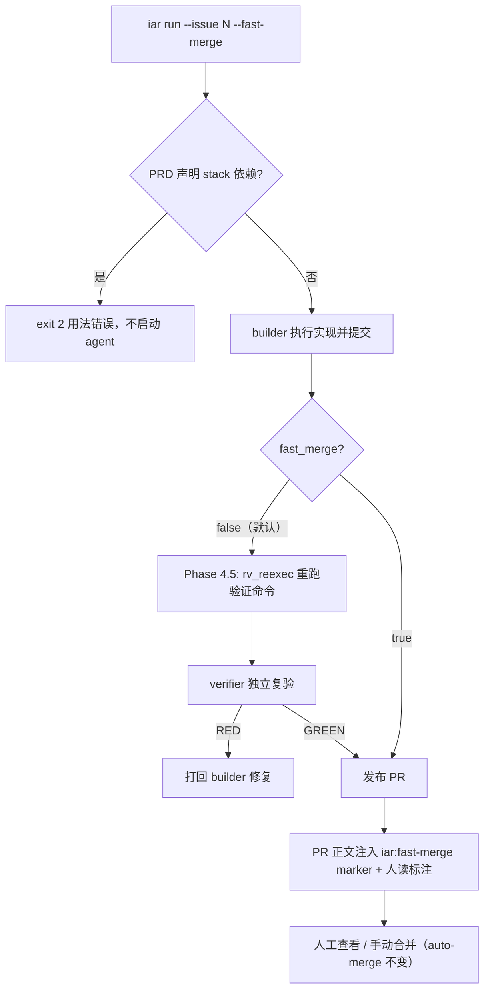

# PRD: iar run 快速合并旗标（--fast-merge，完成即开 PR）

- GitHub Issue: https://github.com/ZataZhang/keda/issues/207

> ⛔ **交付前置**：建议排在 `P1-FEAT-20261005-161633-run-daemon-autopilot-control-surface`（run-daemon 控制面）合并之后开工——两者都改 `iar run` 的命令表面，先合并的那个会重写 `run_command` 的参数区，反序会产生可避免的合并冲突与双重基线。这是交付顺序依赖而非构建依赖：本 PRD 自身可独立构建，但先交付它会导致与控制面分支的冲突性返工。
> 结构化声明见 §8 Delivery Dependencies，**那里是唯一事实源**。

> ⬜ **验收状态**：未开工。
> 本行是 §9 Acceptance Checklist 的投影，**那里是唯一事实源**。

本文分两层：**Part A · 人审层**（§1–4）给人类审阅者看，只含问题、解读回显与需要人拍板的决策；**Part B · 执行器层**（§5–13）给执行 agent 看，含机制、改动树、验证命令与依赖元数据。人审者只在想深挖时才需要进入 Part B。

## Feature Overview (功能一览)

以下是 §10 Functional Requirements 的白话投影，行为验收以 §1 行为样例表为准。

- **`iar run` 新增 `--fast-merge` 一次性旗标**（FR-1）：赶时间时对单个 Issue 发起"完成即开 PR"的快速通道，只影响本次运行，不写任何配置。
- **快速通道跳过全部验证门禁**（FR-2、FR-5）：builder 提交后不再重跑验证命令、不再跑独立 verifier、不等 verifier-passed 标签，直接发布 PR；不加旗标时三层门禁行为与今天完全一致。
- **快速 PR 必须自我声明**（FR-3）：经快速通道开出的 PR 在正文带机器可读标注，写明"本 PR 未过验证门禁，合并前请人工验证"，避免混入正常证据链。
- **stack 依赖链拒绝快速通道**（FR-4）：PRD 声明了 stack 顺序依赖的 Issue 不允许 `--fast-merge`，防止未验证的上游污染下游 fork 基。
- **CLI 表面契约同步**（FR-6）：`--help`、机读 schema、语义退出码同步更新，随包 iar-operator skill 与 docs 同步，避免 agent 侧知识漂移。

# Part A · 人审层 (Review Layer)

## 1. Introduction & Goals

### Problem Statement

用户（IAR 的操作者）在赶时间时希望 Issue 完成后立即拿到 PR 去人工查看、手动合并，但当前的验证门禁没有任何一键跳过的手段。今天的流程是固定的三层：builder 提交代码后先重跑一遍验证命令（失败打回 builder），再跑独立 verifier 复验（`validation.verifier_enabled`，默认开），merge queue 侧还有 `autopilot.require_verifier_pass` 标签门。用户曾经能做的只有改 `.iar.toml` 关掉 `verifier_enabled`——但那会永久关掉对抗复验、影响之后所有 run，而且重跑验证命令（rv_reexec）这一层**根本没有独立开关**。仓库现状事实：`run_agent_execution_loop.py` 的 Phase 4.5 段里 rv_reexec 与 verifier 都是无条件执行的（只受 `verifier_enabled` 一个开关约束），不存在 per-run 的验证旁路。

### Interpretation (解读回显)

#### 行为样例

下表的"行为"列会逐字转为 §7.6 的验收 oracle——**改表中任何一格就是改验收标准**，请直接在表上纠错。

| 验证方式 | 输入 / 操作 | 期望观察到的结果 |
|---|---|---|
| 👀 人审 + 自动验证 | 对一个普通（无依赖）PRD Issue 执行 `iar run --issue 12 --fast-merge` | builder 提交成功后**立即**开出 PR，全程没有 rv_reexec 重跑、没有 verifier 复验阶段；PR 页面可见"快速通道"标注，写明本 PR 未过验证门禁、合并前需人工验证 |
| 🤖 自动验证 | 对同一个 Issue 执行 `iar run --issue 12`（不加旗标） | 行为与今天一致：rv_reexec 重跑验证命令，verifier 复验，RED 时打回 builder 修复，验证绿了才开 PR |
| 🤖 自动验证 | PRD 里声明了 stack 顺序依赖（`iar:depends-on mode=stack`）的 Issue 执行 `--fast-merge` | 命令以用法错误退出（exit 2），给出明确报错，**不开 PR、不执行任何 agent** |
| 🤖 自动验证 | `--fast-merge` 运行中 builder 本身失败（没产出可用提交） | 与今天一样报错结束、不开 PR；快速通道只跳过"验证"，不掩盖执行失败 |
| 🤖 自动验证 | `iar run --help` 与机读 schema | 出现 `--fast-merge` 及其说明；语义退出码契约测试保持绿 |

#### 我默默定了这些

- **只做 CLI 旗标，不加配置项**：不在 `.iar.toml` 加 `validation.fast_mode` 之类持久开关。理由：跳过验证是高风险动作，显式写在命令行比埋在配置里安全，也避免"上次开了忘了关"。要全局默认值的话将来单开 PRD。
- **命名用 `--fast-merge`**：备选 `--no-verify`（语义只覆盖"验证"、容易误以为连合并也变快）被否；`--fast-merge` 同时暗示"快速进入合并阶段"。
- **不做任何自动合并**：快速通道只加速"发布 PR"，`safety.auto_merge`、autopilot 双开关原封不动——合并永远是人工动作。merge queue 的 `require_verifier_pass` 不需要改：快速 PR 没有 verifier-passed 标签，autopilot 开启时它会被队列自然跳过等人工处理，这正是想要的行为。
- **不自动勾 sign-off 清单**：auto sign-off 是 merge queue 在 verifier 绿灯后的行为，快速 PR 没有绿灯，保持人工。
- **标注形式**：PR 正文加 HTML 注释 marker（`<!-- iar:fast-merge ... -->`，机器可解析）+ 一段可见的人读说明。
- **旗标只进 `iar run`**：`iar daemon` 不加。daemon 是无人值守场景，恰恰不该有无人值守地跳过验证。

#### 我理解为不做

- **不做 console 前端开关**：backlog 页不加"快速通道"按钮。CLI 旗标是当下诉求；前端开关应等控制面 PRD（daemon autopilot 控制面）落稳后另行评估。
- **不做"快速但带轻量验证"的中间档**：例如只跑 rv_reexec 跳 verifier、或缩短超时。第一版只有"全跳"与"全不跳"两档，中间档等真实使用反馈。
- **不改 verifier / merge queue 本体**：三套门禁的内部逻辑一行不动，只在外围加旁路。

白话读法：这是给 `iar run` 加一个**单次有效**的快速通道旗标——builder 写完代码提交后直接开 PR，跳过重跑验证、跳过独立 verifier、产生的 PR 带自我声明标记；**不是**给系统加常速档位，**不是**自动合并，**不是**全局配置。凡声明了 stack 依赖的 PRD 一律走不了快速通道。

### What The User Gets

操作者赶时间时，跑一条 `iar run --issue N --fast-merge`，agent 完成实现并提交后 PR 立即出现，PR 上明确标着"未经自动化验证，请人工查看"；操作者自己看代码、跑测试、手动合并。不赶时间的日常运行（无旗标、daemon）完全不受影响，验证门禁照常。

### Measurable Objectives

- 加旗标的 run 从 builder 提交到 PR 发布之间不再出现 rv_reexec / verifier 阶段（run 日志与阶段耗时记录可证）。
- 无旗标的 run 的三层门禁行为与交付前一致（既有验证类测试全绿，无行为漂移）。
- 快速 PR 的正文 marker 可被 `parse_dependency_marker` 同族的 marker 解析稳定识别（负例：普通 PR 无该 marker）。
- stack 声明 + `--fast-merge` 组合以 exit 2 拒绝（机读契约测试覆盖）。

## 2. Human Review Map (介入与风险地图)

### 决策一：快速通道跳过哪些门、跳到哪为止

**建议**：`--fast-merge` 对该次 run 跳过全部三层——重跑验证命令（rv_reexec）、独立 verifier 复验、以及 verifier-passed 标签等待——builder 提交成功后立即走既有发布路径开 PR。**不跳过**的部分同样重要：builder 自身失败照样报错；PR 发布路径、分支命名、PR body 契约全部不变；auto-merge 永不触碰。主要风险是把"验证跳过"误解为"验证消失"——被跳过的验证变成人工合并后的返工风险，因此 PR 必须带自我声明标注，这也是本决策的一部分。请确认这个边界（尤其"全自动跳过、不设中间档"）符合你的预期。

**请确认：** `--fast-merge` 是否就按"一次跳过全部三层验证 + PR 带未验证标注 + 合并仍人工"执行？

**验收：** 加旗标的 run 开出的 PR 带标注且运行日志无验证阶段；同一 Issue 不加旗标重跑时验证阶段照常出现（可对照）。

### 决策二：stack 依赖链一律拒绝快速通道

**建议**：PRD 声明了 stack 顺序依赖（下游直接从上游分支 fork、上游合并后才收敛回主线）的 Issue，`--fast-merge` 直接以用法错误拒绝，连 agent 都不启动。原因：stack 下游的 worktree 从上游分支分出来，未经验证的上游一旦被快速放行，错误会顺着 fork 基传给链条上所有下游，返工面从 1 个 PR 扩大到整条链。代价是链条上的赶时间需求得不到缓解——但这恰好应该通过先快速处理上游、下游照常排队解决。

**请确认：** 声明 stack 依赖的 Issue 是否一律拒绝 `--fast-merge`（而非"允许但警告"）？

**验收：** 组合使用时 exit 2 + 明确报错信息，无 PR 产生。

### 自动门禁，不需要逐项人工审阅

其余改动走执行器 + 自动门禁：默认行为不回归（既有 verifier/merge queue 测试全绿）、CLI 机读契约（help/schema/退出码测试）、marker 可解析性与普通 PR 负例、随包 skill 与 docs 同步检查。这些各有失败可辨的测试锁定，详见 §7。

**本次明确不涉及**：数据库结构（无任何 schema 变更）、console 前端、auto-merge 与 autopilot 开关语义、verifier 与 merge queue 内部逻辑、`.iar.toml` 配置键。

## 3. Usage And Impact After Implementation

**直接操作者（你）**：入口是 `iar run --issue N --fast-merge`（新旗标）。观察到的新行为：agent 完成提交后 PR 立即出现并带未验证标注。你手动看 PR、必要时自己跑测试、手动合并——这部分与今天一致，只是等待时间从"验证全程"缩短为"builder 执行时间"。

**daemon 使用者**：`iar daemon` / `iar daemon run` 无新旗标，行为完全不变；autopilot 开启时快速 PR 会因缺 verifier-passed 标签被 merge queue 跳过，等人工处理——这是预期防线，不是缺陷。

**agent（被路由的执行方）**：随包 iar-operator skill 更新后，agent 知道该旗标的存在、语义与 stack 拒绝规则。

**兼容性**：全部新行为由显式旗标触发，默认关闭；无配置迁移、无数据迁移、无 CLI 退出码变化（仅新增一条用法错误路径）。

## 4. Requirement Shape

- **Actor**：IAR 操作者（发起 run 的人）；merge queue（作为既有自动化，被动感知标注）；被路由 agent（知识同步）。
- **Trigger**：操作者在 `iar run` 上显式传 `--fast-merge`，目标 Issue 的 PRD 未声明 stack 依赖。
- **Expected behavior**：builder 提交成功后跳过 rv_reexec 与 verifier，直接经既有发布路径开 PR，PR 正文带 fast-track marker 与人读标注；stack 声明 Issue 拒绝（exit 2）。
- **Scope boundary**：仅 `iar run` 一次性旗标；不动 daemon、不动配置文件、不动自动合并、不动前端。

# Part B · 执行器层 (Build Layer)

## 5. Repository Context And Architecture Fit

**既有路径**（最近的改动落点）：

- 验证门禁三层：`src/backend/core/use_cases/run_agent_execution_loop.py` 的 `run_agent_until_committed()` 内 Phase 4.5 段（`attempt_phases.measure("rv_reexec")` → `ensure_validation_evidence_ready()` / `ensure_validation_commands_pass()`；`attempt_phases.measure("verifier")` → 延迟 import 的 `run_verifier_gate()`）；verifier 开关守卫在 `run_verifier_agent.py:run_verifier_gate()`。
- per-run 一次性覆盖的**现成先例**：`iar run --preset/--model/--reasoning-effort` 链路——typer Option（`src/backend/api/cli_typer_runner.py:run_command`）→ `_typer_preset_options()` 组装 kwargs → `_run_typer_repository_command()` dispatch → 执行请求层旁路仓库配置。`--fast-merge` 完全仿此链，不新发明传参机制。
- 配置模型：`AgentRunnerValidationSettings.verifier_enabled` / `AgentRunnerAutopilotSettings.require_verifier_pass`（`src/backend/infrastructure/config/agent_runner_settings.py`）→ `factory_config_builder.py:build_app_config_from_settings()` 转为 core 冻结模型 `ValidationConfig` / `AutopilotConfig`（`src/backend/core/shared/models/agent_runner.py`）。快速通道走**执行请求级旁路**，不改这些配置模型。
- 发布路径：`agent_runner_publish.py:publish_changes()` / `create_draft_pr()`（标题正文经 `generate_pr_content()`；注意 `generated_content.py` 已 995/1000 行，**任何改动放别处**）；编排在 `agent_runner_publication.py:_publish_verified_pr()`。
- stack marker：`agent_runner_dependencies.py:parse_dependency_marker()`（只读复用，判断 `mode="stack"`）。
- CLI 机读契约：`tests/test_cli_output_contract.py`、`tests/test_cli_schema.py`。

**架构约束**：四层依赖方向不变（api → core → engines → infrastructure）；旗标属于 api 层输入，旁路判定属于 core 用例层；不改任何 infrastructure 配置模型。

**前端影响**：No frontend impact——本改动只加 CLI 旗标，console（`frontend-public/`）页面、组件与 API 客户端均不触达。

**相关 PRD**：

- `tasks/pending/P1-FEAT-20261005-161633-run-daemon-autopilot-control-surface.md`（**soft 依赖，见 §8**）：它给 `iar run`/daemon 加 target 强制（`--issue`/`--all-ready`/`--takeover`）与 daemon autopilot 旗标，已交付在 `feat/run-daemon-control-surface` 分支。本 PRD 的新旗标必须落在其后的 `run_command` 参数区之上，否则必然冲突。注意：main 上 `iar run` 目前**尚无** `--issue`，本 PRD 的行为样例假设控制面已合并。
- `tasks/archive/P1-FEAT-20260703-105322-autopilot-merge-queue-fast-profile.md`：autopilot 快速档先例（模型档位语义），本 PRD 的"快速"是验证链语义，不重叠。
- `tasks/archive/P1-FEAT-20260628-041733-realistic-validation-independent-verifier-gate.md` 与 `P1-FEAT-20260610-143013-validation-evidence-gate.md`：门禁本体定义源，本 PRD 只旁路不修改。
- `tasks/archive/P1-FEAT-20261005-161632-dependent-prd-sequencing-strategy.md`：stack marker 语义源。

## 6. Recommendation

### Recommended Approach

仿 `--preset` 一次性覆盖链，给 `iar run` 加 `--fast-merge` 旗标，一路透传到 core 执行请求层（`AgentExecutionRequest` 或等价编排入口，用 `rg -n "class AgentExecutionRequest" src/backend/core` 定位定义处），在 Phase 4.5 段以显式条件旁路 rv_reexec 与 verifier 两个 `attempt_phases.measure` 块；发布路径在 PR 正文注入 fast-track marker；`run_command`（及 dispatch 层）对 stack 声明 Issue 在启动 agent 之前 fail fast。

**为什么贴合现有架构**：三层门禁的执行点已经收敛在 `run_agent_until_committed()` 单处，加一个"本次运行禁用"的入参是自然扩展；一次性覆盖已有 `--preset` 先例，无新机制；marker 解析复用既有 `parse_dependency_marker` 的模式族。

**拒绝的更重方案**：① 加 `validation.fast_mode` 配置键 + settings editor 路径——需要动 infrastructure 配置模型、`.iar.toml` 键注册表、console（若要可视化），横跨四层只为表达"本次跳过"，且持久开关有安全反诱因；② 新建独立 `iar fast-run` 子命令——复制 run 的全部参数面，维护两份命令表面，违背最小改动。

### Proposed Solution Summary (实现机制)

- **核心机制**：per-run 布尔旗标沿"typer Option → dispatch kwargs → 执行请求字段 → Phase 4.5 条件旁路"单向流动，不落配置、不进数据库。
- **输入方**：操作者在命令行显式给出；系统只消费显式数据，不做任何推断。
- **接入点**：`iar run` 既有入口（`run_command`）与既有发布路径（`publish_changes()` → `create_draft_pr()`），零新入口。
- **状态/输出变化**：加旗标时 Phase 4.5 两阶段被跳过（运行日志/耗时记录中这两阶段缺失）；PR 正文新增机器可读 marker（`<!-- iar:fast-merge ... -->`）与人读说明段；stack 组合提前 exit 2。
- **刻意避免的复杂度**：无新存储、无新抽象层、无状态机变化、无配置模型字段。

### Alternatives Considered

`validation.fast_mode` 配置项方案在"操作者常驻快节奏"的场景下有价值，但持久化跳过验证的默认状态风险大于收益，且控制面 PRD 已建立"按次覆盖"的模式先例；若日后确实需要，可基于本次的执行请求字段平滑加配置映射，不需要现在预留。

## 7. Implementation Guide

> This section is a living implementation guide based on current repository analysis. If implementation discovers additional affected files, hidden dependencies, edge cases, or a better path, update this PRD before proceeding.

### Core Logic

1. **api 层**：`src/backend/api/cli_typer_runner.py:run_command` 加 `fast_merge: bool` Option（`--fast-merge`，help 写明"跳过本次运行的验证门禁，PR 将标注未验证；stack 依赖 Issue 拒绝"），透传给 `_run_runner_command` → dispatch kwargs（与 `preset=` 同路）。`src/backend/api/cli_parsed_commands/runner.py:run_run_command` 接收并转发。注意控制面 PRD 重写过此命令——开工前先确认 `--issue`/`--all-ready` 已在 main。
2. **请求层**：执行请求模型（`rg -n "class AgentExecutionRequest" src/backend/core`）加可选 `fast_merge: bool = False` 字段，engines 层组装处默认 False。
3. **core 旁路**：`run_agent_until_committed()` Phase 4.5 段，`if request.fast_merge:` 跳过 rv_reexec 与 verifier 两个 measure 块（记录一行跳过日志，含旗标来源，便于事后审计）。builder 失败/恢复循环逻辑不动。
4. **stack 拒绝**：在 agent 启动前（建议 dispatch 层或 `run_run_command` 拿到目标 Issue 后）：读 Issue body → `parse_dependency_marker()` → `mode == "stack"` 且 `fast_merge` → 返回 usage 错误（exit 2，`CliError` 惯例，给出"stack 依赖 Issue 不支持 --fast-merge"提示）。注意此检查需要先有 target 解析（依赖控制面的 `--issue` 语义）。
5. **发布标注**：PR 正文注入处选 `agent_runner_publication.py` 或 `agent_runner_publish.py`（**不要**碰 `generated_content.py`，995/1000 行红线）。marker 格式与 `iar:depends-on` 同族：`<!-- iar:fast-merge issued=12 -->`，后跟人读说明段（"本 PR 经快速通道发布，未经过自动化验证门禁，合并前请人工验证"）。
6. **契约同步**：`src/backend/engines/agent_runner/templates/skills/iar-operator/SKILL.md` 加旗标条目；`docs/guides/agent-runner.md`、`docs/api/references.md` 同步；机读 schema 测试更新。

### Change Impact Tree

```text
src/backend/api/cli_typer_runner.py [修改]
【总结】run_command 新增 --fast-merge Option 并透传 dispatch kwargs。
    ├── run_command 参数区加 fast_merge（锚点：preset/model 同区）
    └── _run_runner_command 透传
src/backend/api/cli_parsed_commands/runner.py [修改]
【总结】run_run_command 接收 fast_merge，组装执行请求前做 stack 拒绝检查。
    ├── run_run_command 签名与转发
    └── stack 声明 + fast_merge → CliError(USAGE)
src/backend/core/shared/models/agent_runner.py [修改]
【总结】执行请求模型加可选 fast_merge 字段（默认 False）。
src/backend/core/use_cases/run_agent_execution_loop.py [修改]
【总结】Phase 4.5 段按 fast_merge 旁路 rv_reexec 与 verifier，并记跳过日志。
src/backend/core/use_cases/agent_runner_publication.py [修改]
【总结】发布路径在 PR 正文注入 fast-track marker 与人读说明（避开 generated_content.py）。
src/backend/engines/agent_runner/（组装执行请求处，rg 定位） [修改]
【总结】执行请求组装点默认 False 透传。
src/backend/engines/agent_runner/templates/skills/iar-operator/SKILL.md [修改]
【总结】iar-operator skill 增加 --fast-merge 条目与 stack 拒绝规则。
docs/guides/agent-runner.md [修改]
【总结】run 命令文档加旗标说明与风险提示。
docs/api/references.md [修改]
【总结】CLI 参考同步新旗标与退出码路径。
tests/test_agent_runner_fast_merge.py [新增]
【总结】快速通道行为测试：旁路生效、默认不旁路、stack 拒绝、builder 失败不掩盖。
tests/test_cli_output_contract.py / tests/test_cli_schema.py [修改]
【总结】机读契约覆盖新旗标与 usage 错误路径。
tests/test_agent_runner_pr_body_contract.py [修改]
【总结】PR body 契约允许并校验 fast-track marker。
```

文件清单是起点不是全集，见 Executor Drift Guard。

### Risk Classification Register

| 变更点 | 层 | 档位 | 决定性维度/依据 | 处置 | oracle/门禁 |
|---|---|---|---|---|---|
| Phase 4.5 条件旁路 | core | R2 | 正确性关键（跳过安全门禁、跨组件可感知）；可逆（单次运行） | 人工确认（决策一）+ 强 oracle | rv-1 / rv-2 |
| stack 拒绝规则 | core/api | R2 | 兼容与顺序正确性（防错误沿 fork 基传播） | 人工确认（决策二）+ oracle | rv-3 |
| `--fast-merge` CLI 表面 | api | R1 | 单组件行为、有清晰测试 oracle | 执行器 + 门禁 | rv-4 |
| PR fast-track marker | core | R1 | 单组件、可逆 | 执行器 + 门禁 | rv-1 的 body 断言 |
| skill/docs 同步 | docs/engines | R0 | 机械性 | 执行器 + 既有同步检查 | grep 断言 |

固定区说明：core 编排（Phase 4.5）属固定区，故 R2 旁路上浮为人工确认；无 schema、无安全边界、无资金类触发器。

### Executor Drift Guard

- 控制面 PRD（`feat/run-daemon-control-surface`）合并前后 `run_command` 差异很大：开工前 `rg -n 'all_ready|takeover' src/backend/api/cli_typer_runner.py` 确认目标语义已在 main，否则先 rebase 本 PRD 分支到其合并之后。
- `generated_content.py` 995/1000 行红线：marker 注入**禁止**落该文件（`wc -l src/backend/core/use_cases/generated_content.py` 自检）。
- marker 解析族可能不止 `parse_dependency_marker` 一处消费：`rg -n "iar:depends-on|iar:auto-sign-off|_MARKER" src/backend/core src/backend/engines` 确认新 marker 不与既有解析冲突。
- 机读契约测试（`test_cli_output_contract.py` / `test_cli_schema.py`）对新增旗标可能要求 schema 注册而非仅 argparse：先跑现状测试看失败形态再补。
- 执行请求字段的真实定义位置以 `rg -n "class AgentExecutionRequest" src/backend/core` 结果为准，可能与本 PRD 推断不同。

### Flow Diagram



### ER Diagram

No data model changes in this PRD.

### Realistic Validation Plan

```yaml
- id: rv-1
  behavior: 加 --fast-merge 的 run 在 builder 提交后直接开出 PR，PR 正文带 iar:fast-merge marker 与"未经自动化验证"人读标注，运行日志无 rv_reexec/verifier 阶段
  reviewer: human
  real_entry: "在 IAR_CONFIG 隔离的沙箱仓库执行 iar run --issue 1 --fast-merge（真实 run 入口，假 gh 适配器收 PR）"
  expected: "PR 被创建且 body 含 marker 与人读标注；运行阶段耗时记录缺少 rv_reexec 与 verifier 两段"
  mock_boundary: "gh GitHub 适配器可用进程内假件（既有 RV harness 先例）；执行循环、验证装配、发布路径必须走真实代码，不得 stub"
  tier: R2
  test_layer: e2e
  required_for_acceptance: true
  presentation: "rv-1 fast-merge run 的完整终端输出 + 创建的 PR 正文渲染（evidence 目录内文件，交付时给出 open 命令）；10 秒自检：输出中搜 'rv_reexec' 应无命中、PR body 中搜 'iar:fast-merge' 应命中"
  critical_value_source: "PR body 由 publish_changes()/create_draft_pr() 真实生成路径产出，marker 由发布路径注入"
  must_cross: "CLI 解析 -> dispatch -> 执行请求字段 -> run_agent_until_committed 旁路分支 -> publish_changes -> create_draft_pr"
  forbidden_bypasses: "不得在测试里直接调用 create_draft_pr 造 PR；不得手工拼 PR body；不得 stub run_verifier_gate 以外的发布链路"
  fresh_state_probe: "用全新沙箱 Issue（编号+1）重跑一次完整 run，确认 PR 再次带 marker 且日志仍无验证阶段"
  final_tree_evidence: "证据在最终代码树冻结后重采（git diff HEAD -- src tests 的 sha256 作为冻结凭证），PR 合并前如有 src/tests 变更须重采"
- id: rv-2
  behavior: 默认 run（无旗标）三层门禁行为与交付前一致：rv_reexec 重跑、verifier 复验、RED 打回 builder
  reviewer: verifier
  real_entry: "同沙箱仓库执行 iar run --issue 2（不加旗标），并跑既有验证门禁测试组"
  expected: "运行日志含 rv_reexec 与 verifier 阶段；tests/test_run_verifier_agent.py、tests/test_agent_runner_validation.py、tests/test_agent_runner_merge_queue.py 全绿"
  mock_boundary: "同 rv-1，验证命令本身可用仓库既有 harness"
  tier: R1
  test_layer: e2e
  required_for_acceptance: true
- id: rv-3
  behavior: stack 声明 Issue 拒绝 --fast-merge，exit 2 用法错误且不启动 agent
  reviewer: verifier
  real_entry: "沙箱 Issue 的 PRD body 注入 iar:depends-on mode=stack marker 后执行 iar run --issue 3 --fast-merge"
  expected: "退出码 2，stderr/suggestion 说明 stack 依赖不支持 --fast-merge，无 agent 进程、无 PR"
  mock_boundary: "gh 适配器假件；marker 解析必须走真实 parse_dependency_marker"
  tier: R2
  test_layer: e2e
  required_for_acceptance: true
  critical_value_source: "Issue body 的 marker 文本由测试夹具写入，解析结果来自真实 parse_dependency_marker"
  must_cross: "CLI 解析 -> target 解析 -> Issue body 读取 -> marker 解析 -> 拒绝分支"
  forbidden_bypasses: "不得 mock parse_dependency_marker；不得在 dispatch 之后才拦截"
  fresh_state_probe: "同一 Issue 去掉 stack marker 后同命令可正常进入 builder（证明拒绝只由 marker 触发）"
  final_tree_evidence: "最终代码树冻结后重采"
- id: rv-4
  behavior: --fast-merge 进入 CLI 机读契约：--help 出现、schema 可 introspect、usage 错误有语义退出码
  reviewer: verifier
  real_entry: "iar run --help；iar run --issue 1 --fast-merge --output json（沙箱）；pytest tests/test_cli_output_contract.py tests/test_cli_schema.py"
  expected: "help 与 schema 含 fast-merge；契约测试全绿"
  mock_boundary: "无需 mock"
  tier: R1
  test_layer: integration
  required_for_acceptance: true
```

负例说明（rv-1 的 negative control 由 rv-2 承担）：同一场景去掉旗标即 RED——PR 不发布、进入打回循环；未为制造负例改动任何生产代码。

失败排查提示：rv-1 若 PR 已创建但缺 marker，先查发布注入点是否落在 `generate_pr_content()` 下游；rv-3 若 exit 0，先确认 stack 检查位于 agent 启动之前而非之后。

### Interactive Prototype Change Log

No interactive prototype file changes in this PRD.

### External Validation

No external validation required; repository evidence was sufficient.

## 8. Delivery Dependencies

### Delivery Dependencies

- Depends on tasks/issues:
  - `P1-FEAT-20261005-161633-run-daemon-autopilot-control-surface`（soft：其分支已交付待合并；本 PRD 的行为样例与 `--issue` 语义建立在其 target 强制改造之上，且两者都改 `run_command` 参数区）
- Gate type: soft
- Sequence: via-main
- Notes: 排序原因见交付前置提示——反序产生同文件冲突性返工。构建上本 PRD 不消费控制面的任何产物，只要求"在同一命令表面之上叠加"。若控制面最终未合并（PRD 关闭/重写），本 PRD 需先自行引入最小 target 解析或改挂到当时存在的单 Issue 入口，届时更新本节与 §1 行为样例。

## 9. Acceptance Checklist

### 9.1 人读呈递区（Human Review Surface）

| 看什么 | 呈递物（交付时填路径） | 10 秒自检 |
|---|---|---|
| 快速通道真实生效：加旗标的 run 立即开 PR、无验证阶段、PR 带未验证标注 | `tasks/evidence/<prd-stem>/rv-1-fast-merge-run.md`（终端输出 + PR 正文），`just prd review <prd-file>` 或 `open` 命令交付时给出 | 输出中搜 `rv_reexec` 应无命中；PR 正文中搜 `iar:fast-merge` 应命中 |

`reviewer: verifier` 的组（默认行为回归 rv-2、stack 拒绝 rv-3、CLI 契约 rv-4）不在本表展示——它们由独立 verifier 复核，失败时才会进入人工视野，此为刻意安排。

### 9.2 Acceptance Evidence Package

风险序：rv-1（R2 人审）→ rv-3（R2）→ rv-2 / rv-4（R1 门禁组）。

#### Architecture Acceptance

- [ ] 旁路判定只存在于 core 用例层（`run_agent_execution_loop.py`），api/infrastructure 无验证逻辑；`rg -n "fast_merge" src/backend` 结果中 infrastructure 配置模型零命中
- [ ] `generated_content.py` 未被改动（`git diff --name-only` 断言）且其行数仍 ≤1000 非空行

#### Behavior Acceptance

- [ ] rv-1 通过：加旗标 run 开 PR、带 marker、日志无验证阶段（证据 `rv-1-*.md`，含 fresh_state_probe 复跑记录）
- [ ] rv-2 通过：无旗标 run 验证阶段照常 + 三个既有验证测试文件全绿
- [ ] rv-3 通过：stack + fast-merge exit 2；去 marker 后同命令正常进入 builder（负例双向）
- [ ] builder 失败场景：加旗标但 builder 无产出时照旧报错无 PR（单测断言）

#### Documentation Acceptance

- [ ] iar-operator SKILL.md、`docs/guides/agent-runner.md`、`docs/api/references.md` 均含 `--fast-merge` 条目；`rg -n "fast-merge" docs src/backend/engines/agent_runner/templates` 三处命中

#### Validation Acceptance

- [ ] rv-4 通过：help/schema/契约测试覆盖新旗标
- [ ] 真实入口验证已完成且证据绑定最终代码树（冻结 sha256 记录在 evidence report）

#### Delivery Readiness

- [ ] `CI=true just test all` 全绿（规避 testmon 假通过）
- [ ] 完成消息逐字携带 9.1 表内容与可执行 open 命令
- [ ] [~] 独立 verifier PASS — runner-owned gate: verifier 复核
- [ ] [~] PR 按仓库 PR 正文契约发布（merge-acceptance 声明 + 唯一 PRD 链接 + 9.1 呈递）— runner-owned gate: 发布软门/合并硬门

#### Human-Confirmed (来自 Part A 风险地图)

- [ ] 决策一：确认快速通道边界 = 一次跳过全部三层验证 + PR 带未验证标注 + 合并仍人工、无中间档
- [ ] 决策二：确认 stack 依赖 Issue 一律拒绝 `--fast-merge`（拒绝而非警告）
- [ ] 9.1 呈递面确认：人已实际看过 rv-1 呈递物并认可

## 10. Functional Requirements

- **FR-1**：`iar run` 接受 `--fast-merge` 一次性旗标，默认 False，不写入任何配置存储。
- **FR-2**：`fast_merge=True` 的 run 在 builder 提交成功后跳过 rv_reexec 与 verifier 阶段，直接经既有发布路径开 PR；跳过事实写入运行日志。
- **FR-3**：快速通道开出的 PR 正文包含机器可读 marker（`<!-- iar:fast-merge ... -->`）与人读"未经自动化验证"说明；普通 PR 不含该 marker。
- **FR-4**：目标 Issue 的 PRD body 含 stack 模式依赖 marker 时，`--fast-merge` 以 usage 错误（exit 2）拒绝，且不启动 agent。
- **FR-5**：不传旗标时，rv_reexec、verifier、`require_verifier_pass` 三层门禁行为与交付前逐字节一致。
- **FR-6**：`--fast-merge` 进入 `--help`、机读 schema 与语义退出码契约；随包 iar-operator skill 与 `docs/guides/agent-runner.md`、`docs/api/references.md` 同步。

## 11. Non-Goals

- 不做自动合并：`safety.auto_merge` 与 autopilot 开关语义不变，合并永远人工。
- 不加 `.iar.toml` 配置键或 console 前端开关。
- 不做"部分跳过"的中间档（如只跳 verifier）。
- 不修改 verifier、merge queue、验证证据装配的内部逻辑。
- daemon / review-daemon 不获得该旗标。

## 12. Risks And Follow-Ups

- **验证债务转移为人工返工**：跳过的验证不消失。缓解：PR 标注强制；merge queue 因缺标签自然拦截快速 PR 进自动流程。可接受，无需跟进项。
- **控制面 PRD 交付形态变化**：若其 target 语义在合并时改名（如 `--issue` 变体），本 PRD 的行为样例与 stack 检查挂点需在开工前 Final Reconciliation 前置核对并更新 §8。
- **后续候选**（不承诺）：基于执行请求字段反向映射出持久配置项；console 快速通道按钮。仅在真实使用反馈支持时另开 PRD。

## 13. Decision Log

| ID | 决策问题 | Chosen | Rejected | Rationale |
|---|---|---|---|---|
| D-01 | 旁路的形态：一次性旗标还是持久配置 | `iar run --fast-merge` per-run 旗标（仿 `--preset` 覆盖链） | `validation.fast_mode` 配置键 | 跳过验证是高风险低频动作，显式命令行输入比持久状态安全，且复用既有 per-run 先例零新机制 |
| D-02 | 命名 | `--fast-merge` | `--no-verify` | 后者暗示仅关验证、易与 git commit --no-verify 混淆；前者表达"快速进入合并阶段"的完整意图 |
| D-03 | stack 依赖 Issue 的处理 | 一律 exit 2 拒绝 | 允许但警告 | 未验证上游会经 fork 基污染整条链，警告模式下人可能误按回车 |
| D-04 | marker 注入落点 | `agent_runner_publication.py` / `agent_runner_publish.py` | `generated_content.py` | 后者 995/1000 行，CI 硬行数上限会挂 |
| D-05 | 与控制面 PRD 的关系 | soft 依赖、via-main、排其后 | 硬门 / 并行 | 同文件冲突性返工是唯一耦合，构建互不消费；硬门过度约束 |

## Change Log

### 初始生成
- Type: scope
- Before: 无本 PRD
- After: 生成完整 PRD（Part A/B、Machine Contract v5），快速通道旗标方案定型
- Reason: 用户 2026-10-05 提出"急时不想等验证、完成即开 PR"，确认做成命令后要求直接立项
- Impact: 新增 `iar run --fast-merge` 需求面；待控制面 PRD 合并后开工
- Review: 待人审（Interpretation 与两项决策）
